# خواننده تلگرام

<!-- TOP_NAV START -->

<a href="https://github.com/babi2323/aio-downloader/blob/main/telegram/content/archive_1.md" style="display:inline-block; padding:6px 12px; margin:0 4px; background-color:#2ea44f; color:white; text-decoration:none; border-radius:4px; font-weight:bold;">صفحه بعد</a>

<!-- TOP_NAV END -->

<!-- MSG START -->

---
📅 بروزرسانی: 1405/02/23 11:57
---

## VahidOOnLine — post 239865

  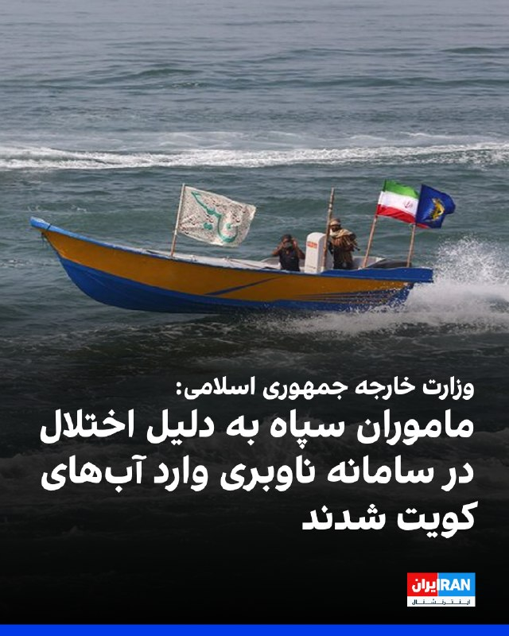

وزارت خارجه جمهوری اسلامی بازداشت چهار عضو سپاه پاسداران در کویت را تایید کرد و گفت این ماموران به دلیل «اختلال ایجاد شده در سامانه ناوبری»، وارد آب‌های کویت شده بودند. این وزارتخانه اعلام کویت مبنی بر نفوذ این ماموران برای انجام «اقدام خصمانه» را بی‌اساس خواند و خواستار آزادی آن‌ها شد.
‌🏁 🇬🇧 IranintlTV

🤖 @VahidOOnLine

## VahidOOnLine — post 239864

  

♦️یک روز پس از وقوع ۹ زمین‌لرزه و پس‌لرزه در شرق تهران، یک کارشناس زمین‌شناسی گفت این لرزه‌های کوچک، ممکن است مقدمه رویداد بزرگ‌تری باشند.

به گزارش خبرگزاری مهر، وابسته به سازمان تبلیغات اسلامی، مهدی زارع، زلزله‌شناس و استاد پژوهشگاه بین‌المللی زلزله‌شناسی و مهندسی زلزله با اشاره به زمین‌لرزه به بزرگی ۷.۱ در قرن نوزدهم در گسل شرق تهران گفت: «وقوع زلزله‌های ۴ ریشتری اخیر در ۲۸ فروردین و ۲۲ اردیبهشت در پردیس نشان از تخلیه انرژی دارد. وقوع زمین‌لرزه‌های کوچک به صورت مستمر، بخشی از انرژی گسل را تخلیه می‌کند، ولی این لرزه‌ها می‌توانند نشانه‌ای از ناپایداری در پهنه‌ای وسیع‌تر باشند که مقدمه رویداد بزرگتری است.

به عبارت دیگر، لرزه‌های خرد و متوسط، هرچند تا حدی تنش را کاهش می‌دهند، اما نمی‌توانند به طور قطع احتمال وقوع یک زلزله بزرگ را منتفی کنند. در برخی موارد، چنین توالی‌هایی می‌توانند پیش‌لرزه (foreshock) باشند.»
‌🇸🇦 Indypersian

🤖 @VahidOOnLine

## VahidOOnLine — post 239863

⭕️اجرای هنری «سوگ سیاوش» در اعتراض به اعدام جوانان ایران‌زمین در شهر کلن

♦️تصاویری که روز سه‌شنبه ۲۲ اردیبهشت برای ایندیپندنت فارسی ارسال شده نشان می‌دهد، جانان الماسی، شاعر حماسی و رقصنده، در گردهمایی سراسری ایرانیان در شهر کلن، غم‌نامه «سوگ سیاوش» فردوسی را همراه با رقصی در اعتراض به اعدام معترضان در ایران اجرا کرد.

این برنامه روز یکشنبه ۲۰ اردیبهشت‌ماه در شهر کلن آلمان برگزار شد.
‌🇸🇦 Indypersian

🤖 @VahidOOnLine

## VahidOOnLine — post 239862

  

♦️پس از ۷۵ روز قطعی اینترنت در ایران و در حالیکه اعتراض‌ها به این رکوردشکنی جمهوری اسلامی بالا گرفته است، مسعود پزشکیان روز چهارشنبه ۲۳ اردیبهشت، محمدرضا عارف را به‌عنوان «رئیس ستاد ویژه ساماندهی و راهبری فضای مجازی» منصوب کرد.

پزشکیان ساعاتی پیش از این با انتشار پیامی در اکس نوشته بود «با در نظر گرفتن «حساسیت‌های حکمرانی و نظر رهبری»، در قالب «ساختاری چابک»، موجبات خدمت‌رسانی بهتر دولت و تحقق انتظارات عمومی را فراهم کند.»

پزشکیان توضیح نداد که ساختار چابک مورد نظر او، شامل وصل کامل اینترنت و ارتباطات می‌شود یا قصد دارد خدمات الکترونیکی دولت را روی شبکه ملی اینترنت (نسخه محدود داخلی) گسترده‌تر کند.
‌🇸🇦 Indypersian

🤖 @VahidOOnLine

## VahidOOnLine — post 239861

  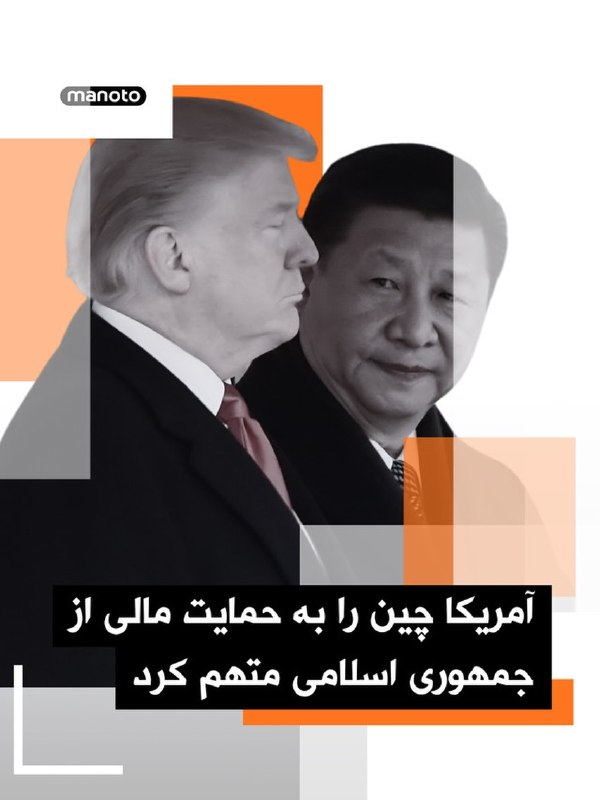

هم‌زمان با سفر دونالد ترامپ به چین و آغاز گفت‌وگوها درباره جنگ جمهوری اسلامی و اسرائیل، مقام‌های آمریکایی پکن را متهم کردند که با خرید گسترده نفت ایران، به «بزرگ‌ترین حامی دولتی تروریسم» کمک مالی می‌کند.

دونالد ترامپ امروز برای دیدار با شی جین‌پینگ، رئیس‌جمهوری چین، راهی پکن شد؛ دیداری که جنگ جمهوری اسلامی و اسرائیل و بحران تنگه هرمز از محورهای اصلی آن عنوان شده است.

در آستانه این سفر، اسکات بسنت، وزیر خزانه‌داری آمریکا، از چین خواست جمهوری اسلامی را برای بازگشایی تنگه هرمز تحت فشار قرار دهد و گفت پکن با خرید نفت ایران، «بزرگ‌ترین حامی دولتی تروریسم» را تأمین مالی می‌کند.

وزیر خزانه‌داری آمریکا در گفت‌وگو با فاکس‌نیوز گفت: «ببینیم آیا چین حاضر است از دیپلماسی استفاده کند و جمهوری اسلامی را وادار به باز کردن تنگه کند یا نه.»

چین تاکنون در قبال جنگ موضعی محتاطانه اتخاذ کرده و فراتر از انتقاد از آمریکا و اسرائیل، نقش مستقیمی در حل بحران ایفا نکرده است.
این دیدار در شرایطی برگزار می‌شود که تنش‌ها در منطقه، امنیت انرژی چین و تجارت جهانی از مسیر تنگه هرمز را تحت تأثیر قرار داده است.
‌🏁 🇬🇧 ManotoTV

🤖 @VahidOOnLine

## VahidOOnLine — post 239860

  

کامران غضنفری، نماینده مجلس، آمارهای مربوط به خسارت‌های قطع اینترنت در ایران را «جوسازی» خواند و گفت: «۵۰ میلیون نفر در پلتفرم‌های ایرانی هستند و هیچ مشکلی ندارند.»

او گفت: «قطع اینترنت اصلا مختص ایران نیست. ترکیه و کشورهای اروپایی که مانند ما درگیر جنگ نشده‌اند، به محض کوچک‌ترین مشکل امنیتی اینترنت بین‌الملل مردم خود را قطع می‌کنند.»
‌🏁 🇬🇧 IranintlTV

🤖 @VahidOOnLine

## VahidOOnLine — post 239859

  

رویترز به نقل از مقام‌های غربی و جمهوری اسلامی گزارش داد عربستان سعودی در جریان گسترش جنگ منطقه‌ای، در واکنش به حملاتی در خاک این کشور، چندین حمله اعلام‌نشده علیه جمهوری اسلامی انجام داده است.

رویترز در گزارشی اختصاصی نوشت عربستان سعودی، در اقدامی بی‌سابقه، حملات محرمانه‌ای را علیه جمهوری اسلامی انجام داده است.

به گفته دو مقام غربی مطلع و دو مقام جمهوری اسلامی، این حملات در واکنش به حملاتی صورت گرفته که در جریان جنگ در خاک عربستان انجام شده بود.

این حملات که پیش‌تر رسانه‌ای نشده بود، نخستین مورد شناخته‌شده از اقدام مستقیم نظامی عربستان در خاک ایران به شمار می‌رود؛ اقدامی که به نوشته رویترز نشان می‌دهد ریاض در دفاع از خود در برابر جمهوری اسلامی، رویکردی تهاجمی‌تر در پیش گرفته است.
‌🏁 🇬🇧 ManotoTV

🤖 @VahidOOnLine

## VahidOOnLine — post 239858

  <a href="telegram/content/VahidOOnLine_239858_1778660837.mp4" target="_blank">🎬 Download video</a>

ویدیوهای ارسال‌شده به ایران‌اینترنشنال نشان می‌دهند گروهی از ایرانیان مقیم آلمان سه‌شنبه ۲۲ اردیبهشت‌ماه در اعتراض به اعدام‌های جمهوری اسلامی، در شهر هانوفر پرفورمنس اعتراضی برگزار کردند.
‌🏁 🇬🇧 IranintlTV

🤖 @VahidOOnLine

## VahidOOnLine — post 239857

  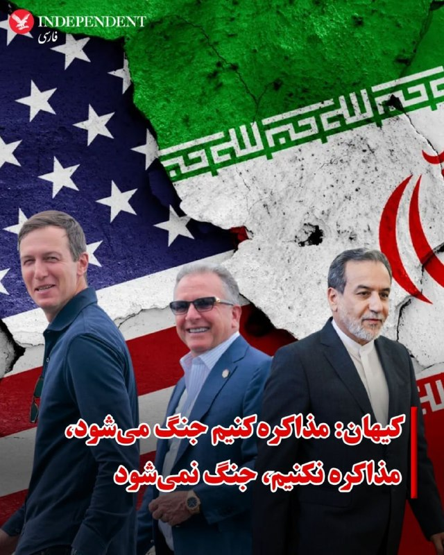

♦️روزنامه کیهان تهران روز چهارشنبه ۲۳ اردیبهشت در یادداشتی نوشت پذیرش دوباره مذاکره با آمریکا، «پالس ضعف به دشمن» می‌فرستد و باعث از سرگیری جنگ می‌شود.
کیهان در این یادداشت ادعا کرد که با وجود ضربات سنگین آمریکا و اسرائیل و کشته شدن بخش بزرگی از رهبران سیاسی و نظامی جمهوری اسلامی، «ایران برخلاف پیش‌بینی‌ها، تسلیم نشد.»
این روزنامه تحت نظر حسین شریعتمداری نوشت: «ایران نه‌تنها تسلیم نشد بلکه گلوی ترامپ را در تنگه هرمز بیشتر فشرد و فشار اقتصادی علیه محاسبات او را شدت بخشید.
تنها چیزی که آمریکا را عقب می‌راند، ماندگاری عبرت‌های دردناک جنگ اخیر و احتمال تکرار شدیدتر آن در آینده است
آنها می‌دانند زدن زیرساخت‌های ایران یعنی انهدام آرامکوی عربستان، فجیره امارات و دیگر تاسیسات منطقه.»
‌🇸🇦 Indypersian

🤖 @VahidOOnLine

## VahidOOnLine — post 239856

♦️گفتگوی جنجالی سه تن از ملی‌پوشان فوتبال ایران درباره میزان تحصیلات دانشگاهی که روز دوشنبه ۲۱ اردیبهشت از صداوسیما پخش شد، دست‌مایه طنز کاربران شبکه‌های اجتماعی قرار گرفت.

در این گفتگو، یکی از ملی‌پوشان در پاسخ به سوال مجری که پرسیده بود «در کدام دانشگاه درس می‌خوانی؟» گفت: «نمی‌دانم، الان حضور ذهن ندارم».

در دوره قبلی جام جهانی نیز انتشار ویدیویی از دروازه‌بان تیم ملی فوتبال ایران که گفته بود «من دکترا دارم»، بحث‌برانگیز شده بود؛ دکترایی که بعدها مشخص شد به‌صورت غیرحضوری در رشته تربیت بدنی دانشگاه پیام نور اخذ شده است.
‌🇸🇦 Indypersian

🤖 @VahidOOnLine

## VahidOOnLine — post 239855

  

♦️کیم یونگ هیون، مشاور امنیت ملی ریاست جمهوری کره جنوبی، روز چهارشنبه ۲۳ اردیبهشت ماه اعلام کرد این کشور در حال بررسی شرکت در عملیات بازگشایی تنگه هرمز و آزادی کشتیرانی در این آبراهه راهبردی به رهبری ایالات متحده آمریکا است.

این موضع در حالی اظهار می‌شود که هفته گذشته و پس از برخورد دو پهپاد به یک کشتی باری کره جنوبی در زمان عبور از تنگه هرمز، دونالد ترامپ به سئول پیشنهاد کرد تا به «پروژه آزادی» تنگه هرمز بپیوندد.

وزارت امور خارجه کره جنوبی دو روز پیش با انتشار گزارشی اعلام کرد هنوز نمی‌تواند با اطمینان بگوید که این پهپادها از سوی ایران شلیک شده بودند یا نه.
‌🇸🇦 Indypersian

🤖 @VahidOOnLine

## VahidOOnLine — post 239854

  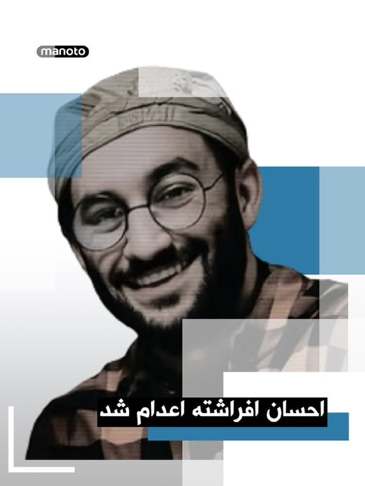

رسانه‌های حکومتی بامداد امروز از اعدام احسان افراشته خبر دادند.

قوه قضاییه جمهوری اسلامی اعلام کرده احسان افراشته، فرزند مصطفی، با اتهام‌هایی از جمله «جاسوسی» و «همکاری اطلاعاتی به نفع اسرائیل» بازداشت، محاکمه و پس از تایید حکم در دیوان عالی کشور اعدام شده است.

با این حال، نهادهای حقوق بشری و منابع مستقل پیش‌تر گزارش داده بودند که احسان افراشته ماه‌ها در سلول انفرادی نگهداری شده و اعترافات او تحت فشار و در شرایطی غیرشفاف اخذ شده است. همچنین گزارش‌هایی درباره محرومیت او از دسترسی مؤثر به وکیل مستقل و وجود فشارهای امنیتی در روند پرونده منتشر شده بود.

بر اساس اصول دادرسی عادلانه، هر اعترافی که تحت فشار، تهدید یا شکنجه گرفته شود فاقد اعتبار حقوقی است و متهم، به‌ویژه در پرونده‌های منتهی به مجازات اعدام، باید از حق دسترسی کامل به وکیل مستقل و دادگاه بی‌طرف برخوردار باشد.

پرونده احسان افراشته از سوی نهادهای حقوق بشری نمونه‌ای از استفاده از اتهام‌های امنیتی و مجازات اعدام در فضایی غیرشفاف توصیف شده؛ روندی که سال‌هاست درباره عملکرد دادگاه‌های انقلاب جمهوری اسلامی مورد انتقاد قرار دارد.
‌🏁 🇬🇧 ManotoTV

🤖 @VahidOOnLine

## VahidOOnLine — post 239853

  <a href="telegram/content/VahidOOnLine_239853_1778660843.mp4" target="_blank">🎬 Download video</a>

یک مقام ارشد نیروی دریایی سپاه پاسداران اعلام کرد جمهوری اسلامی تعریف خود از تنگه هرمز را گسترش داده و این منطقه اکنون به یک «محدوده عملیاتی وسیع» تبدیل شده است.

به گفته این مقام نظامی، محدوده عملیاتی تنگه هرمز دیگر تنها به آبراه باریک میان ایران و عمان محدود نیست و اکنون بخش گسترده‌ای از آب‌های اطراف، از جاسک تا جزایر تنب را شامل می‌شود.

رسانه‌های حکومتی گزارش داده‌اند محدوده‌ای که جمهوری اسلامی آن را منطقه عملیاتی تنگه هرمز می‌داند، از حدود ۲۰ تا ۳۰ مایل دریایی در گذشته، به ۲۰۰ تا ۳۰۰ مایل افزایش یافته است.

این اظهارات در حالی مطرح می‌شود که تنش‌ها در خلیج فارس ادامه دارد و نگرانی‌ها درباره امنیت عبور نفتکش‌ها و کشتی‌های تجاری از تنگه هرمز افزایش یافته است.
‌🏁 🇬🇧 ManotoTV

🤖 @VahidOOnLine

## VahidOOnLine — post 239852

  <a href="telegram/content/VahidOOnLine_239852_1778660844.mp4" target="_blank">🎬 Download video</a>

هم‌زمان با سفر رسمی دونالد ترامپ به چین، گروهی از مدیران ارشد بزرگ‌ترین شرکت‌های فناوری، مالی و صنعتی آمریکا نیز او را در این سفر همراهی می‌کنند. کاخ سفید اعلام کرده ایلان ماسک نیز در هواپیمای ریاست‌جمهوری آمریکا حضور دارد و همراه هیئت آمریکایی راهی پکن شده است.
در میان چهره‌های حاضر در این سفر، نام تیم کوک مدیرعامل اپل، جنسن هوانگ مدیرعامل انویدیا، لری فینک مدیرعامل بلک‌راک، دیوید سولومون مدیرعامل گلدمن ساکس و مدیران شرکت‌هایی چون بوئینگ، کوالکام، ویزا، مسترکارت، متا، مایکرون و سیتی‌گروپ دیده می‌شود.
رسانه‌های آمریکایی گزارش داده‌اند که محور اصلی این سفر، گفت‌وگو درباره روابط تجاری، فناوری، هوش مصنوعی، زنجیره تأمین جهانی و همکاری‌های اقتصادی میان آمریکا و چین است.
این سفر در حالی انجام می‌شود که روابط واشینگتن و پکن در ماه‌های اخیر بر سر مسائل تجاری، رقابت فناوری و تنش‌های ژئوپولیتیکی با چالش‌های گسترده‌ای روبه‌رو بوده است.
‌🏁 🇬🇧 ManotoTV

🤖 @VahidOOnLine

## VahidOOnLine — post 239851

  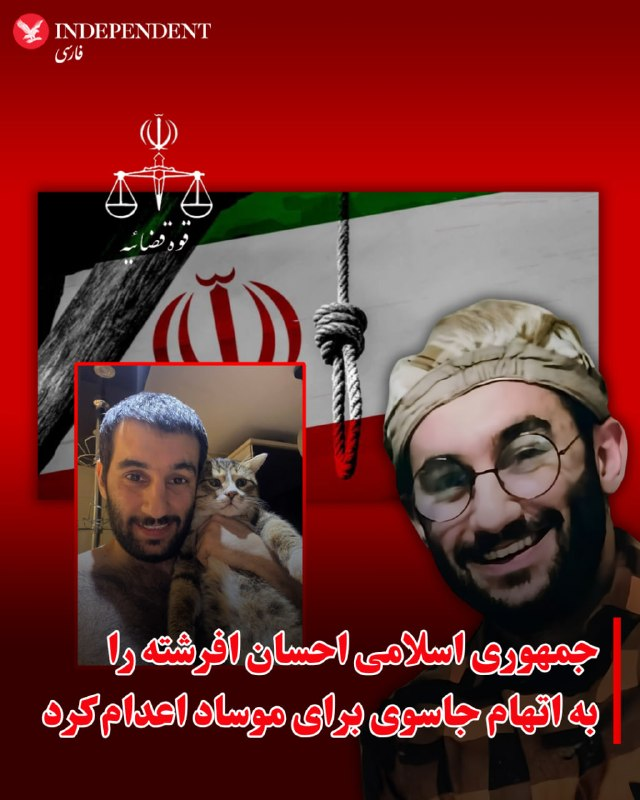

♦️قوه قضائیه جمهوری اسلامی روز چهارشنبه ۲۳ اردیبهشت ماه اعلام کرد احسان افرشته را «به‌جرم» جاسوسی برای موساد، سازمان اطلاعات خارجی اسرائیل اعدام کرده است.

برخی نهادهای حقوق بشری گزارش کرده‌اند که احسان افرشته ۳۱ ساله، فارغ‌التحصیل مهندسی عمران و کارشناس فناوری اطلاعات و ساکن ترکیه بوده است.

قوه قضائیه ادعا کرده است  که احسان افرشته پس از تماس با ماموران موساد ابتدا در یک تاکسی اینترنتی و پس از آن با شروع به‌کار در یک شرکت وابسته به صنایع دفاع برای اسرائیل جاسوسی می‌کرده است.

از زمان آغاز جنگ اخیر آمریکا و اسرائیل با جمهوری اسلامی، بیش از ۲۰ نفر به اتهام‌های همکاری با سرویس‌های امنیتی بیگانه، شرکت در انقلاب ملی ایرانیان و عضویت در گروه‌های «تروریستی» اعدام شده‌اند.
‌🇸🇦 Indypersian

🤖 @VahidOOnLine

## VahidOOnLine — post 239850

  

خبرگزاری میزان، رسانه قوه قضاییه جمهوری اسلامی، اعلام کرد حکم اعدام احسان افرشته، زندانی سیاسی، به اتهام «جاسوسی و همکاری اطلاعاتی به نفع اسرائیل» صادر شده است.

احسان افرشته، متولد ۱۳۷۲ و اهل اصفهان، دانش‌آموخته کارشناسی ارشد مهندسی عمران و متخصص شبکه و فناوری اطلاعات بود. او اوایل سال ۱۴۰۳، پس از بازگشت از ترکیه به ایران، از سوی نیروهای امنیتی بازداشت شد.

او چندین ماه در سلول انفرادی بازداشتگاه‌های امنیتی تحت بازجویی و فشار روانی قرار داشت و در مهر همان سال به بند عمومی زندان اوین منتقل شد.

کانون حقوق بشر ایران پیشتر اعلام کرده بود که اتهام «جاسوسی برای اسرائیل» علیه احسان افرشته بر پایه اعترافات اجباری تحت شکنجه طرح شده و هیچ مدرک معتبری در پرونده وجود ندارد.
‌🏁 🇬🇧 IranintlTV

🤖 @VahidOOnLine

## VahidOOnLine — post 239849

♦️در حالیکه اعتراض‌های گسترده به بیش از ۷۰ روز قطعی اینترنت در ایران ادامه دارد، علی کیافی‌فر، متخصص امنیت اطلاعات در نشستی درباره تاثیرات خاموشی دیجیتال بر کسب و کارها، رابطه میان این روند با امنیت را به‌شدت رد کرد.

کیایی فر که در میزگرد رسانه‌ آنلاین روزنامه دنیای اقتصاد صحبت می‌کرد با تاکید بر اینکه «قطع اینترنت امنیت را کمتر می‌کند و نه بیشتر»، گفت: «در جنگ ۱۲ روزه، نوبیتکس، بانک پاسارگاد، بانک سپه و بانک مرکزی از داخل خود ایران هک شدند. مثلا نوبیتکس توسط یک سرور زامبی تو یک مدرسه‌ی علمیه خواهران در قم هک شد.»

جمهوری اسلامی همزمان با حمله آمریکا و اسرائیل به ایران و آغاز جنگ، دسترسی کاربران به اینترنت بین‌المللی را قطع کرد.
همزمان با هفتادوسومین روز قطع اینترنت جهانی در ایران، حسین افشین، معاون علمی و فناوری مسعود پزشکیان، در مصاحبه‌ با خبرگزاری جوان با اشاره به اینکه «در شرایط جنگی هم بستن اینترنت نمی‌تواند راهکار باشد» گفت: «دیدیم وقتی اینترنت کاملا بسته بود، ترورها همچنان وجود داشت.»
‌🇸🇦 Indypersian

🤖 @VahidOOnLine

## VahidOOnLine — post 239848

  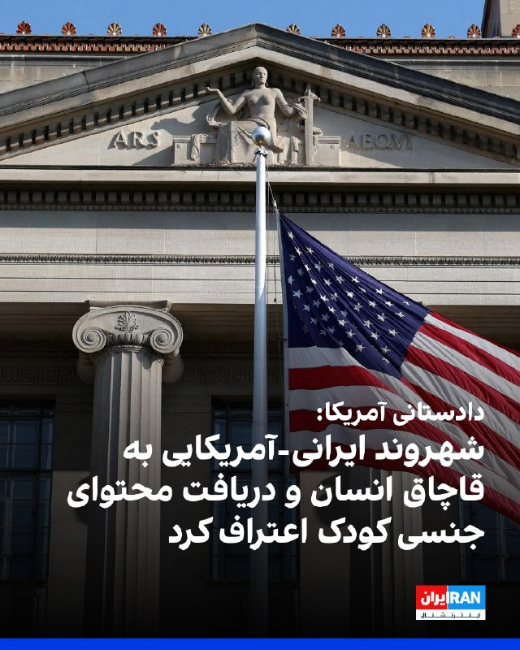

دادستانی آمریکا اعلام کرد شارون گوهری، شهروند ایرانی-آمریکایی، در دادگاه بروکلین به اتهام قاچاق غیرقانونی افراد به آمریکا و دریافت محتوای حاوی سوءاستفاده جنسی از کودکان اعتراف کرده است.

بر اساس این پرونده، او با دریافت پول از اتباع ایرانی، قاچاق غیرقانونی به آمریکا را از مسیرهایی از جمله مکزیک سازماندهی کرده و ورود دست‌کم یک فرد مرتبط با سپاه پاسداران را نیز تسهیل کرده است.

مقام‌های فدرال آمریکا می‌گویند در تحقیقات، ویدیوهای حاوی آزار کودکان خردسال و تصاویر تعقیب پنهانی زنان در شهر نیویورک نیز در دستگاه‌های متهم کشف شده است.

گوهری در صورت محکومیت با حداقل پنج سال و حداکثر ۲۰ سال زندان برای اتهام محتوای سوءاستفاده جنسی از کودک و همچنین تا ۱۰ سال زندان برای قاچاق انسان روبه‌رو است.
‌🏁 🇬🇧 IranintlTV

🤖 @VahidOOnLine

## VahidOOnLine — post 239847

  <a href="telegram/content/VahidOOnLine_239847_1778660848.mp4" target="_blank">🎬 Download video</a>

⭕️هواپیمای غول‌پیکر نظامی سی-۱۷ آمریکا در آستانه سفر ترامپ در پکن فرود آمد

♦️یک فروند هواپیمای ترابری نظامی سی-۱۷ متعلق به نیروی هوایی ارتش ایالات متحده در آستانه سفر دونالد ترامپ در پکن فرود آمد. احتمال این هواپیما حامل تجهیزات امنیتی، تیم‌های حفاظتی و دیگر دستگاه‌ها و موارد پشتیبانی برای  آماده‌سازی‌های ویژه برای این سفر دیپلماتیک ایجاد کرده است.

هواپیمای سی-۱۷ یکی از بزرگ‌ترین هواپیماهای ترابری راهبردی ارتش آمریکا به‌شمار می‌رود و توانایی حمل تجهیزات سنگین نظامی، نیرو و سامانه‌های پشتیبانی ویژه را دارد.
‌🇸🇦 Indypersian

🤖 @VahidOOnLine

## VahidOOnLine — post 239846

  <a href="telegram/content/VahidOOnLine_239846_1778660851.mp4" target="_blank">🎬 Download video</a>

مریخ‌نورد «پِرسیویرَنس» ناسا، پرسی، چهارشنبه ۲۰ اسفند ۱۴۰۴، هم‌زمان با ۱۷۹۷مین روز مریخی، ششمین سلفی خود را در غرب مریخ ثبت کرده است که از ترکیب ۶۱ تصویر جداگانه ساخته شده است.
ناسا می‌گوید این ناحیه از کهن‌ترین و علمی‌ترین مناطق این سیاره است و سنگ‌های آن می‌توانند سرنخ‌هایی از پوسته اولیه و تاریخ زمین‌شناسی مریخ به دست دهند.
‌🏁 🇬🇧 IranintlTV

🤖 @VahidOOnLine

## mwarmonitor — post 9017

  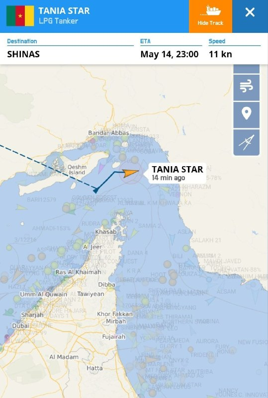

🚢کشتی گاز مایع (LPG) تحریم‌شده از سوی آمریکا با نام «TANIA STAR» (شماره IMO: 9134165) در حال عبور از تنگه هرمز است.

🔸این کشتی به‌دلیل تحویل گاز ایران به سری‌لانکا تحریم شده است.

@mwarmonitor

## mwarmonitor — post 9016

✈️ساعت ۰۹:۰۷ به وقت گرینویچ — TULLY 34 یک فروند بمب‌افکن B-52H به‌صورت تکی از RAF Fairford به پرواز درآمد.
در حال کار روی فرکانس Brize با 231.950 (ارتباط با RAF Brize Norton).

@mwarmonitor

## mwarmonitor — post 9015

  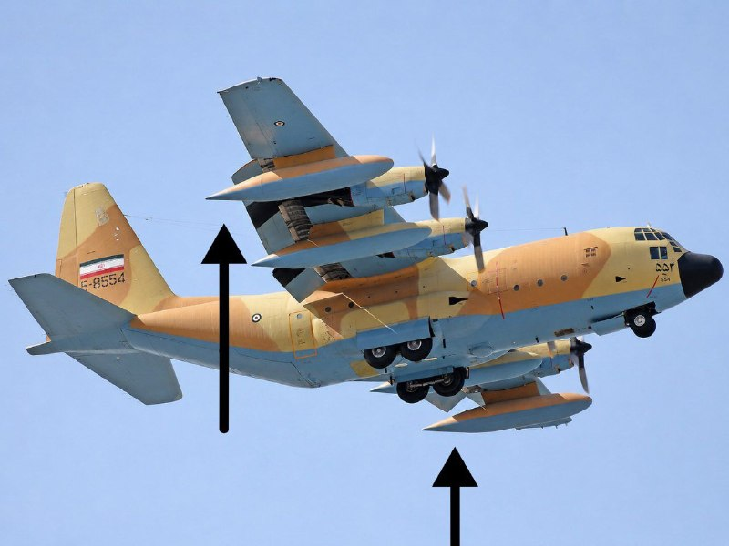

🔴شبکه NDTV تصاویر ماهواره‌ای با وضوح بالا (تهیه‌شده از شرکت Vantor) منتشر کرده است که به‌نظر می‌رسد گزارش‌ها مبنی بر پناه دادن پاکستان به دست‌کم یک فروند هواپیمای ترابری نظامی C-130H نیروی هوایی ایران در پایگاه هوایی نورخانِ نیروی هوایی پاکستان (PAF) را تأیید…

## mwarmonitor — post 9014

  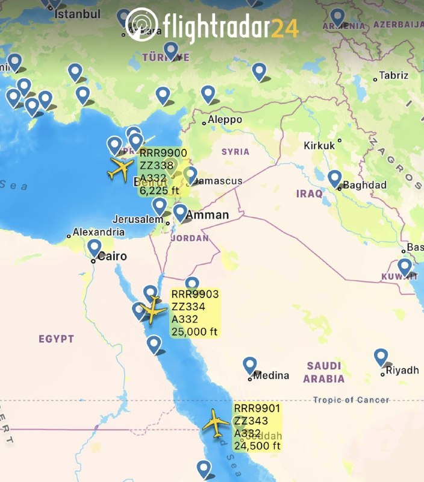

✈️🇬🇧نیروی هوایی سلطنتی بریتانیا (RAF)

ایرباس KC.2 Voyager ×۳
43C6FB ZZ338 – ASCOT 9900
43C700 ZZ343 – ASCOT 9901
43C6F7 ZZ334 – ASCOT 9902

✈️صبح امروز یک عملیات سوخت‌رسانی غیرمعمول از سوی نیروی هوایی سلطنتی بریتانیا در جریان است. سه فروند هواپیمای «ویجر» RAF با علائم پروازی متوالی در حال فعالیت بر فراز دریای سرخ هستند.

✈️پرواز ASCOT 9900 حدود ۸ ساعت پیش انجام شده و به نقطه‌ای نزدیک جده بر فراز دریای سرخ رسیده و برای مدت کوتاهی سیگنال خود را ارسال کرده است؛ هرچند ممکن است مسیر خود را فراتر از این نقطه ادامه داده باشد.

✈️به نظر می‌رسد ASCOT 9901 که حدود ۵ ساعت پیش به پرواز درآمده، جای آن را گرفته و پس از آن ASCOT 9902 که یک ساعت پیش برخاسته، به سمت محدوده‌ای حرکت می‌کند که 9901 در آن در حال ارسال سیگنال است.

📌هر آنچه در جریان است، طی ۸ ساعت گذشته به حضور مداوم هواپیماهای سوخت‌رسان بر فراز دریای سرخ نیاز داشته است.

@mwarmonitor

## mwarmonitor — post 9013

  <a href="telegram/content/mwarmonitor_9013_1778660855.mp4" target="_blank">🎬 Download video</a>

🐒 میمون سخنگو

📝 این دلقکِ رانتی که تخصصش «واپاشی عصبی» مخاطب است، پیشنهاد هجرت به افغانستان و سوریه را می‌دهد؛ انگار که ارث پدرش را از ما طلبکار است! اما زهی خیال باطل. ما جایی نمی‌رویم، اما برای تو برنامه‌ی ویژه‌ای داریم: در فردای آزادی، قفسی در باغ‌وحش ارم رزرو شده تا به عنوان تنها «میمون سخنگوی دست‌آموز»، به جای آنتن صداوسیما، در زادگاه اصلی‌ات به اجرای برنامه بپردازی.
🔹آنجا می‌توانی با همان لبخند کذایی، برای بازدیدکنندگانی که برایت موز پرت می‌کنند، از مزایای اینترنتِ نداشته‌ات بگویی و موجبات شادی ملت را در محلی که واقعاً به آن تعلق داری فراهم کنی. شک نکن که تماشای لرزشِ غبغب و واق‌واق کردن‌های نمایشی‌ات برای یک تکه نانِ رانتی، بهترین سوژه‌ی کمدی سیاه برای نسل‌های آینده خواهد بود. تو نه یک مجری، که یک زایده‌ی بدخیم در گلوی این سرزمینی که باید در همان قفسِ حقارت، درس عبرتی شوی برای هر که خیال می‌کند می‌تواند با وقاحت، نمک بر زخم ملت بپاشد. آن روز، مستر کارت و ویزا کارتی که به رُخ می‌کشی، تنها برای خریدن بلیت تماشای سقوطِ ذلت‌بار خودت در قعر زباله‌دان تاریخ به کارت خواهد آمد.

@mwarmonitor

## mwarmonitor — post 9012

🔴گزارش‌های اطلاعاتی ایالات متحده نشان می‌دهد که ایران، برخلاف ادعاهای رئیس‌جمهور ترامپ، همچنان از ظرفیت قابل‌توجهی در حوزه موشکی برخوردار است. نیویورک تایمز

@mwarmonitor

## pm_afshaa — post 90670

غضنفری:شواهد و قرائن نشان می‌دهد که آمریکا و اسرائیل قصد انجام یک عملیات گسترده برای تصرف برخی از جزایر جنوب را دارند

💧 Rainbet.com the #1 Non-KYC Crypto Casino & Sportsbook @rainbetcom

😁 @Pm_Afshaa

## pm_afshaa — post 90668

احسان افرشته امروز صبح توسط جمهوری تروریستی اسلامی اعدام شد

💧 Rainbet.com the #1 Non-KYC Crypto Casino & Sportsbook @rainbetcom

😁 @Pm_Afshaa

## pm_afshaa — post 90667

🔴ترامپ دوباره تأکید کرد که آمریکا برای پایان دادن به جنگ ایران نیازی به کمک ندارد و تأکید کرد که آمریکا یا به‌صورت مسالمت‌آمیز یا به روش‌های دیگر پیروز خواهد شد

💧 Rainbet.com the #1 Non-KYC Crypto Casino & Sportsbook @rainbetcom

😁 @Pm_Afshaa

## pm_afshaa — post 90666

  <a href="telegram/content/pm_afshaa_90666_1778660857.webm" target="_blank">🎬 Download video</a>

🔴ترامپ نقشه کشور ونزوئلا رو با طرح پرچم آمریکا و تیتر «پنجاه‌و‌یکمین ایالت» پست کرد :

💧 Rainbet.com the #1 Non-KYC Crypto Casino & Sportsbook @rainbetcom

😁 @Pm_Afshaa

## DEJradio — post 4606

  <a href="telegram/content/DEJradio_4606_1778660858.webm" target="_blank">🎬 Download video</a>

🔺📷 پیامدهای جنگ ۴۰ روزه؛ انهدام بوئینگ‌های نیروی هوایی ارتش و ایلیوشین‌های سـ.ـپاه در فرودگاه مهرآباد

طی جنگ ۴۰ روزه بارها به آشیانه و هواپیماهای ارتش و سـ.ـپاه حمله شد. به گفته حمیدرضا صناعی، معاون سازمان هواپیمایی کشوری بیشتر فرودگاه‌های ایران در جنگ آسیب دیدند. او همچنین گفت که ۱۵ هواپیمای مسافربری به طور مستقیم هدف حملات قرار گرفتند و نابود شدند و حدود ۲۰ درصد از ناوگان هوایی فعال کشور کاملا از چرخه خدمت‌رسانی خارج شدند.

همچنین بنابر گزارش‌های منتشرشده، دست‌کم حدود ۳۹ فروند هواپیمای نظامی و ترابری نظامی ایران نیز در این حملات منهدم شدند یا به شدت آسیب دیدند.

#جنگ۴۰روزه #فرودگاه_مهرآباد
@DEJradio

## DEJradio — post 4604

  <a href="telegram/content/DEJradio_4604_1778660859.webm" target="_blank">🎬 Download video</a>

🔺📷 در پی وقوع زمین‌لرزه‌ای به‌نسبت قوی در تهران، البرز و سمنان شماری از شهروندان ترجح دادند شب در خیابان بخوابند. به گزارش مرکز لرزه‌نگاری ایران، در نخستین ساعت بامداد چهارشنبه، ۲۳ اردیبهشت‌ماه، وقوع دو پس‌لرزه به‌ترتیب به بزرگی ۴ و ۳.۴ در پردیس، تهران را لرزاند. براساس گزارش فارس، این پس‌لرزه‌ها در ورامین، پاکدشت، پردیس و بخش‌هایی از شمیرانات حس شده است. پیش از این، زلزله به بزرگی ۴.۶ در مرز تهران و مازندران رخ داد که پردیس مرکز آن اعلام شد.

#زلزله #تهران
@DEJradio

## DEJradio — post 4603

  <a href="telegram/content/DEJradio_4603_1778660859.webm" target="_blank">🎬 Download video</a>

🚨
⭕️ در نشست سیاسی- امنیتی سالانه «پولیتیکو» که سه‌شنبه ۱۲ ما مه (۲۳ اردیبهشت به‌وقت ایران) برگزار شد، مجری از شاهزاده رضا پهلوی پرسید «ترامپ می‌گوید مطمئن نیست شما حمایت کافی داخل ایران داشته باشید... منتقدان هم ادعا می‌کنند شما توسط آمریکا و اسرائیل حمایت می‌شوید» که او پاسخ داد «میلیون‌ها ایرانی که به فراخوان من پاسخ دادند، سند زنده هستند که من حمایت عظیمی داخل ایران دارم. به محض اینکه رژیم فیلترینگ و قطعی اینترنت را بردارد، دنیا دقیقا خواهد شنید که مردم ایران چه می‌گویند.»

او افزود: «دقیقا قبل از آخرین قطعی اینترنت، پیام آخر من به میلیون‌ها نفر در داخل کشور رسید. فقط یک ویدیو اینستاگرامی بیش از ۹۰ میلیون بازدید داشت و بعد از قطع اینترنت به ۵-۶ میلیون رسید. هیچ دولت خارجی حق ندارد برای آینده ایران تصمیم بگیرد. این تصمیم تنها به عهده مردم ایران است. ما گروگان‌های زندانی هستیم که این رژیم برای ما ساخته. گاهی اوقات گروگان‌ها برای آزادی به کمک خارجی نیاز دارند. ما را حمایت کنید و ما خودمان کار را تمام می‌کنیم.»

#ترامپ #شاهزاده_رضا_پهلوی
@DEJradio

## DEJradio — post 4602

  <a href="telegram/content/DEJradio_4602_1778660860.webm" target="_blank">🎬 Download video</a>

🚨📢 شبکه «فاکس‌نیوز» سه‌شنبه ۲۲ اردیبهشت ۱۴۰۵ در گزارشی با اشاره به بن‌بست مذاکرات تهران و واشنگتن، پیش‌بینی کرد اگر ترامپ تصمیم بگیرد حملات به ایران از سر گرفته شود یا خیزش در داخل ایران بار دیگر شروع شود، بعضی از مقام‌های ارشد حکومت ایران به روسیه فرار کنند؛ مشابه کاری که برخی اطرافیان بشار اسد در سوریه انجام دادند.

فاکس‌نیوز در بخشی از این گزارش به وضعیت تقسیم قدرت در داخل ایران و موضوع جانشینی علی خامنه‌ای اشاره و این ایده را مطرح می‌کند که ساختار سیاسی جمهوری اسلامی طوری طراحی شده است که حتی در بحران‌های شدید هم بتواند ادامه پیدا کند، هرچند اختلاف و ابهام درباره آینده رهبری ممکن است بعضی جریان‌ها را به فکر خروج از کشور بیندازد.

بر اساس این تحلیل، مقام‌های رده‌بالای جمهوری اسلامی ممکن است به روسیه بروند، اما افراد رده‌پایین‌تر به کشورهایی مثل عراق یا افغانستان فرار کنند. در صورت فروپاشی احتمالی جمهوری اسلامی، شبکه‌های منطقه‌ای این رژیم از جمله گروه‌های نیابتی هم تضعیف خواهند شد.

#مذاکرات #جمهوری_اسلامی
@DEJradio

## VahidOnline — post 75439

یک اعدام دیگر
میزان خبرگزاری قوه قضاییه جمهوری اسلامی با انتشار تصاویر بالا نوشت: احسان افرشته اعدام شد
قوه قضاییه مدعی شده که: افرشته در نپال از سوی موساد آموزش جاسوسی دیده و اطلاعات حساس کشور را به اسرائیل می‌فروخت.

📡 @VahidOnline

## kianmeli1 — post 87375

‏🔴قوه قضاییه جمهوری اسلامی اعلام کرد که احسان افرشته به اتهام «همکاری با اسرائیل»، بامداد چهارشنبه اعدام شد
https://t.me/kianmeli1

## kianmeli1 — post 87374

  <a href="telegram/content/kianmeli1_87374_1778660861.mp4" target="_blank">🎬 Download video</a>

🔴وضعیت خیابان‌ها و پارک‌های پردیس پس از زلزله امشب
https://t.me/kianmeli1

## kianmeli1 — post 87373

  <a href="telegram/content/kianmeli1_87373_1778660864.mp4" target="_blank">🎬 Download video</a>

🔴حضور مردم در حاشیه شهر بومهن پس از وقوع زلزله امشب

برخی مردم در خیابان خوابیده اند
https://t.me/kianmeli1

## IranIntlTV — post 336946

  

🔻باشگاه ممفیس گریزلیز اعلام کرد که برندون کلارک، بازیکن این تیم، در ۲۹ سالگی درگذشت. علت مرگ او هنوز اعلام نشده است.

🔹کلارک که متولد ونکوور کانادا بود، در سال ۲۰۱۹ در دور نخست درفت ان‌بی‌ای انتخاب شد و از آن زمان برای ممفیس گریزلیز بازی می‌کرد. او در این فصل به دلیل مصدومیت تنها در دو مسابقه به میدان رفت.

🔹باشگاه ممفیس گریزلیز در بیانیه‌ای اعلام کرد: «برندون نه‌تنها هم‌تیمی فوق‌العاده‌ای بود، بلکه شخصیتی تاثیرگذار در باشگاه و جامعه ممفیس داشت و هرگز فراموش نخواهد شد.»

🔹کلارک در مجموع ۳۰۹ بازی در ان‌بی‌ای انجام داد و میانگین ۱۰.۲ امتیاز در هر مسابقه را ثبت کرد. او در سال ۲۰۲۰ نیز در تیم منتخب بازیکنان تازه‌وارد ان‌بی‌ای قرار گرفت.

🔹آدام سیلور، رییس ان‌بی‌ای، در واکنش به درگذشت کلارک گفت او یکی از محبوب‌ترین بازیکنان ممفیس گریزلیز بود و با «انرژی، اشتیاق و روحیه جنگندگی» بازی می‌کرد.

@iranintltvsport

## IranIntlTV — post 336945

  

وزارت خارجه جمهوری اسلامی بازداشت چهار عضو سپاه پاسداران در کویت را تایید کرد و گفت این ماموران به دلیل «اختلال ایجاد شده در سامانه ناوبری»، وارد آب‌های کویت شده بودند. این وزارتخانه اعلام کویت مبنی بر نفوذ این ماموران برای انجام «اقدام خصمانه» را بی‌اساس خواند و خواستار آزادی آن‌ها شد.
https://iranintl.com/202605131167

## IranIntlTV — post 336944

  <a href="telegram/content/IranIntlTV_336944_1778660869.mp4" target="_blank">🎬 Download video</a>

قوه قضاییه جمهوری اسلامی از اعدام احسان افراشته به اتهام «جاسوسی برای اسرائیل» خبر داد. اعدام افراشته در حالی انجام شده که پرونده او با گزارش‌هایی درباره فشارهای امنیتی، اعترافات اجباری و ابهام در روند دادرسی همراه بود.
گفت‌وگو با محمد مقیمی، وکیل دادگستری و کارشناس ارشد حقوق بشر
@iranintltv

## IranIntlTV — post 336943

  <a href="telegram/content/IranIntlTV_336943_1778660871.mp4" target="_blank">🎬 Download video</a>

همزمان با رد پیشنهاد ۱۴ ماده‌ای جمهوری اسلامی از سوی دونالد ترامپ، رییس‌جمهوری آمریکا و ادامه بسته ماندن تنگه هرمز، رسانه‌ها از افزایش احتمال درگیری نظامی دوباره میان تهران و واشینگتن خبر می‌دهند.
گفت‌وگو با روح‌الله رحیم‌پور، روزنامه‌نگار و تحلیل‌گر سیاسی
@iranintltv

## IranIntlTV — post 336942

  <a href="telegram/content/IranIntlTV_336942_1778660874.mp4" target="_blank">🎬 Download video</a>

میزان، خبرگزاری قوه قضاییه جمهوری اسلامی، از اجرای حکم اعدام احسان افرشته خبر داد.
کانون حقوق بشر ایران پیش‌تر اعلام کرده بود اتهام «همکاری با اسرائیل» علیه احسان افرشته بر پایه اعترافات اجباری تحت شکنجه مطرح شده و هیچ مدرک معتبری در پرونده او وجود ندارد.

گفت‌وگو با مجتبی هاشمی، روزنامه‌نگار و تحلیل‌گر سیاسی
@iranintltv

## IranIntlTV — post 336941

  <a href="telegram/content/IranIntlTV_336941_1778660877.mp4" target="_blank">🎬 Download video</a>

دولت پاکستان با صدور بیانیه‌ای گزارش‌ها درباره حضور هواپیماهای جمهوری اسلامی در پایگاه نورخان را تایید کرد، اما گفت: «ماموریت این هواپیماها نظامی نیست.»

جواد همدانی، خبرنگار ایران‌اینترنشنال، گزارش می‌دهد
@iranintltv

## IranIntlTV — post 336940

  

کامران غضنفری، نماینده مجلس، آمارهای مربوط به خسارت‌های قطع اینترنت در ایران را «جوسازی» خواند و گفت: «۵۰ میلیون نفر در پلتفرم‌های ایرانی هستند و هیچ مشکلی ندارند.»

او گفت: «قطع اینترنت اصلا مختص ایران نیست. ترکیه و کشورهای اروپایی که مانند ما درگیر جنگ نشده‌اند، به محض کوچک‌ترین مشکل امنیتی اینترنت بین‌الملل مردم خود را قطع می‌کنند.»
https://iranintl.com/202605131903

## IranIntlTV — post 336939

  <a href="telegram/content/IranIntlTV_336939_1778660880.mp4" target="_blank">🎬 Download video</a>

رهبران آمریکا و چین در حالی در پکن دیدار می‌کنند که پیامدهای جنگ ایران و حمایت‌های پکن از جمهوری اسلامی بر این نشست سایه انداخته است. آیا دو طرف در مورد ایران تعاملاتی خواهند کرد؟

گزارش توماج طاهباز، خبرنگار ایران‌اینترنشنال
@iranintltv

## IranIntlTV — post 336937

  <a href="https://t.me/IranintlTV/336937" target="_blank">📎 Download file</a>

🎧نسخه صوتی اخبار بامدادی | چهارشنبه ۲۳ اردیبهشت
@iranintlTV

## IranIntlTV — post 336936

  <a href="telegram/content/IranIntlTV_336936_1778660884.mp4" target="_blank">🎬 Download video</a>

جاویدنامان انقلاب ملی ایرانیان
«محمد نوری» نوجوان ۱۷ ساله اهل قم، ۱۲ دی‌ماه در جریان یورش نیروهای سرکوبگر خامنه‌ای به معترضان در میدان توحید این شهر، هدف شلیک مستقیم قرار گرفت و جان باخت. نامش در حافظه‌ این سرزمین می‌ماند و یادش چراغ راه آزادی‌خواهان است.
@iranintltv

## IranIntlTV — post 336935

  <a href="telegram/content/IranIntlTV_336935_1778660886.mp4" target="_blank">🎬 Download video</a>

ویدیوهای ارسال‌شده به ایران‌اینترنشنال نشان می‌دهند گروهی از ایرانیان مقیم آلمان سه‌شنبه ۲۲ اردیبهشت‌ماه در اعتراض به اعدام‌های جمهوری اسلامی، در شهر هانوفر پرفورمنس اعتراضی برگزار کردند.

## IranIntlTV — post 336934

  <a href="telegram/content/IranIntlTV_336934_1778660889.mp4" target="_blank">🎬 Download video</a>

محمدرضا شهبازی، مجری صداوسیمای جمهوری اسلامی، در واکنش به مقایسه‌ای که برخی شهروندان میان وضعیت اینترنت در ایران با اینترنت پرسرعت در افغانستان و آغاز استفاده از کارت‌های اعتباری بین‌المللی در سوریه انجام دادند، گفت: «اگر این چیزها برایتان مهم است، بروید در افغانستان و سوریه زندگی کنید.»

گفت‌وگو با رضا حاجی‌حسینی، روزنامه‌نگار
@iranintltv

## IranIntlTV — post 336933

  <a href="telegram/content/IranIntlTV_336933_1778660892.mp4" target="_blank">🎬 Download video</a>

نمایندگان کنگره آمریکا در نامه‌ای دوحزبی از دولت بریتانیا خواستند روند به‌رسمیت شناختن سپاه پاسداران به‌عنوان یک سازمان تروریستی را تسریع کند.

گفت‌وگو با امیر گیتی، عضو تحریریه ایران‌اینترنشنال
@iranintltv

## IranIntlTV — post 336932

  <a href="telegram/content/IranIntlTV_336932_1778660895.mp4" target="_blank">🎬 Download video</a>

امیر حمیدی، متخصص امنیت ملی، گفت تهران برای پکن یک متحد ایدئولوژیک نیست و چین از جمهوری اسلامی در روابط خود با ایالات متحده به‌عنوان یک کارت راهبردی استفاده می‌کند. او تاکید کرد چین حاضر نخواهد شد به‌خاطر جمهوری اسلامی وارد رویارویی خصمانه با آمریکا شود.
@iranintltv

## IranIntlTV — post 336931

  <a href="telegram/content/IranIntlTV_336931_1778660898.mp4" target="_blank">🎬 Download video</a>

وزارت کشور کویت اعلام کرد ۴ عضو سپاه پاسداران را هنگام تلاش برای ورود دریایی به این کشور بازداشت کرده است. وزارت خارجه کویت نیز اعلام کرد در همین رابطه، سفیر جمهوری اسلامی را احضار کرده است.

تروسکه صادقی، خبرنگار ایران‌اینترنشنال، گزارش می‌دهد
@iranintltv

## IranIntlTV — post 336929

  <a href="telegram/content/IranIntlTV_336929_1778660900.mp4" target="_blank">🎬 Download video</a>

استرالیا هم‌زمان با افزایش تنش‌ها در خاورمیانه، از آغاز یک مشارکت نظامی تازه برای حفاظت از حریم هوایی و امنیت کشتیرانی در منطقه خبر داد. وزیر دفاع استرالیا گفت اعزام هواپیمای پیشرفته «آواکس» می‌تواند به تضمین آزادی کشتیرانی در تنگه هرمز و امنیت تجارت بین‌المللی کمک کند.

علیرضا محبی، خبرنگار ایران‌اینترنشنال، گزارش می‌دهد
@iranintltv

## IranIntlTV — post 336928

  <a href="telegram/content/IranIntlTV_336928_1778660903.mp4" target="_blank">🎬 Download video</a>

سرخط خبرهای چهارشنبه ۲۳ اردیبهشت
@iranintltv

## IranIntlTV — post 336927

  

خبرگزاری میزان، رسانه قوه قضاییه جمهوری اسلامی، اعلام کرد حکم اعدام احسان افرشته، زندانی سیاسی، به اتهام «جاسوسی و همکاری اطلاعاتی به نفع اسرائیل» اجرا شده است.

احسان افرشته، متولد ۱۳۷۲ و اهل اصفهان، دانش‌آموخته کارشناسی ارشد مهندسی عمران و متخصص شبکه و فناوری اطلاعات بود. او اوایل سال ۱۴۰۳، پس از بازگشت از ترکیه به ایران، از سوی نیروهای امنیتی بازداشت شد.

او چندین ماه در سلول انفرادی بازداشتگاه‌های امنیتی تحت بازجویی و فشار روانی قرار داشت و در مهر همان سال به بند عمومی زندان اوین منتقل شد.

کانون حقوق بشر ایران پیشتر اعلام کرده بود که اتهام «جاسوسی برای اسرائیل» علیه احسان افرشته بر پایه اعترافات اجباری تحت شکنجه طرح شده و هیچ مدرک معتبری در پرونده وجود ندارد.
https://iranintl.com/202605131420

## IranIntlTV — post 336926

  

دادستانی آمریکا اعلام کرد شارون گوهری، شهروند ایرانی-آمریکایی، در دادگاه بروکلین به اتهام قاچاق غیرقانونی افراد به آمریکا و دریافت محتوای حاوی سوءاستفاده جنسی از کودکان اعتراف کرده است.

بر اساس این پرونده، او با دریافت پول از اتباع ایرانی، قاچاق غیرقانونی به آمریکا را از مسیرهایی از جمله مکزیک سازماندهی کرده و ورود دست‌کم یک فرد مرتبط با سپاه پاسداران را نیز تسهیل کرده است.

مقام‌های فدرال آمریکا می‌گویند در تحقیقات، ویدیوهای حاوی آزار کودکان خردسال و تصاویر تعقیب پنهانی زنان در شهر نیویورک نیز در دستگاه‌های متهم کشف شده است.

گوهری در صورت محکومیت با حداقل پنج سال و حداکثر ۲۰ سال زندان برای اتهام محتوای سوءاستفاده جنسی از کودک و همچنین تا ۱۰ سال زندان برای قاچاق انسان روبه‌رو است.
https://iranintl.com/202605134047

## IranIntlTV — post 336925

  <a href="telegram/content/IranIntlTV_336925_1778660907.mp4" target="_blank">🎬 Download video</a>

مریخ‌نورد «پِرسیویرَنس» ناسا، پرسی، چهارشنبه ۲۰ اسفند ۱۴۰۴، هم‌زمان با ۱۷۹۷مین روز مریخی، ششمین سلفی خود را در غرب مریخ ثبت کرده است که از ترکیب ۶۱ تصویر جداگانه ساخته شده است.
ناسا می‌گوید این ناحیه از کهن‌ترین و علمی‌ترین مناطق این سیاره است و سنگ‌های آن می‌توانند سرنخ‌هایی از پوسته اولیه و تاریخ زمین‌شناسی مریخ به دست دهند.

## Shin_Persian — post 5984

Shin ✓ @hey_itsmyturn
Wed, 13 May 2026 04:53:24 UTC

Ehsan Afreshte has been executed by Islamic Regime today. Regime claims he was trained by Mossad in Nepal and sold intelligence to Israel.
#Iran

فارسی

احسان افراشته امروز توسط رژیم اسلامی اعدام شد. رژیم مدعی است که او توسط موساد در نپال آموزش دیده و اطلاعات را به اسرائیل فروخته است.
#Iran

𝕏 · @shin_persian

## ManotoTV — post 105387

  

هم‌زمان با سفر دونالد ترامپ به چین و آغاز گفت‌وگوها درباره جنگ جمهوری اسلامی و اسرائیل، مقام‌های آمریکایی پکن را متهم کردند که با خرید گسترده نفت ایران، به «بزرگ‌ترین حامی دولتی تروریسم» کمک مالی می‌کند.

دونالد ترامپ امروز برای دیدار با شی جین‌پینگ، رئیس‌جمهوری چین، راهی پکن شد؛ دیداری که جنگ جمهوری اسلامی و اسرائیل و بحران تنگه هرمز از محورهای اصلی آن عنوان شده است.

در آستانه این سفر، اسکات بسنت، وزیر خزانه‌داری آمریکا، از چین خواست جمهوری اسلامی را برای بازگشایی تنگه هرمز تحت فشار قرار دهد و گفت پکن با خرید نفت ایران، «بزرگ‌ترین حامی دولتی تروریسم» را تأمین مالی می‌کند.

وزیر خزانه‌داری آمریکا در گفت‌وگو با فاکس‌نیوز گفت: «ببینیم آیا چین حاضر است از دیپلماسی استفاده کند و جمهوری اسلامی را وادار به باز کردن تنگه کند یا نه.»

چین تاکنون در قبال جنگ موضعی محتاطانه اتخاذ کرده و فراتر از انتقاد از آمریکا و اسرائیل، نقش مستقیمی در حل بحران ایفا نکرده است.
این دیدار در شرایطی برگزار می‌شود که تنش‌ها در منطقه، امنیت انرژی چین و تجارت جهانی از مسیر تنگه هرمز را تحت تأثیر قرار داده است.

## ManotoTV — post 105386

  

رویترز به نقل از مقام‌های غربی و جمهوری اسلامی گزارش داد عربستان سعودی در جریان گسترش جنگ منطقه‌ای، در واکنش به حملاتی در خاک این کشور، چندین حمله اعلام‌نشده علیه جمهوری اسلامی انجام داده است.

رویترز در گزارشی اختصاصی نوشت عربستان سعودی، در اقدامی بی‌سابقه، حملات محرمانه‌ای را علیه جمهوری اسلامی انجام داده است.

به گفته دو مقام غربی مطلع و دو مقام جمهوری اسلامی، این حملات در واکنش به حملاتی صورت گرفته که در جریان جنگ در خاک عربستان انجام شده بود.

این حملات که پیش‌تر رسانه‌ای نشده بود، نخستین مورد شناخته‌شده از اقدام مستقیم نظامی عربستان در خاک ایران به شمار می‌رود؛ اقدامی که به نوشته رویترز نشان می‌دهد ریاض در دفاع از خود در برابر جمهوری اسلامی، رویکردی تهاجمی‌تر در پیش گرفته است.

## ManotoTV — post 105385

  

رسانه‌های حکومتی بامداد امروز از اعدام احسان افراشته خبر دادند.

قوه قضاییه جمهوری اسلامی اعلام کرده احسان افراشته، فرزند مصطفی، با اتهام‌هایی از جمله «جاسوسی» و «همکاری اطلاعاتی به نفع اسرائیل» بازداشت، محاکمه و پس از تایید حکم در دیوان عالی کشور اعدام شده است.

با این حال، نهادهای حقوق بشری و منابع مستقل پیش‌تر گزارش داده بودند که احسان افراشته ماه‌ها در سلول انفرادی نگهداری شده و اعترافات او تحت فشار و در شرایطی غیرشفاف اخذ شده است. همچنین گزارش‌هایی درباره محرومیت او از دسترسی مؤثر به وکیل مستقل و وجود فشارهای امنیتی در روند پرونده منتشر شده بود.

بر اساس اصول دادرسی عادلانه، هر اعترافی که تحت فشار، تهدید یا شکنجه گرفته شود فاقد اعتبار حقوقی است و متهم، به‌ویژه در پرونده‌های منتهی به مجازات اعدام، باید از حق دسترسی کامل به وکیل مستقل و دادگاه بی‌طرف برخوردار باشد.

پرونده احسان افراشته از سوی نهادهای حقوق بشری نمونه‌ای از استفاده از اتهام‌های امنیتی و مجازات اعدام در فضایی غیرشفاف توصیف شده؛ روندی که سال‌هاست درباره عملکرد دادگاه‌های انقلاب جمهوری اسلامی مورد انتقاد قرار دارد.

## ManotoTV — post 105384

  <a href="telegram/content/ManotoTV_105384_1778660911.mp4" target="_blank">🎬 Download video</a>

یک مقام ارشد نیروی دریایی سپاه پاسداران اعلام کرد جمهوری اسلامی تعریف خود از تنگه هرمز را گسترش داده و این منطقه اکنون به یک «محدوده عملیاتی وسیع» تبدیل شده است.

به گفته این مقام نظامی، محدوده عملیاتی تنگه هرمز دیگر تنها به آبراه باریک میان ایران و عمان محدود نیست و اکنون بخش گسترده‌ای از آب‌های اطراف، از جاسک تا جزایر تنب را شامل می‌شود.

رسانه‌های حکومتی گزارش داده‌اند محدوده‌ای که جمهوری اسلامی آن را منطقه عملیاتی تنگه هرمز می‌داند، از حدود ۲۰ تا ۳۰ مایل دریایی در گذشته، به ۲۰۰ تا ۳۰۰ مایل افزایش یافته است.

این اظهارات در حالی مطرح می‌شود که تنش‌ها در خلیج فارس ادامه دارد و نگرانی‌ها درباره امنیت عبور نفتکش‌ها و کشتی‌های تجاری از تنگه هرمز افزایش یافته است.

## ManotoTV — post 105383

  <a href="telegram/content/ManotoTV_105383_1778660912.mp4" target="_blank">🎬 Download video</a>

هم‌زمان با سفر رسمی دونالد ترامپ به چین، گروهی از مدیران ارشد بزرگ‌ترین شرکت‌های فناوری، مالی و صنعتی آمریکا نیز او را در این سفر همراهی می‌کنند. کاخ سفید اعلام کرده ایلان ماسک نیز در هواپیمای ریاست‌جمهوری آمریکا حضور دارد و همراه هیئت آمریکایی راهی پکن شده است.
در میان چهره‌های حاضر در این سفر، نام تیم کوک مدیرعامل اپل، جنسن هوانگ مدیرعامل انویدیا، لری فینک مدیرعامل بلک‌راک، دیوید سولومون مدیرعامل گلدمن ساکس و مدیران شرکت‌هایی چون بوئینگ، کوالکام، ویزا، مسترکارت، متا، مایکرون و سیتی‌گروپ دیده می‌شود.
رسانه‌های آمریکایی گزارش داده‌اند که محور اصلی این سفر، گفت‌وگو درباره روابط تجاری، فناوری، هوش مصنوعی، زنجیره تأمین جهانی و همکاری‌های اقتصادی میان آمریکا و چین است.
این سفر در حالی انجام می‌شود که روابط واشینگتن و پکن در ماه‌های اخیر بر سر مسائل تجاری، رقابت فناوری و تنش‌های ژئوپولیتیکی با چالش‌های گسترده‌ای روبه‌رو بوده است.

## ManotoTV — post 105382

  <a href="telegram/content/ManotoTV_105382_1778660913.mp4" target="_blank">🎬 Download video</a>

‌
الجزیره به نقل از منابع دیپلماتیک گزارش داد ۱۱۲ کشور به پیش‌نویس قطعنامه‌ای در شورای امنیت سازمان ملل پیوسته‌اند که از سوی آمریکا و کشورهای خلیج فارس درباره آزادی کشتیرانی در تنگه هرمز ارائه شده است.

به گفته این منابع، هند، ژاپن و بیشتر کشورهای اروپایی در میان حامیان این پیش‌نویس قرار دارند.

منابع الجزیره همچنین گفتند حمایت ۱۱۲ کشور از این قطعنامه، نشان‌دهنده پشتیبانی گسترده بین‌المللی از ابتکار آمریکا و کشورهای خلیج فارس درباره تنگه هرمز است.

## ManotoTV — post 105380

  <a href="telegram/content/ManotoTV_105380_1778660914.mp4" target="_blank">🎬 Download video</a>

تماسی از تهران:
«می‌گفت جنگ شد و بعد رها شد… همه‌چیز روی هوا موند و شرایط افتضاح‌تر شد.
می‌گفت قبلش حداقل یه جور داشتیم زندگی می‌کردیم

## FarsiVOA — post 217597

  

داده‌های کشتی‌رانی نشان می‌دهد یک محموله نفتی ۶۸۰ هزار بشکه‌ای آزاد شده از ذخایر استراتژیک نفت آمریکا به مقصد ترکیه، وارد دریای مدیترانه شده است.

برای اولین بار است که ترکیه محموله نفتی آزاد شده از ذخایر استراتژیک نفت آمریکا را دریافت می‌کند.

آمریکا در قالب توافق با کشورهای عضو آژانس بین‌المللی انرژی متعهد به آزادسازی ۱۷۲ میلیون بشکه نفت از ذخایر استراتژیک خود برای مقابله با تبعات انسداد تنگه هرمز توسط جمهوری اسلامی شده است. در همین چهارچوب، تاکنون محموله‌هایی به ایتالیا و هلند ارسال شده است.
@FarsiVOA

## FarsiVOA — post 217596

  

خبرگزاری ایسنا از آزادی دبیر انجمن اسلامی دانشجویان دانشگاه تهران، پس از چند ساعت بازداشت خبر داد.

یاسین حسن‌زاده، دانشجوی ورودی ۱۴۰۰ مهندسی صنایع دانشگاه تهران و دبیر انجمن اسلامی دانشجویان دانشگاه تهران، ظهر روز سه‌شنبه ۲۲ اردیبهشت و با مراجعه‌ مأموران امنیتی به منزل خود بازداشت شده بود.

منابع حقوق بشری اعلام کردند که این بازداشت پس از انتشار بیانیه انتقادی انجمن اسلامی دانشجویان دانشگاه تهران نسبت به روند اعدام‌ها در ایران صورت گرفت.

در بخشی از این بیانیه، با انتقاد از «نبود شفافیت در روند قضایی» و «اجرای بی‌سر‌وصدای احکام اعدام»، از دستگاه قضایی خواسته شده بود تا اجرای احکام اعدام مرتبط با اعتراضات سیاسی متوقف شود.

خبرگزاری ایسنا، بدون ارائه توضیحاتی از زمان دقیق دستگیری و اتهامات این دانشجو، صبح چهارشنبه ۲۳ اردیبهشت اعلام کرد که خبرهای دریافتی از آزادی یاسین حسن‌زاده، دبیر انجمن اسلامی دانشجویان دانشگاه تهران و علوم پزشکی تهران حکایت می‌کند.
@FarsiVOA

## FarsiVOA — post 217595

🔺جمهوری اسلامی بازداشت چهار مأمور خود در کویت را تأیید کرد

▪️وزارت امور خارجه جمهوری اسلامی بازداشت چهار مأمور ایرانی در کویت را تأیید کرد، اما اتهام‌های مطرح‌شده از سوی دولت کویت درباره «تلاش برای انجام اقدامات خصمانه» را «مطلقاً بی‌اساس» خواند.

▪️ادعا شده این چهار نفر «در چارچوب مأموریت مرسوم گشت‌زنی دریایی» فعالیت می‌کردند و به دلیل «اختلال در سامانه ناوبری» وارد آب‌های سرزمینی کویت شده‌اند.

▪️کویت اعلام کرده این گروه قصد نفوذ به جزیره بوبیان را داشته و مأموریت آنها انجام اقدامات «خصمانه» علیه این کشور بوده است.

▪️مقام‌های کویتی گفته‌اند این افراد قصد داشتند از طریق دریا وارد کویت شوند و در بازجویی‌ها ارتباط خود با سپاه پاسداران را پذیرفته‌اند.

⬇️ بیشتر بخوانید:
https://ir.voanews.com/a/8149520.html

## FarsiVOA — post 217594

  

سازمان گزارشگران بدون مرز اعلام کرد «الناز محمدی»، روزنامه‌نگار ایرانی و دبیر گروه اجتماعی روزنامه «هم‌میهن»، در فهرست نامزدهای جایزه شجاعت این نهاد برای سال ۲۰۲۶ قرار گرفته است.

الناز محمدی به عنوان دبیر گروه اجتماعی روزنامه هم‌میهن، نقش مهمی در پوشش پیامدهای اجتماعی جنبش «زن، زندگی، آزادی» پس از جان باختن «مهسا امینی» در سال ۱۴۰۱ داشت، و گزارشگران بدون مرز او را نماد شجاعت در برابر سرکوب سیستماتیک آزادی مطبوعات در ایران توصیف کرده است.

خانم محمدی در بهمن ماه ۱۴۰۱ به اتهام «توطئه» و «تبانی» بازداشت و به سه سال زندان محکوم شد. گزارشگران بدون مرز همچنین اشاره کرده که او، همانند خواهر دوقلویش الهه محمدی، به دلیل فعالیت حرفه‌ای و بازتاب صدای مردم هدف فشارهای قضایی قرار گرفته است. الهه محمدی پس از انتشار گزارشی از کشته شدن مهسا امینی در بازداشت گشت ارشاد، بازداشت شده بود.

به گفته این سازمان، الناز محمدی با وجود زندان، فشارهای حقوقی و مجبور شدن به ترک شغل خود، همچنان به فعالیت حرفه‌ ای و دفاع از حق دسترسی آزاد به اطلاعات ادامه داده است.
@FarsiVOA

## FarsiVOA — post 217593

  

پاکستان می‌گوید ترکیه و قطر ممکن است به پیمان همکاری دفاعی متقابل میان اسلام‌آباد و ریاض بپیوندند؛ پیمانی که با توجه به جنگ ایران و آمریکا، می‌تواند آرایش امنیتی خاورمیانه و جنوب آسیا را تغییر دهد.

به گزارش بلومبرگ، خواجه آصف وزیر دفاع پاکستان، دوشنبه‌شب در یک برنامه تلویزیونی گفت این سازوکار دفاعی در حال نهایی شدن است و افزود اگر قطر و ترکیه نیز به توافق موجود بپیوندند، «تحولی خوشایند» خواهد بود.

پاکستان و عربستان سعودی پیش‌تر توافقی دفاعی امضا کرده بودند که بر اساس آن، هرگونه حمله به یکی از دو کشور، حمله به هر دو تلقی می‌شود. این توافق از زمان تشدید جنگ آمریکا با جمهوری اسلامی اهمیت بیشتری یافته و نگرانی‌ها درباره گسترش دامنه درگیری در خلیج فارس را افزایش داده است.

در چارچوب همین توافق، در شرایطی که پاکستان نقش میانجی را برای گفت‌وگوهای تهران و واشنگتن به دوش گرفته است، همزمان با مذاکرات اسلام‌آباد در ۲۲ فروردین یک نیروی نظامی پاکستانی، شامل جنگنده‌ها، در پایگاه هوایی ملک عبدالعزیز مستقر شد.
@FarsiVOA

## FarsiVOA — post 217592

  

داده‌های شرکت دریانوردی «مرین ترفیک» حاکی از سرگردانی یک کشتی حامل گاز مایع (ال‌ان‌جی) روسیه در آب‌های آسیایی سرگردان شده است.

بر اساس این گزارش، حدود یک ماه پیش کشتی «کونپنگ» روسیه که تحت تحریم بریتانیا و اوکراین قرار دارد، مسیر خود را از هنگ‌کنگ به هند تغییر داد، اما با امتناع هند از دریافت این محموله به خاطر تحریم‌ها، دوباره از آب‌های سنگاپور به مقاصد نامعلوم حرکت کرده است.

این گزارش نشان می‌دهد چگونه ریسک‌های مرتبط با رعایت تحریم‌ها حتی در شرایط کسری گسترده عرضه، بر جریان تجارت انرژی اثر می‌گذارد.
@FarsiVOA

## FarsiVOA — post 217591

  

جمهوری دومینیکن روز سه‌شنبه اعلام کرد که در چارچوب «تعهد به مبارزه با تروریسم»، سپاه پاسداران انقلاب اسلامی و گروه حزب‌الله لبنان را به‌عنوان سازمان‌های تروریستی طبقه‌بندی کرده است.

دومینیکن همچنین بر تعهد خود مبنی بر اجرای قطعنامه‌های شورای امنیت سازمان ملل متحد و همچنین گسترش همکاری‌ها با ایالات متحده آمریکا با هدف برقراری امنیت و ثبات تأکید کرده است.

ساعاتی پس از این اعلام گیدئون سعار، وزیر خارجه اسرائیل، با استقبال از این اقدام، آن را «پیامی روشن علیه سیاست‌های تروریستی جمهوری اسلامی و نیروهای نیابتی رژیم» توصیف کرد. دنی دانون، نماینده اسرائیل در سازمان ملل نیز با از جمهوری دومینیکن، در شبکه اجتماعی ایکس نوشت: «جهان به طور فزاینده‌ای درک می‌کند که تروریسم به رهبری جمهوری اسلامی، تهدیدی برای تمام جهان است.»

در هفته‌های گذشته، چند کشور دیگر از جمله آرژانتین، ترینیداد و توباگو و کاستاریکا، به جمع کشورهایی که سپاه پاسداران را یک سازمان تروریستی می‌دانند، اضافه شدند. ایالات متحده پیشتر در دور نخست ریاست‌جمهوری ترامپ در فروردین ۱۳۹۸، سپاه پاسداران را در فهرست گروه‌های تروریستی قرار داده بود.
@FarsiVOA

## FarsiVOA — post 217590

  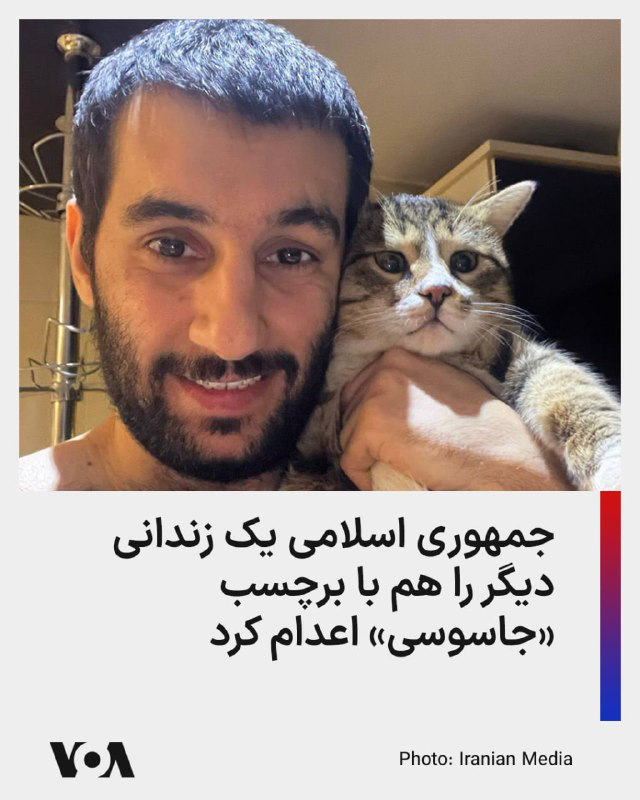

🔺قوه قضائیه از اعدام احسان افرشته به اتهام جاسوسی برای موساد خبر داد

▪️قوه قضائیه جمهوری اسلامی اعلام کرد بامداد چهارشنبه حکم اعدام احسان افرشته به اتهام «جاسوسی و همکاری اطلاعاتی» با موساد اجرا شده است.

▪️ادعا شده او پس از ارتباط اولیه در ترکیه، از سوی افسران موساد آموزش دیده و در سفر به نپال نیز آموزش حضوری دریافت کرده بود.

▪️همچنین ادعا شده افرشته پس از بازگشت به ایران به عنوان کارشناس سایبری در شرکتی وابسته به یک نهاد نظامی مشغول شده و اطلاعات مربوط به کارکنان، ساختار سازمانی و مأموریت‌های آن مجموعه را در اختیار عوامل اسرائیلی قرار داده بود.

▪️هرانا پیش‌تر نوشته بود که احسان افرشته، متخصص شبکه و فناوری اطلاعات بود که اوایل سال ۱۴۰۳ پس از بازگشت از ترکیه بازداشت شد.

⬇️ بیشتر بخوانید:
https://ir.voanews.com/a/8149519.html

## FarsiVOA — post 217589

🔺کاهش قیمت نفت در جهان همزمان با سفر پرزیدنت ترامپ به چین

▪️در حالی که سرمایه‌گذاران در انتظار تحولات مربوط به آتش‌بس شکننده میان ایالات متحده و جمهوری اسلامی و سفر دونالد ترامپ، رئیس جمهوری آمریکا، به پکن برای دیدار با شی جین‌پینگ، رئیس‌جمهوری چین، هستند، قیمت آتی نفت روز چهارشنبه ۲۳ اردیبهشت با کاهش رو‌به‌رو شده است.

⬇️ بیشتر بخوانید:
https://ir.voanews.com/a/oil-prices-slip-teetering-iran-ceasefire-trump-heads-china/8149515.html
@FarsiVOA

## FarsiVOA — post 217588

⚡️شیوع سویه خطرناک آندِس ویروس هانتا در یک کشتی تفریحی بین‌المللی بار دیگر نگرانی‌ها درباره بیماری‌های نوظهور را افزایش داده است. اکنون چندین کشور در حال انتقال و قرنطینه شهروندان خود هستند. ویروسی نادر که در مواردی حتی می‌تواند از انسان به انسان منتقل شود.
@FarsiVOA

## FarsiVOA — post 217587

⚡️تحقیقات تازه نشان می‌دهد جمهوری اسلامی و نیروهای وابسته به آن با استفاده از شبکه‌های اجتماعی، گروه‌های تبهکار، و نیروهای مزدور، دامنه عملیات جاسوسی و خرابکاری خود را در اروپا گسترش داده‌اند. شبکه‌ای پنهان که از تلگرام آغاز می‌شود و به خیابان‌های لندن و بروکسل می‌رسد.
@FarsiVOA

## FarsiVOA — post 217586

⚡️جمهوری اسلامی از چه طریقی توانسته است به جذب نیرو و تشکیل هسته‌هایی در کشورهای حوزه خلیج فارس اقدام کند؟ گفت‌وگو با حسن هاشمیان
@FarsiVOA

## FarsiVOA — post 217585

⚡️قانون‌گذاران کنگره آمریکا در آستانه دیدار پرزیدنت ترامپ و شی جین‌پینگ،‌ رهبران ایالات متحده و چین، دیدگاه‌های‌شان را درباره مهم‌ترین مسائل ژئوپلتیک - از جمله تنش‌های مرتبط با رژیم ایران، جنگ میان اوکراین و روسیه، و موضوع تایوان - بیان کردند.
@FarsiVOA

## FarsiVOA — post 217584

⚡️هشدار درباره بحران‌های فراروی ایران در آستانه تابستان؛ کم‌آبی، خاموشی، و پیامدهای منطقه‌ای
@FarsiVOA

## FarsiVOA — post 217583

⚡️پس‌لرزه‌های انتخابات محلی بریتانیا؛ بحران سیاسی برای استارمر
@FarsiVOA

## FarsiVOA — post 217582

⚡️گشت‌وگذار خبرنگار اسرائیلی در بغداد و اعتراف ارتش عراق به ایجاد پایگاه در صحرای نجف توسط اسرائیل
@FarsiVOA

## FarsiVOA — post 217581

⚡️پرزیدنت ترامپ: در چین گفتگوهای مفصلی در مورد اقدام نظامی علیه جمهوری اسلامی خواهیم داشت
@FarsiVOA

## FarsiVOA — post 217580

🔺انجمن قلم آمریکا: جمهوری اسلامی بزرگترین دشمن زنان اهل قلم و ایران دومین زندان نویسندگان جهان است

▪️انجمن قلم آمریکا، روز سه‌شنبه ۲۲ اردیبهشت در تازه‌ترین گزارش خود از «شاخص آزادی نوشتن» اعلام کرد جمهوری اسلامی ایران پس از چین، دومین زندان نویسندگان در جهان است و دو برابر میانگین جهانی، زنان اهل قلم را زندانی کرده است.

⬇️ بیشتر بخوانید:
https://ir.voanews.com/a/iran-pen-american-center-writers-prison/8149274.html
@FarsiVOA

## DW_Farsi — post 124638

  

📸 عکس روز: اثری هنری به نام "میدان سانی‌ساید"
 
ساکنان محلی در تقاطعی در پورتلند ایالت اورگن آمریکا اثری هنری آفریده‌اند به نام "میدان سانی‌ساید." این اثر که از بالا نشان داده شده خورشیدی است که انسان را به یاد گل آفتابگردان می‌اندازد. این هنر محله‌محور که نمونه‌ای از نقاشی کف خیابان است علاوه بر خلق زیبایی رانندگان را به کاهش سرعت ترغیب می‌کند تا محیطی ایمن‌تر برای عابران و دوچرخه‌سواران ایجاد شود و میزان سوانح و تنش‌های روزمره پایین بیاید.

@dw_farsi

## DW_Farsi — post 124637

🔶 زلزله ۴.۶ ریشتری، پس‌لرزه‌ها و طوفان در تهران
 
به گزارش خبرگزاری‌های داخلی ایران، یک زمین‌لرزه نسبتا شدید و پس‌لرز‌هایی آن تهران و مناطق پیرامونی را لرزاند. 
 
بنا بر گزارش‌های رسمی، این زلزله ساعت ۲۳ و ۴۶ دقیقه شامگاه سه‌شنبه ۲۲ اردیبهشت (۱۲ مه) به شدت ۴.۶ ریشتر در عمق ده کیلومتری زمین در حوالی بومهن روی داد. شهرستان‌های شمیرانات، پردیس و دماوند نیز تحت تأثیر این زمین‌لرزه قرار داشتند.
 
مرتضی رضایی، معاون امداد و نجات جمعیت هلال‌احمر استان تهران، به خبرگزاری ایسنا گفت، بامداد امروز چهارشنبه نیز دو پس‌لرزه به ثبت رسید که یکی از آنها به بزرگی ۴ ریشتر و دیگری ۲ ریشتر بود.
 
به گفته این مقام، بخش لواسانات بیشترین تأثیر را از این زمین‌لرزه داشته و بلافاصله پس از وقوع زلزله، تیم‌های عملیاتی و ارزیاب هلال‌احمر به مناطق اعزام شدند. به گفته او، تیم‌های عملیاتی همچنان در حال ارزیابی و پایش مناطق هستند.
 
رضایی اضافه کرد که "تاکنون هیچ‌گونه گزارشی مبنی بر تخریب، خسارت یا آسیب جانی دریافت نشده و مسیرهای ارتباطی در مناطق بومهن و لواسانات نیز بررسی شده که هیچ محدودیت یا مشکلی در تردد وجود ندارد".
 
بنا بر گزارش رسانه‌ها، رئیس اورژانس تهران و همچنین رئیس جمعیت هلال احمر پایتخت نیز بعد از وقوع حادثه به خبرگزاری‌ها گفتند که زلزله تاکنون مصدومی در پی نداشته است.
 
@dw_farsi

## DW_Farsi — post 124636

🔶 جام ۱۹۵۰؛ خوآن شیافینو، جادوگری که کابوس برزیل شد
 
خوآن آلبرتو شیافینو در جام جهانى ۱۹۵۰ در برزیل کارگردان و گلزن تیم ملی فوتبال اورگوئه بود و همچنین یکى از ستارگان درخشان آن دوره.

این مهاجم اورگوئه‌اى اگر چه در دیدار تیم ملى کشورش در مقابل بولیوى در دور اول ۴ گل از هشت گل اروگوئه را وارد دروازه حریف کرد، اما گل سرنوشت‌سازش را در  روز ۱۶ ژوئیه سال ۱۹۵۰ به ثمر رساند.

در این روز ۲۰۰ هزار نفر در استادیوم عظیم "ماراکانا" جمع شده بودند تا شاهد پیروزى تیم ملى برزیل بر اروگوئه در دیدار نهایی جام جهانى باشند.

تا دقیقه ۶۶ هم همه چیز بر وقف مراد پیش مى‌رفت، چون تا آن لحظه برزیل با تک‌گل فریاسا از اروگوئه جلو بود. در دقیقه ۶۶ شیافینو گل تساوى را به ثمر رساند و استادیوم را با این گل غرق در سکوت کرد.

۵ دقیقه بعد گیگیا، یکى از دیگر ستارگان اروگوئه گل دوم این تیم را به ثمر رساند و شکست برزیل را قطعى کرد. میزبان این بازی‌ها در غم و ماتم فرو رفت و اروگوئه با درخشش شیافینو عنوان قهرمانى جهان را جشن گرفت.
 
@dw_farsi

## DW_Farsi — post 124635

  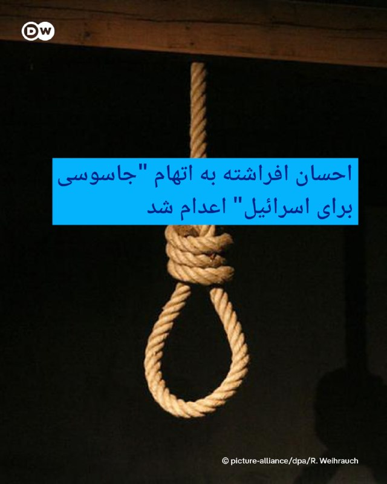

🔶 احسان افراشته به اتهام "جاسوسی برای اسرائیل" اعدام شد
 
به گزارش خبرگزاری "میزان"، وابسته به قوه قضائیه جمهوری اسلامی، حکم اعدام حسان افراشته، زندانی متهم به "جاسوسی برای اسرائیل" صبح روز چهارشنبه ۲۳ اردیبهشت به اجرا درآمد.
 
دستگاه قضایی ایران او را متهم کرده که "در نپال از سوی سازمان اطلاعات خارجی اسرائیل (موساد) مورد آموزش قرار گرفته و اطلاعاتی حساس در باره جمهوری اسلامی را در اختیار این کشور قرار می‌داده است."
 
حکم اعدام در مورد این زندانی در حالی به اجرا گذاشته شده که به گفته نهادهای حقوق بشری، پرونده او با ابهامات و گزارش‌هایی متعدد در مورد فشارهای امنیتی، اعترافات اجباری و نقض روند رسیدگی به اتهامات همراه بوده است.
 
احسان افراشته که متولد ۱۳۷۲ و دانش‌آموخته کارشناسی ارشد مهندسی عمران و متخصص فناوری اطلاعات بود، در اوایل سال ۱۴۰۳ پس از بازگشت از ترکیه بازداشت شد و مدت‌ها در حبس انفرادی به سر برد.
 
او در خرداد همان سال از سوی شعبه ۱۵ دادگاه انقلاب تهران به ریاست قاضی ابوالقاسم صلواتی به اتهام "جاسوسی" به اعدام محکوم شد.
 
افراشته اتهام‌های مطرح‌شده و اعترافات منتسب به خود را رد کرده بود.
@dw_farsi

## DW_Farsi — post 124634

  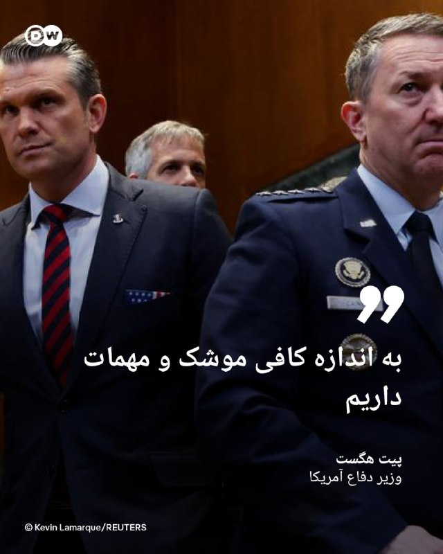

🔶 وزیر دفاع آمریکا: به اندازه کافی موشک و مهمات داریم
 
پیت هگست، وزیر دفاع آمریکا گمانه‌زنی‌ها در مورد "کاهش شدید" ذخایر موشکی و مهمات ایالات متحده را کم‌اهمیت جلوه داد.
 
او روز سه‌شنبه ۱۲ مه (۲۲ اردیبهشت) در جلسه استماع بودجه در کنگره این کشور تصریح کرد: «ما دقیقا می‌دانیم که از چه [تسلیحاتی] برخوردار هستیم. ما به اندازه کافی آنچه را که به آن نیازمندیم در دست داریم.»
 
رئیس پنتاگون بحث و گمانه‌زنی‌ها در مورد میزان ذخایر تسلیحاتی آمریکا را "ناسودمند و مبالغه‌آمیز" دانست.
 
ژنرال دن کین، رئیس ستاد مشترک نیروهای مسلح آمریکا که در جلسه استماع حضور داشت نیز تأکید کرد که مراکز فرماندهی‌ منطقه‌ای ارتش ایالات متحده میزان ذخایر جنگی و مهمات برای انجام مأموریت کنونی را "کافی" اعلام کرد‌ه‌اند.
 
مارک کلی، سناتور دموکرات آمریکایی، به تازگی تصریح کرده بود که جنگ ایران باعث تضعیف ایالات متحده شده و ذخایر مهمات و موشک‌های ارتش این کشور به‌شدت کاهش یافته است.
 
این فضانورد پیشین و کهنه‌سرباز جنگ عراق افزود که دونالد ترامپ ایالات متحده را وارد جنگی "بدون هدف راهبردی، بی‌‌برنامه و بدون جدول زمانی" کرده است.
@dw_farsi

## DW_Farsi — post 124633

  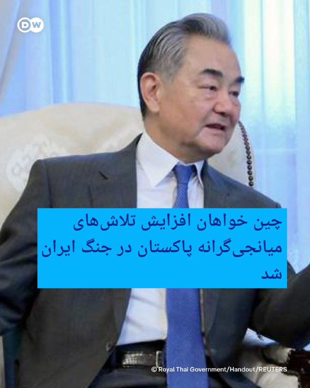

🔶 چین خواهان افزایش تلاش‌های میانجی‌گرانه پاکستان در جنگ ایران شد
 
به گزارش شین‌هوا، خبرگزاری دولتی چین، وانگ یی، وزیر امور خارجه این کشور در گفت‌وگو با اسحاق دار، همتای پاکستانی خود از اسلام‌آباد خواست تا تلاش‌های میانجی‌گرانه خود میان تهران و واشنگتن برای فیصله دادن به جنگ ایران را افزایش دهد.
 
وزیر خارجه چین این خواست را سه‌شنبه ۱۲ مه (۲۲ اردیبهشت) پیش از سفر دونالد ترامپ، رئیس جمهور آمریکا به پکن مطرح کرد.
 
بنا بر این گزارش، وانگ یی در دیدار با وزیر خارجه پاکستان همچنین تصریح کرد، اسلام‌آباد باید به طور شایسته و مناسب به مسائل مربوط به بازگشایی تنگه هرمز بپردازد.
 
شین‌هوا همچنین گزارش داد که وزیر خارجه چین در تماس تلفنی خود با اسحاق دار تصریح کرد که پکن از اسلام‌آباد در راستای تلاش‌های میانجی‌گرانه پاکستان پشتیبانی خواهد کرد.
 
چین که از خریداران مهم نفت جمهوری اسلامی است، خواهان یافتن راه‌حلی دائمی برای پایان جنگ ایران است.
 
@dw_farsi

## DW_Farsi — post 124632

  

🔶 وزارت دفاع آمریکا: هزینه جنگ با ایران به حدود ۲۹ میلیارد دلار رسیده است
 
وزارت دفاع ایالات متحده، پنتاگون، در تازه‌ترین ارزیابی خود هزینه‌ آمریکا در جنگ با ایران را ۲۹ میلیارد دلار اعلام کرد.
 
مقامات این وزارتخانه این آمار جدید را سه‌شنبه ۱۲ مه (۲۲ اردیبهشت) در جلسه استماع بودجه در کنگره ارائه کردند. این رقم اعلام شد، حدود ۴ میلیارد دلار بیشتر از مبلغی است که پیت هگست، وزیر دفاع آمریکا پیشتر در اواخر ماه آوریل اعلام کرده بود.
 
جولز هرست، رئیس امور مالی وزارت دفاع آمریکا که در این جلسه حضور داشت ضمن اشاره به ارزیابی اولیه هگست در کنگره گفت، تخمین نخستین که در ۲۹ آوریل اعلام شد، بر ۲۵ میلیارد دلار بالغ می‌شده، اما این رقم با توجه به به‌روزرسانی‌ "هزینه‌های تعمیرات و جایگزینی تجهیزات" اکنون ۲۹ میلیارد دلار برآورد می‌شود.
 
پنتاگون در حال حاضر تلاش می‌کند افزایش قابل‌توجهی را برای بودجه دفاعی به تصویب برساند. لایحه بودجه دولت ترامپ برای سال مالی ۲۰۲۷ حدود یک و نیم تریلیون دلار هزینه دفاعی پیش‌بینی کرده است.
@dw_farsi

## DW_Farsi — post 124631

  

🔶 ترامپ: عواقب اقتصادی در تصمیمات مربوط به ایران نقشی ندارد
 
دونالد ترامپ در حاشیه سفرش به چین در پاسخ به پرسش یکی از خبرنگاران در این مورد که آیا وضعیت اقتصادی و مالی شهروندان آمریکایی انگیزه‌ای برای او به منظور رسیدن توافق با ایران است گفت، نگرانی‌های اقتصادی آمریکایی‌ها تصمیم‌گیری‌های او درباره جنگ ایران را تغییر نمی‌دهد.

رئيس‌ جمهور آمریکا تأکید کرد، جلوگیری از دستیابی جمهوری اسلامی به سلاح هسته‌ای از "اولویت مطلق" برخوردار است و مسئله عواقب اقتصادی "حتی ذره‌ای" نقش بازی نمی‌کند.

ترامپ تصریح کرد: «من فقط به یک مسئله فکر می‌کنم و آن اینکه نمی‌توانیم به ایران اجازه دسترسی به سلاح هسته‌ای را بدهیم.»

آمریکا در ماه آوریل شاهد بیشترین افزایش قیمت‌ها در طی سه سال گذشته بوده است. 

بنا بر داده‌های سازمان‌های اطلاعاتی آمریکا، مدت زمانی که جمهوری اسلامی برای ساخت سلاح هسته‌ای به آن نیاز دارد، کماکان بر ۹ ماه تا یک سال بالغ می‌شود.

ترامپ پیش از آن آغاز سفرش به چین تصریح کرده بود، فکر نمی‌کند که آمریکا "در خصوص ایران به کمکی نیاز داشته باشد.»
@dw_farsi

## DW_Farsi — post 124630

🔶 ترامپ میان فشار و جنگ؛ گزینه‌های بعدی آمریکا علیه ایران چیست
 
🔻 گزارشی از دانیال بابایانی

"کاملا غیرقابل قبول است". دونالد ترامپ، رئیس جمهور آمریکا با همین چند کلمه، آخرین پاسخ جمهوری اسلامی به طرح آمریکا برای پایان جنگ و کاهش تنش را رد کرد؛ واکنشی که فضای خوش‌بینی روزهای گذشته را فرو ریخت و بار دیگر احتمال بازگشت درگیری‌های گسترده‌تر را مطرح کرد.
 
رئیس‌جمهور آمریکا روز دوشنبه ۱۱ مه در گفت‌وگو با شبکه فاکس‌نیوز و همچنین در دفتر بیضی کاخ سفید، لحنی تندتر از هفته‌های گذشته اتخاذ کرد.
 
او گفت آتش‌بس میان واشنگتن و تهران اکنون "در وضعیت احتضار" قرار دارد و شرایط را به بیماری تشبیه کرد که پزشکان تنها "یک درصد شانس زنده ماندن" برای او قائل هستند.
 
ترامپ همچنین اعلام کرد در حال بررسی ازسرگیری پروژه "آزادی" است؛ عملیاتی که ابتدا برای اسکورت کشتی‌ها در تنگه هرمز طراحی شده بود، اما به گفته او در صورت اجرا این بار "فراتر از همراهی کشتی‌ها" خواهد رفت.
 
او هنوز تصمیم نهایی خود را اعلام نکرده، اما همین ابهام، گمانه‌زنی‌ها درباره گزینه‌های بعدی آمریکا را افزایش داده است.
 
اظهارات تازه ترامپ نشان می‌دهد واشنگتن فعلا میان دو مسیر حرکت می‌کند؛ فشار برای توافق یا آماده‌سازی برای تشدید تنش.
 
 گفت‌وگو با مهدی نخل احمدی و رضا طالبی.
@dw_farsi

## Persian_Trend_Official — post 14036

  

🚀 اینترنت پرسرعت و پایدار،
💰 قیمت هر گیگ ۲۵۰ تومن!
🎁 تخفیف ویژه: ۱۰٪ تخفیف اختصاصی برای اعضای پرشین ترند
⚡ پایداری بالا: کمترین قطعی ممکن در بدترین شرایط
🛡️ تضمین کیفیت: پشتیبانی ۲۴ ساعته + گارانتی بازگشت وجه

🛒 جهت خرید و مشاوره پیام دهید:

🆔 @shayan1057

🆔 @shayan1057

🆔 @shayan1057

## Persian_Trend_Official — post 14035

  

شات گان اون هم با لوله کروم که زیر نور آفتاب طوری برق میزنه که از یک کیلومتری دیده میشه. تو آمریکا حتی غیر نظامی هایی که عشق اسلحه هستن و سرشون در میاد هم اگر اسلحه با لوله کروم بخری مسخرت میکنن میگن باربی جواهرآلات جدید خریده!

سپاه روز به روز از یک نیروی نظامی داره به یک باند گانگستری شبیه تر میشه. امروز فردا فرماندهانش هم کلت با بدنه آب طلا خواهند بست.

📌 @persian_trend_official
پرشین ترند | متفاوت‌ترین کانال نظامی

## Persian_Trend_Official — post 14034

  

فیک نیوز در یک کانال مثلا خبری با بیش از چهارصد هزار دنبال کننده در پیام‌رسان بله!
اگر اینترنت در ایران مثل کره شمالی بود و شبکه های ماهواه ای فارسی زبان وجود نداشتن، آخوندها به مراتب از کره شمالی میتونستن دروغگوتر باشن به شکلی که تا الان نتانیاهو و ترامپ هم اسیر شده بودند !
خاطرتون هست میگفتن نتانیاهو کشته شده و اسرائیل تصاویرش رو با هوش مصنوعی میسازه !

پ.ن : خدایا ما رو با طرفدارات تنها نزار ...

📌 @persian_trend_official
پرشین ترند | متفاوت‌ترین کانال نظامی

## Persian_Trend_Official — post 14033

  

🔴 سفارت چین در آمریکا چهار خط قرمز پکن را اعلام کرد
این اعلام در آستانه سفر ترامپ به پکن و دیدار با شی جین‌پینگ مطرح شد:
▪️ مسئله تایوان
▪️ دموکراسی و حقوق بشر
▪️ مسیرها و نظام‌های سیاسی
▪️ حق توسعه چین
💢 پیام پکن به واشنگتن روشن است: روی این چهار خط حساب باز نکنید.
📌 @persian_trend_official
پرشین ترند | متفاوت‌ترین کانال نظامی

## Persian_Trend_Official — post 14026

احسان افرشته اعدام شد؛

بامداد امروز چهارشنبه خبرگزاری میزان وابسته به قوه قضائیه در خبری مدعی شد که احسان افرشته به اتهام جاسوسی برای موساد اعدام شد. جمهوری اسلامی او را جاسوسی توصیف می‌کند که اطلاعات حساس کشور را می‌فروخت.

اما سوالاتی که بی‌پاسخ مانده‌اند:

محاکمه به صورت کامل علنی برگزار نشد
هیچ وکیل مستقلی امکان دسترسی کامل به پرونده را نداشت

اتهامات صرفاً بر اساس روایت یک‌طرفه دستگاه قضایی مطرح شده

جمهوری اسلامی مدعی است افرشته در نپال توسط موساد آموزش دیده، به سه زبان مسلط شده و با نام سازمانی «جیمز» بیش از ۳۰۰ پیام با افسران اسرائیلی رد و بدل کرده است.

در کشوری که شفافیت قضایی وجود ندارد، مرز میان جاسوس واقعی و قربانی یک پرونده‌سازی را چه کسی می‌تواند تشخیص دهد؟

☆Phantom☆

📌 @persian_trend_official
پرشین ترند | متفاوت‌ترین کانال نظامی

## Persian_Trend_Official — post 14025

#صبحانه_خبری

📍بولتن صبحگاهی پرشین ترند
🗓 ۲۳ اردیبهشت ۱۴۰۵

━━━━━━━━━━━━━━

◾️ پیت هگست: آتش‌بس با ایران در حال اجراست و وضعیت «بسیار پویا» دارد

◾️ ترامپ: آتش‌بس با دستگاه تنفس نفس می‌کشد؛ در حال بررسی احیای «پروژه آزادی» هستم

◾️ سی ان ان : ترامپ از مذاکرات ناامید شده و به طور جدی احیای عملیات نظامی را بررسی می‌کند

◾️ کاخ سفید: مذاکرات با ایران باید «بدون عجله» پیش برود

◾️ سرلشگر جعفری: تا تحقق پیش‌شرط‌ها، هیچ مذاکره‌ای انجام نخواهد شد

◾️ عراقچی: عامل اصلی وضعیت تنگه هرمز، تجاوز نظامی آمریکا و اسرائیل است

◾️ پنتاگون در کنگره: آمریکا تاکنون نزدیک به ۲۹ میلیارد دلار در جنگ ایران هزینه کرده

◾️ گوترش: کاهش تنش در هرمز فوری و ضروری است؛ هرگونه ازسرگیری درگیری پیامدهای وحشتناکی دارد

◾️ مقام ارشد نیروی دریایی سپاه: ایران تعریف تنگه هرمز را به «منطقه عملیاتی گسترده» تغییر داده

◾️ عبور نفتکش‌های قطری از تنگه هرمز تأیید شد؛ بلومبرگ عبور دومین نفتکش را تأیید کرد.

◾️«ترامپ در حالی راهی پکن شد که جنگ و تورم بر ریاست‌جمهوری‌اش سنگینی می‌کنند»

◾️ ترامپ از ۲۳ تا ۲۵ اردیبهشت به چین سفر رسمی می‌کند؛ ایران محور اصلی مذاکرات با شی

◾️ ترامپ ، بدنبال «پنجاه‌و‌یکمین ایالت» !

◾️ سناتور گراهام: به پاکستان اعتماد ندارم؛ احتمال پارک هواپیماهای نظامی ایران در پایگاه‌های پاکستانی

◾️ سی‌بی‌اس: پاکستان در حین میانجیگری، پناهگاه امن برای هواپیماهای نظامی ایران فراهم کرده

◾️ وزیر جنگ آمریکا در کنگره درباره جنگ با ایران و بودجه ۱.۵ تریلیون دلاری دفاعی بازخواست می‌شود

◾️ کویت مدعی بازداشت ۴ افسر نیروی دریایی سپاه در جزیره بوبیان شد

◾️ احضار سفیر ایران به وزارت خارجه کویت و تحویل یادداشت اعتراضی

◾️ تهران ادعاهای کویت علیه ۴ شهروند ایرانی را «کاملاً بی‌اساس» خواند

◾️ رویترز: عربستان سعودی در اواخر مارس حملات هوایی محرمانه تلافی‌جویانه علیه ایران انجام داده

◾️ ارتش اسرائیل: بیش از ۳۵۰ نیروی حزب‌الله در جنوب لبنان کشته و ۱۱۰۰ هدف مورد حمله قرار گرفت

◾️ پهپاد شلیک‌شده از یمن به سمت ایلات توسط اسرائیل منهدم شد

◾️ نتانیاهو رئیس جدید موساد را منصوب کرد

◾️ کره جنوبی مشارکت مرحله‌ای در تأمین امنیت تنگه هرمز را بررسی می‌کند

◾️ فعالیت سنگین نیروی دریایی آمریکا در اطراف باب‌المندب برای پوشش خروج ناو شارل دوگل

◾️ هواپیمای شناسایی U-2S «دراگون‌لیدی» به سمت پایگاه فیرفورد بریتانیا حرکت کرد

◾️بی وان لانسر《B1.B》آمریکا در مأموریت آموزشی بر فراز خاورمیانه پرواز کرد

◾️ رزمایش ضدهلی‌برن سپاه؛ تحلیلگران: فاقد سامانه‌های دوش‌پرتاب برای مقابله با بالگرد

◾️ احتمال شنیده شدن صدای انفجار در جنوب تهران از ساعت ۸ صبح چهارشنبه اعلام شد

◾️ تورم آمریکا در آوریل به ۳.۸ درصد رسید؛ بالاتر از پیش‌بینی بازار

◾️ تولید نفت اوپک در آوریل به پایین‌ترین سطح از سال ۲۰۰۰ رسید

◾️ کشتی روسی حامل احتمالی راکتورهای هسته‌ای با مقصد کره شمالی در مدیترانه غرق شد

◾️ روسیه تصاویر آزمایش موشک قاره‌پیمای «سارمات» با برد ۱۸ هزار کیلومتر را منتشر کرد

◾️ دو وزیر دولت بریتانیا در اعتراض به استارمر استعفا دادند

◾️ سخنگوی دولت ایران: اینترنت حق شهروندی است؛ پس از رفع تهدیدات شرایط عادی می‌شود

◾️ سخنگوی کمیسیون امنیت ملی مجلس: غنی‌سازی ۹۰ درصدی یکی از گزینه‌های ایران است

◾️ زلزله ۴.۵ ریشتری تهران را لرزاند

◾️ طوفان و وزش باد ۵۵ کیلومتر بر ساعت در تهران

#تحریریه_پرشین_ترند
━━━━━━━━━━━━━━
📌 @persian_trend_official
پرشین ترند | متفاوت‌ترین کانال نظامی

## Persian_Trend_Official — post 14024

  <a href="telegram/content/Persian_Trend_Official_14024_1778660931.mp4" target="_blank">🎬 Download video</a>

صبحتون بخیر ☕️

📝 Nick
📌 @persian_trend_official
پرشین ترند | متفاوت‌ترین کانال نظامی

## Persian_Trend_Official — post 14023

  <a href="telegram/content/Persian_Trend_Official_14023_1778660934.mp4" target="_blank">🎬 Download video</a>

شبتون بخیر ❤️🔥

📝 Nick
📌 @persian_trend_official
پرشین ترند | متفاوت‌ترین کانال نظامی

## Persian_Trend_Official — post 14022

🇰🇷 یو نی‌هاپ: وزیر دفاع کره جنوبی، آن گیوبک، می‌گوید سئول پس از گفتگو با مقامات آمریکایی در واشنگتن، مشارکت مرحله‌ای در تأمین امنیت ترافیک دریایی در تنگه هرمز را مد نظر قرار خواهد داد، از جمله احتمال به اشتراک‌گذاری اطلاعات و حمایت نظامی محدود.

📝 Nick

📌 @persian_trend_official
پرشین ترند | متفاوت‌ترین کانال نظامی

## Persian_Trend_Official — post 14021

  <a href="telegram/content/Persian_Trend_Official_14021_1778660936.mp4" target="_blank">🎬 Download video</a>

مجری:
اگر رژیم سقوط کند شما خود را در موقعیت رهبری دوران گذار میبینید و شما حدود 50 سال در ایران نبودید و رییس جمهور ترامپ گفت که مطمئن نیست شما به اندازه کافی در ایران حامی داشته باشید. به ایرانیان داخل و خارج از کشور که خواهان سقوط رژیم فعلی هستند اما شما را به عنوان رهبر بعدی نمیبینند، چه میگویید؟

شاهزاده رضا پهلوی:
من فکر می‌کنم میلیون‌ها نفری که به فراخوان من پاسخ دادند، گواه زنده‌ای بر این واقعیت هستند که من از حمایت گسترده‌ای در داخل ایران برخوردارم. و باز هم می‌گویم، به محض اینکه این قطع اینترنت برطرف شود، شما خواهید توانست دقیقاً بشنوید که مردم ایران چه می‌گویند.
پیام آخر من قبل از قطعی اینترنت نود میلیون بازدید داشت که پس از قطعی اینترنت به نزدیک شش میلیون رسید. این یعنی تمام پایگاه مخاطبان من در ایران هستند، همان افرادی که به فراخوان من پاسخ دادند.
ما گروگان این رژیم هستیم و گاهی اوقات گروگان‌ها نمی‌توانند بدون کمک خارجی خود را آزاد کنند. به همین دلیل است که ما به کمک خارجی نیاز داریم. باقی کارها را خودمان انجام خواهیم داد و دخالت خارجی را در این موارد نمی‌پذیریم.

📌 @persian_trend_official

## Persian_Trend_Official — post 14020

  <a href="telegram/content/Persian_Trend_Official_14020_1778660939.mp4" target="_blank">🎬 Download video</a>

⭕️ بنیامین نتانیاهو:

تنها کسی که رئیس موساد را منصوب می‌کند، نخست وزیر است. رومن توسط من به عنوان رئیس بعدی موساد کشور اسرائیل انتخاب شد - و او موساد را از قدرتی به قدرت دیگر رهبری خواهد کرد.

📝 Nick

📌 @persian_trend_official
پرشین ترند | متفاوت‌ترین کانال نظامی

## Persian_Trend_Official — post 14019

  <a href="telegram/content/Persian_Trend_Official_14019_1778660942.mp4" target="_blank">🎬 Download video</a>

⭕️ ویدئو منتشر شده در اینستاگرام بنیامین نتانیاهو:

*لیکود اسم یک حزب راست‌گرا است به معنای استحکام. (حزبی که بنیامین نتانیاهو عضو آن است.)

📝 Nick

📌 @persian_trend_official
پرشین ترند | متفاوت‌ترین کانال نظامی

## RadioFarda — post 157118

🔸عضو کمیسیون اقتصادی مجلس شورای اسلامی اعلام کرد برآوردهای اولیه از خسارت‌های صنعتی ناشی از جنگ اخیر آمریکا و اسرائیل با ایران نشان می‌دهد خسارت واردشده فقط در دو استان تهران و اصفهان، بدون در نظر گرفتن صنایع بزرگ آسیب‌دیده، حدود ۲۰۰ هزار میلیارد تومان بوده است.

🔸مهدی طغیانی در گفت‌وگو با صداوسیما گفت این رقم بر اساس خوداظهاری واحدها برآورد شده و شامل خسارت صنایع بزرگ، واحدهایی که زنجیرهٔ تولید آن‌ها آسیب دیده و همچنین بنگاه‌هایی که در پی جنگ دچار رکود شده‌اند، نمی‌شود.

🔸در جریان جنگ دو شرکت فولاد خوزستان و فولاد مبارکه نیز که از صنایع بزرگ ایران محسوب می‌شوند، در نیمه اول فروردین هدف حملات هوایی اسرائیل قرار گرفتند که در پی آن، براساس اعلام رسانه‌های اقتصادی ایران، «معادل ۲۵ تا ۳۰ درصد ظرفیت تولید فولاد در ایران از دست رفت».

🔸استان‌های تهران و اصفهان بیشترین آسیب‌های صنعتی را در جریان جنگ متحمل شدند. به‌گفتهٔ مهدی طغیانی، خسارت ۲۰۰ هزار میلیاردی در مقایسه با تولید ناخالص داخلی ایران عدد بزرگی نیست، اما برای واحدهای درگیر و آسیب‌دیده خسارت قابل‌توجهی به شمار می‌رود.

@RadioFarda

## RadioFarda — post 157117

🔸قوه قضائیه ایران یک زندانی دیگر به نام احسان افرشته را به اتهام «جاسوسی» برای اسرائیل اعدام کرد. 🔸میزان‌نیوز نوشته که افراشته که «در نپال توسط موساد آموزش دیده بود و اطلاعات حساس کشور را به اسرائیل می‌فروخت»، بامداد چهارشنبه ۲۳ اردیبهشت اعدام شد. 🔸در بخشی…

## RadioFarda — post 157116

  

🔸قوه قضائیه ایران یک زندانی دیگر به نام احسان افرشته را به اتهام «جاسوسی» برای اسرائیل اعدام کرد.

🔸میزان‌نیوز نوشته که افراشته که «در نپال توسط موساد آموزش دیده بود و اطلاعات حساس کشور را به اسرائیل می‌فروخت»، بامداد چهارشنبه ۲۳ اردیبهشت اعدام شد.

🔸در بخشی از گزارش بدون اشاره به جزئیات آمده که او «به عنوان کارشناس سایبری در یک شرکت وابسته نهاد نظامی مشغول به فعالیت» بود.

🔸میزان ادعا کرده که «با دستور افسر موساد، افراشته تلاش می‌کند اطلاعات مختلفی را درباره شرکت و افراد شاغل در آن منتقل کند. هویت و مشخصات کارکنان، سلسله مراتب و چارت دقیق سازمانی و ماموریت‌های شرکت از جمله اطلاعاتی بوده که افرشته تلاش داشته به سرویس موساد منتقل کند.»

@RadioFarda

## RadioFarda — post 157115

  

🔸در پی زمین‌لرزه‌ها و پس‌لرزه‌هایی که شامگاه سه‌شنبه ۲۲ اردیبهشت در شرق تهران رخ داد، یک استاد پژوهشکدهٔ زلزله‌شناسی در مورد فعال بودن گسل‌های نزدیک پردیس و بومهن هشدار داد.

🔸مهدی زارع به خبرگزاری خبرآنلاین گفت: «وقوع دومین زمین‌لرزه با بزرگای بیش از ۴ از ابتدای سال ۱۴۰۵، نشان‌دهندهٔ تداوم آزادسازی انرژی در محل تلاقی ساختارهای مهم زمین‌ساختی است.»

🔸این زلزله‌شناس همچنین تأکید کرد که منطقهٔ پردیس و بومهن در پهنهٔ برخورد البرز مرکزی قرار دارد و «تحت تأثیر مستقیم فعالیت گسل بسیار مهم و خطرناک شمال تهران و گسل مُشا است».

🔸مهدی زارع همچنین گفت «با توجه به بارگذاری جمعیتی بالا در مسکن مهر پردیس و ساخت‌وسازهای گسترده در ارتفاعات، تاب‌آوری لرزه‌ای سازه‌ها در برابر شتاب‌های افقی و قائم ناشی از فعالیت گسل مشا بسیار حائز اهمیت است».

🔸براساس سرشماری سال ۱۳۹۵ و تخمین‌های پس از آن، جمعیت دو شهر پردیس و بوهمن نزدیک به ۲۰۰ هزار نفر اعلام شده است.

@RadioFarda

## RadioFarda — post 157114

  <a href="https://t.me/radiofarda/157114" target="_blank">📎 Download file</a>

📻بشنوید: سرخط خبرها با رادیوفردا، ۲۳ اردیبهشت ۱۴۰۵‌

@RadioFarda

## RadioFarda — post 157113

🔸دونالد ترامپ، رئیس‌جمهور آمریکا، گزارش شماری از رسانه‌های غربی درباره عملکرد نظامی «خوب» ایران مقابل آمریکا را «خیانت» عنوان کرد. 🔸او از این رسانه‌ها با عنوان «فیک‌نیوز» نام برد و در شبکه اجتماعی خود، تروث‌سوشال نوشت: «وقتی رسانه‌های جعلی می‌گویند که دشمن…

## RadioFarda — post 157112

  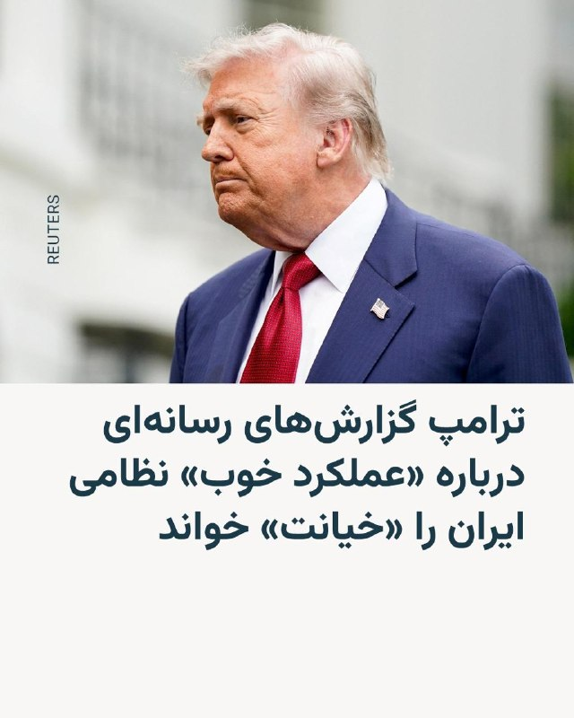

🔸دونالد ترامپ، رئیس‌جمهور آمریکا، گزارش شماری از رسانه‌های غربی درباره عملکرد نظامی «خوب» ایران مقابل آمریکا را «خیانت» عنوان کرد.

🔸او از این رسانه‌ها با عنوان «فیک‌نیوز» نام برد و در شبکه اجتماعی خود، تروث‌سوشال نوشت: «وقتی رسانه‌های جعلی می‌گویند که دشمن ایرانی از نظر نظامی در برابر ما عملکرد خوبی دارد، این عملاً خیانت محسوب می‌شود، چون چنین ادعایی کاملاً دروغ و حتی مضحک است.»

🔸ترامپ اضافه کرد که این رسانه‌ها با این نوع اخبار «دارند به دشمن کمک و از او حمایت می‌کنند!»

@RadioFarda

## IranianMinds — post 20056

شما فک کنید یه جوون بی گناه که نه پستی داشته و نه مقامی تو کشور رو دی ماه دستگیر کردن بعدشم اعدامش کردن گفتن جاسوس موساد بوده رفته نپال آموزش دیده ! @IranianMinds

## IranianMinds — post 20055

  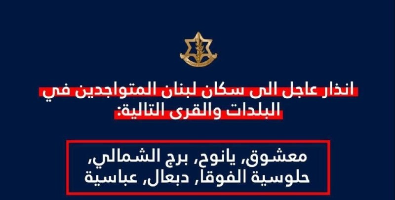

🔴 ارتش اسرائیل دستور تخلیه 6 روستای دیگه در جنوب لبنان رو داد

ارتش اسرائیل از ساکنان این روستاها خواست که حدود 1 کیلومتر از این مناطق فاصله بگیرند

ارتش اسرائیل در حال پیشروی زمینی سریع در جنوب لبنان هست

@IranianMinds

## IranianMinds — post 20054

  

😤دنبال یه سایت شرط بندی بین المللی بودی که به ایرانیا خدمات بده؟!
⛔

👍دربی بت همون انتخاب  100%

💎ویژگی های سایت جهانی Derby Bet:

⬅️امکان شارژ امن با کارت بانکی

⬅️واریز اول دوبل شارژ می شوید(بونوس۱۰۰٪)

⬅️پر اپشن ترین سایت فعال در ایران

⬅️تسویه حساب کمتر از 5 دقیقه

⬅️برگشت بخشی از باخت به صورت هفتگی

🚨کد هدیه ثبت نام:GG007

⚠️برای دانلود اپلکیشن کلیک کنید
👉
re23

🔔کانال دربی بت :

🪙https://t.me/+aCbq7yy8QY80NzQ0

## IranianMinds — post 20053

  <a href="telegram/content/IranianMinds_20053_1778660951.mp4" target="_blank">🎬 Download video</a>

🔴 پست جدید اکانت کاخ سفید :

@IranianMinds

## IranianMinds — post 20052

🔴 صداوسیما :

اگه اینترنت میخواید میتونید از کشور برید یه جای دیگه زندگی کنید

@IranianMinds

## IranianMinds — post 20051

  

شما فک کنید یه جوون بی گناه که نه پستی داشته و نه مقامی تو کشور رو دی ماه دستگیر کردن بعدشم اعدامش کردن گفتن جاسوس موساد بوده رفته نپال آموزش دیده !

@IranianMinds

## IranianMinds — post 20050

  

🔴 ترامپ :

افتخار بزرگی است که ایلان ماسک، تیم کوک، لری فینک، و دیگران به چین میروند. من از رئیس‌جمهور شی می‌خواهم چین را باز کند تا این افراد نابغه بتوانند کارهای شگفت‌انگیز انجام دهند و کشورشان را به سطح بالاتری برسانند. این اولین چیزی است که هنگام دیدار از ایشان درخواست خواهم کرد.

@IranianMinds

## IranianMinds — post 20049

  

🔴 پست‌ جدید ترامپ:

من تورو‌ میخوام !

@IranianMinds

## IranianMinds — post 20048

@IranianMindsGroup

ایدی گروه کامنتا ( تو کامنتا خیلی درخواست داده بودید )

## BBCPersian — post 280898

🔻نماینده مجلس ایران: آمریکا و اسرائیل بنای یک عملیات گسترده علیه ایران را دارند

کامران غضنفری، نماینده مجلس ایران با اشاره به ادامه انتقال تجهیزات و نیرو از سوی آمریکا به خاورمیانه، می‌گوید «آمریکا و اسرائیل بنای یک عملیات گسترده» علیه ایران را دارند.

آقای غضنفری به خبرآنلاین گفته آمریکا و اسرائیل «احتمالاً قصد تصرف برخی از جزایر ما در جنوب را دارند.»

او با اشاره به خواسته‌های آمریکا از ایران در مورد تعطیلی غنی‌سازی، خروج اورانیوم غنی‌شده و توقف حمایت از گروه‌های موسوم به «محور مقاومت» گفته «جمهوری اسلامی قاعدتاً زیر بار این خواسته‌ها نمی‌رود.»

به گفته این نماینده مجلس، «ما وسط جنگ هستیم و اکنون در حال جنگ با دشمن هستیم. در همین یک هفته اخیر، دو عملیات علیه ما انجام دادند و با ناوهایشان به برخی مراکز ما حمله کردند.»~

https://bbc.in/4tAXKjn
@BBCPersian

## BBCPersian — post 280897

🔻سامانه دفاع موشکی «گنبد طلایی» ترامپ هزار و دویست میلیارد دلار خرج دارد

بر اساس برآورد دفتر بودجه کنگره امريکا، سامانه دفاع موشکی آينده‌نگر «گنبد طلایی» دونالد ترامپ حدود ۱/۲ تريليون دلار (۱۲۰۰ میلیارد دلار) هزينه خواهد داشت تا طی دو دهه تولید، استقرار و بهره‌برداری شود.

اين رقم به‌مراتب بيشتر از بودجه اوليه ۱۷۵ ميليارد دلاری است که پيش‌تر برای اين پروژه در نظر گرفته شده بود.

با اين حال، سامانه‌ای که برای محافظت از ايالات متحده امريکا در برابر موشک‌های بالستيک و کروز طراحی شده، ممکن است حتی کارايی کامل نداشته باشد.

گزارش جديد دفتر بودجه کنگره هشدار می‌دهد «گلدن دوم - گنبد طلایی» می‌تواند در برابر حمله گسترده از سوی روسيه يا چين آسيب‌پذير باشد.

اين نهاد غيرحزبی اعلام کرده تنها هزينه‌های تامين تجهيزات از ۱ تريليون دلار فراتر خواهد رفت؛ از جمله برای لايه‌های رهگير موشکی و سامانه هشدار و رهگيری موشک مبتنی بر فضا.

عبور برخی از پهپادها و موشک‌های ایرانی از گنبد آهنین اسرائیل و همچنین پوشش پدافندی آمریکا در کشورهای حوزه خلیج فارس، ارزیابی‌ها درباره کارآمدی کامل این طرح را هم تحت تاثیر قرار داده است.

https://bbc.in/4tAXKjn
@BBCPersian

## BBCPersian — post 280896

🔻ترامپ نقشه ونزوئلا را با عنوان «ایالت ۵۱» منتشر کرد

دونالد ترامپ که در حال عزیمت به چین برای دیدار با شی جین پینگ است، سه شنبه شب در شبکه اجتماعی خود - تروث سوشال - نقشه ونزوئلا در حالی که روی آن با پرچم آمریکا پوشانده شده بود را منتشر کرد و بالای آن نوشت:‌ «ایالت ۵۱».

روز دوشنبه -۲۱ اردیبهشت - هم یک خبرنگار فاکس نیوز گفت که آقای ترامپ در تماس تلفنی با او گفته به انضمام ونزوئلا تحت عنوان ایالت پنجاه و یکم آمریکا «فکر می‌کند».

کانادا و گرینلند هم پیش از این القاب مشابهی از سوی رئیس جمهور آمریکا دریافت کرده بودند که با اعتراض جدی دولت و شهروندان این کشورها روبرو شده بود.

https://bbc.in/4tAXKjn
@BBCPersian

## BBCPersian — post 280895

🔻اکبر عبدی به علت عارضه قلبی در بیمارستان بستری شد

بنابر گزارش رسانه‌های ایران، اکبر عبدی، بازیگر و کمدین سرشناس ایرانی، به علت عارضه قلبی در بخش مراقبت‌های ویژه بستری شده است.

مهران غفوریان، بازیگر و کمدین با انتشار ویدیویی در مقابل بیمارستان محل بستری آقای عبدی این خبر را تایید کرده است.

آقای عبدی در دهها فیلم سینمایی و مجموعه‌های تلویزیونی ایران ایفای نقش کرده و یکی از کمدین‌های سرشناس نیم قرن گذشته در این کشور است.
https://bbc.in/4tAXKjn
@BBCPersian

## BBCPersian — post 280887

🖋 الکسی کالمیکوف، بی‌بی‌سی روسی

🔻جنگ آمریکا و اسرائیل با ایران منجر به بحران انرژی شده است؛ بحرانی که از آسیا آغاز شد و به تدریج به اروپا نزدیک می‌شود. نخستین ضربه را کشورهای فقیر متحمل شدند، اما در میان کشورهای ثروتمند نیز قربانیانی وجود دارد. بریتانیا نخستین کشوری خواهد بود که بیش از دیگران آسیب می‌بیند. دلیل این امر چیست؟

نخست به این دلیل که بریتانیا بیش از دیگر کشورهای گروه هفت به واردات منابع انرژی وابسته است و به همین دلیل، هرگونه کمبود انرژی بلافاصله بر قیمت‌ها در داخل این کشور تاثیر می‌گذارد.

آلمان، ژاپن و فرانسه نیز واردکننده انرژی هستند، اما برخلاف بریتانیا ذخایر گاز دارند و می‌توانند موقتا بخشی از نیاز خود را با زغال‌سنگ تامین کنند. آمریکا و کانادا هم نه‌تنها در زمینه انرژی خودکفا هستند، بلکه مازاد تولید خود را صادر می‌کنند.

بیشتر بخوانید:
https://bbc.in/4d8oV0h
📸GettyImages/ EPA/Shutterstock/ In Pictures via Getty Images/ AFP via Getty Images/ Bloomberg via Getty Images/ NurPhoto via Getty Images
@BBCPersian

## BBCPersian — post 280886

  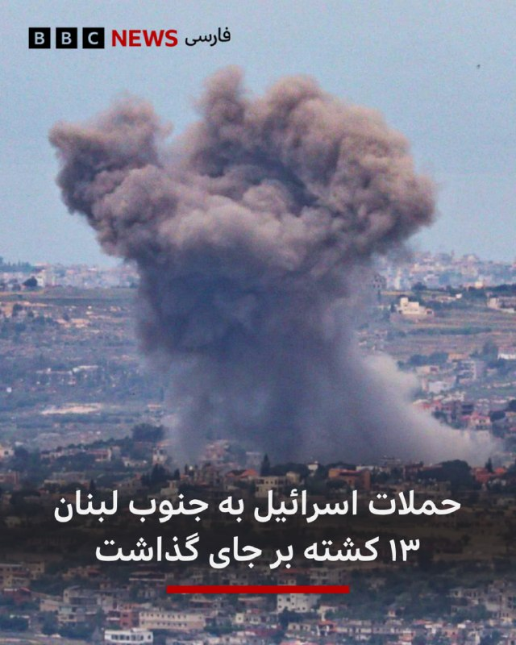

🔻رسانه‌های دولتی لبنان می‌گویند حملات هوایی اسرائیل حداقل ۱۳ نفر را در جنوب لبنان کشته است که دو نفرشان از کارکنان اورژانس بوده‌اند.

به گزارش خبرگزاری ملی لبنان، طی ۲۴ ساعت گذشته، شش نفر در اثر اصابت گلوله به خانه‌ای در کفر دونین کشته و هفت نفر دیگر زخمی شدند.

بعد از ظهر سه‌شنبه، وزارت بهداشت لبنان اعلام کرد که دو امدادگر از سرویس اورژانس دفاع مدنی لبنان که توسط دولت اداره می‌شود، در حمله اسرائیل به نبطیه کشته و یک نفر دیگر زخمی شده است. بر اساس این گزارش، آنها در حال انجام ماموریتی در پاسخ به حمله قبلی بودند که منجر به کشته شدن یک نفر شد.

ارتش اسرائیل اعلام کرد که در حال بررسی گزارش‌ها است.

جوزف عون، رئیس جمهور لبنان، «غم و اندوه و تأسف خود را از کشته شدن دو عضو دفاع مدنی» در نبطیه به نام‌های حسین جابر و احمد نوره ابراز کرد و تأکید کرد که «تجاوز مداوم اسرائیل مانع تلاش‌ها برای برقراری آرامش می‌شود».

وزارت بهداشت لبنان نیروهای اسرائیلی را به هدف قرار دادن عمدی امدادگران متهم کرد.

📷EPA
@BBCPersian

## BBCPersian — post 280885

  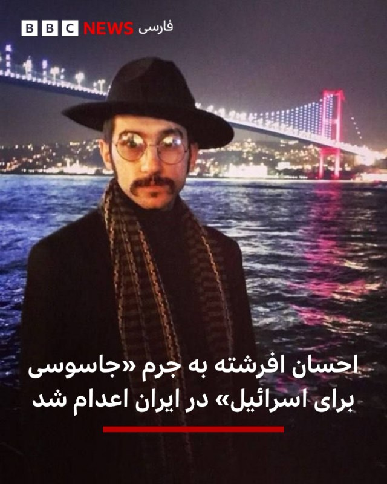

🔻مرکز رسانه‌ای قوه قضائیه ایران اعلام کرده است که احسان افرشته به جرم «جاسوسی برای اسرائیل» بامداد امروز (چهارشنبه) اعدام شده است.

آقای افرشته متهم شده بود که ابتدا «در پوشش راننده تاکسی اینترنتی» دستورات ماموران موساد را اجرا می‌کرده و سپس با استخدام در یک شرکت وابسته به یک نهاد نظامی اطلاعات حساسی را به اسرائیل منتقل کرده است.

به گزارش شبکه حقوق بشر هرانا، احسان افرشته متولد ۱۳۷۲ بوده و در سال ۱۴۰۳ پس از بازگشت به ایران از ترکیه بازداشت شده است.

با پایان جنگ ایران با آمریکا و اسرائیل، قوه قضائیه اجرای احکام اعدام تسریع و تشدید کرده است.

به گفته گزارشگر ویژه شورای حقوق بشر سازمان ملل متحد در یک سال اخیر تعداد اعدام‌ها در ایران به شکل کم‌سابقه‌ای افزایش یافته، این روند پس از جنگ اخیر که نهم اسفند (۲۸ فوریه) با حملات اسرائیل و آمریکا آغاز شد، شتاب بیشتری گرفته است.

نهادهای حقوق بشر از دادرسی‌های ناعادلانه، نقض حقوق متهم و موج اعدام‌ها بر اساس «اعترافات» زیر شکنجه و فشار ابراز نگرانی کرده‌اند.

📷MIZAN
@BBCPersian

## BBCPersian — post 280884

🔻ان‌بی‌سی؛ ترامپ به دنبال تغییر نام عملیات نظامی علیه ایران است تا از محدودیت ۶۰ روزه کنگره پرهیز کند

رسانه‌های آمریکا می‌گویند به گفته دو مقام امريکايی، پنتاگون در حال بررسی اين موضوع است که اگر آتش‌بس کنونی با ايران فروبپاشد و دونالد ترامپ تصميم به ازسرگيری عمليات گسترده نظامی بگيرد، نام جنگ رسما به «عمليات پتک‌ سنگین» تغيير يابد.

بحث‌ها درباره احتمال جايگزينی نام «عمليات خشم حماسی» با «عمليات پتک سنگین» نشان می‌دهد دولت امريکا تا چه اندازه احتمال ازسرگيری جنگی را که در ۲۸ فوريه آغاز شد، جدی می‌گيرد.

اين تغيير نام همچنين می‌تواند به آقای ترامپ امکان دهد استدلال کند که با آغاز عمليات جديد، مهلت ۶۰ روزه مورد نياز برای دريافت مجوز جنگ از کنگره دوباره از نو آغاز می‌شود.

در چند هفته گذشته و در خلال حضور مقام‌های دولت آمریکا در کنگره، نمایندگان به مفاد قانونی اشاره کردند که به موجب آن دولت آمریکا حتی در پی عملیات نظامی به بهانه «تهدید فوری» باید پس از ۶۰ روز از آغاز این حملات، برای ادامه جنگ از کنگره که قانونا حق تصمیم‌گیری درباره اعلان و آغاز جنگ را دارد، مجوز بگیرد.

https://bbc.in/4tAXKjn
@BBCPersian

## BBCPersian — post 280883

🔻 نیویورک تایمز: ایران هنوز به ۳۰ سکوی موشکی از مجموع ۳۳ سکوی خود در حاشیه خلیج فارس دسترسی دارد

روزنامه نیویورک تایمز در گزارش که روز سه‌شنبه - ۱۲ مه / ۲۲ اردیبهشت - منتشر کرده نوشته ایران همچنان به ۳۰ سکو از ۳۳ سکوی موشکی خود در حاشیه خلیج فارس دسترسی دارد.

این روزنامه آمریکایی نوشته این موضوع از توان بیشتر نظامی ایران نسبت به آنچه ارتش آمریکا و کاخ‌سفید در جریان جنگ مشترک با اسرائیل مدعی نابودی آنها شده بودند، حکایت دارد.

در همین حال، دونالد ترامپ که روز سه‌شنبه برای دیدار با همتای خود - شی جین پینگ - راهی چین شد، در پستی که می‌تواند واکنش به این گزارش نیویورک تایمز تلقی شود گزارش‌هايی را که حاکی از وضعیت نظامی ايران هستند، «اخبار جعلی» توصيف کرده و گفته اين گزارش‌ها به تهران «اميد واهی» می‌دهند.

او چنين پوشش رسانه‌ای را «خيانت» خواند و مدعی شد نيروهای ايرانی متحمل شکست‌های سنگينی شده‌اند.

آقای ترامپ همچنين ادعا کرد ايران پيش‌تر ۱۵۹ شناور نظامی در اختيار داشته، اما «اکنون همه آنها در کف دريا قرار دارند».

او در ادامه مدعی شد ايران ديگر نيروی دريايی موثری ندارد و نيروی هوايی و فناوری‌های نظامی اين کشور نيز «کاملا نابود شده‌اند».

با این حال، پیش‌تر گزارش دیگری که بازتاب گسترده‌ای در رسانه‌های آمریکا داشت مدعی شده بود ایران همچنان تا حدود زیادی توان نظامی خود از جمله موشکی و پهپادی، را حفظ کرده است.

@BBCPersian

## BBCPersian — post 280882

  <a href="telegram/content/BBCPersian_280882_1778660957.mp4" target="_blank">🎬 Download video</a>

یک معترض به جنگ آمریکا با ایران در جریان نشستی که روز سه‌شنبه از سوی نشریه پولتیکو و کارخانه تسلیحات‌سازی لاکهید در واشنگتن برگزار شده بود، در میان سخنرانی شاهزاده رضا پهلوی به روبروی صحنه رفت و در حالی که فریاد می‌زد خطاب به او گفت:

«شما کجا بودید وقتی مردم ما داشتند فرزندانشان را از زیر آوار بمب‌هایی که شما به کشورمان دعوت کرده‌اید بیرون می‌کشیدند؟ چطور می‌توانید بگویید «مردم من! ایران من!» و بعد‌ آنها را دعوت به بمباران مردم کنید؟ شرم بر شما!»

ماموران امنیتی خیلی زود این زن معترض را از محل سخنرانی بیرون بردند. با این حال، ویدیو مربوط به این رویداد سه‌شنبه عصر در شبکه‌های اجتماعی بازخورد فراوانی پیدا کرد.

آقای پهلوی در این نشست که چند نفر از وزرا و مقام‌های ارشد فعلی و سابق آمریکا هم در آن شرکت داشتند، در بخشی از سخنان خود از مذاکره با حکومت در ایران پس از آتش‌بس با آمریکا انتقاد کرد و ان را با آنچه تلاش برای نجات مردم ایران از «رژیم» جمهوری اسلامی خواند، در تناقض ارزیابی کرد.

🎥 Bita_4liberation / Instgram
@BBCPersian

## idfinfarsi — post 11571

  <a href="telegram/content/idfinfarsi_11571_1778660961.mp4" target="_blank">🎬 Download video</a>

در طول شبانه‌روز گذشته: ارتش اسرائیل بیش از ۴۰ زیرساخت سازمان تروریستی حزب‌الله را در جنوب لبنان مورد حمله قرار داد

در طول شبانه‌روز گذشته، ارتش اسرائیل بیش از ۴۰ زیرساخت سازمان تروریستی حزب‌الله را در چندین منطقه در جنوب لبنان هدف قرار داد.

از جمله زیرساخت‌های هدف قرار گرفته: انبارهای تسلیحاتی و ساختمان‌های مورد استفاده نظامی که تروریست‌های حزب‌الله از آن‌ها برای پیشبرد طرح‌های تروریستی علیه نیروهای ارتش اسرائیل و شهروندان این کشور استفاده می‌کردند.

همچنین، تروریست‌هایی که تهدیدی برای نیروهای ما بودند به هلاکت رسیدند و پرتابگرهای آماده شلیک که به سمت خاک اسرائیل هدف‌گیری شده بودند، مورد حمله قرار گرفتند.

## idfinfarsi — post 11565

  <a href="telegram/content/idfinfarsi_11565_1778660963.mp4" target="_blank">🎬 Download video</a>

سخنگوی ارتش اسرائیل:

⭕️مستندی از داخل تانک تیپ ۴۰۱: به هلاکت رساندن یک تروریست که تجهیزات دیده‌بانی علیه نیروهای ما را به‌کار گرفته بود

⭕️نیروهای تیم رزمی تیپ ۴۰۱ تحت فرماندهی لشکر ۱۴۶، به عملیات خود در جنوب خط دفاعی مقدم ادامه می‌دهند تا زیرساخت‌های تروریستی سازمان تروریستی حزب‌الله را نابود کنند، با هدف رفع تهدیدها علیه شهروندان کشور اسرائیل.

⭕️در جریان این فعالیت، نیروها یک تروریست را شناسایی کردند که در حال به‌کارگیری تجهیزات دیده‌بانی علیه نیروهای ما بود. در یک واکنش سریع، تروریست با شلیک تانک به هلاکت رسید.

## Dirty_Kids — post 389360

  <a href="telegram/content/Dirty_Kids_389360_1778660966.mp4" target="_blank">🎬 Download video</a>

قشنگ زنده یاد ۱۰۰ سال از زمان خودش جلوتر بود پپ

زنده‌یاد فریدون فرخزاد در سال ۱۹۹۰ میلادی، در گفت‌وگو با «رادیو سیدنی» در استرالیا

@Dirty_Kids 👻

## Dirty_Kids — post 389358

  

می‌بینی مارکو؟ کاراشو می‌بینی؟
به ابالفضل ما هم همینیم.

@Dirty_Kids 👻

## Dirty_Kids — post 389357

هنوز چین نرسیده سر شوخیو باز کردن. :)))))))

روبیوی دل‌ها همون ست نایکی که مادورو موقع هشتک‌پشتک شدن پوشیده بودو پوشیدو آتش به همه عالم زد! :)))

@Dirty_Kids 👻

## Dirty_Kids — post 389356

  <a href="telegram/content/Dirty_Kids_389356_1778660969.webm" target="_blank">🎬 Download video</a>

☢️خفن ترین و‌ قدیمی ترین  انالیزور  ایران ینی دکتر بت 
👍 
🔴هیچ سایت بتی دوست نداره شما کانال دکتر بت رو پیدا کنین چون خیلی سود میکنید🤷‍♂ رایگان بهترین شرط هارو براتون میذاره حتی هزار تومن هم دریافت نمیکنه روزانه میتونی از پیش بینی فوتبال باهاش پول در بیاری…

## Dirty_Kids — post 389355

  <a href="telegram/content/Dirty_Kids_389355_1778660970.webm" target="_blank">🎬 Download video</a>

☢️خفن ترین و‌ قدیمی ترین  انالیزور  ایران ینی دکتر بت 
👍

🔴هیچ سایت بتی دوست نداره شما کانال دکتر بت رو پیدا کنین چون خیلی سود میکنید🤷‍♂

رایگان بهترین شرط هارو براتون میذاره
حتی هزار تومن هم دریافت نمیکنه
روزانه میتونی از پیش بینی فوتبال باهاش پول در بیاری 👌
A22
اگ اهل پیش بینی فوتبالی این کانال اصلا از دست ندین👇

✅https://t.me/+4_ADqwB9e-QwYjlk

✅https://t.me/+4_ADqwB9e-QwYjlk

## Dirty_Kids — post 389354

  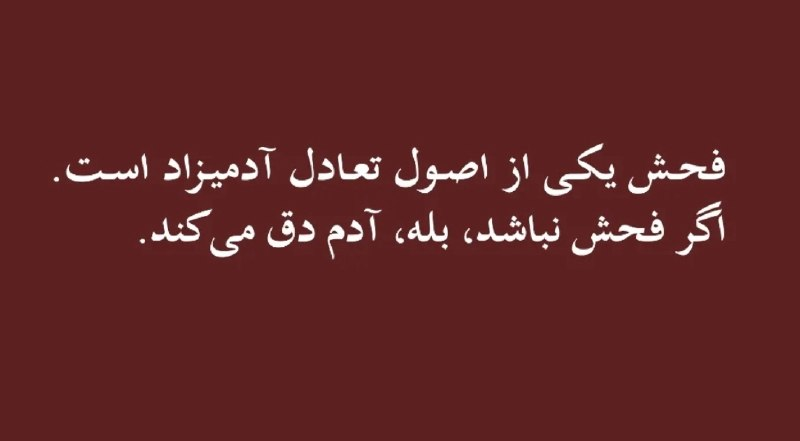

#بخوابیم

@Dirty_Kids 👻

## Dirty_Kids — post 389353

‌‏جمله‌ی
مخرج مشترک تمام مادرجنده‌های دنیا فلسطینه

یکی از حق ترین جملات تاریخه

@Dirty_Kids 👻

## Dirty_Kids — post 389352

  

یادآوری آن روز باشکوه.

*تصویر حمله هوایی به بیت رهبری

@Dirty_Kids 👻

## Dirty_Kids — post 389350

  <a href="telegram/content/Dirty_Kids_389350_1778660972.mp4" target="_blank">🎬 Download video</a>

وسط این بگاییا یه پسره به اسم امیر قاسم ملقب به بتمن :))))))) با این ویس هاپ هاپ مخ ۶۰ نفر زده، الان لو رفته دخترا به جون هم افتادن چت و اسکرین شات و نود همدیگه‌رو دارن پخش میکنن

با نود و چتاشون کاری ندارم ولی این ویس خیلی خنده بود

@Dirty_Kids 👻

## Dirty_Kids — post 389349

  <a href="telegram/content/Dirty_Kids_389349_1778660972.mp4" target="_blank">🎬 Download video</a>

کارمندان آینده #ساواک پخشش کنید

@Dirty_Kids 👻

## Hranews — post 112919

  

یک کنشگر و پژوهشگر میراث فرهنگی، در گفت‌وگو با خبرگزاری ایسنا، از وضعیت نامناسب نگهداری سنگ‌نگاره و سنگ‌نبشته ساسانی سرمشهد در شهرستان کازرون خبر داد. سیاوش آریا اعلام کرد که چوپانان محلی گوسفندان خود را برای چرا و پشم‌چینی به داخل محوطه این اثر تاریخی منتقل می‌کنند. وی با اشاره به بازدید میدانی خود از این محوطه، گفت که شکسته شدن بخشی از فنس حفاظتی باعث ورود دام‌ها به عرصه تاریخی شده و آثار پشم‌چینی و آلودگی در کنار این یادمان ساسانی باقی مانده است.

این پژوهشگر #میراث_فرهنگی همچنین با اشاره به فرسودگی شدید این اثر تاریخی، از تداوم ساخت‌وساز در حریم محوطه، یادگاری‌نویسی، حفاری‌های غیرمجاز و نبود حفاظت موثر انتقاد کرد. به گفته او، سنگ‌نگاره و سنگ‌نبشته سرمشهد که از مهم‌ترین آثار به‌جامانده از دوره ساسانیان به شمار می‌رود، در حال محو شدن است و بی‌توجهی نهادهای مسئول، روند تخریب آن را تشدید کرده است.
#سنگ‌نگاره_سرمشهد

↘️
@hranews_bot تماس ✉️ - @Hranews کانال هرانا 🆑

## Hranews — post 112918

بازداشت یک فرد در تهران؛ پلیس مدعی استفاده از استارلینک برای «انتقال اطلاعات» شد

❗️
❗️
❗️
❗️
❗️– فرماندهی انتظامی تهران بزرگ از #بازداشت یک نفر در محدوده چیتگر تهران خبر داد. پلیس مدعی شده است که این فرد از طریق تجهیزات اینترنت ماهواره‌ای استارلینک، اطلاعات مربوط به محل‌های اصابت در جریان درگیری ‌های نظامی اخیر را به شبکه‌های مخالف حکومت منتقل می‌کرده است.

ادامه مطلب

↘️
@hranews_bot تماس ✉️ - @Hranews کانال هرانا 🆑

## Hranews — post 112917

  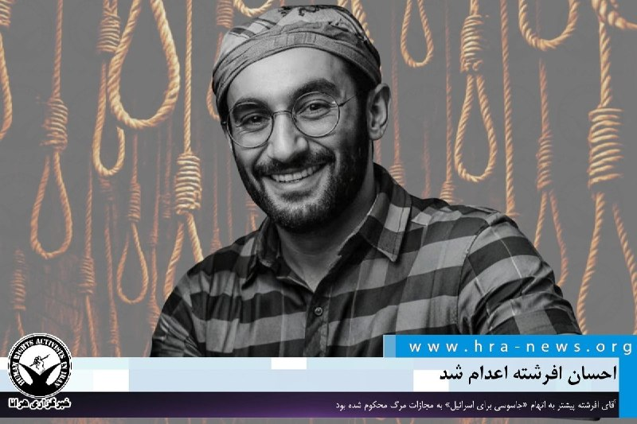

احسان افرشته به اتهام «جاسوسی» اعدام شد

❗️
❗️
❗️
❗️
❗️– مرکز رسانه قوه قضاییه از اجرای حکم اعدام احسان افرشته، دانش‌آموخته مهندسی عمران در مقطع کارشناسی ارشد و متخصص شبکه و فناوری اطلاعات، خبر داد. آقای افرشته پیشتر به اتهام «جاسوسی برای اسرائیل» به مجازات مرگ محکوم شده بود و این حکم سحرگاه امروز به مرحله اجرا درآمد. بر اساس داده‌های گردآوری‌شده توسط هرانا، همزمان با آغاز درگیری‌های نظامی، روند صدور و اجرای احکام اعدام در پرونده‌های سیاسی و امنیتی افزایش یافته و تاکنون ۳۱ زندانی با این اتهامات در این بازه زمانی اعدام شده‌اند.

ادامه مطلب

#احسان_افرشته #اعدام

↘️
@hranews_bot تماس ✉️ - @Hranews کانال هرانا 🆑

## manototv — post 105387

  

هم‌زمان با سفر دونالد ترامپ به چین و آغاز گفت‌وگوها درباره جنگ جمهوری اسلامی و اسرائیل، مقام‌های آمریکایی پکن را متهم کردند که با خرید گسترده نفت ایران، به «بزرگ‌ترین حامی دولتی تروریسم» کمک مالی می‌کند.

دونالد ترامپ امروز برای دیدار با شی جین‌پینگ، رئیس‌جمهوری چین، راهی پکن شد؛ دیداری که جنگ جمهوری اسلامی و اسرائیل و بحران تنگه هرمز از محورهای اصلی آن عنوان شده است.

در آستانه این سفر، اسکات بسنت، وزیر خزانه‌داری آمریکا، از چین خواست جمهوری اسلامی را برای بازگشایی تنگه هرمز تحت فشار قرار دهد و گفت پکن با خرید نفت ایران، «بزرگ‌ترین حامی دولتی تروریسم» را تأمین مالی می‌کند.

وزیر خزانه‌داری آمریکا در گفت‌وگو با فاکس‌نیوز گفت: «ببینیم آیا چین حاضر است از دیپلماسی استفاده کند و جمهوری اسلامی را وادار به باز کردن تنگه کند یا نه.»

چین تاکنون در قبال جنگ موضعی محتاطانه اتخاذ کرده و فراتر از انتقاد از آمریکا و اسرائیل، نقش مستقیمی در حل بحران ایفا نکرده است.
این دیدار در شرایطی برگزار می‌شود که تنش‌ها در منطقه، امنیت انرژی چین و تجارت جهانی از مسیر تنگه هرمز را تحت تأثیر قرار داده است.

## manototv — post 105386

  

رویترز به نقل از مقام‌های غربی و جمهوری اسلامی گزارش داد عربستان سعودی در جریان گسترش جنگ منطقه‌ای، در واکنش به حملاتی در خاک این کشور، چندین حمله اعلام‌نشده علیه جمهوری اسلامی انجام داده است.

رویترز در گزارشی اختصاصی نوشت عربستان سعودی، در اقدامی بی‌سابقه، حملات محرمانه‌ای را علیه جمهوری اسلامی انجام داده است.

به گفته دو مقام غربی مطلع و دو مقام جمهوری اسلامی، این حملات در واکنش به حملاتی صورت گرفته که در جریان جنگ در خاک عربستان انجام شده بود.

این حملات که پیش‌تر رسانه‌ای نشده بود، نخستین مورد شناخته‌شده از اقدام مستقیم نظامی عربستان در خاک ایران به شمار می‌رود؛ اقدامی که به نوشته رویترز نشان می‌دهد ریاض در دفاع از خود در برابر جمهوری اسلامی، رویکردی تهاجمی‌تر در پیش گرفته است.

## manototv — post 105385

  

رسانه‌های حکومتی بامداد امروز از اعدام احسان افراشته خبر دادند.

قوه قضاییه جمهوری اسلامی اعلام کرده احسان افراشته، فرزند مصطفی، با اتهام‌هایی از جمله «جاسوسی» و «همکاری اطلاعاتی به نفع اسرائیل» بازداشت، محاکمه و پس از تایید حکم در دیوان عالی کشور اعدام شده است.

با این حال، نهادهای حقوق بشری و منابع مستقل پیش‌تر گزارش داده بودند که احسان افراشته ماه‌ها در سلول انفرادی نگهداری شده و اعترافات او تحت فشار و در شرایطی غیرشفاف اخذ شده است. همچنین گزارش‌هایی درباره محرومیت او از دسترسی مؤثر به وکیل مستقل و وجود فشارهای امنیتی در روند پرونده منتشر شده بود.

بر اساس اصول دادرسی عادلانه، هر اعترافی که تحت فشار، تهدید یا شکنجه گرفته شود فاقد اعتبار حقوقی است و متهم، به‌ویژه در پرونده‌های منتهی به مجازات اعدام، باید از حق دسترسی کامل به وکیل مستقل و دادگاه بی‌طرف برخوردار باشد.

پرونده احسان افراشته از سوی نهادهای حقوق بشری نمونه‌ای از استفاده از اتهام‌های امنیتی و مجازات اعدام در فضایی غیرشفاف توصیف شده؛ روندی که سال‌هاست درباره عملکرد دادگاه‌های انقلاب جمهوری اسلامی مورد انتقاد قرار دارد.

## manototv — post 105384

  <a href="telegram/content/manototv_105384_1778660977.mp4" target="_blank">🎬 Download video</a>

یک مقام ارشد نیروی دریایی سپاه پاسداران اعلام کرد جمهوری اسلامی تعریف خود از تنگه هرمز را گسترش داده و این منطقه اکنون به یک «محدوده عملیاتی وسیع» تبدیل شده است.

به گفته این مقام نظامی، محدوده عملیاتی تنگه هرمز دیگر تنها به آبراه باریک میان ایران و عمان محدود نیست و اکنون بخش گسترده‌ای از آب‌های اطراف، از جاسک تا جزایر تنب را شامل می‌شود.

رسانه‌های حکومتی گزارش داده‌اند محدوده‌ای که جمهوری اسلامی آن را منطقه عملیاتی تنگه هرمز می‌داند، از حدود ۲۰ تا ۳۰ مایل دریایی در گذشته، به ۲۰۰ تا ۳۰۰ مایل افزایش یافته است.

این اظهارات در حالی مطرح می‌شود که تنش‌ها در خلیج فارس ادامه دارد و نگرانی‌ها درباره امنیت عبور نفتکش‌ها و کشتی‌های تجاری از تنگه هرمز افزایش یافته است.

## manototv — post 105383

  <a href="telegram/content/manototv_105383_1778660978.mp4" target="_blank">🎬 Download video</a>

هم‌زمان با سفر رسمی دونالد ترامپ به چین، گروهی از مدیران ارشد بزرگ‌ترین شرکت‌های فناوری، مالی و صنعتی آمریکا نیز او را در این سفر همراهی می‌کنند. کاخ سفید اعلام کرده ایلان ماسک نیز در هواپیمای ریاست‌جمهوری آمریکا حضور دارد و همراه هیئت آمریکایی راهی پکن شده است.
در میان چهره‌های حاضر در این سفر، نام تیم کوک مدیرعامل اپل، جنسن هوانگ مدیرعامل انویدیا، لری فینک مدیرعامل بلک‌راک، دیوید سولومون مدیرعامل گلدمن ساکس و مدیران شرکت‌هایی چون بوئینگ، کوالکام، ویزا، مسترکارت، متا، مایکرون و سیتی‌گروپ دیده می‌شود.
رسانه‌های آمریکایی گزارش داده‌اند که محور اصلی این سفر، گفت‌وگو درباره روابط تجاری، فناوری، هوش مصنوعی، زنجیره تأمین جهانی و همکاری‌های اقتصادی میان آمریکا و چین است.
این سفر در حالی انجام می‌شود که روابط واشینگتن و پکن در ماه‌های اخیر بر سر مسائل تجاری، رقابت فناوری و تنش‌های ژئوپولیتیکی با چالش‌های گسترده‌ای روبه‌رو بوده است.

## manototv — post 105382

  <a href="telegram/content/manototv_105382_1778660979.mp4" target="_blank">🎬 Download video</a>

‌
الجزیره به نقل از منابع دیپلماتیک گزارش داد ۱۱۲ کشور به پیش‌نویس قطعنامه‌ای در شورای امنیت سازمان ملل پیوسته‌اند که از سوی آمریکا و کشورهای خلیج فارس درباره آزادی کشتیرانی در تنگه هرمز ارائه شده است.

به گفته این منابع، هند، ژاپن و بیشتر کشورهای اروپایی در میان حامیان این پیش‌نویس قرار دارند.

منابع الجزیره همچنین گفتند حمایت ۱۱۲ کشور از این قطعنامه، نشان‌دهنده پشتیبانی گسترده بین‌المللی از ابتکار آمریکا و کشورهای خلیج فارس درباره تنگه هرمز است.

## manototv — post 105380

  <a href="telegram/content/manototv_105380_1778660980.mp4" target="_blank">🎬 Download video</a>

تماسی از تهران:
«می‌گفت جنگ شد و بعد رها شد… همه‌چیز روی هوا موند و شرایط افتضاح‌تر شد.
می‌گفت قبلش حداقل یه جور داشتیم زندگی می‌کردیم

## alonews — post 119671

  <a href="telegram/content/alonews_119671_1778660984.webm" target="_blank">🎬 Download video</a>

👈آژانس بین‌المللی انرژی: جهان ذخایر نفت خود را با سرعت بی‌سابقه در پرتو جنگ «خاورمیانه» مصرف می‌کند.

✅ @AloNews خبر جنگ

## alonews — post 119670

  <a href="telegram/content/alonews_119670_1778660984.webm" target="_blank">🎬 Download video</a>

👈رویترز: قیمت نفت روز چهارشنبه پس از سه روز افزایش شدید، کاهش یافت، در حالی که قیمت طلا ثابت ماند

✅ @AloNews خبر جنگ

## alonews — post 119666

  <a href="telegram/content/alonews_119666_1778660984.webm" target="_blank">🎬 Download video</a>

⭕️یک اعدام دیگر

🔴میزان خبرگزاری قوه قضاییه جمهوری اسلامی با انتشار تصاویر بالا نوشت: احسان افرشته اعدام شد

🔴قوه قضاییه مدعی شده که: افرشته در نپال از سوی موساد آموزش جاسوسی دیده و اطلاعات حساس کشور را به اسرائیل می‌فروخت.

✅@AloNews

## alonews — post 119665

  <a href="telegram/content/alonews_119665_1778660985.webm" target="_blank">🎬 Download video</a>

👈به گزارش رسانه های عبری : نتانیاهو امشب جلسه‌‌ی امنیتی محدود برگزار میکنه

✅ @AloNews خبر جنگ

## alonews — post 119664

  <a href="telegram/content/alonews_119664_1778660985.webm" target="_blank">🎬 Download video</a>

👈رویترز: قیمت نفت روز چهارشنبه پس از سه روز افزایش شدید، کاهش یافت، در حالی که قیمت طلا ثابت ماند، زیرا سرمایه‌گذاران در انتظار نشست مورد انتظار ترامپ و شی جین پینگ، همتای چینی او در پکن، در بحبوحه تنش‌های مداوم مربوط به جنگ در ایران و بسته شدن تنگه هرمز هستند

✅ @AloNews خبر جنگ

## alonews — post 119663

  <a href="telegram/content/alonews_119663_1778660985.mp4" target="_blank">🎬 Download video</a>

👈فرودِ هواپیمای ترامپ تو الاسکا برای استراحت و پرواز مجدد

✅ @AloNews خبر جنگ

## alonews — post 119662

  <a href="telegram/content/alonews_119662_1778660987.webm" target="_blank">🎬 Download video</a>

👈با اعلام قوه قضاییه جمهوری اسلامی، احسان افرشته به اتهام «همکاری با اسرائیل»، بامداد چهارشنبه اعدام شد.

✅ @AloNews خبر جنگ

## alonews — post 119661

  <a href="telegram/content/alonews_119661_1778660987.webm" target="_blank">🎬 Download video</a>

👈بلومبرگ: نرخ بیکاری در فرانسه برای اولین بار در 5 سال گذشته از 8 درصد گذشت.

✅ @AloMews خبر جنگ

## alonews — post 119660

  <a href="telegram/content/alonews_119660_1778660988.webm" target="_blank">🎬 Download video</a>

👈بلومبرگ: یک نفتکش بزرگ چینی در حال عبور از تنگه هرمز شناسایی شده است

✅ @AloNews خبر جنگ

## alonews — post 119659

  <a href="telegram/content/alonews_119659_1778660988.webm" target="_blank">🎬 Download video</a>

👈تشکر اصناف و اتحادیه‌ها از پزشکیان برای جلوگیری از توقف کسب‌وکارها با اینترنت پرو

✅ @AloNews خبر جنگ

## alonews — post 119658

  <a href="telegram/content/alonews_119658_1778660988.webm" target="_blank">🎬 Download video</a>

👈وزیر اقتصاد: انتقال کریدورها به بنادر شمالی و مرزهای زمینی در دستور کار است

✅ @AloNews خبر جنگ

## alonews — post 119657

  <a href="telegram/content/alonews_119657_1778660989.webm" target="_blank">🎬 Download video</a>

👈المیادین به نقل از لاوروف: روسیه پیشنهاد تهیه پیش نویس بیانیه ای از سوی گروه بریکس در مورد وضعیت تنگه هرمز را ارائه کرد، اما اختلافات ایران و امارات مانع از آن شد.

✅ @AloNews خبر جنگ

## alonews — post 119656

  <a href="telegram/content/alonews_119656_1778660989.webm" target="_blank">🎬 Download video</a>

👈شبکه NDTV تصاویر ماهواره‌ای با وضوح بالا (تهیه‌شده از شرکت Vantor) منتشر کرده است که به‌نظر می‌رسد گزارش‌ها مبنی بر پناه دادن پاکستان به دست‌کم یک فروند هواپیمای ترابری نظامی C-130H نیروی هوایی ایران در پایگاه هوایی نورخانِ نیروی هوایی پاکستان (PAF) را تأیید می‌کند.

✅ @AloNews خبر جنگ

## alonews — post 119655

  <a href="telegram/content/alonews_119655_1778660989.webm" target="_blank">🎬 Download video</a>

👈روزنامه نیویورک تایمز با استناد به ارزیابی‌های اطلاعاتی طبقه‌بندی‌شده آمریکا: ایران به بیشتر سایت‌های موشکی و سکوهای پرتاب خود دسترسی مجدد پیدا کرده است

✅ @AloNews خبر جنگ

## alonews — post 119653

  <a href="telegram/content/alonews_119653_1778660990.webm" target="_blank">🎬 Download video</a>

👈مارکو روبیو توی هواپیما برای سفر به چین مشابه ست نایکی رو پوشیده که که مادورو هنگام دستگیری پوشیده بود !

✅ @AloNews خبر جنگ

## alonews — post 119652

  <a href="telegram/content/alonews_119652_1778660990.webm" target="_blank">🎬 Download video</a>

👈حمله پهپادی اسرائیل به یک خودرو در جاده ساحلی جنوب بیروت

✅ @AloNews خبر جنگ

---
📅 بروزرسانی: 1405/02/23 01:20
---

## VahidOOnLine — post 239803

  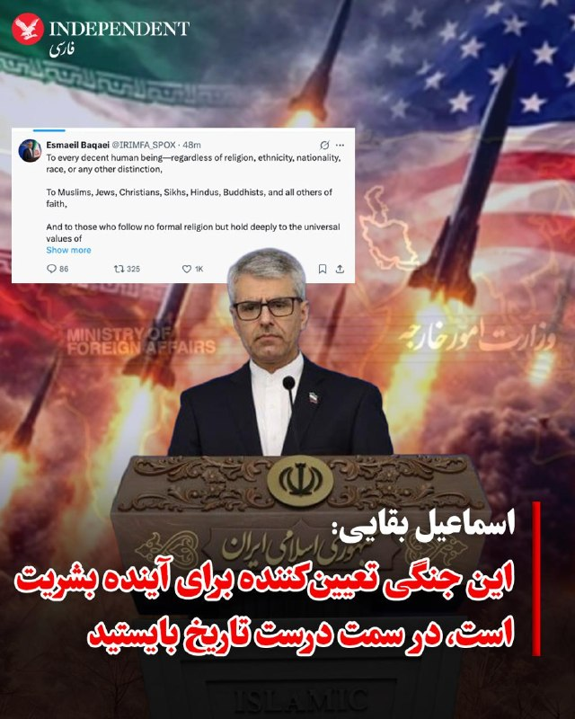

♦️اسماعیل بقایی، سخنگوی وزارت امور خارجه جمهوری اسلامی، با انتشار پیامی در اکس، درگیری‌های جاری را «نبردی سرنوشت‌ساز برای آینده بشریت» توصیف کرد و گفت: «ایالات متحده و اسرائیل این جنگ تجاوزکارانه را در ۲۸ فوریه ۲۰۲۶، برای دومین بار در کمتر از یک سال و در حالی که ایران و آمریکا در حال مذاکرات دیپلماتیک بودند، آغاز کردند.» بقایی با تاکید بر اینکه این تنها جنگی بر سر زمین یا ژئوپلیتیک نیست، گفت: «این نبردی است میان دروغگویان حرفه‌ای که برای جنایات خود توجیه می‌تراشند و ملتی سربلند که با تکیه بر قدرت و اراده خود از میهن و کرامت انسانی دفاع می‌کنند.» او سکوت در برابر این وضعیت را همدستی با شر دانست و گفت: «شجاعت اخلاقی برای سخن گفتن، عمل کردن و ایستادن در سمت درست تاریخ را پیدا کنید، پیش از آنکه جهان به ورطه بی‌قانونی و انقیاد سقوط کند. انتخاب با شماست و تاریخ آن را به یاد خواهد داشت».
‌🇸🇦 Indypersian

🤖 @VahidOOnLine

## VahidOOnLine — post 239802

  

سازمان مدیریت بحران اعلام کرد باتوجه به بررسی‌های اولیه و ارزیابی تیم‌های کارشناسی، زمین‌لرزه‌ها در مرز استان‌های تهران و مازندران خساراتی درپی نداشته است.
مرکز لرزه‌نگاری در اطلاعیه‌ای اعلام کرد ساعت ۲۳:۴۶ سه‌شنبه شب زمین‌لرزه‌ای به بزرگی ۴.۶ مرز تهران و مازندران را لرزاند. زمین‌لرزه در تهران حدود ۱۰ ثانیه طول کشید.
این لرزش در شرق تهران، ورامین، پاکدشت، پردیس و بخش‌هایی از شمیرانات بیشتر احساس شد.
همچنین چهار پس‌لرزه‌ در استان تهران رخ داد که آخرین پس‌لرزه‌ها به بزرگی ۴ و ۳.۴ بودند.

‌🏁 🇬🇧 IranintlTV

🤖 @VahidOOnLine

## VahidOOnLine — post 239801

  

♦️به گزارش رویترز، عراق و پاکستان برای انتقال نفت و گاز طبیعی مایع (LNG) از خلیج فارس با تهران به توافق رسیده‌اند؛ اقدامی که به گفته «پنج منبع آگاه»، نشان‌دهنده توانایی رژیم ایران در هدایت جریان انرژی از طریق تنگه هرمز است. این توافق‌های جدید در حالی صورت می‌گیرد که اشراف تهران بر این آبراه حیاتی، قدرت چانه‌زنی این کشور در معادلات انرژی منطقه را افزایش داده و مسیرهای تازه‌ای را برای صادرات سوخت در بازارهای منطقه‌ای ایجاد کرده است.
‌🇸🇦 Indypersian

🤖 @VahidOOnLine

## VahidOOnLine — post 239800

  <a href="telegram/content/VahidOOnLine_239800_1778622608.mp4" target="_blank">🎬 Download video</a>

رئیس سازمان هلال احمر اعلام کرد زلزله در تهران و کرج «هیچ» خسارت مالی و جانی در پی نداشته است.
پیش‌تر زلزله‌ای به بزرگی ۴.۶ در مقیاس ریشتر، مرز استان‌های تهران و مازندران را لرزاند.
‌🏁 🇬🇧 ManotoTV

🤖 @VahidOOnLine

## VahidOOnLine — post 239799

  

♦️به گزارش مرکز لرزه‌نگاری ایران، در نخستین ساعت بامداد چهارشنبه، ۲۳ اردیبهشت‌ماه، وقوع دو پس‌لرزه به‌ترتیب به بزرگی ۴ و ۳.۴ در پردیس، تهران را لرزاند. براساس گزارش فارس، این پس‌لرزه‌ها در ورامین، پاکدشت، پردیس و بخش‌هایی از شمیرانات حس شده است. پیش از این، زلزله به بزرگی ۴.۶ در مرز تهران و مازندران رخ داد که پردیس مرکز آن اعلام شد.
‌🇸🇦 Indypersian

🤖 @VahidOOnLine

## VahidOOnLine — post 239798

  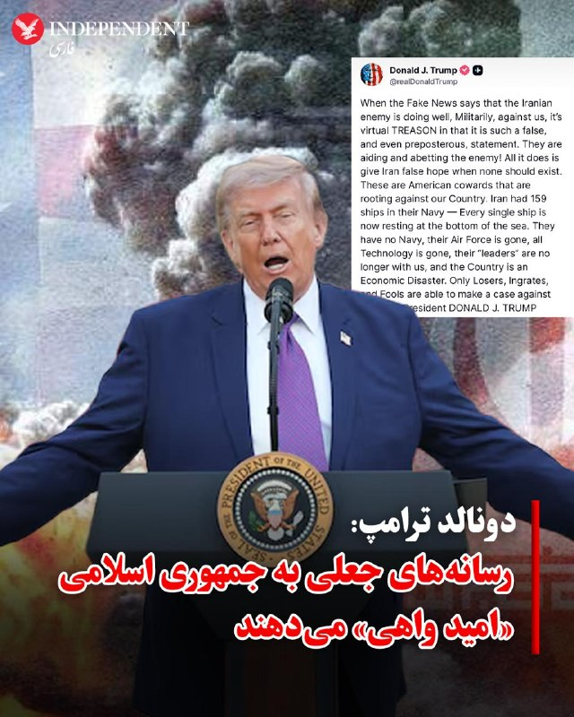

♦️دونالد ترامپ، رئیس‌جمهوری ایالات متحده، با انتشار پیامی در شبکه اجتماعی «تروث سوشال»، گزارش‌های رسانه‌ها درباره موفقیت‌های نظامی جمهوری اسلامی در برابر آمریکا را «دروغین» و مصداق عینی «خیانت» خواند و گفت: «این اظهارات مضحک تنها به ایران امیدی واهی می‌دهد؛ این‌ها ترسوهای آمریکایی هستند که علیه کشور خودشان ریشه می‌دوانند و با حمایت از دشمن، به آن‌‌ها کمک می‌کنند.» ترامپ با اشاره به نابودی توان نظامی جمهوری اسلامی گفت: «ایران درگیر یک فاجعه اقتصادی است.» او در پایان تاکید کرد که تنها «بازندگان، افراد ناسپاس و احمق‌ها» می‌توانند علیه آمریکا استدلال کنند.
‌🇸🇦 Indypersian

🤖 @VahidOOnLine

## VahidOOnLine — post 239797

  

♦️به گزارش ایرنا، مرکز زمین‌لرزه سه‌شنبه‌شب تهران، در مرز این استان با مازندران در حوالی پردیس بوده است. براساس این گزارش، این زلزله به بزرگی ۴.۶، ساعت ۲۳:۴۶:۰۷ سه‌شنبه‌شب، ۲۲ اردیبهشت‌ماه، در عمق ۱۰ کیلومتر رخداد و حدود ۱۰ ثانیه به طول انجامید. همزمان، سخنگوی اورژانس تهران اعلام کرد در پی زمین لرزه در تهران تا این لحظه مصدومی گزارش نشده است
‌🇸🇦 Indypersian

🤖 @VahidOOnLine

## VahidOOnLine — post 239796

  

♦️خبرگزاری تسنیم، وابسته به سپاه پاسداران، گزارش داد عباس عراقچی، وزیر خارجه جمهوری اسلامی، در دیدار با معاون وزیر خارجه نروژ، مدعی شد «فقدان حسن‌نیت، زیاده‌خواهی و عدم صداقت آمریکا» مهم‌ترین مانع پایان قطعی جنگ و دستیابی به توافق احتمالی است. او همچنین آمریکا و اسرائیل را عامل وضعیت جاری در تنگه هرمز معرفی کرد و گفت جمهوری اسلامی در حال بررسی تدوین مقررات مرتبط با این آبراه بر اساس حقوق بین‌الملل است.
‌🇸🇦 Indypersian

🤖 @VahidOOnLine

## VahidOOnLine — post 239795

  

دونالد ترامپ در شبکه تروث سوشال نوشت وقتی رسانه‌های «جعلی» می‌گویند دشمن ایرانی از نظر نظامی در برابر آمریکا عملکرد خوبی دارد، این نوعی خیانت است، زیرا چنین ادعایی کاملا نادرست و حتی مضحک است.
او افزود: آن‌ها در حال کمک به دشمن هستند و به جمهوری اسلامی امید می‌دهند در حالی که نباید هیچ امیدی برای او وجود داشته باشد.
‌🏁 🇬🇧 IranintlTV

🤖 @VahidOOnLine

## VahidOOnLine — post 239794

  

علی احتشام، امام جمعه کاشان گفت: «جمهوری اسلامی نه یکی از چهار قدرت، بلکه تنها ابرقدرت جهان است و ملت ایران هشت کشور منطقه و آمریکا را از کمال ارتفاع ساقط کرد و امروز با حضور در خیابان‌ها اجازه نداد جام زهر دیگری نوشیده شود.»

او افزود: «اگر مردم کف خیابان نبودند، چه بسا جام زهر دیگری نوشیده می‌شد.»
‌🏁 🇬🇧 IranintlTV

🤖 @VahidOOnLine

## VahidOOnLine — post 239793

  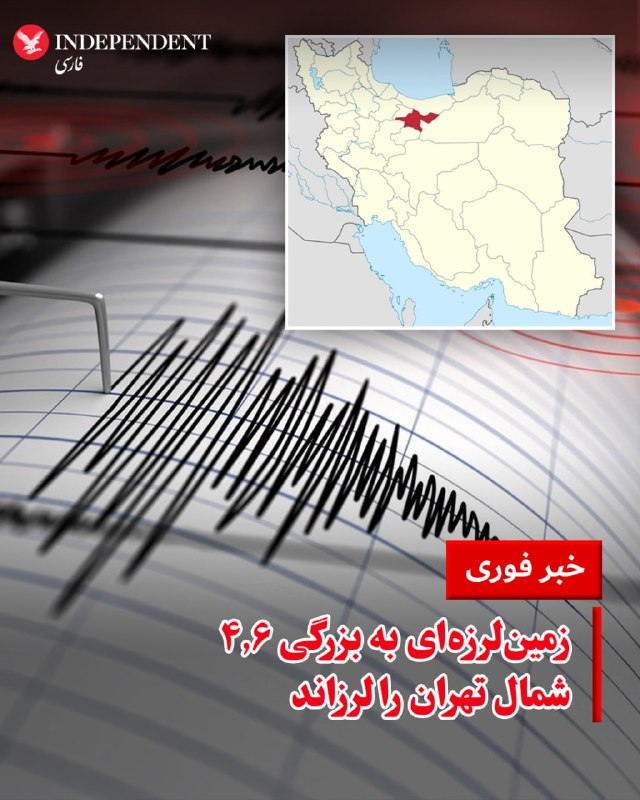

♦️به گزارش فارس، زلزله‌ای به بزرگی ۴.۶، سه‌شنبه‌شب، ۲۲ اردیبهشت‌ماه، مرز تهران و مازندران را لرزاند.
‌🇸🇦 Indypersian

🤖 @VahidOOnLine

## VahidOOnLine — post 239792

  

رسانه‌های ایران از وقوع زمین‌لرزه به بزرگی ۴.۶ در مرز استان‌های تهران و مازندران خبر دادند.

خبرگزاری فارس همچنین از زمین‌لرزه در کرج خبر داد.

همزمان خبرگزاری دولتی ایرنا گزارش داد زمین‌لرزه در تهران حدود ۱۰ ثانیه طول کشیده است.
‌🏁 🇬🇧 IranintlTV

🤖 @VahidOOnLine

## VahidOOnLine — post 239790

  <a href="telegram/content/VahidOOnLine_239790_1778622615.mp4" target="_blank">🎬 Download video</a>

‌
خبرگزاری‌های داخل ایران گزارش دادند دقایقی پیش زلزله تهران و کرج را لرزاند. به گزارش این خبرگزاری‌ها سمت شرق تهران زمین‌لرزه بسیار شدیدتر بوده است.
‌🏁 🇬🇧 ManotoTV

🤖 @VahidOOnLine

## VahidOOnLine — post 239789

  

سعید سیاه‌سرانی، دبیر ستاد راهیان نور دریایی، گفت: «بدون اراده جمهوری اسلامی اجازه عبور حتی یک لیتر نفت از تنگه هرمز داده نمی‌شود.»

او افزود: «تنگه هرمز جزو خاک ما است، شناورهایی که رد می‌شوند باید اجازه بگیرند و به زبان فارسی صحبت کنند و از نقاطی که ما تعیین می‌کنیم عبور کنند.»
‌🏁 🇬🇧 IranintlTV

🤖 @VahidOOnLine

## VahidOOnLine — post 239788

  

♦️وزارت امور خارجه جمهوری اسلامی روز سه‌شنبه ۲۲ اردیبهشت، بازداشت چهار نفر توسط کویت را که گفته می‌شود با سپاه پاسداران در ارتباط هستند، محکوم کرد. این وزارتخانه اعلام کرد که این افراد در حال گشت‌زنی دریایی بوده‌اند و تنها به دلیل «اختلال در سیستم ناوبری» وارد آب‌های سرزمینی این کشور حوزه خلیج فارس شده‌اند.

همچنین وزارت خارجه جمهوری اسلامی اظهارات مقامات کویتی مبنی بر برنامه‌ریزی ایران برای انجام «اقدامات خصمانه» علیه این کشور را به شدت رد کرد. این تنش دیپلماتیک در حالی رخ می‌دهد که امنیت دریانوردی در منطقه به موضوعی حساس تبدیل شده است.
‌🇸🇦 Indypersian

🤖 @VahidOOnLine

## VahidOOnLine — post 239787

  

امارات متحده عربی اعلام کرد ۱۶ شهروند لبنانی و پنج نهاد مستقر در لبنان را به دلیل ارتباط با حزب‌الله در فهرست تروریستی این کشور قرار داده است.

در همین چارچوب، «موسسه قرض‌الحسن» و چهار نهاد دیگر نیز به دلیل ارتباط با حزب‌الله در این فهرست قرار گرفته‌اند.

امارات متحده عربی تاکید کرد این اقدامات در راستای مهار آفات تروریسم، محدود کردن گسترش آن و قطع تامین مالی فرامرزی انجام شده است.
‌🏁 🇬🇧 IranintlTV

🤖 @VahidOOnLine

## VahidOOnLine — post 239786

  

♦️ وزارت دفاع بریتانیا روز سه‌شنبه، ۲۲ اردیبهشت، اعلام کرد که این کشور تجهیزات خودکار مین‌یاب و سیستم‌های ضدپهپادی با فناوری بسیار نوین را به تنگه هرمز ارسال می‌کند. طبق بیانیه صادر شده، جان هیلی، وزیر دفاع بریتانیا، تاکید کرد که بریتانیا نقشی کلیدی در تامین امنیت تنگه هرمز ایفا می‌کند و امروز با ارسال تجهیزات پیشرفته، تعهد خود را برای حفاظت از منافع کشور و امنیت این آبراه نشان می‌دهد.

بریتانیا همچنین در پایان هفته گذشته اعلام کرده بود که ناو «اچ‌ام‌اس دراگون» نیروی دریایی سلطنتی را برای پشتیبانی از عملیات مین‌روبی در این مسیر آبی پرتردد به خاورمیانه اعزام می‌کند. علاوه بر این، بریتانیا و فرانسه به طور مشترک تلاش‌هایی را برای تشکیل یک ماموریت بین‌المللی با هدف بهبود امنیت خطوط کشتیرانی در این تنگه هدایت کرده‌اند.
‌🇸🇦 Indypersian

🤖 @VahidOOnLine

## VahidOOnLine — post 239785

  <a href="telegram/content/VahidOOnLine_239785_1778622619.mp4" target="_blank">🎬 Download video</a>

♦️دونالد ترامپ، رئیس‌جمهوری آمریکا، روز سه‌شنبه ۲۲ اردیبهشت‌ماه پیش از سفر رسمی به چین و دیدار با شی جین‌پینگ، در پاسخ به سوالی درباره خط قرمز پایان آتش‌بس با ایران گفت: «در طول پرواز به آن فکر خواهیم کرد و در روزهای آینده هم درباره آن فکر می‌کنیم.»

ترامپ همچنین گفت آمریکا ارتش جمهوری اسلامی را «به‌طور کامل شکست داده» و افزود: «کار آن تمام شده است.»
‌🇸🇦 Indypersian

🤖 @VahidOOnLine

## VahidOOnLine — post 239784

  

در پی بازداشت چهار فرد «وابسته به سپاه پاسداران» در کویت، وزارت خارجه جمهوری اسلامی برنامه‌ریزی برای انجام اقدامات خصمانه علیه کویت را بی‌اساس و مردود دانست.

وزارت خارجه جمهوری اسلامی در بیانیه‌ای اعلام کرد این چهار مامور در چارچوب ماموریت مرسوم گشت‌زنی دریایی مشغول انجام وظیفه بوده‌اند و به دلیل «اختلال در سامانه ناوبری» وارد آب‌های سرزمینی کویت شده‌اند.

این وزارتخانه از مراجع کویت خواست از اظهارنظرهای شتاب‌زده و طرح ادعاهای بی‌اساس خودداری کرده و موضوع را از طریق مجاری رسمی پیگیری کنند. وزارت خارجه جمهوری اسلامی همچنین خواهان آزادی این چهار مامور بازداشت‌شده شد.
‌🏁 🇬🇧 IranintlTV

🤖 @VahidOOnLine

## VahidOOnLine — post 239782

  <a href="telegram/content/VahidOOnLine_239782_1778622621.mp4" target="_blank">🎬 Download video</a>

رویترز به نقل از دو مقام غربی و دو مقام ایرانی گزارش داد عربستان سعودی در واکنش به حملات انجام‌شده علیه این کشور، چند حمله نظامی اعلام‌نشده علیه جمهوری اسلامی انجام داده است.

بر اساس این گزارش، حملات هوایی عربستان در اواخر ماه مارس توسط نیروی هوایی این کشور انجام شده و نخستین مورد شناخته‌شده از حمله مستقیم نظامی عربستان به خاک ایران به شمار می‌رود.

رویترز نوشت این حملات پس از آن انجام شد که جمهوری اسلامی در جریان جنگ اخیر، همه کشورهای عضو شورای همکاری خلیج فارس را با موشک و پهپاد هدف قرار داد و به زیرساخت‌های نفتی، فرودگاه‌ها و مراکز غیرنظامی حمله کرد.

به گفته منابع رویترز، پس از حملات عربستان، تهران و ریاض وارد تماس‌های فشرده دیپلماتیک شدند و عربستان نیز هشدار داده بود در صورت ادامه حملات، پاسخ‌های بیشتری خواهد داد.

یک مقام ایرانی به رویترز گفت تهران و ریاض در نهایت برای کاهش تنش به تفاهم رسیدند؛ تفاهمی که هدف آن «توقف درگیری‌ها، حفظ منافع متقابل و جلوگیری از تشدید تنش» بوده است.

رویترز همچنین گزارش داد شمار حملات موشکی و پهپادی علیه عربستان پس از این تفاهم به‌طور قابل توجهی کاهش یافت.
‌🏁 🇬🇧 ManotoTV

🤖 @VahidOOnLine

## mwarmonitor — post 9011

📝 سوالی انتقادی پیشنهادی دارید بفرمایید

## mwarmonitor — post 9010

  

🔴بر اساس گزارش CBS درباره ادعای نگهداری هواپیماهای ایرانی توسط پاکستان در پایگاه هوایی نورخان، تصاویر منتشرشده توسط شرکت چینی تحت تحریم «Mizarvision» در آوریل ۲۰۲۶ نشان می‌دهد یک هواپیمای C-130 با استتار شنی در این محل حضور دارد. اگر پاکستان از این نوع رنگ‌آمیزی…

## mwarmonitor — post 9009

  

📰(رویترز) - کلودیا شینباوم، رئیس‌جمهور مکزیک، روز دوشنبه اعلام کرد که از همکاری مقامات سفارت آمریکا با ایالت شمالی «چی‌واوا» برای مبارزه با کارتل‌های مواد مخدر اطلاعی نداشته است. وی در پی کشته شدن این مقامات در یک تصادف رانندگی، گفت که دولتش بررسی خواهد کرد…

## mwarmonitor — post 9008

  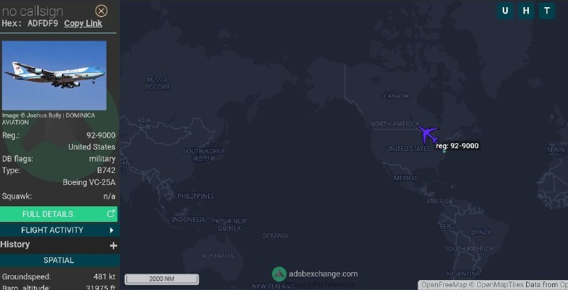

🇺🇸✈️🇨🇳 ترامپ واشنگتن را به مقصد پکن، چین ترک کرد.

هواپیمای ریاست‌جمهوری آمریکا (Air Force One) بوئینگ VC-25A با شماره ثبت 92-9000

@mwarmonitor

## mwarmonitor — post 9007

📝 به نظر می‌رسد سیستمِ مدیریتِ بلایایِ الهی هم به این نتیجه رسیده که در ایران، مرگِ تدریجی دیگر از مد افتاده و باید کمی هیجان و سرعت به فرآیندِ انقراضِ ما تزریق کند. انگار فرشته‌ی عذاب نشسته بالای سرِ تقویمِ تهران و با خودش می‌گوید: «خب، این‌ها که تحریم هستند،…

## mwarmonitor — post 9005

✈️پرواز بمب‌افکن‌های راهبردی از نوع B-1B Lancer از پایگاه RAF Fairford ✈️به‌طور جالب توجهی، بمب‌افکن تک‌فروندی B-1B با نام “Lancer” که از RAF Fairford (کد EGVA) پرواز می‌کند (و چهلمین مأموریت آموزشی از این پایگاه از زمان آغاز آتش‌بس را انجام می‌دهد)، موقعیت…

## mwarmonitor — post 9004

🇮🇱اسرائیل نگران است که ترامپ با ایران یک «توافق بد» امضا کند؛ توافقی که برنامه هسته‌ای ایران را تا حدی دست‌نخورده باقی بگذارد و برنامه موشکی بالستیک ایران و همچنین حمایت این کشور از نیروهای نیابتی منطقه‌ای را نادیده بگیرد - CNN

🇮🇱یک مقام اسرائیلی به CNN گفته است: «اگر هیچ توافقی حاصل نشود خوشحال خواهیم شد» و «اگر محاصره/بسته بودن تنگه هرمز ادامه پیدا کند هم خوشحال خواهیم شد».

@mwarmonitor

## mwarmonitor — post 9003

🔸خبرنگار: آقای رئیس‌جمهور، پیامتان به مردم چین در آستانه این نشست (اجلاس سران) چیست؟ 🔹ترامپ: این است که ما برای دهه‌های متمادی، رابطه‌ی فوق‌العاده‌ای خواهیم داشت. رابطه‌ی من با رئیس‌جمهور «شی»، رابطه‌ای بی‌نظیر است؛ ما همیشه با هم کنار آمده‌ایم. ما با چین…

## mwarmonitor — post 9002

  

«وقتی «اخبار جعلی» (Fake News) می‌گویند که دشمن ایرانی از نظر نظامی در برابر ما خوب عمل می‌کند، این عملاً به مثابه خیانت است، زیرا چنین اظهارنظری کذب و حتی مضحک است. آن‌ها در حال کمک و یاری رساندن به دشمن هستند!
تمام کاری که این کار انجام می‌دهد، دادن امید واهی به ایران است، در حالی که هیچ امیدی نباید وجود داشته باشد. این‌ها ترسوهای آمریکایی هستند که علیه کشورمان فعالیت می‌کنند. ایران ۱۵۹ کشتی در نیروی دریایی خود داشت — اکنون تک‌تک آن کشتی‌ها در کف دریا آرام گرفته‌اند. آن‌ها دیگر نیروی دریایی ندارند، نیروی هوایی‌شان از بین رفته، تمام تکنولوژی‌شان نابود شده، «رهبرانشان» دیگر در میان ما نیستند و این کشور یک فاجعه اقتصادی است.
فقط بازنده‌ها، ناسپاس‌ها و احمق‌ها می‌توانند علیه آمریکا استدلال کنند!

رئیس‌جمهور دونالد جی. ترامپ»

@mwarmonitor

## mwarmonitor — post 9001

تهران یه بچه زلزله امده

## mwarmonitor — post 9000

🔸خبرنگار: تالار پذیرایی شما چه تفاوتی با بقیه دارد؟ 🔹دونالد ترامپ: اتفاقی که افتاده این است که ما یک تالار پذیرایی داریم که هزینه‌اش کمتر از بودجه پیش‌بینی شده بوده، دقیقاً همین‌جا در حال ساخت است. من اندازه‌اش را دو برابر کردم چون مسلماً به آن نیاز داریم.…

## mwarmonitor — post 8999

🔸خبرنگار: آقای رئیس‌جمهور، شما قول داده بودید که تورم را پایین بیاورید. اما الان در بالاترین سطح خود در سه سال اخیر است. آیا سیاست‌های شما کار نمی‌کنند؟ چه اتفاقی دارد می‌افتد؟ 🔹ترامپ: سیاست‌های من فوق‌العاده خوب کار می‌کنند. اگر به زمان دقیقاً قبل از شروع…

## mwarmonitor — post 8998

🔸خبرنگار: آقای رئیس‌جمهور، تا چه زمانی به مذاکره با ایران ادامه می‌دهید؟ (چه زمانی مذاکره با ایران تمام می‌شود؟) 🔹ترامپ: خب، خواهیم دید چه پیش می‌آید. ما فقط یک توافق خوب خواهیم کرد. ارتش آن‌ها از بین رفته، نابود شده است. ما فقط یک توافق خوب خواهیم کرد و خواهیم…

## mwarmonitor — post 8997

🔸خبرنگار: آقای رئیس‌جمهور، تا چه زمانی به مذاکره با ایران ادامه می‌دهید؟ (چه زمانی مذاکره با ایران تمام می‌شود؟)
🔹ترامپ: خب، خواهیم دید چه پیش می‌آید. ما فقط یک توافق خوب خواهیم کرد. ارتش آن‌ها از بین رفته، نابود شده است. ما فقط یک توافق خوب خواهیم کرد و خواهیم دید چه می‌شود. اما من معتقدم که به هر شکلی، این [توافق] برای مردم آمریکا و در واقع برای مردم ایران بسیار خوب خواهد بود.
🔸خبرنگار: آیا شما پاکستانی‌ها را به عنوان میانجی در نظر می‌گیرید؟
🔹ترامپ: نه، آن‌ها عالی هستند. من فکر می‌کنم پاکستانی‌ها عالی بوده‌اند. فیلد مارشال و نخست‌وزیر پاکستان مطلقاً عالی بوده‌اند.
🔸خبرنگار: آقای رئیس‌جمهور، پیام شما به رئیس‌جمهور "شی" [رئیس‌جمهور چین] در رابطه با جنگ ایران چیست؟
🔹ترامپ: خب، فکر می‌کنم اولاً ما در مورد آن صحبت مفصلی خواهیم داشت. فکر می‌کنم او نسبتاً خوب بوده است، اگر صادقانه بگویم. به محاصره نگاه کنید، مشکلی نیست. آن‌ها مقدار زیادی از نفت خود را از آن منطقه می‌گیرند. ما مشکلی نداشتیم و او دوست من بوده است، کسی است که با هم کنار می‌آییم. و فکر می‌کنم خواهید دید که اتفاقات خوبی رخ خواهد داد. این سفر بسیار هیجان‌انگیزی خواهد بود و اتفاقات خوب زیادی خواهد افتاد.
🔸خبرنگار: آقای رئیس‌جمهور، آیا فکر می‌کنید او (رئیس‌جمهور چین) اصلاً نیاز دارد در مورد ایرانی‌ها مداخله کند؟ فکر می‌کنید او می‌تواند به هر شکلی کمک کند؟
🔹ترامپ: نه، فکر نمی‌کنم در مورد ایران به کمکی نیاز داشته باشیم. ما به هر شکلی پیروز می‌شویم. ما به صورت مسالمت‌آمیز یا غیر از آن پیروز می‌شویم. نیروی دریایی آن‌ها رفته، نیروی هوایی‌شان رفته، تک‌تک عناصر ماشین جنگی آن‌ها از بین رفته است. آن‌ها افراد زیادی را کشته‌اند، حداقل ۴۲ هزار نفر را در یک ماه و نیم گذشته کشته‌اند. ما پیروز می‌شویم، مهم نیست چطور حساب کنید.
🔸خبرنگار: آقای رئیس‌جمهور، آیا معتقدید سفر شما به چین بر اقتصاد بین‌الملل و قیمت نفت تأثیر خواهد گذاشت؟
🔹ترامپ: تأثیر مثبتی خواهد داشت. ما دیدار بسیار خوبی خواهیم داشت. من با رئیس‌جمهور شی صحبت کردم. هر دوی ما مشتاقانه منتظر این دیدار هستیم. عالی خواهد بود.
🔸خبرنگار: آقای رئیس‌جمهور، خط قرمز شما برای پایان دادن به این آتش‌بس چه خواهد بود؟ چه چیزی باعث می‌شود که شما همکاری را قطع کنید؟
🔹ترامپ: خب، خواهیم دید. در طول پرواز به آن فکر خواهیم کرد و برای مدتی در موردش تأمل می‌کنیم. اما ما ارتش آن‌ها را به سختی شکست داده‌ایم، آن تمام شده است. محاصره بسیار مؤثر است، ۱۰۰ درصد مؤثر بوده است. و به هر شکلی، همه چیز خیلی خوب پیش خواهد رفت. فکر می‌کنم آن‌قدر نفت خواهید داشت که مثل گذشته فوران نفت (فراوانی نفت) داشته باشید. بنابراین وقتی قیمت نفت کمی بالا می‌رود... من فکر می‌کردم اگر به سه چهار ماه پیش، زمانی که در حال برنامه‌ریزی بودیم برگردید، قیمت خیلی بیشتر بالا برود. دیروز قیمت ۹۹ دلار بود. و اگر به آن فکر کنید، من کل روز آن [قیمت] را می‌پذیرفتم (با آن قیمت مشکلی نداشتم).

@mwarmonitor

## mwarmonitor — post 8996

## mwarmonitor — post 8995

🔴تا جایی که اطلاع داریم، ایران در ۲۸ روز گذشته هیچ نفت خامی را از طریق دریا به‌طور موفقیت‌آمیز صادر نکرده است. بخشی از فرآورده‌های پالایش‌شده توانسته‌اند خارج شوند، زیرا دفتر کنترل دارایی‌های خارجی آمریکا (OFAC) روی آن نفتکش‌ها تحریم اعمال نکرده است.

🔴علاوه بر این، جزیره خارگ از تاریخ 2026-05-06 تاکنون هیچ نفتکشی را بارگیری نکرده است؛ این موضوع در نتیجه نشت نفتی است که تهران وقوع آن را انکار کرده است.

🔴با این حال، هنوز تعداد زیادی نفتکشِ خالی در داخل و خارج از محدوده محاصره وجود دارد؛ همچنین تعداد زیادی نفتکشِ پر از محموله که در نزدیکی پاکستان به‌صورت گروهی تجمع کرده‌اند.

🔸(تعریف به‌روزشده ما از «صادرات» از ایران این است که یک نفتکش از خط محاصره نیروی دریایی آمریکا عبور کند و بدون نفت به ایران بازنگردد.)
TANKER TRACKER

@mwarmonitor

## mwarmonitor — post 8994

  

🚨 تغییر معنادار در ماموریت بمب‌افکن‌های استراتژیک آمریکا 📌 رصد تحرکات هوایی نشان‌دهنده تغییر الگو و خروج بمب‌افکن‌های USAF از روال عادی پروازهای تمرینی است. 📍 جزئیات کلیدی: بمب‌افکن: یک فروند B-1B Lancer (شناسه ZENER 01) از پایگاه فایرفورد به پرواز درآمد.…

## mwarmonitor — post 8993

🔴«رویترز به نقل از منابع آگاه: عراق و پاکستان با ایران توافق‌هایی امضا کرده‌اند که بر اساس آن اجازه حمل نفت و گاز مایع از خلیج فارس داده می‌شود.»

@mwarmonitor

## mwarmonitor — post 8992

🛰دفتر بودجه کنگره آمریکا (CBO) برآورد کرده است که پروژه «گنبد طلایی برای آمریکا» حدود ۱.۲ تریلیون دلار هزینه خواهد داشت تا طی ۲۰ سال توسعه، استقرار و بهره‌برداری شود؛ که تنها هزینه‌های خرید و تأمین تجهیزات آن کمی بیش از ۱ تریلیون دلار برآورد شده است.

@mwarmonitor

## pm_afshaa — post 90665

  <a href="telegram/content/pm_afshaa_90665_1778622626.webm" target="_blank">🎬 Download video</a>

🔴سی‌ان‌ان: اسرائیل نگرانه ترامپ ممکنه قبل از حل کامل مسائل اصلی جنگ، با ایران به یه توافق سریع برسه. ترس اصلی اینه که ترامپ از روند مذاکرات خسته بشه و هر توافقی حتی با امتیازهای لحظه آخری رو قبول کنه.

اسرائیل میگه آمریکا درباره اورانیوم غنی‌شده اطمینان داده، ولی نگرانی اصلیشون اینه که موضوع موشک‌های بالستیک و شبکه نیروهای نیابتی ایران اصلاً تو توافق نیاد.
همچنین می‌ترسن یه توافق نصفه‌نیمه باعث بشه تحریم‌ها سبک بشه و ایران دوباره از نظر اقتصادی و سیاسی قوی‌تر بشه.

💧Rainbet.com the #1 Non-KYC Crypto Casino & Sportsbook @rainbetcom

😁 @Pm_Afshaa

## pm_afshaa — post 90664

  <a href="telegram/content/pm_afshaa_90664_1778622627.webm" target="_blank">🎬 Download video</a>

🔴دو زمین لرزه 4 و 3.4 ریشتری در فاصله 6 دقیقه در پردیس تهران

💧 Rainbet.com the #1 Non-KYC Crypto Casino & Sportsbook @rainbetcom

😁 @Pm_Afshaa

## pm_afshaa — post 90663

این یکی کمتر بود پس لرزه بود

## pm_afshaa — post 90662

  <a href="telegram/content/pm_afshaa_90662_1778622628.webm" target="_blank">🎬 Download video</a>

🔴زلزله مجدد در تهران

💧 Rainbet.com the #1 Non-KYC Crypto Casino & Sportsbook @rainbetcom

😁 @Pm_Afshaa

## pm_afshaa — post 90661

  <a href="telegram/content/pm_afshaa_90661_1778622628.webm" target="_blank">🎬 Download video</a>

ساعت ۸ یه زلزله پردیس تهران اومد الانم یه زلزله مرز تهران و مازندران امشب رو مراقب و هوشیار باشید

## pm_afshaa — post 90660

  <a href="telegram/content/pm_afshaa_90660_1778622629.webm" target="_blank">🎬 Download video</a>

🔴پست جدید ترامپ:

وقتی رسانه‌های فیک‌نیوز می‌گویند دشمن ایرانی از نظر نظامی مقابل ما عملکرد خوبی دارد، این عملاً نوعی خیانت است، چون چنین ادعایی کاملاً دروغ و حتی مضحک است. آن‌ها دارند به دشمن کمک می‌کنند و به او امید واهی می‌دهند، در حالی که هیچ امیدی نباید وجود داشته باشد. این‌ها آمریکایی‌های ترسویی هستند که علیه کشور ما موضع گرفته‌اند. ایران ۱۵۹ کشتی در نیروی دریایی خود داشت — حالا تک‌تک آن‌ها در کف دریا قرار دارند. آن‌ها دیگر نیروی دریایی ندارند، نیروی هوایی‌شان از بین رفته، تمام فناوری‌شان نابود شده، «رهبرانشان» دیگر در میان ما نیستند و کشورشان به یک فاجعه اقتصادی تبدیل شده است. فقط بازنده‌ها، ناسپاس‌ها و احمق‌ها می‌توانند علیه آمریکا استدلال کنند!

💧 Rainbet.com the #1 Non-KYC Crypto Casino & Sportsbook @rainbetcom

😁 @Pm_Afshaa

## pm_afshaa — post 90659

  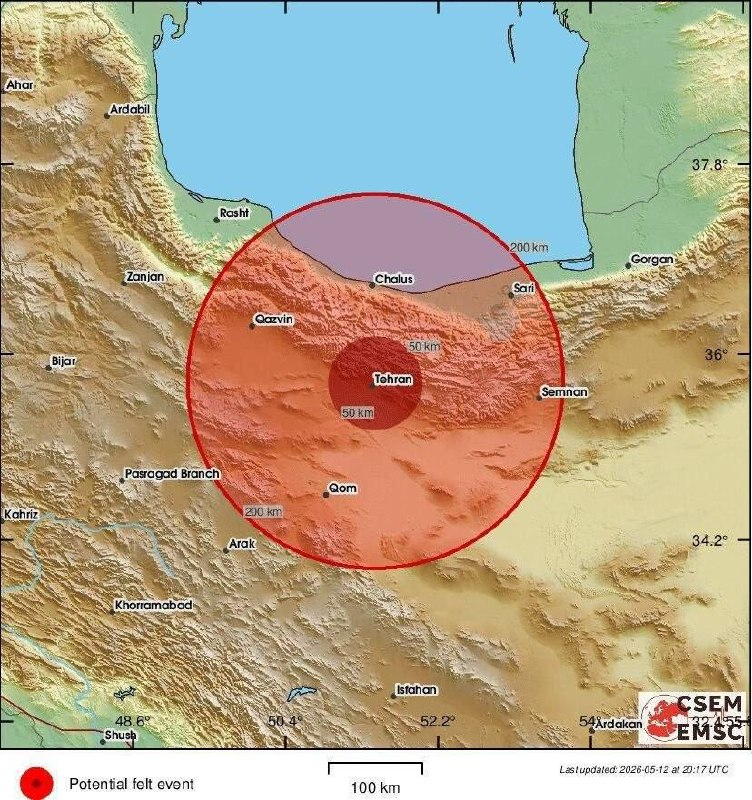

کانون زلزله لحظات قبل تهران

💧 Rainbet.com the #1 Non-KYC Crypto Casino & Sportsbook @rainbetcom

😁 @Pm_Afshaa

## pm_afshaa — post 90658

ساعت ۸ یه زلزله پردیس تهران اومد
الانم یه زلزله مرز تهران و مازندران
امشب رو مراقب و هوشیار باشید

## pm_afshaa — post 90657

فک کنم خدا گفته ترامپ خایه نداره بزار خودم بزنم

## pm_afshaa — post 90656

امشب هم طوفان داشتیم هم زلزله

## pm_afshaa — post 90655

  <a href="telegram/content/pm_afshaa_90655_1778622631.webm" target="_blank">🎬 Download video</a>

🔴مرکز لرزه‌نگاری: لحظاتی پیش زلزلهٔ 4.6 ریشتری مرز استان‌های تهران و مازندران رو لرزوند. 
💧 Rainbet.com the #1 Non-KYC Crypto Casino & Sportsbook @rainbetcom 
😁 @Pm_Afshaa

## pm_afshaa — post 90654

  <a href="telegram/content/pm_afshaa_90654_1778622632.webm" target="_blank">🎬 Download video</a>

🔴مرکز لرزه‌نگاری:
لحظاتی پیش زلزلهٔ 4.6 ریشتری مرز استان‌های تهران و مازندران رو لرزوند.

💧 Rainbet.com the #1 Non-KYC Crypto Casino & Sportsbook @rainbetcom

😁 @Pm_Afshaa

## pm_afshaa — post 90653

میگید زلزله کجا بود یا تست اتم رو دوباره بیاریم وسط

## pm_afshaa — post 90651

زلزله ۳.۴ ریشتر پردیس که چنلا دارن میزنن واسه ساعت ۸/۹ شب بود واسه الان نیست

## pm_afshaa — post 90650

  <a href="telegram/content/pm_afshaa_90650_1778622632.webm" target="_blank">🎬 Download video</a>

🔴زلزله نسبتا شدید در تهران

💧 Rainbet.com the #1 Non-KYC Crypto Casino & Sportsbook @rainbetcom

😁 @Pm_Afshaa

## pm_afshaa — post 90649

  <a href="telegram/content/pm_afshaa_90649_1778622633.webm" target="_blank">🎬 Download video</a>

🔴ان‌بی‌سی نیوز: ارتش ایالات متحده در نظر داره در صورت فروپاشی آتش‌بس و تصمیم ترامپ برای از سرگیری عملیات‌های عمده رزمی، نام درگیری خود با ایران رو به عملیات «چکش سنگین» تغییر بده و این جایگزین نام قبلی عملیات خشم حماسی خواهد شد.

این تغییر نام میتونه به دولت آمریکا اجازه بده درگیری‌های جدید رو یک عملیات نظامی تازه معرفی کنه؛ اقدامی که عملاً مهلت 60 روزه اختیارات جنگی رئیس‌جمهور آمریکا تحت قانون «اختیارات جنگی ۱۹۷۳» رو از نو آغاز میکنه.

💧 Rainbet.com the #1 Non-KYC Crypto Casino & Sportsbook @rainbetcom

😁 @Pm_Afshaa

## pm_afshaa — post 90648

  <a href="telegram/content/pm_afshaa_90648_1778622634.webm" target="_blank">🎬 Download video</a>

🔴رویترز: عربستان در اواخر ماه مارس یک سری حملات تلافی جویانه غیرعلنی علیه ایران در طول جنگ انجام داد. 
💧 Rainbet.com the #1 Non-KYC Crypto Casino & Sportsbook @rainbetcom 
😁 @Pm_Afshaa

## pm_afshaa — post 90647

  <a href="telegram/content/pm_afshaa_90647_1778622634.mp4" target="_blank">🎬 Download video</a>

ترامپ راهی چین شد

💧 Rainbet.com the #1 Non-KYC Crypto Casino & Sportsbook @rainbetcom

😁 @Pm_Afshaa

## pm_afshaa — post 90646

  <a href="telegram/content/pm_afshaa_90646_1778622636.webm" target="_blank">🎬 Download video</a>

🔴تغییر معنادار در ماموریت بمب‌افکن‌های استراتژیک آمریکا

رصد تحرکات هوایی آمریکا نشون میده یک بمب‌افکن استراتژیک B-1B برخلاف پروازهای روتین اخیر، این بار مسیر خودش رو به سمت جنوب تغییر داده و دو هواپیمای سوخت‌رسان هم به‌صورت مخفیانه اونو همراهی کردن.

این تغییر غیرعادی در الگوی پرواز، گمانه‌زنی‌ها درباره احتمال یک عملیات یا تحرک نظامی جدید رو افزایش داده.

💧 Rainbet.com the #1 Non-KYC Crypto Casino & Sportsbook @rainbetcom

😁 @Pm_Afshaa

## pm_afshaa — post 90645

🔴ترامپ:شما دوران طلایی آمریکا را زمانی خواهید دید که این جنگ به پایان برسد، و شما اکنون آن را می‌بینید

💧 Rainbet.com the #1 Non-KYC Crypto Casino & Sportsbook @rainbetcom

😁 @Pm_Afshaa

## iaghapour — post 2604

اکانت های هوش مصنوعی رو با یک دهم قیمت بخر 
🛍

🔆 ChatGPT Plus :
- اکانت از پیش ساخته شده ی Plus
- پلاس شخصی ( نسخه 20$ )
- مناسب برنامه نویسی
- ساخت عکس فارسی و تجزیه تحلیل
- مناسب تحقیق عمیق
- جامع ترین هوش مصنوعی در حال حاضر

🏳️‍🌈 Gemini Pro :
( گزینه ی اقتصادی )
- پلن مشابه GPT Plus از شرکت گوگل
- پشتیبانی از Antigravity
- ساخت عکس و ویدیو فارسی
- تجزیه و تحلیل و تحقیق عمیق
- فعال سازی روی ایمیل شما
- قیمت :
یک ماهه : 275 هزار تومان
یک ساله : 1200 هزار تومان

🌐 Kiro.dev Pro
( جایگزین اقتصادی Claude )
- ایجنت برنامه نویسی شرکت آمازون
- پشتیبانی از تمامی مدل های Claude
- ارزان و اقتصادی و با کیفیت
- مناسب فقط برنامه نویسان

خرید و توضیحات بیشتر از ربات :

🤖 @ChatGPT_StoreBOT

## iaghapour — post 2603

✍ آدم راننده شوتی باشه به مراتب اضطرابش كمتر از کسیه كه شغلش تو ايران به اينترنت وابسته هستش...

🆔 @iaghapour

## DEJradio — post 4601

  <a href="telegram/content/DEJradio_4601_1778622637.webm" target="_blank">🎬 Download video</a>

🚨
🔸 خبر ۲۱
سه‌شنبه ۲۲ اردیبهشت ۱۴۰۵

#خبر۲۱
@DEJradio

## DEJradio — post 4600

  <a href="telegram/content/DEJradio_4600_1778622637.webm" target="_blank">🎬 Download video</a>

🚨
🔸 حامد فرد هنرمند ملی‌گرا موزیک ویدیو «موشتباه» را منتشر کرد. او در صفحه اینستاگرام خود نوشته دو و ماه و نیم از کشته شدن علی خامنه‌ای گذشته اما جسدش را دفن نکرده‌اند و مضحک ماجرا اینجاست که مراسم چهلمش را در یک کلیسا در تهران برگزار کردند؛ آن هم چهلم کسی را که در تمام دوران حکومت ظالمانه‌اش نه‌تنها آزادی مذهب وجود نداشت، بلکه پیروان آیین مسیح و نوکیشان مسیحی تحت آزار و سـ.ـرکوب قرار داد.

او تأکید کرد کشته شدن خامنه‌ای هرچند برای بسیاری از مردم ایران مرهمی بر دل‌های خونین و زخمی بود، اما چیزی جز یک مُسکن کوتاه‌مدت و موقتی نبود و نیست. عطش انتـ.ـقام ما ملت ایران با حذف یک نفر پایان پیدا نمی‌کند.»

حامد فرد تأکید کرد «تا زمانی که حقیقت تمام جـ.ـنایت‌ها ا آشکار نشود، تا زمانی که خانواده‌های قربانیان دادخواهی نکنند، و تا زمانی که جمهوری اسلامی و تمام نمادها، ساختارها و نشانه‌های آن به‌طور کامل از ایران برچیده نشوند، آرام نخواهیم گرفت. ما تا اانـ.ـقام تمام قربانیان این رژیم اهریمنی، از بهمن شوم ۵۷ تا امروز را نگیریم، از پا نخواهیم نشست.»

#موشتبا #جمهوری_اسلامی
@DEJradio

## DEJradio — post 4599

  <a href="telegram/content/DEJradio_4599_1778622638.mp4" target="_blank">🎬 Download video</a>

🔺📢 پیام شهروندان در #تهران در واکنش به تهدید جنسی دانش‌آموزان مدرسه دخترانه شرافت در منطقه ۱۳ تهران: سکوت نکنیم، امروز مدرسه شرافت بود فردا مدرسه‌ای دیگر.

#مدرسه_شرافت #جمهوری_اسلامی
@DEJradio

## DEJradio — post 4598

  <a href="telegram/content/DEJradio_4598_1778622640.mp4" target="_blank">🎬 Download video</a>

🚨
🔸 شهرام سبزواری کارشناس نظامی با اشاره به استقرار تکاوران تیپ ۴۵ شوشتر در اطراف تاسیسات اتمی اصفهان بیان می‌کند احتمال عملیات زمینی برای خارج کردن اورانیوم‌ها از ایران زیاد است و همزمان ممکن است پشت صحنه بین دولت‌ها و برخی فرماندهان داخلی توافق‌هایی صورت گرفته باشد و پیامد آن قربانی شدن نیروهای تامینی باشد.

#تاسیسات_اتمی #جمهوری_اسلامی
@DEJradio

## DEJradio — post 4597

  <a href="telegram/content/DEJradio_4597_1778622643.mp4" target="_blank">🎬 Download video</a>

🔺📢 یک شهروند از تهران با ارسال ویدیویی به دژ نوشت، عامل تعرض به دانش‌آموزان مدرسه شرافت مزدور بودند.
براساس آخرین خبرها پیگیری خانواده این دختران و شکایت آنها از نیروهای امنیتی که دختران را تهدید به تجاوز کرده‌اند بی‌نتیجه مانده است.

#مدرسه_شرافت #جمهوری_اسلامی
@DEJradio

## DEJradio — post 4596

  <a href="telegram/content/DEJradio_4596_1778622645.webm" target="_blank">🎬 Download video</a>

🚨
⭕️ دقایقی پیش زلزله، تهران وکرج را لرزاند.
بر اساس گزارش‌های منتشر شده زلزله‌ای باقدرت ۳/۴ دهم ریشتر دقایقی پیش شهر پردیس را لرزاند و منجر به قطعی برق در برخی مناطق شد.

#فوری #زلزله
@DEJradio

## mamlekate — post 103518

📝 رویترز از حملات اعلام‌نشده عربستان سعودی به ایران در جریان جنگ خبر داد

پس از افشای حملات تلافی‌جویانه امارات متحده عربی به اهدافی در لاوان و عسلویه، خبرگزاری رویترز گزارش داد که عربستان سعودی نیز در واکنش به حملات جمهوری اسلامی به خاک این کشور در جریان جنگ اخیر، چندین حمله اعلام‌نشده علیه ایران انجام داده است.

@mamlekate

## mamlekate — post 103517

📝 سلام ساعت ۲۳:۴۵ چیتگر لرزید

📝 ۲۲ اردیبهشت - ۲۳:۴۸ - غرب تهران یه چیزی مثل زلزله حس کردیم.

📝 سلام لرزش عجیب و بی صدای تهران شرق و جنوب شرق ساعت ۱۱:۴۶

📝 ستارخان تهران رو تخت خوابیده بودم قشنگ زیرم تکون خورد و لرزید بعد هم سبد وسیله ها تکون خورد و لوسترها ،کامل لرزیدم فکر کردم سرگیجه گرفتم ولی زلزله بود طول کشید چند ثانیه

📝 منم توی رودهن هستم و لرزش اولش ضعیف و بعد خیلی شدید شد. صدا نداشت اما خیلی لرزش کوتاه اما ترسناکی بود

❓ سلام. مهرشهر. ۱۲:۲۲ دوبار لرزید. مثل زلزله بود.

@mamlekate

## mamlekate — post 103516

📝 پرزیدنت ترامپ: رژیم ایران بسیار ضعیف شده و «محاصره» دریایی منابع مالی آنها را محدود کرده است

پرریدنت ترامپ با اشاره به موثر بودن محاصره دریایی بر محدود کردن دسترسی رژیم ایران به منابع مالی، بار دیگر تاکید کرد که آمریکا اجازه نخواهد داد رژیم ایران به سلاح هسته‌ای دست یابد.

📝 دونالد ترامپ: مطمئنم تهران غنی‌سازی اورانیوم را به‌طور کامل متوقف خواهد کرد

📝 وزیر جنگ: ما در حال پیروزی در جنگ با رژیم ایران هستیم؛ آنها در استفاده از استراتژی کره‌شمالی شکست خوردند

پیت هگست، وزیر جنگ آمریکا، و ژنرال دن کین، رئیس ستاد مشترک نیروهای مسلح ایالات متحده، روز سه‌شنبه ۲۲ اردیبهشت با حضور در جلسه کمیته فرعی تخصیص بودجه مجلس نمایندگان آمریکا از عملکرد دولت ترامپ در عملیات نظامی علیه رژیم ایران دفاع کردند.

یک عضو پنتاگون نیز در پاسخ به پرسشی درباره هزینه جنگ اخیر آمریکا با جمهوری اسلامی گفت که این جنگ از ابتدا تا کنون حدود ۲۹ میلیارد دلار برای ایالات متحده هزینه داشته است.

📝 هگست اعلام کرد برای تشدید یا عقب‌نشینی در خاورمیانه برنامه دارد اما قدم بعدی را فاش نکرد

@mamlekate

## mamlekate — post 103515

  

💥 دعوت به همکاری با خبرگزاری هرانا

خبرگزاری هرانا، با بیش از دو دهه سابقه در حوزه گزارشگری و مستندسازی حقوق بشر، در راستای توسعه فعالیت‌های خود از علاقه‌مندان واجد شرایط برای همکاری دعوت می‌کند.

هرانا در این مرحله بیش از آن‌که به دنبال افراد با سابقه حرفه‌ای باشد، به دنبال افرادی متعهد، دقیق و آموزش‌پذیر است؛ کسانی که دغدغه واقعی حقوق بشر دارند و مایل‌اند در یک چارچوب حرفه‌ای، مهارت‌های خود را توسعه دهند.

زمینه‌های همکاری شامل:
گزارشگری، ویراستاری، ترجمه، مدیریت شبکه‌های اجتماعی و سایر حوزه‌های مرتبط

ویژگی‌های مورد انتظار:

* تسلط کافی به زبان فارسی (خواندن و نوشتن)
* دقت، مسئولیت‌پذیری و توانایی یادگیری مستمر
* علاقه و حساسیت نسبت به موضوعات حقوق بشر
* آمادگی برای فعالیت در چارچوب‌های سازمان‌یافته و حرفه‌ای

❗️ توجه: این فرصت همکاری فقط شامل کسانی است که به زبان فارسی مسلط و ساکن یکی از کشورهای "ترکیه، قبرس شمالی، هندوستان، مصر، قرقیزستان، ازبکستان، کلمبیا، پاراگوئه، قزاقستان، سریلانکا، بلغارستان و رومانی" هستند.

همکاری با هرانا فرصتی است برای کسب تجربه عملی در حوزه مستندسازی و فعالیت‌های حقوق بشری در یک نهاد با سابقه و ساختار حرفه‌ای.

📎 برای ثبت درخواست همکاری، لطفا فرم زیر را تکمیل کنید:
https://hra.news/4cBjHqs

📩 در صورت بروز مشکل در تکمیل فرم، می‌توانید رزومه و اطلاعات تماس خود را به آدرس زیر ارسال نمایید:
info@hra-news.org

↘️
@hranews_bot تماس ✉️ -  @Hranews  کانال هرانا 🆑

## VahidOnline — post 75438

  

زمین‌لرزه چهارم

پیام‌های دریافتی:

دوباره لرزید شرق همین الان 12:33

بازم اومد ولی ریزتر از قبلی

همین الان دوباره لرزید (نارمک ) ۰۰:۳۳

من الان دوباره لرزیدم

وحیددد نزدیک چهاربار تو پردیس #زلزله اومد نمیدونی تختم چجوری میلرزید

🔄آپدیت: تصویر دریافتی بالا و متن رسانه‌های داخلی به نقل از مرکز لرزه‌نگاری:

بزرگی: ۳.۴
🔹محل وقوع: حوالی پرديس
🔹زمان وقوع: ۳۲ دقیقه بامداد
🔹عمق زمین‌لرزه: ۱۰ کیلومتر

🔹نزدیک‌ترین شهرها:
۱۰ کیلومتری پرديس (تهران)
۱۱ کیلومتری بومهن (تهران)
۱۲ کیلومتری رودهن (تهران)

🔹نزدیکترین مراکز استان:
۴۱ کیلومتری تهران
۷۶ کیلومتری كرج

#زلزله
📡 @VahidOnline

## VahidOnline — post 75437

زمین‌لرزه دیگری به بزرگی ۴
این میشه سومین بار ظرف چند ساعت گذشته! اولین باردر شرق استان احساس شد و پیام‌ها از پردیس و بومهن و دماوند بود و یکی هم از لواسان]
پیام‌های دریافتی لرزش سوم:

تهران مجددا لرزید

دوباره لرزید کمی خفیف‌تر

وحید جان دوباره لرزیدیم شرق تهران .. ۲۷

دوباره! پس لرزه بود.

دوباره هم اومد ولی ضعیف بود خوشبختانه

وحید جان شاید باورت نشه اما سومیش هم همین الان اومد، منتها خیلی کوتاه و کم بود...

ان، زلزله، ۰۰:۲۷
باز اومد، کوتاه، شاید پس لرزه باشه

دوباره اومد
یعنی اون رفت این برگشت

دوباره زلزله اومد

باز هم لرزش ۱۲:۲۷

سلام بازم لرزید حدود دو سه دقیقه پیش طوفانم هست خدا رحم کنه تو این شرایط فقط بلایای طبیعی کم داریم

اینجا ازگل، ۱۲:۲۷دقیقه، دوباره لرزید

🔄 رسانه‌های داخلی به نقل از مرکز لرزه‌نگاری:
🔹بزرگی: ۴
🔹محل وقوع: حوالی پرديس
🔹زمان: ۲۶ دقیقه بامداد
🔹عمق زمین‌لرزه: ۸ کیلومتر

🔹نزدیک‌ترین شهرها:
۹ کیلومتری پرديس (تهران)
۱۱ کیلومتری بومهن (تهران)
۱۲ کیلومتری رودهن (تهران)

🔹نزدیکترین مراکز استان:
۴۰ کیلومتری تهران
۷۶ کیلومتری كرج
#زلزله
📡 @VahidOnline

## VahidOnline — post 75436

  

پست ترامپ، ترجمه ماشین:
وقتی «رسانه‌های جعلی» می‌گویند دشمن ایرانی از نظر نظامی در برابر ما عملکرد خوبی دارد، این عملاً خیانت است؛ چون چنین ادعایی کاملاً دروغ و حتی مضحک است. آن‌ها به دشمن کمک و از او حمایت می‌کنند! تنها نتیجه‌اش این است که به ایران امیدی واهی می‌دهد؛ در حالی که اصلاً نباید چنین امیدی وجود داشته باشد. این‌ها بزدل‌های آمریکایی هستند که علیه کشور خودمان طرف می‌گیرند.

ایران ۱۵۹ کشتی در نیروی دریایی خود داشت؛ تک‌تک آن کشتی‌ها اکنون در کف دریا آرمیده‌اند. آن‌ها دیگر نیروی دریایی ندارند، نیروی هوایی‌شان از بین رفته، تمام فناوری‌شان نابود شده، «رهبران»شان دیگر در میان ما نیستند، و کشورشان یک فاجعه اقتصادی است.

فقط بازنده‌ها، ناسپاس‌ها و احمق‌ها می‌توانند علیه آمریکا استدلالی مطرح کنند!

رئیس‌جمهور دونالد جی. ترامپ
realDonaldTrump

📡 @VahidOnline

## VahidOnline — post 75435

"وحید تهران لرزید"

+ ده‌ها پیام دریافتی مشابه درباره احساس لرزش زمین در مناطق مختلف تهران

به نظر می‌رسه بیشتر پیام‌ها از سمت شرق و شمال شرق تهران هستند گرچه در غرب شهر هم کاملا حس شده.
حدود سه ساعت پیش هم در شرق استان تهران حوالی پردیس و بومهن و دماوند زمین‌‌لرزه خفیف‌تری حس شده بود و غیر از اون مناطق فقط یک پیام از لواسان داشتم و پیامی از خود تهران نداشتم.

🔄 رسانه‌های داخلی:
زمین‌لرزه‌ای به بزرگی ۴.۶ ساعت ۲۳:۴۶ امشب مرز استان‌های تهران و مازندران را لرزاند.
این زلزله در حوالی شهر پردیس و در عمق ۱۰ کیلومتری زمین به وقوع پیوسته و در بخش‌هایی از پایتخت نیز احساس شده است.
بزرگی: 4.6
محل وقوع: مرز استانهای تهران و مازندران - حوالی پرديس
تاریخ و زمان وقوع به وقت محلی: 1405/02/22 23:46:07
طول جغرافیایی: 51.83
عرض جغرافیایی: 35.82
عمق زمین‌لرزه: 10 کیلومتر

نزدیک‌ترین شهرها:
8 کیلومتری پرديس (تهران)
10 کیلومتری بومهن (تهران)
11 کیلومتری رودهن (تهران)

نزدیکترین مراکز استان:
41 کیلومتری تهران
77 کیلومتری كرج
#زلزله
📡 @VahidOnline

## VahidOnline — post 75433

  <a href="telegram/content/VahidOnline_75433_1778622647.mp4" target="_blank">🎬 Download video</a>

ترامپ: خواهیم دید چه خواهد شد

دونالد ترامپ، رئیس‌جمهور آمریکا، پیش از سفر به پکن گفت که رئیس‌جمهور چین درباره جنگ ایران «نسبتاً خوب» عمل کرده است، اما واشینگتن به کمک او نیازی ندارد.

او روز سه شنبه در جمع خبرنگاران افزود که قرار است با شی جین‌پینگ «گفت‌وگویی طولانی» درباره ایران داشته باشد.
ترامپ تصریح کرد: «فکر نمی‌کنم ما به هیچ کمکی درباره ایران نیاز داشته باشیم. ما به هر شکلی که باشد پیروز خواهیم شد. یا به‌صورت مسالمت‌آمیز پیروز می‌شویم یا به شکل دیگری.»

رئیس‌جمهور آمریکا با اشاره به این که توان نظامی ایران در جنگ اخیر از بین رفته است، هشدار داد: ««ایران یا کار درست را انجام خواهد داد یا ما کار را تمام خواهیم کرد.»

او به جزئیات بیشتری درباره این هشدار اشاره نکرد، اما این اظهارات در حالی است که ترامپ پیشنهاد آخر ایران برای توافق پایان جنگ را در روزهای اخیر رد کرده و آن را «کاملا غیر قابل قبول» و «فوق‌العاده ضعیف» خوانده است.
رئیس‌جمهور آمریکا قرار است چهارشنبه برای دیداری رسمی وارد پایتخت چین شود. این سفر که قرار بود در ماه مارس انجام شود، به دلیل درگیری نظامی آمریکا و اسرائیل با ایران چند هفته به تأخیر افتاد.
@VahidHeadline

📡 @VahidOnline

## kianmeli1 — post 87372

  

🔴رؤیافروشی تلویزیون ها پایانی ندارد

قبل از علی خامنه ای میگفتند با کشته شدن خامنه ای کار تمام است
امروز میگویند با پایان لایه بعدی کار تمام است

هموطن٫ کار تمام است اما وقتی که «سازماندهی هوشمندانه و شبکه سازی شهری» دیده شود

از ۱۸ دی تا امروز کدام شبکه سازی در کشور توانسته یک قاضی قاتل را از بین ببرد که احساس کنیم نیروهای سازماندهی در حال تلاش است!

با رویافروشی شبکه ها که مدام تحلیل غلط به خوردتان میدهند ٫ براندازی محقق نمی شود

«براندازی بدون سازماندهی ٫ شکست سنگین ادامه دارد»

این صحبت تلخ است اما حقیقت است
https://t.me/kianmeli1

## kianmeli1 — post 87371

🔴طبق گزارش NBCNews : ارتش ایالات متحده در نظر دارد در صورت فروپاشی آتش‌بس و تصمیم ترامپ برای از سرگیری عملیات‌های عمده رزمی، نام درگیری خود با ایران را به عملیات چکش سنگین تغییر دهد و این جایگزین نام قبلی عملیات خشم حماسی خواهد شد.
https://t.me/kianmeli1

## kianmeli1 — post 87370

‏🔴یک مقام ارشد پنتاگون سه‌شنبه اعلام کرد که جنگ آمریکا در ایران تاکنون ۲۹ میلیارد دلار هزینه داشته است؛ رقمی که نسبت به برآورد ارائه‌شده در اواخر ماه گذشته، چهار میلیارد دلار افزایش یافته است
https://t.me/kianmeli1

## kianmeli1 — post 87369

‏🔴وزارت دفاع بریتانیا با انتشار بیانیه‌ای اعلام کرد این کشور تجهیزات خودکار مین‌یابی و سامانه‌های پیشرفته مقابله با پهپادها را به همراه جنگنده‌های تایفون و ناو «اچ‌ام‌اس دراگون» در قالب یک ماموریت دفاعی آینده برای تامین آزادی کشتیرانی در تنگه هرمز مستقر خواهد کرد
https://t.me/kianmeli1

## kianmeli1 — post 87368

‏🔴بلومبرگ گزارش داد امارات متحده عربی از زمان آغاز کارزار آمریکا و اسرائیل علیه تهران در ماه فوریه، بیش از یک‌بار به ایران حمله کرده است. به گفته این رسانه آمریکایی و به نقل از «افراد مطلع»، امارات متحده عربی این حملات را هم پیش از آتش‌بس و هم پس از آن انجام داده است
https://t.me/kianmeli1

## kianmeli1 — post 87367

  <a href="telegram/content/kianmeli1_87367_1778622649.mp4" target="_blank">🎬 Download video</a>

🔴زلنسکی: به تأسیسات گازی روسیه در فاصله ۱۵۰۰ کیلومتری حمله کردیم

ولودیمیر زلنسکی، رئیس‌جمهور اوکراین، حمله به یک تأسیسات صنعت گاز در منطقه اورنبورگ روسیه را تأیید کرد.

این هدف در فاصله بیش از ۱۵۰۰ کیلومتری مرز اوکراین قرار دارد.

به گفته زلنسکی، این عملیات پاسخی به حملات اخیر روسیه با پهپادهای شاهد و بمب‌های سرشی بوده است.

او تأکید کرد که کی‌اف به فشار بر روسیه ادامه می‌دهد تا آن را «به سمت دیپلماسی و صلح» سوق دهد. برخی رسانه‌ها از این اقدام با عنوان «تحریم‌های دوربرد» یاد کرده‌اند.
https://t.me/kianmeli1

## kianmeli1 — post 87366

  <a href="telegram/content/kianmeli1_87366_1778622651.mp4" target="_blank">🎬 Download video</a>

🔴سربازان روسی در حال استفاده از پهپاد رهگیر «یولکا» (Yolka) علیه پهپادهای اوکراینی هستند که براحتی با لانچر بسیار کوچک دستی به سرعت پرتاب میشود
https://t.me/kianmeli1

## kianmeli1 — post 87365

  

🔴ایران قبل از برآورده شدن این شرایط، در مورد مسئله هسته‌ای با آمریکا مذاکره نخواهد کرد.

• پایان جنگ در همه جبهه‌ها
• لغو همه تحریم‌ها
• آزادسازی دارایی‌های مسدود شده ایران
• پرداخت غرامت جنگ
• به رسمیت شناختن حق حاکمیت ایران بر تنگه هرمز
https://t.me/kianmeli1

## kianmeli1 — post 87364

  <a href="telegram/content/kianmeli1_87364_1778622653.mp4" target="_blank">🎬 Download video</a>

‏🔴سپاه پاسداران رزمایشی برای ورود قریب‌الوقوع به جنگ زمینی برگزار کرد
https://t.me/kianmeli1

## kianmeli1 — post 87363

  <a href="telegram/content/kianmeli1_87363_1778622656.mp4" target="_blank">🎬 Download video</a>

🔴تصاویر ماهواره‌ای جدید منتشر شده از پایگاه هوایی پرنس سلطان در عربستان سعودی نشان می‌دهد که تعداد زیادی هواپیما (به احتمال زیاد از نوع F-16) در این پایگاه مستقر شده‌اند. به نظر می‌رسد عربستان سعودی محدودیت‌های خود را علیه «پروژه آزادی» مرتبط با دونالد ترامپ برداشته است و حداقل ۵۳ فروند جنگنده F-16 در این پایگاه حضور دارند.
https://t.me/kianmeli1

## IranIntlTV — post 336890

  <a href="telegram/content/IranIntlTV_336890_1778622657.mp4" target="_blank">🎬 Download video</a>

مراد ویسی، تحلیل‌گر ارشد ایران‌اینترنشنال، در واکنش به صحبت‌های محسنی اژه‌ای، رییس قوه قضاییه که گفت مردم نباید بدبین شوند، گفت:‌ «حکومتی که با کشتار، سرکوب، قطع اینترنت، نابودی کسب‌وکارها و تحمیل بحران‌های اقتصادی و امنیتی زندگی مردم را مختل کرده، خود عامل این بی‌اعتمادی و بدبینی است. جامعه ایران فراتر از بدبینی، خواهان پایان این وضعیت و سرنگونی جمهوری اسلامی است.»

@iranintltv

## IranIntlTV — post 336889

  <a href="telegram/content/IranIntlTV_336889_1778622659.mp4" target="_blank">🎬 Download video</a>

مراد ویسی، تحلیل‌گر ارشد ایران‌اینترنشنال، گفت:‌ «ترامپ زمان زیادی ندارد؛ چون با نزدیک شدن به انتخابات کنگره، اگر نتواند جمهوری اسلامی را به‌روشنی شکست دهد یا به اهدافش برسد، ممکن است اکثریت کنگره را به دموکرات‌ها واگذار کند.»

@iranintltv

## IranIntlTV — post 336888

  

سازمان مدیریت بحران اعلام کرد باتوجه به بررسی‌های اولیه و ارزیابی تیم‌های کارشناسی، زمین‌لرزه‌ها در مرز استان‌های تهران و مازندران خساراتی درپی نداشته است.
مرکز لرزه‌نگاری در اطلاعیه‌ای اعلام کرد ساعت ۲۳:۴۶ سه‌شنبه شب زمین‌لرزه‌ای به بزرگی ۴.۶ مرز تهران و مازندران را لرزاند. زمین‌لرزه در تهران حدود ۱۰ ثانیه طول کشید.
این لرزش در شرق تهران، ورامین، پاکدشت، پردیس و بخش‌هایی از شمیرانات بیشتر احساس شد.
همچنین چهار پس‌لرزه‌ در استان تهران رخ داد که آخرین پس‌لرزه‌ها به بزرگی ۴ و ۳.۴ بودند.

https://iranintl.com/202605124199

## IranIntlTV — post 336887

  <a href="telegram/content/IranIntlTV_336887_1778622661.mp4" target="_blank">🎬 Download video</a>

🔻علیرضا دبیر، رییس فدراسیون کشتی در گفتگویی با خبرنگاران مدعی شد فدراسیون و خانه کشتی در غرب تهران در تمام روزهای جنگ ۴۰ روزه، مورد هدف قرار گرفته است.

🔹او گفت بیش از ۱۵۰تا ۱۶۰ موشک به این محل اصابت کرده است.

🔹در هفته اول جنگ، ایران‌اینترنشنال گزارش داد که پس از آغاز حملات اسرائیل و آمریکا در نهم اسفندماه، به کارکنان و پرسنل فدراسیون‌ها و مراکز مستقر در مجموعه ورزشی آزادی در تهران دستور داده شد ساختمان‌ها و سالن‌های ورزشی این مجموعه را تخلیه کنند.

🔹طبق این اطلاعات، پس از تخلیه کارکنان، نیروهای حکومتی از جمله یگان ویژه و بسیج در بخش‌های مختلف این مجموعه مستقر شدند.

🔹پس از این ماموران در سالن‌های مختلف از جمله ورزشگاه ۱۲ هزار نفری آزادی و همچنین سالن‌ها و ساختمان‌های متعلق به فدراسیون‌های ورزشی از جمله کشتی، والیبال، بسکتبال و وزنه‌برداری مستقر شدند.

🔹در پی این اقدامات، سالن ۱۲ هزار نفری ورزشگاه آزادی در حملات هوایی روز پنجشنبه ۱۴ اسفند ۱۴۰۴، تخریب شد.

🔹به گفته علیرضا دبیر، برای بازسازی خانه کشتی، تاکنون بیش از ۴۰۰ میلیارد تومان هزینه شده است.

@iranintltvsport

## IranIntlTV — post 336885

  

دونالد ترامپ در شبکه تروث سوشال نوشت وقتی رسانه‌های «جعلی» می‌گویند دشمن ایرانی از نظر نظامی در برابر آمریکا عملکرد خوبی دارد، این نوعی خیانت است، زیرا چنین ادعایی کاملا نادرست و حتی مضحک است.
او افزود: آن‌ها در حال کمک به دشمن هستند و به جمهوری اسلامی امید می‌دهند در حالی که نباید هیچ امیدی برای او وجود داشته باشد.
https://iranintl.com/202605125060

## IranIntlTV — post 336884

  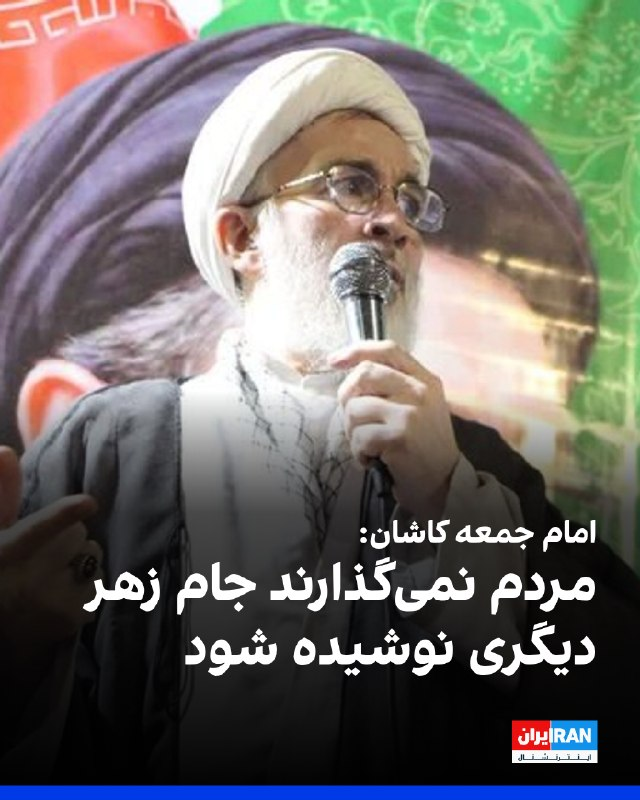

علی احتشام، امام جمعه کاشان گفت: «جمهوری اسلامی نه یکی از چهار قدرت، بلکه تنها ابرقدرت جهان است و ملت ایران هشت کشور منطقه و آمریکا را از کمال ارتفاع ساقط کرد و امروز با حضور در خیابان‌ها اجازه نداد جام زهر دیگری نوشیده شود.»

او افزود: «اگر مردم کف خیابان نبودند، چه بسا جام زهر دیگری نوشیده می‌شد.»
https://iranintl.com/202605128116

## IranIntlTV — post 336883

  

رسانه‌های ایران از وقوع زمین‌لرزه به بزرگی ۴.۶ در مرز استان‌های تهران و مازندران خبر دادند.

خبرگزاری فارس همچنین از زمین‌لرزه در کرج خبر داد.

همزمان خبرگزاری دولتی ایرنا گزارش داد زمین‌لرزه در تهران حدود ۱۰ ثانیه طول کشیده است.
https://iranintl.com/202605123583

## IranIntlTV — post 336882

  

سعید سیاه‌سرانی، دبیر ستاد راهیان نور دریایی، گفت: «بدون اراده جمهوری اسلامی اجازه عبور حتی یک لیتر نفت از تنگه هرمز داده نمی‌شود.»

او افزود: «تنگه هرمز جزو خاک ما است، شناورهایی که رد می‌شوند باید اجازه بگیرند و به زبان فارسی صحبت کنند و از نقاطی که ما تعیین می‌کنیم عبور کنند.»
https://iranintl.com/202605123958

## IranIntlTV — post 336881

  <a href="telegram/content/IranIntlTV_336881_1778622666.mp4" target="_blank">🎬 Download video</a>

خبرگزاری رویترز به نقل از دو مقام غربی گزارش داد که عربستان سعودی در جریان جنگ اخیر در خاورمیانه، در واکنش به حملاتی که در خاک این کشور انجام شده بود، چند حمله هوایی اعلام‌نشده علیه مواضعی در ایران انجام داده است.

گفت‌وگو با شهرام خلدی، پژوهشگر تاریخ خاورمیانه و روابط بین‌الملل

@iranintltv

## IranIntlTV — post 336880

  <a href="telegram/content/IranIntlTV_336880_1778622668.mp4" target="_blank">🎬 Download video</a>

هم‌زمان با سفر ترامپ به چین، گزارش‌ها حاکی است جمهوری اسلامی از پکن خواسته پیام‌های خود را به واشینگتن منتقل کند و چین را به‌عنوان ضامن احتمالی هر توافق آینده مطرح کرده است. سفیر ایران در چین نیز گفته پکن با ارائه طرح‌های صلح و رایزنی‌های منطقه‌ای تلاش دارد مسیر گفت‌وگوها را باز نگه دارد.

گفت‌وگو با آرام حسامی، استاد علوم سیاسی کالج مونتگومری

@iranintltv

## IranIntlTV — post 336879

  <a href="telegram/content/IranIntlTV_336879_1778622670.mp4" target="_blank">🎬 Download video</a>

انجمن قلم آمریکا در گزارش سالانه خود اعلام کرد؛ شمار نویسندگان زندانی در جهان برای نخستین‌بار از ۴۰۰ نفر عبور کرده است. این نهاد گفت؛ چین با ۱۱۹ مورد در صدر قرار دارد و ایران با زندانی‌کردن ۵۳ نویسنده در رتبه دوم ایستاده است.

در این گزارش آمده است؛ عربستان سعودی با ۲۷ نویسنده زندانی در رتبۀ سوم قرار دارد. پن آمریکا تاکید کرد؛ سرکوب نویسندگان و اهل قلم در ایران، به‌ویژه پس از «جنگ ۱۲روزه»، شدت گرفته است.
گفت‌وگو با اردوان روزبه، خبرنگار ایران‌اینترنشنال
@iranintltv

## IranIntlTV — post 336878

  <a href="https://t.me/IranintlTV/336878" target="_blank">📎 Download file</a>

🎧نسخه صوتی ‌‌‏۲۴ با فرداد فرحزاد: ترامپ: برای توافق با جمهوری اسلامی عجله ندارم
@iranintlTV

## IranIntlTV — post 336877

  

امارات متحده عربی اعلام کرد ۱۶ شهروند لبنانی و پنج نهاد مستقر در لبنان را به دلیل ارتباط با حزب‌الله در فهرست تروریستی این کشور قرار داده است.

در همین چارچوب، «موسسه قرض‌الحسن» و چهار نهاد دیگر نیز به دلیل ارتباط با حزب‌الله در این فهرست قرار گرفته‌اند.

امارات متحده عربی تاکید کرد این اقدامات در راستای مهار آفات تروریسم، محدود کردن گسترش آن و قطع تامین مالی فرامرزی انجام شده است.
https://iranintl.com/202605127283

## IranIntlTV — post 336876

  <a href="https://t.me/IranintlTV/336876" target="_blank">📎 Download file</a>

🎧نسخه صوتی چشم‌انداز: جهنم قطع اینترنت چگونه به پایان می‌رسد؟
@iranintlTV

## IranIntlTV — post 336875

  <a href="telegram/content/IranIntlTV_336875_1778622674.mp4" target="_blank">🎬 Download video</a>

بنا بر گزارش‌ها هم‌زمان با سفر دونالد ترامپ به چین، جمهوری اسلامی تلاش کرده است از پکن برای رساندن پیامش به واشینگتن استفاده کند و گفته است چین می‌تواند نقش ضامن هر توافق احتمالی را داشته باشد.

گفت‌وگو با جمشید برزگر، روزنامه‌نگار و تحلیل‌گر سیاسی
@iranintltv

## IranIntlTV — post 336874

  <a href="telegram/content/IranIntlTV_336874_1778622677.mp4" target="_blank">🎬 Download video</a>

جهنم قطع اینترنت چگونه به پایان می‌رسد؟

«چشم‌انداز با مهدی مهدوی‌آزاد»

تماشای نسخه کامل این برنامه در یوتیوب:

https://youtu.be/92BJ6BfAYHQ

@iranintltv

## IranIntlTV — post 336873

  

در پی بازداشت چهار فرد «وابسته به سپاه پاسداران» در کویت، وزارت خارجه جمهوری اسلامی برنامه‌ریزی برای انجام اقدامات خصمانه علیه کویت را بی‌اساس و مردود دانست.

وزارت خارجه جمهوری اسلامی در بیانیه‌ای اعلام کرد این چهار مامور در چارچوب ماموریت مرسوم گشت‌زنی دریایی مشغول انجام وظیفه بوده‌اند و به دلیل «اختلال در سامانه ناوبری» وارد آب‌های سرزمینی کویت شده‌اند.

این وزارتخانه از مراجع کویت خواست از اظهارنظرهای شتاب‌زده و طرح ادعاهای بی‌اساس خودداری کرده و موضوع را از طریق مجاری رسمی پیگیری کنند. وزارت خارجه جمهوری اسلامی همچنین خواهان آزادی این چهار مامور بازداشت‌شده شد.
https://iranintl.com/202605121807

## IranIntlTV — post 336872

  

کاظم غریب‌آبادی، معاون وزیر خارجه جمهوری اسلامی، در شبکه ایکس نوشت: «صلح واقعی با ادبیات تحقیر، تهدید و امتیازگیری اجباری ساخته نمی‌شود.»

غریب‌آبادی اضافه کرد: «اصول ما مشخص است، توقف دائمی جنگ و عدم تکرار آن، جبران خسارات، رفع محاصره، رفع تحریم‌های غیرقانونی و احترام به حقوق جمهوری اسلامی.»

او افزود: «وقتی طرفی که خود در جنگ، محاصره، تحریم و تهدید به زور نقش مستقیم دارد، پاسخ جمهوری اسلامی را صرفا به دلیل آنکه تسلیم‌نامه نیست، رد می‌کند، روشن می‌شود که مسئله اصلی نه صلح، بلکه تحمیل اراده سیاسی از مسیر تهدید و فشار است.»
https://iranintl.com/202605129672

## IranIntlTV — post 336871

  

اطلاعات رسیده به ایران اینترنشنال حاکی از آن است که احمد خزایی، شهروند ۴۶ ساله، از جمله شهروندان معترضی بوده که در جریان انقلاب ملی دی‌ماه در شهریار استان تهران با شلیک ماموران حکومت کشته شده است. او در جریان اعتراضات ۱۸ دی‌ماه کشته شد.
https://iranintl.com/202605128985

## IranIntlTV — post 336870

  

رویترز به نقل از دو مقام غربی و دو مقام ایرانی گزارش داد عربستان سعودی در جریان جنگ خاورمیانه، در پاسخ به حملاتی که در خاک این کشور انجام شده بود، چندین حمله اعلام‌نشده در ایران انجام داده است.
به گفته دو مقام غربی، این حملات توسط نیروی هوایی عربستان سعودی و در اوایل فروردین انجام شده‌اند. یکی از این مقامات گفت این حملات «اقداماتی تلافی‌جویانه در پاسخ به حملاتی بود که عربستان سعودی هدف آن قرار گرفته بود»
رویترز با اشاره به گزارش‌های پیشین درباره حملات امارات متحده عربی به ایران نوشت اقدامات عربستان سعودی و امارات متحده نشان می‌دهد کشورهای عربی خلیج فارس که هدف حملات جمهوری اسلامی قرار گرفته‌اند، به‌تدریج وارد فاز پاسخ‌گویی مستقیم شده‌اند.
https://iranintl.com/202605123748

## Shin_Persian — post 5983

Shin ✓ @hey_itsmyturn
Tue, 12 May 2026 21:17:38 UTC

Someone wrote “Tehran is having a wild orgasm” in Telegram 😭😭😭

فارسی

یک نفر در تلگرام نوشته «تهران دارد به ارگاسم وحشیانه می‌رسد» 😭😭😭

𝕏 · @shin_persian

## Shin_Persian — post 5982

Shin ✓ @hey_itsmyturn
Tue, 12 May 2026 21:16:15 UTC

And another aftershock rn

فارسی

و یک پس‌لرزه دیگر همین الان

𝕏 · @shin_persian

## Shin_Persian — post 5981

Shin ✓ @hey_itsmyturn
Tue, 12 May 2026 21:06:37 UTC

And we are back at “It’s HAARP” dumbfucks.

فارسی

و دوباره برگشتیم سر احمق‌هایی که می‌گویند «کار هارپ (HAARP) است».

𝕏 · @shin_persian

## Shin_Persian — post 5980

Shin ✓ @hey_itsmyturn
Tue, 12 May 2026 21:00:34 UTC

Another earthquake shook Tehran just now

فارسی

همین الان زلزله دیگری تهران را لرزاند

𝕏 · @shin_persian

## Shin_Persian — post 5979

  

Shin ✓ @hey_itsmyturn Tue, 12 May 2026 20:25:23 UTC President Trump @POTUS: "When the Fake News says that the Iranian enemy is doing well, Militarily, against us, it’s virtual TREASON in that it is such a false, and even preposterous, statement. They are…

## Shin_Persian — post 5978

Shin ✓ @hey_itsmyturn
Tue, 12 May 2026 20:25:23 UTC

President Trump @POTUS:
"When the Fake News says that the Iranian enemy is doing well, Militarily, against us, it’s virtual TREASON in that it is such a false, and even preposterous, statement. They are aiding and abetting the enemy! All it does is give Iran false hope when none should exist. These are American cowards that are rooting against our Country. Iran had 159 ships in their Navy — Every single ship is now resting at the bottom of the sea. They have no Navy, their Air Force is gone, all Technology is gone, their “leaders” are no longer with us, and the Country is an Economic Disaster. Only Losers, Ingrates, and Fools are able to make a case against America! President DONALD J. TRUMP"

فارسی

رئیس‌جمهور ترامپ @POTUS:
«وقتی اخبار جعلی می‌گویند که دشمن ایرانی از نظر نظامی در برابر ما خوب عمل می‌کند، این در واقع خیانتی مجازی است، چرا که چنین ادعایی کذب و حتی مضحک است. آن‌ها در حال کمک و یاری رساندن به دشمن هستند! تمام کاری که این حرف‌ها انجام می‌دهد، دادن امید واهی به ایران است، در حالی که هیچ امیدی نباید وجود داشته باشد. این‌ها بزدلانی آمریکایی هستند که علیه کشورمان ریشه دوانده‌اند. ایران ۱۵۹ کشتی در نیروی دریایی خود داشت — اکنون تک‌تک آن کشتی‌ها در کف دریا آرام گرفته‌اند. آن‌ها دیگر نیروی دریایی ندارند، نیروی هوایی‌شان از بین رفته، تمام تکنولوژی‌شان نابود شده، "رهبرانشان" دیگر در میان ما نیستند و آن کشور یک فاجعه اقتصادی است. فقط بازنده‌ها، ناسپاس‌ها و احمق‌ها می‌توانند علیه آمریکا استدلال کنند! رئیس‌جمهور دونالد جی. ترامپ»

𝕏 · @shin_persian

## Shin_Persian — post 5977

Shin ✓ @hey_itsmyturn
Tue, 12 May 2026 20:17:27 UTC

Quake in Tehran right now.

فارسی

هم‌اکنون زلزله در تهران.

𝕏 · @shin_persian

## Shin_Persian — post 5976

  

DefenceGeek 🇬🇧 ✓ @DefenceGeek Tue, 12 May 2026 19:21:43 UTC 40th Bomber Training Flight from Fairford #FreeIran‌ --- Operation EPIC FURY / Project FREEDOM --- Rather helpfully, the solo B-1B "Lancer" bomber from RAF Fairford (EGVA) (which is flying the…

## Shin_Persian — post 5975

DefenceGeek 🇬🇧 ✓ @DefenceGeek
Tue, 12 May 2026 19:21:43 UTC

40th Bomber Training Flight from Fairford #FreeIran‌
--- Operation EPIC FURY / Project FREEDOM ---

Rather helpfully, the solo B-1B "Lancer" bomber from RAF Fairford (EGVA) (which is flying the 40th training mission from the base since the ceasefire began), has been broadcasting it's location for all to see!

This route has been a fairly routine pattern for the training flights, and for many of the 62 bomber missions flown by B-1B and B-52H types during the war in Iran.

B-1B "ZENER01" 86-0134 #AE6C05 "Thunderbird"

@MATA_osint @ArmchairAdml @Andyyyyrrrr @jamjake01 @LHA2709 @vcdgf555

فارسی

چهلمین پرواز آموزشی بمب‌افکن از فیرفورد #FreeIran
--- عملیات خشم حماسی (EPIC FURY) / پروژه آزادی ---

بمب‌افکن تک‌فروندی B-1B "لنسر" از پایگاه نیروی هوایی سلطنتی فیرفورد (EGVA) (که در حال انجام چهلمین ماموریت آموزشی از این پایگاه پس از آغاز آتش‌بس است)، به شکلی کاملاً مفید در حال مخابره موقعیت مکانی خود برای مشاهده همگان بوده است!

این مسیر یک الگوی نسبتاً معمول برای پروازهای آموزشی و همچنین برای بسیاری از ۶۲ ماموریت بمب‌افکنی انجام شده توسط انواع B-1B و B-52H در طول جنگ در ایران بوده است.

B-1B "ZENER01" 86-0134 #AE6C05 "Thunderbird"

@MATA_osint @ArmchairAdml @Andyyyyrrrr @jamjake01 @LHA2709 @vcdgf555

𝕏 · @shin_persian

## Shin_Persian — post 5974

  <a href="telegram/content/Shin_Persian_5974_1778622684.mp4" target="_blank">🎬 Download video</a>

Rapid Response 47 ✓ @RapidResponse47
Tue, 12 May 2026 18:01:20 UTC

.@POTUS: "It's very simple: Iran cannot have a nuclear weapon... We don't play games. They're not going to have a nuclear weapon."

فارسی

.@POTUS: "بسیار ساده است: ایران نمی‌تواند سلاح هسته‌ای داشته باشد... ما بازی نمی‌کنیم. آن‌ها قرار نیست سلاح هسته‌ای داشته باشند."

𝕏 · @shin_persian

## Shin_Persian — post 5973

↩️ Quoted tweet: DefenceGeek 🇬🇧 ✓ @DefenceGeek Tue, 12 May 2026 18:11:27 UTC @hey_itsmyturn Training flight lol ↩️ توییت نقل‌قول شده — برای پاسخ، پست زیر را ببینید. فارسی @hey_itsmyturn پرواز تمرینی خخخ 𝕏 · @shin_persian

## Shin_Persian — post 5972

↩️ Quoted tweet:
DefenceGeek 🇬🇧 ✓ @DefenceGeek
Tue, 12 May 2026 18:11:27 UTC

@hey_itsmyturn Training flight lol

↩️ توییت نقل‌قول شده — برای پاسخ، پست زیر را ببینید.

فارسی

@hey_itsmyturn پرواز تمرینی خخخ

𝕏 · @shin_persian

## Shin_Persian — post 5971

Shin ✓ @hey_itsmyturn
Tue, 12 May 2026 17:54:52 UTC

Initial:
Blast in Sana'a, Yemen

فارسی

انفجار در صنعا، یمن

𝕏 · @shin_persian

## Shin_Persian — post 5970

  

Shin ✓ @hey_itsmyturn
Tue, 12 May 2026 17:49:19 UTC

𝕏 · @shin_persian

## Shin_Persian — post 5969

Shin ✓ @hey_itsmyturn
Tue, 12 May 2026 17:45:43 UTC

Lancer on the move

فارسی

لنسر در حال حرکت

𝕏 · @shin_persian

## ManotoTV — post 105379

  <a href="telegram/content/ManotoTV_105379_1778622687.mp4" target="_blank">🎬 Download video</a>

رئیس سازمان هلال احمر اعلام کرد زلزله در تهران و کرج «هیچ» خسارت مالی و جانی در پی نداشته است.
پیش‌تر زلزله‌ای به بزرگی ۴.۶ در مقیاس ریشتر، مرز استان‌های تهران و مازندران را لرزاند.

## ManotoTV — post 105378

  <a href="telegram/content/ManotoTV_105378_1778622688.mp4" target="_blank">🎬 Download video</a>

شاهزاده رضا پهلوی در نشست امنیتی سالانه پولیتیکو گفت مردم ایران، نه نیروهای خارجی، باید نقش اصلی را در تغییر حکومت جمهوری اسلامی ایفا کنند؛ اما برای این کار به «حمایت و پوشش» نیاز دارند.

او گفت: «نیروهای روی زمین در ایران، خود مردم ایران هستند. ما نیازی نداریم نیروهای خارجی این کار را برای ما انجام دهند.»

شاهزاده رضا پهلوی با اشاره به سرکوب اعتراضات دی‌ماه گفت در کمتر از ۴۸ ساعت بیش از ۴۰ هزار نفر کشته شدند و افزود بدون حمایت، نمی‌توان از مردم انتظار داشت دوباره به خیابان‌ها بیایند.

او گفت: «به همین دلیل بود که به کارزار هوایی و پوشش هوایی نیاز داشتیم.»

شاهزاده رضا پهلوی همچنین تأکید کرد باید یک استراتژی روشن برای پایان دادن به جمهوری اسلامی وجود داشته باشد؛ استراتژی‌ای که هم مردم را برای قیام تشویق کند و هم زمینه پیوستن نیروهایی از ارتش و دستگاه امنیتی به مردم را فراهم سازد.

او افزود: «نمی‌شود از یک طرف گفت مردم قیام کنند و همزمان گفت در حال مذاکره هستیم؛ این همه را گیج می‌کند.»

شاهزاده رضا پهلوی همچنین گفت حملات انجام‌شده علیه جمهوری اسلامی، ملت ایران را هدف نگرفته بود، بلکه زیرساخت‌های سرکوب حکومت، از جمله دستگاه اطلاعاتی و سپاه پاسداران، را هدف قرار داده بود.

او افزود: «مردم آن‌قدر باهوش هستند که تفاوت میان حمله به ملت ایران و حمله به حکومت را تشخیص دهند.»

## ManotoTV — post 105377

  <a href="telegram/content/ManotoTV_105377_1778622691.mp4" target="_blank">🎬 Download video</a>

‌
خبرگزاری‌های داخل ایران گزارش دادند دقایقی پیش زلزله تهران و کرج را لرزاند. به گزارش این خبرگزاری‌ها سمت شرق تهران زمین‌لرزه بسیار شدیدتر بوده است.

## ManotoTV — post 105376

  <a href="telegram/content/ManotoTV_105376_1778622691.mp4" target="_blank">🎬 Download video</a>

تماسی از ایران؛
«می‌گفت تغییر از بیرون نیست…
کار خود مردمه، حتی با این وضعیت سخت.»

## ManotoTV — post 105375

  <a href="telegram/content/ManotoTV_105375_1778622693.mp4" target="_blank">🎬 Download video</a>

رویترز به نقل از دو مقام غربی و دو مقام ایرانی گزارش داد عربستان سعودی در واکنش به حملات انجام‌شده علیه این کشور، چند حمله نظامی اعلام‌نشده علیه جمهوری اسلامی انجام داده است.

بر اساس این گزارش، حملات هوایی عربستان در اواخر ماه مارس توسط نیروی هوایی این کشور انجام شده و نخستین مورد شناخته‌شده از حمله مستقیم نظامی عربستان به خاک ایران به شمار می‌رود.

رویترز نوشت این حملات پس از آن انجام شد که جمهوری اسلامی در جریان جنگ اخیر، همه کشورهای عضو شورای همکاری خلیج فارس را با موشک و پهپاد هدف قرار داد و به زیرساخت‌های نفتی، فرودگاه‌ها و مراکز غیرنظامی حمله کرد.

به گفته منابع رویترز، پس از حملات عربستان، تهران و ریاض وارد تماس‌های فشرده دیپلماتیک شدند و عربستان نیز هشدار داده بود در صورت ادامه حملات، پاسخ‌های بیشتری خواهد داد.

یک مقام ایرانی به رویترز گفت تهران و ریاض در نهایت برای کاهش تنش به تفاهم رسیدند؛ تفاهمی که هدف آن «توقف درگیری‌ها، حفظ منافع متقابل و جلوگیری از تشدید تنش» بوده است.

رویترز همچنین گزارش داد شمار حملات موشکی و پهپادی علیه عربستان پس از این تفاهم به‌طور قابل توجهی کاهش یافت.

## ManotoTV — post 105374

  <a href="telegram/content/ManotoTV_105374_1778622695.mp4" target="_blank">🎬 Download video</a>

‌
شاهزاده رضا پهلوی، در نشست امنیتی سالانه پولیتیکو، در واکنش به تهدید دونالد ترامپ درباره نابودی زیرساخت‌های غیرنظامی ایران، گفت چنین اظهاراتی «پیام اشتباه» به مردم ایران می‌فرستد.

او گفت: «سؤال این است که آیا شما اینجا هستید که ما را آزاد کنید یا بیشتر به ما آسیب بزنید؟»

شاهزاده رضا پهلوی افزود آنچه به مردم ایران آسیب می‌زند «زیرساخت‌های غیرنظامی» است و تأکید کرد باید میان مردم ایران و حکومت جمهوری اسلامی تفاوت قائل شد.

او گفت: «چیزی که به ما کمک می‌کند، هدف قرار دادن حکومت و زیرساخت‌های آن است.»

شاهزاده رضا پهلوی همچنین گفت جمهوری اسلامی مانند حماس در غزه، از مردم به‌عنوان «سپر انسانی» استفاده می‌کند و نیروهای امنیتی خود را در مدارس و بیمارستان‌ها مستقر می‌کند.

او افزود: «هرچه زودتر به این حکومت پایان دهیم، زودتر می‌توانیم جان انسان‌های بی‌گناه بیشتری را در کشورم حفظ کنیم.»

## ManotoTV — post 105373

  <a href="telegram/content/ManotoTV_105373_1778622696.mp4" target="_blank">🎬 Download video</a>

دونالد ترامپ در واکنش به افزایش تورم ناشی از جنگ با ایران، گفت پایان جنگ «خیلی دور نیست» و با پایان درگیری‌ها، قیمت نفت و تورم به‌سرعت کاهش خواهد یافت.
رئیس‌جمهور آمریکا به خبرنگاران گفت: «به‌محض پایان جنگ، شاهد سقوط قیمت نفت و جهش بازار سهام خواهید بود.»
او افزود صدها کشتی حامل نفت آماده خروج هستند و با باز شدن مسیرها، حجم زیادی نفت وارد بازار خواهد شد که به کاهش شدید تورم کمک می‌کند.

## ManotoTV — post 105372

  <a href="telegram/content/ManotoTV_105372_1778622697.mp4" target="_blank">🎬 Download video</a>

دونالد ترامپ پیش از سفر رسمی خود به چین اعلام کرد در دیدار با شی جین‌پینگ گفت‌وگویی طولانی خواهد داشت، اما نیازی به صحبت درباره جمهوری‌اسلامی نمی‌بیند؛ چون به گفته او، «ایران کاملاً تحت کنترل است».
رئیس‌جمهور آمریکا بار دیگر تأکید کرد جمهوری‌اسلامی «به سلاح هسته‌ای دست نخواهد یافت» و گفت اقدامات آمریکا علیه تهران «کاملا مؤثر» بوده است.

## ManotoTV — post 105371

  <a href="telegram/content/ManotoTV_105371_1778622698.mp4" target="_blank">🎬 Download video</a>

تماسی از مشهد:
«می‌گفت بلاتکلیفی کنکور، گرونی منابع و قطعی اینترنت، دانش‌آموزها رو زیر فشار شدید گذاشته.»

## ManotoTV — post 105366

اکونومیست می‌نویسد بحران طولانی ایران می‌تواند برای کشورهای خلیج فارس فقط یک چالش امنیتی کوتاه‌مدت نباشد، بلکه به آزمونی جدی برای آینده اقتصادی، سرمایه‌گذاری خارجی، تجارت دریایی و تصویر این منطقه به‌عنوان مقصدی امن و باثبات تبدیل شود. ورق بزنید.

## ManotoTV — post 105365

  <a href="telegram/content/ManotoTV_105365_1778622700.mp4" target="_blank">🎬 Download video</a>

وزیر خارجه پاکستان اعلام کرد در گفت‌وگو با همتای چینی خود، درباره تلاش‌های اسلام‌آباد برای تسهیل مذاکرات میان جمهوری‌اسلامی و آمریکا رایزنی کرده است.
وزارت خارجه پاکستان در بیانیه‌ای اعلام کرد وانگ یی، وزیر خارجه چین، از نقش «سازنده» پاکستان در میانجیگری حمایت و قدردانی کرده است.
دو طرف همچنین بر ضرورت ادامه آتش‌بس پایدار و تضمین عبور عادی کشتی‌ها از تنگه هرمز تأکید کردند.
این گفت‌وگو در حالی انجام شده که دونالد ترامپ قرار است این هفته به‌طور رسمی به چین سفر کند.

## ManotoTV — post 105364

  <a href="telegram/content/ManotoTV_105364_1778622701.mp4" target="_blank">🎬 Download video</a>

ژنرال دن کین، رئیس ستاد مشترک ارتش آمریکا، اعلام کرد جمهوری‌اسلامی تحت فشار شدید ناشی از تحریم‌ها و محاصره قرار دارد و واشنگتن همچنان «طیفی از گزینه‌های نظامی» را در اختیار دارد.
در جلسه استماع سنای آمریکا، کریس مورفی، سناتور دموکرات، با اشاره به افزایش شدید قیمت سوخت پرسید آیا راهی جز دیپلماسی برای بازگشایی تنگه هرمز وجود دارد یا نه.
پیت هگست، وزیر دفاع آمریکا، در پاسخ گفت واشنگتن «قطعاً» ابزارهای نظامی لازم برای باز کردن تنگه هرمز را در اختیار دارد؛ از جمله حمله به اهداف زمینی و استفاده از توان دریایی و محاصره نظامی.

## ManotoTV — post 105363

  <a href="telegram/content/ManotoTV_105363_1778622703.mp4" target="_blank">🎬 Download video</a>

جان هیلی، وزیر دفاع بریتانیا، اعلام کرد لندن جنگنده، پهپاد و یک ناو جنگی را به مأموریت چندملیتی حفاظت از تردد کشتی‌ها در تنگه هرمز اعزام خواهد کرد.

هیلی این خبر را پس از نشست مشترک با وزرای دفاع ۴۰ کشور اعلام کرد؛ نشستی که با هدف جلب حمایت برای مأموریت تحت رهبری بریتانیا جهت تأمین امنیت کشتیرانی در تنگه هرمز برگزار شد.

بریتانیا می‌گوید این مأموریت در واکنش به محاصره تنگه هرمز از سوی جمهوری اسلامی انجام می‌شود.

## ManotoTV — post 105362

  <a href="telegram/content/ManotoTV_105362_1778622704.mp4" target="_blank">🎬 Download video</a>

سازمان جهانی بهداشت هشدار داد شمار موارد ابتلا به هانتاویروس، پس از شیوع این ویروس در یک کشتی گردشگری در اقیانوس اطلس، احتمالاً افزایش پیدا خواهد کرد.
تدروس آدهانوم، مدیرکل سازمان جهانی بهداشت، اعلام کرد تاکنون ۹ مورد ابتلای قطعی و دو مورد مشکوک ثبت شده و انتظار می‌رود افراد بیشتری نیز به ویروس مبتلا شده باشند. با این حال او تأکید کرد خطر شیوع گسترده جهانی همچنان «پایین» ارزیابی می‌شود.
شیوع بیماری در کشتی «ام‌وی هوندیوس» آغاز شد؛ جایی که سه مسافر، شامل یک زوج هلندی و یک زن آلمانی، جان خود را از دست دادند. این کشتی در حال سفر ۳۵ روزه در اقیانوس اطلس بود.
هانتاویروس معمولاً از طریق ادرار، بزاق یا فضولات جوندگان منتقل می‌شود. گونه «آندِس» تنها نوع شناخته‌شده‌ای است که می‌تواند از انسان به انسان منتقل شود.
در پی این بحران، صدها مسافر و خدمه در کشورهای مختلف تحت قرنطینه یا مراقبت پزشکی قرار گرفته‌اند. مقام‌های بهداشتی در اروپا و آمریکا نیز در حال ردیابی تماس‌های مرتبط با مبتلایان هستند.

## FarsiVOA — post 217579

🔺جروزالم پست: عربستان سعودی در جریان عملیات «خشم حماسی» به مواضع رژیم ایران حمله‌ کرد

▪️روزنامه اسرائیلی جروزالم پست به نقل از مقام‌های غربی و ایرانی گزارش داده است که عربستان سعودی در جریان عملیات «خشم حماسی» حملات هوایی مخفیانه‌ای را علیه برخی مواضع رژیم جمهوری اسلامی در ایران انجام داده است. اقدامی که در صورت تأیید، نخستین عملیات مستقیم نظامی شناخته‌شده عربستان سعودی در خاک ایران محسوب می‌شود.

⬇️ بیشتر بخوانید:
https://ir.voanews.com/a/jpost-saudi-arabia-attacked-iran-epic-fury/8149291.html
@FarsiVOA

## FarsiVOA — post 217578

🔺پرزیدنت ترامپ: بیان ادعاهای دروغین درباره مناسب بودن شرایط نظامی رژیم ایران «خیانت» است

▪️رئیس جمهوری ایالات متحده با انتقاد شدید از انتشار اخبار دروغین در برخی از رسانه‌ها و مطرح کردن ادعاهای «وضعیت خوب» رژیم ایران از لحاظ نظامی در مقابل ارتش آمریکا، آن‌ را «عملا خیانت» به کشور دانست.

⬇️ بیشتر بخوانید:
https://ir.voanews.com/a/trump-iran-nuclear-inflation-travel-china/8149296.html
@FarsiVOA

## FarsiVOA — post 217577

⚡️توافق امنیتی یا نقض حاکمیت؟ پشت‌ پرده فشار جمهوری اسلامی برای پاکسازی کامل مرزی با عراق
@FarsiVOA

## FarsiVOA — post 217576

  

⚡️رسانه‌های داخلی و منابع مردمی شامگاه سه‌شنبه ۲۲ اردیبهشت از وقوع زمین‌لرزه در تهران و کرج خبر دادند.

رسانه‌های داخلی دقایقی پیش از نیمه‌شب سه‌شنبه از وقوع یک زمین‌لرزه نسبتا شدید در شهر تهران و بخش‌هایی از استان البرز خبر دادند.

وحیدآنلاین براساس گزارش‌های مردمی اعلام کرد این زلزله در شرق و شمال شرق تهران بیشتر حس شده است اما اهالی غرب پایتخت نیز وقوع آنرا گزارش کرده‌اند.

مرکز لرزه‌نگاری دانشگاه تهران بزرگای این زلزله را ۴.۶ ریشتر و محل وقوع آن را در عمق ۱۰ کیلومتری زمین در حوالی پردیس، در مرز استان‌های تهران و مازندارن، اعلام کرده است.

شامگاه سه‌شنبه نیز لرزه خفیفی حدودا ۳.۵ ریشتری حوالی پردیس و بومهن در شرق استان تهران گزارش شده بود.
@FarsiVOA

## FarsiVOA — post 217575

⚡️دونالد ترامپ، رئیس جمهوری آمریکا، روز سه‌شنبه ۲۲ اردیبهشت پیش از ترک آمریکا به مقصد چین، به پرسش‌های خبرنگاران پاسخ داد.
@FarsiVOA

## FarsiVOA — post 217574

🔺بیش از ۱۱۰ برنده جایزه نوبل خواستار آزادی فوری نرگس محمدی شدند

▪️بیش از ۱۱۰ برنده جایزه نوبل در بیانیه‌ای مشترک خواستار آزادی فوری و بدون قید و شرط نرگس محمدی، فعال حقوق بشر و برنده ایرانی جایزه صلح نوبل، شدند، و نسبت به وضعیت جسمانی او در زندان ابراز نگرانی شدید کردند.

⬇️ بیشتر بخوانید:
https://ir.voanews.com/a/nobel-laureates-narges-mohammadi-release/8149256.html
@FarsiVOA

## FarsiVOA — post 217573

⚡️دونالد ترامپ، رئیس جمهوری آمریکا، روز سه‌شنبه ۲۲ اردیبهشت پیش از ترک آمریکا به مقصد چین، به پرسش‌های خبرنگاران پاسخ داد. بخش‌هایی از این پرسش و پاسخ با ترجمه همزمان پژواک کیومرثی از صدای آمریکا پخش شد.
@FarsiVOA

## FarsiVOA — post 217572

⚡️دونالد ترامپ، رئیس جمهوری آمریکا، روز سه‌شنبه ۲۲ اردیبهشت پیش از ترک آمریکا به مقصد چین، به پرسش‌های خبرنگاران پاسخ داد.
@FarsiVOA

## FarsiVOA — post 217571

  <a href="telegram/content/FarsiVOA_217571_1778622705.mp4" target="_blank">🎬 Download video</a>

⚡️کامبیز غفوری در برنامه تفسیر خبر: بزرگترین امتیاز جمهوری اسلامی در توافق ادامه حیات است
@FarsiVOA

## FarsiVOA — post 217570

🔺بازداشت «ژنرال بمب‌های بشکه‌ای»؛ فرمانده نیروی هوایی رژیم اسد محاکمه می‌شود

▪️وزارت کشور سوریه روز سه‌شنبه ۲۲ اردبیهشت اعلام کرد، جایز حمود موسی، فرمانده سابق نیروی هوایی سوریه، را بازداشت کرده است. او طراح ریختن بمب‌های بشکه‌ای بر مناطق تحت سلطه مخالفان است؛ اقدامی که به قربانی شدن هزاران تن از مردم سوریه، از جمله تعداد زیادی از زنان و کودکان، منجر شد.

⬇️ بیشتر بخوانید:
https://ir.voanews.com/a/syria-bashar-alassad-crime-revolution-irgc/8149228.html
@FarsiVOA

## FarsiVOA — post 217569

⚡️برگزاری دو نشست دفاعی در اروپا؛ حمایت از اوکراین تا امنیت تنگه هرمز و پیامدهای جنگ خاورمیانه
@FarsiVOA

## FarsiVOA — post 217568

  <a href="telegram/content/FarsiVOA_217568_1778622706.mp4" target="_blank">🎬 Download video</a>

⚡️هیمن سیدی در برنامه تفسیر خبر: جمهوری اسلامی استاد محاسبات غلط از سر ناچاری است
@FarsiVOA

## FarsiVOA — post 217567

⚡️ادامه بحران دارو و کمبود موادغذایی زیر سایه خاموشی دیجیتال؛ واکنش کاربران شبکه‌های اجتماعی

@FarsiVOA

## FarsiVOA — post 217566

⚡️در گفت‌وگو با موسی برزین، حقوقدان، از اعدام عبدالجلیل شه‌بخش، شهروند بلوچ، و سرکوب ساختاری اقلیت‌ها گفتیم و پرسیدیم چرا حکومت با استفاده از الگوی تکراری دادرسی ناعادلانه و اخذ اعترافات اجباری در زیرشکنجه، به اجرای احکام اعدام زندانیان سیاسی از جمله اقلیت‌های قومی کرد و بلوچ سرعت داده است.
@FarsiVOA

## FarsiVOA — post 217565

  <a href="telegram/content/FarsiVOA_217565_1778622708.mp4" target="_blank">🎬 Download video</a>

⚡️علی جوانمردی: روابط آمریکا و کردها و سلاح‌هایی کە پرزیدنت ترامپ گفتە بە کردها دادە
@FarsiVOA

## FarsiVOA — post 217564

🔺پرزیدنت ترامپ: یا رژیم ایران توافق می‌کند و یا ما کار را تمام خواهیم کرد

▪️رئیس جمهوری ایالات متحده، در آستانه سفر به چین در پاسخ به پرسشی درباره افزایش تورم کالاها و افزایش قیمت نفت همزمان با آغاز جنگ جمهوری اسلامی با اسرائیل و ایالات متحده گفت: «ما، بین دستیابی جمهوری اسلامی به سلاح هسته‌ای و تورم کوتاه مدت، دومی را انتخاب کردیم.»

⬇️ بیشتر بخوانید:
https://ir.voanews.com/a/trump-iran-nuclear-inflation-travel-china/8149279.html
@FarsiVOA

## FarsiVOA — post 217563

⚡️در برنامه تفسیر خبر امروز، مهدی آقازمانی با کارشناسان مهمان، درباره جلسه رییس جمهور آمریکا با تیم امنیت ملی کاخ سفید درباره حکومت ایران یک روز پیش از سفر به چین، تحریم‌های تازه آمریکا علیه شبکه مالی سپاه و طرح ۱۴ ماده‌ای جمهوری اسلامی برای مذاکرات، گفتگو می‌کند
@FarsiVOA

## FarsiVOA — post 217562

⚡️بعد از حدود دو ماه و نیم که از تعطیلی بازار سرمایه ایران می‌گذرد، حمید یاری، معاون نظارت بر بورس‌ها و ناشران سازمان بورس و اوراق بهادار، از نهایی شدن تحقق الزامات بازگشایی بازار سهام بر خبر داد.
@FarsiVOA

## FarsiVOA — post 217561

  <a href="telegram/content/FarsiVOA_217561_1778622709.mp4" target="_blank">🎬 Download video</a>

ناسا تصاویری تازه از مریخ‌نورد «پشتکار» منتشر کرد.

ناسا اعلام کرد این دورترین نقطه‌ای است که مریخ‌نورد «پشتکار» تاکنون در سیاره سرخ به آن رسیده است.

دانشمندان امیدوارند بررسی این منطقه به شناخت بهتر سیاره مریخ کمک کند.

@FarsiVOA

## FarsiVOA — post 217560

  <a href="telegram/content/FarsiVOA_217560_1778622710.mp4" target="_blank">🎬 Download video</a>

امیر چاهکی در برنامه تفسیر خبر: چاره‌ای جز توافق وجود ندارد

## DW_Farsi — post 124629

  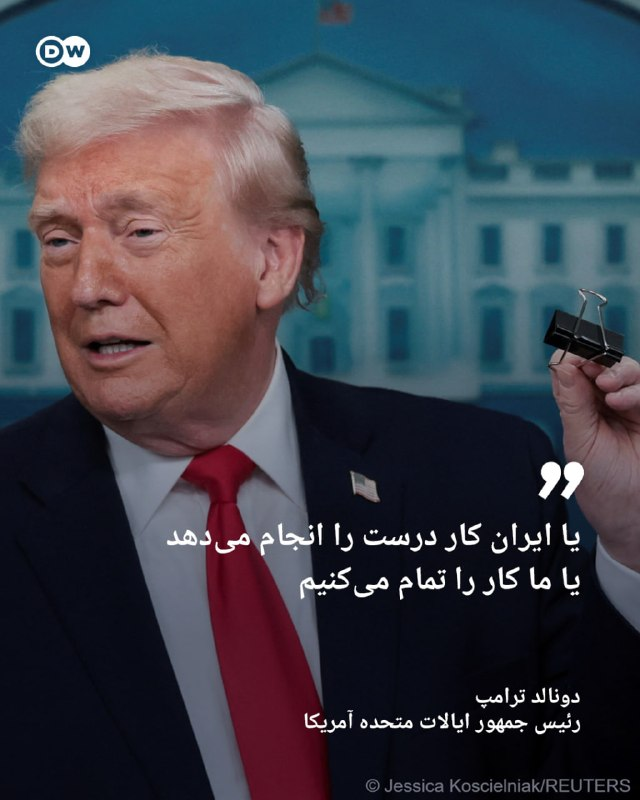

🔶 ترامپ: یا ایران کار درست را انجام می‌دهد یا ما کار را تمام می‌کنیم

دونالد ترامپ، رئیس ‌جمهور ایالات متحده آمریکا، روز سه‌شنبه ۱۲ مه (۲۲ اردیبهشت) در آغاز سفر خود به چین برای ملاقات با شی جین‌پینگ، رئیس ‌جمهور چین، اختلافات خود با شی بر سر جنگ آمریکا با ایران را کم‌اهمیت جلوه داد.

ترامپ پیش از این تلاش کرده بود شی را تحت فشار قرار دهد تا از نفوذ قابل‌توجه چین استفاده کرده و ایران را به پذیرش شروط آمریکا برای پایان دادن به جنگ یا باز کردن تنگه هرمز ترغیب کند.

ترامپ درباره برنامه خود برای گفت‌وگو با شی درباره جنگ با ایران گفت: «فکر می‌کنم او نسبتا خوب عمل کرده است.»

ترامپ افزود: «ما موضوعات زیادی برای گفت‌وگو داریم. راستش را بخواهید، نمی‌گویم ایران یکی از آن‌هاست، چون ما ایران را تا حد زیادی تحت کنترل داریم.»

رئیس جمهور آمریکا در عین حال اذعان کرد که دولت شی، ماه گذشته، زمانی که گفت‌وگوها دچار تزلزل شده بود، با ترغیب تهران به بازگشت به مذاکرات آتش‌بس به کاهش تنش‌ها کمک کرد.

@dw_farsi

## DW_Farsi — post 124628

  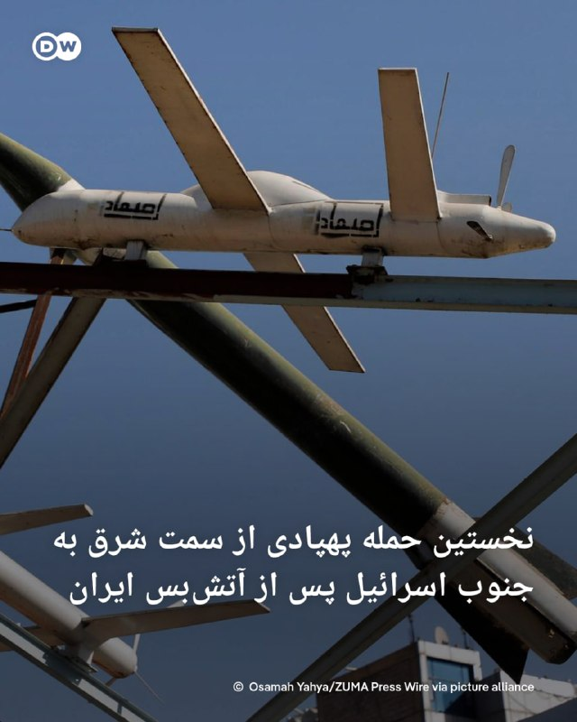

🔶 نخستین حمله پهپادی از سمت شرق به جنوب اسرائیل پس از آتش‌بس ایران

ارتش اسرائیل اعلام کرد یک پهپاد را که از سمت شرق پرتاب شده بود، در نزدیکی ایلات، جنوبی‌ترین شهر اسرائیل، رهگیری کرده است.

ارتش اسرائیل گفته این پهپاد احتمالا از یمن پرتاب شده، هرچند همچنان در حال بررسی خاستگاه دقیق آن است.

طبق اعلام ارتش اسرائیل، مطابق دستورالعمل‌ها آژیر هشدار به صدا درنیامد. این نخستین حمله پهپادی به ایلات از زمان اجرایی شدن آتش‌بس‌ها در ایران و لبنان در ماه گذشته محسوب می‌شود.

شبه‌نظامیان حوثی مورد حمایت جمهوری اسلامی، در جریان جنگ اخیر بارها موشک و پهپاد به سمت اسرائیل شلیک کرده بودند.

@dw_farsi

## DW_Farsi — post 124627

  

🟠 زیردریایی هسته‌ای نیروی دریایی آمریکا وارد جبل‌الطارق شد

یک زیردریایی هسته‌ای نیروی دریایی آمریکا وارد تنگه جبل‌الطارق شده است. ناوگان ششم نیروی دریایی آمریکا ضمن اعلام این خبر اعلام کرد: «این توقف بندری، توانمندی، انعطاف‌پذیری و تعهد مداوم ایالات متحده آمریکا به متحدان ناتو را نشان می‌دهد.»

اینکه آیا این شناور در ارتباط با جنگایران به جبل‌الطارق اعزام شده یا نه، مشخص نیست. این زیردریایی هسته‌ای از کلاس موسوم به اوهایو، از روز یکشنبه وارد منطقه شده است. زیردریایی‌های کلاس اوهایو به موشک‌های موسوم به Trident 2 D5 مجهز هستند که می‌توانند به چند کلاهک هسته‌ای مجهز شوند.

مشخص نیست زیردریایی‌ای که اکنون در جبل‌الطارق دیده شده، تسلیحات هسته‌ای حمل می‌کند یا نه. نیروی دریایی آمریکا در بیانیه خود تنها به "موشک‌های بالستیک" اشاره کرده است.

@dw_farsi

## DW_Farsi — post 124626

  

🔶 سی‌اِن‌اِن: هزینه جنگ با ایران از ۲۵ میلیارد دلار اعلام شده بیشتر است

خبرگزاری سی‌ان‌ا‌ن به نقل از سه منبع آگاه گزارش داده که برآورد ۲۵ میلیارد دلاری که یک مقام ارشد پنتاگون روز چهارشنبه درباره مجموع هزینه جنگ با ایران تا این لحظه به قانون‌گذاران این کشور ارائه کرد، "رقمی کمتر از واقعیت است و هزینه تعمیر خسارت‌های گسترده واردشده به پایگاه‌های آمریکا در منطقه را شامل نمی‌شود."

یکی از این منابع به سی‌ان‌ا‌ن گفت برآورد واقعی، با در نظر گرفتن هزینه بازسازی تاسیسات نظامی آمریکا و جایگزینی تجهیزات نابودشده، به حدود ۴۰ تا ۵۰ میلیارد دلار نزدیک‌تر است.

سی‌اِن‌اِن همچنین گزارش داده است که حملات جمهوری اسلامی در سراسر خلیج فارس در روزهای ابتدایی جنگ، تنها ظرف ۴۸ ساعت دست‌کم به ۹ پایگاه نظامی آمریکا آسیب قابل‌توجه وارد کرد و تاسیساتی در بحرین، کویت، عراق، امارات متحده عربی و قطر را هدف قرار داد.

در گزارش سی‌ان‌ان همچنین آمده که چند سامانه مهم راداری آمریکا و تجهیزات دیگر در سراسر خاورمیانه ظاهرا در حملات جمهوری اسلامی منهدم شدند؛ از جمله سامانه راداری یک سامانه موشکی تاد آمریکا در اردن و ساختمان‌هایی که سامانه‌های راداری مشابه را در دو نقطه در امارات متحده عربی در خود جای داده بودند. یک هواپیمای ای-۳ سنتری (Boeing E-3 Sentry) نیروی هوایی آمریکا نیز در حمله ایران به یک پایگاه هوایی در عربستان سعودی نابود شد.

سی‌ان‌ان پیش از این گزارش داده بود مقام‌های پنتاگون به کنگره گفته بودند این جنگ تنها در شش روز نخست حدود ۱۱ میلیارد دلار هزینه داشته است. همچنین وزارت دفاع آمریکا ماه گذشته از کاخ سفید خواست با درخواست ارائه بیش از ۲۰۰ میلیارد دلار بودجه نظامی اضافی به کنگره برای ادامه جنگ موافقت کند.

@dw_farsi

## DW_Farsi — post 124625

  

🔶 شکایت جمهوری اسلامی از آمریکا در دیوان داوری لاهه

دولت جمهوری اسلامی با طرح دعوی در دیوان داوری لاهه، از ایالات متحده آمریکا به‌ خاطر آن چه که "تجاوز نظامی به تأسیسات هسته‌ای ایران"، "اعمال تحریم‌های اقتصادی" و "تهدید به توسل به زور" خوانده شکایت کرد.

به گزارش خبرگزاری مهر، این دادخواست بر مبنای مفاد بیانیه‌های ۱۹۸۱ الجزایر و هم چنین بر اساس آن چه که "نقض تعهدات بین‌المللی آمریکا در جنگ ۱۲ روزه" توصیف شده در اسفندماه سال ۱۴۰۴، در دیوان داوری دعاوی ایران و آمریکا ثبت شده است.

جمهوری اسلامی در دادخواست خود که با عنوان پرونده الف- ۳۴ در دیوان داوری به ثبت رسیده، بر مبنای بند اول بیانیه الجزایر، با اشاره به "اعمال تحریم‌های اقتصادی و تهدید توسل به زور"، از دیوان خواسته است آمریکا را به نقض بند اول بیانیه محکوم کرده و این کشور را ملزم کند "فورا به مداخلات مستقیم و غیرمستقیم خود در امور داخلی ایران" پایان دهد.

در این دادخواست همچنین خواسته شده که آمریکا "ضمن ارائه تضمین عدم تکرار اعمال متخلفانه مزبور، خسارات وارده به ایران را نیز به طور کامل جبران کند".

بیانیه‌های الجزایر قراردادی است که با میانجیگری کشور الجزایر، میان نمایندگان ایران و ایالات متحده امریکا در ۱۹ ژانویه ۱۹۸۱ به امضا رسید و به گروگان‌گیری در سفارت آمریکا در تهران پایان داد.

@dw_farsi

## DW_Farsi — post 124624

🔶 بیش از ۱۱۰ برنده جایزه نوبل خواستار آزادی نرگس محمدی شدند

بیش از ۱۱۰ برنده جایزه نوبل خواستار آزادی فوری و بی قید و شرط نرگس محمدی، فعال زندانی حقوق بشر و برنده جایزه نوبل صلح، و رفع اتهام از او شدند.

این درخواست در پی افزایش نگرانی از وخامت سریع وضعیت جسمانی نرگس محمدی و انتقال او از زندان زنجان به بیمارستانی در تهران مطرح شده است.

در بیانیه‌ای که امروز سه‌شنبه ۱۲ مه (۲۲ اردیبهشت) منتشر شد، ۱۱۲ برنده جایزه نوبل از مقام‌های جمهوری اسلامی و جامعه جهانی خواستند تا "بی‌درنگ" برای آزادی نرگس محمدی و تضمین دسترسی مداوم او به درمان پزشکی اقدام کنند.

نرگس محمدی که در سال ۲۰۲۳ به دلیل دهه‌ها فعالیت در دفاع از حقوق زنان در ایران برنده جایزه نوبل صلح شده بود، یکشنبه گذشته ۲۰ اردیبهشت، به دلیل وضعیت بحرانی جسمانی‌اش جهت درمان تخصصی با آمبولانس به بیمارستان پارس تهران منتقل شد.

@dw_farsi

## DW_Farsi — post 124623

  

🔶 معاون نیروی دریایی سپاه: محدوده تنگه هرمز برای ما بزرگ‌تر شده است

محمد اکبرزاده، معاون سیاسی نیروی دریایی سپاه پاسداران انقلاب اسلامی، در گفت‌وگویی در تلویزیون جمهوری اسلامی مدعی شد که در جریان تحولات جنگ و محاصره دریایی، تنگه هرمز برای حکومت ایران "بزرگ‌تر شده و به یک منطقه وسیع عملیاتی تبدیل شده است."

اکبرزاده با بیان این ادعا که در گذشته، "تنگه هرمز یک گستره محدود در اطراف جزایری مانند هرمز و هنگام تعریف می‌شد"، گفت: «اکنون در چارچوب طرح جدید، محدوده تنگه هرمز به‌طور قابل توجهی گسترش یافته و از سواحل جاسک و سیری تا فراتر از جزایر بزرگ، به‌عنوان یک پهنه راهبردی تعریف شده است.»

معاون سیاسی نیروی دریایی سپاه پاسداران با اشاره به تحولات دهه‌های اخیر این منطقه و نیز در جریان جنگ هشت ساله ایران و عراق، با اشاره به ابعاد ژئوپلیتیکی تنگه هرمز، مدعی شد: «اگر بخواهیم جغرافیای این منطقه را توضیح دهیم، باید به این نکته توجه کنیم که نگاه جمهوری اسلامی ایران به تنگه هرمز، صرفاً یک نگاه محدود جغرافیایی نبوده، بلکه نگاهی راهبردی و متفاوت است.»

اکبرزاده با بیان این ادعا که "این رویکرد ناشی از سیاست تنش‌زدایی و تامین امنیت بوده است"، گفت: «ما به‌دنبال آرامش و امنیت در منطقه بودیم، اما امروز شرایط متفاوت شده و سیاست‌های جدیدی در قبال تنگه هرمز در حال اعمال است که دنیا نتایج آن را خواهد دید.»

با تشدید حملات امریکا و اسرائیل به ایران، سپاه پاسداران اقدام به بستن تنگه هرمز کرد. این اقدام با اعتراضات شدید بین‌المللی روبرو شد چرا که این باریکه یک آبراه بین‌المللی است و بر اساس قوانین بین‌الملل ایران اجازه بستن آن را ندارد.

در حال حاضر این موضوع به یکی از موضوعات اصلی مورد مناقشه میان ایران و آمریکا تبدیل شده است.

@dw_farsi

## Persian_Trend_Official — post 14018

  <a href="telegram/content/Persian_Trend_Official_14018_1778622715.webm" target="_blank">🎬 Download video</a>

#طنز_تلخ

⭕️ بیانیه عرش الهی:

مجدد زلزله ای زیبا نازل کردیم.
خواهیم دید چه خواهد شد.
از توجه شما به این موضوع سپاس گذاریم.

📝 Nick

📌 @persian_trend_official
پرشین ترند | متفاوت‌ترین کانال نظامی

## Persian_Trend_Official — post 14017

  <a href="telegram/content/Persian_Trend_Official_14017_1778622716.mp4" target="_blank">🎬 Download video</a>

💢این ویدئو بهت نشون میده که پناه‌گیری درست چطور جانت رو حفظ می‌کنه در زمان زلزله

🫆:Tony

📌 @persian_trend_official
پرشین ترند | متفاوت‌ترین کانال نظامی

## Persian_Trend_Official — post 14016

🔴کولیوند: زلزله پردیس تهران، خسارت مالی و جانی نداشت

💢 رئیس جمعیت هلال احمر: مردم نگران نباشند؛ زلزله پردیس تهران، خسارت مالی و جانی در پی نداشته است.

💢 ۲ پس لرزه ۴ و ۳.۴ ریشتری دیگر تهران را لرزاند.

🫆:Tony

📌 @persian_trend_official
پرشین ترند | متفاوت‌ترین کانال نظامی

## Persian_Trend_Official — post 14015

🔴آماده باش مدیریت بحران پردیس؛ در پی زلزله مردم پردیس از خانه‌ها خارج شدند

💢در حالی که فرماندار شهرستان پردیس گفت: در پی وقوع زمین لرزه استان ستاد مدیریت بحران شهرستان در آماده باش کامل است، خبرنگار ایرنا از پردیس گزارش می‌دهد شهروندان پردیسی از خانه‌ها خارج شده و در پارک‌ها و خودروها مستقر شده‌اند.

🫆:Tony

📌 @persian_trend_official
پرشین ترند | متفاوت‌ترین کانال نظامی

## Persian_Trend_Official — post 14014

🔴گزارش جدیدترین پس‌لرزه در استان تهران

بزرگی: 3.4
محل وقوع: حوالی پرديس
تاریخ و زمان وقوع به وقت محلی: 1405/02/23 00:32:44
طول جغرافیایی: 51.83
عرض جغرافیایی: 35.83
عمق زمین‌لرزه: 10 کیلومتر

نزدیک‌ترین شهرها:
10 کیلومتری پرديس (تهران)
11 کیلومتری بومهن (تهران)
12 کیلومتری رودهن (تهران)

نزدیکترین مراکز استان:
41 کیلومتری تهران
76 کیلومتری كرج

🫆:Tony

📌 @persian_trend_official
پرشین ترند | متفاوت‌ترین کانال نظامی

## Persian_Trend_Official — post 14013

🔴 سخنگوی اورژانس تهران:

در پی زمین لرزه در تهران تا این لحظه مصدومی گزارش نشده است

🫆:Tony

📌 @persian_trend_official
پرشین ترند | متفاوت‌ترین کانال نظامی

## Persian_Trend_Official — post 14012

  <a href="telegram/content/Persian_Trend_Official_14012_1778622719.webm" target="_blank">🎬 Download video</a>

🔴حین و بعد از زلزله چه باید کرد؟

🫆:Tony

📌 @persian_trend_official
پرشین ترند | متفاوت‌ترین کانال نظامی

## Persian_Trend_Official — post 14010

  <a href="telegram/content/Persian_Trend_Official_14010_1778622719.webm" target="_blank">🎬 Download video</a>

🔴زلزله در تهران احساس شد 🫆:Tony 📌 @persian_trend_official پرشین ترند | متفاوت‌ترین کانال نظامی

## Persian_Trend_Official — post 14009

خب دیگه بلا های آسمانی هم سر شوخی رو با مردم ایران باز کردن 🤦🏻‍♂️

📝 Nick

## Persian_Trend_Official — post 14008

🔴زلزله در تهران احساس شد 🫆:Tony 📌 @persian_trend_official پرشین ترند | متفاوت‌ترین کانال نظامی

## Persian_Trend_Official — post 14007

🔴زلزله در تهران احساس شد

🫆:Tony

📌 @persian_trend_official
پرشین ترند | متفاوت‌ترین کانال نظامی

## Persian_Trend_Official — post 14006

https://youtube.com/live/rrGzLhyQoaY?feature=share

## Persian_Trend_Official — post 14005

  

🇸🇦🇮🇷 — خبرگزاری رویترز درگزارشی مدعیست که عربستان سعودی در اواخر ماه مارس، حملات هوایی محرمانه‌ تلافی جویانه ای را در پاسخ به ایران انجام داده است.

☆Phantom☆

📌 @persian_trend_official
پرشین ترند | متفاوت‌ترین کانال نظامی

## Persian_Trend_Official — post 14004

  <a href="telegram/content/Persian_Trend_Official_14004_1778622721.mp4" target="_blank">🎬 Download video</a>

🔴ویدیو منتشر شده از کشتی کره ای آسیب دیده در حملات جمهوری اسلامی در روز های گذشته

🫆:Tony

📌 @persian_trend_official
پرشین ترند | متفاوت‌ترین کانال نظامی

## Persian_Trend_Official — post 14003

  

🔴 تهران ادعاهای کویت علیه ۴ شهروند ایرانی را رد کرد

جمهوری اسلامی ادعاهای مطرح‌شده از سوی وزارت خارجه و وزارت کشور کویت درباره برنامه‌ریزی ایران برای انجام اقدامات خصمانه علیه این کشور را «کاملاً بی‌اساس» و مردود دانست.

بر اساس موضع تهران:

▪️ اتهامات مطرح‌شده علیه ۴ شهروند ایرانی رد شده است
▪️ ایران تأکید کرده هیچ برنامه‌ای برای اقدام علیه کویت نداشته است
▪️ جمهوری اسلامی این ادعاها را فاقد اعتبار توصیف کرده است

▪️این واکنش پس از آن مطرح می‌شود که کویت از شناسایی و برخورد با آنچه «تهدیدات امنیتی» خوانده بود خبر داده بود.

🫆:Tony

📌 @persian_trend_official
پرشین ترند | متفاوت‌ترین کانال نظامی

## Persian_Trend_Official — post 14002

  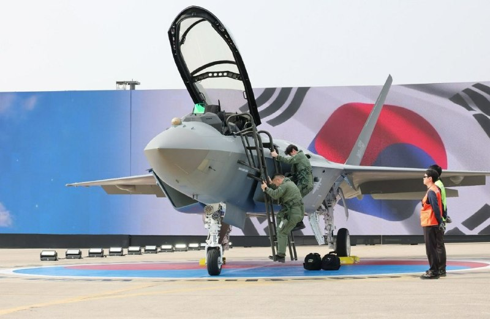

جنگنده کره‌ای KF-21 بیش از 16000 پرواز آزمایشی تاکنون انجام داده و به مراحل پایانی تست‌های خود رسیده است.

📝 Nick

📌 @persian_trend_official
پرشین ترند | متفاوت‌ترین کانال نظامی

## Persian_Trend_Official — post 14001

  <a href="telegram/content/Persian_Trend_Official_14001_1778622724.mp4" target="_blank">🎬 Download video</a>

ترامپ راهی چین شد.

📝 Nick

📌 @persian_trend_official
پرشین ترند | متفاوت‌ترین کانال نظامی

## Persian_Trend_Official — post 14000

  <a href="https://t.me/persian_trend_official/14000" target="_blank">📎 Download file</a>

فایل صوتی لایو اول
نسخه کم حجم - 7.06 مگابایت

اتاق جنگ سه شنبه 22 اردیبهشت | بالا رفتن احتمال جنگ جمهوری اسلامی و آمریکا

📝 Nick

📌 @persian_trend_official
پرشین ترند | متفاوت‌ترین کانال نظامی

## Persian_Trend_Official — post 13999

  <a href="telegram/content/Persian_Trend_Official_13999_1778622726.webm" target="_blank">🎬 Download video</a>

تهران طوفانی شد

🔹هواشناسی: از ساعتی پیش، وزش باد ۵۵ کیلومتر بر ساعت همراه با گردوخاک در تهران آغاز شده است.

شهروندان از تردد غیرضروری در فضاهای باز و ماندن در مجاورت درختان کهنسال، سازه‌های موقت و تأسیسات ناپایدار خودداری کنند.
☆Phantom☆

📌 @persian_trend_official
پرشین ترند | متفاوت‌ترین کانال نظامی

## RadioFarda — post 157111

🔸خبرگزاری رویترز روز سه‌شنبه در گزارشی اختصاصی به نقل از دو مقام غربی و دو مقام ایرانی اعلام کرد که در جریان جنگ اخیر، عربستان سعودی در واکنش به حملات تهران به این کشور، چندین حمله به اهدافی در ایران انجام داده بود. 🔸این حملات عربستان سعودی که پیش‌تر گزارش…

## RadioFarda — post 157110

  

🔸خبرگزاری رویترز روز سه‌شنبه در گزارشی اختصاصی به نقل از دو مقام غربی و دو مقام ایرانی اعلام کرد که در جریان جنگ اخیر، عربستان سعودی در واکنش به حملات تهران به این کشور، چندین حمله به اهدافی در ایران انجام داده بود.

🔸این حملات عربستان سعودی که پیش‌تر گزارش نشده بودند، نخستین مورد شناخته‌شده از اقدام مستقیم نظامی این کشور در خاک ایران به شمار می‌روند.

🔸به گفته دو مقام غربی، این حملات که توسط نیروی هوایی عربستان انجام شده‌اند، در اواخر ماه مارس صورت گرفته‌اند. یکی از آن‌ها گفت این حملات «اقدامات تلافی‌جویانه متقابل در پاسخ به حمله به عربستان» بوده است.

🔸رویترز می‌گوید نتوانسته است اهداف دقیق این حملات را تأیید کند.

🔸در پاسخ به درخواست اظهار نظر، یک مقام ارشد وزارت خارجه عربستان به‌طور مستقیم به این سوال که آیا چنین حملاتی انجام شده یا نه پاسخ نداد. وزارت خارجه ایران نیز به درخواست اظهار نظر پاسخ نداد.

@RadioFarda

## RadioFarda — post 157109

  

🔸وزارت خارجه جمهوری اسلامی بازداشت چهار نفر در کویت را که مقام‌های کویتی آن‌ها را وابسته به سپاه پاسداران معرفی کرده‌اند، تأیید کرد اما اتهام برنامه‌ریزی برای «اقدامات خصمانه» علیه کویت را رد کرد.

🔸وزارت خارجه ایران روز سه‌شنبه اعلام کرد این افراد در حال گشت دریایی بوده‌اند و به دلیل «اختلال در سیستم ناوبری» وارد آب‌های سرزمینی کویت شده‌اند.

🔸این وزارتخانه همچنین اظهارات مقام‌های کویتی درباره قصد ایران برای انجام عملیات خصمانه را رد و آن را بی‌اساس توصیف کرد.

🔸پیشتر وزارت کشور کویت اعلام کرده بود چهار «نفوذی» وابسته به سپاه پاسداران انقلاب اسلامی را پس از تلاش برای ورود دریایی به این کشور بازداشت کرده است.

🔸رسانه‌های دولتی کویت همچنین گزارش داده بودند که بازداشت‌شدگان در بازجویی‌ها گفته‌اند مأموریت داشته‌اند با یک قایق ماهیگیری به جزیره بوبیان نفوذ کنند.

@RadioFarda

## RadioFarda — post 157108

🔸وزارت خارجه ایالات متحده روز سه‌شنبه در بیانیه‌ای که در اختیار خبرگزاری رویترز قرار داد، اعلام کرد که مقام‌های ارشد آمریکا و چین توافق دارند که هیچ کشوری نباید اجازه داشته باشد برای عبور از تنگه هرمز عوارض کشتیرانی دریافت کند. 🔸این بیانیه وزارت خارجه آمریکا…

## RadioFarda — post 157107

  

🔸وزارت خارجه ایالات متحده روز سه‌شنبه در بیانیه‌ای که در اختیار خبرگزاری رویترز قرار داد، اعلام کرد که مقام‌های ارشد آمریکا و چین توافق دارند که هیچ کشوری نباید اجازه داشته باشد برای عبور از تنگه هرمز عوارض کشتیرانی دریافت کند.

🔸این بیانیه وزارت خارجه آمریکا پیش از نشست پیش‌روی دونالد ترامپ و شی جین‌پینگ، همتای چینی او، منتشر شده است؛ نشستی که در آن کنترل ایران بر تنگه هرمز در دستور کار خواهد بود.

🔸وزارت خارجه آمریکا گفت وانگ یی، وزیر خارجه چین، و مارکو روبیو، وزیر خارجه آمریکا، در یک تماس تلفنی در ماه گذشته میلادی دربارهٔ این موضوع گفت‌وگو کرده‌اند.

🔸تامِی پیگوت، سخنگوی وزارت خارجه، در پاسخ به پرسش‌های رویترز دربارهٔ این تماس گفت: «آن‌ها توافق کردند که هیچ کشور یا سازمانی نباید اجازه داشته باشد برای عبور از آبراه‌های بین‌المللی مانند تنگه هرمز عوارض دریافت کند.»

🔸رویترز می‌گوید وزارت خارجه آمریکا برخلاف رویه معمول خود، پیش‌تر گزارشی از این تماس منتشر نکرده بود.

@RadioFarda

## RadioFarda — post 157106

🔸دونالد ترامپ، رئیس‌جمهور آمریکا، پیش از سفر به پکن گفت که رئیس‌جمهور چین درباره جنگ ایران «نسبتاً خوب» عمل کرده است، اما واشینگتن به کمک او نیازی ندارد.

🔸او روز سه‌شنبه در محوطه کاخ سفید در جمع خبرنگاران افزود که قرار است با شی جین‌پینگ «گفت‌وگویی طولانی» درباره ایران داشته باشد.

🔸ترامپ تصریح کرد: «فکر نمی‌کنم ما به هیچ کمکی درباره ایران نیاز داشته باشیم. ما به هر شکلی که باشد پیروز خواهیم شد. یا به‌صورت مسالمت‌آمیز پیروز می‌شویم یا به شکل دیگری.»

🔸رئیس‌جمهور آمریکا با اشاره به این که توان نظامی ایران در جنگ اخیر از بین رفته است، هشدار داد: ««ایران یا کار درست را انجام خواهد داد یا ما کار را تمام خواهیم کرد.»

@RadioFarda

## RadioFarda — post 157105

  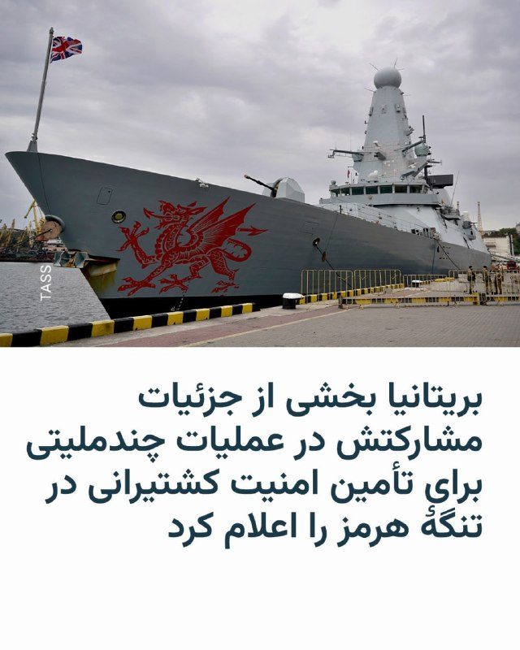

🔸دولت بریتانیا می‌گوید ناوشکن اچ‌ام‌اس دراگون، چندین جنگندۀ تایفون و شهپادهای مین‌روب را در قالب یک عملیات چندملیتی برای تضمین امنیت کشتیرانی در تنگۀ هرمز، به این منطقه اعزام خواهد کرد.

🔸جان هیلی، وزیر دفاع بریتانیا این موضوع را روز سه‌شنبه در جریان یک نشست آنلاین با همتایانش از بیش از چهل کشور دیگر عضو این عملیات اعلام کرد؛ عملیاتی که به گفتۀ او، پس از آماده‌شدن شرایط اجرایی خواهد شد.

🔸وزیر دفاع بریتانیا در بیانیه‌ای گفت: «این عملیات با شراکت متحدانمان، عملیاتی دفاعی، مستقل و معتبر خواهد بود».

🔸مشارکت بریتانیا در این عملیات،‌ شامل ۱۱۵ میلیون پوند (بیش از ۱۵۵ میلیون دلار) سرمایه‌گذاری جدید در زمینۀ شهپادهای مین‌روب و سامانه‌های ضد پهپاد هم خواهد بود.

🔸بریتانیا در حال حاضر بیش از یک‌هزار نیروی نظامی در منطقه دارد که در قالب عملیات و همکاری‌های دفاعی با کشورهای منطقه، از جمله در زمینۀ مقابله با پهپادها در کشورهای متحد این کشور مستقر شده‌اند. ناوشکن اچ‌ام‌اس دراگون هم در مسیر خاورمیانه قرار دارد.

@RadioFarda

## RadioFarda — post 157104

  

🔸دونالد ترامپ، رئیس‌جمهور آمریکا، پیش از سفر به پکن گفت که رئیس‌جمهور چین درباره جنگ ایران «نسبتاً خوب» عمل کرده است، اما واشینگتن به کمک او نیازی ندارد.

🔸او روز سه‌شنبه در جمع خبرنگاران افزود که قرار است با شی جین‌پینگ «گفت‌وگویی طولانی» درباره ایران داشته باشد.

🔸ترامپ تصریح کرد: «فکر نمی‌کنم ما به هیچ کمکی درباره ایران نیاز داشته باشیم. ما به هر شکلی که باشد پیروز خواهیم شد. یا به‌صورت مسالمت‌آمیز پیروز می‌شویم یا به شکل دیگری.»

🔸رئیس‌جمهور آمریکا با اشاره به این که توان نظامی ایران در جنگ اخیر از بین رفته است، هشدار داد: ««ایران یا کار درست را انجام خواهد داد یا ما کار را تمام خواهیم کرد.»

🔸او به جزئیات بیشتری درباره این هشدار اشاره نکرد، اما این اظهارات در حالی است که ترامپ پیشنهاد آخر ایران برای توافق پایان جنگ را در روزهای اخیر رد کرده و آن را «کاملا غیر قابل قبول» و «فوق‌العاده ضعیف» خوانده است.

🔸رئیس‌جمهور آمریکا قرار است چهارشنبه برای دیداری رسمی وارد پایتخت چین شود. این سفر که قرار بود در ماه مارس انجام شود، به دلیل درگیری نظامی آمریکا و اسرائیل با ایران به تأخیر افتاد.

@RadioFarda

## RadioFarda — post 157103

🔸داده‌های کشتیرانی بورس لندن، ال‌اس‌ای‌جی، نشان می‌دهد که دومین نفتکش گاز طبیعی مایع (ال‌ان‌جی) متعلق به قطر روز سه‌شنبه با موفقیت از تنگه هرمز عبور کرده است. 🔸این اتفاق چند روز پس از آن رخ داده که نخستین محموله از این نوع، با مشارکت ایران و پاکستان، از این…

## RadioFarda — post 157102

  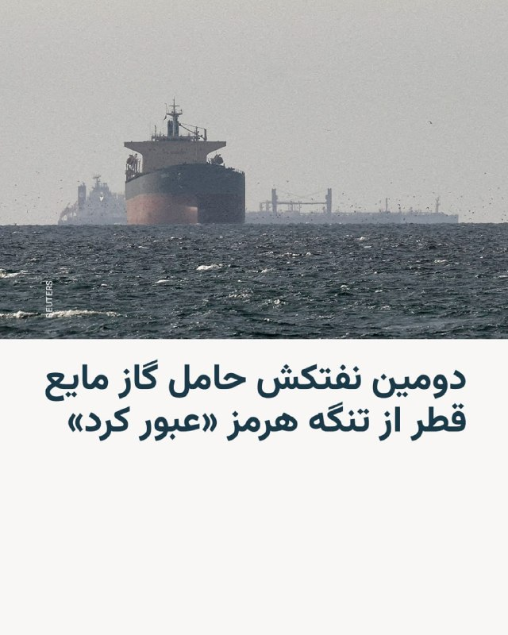

🔸داده‌های کشتیرانی بورس لندن، ال‌اس‌ای‌جی، نشان می‌دهد که دومین نفتکش گاز طبیعی مایع (ال‌ان‌جی) متعلق به قطر روز سه‌شنبه با موفقیت از تنگه هرمز عبور کرده است.

🔸این اتفاق چند روز پس از آن رخ داده که نخستین محموله از این نوع، با مشارکت ایران و پاکستان، از این آبراه عبور کرده بود.

🔸بر اساس داده‌های ال‌اس‌ای‌جی، کشتی «میهزم» با ظرفیت ۱۷۴ هزار متر مکعب، روز دوشنبه بندر رأس لفان را ترک و روز سه‌شنبه از تنگه هرمز عبور کرد و به‌سوی بندر قاسم پاکستان رفت؛ جایی که انتظار می‌رود اواخر همان روز به آن برسد. این دومین عبور موفق یک نفتکش گاز طبیعی مایع قطری از هرمز از زمان آغاز جنگ ایران است.

🔸روز شنبه، نفتکش«الخریطیات» عبور از تنگه هرمز را از طریق مسیر شمالی مورد تأیید ایران آغاز کرد و روز یکشنبه موفق شد از این آبراه عبور کند. طبق داده‌های بورس لندن، این کشتی اکنون در نزدیکی بندر قاسم لنگر انداخته است.

@RadioFarda

## RadioFarda — post 157101

تشدید فشار بر نخست‌وزیر بریتانیا برای کناره‌گیری؛ استارمر می‌گوید قصد استعفا ندارد

🔸شکست سنگین حزب کارگر بریتانیا در انتخابات شوراهای محلی انگلستان و پارلمان‌های اسکاتلند و ولز، کابوسی را برای نخست‌وزیر بریتانیا رقم زده که گویی پایانی ندارد.

🔸صبح روز سه‌شنبه ۲۲ اردیبهشت‌ماه، کی‌یر استارمر در حالی در خانۀ شماره ۱۰ داونینگ‌‌استریت میزبان اعضای کابینه‌اش بود که می‌دانست دست‌کم ۸۰ تن از نمایندگان حزب کارگر، یعنی تقریباً یکی از هر پنچ نماینده این حزب در پارلمان، خواستار کناره‌گیری او از مقام صدارت شده‌اند؛ یا بلافاصله و یا بر اساس یک برنامۀ زمانبندی مشخص.

🔸در حالی‌که قرار است چارلز سوم پادشاه بریتانیا، روز چهارشنبه در مراسم سنتی افتتاح پارلمان، سخنرانی و برنامه‌های دولت کی‌یر استارمر برای یک‌سال آینده را اعلام کند، مشخص نیست چقدر از عمر این دولت باقی مانده باشد.

🔸پیش از ظهر سه‌شنبه کی‌یر استارمر در جلسۀ کابینه، تأکید کرد که کناره‌گیری نخواهد کرد و قصد دارد به رغم «۴۸ ساعت ناخوشایند گذشته»، رهبری کشور و تلاش برای اجرای برنامه‌های دولت کارگری را ادامه دهد.

🔸این وکیل حقوق بشر که کمتر از دو سال از نخست‌وزیری‌اش می‌گذرد، در جلسۀ کابینه تکرار کرد که گرچه مسئولیت شکست سنگین حزبش در انتخابات آخر هفتۀ قبل را می‌پذیرد، هنوز دلیل قاطعی برای کناره‌گیری نمی‌بیند.

🔸در این جلسه چندین تن از معاونان وزرا و اعضای ارشد کابینه بر ادامۀ حمایت از کی‌یر استارمر تأکید کردند.

🔸با وجود این دقایقی پس از پایان جلسه کابینه، جِس فیلیپس و الکس دیویس-جونز، دو معاون وزیر با انتشار مطالبی در شبکۀ ایکس از کناره‌گیری خود از مقام دولتی خبر دادند. پیش از این دو، میاتا فَنبوله، معاون وزیر در امور جوامع و اقلیت‌ها هم از تصمیمش برای کناره‌گیری از دولت خبر داده بود. اقدامی که با کناره‌گیری ربیر احمد معاون وزیر بهداشت دنبال شد.

🔸در همین حال همراهی شعبانه محمود وزیر کشور کابینۀ کی‌یر استارمر با نمایندگانی که خواهان کناره‌گیری نخست‌وزیر شده‌اند، می‌تواند برای رهبر حزب گران تمام شود.

🔸به گفتۀ منابع نزدیک به داونینگ استریت، انتظار می‌رود در ساعات آینده تعداد بیشتری از اعضای دولت از کناره‌گیری خود خبر داده و خواهان تغییر در رأس حزب کارگر شوند.

🔸گزارش کامل را در وب‌سایت رادیوفردا بخوانید.

@RadioFarda

## RadioFarda — post 157100

  

🔸الناز محمدی، روزنامه‌نگار ایرانی و دبیر گروه اجتماعی روزنامه «هم‌میهن»، در فهرست نامزدهای جایزه آزادی مطبوعات سازمان گزارشگران بدون مرز قرار گرفت.

🔸گزارشگران بدون مرز اعلام کرده است که الناز محمدی در بخش «شجاعت» نامزد این جایزه شده؛ بخشی که به روزنامه‌نگاران و رسانه‌هایی تعلق می‌گیرد که در شرایطی دشوار و با وجود خطر برای امنیت و آزادی‌شان به فعالیت ادامه داده‌اند.

🔸در توضیح این نامزدی آمده است که او پس از اعتراضات «زن، زندگی، آزادی» و پوشش پیامدهای اجتماعی آن، در سال ۲۰۲۳ بازداشت و به سه سال زندان محکوم شد. گزارشگران بدون مرز همچنین به فشارهای قضایی، زندان و محرومیت شغلی علیه او اشاره کرده است.

🔸مراسم اعلام برندگان جوایز آزادی مطبوعات سال ۲۰۲۶ روز ۱۱ خرداد در شهر مارسی فرانسه و همزمان با کنگره جهانی رسانه برگزار خواهد شد.

@RadioFarda

## RadioFarda — post 157099

  <a href="https://t.me/radiofarda/157099" target="_blank">📎 Download file</a>

📻بشنوید: ایستگاه ۱۹ با رادیوفردا، ۲۲ اردیبهشت ۱۴۰۵

@RadioFarda

## IranianMinds — post 20047

  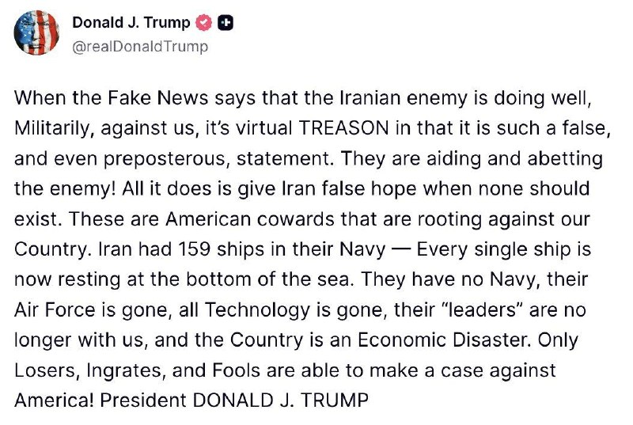

🔴 ترامپ:

وقتی اخبار جعلی می‌گویند دشمن ایرانی در مقابله با ما از نظر نظامی خوب عمل کرده است، این عملاً خیانت است، چون خبری کاملاً دروغین و حتی مضحک است. آن‌ها به دشمن کمک می‌کنند! این کار تنها به ایران امید دروغین می‌دهد، در حالی که نباید هیچ امیدی وجود داشته باشد.

این‌ها آمریکایی‌های بزدل هستند که علیه کشور ما ریشه دوانده‌اند. ایران ۱۵۹ کشتی در نیروی دریایی داشت حالا هر کشتی‌ای در کف دریا است. نیروی دریایی ندارند، نیروی هوایی‌شان از بین رفته، تمام فناوری‌هایشان از بین رفته، «رهبران»شان دیگر با ما نیستند و کشور در بحران اقتصادی است!

@IranianMinds

## IranianMinds — post 20046

  <a href="telegram/content/IranianMinds_20046_1778622733.mp4" target="_blank">🎬 Download video</a>

بچه ها اسم این بازی عبور مرغ از خیابون  هست ویدئو نگاه کنید خیلی راحت 8 میلیون ازش سود گرفتیم😍

😤اگ توم دوس داری خیلی راحت از بازی های انلاین پول در بیاری حتما عضو کازینو شبانه شو
✅

توی کازینو شبانه بهت اموزش میدیم از بازی های انلاین پول دربیاری👌

کازینو شبانه راهی برای چند برابر کردن سرمایت 🤷‍♂

کسب درامد انلاین با یه ادم حرفه ای یاد بگیر و‌ پول دربیار 
💵
ae22
🎯همین حالا عضو شو و شروع کن👇
https://t.me/+OS-QBvyDO4M2ZGY0
https://t.me/+OS-QBvyDO4M2ZGY0

## IranianMinds — post 20045

  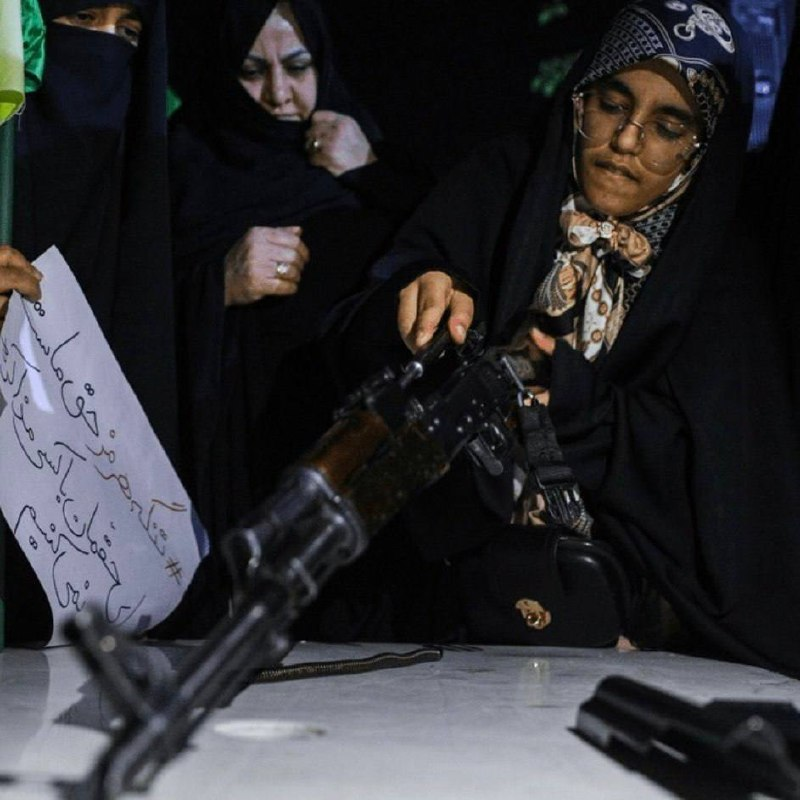

جمهوری اسلامی از اورک ها هم‌ داره استفاده میکنه

@IranianMinds

## IranianMinds — post 20044

🔴 امام جمعه کاشان پا منقل :

جمهوری اسلامی تنها ابرقدرت جهان است هیچ کشوری توان مقابله با ما رو‌ نداره !

@IranianMinds

## IranianMinds — post 20043

ترامپ هم‌ تو‌ راه چین نشسته یه متن بالا بلند نوشته و دوباره گفته فیک‌ نیوزا شعر میگن ما ارتش ایران و رهبریشو‌ از بین بردیم

@IranianMinds

## IranianMinds — post 20042

🔴 مرکز لرزه نگاری :

زلزله ۴.۶ ریشتری مرز استان های تهران و مازندران را لرزاند.

@IranianMinds

## IranianMinds — post 20041

یادش بخیر جنگ ۱۲ روزه هر زلزله ای میومد میگفتن تموم شد تست بمب اتم‌ بود

## IranianMinds — post 20040

🔴 زلزله نسبتا شدیدی در تهران رخ داد @IranianMinds

## IranianMinds — post 20039

  <a href="telegram/content/IranianMinds_20039_1778622737.mp4" target="_blank">🎬 Download video</a>

🔴 شاهزاده رضا پهلوی از استراتژی ترامپ درباره ایران انتقاد کرد:

از یک سو می‌گوید مردم باید قیام کنند و از سوی دیگر می‌گوید صبر کنید، ما در حال مذاکره هستیم. این موضوع همه را کاملاً گیج کرده است.

نمی‌توان پیام‌های متناقض فرستاد.

@IranianMinds

## IranianMinds — post 20038

🔴 زلزله نسبتا شدیدی در تهران رخ داد

@IranianMinds

## IranianMinds — post 20037

  

🔴 ۷۴ روزه که اینترنت توسط جمهوری اسلامی قطع شده

میلیون ها کسب و کار نابود شدن و میلیون ها نفر از نون خوردن افتادن ، در‌ حالی که جمهوری اسلامی با فروش اینترنت پرو داره درآمد برا خودش قطع میکنه و از این سود میبره …

@IranianMinds

## IranianMinds — post 20036

  

🔴 شاهزاده رضا پهلوی تو نشست امنیتی سالانه پولیتیکو:

الان ما با یه جونورِ زخمی طرفیم و نباید بذاریم فرصت از دست بره، کار رو باید یه بار واسه همیشه تموم کنیم.

سیاست مماشات با جمهوری اسلامی که راهبرد خیلی از دولت‌ها بود، شکست خورده.
مردم به‌اندازه کافی هوشمند هستنن که تفاوت بین حمله به یه ملت و حمله به یه رژیم رو تشخیص بدن.
ما فقط زمانی می‌تونیم مردم رو به بازگشت به خیابون‌ها فرا بخوانیم که اونا هم سطحی از توان مقابله رو داشته باشن.

@IranianMinds

## IranianMinds — post 20035

  

🔴 ان بی سی نیوز :

پنتاگون در حال بررسی نام‌گذاری مجدد جنگ با ایران به «عملیات چکش سنگین» در صورت فروپاشی آتش‌بس و از سرگیری عملیات‌های رزمی گسترده توسط ترامپ است

@IranianMinds

## IranianMinds — post 20034

🔴 ترامپ حرکت کرد به سمت چین

@IranianMinds

## IranianMinds — post 20033

🔴 خبرگزاری فارس :

پیشنهادات آمریکاییا برای مذاکرات کاملا یک طرفه است و فقط منافع خودشون براشون مهمه هیچ اهمیتی به ما نمیدن

@IranianMinds

## IranianMinds — post 20032

🔴 رئیس کمیسیون انرژی :

به دلیل آسیب به پتروشیمی ها امسال قطعی برق خیلی بیشتری داریم

@IranianMinds

## IranianMinds — post 20031

  <a href="telegram/content/IranianMinds_20031_1778622741.mp4" target="_blank">🎬 Download video</a>

🔴 ترامپ:

ما ایران را کاملا تحت کنترل داریم.

خلاصه یا یک توافق می‌کنیم، یا هم نابودشون میکنیم .

@IranianMinds

## IranianMinds — post 20030

🔴 خبرنگار: در مذاکرات با ایران چه زمانی عقب می‌نشینید؟

ترامپ:

می‌خواهیم ببینیم اوضاع چطور پیش می‌رود. هدف‌مان فقط یک توافق خوب است.
باور دارم این برای مردم آمریکا مفید خواهد بود و برای مردم ایران هم مفید است !

@IranianMinds

## IranianMinds — post 20029

بقیه صحبتاش تکراریه پوشش نمیدیم حرف جدیدی زد پوشش میدیم

## IranianMinds — post 20028

  <a href="telegram/content/IranianMinds_20028_1778622744.mp4" target="_blank">🎬 Download video</a>

🔴 ترامپ:

رهبران ایران یا کار درست را انجام خواهند داد، یا ما کار را تمام خواهیم کرد.

@IranianMinds

## BBCPersian — post 280881

🔻اورژانس تهران اعلام کرده در پی طوفان و باد شدید در تهران تاکنون ۱۱ حادثه به این سازمان امدادی گزارش شده است.

خبرگزاری مهر به نقل از شروین تبریزی، سخنگوی اورژانس تهران نوشته تاکنون ۷ مصدوم که ۵ نفر آنها سرپایی درمان شده‌اند، در ماموریت‌های امدادگران ثبت شده اند اما ممکن است آمار تعداد مصدومان بیشتر شود.

در همین حال، خبرگزاری‌های ایران از وقوع زمین لرزه در حوالی تهران خبر داده‌اند.
زلزله در حوالی شهر پردیس - شرق تهران - و به بزرگی ۴/۶ گزارش شده است و به گزارش ایرنا درشهرهای بومهن و رودهن احساس شده و در شهر دماوند موجب قطعی برق شده است.

قطعی برق در برخی از مناطق تهران هم گزارش شده اما علت آن وزش تندباد با سرعتی بالای ۵۵ کیلومتر در ساعت گزارش شده است که موجب شکستن درختان در نقاطی هم شده است.

@BBCPersian

## BBCPersian — post 280880

🔻کایا کالاس، مسئول سیاست خارجی اتحادیه اروپا، گفت این اتحادیه ممکن است مأموریت دریایی خود در دریای سرخ را پس از پایان جنگ ایران، به تنگه هرمز نیز گسترش دهد.

مأموریت اتحادیه اروپا در سال ۲۰۲۴ برای حفاظت از کشتیرانی در دریای سرخ، یکی دیگر از آبراه‌های مهم خاورمیانه، در برابر حملات حوثی‌های یمن آغاز شد.

خانم کالاس پس از نشست وزیران دفاع اتحادیه اروپا گفت عملیات اتحادیه اروپا هم‌اکنون نقش مهمی در حفاظت از کشتیرانی در دریای سرخ دارد و فعالیت‌های آن می‌تواند به تنگه هرمز هم گسترش یابد.

او افزود که برخی کشورها از هم‌اکنون وعده داده‌اند کشتی‌های بیشتری در اختیار این مأموریت قرار دهند و این موضوع می‌تواند در صورت تصمیم برای گسترش دامنه عملیات، کمک‌کننده باشد.

وزیران دفاع اتحادیه اروپا در ماه گذشته میلادی در ابتدا پیشنهاد گسترش مأموریت دریای سرخ را رد کرده بودند.

به نظر می‌رسد مذاکرات میان آمریکا و ایران برای پایان دادن به جنگ خاورمیانه و بازگشایی این آبراه حیاتی، متوقف شده است.

انسداد تنگه هرمز از سوی ایران باعث افزایش قیمت جهانی انرژی شده است.
@BBCPersian

## BBCPersian — post 280879

🔻دونالد ترامپ، رئیس‌جمهوری آمریکا پیش از عزیمت به چین گفت که برای پایان دادن به جنگ با ایران به کمک این کشور نیازی ندارد.

آقای ترامپ در عین حال اعلام کرد که در جریان نشست این هفته خود با شی جین‌پینگ، رئیس‌جمهور چین گفت‌وگویی مفصل خواهد داشت.

چین یکی از مهم‌ترین شرکای اقتصادی ایران است و بخش بزرگی از صادرات نفت این کشور را خریداری می‌کند. پکن همچنین از حامیان مهم ایران است.

آقای ترامپ تأکید کرد که برای یافتن راه خروج از درگیری‌ای که دو ماه و نیم پیش با حمله گسترده آمریکا و اسرائیل آغاز شد و سپس بر سر کنترل مسیر کشتیرانی تنگه هرمز به بن‌بست رسید، به شی جین‌پینگ نیازی ندارد.

آقای ترامپ گفت: «موضوعات زیادی برای گفت‌وگو داریم. راستش را بخواهید، نمی‌گویم ایران یکی از آنهاست، چون ما ایران را کاملا تحت کنترل داریم.»

او افزود: «یا به توافق می‌رسیم یا آنها نابود خواهند شد.»

در حالی که گزارش‌هایی منتشر شده مبنی بر این‌که چین همچنان به تسلیح ایران کمک می‌کند و نفت تحریم‌شده ایران را می‌خرد، آقای ترامپ گفت شی جین‌پینگ «نسبتا خوب» عمل کرده است.
@BBCPersian

## BBCPersian — post 280878

  <a href="https://t.me/bbcpersian/280878" target="_blank">📎 Download file</a>

این نسخه رادیویی برنامه شصت دقیقه تلویزیون فارسی بی‌بی‌سی است که هرشب بعد از پخش، با حجم کم از اپلیکیشن‌های پادگیر و صفحه تلگرام بی‌بی‌سی فارسی در دسترس است. 
با هشتگ BBCPersianRadio با ما در ارتباط باشید.

## BBCPersian — post 280876

  <a href="https://t.me/bbcpersian/280876" target="_blank">📎 Download file</a>

پادکست برنامه شصت دقیقه سه‌شنبه ۲۲ اردیبهشت ۱۴۰۵
این نسخه رادیویی برنامه شصت دقیقه تلویزیون فارسی بی‌بی‌سی است که هرشب بعد از پخش، با حجم کم از اپلیکیشن‌های پادگیر و صفحه تلگرام بی‌بی‌سی فارسی در دسترس است.
با هشتگ BBCPersianRadio# با ما در ارتباط باشید.

## BBCPersian — post 280875

  <a href="https://t.me/bbcpersian/280875" target="_blank">📎 Download file</a>

پادکست جام جهان‌نما، سه‌شنبه ۲۲ اردیبهشت ۱۴۰۵
در این برنامه می‌شنوید:

رئیس جمهور آمریکا سرخورده از بن‌بست در مواجهه با ایران؛ گفته می‌شود ترامپ جدی‌تر از گذشته به از سرگیری جنگ فکر می‌کند. در گپ روز این جام جهان نما می‌پرسیم آیا چین می تواند گره کور اختلافات بین ایران و آمریکا را باز کند؟

ترکیه و قطر بر بازگشایی بی‌قید‌و‌شرط تنگه هرمز تأکید کردند. هر دو از مذاکره برای برقراری صلح بین ایران و آمریکا حمایت می‌کنند.

هفتاد و چهار روز از قطع اینترنت در ایران می‌گذرد. دولت می‌گوید تا تهدید جنگ رفع نشود، از دسترسی عمومی خبری نیست.

این برنامه رادیویی را می‌توانید هر شب ساعت ۲۰ به وقت ایران، روی موج متوسط ۷۰۲ کیلوهرتز و موج کوتاه ۹۴۶۵ کیلوهرتز بشنوید.
تکرار برنامه را هم می‌توانید ساعت ۲۱:۳۰ روی موج متوسط ۷۰۲ کیلوهرتز و موج کوتاه ۵۳۹۵ کیلوهرتز گوش کنید.
@BBCPersian

## BBCPersian — post 280874

🔻وزارت خارجه کویت سفیر ایران را احضار کرد

در پی بازداشت چهار فرد «وابسته به سپاه پاسداران» که تلاش می‌کردند از طریق دریا به این کشور وارد شوند، وزارت خارجه کویت اعلام کرده که محمد توتونچی، سفیر ایران در این کشور را احضار کرده است تا «نامه اعتراضی» این کشور را به او تحویل دهد.

این وزارت‌خانه اقدام اخیر جمهوری اسلامی را به عنوان «اقدامی خصمانه» و «حمله‌ای آشکار» به حاکمیت کویت خوانده و آن را محکوم کرده است.

کویت گفته است که «حق دفاع از خود» را محفوظ می‌دارد.

این چهارمین باری است که از زمان آغاز جنگ آمریکا و اسرائیل با ایران و آغاز حملات ایران علیه کشورهای خلیج فارس، سفیر جمهوری اسلامی احضار می‌شود.

وزارت کشور کویت امروز اعلام کرد که «چهار نفوذی وابسته به سپاه پاسداران» که تلاش می‌کردند از طریق دریا به این کشور وارد شوند را بازداشت کرده است.

خبرگزاری دولتی کونا به نقل از این وزارتخانه گزارش داده است که یک نفر از نیروهای مسلح کویت در درگیری با این چهار نفر مجروح شده است.

بر اساس بیانیه وزارت کشور کویت، دستگیرشدگان دو سرهنگ، یک سروان و یک ستوان نیروی دریایی سپاه بوده‌اند که «اذعان» کرده‌اند ماموریت داشتند به جزیره بوبیان «نفوذ» کنند.

در این بیانیه آمده است که این چهار نفر در اول ماه مه (۱۱ اردیبهشت) سعی کردند «سوار بر یک قایق ماهیگیری که مخصوص انجام اقدامات خصمانه علیه کویت تدارک داده شده بود» وارد کویت شوند.

بوبیان بزرگترین جزیره کویت است و با سواحل ایران و عراق فاصله کمی دارد.

@BBCPersian

## BBCPersian — post 280864

  <a href="telegram/content/BBCPersian_280864_1778622748.mp4" target="_blank">🎬 Download video</a>

بیش از ۷۰ روز است که اینترنت جهانی در ایران قطع شده و هزینه‌های بسیاری بر اقتصاد اشخاص و کشور بر جا گذاشته است. در روزهای اخیر صداهای بیشتر از کاربران اینترنت در ایران شنیده می‌شود و به نظر می‌رسد تعداد بیشتری توانسته‌اند به اینترنت جهانی وصل شوند.

تعدادی از کاربران با پرداخت مبلغ «۴۰ هزار تومان به ازای هر گیگ» از اپراتور‌ها خدمات اینترنتی ایران موسوم به «اینترنت پرو» خریده‌اند و تعدادی با فیلترشکن‌های گران‌تر به اینترنت جهانی وصل شده‌اند.

حدود چهار ماه است که دسترسی کاربرانی که در ایران هستند به اینترنت جهانی بسیار دشوار شده است. پس از اعتراضات دی ۱۴۰۴ و سپس جنگ آمریکا و اسرائیل با ایران، دسترسی به اینترنت جهانی به طور کامل قطع شد. اما تعداد اندکی افراد دارای سیم‌کارت بااصطلاح «سفید» به اینترنت دسترسی داشته‌اند.

📷Getty Images
EPA/Shutterstock
https://bbc.in/49rKNBi
https://bbc.in/4uIjf2M
@BBCPersian

## BBCPersian — post 280863

🔻‌محمدرضا شهبازی، مجری برنامه پاورقی شبکه ۲ تلویزیون دولتی ایران که به عنوان یک چهره حامی حکومت شناخته می‌شود، در واکنش به مقایسه وضعیت اینترنت در ایران و آزمایش اینترنت ۵جی در افغانستان و شروع استفاده از کردیت کارت‌های بین‌المللی در سوریه گفت: «اگر این چیزها…

## BBCPersian — post 280862

🔻‌محمدرضا شهبازی، مجری برنامه پاورقی شبکه ۲ تلویزیون دولتی ایران که به عنوان یک چهره حامی حکومت شناخته می‌شود، در واکنش به مقایسه وضعیت اینترنت در ایران و آزمایش اینترنت ۵جی در افغانستان و شروع استفاده از کردیت کارت‌های بین‌المللی در سوریه گفت: «اگر این چیزها اینقدر مهم است بروید همانجا (سوریه و افغانستان) زندگی کنید.»

 مجری برنامه پاورقی با خواندن یک توییت از پوریا زراعتی، مجری تلویزیون اینترنشنال که شرایط اینترنت در ایران را با افغانستان و سوریه مقایسه کرده بود و همچنین اشاره به یک پست از یک کانال تلگرامی که اشاره مشابهی به اینترنت در ایران داشت، گفت: «بروید سوریه با کردیت کارت از آمازون چسب پهن بخرید و زمان بمباران شیشه‌هایتان را چسب بزنید.»

@BBCPersian

## BBCPersian — post 280861

🔻مخالفت دوباره حزب‌الله با هرگونه مذاکره مستقیم لبنان با اسرائیل

در آستانه دور جدید مذاکرات اسرائیل و دولت لبنان، حزب‌الله یک بار دیگر خواستار خودداری از هرگونه مذاکره مستقیم با اسرائیل شد.

نعیم قاسم، دبیرکل حزب‌الله، هشدار داد که هرگونه مذاکره مستقیم فقط به نفع اسرائیل خواهد بود.

او همچنین تاکید کرد که موضوع سلاح‌های حزب‌الله «یک امر داخلی است و در مذاکرات با دشمن جایی ندارد.»

نعیم قاسم در پیام صوتی خود خطاب به نیروهای حزب‌الله گفت که «مقاومت» هرگز تسلیم فشار آمریکا و اسرائیل نخواهد شد و قول داد که میدان نبرد برای اسرائیل به «جهنم» تبدیل شود.

دبیرکل حزب‌الله در بخشی دیگر از سخنانش از توجه ایران به لبنان و مردمش قدردانی کرد و گفت: «توافق ایران و آمریکا که شامل پایان تجاوز به لبنان می‌شود، تقریبا محکم‌ترین سند برای توقف این تجاوز است.»

با این حال او افزود که مسئولیت مذاکره برای تامین اهداف ملی لبنان همچنان بر عهده مقام‌های لبنان است و قول داد که همکاری کند.

دور سوم مذاکرات لبنان و اسرائیل قرار است روزهای پنجشنبه و جمعه این هفته برگزار شود.

باوجود ادامه آتش‌بس با ایران، تبادل آتش میان حزب‌الله لبنان و اسرائیل همچنان ادامه داشته است.

آمریکا و اسرائیل از دولت لبنان می‌خواهند که حزب‌الله را خلع سلاح کند اما حزب‌الله می‌گوید تسلیم نخواهد شد.

@BBCPersian

## Dirty_Kids — post 389348

نون و پنیک و سبزی
تو بیش از این می‌لرزی

@Dirty_Kids 👻

## Dirty_Kids — post 389347

ترسناک‌تر از زلزله‌ای که اومده، پس‌زلزله‌ای که هنوز نیومده

@Dirty_Kids 👻

## Dirty_Kids — post 389346

تهران مجددا بصورت خفیف لرزید

@Dirty_Kids 👻

## Dirty_Kids — post 389345

قدیم اگه همچین زلزله‌ای میومد ملت تا صبح تو ماشینا و پارکا می‌خوابیدن، ببین چقدر پوستمون کلفت شده که کیرمونم نیست.

@Dirty_Kids 👻

## Dirty_Kids — post 389343

امشب هم طوفان اومد، هم زلزله شد، بعدی حمله‌ی زامبیاس.

@Dirty_Kids 👻

## Dirty_Kids — post 389342

الان باید تن‌ماهی بخریم یا بنزین بزنیم؟

@Dirty_Kids 👻

## Dirty_Kids — post 389341

  

🔴 زلزله تهران به مرکز پردیس، 3.4 ریشتر بود.

@Dirty_Kids 👻

## Dirty_Kids — post 389340

🔴 فوری: وسط این همه بگایی تهران زلزله اومد!

@Dirty_Kids 👻

## Dirty_Kids — post 389339

  

واکنش شهبازی (اسکل نظام) به وضعیت اینترنت مردم ایران و کشورهای منطقه: اگه خیلی این چیزها مهمه، برید همون افغانستان و سوریه زندگی کنید! هاهاهاها + هاهاها و ک...خر @Dirty_Kids 👻

## Dirty_Kids — post 389338

  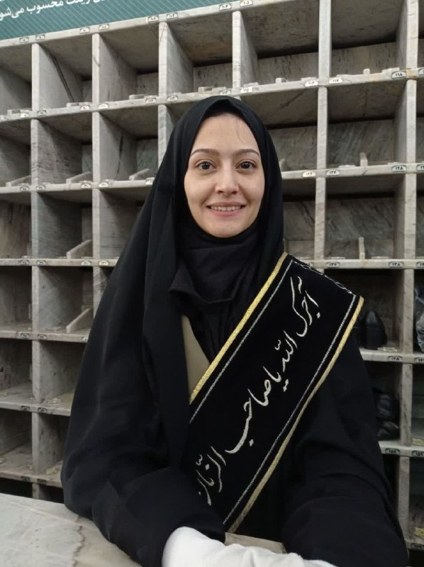

این پردیس احمدیه افغانی رفته خادم رضا شده

رقابت سنگینی هست بین این بی‌هنرا تو مالیدن تا بارشونو ببندن

@Dirty_Kids 👻

## Dirty_Kids — post 389337

  <a href="telegram/content/Dirty_Kids_389337_1778622751.mp4" target="_blank">🎬 Download video</a>

عشق این شکلیه 👆

@Dirty_Kids 👻

## Dirty_Kids — post 389336

ترامپ گفته مسئولین حکومت خیلی بی‌شرفن.
فکر کن یارو تازه غیرمستقیم باهاشون هم‌کلام شده اینجوری میگه. اونم چندهفته نه ۴۷ سال...

@Dirty_Kids 👻

## Dirty_Kids — post 389335

  

👑 رضا پهلوی تو نشست امنیتی سالانه پولیتیکو:

الان ما با یه جونورِ زخمی طرفیم و نباید بذاریم فرصت از دست بره، کار رو باید یه بار واسه همیشه تموم کنیم.

سیاست مماشات با جمهوری اسلامی که راهبرد خیلی از دولت‌ها بود، شکست خورده.
مردم به‌اندازه کافی هوشمند هستنن که تفاوت بین حمله به یه ملت و حمله به یه رژیم رو تشخیص بدن.
ما فقط زمانی می‌تونیم مردم رو به بازگشت به خیابون‌ها فرا بخوانیم که اونا هم سطحی از توان مقابله رو داشته باشن.

@Dirty_Kids 👻

## Dirty_Kids — post 389334

  

طرف قبل جنگ رفته جنس آورده بعد گرون شده همه‌چی همینجوری بدون دوخت گذاشته برای فروش

@Dirty_Kids 👻

## Dirty_Kids — post 389333

  

پس کجا خوبه؟ قعله حسن‌خان؟

@Dirty_Kids 👻

## Dirty_Kids — post 389332

  <a href="telegram/content/Dirty_Kids_389332_1778622755.mp4" target="_blank">🎬 Download video</a>

طرف با AI, بازی تاج و تخت رو اونجوری که دلش خنک میشده درست کرده

@Dirty_Kids 👻

## Dirty_Kids — post 389331

  

داداش تو اسلحه دست نگیر همینجوریش کلی استرس داریم.

@Dirty_Kids 👻

## Hranews — post 112916

گزارشی از تجمع اعتراضی اساتید اخراجی دانشگاه فرهنگیان در تهران

❗️
❗️
❗️
❗️
❗️ – روز یکشنبه ۲۰ اردیبهشت‌ماه، شماری از اساتید اخراجی دانشگاه فرهنگیان در مقابل ساختمان‌های سازمان بازرسی کل کشور و وزارت آموزش و پرورش در اعتراض به عدم رسیدگی به مطالباتشان دست به #تجمع زدند.

ادامه مطلب

↘️
@hranews_bot تماس ✉️ -  @Hranews  کانال هرانا 🆑

## Hranews — post 112915

گزارشی از مرگ یک کودک ۳ ساله بر اثر مصرف متادون؛ قرار مجرمیت نامادری صادر شد

❗️
❗️
❗️
❗️
❗️ – پرونده مرگ یک #کودک سه ساله در تهران که در سال ۱۴۰۳ بر اثر مصرف متادون جان خود را از دست داده بود، اکنون با صدور قرار مجرمیت برای نامادری او، به دادگاه کیفری استان تهران ارجاع شده است. مقام‌های قضایی، اتهام مطروحه علیه این زن را «قتل شبه‌عمد» عنوان کرده‌اند.

ادامه مطلب

↘️
@hranews_bot تماس ✉️ -  @Hranews  کانال هرانا 🆑

## Hranews — post 112914

تایید حکم اعدام یک زندانی در دیوان عالی کشور/ رهایی ۲ تن از چوبه‌دار

❗️
❗️
❗️
❗️
❗️ – حکم یک زندانی که پیشتر توسط دادگاه کیفری تهران از بابت اتهام قتل به #اعدام محکوم شده بود، برای بار دوم در دیوان عالی کشور تایید شد. از سوی دیگر، دو زندانی محکوم به اعدام در بروجرد و تهران، با اعلام رضایت اولیای دم از مجازات مرگ رهایی یافتند.

ادامه مطلب

↘️
@hranews_bot تماس ✉️ -  @Hranews  کانال هرانا 🆑

## Hranews — post 112913

سیدیاسین حسن‌زاده، دانشجوی دانشگاه تهران بازداشت شد

❗️
❗️
❗️
❗️
❗️ – سیدیاسین حسن‌زاده، دبیر انجمن اسلامی دانشجویان دانشگاه تهران امروز #بازداشت و به مکان نامعلومی منتقل شد.

ادامه مطلب

#سیدیاسین_حسن‌زاده

↘️
@hranews_bot تماس ✉️ -  @Hranews  کانال هرانا 🆑

## Hranews — post 112912

دو شهروند از جمله یک نوجوان در مهاباد بازداشت شدند

❗️
❗️
❗️
❗️
❗️– بامداد امروز سه‌شنبه ۲۲ اردیبهشت‌ماه، میکائیل دودکانلو میلان و احسان خرم‌آباد، نوجوان ۱۷ ساله، توسط نیروهای امنیتی در مهاباد #بازداشت و به مکان نامعلومی منتقل شدند.

ادامه مطلب

#میکائیل_دودکانلو_میلان
#احسان_خرم‌آباد

↘️
@hranews_bot تماس ✉️ -  @Hranews  کانال هرانا 🆑

## Hranews — post 112911

معوقات مزدی کارگران داروگر تهران و ثبت نام گسترده برای بیمه بیکاری

❗️
❗️
❗️
❗️
❗️ – #کارگران شرکت داروگر تهران از تاخیر بیش از پنج ماهه در پرداخت دستمزد و تعویق در واریز حق بیمه خود خبر دادند. همچنین، نماینده مشهد در مجلس اعلام کرد که از ابتدای جنگ اخیر، ۲۰۵ هزار نفر برای دریافت بیمه بیکاری ثبت نام کرده‌اند.

ادامه مطلب

↘️
@hranews_bot تماس ✉️ -  @Hranews  کانال هرانا 🆑

## manototv — post 105379

  <a href="telegram/content/manototv_105379_1778622757.mp4" target="_blank">🎬 Download video</a>

رئیس سازمان هلال احمر اعلام کرد زلزله در تهران و کرج «هیچ» خسارت مالی و جانی در پی نداشته است.
پیش‌تر زلزله‌ای به بزرگی ۴.۶ در مقیاس ریشتر، مرز استان‌های تهران و مازندران را لرزاند.

## manototv — post 105378

  <a href="telegram/content/manototv_105378_1778622758.mp4" target="_blank">🎬 Download video</a>

شاهزاده رضا پهلوی در نشست امنیتی سالانه پولیتیکو گفت مردم ایران، نه نیروهای خارجی، باید نقش اصلی را در تغییر حکومت جمهوری اسلامی ایفا کنند؛ اما برای این کار به «حمایت و پوشش» نیاز دارند.

او گفت: «نیروهای روی زمین در ایران، خود مردم ایران هستند. ما نیازی نداریم نیروهای خارجی این کار را برای ما انجام دهند.»

شاهزاده رضا پهلوی با اشاره به سرکوب اعتراضات دی‌ماه گفت در کمتر از ۴۸ ساعت بیش از ۴۰ هزار نفر کشته شدند و افزود بدون حمایت، نمی‌توان از مردم انتظار داشت دوباره به خیابان‌ها بیایند.

او گفت: «به همین دلیل بود که به کارزار هوایی و پوشش هوایی نیاز داشتیم.»

شاهزاده رضا پهلوی همچنین تأکید کرد باید یک استراتژی روشن برای پایان دادن به جمهوری اسلامی وجود داشته باشد؛ استراتژی‌ای که هم مردم را برای قیام تشویق کند و هم زمینه پیوستن نیروهایی از ارتش و دستگاه امنیتی به مردم را فراهم سازد.

او افزود: «نمی‌شود از یک طرف گفت مردم قیام کنند و همزمان گفت در حال مذاکره هستیم؛ این همه را گیج می‌کند.»

شاهزاده رضا پهلوی همچنین گفت حملات انجام‌شده علیه جمهوری اسلامی، ملت ایران را هدف نگرفته بود، بلکه زیرساخت‌های سرکوب حکومت، از جمله دستگاه اطلاعاتی و سپاه پاسداران، را هدف قرار داده بود.

او افزود: «مردم آن‌قدر باهوش هستند که تفاوت میان حمله به ملت ایران و حمله به حکومت را تشخیص دهند.»

## manototv — post 105377

  <a href="telegram/content/manototv_105377_1778622761.mp4" target="_blank">🎬 Download video</a>

‌
خبرگزاری‌های داخل ایران گزارش دادند دقایقی پیش زلزله تهران و کرج را لرزاند. به گزارش این خبرگزاری‌ها سمت شرق تهران زمین‌لرزه بسیار شدیدتر بوده است.

## manototv — post 105376

  <a href="telegram/content/manototv_105376_1778622762.mp4" target="_blank">🎬 Download video</a>

تماسی از ایران؛
«می‌گفت تغییر از بیرون نیست…
کار خود مردمه، حتی با این وضعیت سخت.»

## manototv — post 105375

  <a href="telegram/content/manototv_105375_1778622764.mp4" target="_blank">🎬 Download video</a>

رویترز به نقل از دو مقام غربی و دو مقام ایرانی گزارش داد عربستان سعودی در واکنش به حملات انجام‌شده علیه این کشور، چند حمله نظامی اعلام‌نشده علیه جمهوری اسلامی انجام داده است.

بر اساس این گزارش، حملات هوایی عربستان در اواخر ماه مارس توسط نیروی هوایی این کشور انجام شده و نخستین مورد شناخته‌شده از حمله مستقیم نظامی عربستان به خاک ایران به شمار می‌رود.

رویترز نوشت این حملات پس از آن انجام شد که جمهوری اسلامی در جریان جنگ اخیر، همه کشورهای عضو شورای همکاری خلیج فارس را با موشک و پهپاد هدف قرار داد و به زیرساخت‌های نفتی، فرودگاه‌ها و مراکز غیرنظامی حمله کرد.

به گفته منابع رویترز، پس از حملات عربستان، تهران و ریاض وارد تماس‌های فشرده دیپلماتیک شدند و عربستان نیز هشدار داده بود در صورت ادامه حملات، پاسخ‌های بیشتری خواهد داد.

یک مقام ایرانی به رویترز گفت تهران و ریاض در نهایت برای کاهش تنش به تفاهم رسیدند؛ تفاهمی که هدف آن «توقف درگیری‌ها، حفظ منافع متقابل و جلوگیری از تشدید تنش» بوده است.

رویترز همچنین گزارش داد شمار حملات موشکی و پهپادی علیه عربستان پس از این تفاهم به‌طور قابل توجهی کاهش یافت.

## manototv — post 105374

  <a href="telegram/content/manototv_105374_1778622765.mp4" target="_blank">🎬 Download video</a>

‌
شاهزاده رضا پهلوی، در نشست امنیتی سالانه پولیتیکو، در واکنش به تهدید دونالد ترامپ درباره نابودی زیرساخت‌های غیرنظامی ایران، گفت چنین اظهاراتی «پیام اشتباه» به مردم ایران می‌فرستد.

او گفت: «سؤال این است که آیا شما اینجا هستید که ما را آزاد کنید یا بیشتر به ما آسیب بزنید؟»

شاهزاده رضا پهلوی افزود آنچه به مردم ایران آسیب می‌زند «زیرساخت‌های غیرنظامی» است و تأکید کرد باید میان مردم ایران و حکومت جمهوری اسلامی تفاوت قائل شد.

او گفت: «چیزی که به ما کمک می‌کند، هدف قرار دادن حکومت و زیرساخت‌های آن است.»

شاهزاده رضا پهلوی همچنین گفت جمهوری اسلامی مانند حماس در غزه، از مردم به‌عنوان «سپر انسانی» استفاده می‌کند و نیروهای امنیتی خود را در مدارس و بیمارستان‌ها مستقر می‌کند.

او افزود: «هرچه زودتر به این حکومت پایان دهیم، زودتر می‌توانیم جان انسان‌های بی‌گناه بیشتری را در کشورم حفظ کنیم.»

## manototv — post 105373

  <a href="telegram/content/manototv_105373_1778622767.mp4" target="_blank">🎬 Download video</a>

دونالد ترامپ در واکنش به افزایش تورم ناشی از جنگ با ایران، گفت پایان جنگ «خیلی دور نیست» و با پایان درگیری‌ها، قیمت نفت و تورم به‌سرعت کاهش خواهد یافت.
رئیس‌جمهور آمریکا به خبرنگاران گفت: «به‌محض پایان جنگ، شاهد سقوط قیمت نفت و جهش بازار سهام خواهید بود.»
او افزود صدها کشتی حامل نفت آماده خروج هستند و با باز شدن مسیرها، حجم زیادی نفت وارد بازار خواهد شد که به کاهش شدید تورم کمک می‌کند.

## manototv — post 105372

  <a href="telegram/content/manototv_105372_1778622768.mp4" target="_blank">🎬 Download video</a>

دونالد ترامپ پیش از سفر رسمی خود به چین اعلام کرد در دیدار با شی جین‌پینگ گفت‌وگویی طولانی خواهد داشت، اما نیازی به صحبت درباره جمهوری‌اسلامی نمی‌بیند؛ چون به گفته او، «ایران کاملاً تحت کنترل است».
رئیس‌جمهور آمریکا بار دیگر تأکید کرد جمهوری‌اسلامی «به سلاح هسته‌ای دست نخواهد یافت» و گفت اقدامات آمریکا علیه تهران «کاملا مؤثر» بوده است.

## manototv — post 105371

  <a href="telegram/content/manototv_105371_1778622768.mp4" target="_blank">🎬 Download video</a>

تماسی از مشهد:
«می‌گفت بلاتکلیفی کنکور، گرونی منابع و قطعی اینترنت، دانش‌آموزها رو زیر فشار شدید گذاشته.»

## manototv — post 105366

اکونومیست می‌نویسد بحران طولانی ایران می‌تواند برای کشورهای خلیج فارس فقط یک چالش امنیتی کوتاه‌مدت نباشد، بلکه به آزمونی جدی برای آینده اقتصادی، سرمایه‌گذاری خارجی، تجارت دریایی و تصویر این منطقه به‌عنوان مقصدی امن و باثبات تبدیل شود. ورق بزنید.

## manototv — post 105365

  <a href="telegram/content/manototv_105365_1778622770.mp4" target="_blank">🎬 Download video</a>

وزیر خارجه پاکستان اعلام کرد در گفت‌وگو با همتای چینی خود، درباره تلاش‌های اسلام‌آباد برای تسهیل مذاکرات میان جمهوری‌اسلامی و آمریکا رایزنی کرده است.
وزارت خارجه پاکستان در بیانیه‌ای اعلام کرد وانگ یی، وزیر خارجه چین، از نقش «سازنده» پاکستان در میانجیگری حمایت و قدردانی کرده است.
دو طرف همچنین بر ضرورت ادامه آتش‌بس پایدار و تضمین عبور عادی کشتی‌ها از تنگه هرمز تأکید کردند.
این گفت‌وگو در حالی انجام شده که دونالد ترامپ قرار است این هفته به‌طور رسمی به چین سفر کند.

## manototv — post 105364

  <a href="telegram/content/manototv_105364_1778622771.mp4" target="_blank">🎬 Download video</a>

ژنرال دن کین، رئیس ستاد مشترک ارتش آمریکا، اعلام کرد جمهوری‌اسلامی تحت فشار شدید ناشی از تحریم‌ها و محاصره قرار دارد و واشنگتن همچنان «طیفی از گزینه‌های نظامی» را در اختیار دارد.
در جلسه استماع سنای آمریکا، کریس مورفی، سناتور دموکرات، با اشاره به افزایش شدید قیمت سوخت پرسید آیا راهی جز دیپلماسی برای بازگشایی تنگه هرمز وجود دارد یا نه.
پیت هگست، وزیر دفاع آمریکا، در پاسخ گفت واشنگتن «قطعاً» ابزارهای نظامی لازم برای باز کردن تنگه هرمز را در اختیار دارد؛ از جمله حمله به اهداف زمینی و استفاده از توان دریایی و محاصره نظامی.

## manototv — post 105363

  <a href="telegram/content/manototv_105363_1778622773.mp4" target="_blank">🎬 Download video</a>

جان هیلی، وزیر دفاع بریتانیا، اعلام کرد لندن جنگنده، پهپاد و یک ناو جنگی را به مأموریت چندملیتی حفاظت از تردد کشتی‌ها در تنگه هرمز اعزام خواهد کرد.

هیلی این خبر را پس از نشست مشترک با وزرای دفاع ۴۰ کشور اعلام کرد؛ نشستی که با هدف جلب حمایت برای مأموریت تحت رهبری بریتانیا جهت تأمین امنیت کشتیرانی در تنگه هرمز برگزار شد.

بریتانیا می‌گوید این مأموریت در واکنش به محاصره تنگه هرمز از سوی جمهوری اسلامی انجام می‌شود.

## manototv — post 105362

  <a href="telegram/content/manototv_105362_1778622774.mp4" target="_blank">🎬 Download video</a>

سازمان جهانی بهداشت هشدار داد شمار موارد ابتلا به هانتاویروس، پس از شیوع این ویروس در یک کشتی گردشگری در اقیانوس اطلس، احتمالاً افزایش پیدا خواهد کرد.
تدروس آدهانوم، مدیرکل سازمان جهانی بهداشت، اعلام کرد تاکنون ۹ مورد ابتلای قطعی و دو مورد مشکوک ثبت شده و انتظار می‌رود افراد بیشتری نیز به ویروس مبتلا شده باشند. با این حال او تأکید کرد خطر شیوع گسترده جهانی همچنان «پایین» ارزیابی می‌شود.
شیوع بیماری در کشتی «ام‌وی هوندیوس» آغاز شد؛ جایی که سه مسافر، شامل یک زوج هلندی و یک زن آلمانی، جان خود را از دست دادند. این کشتی در حال سفر ۳۵ روزه در اقیانوس اطلس بود.
هانتاویروس معمولاً از طریق ادرار، بزاق یا فضولات جوندگان منتقل می‌شود. گونه «آندِس» تنها نوع شناخته‌شده‌ای است که می‌تواند از انسان به انسان منتقل شود.
در پی این بحران، صدها مسافر و خدمه در کشورهای مختلف تحت قرنطینه یا مراقبت پزشکی قرار گرفته‌اند. مقام‌های بهداشتی در اروپا و آمریکا نیز در حال ردیابی تماس‌های مرتبط با مبتلایان هستند.

## alonews — post 119629

  <a href="telegram/content/alonews_119629_1778622775.webm" target="_blank">🎬 Download video</a>

👈رویترز: منابع میگن عربستان مخفیانه حملاتی علیه ایران شروع کرده و تنش‌های منطقه‌ای هم شدیدتر شده

✅ @AloNews خبر جنگ

## alonews — post 119628

  <a href="telegram/content/alonews_119628_1778622775.webm" target="_blank">🎬 Download video</a>

👈یک مقام ارشد اسرائیلی به سی‌ان‌ان گفت: اگر توافقی حاصل نشود خوشحال خواهیم شد اگر محاصره ادامه یابد خوشحال خواهیم شد و اگر چند حمله دیگر هم به ایران شود، خوشحال خواهیم شد

✅ @AloNews خبر جنگ

## alonews — post 119627

  <a href="telegram/content/alonews_119627_1778622775.webm" target="_blank">🎬 Download video</a>

👈طبق معمول پمپ بنزینای تهران شلوغ شد

✅ @AloNews خبر جنگ

## alonews — post 119626

  <a href="telegram/content/alonews_119626_1778622775.webm" target="_blank">🎬 Download video</a>

👈گزارش مقدماتی زمین‌لرزه مجدد در تهران

🔴 بزرگی: ۴ ریشتر
محل وقوع: حوالی پرديس
زمان: ۲۶ دقیقه بامداد
عمق زمین‌لرزه: ۸ کیلومتر

🔴نزدیک‌ترین شهرها:
۹ کیلومتری پرديس (تهران)
۱۱ کیلومتری بومهن (تهران)
۱۲ کیلومتری رودهن (تهران)

🔴نزدیکترین مراکز استان:
۴۰ کیلومتری تهران
۷۶ کیلومتری كرج

✅ @AloNews خبر جنگ

## alonews — post 119625

  <a href="telegram/content/alonews_119625_1778622776.webm" target="_blank">🎬 Download video</a>

👈چندین پس لرزه خفیف در تهران ثبت شد

✅ @AloNews خبر جنگ

## alonews — post 119624

  <a href="telegram/content/alonews_119624_1778622776.webm" target="_blank">🎬 Download video</a>

👈عوضش اورانیوم ۶۰درصد داریم میتونیم بزاریم تو شیشه نگاش کنیم و روز به روز بدبختر بشیم😍

✅ @AloNews خبر جنگ

## alonews — post 119623

  <a href="telegram/content/alonews_119623_1778622776.webm" target="_blank">🎬 Download video</a>

🔴فوری/زلزله مجدد در پردیس تهران

✅ @AloNews خبر جنگ

## alonews — post 119622

  <a href="telegram/content/alonews_119622_1778622776.webm" target="_blank">🎬 Download video</a>

👈مردم تهران باید امشب رو هوشیار باشن و زیر وسایل خطرساز مثل لوسترها و پنجره‌ها نخوابن، احتمال لرزش‌های شدیدتر است

✅ @AloNews خبر جنگ

## alonews — post 119621

  <a href="telegram/content/alonews_119621_1778622777.webm" target="_blank">🎬 Download video</a>

👈پس لرزه‌ها تو تهران شروع شده

✅ @AloNews خبر جنگ

## alonews — post 119620

  <a href="telegram/content/alonews_119620_1778622777.webm" target="_blank">🎬 Download video</a>

🔴فوری/زلزله مجدد در تهران

✅ @AloNews خبر جنگ

## alonews — post 119619

  <a href="telegram/content/alonews_119619_1778622777.webm" target="_blank">🎬 Download video</a>

👈رسایی: مردم بعدا میفهمن با قطع اینترنت چه خدمتی به ایران کردیم

🔴دشمن برنامه‌ها داشت

✅ @AloNews خبر جنگ

## alonews — post 119618

اخبار جنگ الونیوز AloNews pinned «
⭕️
⭕️ حجم 1 تا 100 گیگ بدون ضریب با لینک ساب بدون قطعی سرعت بالا و ضمانت بازگشت وجه قیمت هر گیگ 235 
💸 برای خرید به ادمین چنل پیام بدید خرید آسان و راحت با کارت ب کارت ثبت سفارش از طریق ربات: و اگر تمایل به همکاری دارید کافیه به ساپورت چنل مراجعه کنید…»

## alonews — post 119617

  <a href="telegram/content/alonews_119617_1778622777.webm" target="_blank">🎬 Download video</a>

👈سخنگوی اورژانس تهران: در پی زمین لرزه در تهران تا این لحظه مصدومی گزارش نشده است

✅ @AloNews خبر جنگ

## alonews — post 119616

  <a href="telegram/content/alonews_119616_1778622778.webm" target="_blank">🎬 Download video</a>

👈در زمان زلزله چه باید کرد؟

✅ @AloNews خبر جنگ

## alonews — post 119614

  <a href="telegram/content/alonews_119614_1778622778.webm" target="_blank">🎬 Download video</a>

👈کانون زلزله لحظات قبل تهران

✅ @AloNews خبر جنگ

## alonews — post 119613

  <a href="telegram/content/alonews_119613_1778622778.webm" target="_blank">🎬 Download video</a>

👈مردم تهران امشب هوشیار بخوابن

✅ @AloNews خبر جنگ

## alonews — post 119612

  <a href="telegram/content/alonews_119612_1778622778.webm" target="_blank">🎬 Download video</a>

👈ترامپ از طریق Truth Social: وقتی اخبار جعلی می‌گویند که دشمن ایرانی در مقابل ما از نظر نظامی خوب عمل می‌کند، این عملاً خیانت است چون چنین بیانی کاملاً نادرست و حتی مضحک است. آنها به دشمن کمک و یاری می‌رسانند! این فقط به ایران امید کاذب می‌دهد در حالی که نباید هیچ امیدی وجود داشته باشد.

🔴این‌ها ترسوهای آمریکایی هستند که علیه کشور ما ریشه دوانده‌اند. ایران ۱۵۹ کشتی در نیروی دریایی خود داشت — هر کشتی اکنون در کف دریا استراحت می‌کند. آنها نیروی دریایی ندارند، نیروی هوایی‌شان از بین رفته، تمام فناوری‌ها از دست رفته، «رهبران» آنها دیگر با ما نیستند و کشور یک فاجعه اقتصادی است.

🔴فقط بازندگان، ناسپاسان و احمق‌ها قادر به ارائه استدلال علیه آمریکا هستند!

✅ @AloNews خبر جنگ

## alonews — post 119611

  <a href="telegram/content/alonews_119611_1778622778.webm" target="_blank">🎬 Download video</a>

👈گزارش مقدماتی زمین‌لرزه

🔴بزرگی: ۴.۶ ریشتر

🔴محل وقوع: مرز استانهای تهران و مازندران  - حوالی پرديس

🔴تاریخ و زمان وقوع به وقت محلی: 1405/02/22 23:46:07

🔴عمق زمین‌لرزه: 10 کیلومتر

🔴نزدیک‌ترین شهرها:

🔴8 کیلومتری پرديس (تهران)

🔴10 کیلومتری بومهن (تهران)

🔴11 کیلومتری رودهن (تهران)
    

🔴نزدیکترین مراکز استان:

🔴41 کیلومتری تهران

🔴77 کیلومتری كرج

✅ @AloNews خبر جنگ

## alonews — post 119610

  <a href="telegram/content/alonews_119610_1778622779.webm" target="_blank">🎬 Download video</a>

👈تمام پایگاه ها و هلال اهمر در تهران به حالت آماده باش در اومدن، تهرانیا امشب حتما مراقب باشین و از زیر لوستر و دم پنجره فاصله بگیرین.

✅ @AloNews خبر جنگ

## alonews — post 119609

  <a href="telegram/content/alonews_119609_1778622779.webm" target="_blank">🎬 Download video</a>

👈شرق تهران باز لرزید

🔴اهالی مناطقی در شمال و جنوب شرق تهران از لرزش مجدد این منطقه خبر داده اند.

✅ @AloNews خبر جنگ

<!-- MSG END -->

<!-- NAV START -->

<a href="https://github.com/babi2323/aio-downloader/blob/main/telegram/content/archive_1.md" style="display:inline-block; padding:6px 12px; margin:0 4px; background-color:#2ea44f; color:white; text-decoration:none; border-radius:4px; font-weight:bold;">صفحه بعد</a>

<!-- NAV END -->
