# خواننده تلگرام

<!-- TOP_NAV START -->

<a href="https://github.com/babi2323/aio-downloader/blob/main/telegram/content/archive_1.md" style="display:inline-block; padding:6px 12px; margin:0 4px; background-color:#2ea44f; color:white; text-decoration:none; border-radius:4px; font-weight:bold;">صفحه بعد</a>

<!-- TOP_NAV END -->

<!-- MSG START -->

---
📅 بروزرسانی: 1405/02/19 18:08
---

## VahidOOnLine — post 239106

  

وزارت خارجه عربستان سعودی در بیانیه‌ای حمایت کامل ریاض را از اقداماتی اعلام کرد که پادشاهی بحرین برای مقابله با آنچه «اقدام‌های صادرشده از سوی ایران» خوانده، اتخاذ کرده است.

در این بیانیه آمده است این اقدام‌ها به گفته مقام‌های سعودی، امنیت ملی بحرین را تحت تاثیر قرار می‌دهد و با هدف بی‌ثبات کردن امنیت و ثبات این کشور انجام می‌شود.
‌🏁 🇬🇧 ManotoTV

🤖 @VahidOOnLine

## VahidOOnLine — post 239105

  <a href="telegram/content/VahidOOnLine_239105_1778337488.mp4" target="_blank">🎬 Download video</a>

دانمارک؛ «پاینده ایران، جاوید شاه
‌🏁 🇬🇧 ManotoTV

🤖 @VahidOOnLine

## VahidOOnLine — post 239104

  

رجب طیب اردوغان، رییس‌جمهور ترکیه در دیدار با مسرور بارزانی، نخست‌وزیر اقلیم کردستان عراق گفت که ترکیه از هدف قرار گرفتن اربیل در جریان جنگ ایران متاسف شده و به هیچ وجه نمی‌خواهد درگیری به دیگر کشورهای منطقه گسترش یابد.

اربیل عراق و مقرهای احزاب کرد ایرانی در این منطقه، از زمان آغاز جنگ میان جمهوری اسلامی و آمریکا و اسرائیل، بارها از سوی حکومت ایران هدف حملات موشکی و پهپادی قرار گرفت.
‌🏁 🇬🇧 IranintlTV

🤖 @VahidOOnLine

## VahidOOnLine — post 239103

  

ویدیویی از معاون جمعیت هلال احمر منتشر شده که در آن می‌گوید در روز نخست حمله آمریکا و اسرائیل به «بیت رهبری»، علی لاریجانی، عباس عراقچی و علی‌اکبر صالحی در محل حضور داشتند. بر پایه این گفتگو آن‌ها زمان حملات در بیت بودن و به صورت «خاک و خلی» مشاهده شده‌اند.
‌🏁 🇬🇧 ManotoTV

🤖 @VahidOOnLine

## VahidOOnLine — post 239102

  

به دنبال فراخوان شاهزاده رضا پهلوی، ایرانیان روز یک‌شنبه، ۲۰ اردیبهشت در شهرهای مختلف جهان در اعتراض به خاموشی اینترنت، بازداشت‌های گسترده و احکام اعدام تجمع و راهپیمایی برگزار می‌کنند.
عنوان فراخوان «یک ملت در گروگان» اعلام شده و هدف از برگزاری، اعتراض به خاموشی اینترنت، بازداشت‌های گسترده و ادامه اعدام شهروندان عنوان شده است.

تجمع سیدنی در استرالیا ساعت ۱۵:۰۰ به وقت محلی آغاز می‌شود و شرکت‌کنندگان مسیر «نورث هاید پارک» تا «مارتین پلیس» را راهپیمایی خواهند کرد. تجمع سئول در کره جنوبی ساعت ۱۶:۰۰ به وقت محلی مقابل ساختمان وزارت خارجه برگزار می‌شود.

تجمع استکهلم در سوئد ساعت ۱۳:۰۰ به وقت محلی در میدان «نورا بانتوریه» برگزار خواهد شد. معترضان در برلین ساعت ۱۵:۰۰ به وقت محلی از «پوتسدامر پلاتس» به سمت «براندنبورگ تور» راهپیمایی می‌کنند و تجمع فرانکفورت ساعت ۱۶:۰۰ به وقت محلی در مرکز شهر برگزار می‌شود.

بر اساس این فراخوان، تجمع تورنتو در کانادا ساعت ۱۳:۰۰ به وقت محلی در مقابل کتابخانه «ریچموند هیل» برگزار خواهد شد و ایرانیان در لس‌آنجلس نیز ساعت ۱۶:۰۰ به وقت محلی در «ویلسایر بولوار» گرد هم می‌آیند.
https://ira
‌🏁 🇬🇧 IranintlTV

🤖 @VahidOOnLine

## VahidOOnLine — post 239101

  

روح‌الله متفکر آزاد، عضو هیات‌ رییسه مجلس گفت: «اگر امارات متحده عربی از عقلانیت استراتژیک برخوردار باشد، هرگز به‌خاطر منافع اسرائیل و آمریکا که در این میدان ناکام مانده‌اند، خود را در مهلکه‌ای بزرگ‌تر از توان و ظرفیت خود قرار نخواهد داد.»

او افزود: «امارات برای جمهوری اسلامی عددی محسوب نمی‌شود.»

این نماینده مجلس ادامه داد: «توصیه می‌شود اماراتی‌ها با درک قواعد این جنگ، از ورود به عرصه‌ای که فراتر از ظرفیت و اندازه آن‌هاست، خودداری کنند.»
‌🏁 🇬🇧 IranintlTV

🤖 @VahidOOnLine

## VahidOOnLine — post 239100

  

♦️ دولت ایالات متحده در حال برنامه‌ریزی برای تخلیه مسافران آمریکایی از یک کشتی تفریحی است که با شیوع مرگبار ویروس هانتا (Hantavirus) مرتبط است.
 
به گزارش فاکس‌نیوز، تیمی از مرکز کنترل و پیشگیری از بیماری‌ها (CDC) در جزایر قناری مستقر شده است تا میزان قرارگیری در معرض آلودگی و نیازهای نظارتی را ارزیابی کند.
 
مسافران با یک پرواز اختصاصیِ پزشکی به «مرکز ملی قرنطینه» در دانشگاه نبراسکا منتقل خواهند شد تا تحت مراقبت‌های پزشکی قرار بگیرند.
 
همچنین، متخصصان بیشتری از CDC جهت پشتیبانی از ارزیابی‌های سلامت در پایگاه هوایی «آف‌ات» (Offutt) در همان نزدیکی مستقر خواهند شد.
‌🇸🇦 Indypersian

🤖 @VahidOOnLine

## VahidOOnLine — post 239099

  

ابراهیم عزیزی، رییس کمیسیون امنیت ملی مجلس، با اشاره به پیش‌نویس قطعنامه بحرین علیه جمهوری اسلامی در شورای امنیت، در شبکه ایکس نوشت: «به دولت‌هایی همچون کشور ذره‌بینی بحرین که در حال همراهی با قطعنامه آمریکایی هستند، درباره پیامدهای جدی این اقدام هشدار می‌دهیم.»

او افزود: «درهای تنگه هرمز را برای همیشه به روی خود نبندید.»
‌🏁 🇬🇧 IranintlTV

🤖 @VahidOOnLine

## VahidOOnLine — post 239098

ایرانیان دانمارک در کپنهاگ روز شنبه با تشکیل تجمعی در حمایت از انقلاب ملی علیه جمهوری اسلامی شعار «پاینده ایران» سر دادند.
‌🏁 🇬🇧 IranintlTV

🤖 @VahidOOnLine

## VahidOOnLine — post 239097

  

دونالد ترامپ، رییس‌جمهوری آمریکا، گزارشی درباره نتایج یک نظرسنجی را که نشان می‌دهد اکثریت رای‌دهندگان آمریکایی جلوگیری از دستیابی جمهوری اسلامی به سلاح هسته‌ای را مهم‌تر از پایان سریع جنگ می‌دانند، در شبکه تروت سوشال بازنشر کرد و نوشت: «این بسیار مهم است، این جایگاه ملت ماست.»

این نظرسنجی که یک ماه پیش از سوی ناپولیتان نیوز منتشر شده، نشان می‌دهد ۵۳ درصد از رای‌دهندگان گفته‌اند جلوگیری از دستیابی جمهوری اسلامی به سلاح هسته‌ای مهم‌تر از پایان دادن به درگیری است.
‌🏁 🇬🇧 IranintlTV

🤖 @VahidOOnLine

## VahidOOnLine — post 239096

  

بر اساس اطلاعات رسیده به ایران‌اینترنشنال، پیام افخمی، شهروند ساکن تهران، ۲۵ اسفند ۱۴۰۴ در منزل خود از سوی ماموران وزارت اطلاعات بازداشت شده و تاکنون خبری از وضعیت، محل نگهداری و اتهام‌های او در دست نیست.

افخمی از زمان بازداشت تنها یک تماس کوتاه با خانواده داشته است.
‌🏁 🇬🇧 IranintlTV

🤖 @VahidOOnLine

## VahidOOnLine — post 239095

  

معاون وزیر ارتباطات اعلام کرد برآوردهای اولیه نشان می‌دهد کسب‌وکارهای دیجیتال و تجارت الکترونیک در جریان جنگ و محدودیت‌های اینترنتی اخیر، حدود ۲.۴ همت خسارت دیده‌اند.به گفته چیت‌ساز، در ۴۰ روز گذشته با نهادها و تشکل‌های مختلف برای جمع‌آوری مستندات مربوط به خسارت‌های فیزیکی، کاهش درآمد و تعدیل نیرو مکاتبه شده است. او گفت هنوز آمار دقیقی از میزان خسارت واردشده به فریلنسرها وجود ندارد، چون نهاد مشخصی برای ثبت و جمع‌آوری اطلاعات این بخش تعریف نشده است.معاون وزیر ارتباطات همچنین گفت تماس‌های تلفنی بین‌المللی از ابتدای دوره محدودیت‌ها برقرار بوده و اختلالی در این زمینه گزارش نشده است.
‌🏁 🇬🇧 ManotoTV

🤖 @VahidOOnLine

## VahidOOnLine — post 239094

  <a href="telegram/content/VahidOOnLine_239094_1778337499.mp4" target="_blank">🎬 Download video</a>

«تجمع ایرانیان در دانمارک»
‌🏁 🇬🇧 ManotoTV

🤖 @VahidOOnLine

## VahidOOnLine — post 239093

  <a href="telegram/content/VahidOOnLine_239093_1778337502.mp4" target="_blank">🎬 Download video</a>

♦️رژه روز پیروزی روسیه در میدان سرخ مسکو امسال با مدت‌زمان کوتاه‌تر و تغییراتی در ساختار برگزاری همراه بود.
بر اساس گزارش‌ها، این مراسم حدود ۴۵ دقیقه به طول انجامید و برخلاف برخی سال‌های گذشته، نمایش گسترده‌ای از تجهیزات نظامی در آن دیده نشد. همچنین تعداد یگان‌های شرکت‌کننده کاهش یافته و تنها ۱۲ واحد رژه در میدان سرخ حضور داشتند که نسبت به سال ۲۰۲۴ کمتر بوده است.
در بخشی از این مراسم، ویدیویی چند دقیقه‌ای درباره تجهیزات نظامی جدید روسیه پخش شد. همچنین حضور نیروهایی از کره شمالی در رژه توجه‌ها را به خود جلب کرد.
در این رویداد، رهبرانی از کشورهایی مانند بلاروس، قزاقستان، ازبکستان، مالزی و لائوس حضور داشتند، در حالی که کیم جونگ اون، رهبر کره شمالی، در این مراسم شرکت نکرد و تنها پیام تبریکی ارسال کرد.
این مراسم در شرایطی برگزار شد که تحلیلگران به تغییرات در نحوه برگزاری رژه امسال و پیام‌های سیاسی آن توجه ویژه‌ای نشان داده‌اند.
‌🇸🇦 Indypersian

🤖 @VahidOOnLine

## VahidOOnLine — post 239092

  

احسان چیت‌ساز، معاون وزیر ارتباطات گفت که در طول جنگ اخیر، بیش از ۵۰۰ سایت ارتباطی مورد حمله دشمنان قرار گرفت و به‌طور مرتب «ارتباط جزایر ما با سرزمین اصلی قطع می‌شد و در مواردی شهید هم دادیم و خسارت‌های زیادی متحمل شدیم.»

او افزود: «بخشی از این خسارت‌ها ناشی از حملات موشکی مستقیم بود که منجر به تخریب دارایی‌ها و سرمایه‌های ثابت در حوزه اقتصاد دیجیتال شد و چالش اساسی ایجاد کرد.»
‌🏁 🇬🇧 IranintlTV

🤖 @VahidOOnLine

## VahidOOnLine — post 239091

  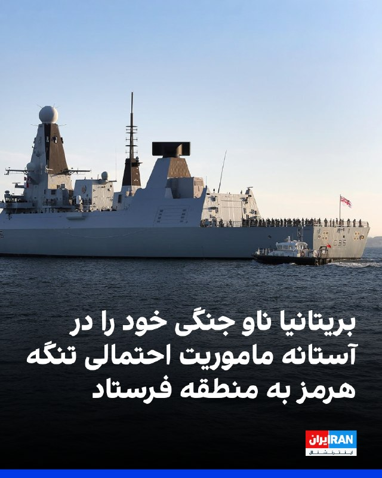

وزارت دفاع بریتانیا اعلام کرد ناو جنگی اچ‌ام‌اس دراگون برای پیوستن به ماموریت احتمالی حفاظت از کشتیرانی در تنگه هرمز به خاورمیانه اعزام می‌شود.

بر اساس این اعلام، این ناو نیروی دریایی سلطنتی به منطقه اعزام شده است تا آماده پیوستن به ابتکار مشترک بریتانیا و فرانسه باشد.

در حالی که آتش‌بس شکننده‌ای برقرار است، حملات روز جمعه ادامه یافت و نیروهای آمریکا دو نفتکش جمهوری اسلامی را که به گفته آن‌ها در تلاش برای نقض محاصره اعمال‌شده از سوی دونالد ترامپ، رییس‌جمهوری آمریکا، بودند، هدف قرار دادند.
‌🏁 🇬🇧 IranintlTV

🤖 @VahidOOnLine

## VahidOOnLine — post 239090

  

علیرضا منادی سفیدان، رئیس کمیسیون آموزش مجلس شورای اسلامی اعلام کرده به «آسیب‌دیدگان جدی جنگ» سهمیه کنکور تعلق می‌گیرد.
‌🏁 🇬🇧 ManotoTV

🤖 @VahidOOnLine

## VahidOOnLine — post 239089

  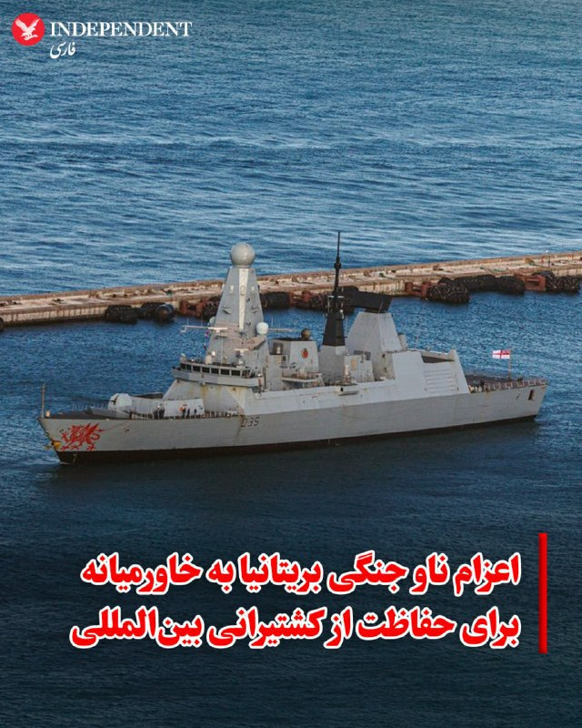

♦️ سخنگوی وزارت دفاع بریتانیا روز شنبه اعلام کرد که ناو «اچ‌ام‌اس دراگون» (HMS Dragon)، متعلق به ناوگان سلطنتی این کشور، جهت «استقرار پیش‌دستانه برای هرگونه ماموریت چندملیتی آتی جهت حفاظت از کشتیرانی بین‌المللی در تنگه هرمز» به منطقه خاورمیانه اعزام می‌شود.

این سخنگو افزود: «استقرار ناو دراگون بخشی از یک برنامه‌ریزی هوشمندانه است تا اطمینان حاصل شود که بریتانیا، به عنوان بخشی از یک ائتلاف چندملیتی به رهبری مشترک لندن و پاریس، آمادگی کامل را برای تامین امنیت تنگه هرمز در زمان مقتضی داراست.»

به گفته این وزارتخانه، اعزام مذکور در راستای تعهد بریتانیا به یک ماموریت دفاعی و چندملیتی با هدف تقویت اعتماد کشتیرانی تجاری در این آبراه حیاتی صورت می‌گیرد. بریتانیا و فرانسه تاکنون نشست‌های برنامه‌ریزی متعددی را با حضور ده‌ها کشور برای تشکیل ائتلافی جهت بازگرداندن «آزادی ناوبری» در تنگه هرمز رهبری کرده‌اند. با این حال، آن‌ها تاکید دارند که این ماموریت تنها زمانی آغاز خواهد شد که یک آتش‌بس پایدار برقرار شده و صنعت دریانوردی از امنیت کامل تردد کشتی‌ها اطمینان حاصل کند.
‌🇸🇦 Indypersian

🤖 @VahidOOnLine

## VahidOOnLine — post 239088

  

وام، خبرگزاری رسمی امارات متحده عربی گزارش داد محمد بن زاید آل نهیان، رئیس امارات متحده عربی، در تماس تلفنی با ژوزف عون، رئیس‌جمهوری لبنان، گفت‌وگو کرد.در این تماس، عون بار دیگر حملات «تروریستی» جمهوری‌اسلامی علیه غیرنظامیان و تأسیسات غیرنظامی در امارات را محکوم کرد و بر همبستگی لبنان با امارات و حمایت از تمامی اقدام‌های این کشور برای حفظ امنیت، حاکمیت و سلامت سرزمین و شهروندانش تأکید کرد.
‌🏁 🇬🇧 ManotoTV

🤖 @VahidOOnLine

## VahidOOnLine — post 239087

  

فریدریش مرتس، صدراعظم آلمان، با اشاره به اختلاف‌ها میان اروپا و آمریکا تاکید کرد هدف نهایی دو طرف پایان دادن به درگیری و جلوگیری از دستیابی جمهوری اسلامی به سلاح هسته‌ای است. او گفت: «هدف نهایی ما پایان دادن به این درگیری و تضمین این است که ایران نتواند سلاح هسته‌ای تولید کند.» مرتس افزود: «این هدف، هدفی مشترک میان آمریکا و اروپا است.»
‌🏁 🇬🇧 IranintlTV

🤖 @VahidOOnLine

## mwarmonitor — post 8755

  <a href="telegram/content/mwarmonitor_8755_1778337509.mp4" target="_blank">🎬 Download video</a>

📝اوضاع جوری شده که باید آرزو کرد درد و بلای مارک لوین مستقیم بخوره تو سر هرچی مثلاً ایرانیه که این روزها رگ غیرتش خشک شده و افتاده دنبال عادی‌سازی. کافیه فقط یه دور تو این اینستاگرام فارسی بزنید تا عمق فاجعه رو با چشمای خودتون ببینید؛ جوری که انگار نه انگار خون کسی به زمین ریخته.
🔸یه مشت حرامزاده‌ پرچم به دست که توی میدان‌ها نقش بازی می‌کنن و نون رو به نرخ روز می‌خورن، از یه طرف؛ و از اونا حرومی‌تر اونایی هستن که توی کافه‌ها و رستوران‌ها جوری غرق در خوش‌گذرونی و استوری گذاشتن هستن که انگار حافظه‌شون کلاً پاک شده.
🔸این جماعتِ بی‌هویت، با هر لبخند مصنوعی و هر میز چیده‌شده‌شون، دارن روی زخم‌های باز نمک می‌پاشن. برای این نون به نرخ روز خورها، نه وطن معنی داره و نه شرف؛ فقط کافیه بساط عیش و نوش‌شون به راه باشه تا روی هر جنایتی چشم ببندن. واقعاً که این حجم از وقاحت و بی‌عاری، خودش یه هنرِ کثیفه که فقط از عهده این "ایرانی‌نماها" برمی‌آید.

@mwarmonitor

## mwarmonitor — post 8754

🇮🇷🇺🇸«ایران هنوز هیچ نشانه‌ای نداده است که آیا طرح رئیس‌جمهور دونالد ترامپ را که روز چهارشنبه ارسال شده و پیشنهاد می‌کند جمهوری اسلامی طی یک ماه آینده آبراه را دوباره بازگشایی کند و در مقابل، آمریکا محاصره بنادر ایران را پایان دهد، خواهد پذیرفت یا نه.» Bloomberg

@mwarmonitor

## mwarmonitor — post 8753

  

🇺🇸رئیس‌جمهور ترامپ مقاله‌ای مربوط به حدود یک ماه پیش را بازنشر کرد که در آن ادعا شده اکثر آمریکایی‌ها معتقدند جلوگیری از دستیابی ایران به سلاح هسته‌ای، مهم‌تر از پایان دادن به جنگ است.

او در توضیح این مطلب نوشت:
«بسیار مهم. این موضع کشور ماست.»

@mwarmonitor

## mwarmonitor — post 8748

🚢سه نفتکش بزرگ حامل نفت خام ایران که هدف حمله آمریکا 🇺🇸 قرار گرفته‌اند، امروز در خلیج جاسک شرقی در مختصات زیر در حال سوختن مشاهده شدند:

25.6139, 57.9483

🚢یک نفتکش از نوع Suezmax به‌شدت در حال آتش‌سوزی است.
یک شناور آتش‌نشانی در نزدیکی یک VLCC که دود می‌کند حضور دارد و از یک VLCC دیگر که هنوز در حال سوختن است، نشت سوخت مشاهده می‌شود.

🚨این حادثه دقیقاً مقابل پایگاه دریایی سپاه پاسداران انقلاب اسلامی رخ داده است.

@mwarmonitor

## mwarmonitor — post 8747

🇦🇪🇧🇭عبدالله بن زاید تشکیلات مرتبط با سپاه پاسداران ایران در بحرین را محکوم و بر همبستگی کامل امارات با این پادشاهی تأکید کرد
🔸شیخ عبدالله بن زاید آل نهیان، معاون رئیس شورای وزیران و وزیر امور خارجه، همبستگی کامل دولت امارات متحده عربی با پادشاهی برادر، بحرین، را ابراز داشت. وی حمایت خود را از اقداماتی که دستگاه‌های امنیتی بحرین برای کشف تشکیلات تروریستی مرتبط با سپاه پاسداران ایران و تفکر «ولایت فقیه» انجام داده‌اند، اعلام کرد. این پرونده مربوط به جاسوسی با طرف‌های خارجی و همدستی در تجاوزات غادرانه‌ی ایران است.
🔸ایشان بر حمایت کامل دولت امارات از تمامی اقداماتی که پادشاهی بحرین برای حفاظت از امنیت، حاکمیت و حفظ ثبات و سلامت جامعه خود اتخاذ می‌کند، تأکید کرد. وی همچنین از کارایی و هوشیاری دستگاه‌های امنیتی بحرین در شناسایی این تشکیلات و اتخاذ اقدامات قانونی علیه عناصر آن تمجید نمود.
🔸وی بر مخالفت قاطع دولت امارات با تمامی اشکال تروریسم و گروه‌های مرتبط با برنامه‌های خارجی تأکید کرد و اهمیت تقویت همکاری‌های منطقه‌ای و بین‌المللی برای مقابله با این تهدیدات را خاطرنشان ساخت.
🔸در پایان، ایشان با تأکید بر اینکه امنیت پادشاهی بحرین جزئی جدایی‌ناپذیر از امنیت دولت امارات و کشورهای حوزه خلیج عربی است، مجدداً حمایت کامل خود را از تمامی اقدامات بحرین برای حفظ امنیت، ثبات و صیانت از دستاوردهای ملی‌اش اعلام کرد.

وزارت امور خارجه امارات متحده عربی

@mwarmonitor

## mwarmonitor — post 8746

  

✈️یک فروند هواپیمای آمریکایی Bombardier E-11A Battlefield Airborne Communications Node در نقش «گره ارتباطات هوابرد میدان نبرد» به‌کار گرفته شده.
این هواپیما برای تقویت و پشتیبانی ارتباطات فرماندهی و کنترل در مناطق عملیاتی استفاده می‌شود.

@mwarmonitor

## pm_afshaa — post 90411

  <a href="telegram/content/pm_afshaa_90411_1778337514.webm" target="_blank">🎬 Download video</a>

🔴رئیس کمیسیون آموزش مجلس: به آسیب‌دیدگان جنگ سهمیهٔ کنکور تعلق میگیره.

💧 Rainbet.com the #1 Non-KYC Crypto Casino & Sportsbook @rainbetcom

😁 @Pm_Afshaa

## pm_afshaa — post 90410

🔴وال استریت ژورنال: بیش از 20 هزار ملوان در صدها کشتی در تنگه هرمز گیر افتاده‌اند و بسیاری از کشتی‌ها با کمبود شدید غذا، آب، سوخت و دارو روبه‌رو شده‌اند

💧 Rainbet.com the #1 Non-KYC Crypto Casino & Sportsbook @rainbetcom

😁 @Pm_Afshaa

## pm_afshaa — post 90409

🔴نت‌بلاکس:قطعی اینترنت در ایران، وارد یازدهمین هفته شد

💧 Rainbet.com the #1 Non-KYC Crypto Casino & Sportsbook @rainbetcom

😁 @Pm_Afshaa

## pm_afshaa — post 90407

  <a href="telegram/content/pm_afshaa_90407_1778337515.webm" target="_blank">🎬 Download video</a>

🔴ترامپ مقاله‌ای رو منتشر کرد که ادعا میکنه بیشتر آمریکایی‌ها معتقدن جلوگیری از دستیابی ایران به سلاح هسته‌ای مهم‌تر از پایان دادن به جنگه؛ با عنوان «بسیار مهم. این موضع کشور ما است.

💧 Rainbet.com the #1 Non-KYC Crypto Casino & Sportsbook @rainbetcom

😁 @Pm_Afshaa

## pm_afshaa — post 90406

  <a href="telegram/content/pm_afshaa_90406_1778337516.webm" target="_blank">🎬 Download video</a>

🔴وزارت دفاع بریتانیا اعلام کرد ناوشکن دراگون به خاورمیانه اعزام میشه.

💧 Rainbet.com the #1 Non-KYC Crypto Casino & Sportsbook @rainbetcom

😁 @Pm_Afshaa

## pm_afshaa — post 90405

  <a href="telegram/content/pm_afshaa_90405_1778337516.webm" target="_blank">🎬 Download video</a>

🔴سنتکام: نیروهای آمریکا در سراسر منطقه همچنان برای انجام ماموریت آماده هستن.

💧 Rainbet.com the #1 Non-KYC Crypto Casino & Sportsbook @rainbetcom

😁 @Pm_Afshaa

## pm_afshaa — post 90404

  <a href="telegram/content/pm_afshaa_90404_1778337517.webm" target="_blank">🎬 Download video</a>

🔴العربیه: نتانیاهو به دولت آمریکا گفته روند مذاکره با جمهوری اسلامی نباید طولانی بشه.

💧 Rainbet.com the #1 Non-KYC Crypto Casino & Sportsbook @rainbetcom

😁 @Pm_Afshaa

## pm_afshaa — post 90403

  <a href="telegram/content/pm_afshaa_90403_1778337518.mp4" target="_blank">🎬 Download video</a>

در اقدامی عجیب نوحه برای تمجید از بی حجاب‌ها هم خوانده شد

💧 Rainbet.com the #1 Non-KYC Crypto Casino & Sportsbook @rainbetcom

😁 @Pm_Afshaa

## pm_afshaa — post 90402

🔴وزارت کشور بحرین:دستگاه‌های امنیتی بحرین، یک تشکیلات مرتبط با سپاه تروریستی پاسداران و تفکر ولایت فقیه را شناسایی کرده‌اند و 41 نفر از اعضای آن‌را بازداشت کردن

💧 Rainbet.com the #1 Non-KYC Crypto Casino & Sportsbook @rainbetcom

😁 @Pm_Afshaa

## DEJradio — post 4536

  <a href="telegram/content/DEJradio_4536_1778337521.mp4" target="_blank">🎬 Download video</a>

🚨🎥 حال‌‌وش گزارش داد شامگاه جمعه ۱۸ اردیبهشت‌ماه ۱۴۰۵، چندین فروند پهپاد در آسمان و خیابان‌های خیام و خرمشهر در نزدیکی مسجد مکی زاهدان مشاهده شده که باعث نگرانی شماری از شهروندان ساکن این مناطق شده است.

بر اساس ویدئوی ارسالی به حال‌‌وش، چراغ و پرواز یکی از این پهپادها در آسمان منطقه به‌وضوح قابل مشاهده بوده و از آن فیلم‌برداری شده است.
به گفته منابع محلی، علاوه بر این پهپاد، چراغ چند پهپاد دیگر نیز در فاصله‌ای دورتر دیده شده و صدای پرواز آن‌ها در آسمان منطقه شنیده می‌شده است.

به گفته منابع حال‌‌وش: «پهپادها برای مدتی بر فراز مناطق مسکونی اطراف مسجد مکی و خیابان‌های مجاور در حال پرواز و گشت‌زنی بودند و صدای ممتد آن‌ها در سطح منطقه شنیده می‌شد.»

#پهباد #زاهدان
@DEJradio

## DEJradio — post 4535

  <a href="telegram/content/DEJradio_4535_1778337523.webm" target="_blank">🎬 Download video</a>

🔺🎤 عذاب وجدان و ترومای اجتماعی پس از دی‌ماه

گفت‌وگو با دکتر مصطفی میررمضانی، روان‌پزشک و روان‌درمانگر

#عذاب_وجدان #تروما
@DEJradio

## DEJradio — post 4534

  <a href="telegram/content/DEJradio_4534_1778337524.mp4" target="_blank">🎬 Download video</a>

🔺🎥 خیابان‌ها شده پادگان؛ انگار حکومت نظامیست...

#حکومت_نظامی
@DEJradio

## DEJradio — post 4533

  <a href="telegram/content/DEJradio_4533_1778337526.webm" target="_blank">🎬 Download video</a>

🚨📢 شناسایی تشکیلات مرتبط با سـپاه پاسداران در بحرین؛ ۴۱ نفر بازداشت شدند

وزارت کشور بحرین اعلام کرد دستگاه‌های امنیتی این کشور یک تشکیلات مرتبط با سپاه پاسداران انقلاب اسلامی و اندیشه «ولایت فقیه» را شناسایی و ۴۱ نفر از اعضای آن را بازداشت کرده‌اند.
بر پایه اعلام وزارت کشور بحرین در روز شنبه ۱۹ اردیبهشت، این اقدام بر اساس نتایج گزارش‌‌های امنیتی در پرونده‌های «جاسوسی برای نهادهای خارجی» و «همدلی با حملات جمهوری اسلامی» انجام شده است.
عملیات جستجو و تحقیق به منظور «شناسایی و برخورد قانونی» با دیگر افراد مرتبط با این تشکیلات ادامه دارد.
پیش از این، دادستانی بحرین نیز اعلام کرده بود در دو پرونده جداگانه مربوط به جاسوسی، برای دو تبعه افغانستانی و سه شهروند بحرینی حکم حبس ابد صادر شده است.

#بحرین #IRGCterrorists
@DEJradio

## kianmeli1 — post 87293

  

🔴اقلام رکورددار در تورم/ روغن جامد با ۳۸۵درصد افزایش در صدر
https://t.me/kianmeli1

## kianmeli1 — post 87292

🔴شیخ نشین های خلیج فارس ۱۷ میلیارد دلار دیگر برای خرید ۴۲۰۰ پاتریوت هزینه کردند.

و این نشان دهنده این است که آنها خود را برای جنگ آماده میکنند.
https://t.me/kianmeli1

## IranIntlTV — post 336312

  <a href="telegram/content/IranIntlTV_336312_1778337528.mp4" target="_blank">🎬 Download video</a>

سرخط خبرهای شنبه ۱۹ اردیبهشت
@iranintltv

## IranIntlTV — post 336311

  <a href="telegram/content/IranIntlTV_336311_1778337530.mp4" target="_blank">🎬 Download video</a>

ایرانیان مقیم لندن در حمایت از انقلاب ملی و در پاسخ به فراخوان شاهزاده رضا پهلوی در این شهر تجمع کردند.

گفت‌وگوی تاج‌الدین سروش، خبرنگار ایران‌اینترنشنال، با شرکت‌کنندگان در این تجمع
@iranintltv

## IranIntlTV — post 336310

  

رجب طیب اردوغان، رییس‌جمهور ترکیه در دیدار با مسرور بارزانی، نخست‌وزیر اقلیم کردستان عراق گفت که ترکیه از هدف قرار گرفتن اربیل در جریان جنگ ایران متاسف شده و به هیچ وجه نمی‌خواهد درگیری به دیگر کشورهای منطقه گسترش یابد.

اربیل عراق و مقرهای احزاب کرد ایرانی در این منطقه، از زمان آغاز جنگ میان جمهوری اسلامی و آمریکا و اسرائیل، بارها از سوی حکومت ایران هدف حملات موشکی و پهپادی قرار گرفت.
https://iranintl.com/202605098953

## IranIntlTV — post 336309

  <a href="telegram/content/IranIntlTV_336309_1778337533.mp4" target="_blank">🎬 Download video</a>

رییس انجمن اهدای عضو ایران از کاهش شدید اهدای عضو در شرایط جنگی خبر داد. کتایون نجف‌زاده با اشاره به کاهش ۵۰ تا ۷۰ درصدی اهدای عضو گفت روزانه ۷ تا ۱۰ نفر در کشور به همین دلیل جان خود را از دست می دهند.

گفت‌وگو با مازیار صدری، فوق تخصص مراقبت‌های ویژه
@iranintltv

## IranIntlTV — post 336308

  <a href="telegram/content/IranIntlTV_336308_1778337535.mp4" target="_blank">🎬 Download video</a>

بنا بر اطلاعات رسیده به ایران‌اینترنشنال، به بازیکنان شاغل در لیگ‌های داخلی فوتبال ایران وعده داده شده در صورت حضور در تجمعات شبانه، چهار درصد کسر شده از قراردادشان به آن‌ها بازگردانده خواهد شد.

جزییات بیشتر در گفت‌وگو با رها پوربخش، عضو تحریریه ایران‌اینترنشنال
@iranintltv

## IranIntlTV — post 336307

  

به دنبال فراخوان شاهزاده رضا پهلوی، ایرانیان روز یک‌شنبه، ۲۰ اردیبهشت در شهرهای مختلف جهان در اعتراض به خاموشی اینترنت، بازداشت‌های گسترده و احکام اعدام تجمع و راهپیمایی برگزار می‌کنند.
عنوان فراخوان «یک ملت در گروگان» اعلام شده و هدف از برگزاری، اعتراض به خاموشی اینترنت، بازداشت‌های گسترده و ادامه اعدام شهروندان عنوان شده است.

تجمع سیدنی در استرالیا ساعت ۱۵:۰۰ به وقت محلی آغاز می‌شود و شرکت‌کنندگان مسیر «نورث هاید پارک» تا «مارتین پلیس» را راهپیمایی خواهند کرد. تجمع سئول در کره جنوبی ساعت ۱۶:۰۰ به وقت محلی مقابل ساختمان وزارت خارجه برگزار می‌شود.

تجمع استکهلم در سوئد ساعت ۱۳:۰۰ به وقت محلی در میدان «نورا بانتوریه» برگزار خواهد شد. معترضان در برلین ساعت ۱۵:۰۰ به وقت محلی از «پوتسدامر پلاتس» به سمت «براندنبورگ تور» راهپیمایی می‌کنند و تجمع فرانکفورت ساعت ۱۶:۰۰ به وقت محلی در مرکز شهر برگزار می‌شود.

بر اساس این فراخوان، تجمع تورنتو در کانادا ساعت ۱۳:۰۰ به وقت محلی در مقابل کتابخانه «ریچموند هیل» برگزار خواهد شد و ایرانیان در لس‌آنجلس نیز ساعت ۱۶:۰۰ به وقت محلی در «ویلسایر بولوار» گرد هم می‌آیند.

## IranIntlTV — post 336306

  <a href="telegram/content/IranIntlTV_336306_1778337539.mp4" target="_blank">🎬 Download video</a>

روزنامه دنیای اقتصاد گزارش داد حذف امارات از شرکای تجاری ایران می‌تواند زنجیره تامین کالا در ایران را به‌سرعت تحت تاثیر قرار دهد؛ چرا که بیش از ۳۰ درصد واردات و بخش عمده تامین ارز کالاها از طریق بازار امارات انجام می‌شود.
گفت‌وگو با اشکان نظام‌آبادی، روزنامه‌نگار اقتصادی
@iranintltv

## IranIntlTV — post 336305

  

روح‌الله متفکر آزاد، عضو هیات‌ رییسه مجلس گفت: «اگر امارات متحده عربی از عقلانیت استراتژیک برخوردار باشد، هرگز به‌خاطر منافع اسرائیل و آمریکا که در این میدان ناکام مانده‌اند، خود را در مهلکه‌ای بزرگ‌تر از توان و ظرفیت خود قرار نخواهد داد.»

او افزود: «امارات برای جمهوری اسلامی عددی محسوب نمی‌شود.»

این نماینده مجلس ادامه داد: «توصیه می‌شود اماراتی‌ها با درک قواعد این جنگ، از ورود به عرصه‌ای که فراتر از ظرفیت و اندازه آن‌هاست، خودداری کنند.»
https://iranintl.com/202605097571

## IranIntlTV — post 336304

  <a href="telegram/content/IranIntlTV_336304_1778337542.mp4" target="_blank">🎬 Download video</a>

ایرانیان آلمان روز شنبه در دوسلدورف تجمع کرده و ضمن حمایت از انقلاب ملی فریاد پشتیبانی از شاهزاده رضا پهلوی سر دادند.

@iranintltv

## IranIntlTV — post 336303

  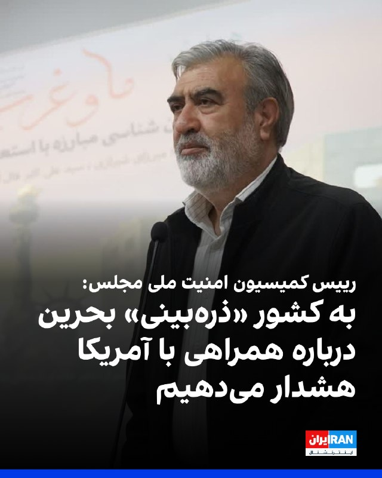

ابراهیم عزیزی، رییس کمیسیون امنیت ملی مجلس، با اشاره به پیش‌نویس قطعنامه بحرین علیه جمهوری اسلامی در شورای امنیت، در شبکه ایکس نوشت: «به دولت‌هایی همچون کشور ذره‌بینی بحرین که در حال همراهی با قطعنامه آمریکایی هستند، درباره پیامدهای جدی این اقدام هشدار می‌دهیم.»

او افزود: «درهای تنگه هرمز را برای همیشه به روی خود نبندید.»
https://iranintl.com/202605099666

## IranIntlTV — post 336302

ایرانیان دانمارک در کپنهاگ روز شنبه با تشکیل تجمعی در حمایت از انقلاب ملی علیه جمهوری اسلامی شعار «پاینده ایران» سر دادند.

## IranIntlTV — post 336301

  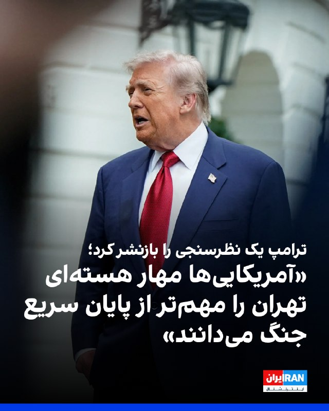

دونالد ترامپ، رییس‌جمهوری آمریکا، گزارشی درباره نتایج یک نظرسنجی را که نشان می‌دهد اکثریت رای‌دهندگان آمریکایی جلوگیری از دستیابی جمهوری اسلامی به سلاح هسته‌ای را مهم‌تر از پایان سریع جنگ می‌دانند، در شبکه تروت سوشال بازنشر کرد و نوشت: «این بسیار مهم است، این جایگاه ملت ماست.»

این نظرسنجی که یک ماه پیش از سوی ناپولیتان نیوز منتشر شده، نشان می‌دهد ۵۳ درصد از رای‌دهندگان گفته‌اند جلوگیری از دستیابی جمهوری اسلامی به سلاح هسته‌ای مهم‌تر از پایان دادن به درگیری است.
https://iranintl.com/202605091217

## IranIntlTV — post 336300

  

بر اساس اطلاعات رسیده به ایران‌اینترنشنال، پیام افخمی، شهروند ساکن تهران، ۲۵ اسفند ۱۴۰۴ در منزل خود از سوی ماموران وزارت اطلاعات بازداشت شده و تاکنون خبری از وضعیت، محل نگهداری و اتهام‌های او در دست نیست.

افخمی از زمان بازداشت تنها یک تماس کوتاه با خانواده داشته است.
https://iranintl.com/202605094577

## IranIntlTV — post 336299

  <a href="telegram/content/IranIntlTV_336299_1778337547.mp4" target="_blank">🎬 Download video</a>

یکی از شرکت‌کنندگان در تجمع کپنهاگن، به مهران عباسیان، خبرنگار ایران‌اینترنشنال، گفت: «امروز جمع شده‌ایم تا صدای مردمی باشیم که صدایشان قطع شده تا بگوییم می‌خواهیم ایران را از غاصبان پس بگیریم.»
@iranintltv

## IranIntlTV — post 336298

  

احسان چیت‌ساز، معاون وزیر ارتباطات گفت که در طول جنگ اخیر، بیش از ۵۰۰ سایت ارتباطی مورد حمله دشمنان قرار گرفت و به‌طور مرتب «ارتباط جزایر ما با سرزمین اصلی قطع می‌شد و در مواردی شهید هم دادیم و خسارت‌های زیادی متحمل شدیم.»

او افزود: «بخشی از این خسارت‌ها ناشی از حملات موشکی مستقیم بود که منجر به تخریب دارایی‌ها و سرمایه‌های ثابت در حوزه اقتصاد دیجیتال شد و چالش اساسی ایجاد کرد.»
https://iranintl.com/202605099835

## IranIntlTV — post 336297

  

وزارت دفاع بریتانیا اعلام کرد ناو جنگی اچ‌ام‌اس دراگون برای پیوستن به ماموریت احتمالی حفاظت از کشتیرانی در تنگه هرمز به خاورمیانه اعزام می‌شود.

بر اساس این اعلام، این ناو نیروی دریایی سلطنتی به منطقه اعزام شده است تا آماده پیوستن به ابتکار مشترک بریتانیا و فرانسه باشد.

در حالی که آتش‌بس شکننده‌ای برقرار است، حملات روز جمعه ادامه یافت و نیروهای آمریکا دو نفتکش جمهوری اسلامی را که به گفته آن‌ها در تلاش برای نقض محاصره اعمال‌شده از سوی دونالد ترامپ، رییس‌جمهوری آمریکا، بودند، هدف قرار دادند.
https://iranintl.com/202605091928

## IranIntlTV — post 336296

🔻دریای خزر، مسیر پنهان تجارت و همکاری نظامی تهران و مسکو در سایه جنگ

نیویورک‌تایمز گزارش داد روسیه از طریق دریای خزر کالاهای نظامی و تجاری به ایران ارسال می‌کند تا توان جمهوری اسلامی را برای مقاومت در برابر حملات آمریکا تقویت کند. این رسانه به نقل از مقام‌های آمریکایی نوشت روسیه از مسیر دریای خزر قطعات پهپاد به ایران منتقل می‌کند.

بر اساس این گزارش، روسیه همچنین کالاهایی را تامین می‌کند که پیش‌تر معمولا از تنگه هرمز عبور می‌کردند.

آمارهای تجاری روسیه نشان می‌دهند حمل‌ونقل از طریق دریای خزر در ماه‌های اخیر افزایش یافته است.

ویتالی چرنوف، مدیر بخش تحلیل در گروه رسانه‌ای پورت‌نیوز، گفت سالانه دو میلیون تن گندم روسیه که پیش‌تر از دریای سیاه به ایران ارسال می‌شد، اکنون از مسیر خزر منتقل می‌شود.

او افزود: «در سایه بی‌ثباتی در خاورمیانه، مسیرهای خزر به ایران بسیار جذاب‌تر به نظر می‌رسند.»

الکساندر شاروف، رییس موسسه روس‌ایران‌اکسپو که به صادرکنندگان روسیه برای یافتن خریداران ایرانی کمک می‌کند، نیز برآورد کرد حجم بار عبوری از خزر ممکن است امسال دو برابر شود.

نیویورک‌تایمز نوشت که حمله جنگنده‌های اسرائیلی به مرکز فرماندهی نیروی دریایی جمهوری اسلامی در بندر انزلی در اسفند ۱۴۰۴، بار دیگر نگاه‌ها را به دریای خزر جلب کرد. جایی که در ماه‌های اخیر به یکی از مهم‌ترین مسیرهای تجاری و لجستیکی میان ایران و روسیه تبدیل شده است و نقشی فزاینده در تجارت آشکار و پنهان میان تهران و مسکو پیدا کرده است.
مسیر جایگزین

به نوشته نیویورک‌تایمز، برای ایران و روسیه - دو کشوری که هم‌زمان درگیر جنگ و تحت تحریم‌های گسترده غرب هستند - دریای خزر به مسیر مهمی برای انتقال کالا و همکاری‌های اقتصادی و نظامی تبدیل شده است.

مقام‌های آمریکایی گفتند روسیه از طریق دریای خزر قطعات پهپاد برای حکومت ایران ارسال می‌کند تا تهران بتواند توان پهپادی خود را که در جنگ اخیر حدود ۶۰ درصد آن از دست رفته است، بازسازی کند.

این مقام‌ها که نخواستند نامشان فاش شود، گفتند مسکو همچنین بخشی از کالاهایی را که پیش‌تر از مسیر تنگه هرمز وارد ایران می‌شد، اکنون از طریق دریای خزر منتقل می‌کند. به‌ویژه پس از آن که تنگه هرمز با محاصره نیروی دریایی آمریکا روبه‌رو شد.

مقام‌های حکومت ایران نیز اعلام کرده‌اند توسعه مسیرهای جایگزین تجاری با سرعت در حال انجام است و چهار بندر ایران در ساحل خزر به‌صورت شبانه‌روزی در حال دریافت گندم، ذرت، خوراک دام، روغن آفتابگردان و دیگر کالاهای اساسی هستند.

محمدرضا مرتضوی، رییس انجمن صنایع غذایی ایران، به صداوسیمای جمهوری اسلامی گفت ایران در حال انتقال مسیر واردات کالاهای اساسی به دریای خزر است.
مسیر دشوار برای رصد غرب

آمارهای بنادر روسیه نیز نشان‌دهنده رشد سریع حمل‌ونقل در دریای خزر است.

چرنوف گفت دو میلیون تن گندم روسیه اکنون از مسیر خزر منتقل می‌شود، زیرا مسیر دریای سیاه در معرض حملات اوکراین قرار دارد.

دریای خزر که بزرگ‌تر از ژاپن و بزرگ‌ترین دریاچه جهان محسوب می‌شود، به نوشته نیویورک‌تایمز به مسیر دشواری برای رصد غرب تبدیل شده است.

گروه‌های ردیابی دریایی می‌گویند کشتی‌هایی که میان بنادر ایران و روسیه رفت‌وآمد می‌کنند، اغلب سامانه‌های ردیابی خود را خاموش می‌کنند.

بر خلاف خلیج فارس، آمریکا نیز امکان توقیف یا بازرسی کشتی‌ها در خزر را ندارد، زیرا تنها پنج کشور ساحلی به این آبراه دسترسی دارند.

نیکول گراجفسکی، پژوهشگر حوزه ایران و روسیه در موسسه مطالعات سیاسی پاریس، گفت: «اگر به‌دنبال مسیر ایده‌آل برای دور زدن تحریم‌ها و انتقال تجهیزات نظامی باشید، دریای خزر همان‌جاست.»
همکاری پهپادی تهران و مسکو

این گزارش تاکید کرد همکاری نظامی جمهوری اسلامی و روسیه در زمینه پهپادها، نمونه‌ای از نزدیکی دفاعی دو کشور است.

به گفته مقام‌های آمریکایی، در حالی که روسیه در سال‌های گذشته برای جنگ اوکراین از ایران پهپاد دریافت می‌کرد، هم‌زمان قطعات و فناوری به ایران می‌فرستاد.

اما پس از آن که این کشور از تیر ۱۴۰۲ تولید نسخه بومی پهپاد شاهد را در کارخانه‌ای در تاتارستان آغاز کرد، نیازش به واردات مستقیم از ایران کاهش یافت.

اوکراین در مرداد ۱۴۰۴ اعلام کرد یک کشتی روسی را در بندر اولیا در شمال غرب خزر هدف قرار داده که به گفته کی‌یف در حال انتقال قطعات پهپاد شاهد از ایران بوده است.

وزارت خزانه‌داری آمریکا نیز پیش‌تر این کشتی و مالک روس آن را تحریم کرده و گفته بود در انتقال موشک‌های بالستیک کوتاه‌برد از ایران به روسیه نقش داشته‌اند.
خزر، نقطه کور برای آمریکا

به نوشته نیویورک‌تایمز، اهمیت راهبردی دریای خزر برای ایران و روسیه سال‌هاست روشن بوده است.
🔗ادامه این گزارش را اینجا بخوانید
@iranintltv

## IranIntlTV — post 336295

  

فریدریش مرتس، صدراعظم آلمان، با اشاره به اختلاف‌ها میان اروپا و آمریکا تاکید کرد هدف نهایی دو طرف پایان دادن به درگیری و جلوگیری از دستیابی جمهوری اسلامی به سلاح هسته‌ای است. او گفت: «هدف نهایی ما پایان دادن به این درگیری و تضمین این است که ایران نتواند سلاح هسته‌ای تولید کند.» مرتس افزود: «این هدف، هدفی مشترک میان آمریکا و اروپا است.»
https://iranintl.com/202605094061

## IranIntlTV — post 336294

🔻تشدید بحران میان جمهوری اسلامی و امارات، ایرانیان مقیم این کشور را بلاتکلیف کرده است

🖋گزارش مریم سینایی

جنگ، روابط حکومت ایران و امارات متحده عربی را تا آستانه گسست کامل پیش برده است. بحرانی که یکی از مهم‌ترین روابط تجاری منطقه را مختل کرده و آینده ایرانیانی را که سال‌ها در امارات زندگی و کسب‌وکار ساخته بودند، در وضعیتی نامعلوم قرار داده است.

صدها هزار ایرانی که در امارات زندگی و تجارت می‌کردند، اکنون با لغو ویزا، محدودیت‌های مالی و آینده‌ای نامطمئن روبه‌رو هستند، آن هم در شرایطی که روابط تهران و ابوظبی به‌سرعت رو به وخامت رفته است.

به گفته چند تن از ساکنان زیان‌دیده، شهروندان ایرانی که در جریان درگیری‌های اخیر امارات را ترک کرده‌اند - چه به مقصد ایران و چه دیگر کشورها - دیگر اجازه بازگشت ندارند؛ حتی برای جمع‌آوری وسایل شخصی خود.

در برخی موارد، به خانواده‌هایی که هنوز در امارات هستند نیز تنها چند هفته فرصت داده شده تا این کشور را ترک کنند.

بسیاری از ایرانیان مقیم امارات گفته‌اند از آن‌ها خواسته شده دارایی‌های خود را به خارج منتقل کنند و استفاده از حساب‌های بانکی اماراتی روزبه‌روز برایشان دشوارتر می‌شود.

اگرچه اموال و شرکت‌ها رسما مصادره نشده‌اند، برخی مالکان دیگر امکان مدیریت مستقیم دارایی‌های خود را ندارند و ناچارند برای فروش اموال از وکالت‌نامه یا واسطه استفاده کنند.

شرکت‌های خارجی فعال در امارات نیز به تدریج از همکاری با افراد و شرکت‌های ایرانی، به‌ویژه فعالان تجاری مرتبط با ایران، خودداری می‌کنند.

گزارش‌ها حاکی است بسیاری از سفارش‌های صادراتی مرتبط با ایران لغو شده‌اند.
هیچ‌کس نمی‌داند فردا چه خواهد شد

رضا، شهروند ۴۰ ساله ایرانی که بیش از هشت سال است همراه همسرش در دبی زندگی می‌کند، گفت ایرانیانی که هنوز در امارات هستند فعلا اخراج نشده‌اند، اما «تحت فشار دائمی» قرار دارند.

او گفت: «فعلا وضعیت اقامت ما در دبی تغییر نکرده، اما دوستانم می‌گویند در شارجه، ابوظبی و دیگر امارت‌ها، حتی ویزای ایرانی‌هایی را که هنوز داخل کشور هستند لغو می‌کنند.»

رضا گفت او و همسرش که پزشک است، عملا منبع درآمد خود را از دست داده‌اند؛ با وجود آن که هنوز مجوز اقامت دارند.

به گفته او، بیمارستان محل کار همسرش از تمدید قرارداد او خودداری کرده و تجارت، واردات و صادرات خودش نیز عملا متوقف شده است.

او گفت: «وضعیت من کاملا نامشخص است. هیچ‌ کسی نمی‌داند فردا چه خواهد شد.»

رضا افزود اگرچه مجوز شرکتش رسما لغو نشده، اما دیگر امکان فعالیت ندارد، زیرا تجارت مرتبط با ایران عملا متوقف شده است.

او گفت: «وقتی مجوز کار لغو می‌شود، افراد دیگر نمی‌توانند از دارایی‌های خودشان استفاده کنند. مغازه عمده‌فروشی مواد غذایی یکی از آشنایان را بسته‌اند و چون مجوز تجاری ندارد، حتی نمی‌تواند کالاهایی را که در انبارش مانده، بفروشد.»

به گفته رضا، فشار بر افرادی که متهم به کمک به دور زدن تحریم‌ها از سوی حکومت ایران هستند - از جمله در فروش نفت یا انتقال پول - بیشتر است.

او گفت بسیاری از این افراد پیش‌تر از امارات اخراج شده‌اند و حساب‌های بانکی‌شان نیز مسدود شده است.
اختلال در یکی از مهم‌ترین مسیرهای تجاری ایران

دبی، به‌ویژه بندر جبل علی، سال‌ها یکی از مهم‌ترین دروازه‌های تجاری ایران بود و بخش بزرگی از واردات و تجارت ترانزیتی ایران از این مسیر انجام می‌شد.

امارات اغلب پس از چین، بزرگ‌ترین یا دومین شریک تجاری ایران به شمار می‌رفت، اما اکنون، هم‌زمان با افزایش تنش‌های منطقه‌ای و آنچه «تشدید محاصره دریایی» توصیف می‌شود، این مسیر تجاری به‌شدت مختل شده است.

امارات ۱۸ اردیبهشت اعلام کرد حملات تازه موشکی و پهپادی منتسب به ایران را رهگیری کرده و در این حملات سه نفر زخمی شده‌اند.

در مقابل، قرارگاه مرکزی خاتم‌الانبیا در ایران، حمله به امارات را رد کرد، اما هشدار داد هرگونه عملیات از خاک امارات علیه جزایر، بنادر یا سواحل ایران با «پاسخی کوبنده و پشیمان‌کننده» روبه‌رو خواهد شد.

🔗ادامه این گزارش را اینجا بخوانید

@iranintltv

## IranIntlTV — post 336293

  <a href="telegram/content/IranIntlTV_336293_1778337552.mp4" target="_blank">🎬 Download video</a>

احسان چیت‌ساز، معاون وزیر ارتباطات، گفت نهادهای امنیتی به‌دنبال اجرای راهکاری مشابه چین برای محدودیت اینترنت در ایران هستند. او هشدار داد تفاوت در دسترسی مردم می‌تواند به نارضایتی اجتماعی و چالش امنیتی منجر شود.
گفت‌وگو با علی شیرازی، عضو تحریریه ایران‌اینترنشنال
@iranintltv

## Shin_Persian — post 5906

Shin ✓ @hey_itsmyturn
Sat, 09 May 2026 11:42:21 UTC

NOW @ 1142Z -
Jet activity over Baghdad, #Iraq 🇮🇶

فارسی

هم‌اکنون در ۱۱۴۲Z (۱۵:۱۲ به وقت تهران) -
فعالیت جنگنده‌ها برفراز بغداد، #Iraq 🇮🇶

𝕏 · @shin_persian

## Shin_Persian — post 5905

  

OSINTtechnical ✓ @Osinttechnical
Sat, 09 May 2026 04:41:22 UTC

USAF F-16C from the 79th Fighter Squadron “Tigers” over the Middle East, sporting at least one mark for an AGM-88 HARM kill on an Iranian radar system.

فارسی

یک فروند اف-۱۶سی نیروی هوایی ایالات متحده (USAF) متعلق به اسکادران ۷۹ شکاری «ببرها» بر فراز خاورمیانه، که حداقل یک علامت پیروزی برای انهدام یک سامانه راداری ایرانی توسط موشک ای‌جی‌ام-۸۸ هارم (AGM-88 HARM) بر روی بدنه خود دارد.

𝕏 · @shin_persian

## ManotoTV — post 105196

  

وزارت خارجه عربستان سعودی در بیانیه‌ای حمایت کامل ریاض را از اقداماتی اعلام کرد که پادشاهی بحرین برای مقابله با آنچه «اقدام‌های صادرشده از سوی ایران» خوانده، اتخاذ کرده است.

در این بیانیه آمده است این اقدام‌ها به گفته مقام‌های سعودی، امنیت ملی بحرین را تحت تاثیر قرار می‌دهد و با هدف بی‌ثبات کردن امنیت و ثبات این کشور انجام می‌شود.

## ManotoTV — post 105195

  <a href="telegram/content/ManotoTV_105195_1778337556.mp4" target="_blank">🎬 Download video</a>

دانمارک؛ «پاینده ایران، جاوید شاه

## ManotoTV — post 105194

  

ویدیویی از معاون جمعیت هلال احمر منتشر شده که در آن می‌گوید در روز نخست حمله آمریکا و اسرائیل به «بیت رهبری»، علی لاریجانی، عباس عراقچی و علی‌اکبر صالحی در محل حضور داشتند. بر پایه این گفتگو آن‌ها زمان حملات در بیت بودن و به صورت «خاک و خلی» مشاهده شده‌اند.

## ManotoTV — post 105193

  

معاون وزیر ارتباطات اعلام کرد برآوردهای اولیه نشان می‌دهد کسب‌وکارهای دیجیتال و تجارت الکترونیک در جریان جنگ و محدودیت‌های اینترنتی اخیر، حدود ۲.۴ همت خسارت دیده‌اند.به گفته چیت‌ساز، در ۴۰ روز گذشته با نهادها و تشکل‌های مختلف برای جمع‌آوری مستندات مربوط به خسارت‌های فیزیکی، کاهش درآمد و تعدیل نیرو مکاتبه شده است. او گفت هنوز آمار دقیقی از میزان خسارت واردشده به فریلنسرها وجود ندارد، چون نهاد مشخصی برای ثبت و جمع‌آوری اطلاعات این بخش تعریف نشده است.معاون وزیر ارتباطات همچنین گفت تماس‌های تلفنی بین‌المللی از ابتدای دوره محدودیت‌ها برقرار بوده و اختلالی در این زمینه گزارش نشده است.

## ManotoTV — post 105192

  <a href="telegram/content/ManotoTV_105192_1778337560.mp4" target="_blank">🎬 Download video</a>

«تجمع ایرانیان در دانمارک»

## ManotoTV — post 105191

  

علیرضا منادی سفیدان، رئیس کمیسیون آموزش مجلس شورای اسلامی اعلام کرده به «آسیب‌دیدگان جدی جنگ» سهمیه کنکور تعلق می‌گیرد.

## ManotoTV — post 105190

  

وام، خبرگزاری رسمی امارات متحده عربی گزارش داد محمد بن زاید آل نهیان، رئیس امارات متحده عربی، در تماس تلفنی با ژوزف عون، رئیس‌جمهوری لبنان، گفت‌وگو کرد.در این تماس، عون بار دیگر حملات «تروریستی» جمهوری‌اسلامی علیه غیرنظامیان و تأسیسات غیرنظامی در امارات را محکوم کرد و بر همبستگی لبنان با امارات و حمایت از تمامی اقدام‌های این کشور برای حفظ امنیت، حاکمیت و سلامت سرزمین و شهروندانش تأکید کرد.

## ManotoTV — post 105189

  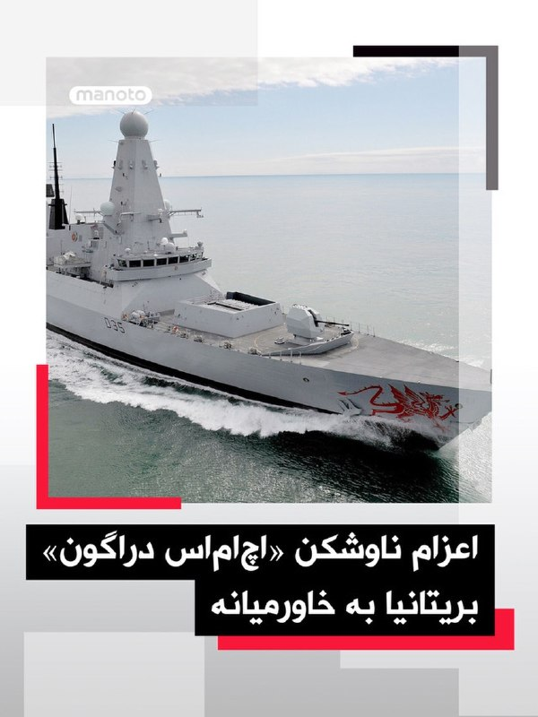

ناوشکن «اچ‌ام‌اس دراگون» پیش از احتمال مشارکت در مأموریتی برای حفاظت از کشتیرانی در تنگه هرمز، از شرق مدیترانه به سمت خاورمیانه اعزام می‌شود.وزارت دفاع بریتانیا اعلام کرد این تصمیم باعث می‌شود کشتی در صورت نیاز فوراً در یک مأموریت دفاعی چندملیتی برای تضمین آزادی ناوبری در تنگه هرمز مشارکت کند.به گفته این وزارتخانه، هرگونه مأموریت احتمالی ماهیتی کاملاً دفاعی خواهد داشت و هدف آن بازگرداندن اعتماد به کشتیرانی تجاری است.ناوشکن تایپ ۴۵ «اچ‌ام‌اس دراگون» در ماه مارس برای حفاظت از پایگاه‌های هوایی بریتانیا در قبرس اعزام شده بود، اما کمتر از یک ماه پس از ترک پورتسموث برای تعمیرات پهلو گرفت.

## ManotoTV — post 105188

  <a href="telegram/content/ManotoTV_105188_1778337565.mp4" target="_blank">🎬 Download video</a>

گزارشگرمنوتو: «امروز شنبه ۹ می، ما ایرانیان و حامیان آزادی در بریزبن استرالیا بار دیگر به خیابان آمدیم تا نگذاریم صدای مردم ایران و محکومان به اعدام خاموش شود.

نام و تصاویر زندانیان محکوم به اعدام را در دست گرفتیم؛ جوانانی که تنها به جرم خواستن آزادی، با خطر مرگ روبه‌رو هستند.

امروز فریاد زدیم که اجازه نمی‌دهیم درد مردم ایران در سکوت جهان فراموش شود.»

## ManotoTV — post 105187

  

برای نخستین بار، نیروهای کره شمالی در رژه «روز پیروزی» روسیه در میدان سرخ مسکو شرکت کردند؛ حضوری که نشانه گسترش همکاری نظامی میان مسکو و پیونگ‌یانگ توصیف شده است.حضور نظامیان کره شمالی در رژه امسال، همزمان با کاهش نمایش تجهیزات سنگین روسیه، توجه زیادی را جلب کرد. رژه «روز پیروزی» روسیه امسال برخلاف سال‌های گذشته با حضور محدود تانک‌ها و تجهیزات سنگین برگزار شد؛ موضوعی که به گفته تحلیلگران، هم به‌دلیل درگیر بودن بخش بزرگی از تجهیزات روسیه در جنگ اوکراین و هم نگرانی از حملات پهپادی کی‌یف بوده است.با این حال، برای نخستین بار نیروهای کره شمالی در میدان سرخ رژه رفتند؛ حضوری که نشانه نزدیکی بیشتر نظامی میان مسکو و پیونگ‌یانگ تلقی می‌شود. مقام‌های اوکراین و کره جنوبی می‌گویند کره شمالی هزاران نیرو برای حمایت از روسیه به جنگ اوکراین فرستاده است.

## ManotoTV — post 105186

  

نیویورک تایمز در گزارشی به این موضوع پرداخته که دریای خزر به مسیر حیاتی همکاری جمهوری‌اسلامی و روسیه تبدیل شده؛ مسیری که هم برای دور زدن تحریم‌ها و هم انتقال تجهیزات نظامی استفاده می‌شود.
مقامات آمریکایی می‌گویند روسیه از طریق خزر قطعات پهپاد به جمهوری‌اسلامی ارسال می‌کند تا تهران پس از آسیب‌های جنگ اخیر، توان پهپادی خود را بازسازی کند. به گفته منابع نیویورک تایمز، جمهوری‌اسلامی در درگیری‌های اخیر حدود ۶۰ درصد از زرادخانه پهپادی خود را از دست داده است. این همکاری نظامی دوطرفه است؛ تهران پیش‌تر پهپادهای «شاهد» را برای استفاده در جنگ اوکراین در اختیار روسیه قرار داده بود و مسکو هم اکنون قطعات و تجهیزات موردنیاز تولید یا بازسازی این پهپادها را به ایران می‌فرستد. گزارش‌ها حاکی‌ست بخش زیادی از این انتقال‌ها از طریق دریای خزر انجام می‌شود؛ مسیری که به‌دلیل محدود بودن دسترسی کشورهای خارجی و خاموش شدن سیستم ردیابی برخی کشتی‌ها، نظارت بر آن دشوار است. مقام‌های غربی می‌گویند این مسیر به یکی از مهم‌ترین کانال‌های انتقال مخفیانه تجهیزات نظامی میان تهران و مسکو تبدیل شده است.

همزمان، جمهوری‌اسلامی بخشی از واردات کالاهای اساسی مثل گندم و خوراک دام را به‌دلیل بحران تنگه هرمز از مسیر خزر انجام می‌دهد.

## ManotoTV — post 105185

  <a href="telegram/content/ManotoTV_105185_1778337569.mp4" target="_blank">🎬 Download video</a>

تجمع اعتراضی ایرانیان مقابل دانشگاه اراسموس روتردام در هلند همزمان با سخنرانی رابرت مالی در ارتباط با مسائل خاورمیانه و ایران.

## ManotoTV — post 105184

  

وزیر راه جمهوری اسلامی در افتتاح قطعه‌ای از «آزادراه حرم تا حرم» در سمنان اعلام کرده « آزادراه حرم‌ تا حرم، به‌عنوان بخشی از کریدور سرخس تا مهران» به نام رهبر کشته‌شده جمهوری اسلامی علی خامنه‌ای نامگذاری خواهد شد.

## ManotoTV — post 105183

  

داده‌های گمرک چین نشان می‌دهد واردات نفت خام این کشور در آوریل ۲۰ درصد کاهش یافته و به پایین‌ترین سطح از ژوئیه ۲۰۲۲ رسیده است.چین حدود نیمی از نفت خود را از خاورمیانه تأمین می‌کند و بسته شدن تنگه باعث کاهش شدید نفتکش‌ها شده است. واردات دریایی نفت خام نیز طبق داده‌های شرکت «کپلر» به کمترین میزان از ژوئیه ۲۰۲۲ رسیده است.واردات گاز طبیعی چین هم ۱۳ درصد کاهش یافت، هرچند آمار رسمی تفاوتی میان واردات دریایی و خط لوله‌ای قائل نشده است. با این حال، مجموع واردات نفت خام چین در چهار ماه نخست سال هنوز ۱.۳ درصد بیشتر از سال گذشته است.

## FarsiVOA — post 217267

🔺طرح اتهام علیه دو مظنون به تهیه «محتوای یهودستیزانه» در بریتانیا

▪️بریتانیا می‌گوید دو مرد پس از ضبط ویدیوهایی یهودستیزانه برای انتشار شبکه اجتماعی تیک‌تاک، به «آزار شهروندان با انگیزه مذهبی» متهم شدند.

⬇️ بیشتر بخوانید:

https://ir.voanews.com/a/britain-antisemitic-london-police-/8148287.html/?nocach=1

## FarsiVOA — post 217266

وزارت دفاع آمریکا برای نخستین بار بخشی از اسناد مربوط به پدیده‌های ناشناس پرنده را منتشر کرد.

این اسناد شامل عکس‌ها، ویدیوها، و گزارش‌هایی است که پیش‌تر در دسترس عموم قرار نداشتند و انتشار آن‌ها در راستای افزایش شفافیت انجام شده است.

@FarsiVOA

## FarsiVOA — post 217265

لکه‌های نفتی خارک؛ شواهد ماهواره‌ای چه می‌گویند و چرا سکوت ادامه دارد

## FarsiVOA — post 217264

  <a href="telegram/content/FarsiVOA_217264_1778337573.mp4" target="_blank">🎬 Download video</a>

ارتش اسرائیل با انتشار این ویدیو اعلام کرد در ۲۴ ساعت گذشته بیش از ۸۵ زیرساخت متعلق به حزب‌الله را در چند منطقه در لبنان هدف قرار داد. این زیرساخت‌ها شامل انبارهای تسلیحاتی، سکوی پرتاب و ساختمان‌های مورد استفاده نظامی حزب‌الله است.

ارتش اسرائیل همچنین اعلام کرد یک سایت زیرزمینی برای تولید سلاح متعلق به حزب‌الله را در منطقه بقاع هدف قرار داده است.

این ویدیو بی‌صدا است.

## FarsiVOA — post 217263

نت‌بلاکس، نهاد مستقل پایش دسترسی به اینترنت، از ورود خاموشی اینترنت در ایران به هفتادویکمین روز و عبور مدت این اختلال از ۱۶۸۰ ساعت خبر داد.

همزمان، آلپ توکر، بنیانگذار این نهاد مستقل پایش اینترنت، نیز در گفت‌وگو با بلومبرگ گفته پیام‌رسان‌های ایرانی رمزگذاری دوسویه ندارند و مقام‌ها می‌توانند به پیام‌ها، موقعیت مکانی و سوابق کاربران دسترسی داشته باشند.

خاموشی بی‌سابقه اینترنت در ایران، در عین حال از یک محدودیت ارتباطی به بحرانی اقتصادی و اجتماعی برای کسب‌وکارهای کوچک تبدیل شده است.

گزارش کامل را در وب‌سایت صدای آمریکا بخوانید.

@FarsiVOA

## FarsiVOA — post 217262

  

خبرآنلاین در گزارشی نوشته اثر افزایش ۶۰ درصدی حداقل مزد سال ۱۴۰۵ تنها در ۴۵ روز از بین رفته و قدرت خرید کارگران دوباره به سطح پیش از افزایش مزد بازگشته است.

بر اساس این گزارش، حداقل مزد پایه ماهانه امسال ۱۶ میلیون و ۶۲۵ هزار تومان تعیین شد؛ رقمی که در روز تصویب، با دلار ۱۴۳ هزار و ۷۰۰ تومانی حدود ۱۱۶ دلار ارزش داشت. اما با رسیدن دلار به حدود ۱۹۰ هزار تومان در نیمه اردیبهشت، ارزش دلاری مزد به حدود ۸۷.۵ دلار سقوط کرده است.

خبرآنلاین نوشته قدرت خرید مزد بر اساس طلا هم افت کرده؛ حداقل حقوق که در اسفند معادل حدود یک گرم طلای ۱۸ عیار بود، حالا به ۰.۸۱ گرم رسیده است.

این یعنی افزایش اسمی دستمزد، زیر فشار سقوط ریال، تورم و سیاست‌های اقتصادی جمهوری اسلامی عملاً خنثی شده و کارگران دوباره با شکافی عمیق میان درآمد و هزینه زندگی روبه‌رو شده‌اند.
@FarsiVOA

## FarsiVOA — post 217261

  <a href="telegram/content/FarsiVOA_217261_1778337577.mp4" target="_blank">🎬 Download video</a>

نیروی دریایی ایالات متحده ۱۱۵ سالگی بازوی هوایی خود را جشن می‌گیرد؛ یگانی که بیش از یک قرن پیشینه در ادغام توانمندی‌های دریایی و هوایی دارد و نقشی کلیدی در تاریخ هوانوردی نظامی ایفا کرده است.

از اولین پروازهای آزمایشی تا جت‌های فوق‌پیشرفته امروزی، هوانوردی دریایی همواره نماد پیشرفت فناوری در ارتش آمریکا بوده است.

این نیرو با تکیه بر ناوهای هواپیمابر، توانایی حضور و اجرای عملیات در دوردست‌ترین نقاط جهان را داراست.

این سالگرد، فرصتی برای قدردانی از مهارت خلبانان و تیم‌های پشتیبانی است که تحت شعار «پیشتازان آسمان و دریا» فعالیت می‌کنند.

🔺نسخه اصلی این ویدیو با موسیقی منتشر شده است.
@FarsiVOA

## FarsiVOA — post 217260

  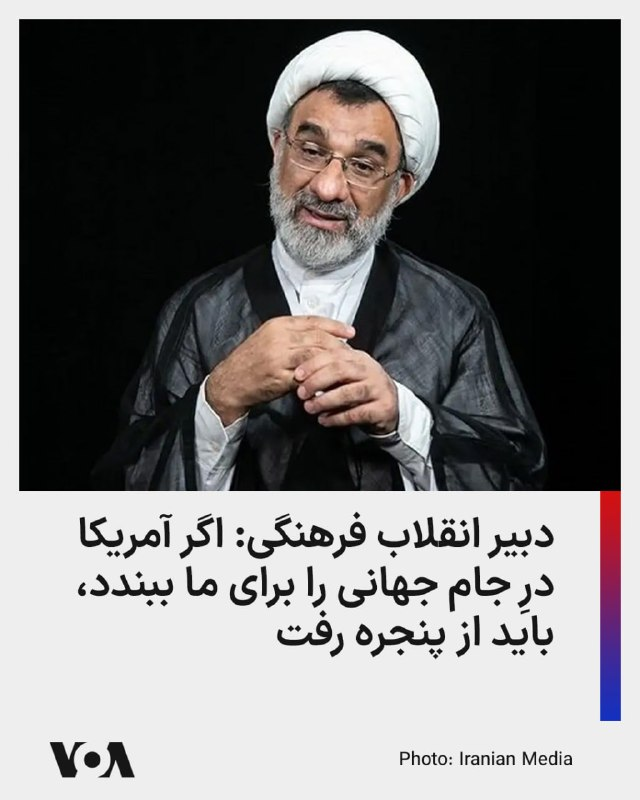

دبیر شورای عالی انقلاب فرهنگی اعلام کرد که جمهوری اسلامی باید در هر صورت در جام جهانی فوتبال شرکت کند.

بر اساس ویدیویی که رسانه‌های ایران روز شنبه منتشر کردند، عبدالحسین خسروپناه در یک سخنرانی گفت: «بعضی از مسئولین مباشر ورزش مخالف حضور در جام‌جهانی بودند، من گفتم اگر آمریکا در را ببندد باید از پنجره رفت!»

او تأکید کرد که در جام جهانی فوتبال «ما حتما باید حضور داشته باشیم» و پرچم جمهوری اسلامی «بالا برود».

پیشتر دونالد ترامپ، رئیس جمهوری آمریکا با تأکید بر بلامانع بودن حضور تیم ملی ایران در جام جهانی، درباره مناسب بودن این کار ابراز تردید کرده بود.

روز سه‌شنبه ۱۹ اسفند مهدی تاج، رئیس فدراسیون فوتبال جمهوری اسلامی، گفته بود که با حمایت پرزیدنت ترامپ، از تیم ملی فوتبال زنان ایران، نمی‌توان به حضور فوتبالیست‌های ایرانی در جام‌جهانی فوتبال خوش‌بین بود.

پیشتر شماری از بازیکنان تیم فوتبال زنان ایران پس از حضور در استرالیا، در آنجا پناهنده شدند اما در پی تهدیدهای قوه قضائیه جمهوری اسلامی، برخی از آنها درخواست پناهندگی خود را پس گرفتند.
@FarsiVOA

## FarsiVOA — post 217259

🔺اذعان وزارت ارتباطات به «شوک اقتصادی» قطع سراسری اینترنت

◾️وزارت ارتباطات می‌گوید بخش فناوری اطلاعات در جریان جنگ ۳۳۵ میلیون دلار خسارت مستقیم دیده است؛ عددی که خسارت زیرساختی جنگ است و زیان ناشی از تصمیم به قطع اینترنت را شامل نمی‌شود.

◾️معاون وزیر ارتباطات، گفته بیش از ۵۰۰ سایت ارتباطی در جریان جنگ آسیب دیده است.
او همچنین از ۶.۴ همت عدم‌النفع در مخابرات، ۲.۳ همت زیان در تجارت الکترونیک، حدود ۷۸۶ میلیارد تومان عدم‌النفع در پست و لجستیک، و ۱.۹ همت زیان در کسب‌وکارها خبر داده است.

◾️منتقدان می‌گویند دولت در حالی از خسارت جنگ به شبکه ارتباطی می‌گوید، که درباره خسارتی که تصمیم خودش برای قطع اینترنت به اقتصاد دیجیتال و کسب‌وکارهای مردم زده، شفاف حرف نمی‌زند.

⬇️ بیشتر بخوانید:
https://ir.voanews.com/a/8148263.html

## FarsiVOA — post 217258

  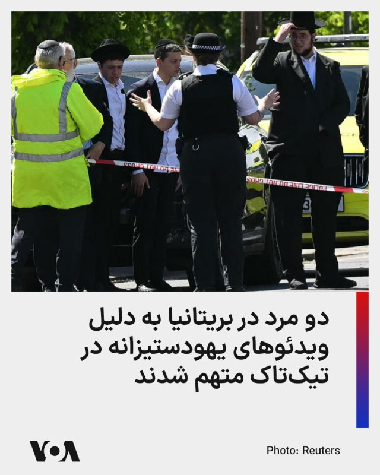

مقامات بریتانیایی اعلام کردند که دو مرد را پس از ضبط ویدئوهایی یهودستیزانه برای شبکه‌های اجتماعی تیک‌تاک متهم کرده‌اند.

پلیس بریتانیا روز شنبه گزارش داد که این دو مرد به یک منطقه یهودی‌نشین در شمال لندن سفر کرده و این ویدیوها را آنجا ضبط کرده‌اند. بر اساس این گزارش، این دو نفر به «آزار و اذیت با انگیزه دینی» متهم شده‌اند.

دادستانی کل بریتانیا اعلام کرد که این دو مرد، آدام بدویی ۲۰ ساله و عبدالقادر امیر بوسلوب ۲۱ ساله، قرار است در دادگاه حاضر شوند.

پیشتر کی‌یر استارمر، نخست‌وزیر بریتانیا، در هشداری مستقیم به جمهوی اسلامی گفت هرگونه تلاش برای دامن زدن به خشونت، نفرت یا تفرقه در جامعه بریتانیا «تحمل نخواهد شد.»

استارمر روز سه‌شنبه گذشته در نشستی در دفتر نخست‌وزیری با رهبران جامعه یهودیان، مقام‌های دولتی و مسئولان پلیس گفت یکی از محورهای تحقیقات این است که آیا یک کشور خارجی پشت برخی از حملات اخیر به جامعه یهودیان بریتانیا بوده است یا نه.
@FarsiVOA

## FarsiVOA — post 217257

  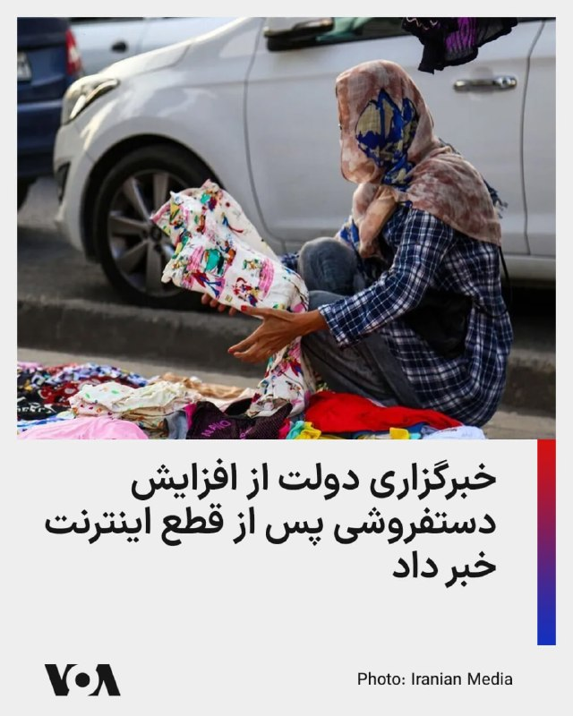

خبرگزاری دولتی ایرنا در گزارشی میدانی از تهران، عملاً تأیید کرده است که قطع اینترنت بخشی از فروشگاه‌های مجازی را از فضای آنلاین بیرون رانده و به خیابان و پیاده‌رو کشانده است.

ایرنا نوشته پررنگ شدن دستفروشی فقط محدود به نقاط مرکزی تهران نیست و از بازار امامزاده حسن در جنوب غرب تهران تا شهرک اندیشه شهریار نیز دیده می‌شود.

به گزارش این خبرگزاری، مدارای شهرداری و «دستور آگاهانه» برای برخورد نکردن با دستفروشان، این روند را آشکارتر کرده و بخش‌هایی از شهر را به ویترین بساط‌گرانی تبدیل کرده است که به‌اجبار از اینستاگرام به خیابان کوچ کرده‌اند.

به این ترتیب، خاموشی اینترنت فقط فروش آنلاین را متوقف نکرده، بلکه بخشی از اقتصاد خرد دیجیتال را از صفحه موبایل به پیاده‌رو عقب رانده است.

ایرنا نوشته فروشندگانی که تا چند ماه پیش با صفحه اینستاگرامی، پرداخت آنلاین و ارسال سفارش فعالیت می‌کردند، حالا در نبود اینترنت آزاد و پایدار، ناچار شده‌اند در خیابان بساط کنند.

در روزهای اخیر، گزارش‌های متعددی درباره افزایش بیکاری، به‌ویژه در میان زنان و صاحبان کسب‌وکارهای خرد، در پی قطع اینترنت منتشر شده است.
@FarsiVOA

## FarsiVOA — post 217256

🔺گزارش‌ها از سهمیه‌بندی سرم و آنتی‌بیوتیک؛ بحران دارو از بازار به بیمارستان رسید

◾️گزارش‌های رسیده به صدای آمریکا از سهمیه‌بندی سرم در بیمارستان‌ها و ابلاغ دستورالعمل تازه برای کاهش مصرف سرم و آنتی‌بیوتیک حکایت دارد.

◾️یک مدیر بیمارستان خصوصی در تهران به صدای آمریکا گفت بر اساس دستورالعمل جدید، مصرف سرم در بخش اورژانس بیمارستان‌ها باید دست‌کم ۵۰ درصد کاهش پیدا کند.

◾️یک دکتر داروساز نیز به صدای آمریکا گفته بحران سرم و آنتی‌بیوتیک در داروخانه‌ها جدی شده و توزیع این دو قلم با تأخیر و بسیار کمتر از تقاضای واقعی انجام می‌شود.

⬇️ بیشتر بخوانید:
https://ir.voanews.com/a/8148262.html

## DW_Farsi — post 124480

  <a href="telegram/content/DW_Farsi_124480_1778337583.mp4" target="_blank">🎬 Download video</a>

🎥 احتمال قطع پخش جام جهانی در چین

چین با حدود ۲۰۰ میلیون هوادار فوتبال، یکی از بزرگ‌ترین بازارهای فوتبالی جهان به حساب می‌آید.
اما اختلاف میان فیفا و شبکه دولتی چین بر سر حق پخش، حالا این احتمال را ایجاد کرده که میلیون‌ها نفر در چین نتوانند جام جهانی را تماشا کنند.
@dw_farsi

## DW_Farsi — post 124479

🔶 سفر روبیو به ایتالیا؛ آدم ترامپ برای "مهار خسارت"

برای مارکو روبیو، وزیر خارجه آمریکا سفر به ایتالیا نوعی بازگشت به ریشه‌های خانوادگی‌اش نیز بود؛ بخشی از خانواده او از منطقه پیمونت ایتالیا می‌آیند. در وزارت خارجه ایتالیا در رم، حتی بخش ایتالیایی شجره‌نامه خانوادگی‌اش به‌طور رسمی به او اهدا شد.

روبیو که فرزند مهاجران تبعیدی کوبایی است و به اسپانیایی روان صحبت می‌کند، از شباهت زیاد زبان اسپانیایی و ایتالیایی ابراز شگفتی کرد. او همچنین گفت که مدتی با یک اپلیکیشن آموزش زبان در حال یادگیری ایتالیایی بوده است.

او گفت: «اشتراک بابِل (Babbel) [اپ آموزش زبان] من تمام شده و هنوز تمدیدش نکرده‌ام؛ باید دوباره تمدیدش کنم تا دفعه بعد که به اینجا آمدم ادامه بدهم. اما واقعاً جالب است. من تقریباً همه چیز را می‌فهمم. در جلسات حتی هدفون ترجمه هم نگذاشتم، چون همه حرف‌های او را مستقیم متوجه می‌شدم.»

اما هدف اصلی گفت‌وگوهای روبیو در ایتالیا، مسائل خانوادگی نبود، بلکه سیاست جهانی بود. هرچند روابط شخصی نیز در این سفر نقش داشت؛ زیرا رابطه میان جورجیا ملونی، نخست‌وزیر ایتالیا، و دونالد ترامپ زمانی بسیار خوب بود، اما حالا دچار تنش شده است.

ملونی انتقادهای تند ترامپ از پاپ لئو چهاردهم را غیرقابل قبول دانسته بود. علاوه بر آن، ایتالیا حاضر نشده در جنگ علیه ایران مشارکت کند.
پس از دیدار روبیو و ملونی، وزارت خارجه آمریکا اعلام کرد که روبیو برای «تقویت شراکت راهبردی پایدار میان آمریکا و ایتالیا» با ملونی دیدار کرده است.

طبق اعلام رسمی، موضوعات دیدار شامل چالش‌های امنیتی، همکاری فراآتلانتیکی و هماهنگی نزدیک درباره اولویت‌های مشترک بوده است؛ یعنی تلاشی برای یافتن زمینه مشترک بیشتر در میان بحران‌های جهانی.

جنگ با ایران نیز از جمله این مسائل بود. امیدها برای پایان سریع جنگ فعلاً کاهش یافته، هرچند ایران در حال بررسی پیشنهاد مذاکره آمریکا است.
روبیو پس از دیدار با ملونی در روز جمعه ۸ مه (۱۸ اردیبهشت) در رم گفت: «ما هنوز امروز منتظر پاسخ ایران هستیم. خواهیم دید این پاسخ چیست و امیدواریم بتواند مذاکرات را به‌طور جدی پیش ببرد.»

روبیو همچنین با همتای ایتالیایی خود، آنتونیو تایانی، دیدار مفصلی داشت. موضوع گفت‌وگوها شامل همکاری‌های دوجانبه در حوزه اقتصاد و امنیت بود.

تایانی پس از این دیدار موضع ایتالیا را چنین بیان کرد: «اروپا به آمریکا نیاز دارد، ایتالیا به آمریکا نیاز دارد، اما ایالات متحده نیز به اروپا و ایتالیا نیازمند است. وحدت غرب بسیار اساسی است. به همین دلیل، من مثبت می‌بینم که دیدار با پدر مقدس خوب پیش رفت.»
@dw_farsi

## DW_Farsi — post 124478

  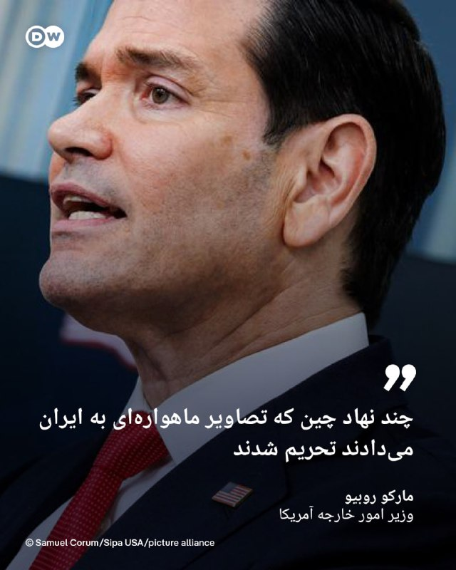

🔶 روبیو: چند نهاد چین که تصاویر ماهواره‌ای به ایران می‌دادند تحریم شدند

مارکو روبیو، وزیر امور خارجه آمریکا اعلام کرد، هدف تحریم‌های تازه کشورش چندین نهاد مستقر در چین است که تصاویر ماهواره‌ای به ایران می‌دادند تا این کشور را در حملات نظامی علیه نیروهای ایالات متحده در خاورمیانه توانمند سازند.

طبق بیانیه مندرج در وب‌سایت وزارت امور خارجه ایالات متحده، دولت دونالد ترامپ روز جمعه ۸ مه (۱۸ اردیبهشت) همچنین اعلام کرد که در حال اعمال تحریم‌هایی علیه ۱۱ نهاد و سه فرد مستقر در ایران، چین، بلاروس و امارات متحده عربی است که در تلاش‌های ایران برای دستیابی یا استفاده از تسلیحات و تجهیزات مرتبط با آن مشارکت داشته‌اند.

ایالات متحده می‌گوید که از تمام اقدامات لازم و ابزارهایی که در اختیار دارد برای هدف قرار دادن نهادها و افراد در کشورهای ثالث که به ارتش و صنایع دفاعی جمهوری اسلامی ایران کمک می‌کنند، استفاده خواهد کرد.
@dw_farsi

## DW_Farsi — post 124477

  

🔶بحرین: یک شبکه مرتبط با سپاه پاسداران شناسایی شد

بحرین اعلام کرد، ۴۱ نفر از اعضای یک شبکه مرتبط با "سپاه پاسداران" را بازداشت کرده است.

وزارت کشور بحرین روز شنبه ۱۹ اردیبهشت (۹ مه) با اعلام این خبر افزود که این افراد با سپاه پاسداران انقلاب اسلامی ارتباط داشته‌اند.

بحرین سال‌هاست که با چالش نفوذ جمهوری اسلامی ایران و "تحریک شیعیان" این کشور مواجه است. وزارت خارجه بحرین بارها به "دخالت ایران در امور داخلی این کشور" اعتراض کرده است.

بحرین از متحدان آمریکا در منطقه محسوب می‌شود و تحت حمایت پادشاهی عربستان سعودی قرار دارد. این کشور کوچک حوزه خلیج فارس بارها از طرف ایران در جنگ ائتلاف آمریکا و اسرائیل علیه جمهوری اسلامی هدف حملات ایران قرار گرفته است.

@dw_farsi

## DW_Farsi — post 124476

  

🔶اسرائیل و لبنان در هفته جاری مذاکره خواهند کرد

بنا بر اعلام وزارت امور خارجه آمریکا، این کشور در هفته جاری میانجی گفت‌وگوهای دو روزه میان دولت‌های اسرائیل و لبنان خواهد بود.

بنا بر اعلام ایالات متحده، این گفت‌وگوها در روزهای پنجشنبه و جمعه ۱۴ و ۱۵ مه (۲۴ و ۲۵ اردیبهشت) برگزار خواهد شد اما مشخص نیست، این دو کشور همسایه در چه سطحی درباره دستیابی به صلح، مذاکره خواهند کرد.

این جلسه در حالی قرار است برگزار شود که نواف سلام، نخست‌وزیر لبنان، اخیرا برگزاری هرگونه نشستی در سطح سران کشورها را رد کرده بود.

سلام تاکید کرده بود: «پیش از هر چیز، آتش‌بس توافق‌شده با اسرائیل باید به‌طور کامل رعایت شود.»

@dw_farsi

## DW_Farsi — post 124475

🔶تأثیر جنگ ایران بر شکاف در اتحاد دیرینه آمریکا و عربستان

با آغاز جنگ آمریکا و اسرائیل علیه ایران در نهم اسفندماه گذشته، اتحادهای سنتی در منطقه خلیج فارس نیز با آزمونی سنگین روبه‌رو شدند. به‌ویژه روابط میان واشنگتن و ریاض تحت‌الشعاع قرار گرفته است.

در جریان جنگ ایران، کشورهای حوزه خلیج فارس، به عنوان محل استقرار شمار زیادی از نیروهای آمریکایی، بارها هدف حملات ایران قرار گرفتند.

دونالد ترامپ، رئیس جمهور آمریکا، که زمانی محمد بن سلمان، ولیعهد و حاکم بالفعل عربستان سعودی، را "آدم فوق‌العاده‌ای" توصیف می‌کرد، امروز لحنش تغییر کرده و او را علناً تحت فشار قرار می‌دهد. ترامپ در آغاز جنگ گفت، بن‌سلمان هرگز تصورش را هم نمی‌کرده که روزی تا این اندازه در پی جلب رضایت او باشد.

@dw_farsi

## DW_Farsi — post 124474

  

🔶عبدالحمید: اگر در جنگ ۱۲روزه توافق می‌شد خسارت‌ها کمتر بود

مولوی عبدالحمید، امام‌جمعه اهل سنت زاهدان در خطبه‌های نماز جمعه ۱۸ اردیبهشت (۸ مه) با تاکید بر ضرورت کاهش تنش‌های خارجی و حرکت به سمت "توافق عادلانه با طرف مقابل" و "پرهیز از تحریک احساسات ملت‌های دنیا علیه کشور و مردم ایران" خواستار اتخاذ رویکردی مبتنی بر مذاکره، تدبیر سیاسی و حفظ منافع ملی شد.

او با اشاره به شرایط اقتصادی و فشارهای ناشی از تحریم‌ها، ادامه وضعیت فعلی را برای معیشت مردم ایران دشوار توصیف کرد.

عبدالحمید در ادامه تاکید کرد که جلوگیری از جنگ و خونریزی، حتی با پذیرش شرایط دشوار، می‌تواند در بلندمدت به تقویت موقعیت سیاسی و اجتماعی یک کشور منجر شود.

او همچنین یادآور شد که در گذشته وقتی در پیامی در شبکه ایکس خواستار "توافق عادلانه" شده بود، برخی از این موضوع ناراحت شده بودند، اما اکنون بعضی از مسئولان رده‌بالای کشور نیز از "توافق عادلانه" سخن می‌گویند و موضوع توافق مطرح است.

@dw_farsi

## DW_Farsi — post 124473

  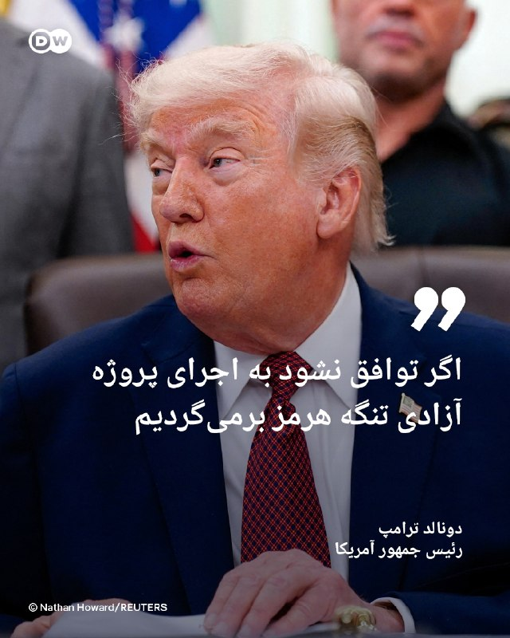

🔶ترامپ: اگر توافق نشود به اجرای پروژه آزادی تنگه هرمز برمی‌گردیم

دونالد ترامپ، رئیس جمهور آمریکا روز شنبه ۱۹ اردیبهشت (۹ مه) در گفتگو با خبرنگاران درباره اجرای دوباره "پروژه آزادی" در تنگه هرمز هشدار داد و گفت، اگر همه توافق‌ها نهایی و کامل نشود، واشنگتن ممکن است به این طرح بازگردد؛ اما این بار با نسخه‌ای گسترده‌تر تحت عنوان "پروژه آزادی پلاس".

رئیس جمهور آمریکا صبح روز چهارشنبه ۱۶ اردیبهشت نیز در پلتفرم "تروث سوشال" خبر داده بود که به دلیل درخواست پاکستان و برخی کشورهای دیگر "پروژه آزادی" را بطور موقت متوقف می‌کند.

به گفته رئیس جمهور آمریکا، توافق شده بود که با وجود تداوم کامل محاصره دریایی، "پروژه آزادی" (اسکورت و هدایت کشتی‌ها برای خروج از تنگه هرمز) برای مدت کوتاهی متوقف شود.

ترامپ همچنین توضیح داد که این توقف برای بررسی احتمال نهایی‌شدن توافق و امضای آن انجام می‌شود.

@dw_farsi

## Persian_Trend_Official — post 13755

  <a href="telegram/content/Persian_Trend_Official_13755_1778337590.mp4" target="_blank">🎬 Download video</a>

🔴ویدیویی منتشر شده سنتکام از هدف قرار دادن لانچرهای موشکی جمهوری اسلامی در زمان قبل از آتش بس

🫆:Tony

📌 @persian_trend_official
پرشین ترند | متفاوت‌ترین کانال نظامی

## Persian_Trend_Official — post 13754

  <a href="telegram/content/Persian_Trend_Official_13754_1778337592.mp4" target="_blank">🎬 Download video</a>

🔴 ارسال محموله جدید تانک‌های روسی به خطوط مقدم جنگ

💢منابع روسی گزارش می‌دهند محموله جدیدی از تانک‌های اصلی میدان نبرد T-90M، T-72B3M و T-80BVM از کارخانه‌های تولیدی به خطوط مقدم جنگ اعزام شده‌اند.

💢این اقدام در حالی انجام می‌شود که روسیه همچنان در حال افزایش تولید و نوسازی تجهیزات زرهی خود برای ادامه جنگ با اوکراین است.

🫆:Tony

📌 @persian_trend_official
پرشین ترند | متفاوت‌ترین کانال نظامی

## Persian_Trend_Official — post 13753

  <a href="telegram/content/Persian_Trend_Official_13753_1778337594.mp4" target="_blank">🎬 Download video</a>

وضعیت اصلا به نفع حزب دموکرات نیست!

پس از اجرای طرح باز توزیع حوزه‌های انتخابی ایالت ها که موجب شده هردو حزب به تکاپو برای گرفتن حداکثر ظرفیت برای خود باشند و تبلیغات خود را گسترش دهند بر اساس نظرسنجی های برگزار شده و پیشبینی از افزایش میزان رای‌های هر حزب در برخی از ایالت های آمریکا نسبت به انتخاب پیشین! (قرمز جمهوری خواهان و آبی دموکرات‌ها)

🔴در تگزاس 5 کرسی بیشتر
🔴در فلوریدا 4 کرسی بیشتر
🔴در تنسی یک کرسی بیشتر و حذف آخرین کرسی دموکرات‌های این ایالت
🔴در اوهایو دو کرسی بیشتر
🔴در میزوری 1 کرسی بیشتر
🔴در کارولینای شمالی یک کرسی بیشتر
🔴در آلاباما کسب یک کرسی بیشتر
🔵در کالیفرنیا کسب پنج کرسی بیشتر
🔵در ویرجینیا کسب چهار کرسی جدید
🔵در یوتا کسب اولین کرسی دموکرات‌ها

نتیجه تغییرات تاکنون: 15 نفر جمهوری خواهان و 10 نفر و دستکم پنج نفر بیشتر نسبت به انتخابات سابق

📝 Nick

📌 @persian_trend_official
پرشین ترند | متفاوت‌ترین کانال نظامی

## Persian_Trend_Official — post 13752

  

🔴 پرواز مداوم هواپیمای ارتباطی ارتش آمریکا بر فراز عراق

💢هواپیمای E-11A متعلق به ارتش آمریکا از روز قبل به‌طور مداوم بر فراز مناطق جنوب‌غربی Iraq در حال پرواز است.

💢این هواپیما که برای ایجاد و حفظ ارتباطات رادیویی میان واحدهای عملیاتی ارتش آمریکا استفاده می‌شود، طبق داده‌های فلایت‌رادار از ریاض عربستان به پرواز درآمده است.

💢حضور مداوم E-11A معمولاً در شرایطی دیده می‌شود که نیروهای آمریکایی نیاز به پوشش ارتباطی گسترده برای عملیات‌های هوایی و زمینی داشته باشند.

🫆:Tony

📌 @persian_trend_official
پرشین ترند | متفاوت‌ترین کانال نظامی

## Persian_Trend_Official — post 13751

  <a href="telegram/content/Persian_Trend_Official_13751_1778337596.mp4" target="_blank">🎬 Download video</a>

🔴 بالگردهای تهاجمی آپاچی آمریکا بر فراز بغداد به پرواز درآمدند

💢منابع عراقی گزارش می‌دهند بالگردهای تهاجمی AH-64 آپاچی ارتش ایالات متحده امریکا در آسمان بغداد در حال گشت‌زنی و پرواز مشاهده شده‌اند.

▪️تا این لحظه مقام‌های آمریکایی یا عراقی درباره علت این پروازها توضیح رسمی منتشر نکرده‌اند.

🫆:Tony

📌 @persian_trend_official
پرشین ترند | متفاوت‌ترین کانال نظامی

## Persian_Trend_Official — post 13749

  <a href="telegram/content/Persian_Trend_Official_13749_1778337598.mp4" target="_blank">🎬 Download video</a>

🔴 حمله و ترور هدفمند جدید اسرائیل در لبنان

💢منابع محلی از وقوع یک حمله هدفمند دیگر در منطقه Saadiyat خبر می‌دهند.

💢جزئیات بیشتری درباره هدف حمله، تلفات احتمالی یا ماهیت عملیات تاکنون منتشر نشده است.

🫆:Tony

📌 @persian_trend_official
پرشین ترند | متفاوت‌ترین کانال نظامی

## Persian_Trend_Official — post 13747

🔴 حمله پهپادی اسرائیل به ورودی منطقه الشوف لبنان؛ گزارش اولیه از ۳ کشته

💢منابع لبنانی گزارش می‌دهند یک پهپاد اسرائیلی جاده «ملتقی النهرین» در ورودی منطقه Chouf District را هدف قرار داده است.

💢بر اساس گزارش‌های اولیه، در این حمله دست‌کم ۳ نفر کشته شده‌اند، اما جزئیات بیشتری درباره هویت قربانیان یا وضعیت مجروحان منتشر نشده است/نایا

🫆:Tony

📌 @persian_trend_official
پرشین ترند | متفاوت‌ترین کانال نظامی

## Persian_Trend_Official — post 13746

  <a href="telegram/content/Persian_Trend_Official_13746_1778337600.mp4" target="_blank">🎬 Download video</a>

🔴 حضور نیروهای کره شمالی برای نخستین بار در رژه روز پیروزی روسیه

▪️رسانه‌های روسی گزارش دادند نیروهای نظامی کره شمالی برای نخستین بار در رژه «روز پیروزی» مسکو شرکت کرده‌اند.

🫆:Tony

📌 @persian_trend_official
پرشین ترند | متفاوت‌ترین کانال نظامی

## Persian_Trend_Official — post 13745

  <a href="telegram/content/Persian_Trend_Official_13745_1778337602.webm" target="_blank">🎬 Download video</a>

🚀 اینترنت پرسرعت و پایدار،
💰 قیمت هر گیگ ۲۵۰ تومن!
🎁 تخفیف ویژه: ۱۰٪ تخفیف اختصاصی برای اعضای پرشین ترند
⚡ پایداری بالا: کمترین قطعی ممکن در بدترین شرایط
🛡️ تضمین کیفیت: پشتیبانی ۲۴ ساعته + گارانتی بازگشت وجه

🛒 جهت خرید و مشاوره پیام دهید:

🆔 @shayan1057

🆔 @shayan1057

🆔 @shayan1057

## Persian_Trend_Official — post 13744

  

🔴 خاموشی گسترده اینترنت در ایران وارد یازدهمین هفته شد

گروه ناظر اینترنتی NetBlocks اعلام کرد قطعی و محدودیت شدید اینترنت در ایران وارد یازدهمین هفته خود شده است.

این سازمان در بیانیه‌ای نوشت:

«این اقدام سانسور، مانعی فوق‌العاده در برابر دسترسی ایرانیان به دانش، اطلاعات و ارتباطات ایجاد کرده و زندگی روزمره مردم را مختل کرده است.»

🫆:Tony

📌 @persian_trend_official
پرشین ترند | متفاوت‌ترین کانال نظامی

## RadioFarda — post 157007

🔸وزارت دفاع بریتانیا روز شنبه اعلام کرد که پیش از هرگونه مأموریت بین‌المللی برای کمک به حفاظت از کشتیرانی در تنگه هرمز، یک ناوشکن به خاورمیانه اعزام خواهد کرد. 🔸سخنگوی این وزارتخانه به خبرگزاری فرانسه گفت: «استقرار پیشاپیش ناوشکن «اچ‌ام‌اس دراگون» بخشی از…

## RadioFarda — post 157006

  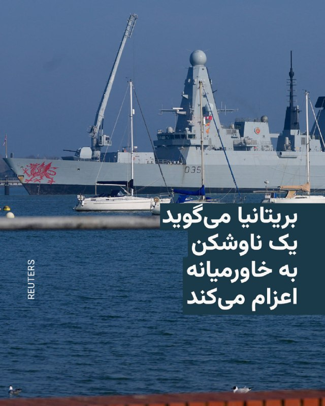

🔸وزارت دفاع بریتانیا روز شنبه اعلام کرد که پیش از هرگونه مأموریت بین‌المللی برای کمک به حفاظت از کشتیرانی در تنگه هرمز، یک ناوشکن به خاورمیانه اعزام خواهد کرد.

🔸سخنگوی این وزارتخانه به خبرگزاری فرانسه گفت: «استقرار پیشاپیش ناوشکن «اچ‌ام‌اس دراگون» بخشی از برنامه‌ریزی محتاطانه‌ای است که تضمین می‌کند بریتانیا به‌عنوان بخشی از یک ائتلاف چندملیتی به رهبری مشترک بریتانیا و فرانسه، در زمان مناسب آماده تأمین امنیت تنگه باشد.»

🔸لندن و پاریس چند هفته پیش اعلام کردند که طرح‌های نظامی برای تأمین امنیت تنگه هرمز در حال شکل‌گیری است و در بازگرداندن جریان تجارت از طریق این گذرگاه حیاتی موفق خواهد بود.

@RadioFarda

## RadioFarda — post 157005

  

🔸فدراسیون فوتبال ایران روز شنبه با اعلام این که تیم ملی کشور قطعا در جام جهانی فوتبال شرکت خواهد کرد، شرط‌هایی برای این حضور اعلام کرد.

🔸در میان شرط‌هایی که این فدراسیون به آنها اشاره کرده است، لزوم صدور ویزای آمریکا برای «تمامی بازیکنان و کادر فنی، به ویژه کسانی که در سپاه خدمت کرده‌اند» آمده است.

🔸فدراسیون نام مهدی طارمی و احسان حاج‌صفی، دو بازیکن باسابقه تیم ملی، را قید کرده که دوران سربازی را در سپاه پاسداران گذرانده‌اند.

🔸فدراسیون فوتبال ایران همچنین خواستار «بالاترین سطح پروتکل‌های حفاظتی و امنیتی» توسط پلیس آمریکا شد تا به گفته آن، از «حواشی و مشکلات احتمالی (مانند آنچه در استرالیا رخ داد) جلوگیری شود».

🔸اشاره فدراسیون به اتفاقاتی است که در جریان حضور تیم ملی فوتبال زنان ایران در جام ملت‌های آسیا در استرالیا در روزهای ابتدایی جنگ اخیر رخ داد و در نهایت به پناهندگی تعدادی از اعضای این تیم به کشور میزبان ختم شد.

🔸ایران همچنین خواستار ممنوع شدن ورود هرگونه پرچم به جز «پرچم رسمی جمهوری اسلامی» به ورزشگاه‌های محل بازی تیم ایران شده است.

@RadioFarda

## RadioFarda — post 157004

آیا کشاورزی ایران زیر فشار محاصره خارجی و با «آمارسازی داخلی» دوام می‌آورد؟

🔸دولت جمهوری اسلامی ایران می‌گوید اغلب نیازهای کشاورزی کشور در داخل تولید می‌شود و ایران پس از بسته شدن عملی تنگه هرمز و همچنین محاصره دریایی بنادر جنوبی‌ توسط آمریکا، مشکلی در وضعیت کشاورزی، به‌ویژه دسترسی کشاورزان به کودهای شیمیایی، ندارد.

🔸اما گزارش‌های رسانه‌ای و ارزیابی کارشناسان حاکی است که وضعیت تولید کشاورزی ایران در سال‌های اخیر روند نزولی داشته و کمبود و گرانی کودهای شیمیایی می‌تواند این وضعیت را وخیم‌تر کند.

🔸شرایط به‌گونه‌ای است که یکی از رسانه‌های ایران این پرسش را مطرح کرده که آیا وضعیت کنونی منجر به «فلج شدن کشاورزی ایران خواهد شد؟»

🔸وضعیت واقعی تولید کشاورزی در ایران چیست، افزایش قیمت کود به چه میزان بوده و تأثیراتش چیست، و محاصرهٔ بنادر ایران چه نتایجی در حوزهٔ کشاورزی دارد؟

🔸گزارش کامل را در وب‌سایت رادیوفردا بخوانید.

@RadioFarda

## RadioFarda — post 157003

🔸با آغاز تهاجم تمام‌عیار روسیه به اوکراین، لئونید و والنتینا استویانوف، دو دامپزشک در شهر اودسا، زندگی خود را وقف نجات حیوانات آسیب‌دیده و رهاشده جنگ کردند.

🔸این زوج ابتدا حیوانات خانگی زخمی و جامانده را به کلینیک خود منتقل می‌کردند، اما خیلی زود سفر به خطوط مقدم جنگ را برای نجات حیوانات آغاز کردند.

🔸آن‌ها در سال‌های اخیر حیوانات مختلفی، از جمله میمون‌ها و شیرهایی را که از باغ‌وحش‌ها نجات یافته بودند درمان کرده‌اند، پرندگان دریایی گرفتار در آلودگی نفتی را احیا کرده‌اند و برای صدها حیوان نیز در خارج از اوکراین خانه‌های جدید پیدا کرده‌اند.

@RadioFarda

## RadioFarda — post 157002

  

🔸وزارت کشور بحرین روز شنبه ۱۹ اردیبهشت اعلام کرد که ۴۱ نفر را که به گفته این وزارتخانه با سپاه پاسداران ایران مرتبط بوده‌اند، دستگیر کرده است.

🔸خبرگزاری دولتی بحرین به نقل از این وزارتخانه گزارش داد که مقامات امنیتی گروهی مرتبط با سپاه پاسداران ایران را شناسایی کرده است و افزود که تحقیقات برای شناساییو برخورد با هر فردی که در این تشکیلات فعالیت داشته ادامه دارد.

🔸 بحرین پیشتر تابعیت ۶۹ نفر و خانواده‌های آنها را به دلیل «حمایت از حملات ایران» و تهدید امنیت ملی لغو کرده بود.

🔸به گزارش رویترز، این افراد به «ابراز همدردی با اقدامات خصمانه ایران» و همچنین «جاسوسی برای طرف‌های خارجی» متهم شده‌اند. مقام‌های بحرینی این اقدامات را تهدیدی برای ثبات کشور دانسته‌اند.

🔸ایران پس از آغاز جنگ آمریکا و اسرائیل علیه ایران در اسفند سال گذشته، به اهدافی در بحرین و سایر کشورهای عربی خلیج فارس که ایالات متحده در آنها پایگاه نظامی دارد، شلیک کرد.

@RadioFarda

## RadioFarda — post 157001

  <a href="https://t.me/radiofarda/157001" target="_blank">📎 Download file</a>

📻بشنوید: ساعت ۱۴ با رادیوفردا، ۱۹ اردیبهشت ۱۴۰۵‌

@Radiofarda

## RadioFarda — post 157000

  

🔸در آغاز یازدهمین هفته از قطعی سراسری اینترنت بین‌المللی در ایران، یک مقام دولتی هشدار داد که این اقدام حکومت در درازمدت خود به «تهدید امنیتی» برای جمهوری اسلامی بدل خواهد شد.

🔸احسان چیت‌ساز، معاون وزیر ارتباطات در دولت مسعود پزشکیان، گفت: «قطع اینترنت فقط در بازه‌های زمانی کوتاه می‌تواند کمک کند و در بلندمدت تهدید امنیتی است.»

🔸قطعی اینترنت در ایران روز شنبه، ۱۹ اردیبهشت، یازدهمین هفته خود را آغاز کرد، در حالی که مردم عادی در کشور تنها با صرف هزینه‌های گزاف می‌توانند به اینترنت بین‌المللی دسترسی داشته باشند و مقام‌های حکومتی و عده‌ای از حامیان جمهوری اسلامی با مانعی در دسترسی مواجه نیستند.

🔸همزمان انتقادهای برخی از مقام‌های دولتی در ایران از این تصمیم «امنیتی» در کشور در حالی منتشر می‌شود که به گفته مخالفان حکومتی دولت، مسعود پزشکیان خود در این تصمیم‌گیری نقش داشته است.

🔸مشخص نیست که اینترنت چه زمانی به خانه‌های مردم بازخواهد گشت. دست‌کم یک نماینده مجلس گفته است که فعلا نباید منتظر بازگشت اینترنت بود.

@RadioFarda

## RadioFarda — post 156999

  

🔸رسانه‌های داخل ایران روز شنبه از گفت‌وگوی تلفنی عباس عراقچی، وزیر خارجه جمهوری اسلامی، با همتای ترکیه‌ای‌اش خبر دادند، تماسی که او در آن از «رویکرد مخرب آمریکا در روند دیپلماسی» انتقاد کرده است.

🔸او گفت: «رویکرد مخرب آمریکا روند دیپلماسی را تضعیف می‌کند.»

🔸به گزارش خبرگزاری ایسنا، عراقچی در گفت‌وگو با هاکان فیدان،‌ وزیر امور خارجه ترکیه، چنین شکایت کرده است:‌ «تنش‌آفرینی اخیر نیروهای آمریکایی در خلیج فارس و اقدامات متعدد آنان در نقض آتش‌بس، بر سوء ظن‌ها نسبت به انگیزه و جدیت طرف آمریکایی در مسیر دیپلماسی افزوده است.»

🔸به نظر می‌رسد اشاره این مقام جمهوری اسلامی به ادامه محاصره دریایی بنادر ایران و حمله تازه ارتش آمریکا به دو نفتکش ایرانی باشد که روز جمعه گذشته رخ داد.

🔸ارتش آمریکا روز جمعه تأیید کرد که با حمله به دو نفتکش ایرانی دیگر، مانع از عبور آنها از محاصره دریایی اعمال شده بر بنادر و کشتیرانی ایران شده است.

🔸انتقاد عراقچی از دولت آمریکا در زمانی در رسانه‌های ایران بازتاب یافته که دونالد ترامپ در انتظار دریافت پاسخ حکومت ایران به پیشنهاد تازه برای پایان جنگ است.

@RadioFarda

## IranianMinds — post 19838

🔴دونالد ترامپ:

اگر همه چیز امضاء و نهایی نشود، مسیر متفاوتی را پیش خواهیم گرفت.
اگر اتفاقی حاصل نشود، ممکن است به پروژه آزادسازی تنگه هرمز بازگردیم، اما آن پروژه آزادی پلاس خواهد بود.
پروژه آزادی به اضافه موارد دیگر.

@IranianMinds

## IranianMinds — post 19837

🔴علم‌الهدی هم گفته که گرانی، کار پیاده‌نظام‌های دشمن است.

@IranianMinds

## IranianMinds — post 19836

  

🔴ترامپ مقاله‌ی یک ماهه را منتشر کرد که ادعا می‌کند بیشتر آمریکایی‌ها معتقدند جلوگیری از دستیابی ایران به سلاح هسته‌ای مهم‌تر از پایان دادن به جنگ است، با عنوان بسیار مهم. این موضع کشور ما است.

@IranianMinds

## IranianMinds — post 19835

  <a href="telegram/content/IranianMinds_19835_1778337609.mp4" target="_blank">🎬 Download video</a>

🔴نوحه برای بی‌حجاب‌ها هم خوانده شد.
کم حجابی‌هم که اومده نور چشممونه.

قذافی هم یه گردان فاحشه داشت و بهشون پول می‌داد در مراسم‌ها شرکت کنن.
چی شدن؟

@IranianMinds

## IranianMinds — post 19834

🔴وزارت دفاع بریتانیا اعلام کرد که ناوشکن دراگون در چار‌چوب اجرای مأموریتی تنگه هرمز، راهی خاورمیانه شده است.

@IranianMinds

## IranianMinds — post 19833

🔴آویخای ادرعی، سخنگوی ارتش اسرائیل روز شنبه ۱۹ اردیبهشت اعلام کرد نیروهای اسرائیلی در ۲۴ ساعت گذشته بیش از ۸۵ زیرساخت حزب‌الله را از جمله انبارهای سلاح، سکوهای پرتاب و ساختمانهای مورد استفاده برای اهداف نظامی و تونل‌ها در چندین منطقه را هدف حملات قرار داده است.

@IranianMinds

## IranianMinds — post 19832

🔴وزارت کشور بحرین:

دستگاه‌های امنیتی بحرین، یک تشکیلات مرتبط با سپاه تروریستی پاسداران و تفکر ولایت فقیه را شناسایی کرده‌اند و ۴۱ نفر از اعضای آن‌را بازداشت کردند.

@IranianMinds

## IranianMinds — post 19831

  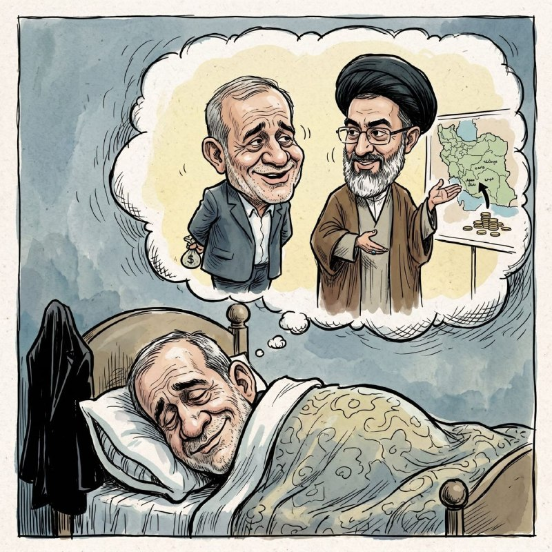

😂😂😂😂😂😂

@IranianMinds

## IranianMinds — post 19830

🔴خانعلی‌زاده کارشناس صداوسیما:

آرایش نیروهای آمریکایی، خبر از یک جنگ بزرگ می‌دهد.

@IranianMinds

## BBCPersian — post 280582

🔻لبنان: یک نفر بر اثر حملات امروز اسرائیل کشته شد

لبنان اعلام کرد که با وجود آتش‌بس با حزب‌الله، در حملات امروز اسرائیل به جنوب این کشور دست‌کم یک نفر کشته شده است.

این حملات پس از صدور هشدار تخلیه برای چندین روستا از سوی ارتش اسرائیل انجام شد.

نیروهای اسرائیلی و حزب‌الله مورد حمایت ایران، از زمان اجرایی شدن توافق آتش‌بس در لبنان در ۱۷ آوریل، تقریباً هر روز و عمدتاً در جنوب لبنان با یکدیگر تبادل آتش داشته‌اند.

ارتش اسرائیل از ساکنان ۹ روستا خواسته بود منطقه را تخلیه کنند و هشدار داده بود که در واکنش به «نقض توافق آتش‌بس» از سوی حزب‌الله، «با قدرت» اقدام خواهد کرد.

خبرگزاری رسمی لبنان گزارش داد که جنگنده‌های اسرائیلی یک شهرک در جنوب و چند منطقه دیگر را که در هشدار تخلیه ذکر شده بودند، هدف قرار دادند.

https://bbc.in/3Pf13yO
@BBCPersian

## BBCPersian — post 280581

  <a href="https://t.me/bbcpersian/280581" target="_blank">📎 Download file</a>

📻این هفته در پرگار: شکل نظام سیاسی، موضوعی فرعی؟

🔻آیا شکل یک نظام سیاسی مهم نیست و آنچه اهمیت دارد مضمون آن است؟ آیا مفهوم مشروطه جواب این سوال را می‌دهد؟

میهمان‌ها:
فرزانه بذرپور، تحلیل‌گر سیاسی
دامون گلریز، تحلیل‌گر سیاسی
 
@BBCPersian

## BBCPersian — post 280580

  <a href="telegram/content/BBCPersian_280580_1778337614.mp4" target="_blank">🎬 Download video</a>

⭕️سرخط خبرها، شنبه ۱۹ اردیبهشت ۱۴۰۵
@BBCPersian

## BBCPersian — post 280579

🔻پوتین در رژه روز پیروزی ناتو را تقبیح کرد

ولادیمیر پوتین، رئیس‌جمهور روسیه، از سخنرانی سالانه خود به مناسبت «روز پیروزی» در میدان سرخ مسکو برای توجیه جنگ در اوکراین و محکوم کردن ناتو استفاده کرد.

رئیس‌جمهور روسیه در حضور صدها پرسنل نظامی و در کنار چند نفر از رهبران جهان، گفت که در حال جنگی «موجه» است؛ او اوکراین را «نیرویی متجاوز» خواند که «از سوی ناتو مسلح و حمایت می‌شود».

«روز پیروزی» یادبود پیروزی اتحاد جماهیر شوروی بر آلمان نازی و بزرگترین تعطیلی سراسری در روسیه است؛ اما امسال جشن‌های این مراسم کم‌سر‌وصداتر از معمول برگزار می‌شود.

https://bbc.in/4d9CJ9q
@BBCPersian

## BBCPersian — post 280578

🔻فرماندار بندرلنگه در گفتگو با تسنیم آمار نقل شده در رسانه‌ها درباره مفقودشدگان حمله به قایق صیادی را رد کرد

فواد مرادزاده، فرماندار بندرلنگه در گفتگویی با خبرگزاری تسنیم آمار نقل شده در رسانه‌ها درباره مفقودشدگان حمله به قایق صیادی را رد کرده است.

او گفته است: «آنچه به نقل از بنده در برخی رسانه‌ها منتشر شده، کذب است و هیچ‌گونه آمار و اطلاعات رسمی و تأییدشده‌ای در خصوص وقوع چنین حمله‌ای از سوی مراجع ذی‌ربط اعلام نشده است.»

فرماندار بندرلنگه گفته است: «آمار و وضعیت شناورها و ملوانان، صرفاً پس از تأیید نهایی و از طریق منابع رسمی استانداری هرمزگان و فرمانداری شهرستان بندرلنگه منتشر خواهد شد.»

ساعاتی پیش، بعضی از رسانه‌ها و منابع خبری در ایران به نقل از او گزارش داده بودند که در جریان حمله آمریکا به شناورهای ایرانی در نزدیکی بندر خصب عمان، «۶ نفر مفقود شده‌اند.»

این حمله پنجشنبه (۱۷ اردیبهشت) رخ داد.

در این گزارش‌ها، تعداد مجروحان ۶ نفر اعلام شده بود.

https://bbc.in/4tsgZfg
@BBCPersian

## BBCPersian — post 280577

🔻بیمه مرکزی ایران: حدود ۳۰ هزار خودرو در حملات آمریکا و اسرائیل آسیب دیده است

بیمه مرکزی ایران می‌گوید که بر اساس آخرین ارزیابی‌اش، حدود ۳۰ هزار خودرو در جنگ اخیر با آمریکا و اسرائیل آسیب دیده است.

موسی رضایی، رئیس کل بیمه مرکزی، روز شنبه با اعلام این آمار گفت که «خسارت‌های زیر ۳۰ میلیون تومان درهفته‌های گذشته پرداخت شده» و ارزیابی خسارت‌های بالاتر نیز «از پیش نهایی شده است.»

به گفته آقای رضایی «منابع مورد نیاز برای پرداخت خسارت خودروهای آسیب‌دیده در جنگ رمضان تأمین شده و حداکثر تا امروز و فردا پرداخت می‌شود تا بیمه ایران بتواند روند پرداخت‌ها را آغاز کند.»

به گزارش رسانه‌های ایران، طبق دستور بیمه مرکزی، خودروهای آسیب دیده فاقد بیمه بدنه هم «با پرداخت اعتبار مورد نیاز به حساب بیمه ایران، به زودی» پرداخت خسارتشان آغاز می‌شود.

https://bbc.in/4djRvdV
@BBCPersian

## BBCPersian — post 280576

🔺نت‌بلاکس: قطع اینترنت ایران وارد یازدهمین هفته شد

نت‌بلاکس که بر وضعیت اینترنت جهان نظارت می کند، می گوید که قطع اینترنت ایران امروز وارد یازدهمین هفته شد.

نت‌بلاکس می گوید خاموشی دیجیتال درایران بیش از ۱۶۸۰ ساعت است که آغاز شده و ایران تا حد زیادی از ارتباط با جهان خارج محروم بوده است.

نت‌بلاکس این اقدام را «سانسور» خوانده و آن را «مانعی بی‌سابقه در برابر دسترسی ایرانیان به دانش، اطلاعات و ارتباطات» توصیف کرده است.

به گفته نت‌بلاکس، دولت جمهوری اسلامی ایران با قطع اینترنت، زندگی روزمره ایرانیان را «با دشواری جدی مواجه ساخته است.»

دولت کنونی ایران به ریاست مسعود پزشکیان که از جمله با شعار بهبود دسترسی به اینترنت و رفع فیلترینگ به قدرت رسید، گفته است که اتصال مجدد اینترنت با مصوبه شورای عالی امنیت خواهد بود.

ایران استفاده از اینترنت ماهواره‌ای از جمله استارلینک را ممنوع و آن را در قوانین خود جرم‌انگاری کرده است.

https://bbc.in/3Pcjsw0
@BBCPersian

## BBCPersian — post 280575

  <a href="telegram/content/BBCPersian_280575_1778337618.mp4" target="_blank">🎬 Download video</a>

🔻‌رژه سالانه «روز پیروزی» صبح شنبه ۹ مه در میدان سرخ مسکو برگزار شد. در این مراسم که به مناسبت هشتاد و یکمین سالگرد پیروزی اتحاد جماهیر شوروی بر آلمان نازی در جنگ جهانی دوم برگزار شد، ولادیمیر پوتین، رئیس‌جمهور روسیه، همراه با شماری از رهبران خارجی حضور داشتند.
   
روسیه همزمان با برگزاری مراسم روز پیروزی خواستار آتش‌بس موقت در جنگ اوکراین شده بود. ولودیمیر زلنسکی، رئیس‌جمهور اوکراین هم به نیروهای مسلح کشورش دستور داده است که حمله‌ای به میدان سرخ مسکو، محل اصلی برگزاری این مراسم، انجام ندهند.
 
دونالد ترامپ، رئیس‌جمهور آمریکا، پیش‌تر گفته بود این آتش‌بس به درخواست او حاصل شده است.
 
حضور سربازان کره شمالی در این مراسم نیز توجه‌ها را جلب کرد. در ماه‌های گذشته گزارش‌هایی درباره مشارکت نظامی کره شمالی در جنگ اوکراین در حمایت از روسیه منتشر شده بود. بر اساس ارزیابی سرویس اطلاعاتی کره جنوبی، بیش از ۱۰ هزار سرباز کره شمالی در مناطق خط مقدم روسیه، از جمله منطقه کورسک، مستقر شده‌اند. مقام‌های آمریکایی هم گزارش‌های مشابهی ارائه کرده‌اند.

https://bbc.in/4nn65pB
@BBCPersian

## BBCPersian — post 280574

🔻اولین جلسه مجلس ایران بعد از دو ماه و سه هفته، اینترنتی برگزار خواهد شد

مجلس ایران برای اولین بار از زمان حمله آمریکا و اسرائیل به ایران، یکشنبه ۲۰ اردیبهشت تشکیل جلسه خواهد داد.

عباس گودرزی، سخنگوی هیئت رئیسه مجلس، اعلام کرد که این جلسه از طریق وبینار (ویدئو کنفرانس) برگزار خواهد شد.

آخرین جلسه علنی مجلس ایران روز ۲۸ بهمن ۱۴۰۴ برگزار شده بود.

جلسه جدید مجلس، پس از ۸۲ روز برگزار خواهد شد.

بنابر اعلام مجلس، موضوع این جلسه «التهابات بازار، نگرانی‌های مردم و گرانی‌های اخیر» خواهد بود.

مجلس شورای اسلامی در آخرین جلسه‌اش به موضوع اصلاح لایحه بودجه سال ۱۴۰۵ پرداخته بود.

علت تاخیر در برگزاری جلسات مجلس «مسائل امنیتی» عنوان شده است.

بنابر گزارش‌ها، با آغاز آتش‌بس در جنگ آمریکا و اسرائیل با ایران، رئیس جمهور ایران و اعضای دولت بعضا جلساتی را به طور حضوری برگزار کردند از جمله نشست مسعود پزشکیان با وزیر صنعت و معدن.

مجلس خبرگان رهبری هم پس از کشته شدن آیت‌الله خامنه‌ای در روز نخست جنگ، جلسه رای‌گیری برای انتخاب رهبر جدید جمهوری اسلامی ایران را به شکل غیابی و از راه دور برگزار کرد.

https://bbc.in/4ngjob8
@BBCPersian

## BBCPersian — post 280573

  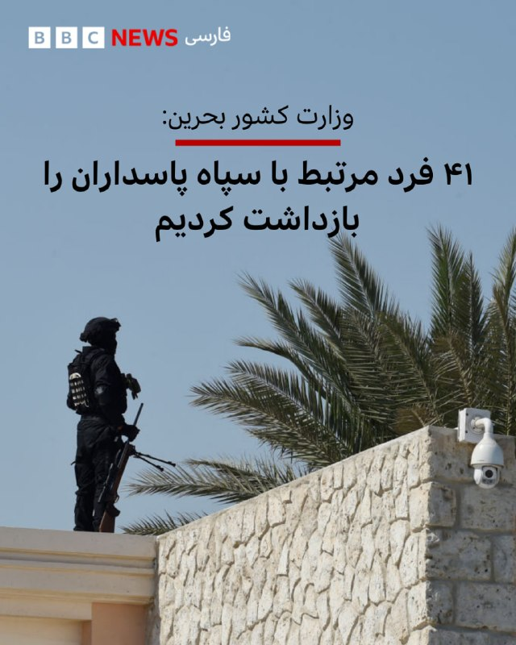

🔺وزارت کشور بحرین می‌گوید که ۴۱ فرد «مرتبط با سپاه پاسداران» را بازداشت کرده است.

خبرگزاری رسمی بحرین از وزارت کشور نقل کرده است که این بازداشت‌ها پس از آن صورت گرفت که مقامات امنیتی از یک گروه مرتبط با سپاه پاسداران پرده برداشتند.

وزارت کشور بحرین گفت که تحقیقات دادستانی همچنین شامل مواردی است که به «همدلی» با حملات ایران مربوط می‌شود.

وزارت کشور بحرین حدود دو هفته پیش هم اعلام کرده بود که تابعیت ۶۹ نفر را به‌دلیل «ستایش یا همدردی با اقدامات خصمانه ایران یا ارتباط با طرف‌های خارجی» لغو کرده است.

ایران بعد از حملات آمریکا و اسرائیل در نهم اسفند سال گذشته، بحرین و شماری دیگر از کشورهای منطقه خلیج فارس را که آمریکا در آنجا پایگاه دارد، هدف حملات پهپادی و موشکی قرار داد.

📸AFP via Getty Images

https://bbc.in/4d0mUTF
@BBCPersian

## Dirty_Kids — post 389167

  <a href="telegram/content/Dirty_Kids_389167_1778337621.mp4" target="_blank">🎬 Download video</a>

ویدئویی که تو این روزهای بی‌نِتی وایرال شده؛

دختره پشت فرمون داره مشروب میخوره و با افتخار فیلم هم می‌گیره! کاش اگه تصادف کردی حداقل فقط خودت آسیب ببینب و به بقیه آسیب نزنی...

اینا همینایی هستن که بی‌حجاب میرن تجمعات عرزشیا

@Dirty_Kids 👻

## Dirty_Kids — post 389166

  <a href="telegram/content/Dirty_Kids_389166_1778337624.mp4" target="_blank">🎬 Download video</a>

ویدیو وایرال شده از پیرسگی ولایی در هنگام فرار از دست مردم

قیافه‌هارو ببینید!! همه عرب فلسطینی لبنانی عراقی افغانین.. پول ما صرف چه چیزایی میشه

@Dirty_Kids 👻

## Dirty_Kids — post 389165

‏یعنی من شک نداشتم اینا مخازن پر بشه سر شیلنگ رو میگیرن سمت خلیج فارس. اونی که ۴۰ هزار معترض رو میکشه مگه از نابود کردن اکولوژی ابایی داره؟

@Dirty_Kids 👻

## Dirty_Kids — post 389164

نت بلاکس فقط میشمره ما چند روزه قطعیم؟
خب یه گوهییی بخور شمردن رو منم بلدم.

@Dirty_Kids 👻

## Dirty_Kids — post 389163

  <a href="telegram/content/Dirty_Kids_389163_1778337626.mp4" target="_blank">🎬 Download video</a>

برای حکومتی‌های بی‌حجاب نوحه ساختن!

«هرکسی که چادریه تاج‌سرمونه و مث خواهرمونه، کم‌حجابیم که اومده میون میدون، نور چشممون و دختر کشورمونه. آخه کی میگه ظاهر آدما ملاکه؟ در اصل ملاک آدمیت دلِ پاکه.»

تو تجمعات شبانه‌شون فعک کنم کافور میدن، چون همینا معتقد بود موی زن تحریک کنندس باعث راست کردن میشود و گناه است

@Dirty_Kids 👻

## Dirty_Kids — post 389162

  <a href="telegram/content/Dirty_Kids_389162_1778337629.mp4" target="_blank">🎬 Download video</a>

توی محور بهبهان-رامهرمز یه پژو پارس با یه پژو ۴۰۵ به این شکل شاخ به شاخ شد و باعث شد ۶ نفر کشته بشن! 🔞

+ رانندگی تو جاده‌های غیراستاندارد ایران تا این حد خطرناکه که حتی ممکنه توی یه جاده خلوت وقتی داری مسیرتو میری یهو یکی باهات شاخ به شاخ شه!

@Dirty_Kids 👻

## Dirty_Kids — post 389161

نفت اگر در دریا ریخته بشه، تمیزکاریش حداقل چند سال طول میکشه و تا ده‌ها سال اثرات زیست محیطیش میمونه

جمهوری اسلامی خطرناکترین ، وحشی‌ترین، و بی‌وجدانترین موجود زنده تاریخه

@Dirty_Kids 👻

## Dirty_Kids — post 389160

  

لیترالی مهمترین سوال بشریت جواب داده شده:

«ما در این دنیا تنها نیستیم»

موجودات غیرزمینی هوشمند در این جهان وجود دارند.
و بارها دیده شدند.

ولی واقعا چرا دنیا باهاش مثل یک خبر عادی برخورد میکنه؟

@Dirty_Kids 👻

## Dirty_Kids — post 389159

مجموعه کامل: تمام ویدئوهای UFO که توسط وزارت جنگ ایالات متحده منتشر شده، در یک ویدئو.

@Dirty_Kids 👻

## Dirty_Kids — post 389158

«تلگرام» در عراق رفع فیلتر شد

سازمان رسانه و ارتباطات عراق از لغو ممنوعیت فعالیت اپلیکیشن تلگرام در سراسر این کشور خبر داد.

@Dirty_Kids 👻

## Hranews — post 112847

  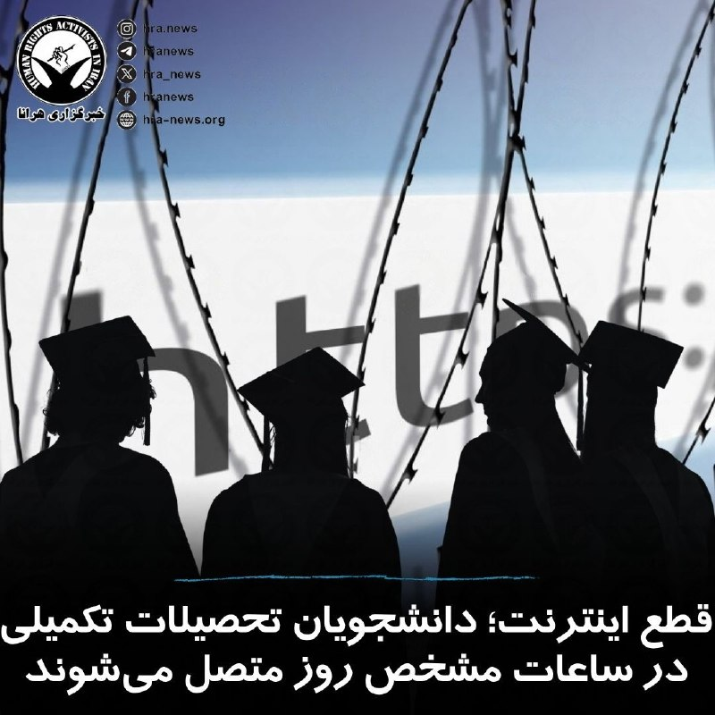

در یازدهمین هفته از قطع اینترنت در ایران، رئیس دانشگاه صنعتی امیرکبیر از «آغاز دسترسی دانشجویان تحصیلات تکمیلی به اینترنت همراه در ساعات مشخص از روز» خبر داده است. عباس سروش همچنین ادعا کرد که در حال حاضر ۹۵٪ اساتید این دانشگاه به اینترنت دسترسی دارند.

↘️
@hranews_bot تماس ✉️ -  @Hranews  کانال هرانا 🆑

## Hranews — post 112846

  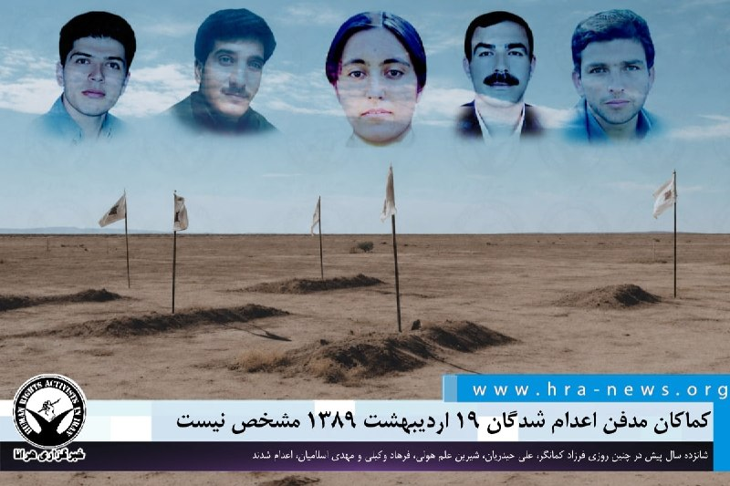

پس از گذشت ۱۶ سال انتظار؛ کماکان مدفن اعدام شدگان ۱۹ اردیبهشت مشخص نیست
 

❗️
❗️
❗️
❗️
❗️ – در تاریخ نوزدهم اردیبهشت ۱۳۸۹، فرزاد کمانگر، معلم و فعال حقوق بشر به همراه چهار زندانی سیاسی دیگر به نام‌های علی حیدریان، شیرین علم هولی، فرهاد وکیلی و مهدی اسلامیان، اعدام شدند. اعدام این شهروندان پس از طی روند پر نقص قضایی، مخفیانه و بدون اطلاع وکیل و خانواده‌ در محوطه‌ی پارکینگ زندان اوین صورت گرفت. پس از گذشت شانزده سال از #اعدام این زندانیان، همچنان از محل دفن آنان اطلاعی به دست نیامده است.
 
به گزارش خبرگزاری هرانا، ارگان خبری مجموعه فعالان حقوق بشر در ایران، شانزده سال پیش در چنین روزی فرزاد کمانگر، علی حیدریان، شیرین علم هولی، فرهاد وکیلی و مهدی اسلامیان، اعدام شدند.
 
صدور و اجرای حکم اعدام فرزاد کمانگر و چهار زندانی دیگر در میان موج بی سابقه اعتراضات داخلی و بین المللی در حالی صورت گرفت که به گواه اسناد موجود، روند حقوقی آنان مملو از موارد مشخص نقض حقوق بود از جمله بازداشت مغایر قانون، نگهداری بلند مدت در سلولهای انفرادی، عدم اجازه دسترسی به وکیل در ایام بازداشت، اعمال شکنجه های جسمی و روحی بر آنان به خصوص در مورد سه تن از آنها در بازداشتگاه های اطلاعات سنندج و کرمانشاه و همینطور موارد متعدد نقض آیین دادرسی، به طوری که حداقل سه متهم (فرزاد کمانگر، فرهاد وکیلی و علی حیدریان) بدون امکان دفاع در یک دادگاه هفت دقیقه‌ای “محارب” شناخته شدند و حکم مرگ برای آنان صادر شد.
 
ادامه مطلب
 
#فرزاد_کمانگر #علی_حیدریان #شیرین_علم_هویی #فرهاد_وکیلی #مهدی_اسلامیان

↘️
@hranews_bot تماس ✉️ -  @Hranews  کانال هرانا 🆑

## Hranews — post 112845

  

اعتماد آنلاین با انتشار گزارشی اعلام کرد، #بحران_دارو در پی #جنگ و تشدید تحریم‌ها ابعاد گسترده‌تری یافته و بازار دارویی کشور با کمبود و افزایش شدید قیمت‌ها روبه‌رو شده است. گزارش‌ها از رشد ۳۰ تا ۳۰۰ درصدی بهای برخی اقلام حکایت دارد؛ در حالی‌که حداقل دستمزد همچنان کمتر از ۱۰۰ دلار برآورد می‌شود و توان خرید شهروندان به‌شدت کاهش یافته است.

در هفته‌های اخیر، کمبود شیرخشک، به‌ویژه انواع تخصصی برای نوزادان دارای شرایط پزشکی خاص، گزارش شده است. همچنین قیمت برخی داروهای حیاتی جهش کم‌سابقه‌ای داشته؛ از جمله دارویی که پیش‌تر با حمایت بیمه کمتر از یک میلیون تومان عرضه می‌شد و اکنون تا ۳۰ میلیون تومان قیمت‌گذاری شده است. داروهای بیماران مبتلا به سرطان، اختلالات تیروئید، بیماری‌های روانی و روماتیسم نیز با افزایش چندبرابری قیمت یا محدودیت عرضه مواجه‌اند. در چنین شرایطی، بیماران و خانواده‌های آنان با فشار فزاینده اقتصادی و دشواری در تامین نیازهای درمانی خود روبه‌رو هستند.

↘️
@hranews_bot تماس ✉️ -  @Hranews  کانال هرانا 🆑

## Hranews — post 112844

  

معاون وزیر ارتباطات از خسارت گسترده ناشی از قطع #اینترنت بر اقتصاد دیجیتال ایران خبر داد. احسان چیت‌ساز اعلام کرد که تنها در پلتفرم‌های بزرگ، زیان ناشی از اختلال و قطع اینترنت به حدود ۵۵ هزار میلیارد تومان رسیده است. به گفته وی، این محدودیت‌ها علاوه بر کاهش درآمد کسب‌وکارهای آنلاین، موجب ایجاد «شوک اقتصادی» در حوزه اقتصاد دیجیتال شده است.

صبح امروز، نت‌بلاکس که محدودیت دسترسی به اینترنت در جهان را رصد می‌کند، اعلام کرد که قطعی و اختلال گسترده اینترنت در ایران وارد یازدهمین هفته خود شده است.

↘️
@hranews_bot تماس ✉️ -  @Hranews  کانال هرانا 🆑

## Hranews — post 112843

گزارشی از بازداشت ۷ شهروند در ساوه
 

❗️
❗️
❗️
❗️
❗️ – فرمانده انتظامی ساوه از بازداشت هفت شهروند در این شهرستان به دلایل آنچه “ارسال اطلاعات و همکاری با رسانه‌های خارج از کشور” عنوان کرده، خبر داد.
 
ادامه مطلب
 
#حمله_نظامی
 
↘️
@hranews_bot تماس ✉️ -  @Hranews  کانال هرانا 🆑

## Hranews — post 112842

  

اعتراضات دی‌‌ماه ۱۴۰۴؛ گزارشی از آخرین وضعیت آبان و حسن موسوی در زندان وکیل آباد
 

❗️
❗️
❗️
❗️
❗️ – آبان (زینب) موسوی و حسن موسوی که در اسفند سال گذشته در رابطه با اعتراضات دی‌‌ماه ۱۴۰۴ بازداشت شدند، اکنون در زندان وکیل آباد مشهد به سر می‌برند. چندی پیش جلسه دادگاه رسیدگی به پرونده این خواهر و برادر، از بابت اتهاماتی از جمله “محاربه”، در دادگاه انقلاب مشهد برگزار شده است.
 
به گزارش خبرگزاری هرانا، ارگان خبری مجموعه فعالان حقوق بشر در ایران، سیده زینب موسوی و برادرش سید حسن موسوی در زندان وکیل آباد مشهد هستند.
 
براساس اطلاعات دریافتی هرانا، جلسه دادگاه رسیدگی به پرونده این شهروندان در تاریخ ۶ اردیبهشت‌ماه امسال برگزار شده است. این خواهر و برادر با اتهاماتی از جمله محاربه مواجه هستند؛ موضوعی که نگرانی خانواده و نزدیکان آنها را نسبت به احتمال صدور احکام سنگین افزایش داده است.
 
ادامه مطلب
 
#آبان_موسوی #زینب_موسوی #حسن_موسوی
 
↘️
@hranews_bot تماس ✉️ -  @Hranews  کانال هرانا 🆑

## manototv — post 105196

  

وزارت خارجه عربستان سعودی در بیانیه‌ای حمایت کامل ریاض را از اقداماتی اعلام کرد که پادشاهی بحرین برای مقابله با آنچه «اقدام‌های صادرشده از سوی ایران» خوانده، اتخاذ کرده است.

در این بیانیه آمده است این اقدام‌ها به گفته مقام‌های سعودی، امنیت ملی بحرین را تحت تاثیر قرار می‌دهد و با هدف بی‌ثبات کردن امنیت و ثبات این کشور انجام می‌شود.

## manototv — post 105195

  <a href="telegram/content/manototv_105195_1778337638.mp4" target="_blank">🎬 Download video</a>

دانمارک؛ «پاینده ایران، جاوید شاه

## manototv — post 105194

  

ویدیویی از معاون جمعیت هلال احمر منتشر شده که در آن می‌گوید در روز نخست حمله آمریکا و اسرائیل به «بیت رهبری»، علی لاریجانی، عباس عراقچی و علی‌اکبر صالحی در محل حضور داشتند. بر پایه این گفتگو آن‌ها زمان حملات در بیت بودن و به صورت «خاک و خلی» مشاهده شده‌اند.

## manototv — post 105193

  

معاون وزیر ارتباطات اعلام کرد برآوردهای اولیه نشان می‌دهد کسب‌وکارهای دیجیتال و تجارت الکترونیک در جریان جنگ و محدودیت‌های اینترنتی اخیر، حدود ۲.۴ همت خسارت دیده‌اند.به گفته چیت‌ساز، در ۴۰ روز گذشته با نهادها و تشکل‌های مختلف برای جمع‌آوری مستندات مربوط به خسارت‌های فیزیکی، کاهش درآمد و تعدیل نیرو مکاتبه شده است. او گفت هنوز آمار دقیقی از میزان خسارت واردشده به فریلنسرها وجود ندارد، چون نهاد مشخصی برای ثبت و جمع‌آوری اطلاعات این بخش تعریف نشده است.معاون وزیر ارتباطات همچنین گفت تماس‌های تلفنی بین‌المللی از ابتدای دوره محدودیت‌ها برقرار بوده و اختلالی در این زمینه گزارش نشده است.

## manototv — post 105192

  <a href="telegram/content/manototv_105192_1778337643.mp4" target="_blank">🎬 Download video</a>

«تجمع ایرانیان در دانمارک»

## manototv — post 105191

  

علیرضا منادی سفیدان، رئیس کمیسیون آموزش مجلس شورای اسلامی اعلام کرده به «آسیب‌دیدگان جدی جنگ» سهمیه کنکور تعلق می‌گیرد.

## manototv — post 105190

  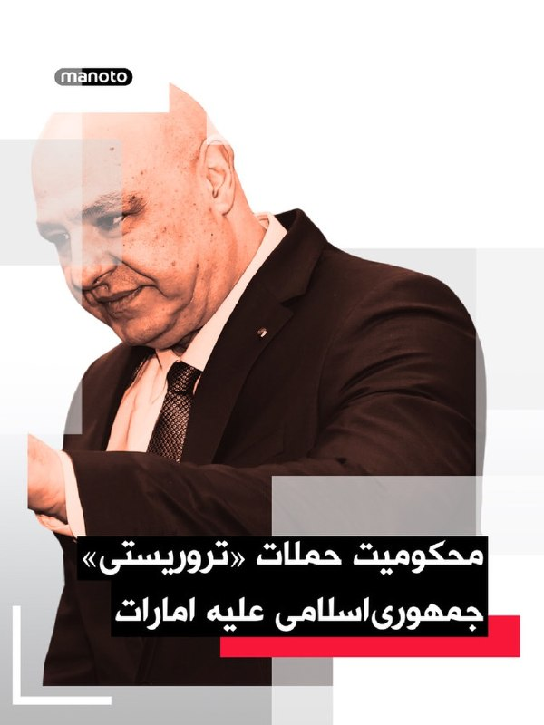

وام، خبرگزاری رسمی امارات متحده عربی گزارش داد محمد بن زاید آل نهیان، رئیس امارات متحده عربی، در تماس تلفنی با ژوزف عون، رئیس‌جمهوری لبنان، گفت‌وگو کرد.در این تماس، عون بار دیگر حملات «تروریستی» جمهوری‌اسلامی علیه غیرنظامیان و تأسیسات غیرنظامی در امارات را محکوم کرد و بر همبستگی لبنان با امارات و حمایت از تمامی اقدام‌های این کشور برای حفظ امنیت، حاکمیت و سلامت سرزمین و شهروندانش تأکید کرد.

## manototv — post 105189

  

ناوشکن «اچ‌ام‌اس دراگون» پیش از احتمال مشارکت در مأموریتی برای حفاظت از کشتیرانی در تنگه هرمز، از شرق مدیترانه به سمت خاورمیانه اعزام می‌شود.وزارت دفاع بریتانیا اعلام کرد این تصمیم باعث می‌شود کشتی در صورت نیاز فوراً در یک مأموریت دفاعی چندملیتی برای تضمین آزادی ناوبری در تنگه هرمز مشارکت کند.به گفته این وزارتخانه، هرگونه مأموریت احتمالی ماهیتی کاملاً دفاعی خواهد داشت و هدف آن بازگرداندن اعتماد به کشتیرانی تجاری است.ناوشکن تایپ ۴۵ «اچ‌ام‌اس دراگون» در ماه مارس برای حفاظت از پایگاه‌های هوایی بریتانیا در قبرس اعزام شده بود، اما کمتر از یک ماه پس از ترک پورتسموث برای تعمیرات پهلو گرفت.

## manototv — post 105188

  <a href="telegram/content/manototv_105188_1778337648.mp4" target="_blank">🎬 Download video</a>

گزارشگرمنوتو: «امروز شنبه ۹ می، ما ایرانیان و حامیان آزادی در بریزبن استرالیا بار دیگر به خیابان آمدیم تا نگذاریم صدای مردم ایران و محکومان به اعدام خاموش شود.

نام و تصاویر زندانیان محکوم به اعدام را در دست گرفتیم؛ جوانانی که تنها به جرم خواستن آزادی، با خطر مرگ روبه‌رو هستند.

امروز فریاد زدیم که اجازه نمی‌دهیم درد مردم ایران در سکوت جهان فراموش شود.»

## manototv — post 105187

  

برای نخستین بار، نیروهای کره شمالی در رژه «روز پیروزی» روسیه در میدان سرخ مسکو شرکت کردند؛ حضوری که نشانه گسترش همکاری نظامی میان مسکو و پیونگ‌یانگ توصیف شده است.حضور نظامیان کره شمالی در رژه امسال، همزمان با کاهش نمایش تجهیزات سنگین روسیه، توجه زیادی را جلب کرد. رژه «روز پیروزی» روسیه امسال برخلاف سال‌های گذشته با حضور محدود تانک‌ها و تجهیزات سنگین برگزار شد؛ موضوعی که به گفته تحلیلگران، هم به‌دلیل درگیر بودن بخش بزرگی از تجهیزات روسیه در جنگ اوکراین و هم نگرانی از حملات پهپادی کی‌یف بوده است.با این حال، برای نخستین بار نیروهای کره شمالی در میدان سرخ رژه رفتند؛ حضوری که نشانه نزدیکی بیشتر نظامی میان مسکو و پیونگ‌یانگ تلقی می‌شود. مقام‌های اوکراین و کره جنوبی می‌گویند کره شمالی هزاران نیرو برای حمایت از روسیه به جنگ اوکراین فرستاده است.

## manototv — post 105186

  

نیویورک تایمز در گزارشی به این موضوع پرداخته که دریای خزر به مسیر حیاتی همکاری جمهوری‌اسلامی و روسیه تبدیل شده؛ مسیری که هم برای دور زدن تحریم‌ها و هم انتقال تجهیزات نظامی استفاده می‌شود.
مقامات آمریکایی می‌گویند روسیه از طریق خزر قطعات پهپاد به جمهوری‌اسلامی ارسال می‌کند تا تهران پس از آسیب‌های جنگ اخیر، توان پهپادی خود را بازسازی کند. به گفته منابع نیویورک تایمز، جمهوری‌اسلامی در درگیری‌های اخیر حدود ۶۰ درصد از زرادخانه پهپادی خود را از دست داده است. این همکاری نظامی دوطرفه است؛ تهران پیش‌تر پهپادهای «شاهد» را برای استفاده در جنگ اوکراین در اختیار روسیه قرار داده بود و مسکو هم اکنون قطعات و تجهیزات موردنیاز تولید یا بازسازی این پهپادها را به ایران می‌فرستد. گزارش‌ها حاکی‌ست بخش زیادی از این انتقال‌ها از طریق دریای خزر انجام می‌شود؛ مسیری که به‌دلیل محدود بودن دسترسی کشورهای خارجی و خاموش شدن سیستم ردیابی برخی کشتی‌ها، نظارت بر آن دشوار است. مقام‌های غربی می‌گویند این مسیر به یکی از مهم‌ترین کانال‌های انتقال مخفیانه تجهیزات نظامی میان تهران و مسکو تبدیل شده است.

همزمان، جمهوری‌اسلامی بخشی از واردات کالاهای اساسی مثل گندم و خوراک دام را به‌دلیل بحران تنگه هرمز از مسیر خزر انجام می‌دهد.

## manototv — post 105185

  <a href="telegram/content/manototv_105185_1778337652.mp4" target="_blank">🎬 Download video</a>

تجمع اعتراضی ایرانیان مقابل دانشگاه اراسموس روتردام در هلند همزمان با سخنرانی رابرت مالی در ارتباط با مسائل خاورمیانه و ایران.

## manototv — post 105184

  

وزیر راه جمهوری اسلامی در افتتاح قطعه‌ای از «آزادراه حرم تا حرم» در سمنان اعلام کرده « آزادراه حرم‌ تا حرم، به‌عنوان بخشی از کریدور سرخس تا مهران» به نام رهبر کشته‌شده جمهوری اسلامی علی خامنه‌ای نامگذاری خواهد شد.

## manototv — post 105183

  

داده‌های گمرک چین نشان می‌دهد واردات نفت خام این کشور در آوریل ۲۰ درصد کاهش یافته و به پایین‌ترین سطح از ژوئیه ۲۰۲۲ رسیده است.چین حدود نیمی از نفت خود را از خاورمیانه تأمین می‌کند و بسته شدن تنگه باعث کاهش شدید نفتکش‌ها شده است. واردات دریایی نفت خام نیز طبق داده‌های شرکت «کپلر» به کمترین میزان از ژوئیه ۲۰۲۲ رسیده است.واردات گاز طبیعی چین هم ۱۳ درصد کاهش یافت، هرچند آمار رسمی تفاوتی میان واردات دریایی و خط لوله‌ای قائل نشده است. با این حال، مجموع واردات نفت خام چین در چهار ماه نخست سال هنوز ۱.۳ درصد بیشتر از سال گذشته است.

## alonews — post 118894

  <a href="telegram/content/alonews_118894_1778337656.mp4" target="_blank">🎬 Download video</a>

یک روحانی:اگه تو بهشت زمین بخواهید باید هرمتر ۱۷۰۰دلار بدید بیاد

[@AloTweet]

## alonews — post 118893

  <a href="telegram/content/alonews_118893_1778337658.webm" target="_blank">🎬 Download video</a>

👈نشریه نشنال امارات: انتظار می‌رود روز دوشنبه (به صورت احتمالی)، شورای امنیت سازمان ملل به پیش‌نویس قطعنامه تغییر یافته آمریکا و شورای همکاری خلیج فارس درباره تنگه هرمز رأی دهد

🔴در پیش‌نویس جدید: فصل هفتم (اقدام نظامی) حذف شده است.

🔴 سطح اجرا به امکان بررسی تحریم‌ها در آینده کاهش یافته است.

🔴عبارت‌هایی درباره گفتگو، کاهش تنش و «صلح پایدار» اضافه شده است.

🔴خواسته‌های اصلی از ایران از جمله پایان حملات، پاک‌سازی مین و توقف اخذ عوارض، تا حد زیادی بدون تغییر باقی مانده است

✅ @AloNews خبر جنگ

## alonews — post 118892

  <a href="telegram/content/alonews_118892_1778337659.webm" target="_blank">🎬 Download video</a>

👈اکونومیست : روسیه می‌خواد 5000 پهپاد برای حمله به نیروهای آمریکا به ایران بده که با جنگ الکترونیک هم نمی‌شه جلوشون وایساد

✅ @AloNews خبر جنگ

## alonews — post 118891

  <a href="telegram/content/alonews_118891_1778337659.webm" target="_blank">🎬 Download video</a>

👈یک منبع دیپلماتیک ایرانی به الجزیره عربی گفت که تصاویر مربوط به بازدید رئیس جمهور مصر و رئیس امارات از نیروهای نظامی در امارات، اطلاعات جدیدی برای تهران محسوب نمی‌شود و اشاره کرد که ایران از حمایت مصر از کشورهای حاشیه خلیج فارس آگاه است و ماهیت روابط قاهره با شرکای عرب خود را درک می‌کند.

🔴این منبع ایرانی گفت که نگرانی ایران معطوف به حمایت از آمریکا و اسرائیل در جنگ علیه تهران است و تأکید کرد که ایران، مصر را به دنبال رویارویی یا ارائه هرگونه حمایت برای حمله به ایران نمی‌بیند و بنابراین مصر را طرفدار چنین اقداماتی محسوب نمی‌کند.

🔴لازم به ذکر است که اخیرا یک اسکادران از جنگنده‌های رافال نیروی هوایی مصر در امارات متحده عربی مستقر شد.

✅ @AloNews خبر جنگ

## alonews — post 118890

  <a href="telegram/content/alonews_118890_1778337659.webm" target="_blank">🎬 Download video</a>

👈خسارت قطع اینترنت تاکنون

511,200,000,000,000تومان

🔴اما این حجم خسارت برای مسئولان جزو بیت المال نیست ولی شکستن شیشه خودرو بیت المال است

✅ @AloNews خبر جنگ

## alonews — post 118889

  <a href="telegram/content/alonews_118889_1778337660.webm" target="_blank">🎬 Download video</a>

👈نیویورک‌تایمز: پهپادهای ایران، حضور‌گستردهٔ آمریکا در غرب آسیا را به نقطه‌ضعف تبدیل کرده‌اند

✅ @AloNews خبر جنگ

## alonews — post 118888

  <a href="telegram/content/alonews_118888_1778337660.webm" target="_blank">🎬 Download video</a>

👈احتمال شنیدن صدای انفجارهای کنترل‌شده مهمات در بندرعباس

✅ @AloNews خبر جنگ

## alonews — post 118887

  <a href="telegram/content/alonews_118887_1778337660.webm" target="_blank">🎬 Download video</a>

👈سخنگوی وزارت دفاع بریتانیا: ما یک ناو جنگی بریتانیا به خاورمیانه اعزام می‌شود تا برای پیوستن به مأموریتی بین‌المللی برای رفع انسداد تنگه هرمز آماده باشد.

🔴این سخنگو افزود: «ما میتوانیم تأیید کنیم که اچاماس دراگون به خاورمیانه اعزام خواهد شد تا پیش از هر مأموریت چندملیتی آینده، در موقعیتی مستقر شود که از کشتیرانی بین‌المللی محافظت کند، زمانی که شرایط به کشتیها اجازه عبور از تنگه هرمز را بدهد.»

🔴 «استقرار پیشگیرانه اچاماس دراگون بخشی از برنامه‌ریزی محتاطانه‌ای است که تضمین میکند بریتانیا، به عنوان بخشی از ائتلاف چندملیتی تحت رهبری مشترک بریتانیا و فرانسه، آماده تأمین امنیت تنگه باشد، آن‌گاه که شرایط اجازه دهد.»

✅ @AloNews خبر جنگ

## alonews — post 118886

  <a href="telegram/content/alonews_118886_1778337660.webm" target="_blank">🎬 Download video</a>

👈گفتگوی مقامات ارشد قطر و مصر درباره آتش‌بس ایران

✅ @AloNews خبر جنگ

## alonews — post 118885

  <a href="telegram/content/alonews_118885_1778337661.webm" target="_blank">🎬 Download video</a>

👈رئیس کمیسیون امنیت ملی مجلس، ابراهیم عزیزی : به دولت‌هایی مثل بحرین هشدار میدیم که طرف قطعنامه‌ای که آمریکا هلش میده نرن

🔴وگرنه تاوان سنگینی داره،تنگه هرمز شاهرگ دنیاست، کاری نکنین خودتون باعث بسته شدنش بشین

✅ @AloNews خبر جنگ

## alonews — post 118884

  <a href="telegram/content/alonews_118884_1778337661.webm" target="_blank">🎬 Download video</a>

👈مینو محرز متخصص بیماری‌های عفونی:
ویروس «هانتا» که شایع شده مرگباره ولی در ایران هنوز موردی گزارش نشده.
ویروس هانتا مثل کووید نیست که فوری جهانگیر بشه و مردم نگران باشن چرا که سرایت انسان به انسان در این ویروس خیلی نادره.
معمولا بخاطر تماس با جوندگان مثل فضله جوندگان بهش مبتلا میشن.
این بیماری میتونه سخت و کشنده باشه و درصورت ابتلا درصد مرگ بسیار زیاده.
علایم این بیماری مثل آنفولانزاست و شامل تب؛ سرفه و بدن درده.

✅ @AloNews خبر جنگ

## alonews — post 118883

  <a href="telegram/content/alonews_118883_1778337661.webm" target="_blank">🎬 Download video</a>

👈آغاز تست خدمات اینترنت 5G در کابل افغانستان...

✅ @AloNews خبر جنگ

## alonews — post 118881

  <a href="telegram/content/alonews_118881_1778337662.webm" target="_blank">🎬 Download video</a>

👈وال استریت ژورنال: بیش از ۲۰ هزار ملوان در صدها کشتی در تنگه هرمز گیر افتاده‌اند و بسیاری از کشتی‌ها با کمبود شدید غذا، آب، سوخت و دارو روبه‌رو شده‌اند.

🔴گفته می‌شود بیش از ۸۰۰ کشتی منتظر خروج هستند.

🔴از زمان آغاز بحران، دست‌کم ۱۰ ملوان کشته شده‌اند و بیش از ۳۰ کشتی هدف پهپادها یا موشک‌های ایرانی قرار گرفته‌اند.

🔴خدمه کشتی‌ها گفته‌اند دائماً در ترس از حملات موشکی، پهپادی، مین‌های دریایی و گشت‌های دریایی ایران زندگی می‌کنند؛ در حالی که هزینه بیمه هم به‌شدت افزایش یافته و کمبود تجهیزات بدتر شده است.

🔴برخی کشتی‌ها برای جلوگیری از درگیری:

ردیاب‌های خود را خاموش کرده‌اند
پرچم کشورشان را تغییر داده‌اند
یا خود را «چینی» معرفی کرده‌اند
تا شاید بتوانند از تنش‌ها دور بمانند و منتظر بازگشایی مسیر بمانند.

✅ @AloNews خبر جنگ

## alonews — post 118880

  <a href="telegram/content/alonews_118880_1778337662.webm" target="_blank">🎬 Download video</a>

👈طبقاتی شدن اینترنت با سرعت ادامه دارد

🔴اطلاعیه دانشگاه امیرکبیر: دسترسی دانشجویان تحصیلات تکمیلی به اینترنت همراه را از هفته گذشته آغاز کردیم تا این افراد بتوانند در ساعات مشخصی از روز به آن دسترسی داشته باشند.

✅ @AloNews خبر جنگ

## alonews — post 118879

  <a href="telegram/content/alonews_118879_1778337662.webm" target="_blank">🎬 Download video</a>

👈عارف،معاون اول دولت: درست میشه

✅ @AloNews خبر جنگ

## alonews — post 118878

  <a href="telegram/content/alonews_118878_1778337663.mp4" target="_blank">🎬 Download video</a>

👈رئیس کمیسیون آموزش مجلس: به آسیب‌دیدگان جنگ سهمیهٔ کنکور تعلق می‌گیرد تا مثل ما دکتر شوند

✅ @AloNews خبر جنگ

## alonews — post 118877

  <a href="telegram/content/alonews_118877_1778337665.webm" target="_blank">🎬 Download video</a>

👈ترامپ مقاله‌ای یک ماهه را منتشر کرد که ادعا می‌کند بیشتر آمریکایی‌ها معتقدند جلوگیری از دستیابی ایران به سلاح هسته‌ای مهم‌تر از پایان دادن به جنگ است، با عنوان «بسیار مهم. این موضع کشور ما است.»

✅ @AloNews خبر جنگ

## alonews — post 118876

  <a href="telegram/content/alonews_118876_1778337665.webm" target="_blank">🎬 Download video</a>

👈تاج: برای حضور در جام جهانی ۱۰ شرط برای فیفا گذاشتیم اگه قبول کنن میریم

✅ @AloNews خبر جنگ

## alonews — post 118875

  <a href="telegram/content/alonews_118875_1778337666.webm" target="_blank">🎬 Download video</a>

👈یک هواپیمای آمریکایی E-11 با قابلیت اتصال الکترونیکی از عربستان سعودی به سمت عراق پرواز کرد

✅ @AloNews خبر جنگ

## alonews — post 118874

  <a href="telegram/content/alonews_118874_1778337666.mp4" target="_blank">🎬 Download video</a>

👈یه زن حاضر در تجمعات حکومتی: خواب آقا رو دیدم، باحجاب شدم

✅ @AloNews خبر جنگ

<!-- MSG END -->

<!-- NAV START -->

<a href="https://github.com/babi2323/aio-downloader/blob/main/telegram/content/archive_1.md" style="display:inline-block; padding:6px 12px; margin:0 4px; background-color:#2ea44f; color:white; text-decoration:none; border-radius:4px; font-weight:bold;">صفحه بعد</a>

<!-- NAV END -->
