# خواننده تلگرام

<!-- TOP_NAV START -->

<a href="https://github.com/babi2323/aio-downloader/blob/main/telegram/content/archive_1.md" style="display:inline-block; padding:6px 12px; margin:0 4px; background-color:#2ea44f; color:white; text-decoration:none; border-radius:4px; font-weight:bold;">صفحه بعد</a>

<!-- TOP_NAV END -->

<!-- MSG START -->

---
📅 بروزرسانی: 1405/03/02 01:24
---

## VahidOOnLine — post 241609

  <a href="telegram/content/VahidOOnLine_241609_1779486877.mp4" target="_blank">🎬 Download video</a>

⭕️«صبحانه زنان»؛ بنیاد زنان نیویورک ۱۵۰۰ زن تاثیرگذار را در نیویورک گرد هم آورد

📌یکی از نمادهای مشهور این مراسم اهدای جایزه «عصای راه‌پیمایی» است؛ تندیسی نمادین که مفاهیمی چون قدرت، خرد و حرکت روبه‌جلو را نمایندگی می‌کند

♦️برگزارکنندگان این مراسم تاکید کردند این بنیاد طی سال‌ها توانسته است زنان آمریکایی را، فارغ از وابستگی‌های حزبی و تفاوت‌های سیاسی، کنار یکدیگر گرد آورد و از طریق فعالیت‌های مدنی، آموزشی و اقتصادی، بر جامعه آمریکا تاثیر بگذارد.

یکی از نمادهای این مراسم «عصای راه‌پیمایی» (Walking Stick Award) است؛ هدیه‌ای نمادین و دست‌ساز که با الهام از هنرهای بومی، مختص به هر فرد ساخته و تزیین و به زنان تاثیرگذار، فعالان اجتماعی و رهبران مدنی اهدا می‌شود و مفاهیمی چون قدرت، خرد و حرکت روبه‌جلو را نمایندگی می‌کند.
ایده ساخت و اهدای این عصای تزیین‌شده که گوناگونی و جمعیت رنگارنگ آمریکا را به تصویر می‌کشد، یکی از سازمان‌های تحت‌حمایت بنیاد که در حوزه توانمند سازی زنان فعالیت می‌کند، مطرح و اجرا کرد.

بیشتر بخوانید...
‌🇸🇦 Indypersian

🤖 @VahidOOnLine

## VahidOOnLine — post 241608

  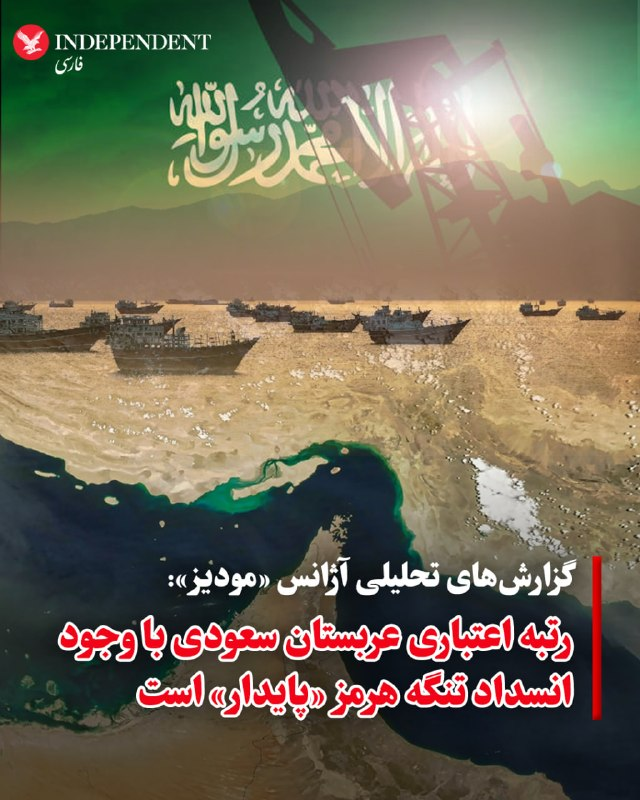

♦️بر اساس گزارش‌های تحلیلی آژانس رتبه‌بندی مودیز (Moody's)، رتبه اعتباری بلندمدت عربستان سعودی با وجود انسداد تنگه هرمز، همچنان «پایدار» است. مودیز در گزارش روز جمعه خود اعلام کرد که این تصمیم بازتاب‌دهنده اقتصاد بزرگ، ثروتمند و جایگاه رقابتی بالا و هزینه پایین تولید هیدروکربن در این کشور، در کنار بهبود اثربخشی سیاست‌ها و پیشرفت در چارچوب چشم‌انداز ۲۰۳۰ است. این آژانس تایید کرد که رشد بخش خصوصی غیرنفتی عربستان سعودی با نرخ پیش‌بینی‌شده ۴ تا ۵ درصد پس از فروکش کردن تنش‌ها، از قوی‌ترین‌ها در میان کشورهای شورای همکاری خلیج فارس خواهد بود. اگرچه اقتصاد پادشاهی سعودی به دلیل درگیری‌های جاری در خاورمیانه و انسداد عملی تنگه هرمز از اوایل ماه مارس، با کاهش ۱۰ درصدی تولید هیدروکربن و انقباض ۱.۷ درصدی کلِ جی‌دی‌پی (GDP) در سال ۲۰۲۶ مواجه است، اما مودیز پیش‌بینی می‌کند که در سال ۲۰۲۷ و با عادی‌سازی جریان تجارت، رشد اقتصادی عربستان سعودی جهش چشمگیر ۸ درصدی را تجربه کند.
طبق تحلیل سناریوی مرکزی این آژانس رتبه‌بندی، ساختار اعتباری عربستان سعودی در برابر اختلالات طولانی‌مدت و انسداد تنگه هرمز تا پایان سال ۲۰۲۶ تاب‌آور خواهد بود. این ثبات و انعطاف‌پذیری به دلیل توانایی ریاض در تغییر مسیر بخش عمده‌ای از صادرات نفت خود از طریق خط لوله شرق به غرب به سمت پایانه‌های دریای سرخ است؛ به‌طوری‌که این بنادر اکنون قادر به بارگیری تا ۵ میلیون بشکه در روز معادل نفت (دو‌سوم سطوح پیش از نزاع منطقه) هستند. علاوه بر این، جهش قیمت نفت به محدوده ۹۰ تا ۱۱۰ دلار در هر بشکه در سال ۲۰۲۶ و وجود دارایی‌های مالی قدرتمند دولت (معادل ۱۸ درصد جی‌دی‌پی در سال ۲۰۲۵)، ظرفیت بالایی را برای جذب نوسانات ایجاد کرده و درآمدها را فراتر از پیش‌بینی‌های قبل از جنگ برده است.
‌🇸🇦 Indypersian

🤖 @VahidOOnLine

## VahidOOnLine — post 241607

  

ترامپ در یک سخنرانی در سوفرن نیویورک گفت: «با عملیات خشم حماسی، رزمندگان ما اطمینان حاصل خواهند کرد که جمهوری اسلامی به عنوان بزرگ‌ترین حامی «تروریسم» دولتی در جهان، هرگز به سلاح هسته‌ای دست نخواهد یافت و خودشان هم این را می‌دانند.»
ترامپ گفت: حکومت ایران به عنوان بزرگ‌ترین حامی تروریسم دولتی، به سراسر جهان پول می‌فرستد تا مشکل ایجاد کند.

‌🏁 🇬🇧 IranintlTV

🤖 @VahidOOnLine

## VahidOOnLine — post 241606

  

خبرگزاری تسنیم، وابسته به سپاه پاسداران، به نقل از یک منبع نظامی گزارش داد نیروهای مسلح جمهوری اسلامی «به‌طور کامل» تحولات را زیر نظر دارند و در صورت آنچه «حماقت دشمن» و هرگونه بهانه‌جویی از سوی آمریکا و متحدانش خوانده شده، سناریوهای تازه‌ای آماده کرده‌اند.

به گفته این منبع، در صورت اقدام نظامی احتمالی آمریکا، «نسخه سوم مبارزه جمهوری اسلامی» اجرا خواهد شد؛ نسخه‌ای که به ادعای او در حوزه تجهیزات جدید، اهداف نوین، تاکتیک‌ها و راهبردهای جنگی نمود خواهد داشت و حتی می‌تواند جبهه‌های جدیدی در سطح فرامنطقه‌ای ایجاد کند.

این منبع نظامی همچنین مدعی شد آمریکا در صورت «زیاده‌خواهی و اقدام نظامی»، «تنبیه بزرگ سوم» را در کمتر از یک سال تجربه خواهد کرد؛ تنبیهی که به گفته او «به شکلی خاص‌تر و جدیدتر» خواهد بود.
‌🏁 🇬🇧 IranintlTV

🤖 @VahidOOnLine

## VahidOOnLine — post 241605

  

♦️تسنیم، خبرگزاری وابسته به سپاه پاسداران، روز جمعه به نقل از «یک منبع نظامی» نوشت: «نیروهای مسلح جمهوری اسلامی کاملا اوضاع را زیر نظر دارند و در صورت حماقت دشمن با هرگونه بهانه جویی، سناریوهای تازه‌ای برای آمریکا و متحدانش آماده کرده‌اند. این منبع نظامی در گفتگو با تسنیم ضمن اشاره به اینکه اگر دشمن حماقت کند، «نسخه سوم مبارزه ایران» را مشاهده خواهد کرد مدعی شد: «این نسخه سوم هم در حوزه تجهیزات جدید و هم در حوزه اهداف نوین و نیز در حوزه تاکتیک‌ها و استراتژی جنگ نمایان خواهد شد. به نحوی که جبهه‌های جدید فرامنطقه‌ای نیز آنها را پشیمان‌تر خواهد کرد. آمریکا در صورت زیاده‌خواهی و بهانه‌جویی و اقدام نظامی احتمالی، تنبیه بزرگ سوم خود را در کمتر از یکسال تجربه خواهد کرد؛ این بار به شکل خاص‌تر و جدیدتر».
‌🇸🇦 Indypersian

🤖 @VahidOOnLine

## VahidOOnLine — post 241604

  

♦️فرماندهی مرکزی آمریکا، سنتکام، با انتشار تصاویری از یک  هلیکوپتر «یو‌اچ-۱‌وای ونوم» (UH-1Y Venom) متعلق به نیروی دریایی آمریکا، جزئیاتی از عملیات‌های اخیر در چارچوب محاصره بنادر جمهوری اسلامی را به نمایش گذاشت.
سنتکام اعلام کرد این هلیکوپتر در جریان عملیات محاصره دریایی علیه بنادر جمهوری اسلامی به کار گرفته شده و توانایی اجرای ماموریت‌های مختلف از جمله رهگیری دریایی، شناسایی و پشتیبانی نزدیک رزمی را دارد.
‌🇸🇦 Indypersian

🤖 @VahidOOnLine

## VahidOOnLine — post 241603

  <a href="telegram/content/VahidOOnLine_241603_1779486885.mp4" target="_blank">🎬 Download video</a>

یک شهروند در پیامی صوتی به ایران اینترنشنال از فشار شدید در ایران و بلاتکلیفی و استرس به دلیل اظهارات دونالد ترامپ درباره امکان پایان جنگ و آتش‌بس می‌گوید. صدای او برای حفظ امنیتش با هوش مصنوعی بازخوانی شده است.
‌🏁 🇬🇧 IranintlTV

🤖 @VahidOOnLine

## VahidOOnLine — post 241602

  

♦️به گزارش اکسیوس، دونالد ترامپ، رئیس‌جمهوری آمریکا، روز جمعه با تیم ارشد امنیت ملی خود در کاخ سفید دیدار کرد تا سناریوهای مختلف در صورت شکست مذاکرات و احتمال آغاز حملات جدید علیه ایران را بررسی کند. در این نشست حساس که با حضور مقامات کلیدی از جمله جِی‌دی ونس، معاون رئیس‌جمهوری، پیت هگست، وزیر جنگ و جان راتکلیف، رئیس سی‌آی‌ای، برگزار شد، ترامپ در جریان آخرین وضعیت دیپلماسی قرار گرفت. نشانه‌های جدی از تغییر برنامه آخر هفته رئیس‌جمهوری، از جمله لغو سفر به باشگاه گلف بدمینستر، بازگشت به واشنگتن و حتی عدم شرکت در مراسم عروسی پسرش، دونالد ترامپ جوان، نشان‌دهنده وضعیت اضطراری در کاخ سفید است. منابع نزدیک به ترامپ می‌گویند او از روند کند مذاکرات ناامید شده و به سمت گزینه نظامی متمایل شده است، هرچند هنوز تصمیم قطعی برای از سرگیری جنگ اتخاذ نشده است.
در همین حال، تهران به کانون تلاش‌های دیپلماتیک «لحظه آخری» برای جلوگیری از شعله‌ور شدن دوباره جنگ تبدیل شده است. عاصم منیر، فرمانده کل ارتش پاکستان، به عنوان میانجی اصلی، در سفری حساس وارد تهران شده و قرار است با احمد وحیدی، از فرماندهان کلیدی سپاه پاسداران دیدار کند. هم‌زمان، یک هیئت قطری نیز برای پشتیبانی از این میانجی‌گری وارد پایتخت ایران شده است. با این حال، یک مقام آمریکایی روند تبادل پیش‌نویس‌ها میان طرفین را «زجرآور» و بدون پیشرفت ملموس توصیف کرده است؛ امری که نشان می‌دهد شکاف‌های موجود میان دو طرف چقدر عمیق است.
در طرف مقابل، وزارت امور خارجه ایران و رسانه‌های نزدیک به سپاه پاسداران تایید کرده‌اند که گفتگوها در جریان است اما هنوز هیچ نتیجه نهایی حاصل نشده و توافق نزدیکی در کار نیست. مقامات ایرانی تاکید دارند که تمرکز فعلی مذاکرات صرفا بر «پایان دادن به جنگ» است و تا زمانی که این هدف محقق نشود، درباره هیچ موضوع دیگری گفتگو نخواهد شد. ناظران معتقدند با وجود اینکه ترامپ در هفته‌های گذشته چندین بار تا آستانه از سرگیری جنگ پیش رفته و عقب‌نشینی کرده، اما ساعات پیش رو و احتمال رخ دادن یک گشایش ناگهانی در ۲۴ ساعت آینده، تعیین‌کننده مسیر نهایی (جنگ یا دیپلماسی) خواهد بود.
‌🇸🇦 Indypersian

🤖 @VahidOOnLine

## VahidOOnLine — post 241601

  

دونالد ترامپ، رییس جمهوری ایالات متحده، در سخنرانی خود در نیویورک درباره جنگ ایران اعلام کرد: «این ماجرا به‌زودی پایان خواهد یافت.»

او همچنین گفت که ما جمهوری اسلامی را متوقف کرده‌ایم؛ آن‌ها هرگز به سلاح هسته‌ای دست نخواهند یافت.
‌🏁 🇬🇧 IranintlTV

🤖 @VahidOOnLine

## VahidOOnLine — post 241600

  

اکسیوس به نقل از دو مقام آمریکایی اعلام کرد که ترامپ صبح جمعه نشستی با اعضای ارشد تیم امنیت ملی خود درباره جنگ ایران برگزار کرد.
اکسیوس نوشت به گفته منابعی که مستقیما با ترامپ گفت‌وگو کردند، او در حال بررسی حملات جدید است، مگر اینکه پیشرفتی در مذاکرات در آخرین لحظه حاصل شود.
‌🏁 🇬🇧 IranintlTV

🤖 @VahidOOnLine

## VahidOOnLine — post 241599

  

♦️دونالد ترامپ روز جمعه، اول خردادماه، طی سخنرانی در نیویورک درباره جنگ با ایران گفت که «این ماجرا به‌زودی تمام خواهد شد». رئیس‌جمهوری آمریکا گفت: «اگر جلوی ایران را نگیریم، آنها به سلاح هسته‌ای دست پیدا می‌کنند. مجبوریم این کار را بکنیم، و ما جلوی آنها را گرفتیم. آنها هرگز به سلاح هسته‌ای دست پیدا نخواهند کرد».
‌🇸🇦 Indypersian

🤖 @VahidOOnLine

## VahidOOnLine — post 241598

  

آسوشیتدپرس به نقل از یک مقام آمریکایی اعلام کرد ارتش آمریکا تاکنون هیچ مین انفجاری در تنگه هرمز کشف یا خنثی نکرده است.
این مقام آمریکایی افزود عملیات جست‌وجو در این گذرگاه حیاتی نفتی همچنان ادامه دارد، اما تاکنون هیچ مین دریایی پیدا نشده است.

این در حالی است که محاصره دریایی بنادر جنوب ایران همچنان ادامه دارد.
‌🏁 🇬🇧 IranintlTV

🤖 @VahidOOnLine

## VahidOOnLine — post 241597

♦️ویدیوی منتشرشده در شبکه‌های اجتماعی، جشن تولد خانواده امیرمحمد خیاط بر سر مزار او را نشان می‌دهد؛ جایی که پدر این قهرمان تکواندو با چهره‌ای اندوهگین و بغض‌آلود، بر مزار فرزندش رقصی سوگوارانه انجام می‌دهد.
امیرمحمد خیاط ۱۸ دی‌ماه ۱۴۰۴ در اطراف میدان خیام نیشابور با شلیک نیروهای سرکوب جمهوری اسلامی کشته شد.
او متولد ۲۶ اردیبهشت ۱۳۸۲ بود و از نوجوانی در رشته تکواندو فعالیت می‌کرد. امیرمحمد طی سال‌های اخیر بیش از ۲۰ عنوان قهرمانی، نایب‌قهرمانی و مقام سوم رقابت‌های استانی و باشگاهی را به دست آورده بود.
‌🇸🇦 Indypersian

🤖 @VahidOOnLine

## VahidOOnLine — post 241596

  

♦️عباس عراقچی، وزیر خارجه جمهوری اسلامی روز جمعه با آنتونیو گوترش، دبیرکل سازمان ملل متحد، تلفنی گفتگو کرد. به گزارش ایرنا، در این گفتگو، علاوه بر بررسی آخرین وضعیت منطقه‌، دو طرف روند تحولات مرتبط با دیپلماسی میان تهران و واشنگتن با میانجی‌گری اسلام‌آباد را بررسی کردند.
هم‌زمان با این گفتگو، عاصم منیر، فرمانده کل ارتش پاکستان و محسن نقوی، وزیر کشور این کشور در سفری از پیش اعلام‌نشده وارد تهران شدند؛ سفری که هدف اصلی آن، حل اختلافات میان تهران و واشنگتن برای امضای تفاهم‌نامه اولیه شروع مذاکرات عنوان شده است. همچنین سخنگوی وزارت خارجه ایران از حضور یک هیئت قطری در تهران در چارچوب «مساعی جمیله» برای کاهش تنش‌ها خبر داد، هرچند تاکید کرد که پاکستان همچنان میانجی رسمی این گفتگوهاست. با وجود این تحرکات، اسماعیل بقایی با «عمیق و جدی» خواندن شکاف‌های میان ایران و آمریکا اعلام کرد که تمرکز فعلی مذاکرات بر پایان دادن به جنگ است، مسئله هسته‌ای هنوز در دستور کار نیست و نمی‌توان گفت که توافق در هفته‌ها یا ماه‌های آینده نزدیک خواهد بود.
‌🇸🇦 Indypersian

🤖 @VahidOOnLine

## VahidOOnLine — post 241595

  

خبرگزاری تسنیم، رسانه‌ها وابسته به سپاه، به نقل از یک منبع نزدیک به هیات مذاکره‌کننده، نوشت: «گفت‌وگوها و رایزنی‌ها بر سر موارد اختلافی همچنان ادامه دارد و هنوز نتیجه نهایی حاصل نشده است.»

این رسانه وابسته به سپاه افزود: «میانجی پاکستانی همچنان در حال رد و بدل موضوعات است.»

تسنیم ادامه داد تمرکز در حال حاضر بر سر مسئله «پایان جنگ» است و تا وقتی این موضوع نهایی نشود، هیچ مساله دیگری مذاکره نخواهد شد.
‌🏁 🇬🇧 IranintlTV

🤖 @VahidOOnLine

## VahidOOnLine — post 241594

  <a href="telegram/content/VahidOOnLine_241594_1779486894.mp4" target="_blank">🎬 Download video</a>

یک شهروند در پیامی به ایران اینترنشنال از اوضاع اقتصادی در کشور روایت می‌کند و می‌گوید به دلیل کمبود آرد نانوایی‌ها با اختلال در فعالیت و صف‌های طولانی مواجه‌اند. پیام او با هوش مصنوعی خوانده شده است.
‌🏁 🇬🇧 IranintlTV

🤖 @VahidOOnLine

## VahidOOnLine — post 241593

  

♦️ راجر ویکر از ایالت می‌سی‌سی‌پی، سناتور جمهوری‌خواه، روز جمعه اول خرداد پیشنهاد کرد که ایالات متحده نباید به دنبال توافق با جمهوری اسلامی باشد، بلکه باید اقدامات نظامی خود را از سر بگیرد. او افزود: «ما باید کاری را که شروع کرده‌ایم تمام کنیم.»

ویکر که ریاست کمیته نیروهای مسلح سنای آمریکا را بر عهده دارد، در شبکه اجتماعی ایکس نوشت که به دونالد ترامپ «مشاوره‌های غلطی داده می‌شود تا به دنبال توافقی برود که ارزش کاغذی که روی آن نوشته می‌شود را هم نخواهد داشت.»

او در ادامه نوشت: «فرمانده کل قوای ما باید به نیروهای مسلح ماهر آمریکا اجازه دهد تا نابودی توانمندی‌های نظامی متعارف ایران را کامل کرده و تنگه [هرمز] را بازگشایی کنند.»

ویکر همچنین هشدار داد: «تلاش بیشتر برای دستیابی به توافق با رژیم اسلام‌گرای ایران، خطر برداشتِ ضعف [از سوی آمریکا] را به همراه دارد. ما باید کاری را که آغاز کرده‌ایم به پایان برسانیم. زمان عمل فرارسیده است.»
‌🇸🇦 Indypersian

🤖 @VahidOOnLine

## VahidOOnLine — post 241592

  <a href="telegram/content/VahidOOnLine_241592_1779486898.mp4" target="_blank">🎬 Download video</a>

♦️دونالد ترامپ، رئیس‌جمهوری ایالات متحده، روز جمعه اول خردادماه با ورود به نیویورک برای حضور در یک رویداد اقتصادی در کالج راکلند راهی نیوجرسی دراین ایالت شد.
در ویدیوی منتشرشده، ترامپ از داخل خودرو رئیس جمهوری به خبرنگاران دت تکان می دهد.
بر اساس برنامه اعلام‌شده، ترامپ قرار است به‌زودی در این مرکز آموزشی درباره وضعیت اقتصاد آمریکا سخنرانی کند.
‌🇸🇦 Indypersian

🤖 @VahidOOnLine

## VahidOOnLine — post 241591

  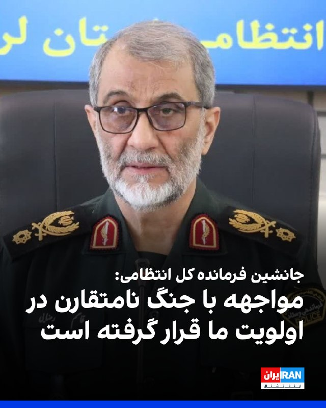

قاسم رضایی، جانشین فرمانده کل انتظامی جمهوری اسلامی گفت: «دیگر تمرکز صرف بر فعالیت‌های پلیسی نیست و نظام دفاعی و آمادگی برای مواجهه با جنگ نامتقارن در اولویت قرار گرفته است.»

او افزود: «نیروها باید آموزش عملی ببینند و تمرینات میدانی داشته باشند. پلیس راه و راهور علاوه بر وظایف ترافیکی، آموزش دفاعی و آمادگی عملی می‌بیند.»

او افزود: «تمرین در خیابان و شرایط واقعی باعث افزایش توانمندی نیروها می‌شود.»
‌🏁 🇬🇧 IranintlTV

🤖 @VahidOOnLine

## VahidOOnLine — post 241590

  

♦️ الجزیره با استناد به داده‌های ردیابی کشتی‌ها روز جمعه اول خرداد، گزارش داد که سومین نفتکش حامل گاز طبیعی مایع (LNG) قطر در حال عبور از تنگه هرمز به مقصد چین است. این رویداد در حالی رخ می‌دهد که یک تیم مذاکره‌کننده قطری برای کمک به دستیابی به توافقی جهت پایان دادن به جنگ با جمهوری اسلامی، در تهران به سر می‌برد.

این کشتی به نام «السهله» با ظرفیت بیش از ۲۱۱ هزار مترمکعب، بندر رأس لفان قطر را ترک کرده و انتظار می‌رود در ۱۴ ژوئن (۲۴ خرداد) به پایانه ال‌ان‌جی تیانجین در چین برسد. عبور این کشتی نزدیک به دو هفته پس از آن صورت می‌گیرد که محموله‌های قبلی تحت یک توافق میان جمهوری اسلامی و پاکستان از این شاهراه حیاتی عبور کردند.

به گزارش خبرگزاری رویترز، دو نفتکش قطری قبلی که از زمان آغاز حملات هوایی آمریکا و اسرائیل در اواخر فوریه موفق به عبور از تنگه هرمز شدند، توسط قطر به پاکستان فروخته شده بودند. منابع آگاه اعلام کردند که جمهوری اسلامی عبور این نفتکش را با هدف اعتمادسازی میان قطر و پاکستان (که نقش میانجی را در گفتگوهای صلح ایفا می‌کند) تایید کرده است.
‌🇸🇦 Indypersian

🤖 @VahidOOnLine

## mwarmonitor — post 9506

  <a href="telegram/content/mwarmonitor_9506_1779486901.mp4" target="_blank">🎬 Download video</a>

ترامپ حرکت جدید به رقص معروف خودش اضافه کرد 🏌

@mwarmonitor

## mwarmonitor — post 9505

  

🔴فضای هوایی غرب ایران طبق یک NOTAM جدید تا صبح روز دوشنبه بسته شده است، به‌جز پروازهای روزانه (در ساعات روشنایی روز).

@mwarmonitor

## mwarmonitor — post 9504

🔴اکسیوس: ترامپ در بحبوحه بررسی احتمال بازگشت به جنگ، با مشاوران ارشد خود درباره ایران تشکیل جلسه داد

📝نویسنده: باراک راوید

🔰به گفته دو مقام آمریکایی به «اکسیوس»، پرزیدنت ترامپ صبح روز جمعه جلسه‌ای را با تیم امنیت ملی ارشد خود درباره جنگ با ایران برگزار کرد.

📌چرا این موضوع اهمیت دارد؟
منابعی که مستقیماً با رئیس‌جمهور گفتگو کرده‌اند می‌گویند ترامپ در صورت عدم دستیابی به یک گشایش ناگهانی و دقیقه‌نودی در مذاکرات، به‌طور جدی در حال بررسی آغاز حملات جدید علیه ایران است.

نمای دوقاب (تحولات هم‌زمان):
نشست ترامپ درباره ایران در حالی برگزار شد که رئیس ارتش پاکستان، فیلد مارشال عاصم منیر، در تلاشی آشکار و دقیقه‌نودی برای پر کردن شکاف‌ها و جلوگیری از سرگیری جنگ، به تهران سفر کرده است.
یک هیئت قطری نیز روز جمعه برای حمایت از تلاش‌های میانجی‌گرانه وارد تهران شد.
انتظار می‌رود عاصم منیر روز شنبه با سردار احمد وحیدی، از فرماندهان سپاه پاسداران و مهره‌ای کلیدی در فرآیند تصمیم‌گیری ایران، دیدار کند.
یک مقام آمریکایی که در جریان تلاش‌های دیپلماتیک قرار گرفته است، روند مذاکرات را «طاقت‌فرسا» توصیف کرد. این مقام آمریکایی گفت که پیش‌نویس‌ها «هر روز بین طرفین رد و بدل می‌شوند» اما پیشرفت چندانی حاصل نشده است.
حاضران در اتاق جلسه:
به گفته منابع آگاه، در این نشست علاوه بر ترامپ، جی‌دی ونس (معاون رئیس‌جمهور)، پیت هگست (وزیر دفاع)، جان راتکلیف (رئیس سی‌آی‌ای)، سوزی وایلز (رئیس کارکنان کاخ سفید) و دیگر مقامات حضور داشتند.
مارکو روبیو (وزیر امور خارجه) و ژنرال دن کین (رئیس ستاد مشترک ارتش) در این جلسه حضور نداشتند؛ چرا که روبیو در اروپا بود و ژنرال کین در مراسم فارغ‌التحصیلی آکادمی نیروی دریایی حضور داشت.
در طول این جلسه، گزارشی از آخرین وضعیت مذاکرات و سناریوهای مختلف در صورت فروپاشی گفتگوها به ترامپ ارائه شد.
نکات جالب و پشت‌پرده:
چند ساعت پس از این دیدار، کاخ سفید از تغییر در برنامه آخر هفته ترامپ خبر داد.
او پس از سخنرانی برنامه‌ریزی‌شده خود در غروب جمعه در نیویورک، به جای اقامت در باشگاه گلف خود در بد مینستر، به واشنگتن بازخواهد گشت.
ترامپ همچنین در حساب کاربری خود در شبکه اجتماعی «تروث سوشال» نوشت که به دلیل «مسائل مربوط به دولت و عشق به ایالات متحده آمریکا» در مراسم عروسی پسرش، دان جونیور، در این آخر هفته شرکت نخواهد کرد.
او نوشت: «احساس می‌کنم برای من مهم است که در این بازه زمانی حساس، در واشنگتن دی‌سی و در کاخ سفید بمانم.»
در پشت صحنه چه می‌گذرد؟
یک منبع نزدیک به ترامپ و منبع دوم دیگری که از شرایط آگاهی دارد به اکسیوس گفتند که ترامپ طی چند روز گذشته به شدت از روند مذاکرات با ایران ناامید و کلافه شده است.
به گفته این دو منبع، او روز سه‌شنبه به بنیامین نتانیاهو، نخست‌وزیر اسرائیل گفت که می‌خواهد شانس دیگری به دیپلماسی بدهد، اما تا پنجشنبه‌شب، نظرش بیشتر به سمت صدور فرمان حمله متمایل شده بود.
یک منبع نزدیک به ترامپ گفت رئیس‌جمهور احتمال یک عملیات نظامی بزرگ و «تعیین‌کننده» نهایی را مطرح کرده است تا پس از آن بتواند اعلام پیروزی کند و به جنگ پایان دهد.
با این حال، هنوز هیچ نشانه‌ای مبنی بر اینکه ترامپ تصمیم قطعی برای سرگیری جنگ گرفته باشد، وجود ندارد.
موضع طرف مقابل:
وزارت امور خارجه ایران روز جمعه اعلام کرد که گفتگوها در جریان است اما توافق نزدیکی در کار نیست.
خبرگزاری نیمه‌رسمی تسنیم، وابسته به سپاه پاسداران، روز جمعه به نقل از یک منبع نزدیک به تیم مذاکره‌کننده ایران نوشت: «گفتگوها پیرامون موضوعات مورد اختلاف همچنان ادامه دارد و هنوز نتیجه نهایی حاصل نشده است.»
🔹این منبع مدعی شد که تمرکز فعلی بر «پایان دادن به جنگ» است و تا زمانی که این هدف محقق نشود، در مورد هیچ موضوع دیگری مذاکره نخواهد شد.

🔸تحلیل واقعیتِ میان خطوط:
ترامپ طی شش هفته گذشته چندین بار تا آستانه سرگیری جنگ پیش رفته اما در نهایت از آن صرف‌نظر کرده است.
برخی منابع نزدیک به مذاکرات همچنان بر این باورند که در ۲۴ ساعت آینده فرصتی برای نوعی گشایش وجود دارد.
با این حال، دو منبع آگاه از طرز تفکر ترامپ می‌گویند او تمایل دارد اقدام نظامی را پیش ببرد، مگر اینکه اتفاق غیرمنتظره‌ای در گفتگوها رخ دهد.

@mwarmonitor

## mwarmonitor — post 9503

🔴وال‌استریت ژورنال:

🔸میانجی‌ها به‌شدت در تلاش هستند تا به یک توافق موقت میان ایران و ایالات متحده دست پیدا کنند تا از انجام حملات جدید آمریکا–اسرائیل جلوگیری شود؛ حملاتی که مقام‌ها هشدار داده‌اند ممکن است ظرف چند روز آینده رخ دهند.

🔹پاکستان، قطر و دیگر بازیگران منطقه‌ای در حال تلاش برای پر کردن شکاف‌ها درباره برنامه هسته‌ای ایران، کاهش تحریم‌ها و امنیت منطقه‌ای هستند.

🔸هدف، رسیدن به یک توافق کامل نیست، بلکه ایجاد یک چارچوب موقت است که آتش‌بس را تمدید کند و اجازه دهد مذاکرات گسترده‌تر ادامه پیدا کند.

@mwarmonitor

## mwarmonitor — post 9502

  

🔴پس از یک حادثه شیمیایی در گاردن گروو، کالیفرنیا، اداره آتش‌نشانی اورنج کانتی (OCFA) اعلام کرده است که تنها دو سناریوی باقی‌مانده برای یک مخزن ۶۰۰۰ تا ۷۰۰۰ گالنی حاوی «متیل متاکریلات» این است که «یا از کار می‌افتد یا منفجر می‌شود».

🔸نقشه زیر محدوده فعلی دستور تخلیه را نشان می‌دهد.

@mwarmonitor

## mwarmonitor — post 9501

🔴« یک منبع ایرانی مسئول به الجزیره: توقف جنگ در تمامی جبهه‌ها پیش‌شرط و راه ورود اصلی برای صحبت درباره هرگونه مذاکره آینده است.»

🔸«هنوز هیچ توافق نهایی‌ای وجود ندارد و تلاش‌ها برای کاهش اختلافات میان تهران و واشنگتن ادامه دارد.»

🔹« فضای مثبت همراه با تحرکات دیپلماتیک مهم است، اما برای رسیدن به یک توافق واقعی کافی نیست.»

@mwarmonitor

## mwarmonitor — post 9500

🔴«مقام آمریکایی به آکسیوس: مذاکرات بسیار فرسایشی و خسته‌کننده است و پیش‌نویس‌ها به‌طور روزانه رفت و برگشت می‌شوند، بدون اینکه پیشرفت قابل توجهی حاصل شود.

🔸رئیس‌جمهور آمریکا طی چند روز گذشته احساس نارضایتی و ناامیدی فزاینده‌ای داشته است.

🔹رئیس‌جمهور احتمال اجرای یک عملیات نظامی بزرگ و نهایی را مطرح کرده و سپس اعلام پیروزی و پایان دادن به جنگ را در نظر دارد.»

@mwarmonitor

## mwarmonitor — post 9498

🔸«ایران ایده اینکه توافق “نزدیک” است را رد می‌کند و تهدیدهای آمریکا برای حمله در صورت عدم دستیابی به توافق در این آخر هفته را نادیده می‌گیرد.

🔹“ما نمی‌توانیم بگوییم که حتماً طی چند هفته یا چند ماه و با چند سفر یا مذاکره به نتیجه خواهیم رسید.” – رسانه دولتی ایران IRNA»

@mwarmonitor

## mwarmonitor — post 9497

🔴«آلکس مارکوارت، خبرنگار ارشد امنیت ملی سابق CNN می‌گوید جزئیاتی از پیشنهاد آمریکا به ایران را به دست آورده است:

🔸یک یادداشت تفاهم که شامل حجم زیادی از کمک‌های مالی و تسهیلات اقتصادی برای ایران است، در ازای توافق برای آغاز مذاکرات.»

@mwarmonitor

## mwarmonitor — post 9496

🔴سناتور راجر ویکر (جمهوری‌خواه از می‌سی‌سی‌پی)، رئیس کمیته نیروهای مسلح سنا، روز جمعه از رئیس‌جمهور دونالد ترامپ خواست حملات علیه ایران را از سر بگیرد تا «کاری را که شروع کرده‌ایم تمام کنیم» — و مدعی شد که به رئیس‌جمهور «مشاوره نادرست» داده شده است تا به دنبال…

## mwarmonitor — post 9495

🚨« یک حادثه امنیتی در پایگاه هوایی-دریایی پنساکولا در ایالت فلوریدای آمریکا رخ داده است.»

@mwarmonitor

## mwarmonitor — post 9494

  

🗒بر اساس برنامه به‌روزشده، دونالد ترامپ سفر خود به باشگاه گلف «ترامپ نشنال گلف کلاب بدمینستر» را لغو کرده و در عوض آخر هفته را در کاخ سفید سپری خواهد کرد.

@mwarmonitor

## mwarmonitor — post 9493

🔴سناتور راجر ویکر (جمهوری‌خواه از می‌سی‌سی‌پی)، رئیس کمیته نیروهای مسلح سنا، روز جمعه از رئیس‌جمهور دونالد ترامپ خواست حملات علیه ایران را از سر بگیرد تا «کاری را که شروع کرده‌ایم تمام کنیم» — و مدعی شد که به رئیس‌جمهور «مشاوره نادرست» داده شده است تا به دنبال توافقی برای پایان دادن به جنگ برود. نیویورک پست

@mwarmonitor

## pm_afshaa — post 91231

  

🚀 آبان‌نت؛ سرعت بی‌مرز، بدون تاریخ انقضا!

⚡دنبال کیفیتی می‌گردی که حجمت رو بی‌دلیل تموم نکنه؟

💎 ویژگی‌های طلایی:
• 
✅ بدون محدودیت زمان و کاربر: تا آخرین کیلوبایت حجمت معتبره!
• 
✅ مصرف واقعی (۱ به ۱): بدون ضریب مصرف و دزدی حجم.
• 
✅ پینگ عالی: مخصوص گیمرهای حرفه‌ای و یوتیوب.
• 
☄️ تنوع سرویس: V2ray، OpenVPN،L2tp و Wireguard.

💳 پرداخت راحت بصورت ریالی و ارزی

💰 قیمت‌های ما را مقایسه کنید!
برای استعلام قیمت استثنایی و مشاوره به آیدی زیر پیام دهید:

🆔 @itsmammad10
🔗 کانال اصلی ما:

🆔 @AbanVpn10

## pm_afshaa — post 91230

  <a href="telegram/content/pm_afshaa_91230_1779486907.webm" target="_blank">🎬 Download video</a>

🔴تمام امتحانات سال جاری دانشگاه پیام نور در سراسر کشور مجازی شد.

💧 Rainbet.com the #1 Non-KYC Crypto Casino & Sportsbook @rainbetcom

😁 @Pm_Afshaa

## pm_afshaa — post 91229

  <a href="telegram/content/pm_afshaa_91229_1779486908.mp4" target="_blank">🎬 Download video</a>

🔴ترامپ: من ۹۹٪ رأی نیروهای اجرای قانون رو گرفتم میتونید باور کنید؟ هنوز داریم تلاش می‌کنیم بفهمیم آن ۱٪ چه کسی بوده.

💧 Rainbet.com the #1 Non-KYC Crypto Casino & Sportsbook @rainbetcom

😁 @Pm_Afshaa

## pm_afshaa — post 91228

  <a href="telegram/content/pm_afshaa_91228_1779486910.webm" target="_blank">🎬 Download video</a>

🔴منابع نزدیک به کاخ سفید:
با داغ‌تر شدن درگیری‌های نظامی تو ایران، ترامپ برنامه‌هاشو عوض کرده و قراره آخر هفته رو تو کاخ سفید بمونه.

💧 Rainbet.com the #1 Non-KYC Crypto Casino & Sportsbook @rainbetcom

😁 @Pm_Afshaa

## pm_afshaa — post 91227

  <a href="telegram/content/pm_afshaa_91227_1779486911.webm" target="_blank">🎬 Download video</a>

🔴اکسیوس به نقل از یک منبع نزدیک به ترامپ: ترامپ احتمال اجرای یک عملیات نهایی و گسترده رو مطرح کرده؛ عملیاتی که بعدش بتونه اعلام پیروزی کنه و بگه جنگ تموم شده. 
💧 Rainbet.com the #1 Non-KYC Crypto Casino & Sportsbook @rainbetcom 
😁 @Pm_Afshaa

## pm_afshaa — post 91226

  <a href="telegram/content/pm_afshaa_91226_1779486912.webm" target="_blank">🎬 Download video</a>

🔴اکسیوس به نقل از یک منبع نزدیک به ترامپ: ترامپ احتمال اجرای یک عملیات نهایی و گسترده رو مطرح کرده؛ عملیاتی که بعدش بتونه اعلام پیروزی کنه و بگه جنگ تموم شده.

💧 Rainbet.com the #1 Non-KYC Crypto Casino & Sportsbook @rainbetcom

😁 @Pm_Afshaa

## pm_afshaa — post 91225

  <a href="telegram/content/pm_afshaa_91225_1779486912.webm" target="_blank">🎬 Download video</a>

ترامپ: با اینکه خیلی میخواهم در کنار پسرم برای مراسم عروسی باشم اما حس میکنم که مهم است در واشنگتن و کاخ سفید در طی زمان مهم پیش رو در روز شنبه و یکشنبه بمانم 
💧 Rainbet.com the #1 Non-KYC Crypto Casino & Sportsbook @rainbetcom 
😁 @Pm_Afshaa

## pm_afshaa — post 91224

  <a href="telegram/content/pm_afshaa_91224_1779486913.webm" target="_blank">🎬 Download video</a>

🔴الجزیره نقل از مقام ایرانی:
میانجی‌ها در تلاشند فاصله بین ایران و امریکا رو کم کنند ولی فقط فضای مثبت و اقدامات میانجی ها کافی نیست!

💧 Rainbet.com the #1 Non-KYC Crypto Casino & Sportsbook @rainbetcom

😁 @Pm_Afshaa

## pm_afshaa — post 91223

  <a href="telegram/content/pm_afshaa_91223_1779486914.webm" target="_blank">🎬 Download video</a>

🔴مقام آمریکایی به اکسیوس:
مذاکرات بسیار دست و پا گیر است و پیش نویس‌ها هر روز بدون پیشرفت زیادی به این سو و آن سو می‌روند.

💧 Rainbet.com the #1 Non-KYC Crypto Casino & Sportsbook @rainbetcom

😁 @Pm_Afshaa

## pm_afshaa — post 91222

  <a href="telegram/content/pm_afshaa_91222_1779486915.webm" target="_blank">🎬 Download video</a>

🔴سخنگوی وزارت خارجه ایران:
اختلافات میان ایران و آمریکا انقدر عمیق و فراوان است که نمی‌توان با چند سفر یا چند هفته مذاکره به راه‌حلی رسید.

💧 Rainbet.com the #1 Non-KYC Crypto Casino & Sportsbook @rainbetcom

😁 @Pm_Afshaa

## pm_afshaa — post 91221

  

ترامپ: با اینکه خیلی میخواهم در کنار پسرم برای مراسم عروسی باشم اما حس میکنم که مهم است در واشنگتن و کاخ سفید در طی زمان مهم پیش رو در روز شنبه و یکشنبه بمانم

💧 Rainbet.com the #1 Non-KYC Crypto Casino & Sportsbook @rainbetcom

😁 @Pm_Afshaa

## pm_afshaa — post 91220

من که میدونم همه اینا برا کشیدن وحیدی بیرونه😁

## pm_afshaa — post 91219

من که میدونم همه اینا برا کشیدن وحیدی بیرونه😁

## pm_afshaa — post 91218

🔴تولسی گبرد، مدیر اطلاعات ملی ایالات متحده آمریکا، استعفا داد

💧 Rainbet.com the #1 Non-KYC Crypto Casino & Sportsbook @rainbetcom

😁 @Pm_Afshaa

## pm_afshaa — post 91217

🔴رئیس کمیته نیروهای مسلح سنای آمریکا: ترامپ باید به ارتش اجازه دهد تا انهدام توانمندی‌های نظامی ایران را تکمیل کند

💧 Rainbet.com the #1 Non-KYC Crypto Casino & Sportsbook @rainbetcom

😁 @Pm_Afshaa

## DEJradio — post 4857

  <a href="telegram/content/DEJradio_4857_1779486916.webm" target="_blank">🎬 Download video</a>

🚨
🔸 خبر ۲۱
آدینه ۱ اردیبهشت ۱۴۰۵

#خبر۲۱
@DEJradio

## DEJradio — post 4856

  <a href="telegram/content/DEJradio_4856_1779486917.webm" target="_blank">🎬 Download video</a>

🔺📢 منابع داخلی گزارش دادند از نیمه دوم اردیبهشت ۱۴۰۵ خروج اموال و اسناد با ارزش از صندوق امانات چند بانک از جمله ملی، تجارت و مسکن افزایش یافته است.

کاربران این صندوق‌ها نگران‌اند با توجه به احتمال جنگ مجدد و وضعیت بحرانی نظام، سرمایه آنها از بین برود یا دیگر صاحب آن نباشند.

در جریان جنگ ۴۰ روزه یکی از شعب بانک سپه در تهران که گفته شد «دیتا سنتر» آنجا قرار داشت هدف قرار گفت.
صندوق امانات، محفظه‌ای امن در خزانه‌ بانک‌هاست که برای نگهداری اسناد، طلا و اشیای ارزشمند اجاره داده می‌شود.

بانک‌ها تضمین نکرده‌اند که در صورت وقوع جنگ یا انقلاب اموال و دارایی مشتریان کامل به آنها پرداخت می‌شود.

#جنگ #جنگ۴۰روزه
@DEJradio

## DEJradio — post 4855

  <a href="telegram/content/DEJradio_4855_1779486918.webm" target="_blank">🎬 Download video</a>

🚨📢 مارک روته دبیرکل ناتو اعلام کرد که آمریکا می‌تواند در عملیات‌های نظامی خود علیه جمهوری اسلامی از پایگاه‌های این سازمان در اروپا استفاده کند.

روته روز آدینه ابتدای خرداد در جریان نشست اعضای این سازمان که در سوئد برگزار شد گفت، به عنوان یک اتحاد غربی-اروپایی، ما می‌توانیم به ایالات متحده آمریکا در تلاش‌هایش برای بازگرداندن آزادی دریانوردی در تنگه هرمز کمک کنیم.

روته افزود، چندین کشور اروپایی تمایل خود را برای مشارکت در تلاش‌ها برای بازگشایی تنگه هرمز و تضمین آزادی دریانوردی ابراز کرده‌اند.

او ادامه داد: «این نه تنها برای متوازن کردن هزینه‌هایی است که با ایالات متحده انجام می‌دهیم، بلکه برای اطمینان یافتن آنچه برای دفاع قاطعانه در برابر دشمنانمان نیاز داریم، لازم است.»

#جنگ
@DEJradio

## VahidOnline — post 75629

  

به گزارش اکسیوس، دونالد ترامپ، رئیس‌جمهوری آمریکا، روز جمعه با تیم ارشد امنیت ملی خود در کاخ سفید دیدار کرد تا سناریوهای مختلف در صورت شکست مذاکرات و احتمال آغاز حملات جدید علیه ایران را بررسی کند.

در این نشست حساس که با حضور مقامات کلیدی از جمله جِی‌دی ونس، معاون رئیس‌جمهوری، پیت هگست، وزیر جنگ و جان راتکلیف، رئیس سی‌آی‌ای، برگزار شد، ترامپ در جریان آخرین وضعیت دیپلماسی قرار گرفت.

نشانه‌های جدی از تغییر برنامه آخر هفته رئیس‌جمهوری، از جمله لغو سفر به باشگاه گلف بدمینستر، بازگشت به واشنگتن و حتی عدم شرکت در مراسم عروسی پسرش، دونالد ترامپ جوان، نشان‌دهنده وضعیت اضطراری در کاخ سفید است.
منابع نزدیک به ترامپ می‌گویند او از روند کند مذاکرات ناامید شده و به سمت گزینه نظامی متمایل شده است، هرچند هنوز تصمیم قطعی برای از سرگیری جنگ اتخاذ نشده است.

در همین حال، تهران به کانون تلاش‌های دیپلماتیک «لحظه آخری» برای جلوگیری از شعله‌ور شدن دوباره جنگ تبدیل شده است.
عاصم منیر، فرمانده کل ارتش پاکستان، به عنوان میانجی اصلی، در سفری حساس وارد تهران شده و قرار است با احمد وحیدی، از فرماندهان کلیدی سپاه پاسداران دیدار کند.
@VahidOOnLine

📡 @VahidOnline

## VahidOnline — post 75628

  

اکسیوس به نقل از یک منبع نزدیک به ترامپ نوشت که رییس‌جمهوری آمریکا در روزهای اخیر به‌طور فزاینده‌ای کلافه شده و احتمال انجام یک عملیات نظامی نهایی و گسترده را مطرح کرده است؛ عملیاتی که پس از آن بتواند اعلام پیروزی کرده و به جنگ پایان دهد.
@VahidOOnLine

📡 @VahidOnline

## VahidOnline — post 75627

  

سخنگوی هیئت مذاکره‌کننده ایران با آمریکا روز جمعه گفت که موضوع پرونده هسته‌ای ایران در این مرحله مورد مذاکره نیست و از اختلاف نظر عمیق با آمریکا خبر داد.

اسماعیل بقائی گفت: «اختلاف‌نظرها بین ایران و آمریکا آن‌قدر عمیق و زیاد است که نمی‌شود گفت با چندبار رفت‌وآمد یا مذاکرات ظرف چند هفته ما باید حتماً به نتیجه برسیم.»

او گزارش‌ها درباره قریب‌الوقوع بودن توافق با آمریکا را رد کرد و اعلام کرد: «نمی‌توانیم بگوییم ضرورتاً به جایی رسیده‌ایم که توافق نزدیک است.»

بقائی بار دیگر موضع جمهوری اسلامی درباره برنامه هسته‌ای و اورانیوم غنی‌شده را تکرار کرد و گفت مواضع ایران قبلاً اعلام شده است.
@VahidHeadline
سخنگوی وزارت خارجه ایران حضور هیئتی از قطر را در تهران تایید کرد
اسماعیل بقایی،‌ سخنگوی وزارت خارجه ایران تایید کرد که یک هیئت از قطر روز جمعه در تهران بودند و با عباس عراقچی وزیر خارجه ایران گفت‌وگو کردند.
او بدون ارائه جزئیات گفت که کشورهای مختلفی طی روزهای اخیر با وزیر خارجه گفتوگو کردند اما تاکید کرد که میانجی اصلی میان ایران و آمریکا همان کشور پاکستان است.
پیشتر رویترز به نقل از یک منبع آگاه گزارش داد که هیئتی از قطر در هماهنگی با آمریکا وارد تهران شده است.
قطر و امارات و عربستان سعودی سه کشوری بودند که آقای ترامپ روز دوشنبه گفت که به درخواست آنها فعلا حمله مجدد به ایران را متوقف کرده است.
@VahidHeadline

📡 @VahidOnline

## VahidOnline — post 75626

  

تصویری از عاصم منیر، فرمانده ارتش پاکستان که امروز جمعه یکم خرداد۱۴۰۵ وارد تهران شد و مورد استقبال اسکندر مومنی وزیر کشور قرار گرفت. خبرگزاری آسوشیتدپرس پاکستان نیز به نقل از منابع امنیتی اعلام کرده‌اند که عاصم منیر در طول این سفر رسمی، درباره «مذاکرات جاری ایران و آمریکا و صلح و ثبات منطقه‌ و منافع دوجانبه دیگر» با مقام‌های ایران گفت‌و‌گو خواهد کرد.
@VahidHeadline

📡 @VahidOnline

## VahidOnline — post 75625

  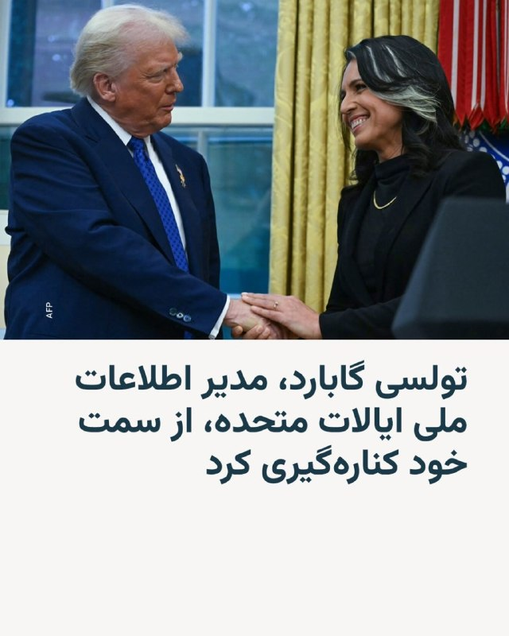

«فاکس نیوز»: تولسی گابارد از پست خود به عنوان مدیر اطلاعات ملی آمریکا استعفا کرد.
AlArabiya_Fa
پست ترامپ، ترجمه ماشین:
متأسفانه تولسی گبرد، پس از آنکه عملکردی بسیار خوب داشت، روز ۳۰ ژوئن دولت را ترک خواهد کرد. همسر فوق‌العاده او، آبراهام، به‌تازگی به نوعی نادر از سرطان استخوان مبتلا شده و او، به‌درستی، می‌خواهد در کنار همسرش باشد و در حالی که این نبرد دشوار را با هم پشت سر می‌گذارند، به بازگشت او به سلامتی کمک کند. تردیدی ندارم که او به‌زودی بهتر از همیشه خواهد شد.

تولسی کار فوق‌العاده‌ای انجام داده و دلمان برای او تنگ خواهد شد. معاون اصلی و بسیار محترم او در دفتر مدیر اطلاعات ملی، آرون لوکاس، به‌عنوان سرپرست مدیر اطلاعات ملی خدمت خواهد کرد.

رئیس‌جمهور دونالد جی. ترامپ
realDonaldTrump

از سوی دیگر رویترز به نقل از یک منبع آگاه از موضوع، نوشته که او ادعا کرده کاخ سفید خانم گابارد را برای کناره‌گیری «تحت فشار» قرار داده بود.

پیشتر اختلاف دیدگاه‌هایی بین رئیس‌جمهور ایالات متحده و مدیر امنیت ملی‌اش، بخصوص در قبال ایران بروز کرده بود. دونالد ترامپ در فروردین‌ماه هم اشاره کرده بود که از نظر او، تولسی گابارد در قبال برچیده‌شدن بلندپروازی‌های هسته‌ای ایران، «موضع نرم‌تری» دارد.

خانم گابارد بیش از یک سال پیش، پنجم فروردین‌ماه ۱۴۰۴ به کنگره گفته بود که ایران در حال ساخت سلاح هسته‌ای نیست.

مدیر اطلاعات ملی آمریکا که برای ارائۀ گزارش سالانۀ نهادهای اطلاعاتی ایالات متحده به همراه رئیس سی‌آی‌ای و مدیر اف‌بی‌آی در جلسه استماع سنا حاضر شده بود، تأکید کرد که بر اساس ارزیابی نهادهای اطلاعاتی، علی خامنه‌ای رهبر وقت جمهوری اسلامی، درباره تعلیق برنامهٔ تسلیحات هسته‌ای ایران، که در سال ۱۳۸۲ فرمان آن‌را صادر کرده بود، تجدیدنظر نکرده است.

با این حال خانم گابارد بعد از مدتی، موضع‌گیری خود در این زمینه را تغییر داد.

تولسی گابارد که مسیر سیاسی پرفراز و نشیبی داشته، پیش از پیوستن به حزب جمهوری‌خواه و ورود به دولت دوم دونالد ترامپ، عضو حزب دموکرات و نمایندۀ هاوایی در مجلس نمایندگان بود.

او هفت سال پیش، زمانی که خود را برای رقابت به‌عنوان نامزد حزب دموکرات در انتخابات رباست جمهوری آماده می‌کرد، گفت که در صورت پیروزی در این انتخابات، ایالات متحده را به توافق هسته‌ای با ایران باز خواهد گرداند.

خانم گابارد در آن زمان در گفت‌وگو با شبکه تلویزیونی فاکس‌نیوز هشدار داده بود که ایالات متحده در آستانه جنگ با ایران قرار دارد.

تولسی گابارد نخستین و تنها مقام ارشد امنیتی یا نظامی دولت دونالد ترامپ نیست که کناره‌گیری کرده یا وادار به کناره‌گیری شده است.

در آخرین روزهای سال ۱۴۰۴، جوزف کنت مدیر وقت مرکز ضد تروریسم آژانس امنیت ملی آمریکا، که مستقیماً از سوی دونالد ترامپ منصوب شده بود و زیر نظر تولسی گابارد انجام وظیفه می‌کرد، در مخالفت آشکار با جنگ ایران، کناره‌گیری کرد.
@VahidHeadline

خبر یک ماه و نیم پیش:
ترامپ قصد داشت گابارد را اخراج کند

به گزارش وب‌سایت آکسیوس، دونالد ترامپ تا آستانه اخراج تولسی گابارد، مدیر اطلاعات ملی آمریکا، پیش رفته بود، اما مداخله لحظه آخری راجر استون، مشاور قدیمی و نزدیک او، مانع از این اتفاق شد.
دلیل خشم ترامپ به شهادت اخیر گابارد در کنگره بازمی‌گردد؛ جایی که او برخلاف انتظار، از جنگ با ایران حمایت تمام‌عیار نکرد.
طبق گفته منابع آگاه، ترامپ از اینکه گابارد در اظهاراتش اعلام کرده بود برنامه هسته‌ای ایران پیش از آغاز جنگ «منهدم» شده بود (موضعی که توجیهات ترامپ برای حمله را تضعیف می‌کرد)، به شدت ناراضی بود.
همچنین استعفای اعتراضی جو کنت، دستیار گابارد که جنگ را غیرضروری خوانده بود، بر آتش خشم ترامپ افزود.
در حالی که ترامپ در حال نظرسنجی از مشاورانش برای جایگزینی گابارد بود و وفاداری او را زیر سؤال می‌برد، راجر استون در تماسی تلفنی از او دفاع کرد. یک منبع نزدیک به آکسیوس گفت: «راجر معامله را جوش داد و تولسی را نجات داد.»
استون نیز بعدا در شبکه اجتماعی ایکس تایید کرد: «خوشبختانه به موقع اقدام کردم.» با این میانجی‌گری، گبرد فعلا در سمت خود ابقا شده است.
@VahidOOnLine

📡 @VahidOnline

## kianmeli1 — post 87568

🔴جمهوری اسلامی تهدیدات حمله را کاملا جدی گرفته است و تمام پایگاه ها آماده باش کامل است

باید دید آیا برنامه ترامپ حمله است یا خیر
https://t.me/kianmeli1

## kianmeli1 — post 87567

  

🔴امشب ایران آماده جنگ احتمالی شد

فضای هوایی غرب ایران طبق یک NOTAM جدید تا صبح روز دوشنبه بسته شده است، به‌جز پروازهای روزانه (در ساعات روشنایی روز).
https://t.me/kianmeli1

## kianmeli1 — post 87566

🔴دقایقی پیش بازار بورس آمریکا برای حدود ۹۰ ساعت آینده بسته شد.

اگر قرار است ترامپ فرمان حمله صادر کند امشب یا فرداشب صادر میشود
https://t.me/kianmeli1

## kianmeli1 — post 87565

🔴خبرگزاری تسنیم، وابسته به سپاه پاسداران، به نقل از یک منبع نظامی می‌گوید نیروهای مسلح ایران در حال آماده شدن برای از سرگیری احتمالی جنگ با آمریکا هستند و طرح جدیدی برای «مبارزه سوم» آماده کرده‌اند که آمریکا و متحدان آمریکا را به شیوه‌ای «جدید و خاص» هدف قرار خواهد داد.
https://t.me/kianmeli1

## kianmeli1 — post 87564

🔴طرفداران نظام در میدان انقلاب خطاب به ترامپ

حمله امشب چی شد منتظریم
https://t.me/kianmeli1

## kianmeli1 — post 87563

‏🔴اکسیوس به نقل از دو مقام آمریکایی اعلام کرد که دونالد ترامپ صبح جمعه نشستی با اعضای ارشد تیم امنیت ملی خود درباره جنگ ایران برگزار کرد
https://t.me/kianmeli1

## kianmeli1 — post 87562

  

🔴سایت انصاف‌نیوز از دسترس خارج شد.

این سایت روز گذشته نوشته بود:
« شنیده‌ی انصاف نیوز حاکی است که سعید جلیلی مدتی است در جلسات شعام شرکت نمی‌کند.»
https://t.me/kianmeli1

## kianmeli1 — post 87561

🔴ترامپ درباره تست شناختی : بایدن حتی سوال اول رو هم نمی‌تونست جواب بده

فکر نمی‌کنم بتونه بگیره اینا رو
کدوم خرسه کدوم اسبه
https://t.me/kianmeli1

## kianmeli1 — post 87560

  <a href="telegram/content/kianmeli1_87560_1779486924.mp4" target="_blank">🎬 Download video</a>

🔴ترامپ:من باهوش‌ترین آدمی هستم که شما ممکن است ببینید
https://t.me/kianmeli1

## kianmeli1 — post 87559

  <a href="telegram/content/kianmeli1_87559_1779486926.mp4" target="_blank">🎬 Download video</a>

🔴ترامپ: ما اینقدر نفت از ونزوئلا استخراج کرده‌ایم(چاپیدیم) که هزینه جنگ را حدود ۲۵ برابر پرداخت کرده‌ایم.
https://t.me/kianmeli1

## kianmeli1 — post 87558

  

🔴سناتور گراهام:

من معتقدم آزادی مردم شگفت‌انگیز کوبا از چنگال کمونیسم نزدیک است.

(ایران رو آباد کردن رفتن سراغ کوبا)
https://t.me/kianmeli1

## kianmeli1 — post 87557

  

🔴منبع نزدیک به کاخ سفید :
با داغ‌تر شدن درگیری‌های نظامی با رژیم ملاها، پرزیدنت ترامپ برنامه‌هایش را عوض کرده و قرار است آخر هفته را در کاخ سفید بماند
https://t.me/kianmeli1

## kianmeli1 — post 87556

🔴تولسی گابارد مدیرکا اطلاعات ملی آمریکا استعفا داد.

ترامپ: دلیل استعفای گابارد بیماری همسرش به سرطان استخوان بوده است.

-رویترز: بر خلاف گفته ترامپ، کاخ سفید برای استعفا به گابارد فشار آورد و مجبور به اینکار کرد.
https://t.me/kianmeli1

## IranIntlTV — post 338498

  

ترامپ در یک سخنرانی در سوفرن نیویورک گفت: «با عملیات خشم حماسی، رزمندگان ما اطمینان حاصل خواهند کرد که جمهوری اسلامی به عنوان بزرگ‌ترین حامی «تروریسم» دولتی در جهان، هرگز به سلاح هسته‌ای دست نخواهد یافت و خودشان هم این را می‌دانند.»
ترامپ گفت: حکومت ایران به عنوان بزرگ‌ترین حامی تروریسم دولتی، به سراسر جهان پول می‌فرستد تا مشکل ایجاد کند.

https://iranintl.com/202605221757

## IranIntlTV — post 338497

  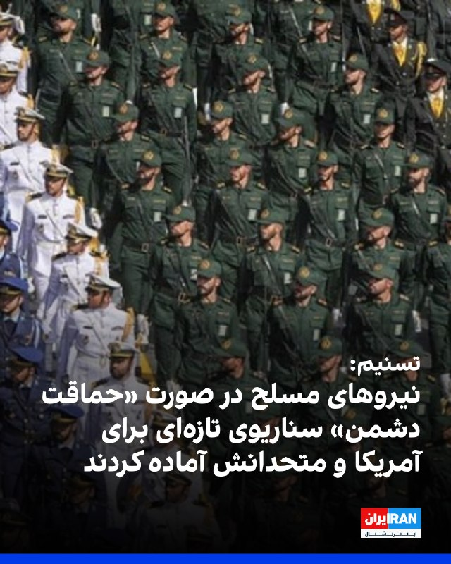

خبرگزاری تسنیم، وابسته به سپاه پاسداران، به نقل از یک منبع نظامی گزارش داد نیروهای مسلح جمهوری اسلامی «به‌طور کامل» تحولات را زیر نظر دارند و در صورت آنچه «حماقت دشمن» و هرگونه بهانه‌جویی از سوی آمریکا و متحدانش خوانده شده، سناریوهای تازه‌ای آماده کرده‌اند.

به گفته این منبع، در صورت اقدام نظامی احتمالی آمریکا، «نسخه سوم مبارزه جمهوری اسلامی» اجرا خواهد شد؛ نسخه‌ای که به ادعای او در حوزه تجهیزات جدید، اهداف نوین، تاکتیک‌ها و راهبردهای جنگی نمود خواهد داشت و حتی می‌تواند جبهه‌های جدیدی در سطح فرامنطقه‌ای ایجاد کند.

این منبع نظامی همچنین مدعی شد آمریکا در صورت «زیاده‌خواهی و اقدام نظامی»، «تنبیه بزرگ سوم» را در کمتر از یک سال تجربه خواهد کرد؛ تنبیهی که به گفته او «به شکلی خاص‌تر و جدیدتر» خواهد بود.
https://iranintl.com/202605226156

## IranIntlTV — post 338496

  <a href="telegram/content/IranIntlTV_338496_1779486932.mp4" target="_blank">🎬 Download video</a>

یک شهروند در پیامی صوتی به ایران اینترنشنال از فشار شدید در ایران و بلاتکلیفی و استرس به دلیل اظهارات دونالد ترامپ درباره امکان پایان جنگ و آتش‌بس می‌گوید. صدای او برای حفظ امنیتش با هوش مصنوعی بازخوانی شده است.

## IranIntlTV — post 338495

  

دونالد ترامپ، رییس جمهوری ایالات متحده، در سخنرانی خود در نیویورک درباره جنگ ایران اعلام کرد: «این ماجرا به‌زودی پایان خواهد یافت.»

او همچنین گفت که ما جمهوری اسلامی را متوقف کرده‌ایم؛ آن‌ها هرگز به سلاح هسته‌ای دست نخواهند یافت.
https://iranintl.com/202605220706

## IranIntlTV — post 338494

  

اکسیوس به نقل از دو مقام آمریکایی اعلام کرد که ترامپ صبح جمعه نشستی با اعضای ارشد تیم امنیت ملی خود درباره جنگ ایران برگزار کرد.
اکسیوس نوشت به گفته منابعی که مستقیما با ترامپ گفت‌وگو کردند، او در حال بررسی حملات جدید است، مگر اینکه پیشرفتی در مذاکرات در آخرین لحظه حاصل شود.
https://iranintl.com/202605229907

## IranIntlTV — post 338493

  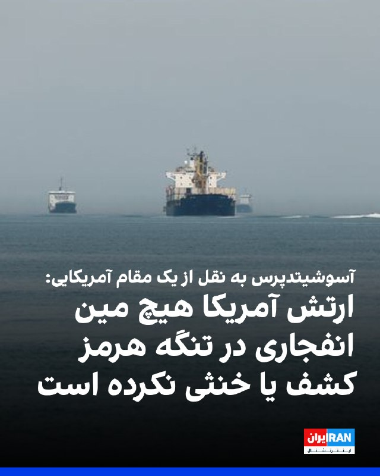

آسوشیتدپرس به نقل از یک مقام آمریکایی اعلام کرد ارتش آمریکا تاکنون هیچ مین انفجاری در تنگه هرمز کشف یا خنثی نکرده است.
این مقام آمریکایی افزود عملیات جست‌وجو در این گذرگاه حیاتی نفتی همچنان ادامه دارد، اما تاکنون هیچ مین دریایی پیدا نشده است.

این در حالی است که محاصره دریایی بنادر جنوب ایران همچنان ادامه دارد.
https://iranintl.com/202605224264

## IranIntlTV — post 338492

  <a href="telegram/content/IranIntlTV_338492_1779486937.mp4" target="_blank">🎬 Download video</a>

مشاور رییس دولت امارات متحده عربی گفت برخی کشورهای عربی اکنون جمهوری اسلامی را تهدیدی بزرگ‌تر از اسرائیل می‌بینند.

به گفته او، حملات جمهوری اسلامی نگاه امنیتی منطقه را تغییر داده و باعث شده همکاری برخی دولت‌های عربی با اسرائیل اهمیت بیشتری پیدا کند.
@iranintltv

## IranIntlTV — post 338491

  <a href="telegram/content/IranIntlTV_338491_1779486940.mp4" target="_blank">🎬 Download video</a>

پیام‌های رسیده به ایران‌اینترنشنال نشان می‌دهد مشکلات در تامین برخی کالاهای ضروری و اساسی در ایران همچنان ادامه دارد.

شهروندان در شهرهای مختلف همچنین از کمبود بنزین خبر می‌دهند.

گفت‌وگو با معصومه طاهرخانی، تحلیل‌گر اقتصادی
@iranintltv

## IranIntlTV — post 338490

  <a href="telegram/content/IranIntlTV_338490_1779486943.mp4" target="_blank">🎬 Download video</a>

همزمان با سفر هیاتی از پاکستان به ریاست فرمانده ارتش و رییس اطلاعات این کشور به تهران برای پیشبرد مذاکرات، قطر نیز در هماهنگی با آمریکا تیمی مذاکره‌کننده به تهران اعزام کرد.

رییس‌جمهوری آمریکا در تروث سوشال نوشت به‌دلیل شرایط حساس فعلی، ترجیح داده در کاخ سفید و واشینگتن بماند. ترامپ همچنین گفت ایران بی‌صبرانه به‌دنبال دستیابی به توافق با آمریکا است.
@iranintltv

## IranIntlTV — post 338489

  <a href="telegram/content/IranIntlTV_338489_1779486945.mp4" target="_blank">🎬 Download video</a>

سخنگوی وزارت خارجه جمهوری اسلامی گفت با درخواست آمریکا برای تحویل اورانیوم با غنای بالا، مذاکرات به نتیجه نمی‌رسد.

همزمان، گزارش‌ها از اعزام تیم مذاکره‌کننده قطر به تهران و سفر فرمانده ارتش و رییس اطلاعات پاکستان به ایران خبر می‌دهند.

دونالد ترامپ نیز گفت به‌دلیل شرایط حساس کنونی در واشینگتن مانده است.

گفت‌وگو با امید معماریان، تحلیل‌گر سیاسی در موسسه دان، و حسین علیزاده، دیپلمات پیشین
@iranintltv

## IranIntlTV — post 338488

  <a href="telegram/content/IranIntlTV_338488_1779486948.mp4" target="_blank">🎬 Download video</a>

سخنگوی وزارت خارجه جمهوری اسلامی گفت با درخواست آمریکا برای تحویل اورانیوم با غنای بالا، مذاکرات به نتیجه نمی‌رسد.

همزمان، گزارش‌ها از اعزام تیم مذاکره‌کننده قطر به تهران و سفر فرمانده ارتش و رییس اطلاعات پاکستان به ایران خبر می‌دهند.

دونالد ترامپ نیز گفت به‌دلیل شرایط حساس کنونی در واشینگتن مانده است.

گفت‌وگو با امید معماریان، تحلیل‌گر سیاسی در موسسه دان، و حسین علیزاده، دیپلمات پیشین
@iranintltv

## IranIntlTV — post 338487

سخنگوی وزارت خارجه جمهوری اسلامی: نمی‌توانیم بگوییم توافق نزدیک است

اسماعیل بقایی، سخنگوی وزارت امور خارجه جمهوری اسلامی، اختلافات میان تهران و واشینگتن را «عمیق» خواند و تاکید کرد نمی‌توان انتظار داشت روند مذاکرات تنها با «چند بار رفت‌وآمد» به نتیجه نهایی و حل‌وفصل چالش‌ها منجر شود.

بقایی شامگاه جمعه اول خرداد در مصاحبه با صداوسیمای جمهوری اسلامی، با اشاره به سفر مقام‌های ارشد پاکستان به ایران گفت: «نمی‌توانیم بگوییم که به جایی رسیدیم که توافق نزدیک است. ضرورتا خیر، این‌طور نیست. روند ادامه‌دار است.»

او اضافه کرد: «اختلاف‌نظرها بین ایران و آمریکا آن‌قدر عمیق و زیاد است، به‌ویژه بعد از جنایاتی که در دو سه ماه اخیر مرتکب شده‌اند، که نمی‌توان گفت با چند بار رفت‌و‌آمد یا مذاکرات ظرف چند هفته یا چند ماه حتما به نتیجه خواهیم رسید. دیپلماسی زمان‌بر است.»

اظهارات بقایی در حالی مطرح می‌شوند که عاصم منیر، فرمانده ارتش پاکستان، برای گفت‌وگو با مقام‌های جمهوری اسلامی به تهران سفر کرده است.

پیش‌تر نیز شبکه العربیه از سفر عاصم مالک، رییس سازمان اطلاعات پاکستان، به ایران خبر داده بود.

تایید سفر هیات قطری به تهران
سخنگوی وزارت امور خارجه جمهوری اسلامی گزارش خبرگزاری رویترز درباره سفر هیات قطری به تهران را تایید کرد و گفت نمایندگان دوحه اول خرداد با عباس عراقچی دیدار و گفت‌وگو کردند.

بقایی ادامه داد: «بسیاری از کشورها، چه کشورهای منطقه و چه کشورهای خارج از منطقه، تلاش می‌کنند تا به پایان جنگ و جلوگیری از تشدید تنش‌ها کمک کنند. این تلاش‌ها از نظر ما ارزشمند است.»

او در عین حال خاطرنشان کرد اسلام‌آباد همچنان «میانجی رسمی» مذاکرات میان تهران و واشینگتن محسوب می‌شود.

رویترز پیش‌تر از سفر یک هیات مذاکره‌کننده قطری به تهران خبر داد و نوشت هدف از این سفر که با هماهنگی واشینگتن انجام گرفت، کمک به تلاش‌ها برای دستیابی به توافقی جهت خاتمه جنگ ایران است.

بقایی: در این مرحله وارد «جزییات» پرونده هسته‌ای نخواهیم شد
سخنگوی وزارت خارجه جمهوری اسلامی اعلام کرد مذاکرات جاری با واشینگتن بر پایان جنگ متمرکز است و «جزییات» پرونده هسته‌ای در این مرحله وارد دستور کار گفت‌وگوها نخواهد شد.

بقایی گفت خاتمه جنگ در همه جبهه‌ها، از جمله لبنان، وضعیت تنگه هرمز و محاصره دریایی آمریکا، از محورهای اصلی گفت‌وگوهای حکومت ایران و ایالات متحده به شمار می‌روند.

او ادامه داد: «دلیل اینکه در مورد جزییات مباحث مرتبط با موضوع [هسته‌ای] صحبت نمی‌کنیم، مشخص است. ما دو بار این کار را کردیم و زیاده‌خواهی طرف مقابل باعث شد وارد جنگ شویم.»

بقایی افزود ورود به «سایر موضوعات» در مذاکرات با آمریکا تنها پس از پایان جنگ و رفع «نگرانی‌های» تهران امکان‌‎پذیر خواهد بود.

خبرگزاری رویترز ۳۱ اردیبهشت به نقل از مقام‌های اسرائیلی نوشت دونالد ترامپ، رییس‌جمهوری آمریکا، به اورشلیم اطمینان داده که ذخایر اورانیوم با غنای بالا از ایران خارج خواهد شد و این موضوع بخشی از هرگونه توافق احتمالی صلح خواهد بود.

بنیامین نتانیاهو، نخست‌وزیر اسرائیل، بارها تاکید کرده که پایان جنگ منوط به خروج اورانیوم غنی‌شده از ایران، توقف حمایت تهران از گروه‌های نیابتی و برچیده شدن توان موشکی جمهوری اسلامی است.

کانال ۱۱ اسرائیل ۳۱ اردیبهشت گزارش داد در پی ارزیابی‌های اطلاعاتی جدید، ارتش و نهادهای امنیتی این کشور مجموعه‌ای از اقدامات مهم را برای احتمال جدی ازسرگیری نبرد با جمهوری اسلامی آغاز کرده‌‌اند و آمادگی خود را به بالاترین سطح افزایش داده‌اند.
 
🔗وب‌سایت ایران‌اینترنشنال
@iranintltv

## IranIntlTV — post 338486

بنزین در زاهدان، کرمان و بندرعباس تا لیتری ۲۰۰ هزار تومان فروخته می‌شود

🖋سبا حیدرخانی

گزارش‌های رسیده به ایران‌اینترنشنال از شهرهای مختلف ایران، از تشدید بحران تامین بنزین، محدودیت‌ در عرضه سوخت، صف‌های طولانی در جایگاه‌ها و افزایش شدید قیمت بنزین حتی تا لیتری ۲۰۰ هزار تومان در بازار غیررسمی حکایت دارد.

بیشترین روایت‌ها مربوط به استان‌های هرمزگان، سیستان و بلوچستان، کرمان، بوشهر، خراسان جنوبی، اصفهان و خراسان رضوی است.

بر اساس پیام‌های مردمی، وضعیت عرضه سوخت در جیرفت، عنبرآباد و شهرهای جنوبی استان کرمان بحرانی شده است.

به گفته یک شهروند، در این مناطق قیمت بنزین در بازار آزاد به لیتری ۱۰۰ هزار تومان رسیده است.

او افزود: «اکنون دغدغه ما بنزین شده است. پمپ‌بنزین‌ها بیشتر از ۱۵ لیتر نمی‌دهند و شب‌ها باید در صف‌های کیلومتری بایستیم تا صبح نوبتمان شود. واقعا کلافه شده‌ایم.»

در بیرجند نیز سوخت جیره‌بندی و سهمیه کارت‌ها نصف شده و بنزین آزاد تنها در دو جایگاه، از ساعت شش صبح تا شش عصر و فقط به مقدار ۱۰ لیتر عرضه می‌شود.

در بوشهر هم به گفته یک مخاطب، ‌بنزین تقریبا «نایاب» شده است؛ دکه‌های کنار جاده، سوخت را در دبه‌های ۵ لیتری و با قیمت هر لیتر ۱۰ هزار تومان می‌‌فروشند.

شهروند دیگری از کرمان با اشاره به شکل‌گیری بازار سیاه سوخت گفت بنزین را لیتری ۸۰ هزار تومان خریده است.

او افزود مردم شب‌ها تا صبح در صف می‌ایستند و نوبت می‌گیرند تا صبح که جایگاه باز شد، اگر خوش‌شانس بودند، بتوانند سوخت گیر بیاورند.

جیره‌بندی عرضه رسمی سوخت و گسترش بازار غیررسمی
پیام‌های رسیده از بندرعباس حاکی از شرایط «فاجعه‌بار» جایگاه‌های سوخت در این شهر است.

یکی از مخاطبان ایران‌اینترنشنال گفت: «صف‌های چندکیلومتری بنزین مردم را کلافه کرده است، آن‌هم در گرمایی که کولر خودرو ضرورت است نه انتخاب. شهری که بخش بزرگی از بنزین کشور را تولید می‌کند، سهمش شده آلودگی، بیماری و ساعت‌ها تحقیر در صف سوخت، بدون کوچک‌ترین پاسخ‌گویی مسئولان.»

شهروند دیگری از بندرعباس گفت از ساعت ۸:۵۵ شب در صف پمپ‌بنزین ترنج منتظر بوده‌، اما ساعت ۱۰:۱۰ به خودروها اعلام شده که سوخت تمام شده است.

رمضان‌علی سنگدوینی، عضو کمیسیون انرژی مجلس، پیش‌تر گفته بود بحث تغییر سهمیه‌بندی بنزین «صرفا در حد طرح شخصی» بوده و هیچ تصمیم رسمی درباره آن اتخاذ نشده است.

این موضوع اما با روایت‌های گسترده شهروندان از محدودیت‌های عملی در عرضه سوخت، تناقض دارد.

شهروندان در مشهد از طولانی‌تر شدن صف‌ها و افزایش مداوم قیمت‌ها خبر دادند.

مخاطبی در همین زمینه گفت برای پر کردن یک باک باید ساعت‌ها در صف جایگاه سوخت منتظر ماند: «قبلا هر چند ماه یک‌بار افزایش قیمت داشتیم، اما اکنون هر روز گران‌تر می‌شود.»

شهروند دیگری نیز در پیامی کوتاه نوشت: «امروز سه لیتر بنزین زدم شد ۲۰۰ هزار تومان.»

این گزارش‌ها در حالی منتشر می‌شود که مسعود پزشکیان، رییس دولت جمهوری اسلامی، ۳۰ اردیبهشت با تایید آسیب دیدن بخشی از زیرساخت‌های انرژی در جنگ اخیر، از ناتوانی دولت در تامین و واردات بنزین خبر داد.

او گفت در پی «محاصره دریایی آمریکا»، صادرات نفت ایران متوقف شده و کشور روزانه با کمبود ۵۰ میلیون لیتر بنزین روبه‌رو است، اما «دلاری برای واردات آن وجود ندارد».
ساعاتی پس از انتشار این سخنان، رسانه‌های دولتی از جمله ایرنا بخش‌هایی از اظهارات پزشکیان را حذف کردند.

فساد و رانت در جایگاه‌ها
در کنار بحران کمبود سوخت و توزیع نامناسب آن، برخی مخاطبان از افزایش فساد و رانت در برخی جایگاه‌ها و ناکارآمدی کارت‌های سوخت خبر دادند.

شهروندی از اصفهان با اشاره به ناکارآمدی حکومت در مدیریت بحران سوخت گفت کارت‌ها بدون دلیل خطا می‌دهند و باید سه هفته در انتظار کارت جدید ماند.

مخاطب دیگری از اصفهان از تشدید بی‌نظمی در جایگاه‌ها خبر داد و گفت: «علاوه بر اینکه صف‌های جایگاه سوخت کیلومتری شده و سهمیه بنزین بعضی‌ها را سوزانده‌اند، تعدادی از نیروهای بسیجی هم با اسلحه می‌آیند و بدون نوبت بنزین می‌زنند؛ آن هم نه یک یا دو لیتر، بلکه ۱۵ لیتر بنزین داخل موتورهایشان می‌زنند و می‌روند.»

یک شهروند از استان هرمزگان با انتقاد از «رانت و تبعیض در توزیع سوخت» گفت مردم ساعت‌ها در صف می‌مانند اما ماشین‌های سپاه با گالن‌های ۷۰ لیتری، شبانه از ساعت ۱۸ تا ۴ صبح نزدیک به ۱۰ بار سوخت‌گیری می‌کنند و آن را برای فروش به کاروان‌ها یا قاچاقچیان سوخت می‌برند.

به گفته او، هر گالن ۷۰ لیتری تا پنج میلیون تومان فروخته می‌شود.
 
🔗متن کامل گزارش را اینجا بخوانید
@iranintltv

## IranIntlTV — post 338485

  <a href="https://t.me/IranintlTV/338485" target="_blank">📎 Download file</a>

🎧نسخه صوتی ۲۴ با فرداد فرحزاد:ترامپ: تهران بی‌صبرانه به‌دنبال توافق است
@iranintlTV

## IranIntlTV — post 338483

  

خبرگزاری تسنیم، رسانه‌ها وابسته به سپاه، به نقل از یک منبع نزدیک به هیات مذاکره‌کننده، نوشت: «گفت‌وگوها و رایزنی‌ها بر سر موارد اختلافی همچنان ادامه دارد و هنوز نتیجه نهایی حاصل نشده است.»

این رسانه وابسته به سپاه افزود: «میانجی پاکستانی همچنان در حال رد و بدل موضوعات است.»

تسنیم ادامه داد تمرکز در حال حاضر بر سر مسئله «پایان جنگ» است و تا وقتی این موضوع نهایی نشود، هیچ مساله دیگری مذاکره نخواهد شد.
https://iranintl.com/202605227080

## IranIntlTV — post 338482

  <a href="telegram/content/IranIntlTV_338482_1779486953.mp4" target="_blank">🎬 Download video</a>

یک شهروند در پیامی به ایران اینترنشنال از اوضاع اقتصادی در کشور روایت می‌کند و می‌گوید به دلیل کمبود آرد نانوایی‌ها با اختلال در فعالیت و صف‌های طولانی مواجه‌اند. پیام او با هوش مصنوعی خوانده شده است.

## IranIntlTV — post 338481

  <a href="telegram/content/IranIntlTV_338481_1779486956.mp4" target="_blank">🎬 Download video</a>

فداحسین مالکی، عضو کمیسیون امنیت ملی مجلس، در صداوسیما گفت جمهوری اسلامی در صورت لزوم می‌تواند آتش‌بس را نقض کند. هم‌زمان برخی امامان جمعه نیز هشدار دادند اگر «تعرض‌ها» ادامه پیدا کند، تهران جنگ را بین‌المللی خواهد کرد.

ارزیابی نجات بهرامی، تحلیل‌گر سیاسی
@iranintltv

## IranIntlTV — post 338480

  <a href="telegram/content/IranIntlTV_338480_1779486959.mp4" target="_blank">🎬 Download video</a>

وال‌استریت ژورنال گزارش داد جمهوری اسلامی با پر شدن مخازن نفت و افزایش فشارهای آمریکا، با بحرانی جدی در صنعت نفت روبه‌رو شده است. بر اساس این گزارش، تهران برای جلوگیری از توقف کامل صنعت نفت، ناچار شده از نفتکش‌های شناور و حتی مخازن فرسوده استفاده کند.

گفت‌وگو با همایون فلک‌شاهی، کارشناس نفت و انرژی در موسسه کپلر
@iranintltv

## IranIntlTV — post 338479

  

قاسم رضایی، جانشین فرمانده کل انتظامی جمهوری اسلامی گفت: «دیگر تمرکز صرف بر فعالیت‌های پلیسی نیست و نظام دفاعی و آمادگی برای مواجهه با جنگ نامتقارن در اولویت قرار گرفته است.»

او افزود: «نیروها باید آموزش عملی ببینند و تمرینات میدانی داشته باشند. پلیس راه و راهور علاوه بر وظایف ترافیکی، آموزش دفاعی و آمادگی عملی می‌بیند.»

او افزود: «تمرین در خیابان و شرایط واقعی باعث افزایش توانمندی نیروها می‌شود.»
https://iranintl.com/202605222099

## IranIntlTV — post 338478

  

الجزیره به نقل از یک مقام جمهوری اسلامی گزارش داد که نقش قطر در حمایت از میانجی‌گری پاکستان بسیار کلیدی است.

این مقام حکومت ایران افزود: «آزادسازی دارایی‌های بلوکه‌شده و لغو تحریم‌های صادرات نفت برای جمهوری اسلامی موضوعی حاشیه‌ای نیست.»
https://iranintl.com/202605224072

## Shin_Persian — post 6162

  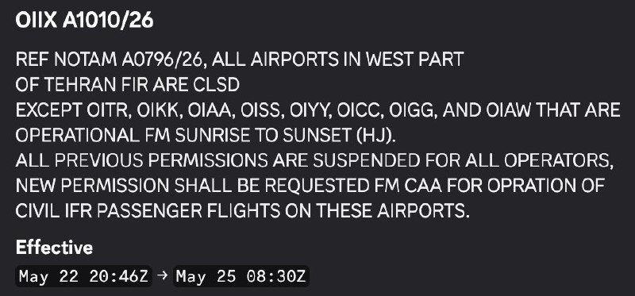

Faytuks Network ✓ @FaytuksNetwork
Fri, 22 May 2026 21:32:12 UTC

Details of the NOTAM

فارسی

جزئیات نوتام (NOTAM):

𝕏 · @shin_persian

## Shin_Persian — post 6161

  

Shin ✓ @hey_itsmyturn
Fri, 22 May 2026 21:37:46 UTC

Jet activity over Karaj, Alborz Province, #Iran

فارسی

فعالیت جنگنده‌ها بر فراز کرج، استان البرز، #Iran

𝕏 · @shin_persian

## Shin_Persian — post 6160

  

Shin ✓ @hey_itsmyturn
Fri, 22 May 2026 21:33:16 UTC

Received multiple reports regarding jet scramble from Mehrabad airport, Tehran
Tehran Province, #Iran

فارسی

گزارش‌های متعددی درباره برخاستن اضطراری (اسکرامبل) جنگنده‌ها از فرودگاه مهرآباد، تهران دریافت شده است.
استان تهران، #Iran

𝕏 · @shin_persian

## Shin_Persian — post 6158

افيخاي ادرعي ✓ @AvichayAdraee Fri, 22 May 2026 19:40:50 UTC #عاجل ‼️ إنذار عاجل إلى سكان لبنان وتحديدًا سكان منطقتيْ صور وزقوق المفدي 🔸في ضوء قيام حزب الله الارهابي بخرق اتفاق وقف اطلاق النار يضطر جيش الدفاع للعمل ضده بقوة. جيش الدفاع لا ينوي المساس بكم.…

## Shin_Persian — post 6157

افيخاي ادرعي ✓ @AvichayAdraee
Fri, 22 May 2026 19:40:50 UTC

#عاجل ‼️ إنذار عاجل إلى سكان لبنان وتحديدًا سكان منطقتيْ صور وزقوق المفدي

🔸في ضوء قيام حزب الله الارهابي بخرق اتفاق وقف اطلاق النار يضطر جيش الدفاع للعمل ضده بقوة. جيش الدفاع لا ينوي المساس بكم.

🔸نحث سكان المبنييْن المحدديْن بالأحمر في الخريطتيْن المرفقتيْن والمباني المجاورة لهما: أنتم تتواجدون بالقرب من مبنييْن يستخدمهما حزب الله الإرهابي فحرصًا على سلامتكم عليكم اخلائها فورًا والابتعاد عنها لمسافة لا تقل عن 500 متر

🔸البقاء في منطقة المباني المحددة يعرضكم للخطر

English

#Urgent ‼️ Urgent warning to the residents of Lebanon, specifically the residents of the Tyre (Sour) and Zghoq al-Mafdi areas.

🔸In light of the terrorist Hezbollah's violation of the ceasefire agreement, the IDF (Israel Defense Forces) is compelled to act against it forcefully. The IDF does not intend to harm you.

🔸We urge the residents of the two buildings marked in red on the attached maps and the buildings adjacent to them: You are located near two buildings used by the terrorist Hezbollah. For your safety, you must evacuate them immediately and move at least 500 meters away from them.

🔸Remaining in the vicinity of the designated buildings puts you in danger.

𝕏 · @shin_persian

## Shin_Persian — post 6156

🔁 Quoting above tweet:
Shin ✓ @hey_itsmyturn
Fri, 22 May 2026 20:14:51 UTC

#UAE 🇦🇪 was smart enough to learn it quickly: UAVs matter! UCAVs even more!

فارسی

#امارات 🇦🇪 به اندازه کافی هوشمند بود که این را به سرعت بیاموزد: پهپادها (UAV) مهم هستند! پهپادهای رزمی (UCAV) حتی بیشتر!

𝕏 · @shin_persian

## Shin_Persian — post 6155

  

↩️ Quoted tweet: De Faakto MENA ✓ @DeFaakto Wed, 20 May 2026 19:30:01 UTC 🧵 من يملك المسيرات يتحكم في حرب المستقبل تحليل OSINT 🔴 سؤال بسيط يعيد تعريف الحرب.. 🔴تخيل أنك تدفع مليون دولار لتُسقط طائرة كلفت صانعها عشرين ألفا فقط..؟ 🔴تخسر 50 ضعفا في كل اشتباك…

## Shin_Persian — post 6154

↩️ Quoted tweet:
De Faakto MENA ✓ @DeFaakto
Wed, 20 May 2026 19:30:01 UTC

🧵 من يملك المسيرات يتحكم في حرب المستقبل
تحليل OSINT

🔴 سؤال بسيط يعيد تعريف الحرب..

🔴تخيل أنك تدفع مليون دولار لتُسقط طائرة كلفت صانعها عشرين ألفا فقط..؟

🔴تخسر 50 ضعفا في كل اشتباك - وتسمي ذلك "نجاحاً دفاعيا"..
هذه ليست مفارقة نظرية، هذه هي حرب اليوم.

🟥في أبريل 2024،

↩️ Quoted tweet — see the post below for the reply.

English

🧵 Whoever owns the drones controls the war of the future
OSINT (Open-Source Intelligence) Analysis

🔴 A simple question that redefines warfare..

🔴 Imagine paying a million dollars to shoot down an aircraft that cost its maker only twenty thousand..?

🔴 You lose 50 times the cost in every engagement — and you call that a "defensive success"..
This is not a theoretical paradox; this is the war of today.

🟥 In April 2024,

𝕏 · @shin_persian

## Shin_Persian — post 6153

  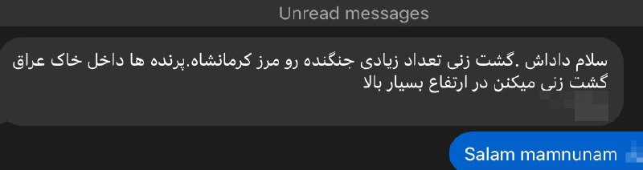

Shin ✓ @hey_itsmyturn
Fri, 22 May 2026 19:46:10 UTC

Intense jet activity over Eastern Iraq, near Iranian western borders.
#Iraq 🇮🇶

فارسی

فعالیت شدید جت‌های جنگنده برفراز شرق عراق، در نزدیکی مرزهای غربی ایران.
#Iraq 🇮🇶

𝕏 · @shin_persian

## FarsiVOA — post 218396

⚡️قتل شهروند مازندرانی با شلیک مستقیم مامور نیروی انتظامی؛ دو هزار ساعت خاموشی دیجیتال در ایران
@FarsiVOA

## FarsiVOA — post 218395

⚡️جزئیات ناپدید شدن مشکوک ٣ خدمه عراقی کشتی «بریج ۱ و ۲» در حوالی جزیره کیش
@FarsiVOA

## FarsiVOA — post 218394

  

⚡️دونالد ترامپ، رئیس‌جمهوری آمریکا، روز جمعه ۱ خرداد در یک سخنرانی در شهر سافرن ایالت نیویورک، با اشاره به اینکه آمریکا «بهترین و قدرتمندترین ارتش جهان» را دارد گفت «با عملیات خشم حماسی، نیروهای ما دارند اطمینان حاصل می‌کنند که [جمهوری اسلامی] ایران، بزرگ‌ترین حامی حکومتی تروریسم در جهان» و حکومت حامی تروریسم «شماره یک» در جهان دیگر هرگز موفق نشود.

او گفت جمهوری اسلامی «پولش را به سراسر دنیا می‌فرستد تا مشکل‌تراشی کند.»

آقای ترامپ گفت: «آن‌ها هرگز به سلاح هسته‌ای دست پیدا نخواهند کرد، و خودشان هم این را می‌دانند. می‌دانند. و آمریکا دوباره در حال پیروزی است.»
@FarsiVOA

## FarsiVOA — post 218393

🔺دونالد ترامپ: جمهوری اسلامی به‌شدت خواهان توافق است؛رهبرانشان از بین رفته‌اند

◾️دونالد ترامپ، رئیس‌جمهوری آمریکا، روز جمعه ۱ خرداد در یک سخنرانی در شهر سافرن ایالت نیویورک، با اشاره به جنبش حامیانش گفت «این جنبش بر پایه عقل سلیم شکل گرفته؛ ما مرزهای قدرتمند می‌خواهیم، آموزش خوب می‌خواهیم، مالیات پایین می‌خواهیم، و یک ارتش قدرتمند می‌خواهیم.»

⬇️ بیشتر بخوانید:
https://ir.voanews.com/a/8152854.html
@FarsiVOA

## FarsiVOA — post 218392

⚡️تشدید سرکوب شهروندان ایران و نگرانی از اعدام‌های بیشتر؛ گفت‌وگو با شیوا محبوبی
@FarsiVOA

## FarsiVOA — post 218391

  <a href="telegram/content/FarsiVOA_218391_1779486968.mp4" target="_blank">🎬 Download video</a>

⚡️محمد قائدی در برنامه تفسیر خبر: روسیه جرئت نمی‌کند به کشورهای عضو ناتو حمله کند
@FarsiVOA

## FarsiVOA — post 218390

⚡️جایزه انجمن جهانی جمهوری خواهان به مردم ایران؛ گفتگو با سردار پاشایی قهرمان و مربی پیشین کشتی ایران
@FarsiVOA

## FarsiVOA — post 218389

⚡️آیا جمهوری اسلامی شروط آمریکا را خواهد پذیرفت؟ گفت‌وگو با درویش رنجبر

@FarsiVOA

## FarsiVOA — post 218388

⚡️گفت‌و‌گو با محمود فرهمند، عضو پارلمان نروژ از حزب محافظه‌کار، درباره قطع‌نامه پارلمان اروپا در محکومیت جمهوری اسلامی به دلیل نقض حقوق بشر
@FarsiVOA

## FarsiVOA — post 218387

  <a href="telegram/content/FarsiVOA_218387_1779486969.mp4" target="_blank">🎬 Download video</a>

⚡️نیک‌آهنگ کوثر در برنامه تفسیر خبر: جمهوری اسلامی از ابتدا یک ساختار گروگانگیر بوده
@FarsiVOA

## FarsiVOA — post 218386

⚡️فیلم «دادگاه تاریخ»؛ روایت محکمه‌ای برای رسیدگی به جنایات جمهوری اسلامی گفت‌وگو با سعید دهقان
@FarsiVOA

## FarsiVOA — post 218385

  <a href="telegram/content/FarsiVOA_218385_1779486970.mp4" target="_blank">🎬 Download video</a>

⚡️پرونده ترور رهبران یهودی در آلمان؛ رد پای شبکه‌های برون‌مرزی جمهوری اسلامی
@FarsiVOA

## FarsiVOA — post 218384

  <a href="telegram/content/FarsiVOA_218384_1779486972.mp4" target="_blank">🎬 Download video</a>

⚡️لیلا مروتی در برنامه تفسیر خبر: جمهوری اسلامی مجبور به تسلیم خواهد شد
@FarsiVOA

## FarsiVOA — post 218383

⚡️گفت‌وگو با جمشید اسدی، اقتصاددان، پیرامون موضوع فرافکنی رژیم جمهوری اسلامی درباره علل و ریشه‌های مصائب اقتصادی ایران
@FarsiVOA

## FarsiVOA — post 218382

⚡️کمبود و گرانی سرسام‌آور داروهای اعصاب و روان در ایران؛ عواقب فردی و اجتماعی این بحران
@FarsiVOA

## FarsiVOA — post 218381

⚡️گفت‌و‌گو با یاسین اهوازی، کارشناس مسائل خاورمیانه، درباره گزارش‌ها درباره تلاش جمهوری اسلامی برای بازسازی توان موشکی و پهپادی‌ خود در دوران آتش‌بس
@FarsiVOA

## FarsiVOA — post 218380

🔺کناره‌‌گیری مدیر اطلاعات ملی آمریکا؛ تقدیر پرزیدنت ترامپ از عملکرد تولسی گابارد

◾️دونالد ترامپ، رئیس جمهوری آمریکا، روز جمعه ۱ خرداد با انتشار پیامی در شبکه اجتماعی تروت سوشال اعلام کرد که تولسی گابارد به دلیل بیماری همسرش و به منظور کمک به او در روند بهبودی، از سمت خود کناره‌گیری می‌کند.

⬇️ بیشتر بخوانید:

https://ir.voanews.com/a/president-trump-white-house-meeting-iran/8152838.html

## FarsiVOA — post 218379

واکنش‌ها به مصائب کسب‌و‌کارها در ایران در سایه خفقان دیجیتال؛ سرکوب اقلیت‌ها ادامه دارد

## FarsiVOA — post 218378

🔺تداوم بلاتکلیفی یک شهروند بهائی در زندان مشهد؛ سرکوب اقلیت‌های مذهبی توسط رژیم در ایران ادامه دارد

◾️گزارش‌های رسیده به صدای آمریکا حاکی از آن است که وفا کاشفی، شهروند بهائی ساکن مشهد، با گذشت یک‌ ماه از بازداشتش، کماکان در زندان وکیل‌آباد این شهر در وضعیت بلاتکلیف به‌سر می‌برد.

⬇️ بیشتر بخوانید:

https://ir.voanews.com/a/vafa-kashefi-iran-bahaaie-religious-repression-prison/8152834.html

## FarsiVOA — post 218377

علی جوانمردی: گزینەهای آمریکا در مقابل ایران، دیپلماسی توام با فشار روزافزون

## DW_Farsi — post 125028

  

🔶 مارکو روبیو: شاید به "طرح B" برای گشودن تنگه هرمز نیاز باشد

تنگه هرمز همچنان یکی از کانون‌های اصلی تنش در منازعه با ایران است. اکنون مارکو روبیو، وزیر امور خارجه ایالات متحده، به صراحت از یک "طرح B" (نقشه دوم) سخن می‌گوید؛ این طرح دوم برای زمانی است که این آبراه حیاتی همچنان مسدود بماند یا بار دیگر هدف حمله قرار گیرد.

مارکو روبیو در جریان نشست وزرای امور خارجه ناتو در سوئد، خواستار بررسی یک "طرح B" برای بازگشایی تنگه هرمز شد. روبیو در شهر هلسینگبوری اظهار داشت که همگان از توافقی با ایران که شامل بازگشایی این تنگه، به عنوان شاهراهی حیاتی برای بازار جهانی نفت و گاز، باشد، استقبال می‌کنند. اما اگر ایران از بازگشایی این آبراه امتناع کند و تصمیم بگیرد کنترل آن را حفظ کرده و برای عبور و مرور عوارض دریافت کند، به یک "طرح B" نیاز خواهد بود.

روبیو در ادامه افزود: «من امروز این موضوع را مطرح کردم و با موافقت‌های زیادی روبه‌رو شدم، (...) اما امروز خبر یا بیانیه رسمی برای اعلام به شما (خبرنگاران) ندارم.»
@edw_farsi

## DW_Farsi — post 125027

  

🔶 ورود عاصم منیر به تهران؛ بقایی: اختلافات با آمریکا زیاد است

محمدباقر قالیباف، رئیس هیات مذاکره‌کننده جمهوری اسلامی با آمریکا، اسماعیل بقایی سخنگوی وزارت امور خارجه را به عنوان سخنگوی این هیات منصوب کرد.

در حکم انتصاب بقایی آمده است: «بدین وسیله جنابعالی را که یکی از نیروهای انقلابی و متخصص در حقوق بین الملل هستید و تجربیات مناسب در حوزه دیپلماسی داشته و مسئولیت سخنگویی وزارت امور خارجه را هم برعهده دارید، به عنوان سخنگوی هیات مذاکراتی میناب ۱۶۸ منصوب می‌کنم.»

همزمان با اعلام بقایی به عنوان سخنگوی هیات مذاکره‌کننده ایران، او در مصاحبه‌ای از آخرین جزئیات مربوط به تلاش‌های پاکستان برای نزدیک‌کردن دیدگاه‌های تهران و واشنگتن خبر داد.

در حالی که در تداوم حضور وزیر کشور پاکستان در تهران برای پیشبرد هر چه فشرده مذاکرات عصر پنجشنبه ۱ خرداد، عاصم منیر، فرمانده ارتش این کشور نیز وارد تهران شد، اما به گفته بقایی "اختلاف‌نظرها بین ایران و آمریکا آن‌قدر عمیق و زیاد است که نمی‌شود گفت با چندبار رفت‌وآمد یا مذاکرات ظرف چند هفته ما باید حتماً به نتیجه برسیم".
@dw_farsi

## DW_Farsi — post 125026

  

🔶 هشدار کشورهای غربی به اسرائیل در مورد توسعه غیرقانونی شهرک‌سازی‌ها و خشونت‌ها

۹ کشور غربی در بیانیه‌ای مشترک، ضمن محکوم کردن خشونت‌های شهرک‌نشینان و هشدار به شرکت‌های ساخت‌وساز در خصوص عدم شرکت در مناقصه‌ها، از اسرائیل خواستند تا توسعه شهرک‌های خود را در کرانه باختری اشغالی متوقف کند.

در این بیانیه مشترک که روز جمعه ۲۲ مه، منتشر شد، رهبران کشورهای بریتانیا، فرانسه، آلمان، ایتالیا، کانادا، استرالیا، نیوزیلند، نروژ و هلند تأکید کردند که این شهرک‌سازی‌ها ناقض قوانین بین‌المللی است.

در بخش از این بیانیه آمده است: «طی چند ماه گذشته، وضعیت در کرانه باختری به شکل چشمگیری وخیم‌تر شده است. خشونت شهرک‌نشینان به سطحی بی‌سابقه رسیده است. سیاست‌ها و اقدامات دولت اسرائیل، از جمله تحکیم هرچه بیشتر کنترل خود بر این مناطق، در حال تضعیف ثبات و چشم‌اندازهای دستیابی به راه‌حل دو کشوری است.»

گروه‌های حقوق بشری می‌گویند مقامات اسرائیلی به شهرک‌نشینان اجازه داده‌اند تا در حملات خود علیه فلسطینیان، از مصونیت کامل از مجازات برخوردار باشند.
@dw_farsi

## DW_Farsi — post 125025

  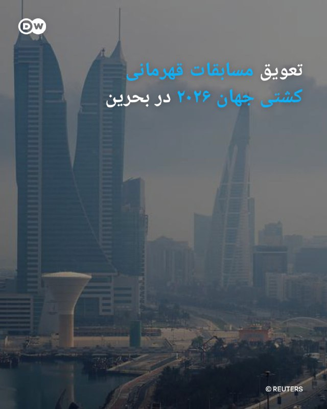

🔶 تعویق مسابقات قهرمانی کشتی جهان ۲۰۲۶ در بحرین

اتحادیه جهانی کشتی (UWW) با صدور بیانیه‌ای اعلام کرد که در هماهنگی نزدیک با کمیته المپیک بحرین و فدراسیون کشتی این کشور، مسابقات قهرمانی جهان ۲۰۲۶ را که در ابتدا قرار بود از ۲۴ اکتبر تا ۱ نوامبر در بحرین برگزار شود به زمانی دیگر موکول می‌شود.

بنا بر این بیانیه، تصمیم تعویط جام جهانی کشتی "پس از بررسی دقیق و مسئولانه شرایط ژئوپلیتیک کنونی منطقه، به ویژه بلاتکلیفی‌های جاری پیرامون مناقشات در حال وقوع در حوزه خلیج [فارس] و تأثیرات گسترده‌تر آن بر ثبات منطقه و سفرهای بین‌المللی اتخاذ شده است".

در ادامه بیانیه آمده است: «ورزش کشتی همواره فراتر از یک رقابت صرف بوده است؛ کشتی پلی میان ملت‌ها، فرهنگ‌ها و مردم است. در روزگاری که جهان با بلاتکلیفی و تفرقه روبروست، به ما یادآوری می‌شود که ورزش همچنان زبان مشترک صلح، احترام و اتحاد است. با همین رویکرد و روحیه است که اتحادیه جهانی کشتی، کمیته المپیک بحرین و فدراسیون کشتی بحرین این بیانیه مشترک را صادر می‌کنند.»
@dw_farsi

## DW_Farsi — post 125024

🎥 ۲۷ خواهر و برادر ناتنی؛ جست‌وجو برای پدر بیولوژیکی

در اروپا، همزمان با افزایش اهدای اسپرم، بحث بر سر حق فرزندان برای شناخت هویت بیولوژیکی‌شان جدی‌تر شده؛ آیا کودکانی که از طریق اهدای اسپرم متولد می‌شوند، باید حق شناخت پدر بیولوژیکی‌شان را داشته باشند؟ لئونتین از سوئد، ۲۷ خواهر و برادر ناتنی پیدا کرد، اما هنوز یک سؤال بی‌پاسخ مانده؛ پدر واقعی‌اش کیست؟
@dw_farsi

## DW_Farsi — post 125023

🔶 اختلاف ترامپ و نتانیاهو درباره ایران؛ جنگ یا دیپلماسی؟

🔻 گزارشی از مراد رحمتی

مقام‌های اسرائیلی می‌گویند دونالد ترامپ، رئیس جمهور آمریکا به نتانیاهو اطمینان داده هرگونه توافق احتمالی با تهران شامل خروج ذخایر اورانیوم غنی‌شده ایران خواهد بود؛ موضوعی که اسرائیل آن را خط قرمز امنیتی خود می‌داند.

در مقابل، نتانیاهو بارها تاکید کرده است که پایان جنگ تنها زمانی معنا خواهد داشت که علاوه بر توقف برنامه هسته‌ای، حمایت جمهوری اسلامی از نیروهای نیابتی منطقه‌ای و توان موشک‌های بالستیک ایران نیز از میان برود.

اکنون این پرسش مطرح است که در نهایت آیا دیپلماسی دست بالا را خواهد داشت یا تقابل نظامی ادامه پیدا می‌کند؟ و اگر آمریکا بدون توجه به اولویت‌های اسرائیل با جمهوری اسلامی به توافق برسد، آیا اسرائیل آن را می‌پذیرد یا دوباره به اقدام نظامی مستقیم روی خواهد آورد؟ این‌ها محور گفت‌وگوی دویچه وله با دو کارشناس است.
@dw_farsi

## DW_Farsi — post 125022

  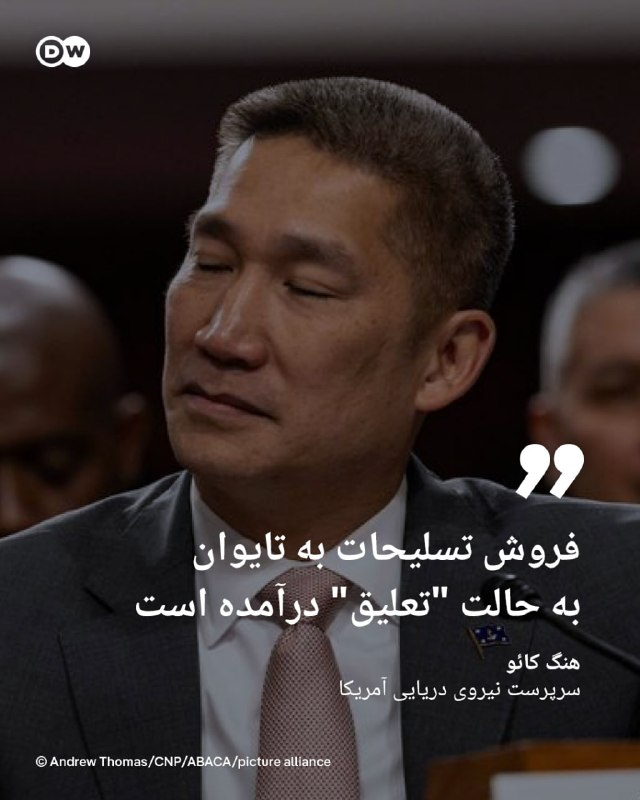

🔶 تعلیق فروش ۱۴ میلیارد دلاری سلاح آمریکا به تایوان به دلیل جنگ ایران

سرپرست نیروی دریایی ایالات متحده روز پنجشنبه، ۲۲ مه، اعلام کرد که فروش تسلیحات به تایوان به حالت "تعلیق" درآمده است تا اطمینان حاصل شود ارتش آمریکا مهمات کافی برای عملیات‌های خود در قبال ایران را در اختیار دارد.

هنگ کائو، سرپرست نیروی دریایی آمریکا، در یک جلسه استماع در کنگره و در پاسخ به سؤالی درباره خرید تسلیحاتی معطل‌مانده و ۱۴ میلیارد دلاری تایوان گفت: «در حال حاضر ما یک وقفه (تعلیق) ایجاد کرده‌ایم تا مطمئن شویم مهمات مورد نیاز برای عملیات "خشم حماسی" (Epic Fury) را در اختیار داریم، که البته مقدار زیادی هم داریم.»

او افزود: «اما ما فقط می‌خواهیم اطمینان حاصل کنیم که همه‌چیز را در اختیار داریم؛ پس از آن، هر زمان که دولت صلاح بداند، فروش نظامی به کشورهای خارجی از سر گرفته خواهد شد.»

وزارت امور خارجه و پنتاگون (وزارت دفاع آمریکا) بلافاصله به درخواست‌ها برای اظهار نظر درباره سخنان کائو پاسخ ندادند.
@-dw_farsi

## DW_Farsi — post 125021

  

🔶 مارک روته حمایت ناتو از عملیات نظامی در تنگه هرمز را محتمل دانست

یوهان واده‌فول، وزیر امور خارجه آلمان، در تازه‌ترین اظهارنظر خود، محتاطانه در مورد مأموریت احتمالی ناتو در آزادسازی تنگه هرمز سخن گفت.

او اعلام کرد که آلمان همیشه آماده است تا امنیت تردد آزاد در آنجا را تضمین کند و تحت رهبری بریتانیا و فرانسه در حال آماده‌سازی برای این عملیات‌ است.

این سیاستمدار حزب دموکرات مسیحی که در جریان نشست وزرای امور خارجه ناتو در شهر بندری هلسینگبوری سوئد سخن می‌گفت، در عین حال افزود: «اما من هیچ مأموریت فوری ناتو به معنای کلاسیک آن را در تنگه هرمز پیش‌بینی نمی‌کنم.»

روته نیز در ادامه سخنان خود گفت که تلاش‌هایی در جریان است تا متحدان اروپایی بتوانند در مرحله بعدی، بیشترین کمک ممکن را ارائه دهند.

به گفته دیپلمات‌ها، در این مسیر مشارکت دادن ناتو نیز می‌تواند منطقی باشد؛ به‌ویژه از این جهت که دونالد ترامپ، رئیس‌جمهور آمریکا، اخیراً چندین بار ارزش افزوده و فایده ناتو را برای کشورش زیر سؤال برده است.
@dw_farsi

## Persian_Trend_Official — post 14693

  <a href="telegram/content/Persian_Trend_Official_14693_1779486978.webm" target="_blank">🎬 Download video</a>

🔴 هیئت قطری تهران را ترک کرد

💢گزارش‌ها حاکی است هیئت قطری پس از رایزنی‌های دیپلماتیک، تهران را ترک کرده است.

💢این سفر در حالی انجام شد که قطر در کنار پاکستان و چند کشور منطقه، در تلاش برای میانجیگری میان ایران و آمریکا جهت دستیابی به توافقی برای پایان جنگ و ادامه مذاکرات هسته‌ای بود.

🫆:Tony

📌 @persian_trend_official
پرشین ترند | متفاوت‌ترین کانال نظامی

## Persian_Trend_Official — post 14692

  <a href="telegram/content/Persian_Trend_Official_14692_1779486979.mp4" target="_blank">🎬 Download video</a>

💢 ترامپ

💢باور کنید من توانستم این معادله را حل‌ کنم
!
‌‌(203 × 9 ÷2+ 1324 − 1292) × 19

🫆:Tony

📌 @persian_trend_official
پرشین ترند | متفاوت‌ترین کانال نظامی

## Persian_Trend_Official — post 14691

  <a href="telegram/content/Persian_Trend_Official_14691_1779486981.webm" target="_blank">🎬 Download video</a>

🔴 ایران بخشی از حریم هوایی غرب کشور را تا دوشنبه بست

💢گزارش‌ها حاکی است ایران بخشی از حریم هوایی غرب کشور را برای پروازهای شبانه از غروب تا طلوع خورشید تا روز دوشنبه بسته است.

🫆:Tony

📌 @persian_trend_official
پرشین ترند | متفاوت‌ترین کانال نظامی

## Persian_Trend_Official — post 14689

  <a href="telegram/content/Persian_Trend_Official_14689_1779486982.mp4" target="_blank">🎬 Download video</a>

🔥هم اکنون بندر نووروسییسک، روسیه مورد حمله موشکی پهپادی اوکراینی ها قرارگرفت،

👩‍💻☆Phantom☆

🆔 @persian_trend_official
پرشین ترند | متفاوت‌ترین کانال نظامی

## Persian_Trend_Official — post 14687

  

شبتون بخیر 🔥❤️

توضیح عکس:
یک مرد آمریکایی موقع طوفان فلوریدا از داخلش خونه‌ش این عکس رو گرفته، چند تن فشار رو این درب و شیشه‌ها تحمل کردن!!!

این یعنی کارخانه شیشه، قاب، گسکت، نصاب، استراکچر، ریل و... همه کارشون رو به نحو احسن انجام دادند.

📝 Nick
📌 @persian_trend_official
پرشین ترند | متفاوت‌ترین کانال نظامی

## Persian_Trend_Official — post 14686

https://youtube.com/live/D0LvFYIUbgw?feature=share

## Persian_Trend_Official — post 14685

  <a href="https://t.me/persian_trend_official/14685" target="_blank">📎 Download file</a>

فایل صوتی لایو اول
نسخه کم حجم - 5.94 مگابایت

اتاق جنگ جمعه 1 خرداد | عاصم منیر در تهران برای التیماتوم یا توافق؟

📝 Nick

📌 @persian_trend_official
پرشین ترند | متفاوت‌ترین کانال نظامی

## Persian_Trend_Official — post 14684

  <a href="telegram/content/Persian_Trend_Official_14684_1779486986.webm" target="_blank">🎬 Download video</a>

https://youtube.com/live/D0LvFYIUbgw?feature=share

## Persian_Trend_Official — post 14683

تا دقایقی دیگه لایو امشب آغاز میشه

## RadioFarda — post 157464

  <a href="https://t.me/radiofarda/157464" target="_blank">📎 Download file</a>

📻بشنوید: خبرهای ساعت ۲۱ با رادیوفردا، اول خرداد ۱۴۰۵‌

@RadioFarda

## RadioFarda — post 157463

  

🔸مدیر اطلاعات ملی ایالات متحده روز جمعه اول خردادماه از تصمیمش برای کناره‌گیری خبر داد.

🔸تولسی گابارد این موضوع را با انتشار مطلبی در شبکۀ ایکس اعلام کرد. خانم گابارد در نامه‌اش خطاب به دونالد ترامپ، دلیل تصمیمش را، مراقبت از همسرش که اخیراً مبتلا به «نوعی بسیار نادر از سرطان استخوان» تشخیص داده شده، عنوان کرده است.

🔸از سوی دیگر رویترز به نقل از یک منبع آگاه از موضوع، نوشته که او ادعا کرده کاخ سفید خانم گابارد را برای کناره‌گیری «تحت فشار» قرار داده بود.

🔸پیشتر اختلاف دیدگاه‌هایی بین رئیس‌جمهور ایالات متحده و مدیر امنیت ملی‌اش، بخصوص در قبال ایران بروز کرده بود. دونالد ترامپ در فروردین‌ماه هم اشاره کرده بود که از نظر او، تولسی گابارد در قبال برچیده‌شدن بلندپروازی‌های هسته‌ای ایران، «موضع نرم‌تری» دارد.

🔸خانم گابارد بیش از یک سال پیش، پنجم فروردین‌ماه ۱۴۰۴ به کنگره گفته بود که ایران در حال ساخت سلاح هسته‌ای نیست.

@RadioFarda

## RadioFarda — post 157462

🔸قوه قضائیه جمهوری اسلامی از تشکیل پرونده برای دست‌اندرکاران فیلم «تهران کنارت» خبر داده است.

🔸این اقدام پس از اعتراض خبرگزاری فارس و راه‌اندازی کارزاری برای توقف اکران فیلم انجام شد.

🔸خبرگزاری فارس، صحنه‌هایی از تیزر این فیلم را «منافی با عفت عمومی» دانست.

🔸موضوعی که با واکنش تند حسین فرح بخش کارگردان مواجه شد.

🔸«تهران کنارت»، دومین فیلم علی بهراد، تصویری لوکس و فانتزی از پایتخت ایران نشان می‌دهد. تصویری با شخصیت‌هایی که با همه ناملایمات اجتماعی، اقتصادی و سیاسی، با سبک زندگی خاصی برای خود ساخته‌اند تا دوام بیاورند.

🔸در ادامه اعلام شده این فیلم پس از «اصلاح» برخی سکانس‌ها و تیزر تبلیغاتی، دوباره اکران خواهد شد.

@RadioFarda

## RadioFarda — post 157461

  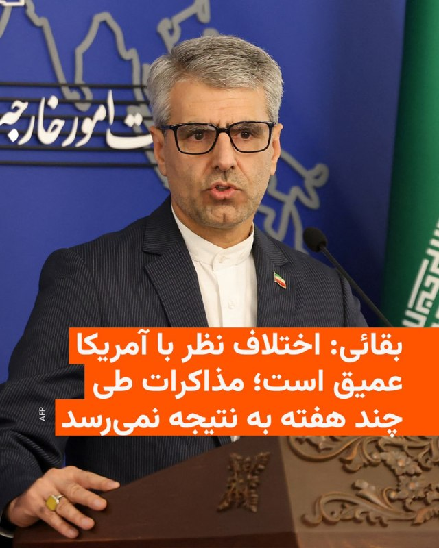

🔸سخنگوی هیئت مذاکره‌کننده ایران با آمریکا روز جمعه گفت که موضوع پرونده هسته‌ای ایران در این مرحله مورد مذاکره نیست و از اختلاف نظر عمیق با آمریکا خبر داد.

🔸اسماعیل بقائی گفت: «اختلاف‌نظرها بین ایران و آمریکا آن‌قدر عمیق و زیاد است که نمی‌شود گفت با چندبار رفت‌وآمد یا مذاکرات ظرف چند هفته ما باید حتماً به نتیجه برسیم.»

🔸او گزارش‌ها درباره قریب‌الوقوع بودن توافق با آمریکا را رد کرد و اعلام کرد: «نمی‌توانیم بگوییم ضرورتاً به جایی رسیده‌ایم که توافق نزدیک است.»

🔸بقائی بار دیگر موضع جمهوری اسلامی درباره برنامه هسته‌ای و اورانیوم غنی‌شده را تکرار کرد و گفت مواضع ایران قبلاً اعلام شده است.

🔸این در حالی است که ساعتی قبل، مارکو روبیو، وزیر خارجه آمریکا اعلام کرد که موضوع آینده غنی‌سازی اورانیوم در ایران باید در دستور کار مذاکرات باشد.

🔸دونالد ترامپ، رئیس‌جمهور ایالات متحده، نیز بارها تأکید کرده که ایران نباید به سلاح هسته‌ای دست یابد.

@RadioFarda

## RadioFarda — post 157460

🔸چهارمین برنامه «موزیک تک» با محوریت «صداهای جنوب» در موزه هنرهای معاصر تهران برگزار شد.

🔸در بخشی از این برنامه، گروهی از زنان نیز قطعه‌ای را اجرا کردند که با استقبال حاضران روبه‌رو شد.

🔸زنان در جمهوری اسلامی طی چهار دهه گذشته اجازه تک‌خوانی در برابر مخاطبان مرد را نداشته‌اند و فعالیت خوانندگان زن همواره با محدودیت‌های گسترده روبه‌رو بوده است.

@RadioFarda

## IranianMinds — post 20573

  

🔴فضای هوایی غرب ایران طبق یک NOTAMجدید تا صبح روز دوشنبه بسته شده است.

@IranianMinds

## IranianMinds — post 20572

🔴 ترامپ :

من این محاسبه را درست انجام دادم

(203 × 9 ÷ 2 + 1324 − 1292) × 19

@IranianMinds

## IranianMinds — post 20571

🔴اکسیوس به نقل از یک منبع نزدیک به ترامپ نوشت:

رئیس جمهوری آمریکا در روزهای اخیر بسیار خسته شده و احتمال انجام یک عملیات نظامی نهایی و گسترده را اعلام کرده است.
عملیاتی که پس از آن بتواند اعلام پیروزی کرده و به جنگ پایان بدهد.

@IranianMinds

## IranianMinds — post 20570

🔴الجزیره به نقل از یک مقام ایرانی:
آزاد‌سازی دارایی‌های بلوکه شده و لغو تحریم‌های صادرات نفت برای ایران موضوع حاشیه‌ای نیست.

@IranianMinds

## IranianMinds — post 20569

🔴 ادعای اکسیوس: یک مقام آمریکایی، مذاکرات را «طاقت‌فرسا» توصیف کرد

این مقام آمریکایی گفت که پیش‌نویس‌ها «هر روز در حال رفت و برگشت هستند» بدون آنکه پیشرفت چشمگیری حاصل شود

@IranianMinds

## IranianMinds — post 20568

🔴 الجزیره نقل از مقام ایرانی:
میانجی‌ها در تلاشند فاصله بین ایران و امریکا رو کم کنند ولی فقط فضای مثبت و اقدامات میانجی ها کافی نیست!

@IranianMinds

## IranianMinds — post 20567

🔴 اکسیوس نقل از مقام آمریکایی: مذاکرات بسیار دست و پا گیر است و پیش نویس ها هر روز بدون پیشرفت زیادی به این سو و آن سو می روند.

@IranianMinds

## IranianMinds — post 20566

  

@Daeijoonbot
@Daeijoonbot
@Daeijoonbot
کانفیگ رایگان میده به کل ایران👆

## IranianMinds — post 20565

🔴 کانال ۱۲ اسرائیل:

تفاهمات بین اسرائیل و آمریکا بر این اساس است که اورانیوم غنی‌شده یا امکان غنی‌سازی در اختیار ایران باقی نماند!

@IranianMinds

## IranianMinds — post 20564

  

پست ترامپ:

با اینکه بسیار دوست داشتم کنار پسرم دان جونیور و جدید‌ترین عضو خانواده ترامپ، همسر آینده‌اش بتینا باشم، شرایط مربوط به دولت و عشق من به ایالات متحده آمریکا، اجازه چنین کاری را به من نمی‌دهد.
احساس می‌کنم مهم است که در این دوره مهم زمانی، در واشینگتن دی‌سی و در کاخ سفید بمانم. به دان و بتینا تبریک می‌گویم!
رئیس‌جمهور دونالد جی، ترامپ

@IranianMinds

## IranianMinds — post 20563

عزیزان اخبار رو از چنل مردمی و‌ خوب فایتر رادار هم میتونید دنبال کنید سریع براتون پوشش میدن و موضوعش کاملا شبیه چنل خودمونه جوین باشید حتما:

https://t.me/+9C1ENi5qn6hhZjk0

https://t.me/+9C1ENi5qn6hhZjk0

## BBCPersian — post 281813

  

🔻تولسی گابارد اعلام کرد که از سمت خود به‌عنوان مدیر اطلاعات ملی ایالات متحده آمریکا در دولت دونالد ترامپ کناره‌گیری خواهد کرد. او دلیل این تصمیم را تشخیص سرطان استخوان همسرش عنوان کرده است.

خانم گابارد در نامه استعفای خود که به دست شبکه سی‌بی‌اس نیوز رسیده، نوشته است: «قدرت و عشق او در همه چالش‌ها پشتیبان من بوده است. نمی‌توانم با وجدان آسوده از او بخواهم این مبارزه را به تنهایی پشت سر بگذارد، در حالی که من همچنان در این مسئولیت دشوار و پرمشغله باقی بمانم.»

دونالد ترامپ، رئیس جمهور آمریکا نیز در پیامی در شبکه‌های اجتماعی نوشت که گابارد «کار فوق‌العاده‌ای انجام داده و دلتنگش خواهیم شد.»

استعفای او از ۳۰ ژوئن، ۹ تیر ۱۴۰۵، اجرایی می‌شود و به گفته آقای ترامپ، آرون لوکاس، معاون اصلی مدیر اطلاعات ملی، به‌طور موقت این سمت را برعهده خواهد گرفت.

ادامه خبر را از لینک زیر در وبسایت بی‌بی‌سی فارسی بخوانید.

📷 Bloomberg via Getty Images
https://bbc.in/4dqxAv9
‌@BBCPersian

## BBCPersian — post 281812

🔻مارکو روبیو، وزیر خارجه آمریکا درحاشیه نشست وزرای خارجه کشورهای عضو ناتو با هاکان فیدان، وزیر خارجه ترکیه گفت‌وگو کرد.

آقای روبیو با اشاره به این دیدار در شبکه ایکس نوشت: «در دیدار با هاکان فیدان درباره ضرورت پایبندی همه متحدان به تعهدات دفاعی و همچنین برنامه‌های مربوط به نشست آینده ناتو در ترکیه گفت‌و‌گو کردیم.»

او همچنین گفت که در این دیدار درباره بازگشایی تنگه هرمز و تلاش برای دستیابی به ثبات در منطقه با آقای فیدان مذاکره کرده است.

نشست وزرای خارجه عضو ناتو امروز در سوئد برگزار شده است.

https://bbc.in/4nNPWtx
@BBCPersian

## BBCPersian — post 281811

  

🔻ایرنا، خبرگزاری رسمی ایران می‌گوید که محمدباقر قالیباف،‌ رئیس هیئت مذاکره کننده ایرانی،‌ اسماعیل بقایی،‌ سخنگوی وزارت خارجه را به عنوان سخنگوی «هیئت میناب ۱۶۸» منصوب کرده است.

پیشتر در سفرهیئت ایرانی به پاکستان گفته شده بود که نام هیئت مذاکره کننده ایران به یادبود کشته شدگان مدرسه میناب «هیئت میناب ۱۶۸» نام دارد.

آقای قالیباف در حکمی که ایرنا آن را منتشر کرد نوشت: «امیدوارم با دقت و مسئولیت‌پذیری که از شما سراغ دارم، در این سنگر مبارزه بتوانید در روشنگری و تبین مواضع جمهوری اسلامی ایران در جهان» موفق باشید.

جزئیاتی از مذاکرات منتشر نشده است اما در حال حاضر وزیر کشور و فرمانده ارتش پاکستان و یک هیئت قطری در تهران به سر می‌برند.

پیشتر مقامات آمریکایی گفته بودند که مذاکرات در جریان است.

همچنین اقای بقایی عصر امروز گفت که این مرحله از مذاکرات بر خاتمه جنگ تمرکز دارد و جزئیات مباحث مرتبط با موضوع هسته‌ای قرار نیست مورد بحث قرار گیرد.

این در حالی است که آقای ترامپ بارها تاکید کرده است که اولویتش پرونده هسته‌ای ایران است.

📷 AFP via Getty Images
https://bbc.in/4tKarbL
@BBCPersian

## BBCPersian — post 281810

  <a href="telegram/content/BBCPersian_281810_1779486993.mp4" target="_blank">🎬 Download video</a>

🔻آخرین خبرهای مهم جمعه ۱ خرداد ۱۴۰۵
@BBCPersian

## BBCPersian — post 281809

🔻وزیر کشور ایران از فرمانده ارتش پاکستان در تهران استقبال کرد

فیلد مارشال عاصم منیر، فرمانده ارتش پاکستان و هیات همراهش شامگاه جمعه وارد تهران شدند.

به گزارش ایرنا اسکندر مؤمنی وزیر کشور جمهوری اسلامی از او استقبال کرد.

بر اساس گزارش ایرنا محسن نقوی وزیر کشور پاکستان هم که از چهارشنبه در تهران به سر می‌برد در مراسم استقبال حضور داشت.

ارتش پاکستان در یک بیانیه کوتاه هدف سفر عاصم منیر را «بخشی از تلاش‌های میانجیگری میان ایران و آمریکا» توصیف کرد.

https://bbc.in/4v3pH4G
@BBCPersian

## BBCPersian — post 281808

🔻سخنگوی وزارت خارجه ایران حضور هیئتی از قطر را در تهران تایید کرد

اسماعیل بقایی،‌ سخنگوی وزارت خارجه ایران تایید کرد که یک هیئت از قطر روز جمعه در تهران بودند و با عباس عراقچی وزیر خارجه ایران گفت‌وگو کردند.

او بدون ارائه جزئیات گفت که کشورهای مختلفی طی روزهای اخیر با وزیر خارجه گفتوگو کردند اما تاکید کرد که میانجی اصلی میان ایران و آمریکا همان کشور پاکستان است.

پیشتر رویترز به نقل از یک منبع آگاه گزارش داد که هیئتی از قطر در هماهنگی با آمریکا وارد تهران شده است.

قطر و امارات و عربستان سعودی سه کشوری بودند که آقای ترامپ روز دوشنبه گفت که به درخواست آنها فعلا حمله مجدد به ایران را متوقف کرده است.

https://bbc.in/4v3pH4G
@BBCPersian

## BBCPersian — post 281807

  

🔻دونالد ترامپ،‌ رئیس جمهور آمریکا می‌گوید که برخلاف میلش،‌ در مراسم عروسی دونالد ترامپ جونیور، پسر بزرگش شرکت نمی‌کند، چون باید در واشنگتن و کاخ سفید بماند.

رسانه‌های آمریکایی پیشتر گزارش داده بودند که قرار است در تعطیلات آخر هفته، مراسم عروسی پسر بزرگ آقای ترامپ با بتینا اندرسون در جزیره‌ای در باهاما برگزار شود.

آقای ترامپ در پستی در تروث سوشال،‌ شبکه اجتماعی خودش نوشت: «در حالیکه خیلی دوست داشتم با پسرم دان جونیور و بتینا،‌ جدیدترین عضو خانواده ترامپ و همسر آینده‌اش باشم،‌ شرایط کارهای مربوط به دولت و عشق من به ایالات متحده به من اجازه این‌کار را نمی‌دهد.»

او در ادامه افزود: «حس می‌کنم مهم است که در این برهه زمانی مهم در واشنگتن دی‌سی،‌ در کاخ سفید بمانم.»

آقای ترامپ،‌ دیروز پنجشنبه هم در یک مصاحبه گفته بود که سعی دارد در مراسم عروسی پسرش شرکت کند اما زمان این مراسم برای او مناسبت نیست چون درگیر مسائلی از جمله ایران است.

📸 EPA

https://bbc.in/4v3pH4G
@BBCPersian

## BBCPersian — post 281806

🔻همزمان با تشدید تلاش‌های دیپلماتیک؛ ترامپ باردیگر گفت که ایران مشتاق رسیدن به توافق است

دونالد ترامپ، رئیس‌جمهور آمریکا روز جمعه در کاخ سفید باردیگر گفت که کاری کرده است که «ایران مشتاق رسیدن به توافق است.»

آقای ترامپ گفت: «می‌بینید ما با ایران چه کرده‌ایم؟ ایران مشتاق رسیدن به توافق است. خواهیم دید چه می‌شود. اما ما به آنها ضربه سختی زدیم و چاره دیگری هم نداشتیم چون ایران نباید سلاح هسته‌ای داشته باشد. آنها نمی‌توانند آن را داشته باشند.»

این اظهارات آقای ترامپ در حالی مطرح شده است که به نظر می‌رسد تحرکات دیپلماتیک برای کمک به رفع اختلافات ایران و آمریکا و حصول نوعی توافق صلح شتاب بیشتری گرفته است. فیلد مارشال عاصم منیر،‌ فرمانده ارتش پاکستان، شامگاه جمعه وارد تهران شد.

محسن نقوی، وزیر کشور پاکستان هم در تهران با عباس عراقچی، وزیر خارجه ایران برای دومین بار طی دو روز گذشته دیدار کرد.

رویترز هم می‌گوید که هیئتی از قطر به تهران سفر کردند.

https://bbc.in/4v3pH4G
@BBCPersian

## BBCPersian — post 281805

  <a href="https://t.me/bbcpersian/281805" target="_blank">📎 Download file</a>

پادکست برنامه جام جهان‌نما جمعه ۱ خرداد ۱۴۰۵
این برنامه رادیویی را می‌توانید هر شب ساعت ۲۰ به وقت ایران، روی موج متوسط ۷۰۲ کیلوهرتز و موج کوتاه ۹۴۶۵ کیلوهرتز بشنوید.

تکرار برنامه را هم می‌توانید ساعت ۲۱:۳۰ روی موج متوسط ۷۰۲ کیلوهرتز و موج کوتاه ۵۳۹۵ کیلوهرتز گوش کنید.
@BBCPersian

## Dirty_Kids — post 389978

  <a href="telegram/content/Dirty_Kids_389978_1779486997.mp4" target="_blank">🎬 Download video</a>

پرزیدنت ترامپ خطاب به شخصی که داشت در سخنرانیش شلوغ میکرد گفت “برو خونه پیش مامانت!”

@Dirty_Kids 👻

## Dirty_Kids — post 389977

  <a href="telegram/content/Dirty_Kids_389977_1779486999.mp4" target="_blank">🎬 Download video</a>

این شما و این دلقک بازی جدید ترامپ، رئیس جمهور ایالات متحده:

@Dirty_Kids 👻

## Dirty_Kids — post 389976

  <a href="telegram/content/Dirty_Kids_389976_1779487001.mp4" target="_blank">🎬 Download video</a>

ترامپ از حضار خواستن با تشویق هاشون نشون بدن لقب “اسلیپی جو بایدن” رو بیشتر دوس دارن یا “کروکد جو بایدن”…

@Dirty_Kids 👻

## Dirty_Kids — post 389975

  

همه‌ی امتحانات نیم‌سال جاری دانشگاه پیام‌نور، غیرحضوری و مجازی شد.

@Dirty_Kids 👻

## Dirty_Kids — post 389974

  <a href="telegram/content/Dirty_Kids_389974_1779487003.mp4" target="_blank">🎬 Download video</a>

توی انگلیس دو تا مسلمون جلوى چشم عموم، داخل اتوبوس دو طبقه شهرى رابطه جنسی برقرار میکنن!

@Dirty_Kids 👻

## Dirty_Kids — post 389973

  <a href="telegram/content/Dirty_Kids_389973_1779487004.mp4" target="_blank">🎬 Download video</a>

سوشا مکانی میگه تو جام‌جهانی نرید استادیوم پول بیلط‌ها میره تو جیب جمهوری اسلامی!!!!!!!!!!!!! 😐

این نظر منه فقط، نسخه برا کسی نیست 👇

آقای مکانی اجازه بده قانع نشیم، چص مثقال پول بلیط تخم ج.ا نیست، ضمن اینکه درآمد از حضور تو بازی‌هاس و تیم‌ها هرچی برن بالاتر پول بیشتری میگیرن، پر بودن و خالی بودن استادیوم هیچ تاثیری نداره تو پولی که بهش میرسه، بلیط فروشی برای فیفاس
و فیفا پول‌های ج.ا رو بلوکه میکنه

جمهوری اسلامی میلیارد دلاری داره خرج پرپاگانداش میکنه تا چهره خوبی بسازه برای رسانه‌ها لَنگِ چص‌تومن پول بلیطه!

از ترس کونش ۲سال استادیوم آزادی بسته مردم نرن شعار بدن
۱ساله بازی‌هاشو بدون تماشاچی کرده بعد الان تو قلب امریکا فرصت استثنایی پیدا شده تا خارشو گایید جلوی دوربین‌های تمام کشورها میایی میگی نرید!!

نرن مردم تمام پرستوها و مزدوراش از سراسر دنیا جمع میشن میرن امریکا با پاسپورت اروپایی پرچم خرچنگ نشون میدن عشق میکنن

البته من نظرمو گفتم اگه تصمیم به نرفتن باشه خود شاهزاده میگه بایکوت کنید وقتی نگفته تیپیکال باید برن مردم شما هم با این حرفا فقط دو دسته میکنید و کمتر میرن مردم، مثل فراخوان‌های ۴۰۱ یکی میگفت برید یکی میگفت نرید

@Dirty_Kids 👻

## Dirty_Kids — post 389972

  

‏دیوانه خانه‌ست رسما

@Dirty_Kids 👻

## Dirty_Kids — post 389971

  

شیر مبهم و میهن‌پرست خدا در پستی عجیب در تروث‌سوشال گفته عروسی پسرش نمی‌ره. این در حالیه که دو روز پیش گفته بود می‌رم:

«خیلی دلم می‌خواست در کنار پسرم دان جونیور و جدیدترین عضو خونواده‌ی مشنگ شیر خدا یعنی همسر آینده‌اش بتینا باشم،

اما مسائل مربوط به دولت آمریکا و عشقم به ایالات متحده آمریکا این اجازه رو به من نمی‌ده. [با روافض گلاویزز ملاویز می‌خوای بشی شیر خدا؟]

احساس می‌کنم در این برهه‌ی زمانی حساس حضورم در واشنگتن دی‌سی و در خاک‌سفید ضروریه. [ای شیر کلک خدا، دعوا می‌خوای بگیری؟]

پیوند دان و بتینا را تبریک می‌گم [آره بابا کار خوبی کردی نرفتی، ما هم تبریک می‌گیم].

رئیس‌جمهور، دونالد جی. ترامپ، یل نامعلوم خاک‌سفید»

@Dirty_Kids 👻

## Dirty_Kids — post 389969

عقل نداری که مردک عرزشی، دفعه بعد تمیزتر دربیار هوش مصنوعی‌رو
پیرسینگو خوب نساخته نصفه‌س. مرسی که کوله‌قرمز میذارین کنار اسمتون از دور چراغ میدین

@Dirty_Kids 👻

## Dirty_Kids — post 389968

  <a href="telegram/content/Dirty_Kids_389968_1779487007.mp4" target="_blank">🎬 Download video</a>

کاری به تحریک آمیز بودن رقص این فلسطین‌به‌کون‌های سپاهی ندارم

اینا میان به وطن‌پرستا میگن شما دنبال رقصیدنید

@Dirty_Kids 👻

## Dirty_Kids — post 389967

‏برو کیرم دهن another life شد.
این زندگی چی‌ بود که باز بخواد بعدیش باشه

@Dirty_Kids 👻

## Dirty_Kids — post 389966

  

طرفو با یه 206 عهد بوق، عرق یکو نیمی و چیپس بردن باغ ویلا بعد ب بقیه داره میگه ارزون 😂😂

@Dirty_Kids 👻

## Hranews — post 113100

  

گزارشی از آخرین وضعیت بهار صحرائیان، وکیل دادگستری در زندان عادل آباد شیراز

❗️
❗️
❗️
❗️
❗️ – بهار صحرائیان، وکیل دادگستری محبوس در زندان عادل آباد شیراز، کماکان به‌صورت بلاتکلیف در این زندان در بازداشت موقت به‌سر می‌برد و از ملاقات با خانواده محروم است.

به گزارش خبرگزاری هرانا، ارگان خبری مجموعه فعالان حقوق بشر در ایران، بهار صحرائیان همچنان به‌صورت بلاتکلیف قضایی در زندان عادل آباد شیراز نگهداری می‌شود.

یک منبع مطلع و نزدیک به خانواده این وکیل دادگستری ضمن تایید این خبر به هرانا گفت: با وجود پیگیری خانواده وی برای تعیین قرار وثیقه و آزادی موقت، مسئولین قضایی با این امر مخالفت کرده‌اند. همچنین خانم صحرائیان از زمان بازداشت تاکنون از ملاقات با خانواده محروم مانده است.

ادامه مطلب

#بهار_صحرائیان

↘️
@hranews_bot تماس ✉️ -  @Hranews  کانال هرانا 🆑

## Hranews — post 113099

  

طی روزهای اخیر اعتراض صنفی شماری از کارگران شهرداری زنجان نسبت به وضعیت معیشتی و مطالبات شغلی، منجر به بروز تنش میان کارگران معترض و محمدکاظم مجتهدی عضو شورای شهر زنجان و نایب رئیس شورا این شهر شده است. رویداد ۲۴ با انتشار گزارشی و بر اساس روایت کارگران اعلام کرد، در پی وقوع این تجمع اعتراضی محمدکاظم مجتهدی هنگام خروج از محل تجمع در پاسخ به مطالبات کارگران گفته است: «می‌روید کنار یا نه؟ با ماشین دولت می‌زنم، دیه هم می‌دهم.»

مهدی محمدیان، #کارگر آسیب دیده در خصوص جزئیات این حادثه گفت: آقای مجتهدی "ماشین را روشن کرد و همان‌طور که حرکت کرد به من زد. من زمین خوردم و تا نصف بدن ماشین روی من آمد. او میگفت می‌زنم، خون‌بهایت را می‌دهم." در مقابل، محمدکاظم مجتهدی این روایت را رد کرده و مدعی شده کارگر معترض «خود را به زمین انداخته» و ماجرا با فضاسازی مخالفان شورا همراه شده است.

چندی پیش در این راستا خبرگزاری ایلنا با انتشار خبری اعلام کرد، ده‌ها نفر از کارگران شهرداری زنجان که به تصمیم شورای شهر و شهرداری مبنی بر حذف اضافه کارها و عدم افزایش حقوق کارکنان شهرداری طبق وعده‌های قبلی شکایت داشتند، در مقابل دفتر شهرداری این شهر تجمع مسالمت‌آمیزی داشتند. این تجمع با برخورد نادرست یکی از اعضای شورای شهر مواجه شده بود. همچنین علی اصغر نجاری، دبیر اجرایی خانه کارگر استان زنجان نیز در این خصوص اظهار کرده که در پی وقوع این رویداد «پای کارگر مذکور به شدت آسیب دیده است».

↘️
@hranews_bot تماس ✉️ - @Hranews کانال هرانا 🆑

## alonews — post 121908

  <a href="telegram/content/alonews_121908_1779487010.webm" target="_blank">🎬 Download video</a>

👈فضای هوایی غرب ایران طبق یک NOTAM جدید تا صبح روز دوشنبه بسته شده است، به‌جز پروازهای روزانه (در ساعات روشنایی روز).

✅ @AloNews خبر جنگ

## alonews — post 121907

  <a href="telegram/content/alonews_121907_1779487010.webm" target="_blank">🎬 Download video</a>

👈دقایقی پیش بازار بورس آمریکا برای حدود ۹۰ ساعت آینده بسته شد.

اگر قرار است ترامپ فرمانی صادر کند امشب یا فرداشب صادر میشود

✅ @AloNews خبر جنگ

## alonews — post 121906

  <a href="telegram/content/alonews_121906_1779487010.webm" target="_blank">🎬 Download video</a>

👈منبعی عالی‌رتبه به العربیه: فضای مذاکرات مثبت است، اما تاکنون به توافق نهایی نرسیده‌اند.

🔴«پیش‌نویس توافق آماده است که نیاز به موافقت تهران و واشنگتن دارد.»

🔴«تهران خواستار تضمین‌های روشن در مورد آزادی دارایی‌های مسدودشده و تحریم‌های نفتی است.»

🔴کار برای کاهش فاصله بین خواسته‌های مشروع ما و خواسته‌های واشنگتن در جریان است

✅ @AloNews خبر جنگ

## alonews — post 121905

  <a href="telegram/content/alonews_121905_1779487011.mp4" target="_blank">🎬 Download video</a>

👈کسشرهای ترامپ تموم؛ آخرش هم یه رقص معروفشو زد قمار باز

‎
✅ @AloNews خبر جنگ

## alonews — post 121904

  <a href="telegram/content/alonews_121904_1779487014.webm" target="_blank">🎬 Download video</a>

👈 ترامپ: «مسئله‌ی ایران خیلی زود تمام می‌شود و همه‌چیز به‌‌ سرعت به حالت عادی بازمی‌گردد.»

✅ @AloNews خبر جنگ

## alonews — post 121903

  <a href="telegram/content/alonews_121903_1779487014.webm" target="_blank">🎬 Download video</a>

👈یک مقام ایرانی به المانیتور گفت که «برخی ایده‌ها و متون جدید بین دو طرف مبادله شده است.»

🔴این مقام افزود: «این فقط می‌تواند مبنایی برای گفتگو بین ایران و ایالات متحده باشد. به معنای توافقی نیست که بتوان آن را اعلام کرد.»

✅ @AloNews خبر جنگ

## alonews — post 121902

  <a href="telegram/content/alonews_121902_1779487015.webm" target="_blank">🎬 Download video</a>

🔴فوری / اکسیوس: ترامپ امروز با افسران ارشد جلسه داشت به شدت درحال بررسی بازگشت به جنگه! 
✅ @AloNews خبر جنگ

## alonews — post 121901

  <a href="telegram/content/alonews_121901_1779487015.webm" target="_blank">🎬 Download video</a>

👈اکسیوس:برخی منابع نزدیک به مذاکرات همچنان بر این باورند که طی ۲۴ ساعت آینده فرصتی برای نوعی پیشرفت وجود دارد

✅ @AloNews خبر جنگ

## alonews — post 121900

  <a href="telegram/content/alonews_121900_1779487015.webm" target="_blank">🎬 Download video</a>

🔴فوری / اکسیوس: ترامپ امروز با افسران ارشد جلسه داشت به شدت درحال بررسی بازگشت به جنگه!

✅ @AloNews خبر جنگ

## alonews — post 121899

  <a href="telegram/content/alonews_121899_1779487016.mp4" target="_blank">🎬 Download video</a>

👈ترامپ : ما جلوی ایران رو گرفتیم اونها هرگز نباید سلاح هسته ای داشته باشن

✅ @AloNews خبر جنگ

## alonews — post 121898

  <a href="telegram/content/alonews_121898_1779487018.mp4" target="_blank">🎬 Download video</a>

👈 ترامپ می‌گوید این محاسبه را درست انجام داده است:(203 × 9 ÷ 2 + 1324 − 1292) × 19

✅ @AloNews خبر جنگ

## alonews — post 121897

  <a href="telegram/content/alonews_121897_1779487021.mp4" target="_blank">🎬 Download video</a>

👈ترامپ درباره تست شناختی : بایدن حتی سوال اول رو هم نمی‌تونست جواب بده

🔴 فکر نمی‌کنم بتونه بگیره اینا رو کدوم خرسه کدوم اسبه

✅ @AloNews خبر جنگ

## alonews — post 121896

  <a href="telegram/content/alonews_121896_1779487024.webm" target="_blank">🎬 Download video</a>

👈ترامپ: «از ناهار خوردن با کسی که واقعاً، واقعاً موفق است متنفرم، چون او مدام درباره‌ی عالی بودن خودش لاف میزند و این مانع از این می‌شود که من درباره‌ی این حرف بزنم که رئیس‌جمهور شدم.»

✅ @AloNews خبر جنگ

## alonews — post 121895

  <a href="telegram/content/alonews_121895_1779487024.mp4" target="_blank">🎬 Download video</a>

👈 ترامپ: من مشکلی ندارم که به من بگویند یک دیکتاتور درخشان و تمام عیار، اما نمی‌خواهم احمق خطاب شوم.

✅ @AloNews خبر جنگ

## alonews — post 121894

  <a href="telegram/content/alonews_121894_1779487027.mp4" target="_blank">🎬 Download video</a>

👈ترامپ : ما عاشق ماشین‌های برقی هستیم باید اینو بگم به خاطر "ایلان ماسکه"

✅ @AloNews خبر جنگ

## alonews — post 121893

  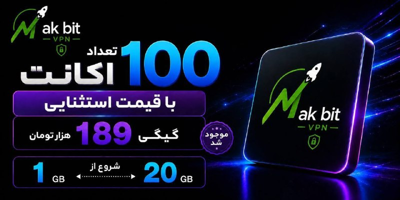

قیمت استثنایی گیگی
9️⃣
8️⃣
1️⃣

تحویل زیر یک دقیقه
✅
دارای لینک سابسکریشن جهت دیدن حجم و کنترل مصرف
✅
بدون قطعی 
✅
بدون محدودیت کاربر و زمان
✅
جمینایو چت جی بی تی و... کامل اوکیه با سرورامون
✅

🏪پشتیبانی کامل
✅
شروع فعالیت از سال 2022 
✅
پرداخت ریالی
✅

ضریب و این چیزا ندارن و تا آخرین مگابایت برای پشتیبانیش درختمتیم
🥂

💤این تخفیف فقط تا ۱۲ شب فعاله
💤

⭐️ @Napsternetiran_bot
〰️〰️〰️〰️〰️〰️〰️

🔶 @Napsternetvirani

## alonews — post 121892

  <a href="telegram/content/alonews_121892_1779487031.mp4" target="_blank">🎬 Download video</a>

👈 ترامپ: ما اینقدر نفت از ونزوئلا استخراج کرده‌ایم که هزینه جنگ را حدود ۲۵ برابر پرداخت کرده‌ایم.

✅ @AloNews خبر جنگ

## alonews — post 121891

  <a href="telegram/content/alonews_121891_1779487033.mp4" target="_blank">🎬 Download video</a>

👈 پرزیدنت ترامپ: من باهوش‌ترین فردی هستم که تا به حال ملاقات کردید.

✅ @AloNews خبر جنگ

## alonews — post 121889

  <a href="telegram/content/alonews_121889_1779487036.webm" target="_blank">🎬 Download video</a>

👈 سناتور گراهام: من معتقدم که آزادی مردم شگفت‌انگیز کوبا از چنگال کمونیسم نزدیک است.

✅ @AloNews خبر جنگ

## alonews — post 121888

  <a href="telegram/content/alonews_121888_1779487037.webm" target="_blank">🎬 Download video</a>

👈منبع نزدیک به تیم مذاکره کننده به تسنیم گفت: گفتگوها و رایزنی‌ها بر سر موارد اختلافی همچنان ادامه دارد و هنوز نتیجه نهایی حاصل نشده است.

🔴وی تاکید کرد: پیشرفتهایی نسبت به قبل در برخی موضوعات حاصل شده

✅ @AloNews خبر جنگ

<!-- MSG END -->

<!-- NAV START -->

<a href="https://github.com/babi2323/aio-downloader/blob/main/telegram/content/archive_1.md" style="display:inline-block; padding:6px 12px; margin:0 4px; background-color:#2ea44f; color:white; text-decoration:none; border-radius:4px; font-weight:bold;">صفحه بعد</a>

<!-- NAV END -->
