# خواننده تلگرام

<!-- TOP_NAV START -->

<a href="https://github.com/babi2323/aio-downloader/blob/main/telegram/content/archive_1.md" style="display:inline-block; padding:6px 12px; margin:0 4px; background-color:#2ea44f; color:white; text-decoration:none; border-radius:4px; font-weight:bold;">صفحه بعد</a>

<!-- TOP_NAV END -->

<!-- MSG START -->

---
📅 بروزرسانی: 1405/03/04 21:54
---

## VahidOOnLine — post 242160

  

ستار هاشمی، وزیر ارتباطات، با اشاره به «تصویب و آغاز اجرای بازگشایی اینترنت» گفت آنچه در حال وقوع است «پیام‌آور پایداری، اعتماد ملی و ثبات کشور» است.

او افزود: «پس از ابلاغ مصوبه به وزارت ارتباطات، اقدامات فنی و عملیاتی برای بازگرداندن اینترنت به مدار عادی آغاز خواهد شد.»
‌🏁 🇬🇧 IranintlTV

🤖 @VahidOOnLine

## VahidOOnLine — post 242159

  

♦️رسانه‌های دولتی ایران، روز دوشنبه چهارم اردیبهشت ماه به نقل از رئیس روابط عمومی وزارت ارتباطات گزارش دادند مسعود پزشکیان، دستور بازگشایی دسترسی به اینترنت بین‌المللی را پس از نزدیک به ۹۰ روز قطع گسترده اینترنت صادر کرده است.
پایگاه اطلاع‌رسانی دولت، پیش‌تر گزارش کرده بود، در جلسه «ستاد ویژه ساماندهی فضای مجازی، مصوبات مهمی درباره وضعیت اینترنت کشور تصویب شد که پس از تایید نهایی رئیس‌جمهور پزشکیان، برای اجرا به وزارت ارتباطات و فناوری اطلاعات ابلاغ می‌شود.»
در همین راستا، خبرگزاری فارس نیز گزارش کرد، «برقراری اتصال اینترنت بین‌الملل» با ۹ رای موافق و سه رای مخالف تصویب شده و برای تایید به دفتر رئیس‌جمهور ارسال شده است.
اگرچه جمهوری اسلامی در مقاطع مختلف مانند اعتراضات سراسری آبان ۹۸ دست به قطع گسترده اینترنت زده بود، اما خاموشی دیجیتال در ایران از ۱۸ دی‌ماه سال گذشته و در واکنش به اعتراضات سراسری وارد مرحله جدید شد. اینترنت ایران از بهمن‌ماه تا حدودی به حالت عادی بازگشت، اما پس از آغاز جنگ ایران با آمریکا و اسرائیل رکورد خاموشی اجباری دیجیتال شهروندان در جهان شکسته شد.
‌🇸🇦 Indypersian

🤖 @VahidOOnLine

## VahidOOnLine — post 242158

  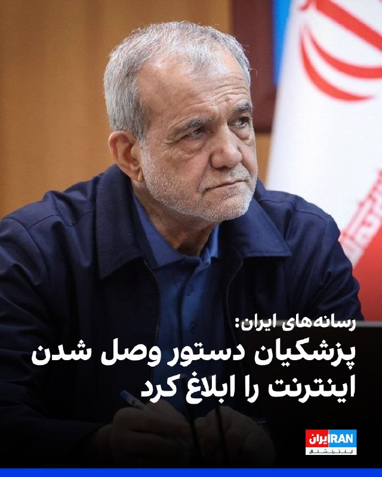

رسانه‌های ایران گزارش دادند مسعود پزشکیان دستور بازگشایی اینترنت بین‌الملل را ابلاغ کرده است.
پزشکیان گفت: «راه دشواری پیمودیم تا حق مردم را به آنها بازگردانیم .»
پیش‌تر ستاد راهبری و ساماندهی فضای مجازی، به ریاست محمدرضا عارف، معاون اول مسعود پزشکیان، تشکیل جلسه داد و بازگشت اینترنت به وضعیت پیش از دی‌ماه ۱۴۰۴ را تصویب کرد.
‌🏁 🇬🇧 IranintlTV

🤖 @VahidOOnLine

## VahidOOnLine — post 242157

  

العربیه به نقل از منابع آگاه گزارش داد پیش‌نویس یک توافق میان واشینگتن و تهران در حال بررسی است. بر اساس این پیش‌نویس، تنگه هرمز بدون دریافت عوارض بازگشایی و مین‌های دریایی پاکسازی می‌شود و به ایران اجازه فروش و صادرات نفت داده خواهد شد.

در این پیش‌نویس دوره‌ای ۳۰ روزه برای ازسرگیری کامل کشتیرانی در تنگه هرمز در نظر گرفته شده و همچنین یک بازه ۶۰ روزه برای مذاکرات هسته‌ای تعیین شده است.

بر اساس این گزارش، آتش‌بس در همه جبهه‌ها از جمله لبنان برقرار خواهد ماند و برای ۶۰ روز تمدید می‌شود و امکان تمدید دوباره آن نیز وجود دارد. آمریکا نیز متعهد شده محدودیت‌ها بر بنادر جنوب ایران را کاهش دهد و بخشی از دارایی‌های مسدودشده ایران بر اساس سازوکاری مشخص آزاد شود.
‌🏁 🇬🇧 IranintlTV

🤖 @VahidOOnLine

## VahidOOnLine — post 242156

  

یدالله جوانی، معاون سیاسی سپاه پاسداران، گفت «هادیان سیاسی» باید «روایت پیروزی ملت ایران» را برای جامعه بازگو کنند و افزود دشمن پس از شکست در میدان، تلاش می‌کند در جامعه «اختلاف، تردید و سستی» ایجاد کند.

او گفت: «اگر مجاهدت در میدان نباشد، دشمن شکست نمی‌خورد.»

معاون سیاسی سپاه پاسداران افزود: «دشمنی که در میدان شکست خورده است تلاش می‌کند در جامعه اختلاف، تردید، ابهام و سستی ایجاد کند.»
‌🏁 🇬🇧 IranintlTV

🤖 @VahidOOnLine

## VahidOOnLine — post 242155

  

یدالله جوانی، معاون سیاسی سپاه پاسداران، گفت «هادیان سیاسی» باید «روایت پیروزی ملت ایران» را برای جامعه بازگو کنند و افزود دشمن پس از شکست در میدان، تلاش می‌کند در جامعه «اختلاف، تردید و سستی» ایجاد کند.

او گفت: «اگر مجاهدت در میدان نباشد، دشمن شکست نمی‌خورد.»

معاون سیاسی سپاه پاسداران افزود: «دشمنی که در میدان شکست خورده است تلاش می‌کند در جامعه اختلاف، تردید، ابهام و سستی ایجاد کند.»
‌🏁 🇬🇧 IranintlTV

🤖 @VahidOOnLine

## VahidOOnLine — post 242154

  

یدالله جوانی، معاون سیاسی سپاه پاسداران، گفت «هادیان سیاسی» باید «روایت پیروزی ملت ایران» را برای جامعه بازگو کنند و افزود دشمن پس از شکست در میدان، تلاش می‌کند در جامعه «اختلاف، تردید و سستی» ایجاد کند.

او گفت: «اگر مجاهدت در میدان نباشد، دشمن شکست نمی‌خورد.»

معاون سیاسی سپاه پاسداران افزود: «دشمنی که در میدان شکست خورده است تلاش می‌کند در جامعه اختلاف، تردید، ابهام و سستی ایجاد کند.»
‌🏁 🇬🇧 IranintlTV

🤖 @VahidOOnLine

## VahidOOnLine — post 242153

  

خبرگزاری تسنیم، وابسته به سپاه پاسداران، نوشت که اخبار منتشرشده از سوی شبکه الحدث مبنی بر اعلام آمادگی جمهوری اسلامی برای خروج مواد هسته‌ای «کذب» است و در متن تفاهم‌نامه‌ای که تا امروز وجود دارد، هیچ جمله‌ای مبنی بر اعلام آمادگی برای خروج مواد هسته‌ای وجود ندارد.
‌🏁 🇬🇧 IranintlTV

🤖 @VahidOOnLine

## VahidOOnLine — post 242152

  

دونالد ترامپ، رییس‌جمهوری آمریکا، در شبکه اجتماعی تروث‌سوشال با انتشار تصویری که با هوش مصنوعی ساخته شده، دوره اوباما و بایدن را با دوران ریاست‌جمهوری خود در مذاکرات با جمهوری اسلامی مقایسه کرد

او نوشت در دولت‌های پیشین، روسای‌جمهور آمریکا خواهان مذاکره بودند و تهران تهدید به اقدام نظامی می‌کرد، اما این بار او جمهوری اسلامی را تهدید کرد و آن‌ها به مذاکره تن دادند.

ترامپ همچنین با انتشار تصویری ساخته‌شده با هوش مصنوعی از باراک اوباما در کنار یک پالت پر از پول، نوشت سیاست‌های اوباما در قبال جمهوری اسلامی باعث وقوع جنگ شده است.
‌🏁 🇬🇧 IranintlTV

🤖 @VahidOOnLine

## VahidOOnLine — post 242151

  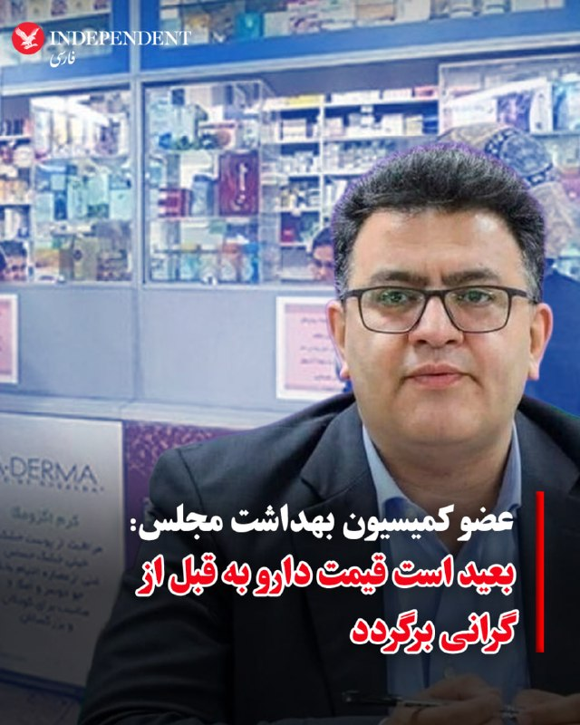

♦️محمد جمالیان، عضو کمیسیون بهداشت مجلس شورای اسلامی،  روز دوشنبه چهارم خرداد در گفتگویی با رسانه‌ها اعلام کرد بازگشت قیمت دارو به نرخ‌های پیش از افزایش اخیر «بعید» است.
به گفته این نمایند مجلس، افزایش هزینه مواد اولیه، بسته‌بندی و تولید، دلیل ادامه گرانی داروهاست.
جمالیان پیشتر نیز در گفتگو با خبرگزاری ایلنا با بیان اینکه افزایش قیمت دارو یک ضرورت محسوب می‌شود، گفته بود مردم باید میان «گرانی دارو» و «نبود دارو» یکی را انتخاب کنند.
‌🇸🇦 Indypersian

🤖 @VahidOOnLine

## VahidOOnLine — post 242150

  

♦️مقام‌های آمریکایی به سی‌ان‌ان گفته‌اند، اختلاف‌ها بر سر نحوه پرداختن به برنامه هسته‌ای ایران و لغو تحریم‌ها، نهایی شدن توافق برای پایان جنگ را به تاخیر انداخته است.
شبکه خبری سی‌ان‌ان، روز دوشنبه چهارم خرداد ماه به نقل از یک مقام آمریکایی گزارش کرد، سفر اعضای ارشد تیم مذاکره کننده ایرانی در قطر در روز دوشنبه، نشانه‌ای مثبت ارزیابی می‌شود و نقش میانجی‌گرانه قطر همچنان اهمیت دارد.
سی‌ان‌ان با گزارش آنکه واشنگتن به‌دنبال دریافت تضمین‌های قطعی از تهران درباره کنار گذاشتن ذخایر اورانیوم با غنای بالا و صرف‌نظر کردن از دستیابی به سلاح هسته‌ای است، به نقل از یک مقام آمریکایی نوشت: «تهران به‌صورت اصولی با این موارد موافقت کرده است.»
در همین حال، سخنگوی وزارت خارجه ایران روز دوشنبه اعلام کرد، جمهوری اسلامی در مقطع کنونی درباره جزئیات برنامه هسته‌ای گفتگو نمی‌کند و این موضوع را به دورهای بعدی مذاکرات موکول کرده است.
به گزارش سی‌ان‌ان، تهران در مقابل خواستار دریافت تضمین‌هایی درباره رفع تحریم‌ها و آزادسازی دارایی‌های بلوکه‌شده برای کمک به اقتصاد آسیب‌دیده خود شده است.
‌🇸🇦 Indypersian

🤖 @VahidOOnLine

## VahidOOnLine — post 242149

  

♦️احمد دنیا مالی: فیفا تضمین داده بازیکنان تیم ملی ایران ویزای آمریکا را دریافت کنند
احمد دنیامالی، وزیر ورزش و جوانان ایران روز دوشنبه اعلام کرد فیفا به تهران اطمینان داده همه بازیکنان تیم ملی فوتبال ایران برای حضور در جام جهانی ۲۰۲۶ ویزای آمریکا دریافت خواهند کرد.

وزیر ورزش ایران، به خبرگزاری ایسنا گفت: «رئیس فیفا به ما قول داده که همه بازیکنان ویزا دریافت کنند و دلیلی وجود ندارد که بازیکنان ما ویزا نگیرند.»
دنیامالی با تاکید بر آنکه کشورهای میزبان جام جهانی موظف‌اند برای همه تیم‌های شرکت‌کننده، از جمله بازیکنان و اعضای کادر فنی، ویزا صادر کنند، افزود تیم ملی ایران قرار است در مکزیک ویزاهای چندبار ورود آمریکا را دریافت کند.

رئیس‌جمهوری مکزیک، نیز روز دوشنبه گفت کشورش به تیم ملی فوتبال ایران اجازه خواهد داد در مکزیک مستقر شود.

تیم ملی فوتبال ایران اکنون در آنتالیای ترکیه اردو زده و برخی بازیکنان هفته گذشته برای ارائه درخواست ویزا به سفارت آمریکا در آنکارا مراجعه کرده‌اند. ایران در گروه هفتم جام جهانی با نیوزیلند، بلژیک و مصر هم‌گروه است.
‌🇸🇦 Indypersian

🤖 @VahidOOnLine

## VahidOOnLine — post 242148

  

♦️شبکه العربیه، روز دوشنبه چهارم خرداد ماه، به نقل از منابع آگاه به مذاکرات واشنگتن و تهران گزارش داد پیش‌نویس توافقنامه پایان جنگ میان دو کشور شامل تمدید آتش‌بس به مدت ۶۰ روز، با امکان تمدید دوباره، است و در آن بر بازگشایی تنگه هرمز بدون دریافت عوارض و پاکسازی مین‌ها تاکید دارد.

منابع العربیه افزودند این توافق امکان فروش و صادرات نفت ایران را فراهم می‌کند و ادامه مذاکرات هسته‌ای برای دستیابی به تفاهم‌های بلندمدت را نیز در بر می‌گیرد.

دونالد ترامپ، رئیس‌جمهوری آمریکا نیز روز دوشنبه در پیامی در شبکه اجتماعی تروث سوشال اعلام کرد مذاکرات با جمهوری اسلامی ایران «به‌خوبی» در حال پیشرفت است.
‌🇸🇦 Indypersian

🤖 @VahidOOnLine

## VahidOOnLine — post 242147

  

کلودیا شینباوم، رییس‌جمهوری مکزیک، دوشنبه اعلام کرد که دولت او موافقت کرده به تیم ملی فوتبال ایران اجازه دهد در طول رقابت‌های جام جهانی در مکزیک اقامت داشته باشد.

او افزود که ایالات متحده تمایلی به میزبانی این تیم نداشته است.

شینباوم گفت که فدراسیون بین‌المللی فوتبال (فیفا) پس از آن‌که آمریکا اعلام کرد نمی‌خواهد تیم ایران در طول مسابقات در خاک این کشور مستقر باشد، با دولت مکزیک تماس گرفته است.

ایران قرار است هر سه بازی مرحله گروهی خود را در آمریکا برگزار کند.

شینباوم در یک نشست خبری گفت: «ما هیچ دلیلی برای محروم کردن آنها از امکان اقامت در مکزیک نمی‌بینیم.»

کاخ سفید و وزارت خارجه آمریکا هنوز در این زمینه اظهار نظر نکرده‌اند.
‌🏁 🇬🇧 IranintlTV

🤖 @VahidOOnLine

## VahidOOnLine — post 242146

♦️دونالد ترامپ، رئیس‌جمهوری آمریکا، روز یکشنبه چهار خرداد ماه، به همراه جی‌دی ونس، معاون رئیس‌جمهوری، و پیت هگست، وزیر دفاع، برای ادای احترام به سربازان کشته‌شده ارتش آمریکا در مراسم «روز یادبود» در گورستان ملی آرلینگتون حضور یافتند.
«روز یادبود» (Memorial Day) یکی از مناسبت‌های رسمی آمریکا است که هر سال در آخرین دوشنبه ماه مه برگزار می‌شود و به یاد نظامیان آمریکایی کشته‌شده در جنگ‌ها و ماموریت‌های نظامی اختصاص دارد. در این روز، مقام‌های آمریکایی با حضور در گورستان‌های نظامی، به‌ویژه گورستان ملی آرلینگتون در نزدیکی واشنگتن، به سربازان کشته‌شده ادای احترام می‌کنند و پرچم‌ها در سراسر کشور به حالت نیمه‌افراشته درمی‌آید.
‌🇸🇦 Indypersian

🤖 @VahidOOnLine

## VahidOOnLine — post 242145

  

رضا باکری، دبیر انجمن صنایع لبنی ایران، اعلام کرد قیمت محصولات لبنی در یک سال گذشته چندین بار افزایش یافته و در مجموع حدود ۹۰ درصد گران شده است.

باکری افزود هفته گذشته دامداران، قیمت شیر خام را با ۲۹ درصد افزایش به کیلویی ۶۰ هزار و ۵۰۰ تومان رساندند.

دبیر انجمن صنایع لبنی ایران از افزایش قیمت چند محصول پرمصرف خبر داد و گفت: «قیمت شیر نایلونی به ۸۴ هزار تومان، شیر بطری به ۹۸ هزار تومان، پنیر یو‌اف ۴۰۰ گرمی به ۲۰۳ هزار تومان و ماست دبه‌ای دو کیلوگرمی به ۲۲۸ هزار و ۷۰۰ تومان رسیده است.»

سرانه مصرف شیر در ایران یک‌سوم میانگین جهانی است که تنها در یکی دو سال اخیر، ۳۰ درصد کاهش داشته است.
‌🏁 🇬🇧 IranintlTV

🤖 @VahidOOnLine

## VahidOOnLine — post 242144

  

♦️محمدباقر ذوالقدر، دبیر شورای عالی امنیت ملی ایران، روز دوشنبه چهارم خرداد ماه، در نخستین پیام پس از انتصاب به این سمت گفت «عقب‌نشینی در کار نخواهد بود».

ذوالقدر با ادعای آنکه مقاومت ایران در «میدان نظامی»، «میدان دیپلماسی» دشمن را «زمین‌گیر» کرده است، افزود اکنون بیش از هر زمان دیگری کشور به وحدت و انسجام نیاز دارد تا «آمریکایی‌ها و اسرائیلی‌ها» در این زمینه نیز ناامید شوند.

او تاکید کرد بیش از هر زمان دیگری به وحدت و انسجام نیاز داریم تا آمریکایی‌ها و اسرائیلی‌ها مایوس شوند.
‌🇸🇦 Indypersian

🤖 @VahidOOnLine

## VahidOOnLine — post 242143

  

علیرضا رحیمی، معاون امور جوانان وزارت ورزش و جوانان، در اختتامیه جشنواره «نسل امید» گفت: اگر واقعا به آینده ایران فکر می‌کنیم، باید به نهاد اصلی جامعه یعنی تشکیل خانواده بها بدهیم. فرزندآوری در این شرایط نوعی فداکاری و ایثار است و شاید بزرگ‌ترین ازخودگذشتگی برای آینده ایران محسوب شود.

وزارت ورزش و جوانان جمهوری اسلامی هدف از برگزاری این جشنواره را «توسعه کمی و کیفی آثار هنری در حوزه خانواده و جوانی جمعیت» عنوان کرده است.

جشنواره «نسل امید» با همکاری حوزه هنری سازمان تبلیغات اسلامی برگزار می‌شود.
‌🏁 🇬🇧 IranintlTV

🤖 @VahidOOnLine

## VahidOOnLine — post 242142

♦️اسماعیل بقایی، سخنگوی وزارت امور خارجه ایران،  روز دوشنبه چهارم خرداد ماه به خبرنگاران گفت جمهوری اسلامی در حال حاضر درباره «جزئیات هسته‌ای» با آمریکا مذاکره نخواهد کرد و «تمرکز یادداشت تفاهم ۱۴ بندی بر پایان جنگ است.»
بقایی در پاسخ به پرسشی درباره مذاکرات ۶۰ روزه گفت قرار است طی این بازه زمانی درباره برخی جزئیات یادداشت تفاهم و چند موضوع دیگر گفتگو شود و «یکی از موضوعات قاعدتا مرتبط با هسته‌ای است.»
این اظهارات در گرماگرم گمانه‌زنی‌ها درباره نهایی شدن توافق تهران و واشنگتن برای پایان جنگ مطرح می‌شود. موضوع اورانیوم‌های غنی شده ایران از مهمترین مجادلات دوطرف توصیف شده است.
دونالد ترامپ روز دوشنبه با انتشار متنی در تروث سوشال اعلام کرد، نتیجه مذاکرات یا «توافقی بزرگ برای همه» خواهد بود یا در غیر این صورت، منطقه به «میدان نبرد و تیراندازی» بازخواهد گشت؛ آن هم در ابعادی «بزرگ‌تر و قدرتمندتر از همیشه».
‌🇸🇦 Indypersian

🤖 @VahidOOnLine

## VahidOOnLine — post 242141

  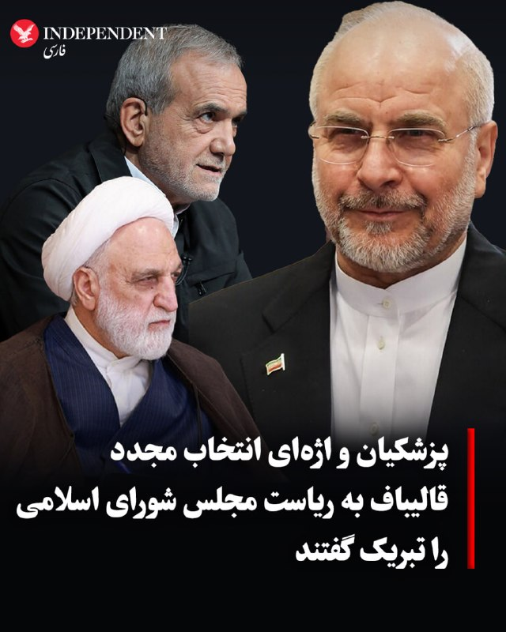

♦️پس از ابقای محمدباقر قالیباف در ریاست مجلس شورای اسلامی، مسعود پزشکیان، رئیس‌جمهوری و غلامحسین محسنی اژه‌ای، رئیس قوه قضائیه جمهوری اسلامی ایران، در پیام‌هایی جداگانه انتخاب مجدد او را تبریک گفتند.
مجلس شورای اسلامی روز دوشنبه چهارم خرداد نخستین جلسه علنی و حضوری خود را از زمان آغاز حملات اسرائیل و آمریکا در نهم اسفند سال گذشته برگزار کرد. در این جلسه، محمدباقر قالیباف، رئیس هیئت مذاکره‌کننده جمهوری اسلامی با آمریکا، برای یک سال دیگر به ریاست مجلس انتخاب شد.
پزشکیان در پیامی که خبرگزاری دولتی ایرنا منتشر کرد، نوشت اعتماد دوباره نمایندگان به قالیباف «حاصل سال‌ها مدیریت جهادی و حضور مستمر و موثر» او در عرصه‌های حساس خدمت به جمهوری اسلامی و ملت ایران است.
محسنی اژه‌ای نیز در پیامی در شبکه اجتماعی اکس، قالیباف را «مدیری جهادی و نستوه و میدان‌دیده» توصیف کرد و نوشت او در جنگ‌های ۱۲ روزه، جنگ اخیر و «پس از آن» در عرصه‌های «میدان» و «دیپلماسی» جهاد کرده است.
‌🇸🇦 Indypersian

🤖 @VahidOOnLine

## mwarmonitor — post 9704

🔴بنیامین نتانیاهو می‌گوید اسرائیل «در حال جنگ با حزب‌الله است» و تأکید کرد که اسرائیل فشار نظامی را کاهش نخواهد داد و او به نیروها دستور داده است «پدال را حتی محکم‌تر فشار دهند».

📌نتانیاهو گفت حزب‌الله در حال شلیک پهپادها، از جمله پهپادهای فیبر نوری است، اما اسرائیل یک تیم ویژه برای مقابله با این تهدید دارد. او افزود: «آنچه اکنون از ما لازم است افزایش حملات و بالا بردن شدت آن‌هاست» و ادامه داد: «ما ضربه سختی به آن‌ها خواهیم زد.»

@mwarmonitor

## mwarmonitor — post 9703

باراک راوید:

🚨 یک مقام ارشد آمریکایی امشب اشاره کرده است که دولت ترامپ از تشدید اقدامات اسرائیل علیه حزب‌الله حمایت خواهد کرد.

🚨 این مقام آمریکایی به من گفت: «حزب‌الله درخواست‌های مکرر برای توقف شلیک به سمت اسرائیل را نادیده گرفته است، از جمله اولتیماتومی که اخیراً منتقل شد. اسرائیل هرگز مجبور نخواهد شد به‌طور منفعلانه حملات علیه نیروها و غیرنظامیانش را تحمل کند. این دولت بایدن نیست.»

🚨 این مقام آمریکایی اشاره کرد که از ۱۷ آوریل، حزب‌الله بیش از هزار پهپاد و بیش از ۷۰۰ راکت شلیک کرده است تا روند مذاکرات جاری بین لبنان و اسرائیل را مختل کند. او گفت: «وضع موجود قابل دوام نیست.»

🚨 این مقام آمریکایی افزود: «حزب‌الله به‌طور کامل مسئول وضعیت فعلی است. این گروه آتش‌بس ۲ مارس را نقض کرده و اکنون مصمم است مانع از مسیر صلح و بازسازی برای مردم لبنان شود.»

🚨 به گفته این مقام، حزب‌الله از مذاکراتی که دولت لبنان با حمایت آمریکا با اسرائیل انجام می‌دهد نگران است. او گفت: «این موضوع برای حزب‌الله یک تهدید وجودی است.»

🚨 این مقام همچنین افزود: «یک آتش‌بس موفق به رهبری دولت لبنان، حزب‌الله را از قدرت و روایت خود محروم خواهد کرد.»

@mwarmonitor

## mwarmonitor — post 9702

🔴جزئیات جدیدی درباره دشواری‌های مذاکرات آمریکا و ایران در حال منتشر شدن است:

🔹در حال حاضر، ایران فقط حاضر است متعهد شود که به سمت ساخت سلاح هسته‌ای نرود، در حالی که آمریکا بر اقدامات مشخص برای کاهش اورانیوم غنی‌شده تأکید دارد—از جمله فروش آن، انتقال به خارج از کشور یا رقیق‌سازی آن.

🔸یکی از نقاط اصلی اختلاف، تنگه هرمز است: ایران خواهان مدیریت آن توسط خود است، در حالی که آمریکا بر آزادی کامل کشتیرانی تأکید دارد.

🔸همچنین هنوز توافقی درباره تسهیلات مالی وجود ندارد. قطر پیشنهادی برای ارائه یک وام بشردوستانه ۱۲ میلیارد دلاری به ایران مطرح کرده است.

📌نکته قابل توجه این است که لبنان نیز اکنون بخشی از چارچوب گسترده‌تر در حال بررسی شده است. آمیت سیگال خبرنگار کانال ۱۲ اسرائیل

@mwarmonitor

## mwarmonitor — post 9701

🔴موضع ایران درباره خارج کردن اورانیوم با غنای بالا دستخوش تغییر شده است. بر اساس گزارش‌ها، ایران حاضر است اورانیوم با غنای بالا (HEU) خود را از کشور خارج کند، اما تنها به مقصد چین. همچنین ایران به دنبال دریافت تضمین حمایت از پکن در ازای هرگونه توافق نهایی با واشنگتن است. این موضوع به نقل از منابع ناشناس توسط شبکه «الحدث» گزارش شده است.

🔸مقام‌های ایرانی طی روزهای اخیر اعلام کرده‌اند ـ برخلاف مواضع قبلی ـ که از سوی رهبر جمهوری اسلامی دستور گرفته‌اند اورانیوم نزدیک به سطح تسلیحاتی را در داخل کشور نگه دارند. هرچند این دو روایت به‌طور کامل نمی‌توانند همزمان درست باشند، اما همین اختلاف نشان می‌دهد که روایت خبر از واقعیت اختلاف‌نظر درون ساختار تصمیم‌گیری ایران ناشی می‌شود. موضوع «سرنوشت اورانیوم» همچنان در داخل سیستم ایران حل‌نشده باقی مانده است، نه فقط در سطح مذاکرات ایران و آمریکا.

🔹در حالی که گفته می‌شود آمادگی چین برای دریافت این ذخیره اورانیوم (یا رقیق‌سازی آن به سطح پایین‌تر) حدود ۴۴۰ کیلوگرم با غنای ۶۰ درصد است و از چند هفته قبل مطرح بوده، تغییر جدید این است که ایران ظاهراً پذیرفتن انتقال این ذخیره به چین را به‌عنوان تنها گزینه قابل قبول خود مطرح کرده است؛ نه یکی از چند گزینه.

🔸منابع رسمی دو کشور هنوز به این خبر واکنشی نشان نداده‌اند.

@mwarmonitor

## mwarmonitor — post 9700

  

📝 همان ثانیه اول شروع جنگ، مثل موش‌های غافلگیرشده پریدید روی سیم و در کسری از ثانیه کل اینترنت کشور را قطع کردید؛ اما حالا یک ماه است که این انگل‌زاده‌های کت‌شلواری و دایناسورهای عهد بوق، اندر خم وصل کردن مجدد آن مانده‌اند. خنده‌دار اینجاست که رسانه‌ها با بوق و کرنا از مصوبه «جدید و مهم» ستاد ساماندهی برای بازگشت اینترنت به وضعیت قبل از دی‌ماه ۱۴۰۴ خبر می‌دهند؛ مصوبه‌ای که بعد از کلی چای خوردن با ۹ رای موافق تصویب شده و حالا لنگِ تایید نهایی مسعود پزشکیان است. واقعاً کدام حیوانی به این رئیس‌جمهور رای داده؟ موجودی که تنها شباهتش به رئیس، به خط کردن آفتابه‌های توالت‌های پادگان است و حالا برای چهار تا پورت اینترنت که خودشان قطع کرده‌اند، باید منتظر امضای ولایتمدارانه‌اش ماند. این کمدیِ مضحک نشان می‌دهد که حق بدیهی میلیون‌ها انسان، گروگانِ مشتی بی‌خاصیت است که برای بدیهی‌ترین کارها هم یک ماه جلسات پوچ برگزار می‌کنند.

@mwarmonitor

## mwarmonitor — post 9699

  <a href="telegram/content/mwarmonitor_9699_1779733482.mp4" target="_blank">🎬 Download video</a>

🔴ارتش اسرائیل (IDF) اعلام کرده است که حملات خود را به اهداف حزب‌الله در منطقه صور و سایر مناطق جنوب لبنان آغاز کرده است.

@mwarmonitor

## mwarmonitor — post 9698

📌 رئیس‌جمهور مکزیک، شینباوم، اعلام کرده است که دولتش موافقت کرده به تیم ملی فوتبال ایران اجازه دهد در جریان جام جهانی در مکزیک اقامت داشته باشد، پس از آنکه ایالات متحده اعلام کرده بود تمایلی به میزبانی آن‌ها ندارد.

@mwarmonitor

## mwarmonitor — post 9697

🔴عربستان سعودی اعلام کرده است که روابط خود را با اسرائیل عادی‌سازی نخواهد کرد، مگر اینکه مسیری غیرقابل بازگشت به سمت تشکیل یک دولت فلسطینی وجود داشته باشد. CNN

@mwarmonitor

## mwarmonitor — post 9696

🔴گفت‌وگوهای ایران درباره برنامه هسته‌ای و کاهش تحریم‌ها به بن‌بست خورده است.

🔸با این حال، هر دو طرف انگیزه‌هایی برای رسیدن به توافق دارند، اما هر کدام بر مواضع خود پافشاری می‌کنند؛ ترامپ نیز گفته است که «یک توافق بد را نخواهد پذیرفت».

@mwarmonitor

## mwarmonitor — post 9695

  <a href="telegram/content/mwarmonitor_9695_1779733483.mp4" target="_blank">🎬 Download video</a>

✈️نقل و انتقالات هوایی نیروی هوایی آمریکا به خاورمیانه با حجم بالا همچنان ادامه دارد، با وجود صحبت‌هایی که درباره نزدیک بودن نهایی شدن مذاکرات مطرح شده است.

@mwarmonitor

## mwarmonitor — post 9694

🔸وزیر امور خارجه امارات متحده عربی، شیخ عبدالله بن زاید آل نهیان، هشدار داده است که اروپا در نهایت به دلیل نبود اقدامات قاطع از سوی رهبران اروپایی و «وسواس نسبت به اصلاحات سیاسیِ افراطی (woke political correctness)»، ممکن است حتی بیشتر از خاورمیانه تولیدکننده افراط‌گرایان و اسلام‌گرایان تندرو باشد.

🔹او به‌طور مشخص به وجود هسته‌های افراط‌گرای اسلام‌گرا در شهرهای اروپایی مانند لندن، و همچنین در آلمان، اسپانیا و ایتالیا اشاره کرده و هشدار داده است که کشورهایی که در برخورد با این موضوع کوتاهی کنند ممکن است به‌عنوان «پرورشگاه‌های تروریسم» طبقه‌بندی شوند.

🔹بخش قابل توجهی از افرادی که در اروپا به‌دلیل طراحی یا تلاش برای حملات اسلام‌گرایانه بازداشت یا متوقف می‌شوند، نوجوانان محلی با تابعیت اروپایی (سنین ۱۴ تا ۱۹ سال) هستند که به‌طور کامل از طریق شبکه‌های اجتماعی و پلتفرم‌های بازی آنلاین رادیکال شده‌اند، بدون اینکه هرگز به خاورمیانه سفر کرده باشند.

🔸شیخ عبدالله بن زاید آل نهیان گفته است:
«روزی خواهد رسید که ما شاهد خواهیم بود افراط‌گرایان و تروریست‌های بسیار بیشتری از اروپا خارج می‌شوند، به دلیل نبود تصمیم‌گیری قاطع، تلاش برای سیاسی‌کاری بیش از حد، یا این تصور که آن‌ها اسلام و خاورمیانه و دیگران را بهتر از خودشان می‌شناسند. و متأسفم، اما این چیزی جز ناآگاهی نیست.»

@mwarmonitor

## mwarmonitor — post 9693

  

✈️دو فروند هواپیمای گشت دریایی بوئینگ P-8 پوسایدون نیروی دریایی آمریکا امروز در آن منطقه بین دریای عرب و خلیج عمان در حال عملیات بوده‌اند.

⁉️سؤال این است که آیا گروه رزمی ناو هواپیمابر یو‌اس‌اس جورج اچ. دبلیو. بوش در نزدیکی آن منطقه قرار دارد یا نه.

@mwarmonitor

## mwarmonitor — post 9692

مذاکرات با جمهوری اسلامی ایران به خوبی در حال پیشرفت است! این یا یک «توافق بزرگ» برای همه خواهد بود، یا هیچ توافقی در کار نخواهد بود — بازگشت به جبهه جنگ و شلیک، اما بزرگتر و قوی‌تر از هر زمان دیگری — و هیچ‌کس این را نمی‌خواهد! من در طول گفتگوهایم در روز شنبه…

## mwarmonitor — post 9691

🛢نفت خام برنت بیش از ۵ درصد سقوط کرد و معاملات آتی شاخص داوجونز صنعتی افزایش یافت، هرچند سرمایه‌گذاران همچنان نسبت به تأثیر مذاکرات آمریکا و ایران تردید دارند. وال‌استریت ژورنال

@mwarmonitor

## mwarmonitor — post 9690

🔸 رویترز: مذاکرات قالیباف و عراقچی در دوحه بر موضوع تنگه هرمز و اورانیوم غنی‌شده متمرکز خواهد بود. @mwarmonitor

## mwarmonitor — post 9689

🔴 وزارت خارجه روسیه: اتباع خارجی فوراً کی‌یف را ترک کنند. @mwarmonitor

## mwarmonitor — post 9688

🔴 وزارت خارجه روسیه: اتباع خارجی فوراً کی‌یف را ترک کنند.

@mwarmonitor

## mwarmonitor — post 9687

🔴بانک مرکزی اسرائیل کاهش نرخ بهره را از سر گرفته است؛ اقدامی که با کاهش تورم، تقویت شِکِل اسرائیل و نشانه‌هایی از پیشرفت در مسیر توافق احتمالی میان آمریکا و ایران تقویت شده است. بلومبرگ

@mwarmonitor

## mwarmonitor — post 9686

مذاکرات با جمهوری اسلامی ایران به خوبی در حال پیشرفت است! این یا یک «توافق بزرگ» برای همه خواهد بود، یا هیچ توافقی در کار نخواهد بود — بازگشت به جبهه جنگ و شلیک، اما بزرگتر و قوی‌تر از هر زمان دیگری — و هیچ‌کس این را نمی‌خواهد! من در طول گفتگوهایم در روز شنبه…

## pm_afshaa — post 91476

رئیس شورای هماهنگی تبلیغات اسلامی: فعلا تصمیم نگرفتیم چه زمانی رهبر سابق رو تشییع کنیم

💧 Rainbet.com the #1 Non-KYC Crypto Casino & Sportsbook @rainbetcom

😁 @Pm_Afshaa

## pm_afshaa — post 91475

رسایی: پزشکیان خودشم میدونه نمیتونه اینترنت رو وصل کنه. این خبرای جدید بازی رسانه‌ایه 
💧 Rainbet.com the #1 Non-KYC Crypto Casino & Sportsbook @rainbetcom 
😁 @Pm_Afshaa

## pm_afshaa — post 91474

🔴نتانیاهو در بیانیه‌ای اعلام کرد ما به حزب‌الله ضربه‌ای مهلک خواهیم زد. از استقامت ساکنان شمال تقدیر می‌کنم

💧 Rainbet.com the #1 Non-KYC Crypto Casino & Sportsbook @rainbetcom

😁 @Pm_Afshaa

## pm_afshaa — post 91473

رسایی: پزشکیان خودشم میدونه نمیتونه اینترنت رو وصل کنه. این خبرای جدید بازی رسانه‌ایه

💧 Rainbet.com the #1 Non-KYC Crypto Casino & Sportsbook @rainbetcom

😁 @Pm_Afshaa

## pm_afshaa — post 91472

بچه ها چنل زاپاسمونو بفرستین برا بقیه حتما داشته باشینمون گممون نکنین

دمتون گرم از حمایتتون🤍🤍

https://t.me/pm_zapas
https://t.me/pm_zapas

## pm_afshaa — post 91471

روزنامه هم‌میهن: رئیس‌جمهور دستور بازگشایی اینترنت بین‌الملل را ابلاغ کرد 
💧 Rainbet.com the #1 Non-KYC Crypto Casino & Sportsbook @rainbetcom 
😁 @Pm_Afshaa

## pm_afshaa — post 91470

🔴یک مقام آمریکایی به الجزیره: حزب‌الله درخواست‌های مکرر برای آتش‌بس با اسرائیل را نادیده گرفته است. اسرائیل به حملات هدفمند علیه سربازان و شهروندان خود پاسخ خواهد داد

💧 Rainbet.com the #1 Non-KYC Crypto Casino & Sportsbook @rainbetcom

😁 @Pm_Afshaa

## pm_afshaa — post 91469

روزنامه هم‌میهن: رئیس‌جمهور دستور بازگشایی اینترنت بین‌الملل را ابلاغ کرد

💧 Rainbet.com the #1 Non-KYC Crypto Casino & Sportsbook @rainbetcom

😁 @Pm_Afshaa

## pm_afshaa — post 91468

🔴منابع آگاه به العربیه: ایران در مذاکرات شرط کرده اورانیوم غنی‌ شده با درصد بالا فقط به چین منتقل شود

💧 Rainbet.com the #1 Non-KYC Crypto Casino & Sportsbook @rainbetcom

😁 @Pm_Afshaa

## pm_afshaa — post 91467

🔴الحدث : منابع نزدیک میگن ایران آماده‌ست اورانیوم با غنای بالا رو از کشور خارج کنه

💧 Rainbet.com the #1 Non-KYC Crypto Casino & Sportsbook @rainbetcom

😁 @Pm_Afshaa

## pm_afshaa — post 91464

  <a href="telegram/content/pm_afshaa_91464_1779733485.mp4" target="_blank">🎬 Download video</a>

تلمبه های سنگین اسراییل به لبنان

💧 Rainbet.com the #1 Non-KYC Crypto Casino & Sportsbook @rainbetcom

😁 @Pm_Afshaa

## pm_afshaa — post 91463

درود هموطنان عزیزم یک دختر 26 سال داره بجرم کشتن یکنفر که وارد خونش شده که بهش تعرض و تجاوز بکنه صبح 5 خرداد اعدام میشه، باید ۱۰ میلیارد جمع بشه که رضایت بدن تا حالا ۹ میلیارد جمع شده  همه چی داخل تصویر هست کسی خواست استعلام بگیره میدونم ایرانی ها آدم با…

## pm_afshaa — post 91462

درود مجدد داداش نوکرتم خیلی دمت گرم برای این خانوم ۸۰۰ میلیون جمع شد به لطف شما عزیزان و بقیه و ۲۰۰ میلیون مونده خیلی خوشحال شدم

## pm_afshaa — post 91461

  <a href="telegram/content/pm_afshaa_91461_1779733486.webm" target="_blank">🎬 Download video</a>

🔴سناتور لیندسی گراهام:

پیشنهاد اخیر ترامپ که گسترش توافقنامه‌های ابراهیم رو به عنوان بخشی از یک توافق مذاکره‌شده در مورد مناقشه ایران الزامی میکنه، به سادگی درخشان است و منجر به مهم‌ترین تغییر در خاورمیانه در هزاران سال خواهد شد.

با صلح عربستان سعودی و دیگر کشورهایی مانند پاکستان با اسرائیل، منطقه شاهد سطحی از ثبات خواهد بود که پیش از رئیس‌جمهور ترامپ هرگز تصور نمیشد و در نهایت به یکپارچگی منطقه‌ای منجر خواهد شد که خاورمیانه رو به یک قدرت اقتصادی و منبع فرصت‌های خوب تبدیل میکنه، به جای اینکه یک انبار باروت باشه.

انتظار دارم متحدان عرب ما این رو بپذیرند، همچنین دوستان ما در اسرائیل، با تمرکز بر این وظیفه، زیرا شکست گزینه‌ای نیست - که تحلیلی درست خواهد بود.

💧 Rainbet.com the #1 Non-KYC Crypto Casino & Sportsbook @rainbetcom

😁 @Pm_Afshaa

## pm_afshaa — post 91460

  <a href="telegram/content/pm_afshaa_91460_1779733487.webm" target="_blank">🎬 Download video</a>

🔴وال استریت ژورنال:
مذاکرات ایران رو بحث برنامه هسته‌ای و لغو تحریم‌ها به بن‌بست خورده.

💧 Rainbet.com the #1 Non-KYC Crypto Casino & Sportsbook @rainbetcom

😁 @Pm_Afshaa

## pm_afshaa — post 91459

  <a href="telegram/content/pm_afshaa_91459_1779733487.mp4" target="_blank">🎬 Download video</a>

🔴خوش چشم، کارشناس صداوسیما:
روبیو، ویتکاف و کوشنر از طریق واسطه‌ها بهمون گفتن به توییت‌های ترامپ توجه نکنید.

💧 Rainbet.com the #1 Non-KYC Crypto Casino & Sportsbook @rainbetcom

😁 @Pm_Afshaa

## pm_afshaa — post 91458

  <a href="telegram/content/pm_afshaa_91458_1779733489.webm" target="_blank">🎬 Download video</a>

🔴مارک لوین: درباره توافق احتمالی، کلی مطلب توی اینترنت نوشته شده؛ اما من هیچ چیزی درباره خودِ مردم ایران ندیدم.

💧 Rainbet.com the #1 Non-KYC Crypto Casino & Sportsbook @rainbetcom

😁 @Pm_Afshaa

## pm_afshaa — post 91457

  <a href="telegram/content/pm_afshaa_91457_1779733489.mp4" target="_blank">🎬 Download video</a>

حملات پی در پی اسرائیل به جنوب لبنان

💧 Rainbet.com the #1 Non-KYC Crypto Casino & Sportsbook @rainbetcom

😁 @Pm_Afshaa

## iaghapour — post 2630

🔻این روزا انقدر شایعه و خبر بی‌خود درباره وصل شدن اینترنت پیچیده که واقعاً حس و حال خبر زدن در موردش رو ندارم.

با این حال، سعی می‌کنم اسکریپت‌هایی که زحمت کشیدید فرستادید رو حتماً بررسی کنم، به هر حال از دست رو دست گذاشتن که بهتره. راستش با این وضع زندگی، اصلاً هیچ انرژی و انگیزه‌ای برای آدم باقی نمونده.

## DEJradio — post 4952

  <a href="telegram/content/DEJradio_4952_1779733491.webm" target="_blank">🎬 Download video</a>

🔺📢 الحدث به نقل از منابع آگاه گزارش داد جمهوری اسلامی شرط انتقال اورانیوم با غنای بالا به چین را مطرح کرده است.
در این گزارش آمده، ایران آمادگی دارد اورانیوم با غنای بالای خود را از کشور خارج کند، اما پیش از نهایی شدن هرگونه توافق با آمریکا، به دنبال دریافت تضمین‌هایی از چین است.
پیش از این ولادیمیر پوتین نیز پیشنهاد داده بود اورانیوم‌های جمهوری اسلامی به روسیه منتقل شود.

#اورانیوم #چین #جمهوری_اسلامی
@DEJradio

## DEJradio — post 4951

  <a href="telegram/content/DEJradio_4951_1779733491.webm" target="_blank">🎬 Download video</a>

🛩️
🚨 فعال شدن پدافند در قشم
منابع داخلی: یک پهپاد سرنگون شد

عصر دوشنبه، حوالی ساعت ۱۶:۱۵ دقیقه به وقت ایران پدافند جزیره قشم فعال شد. ساعاتی بعد اعلام شد که نیروهای مسلح یک «پهپاد متخاصم» را بر فراز آب‌های خلیج فارس با استفاده از سامانه «آرش» مورد هدف قرار دادند.

در روزهای اخیر بارها مواردی از پرواز پهپادها بر فرار ایران گزارش شد اما مشخص نیست متعلق به کدام کشور بودند. برخی منابع ادعا کردند پهپاد ساقط شده اسرائیلی بود.

#پهپاد #قشم #خلیج_فارس
@DEJradio

## DEJradio — post 4950

⭕️ ترامپ گفت توافق با جمهوری اسلامی باید به گسترش پیمان ابراهیم منجر شود

دونالد ترامپ، رئیس‌ جمهوری آمریکا، روز دوشنبه گفت توافق احتمالی با تهران باید به گسترش پیمان ابراهیم در خاورمیانه بینجامد.
او در پیامی در شبکۀ «تروث سوشال اعلام کرد مذاکرات با جمهوری اسلامی «به خوبی پیش می‌رود».
ترامپ هشدار داد اگر مذاکرات شکست بخورد، منطقه دوباره به یک میدان جنگ بزرگ‌تر و شدیدتر از پیش تبدیل می‌شود.
رئیس جمهوری آمریکا تأکید کرد توافق یا باید برای همه بزرگ و معنادار باشد، یا توافقی در کار نیست.
ترامپ افزود عربستان سعودی و قطر باید بی‌درنگ به پیمان ابراهیم بپیوندند و دیگر کشورهای منطقه نیز از آنها پیروی کنند.
به گفتۀ ترامپ اگر جمهوری اسلامی توافق مورد نظر آمریکا را امضا کند، پیوستن تهران به پیمان ابراهیم می‌تواند بخشی از یک ائتلاف جهانی بی‌سابقه، باشد.
رئیس‌ جمهوری آمریکا اعلام کرد با رهبران پادشاهی سعودی، امارات، قطر، پاکستان، ترکیه، مصر، اردن و بحرین درمورد آیندۀ خاورمیانه و توافق احتمالی با جمهوری اسلامی گفت‌وگو کرده است.
ترامپ توافق احتمالی را «مهم‌ترین توافق تاریخ خاورمیانه» عنوان کرد.

#پیمان_ابراهیم #خاورمیانه
@DEJradio

## DEJradio — post 4949

⭕️ سی‌بی‌اس خبر زندگی پنهانی و پیکی مجتبی خامنه‌ای را تأیید کرد

شبکۀ خبری سی‌بی‌اس به نقل از مقام‌های آگاه در دولت آمریکا گزارش داد مجتبی خامنه‌ای، رهبر جمهوری اسلامی، در مکانی نامعلوم پنهان شده و دسترسی بسیار محدودی به دنیای خارج دارد.
بر پایۀ این گزارش، ارتباطات او تنها از طریق شبکه‌ای پیچیده از پیک‌ها و نامه‌برها انجام می‌شود.
نهادهای اطلاعاتی آمریکا گفتند حتا مقام‌های بلندپایۀ حکومت نیز از محل پنهان شدن خامنه‌ای آگاهی ندارند.
مقام‌های آمریکایی گفته‌اند مسئولان جمهوری اسلامی که مجوز مذاکره با دولت آمریکا را دارند، برای ارتباط‌گیری در داخل ساختار حکومت با مشکلات جدی روبه‌رو شده‌اند. آنها می‌گویند همین موضوع روند مذاکرات را کند کرده است.
دو مقام آمریکایی به سی‌بی‌اس گفتند هر بار که واشینگتن جزئیات پیشنهادی را ارسال می‌کند، دسترسی نداشتن به مجتبی خامنه‌ای، پاسخ تهران را با تاخیری طولانی همراه می‌کند.
مجتبی خامنه‌ای از زمان آغاز حملات آمریکا و اسرائیل به جمهوری اسلامی، به‌شدت زخمی و سپس ناپدید شده است.
با وجود معرفی مجتبی خامنه‌ای به عنوان رهبر سوم جمهوری اسلامی، تاکنون هیچ تصویر یا صدایی از او منتشر نشده است.
منابع آگاه همچنین گزارش دادند بسیاری از رهبران جمهوری اسلامی هفته‌های بسیاری را در پناهگاه‌های بسیار مستحکم سپری می‌کنند و فقط در موارد بسیار ضروری با یکدیگر ارتباط دارند.
مسعود پزشکیان در هفته‌های پیشین از دیداری دو ساعت و نیمه با مجتبی خامنه‌ای خبر داده و از «ویژگی‌های شخصیتی» او تمجید کرده بود.
برخی منابع آگاه بر این باورند که مجتبی خامنه‌ای کشته شده و تنها شبحی از او در نزد مقامات سپاه به بیانیه نویسی مشغول است.

#موشتبا
@DEJradio

## DEJradio — post 4948

⭕️ بهای نفت در پی احتمال توافق جمهوری اسلامی و آمریکا سقوط کرد

بهای نفت روز دوشنبه در پی افزایش احتمال توافق میان آمریکا و جمهوری اسلامی برای پایان دادن به جنگ، حدودا شش درصد کاهش یافت.
قیمت‌ها در این روز به پایین‌ترین سطح در دو هفتۀ اخیر رسیده است.
بر پایۀ گزارش خبرگزاری رویترز، بهای نفت برنت با کاهش ۵.۷ درصدی به ۹۷ دلار و ۶۹ سنت برای هر بشکه رسید.
نفت خام وست‌تگزاس آمریکا نیز که شاخص قیمت نفت در این کشور به شمار می‌رود، با کاهش شش درصدی ۹۰ دلار و ۸۵ سنت معامله شد.
پیش از آغاز جنگ چهل روزه، درحدود بیست درصد از صادرات نفت و گاز طبیعی مایع در دنیا، از تنگۀ هرمز عبور می‌کرد.

#نفت
@DEJradio

## DEJradio — post 4947

⭕️ روبیو: یا با تهران به توافقی خوب می‌رسیم یا از راهی دیگر برخورد می‌کنیم

مارکو روبیو، وزیر امور خارجۀ آمریکا، روز دوشنبه گفت برای پایان دادن به جنگ با جمهوری اسلامی ممکن است «امروز» توافقی به‌دست بیاید.
او در دهلی‌نو، پایتخت هندوستان گفت شامگاه گذشته ممکن بود خبری برسد، اما شاید هم امروز چیزی در راه باشد.
روبیو افزود آمریکا یا به یک توافق خوب با جمهوری اسلامی می‌رسد، یا از راهی دیگری با آنها برخورد می‌کند.
وزیر امور خارجۀ آمریکا تأکید کرد واشینگتن پیش از بررسی گزینه‌های دیگر، به دیپلماسی کاملا فرصت می‌دهد.
او افزود طرح باز نگه داشتن تنگۀ هرمز از پشتیبانی گسترده‌ای در خلیج فارس برخوردار است و کشورهای منطقه آن را «معقول و ضروری» می‌دانند.
روبیو اطمینان داد جمهوری اسلامی وارد مذاکراتی «واقعی، مهم و زمان‌بر» درباره پرونده هسته‌ای می‌شود.
او تصریح کرد دونالد ترامپ عجله‌ای ندارد و هیچ توافق بدی را امضا نمی‌کند.

#مارکو_روبیو #مذاکرات
@DEJradio

## DEJradio — post 4946

  <a href="telegram/content/DEJradio_4946_1779733491.webm" target="_blank">🎬 Download video</a>

⭕️
🚨 یکی دیگر از معترضان انقلاب شیر و خورشید اعدام شد؛ صدور حکم اعدام برای چهار متهم پروندۀ اکباتان

قوۀ قضائیۀ جمهوری اسلامی اعلام کرد عباس اکبری فیض‌آبادی، از معترضان دی‌ماه ۱۴۰۴ را اعدام کرده است.
خبرگزاری میزان، وابسته به دستگاه قضائی مدعی شد عباس اکبری فیض‌آبادی، یکی از «لیدرهای مسلح» اعتراض‌ها در نائین بوده است. بنا بر این ادعا، او در حمله به فرمانداری نائین و تیراندازی به سوی مأموران نقش داشت.
هیچ جزئیاتی دربارۀ روند دادرسی، شرایط دادگاه و دسترسی این مخالف سیاسی رژیم به وکیل، منتشر نشده است.
جمهوری اسلامی از شکنجۀ روحی و جسمی بر بازداشت‌شدگان برای گرفتن اعتراف اجباری از آنها علیه خودشان استفاده می‌کند.
از سویی قوه قضائیه از صدور حکم اعدام برای چهار متهم پروندۀ کشته‌شدن یک بسیجی در شهرک اکباتان تهران در جریان اعتراض‌های ۱۴۰۱ خبر داد.
شعبۀ ۱۵ دادگاه انقلاب این افراد را با اتهام «افساد فی‌الارض» به اعدام محکوم کرد.
در روزهای پیشین شعبۀ ۱۳ دادگاه کیفری تهران حکم قصاص متهمان این پرونده را نقض و آن‌ها را به حبس و پرداخت دیه محکوم کرده بود.
وکلای متهمان گفتند احکام اعدام به‌صورت ناگهانی و شفاهی، بدون طی مراحل قانونی، از سوی قاضی صلواتی اعلام شده است.
قاضی صلواتی یکی از بدنام‌ترین افراد دستگاه قضائی است که به صدور فله‌ای حکم اعدام برای متهمان سیاسی شهرت دارد.

#اعدام #زندانیان_سیاسی
@DEJradio

## DEJradio — post 4945

⭕️ یک عضو فعال حماس در فاجعۀ کشتار هفتم اکتبر، توسط اسرائیل حذف شد

ارتش اسرائیل اعلام کرد طی عملیاتی لؤی هشام محمود بصل، عضو حماس را که در حملۀ هفتم اکتبر به پایگاه زیکیم نقش داشت، حذف کرد.
بر پایۀ بیانیه ارتش اسرائیل، بصل به‌عنوان تک‌تیرانداز در گردان زیتون حماس فعالیت می‌کرد.
اسرائیل گزارش داد که این فرد در روزهای اخیر نیز برای اجرای حملات علیه نیروهای اسرائیلی برنامه‌ریزی می‌کرد.
عملیات ارتش اسرائیل با هدف رفع یک تهدید فوری، انجام شد.
در جریان فاجعۀ هفتم اکتبر 2023 بیش از هزار تن از شهروندان اسرائیل کشته شده بودند.
حماس که توسط جمهوری اسلامی پشتیبانی می‌شود، در سیاهۀ تروریستی اروپا و آمریکا قرار دارد.

#اسرائیل #حماس
@DEJradio

## DEJradio — post 4944

⭕️پاکستان از چین خواست برای توافق احتمالی تهران و واشینگتن وارد عمل شود

منابع آگاه گفتند شهباز شریف، نخست‌وزیر پاکستان، در گفت‌وگو با مقام‌های چینی دربارۀ مذاکرات جمهوری اسلامی و آمریکا رایزنی کرد.
بر اساس گزارش‌ها، اسلام‌آباد خواستارنقش فعال و ضمانت چین در توافق احتمالی میان جمهوری اسلامی و آمریکا شد.
شهباز شریف که همراه با عاصم منیر، فرماندۀ ارتش پاکستان به پکن سفر کرده است، ادعا کرد مذاکرۀ تهران و واشینگتن «در مسیر درست در حال پیش‌روی است».
نخست‌وزیر پاکستان همچنین از پشتیبانی چین از تلاش‌های میانجی‌گرانۀ اسلام‌آباد برای برقراری آتش‌بس و کاهش تنش در منطقه خبر داد.

#مذاکرات #چین #پاکستان
@DEJradio

## DEJradio — post 4943

⭕️معاون پزشکیان خواهان بازگشت سردار آزمون به تیم ملی شد

عبدالکریم حسین‌زاده، معاون رئیس‌ جمهوری در امور توسعۀ روستایی و مناطق محروم، خواستار دعوت دوبارۀ سردار آزمون به تیم ملی فوتبال جمهوری اسلامی ایران شد.
او در شبکۀ اجتماعی اکس مدعی شد «نیاز وطن» حفظ نخ‌های پیوند بین فرزندانش است.
بنا بر ادعای این مقام دولتی، بازگرداندن آزمون پیامی به نفع انسجام ملی، قلمداد می‌شود.
نام سردار آزمون در فهرست ۳۰ نفرۀ تیم ملی برای جام جهانی ۲۰۲۶ که به‌تازگی اعلام شد، دیده نمی‌شود.
پشتیبانی سردار آزمون از اعتراضات مردمی و انتشار تصاویرش در کنار حاکم دوبی، از دلایل غیررسمی کنار گذاشته شدن او از تیم ملی عنوان شد.
قوۀ قضائیه پیش‌تر دستور به توقیف اموال این بازیکن معترض تیم ملی داده بود.
سردار آزمون با ۵۷ گل زدۀ ملی، دومین گلزن برتر تاریخ تیم ملی فوتبال ایران است.

#سردار_آزمون #فوتبال #جام_جهانی
@DEJradio

## DEJradio — post 4942

⭕️ کلاس‌های دانشگاه آریامهر تا اطلاع بعدی مجازی می‌ماند

معاونت آموزشی دانشگاه آریامهر که پس از 57 با نام صنعتی شریف شناخته می‌شود، اعلام کرد کلاس‌های همۀ مقاطع تحصیلی این دانشگاه تا اطلاع بعدی همچنان به‌صورت مجازی برگزار می‌شود.
بر اساس ادعای مسئولان دانشگاه، با وجود تصمیم پیشین برای حضوری شدن کلاس‌های تحصیلات تکمیلی از نهم خردادماه، هنوز «امکان ارائۀ پایدار خدمات اینترنت و امکانات رفاهی» فراهم نیست.
تداوم اختلال گستردۀ اینترنت در ایران طی هفته‌های اخیر، فعالیت بسیاری از دانشگاه‌ها و مراکز آموزشی را تحت تاثیر قرار داده است.
از سویی در زمان بازگشایی حضوری دانشگاه‌ها، چندین تجمع دانشجویی در پشتیبانی از شاهزاده رضا پهلوی و انقلاب شیر و خورشید برگزار شده بود.

#دانشجویان #دانشگاه
@DEJradio

## DEJradio — post 4941

⭕️ آمادگی نیروی دریایی بریتانیا برای مین‌روبی احتمالی در تنگۀ هرمز

کشتی بریتانیایی آر.اف.ای لایم بی، در تنگۀ جبل‌الطارق برای مأموریت احتمالی مین‌روبی در تنگۀ هرمز آماده می‌شود.

رویترز گزارش داد این شناور قرار است همراه با ناوشکن اچ‌ام‌اس دراگون، و سایر کشتی‌های متحدان، برای عملیات احتمالی به رهبری بریتانیا و فرانسه راهی خلیج فارس شود.
نیروی دریایی بریتانیا از سویی پهپادهای دریایی مین‌شکار و تجهیزات ویژۀ شناسایی مین در این کشتی بارگیری می‌کند.
به گفتۀ مقام‌های بریتانیایی از ابتدای جنگ چهل روزه، دستکم شش هزار کشتی از عبور از تنگۀ هرمز منع شدند.
بریتانیا می‌گوید هنوز مشخص نیست جمهوری اسلامی واقعاً در آبراه هرمز مین‌گذاری کرده باشد.
شرکت‌های بیمه برای ازسرگیری کامل تردد دریایی خواهان یقین مطلق، درمورد امنیت مسیر شده‌اند.
برخی ناظران می‌گویند جمهوری اسلامی از «ادعای» مین‌گذاری برای ترساندن نفتکش‌ها و برهم زدن نظم بازار جهانی استفاده کرده است.

#بریتانیا #تنگه_هرمز
@DEJradio

## mamlekate — post 103582

📝 قالیباف و عراقچی در سفری غیرمنتظره وارد قطر شدند

@mamlekate

## mamlekate — post 103581

📝 مصوبه «اتصال اینترنت بین‌الملل» برای اجرا «در انتظار تأیید پزشکیان» است

منابع داخلی ایران از تصویب مصوبه‌ای تازه درباره اتصال اینترنت بین‌الملل خبر داده‌اند؛ مصوبه‌ای که هنوز اجرا نشده و اجرای آن به تأیید نهایی مسعود پزشکیان و ابلاغ به وزارت ارتباطات و فناوری اطلاعات منوط است.

@mamlekate

## VahidOnline — post 75710

  

ساعاتی پس از انتشار خبر تصویب تصمیم بازگشت اینترنت به خانه‌های مردم، چند رسانه در داخل کشور می‌گویند که مسعود پزشکیان، رئیس جمهور، این مصوبه را به طور رسمی ابلاغ کرده است.

رسانه‌ها در ایران روز دوشنبه از تصویب مصوبه‌ای «جدید و مهم» دربارهٔ اتصال دوباره اینترنت کشور به اینترنت بین‌الملل در «ستاد ویژه ساماندهی فضای مجازی» خبر داده‌ بودند، مصوبه‌ای که برای اجرا نیازمند تأیید نهایی مسعود پزشکیان، رئیس‌جمهور ایران، بود.

به گزارش سیتنا، پایگاه خبری فناوری اطلاعات، بر اساس این مصوبه، اینترنت عمومی باید «به وضعیت قبل از دی‌ماه ۱۴۰۴» بازگردد.
@VahidHeadline

📡 @VahidOnline

## VahidOnline — post 75709

  

العربیه به نقل از منابع آگاه گزارش داد پیش‌نویس یک یادداشت تفاهم اولیه و نهایی میان آمریکا و جمهوری اسلامی در حال بررسی است؛ تفاهمی که شامل بازگشایی تنگه هرمز، تمدید آتش‌بس و کاهش برخی محدودیت‌ها علیه ایران می‌شود.

بر اساس گزارش العربیه، در پیش‌نویس این تفاهم‌نامه آمده است تنگه هرمز بدون دریافت هزینه از کشتی‌ها بازگشایی خواهد شد و عملیات پاکسازی مین‌ها نیز انجام می‌شود.

این گزارش همچنین می‌گوید در چارچوب این تفاهم، به جمهوری اسلامی اجازه فروش و صادرات نفت داده خواهد شد.

العربیه افزود پیش‌نویس توافق شامل تمدید ۶۰ روزه آتش‌بس است و امکان تمدید دوباره آن نیز وجود دارد.

بر اساس این گزارش، آمریکا همچنین متعهد شده محدودیت‌ها علیه بنادر جنوب ایران را کاهش دهد.

منابع العربیه گفته‌اند بخشی از دارایی‌های مسدودشده ایران نیز بر اساس سازوکاری مشخص آزاد خواهد شد.
@VahidOOnLine

📡 @VahidOnline

## VahidOnline — post 75707

محمدباقر ذوالقدر، دبیر شورای عالی امنیت ملی، در پیامی با اشاره به «میدان نظامی، میدان دیپلماسی و مردم مبعوث‌شده حاضر در خیابان» نوشت: عقب‌نشینی در کار نخواهد بود.
او تاکید کرد: بیش از هر زمان دیگری به وحدت و انسجام نیاز داریم تا آمریکایی‌ها و اسرائیلی‌ها مایوس شوند.
@VahidOOnLine

📡 @VahidOnline

## VahidOnline — post 75705

تصاویری که ترامپ از اکانت بقیه بازنشر کرده.
realDonaldTrump

📡 @VahidOnline

## VahidOnline — post 75703

دونالد ترامپ، رئیس جمهور آمریکا، روز دوشنبه در تازه‌ترین پیام خود در شبکه اجتماعی‌اش ضمن خبر دادن از پیشرفت «خوب» در مذاکره با ایران، از تمام کشورهای دخیل در این مذاکرات خواست پس از حصول توافق با ایران، بلافاصله به پیمان‌های ابراهیم بپیوندند.

پیمان یا پیمان‌های ابراهیم طرحی بود که دونالد ترامپ در دوره اول خود برای تلاش در راه عادی‌سازی روابط میان اعراب و اسرائیل آغاز کرد و موفق شد تا چندین کشور از جمله بحرین و امارات متحده عربی را هم به این کار ترغیب کند.

حال رئیس جمهور آمریکا روند توافق با جمهوری اسلامی را به این طرح پیوند زده و به گفته خود این «خواسته اجباری» را با دیگر کشورهای عرب خلیج فارس و همین طور ترکیه مطرح کرده که به‌فوریت و همزمان به پیمان ابراهیم بپیوندند.
@VahidHeadline
دونالد ترامپ در شبکه تروث سوشال نوشت که پیوستن جمهوری اسلامی به پیمان ابراهیم، می‌تواند به «اتفاقی تاریخی» تبدیل شود.
او افزود که در گفت‌وگو با سران عربستان سعودی، امارات متحده عربی، قطر، ترکیه، مصر، اردن و بحرین، تاکید کرده لازم است همه این کشورها به‌طور هم‌زمان پیمان ابراهیم را برای عادی‌سازی روابط با اسرائیل امضا کنند.

ترامپ نوشت: ««کشورهایی که درباره آن‌ها صحبت شد عبارت‌اند از عربستان سعودی، امارات متحده عربی (که هم‌اکنون عضو است)، قطر، پاکستان، ترکیه، مصر، اردن و بحرین (که هم‌اکنون عضو است). ممکن است یکی دو کشور دلیلی برای انجام ندادن این کار داشته باشند و این پذیرفته خواهد شد، اما بیشتر آن‌ها باید آماده، مایل و قادر باشند که این توافق با ایران را به رویدادی بسیار تاریخی‌تر از آنچه در غیر این صورت می‌بود تبدیل کنند.»
@VahidOOnLine

📡 @VahidOnline

## VahidOnline — post 75701

خبرگزاری‌های رویترز و فرانسه به نقل از یک مقام آگاه، از سفر غیر‌منتظره محمد باقر قالیباف و عباس عراقچی، مذاکره‌کنندگان ارشد ایران، به دوحه خبر داده‌اند.

بر اساس این گزارش‌ها، رئیس مجلس و وزیر خارجه ایران برای گفت‌وگو با نخست‌وزیر قطر به دوحه سفر کرده‌اند.

رویترز نوشت که این گفت‌و‌گوها عمدتا درباره «تنگه هرمز و ذخایر اورانیوم غنی‌شده» ایران است.

رسانه‌های ایران گزارش داده بودند که عبدالناصر همتی، رئیس کل بانک مرکزی ایران، برای «بررسی آزادسازی اموال بلوکه‌شده و در راستای کمیسیون اقتصادی مذاکرات» به قطر سفر کرده است.

هیئتی از قطر هفته پیش به ایران سفر کرده بود.

یکی از خواسته‌های ایران در مذاکره با آمریکا آزاد شدن منابع مالی مسدودشده‌اش است.
@VahidHeadline

📡 @VahidOnline

## VahidOnline — post 75700

  

دونالد ترامپ، رئیس‌جمهور آمریکا، در پیامی در شبکه اجتماعی تروث سوشال گفت توافق احتمالی با ایران یا «عالی و معنادار» خواهد بود یا اساساً توافقی در کار نخواهد بود.

آقای ترامپ در این پیام، منتقدان خود در میان دموکرات‌ها و برخی جمهوری‌خواهان را به باد انتقاد گرفت و گفت آنان «هیچ چیز» دربارهٔ توافق احتمالی او با ایران نمی‌دانند و حتی دربارهٔ موضوعاتی اظهار نظر می‌کنند که به گفتهٔ او «هنوز مذاکره نشده‌اند».

ترامپ تأکید کرد توافق مورد نظر او با ایران «دقیقاً نقطهٔ مقابل» توافق هسته‌ای برجام خواهد بود؛ توافقی که او بار دیگر آن را «فاجعه» خواند و دولت باراک اوباما را به گشودن «مسیر مستقیم و آشکار» ایران به سوی جنگ‌افزار هسته‌ای متهم کرد.

او در پایان پیام خود نوشت: «من چنین توافق‌هایی نمی‌کنم.»
@VahidHeadline

📡 @VahidOnline

## VahidOnline — post 75699

  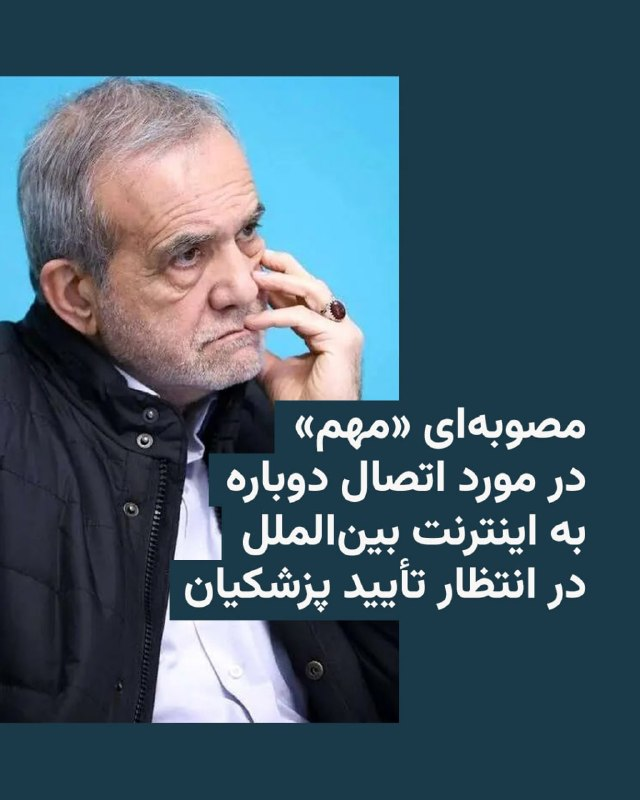

رسانه‌های ایران از تصویب مصوبه‌ای «جدید و مهم» دربارهٔ اتصال دوباره اینترنت کشور به اینترنت بین‌الملل در «ستاد ویژه ساماندهی فضای مجازی» خبر داده‌اند؛ مصوبه‌ای که هنوز برای اجرا نیازمند تأیید نهایی مسعود پزشکیان، رئیس‌جمهور ایران، است.

خبرگزاری فارس روز دوشنبه چهارم خرداد گزارش داد چهارمین جلسه این ستاد به ریاست محمدرضا عارف، معاون اول رئیس‌جمهور، برگزار شد و در آن «مصوبات مهمی» دربارهٔ اتصال به اینترنت بین‌الملل به تصویب رسید.

فارس به نقل از یک منبع نوشت که «برقراری اتصال اینترنت بین‌الملل» با ۹ رأی موافق و سه رأی مخالف تصویب شده و برای تأیید به دفتر رئیس‌جمهور ارسال شده است.

خبرگزاری تسنیم نیز با انتشار گزارشی مشابه نوشت مصوبات این جلسه پس از تأیید نهایی رئیس‌جمهور، برای اجرا به وزارت ارتباطات و فناوری اطلاعات ابلاغ خواهد شد.

در همین حال، سیتنا، رسانه تخصصی حوزه ارتباطات و فناوری اطلاعات، به نقل از «یک منبع آگاه» گزارش داد که در جلسه صبح دوشنبه «بازگشت اینترنت به وضعیت قبل از دی‌ماه ۱۴۰۴» مصوب شده و در صورت تأیید مسعود پزشکیان، جهت اجرا به وزارت ارتباطات ابلاغ خواهد شد.
@VahidHeadline

📡 @VahidOnline

## VahidOnline — post 75698

  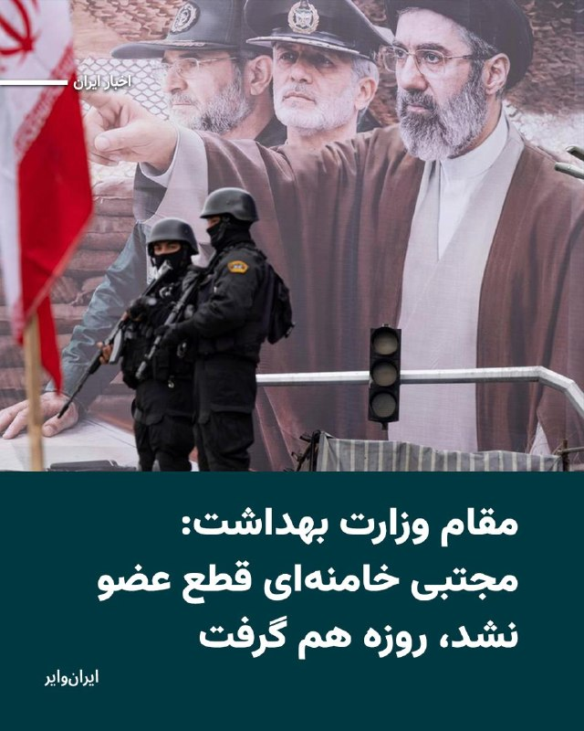

رسانه‌های ایران به نقل از «حسین کرمانپور»، رییس مرکز روابط عمومی وزارت بهداشت، گزارش دادند که جراحت‌های وارد شده به «مجتبی خامنه‌ای»، رهبر جمهوری اسلامی، در جریان حملات اخیر «سطحی» بوده و مشکل جدی برای او ایجاد نکرده است.

کرمانپور گفت رهبر جمهوری اسلامی تنها از ناحیه صورت، سر و پاها دچار جراحت شده و این آسیب‌ها «منجر به قطع عضو یا ناراحتی خاصی نشده است.»او همچنین مدعی شد که هنگام انتقال خامنه‌ای به بیمارستان، پزشکان از او خواسته‌اند روزه خود را بشکند، اما او تا زمان افطار روزه‌اش را ادامه داده است.
@VahidHeadline

📡 @VahidOnline

## VahidOnline — post 75697

  

ایران می‌گوید که سفر وزیر خارجه به نیویورک برای شرکت در نشست شورای امنیت «منتفی» شده است.

اسماعیل بقایی، سخنگوی وزارت خارجه ایران، دلیل انجام نشدن سفر عباس عراقچی را «مشکل روادید» عنوان کرد.

آقای بقایی چهارشنبه هفته پیش درمورد حضور آقای عراقچی در این نشست گفته بود: «این سفر به نیویورک احتمال دارد انجام شود و البته ممکن هم هست انجام نشود، چون هنوز قطعی نیست. دلیلش هم این است که هم باید روادید صادر شود و هم ممکن است اولویت‌های دیگری داشته باشیم.»

چین به‌عنوان رئیس دوره‌ای شورای امنیت، سه‌شنبه ۲۶ مه یک بحث آزاد در سطح بالا با موضوع «حفظ اهداف و اصول منشور سازمان ملل و تقویت نظام بین‌المللی متمرکز بر سازمان ملل» برگزار خواهد کرد.

این جلسه به ریاست وانگ یی، عضو دفتر سیاسی کمیته مرکزی حزب کمونیست و وزیر امور خارجه چین، برگزار می‌شود.

چین این نشست را «فرصتی» برای همبستگی و اجماع کشورهای عضو توصیف کرد تا «تعهد راسخ خود را به حفظ اهداف و اصول منشور سازمان ملل متحد مجددا تصریح و نقش محوری این سازمان را در نظام بین‌المللی احیا کنند.»
@VahidHeadline

📡 @VahidOnline

## VahidOnline — post 75696

  

روز سه‌شنبه ۲۶ اردیبهشت‌ماه ۱۴۰۵، «جانا سعدوئی»، زن ۱۹ ساله، مادر دو کودک و اهل روستای تاریمیش از توابع بخش قطور شهرستان خوی، به دست همسر خود به قتل رسیده است.

به گفته منابع آگاه، همسر این زن پس از وارد کردن ضربات مرگبار، تلاش کرده است ماجرا را به‌عنوان «خودکشی» جلوه دهد.
با این حال، نتایج بررسی‌های پزشکی قانونی و تناقض‌های موجود در روایت‌ها و اظهارات مطرح‌شده، ابعاد این قتل و تلاش برای صحنه‌سازی را آشکار کرده است.
@VahidHeadline

📡 @VahidOnline

## kianmeli1 — post 87662

🔴طبق ادعای خبرنگار هم‌میهن, پزشکیان دستور بازگشایی اینترنت بین‌الملل را ابلاغ کرد.
https://t.me/kianmeli1

## kianmeli1 — post 87661

  

🔴قالیباف و عراقچی در دوحه
ایران می‌گوید هیچ عوارضی برای تنگه هرمز وجود ندارد، اما شاید «هزینه زیست‌محیطی» داشته باشد

ایران به دنبال تضمین‌های چین است، ممکن است اورانیوم را به آنجا منتقل کند: عربستان
ترامپ این توافق را به توافق آبراهام مرتبط دانست
عربستان توافق آبراهام را به مسیر برگشت‌ناپذیر برای تشکیل کشور فلسطین مرتبط دانست

به نظر می‌رسد پیوند توافق‌نامه ابراهیم ناشی از تمایل به خروج آبرومندانه ترامپ و پیروزی ژئوپلیتیکی برای اسرائیل باشد، اما بعید است که این امر محقق شود. ترامپ می‌تواند روی کاغذ تعهدی از عربستان سعودی برای عادی‌سازی نهایی روابط به دست آورد، اما این پادشاهی در طول سال گذشته از این هدف فاصله گرفته و به ترکیه/قطر/پاکستان نزدیک‌تر شده است.

در حال حاضر، تمرکز هرگونه توافق اولیه بر حقوق ترانزیت هرمز و انتقال اورانیوم غنی‌شده با غنای بالا متمرکز است. چین به عنوان ضامن از دیدگاه ایران منطقی است، اما هنوز مشخص نیست که آیا پکن این نقش را خواهد پذیرفت و تا این حد در منطقه خاورمیانه نفوذ خواهد کرد یا خیر.
https://t.me/kianmeli1

## kianmeli1 — post 87660

‏🔴العربیه به نقل از منابع آگاه اعلام کرد پیش‌نویس یک یادداشت تفاهم اولیه و نهایی میان واشینگتن و تهران در حال بررسی است. این پیش‌نویس شامل بازگشایی تنگه هرمز بدون دریافت هزینه و همچنین پاکسازی مین‌ها است. در این پیش‌نویس همچنین به ایران اجازه فروش و صادرات نفت داده خواهد شد

‏در بخش دیگری از این پیش‌نویس آمده است که آتش‌بس به مدت ۶۰ روز تمدید خواهد شد و امکان تمدید دوباره آن نیز وجود دارد. همچنین آمریکا متعهد شده محدودیت‌ها بر بنادر جنوب ایران را کاهش دهد

‏بر اساس گزارش العربیه، بخشی از دارایی‌های مسدودشده ایران بر اساس سازوکاری مشخص آزاد خواهد شد
https://t.me/kianmeli1

## IranIntlTV — post 338968

  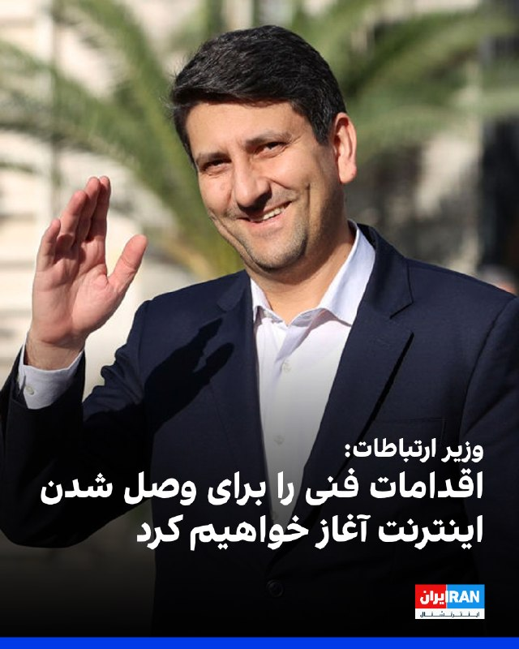

ستار هاشمی، وزیر ارتباطات، با اشاره به «تصویب و آغاز اجرای بازگشایی اینترنت» گفت آنچه در حال وقوع است «پیام‌آور پایداری، اعتماد ملی و ثبات کشور» است.

او افزود: «پس از ابلاغ مصوبه به وزارت ارتباطات، اقدامات فنی و عملیاتی برای بازگرداندن اینترنت به مدار عادی آغاز خواهد شد.»
https://iranintl.com/202605250528

## IranIntlTV — post 338967

  <a href="telegram/content/IranIntlTV_338967_1779733496.mp4" target="_blank">🎬 Download video</a>

مهدی مهدوی‌آزاد در برنامه «چشم‌انداز» گفت: «زمانی که یک حکومت استبدادی مانند جمهوری اسلامی با کشوری مانند آمریکا مذاکره می‌کند، قرارهای پنهانی و محرمانه بخشی از سنت این‌گونه مذاکرات خواهد بود.»
@iranintltv

## IranIntlTV — post 338966

  

🔻لوئیس دلا فوئنته، سرمربی تیم ملی اسپانیا امروز فهرست نهایی خود برای جام جهانی ۲۰۲۶ را اعلام کرد. فهرستی که هسته اصلی تیم قهرمان یورو را حفظ کرده، اما شگفتی بزرگی دارد؛ برای نخستین‌بار در تاریخ حضور اسپانیا در جام‌های جهانی، حتی یک بازیکن از رئال مادرید حضور ندارد.

🔹ستون اصلی تیمی که یورو ۲۰۲۴ را فتح کرد، همچنان شالوده تیم ملی اسپانیا برای جام جهانی ۲۰۲۶ را تشکیل می‌دهد.

🔹بازیکنانی مانند رودری، پدری، فابیان روئیس، دنی اولمو و لامین یامال همچنان مهره‌های کلیدی تیم محسوب می‌شوند.

🔹با این لیست، برای نخستین‌بار در ۹۲ سال حضور اسپانیا در جام جهانی، هیچ نماینده‌ای از پرافتخارترین باشگاه این کشور در ترکیب تیم ملی حضور نخواهد داشت. در عوض بارسلونا، قهرمان دو فصل اخیر لالیگا، ۸ نماینده در ترکیب دارد.

🔹لوئیس دلا فوئنته گفته فرم فعلی و آمادگی بدنی بازیکنان را در اولویت قرار داده است؛ تصمیمی که باعث غیبت‌های قابل توجه و در عین حال دعوت از چهره‌هایی شد که در طول فصل درخشیدند.

🔹فهرست نهایی اسپانیا و تحلیلی درباره ترکیب ۲۰۲۶ را در وب‌سایت ایران اینترنشنال بخوانید.

@iranintltvsport

## IranIntlTV — post 338965

  

یدالله جوانی، معاون سیاسی سپاه پاسداران، گفت «هادیان سیاسی» باید «روایت پیروزی ملت ایران» را برای جامعه بازگو کنند و افزود دشمن پس از شکست در میدان، تلاش می‌کند در جامعه «اختلاف، تردید و سستی» ایجاد کند.

او گفت: «اگر مجاهدت در میدان نباشد، دشمن شکست نمی‌خورد.»

معاون سیاسی سپاه پاسداران افزود: «دشمنی که در میدان شکست خورده است تلاش می‌کند در جامعه اختلاف، تردید، ابهام و سستی ایجاد کند.»
https://iranintl.com/202605257865

## IranIntlTV — post 338964

  

یدالله جوانی، معاون سیاسی سپاه پاسداران، گفت «هادیان سیاسی» باید «روایت پیروزی ملت ایران» را برای جامعه بازگو کنند و افزود دشمن پس از شکست در میدان، تلاش می‌کند در جامعه «اختلاف، تردید و سستی» ایجاد کند.

او گفت: «اگر مجاهدت در میدان نباشد، دشمن شکست نمی‌خورد.»

معاون سیاسی سپاه پاسداران افزود: «دشمنی که در میدان شکست خورده است تلاش می‌کند در جامعه اختلاف، تردید، ابهام و سستی ایجاد کند.»
https://iranintl.com/202605257865

## IranIntlTV — post 338963

  

یدالله جوانی، معاون سیاسی سپاه پاسداران، گفت «هادیان سیاسی» باید «روایت پیروزی ملت ایران» را برای جامعه بازگو کنند و افزود دشمن پس از شکست در میدان، تلاش می‌کند در جامعه «اختلاف، تردید و سستی» ایجاد کند.

او گفت: «اگر مجاهدت در میدان نباشد، دشمن شکست نمی‌خورد.»

معاون سیاسی سپاه پاسداران افزود: «دشمنی که در میدان شکست خورده است تلاش می‌کند در جامعه اختلاف، تردید، ابهام و سستی ایجاد کند.»
https://iranintl.com/202605257865

## IranIntlTV — post 338962

حضور مجتبی خامنه‌ای در مخفی‌گاه، روند مذاکرات تهران و واشینگتن را کند کرده است. براساس گزارش‌های اطلاعاتی آمریکا، رهبر سوم جمهوری اسلامی در مخفیگاهی نامعلوم و تحت تدابیر شدید امنیتی زندگی می‌کند و ارتباط با او هم صرفا از طریق شبکه‌ای پیچیده از پیک‌ها ممکن است. سی‌بی‌اس در گزارشی به نقل از مقام‌های آمریکایی نوشت یکی از دلایل تاخیر طولانی در پاسخ‌های تهران، این است که مقام‌های ارشد حکومت هم دسترسی مستقیمی به مجتبی خامنه‌ای ندارند.

گفت‌وگو با جمشید برزگر، روزنامه‌نگار و تحلیل‌گر سیاسی
@iranintltv

## IranIntlTV — post 338961

توافق احتمالی با تهران، باعث شکاف در جمهوری‌خواهان شده است. تعدادی از سناتورهای ارشد جمهوری‌خواه، معتقدند ترامپ با رفع بخشی از تحریم‌ها و آزادسازی دارایی‌های تهران، امتیاز زیادی به جمهوری اسلامی می‌دهد. آن‌ها هشدار داده‌اند فروش دوباره نفت، می‌تواند باعث تقویت جمهوری اسلامی و گروه‌های نیابتی تهران شود. کاخ سفید اما از مذاکرات دفاع کرده و می‌گوید ترامپ اجازه نخواهد داد ایران به سلاح هسته‌ای دست پیدا کند.

گفت‌وگو با مرضیه حسینی، خبرنگار ایران‌اینترنشنال
@iranintltv

## IranIntlTV — post 338960

  

رسانه‌های ایران گزارش دادند مسعود پزشکیان دستور بازگشایی اینترنت بین‌الملل را ابلاغ کرده است.
پزشکیان گفت: «راه دشواری پیمودیم تا حق مردم را به آنها بازگردانیم .»
پیش‌تر ستاد راهبری و ساماندهی فضای مجازی، به ریاست محمدرضا عارف، معاون اول مسعود پزشکیان، تشکیل جلسه داد و بازگشت اینترنت به وضعیت پیش از دی‌ماه ۱۴۰۴ را تصویب کرد.
https://iranintl.com/202605257040

## IranIntlTV — post 338959

  

خبرگزاری تسنیم، وابسته به سپاه پاسداران، نوشت که اخبار منتشرشده از سوی شبکه الحدث مبنی بر اعلام آمادگی جمهوری اسلامی برای خروج مواد هسته‌ای «کذب» است و در متن تفاهم‌نامه‌ای که تا امروز وجود دارد، هیچ جمله‌ای مبنی بر اعلام آمادگی برای خروج مواد هسته‌ای وجود ندارد.
https://iranintl.com/202605255310

## IranIntlTV — post 338958

  

دونالد ترامپ، رییس‌جمهوری آمریکا، در شبکه اجتماعی تروث‌سوشال با انتشار تصویری که با هوش مصنوعی ساخته شده، دوره اوباما و بایدن را با دوران ریاست‌جمهوری خود در مذاکرات با جمهوری اسلامی مقایسه کرد

او نوشت در دولت‌های پیشین، روسای‌جمهور آمریکا خواهان مذاکره بودند و تهران تهدید به اقدام نظامی می‌کرد، اما این بار او جمهوری اسلامی را تهدید کرد و آن‌ها به مذاکره تن دادند.

ترامپ همچنین با انتشار تصویری ساخته‌شده با هوش مصنوعی از باراک اوباما در کنار یک پالت پر از پول، نوشت سیاست‌های اوباما در قبال جمهوری اسلامی باعث وقوع جنگ شده است.
https://iranintl.com/202605251179

## IranIntlTV — post 338957

  <a href="telegram/content/IranIntlTV_338957_1779733502.mp4" target="_blank">🎬 Download video</a>

ویدیوهای دریافتی نشان می‌دهد روز یک‌شنبه سوم خرداد، جمعی از ایرانیان ساکن شهر رجاینا در ساسکاچوان کانادا، در حمایت از مردم ایران، زنجیره انسانی بر روی پلی تشکیل دادند. آن‌ها با در دست گرفتن نوشته‌هایی علیه اعدام‌های جمهوری اسلامی و قطعی اینترنت، تجمع اعتراضی برگزار کردند.
@iranintltv

## IranIntlTV — post 338956

  <a href="telegram/content/IranIntlTV_338956_1779733503.mp4" target="_blank">🎬 Download video</a>

همزمان با ادامه مذاکرات میان تهران و واشینگتن و انتشار گزارش‌هایی درباره توافق احتمالی، انتقادها در آمریکا و اسرائیل ادامه دارد. منتقدان می‌گویند جزییات منتشرشده از متن توافق می‌تواند منافع ملی آمریکا و اسرائیل را به خطر بیندازد.

گفت‌وگو با آرش آرامش، حقوقدان و کارشناس امنیت ملی
@iranintltv

## IranIntlTV — post 338955

  

🔻خبرگزاری تسنیم گزارش داده که هیات رییسه فدراسیون فوتبال مصوب کرده پاداشی معادل ۲۵۰ میلیارد تومان به اعضای تیم ملی شامل بازیکنان، مربیان و سایر اعضا بابت صعود به جام جهانی ۲۰۲۶ اختصاص دهد. این خبرگزاری نوشته این پاداش از محل مطالبات فدراسیون فوتبال در فیفا تامین می‌شود.

🔹در چهار سال گذشته، پاداش به تیم ملی بابت صعود به جام جهانی ۲۰۲۲، یک پرونده بی‌سرانجام در فوتبل ایران بود؛ پیگیری‌های رسانه‌ای درباره حواله‌های میلیاردی خودرو به بازیکنان تیم ملی و پاداش چند ۱۰ هزار دلاری به هیات رییسه فدراسیون، هیچ‌گاه به پاسخ روشنی نرسید.

@iranintltvsport

## IranIntlTV — post 338954

  <a href="telegram/content/IranIntlTV_338954_1779733505.mp4" target="_blank">🎬 Download video</a>

دونالد ترامپ، رییس‌جمهوری آمریکا، گفت مذاکرات با جمهوری اسلامی به‌خوبی پیش می‌رود و تاکید کرد توافق احتمالی یا یک معامله بزرگ برای همه خواهد بود یا هیچ معامله‌ای در کار نخواهد بود. او همچنین از کشورهای منطقه، از جمله ایران، خواست فورا به پیمان ابراهیم بپیوندند و روابط خود را با اسرائیل عادی‌سازی کنند.

گفت‌وگو با سمیرا قرایی و بابک اسحاقی، خبرنگاران ایران‌اینترنشنال و مسعود کاظمی، روزنامه‌نگار
@iranintltv

## IranIntlTV — post 338953

  

العربیه به نقل از منابع آگاه گزارش داد پیش‌نویس یک توافق میان واشینگتن و تهران در حال بررسی است. بر اساس این پیش‌نویس، تنگه هرمز بدون دریافت عوارض بازگشایی و مین‌های دریایی پاکسازی می‌شود و به ایران اجازه فروش و صادرات نفت داده خواهد شد.

در این پیش‌نویس دوره‌ای ۳۰ روزه برای ازسرگیری کامل کشتیرانی در تنگه هرمز در نظر گرفته شده و همچنین یک بازه ۶۰ روزه برای مذاکرات هسته‌ای تعیین شده است.

بر اساس این گزارش، آتش‌بس در همه جبهه‌ها از جمله لبنان برقرار خواهد ماند و برای ۶۰ روز تمدید می‌شود و امکان تمدید دوباره آن نیز وجود دارد. آمریکا نیز متعهد شده محدودیت‌ها بر بنادر جنوب ایران را کاهش دهد و بخشی از دارایی‌های مسدودشده ایران بر اساس سازوکاری مشخص آزاد شود.
https://iranintl.com/202605252770

## IranIntlTV — post 338952

  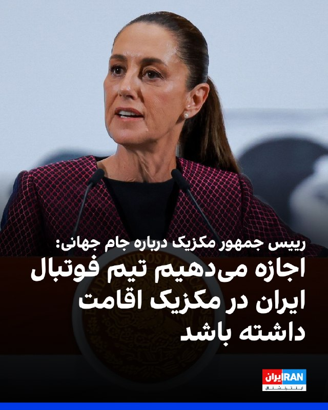

کلودیا شینباوم، رییس‌جمهوری مکزیک، دوشنبه اعلام کرد که دولت او موافقت کرده به تیم ملی فوتبال ایران اجازه دهد در طول رقابت‌های جام جهانی در مکزیک اقامت داشته باشد.

او افزود که ایالات متحده تمایلی به میزبانی این تیم نداشته است.

شینباوم گفت که فدراسیون بین‌المللی فوتبال (فیفا) پس از آن‌که آمریکا اعلام کرد نمی‌خواهد تیم ایران در طول مسابقات در خاک این کشور مستقر باشد، با دولت مکزیک تماس گرفته است.

ایران قرار است هر سه بازی مرحله گروهی خود را در آمریکا برگزار کند.

شینباوم در یک نشست خبری گفت: «ما هیچ دلیلی برای محروم کردن آنها از امکان اقامت در مکزیک نمی‌بینیم.»

کاخ سفید و وزارت خارجه آمریکا هنوز در این زمینه اظهار نظر نکرده‌اند.
https://iranintl.com/202605252544

## IranIntlTV — post 338951

  <a href="telegram/content/IranIntlTV_338951_1779733507.mp4" target="_blank">🎬 Download video</a>

🔻هدایت ممبینی، دبیرکل فدراسیون فوتبال ایران گفته آمریکا برای اعضای تیم ملی فوتبال ویزای مولتی صادر خواهد کرد. این درحالی است که به طور معمول، ایالات متحده برای دارندگان پاسپورت ایرانی ویزای مولتی صادر نمی‌کند.

🔹توضیحات امیر گیتی، عضو تحریریه ایران اینترنشنال

@iranintltvsport

## IranIntlTV — post 338950

  

«برنامه» بعد از یک هفته، امشب روی آنتن برمی‌گردد و یک «تریبون آزاد» دیگر را برای شما میزبانی خواهد کرد.
اگر فقط یک جمله فرصت داشتید با ایران حرف بزنید، چه می‌گفتید؟
چه چیزی هنوز دلتان را گرم نگه می‌دارد؟
نگرانی‌تان چیست؟
از چه چیزی عصبانی هستید؟
حرفی دارید که در دلتان مانده و جایی برای گفتنش نبوده است؟
از خودتان بگویید؛ از امیدها و ترس‌هایتان، از رؤیایی که هنوز زنده است یا از چیزی که از دست رفته است.
تاریخ با صدای شما نوشته می‌شود.
برای شرکت در «برنامه»، همین حالا در واتس‌اپ پیام بدهید:
۰۰۴۴۷۵۲۲۱۱۰۱۱۰
۰۰۴۴۷۵۴۴۱۱۰۱۱۰
۰۰۴۴۷۵۱۱۱۰۲۵۵۳
«برنامه با کامبیز حسینی»
«یک ایران، صدای شما را می‌شنود»
@iranintltv

## IranIntlTV — post 338949

  

رضا باکری، دبیر انجمن صنایع لبنی ایران، اعلام کرد قیمت محصولات لبنی در یک سال گذشته چندین بار افزایش یافته و در مجموع حدود ۹۰ درصد گران شده است.

باکری افزود هفته گذشته دامداران، قیمت شیر خام را با ۲۹ درصد افزایش به کیلویی ۶۰ هزار و ۵۰۰ تومان رساندند.

دبیر انجمن صنایع لبنی ایران از افزایش قیمت چند محصول پرمصرف خبر داد و گفت: «قیمت شیر نایلونی به ۸۴ هزار تومان، شیر بطری به ۹۸ هزار تومان، پنیر یو‌اف ۴۰۰ گرمی به ۲۰۳ هزار تومان و ماست دبه‌ای دو کیلوگرمی به ۲۲۸ هزار و ۷۰۰ تومان رسیده است.»

سرانه مصرف شیر در ایران یک‌سوم میانگین جهانی است که تنها در یکی دو سال اخیر، ۳۰ درصد کاهش داشته است.
https://iranintl.com/202605252813

## Shin_Persian — post 6218

Shin ✓ @hey_itsmyturn
Mon, 25 May 2026 17:57:24 UTC

Al Arabiya is NewYorkTimesing too much these days. I would take their news on Iran talks with a huge grain of salt

فارسی

العربیه این روزها بیش از حد به سبک نیویورک تایمز (NYT) عمل می‌کند. من اخبار آن‌ها درباره مذاکرات ایران را با تردید بسیار زیاد می‌پذیرم.

𝕏 · @shin_persian

## ManotoTV — post 105829

  <a href="telegram/content/ManotoTV_105829_1779733510.mp4" target="_blank">🎬 Download video</a>

گفت‌وگو با کیوان عباسی:
«می‌گفت ایرانی‌ها باید بیشتر کنار هم بایستند…
و دوباره باور کنند که سرنوشت ایران را خود مردم ایران رقم می‌زنند.»

## FarsiVOA — post 218638

🔺پرزیدنت ترامپ در مراسم «روز یادبود»: «خشم حماسی» تضمین کرد که رژیم ایران هرگز سلاح هسته‌ای نخواهد داشت

▪️دونالد ترامپ، رئیس جمهوری ایالات متحده، روز دوشنبه ۴ خرداد در مراسم رسمی «روز یادبود کشته‌شدگان نیروهای مسلح آمریکا» (یا «مموریال دِی») در گورستان ملی آرلینگتون، با ادای احترام به سربازان کشته‌شده آمریکایی، تاکید کرد عملیات‌های اخیر ارتش ایالات متحده، از جمله «خشم حماسی» علیه جمهوری اسلامی، بخشی از نبرد آمریکا برای دفاع از آزادی و جلوگیری از دستیابی «بزرگ‌ترین حامی تروریسم در جهان» به سلاح هسته‌ای بوده است.

⬇️ بیشتر بخوانید:

https://ir.voanews.com/a/president-trump-arlington-cemetery-speech-iran-epic-fury/8153702.html/?nocach=1

## FarsiVOA — post 218637

انتخابات پادگانی مجلس؛ جنگ قالیباف و پایداری وارد فاز علنی شد

## FarsiVOA — post 218636

دولت بریتانیا متهم شده از ترس کمبود سوخت جت و تبعات بحران خاورمیانه، اجرای بخشی از تحریم سوخت روسیه را عقب انداخته. دارن جونز، از مقام‌های دولت استارمر، این ادعا را «کاملاً غلط» توصیف کرده اما همزمان تأیید کرده لندن در حال بررسی سناریوهای بحران انرژی و تأثیر تنش‌های خاورمیانه روی بریتانیا است.

## FarsiVOA — post 218635

  

⚡️دونالد ترامپ، رئیس جمهوری آمریکا در روز یادبود با حضور در آرامستان ملی آرلینگتون، به قهرمانان جنگی ادای احترام کرد. پرزیدنت ترامپ نظامیان کشته‌شده آمریکا در عملیات خشم حماسی را قهرمانانی نامید که جانشان را از دست دادند تا بزرگترین حامی تروریسم در جهان به سلاح هسته‌ای دست پیدا نکند و هرگز هم دست پیدا نخواهد کرد.

## FarsiVOA — post 218634

ادامه تلاش های دیپلماتیک برای کاهش تنش در منطقه در گفتگو با حامد آئینه‌وند

## FarsiVOA — post 218633

پیشنهاد فوری عراق به واشنگتن: «نظارت سختگیرانه» بر گروه‌های مسلح در برابر اعطای مهلت سه‌ماهه به دولت الزیدی

## FarsiVOA — post 218632

دونالد ترامپ، رئیس‌جمهوری آمریکا، در مراسم روز یادبود کشته‌شدگان نیروهای مسلح آمریکا با حضور در مقبره سرباز گمنام، به نظامیان کشته‌شده آمریکا ادای احترام کرد.

@FarsiVOA

## FarsiVOA — post 218631

🔺ارتش اسرائیل: یک «تروریست‌ کلیدی» حماس را از میان برداشتیم

▪️ارتش اسرائیل می‌گوید محمد ابو ملوح، که یک «تروریست‌ کلیدی» در سازمان تروریستی حماس بوده، کشته شده است.

⬇️ بیشتر بخوانید:

https://ir.voanews.com/a/terrorist-hamas-killed-attack/8153681.html/?nocach=1

## FarsiVOA — post 218629

تغییر حکم بچه های اکباتان از حبس به اعدام در گفتگو با مینا احدی، سخنگوی کمیته علیه اعدام.

## FarsiVOA — post 218628

  <a href="telegram/content/FarsiVOA_218628_1779733511.mp4" target="_blank">🎬 Download video</a>

اسپیس‌ایکس ویدیویی از مانور چرخش و مرحله فرود استارشیپ در پایان دوازدهمین پرواز آزمایشی منتشر کرد.

@FarsiVOA

## FarsiVOA — post 218627

  <a href="telegram/content/FarsiVOA_218627_1779733512.mp4" target="_blank">🎬 Download video</a>

مجموعه «سور اطلس» تصاویر ماهواره‌ای جدیدی را منتشر کرده که نشان‌دهنده تخریب گسترده در «تاسیسات کلیدی دریایی بوشهر» است.

بررسی تصاویر قبل و بعد نشان می‌دهد که بعد از حملات هوایی آمریکا و اسرائیل در ۱۴ اسفند ۱۴۰۴ چند ساختمان در این منطقه «برای تضعیف توانایی ایران در ادامه عملیات دریایی» هدف‌گیری شدند.

دونالد ترامپ، رئیس‌جمهوری آمریکا، از آغاز جنگ چند مرتبه اشاره کرد که در همان هفته اول «نیروی دریایی جمهوری اسلامی از بین رفته است.»

این ویدیو بی‌صدا است.

## FarsiVOA — post 218626

در گفت‌وگو با مهدی عربشاهی به انتقادها از نادیده‌گرفتن نقش مردم ایران در گفت‌وگوهای احتمالی، پنهان‌بودن رهبر جمهوری اسلامی و مقایسه آن با سال‌های پایانی اسامه بن‌لادن در پاکستان پرداختیم و پرسیدیم در این معادله قدرت، جامعه معترض چه جایگاهی دارد و چه تاثیری بر سرنوشت خود خواهد گذاشت؟

## FarsiVOA — post 218625

ترامپ: توافق با تهران کاملا بر خلاف برجام است، و پیمان ابراهیم را با توافق تهران مرتبط می‌دانم

## FarsiVOA — post 218624

🔺هشدار جدید ارتش اسرائیل به چند روستا در جنوب لبنان: فورا تخلیه کنید

▪️ارتش اسرائیل روز دوشنبه ۴ خرداد هشداری فوری برای تخلیه روستای العباسیه در اطراف شهر صور در جنوب لبنان صادر کرد.

⬇️ بیشتر بخوانید:

https://ir.voanews.com/a/israel-lebanon-iran-hezbollah-war-ceasfire/8153680.html/?nocach=1

## FarsiVOA — post 218623

  <a href="telegram/content/FarsiVOA_218623_1779733514.mp4" target="_blank">🎬 Download video</a>

ارتش اسرائیل مواضع حزب‌الله را در نزدیکی منطقه صور در جنوب لبنان هدف قرار داد.

ارتش اسرائیل پیشتر به ساکنان ۱۰ منطقه شامل شهر و روستا در جنوب لبنان هشدار داده بود که پیش از حملات هوایی علیه مواضع گروه حزب‌الله لبنان، این مناطق را تخلیه کنند.

## FarsiVOA — post 218622

  <a href="telegram/content/FarsiVOA_218622_1779733515.mp4" target="_blank">🎬 Download video</a>

ارتش اسرائیل اعلام کرد روز گذشته یک نیروی کلیدی از ستاد تولید سازمان تروریستی حماس را از بین برد.

بنابر بیانیه ارتش اسرائیل، «محمد ابو ملوح»، یکی از منابع اصلی دانش در سازمان تروریستی حماس بود که در طول دوره آتش‌بس نیز به تولید تسلیحاتی مشغول بود که تهدیدی برای نیروهای ارتش در منطقه و شهروندان محسوب می‌شد. او با حمله نیروهای ارتش اسرائیل تحت فرماندهی جنوب در مرکز نوار غزه حذف شد.

ارتش اسرائیل تاکید کرد نیروهایش تحت فرماندهی جنوب مطابق با توافق در منطقه مستقر هستند و به فعالیت خود برای رفع هرگونه تهدید فوری ادامه می‌دهند.

## FarsiVOA — post 218621

در گفت‌وگو با مئیر جاودانفر، تحلیلگر مسائل خاورمیانه در اسرائیل، به هم‌زمانی سیگنال‌های مثبت درباره پیشرفت مذاکرات میان حکومت ایران و آمریکا پرداختیم و پرسیدیم آیا مسیر کنونی به توافقی واقعی منتهی می‌شود یا صرفاً بازیِ سیگنال‌ها و مدیریت انتظارات است؟

## FarsiVOA — post 218620

  <a href="telegram/content/FarsiVOA_218620_1779733517.mp4" target="_blank">🎬 Download video</a>

چیزی که در این مدت آموخته‌ایم این است که هیچ چیز هنوز قطعی نیست و همه چیز در تعلیق است. اما آیا فضای تازه‌ای که در مذاکرات ایران و آمریکا باز شده می‌‌تواند آغازی باشد برای یک پایان؟ کارشناسان میدان پاسخ می‌دهند

## FarsiVOA — post 218619

  <a href="telegram/content/FarsiVOA_218619_1779733517.mp4" target="_blank">🎬 Download video</a>

ارتش اسرائیل یک ساختمان حزب‌الله را در رشیدیه، جنوب لبنان، هدف قرار داد. این حمله پس از هشدار تخلیه انجام شد.

ارتش اسرائیل پیشتر به ساکنان ۱۰ منطقه شامل شهر و روستا در جنوب لبنان هشدار داده بود که پیش از حملات هوایی علیه مواضع گروه حزب‌الله لبنان، این مناطق را تخلیه کنند.

## FarsiVOA — post 218618

🔺نوبت به اهالی سینما رسید؛ هومن سیدی و سعید روستایی احضار شدند

▪️قوه قضائیه جمهوری اسلامی با پرونده‌سازی علیه شماری از اهالی سینما، از جمله هومن سیدی و سعید روستایی، آنها را به اتهام واهی «همکاری با دولت متخاصم» به «دادسرای فرهنگ و رسانه» احضار کرده است.

⬇️ بیشتر بخوانید:

https://ir.voanews.com/a/filing-a-case-against-cinema-workers-saeed-roustaei-hooman-seydi-judiciary-legal-director-of-the-cinema-house/8153614.html/?nocach=1

## DW_Farsi — post 125141

🔶 شبکه تلویزیونی و اینترنتی"منوتو" به کار خود پایان داد

شبکه تلویزیونی و اینترنتی "منوتو" (manoto)، از رسانه‌های پرمخاطب فارسی‌زبان خارج از کشور طی اطلاعیه‌ای از پایان پخش برنامه‌هایش بعد از ۱۶ سال کار خبر داد.

این شبکه که پیش از این پخش برنامه‌هایش در زمستان ۱۴۰۲ متوقف شده بود این بار در شامگاه جمعه اول خردادماه طی اطلاعیه‌ای اعلام کرد، سرانجام به این تصمیم دشوار رسیده که به پخش برنامه‌های منوتو پایان دهد: «آخرین پخش ما از ماهواره و یوتیوب، شامگاه ۲۴ مه ۲۰۲۶ [۳ خرداد ۱۴۰۵] خواهد بود.»

"منوتو" که از پاییز سال ۱۳۸۹ در لندن با مدیریت کیوان و مرجان عباسی به روی آنتن ماهواره رفت بعد از حدود دو سال و نیم کار اعلام کرد، به دلیل "مشکلات مالی" پخش تلویزیونی خود را متوقف کرده است. اما این توقف به طول نیانجامید و مدتی بعد فعالیت "منوتو" ازسر گرفته شد.

این بار طبق اطلاعیه پایانی، علاوه بر مسائل مالی به "دگرگونی‌های بنیادین در عرصه رسانه‌ای و سیاسی" ایران نیز اشاره شده است.

در این اطلاعیه گفته شده که فضای عمومی مملو از "اطلاعات نادرست، هیجان‌سازی و تلاش آگاهانه برای مخدوش کردن مرز میان واقعیت و روایت‌های جعلی" است و فضای سیاسی ایران نیز "خصمانه‌تر و قطبی‌تر" شده و شرایط را برای ادامه فعالیت این شبکه غیرممکن کرده است.

در ادامه آمده است: «از همین رو، ترجیح دادیم به جای ادامه مسیری که ممکن است به بهای از دست رفتن هویت منوتو تمام شود، از ارزش و انسجام این مجموعه محافظت کرده و خود را برای شکلی متفاوت از تأثیرگذاری آماده کنیم.»

"منوتو" همچنین گفته است، پخش را متوقف می‌کند تا بتواند در آینده "به‌ شکلی دیگر، در گفت‌وگو درباره فردای ایران سهیم" شود.

@dw_farsi

## DW_Farsi — post 125140

🔶 محکومیت یک نفر به زندان "به دلیل پخش شیرینی" در شب کشته شدن خامنه‌ای

شهلا عروجی، وکیل دادگستری در پستی در شبکه ایکس خبر از صدور دو سال زندان برای یک شهروند به دلیل پخش شیرینی در شامگاه نهم اسفند ۱۴۰۴ همزمان با کشته شدن علی خامنه‌ای خبر داد.

عروجی در این پست نوشت: «به دليل پخش شيرينی در شب ۱۰ اسفند [خود موكل ميگه ٩ اسفند و بابت افتتاح فست فودش بوده] محكوم به ۲ سال حبس از بابت اتهام توهين به رهبری شده!»

به نوشته این وکیل دادگستری، در رأی صادره به "شاد بودن" این شهروند هم به عنوان مصداق ارتکاب جرم اشاره شده است.

دادبان، مرکز مشاوره و آموزش حقوقی ویژه کنش‌گران با انتشار این خبر نوشته است: «حتی در فرض صحت ادعای مطرح‌شده درباره پخش شیرینی به مناسبت کشته شدن رهبر جمهوری اسلامی، چنین رفتاری به‌ خودی‌خود مصداق جرم "توهین به رهبری"، موضوع ماده ۵۱۴ قانون مجازات اسلامی محسوب نمی‌شود.»

به نوشته دادبان، تحقق عمل مجرمانه توهین به رهبری "مستلزم به‌کارگیری الفاظ، عبارات یا رفتارهای صریحا موهن و تحقیرآمیز است و صرف ابراز شادی یا پخش شیرینی، فاقد عناصر قانونی لازم برای تحقق این جرم است".

دادبان ادامه می‌دهد: «همچنین استناد دادگاه به "شاد بودن" متهم به‌عنوان دلیل ارتکاب جرم، با اصل قانونی بودن جرم و مجازات در تعارض آشکار قرار دارد؛ چرا که احساسات، حالات روحی یا برداشت‌های ذهنی افراد تا زمانی که در قالب رفتار مجرمانه مشخص و تعریف‌شده در قانون بروز پیدا نکند، قابل جرم‌انگاری نیست.»
به علاوه، در قوانین کیفری ایران نیز "هیچ ماده‌ای صرف شادمانی از مرگ یک فرد را جرم تلقی نکرده است."

دادبان بر همین مبنا صدور دو سال زندان در این پرونده را "فاقد مبنای قانونی روشن" و "مصداق تفسیر موسع قوانین کیفری علیه متهم" خوانده است؛ امری که "برخلاف اصول بنیادین حقوق کیفری و الزامات دادرسی عادلانه است.

@dw_farsi

## DW_Farsi — post 125139

  <a href="telegram/content/DW_Farsi_125139_1779733519.mp4" target="_blank">🎬 Download video</a>

🎥 شکست پروژه قطار شناور آلمان

"ترانس‌راپید"، پروژه قطار شناور مغناطیسی آلمان، قرار بود آینده حمل‌ونقل را تغییر دهد.

قطاری فوق‌سریع که بدون چرخ و با فناوری مغناطیسی حرکت می‌کرد. اما حالا مسیر آزمایشی این قطار زنگ زده و متروکه شده است.

چه شد که این پروژه شکست خورد؟

@dw_farsi

## DW_Farsi — post 125138

🔶 رسانه‌ها‌ی ایران از تصویب بازگشایی اینترنت بین‌الملل خبر دادند

رسانه‌های ایران از تصویب مصوبه‌ای تازه در راستای اتصال مجدد اینترنت بین‌الملل در این کشور خبر داده‌اند.

خبرآنلاین به نقل از یک منبع آگاه نوشت ستاد راهبردی و ساماندهی فضای مجازی صبح دوشنبه چهارم خرداد به ریاست محمدرضا عارف، معاون‌ اول مسعود پزشکیان، رئیس‌جمهور کشور جلسه‌ای تشکیل داد و بازگشت اینترنت به وضعیت قبل از دی‌‌ماه ۱۴۰۴ را تصویب کرد.

در جریان اعتراضات ضدحکومتی دی‌ماه اینترنت قطع و  دسترسی به شبکه جهانی تقریبا به طور کامل ناممکن شد.

قطع اینترنت بین‌الملل در خلال جنگ اسرائيل و آمریکا علیه جمهوری اسلامی نیز پی گرفته شد و تا کنون ادامه دارد.

محمدرضا عارف در جلسه روز دوشنبه بر لزوم رفع محدودیت‌های اینترنتی و حمایت از جوانان تأکید کرد و خواستار پاسخگویی به مطالبات مردم و جامعه علمی شد.

به گزارش خبرگزاری مهر، او گفت: «نمی‌شود شعار کمک به مردم سر دهیم ولی در عمل به مردم اعتماد نکرده و اینترنت را بر روی مردم ببندیم و با این کار خود، سرمایه‌های اجتماعی را سوزانده و فرصت طی کردن مسیر فناوری‌ها از دست بدهیم.»

پایگاه خبری تخصصی سیتنا در حوزه فناوری و اطلاعات ایران خبر داده که مصوبه بازگشایی اینترنت برای پزشکیان ارسال شده و "در صورت تأیید رئیس‌جمهور جهت اجرا برای وزارت ارتباطات ارسال خواهد شد."

در همین رابطه نیز یک منبع به خبرگزاری فارس گفت، در جلسه‌ روز دوشنبه، برقراری اینترنت بین‌الملل با ۹ رأی موافق در برابر سه رأی مخالف تصویب و برای تأیید به دفتر رئیس‌جمهور ارسال شد.

@dw_farsi

## DW_Farsi — post 125137

🔶 ترامپ: یا به توافقی عالی با ایران می‌رسیم یا اصلا توافقی در کار نیست

دونالد ترامپ، رئیس‌جمهور آمریکا در پیامی تازه با قید این که گفت‌وگوها با ایران "به‌خوبی پیش می‌رود" نوشت، این مذاکرات یا به یک "توافق عالی" برای همگان منجر می‌شود یا اصلا توافقی در کار نخواهد بود.

در این پیام که دوشنبه ۴ خرداد (۲۵ مه) در شبکه اجتماعی تروث سوشال به نگارش درآمده هشدار داده شده که در غیر این صورت درگیری نظامی دوباره آغاز خواهد شد و همچنین "تیراندازی بزرگ‌تر و قوی‌تر از همیشه ـ و کسی چنین چیزی نمی‌خواهد."

ترامپ با یادآوری دیدار و گفت‌وگوهای اخیر خود با رهبران عربستان، امارات، قطر، پاکستان، ترکیه، مصر، اردن و بحرین گفت، اظهار کرده که پس از تمامی تلاش‌های انجام‌شده توسط ایالات متحده برای حل این مسئله پیچیده (در مورد ایران) باید برای این کشورها دست کم به صورت همزمان امضای پیمان ابراهیمکه همانا عادی‌سازی روابط با اسرائیل است الزامی باشد.  

ترامپ با اشاره به این که پیمان ابراهیم برای کشورهایی که آن را امضا کرده‌اند مانند امارات متحده عربی و بحرین "شکوفایی مالی، اقتصادی و اجتماعی" به بار آورده از عربستان، قطر و سایر کشورها نیز خواست که این روند را ادامه دهند و این پیمان را امضا کنند.

او تصریح کرد: «من قاطعانه از همه کشورها می‌خواهم که فورا پیمان ابراهیم را امضا کنند و اگر ایران هم با من، رئیس‌جمهور آمریکا، توافقش را امضا کند، مایه افتخار خواهد بود که آن‌ها نیز بخشی از این ائتلاف بی‌نظیر جهانی باشند.»

دونالد ترامپ در اولین دور ریاست جمهوری‌اش طرحی را به منظور صلح کشورهای عربی با اسرائیل به نام توافق یا پیمان صلح ابراهیم تهیه کرد. در اولین قدم از این طرح، امارات متحده عربی و بحرین به این توافق پیوسته و برای اولین بار روابط دیپلماتیک‌شان با اسرائیل را در سال ۲۰۲۰ از سر گرفتند.

@dw_farsi

## DW_Farsi — post 125136

🔶 چین سه فضانورد را راهی ایستگاه فضایی تیانگونگ کرد

سه فضانورد سفر خود به سمت ایستگاه فضایی تیانگونگ چین را در روز یکشنبه ۲۴ مه (۳ خرداد) آغاز کردند. فضاپیمای "شنژو-۲۳" در این روز با این سه فضانورد از پایگاه فضایی جیوکوان در بخش چینی صحرای گُبی (Gobi) به پرواز درآمد.

موشک "لانگ مارچ ۲ـ اف" فضاپیمای یادشده را در این روز به فضا فرستاد تا در نهایت به ایستگاه فضایی تیانگونگ چین در مدار زمین متصل شود.

در چارچوب این مأموریت، برای نخستین بار قرار است یک فضانورد چینی به‌مدت یک سال کامل در این ایستگاه فضایی اقامت داشته باشد؛ این در حالی است که به‌طور معمول، خدمه سه‌نفره این ایستگاه هر شش ماه یک‌بار تعویض می‌شوند.

پکن این اقدام را گامی اساسی در راستای تلاش‌های خود برای اعزام انسان به کره ماه تا سال ۲۰۳۰ قلمداد می‌کند.

@dw_farsi

## DW_Farsi — post 125135

🔶 کی‌یف زیر آتش؛ اوکراین خواستار واکنش جهانی شد

یک روز پس از حمله گسترده روسیه به کی‌یف، پایتخت اوکراین، بار دیگر حملات متقابل میان دو کشور در مناطق مرزی ادامه یافت.

مقام‌های روسیه در کانال تلگرام اعلام کردند که در منطقه بلگورود یک مرد در جریان حمله موشکی و پهپادی کشته و فرد دیگری زخمی شده است. همچنین به گفته آنها، زیرساخت‌های انرژی آسیب دیده‌اند که به قطع برق و آب در شهر بلگورود منجر شده است.

سرپرست فرمانداری منطقه بریانسک نیز اعلام کرد یک مرد دیگر در حمله اوکراین به شهرک "بلایا بریوزکا" در نزدیکی بریانسک کشته شده است.

به گزارش تلویزیون دولتی روسیه، در شهر "هورلیفکا" در شرق اوکراین که تحت اشغال روسیه است، پنج نفر در حملات پهپادی زخمی شده‌اند.

@dw_farsi

## DW_Farsi — post 125134

  <a href="telegram/content/DW_Farsi_125134_1779733521.mp4" target="_blank">🎬 Download video</a>

🎥 مخترعان آلمان کجا هستند؟

شرکت‌های بزرگ در آلمان سرمایه فراوانی دریافت می‌کنند. اما اقتصاد این کشور در رکود است. آیا آلمان روی گزینه درستی سرمایه‌گذاری می‌کند؟

@dw_farsi

## DW_Farsi — post 125133

🔶 رسانه‌ها: قالیباف و عراقچی برای مذاکرات وارد قطر شده‌اند

خبرگزاری‌های رویترز  و فرانسه به نقل از یک مقام آگاه از حضور محمدباقر قالیباف، مذاکره‌کننده ارشد ایران و عباس عراقچی، وزیر خارجه این کشور در دوحه قطر به منظور گفت‌وگو با نخست‌وزیر این کشور خبر داده‌اند.

بر اساس این گزارش‌ها، در این گفت‌وگوها توافق احتمالی میان ایران و آمریکا برای پایان دادن به جنگ بررسی خواهد شد.

رویترز به نقل از این مقام آگاه نوشت، محور اصلی مذاکرات موضوع تنگه هرمز و ذخایر اورانیوم بسیار غنی‌شده ایران خواهد بود.

به گفته خبرگزاری‌های داخلی، عبدالناصر همتی، رئیس بانک مرکزی نیز عازم قطر شده و در این سفر "آزادسازی اموال بلوکه‌شده ایران" را بررسی خواهد کرد.

این سفر در پی گفت‌وگوهای اخیر هیأت قطری در تهران در چارچوب میانجی‌گری در مذاکرات ایران و آمریکا صورت می‌گیرد.

در حالی که سرنوشت توافق احتمالی میان ایران و آمریکا در هاله‌ای از ابهام قرار دارد، روزنامه واشنگتن پست به نقل از یک مقام ارشد آمریکایی خبر داده که این دو کشور به یک "چارچوب" مشترک دست یافته‌اند که شامل تمدید ۶۰ روزه آتش‌بس تا رسیدن دو طرف به توافق نهایی برای پایان دادن به جنگ می‌شود.

با این حال این مقام گفت که هنوز هیچ توافقی با ایران امضا نشده و مشخص نیست که این چارچوب تا چه  حد الزام‌آور است.

محورهای اصلی توافق پیشنهادی

واشنگتن پست همچنین به نقل از یک دیپلمات آگاه که نامش ذکر نشد نوشت "آخرین پیشنهاد در انتظار تأیید ایران است."

طبق این گزارش، این پیشنهاد شامل این موارد کلیدی زیر می‌شود:

بازگشایی تنگه هرمز: ایران متعهد می‌شود فورا تنگه هرمز را بازگشایی و عملیات مین‌روبی را آغاز کند و ظرف ۳۰ روز شرایط تردد کشتی‌ها را به وضعیت پیش از جنگ بازگرداند.

توقف کامل درگیری‌ها: ایران، آمریکا و متحدانش متعهد ‌می‌شوند عملیات نظامی را در تمامی جبهه‌ها، از جمله لبنان فورا متوقف کنند.

مسئله هسته‌ای ایران: جمهوری اسلامی باید تعهد بدهد که هرگز سلاح هسته‌ای تولید نخواهد کرد. همچنین توافق شده که ذخایر اورانیوم غنی‌شده ایران یا "غبار هسته‌ای" تحت یک مکانیزم مورد توافق، منهدم یا واگذار شود.

@dw_farsi

## DW_Farsi — post 125132

  <a href="telegram/content/DW_Farsi_125132_1779733522.mp4" target="_blank">🎬 Download video</a>

🎥 مارکو روبیو: ترامپ توافق بد با ایران را نمی‌پذیرد

مارکو روبیو، وزیر خارجه آمریکا، در جریان سفر رسمی خود به هند گفت مذاکرات واشنگتن و جمهوری اسلامی همچنان ادامه دارد و آمریکا پیش از بررسی گزینه‌های دیگر، به "دیپلماسی" فرصت خواهد داد.

روبیو اعلام کرد مذاکرات میان واشنگتن و جمهوری اسلامی همچنان "در حال پیشرفت" است و آمریکا پیش از رفتن به‌سوی گزینه‌های دیگر، به دیپلماسی فرصت خواهد داد. روبیو در دهلی نو گفت چارچوبی "نسبتاً قوی" برای توافق روی میز قرار دارد که شامل بازگشایی تنگه هرمز و آغاز مذاکراتی محدود و جدی درباره برنامه هسته‌ای جمهوری اسلامی است. هم‌زمان، آسوشیتدپرس به نقل از مقام‌های منطقه‌ای گزارش داده آمریکا به توافقی نزدیک شده که می‌تواند به جنگ پایان دهد و جمهوری اسلامی ذخایر اورانیوم با غنای بالای خود را کنار بگذارد. روبیو همچنین درباره لبنان گفت تا زمانی که حزب‌الله مسلح باقی بماند، رسیدن به صلح در لبنان دشوار خواهد بود.

@dw_farsi

## DW_Farsi — post 125131

🎥 وقتی خودبودن جرم می‌شود؛ "مادرم گفت می‌کشمت"

یک مرد کوئیر عراقی از نجف می‌گوید که تهدیدهای خانواده‌اش همراه با قوانین ضد جامعه دگرباشان در عراق، او را مجبور کرد تا برای یافتن جایی که بتواند آزادانه و با امنیت زندگی کند، به بیروت فرار کند. آیا وضعیت در بیروت بهتر است؟

@dw_farsi

## Persian_Trend_Official — post 14964

  <a href="telegram/content/Persian_Trend_Official_14964_1779733524.mp4" target="_blank">🎬 Download video</a>

🔴در این ویدئو آماده سازی و تمرینات سخت نیروهای ویژه کره شمالی را مشاهده میکنید .

🫆:Tony

📌 @persian_trend_official
پرشین ترند | متفاوت‌ترین کانال نظامی

## Persian_Trend_Official — post 14963

  

🗻
💥ویرانی گسترده زاغه مهمات اصفهان

✈️تصاویر ماهواره‌ای منتشرشده از قبل و بعدِ حمله به زاغه مهمات واقع در پشت کوه صفه اصفهان، نشان می‌دهد این مجموعه به‌طور کامل تخریب شده و بخش عمده تأسیسات و انبارهای آن از بین رفته‌اند.

💣این مرکز در تاریخ ۱۱ فروردین توسط بمب افکن های آمریکایی مورد هدف قرار گرفت و طبق ویدیوهای منتشرشده از آن شب، انفجار مهمات داخل پایگاه تا ساعت‌ها پس از حمله ادامه داشته است.

👩‍💻@PhantomDirective

🆔@persian_trend_official
پرشین ترند | متفاوت‌ترین کانال نظامی

## Persian_Trend_Official — post 14962

♦️مقام ارشد آمریکایی به الجزیره: • حزب‌الله درخواست‌های مکرر برای آتش‌بس علیه اسرائیل، از جمله در آخرین هشدار را نادیده می‌گیرد. • اسرائیل به تمام حملاتی که علیه نیروها و شهروندانش انجام شود پاسخ خواهد داد؛ این دولت، دولت بایدن نیست. • از ۱۷ آوریل تاکنون،…

## Persian_Trend_Official — post 14961

♦️مقام ارشد آمریکایی به الجزیره:

• حزب‌الله درخواست‌های مکرر برای آتش‌بس علیه اسرائیل، از جمله در آخرین هشدار را نادیده می‌گیرد.

• اسرائیل به تمام حملاتی که علیه نیروها و شهروندانش انجام شود پاسخ خواهد داد؛ این دولت، دولت بایدن نیست.

• از ۱۷ آوریل تاکنون، حزب‌الله برای مختل کردن مذاکرات میان لبنان و اسرائیل، هزار پهپاد و ۷۰۰ موشک شلیک کرده است.

• حزب‌الله به‌طور کامل مسئول تشدید تنش‌های فعلی است، زیرا از ابتدای ماه مارس آتش‌بس را نقض کرده است.

• حزب‌الله تلاش می‌کند مردم لبنان را از فرصت رسیدن به صلح و آغاز بازسازی و توسعه محروم کند.

🫆:Tony

📌 @persian_trend_official
پرشین ترند | متفاوت‌ترین کانال نظامی

## Persian_Trend_Official — post 14960

  <a href="telegram/content/Persian_Trend_Official_14960_1779733526.webm" target="_blank">🎬 Download video</a>

یک روز نسبتا کم کار فرودگاه بن گوریون

👩‍💻@PhantomDirective

🆔@persian_trend_official
پرشین ترند | متفاوت‌ترین کانال نظامی

## Persian_Trend_Official — post 14958

♦️مدیر روابط‌عمومی وزارت ارتباطات:

▪️مصوبه بازگشت اینترنت به وضعیت قبل از دی‌ماه ۱۴۰۴، دقایقی پیش از سوی رئیس‌جمهور به وزارت ارتباطات ابلاغ شد.

🫆:Tony

📌 @persian_trend_official
پرشین ترند | متفاوت‌ترین کانال نظامی

## Persian_Trend_Official — post 14957

تسنیم:خبر رسانه سعودی درباره جزئیات تفاهم احتمالی کذب است

🔹الحدث، رسانه وابسته به سعودی نوشت که «منابع ایرانی به او گفته‌اند که ایران آماده است اورانیوم غنی شده سطح بالا را از کشور خارج کند»!

🔹بررسی‌ها نشان می‌دهد که رسانه سعودی نیز همچون بسیاری از اخبار او درباره جزئیات مذاکرات کذب بوده و در راستای عملیات روانی آمریکایی‌هاست.

🔹در متن تفاهم‌نامه‌ای که تا امروز وجود دارد، هیچ جمله‌ای مبنی بر اعلام آمادگی برای خروج مواد هسته‌ای وجود ندارد و اساساً ایران در این تفاهم نامه هیچ تعهدی درباره اقدام هسته‌ای نداده است.

🫆:Tony

📌 @persian_trend_official
پرشین ترند | متفاوت‌ترین کانال نظامی

## Persian_Trend_Official — post 14956

  <a href="telegram/content/Persian_Trend_Official_14956_1779733527.webm" target="_blank">🎬 Download video</a>

🔴اولین پیام دبیر شورای عالی امنیت ملی جمهوری اسلامی

▪️"عقب نشینی در‌ کار نخواهد بود".

♦️این را میدان نظامی، میدان دیپلماسی و مردم مبعوث شده حاضر در خیابان با مقاومت جانانه خود نشان دادند و دشمن را زمین گیر کردند.

♦️حالا بیش از هر زمان دیگر کشور نیاز به وحدت و انسجام دارد تا آمریکایی‌ها و صهیونیست‌ها در این زمینه هم مأیوس شوند.

♦️میدان وحدت و انسجام هم یک میدان دیگر در مبارزه است. تلاش همگانی برای جلوگیری از هر سخن و اقدام وحدت‌شکن، ایرانِ عزیز را به پیروزی نهایی خواهد رساند؛ ان‌شاءالله.

🫆:Tony

📌 @persian_trend_official
پرشین ترند | متفاوت‌ترین کانال نظامی

## Persian_Trend_Official — post 14955

  

⭕️پست جدید دونالد ترامپ

⚠️ترجمه فارسی در تحریریه پرشین ترند به تصویر اصلی اضافه شده است .

🫆:Tony

📌 @persian_trend_official
پرشین ترند | متفاوت‌ترین کانال نظامی

## Persian_Trend_Official — post 14953

  <a href="telegram/content/Persian_Trend_Official_14953_1779733528.webm" target="_blank">🎬 Download video</a>

ویدیو لو رفته از مذاکرات آمریکا با جمهوری اسلامی 😒

📝 Nick

📌 @persian_trend_official
پرشین ترند | متفاوت‌ترین کانال نظامی

## Persian_Trend_Official — post 14952

  

🔹 دونالد ترامپ در پیامی مفصل اعلام کرد از کشورهایی که طی آخر هفته با آن‌ها گفت‌وگو داشته، از جمله پاکستان، ترکیه، مصر، اردن، بحرین، امارات، عربستان سعودی و قطر خواسته است هرچه سریع‌تر به توافقنامه‌های ابراهیم بپیوندند.

## Persian_Trend_Official — post 14951

  <a href="telegram/content/Persian_Trend_Official_14951_1779733528.webm" target="_blank">🎬 Download video</a>

🚨 فوری:
وال استریت ژورنال: مذاکرات ایران رو بحث برنامه هسته‌ای و رفع تحریم‌ها به بن بست رسیده.

📝 Nick

📌 @persian_trend_official
پرشین ترند | متفاوت‌ترین کانال نظامی

## Persian_Trend_Official — post 14950

🔴 یک منبع سعودی به CNN:

▪️ عربستان تنها در صورتی روابط خود با اسرائیل را عادی‌سازی خواهد کرد که «مسیر غیرقابل بازگشت» برای تشکیل کشور فلسطین وجود داشته باشد
▪️ ریاض تأکید کرده موضعش «همان موضع همیشگی» است
▪️ این اظهارات پس از آن مطرح شد که ترامپ از احتمال گسترش شناسایی اسرائیل در منطقه پس از توافق احتمالی با ایران صحبت کرده بود

🫆:Tony

📌 @persian_trend_official
پرشین ترند | متفاوت‌ترین کانال نظامی

## Persian_Trend_Official — post 14949

  <a href="telegram/content/Persian_Trend_Official_14949_1779733529.webm" target="_blank">🎬 Download video</a>

🔴 آمریکا و عربستان به‌دنبال تولید پهپادی مشابه شاهد ۱۳۶ ایران

▪️ رسانه‌ها گزارش داده‌اند یک شرکت تسلیحاتی آمریکایی و یک شرکت سعودی در حال ساخت کارخانه‌ای نزدیک ریاض برای تولید پهپادهای رزمی مشابه Shahed 136 هستند

▪️ گفته می‌شود این پهپادها بر اساس الگوی پهپادهای انتحاری ایرانی طراحی خواهند شد

▪️ این اقدام نشان‌دهنده تأثیر گسترده پهپادهای ارزان و انبوه ایران بر دکترین نظامی کشورهای منطقه و غرب است

🫆:Tony

📌 @persian_trend_official
پرشین ترند | متفاوت‌ترین کانال نظامی

## Persian_Trend_Official — post 14948

⭕️وزیر نفت:

♦️باید عرضه بنزین کشور را بطور خاص مدیریت کنیم و در تلاشیم تا تاسیسات آسیب‌دیده به سرعت به مدار تولید بازگردد.

🫆:Tony

📌 @persian_trend_official
پرشین ترند | متفاوت‌ترین کانال نظامی

## Persian_Trend_Official — post 14947

🔴 هشدار فوری روسیه: اتباع خارجی فوراً کی‌یف را ترک کنند

▪️ وزارت خارجه روسیه با صدور بیانیه‌ای اضطراری از آغاز موج جدید و گسترده حملات به کی یف خبر داد
▪️ مسکو از تمام اتباع خارجی حاضر در کی‌یف خواسته هرچه سریع‌تر این شهر را ترک کنند
▪️ این هشدار در حالی صادر شده که حملات هوایی و موشکی روسیه علیه پایتخت اوکراین طی ساعات اخیر تشدید شده است

🫆:Tony

📌 @persian_trend_official
پرشین ترند | متفاوت‌ترین کانال نظامی

## Persian_Trend_Official — post 14946

  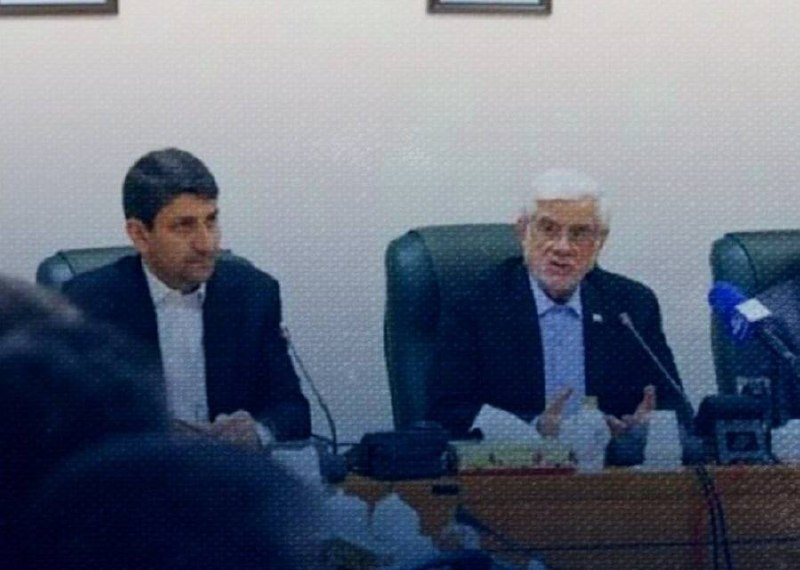

♦️ معاون اول پزشکیان:

🔹 ستاد راهبری فضای مجازی، ستاد شورای‌عالی امنیت ملی است

🔹 عارف گفت: رئیس‌جمهور به عنوان رئیس‌ دولت، رئیس شورای عالی امنیت ملی، رئیس شورای عالی فضای مجازی و رئیس شورای عالی انقلاب فرهنگی از اختیارات قانونی خود برای تشکیل این ستاد استفاده کرده است. 

♦️معاون اول رئیس‌جمهور ادامه داد: برای اولین بار است که رئیس‌جمهور در حکمی از عنوان رئیس‌جمهور و رئیس شورای عالی امنیت ملی استفاده کرده است، بنابراین این ستاد هم ستاد دولت و هم ستاد شورای عالی امنیت ملی است.

🫆:Tony

📌 @persian_trend_official
پرشین ترند | متفاوت‌ترین کانال نظامی

## Persian_Trend_Official — post 14945

  <a href="telegram/content/Persian_Trend_Official_14945_1779733530.webm" target="_blank">🎬 Download video</a>

⭕️عاصم منیر، فرمانده ارتش پاکستان، در دیدار با شی جین‌پینگ در پکن.

«توافق میان ایران و آمریکا به مراحل نهایی خود رسیده و دستیابی به آن بسیار نزدیک است»

🫆:Tony

📌 @persian_trend_official
پرشین ترند | متفاوت‌ترین کانال نظامی

## Persian_Trend_Official — post 14944

  <a href="telegram/content/Persian_Trend_Official_14944_1779733530.webm" target="_blank">🎬 Download video</a>

🔴 پهپاد دشمن با « کمان آرش » بر فراز خلیج فارس شکار شد

♦️در ساعات گذشته، فضای خلیج فارس شاهد رونمایی از سامانه کمان آرش با بود

♦️یک پهپاد متخاصم بر فراز آب‌های خلیج فارس با موفقیت توسط این سامانه سرنگون کردند.

▪️اطلاعاتی راجب این سامانه پدافندی در دسترس نیست.

🫆:Tony

📌 @persian_trend_official
پرشین ترند | متفاوت‌ترین کانال نظامی

## Persian_Trend_Official — post 14943

  <a href="telegram/content/Persian_Trend_Official_14943_1779733530.webm" target="_blank">🎬 Download video</a>

⭕️ناوگروه نیروی
دریایی فرانسه به محوریت ناو هواپیمابر شارل دوگل پس از توقفی در جیبوتی، در دریای عرب مستقر شده است.

♦️این ناو هواپیمابر روز گذشته در حال مانور به همراه یک ناوشکن اسکورت مشاهده شد؛ که احتمالاً یا ناوشکن فرانسوی «شوالیه پل» بوده یا همتای بریتانیایی آن یعنی «اچ‌ام‌اس دراگون».

♦️این ناوگروه اکنون کمتر از یک روز دریانوردی با خط محاصره نیروی دریایی آمریکا فاصله دارد. با این حال، به دلایل سیاسی، برگزاری رزمایش مشترک با ناوهای آمریکایی حاضر در منطقه همچنان بعید به نظر می‌رسد.

ناو شارل دوگل

16°50’9.60”N 55°55’26.40”E

🫆:Tony

📌 @persian_trend_official
پرشین ترند | متفاوت‌ترین کانال نظامی

## RadioFarda — post 157550

  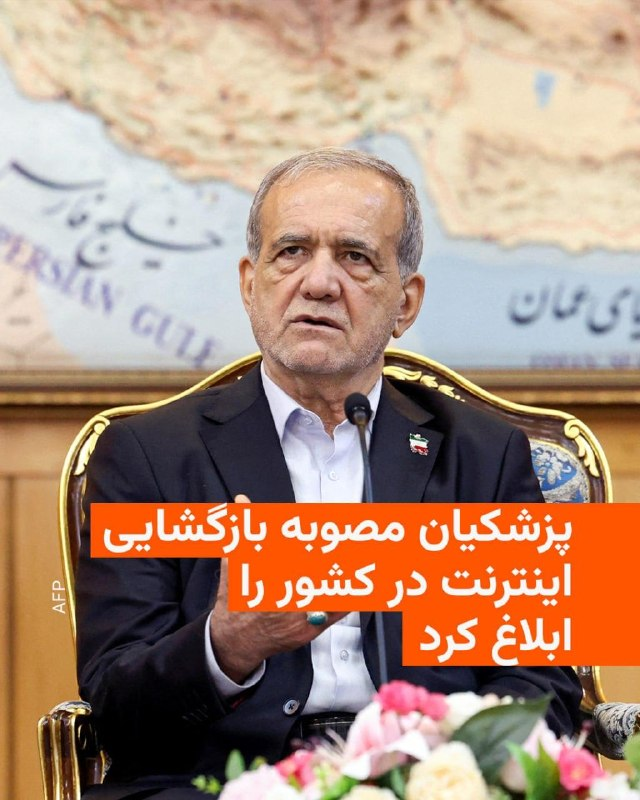

🔸ساعاتی پس از انتشار خبر تصویب تصمیم بازگشت اینترنت به خانه‌های مردم، چند رسانه در داخل کشور می‌گویند که مسعود پزشکیان، رئیس جمهور، این مصوبه را به طور رسمی ابلاغ کرده است.

🔸رسانه‌ها در ایران روز دوشنبه از تصویب مصوبه‌ای «جدید و مهم» دربارهٔ اتصال دوباره اینترنت کشور به اینترنت بین‌الملل در «ستاد ویژه ساماندهی فضای مجازی» خبر داده‌ بودند، مصوبه‌ای که برای اجرا نیازمند تأیید نهایی مسعود پزشکیان، رئیس‌جمهور ایران، بود.

🔸به نوشته خبرگزاری فارس، در چهارمین جلسه این ستاد به ریاست محمدرضا عارف، معاون اول رئیس‌جمهور، «مصوبات مهمی» دربارهٔ اتصال به اینترنت بین‌الملل به تصویب رسیده است.

🔸فارس به نقل از یک منبع نوشته بود که «برقراری اتصال اینترنت بین‌الملل» با ۹ رأی موافق و سه رأی مخالف تصویب شده و برای تأیید به دفتر رئیس‌جمهور ارسال شده است.

🔸به گزارش سیتنا، پایگاه خبری فناوری اطلاعات، بر اساس این مصوبه، اینترنت عمومی باید «به وضعیت قبل از دی‌ماه ۱۴۰۴» بازگردد.

@RadioFarda

## RadioFarda — post 157549

🔸احمد دنیامالی، وزیر ورزش جمهوری اسلامی، روز دوشنبه گفت: «فیفا همه تمهیدات را از قبل با آمریکایی‌ها هماهنگ کرده و به ما قول داده که همه بازیکنان ویزا دریافت می‌کنند و هیچ دلیلی وجود ندارد که بازیکن ما ویزا نگیرد.» 🔸به گزارش باشگاه خبرنگاران جوان، او ادامه…

## RadioFarda — post 157548

  

🔸احمد دنیامالی، وزیر ورزش جمهوری اسلامی، روز دوشنبه گفت: «فیفا همه تمهیدات را از قبل با آمریکایی‌ها هماهنگ کرده و به ما قول داده که همه بازیکنان ویزا دریافت می‌کنند و هیچ دلیلی وجود ندارد که بازیکن ما ویزا نگیرد.»

🔸به گزارش باشگاه خبرنگاران جوان، او ادامه داد: «در جلسه‌ای که رئیس فدراسیون فوتبال با مسئولان فیفا داشت، اعلام کردیم که اگر حتی به یک بازیکن ما ویزا داده نشود، قابل قبول نیست.»

🔸همزمان کلودیا شِین‌بام، رئیس جمهور مکزیک، روز دوشنبه فاش کرد که دولت آمریکا نمی‌خواسته میزبان اردوی تیم ملی ایران باشد، و به همین دلیل مقر تیم ملی پس از موافقت خانم شین‌بام به مکزیک منتقل شده است.

🔸مهدی تاج، رئیس فدراسیون فوتبال ایران، اعلام کرده بود که تیم ملی فوتبال در جریان جام جهانی ۲۰۲۶ در شهر مرزی تیخوانا در مکزیک، همسایه ایالت کالیفرنیا، مستقر خواهد شد.

🔸او روز شنبه دوم خرداد ادعا کرده بود که فدراسیون جهانی فوتبال، فیفا، با «درخواست ایران» برای انتقال محل اردو از ایالت آریزونا آمریکا موافقت کرده است.

@RadioFarda

## RadioFarda — post 157547

  <a href="https://t.me/radiofarda/157547" target="_blank">📎 Download file</a>

📻بشنوید: ایستگاه ۱۹ با رادیوفردا، چهارم خرداد ۱۴۰۵

@RadioFarda

## RadioFarda — post 157546

قاضی صلواتی به چهار متهم «اکباتان» حکم اعدام داد؛ یک معترض دیگر اعدام شد

🔸در ادامه تشدید صدور و اجرای حکم اعدام در ایران، یک روز پس از صدور حکم اعدام برای چهار تن از معترضان «پرونده شهرک اکباتان»، یک معترض دیگر از اعتراضات دی‌ماه سال گذشته اعدام شد.
خبرگزاری میزان، وابسته به قوه قضاییه، صبح روز دوشنبه، چهارم خردادماه، از اعدام عباس اکبری، از بازداشت‌شدگان اعتراضات دی‌ماه ۱۴۰۴ در اصفهان، خبر داد.

🔸در گزارش میزان این معترض جوان بدون اشاره به سن و حرفه‌اش با نام «عباس اکبری فیض‌آبادی» به عنوان «یکی از لیدرهای مسلح» در اعتراضات شهرستان نائین معرفی شده است.

🔸بر اساس گزارش این خبرگزاری حکومتی، اکبری «نقش مهمی در حمله به فرمانداری شهرستان و مراکز تأمین امنیت و همچنین مراکز خدماتی» داشته است.

🔸میزان اتهامات عباس اکبری را «محاربه، تخریب عمدی اموال عمومی به قصد مقابله با نظام و اخلال در نظم و امنیت جامعه، اجتماع و تبانی برای ارتکاب جرم علیه امنیت داخلی» نوشته و مدعی شده که او با کلت کمری جنگی اقدام به تیراندازی در خیابان کرده است.

🔸 گزارش کامل را در وب‌سایت رادیوفردا بخوانید.

@RadioFarda

## RadioFarda — post 157545

طالبان با تشدید سرکوب رسانه‌ای، سه ایستگاه‌ رادیویی دیگر را تعطیل کرد

🔸طالبان افغانستان در تازه‌ترین اقدامات سرکوبگرانهٔ خود که از زمان به قدرت رسیدن دوباره این گروه در سال ۲۰۲۱، صحنه رسانه‌ای کشور را تا حد زیادی تضعیف کرده است، سه ایستگاه رادیویی محلی را تعطیل کرد.

🔸ریاست اطلاعات و فرهنگ طالبان در قندهار روز سوم خرداد در اعلامیه‌ای گفت که رادیوهای «تحسین القرآن»، «سنگا» و «زما زیور» به دلیل عدم پرداخت مالیات، عدم دریافت پروانه و پخش با کیفیت پایین تعطیل شده‌اند.

🔸در این اعلامیه همچنین به دو رادیوی دیگر به نام‌های «ملت غژ» و «ورانگی» هشدار داده شده است که اسناد خود را تکمیل کرده و فعالیت‌هایشان را قانونی سازند.

🔸حامد عبیدی، رئیس سازمان حمایت از رسانه‌ها، در واکنش به این اقدام به بخش افغانستان رادیو اروپای آزاد/ رادیو آزادی گفت که حکومت طالبان به آزادی بیان متعهد نیست و تلاش می‌کند برای کنترل افکار عمومی از هر ابزار ممکن استفاده کند.

🔸عبیدی گفت که دلایل ارائه‌شده برای تعطیلی ایستگاه‌ها تنها بهانه‌ای برای سرکوب افکار عمومی است.

🔸هفته گذشته، وقتی ایستگاه محلی دیگری، رادیو بامیان، به‌دلیل عدم تمدید مجوزش تعطیل شد، منبعی در این رادیو به رادیو آزادی گفت که طالبان در واقع از این کار جلوگیری کرده‌اند.

🔸افغانستان در جدیدترین شاخص جهان آزادی مطبوعات گزارشگران بدون مرز که ماه گذشته منتشر شد، در رتبه ۱۷۵ قرار دارد. تنها عربستان سعودی، ایران، چین، کرهٔ شمالی و اریتره امتیاز پایین‌تری داشتند.

🔸گزارشگران بدون مرز می‌گوید ۴۳ درصد از رسانه‌ها در افغانستان از سال ۲۰۲۱ تعطیل شده‌اند که نمونه‌هایی از خاموش شدن رسانه‌های مستقل با هدف قرار دادن زنان خبرنگار است.

🔸 گزارش کامل را در وب‌سایت رادیوفردا بخوانید.

@RadioFarda

## RadioFarda — post 157544

خاویار دریای خزر به دوران اوج خود بازمی‌گردد؟

🔸خاویار دریای خزر که زمانی یکی از منابع ثروت بزرگ منطقه بود، به‌خاطر دهه‌ها صید بی‌رویه، آلودگی، احداث سدها و کاهش جریان رودها و همچنین تخریب زیستگاه‌ها تقریبا در آستانه نابودی قرار گرفته است.

🔸اکنون کشورهای حاشیه این دریا مثل قزاقستان و ایران تلاش می‌کنند پرورش خاوریار را دوباره زنده کنند و به آن رونقی دوباره بدهند.

🔸محصول خاویار دریای خزر که از قرن هفدهم میلادی مورد بهره‌برداری قرار گرفته، در ابتدا، جشن‌های تزارهای روس را زینت می‌داد و در قرن بیستم از سوی جمهوری‌های اتحاد شوروی به یک تولید استراتژیک برای صادرات و ایجاد ارز خارجی تبدیل شد.

🔸در گذشته، تقریباً تمام خاویار سیاه جهان از کشورهای حاشیه دریای خزر، شامل قزاقستان، روسیه، ایران، ترکمنستان و جمهوری آذربایجان تأمین می‌شد، اما اکنون کشورهایی چون چین، بلاروس، ژاپن، آلمان و دانمارک و نروژ جایگزین کشورهای دریای خزر شده‌اند.

🔸ماهیان خاویاری می‌توانند تا ۱۰۰ سال در آب شور دریا زندگی کنند و برای تولیدمثل به آب شیرین رودخانه‌ها باز‌گردند. اکنون دست‌کم سه دهه است که همه گونه‌های ماهیان خاویاری از سوی اتحادیه بین‌المللی حفاظت از طبیعت در وضعیت «در معرض انقراض بحرانی» طبقه‌بندی شده‌اند.

🔸در این شرایط، دولت‌ها و همچنین شرکت‌ها در حاشیه دریای خزر می‌خواهند که این محصول ارزشمند را با کمک پرورش مصنوعی نجات، و تولید آن را دوباره افزایش دهند.

🔸 گزارش کامل را در وب‌سایت رادیوفردا بخوانید.

@RadioFarda

## RadioFarda — post 157543

🔸دونالد ترامپ، رئیس جمهور آمریکا، روز دوشنبه در تازه‌ترین پیام خود در شبکه اجتماعی‌اش ضمن خبر دادن از پیشرفت «خوب» در مذاکره با ایران، از تمام کشورهای دخیل در این مذاکرات خواست پس از حصول توافق با ایران، بلافاصله به پیمان‌های ابراهیم بپیوندند. 🔸پیمان یا پیمان‌های…

## RadioFarda — post 157542

  

🔸دونالد ترامپ، رئیس جمهور آمریکا، روز دوشنبه در تازه‌ترین پیام خود در شبکه اجتماعی‌اش ضمن خبر دادن از پیشرفت «خوب» در مذاکره با ایران، از تمام کشورهای دخیل در این مذاکرات خواست پس از حصول توافق با ایران، بلافاصله به پیمان‌های ابراهیم بپیوندند.

🔸پیمان یا پیمان‌های ابراهیم طرحی بود که دونالد ترامپ در دوره اول خود برای تلاش در راه عادی‌سازی روابط میان اعراب و اسرائیل آغاز کرد و موفق شد تا چندین کشور از جمله بحرین و امارات متحده عربی را هم به این کار ترغیب کند.

🔸حال رئیس جمهور آمریکا روند توافق با جمهوری اسلامی را به این طرح پیوند زده و به گفته خود این «خواسته اجباری» را با دیگر کشورهای عرب خلیج فارس و همین طور ترکیه مطرح کرده که به‌فوریت و همزمان به پیمان ابراهیم بپیوندند.

@RadioFarda

## RadioFarda — post 157541

🔸در حالی که رئیس جمهور آمریکا در پیامی تازه در شبکه اجتماعی خود نوشته است که مذاکره با ایران «خوب پیش می‌رود»، رسانه‌ها در ایران از سفر هیئت عالی‌رتبه مذاکره‌کنندگان جمهوری اسلامی به قطر خبر می‌دهند. 🔸خبرگزاری صداوسیما روز دوشنبه نوشت: «رئیس مجلس شورای اسلامی…

## RadioFarda — post 157540

  

🔸در حالی که رئیس جمهور آمریکا در پیامی تازه در شبکه اجتماعی خود نوشته است که مذاکره با ایران «خوب پیش می‌رود»، رسانه‌ها در ایران از سفر هیئت عالی‌رتبه مذاکره‌کنندگان جمهوری اسلامی به قطر خبر می‌دهند.

🔸خبرگزاری صداوسیما روز دوشنبه نوشت: «رئیس مجلس شورای اسلامی امروز در صدر هیئتی رسمی برای رایزنی درباره روابط دوجانبه و تحولات منطقه‌ای و بین‌المللی به دوحه سفر کرد.»

🔸پیشتر مقامات دولت مسعود پزشکیان از محمدباقر قالیباف به عنوان رئیس هیئت مذاکره‌کننده نام برده‌اند، از همین رو سفر او در مقطعی که حرف از نزدیکی به توافق میان ایران و آمریکا به میان آمده است مهم جلوه می‌کند.
عباس عراقچی، وزیر امور خارجه، هم در این سفر قالیباف را همراهی می‌کند.

🔸قطر که پیشتر هم در مذاکرات این‌چنینی نقش میانجی را بازی کرده بود، از هفته گذشته به پاکستان پیوسته است که در هفته‌های گذشته نقش میانجی اصلی میان تهران و واشینگتن را داشته است.

@RadioFarda

## IranianMinds — post 20749

🔴 حمید رسایی نماینده حرومی مجلس : اینکه بخوان اینترنت بین الملل رو وصل کنن کاملا غیرقانونیه و‌ پزشکیان اصلا نمیتونه همچین کاریو انجام بده و تواناییش رو نداره ، و اینکار فقط برای حواس پرتیه @IranianMinds

## IranianMinds — post 20748

  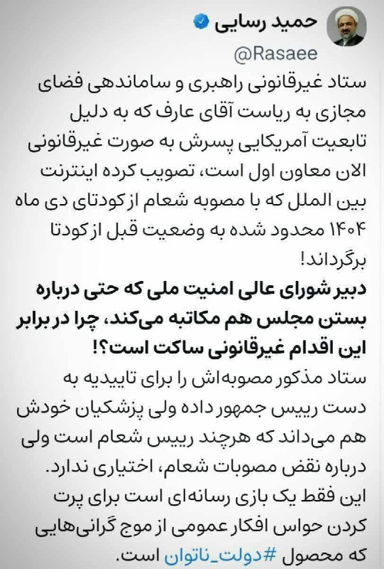

🔴 حمید رسایی نماینده حرومی مجلس :

اینکه بخوان اینترنت بین الملل رو وصل کنن کاملا غیرقانونیه و‌ پزشکیان اصلا نمیتونه همچین کاریو انجام بده و تواناییش رو نداره ، و اینکار فقط برای حواس پرتیه

@IranianMinds

## IranianMinds — post 20747

  <a href="telegram/content/IranianMinds_20747_1779733534.mp4" target="_blank">🎬 Download video</a>

🔴 ترامپ:

در دو جنگ اخیر، مجموعاً ۱۳ نیروی نظامی از دست دادیم.

در ونزوئلا که یک پیروزی کامل و قاطع بود و الان هم خیلی نزدیک با دولت ونزوئلا همکاری می‌کنیم ظرف یک روز کنترلش را گرفتیم و هیچ تلفاتی نداشتیم.

در عملیات خشم حماسی ، ۱۳ روح فوق‌العاده را از دست دادیم.

@IranianMinds

## IranianMinds — post 20746

  

🔴منابع العربیه: نسخه نهایی پیش‌نویس یادداشت تفاهم آمریکا و ایران شامل تجدید قابل تمدید آتش‌بس ۶۰ روزه، باز کردن تنگه هرمز بدون اخذ عوارض و پاکسازی مین‌ها و برداشتن موانع دریایی از این آبراه بین‌المللی مقابل تجارب جهانی، برداشتن برخی محدودیت‌ها از بنادر ایران…

## IranianMinds — post 20745

🎁 استارت کن و کانفیگتو رایگان بگیر 
⭐ویژه کاربران پرمیوم تلگرام 
⭐️ اگه اکانت تلگرامت پرمیوم باشه به محض استارت ربات بدون هیچ امتیاز و زیر مجموعه دایی جون بهت کانفیگ هدیه میده 
✔️ همچنین با اوردن دوستای پرمیومت امتیاز بیشتری میگیری 
🎁 @Daeijoonbot | استارت…

## IranianMinds — post 20743

  

🎁 استارت کن و کانفیگتو رایگان بگیر

⭐ویژه کاربران پرمیوم تلگرام

⭐️ اگه اکانت تلگرامت پرمیوم باشه به محض استارت ربات بدون هیچ امتیاز و زیر مجموعه دایی جون بهت کانفیگ هدیه میده

✔️ همچنین با اوردن دوستای پرمیومت امتیاز بیشتری میگیری

🎁 @Daeijoonbot | استارت کن و کانفیگ رایگان بگیر 
🌟

## IranianMinds — post 20742

🔴منابع العربیه:

نسخه نهایی پیش‌نویس یادداشت تفاهم آمریکا و ایران شامل تجدید قابل تمدید آتش‌بس ۶۰ روزه، باز کردن تنگه هرمز بدون اخذ عوارض و پاکسازی مین‌ها و برداشتن موانع دریایی از این آبراه بین‌المللی مقابل تجارب جهانی، برداشتن برخی محدودیت‌ها از بنادر ایران و دادن معافیت‌هایی از تحریم‌ها و فراهم کردن امکان ازسرگیری فروش و صادرات نفت ایران و همچنین ادامه مذاکرات درباره برنامه هسته‌ای ایران در دوره تنش‌زدایی میان دو طرف می‌شود.

@IranianMinds

## IranianMinds — post 20741

🔴 خبرگزاری فارس :

ستادی که امروز اومده دستور رفع فیلترینگ‌ رو‌ تصویب کرده اصلا یه ستاد تازه تاسیسه و چیزی بهش ربطی نداره که بخواد همچین دستوری بده

اصلا اینا نباید بیان راجب وصل شدن اینترنت نظر بدن و‌ بهشون ربطی نداره !

@IranianMinds

## IranianMinds — post 20740

  

🔴الحدث:
وال‌استریت‌ژورنال به نقل از واسطه‌ها، واشنگتن و تهران به مواضع خود در مورد مسائل هسته‌ای و دارایی‌های مسدود شده ، پایبند هستند.

@IranianMinds

## IranianMinds — post 20739

  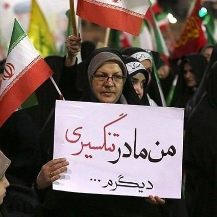

پدر تنگسیری منظورشه.

@IranianMinds

## IranianMinds — post 20738

  

🔴 گاییدی این بدبختارو ولشون کن

نوشته : دوتا از بدترین رئیس جمهور های تاریخ آمریکا.

@IranianMinds

## IranianMinds — post 20736

🔴 پست های جدید ترامپ :

@IranianMinds

## IranianMinds — post 20734

🔴 الحدث : ایران قبول کرد که اورانیوم خودشو از کشور خارج کنه و آماده ی اینکاره. @IranianMinds

## IranianMinds — post 20733

🔴 الحدث :

ایران قبول کرد که اورانیوم خودشو از کشور خارج کنه و آماده ی اینکاره.

@IranianMinds

## IranianMinds — post 20732

  <a href="telegram/content/IranianMinds_20732_1779733538.mp4" target="_blank">🎬 Download video</a>

🔴 تحلیلگر صداوسیما :

هر موقع که پولا اومد تو‌ حسابمون میریم پای میز مذاکره

+ رهبر موشلمین جهان رو به‌ پول فروختید ؟

@IranianMinds

## IranianMinds — post 20731

  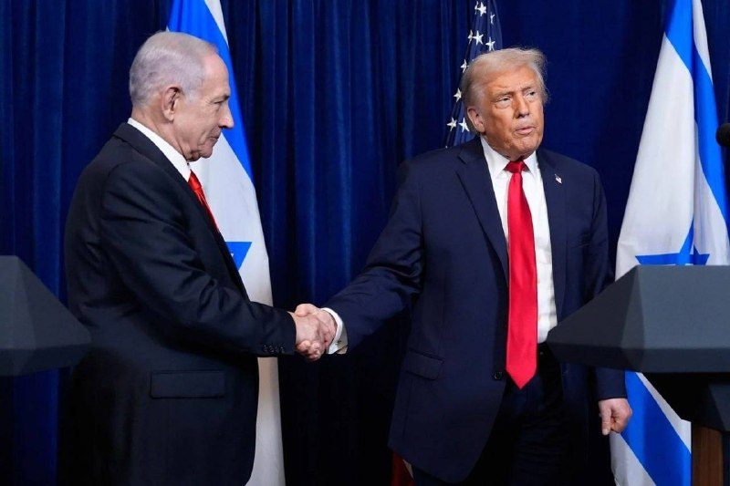

🔴 رویترز به نقل از منابع اسرائیلی:

نتانیاهو گفته فعلا نمی‌تواند روی تصمیمات ترامپ درباره ایران تاثیر بگذارد

اسرائیل تا حد زیادی از مذاکرات آمریکا و ایران کنار گذاشته شده
نتانیاهو نگران توافق احتمالی واشنگتن و تهران است

نتانیاهو می‌خواهد آزادی عمل نظامی برای حمله به ایران داشته باشد!

@IranianMinds

## IranianMinds — post 20730

🔴 سخنگوی اقلیم کردستان :

ترامپ هیچ سلاحی اصلا برای استفاده و رسوندن به گروهای مخالف جمهوری اسلامی به ما ارسال نکرده و اگه کرده باشه هم به دست ما نرسیده

آمریکا بیاد اعلام کنه که سلاح هارو برای کی فرستاده چون ما چیزی دریافت نکردیم.

@IranianMinds

## IranianMinds — post 20729

🔴 یک منبع ایرانی به المیادین:

هیئت ایرانی در دوحه پس از پایان دیدار‌های خود، امشب به تهران بازمی‌گردند.

@IranianMinds

## IranianMinds — post 20728

  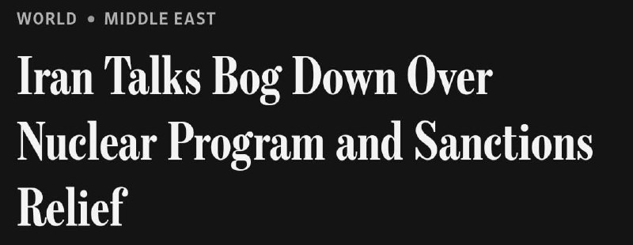

🔴 وال استریت ژورنال :

در مذاکرات ایران و آمریکا دو طرف سر مسئله هسته ای و لغو‌ تحریم ها به بن بست خوردن.

@IranianMinds

## BBCPersian — post 282035

  <a href="telegram/content/BBCPersian_282035_1779733539.mp4" target="_blank">🎬 Download video</a>

🔻مقام‌ها می‌گویند در پی انفجار گاز در یک معدن زغال‌سنگ در شمال چین در روز یکشنبه، دست‌کم ۸۲ نفر کشته شده‌اند و دست‌کم دو نفر نیز همچنان مفقود هستند.
 
این حادثه مرگبارترین فاجعه معدنی در چین از سال ۲۰۰۹ تاکنون محسوب می‌شود و رئیس‌جمهور چین، شی جین‌پینگ، اعلام کرد که از هیچ تلاشی برای عملیات جست‌وجو و نجات نباید دریغ شود.
 
علت انفجار گاز هنوز مشخص نشده اما رسانه‌های دولتی گزارش داده‌اند که میزان مونوکسید کربن در معدن «بالاتر از حد مجاز» بوده است.
 
پس از وقوع مرگبارترین حادثه معدنی چین در بیش از ۱۵ سال گذشته، خشم عمومی نسبت به ادعاهای مربوط به «نقض مقررات ایمنی» رو به افزایش است.
   
برای بسیاری از مردم چین، این فاجعه یادآور دهه ۲۰۰۰ میلادی است یعنی زمانی که از این‌ قبیل حوادث در معادن زغال‌سنگ رخ می‌داد و مردم تصور می‌کردند که آن دوران به پایان رسیده است.
 
مقام‌ها می‌گویند علت این حادثه همچنان در دست بررسی است اما یافته‌های اولیه نشان می‌دهد که شرکت «تونگژو گروپ» که این معدن خصوصی را اداره می‌کرده، مرتکب «تخلفات جدی و غیرقانونی» شده است.
 
https://bbc.in/4f1HnZL
@BBCPersian

## BBCPersian — post 282034

  <a href="https://t.me/bbcpersian/282034" target="_blank">📎 Download file</a>

📻پادکست جام جهان‌نما، دوشنبه ۴ خرداد ۱۴۰۵

این برنامه رادیویی رامی‌توانید هرشب ساعت ۲۰ به وقت ایران، روی موج متوسط ۷۰۲ کیلوهرتز و موج کوتاه۹۴۶۵ کیلوهرتز بشنوید. تکرار برنامه را هم می‌توانید ساعت ۲۱:۳۰ روی موج متوسط ۷۰۲ کیلوهرتز و موج کوتاه۵۳۹۵ کیلوهرتز گوش کنید

@BBCPersian

## BBCPersian — post 282033

  

🔻کلودیا شینباوم، رئیس‌جمهور مکزیک، امروز گفت که موافقت کرده است تیم ملی فوتبال ایران در جام جهانی ۲۰۲۶ در مکزیک مستقر شود.

خانم شینباوم در کنفرانس خبری گفت: «آمریکا نمی‌خواست تیم ایران در خاکشان باشد.»

«آنها (ایران) به همین دلیل از ما پرسیدند: 'می‌توانیم در مکزیک مستقر شویم؟' و ما پاسخ دادیم، بله، هیچ اشکالی ندارد.»

فدراسیون فوتبال ایران دیروز گفته بود که با موافقت فیفا، کمپ و محل استقرار تیم ملی فوتبال در جام جهانی به شهر مرزی تیخوانا در مکزیک منتقل شده است.

ایران از فیفا خواسته بود محل مسابقاتش را از آمریکا به مکزیک منتقل کند اما فیفا گفته بود که امکان تغییر محل مسابقه وجود ندارد.

مهدی تاج، رئیس فدراسیون فوتبال ایران، دیروز گفت که با انتقال کمپ تیم ملی از آریزونا در آمریکا به تیخوانا در مکزیک، «مشکل ویزا نداریم و تیم ملی با پرواز ایران‌ایر می‌تواند عازم مکزیک شود.»

تیخوانا، شهر مرزی پرجنب‌وجوش، با سن دیگو در کالیفرنیا مرز مشترک دارد. تمرینات تیم فوتبال ایران قرار است در مجموعه ورزشی «کلوب تیخوانا» برگزار شود.
ادامه مطلب⬇️

📸GettyImages
https://bbc.in/4wFbfkW

## BBCPersian — post 282031

🔻در پی اعتراضات دانشجویی در ترکیه، رجب طیب اردوغان، رئیس جمهور ترکیه، دستورش برای تعطیلی یکی از قدیمی‌ترین دانشگاه‌های آن کشور را پس گرفت.

رئیس‌جمهور ترکیه سه روز پیش دستور داده بود که دانشگاه «استانبول بیلگی» که به داشتن گرایش‌های سیاسی لیبرال شناخته می‌شود، تعطیل شود.

دولت در هشت ماه گذشته مدیریت این دانشگاه را بر عهده داشته است.

شرکت «جان هولدینگ»، مالک دانشگاه، به اتهام «پول‌شویی و فرار مالیاتی» تحت تحقیق قرار داشت.

این شرکت همچنین مالک شبکه‌های عمده تلویزیونی و چندین مدرسه در ترکیه است.

📸AFP via Getty Images
@BBCPersian

## BBCPersian — post 282030

  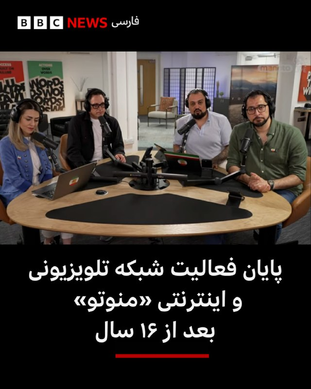

🔻شبکه تلویزیونی و اینترنتی «منوتو» بعد از ۱۶ سال به کار خود پایان داد.

این رسانه فارسی‌زبان از سال ۲۰۱۰ در لندن با مدیریت کیوان و مرجان عباسی به روی آنتن ماهواره رفت و به یکی از پربیننده‌ترین تلویزیون‌های فارسی‌زبان تبدیل شد.

اما حدود دو سال و نیم پیش، به دلیل «مشکلات مالی» پخش تلویزیونیش را متوقف کرد و مدتی بعد، فعالیتش را محدودتر از سر گرفت.

مدیران این شبکه، علاوه بر محدودیت‌های مالی، این بار به «دگرگونی‌های بنیادین در عرصه رسانه‌ای و سیاسی» ایران اشاره کرده و گفته‌اند که فضا خصمانه‌تر و قطبی‌تر شده و مجموعه این شرایط، ادامه فعالیت را برای منوتو غیرممکن کرده است.

https://bbc.in/43uDwNI
@BBCPersian

## BBCPersian — post 282029

  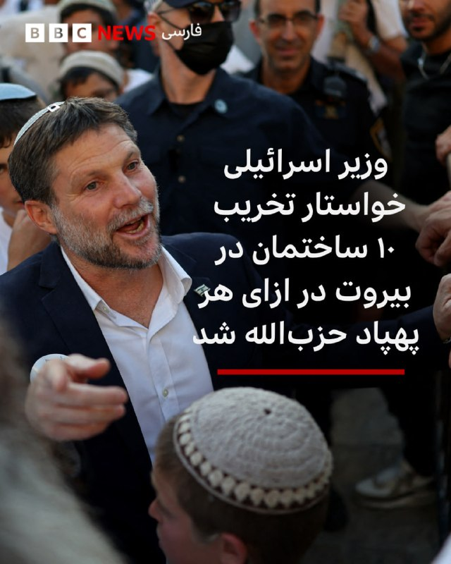

🔻بتسالل اسموتریچ، وزیر دارایی اسرائیل، خواستار تخریب ساختمان‌ها در بیروت برای مقابله با «تهدید پهپادهای انفجاری حزب‌الله» شد.

این وزیر راست افراطی اسرائیل در پستی در شبکه اجتماعی ایکس به کشته شدن یک سرباز اسرائیلی در حمله پهپادی امروز حزب‌الله در جنوب لبنان اشاره کرد و نوشت: «برای هر پهپاد انفجاری، ۱۰ ساختمان باید در بیروت فرو بریزد.»

او تاکید کرد که «پاسخ به یک تهدید قابل توجه باید قابل توجه باشد.»

آقای اسموتریچ نوشت: «شما با یک تهدید استراتژیک تنها با سپر دفاعی مقابله نمی‌کنید، بلکه باید با تغییر قوانین و معادله با آن مقابله کنید.»

📸AFP via Getty Images
https://bbc.in/43uAYz6
@BBCPersian

## BBCPersian — post 282028

🔻خبرگزاری فارس: پهپاد متخاصم در حریم خلیج فارس سرنگون شد

خبرگزاری فارس می‌گوید که پهپادهای رهگیر موسوم به آرش کمانگیر یک «پهپاد متخاصم» را بر فراز آب‌های خلیج فارس سرنگون کرده‌اند.

این خبرگزاری که به نهادهای امنیتی و نظامی نزدیک است نوشت: «این عملیات که با به‌کارگیری سامانه‌ای با قابلیت‌های پنهان انجام شد، پیامی روشن و قاطع از سوی ایران به شمار می‌رود. مقامات مربوطه تصریح کرده‌اند که این نشانه از طرف ماست تا دیگر هیچ پهپاد رادارگریزی نتواند بر آسمان خلیج فارس نفوذ کند.»

در این گزارش به نوع یا مبدا یا کشور سازنده پهپاد اشاره نشده است.

ایالات متحده می‌گوید که که محاصره دریایی ایران ادامه دارد اما نیروی دریایی سپاه امروز گفت که ۳۲ کشتی نفتکش، کانتینری یا تجاری پس از «اخذ مجوز با هماهنگی» این نیروها از تنگه هرمز عبور کرده‌اند.

سپاه دیروز هم گفت ۳۳ کشتی عبور کرده‌اند.

https://bbc.in/4v8Jxf0
@BBCPersian

## BBCPersian — post 282027

🔻نخست‌وزیر پاکستان با رئیس جمهور چین دیدار کرد

خبرگزاری دولتی شینهوا چین گزارش کرده که شهباز شریف، نخست‌وزیر پاکستان، در سفر خود به چین با شی جین پینگ، رئیس جمهور چین، دیدار کرده است.

سفر نخست‌وزیر پاکستان و فرمانده ارتش این کشور به چین در ادامه تلاش‌های دیپلماتیک چندین کشور برای پایان رسمی جنگ آمریکا و اسرائیل با ایران است.

پیش از این گزارش داده بود که فیلد مارشال عاصم منیر، مذاکره کننده ارشد پاکستان هم به پکن سفر کرده است.

آقای شریف پیش از این با لی چیانگ، نخست وزیر چین، دیدار کرده بود.

https://bbc.in/49hnc6r
@BBCPersian

## BBCPersian — post 282025

🔻ویشکا آسایش، بازیگر سینما، مجموعه مجسمه‌های برنزی ساخته و برای نخستین بار در نیویورک آنها را به نمایش گذاشته است.

نمایشگاه مجسمه‌های ویشکا آسایش از روز چهارشنبه (۲۰ مه / ۳۱ اردیبهشت) در گالری بیرند گکلر نیویورک افتتاح شده است.

بهمن کلباسی، خبرنگار بی‌بی‌سی در نیویورک با او در مورد مجسمه‌هایش گفتگو کرده است.

@BBCPersian

## BBCPersian — post 282024

  <a href="telegram/content/BBCPersian_282024_1779733542.mp4" target="_blank">🎬 Download video</a>

🔻‌رسانه‌های آمریکایی وقوع آتش‌سوزی مهیبی را در یک منطقه صنعتی در ساوت گیت در لس‌انجلس کانتی کالیفرنیا گزارش کردند. این آتش‌سوزی در یک مرکز صنعتی بازیافت لاستیک خودرو رخ داد.

در پی این آتش‌سوزی در روز یکشنبه (۲۴ مه)، مقام‌های محلی از مردم خواستند که به همراه حیوانات خانگی‌شان با در و پنجره‌های بسته داخل خانه‌ها بمانند.

علت آتش‌سوزی و اینکه آیا در زمان شروع آتش‌سوزی افرادی در محل حضور داشته‌اند یا خیر، تاکنون مشخص نشده است.

آتش‌نشانان آتش را مهار کردند و تاکنون هیچ مصدومی در این حادثه گزارش نشده است.

https://bbc.in/43etyAd
@BBCPersian

## BBCPersian — post 282023

‌ 🔻دونالد ترامپ، رئیس‌جمهور آمریکا، یک بار دیگر از پیشرفت در مذاکرات با ایران ابراز رضایت کرد. آقای ترامپ در پستی در شبکه اجتماعی خود، تروث سوشال، نوشت: «مذاکرات با ایران خوب پیش می‌رود! یا توافق عالی برای همه خواهد بود یا هیچ توافقی نخواهد بود.» او در عین…

## BBCPersian — post 282022

  

‌
🔻دونالد ترامپ، رئیس‌جمهور آمریکا، یک بار دیگر از پیشرفت در مذاکرات با ایران ابراز رضایت کرد.

آقای ترامپ در پستی در شبکه اجتماعی خود، تروث سوشال، نوشت: «مذاکرات با ایران خوب پیش می‌رود! یا توافق عالی برای همه خواهد بود یا هیچ توافقی نخواهد بود.»

او در عین حال هشدار داد که اگر توافق حاصل نشود، آمریکا به جبهه جنگ باز می‌گردد و «تیراندازی بزرگتر و شدیدتر از گذشته و هر زمان آغاز خواهد شد و کسی چنین چیزی را نمی‌خواهد.»

رئیس‌جمهور آمریکا همچنین مذاکرات با ایران را به پیمان ابراهیم پیوند داد و با اشاره دوباره به گفت‌و‌گوهایی که روز شنبه با رهبران عربستان، امارات، قطر، پاکستان، ترکیه، مصر، اردن و بحرین داشته است، گفت که به آنها گفته است:

«بعد از تلاش‌های آمریکا برای حل این مساله پیچیده (در مورد ایران) حداقل برای این کشورها باید اجباری باشد که همزمان پیمان ابراهیم را امضا کنند.»

📷GETTY
https://bbc.in/4wPXxf5
@BBCPersian

## BBCPersian — post 282020

  <a href="telegram/content/BBCPersian_282020_1779733544.mp4" target="_blank">🎬 Download video</a>

🔻سرخط خبرهای دوشنبه ۴ خرداد ۱۴۰۵
@BBCPersian

## BBCPersian — post 282019

  

🔻چهارمین جلسه ستاد ویژه ساماندهی فضای مجازی به ریاست محمدرضا عارف، معاون اول رئیس‌جمهور، و با حضور اعضای ستاد برگزار شد.

به گزارش پایگاه اطلاع‌رسانی دولت، در این جلسه «مصوبات مهمی درباره وضعیت اینترنت کشور تصویب شد که پس از تایید نهایی رئیس‌جمهور پزشکیان، برای اجرا به وزارت ارتباطات و فناوری اطلاعات ابلاغ می‌شود.»

جزئیات بیشتری از این مصوبات رسما منتشر نشده است اما خبرگزاری فارس نوشت که در این جلسه «طرح اتصال دوباره اینترنت بین‌‌الملل با ۹ رای موافق تصویب و برای تایید نهایی به دفتر مسعود پزشکیان ارسال شد.»

رفع فیلترینگ از وعده‌های انتخاباتی دولت پزشکیان بود که محقق نشد و از شروع جنگ اخیر اینترنت بین‌الملل به روی شهروندان در ایران جز برای کسانی که «اینترنت پرو»، سیم‌کارت «سفید»، یا دسترسی به استارلینک داشته‌اند مقدور بوده است.

قطع اینترنت بین‌المللی در ایران طولانی‌ترین قطع گسترده در تاریخ اینترنت است.

ادامه مطلب⬇️
📸NurPhoto via Getty Images
https://bbc.in/4uAWWMU
@BBCPersian

## BBCPersian — post 282018

  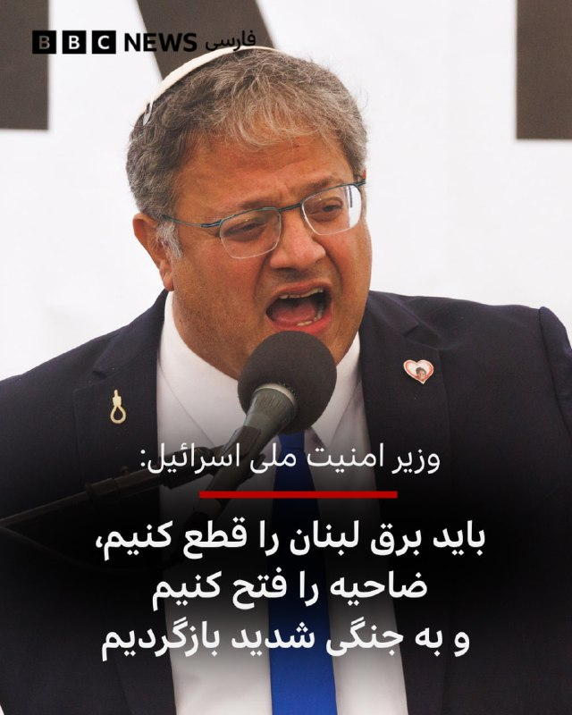

🔻ایتامار بن گویر، وزیر امنیت ملی اسرائیل، خواستار بازگشت اسرائیل به «جنگی شدید» در لبنان شد.

این وزیر راست افراطی اسرائیل در حسابش در شبکه اجتماعی ایکس نوشت: «عادی‌سازی واقعیت پهپادهای انفجاری جایز نیست؛ وقت آن رسیده است که نخست‌وزیر روی میز ترامپ بکوبد و به او اطلاع دهد که ما در حال بازگشت به جنگ در لبنان هستیم.»

او در ادامه درخواست کرد: «ما باید برق لبنان را قطع کنیم، ضاحیه را فتح کنیم و به جنگی شدید بازگردیم.»

تقاضای این وزیر راست افراطی در حالی است که هفته گذشته آتش‌بس در لبنان تمدید شد و دور بعد مذاکرات صلح قرار است تا حدود یک هفته دیگر در واشنگتن برگزار شود.

پهپادهای ارزان‌قیمت مورد استفاده حزب‌الله در طول درگیری‌های اخیر به‌طور فزاینده‌ای از سیستم راداری اسرائیل عبور کرده‌ و خساراتی را برجا گذاشته‌اند.

📸Bloomberg via Getty Images
https://bbc.in/49Q61ZO
@BBCPersian

## idfinfarsi — post 11643

  <a href="telegram/content/idfinfarsi_11643_1779733547.mp4" target="_blank">🎬 Download video</a>

‼️برای رفع تهدید: ارتش اسرائیل روز گذشته (یکشنبه) یک تروریست کلیدی از ستاد تولید سازمان تروریستی حماس را به هلاکت رساند

⭕️نیروهای ارتش اسرائیل تحت فرماندهی جنوب، روز گذشته (یکشنبه) در مرکز نوار غزه حمله کرده و محمد ابو ملوح، یکی از تروریست‌های کلیدی در ستاد تولید سازمان تروریستی حماس را به هلاکت رساندند.

⭕️ابو ملوح یکی از منابع اصلی دانش در سازمان تروریستی حماس بود و در طول دوره آتش‌بس، اقدام به تولید تسلیحاتی کرده بود که تهدیدی برای نیروهای ارتش اسرائیل در منطقه و شهروندان این کشور محسوب می‌شد.

⭕️نیروهای ارتش اسرائیل تحت فرماندهی جنوب مطابق با توافق در منطقه مستقر هستند و به فعالیت خود برای رفع هرگونه تهدید فوری ادامه خواهند داد.

## Dirty_Kids — post 390174

## Dirty_Kids — post 390172

  

‏افتخار به یک رذیلت اخلاقی، اون رذیلت رو فضیلت نمی‌کنه.
انگار یه مگس بیاد بگه من با افتخار گه می‌خورم.

@Dirty_Kids 👻

## Dirty_Kids — post 390171

  <a href="telegram/content/Dirty_Kids_390171_1779733548.mp4" target="_blank">🎬 Download video</a>

بعد دیدن این ویدیو درصد ایمانتون به ترامپ ۱۰درصد افزایش پیدا میکنه

@Dirty_Kids 👻

## Dirty_Kids — post 390170

  <a href="telegram/content/Dirty_Kids_390170_1779733550.mp4" target="_blank">🎬 Download video</a>

ارزش دانلود برای فمنیستا ۱ از ۱۰
برای مردا ۹ از ۱۰

@Dirty_Kids 👻

## Dirty_Kids — post 390169

وضعیت طوری شده که هر کی هر کاری میکنه بیهوده‌ست؛ درس بخونی بیهودست، کار کنی بیهودست، پس‌انداز کنی بیهودست و...

‏من حتی انرژی ناراحت شدن از اخبار رو هم ندارم دیگه.

@Dirty_Kids 👻

## Dirty_Kids — post 390168

‏این روزا خیلی سهراب سپهری ام. کون هیچ کاری رو ندارم

@Dirty_Kids 👻

## Dirty_Kids — post 390167

  <a href="telegram/content/Dirty_Kids_390167_1779733551.mp4" target="_blank">🎬 Download video</a>

با يه شغل ديگه نشون بده كه شغلت اين نيست :

@Dirty_Kids 👻

## Dirty_Kids — post 390166

  <a href="https://t.me/Dirty_Kids/390166" target="_blank">📎 Download file</a>

✅ اپلیکیشن اندروید سایت جهانی دربی بت

💰اولین سایت جهانی با امکان شارژ و برداشت ریالی(کارت به کارت)

🔗 برای ورود فیلترشکن روی کشور مناسب قرار دهید مانند فنلاند و المان و....

😀Telegram Channel
👇
https://t.me/+bcynkEgSW2dlYTc0

## Dirty_Kids — post 390165

  

😤دنبال یه سایت شرط بندی بین المللی بودی که به ایرانیا خدمات بده؟!
⛔

👍دربی بت همون انتخاب  100%

💎ویژگی های سایت جهانی Derby Bet:

⬅️امکان شارژ امن با کارت بانکی

⬅️واریز اول دوبل شارژ می شوید(بونوس۱۰۰٪)

⬅️پر اپشن ترین سایت فعال در ایران

⬅️تسویه حساب کمتر از 5 دقیقه

⬅️برگشت بخشی از باخت به صورت هفتگی

🚨کد هدیه ثبت نام:GG007

⚠️برای دانلود اپلکیشن کلیک کنید
👉

🔔کانال دربی بت :

🪙https://t.me/+bcynkEgSW2dlYTc0

## Dirty_Kids — post 390163

محمدباقر ذوالقدر، دبیر شورای عالی امنیت رژیم تروریستی جمهوری اسلامی، در بیانیه‌ای اعلام کرد: «هیچ عقب‌نشینی‌ای در کار نخواهد بود.»

او مدعی شد آنچه در «میدان نظامی»، «میدان دیپلماسی» و «مقاومت شدید نیروهای حاضر در خیابان‌ها» رخ داده، باعث شده دشمن «زمین‌گیر» شود. ذوالقدر همچنین با تاکید بر ضرورت «وحدت و انسجام» گفت رژیم تروریستی جمهوری اسلامی تلاش دارد آمریکا و اسرائیل را در این حوزه نیز «ناامید» کند و افزود جلوگیری از هر سخن یا اقدامی که به‌گفته او وحدت داخلی را مختل کند، «ایران را به پیروزی نهایی خواهد رساند.»

@Dirty_Kids 👻

## Dirty_Kids — post 390162

  

خبرگزاری الحدث:
منابع ایرانی به ما گفتن؛ ایران ظاهراً آمادست اورانیوم غنی‌شده‌ی سطح بالاشو از کشور خارج کنه!

@Dirty_Kids 👻

## Dirty_Kids — post 390161

قهوه‌ی جدید گرفتم. مامانم خورده می‌گه مثل قهوه‌ی خودمون نیست. قهوه‌ی خودمون آخه؟ مزرعه داریم تو کنیا؟

@Dirty_Kids 👻

## Dirty_Kids — post 390160

  <a href="telegram/content/Dirty_Kids_390160_1779733553.mp4" target="_blank">🎬 Download video</a>

این چه سمّیه دیگه؟😐😂
این چادریا میرن تجمعات شبونه شعارمیدن یه برده شکار میکنن میارن خونه

@Dirty_Kids 👻

## Dirty_Kids — post 390159

  

بادبان با همراهی شما 90 هزار نفری شد!
🎉

🛒به این مناسبت، قیمت سرویس‌ها تا گیگی 150 هزار تومان کاهش پیدا کرد! 
🚀

🎁 کد تخفیف خرید اول دوباره ریست شد و همه میتونن ازش استفاده کنن:
BadBan4k

💸 با این کد، 50 هزار تومان تخفیف روی اولین خریدت بگیر!

🔥و مهم‌تر از همه...
سیستم معرفی بادبان فعال‌تر از همیشه‌ست!
از تمام خریدهای کاربرانی که معرفی میکنی، 10% خریدشون رو پورسانت دائمی دریافت کن و موجودی کیف پولت رو افزایش بده 
💼

وقتی بادبان داری،
هیچ بادی مانع نیست… حتی وقتی اینترنت ملیه
⛵️
G4

🛡@BadBan_VPN | کانال 

🤖@BadBan_VPNBot | ربات 

📞@BadBan_VPNSupport | پشتیبانی

## Dirty_Kids — post 390155

پست‌های رگباری لحظاتی پیش شیر AIبه‌باسن در تروث‌سوشال که نیاز به توضیح نداره و تصاویر گویاست:

@Dirty_Kids 👻

## Dirty_Kids — post 390154

  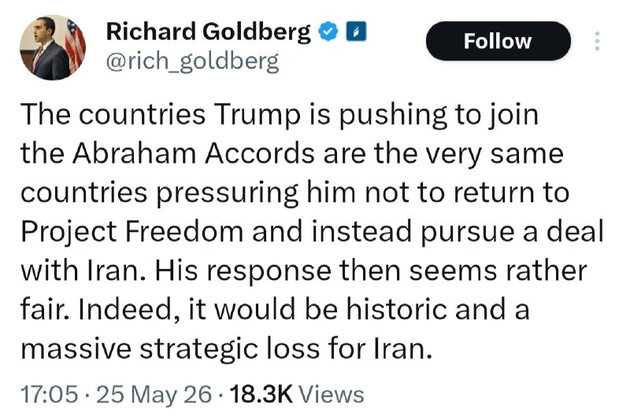

«ریچارد گلدبرگ» مشاور ارشد بنیاد دفاع از دموکراسی‌ها در خصوص اون توییت طولانی ترامپ که به کشورهای قرمساق مسلمون منطقه گفته بود اگه می‌خواید من با جمهوی‌اسلامی تفاهم‌نامه امضا کنم اول باید شما به پیمان ابراهیم و صلح با اسرائیل بپیوندید، نوشته که:

«کشورهایی که ترامپ برای پیوستن به پیمان ابراهیم تحت فشارشون گذاشته دقیقاً همون پدرقحبه‌هایی هستند که حالا رامپ رو تحت فشار گذاشتن تا از پروژه‌ی آزادی دست بکشه و به جاش با رژیم قحبه‌ی روافض معامله کنه.

واکنش ترامپ در این شرایط کاملاً منطقی به نظر می‌رسه.
واقعاً اگر این کار انجام شه، یک دستاورد تاریخی خواهد بود و ضربه‌‌ی استراتژیک بسیار سنگین به رژیم کس‌پدر روافض وارد می‌کنه.»

@Dirty_Kids 👻

## Hranews — post 113160

  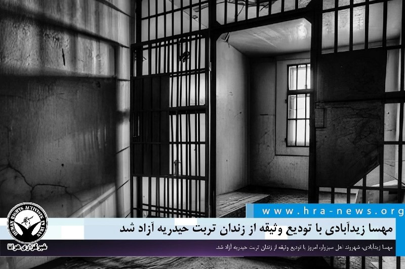

مهسا زیدآبادی با تودیع وثیقه از زندان تربت حیدریه آزاد شد

❗️
❗️
❗️
❗️
❗️– مهسا زیدآبادی، شهروند اهل سبزوار، امروز با تودیع وثیقه از زندان تربت حیدریه آزاد شد.

به گزارش خبرگزاری هرانا، ارگان خبری مجموعه فعالان حقوق بشر در ایران، مهسا زیدآبادی آزاد شد.

بر اساس اطلاعات دریافتی هرانا، آزادی مهسا زیدآبادی امروز دوشنبه ۴ خردادماه، با تودیع وثیقه هفت میلیارد تومانی از زندان تربت حیدریه صورت گرفته است.

ادامه مطلب

#مهسا_زیدآبادی

↘️
@hranews_bot تماس ✉️ - @Hranews کانال هرانا 🆑

## Hranews — post 113159

گزارشی از مطالبات مزدی، بیمه‌ای و بیکاری کارگران در شهرهای مختلف

❗️
❗️
❗️
❗️
❗️– کارگران ابنیه فنی راه‌آهن زاهدان از تعلیق شماری از همکارانشان پس از پیگیری مطالبات صنفی خبر داده و اعلام کردند که به دلیل عدم پرداخت چندین ماه حق بیمه توسط کارفرما از دریافت خدمات بیمه و امکانات درمانی نیز محروم مانده‌اند. همچنین، #کارگران کارخانه فولاد سیادن ابهر از تاخیر در پرداخت حقوق اردیبهشت ماه و دیگر مشکلات شغلی خود انتقاد کردند. افزون بر این، مدیرکل تعاون، کار و رفاه اجتماعی خراسان جنوبی اعلام کرد که از ابتدای امسال تاکنون، ۵۲۷ نفر از کارگران واحدهای تولیدی این استان از چرخه کار خارج شده‌اند و اکنون تحت پوشش بیمه بیکاری قرار دارند.

ادامه مطلب

↘️
@hranews_bot تماس ✉️ - @Hranews کانال هرانا 🆑

## Hranews — post 113158

  

سرکوب و اعدام با اتهام نابخشودنیِِ جاسوسی/ مرتضی هامونیان

📡
📡
📡
📡
📡– هر بار حکومت بهانه‌ای تازه برای گرفتن جان انسان‌ها پیدا می‌کند؛ حکومتی که در تمام عمر خود نشان داده ارزشی برای حیات شهروندان قائل نیست. تازه‌ترین نمونه‌اش در جریان #جنگ آمریکا و اسرائیل با ایران آشکار شد؛ جایی که روشن شد سال‌ها بودجه‌های کلان پدافند غیرعامل یا صرف اموری نامعلوم شده یا اساساً کارکردی برای حفاظت از مردم نداشته است. نتیجه این شد که شهروندان زیر موشک‌باران، حتی از ابتدایی‌ترین امکان یعنی پناهگاهی امن برای حفظ جان خود نیز محروم بودند. حسام‌الدین آشنا، مقام امنیتی پیشین و رئیس مرکز بررسی‌های استراتژیک (زیر مجموعه‌ی نهاد ریاست جمهوری) در دولت‌های یازدهم و دوازدهم در نخستین برنامه‌ی «اسپرسو» با مجری‌گری محمد دلاوری –که از پلت‌فرم روبیکا پخش می‌شود—، با ارجاع به کشور سوئیس و وجود پناهگاه بزرگ اتمی در آن کشور می‌گوید که ما باید به حفظ جان مردم توجه می‌کردیم. اما آن‌چه در عمل رخ داد، درست نقطه‌ی مقابل حفاظت از جان مردم بود. نه تنها اراده‌ای برای حفظ جان شهروندان دیده نشد، بلکه حکومت هم‌زمان مسیر قانونی تازه‌ای نیز برای گرفتن جان انسان‌ها ایجاد کرد. حاصل آن، تصویب «قانون تشدید مجازات جاسوسی و همکاری با رژیم صهیونیستی و کشورهای متخاصم علیه امنیت و منافع ملی» بود؛ قانونی که در ظاهر با نام امنیت معرفی می‌شود، اما در عمل ابزار سرکوب دیگری در اختیار حاکمیت قرار می‌دهد تا به بهانه‌ی اتهام جاسوسی، دامنه‌ی اعدام و حذف مخالفان را گسترش دهد.(۱)

اگر در مقطع تابستان ۱۳۶۷، کشتار زندانیان سیاسی به صورت اعدام‌های فراقضایی رخ داد (تعبیری که عفو بین‌الملل در گزارش خود در آذر ۱۳۹۷ به دلیل خارج از رویه‌های قضایی بودن آن اعدام‌ها، به آن نسبت داد)، این بار قرار است با ابزاری قانونی و اتهامی که حیثیت و آبروی متهم را هدف قرار می‌دهد، مخالفین سیاسی را #اعدام و یا مرعوب کنند: اتهام جاسوسی و همکاری با اسرائیل و کشورهای متخاصم علیه امنیت و منافع ملی ایران. بر اساس تبصره‌ی اول ماده‌ی یک این قانون، آمریکا و اسرائیل به عنوان «دولت متخاصم» شناخته می‌شوند و تعیین متخاصم بودن سایر کشورها نیز به تشخیص شورای عالی امنیت ملی (شعام) واگذار شده است. این یعنی دست باز برای شعام که هر وقت بخواهد، کشوری را متخاصم اعلام کند و با این قانون، کم‌ترین مراوده با آن کشور می‌تواند حکم اعدام به همراه داشته باشد. بماند که اصولاً برای اعدام و اتهام‌زنی، نیازی به مراوده هم نیست. دستگاه‌های اطلاعاتی رنگارنگ جمهوری اسلامی با اتکا به اعترافات اخذشده تحت فشار و شکنجه، سناریوهای امنیتی خود را تولید می‌کنند و در غیاب دادرسی عادلانه، همان روایت‌ها مبنای صدور حکم قرار می‌گیرد. در چنین فضایی، رئیس دستگاه قضای نظام هم به مخالفین اعدام می‌گوید که تو غلط می‌کنی که می‌گویی فلانی اعدام نشود.

ادامه مطلب

ادامه و لینک به مطلب در وبسایت خط صلح

#مرتضی_هامونیان

↘️
@hranews_bot تماس ✉️ - @Hranews کانال هرانا 🆑

## Hranews — post 113157

  

گزارشی از آخرین وضعیت حمیدرضا درستکار در زندان شیبان اهواز

❗️
❗️
❗️
❗️
❗️– حمیدرضا درستکار، زندانی سیاسی اهل بهبهان، در حال تحمل دوران محکومیت خود در زندان شیبان اهواز است. وی در فروردین‌ماه امسال به صورت تنبیهی از زندان بهبهان به زندان شیبان منتقل شد.

به گزارش خبرگزاری هرانا، ارگان خبری مجموعه فعالان حقوق بشر در ایران، حمیدرضا درستکار در زندان شیبان اهواز محبوس است.

یک منبع نزدیک به خانواده این زندانی سیاسی به هرانا گفت: در جریان جنگ، حمیدرضا به‌دلیل طرح مطالبه تخلیه زندان، به «ایجاد آشوب و شورش در زندان» متهم و در ۱۵ فروردین‌ماه به‌صورت تنبیهی به زندان شیبان منتقل شد. این در حالی است که درخواست تخلیه زندان در آن شرایط، مطالبه‌ای مشترک میان تمامی زندانیان بوده است.

ادامه مطلب

#حمیدرضا_درستکار

↘️
@hranews_bot تماس ✉️ -  @Hranews  کانال هرانا 🆑

## Hranews — post 113153

گزارش تصویری؛ برگزاری برنامه نمادین نظامی برای کودکان بر خلاف پیمان‌نامه حقوق کودک

❗️
❗️
❗️
❗️
❗️– برخلاف تعهدات بین‌المللی ایران تحت عنوان الحاق به پیمان‌نامه #حقوق_کودک و تعهدات مربوط به عدم به‌کارگیری #کودکان در امور نظامی، برنامه‌ای نمادین تحت عنوان «اعزام به جبهه» با پوشاندن لباس نظامی به کودکان، قرار دادن سلاح در دست آنها، بازسازی صحنه‌های اعزام کودکان به جبهه جنگ و استفاده از دیگر نمادهای امور نظامی در حضور کودکان، در همدان برگزار شده است.

ادامه مطلب

↘️
@hranews_bot تماس ✉️ -  @Hranews  کانال هرانا 🆑

## manototv — post 105829

  <a href="telegram/content/manototv_105829_1779733556.mp4" target="_blank">🎬 Download video</a>

گفت‌وگو با کیوان عباسی:
«می‌گفت ایرانی‌ها باید بیشتر کنار هم بایستند…
و دوباره باور کنند که سرنوشت ایران را خود مردم ایران رقم می‌زنند.»

## alonews — post 122637

👈اکونومیست: نزدیکی ایران و آمریکا به توافق؛ توافقی موقت برای خرید زمان، نه پایان قطعی درگیری‌ها

🔴ایران و ایالات متحده به یک توافق نزدیک‌تر شده‌اند، اما این تفاهم از جنس توافق‌های پایان‌دهنده به جنگ—آن‌طور که دونالد ترامپ ادعا می‌کند—نخواهد بود. این توافق در بهترین حالت، صرفاً زمان بیشتری را برای پیشبرد مذاکرات بعدی و به مراتب پیچیده‌تر خریداری می‌کند.

✅ @AloNews خبر جنگ

## alonews — post 122636

  <a href="telegram/content/alonews_122636_1779733557.webm" target="_blank">🎬 Download video</a>

👈بنیامین نتانیاهو: «ما در جنگ با حزب‌الله هستیم و حملات علیه آن را تشدید و قوی‌تر خواهیم کرد.»

✅ @AloNews خبر جنگ

## alonews — post 122635

  <a href="telegram/content/alonews_122635_1779733558.webm" target="_blank">🎬 Download video</a>

👈روایت آمیت سگال، خبرنگار شبکه 12 اسرائیل از اختلافات ایران و آمریکا در مذاکرات:

🔴ایران در حال حاضر فقط حاضر است به عدم توسعه سلاح‌های هسته‌ای متعهد شود، در حالی که ایالات متحده چندین گزینه برای ذخایر اورانیوم غنی‌شده ایران پیشنهاد می‌دهد، از جمله فروش آن به ایالات متحده، انتقال آن به یک کشور ثالث یا رقیق‌سازی مواد.

🔴اختلافات همچنین بر سر تنگه هرمز باقی مانده است، ایران بر مدیریت بر این آبراه اصرار دارد در حالی که ایالات متحده خواستار کشتیرانی آزاد و بدون محدودیت است.

🔴هنوز هیچ توافقی در مورد دارایی‌های مسدود شده ایران حاصل نشده است، اگرچه قطر پیشنهاد داده است که ۱۲ میلیارد دلار وام بشردوستانه به ایران بدهد.

🔴لبنان نیز به عنوان بخشی از چارچوب توافق گسترده‌تر مورد بحث گنجانده شده است.

✅ @AloNews خبر جنگ

## alonews — post 122634

  <a href="telegram/content/alonews_122634_1779733558.webm" target="_blank">🎬 Download video</a>

👈رسایی، از رهبران بولشویک‌ها:
پزشکیان خودشم میدونه نمیتونه اینترنت رو وصل کنه. این خبرای جدید بازی رسانه‌ایه

✅ @AloNews خبر جنگ

## alonews — post 122633

اخبار جنگ الونیوز AloNews pinned a photo

## alonews — post 122632

  <a href="telegram/content/alonews_122632_1779733558.webm" target="_blank">🎬 Download video</a>

👈یک مقام آمریکایی به اکسیوس گفت: دولت ترامپ از تشدید اقدام نظامی اسرائیل در لبنان حمایت خواهد کرد.

✅ @AloNews خبر جنگ

## alonews — post 122631

  <a href="telegram/content/alonews_122631_1779733558.webm" target="_blank">🎬 Download video</a>

👈اسرائیل آماده حمله گسترده به لبنان است

🔴کانال ۱۴ اسرائیل: نتانیاهو و کاتز (وزیر جنگ) درباره گسترش چشمگیر عملیات در لبنان و تصویب هدف قرار دادن ساختمان‌ها گفت‌وگو کردند.

🔴کانال ۱۳ تلویزیون اسرائیل: اسرائیل در حال مذاکره با ایالات متحده در مورد گسترش عملیات نظامی در لبنان است.

🔴خبرگزاری رسمی اسرائیل هم گزارش داد که ارتش طرح حمله آتشین قدرتمندی را علیه لبنان آماده کرده و منتظر تایید سیاسی است.

✅ @AloNews خبر جنگ

## alonews — post 122630

  

🌟 اشتراک v2ray

🗯گیگی 120,000 تومان

🔗لینک ساب برا چک کردن مصرف و حجمتون

🔥سرعت و کیفیت بالا

✅ پشتیبانی دائم

📱جهت خرید : @v2safeBot

## alonews — post 122628

  <a href="telegram/content/alonews_122628_1779733559.webm" target="_blank">🎬 Download video</a>

👈قیمت نفت امریکا برای اولین بار از ۷ می به زیر ۹۰ دلار در هر بشکه سقوط کرد.

✅ @AloNews خبر جنگ

## alonews — post 122627

🔴فووووووووووری/فارس: اینترنت باید با دستور شعام باز بشه و فعلا خبری نیست

✅ @AloNews خبر جنگ

## alonews — post 122626

  <a href="telegram/content/alonews_122626_1779733559.webm" target="_blank">🎬 Download video</a>

👈مدیر روابط‌عمومی وزارت قطع ارتباطات خبر داد: رئیس‌جمهور دستور بازگشایی اینترنت بین‌الملل را ابلاغ کرده است

✅ @AloNews خبر جنگ

## alonews — post 122625

  <a href="telegram/content/alonews_122625_1779733559.mp4" target="_blank">🎬 Download video</a>

👈ترامپ : ایران هرگز نباید سلاح هسته ای داشته باشه

تو دو درگیری اخیر مجموعاً ۱۳ نفر از نیروهای مسلح رو از دست دادیم
- تو ونزوئلا که یه پیروزی کامل بود هیچ تلفاتی نداشتیم و اونجا رو در یک روز گرفتیم
- اما تو عملیات خشم حماسی ۱۳ نفر جانشون رو از دست دادن
- این افراد فوق‌العاده برای جلوگیری از دسترسی بزرگ‌ترین حامی تروریسم دولتی به سلاح هسته‌ای جان خودشون رو فدا کردن

✅ @AloNews خبر جنگ

## alonews — post 122624

  <a href="telegram/content/alonews_122624_1779733561.webm" target="_blank">🎬 Download video</a>

🔴فوری/روزنامه هم‌میهن: رئیس‌جمهور دستور بازگشایی اینترنت بین‌الملل را ابلاغ کرد. 
✅ @AloNews خبر جنگ

## alonews — post 122623

  <a href="telegram/content/alonews_122623_1779733561.webm" target="_blank">🎬 Download video</a>

🔴فوری/روزنامه هم‌میهن: رئیس‌جمهور دستور بازگشایی اینترنت بین‌الملل را ابلاغ کرد.

✅ @AloNews خبر جنگ

## alonews — post 122622

  <a href="telegram/content/alonews_122622_1779733561.webm" target="_blank">🎬 Download video</a>

👈رئیس شورای هماهنگی تبلیغات اسلامی: فعلا تصمیم نگرفتیم چه زمانی رهبر سابق رو تشییع کنیم

✅ @AloNews خبر جنگ

## alonews — post 122621

  <a href="telegram/content/alonews_122621_1779733561.webm" target="_blank">🎬 Download video</a>

👈کانال ۱۲ عبری:
برخلاف ارزیابی‌های قبلی، ایران تولید موشک‌های بالستیک را به سرعت از سر گرفته است

✅ @AloNews خبر جنگ

## alonews — post 122620

  <a href="telegram/content/alonews_122620_1779733561.webm" target="_blank">🎬 Download video</a>

👈ادعای العربیه:
پیش‌نویس توافق تأکید می‌کند که کاهش تحریم‌های نفت ایران مشروط به اجرای تعهدات آن است.

🔴پیش‌نویس توافق آمریکا و ایران بر دوره ۳۰ روزه برای بازگشت کشتیرانی در تنگه هرمز تأکید دارد.

🔴پیش‌نویس توافق آمریکا و ایران بر دوره ۶۰ روزه برای مذاکرات هسته‌ای تأکید دارد.

🔴توافق بر آزادسازی بخشی از دارایی‌های مسدود شده ایران طبق سازوکاری مشخص تأکید دارد.

✅ @AloNews خبر جنگ

## alonews — post 122619

  <a href="telegram/content/alonews_122619_1779733561.webm" target="_blank">🎬 Download video</a>

🔴فوری/فارس: باز شدن اینترنت دست شورای عالی امنیت ملی هست و فعلا تصمیمی گرفته نشده و گمانه زنی‌ها الکیه

✅ @AloNews خبر جنگ

## alonews — post 122618

  <a href="telegram/content/alonews_122618_1779733561.webm" target="_blank">🎬 Download video</a>

👈العربیه: پیش‌نویس توافق میان آمریکا و ایران، برقراری آتش‌بس جامع در تمامی جبهه‌ها، از جمله لبنان را تضمین می‌کند.

✅ @AloNews خبر جنگ

## alonews — post 122617

  <a href="telegram/content/alonews_122617_1779733562.webm" target="_blank">🎬 Download video</a>

👈منابع خبری الحدث:
پیش‌نویس توافق آمریکا و ایران بر گشایش تنگه هرمز بدون عوارض و خنثی‌سازی مین‌ها تأکید دارد.

✅ @AloNews خبر جنگ

---
📅 بروزرسانی: 1405/03/04 16:23
---

## VahidOOnLine — post 242121

  

دونالد ترامپ در شبکه تروث سوشال نوشت که پیوستن جمهوری اسلامی به پیمان ابراهیم، می‌تواند به «اتفاقی تاریخی» تبدیل شود.
او افزود که در گفت‌وگو با سران عربستان سعودی، امارات متحده عربی، قطر، ترکیه، مصر، اردن و بحرین، تاکید کرده لازم است همه این کشورها به‌طور هم‌زمان پیمان ابراهیم را برای عادی‌سازی روابط با اسرائیل امضا کنند.

ترامپ نوشت: ««کشورهایی که درباره آن‌ها صحبت شد عبارت‌اند از عربستان سعودی، امارات متحده عربی (که هم‌اکنون عضو است)، قطر، پاکستان، ترکیه، مصر، اردن و بحرین (که هم‌اکنون عضو است). ممکن است یکی دو کشور دلیلی برای انجام ندادن این کار داشته باشند و این پذیرفته خواهد شد، اما بیشتر آن‌ها باید آماده، مایل و قادر باشند که این توافق با ایران را به رویدادی بسیار تاریخی‌تر از آنچه در غیر این صورت می‌بود تبدیل کنند.»
‌🏁 🇬🇧 IranintlTV

🤖 @VahidOOnLine

## VahidOOnLine — post 242120

  

♦️دونالد ترامپ، رئیس‌جمهوری آمریکا، روز دوشنبه چهارم خرداد ماه در پیامی در شبکه اجتماعی تروث سوشال اعلام کرد مذاکرات با جمهوری اسلامی ایران «به‌خوبی» در حال پیشرفت است.
او تاکید کرد که نتیجه مذاکرات یا «توافقی بزرگ برای همه» خواهد بود یا در غیر این صورت، منطقه به «میدان نبرد و تیراندازی» بازخواهد گشت؛ آن هم در ابعادی «بزرگ‌تر و قدرتمندتر از همیشه».
ترامپ نوشت هیچ‌کس خواهان چنین سناریویی نیست و افزود در گفتگوهای خود با رهبران کشورهای منطقه درباره آینده توافق با ایران رایزنی کرده است.
رئیس‌جمهوری آمریکا همچنین اعلام کرد در صورت امضای توافق با تهران، حضور جمهوری اسلامی ایران در یک چارچوب منطقه‌ای جدید می‌تواند به «اتحاد، قدرت و شکوفایی اقتصادی» خاورمیانه منجر شود.
‌🇸🇦 Indypersian

🤖 @VahidOOnLine

## VahidOOnLine — post 242119

  

♦️شبکه خبری فاکس روز شنبه چهارم خرداد ماه در گزارشی نوشت صدها ملوان بریتانیایی در حال آماده‌سازی برای اعزام به تنگه هرمز با هدف پاکسازی مین‌های دریایی هستند و این عملیات پس از دستیابی به توافق احتمالی میان آمریکا و ایران آغاز خواهد شد.
بر اساس این گزارش، کشتی «آر‌اف‌ای لایم‌بی» که اکنون در نزدیکی سواحل جبل‌الطارق مستقر است، پس از نهایی شدن توافق راهی خاورمیانه می‌شود. این شناور در حال بارگیری مهمات و پهپادهای دریایی مین‌یاب مجهز به سونار است.
فاکس نیوز به نقل از آسوشیتدپرس گزارش داد این کشتی قرار است پیش از عبور از کانال سوئز به سمت خلیج فارس، به ناوشکن بریتانیایی «اچ‌ام‌اس دراگون» و دیگر شناورهای متحد برای پشتیبانی هوایی ملحق شود.
جما بریتون، رئیس گروه مقابله با مین و تهدیدات نیروی دریایی سلطنتی بریتانیا، به آسوشیتدپرس گفت ایران می‌تواند «طیف گسترده‌ای» از مین‌های دریایی را در تنگه هرمز مستقر کند.
به گفته او، این مین‌ها ممکن است راکتی، متصل به کابل یا کار گذاشته‌شده در بستر دریا باشند و با صدا، حرکت یا نور فعال شوند.
‌🇸🇦 Indypersian

🤖 @VahidOOnLine

## VahidOOnLine — post 242118

  

دونالد ترامپ در تروث سوشال نوشت مذاکرات با جمهوری اسلامی به‌خوبی در حال پیشرفت است. یا توافقی بزرگ برای همه خواهد بود، یا اصلا توافقی در کار نخواهد بود؛ در غیر این صورت بازگشت به میدان نبرد و تیراندازی در ابعادی بزرگ‌تر و قدرتمندتر از قبل رخ خواهد داد، و هیچ‌کس این را نمی‌خواهد.»

‌🏁 🇬🇧 IranintlTV

🤖 @VahidOOnLine

## VahidOOnLine — post 242117

  

♦️خبرگزاری رویترز، روز دوشنبه چهارم خرداد به نقل از یک منبع آگاه گزارش کرد محمدباقر قالیباف، رئیس مجلس شورای اسلامی و مذاکره‌کننده ارشد جمهوری اسلامی به همراه عباس عراقچی برای مذاکره با نخست‌وزیر قطر در مورد توافق احتمالی ایران و آمریکا با هدف پایان دادن به جنگ، به دوحه سفر کرده‌اند.

این مقام که نامش فاش نشده به رویترز گفت که «مذاکرات عمدتا بر تنگه هرمز و ذخایر اورانیوم غنی‌شده با خلوص بالا متمرکز است.»

به گزارش رویترز،عبدالناصر همتی، رئیس بانک مرکزی ایران نیز عضو هیئتی است که قرار است در مورد آزادسازی احتمالی دارایی‌های مسدود شده ایران به عنوان بخشی از توافق نهایی با مقام‌های قطری گفتگو کند.
‌🇸🇦 Indypersian

🤖 @VahidOOnLine

## VahidOOnLine — post 242116

  

رویترز به نقل از یک مقام آگاه گزارش داد محمدباقر قالیباف و عباس عراقچی برای دیدار با نخست‌وزیر قطر، در خصوص توافق احتمالی میان جمهوری اسلامی و آمریکا، وارد دوحه شده‌اند.

پیش‌تر رسانه‌های ایران از سفر عبدالناصر همتی، رییس کل بانک مرکزی به قطر خبر داده بودند.
iranintl
‌🏁 🇬🇧 IranintlTV

🤖 @VahidOOnLine

## VahidOOnLine — post 242115

  

♦️شی جین‌پینگ، رئیس جمهوری چین روز دوشنبه چهارم خردادماه در جریان دیدار با شهباز شریف، نخست وزیر پاکستان در پکن از نقش «سازنده» اسلام‌آباد در میانجیگری میان ایالات متحده آمریکا و جمهوری اسلامی ایران تقدیر کرد.

به گزارش خبرگزاری دولتی پاکستان، شهباز شریف که به همراه فیلدمارشال عاصم منیر، فرمانده ارتش و میانجی اصلی مذاکرات تهران و واشنگتن به پکن سفر کرده از حمایت‌های چین از گفتگوهای صلح تشکر کرد.

به گزارش رویترز، شهباز شریف پیش از ملاقات با رئیس جمهوری چین و در جریان دیدار با لی چیانگ، نخست‌وزیر این کشور، گفته بود «جهان در حال گذار از یک لحظه حساس در بحبوحه بحران» در خلیج فارس است.
‌🇸🇦 Indypersian

🤖 @VahidOOnLine

## VahidOOnLine — post 242114

  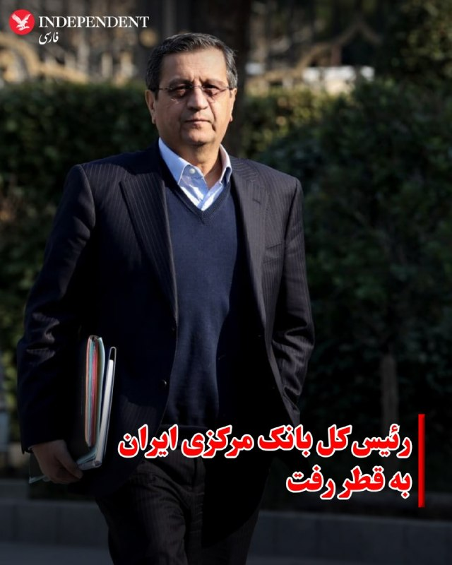

⭕️ رئیس کل بانک مرکزی ایران به قطر رفت

♦️رسانه‌های داخلی ایران روز دوشنبه چهارم خردادماه از سفر عبدالناصر همتی، رئیس کل بانک مرکزی ایران به قطر خبر دادند.

خبرگزاری فارس، وابسته به سپاه پاسداران با اعلام این خبر نوشت: «عبدالناصر همتی پیرامون بررسی آزادسازی اموال بلوکه‌شده و در راستای کمیسیون اقتصادی مذاکرات به قطر سفر کرد.»

قطر در این دور از مذاکرات، میانجی مستقیم نیست اما هفته گذشته، یک هیئت از قطر به تهران سفر کرده بود.
‌🇸🇦 Indypersian

🤖 @VahidOOnLine

## VahidOOnLine — post 242113

  

پایگاه خبری بلومبرگ گزارش داد شرکت نفت ابوظبی در هفته‌های اخیر با استفاده از ناوگان خود و به‌کارگیری روش‌های خاص، صادرات نفت و گاز از خلیج فارس را ادامه داده است.

بر اساس این گزارش، برخی نفتکش‌ها با خاموش کردن سامانه‌های ردیابی هنگام عبور از تنگه هرمز موفق شده‌اند محموله‌ها را جابه‌جا کنند. هم‌زمان، قطر نیز به‌صورت نامحسوس صادرات گاز طبیعی مایع (ال‌ان‌جی) را از تنگه هرمز ادامه داده و دست‌کم یک کشتی حامل ال‌ان‌جی پس از عبور از این مسیر راهبردی، در مسیر چین رصد شده است. اگرچه حجم این انتقال‌ها هنوز با سطح تجارت پیش از جنگ فاصله دارد، اما به گفته بلومبرگ، این تحرکات نشان‌دهنده تلاش تولیدکنندگان انرژی منطقه برای حفظ جریان صادرات و ایجاد موازنه میان فشارهای ایران و ایالات متحده است.
iranintl
‌🏁 🇬🇧 IranintlTV

🤖 @VahidOOnLine

## VahidOOnLine — post 242112

در حالیکه ۸۷ روز از خاموشی دیجیتال و قطع ارتباط ایران با جهان می‌گذرد، رسانه‌های داخلی به‌نقل از منابع آگاه گزارش دادند که در چهارمین جلسه «ستاد راهبری و ساماندهی فضای مجازی» به ریاست محمدرضا عارف، معاون اول پزشکیان، «مصوب شده تا اینترنت به وضعیت پیش از دی‌ماه ۱۴۰۴ باز گردد.»

این خبر در حالی منتشر می‌شود که اینترنت در ایران از زمان آغاز جنگ با آمریکا و اسرائیل قطع شده است. پیش از آن هم دسترسی به اینترنت از روزهای ۱۸ و ۱۹ دی‌ماه و همزمان با انقلاب ملی ایرانیان و کشتار گسترده مردم، قطع شده بود.
‌🇸🇦 Indypersian

🤖 @VahidOOnLine

## VahidOOnLine — post 242111

  

علیرضا سلیمی، عضو هیات رییسه مجلس، گفت آمریکا هیچ‌گاه به دنبال مذاکره واقعی برای پایان دادن به تنش‌ها نبوده و از میز مذاکره فقط به‌عنوان «تله‌گذاری» برای پیشبرد اقدامات «خصمانه» بعدی استفاده می‌کند.

او افزود: «اگر مقام‌های آمریکایی صادق بودند و حسن نیت داشتند، هم‌زمان با سخن گفتن از مذاکره، تحریم‌های جدید علیه جمهوری اسلامی اعمال نمی‌کردند.»
iranintl
‌🏁 🇬🇧 IranintlTV

🤖 @VahidOOnLine

## VahidOOnLine — post 242110

  

♦️دونالد ترامپ با انتشار پیامی در تروث سوشال، به‌شدت از منتقدان و مخالفان «توافق احتمالی» با جمهوری اسلامی انتقاد و تاکید کرد که اگر توافق «عالی و پرمعنی» نباشد، اصلا توافقی در کار نخواهد بود.

ترامپ در این پیام نوشت: «من به همه دموکرات‌ها، جمهوریخواهان مستقل و احمق‌هایی که هیچ چیز در مورد توافق بالقوه‌ای که من با ایران انجام می‌دهم نمی‌دانند، چیزهایی که هنوز حتی در مورد آنها مذاکره نشده است، می‌خندم. افراد ضعیف و بی‌تاثیری مثل سناتور شکست‌خورده تام تیلیس (که به زودی از سمت خود برکنار می‌شود!)، بیل کسیدی که به تازگی شکست سنگینی در انتخابات مقدماتی متحمل شد، توماس ماسی، نماینده بد کنگره، یک آدم کثیف و بی‌عرضه که پس از نشان دادن بی‌وفایی عظیم به حزب (و کشورش!) با اختلاف فاحشی به یک میهن‌پرست بزرگ آمریکایی (که توسط «ترامپ» تایید شده بود) باخت، و تقریبا همه دموکرات‌ها، افرادی که کاملا راه خود را گم کرده‌اند، دائما از سیاست‌های بد و حتی نامزدهای بدتر حمایت می‌کنند، اما همیشه از هر پیروزی فوق‌العاده‌ای که من به دست می‌آورم انتقاد می‌کنند. این افراد باید به خانه بروند و استراحت کنند.»
‌🇸🇦 Indypersian

🤖 @VahidOOnLine

## VahidOOnLine — post 242109

  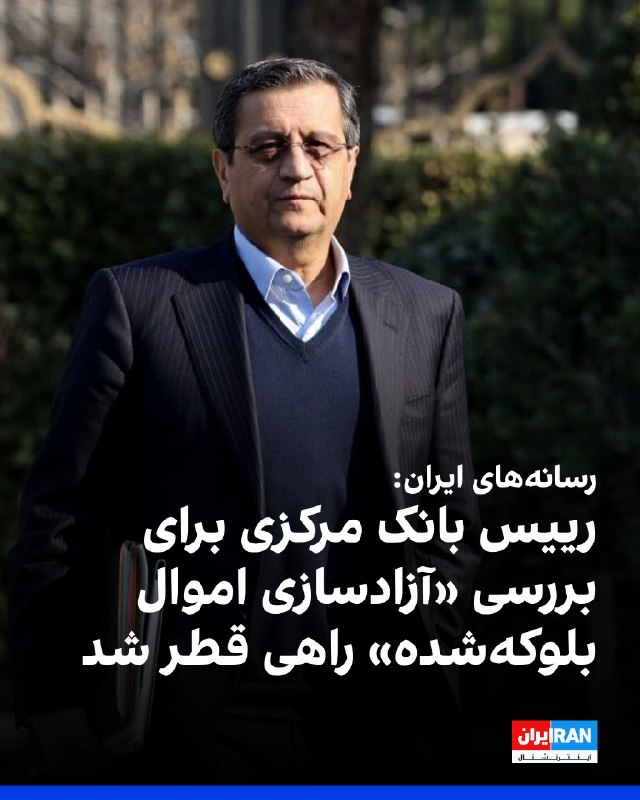

خبرگزاری فارس، وابسته به سپاه پاسداران، ضمن اعلام خبر سفر عبدالناصر همتی، رییس بانک مرکزی جمهوری اسلامی به قطر، نوشت که این سفر پیرامون بررسی «آزادسازی اموال بلوکه‌شده» و در راستای کمیسیون اقتصادی مذاکرات انجام شده است.

این در حالی است که در روزهای اخیر و در جریان مذاکرات، هیاتی قطری به ایران سفر کرده بود.
‌🏁 🇬🇧 IranintlTV

🤖 @VahidOOnLine

## VahidOOnLine — post 242108

  <a href="telegram/content/VahidOOnLine_242108_1779713616.mp4" target="_blank">🎬 Download video</a>

تماسی از هلند:
«می‌گفت هر روز با برنامه‌های منوتو زندگی می‌کردیم…
و حالا نمی‌دانیم بعد از آن باید چه کنیم.»
او همچنین از جاویدنام سینا حق‌شناس یاد کرد؛ دوستی که خبر جان‌باختنش زندگی او را زیر و رو کرده بو
‌🏁 🇬🇧 ManotoTV

🤖 @VahidOOnLine

## VahidOOnLine — post 242107

  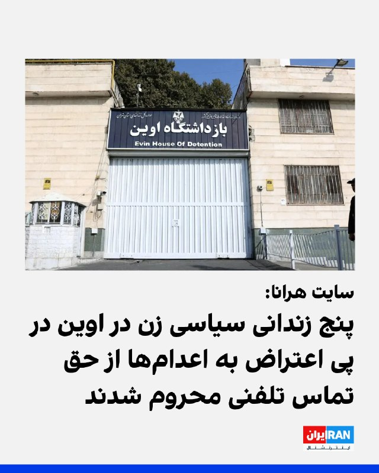

سایت هرانا خبر داد گلرخ ایرایی، زهرا صفایی، مرضیه فارسی، شیوا اسماعیلی و سکینه پروانه، پنج تن از زندانیان سیاسی محبوس در بند زنان زندان اوین، از یکشنبه به‌صورت تنبیهی از حق استفاده از تلفن زندان محروم شده‌اند.

هرانا نوشت محرومیت تنبیهی این پنج زندانی سیاسی پس از آن اعمال شد که آنان در اعتراض به اجرای احکام اعدام، در محوطه هواخوری زندان شعار داده بودند.

این زندانیان پیش‌تر نیز از حق ملاقات حضوری با خانواده و وکلای خود محروم بوده‌اند و این محدودیت همچنان ادامه دارد.
‌🏁 🇬🇧 IranintlTV

🤖 @VahidOOnLine

## VahidOOnLine — post 242106

  

دونالد ترامپ در شبکه تروث سوشال نوشت: «توافق با ایران یا یک توافق بزرگ و معنادار خواهد بود یا اصلا توافقی در کار نخواهد بود. این دقیقا برعکس فاجعه برجام است که توسط دولت شکست‌خورده اوباما انجام شد؛ توافقی که یک مسیر مستقیم و آشکار برای دستیابی آن‌ها به سلاح هسته‌ای بود. نه، من چنین توافق‌هایی انجام نمی‌دهم.»

او افزود: «من به همه دموکرات‌ها و جمهوری‌خواهانِ اسمی و احمق‌هایی می‌خندم که هیچ چیزی درباره توافق احتمالی که من با ایران در حال انجامش هستم نمی‌دانند؛ موضوعاتی که هنوز حتی درباره‌شان مذاکره هم نشده است.»
iranintl
‌🏁 🇬🇧 IranintlTV

🤖 @VahidOOnLine

## VahidOOnLine — post 242105

  <a href="telegram/content/VahidOOnLine_242105_1779713619.mp4" target="_blank">🎬 Download video</a>

ویدیوهای رسیده به ایران‌اینترنشنال نشان می‌دهند گروهی از ایرانیان مقیم آلمان هم‌زمان با فستیوال موسیقی گوتیک‌ویو در شهر لایپزیگ علیه جمهوری اسلامی راهپیمایی نمادین برگزار کردند.
این تجمع با پوشیدن لباس مشکی، پخش موسیقی نویز و نصب نماد «وای‌فای خاموش» بر دهان شرکت‌کنندگان همراه بود؛ حرکتی اعتراضی برای جلب توجه افکار عمومی به کشتارهای رخ‌داده در ایران و بی‌توجهی سیاستمداران اروپایی.
‌🏁 🇬🇧 IranintlTV

🤖 @VahidOOnLine

## VahidOOnLine — post 242104

  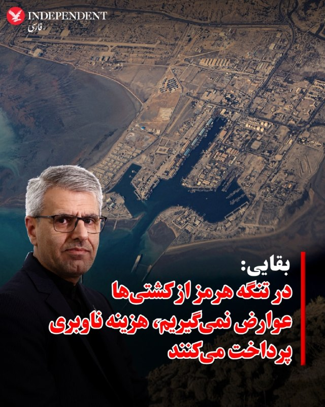

♦️اسماعیل بقایی، سخنگوی وزارت امور خارجه جمهوری اسلامی روز دوشنبه چهارم خرداد در پاسخ به پرسش‌های خبرنگاران درباره اعمال هزینه عبور از تنگه هرمز گفت: «کشتی‌ها عوارضی نمی‌پردازند. ناوبری و حفاظت از محیط زیست در تنگه هرمز هزینه‌هایی دارد و ما با کشور عمان در حال بررسی طرحی برای تامین این هزینه‌ها هستیم.»

این اظهارات در حالی بیان می‌شود که عبور و مرور کشتی‌های باری و نفتکش‌ها در از تنگه هرمز، محل گذر یک پنجم انرژی جهان از زمان آغاز جنگ آمریکا و اسرائیل با جمهوری اسلامی عملا متوقف شده است. مساله بازگشایی تنگه هرمز یکی از موضوعات مذاکرات جاری میان تهران و واشنگتن است.
‌🇸🇦 Indypersian

🤖 @VahidOOnLine

## VahidOOnLine — post 242103

  

نت‌بلاکس صبح دوشنبه اعلام کرد خاموشی اینترنت در ایران وارد هشتادوهفتمین روز متوالی شده و بیش از ۲۰۶۴ ساعت ادامه داشته است. نت‌بلاکس نوشت قطع اینترنت «هرگونه شفافیت درباره اعدام‌ها» را از بین برده و به شرایط «غیرانسانی» و بلاتکلیفی منتقدان زندانی، مخالفان و گردشگران افزوده است.
iranintl
‌🏁 🇬🇧 IranintlTV

🤖 @VahidOOnLine

## VahidOOnLine — post 242102

  

مسعود پزشکیان، رییس دولت جمهوری اسلامی گفت: «روند مذاکرات و تعاملات خارجی کشور به‌گونه‌ای طراحی شده که حقوق ملت ایران به‌صورت کامل استیفا شود و جمهوری اسلامی تحت هیچ شرایطی در برابر فشارها و مطالبات زیاده‌خواهانه تسلیم نخواهد شد.»

او افزود: «حفظ ثبات بازار و تامین نیازهای کشور در شرایط جنگی، مرهون تلاش موثر فعالان اقتصادی بوده است.»
iranintl
‌🏁 🇬🇧 IranintlTV

🤖 @VahidOOnLine

## mwarmonitor — post 9685

مذاکرات با جمهوری اسلامی ایران به خوبی در حال پیشرفت است! این یا یک «توافق بزرگ» برای همه خواهد بود، یا هیچ توافقی در کار نخواهد بود — بازگشت به جبهه جنگ و شلیک، اما بزرگتر و قوی‌تر از هر زمان دیگری — و هیچ‌کس این را نمی‌خواهد!
من در طول گفتگوهایم در روز شنبه با پرزیدنت محمد بن سلمان آل سعود از عربستان سعودی، محمد بن زاید آل نهیان از امارات متحده عربی، امیر تمیم بن حمد بن خلیفه آل ثانی، نخست‌وزیر محمد بن عبدالرحمن بن جاسم بن جابر آل ثانی و وزیر علی الثوادی از قطر، فیلد مارشال سید عاصم منیر احمد شاه از پاکستان، پرزیدنت رجب طیب اردوغان از ترکیه، پرزیدنت عبدالفتاح السیسی از مصر، ملک عبدالله دوم از اردن و ملک حمد بن عیسی آل خلیفه از بحرین، اعلام کردم که پس از تمام تلاش‌های انجام‌شده توسط ایالات متحده برای کنار هم چیدن این پازل بسیار پیچیده، باید اجباری باشد که همه این کشورها، در کمترین حالت، به‌طور هم‌زمان «پیمان ابراهیم» را امضا کنند.
کشورهای مورد بحث عبارتند از: عربستان سعودی، امارات متحده عربی (که در حال حاضر عضو است!)، قطر، پاکستان، ترکیه، مصر، اردن و بحرین (که در حال حاضر عضو است!). این احتمال وجود دارد که یک یا دو کشور دلیلی برای عدم انجام این کار داشته باشند و این پذیرفته خواهد شد، اما اکثر آن‌ها باید آماده، مایل و قادر باشند تا این توافق با ایران را به رویدادی به مراتب تاریخی‌تر از آنچه در غیر این صورت می‌بود، تبدیل کنند.
پیمان ابراهیم برای کشورهای درگیر (امارات متحده عربی، بحرین، مراکش، سودان و قزاقستان) یک شکوفایی مالی، اقتصادی و اجتماعی بزرگ را، حتی در این زمانه جنگ و درگیری، به اثبات رسانده است؛ به‌طوری که اعضای فعلی آن هرگز حتی پیشنهاد خروج یا حتی وقفه‌ای در آن را نداده‌اند. دلیل آن این است که پیمان ابراهیم برای آن‌ها عالی بوده است، برای همه حتی بهتر خواهد بود و برای اولین بار در ۵۰۰۰ سال گذشته، قدرت، استحکام و صلح واقعی را به خاورمیانه خواهد آورد. این سندی خواهد بود که مانند هیچ سند دیگری که تا به حال در هیچ کجای جهان امضا شده، مورد احترام قرار خواهد گرفت. سطح اهمیت و اعتبار آن بی‌نظیر خواهد بود!
این روند باید با امضای فوری توسط عربستان سعودی و قطر شروع شود و بقیه نیز باید از آن‌ها پیروی کنند. اگر این کار را نکنند، نباید بخشی از این توافق باشند، چرا که این امر نشان‌دهنده سوءنیت است. در گفتگو با بسیاری از رهبران بزرگی که در بالا نام برده شد، آن‌ها مایه افتخار خود خواهند دانست که به محض امضای سند ما، جمهوری اسلامی ایران نیز بخشی از پیمان ابراهیم شود. وای، این واقعاً چیز ویژه‌ای خواهد بود! این مهم‌ترین توافقی خواهد بود که هر یک از این کشورهای بزرگ، اما همیشه درگیر در مناقشه، امضا کرده‌اند. هیچ‌چیز در گذشته یا در آینده، بر آن پیشی نخواهد گرفت.
بنابراین، من به صورت الزامی درخواست می‌کنم که همه کشورها فوراً پیمان ابراهیم را امضا کنند و اگر ایران توافق خود را با من، به عنوان رئیس‌جمهور ایالات متحده آمریکا، امضا کند، مایه افتخار خواهد بود که آن‌ها نیز بخشی از این ائتلاف جهانی بی‌نظیر باشند.
خاورمیانه متحد، قدرتمند و از نظر اقتصادی قوی خواهد شد، شاید شبیه به هیچ منطقه دیگری در هیچ کجای جهان! با رونوشت این «تروث» (پیام)، من از نمایندگانم می‌خواهم که فرآیند امضای این کشورها در پیمانِ از قبل تاریخیِ ابراهیم را آغاز کرده و با موفقیت به پایان برسانند. با تشکر از توجه شما به این موضوع!

دونالد جی. ترامپ رئیس‌جمهور ایالات متحده آمریکا

@mwarmonitor

## mwarmonitor — post 9684

🔴« محمدباقر قالیباف، رئیس مجلس ایران، و عباس عراقچی، وزیر امور خارجه، امروز زودتر به دوحه رسیدند تا درباره تلاش‌های دیپلماتیک جاری برای پایان دادن به درگیری‌ها گفت‌وگو کنند؛ یک منبع مطلع از این سفر به فاکس نیوز گفته است.» @mwarmonitor

## mwarmonitor — post 9683

🔴« محمدباقر قالیباف، رئیس مجلس ایران، و عباس عراقچی، وزیر امور خارجه، امروز زودتر به دوحه رسیدند تا درباره تلاش‌های دیپلماتیک جاری برای پایان دادن به درگیری‌ها گفت‌وگو کنند؛ یک منبع مطلع از این سفر به فاکس نیوز گفته است.»

@mwarmonitor

## mwarmonitor — post 9682

  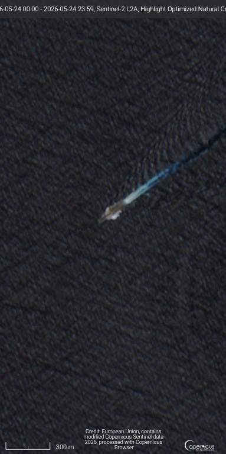

🔴 ناو هواپیمابر فرانسوی «شارل دو گل (R91)» را در تصاویر ماهواره‌ای Sentinel-2، تاریخ ۲۴/۰۵/۲۰۲۶.

این ناو در حال حاضر در دریای عرب در حال حرکت است و تنها توسط یک ناوشکن اسکورت می‌شود.

📍مختصات: 16.83654, 55.92432

@mwarmonitor

## mwarmonitor — post 9681

  

🔸ایلان عمر، پیشنهاد مطرح‌شده‌ای را که می‌تواند به ممنوعیت حضور او در کنگره منجر شود، بی‌اهمیت و رد کرد. نیویورک پست

@mwarmonitor

## mwarmonitor — post 9680

  

📝 موقع خوندن خبرها این خبر توجهم جلب کرد . 📌‏یک جوان ۱۹ ساله افغان در منطقه لپن میرابو در نزدیکی شهر مارسی فرانسه، به اتهام تجاوز جنسی بر بزها و گوسفندان بازداشت و به دادگاه معرفی شده است. 📌متهم در صورت اثبات جرم، با سه سال زندان و ۴۵ هزار یورو جریمه مواجه…

## mwarmonitor — post 9679

  

🔸طبق اعلام وزارت خارجه جمهوری اسلامی، عباس عراقچی، وزیر امور خارجه ایران، به دلیل شرایط کلی و یک مشکل مرتبط با ویزای آمریکا، برای شرکت در نشست شورای امنیت سازمان ملل به نیویورک سفر نخواهد کرد.

@mwarmonitor

## mwarmonitor — post 9678

📌ایران اعلام کرد که «بسیاری از مسائل» مربوط به یک توافق با آمریکا برای تمدید آتش‌بس شکننده به مدت ۶۰ روز و بازگشایی تنگه هرمز را نهایی کرده است، اما هشدار داد که با وجود ادامه مذاکرات درباره جزئیات باقی‌مانده، رسیدن به توافق نهایی هنوز قریب‌الوقوع نیست. فیننشال تایمز

@mwarmonitor

## mwarmonitor — post 9677

🔴واشنگتن پست: مرحله اول شامل پاک‌سازی مین‌ها و برداشتن محاصره آمریکا و آزادسازی ۱۲ میلیارد دلار است. یادداشت تفاهم شامل یک توافق هسته‌ای نیست، بلکه فقط یک تعهد برای مذاکره درباره پرونده هسته‌ای در آینده است.

@mwarmonitor

## mwarmonitor — post 9676

🔸یک سرمایه‌گذاری مشترک آمریکا–عربستان در ریاض قصد دارد نمونه‌های مشابه پهپادهای «شاهد» تولید کند — سامافور (Samafor).

@mwarmonitor

## mwarmonitor — post 9675

Hey you yellow-headed real estate hustler, how can an orange old man be so spineless, pathetic, and cowardly? You vilely free-rode on the blood and slaughter of 45,000 Iranians just to buy yourself a fake license to attack and a tough-guy posture. But look at you now—like a bankrupt political vulture, you're on your knees begging for a deal with the exact same terrorist sect you curse day and night!
Wipe that filthy smirk off your face; you are worse than Obama. At least he didn't screw over a nation of 80 million like this, nor did he use the spilled blood of half of them to buy himself fake credit. Screw your "art of the deal" where you swallowed every single loud promise you made and are now wagging your tail to get a photo-op with murderers!
Finish what you started like a man. Otherwise, with this humiliation and hidden begging, you won't just flush your own lack of dignity down the toilet of history—you will be recorded forever as an eternal stain of disgrace, a loser dushman-begging broker, and an absolute idiot who mistook human blood for his own real estate projects!

@RealDonaldTrump
@DonaldJTrumpJr
@EricTrump
@JDVance
@elonmusk
@VivekGRamaswamy
@susie57
@StephenM
@marcorubio
@michaelgwaltz
@SenTomCotton
@tedcruz
@LindseyGrahamSC
@HawleyMO
@SenRickScott
@SenRonJohnson
@kleavittnh
@TeamTrump

## mwarmonitor — post 9674

‼️این متن رو به انگلیسی تو اینستاگرام و ایکس استفاده کنید. ترامپ و هرکی رو می‌شناسید تگ کنید که به دستش برسه.

## mwarmonitor — post 9673

من به همه «دوموکراسی‌خواهان» (ترکیب تمسخرآمیز دموکرات و احمق)، رینوها (جمهوری‌خواهان فقط در نام) و نادان‌هایی که هیچ چیز درباره توافق احتمالی من با ایران نمی‌دانند می‌خندم؛ چیزهایی که هنوز حتی درباره آن‌ها مذاکره هم نشده است. افراد ضعیف و بی‌کفایتی مانند سناتور…

## mwarmonitor — post 9672

من به همه «دوموکراسی‌خواهان» (ترکیب تمسخرآمیز دموکرات و احمق)، رینوها (جمهوری‌خواهان فقط در نام) و نادان‌هایی که هیچ چیز درباره توافق احتمالی من با ایران نمی‌دانند می‌خندم؛ چیزهایی که هنوز حتی درباره آن‌ها مذاکره هم نشده است. افراد ضعیف و بی‌کفایتی مانند سناتور شکست‌خورده تام تیلیس (که به زودی از سمت خود کنار می‌رود!)، بیل کسیدی که همین چند وقت پیش شکست سنگینی را در انتخابات مقدماتی متحمل شد، و نماینده واقعاً بد کنگره توماس مسی؛ یک کیسه کثافت بزرگ که در یک شکست مفتضحانه، نتیجه را به یک وطن‌پرست بزرگ آمریکایی (مورد تایید "ترامپ") واگذار کرد، آن هم پس از اینکه بی‌وفایی شدیدی به حزب (و کشورش!) نشان داد.
و تقریباً همه «دوموکراسی‌خواهان»، افرادی که کاملاً راه خود را گم کرده‌اند و مدام از سیاست‌های بد و حتی نامزدهای بدتر حمایت می‌کنند، اما به طور مداوم از تک‌تک پیروزی‌های فوق‌العاده من انتقاد می‌کنند. این افراد باید به خانه بروند و استراحت کنند، آن‌ها کاری جز ایجاد تفرقه و باخت انجام نمی‌دهند. به عبارت دیگر، آن‌ها بازنده هستند!
توافق با ایران یا یک توافق بزرگ و معنادار خواهد بود، یا اصلاً توافقی در کار نخواهد بود. این توافق دقیقاً نقطه مقابل فاجعه برجام (JCPOA) خواهد بود که توسط دولت شکست‌خورده اوباما مذاکره شد؛ توافقی که یک مسیر مستقیم و باز برای رسیدن ایران به سلاح هسته‌ای بود. خیر، من این‌طور معامله نمی‌کنم!

رئیس‌جمهور دونالد جی ترامپ (DJT)

@mwarmonitor

## mwarmonitor — post 9671

🔸شبکه ۱۲ اسرائیل: از صبح تاکنون ۳ پهپاد حزب‌الله در داخل اسرائیل منفجر شده‌اند که یکی از آن‌ها به یک ساختمان در منطقه «مطله» اصابت کرده است.

@mwarmonitor

## mwarmonitor — post 9670

🔴تد کروز و لیندسی گراهام رهبری جمهوری‌خواهان را بر عهده دارند که از ترامپ به‌خاطر «اشتباه فاجعه‌بار» در توافق در حال شکل‌گیری او با ایران به‌شدت انتقاد می‌کنند. Daily mail

@mwarmonitor

## mwarmonitor — post 9669

  

🔴فایننشال تایمز گزارش می‌دهد که شی جین‌پینگ در جریان دیدار با ترامپ، هنگام صحبت درباره طرح‌های نظامی‌سازی مجدد ژاپن و افزایش هزینه‌های دفاعی تحت نخست‌وزیری سانائه تاکایچی، دچار عصبانیت شده است.

🔸ترامپ گفته است که ژاپن برای دفاع از خود در برابر تهدیدهای کره شمالی به یک ارتش قوی‌تر نیاز دارد.

@mwarmonitor

## mwarmonitor — post 9668

🔴شبکه کان اسرائیل: رئیس ستاد ارتش اسرائیل خواستار حمله به بیروت در پاسخ به پهپادهای حزب‌الله شده است.

@mwarmonitor

## mwarmonitor — post 9667

  <a href="telegram/content/mwarmonitor_9667_1779713624.mp4" target="_blank">🎬 Download video</a>

📍مرکز خرید محبوب «Kvadrat» در منطقه لوکیانیوکا در کی‌یف پس از یک حمله سنگین موشکی و پهپادی روسیه در یکشنبه کاملاً در آتش سوخت.

🔸در منطقه شوچنکیفسکی، یک نفر کشته شد. تعداد کل مجروحان در کی‌یف به بیش از ۴۰ نفر افزایش یافته است.

@mwarmonitor

## mwarmonitor — post 9666

  

📊آسیا هفته را با خبرهایی آغاز کرد مبنی بر اینکه آمریکا و ایران به‌تدریج در حال نزدیک شدن به یک توافق هستند و بازارها نیز تصمیم گرفتند به جنبه مثبت ماجرا نگاه کنند: بلومبرگ

@mwarmonitor

## pm_afshaa — post 91454

  <a href="telegram/content/pm_afshaa_91454_1779713626.webm" target="_blank">🎬 Download video</a>

🔴پست جدید ترامپ: مذاکرات با جمهوری اسلامی ایران به خوبی پیش می‌رود! یا یک توافق عالی برای همه خواهد بود یا هیچ توافقی حاصل نمی‌شود - بازگشت به جبهه نبرد و تیراندازی، اما بزرگتر و قوی‌تر از همیشه - و هیچ کس این را نمی‌خواهد! در جریان مذاکرات روز شنبه‌ام با…

## pm_afshaa — post 91453

  <a href="telegram/content/pm_afshaa_91453_1779713626.webm" target="_blank">🎬 Download video</a>

🔴پست جدید ترامپ:

مذاکرات با جمهوری اسلامی ایران به خوبی پیش می‌رود! یا یک توافق عالی برای همه خواهد بود یا هیچ توافقی حاصل نمی‌شود - بازگشت به جبهه نبرد و تیراندازی، اما بزرگتر و قوی‌تر از همیشه - و هیچ کس این را نمی‌خواهد! در جریان مذاکرات روز شنبه‌ام با محمد بن سلمان آل سعود، رئیس جمهور عربستان سعودی، محمد بن زاید آل نهیان، رئیس جمهور امارات متحده عربی، امیر تمیم بن حمد بن خلیفه آل ثانی، نخست وزیر محمد بن عبدالرحمن بن جاسم بن جابر آل ثانی و وزیر علی الذوادی از قطر، فیلد مارشال سید عاصم منیر احمد شاه از پاکستان، رجب طیب اردوغان، رئیس جمهور ترکیه، عبدالفتاح السیسی، رئیس جمهور مصر، ملک عبدالله دوم، پادشاه اردن و ملک حمد بن عیسی آل خلیفه از بحرین، اظهار داشتم که پس از تمام کارهایی که ایالات متحده برای کنار هم قرار دادن این پازل بسیار پیچیده انجام داده است، باید اجباری باشد که همه این کشورها، حداقل، همزمان، توافقنامه ابراهیم را امضا کنند. این کشورها مورد بحث عبارتند از عربستان سعودی، امارات متحده عربی (که از قبل عضو است!)، قطر، پاکستان، ترکیه، مصر، اردن و بحرین (که از قبل عضو است!). ممکن است یک یا دو نفر دلیلی برای انجام ندادن این کار داشته باشند و این پذیرفته خواهد شد، اما اکثر آنها باید آماده، مایل و قادر باشند که این توافق با ایران را به یک رویداد تاریخی بسیار مهم‌تر از آنچه در غیر این صورت می‌توانست باشد، تبدیل کنند. توافق‌نامه‌های ابراهیم برای کشورهای درگیر (امارات متحده عربی، بحرین، مراکش، سودان و قزاقستان) یک رونق مالی، اقتصادی و اجتماعی بوده است، حتی در این دوران درگیری و جنگ، به طوری که اعضای فعلی هرگز پیشنهاد خروج یا حتی مکثی در آن نداده‌اند. دلیل این امر این است که توافق‌نامه‌های ابراهیم برای آنها عالی بوده است و برای همه حتی بهتر خواهد بود و برای اولین بار در 5000 سال گذشته، قدرت، استحکام و صلح واقعی را برای خاورمیانه به ارمغان می‌آورد. این سندی خواهد بود که مانند هیچ سند دیگری که تاکنون در هیچ کجای جهان امضا شده است، مورد احترام قرار نخواهد گرفت. سطح اهمیت و اعتبار آن بی‌نظیر خواهد بود! این توافق‌نامه باید با امضای فوری عربستان سعودی و قطر آغاز شود و همه دیگران نیز باید از آن پیروی کنند. اگر این کار را نکنند، نباید بخشی از این توافق باشند، زیرا این نشان دهنده نیت بد است. در صحبت با بسیاری از رهبران بزرگ ذکر شده در بالا، آنها مفتخر خواهند بود که به محض امضای سند ما، جمهوری اسلامی ایران را به عنوان بخشی از توافق‌نامه‌های ابراهیم داشته باشند. وای، این چیز خاصی خواهد بود! این مهمترین توافق‌نامه‌ای خواهد بود که هر یک از این کشورهای بزرگ، اما همیشه در حال جنگ، هرگز امضا خواهند کرد. هیچ چیز در گذشته یا در آینده از آن پیشی نخواهد گرفت. بنابراین، من به طور اجباری درخواست می‌کنم که همه کشورها فوراً توافق‌نامه‌های ابراهیم را امضا کنند و اگر ایران توافق‌نامه خود را با من، به عنوان رئیس جمهور ایالات متحده آمریکا، امضا کند، باعث افتخار خواهد بود که آنها نیز بخشی از این ائتلاف جهانی بی‌نظیر باشند. خاورمیانه متحد، قدرتمند و از نظر اقتصادی قوی خواهد بود، شاید مانند هیچ منطقه دیگری در هیچ کجای جهان! با کپی کردن این حقیقت، از نمایندگان خود می‌خواهم که روند پیوستن این کشورها به توافق‌نامه‌های تاریخی ابراهیم را آغاز و با موفقیت تکمیل کنند. از توجه شما به این موضوع متشکرم!

💧Rainbet.com the #1 Non-KYC Crypto Casino & Sportsbook @rainbetcom

😁 @Pm_Afshaa

## pm_afshaa — post 91452

🔴همتی رئیس بانک مرکزی برای آزادسازی منابع ارزی ایران راهی قطر شده

💧 Rainbet.com the #1 Non-KYC Crypto Casino & Sportsbook @rainbetcom

😁 @Pm_Afshaa

## pm_afshaa — post 91451

  <a href="telegram/content/pm_afshaa_91451_1779713627.webm" target="_blank">🎬 Download video</a>

🔴رویترز: قالیباف و عراقچی برای گفت‌وگو درباره توافق با آمریکا وارد قطر شدن.

اولویت اصلی مذاکرات در دوحه، تنگه هرمز و غنی‌سازی اورانیوم هست.

رئیس بانک مرکزی که بخشی از هیئت ایرانی در دوحه بود، قراره درباره آزادسازی احتمالی دارایی مسدود شده ایران به عنوان بخشی از توافق نهایی میان ایران و آمریکا صحبت کنه.

💧 Rainbet.com the #1 Non-KYC Crypto Casino & Sportsbook @rainbetcom

😁 @Pm_Afshaa

## pm_afshaa — post 91450

  <a href="telegram/content/pm_afshaa_91450_1779713627.webm" target="_blank">🎬 Download video</a>

🔴فاکس نیوز: قالیباف و عراقچی امروز زودتر به قطر رسیدن برای مذاکرات مرتبط با تلاش‌های دیپلماتیک جاری که هدف آن پایان دادن به درگیری است.

💧 Rainbet.com the #1 Non-KYC Crypto Casino & Sportsbook @rainbetcom

😁 @Pm_Afshaa

## pm_afshaa — post 91449

🔴ترامپ: دموکرات‌ها سیاست‌های بد و نامزدهای بدی دارند. غیر از این، آن‌ها عملکرد نسبتاً خوبی دارن

💧 Rainbet.com the #1 Non-KYC Crypto Casino & Sportsbook @rainbetcom

😁 @Pm_Afshaa

## pm_afshaa — post 91448

  <a href="telegram/content/pm_afshaa_91448_1779713628.webm" target="_blank">🎬 Download video</a>

🔴واشنگتن پست به نقل از یک مقام ایرانی:
بازگشایی تنگه هرمز مرحله‌به‌مرحله انجام میشه. اول مین‌ها پاک‌سازی میشه، بعد محاصره آمریکا برداشته میشه و اون 12 میلیارد دلار دارایی مسدود شده هم آزاد میشه.

یه یادداشت هم امضا شده که اصلا ربطی به توافق هسته‌ای نداره، فقط قول دادیم که مذاکرات رو ادامه بدیم.

💧 Rainbet.com the #1 Non-KYC Crypto Casino & Sportsbook @rainbetcom

😁 @Pm_Afshaa

## pm_afshaa — post 91447

  <a href="telegram/content/pm_afshaa_91447_1779713628.webm" target="_blank">🎬 Download video</a>

🔴العربیه:
نخست‌وزیر پاکستان با رهبران چین درباره پرونده ایران و توافق با آمریکا صحبت کرد.

اسلام‌آباد اصرار داره که پکن نقش ضامن رو تو هر جور توافقی بین آمریکا و ایران بازی کنه.

💧 Rainbet.com the #1 Non-KYC Crypto Casino & Sportsbook @rainbetcom

😁 @Pm_Afshaa

## pm_afshaa — post 91446

  <a href="telegram/content/pm_afshaa_91446_1779713628.webm" target="_blank">🎬 Download video</a>

🔴صداوسیما از سفر عبدالناصر همتی، رییس کل بانک مرکزی، به قطر خبر داد و نوشت این سفر در حالی انجام شده که چند روز پیش هیاتی قطری برای گفت‌وگو درباره اموال بلوکه‌شده ایران در تهران حضور داشتن.

💧 Rainbet.com the #1 Non-KYC Crypto Casino & Sportsbook @rainbetcom

😁 @Pm_Afshaa

## pm_afshaa — post 91445

  <a href="telegram/content/pm_afshaa_91445_1779713629.webm" target="_blank">🎬 Download video</a>

🔴دیلی‌میل: تد کروز و لیندسی گراهام رهبری جمهوری‌خواهان رو بر عهده دارن که از توافق در حال شکل‌گیری ترامپ با ایران انتقاد میکنن و اونو اشتباهی فاجعه‌‌بار می‌دونن.

💧 Rainbet.com the #1 Non-KYC Crypto Casino & Sportsbook @rainbetcom

😁 @Pm_Afshaa

## pm_afshaa — post 91444

  <a href="telegram/content/pm_afshaa_91444_1779713629.webm" target="_blank">🎬 Download video</a>

🔴پست جدید ترامپ در تروث سوشال:

من میخندم به همه‌ی دموکرات‌های احمق و رینوها (جمهوری‌خواهان بدلی) و ابلهانی که هیچ‌چیز درباره‌ی توافق احتمالی من با ایران نمیدانند؛ چیزهایی که حتی هنوز مورد مذاکره هم قرار نگرفته‌اند. افراد ضعیف و بی‌خاصیتی مثل سناتور شکست‌خورده تام تیلیس (که به‌زودی از کار برکنار میشود!)، بیل کسیدی که همین چندهفته پیش یک شکست سنگین رو توی انتخابات درون‌حزبی تجربه کرد، و عضو واقعاً بد کنگره توماس مسی؛ یک آدم پست و رذل به تمام‌معنا که بعد از نشان دادن بی‌وفایی شدید به حزبش (و کشورش!)، در یک انتخابات قاطع (با اختلاف فاحش) به یک میهن‌پرست بزرگ آمریکایی (مورد حمایت "ترامپ") باخت. و تقریباً همه‌ی دموکرات‌های احمق، افرادی که کاملاً راه خودشون رو گم کرده‌اند، مدام از سیاست‌های بد و حتی نامزدهای بدتر حمایت میکنند، اما به‌طور مستمر از تک‌تک بردهای شگفت‌انگیز من انتقاد میکنند. این افراد باید بروند خانه و استراحت کنند، اونا کاری جز ایجاد تفرقه و باخت انجام نمیدهند. به عبارت دیگر، اونا بازنده هستند!

توافق با ایران یا یک توافق بزرگ و پرمحتوا خواهد بود، یا اصلاً توافقی در کار نخواهد بود. این توافق دقیقاً نقطه‌ی مقابل فاجعه‌ی برجام خواهد بود که توسط دولت شکست‌خورده‌ی اوباما مذاکره شد؛ توافقی که یک مسیر مستقیم و باز واسه رسیدن به سلاح هسته‌ای جلو پای ایران گذاشت. نخیر، من از این مدل توافق‌ها نمیکنم!

💧 Rainbet.com the #1 Non-KYC Crypto Casino & Sportsbook @rainbetcom

😁 @Pm_Afshaa

## pm_afshaa — post 91443

  <a href="telegram/content/pm_afshaa_91443_1779713630.webm" target="_blank">🎬 Download video</a>

🔴بقایی، سخنگوی وزارت خارجه:
درسته که تو خیلی از موضوعات به یه جمع‌بندی رسیدیم، ولی اگه بگیم این یعنی امضای یه توافق نزدیکه، کسی نمیتونه چنین ادعایی بکنه.

ما مدام میبینیم که موضع مقامات آمریکا تغییر میکنه و این روند هر گفت‌وگویی رو با اشکال و شک‌های زیادی مواجه میکنه

💧 Rainbet.com the #1 Non-KYC Crypto Casino & Sportsbook @rainbetcom

😁 @Pm_Afshaa

## pm_afshaa — post 91442

  <a href="telegram/content/pm_afshaa_91442_1779713630.webm" target="_blank">🎬 Download video</a>

🔴اکونومیست: عربستان از ترامپ خواسته هرگونه حمله جدید به ایران رو تا بعد از مراسم سالانه حج به تعویق بندازه.

ریاض نگرانه اگه درگیری دوباره آغاز و حریم هوایی منطقه بسته بشه، زائران در عربستان سعودی گیر بیفتن.

💧 Rainbet.com the #1 Non-KYC Crypto Casino & Sportsbook @rainbetcom

😁 @Pm_Afshaa

## pm_afshaa — post 91441

  <a href="telegram/content/pm_afshaa_91441_1779713631.webm" target="_blank">🎬 Download video</a>

🔴سی‌بی‌اس: مجتبی خامنه‌ای در مکانی نامعلوم با دسترسی کم به دنیای خارج پنهان شده و ارتباط با اون فقط از طریق شبکه‌ای از پیک‌ها انجام میشه.

حتی بسیاری از مقام‌های ارشد جمهوری اسلامی هم به مجتبی خامنه‌ای دسترسی مستقیم ندارن و همین روند مذاکرات و پاسخ تهران به پیشنهادهای آمریکا رو کند کرده.

💧 Rainbet.com the #1 Non-KYC Crypto Casino & Sportsbook @rainbetcom

😁 @Pm_Afshaa

## pm_afshaa — post 91440

تسنیم: مصوبه رفع انسداد اینترنت بین‌المللی تأیید شد و به دست پزشکیان رسید؛ اگر پزشکیان هم تأییدش کنه، این مصوبه برای اجرا به وزارت ارتباطات صادر می‌شه و تا هفته آینده نت بین‌المللی وصل می‌شه

💧 Rainbet.com the #1 Non-KYC Crypto Casino & Sportsbook @rainbetcom

😁 @Pm_Afshaa

## pm_afshaa — post 91439

🔴ربیو:اگر مذاکرات شکست بخورد تقصیر ایالات متحده یا متحدان ما در منطقه خلیج فارس نیست. 100 درصد تقصیر ایران است

💧 Rainbet.com the #1 Non-KYC Crypto Casino & Sportsbook @rainbetcom

😁 @Pm_Afshaa

## pm_afshaa — post 91438

درود هموطنان عزیزم یک دختر 26 سال داره بجرم کشتن یکنفر که وارد خونش شده که بهش تعرض و تجاوز بکنه صبح 5 خرداد اعدام میشه، باید ۱۰ میلیارد جمع بشه که رضایت بدن تا حالا ۹ میلیارد جمع شده  همه چی داخل تصویر هست کسی خواست استعلام بگیره میدونم ایرانی ها آدم با…

## pm_afshaa — post 91437

به قرآن قسم بگی چندجا روبیکا هم گفتم بزارن شما کامل بخون و استعلام هم بگیر که دروغ نیست میتونی کانال بزاری فردا اعدام میشه یک میلیارد مونده💔💔

## pm_afshaa — post 91436

درود هموطنان عزیزم یک دختر 26 سال داره بجرم کشتن یکنفر که وارد خونش شده که بهش تعرض و تجاوز بکنه صبح 5 خرداد اعدام میشه، باید ۱۰ میلیارد جمع بشه که رضایت بدن تا حالا ۹ میلیارد جمع شده  همه چی داخل تصویر هست کسی خواست استعلام بگیره میدونم ایرانی ها آدم با…

## pm_afshaa — post 91435

  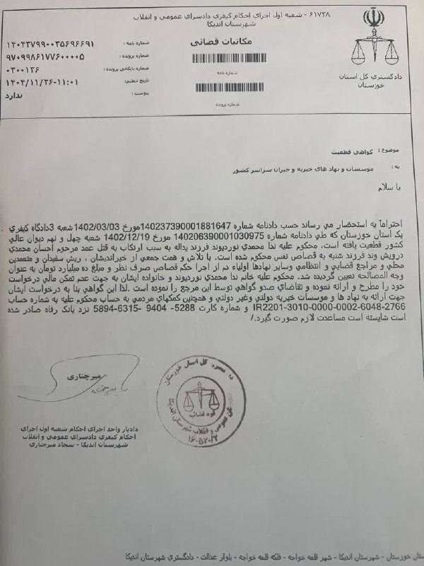

درود هموطنان عزیزم
یک دختر 26 سال داره بجرم کشتن یکنفر که وارد خونش شده که بهش تعرض و تجاوز بکنه
صبح 5 خرداد اعدام میشه، باید ۱۰ میلیارد جمع بشه که رضایت بدن تا حالا ۹ میلیارد جمع شده  همه چی داخل تصویر هست کسی خواست استعلام بگیره
میدونم ایرانی ها آدم با غیرتی هستند حتی شما با کمک ۱۰ هزار تومان کمک بزرگی کردید❤️

شماره کارت:۵۸۹۴۶۳۱۵۹۴۰۴۵۲۸۸
شبا: ۲۲۰۱۳۰۱۰۰۰۰۰۰۰۰۲۶۰۴۸۲۷۶۶

روی شماره کارت و شماره شبا بزنید کپی میشه

## DEJradio — post 4940

⭕️ قالیباف و عراقچی برای دیدار با مقام‌های قطر به دوحه رفتند

خبرگزاری رویترز به نقل از یک مقام آگاه گزارش داد محمدباقر قالیباف، رئیس مجلس و عباس عراقچی، وزیر امور خارجۀ جمهوری اسلامی، در دوحه حضور دارند.
بر اساس این گزارش که عصر دوشنبه منتشر شد، این دو مقام جمهوری اسلامی قرار است با محمد بن عبدالرحمن آل‌ثانی، نخست‌وزیر و وزیر خارجۀ قطر، دیدار و گفت‌وگو کنند.
رویترز نوشت این دیدارها در چارچوب رایزنی‌ برای دستیابی به توافق میان تهران و واشینگتن انجام می‌شود.
قطر در هفته‌های اخیر در کنار پاکستان به یکی از کانال‌های اصلی میانجی‌گری میان جمهوری اسلامی و آمریکا تبدیل شده است.
مقامات قطر پیش از جنگ چهل روزه نیز تلاش بسیاری کردند تا مانع حملۀ آمریکا و اسرائیل به جمهوری اسلامی بشوند.

#قطر
@DEJradio

## DEJradio — post 4939

⭕️
🌐 محاصرۀ دیجیتال در ایران هشتادوهفتمین روز رسید

نت‌بلاکس، اعلام کرد قطعی سراسری اینترنت در ایران وارد هشتادوهفتمین روز پیاپی شده است. این قطعی از مرز ۲۰۶۴ ساعت عبور کرده است.
این نهاد جهانی پایش اینترنت هشدار داد قطعی اینترنت، شفافیت دربارۀ اعدام‌ها و وضعیت زندانیان و بازداشت‌شدگان را از میان برده است.
نهاد عفو بین‌الملل اعلام کرده در هفته‌های اخیر، دستکم ۳۶ نفر در پرونده‌های سیاسی اعدام شدند.
بر پایۀ گزارش‌های داخلی، نبود اینترنت سبب آسیب گسترده به اقتصاد دیجیتال و کاهش فروش آنلاین شده است.
از سویی اینترنت طبقاتی و دسترسی ویژۀ برخی نهادها و شرکت‌ها به اینترنت بین‌الملل، انتقادهای گسترده‌ای را در ایران برانگیخته است.
حکومت از سویی اینترنت رانتی را در اختیار هواداران خود می‌گذارد تا به نفع آن، در شبکه‌های اجتماعی در دنیا تبلیغ کنند.

#اینترنت
@DEJradio

## DEJradio — post 4938

⭕️ سفر همتی به قطر در راستای پروندۀ پول‌های بلوکه‌شدۀ رژیم

خبرگزاری‎‌های داخلی ایران، از سفر عبدالناصر همتی، رئیس کل بانک مرکزی جمهوری اسلامی، به قطر خبر دادند. بنا بر گزارش‌ها یکی از محورهای این سفر، پیگیری آزادسازی منابع ارزی جمهوری اسلامی است.
قطر از سال ۲۰۲۳ و پس از انتقال حدود شش میلیارد دلار از دارایی‌های بلوکه‌شده ایران در کرۀ جنوبی، به یکی از محورهای اصلی پروندۀ مالی تهران و واشینگتن تبدیل شد.
در هفته‌های اخیر، همزمان با مذاکرات غیرمستقیم تهران و واشینگتن، موضوع آزادسازی دارایی‌های مسدودشدۀ جمهوری اسلامی مطرح شد.
برخی از منابع خارجی گزارش دادند که آزادسازی بخشی از این منابع می‌تواند به پیشرفت مذاکرات و امنیت تنگۀ هرمز پیوند خورده باشد.
قطر اکنون علاوه بر نگهداری بخشی از منابع مالی بلوکه شدۀ جمهوری اسلامی، یکی از مسیرهای فعال میانجی‌گری میان تهران و واشینگتن به شمار می‌رود.

#مذاکرات #توافق #تحریم
@DEJradio

## DEJradio — post 4937

⭕️ ترامپ گفت توافق با جمهوری اسلامی یا عالی و معنادار می‌شود یا توافقی در کار نیست

دونالد ترامپ، رئیس‌ جمهوری آمریکا، روز دوشنبه در شبکۀ اجتماعی تروث نوشت توافق احتمالی با جمهوری اسلامی یا «عالی و معنادار» می‌شود یا اصلا توافقی انجام نمی‌گیرد.
ترامپ منتقدان دموکرات و برخی جمهوری‌خواهان را متهم کرد که آنها دربارۀ موضوعاتی نظر می‌دهند که هنوز مذاکره نشده‌ است.
او بازهم توافق هسته‌ای برجام را «فاجعه» خواند. ترامپ گفت دولت باراک اوباما مسیری مستقیم و آشکار را برای دستیابی جمهوری اسلامی به جنگ‌افزار هسته‌ای ایجاد کرده بود.
رئیس‌ جمهوری آمریکا تأکید کرد توافق احتمالی دولت او دقیقأا درنقطۀ مقابل برجام قرار می‌گیرد.
ترامپ افزود: من چنین توافق‌هایی مشابه برجام را انجام نمی‌دهم.

#مذاکرات #ترامپ
@DEJradio

## DEJradio — post 4936

  <a href="telegram/content/DEJradio_4936_1779713632.mp4" target="_blank">🎬 Download video</a>

🔺📢 پیام از ساوه:
کارگر کارخانه پتروشیمی بودم، بعد از جنگ بیکار شدم

یک شهروند از ساوه با ارسال ویدیویی می‌گوید، «من تا قبل از جنگ تو شرکت محصولات پتروشیمی کار می‌کردم، الان بخاطر وضع اقتصادی بسته شده و همه کارگران و کارمنداش بیکاران و حقوق نمیگیرن. کسی به فکر ما نیست و معلوم نیست کی به‌درد ما برسن؟»

#ساوه #جنگ
@DEJradio

## DEJradio — post 4935

  <a href="telegram/content/DEJradio_4935_1779713633.mp4" target="_blank">🎬 Download video</a>

👑🎥 درخواست شهروندان داخل کشور؛ "اتحاد برای ایران"

#ایران #اتحاد
@DEJradio

## DEJradio — post 4934

  <a href="telegram/content/DEJradio_4934_1779713635.webm" target="_blank">🎬 Download video</a>

🔺📢 خبرنامه امیرکبیر؛
بیانیه جمعی از دانشجویان دانشگاه شیراز خطاب به اساتید:
زمانی که مردم را می‌کشتند، لال بودید؟

در پی اعتصاب اساتید دانشگاه شیراز به دلیل مسائل معیشتی، جمعی از دانشجوبان دانشگاه شیراز در نامه‌ای شدیدالحن، به سکوت این اساتید در قبال جنایت‌های حکومت اعتراض کردند. خبرنامه امیرکبیر متن کامل این نامه را روز دوشنبه چهارم خرداد ۱۴۰۵ منتشر کرد.

در مقدمه این بیانه آمده، این روزها شاهد صدور بیانیه‌های پرطمطراق و تعلیق فعالیت‌های آموزشی از سوی شورای صنفی اساتید دانشگاه شیراز هستیم. حضرات اساتید ناگهان یاد «شأن و کرامت اعضای هیئت علمی» افتاده‌اند و با واژه‌های مقدسی چون «ساحت دانایی»، «اخلاق» و «حاکمیت قانون» کلاس‌ها را تعطیل کرده‌اند. اما ما دانشجویان، حافظه تاریخی خود را از دست نداده‌ایم و این نمایش ریاکارانه را با شدیدترین لحن ممکن محکوم می‌کنیم.

‌آقایان و خانم‌های استاد! بیانیه‌های امروز شما نه نشانه‌ای از بیداری وجدان، بلکه اوج فرار رو به جلو و عافیت‌طلبی است. نگاهی به کارنامه‌تان بیندازید تا ببینید چرا حق ندارید پشت نام دانشجو و آینده این سرزمین سنگر بگیرید:
وقتی ظلم آشکار بود، لال بودید: در تمام سال‌هایی که بدیهی‌ترین حقوق انسانی و شهروندی مردم در جامعه زیر پا گذاشته می‌شد، صدای اعتراض و تظلم‌خواهی هیچ‌کدام از شما از دیوارهای این دانشگاه بلند نشد. چشم بر روی حقیقت بستید تا صندلی‌های امن خود را حفظ کنید.

‌ وقتی مردم را می‌کشتند، لال بودید: در روزهای خونین و تلخی که جان جوانان و مردم بی‌گناه در خیابان‌ها گرفته می‌شد، شما سکوت مصلحتی را ترجیح دادید. در برابر فاجعه چشم‌پوشی کردید و ترجیح دادید مرزهای عافیت‌طلبی‌تان مخدوش نشود.
‌ وقتی دانشجویان اعتصاب کردند، شما بازجو و ناظم شدید: روزهایی را به یاد بیاورید که همین دانشجویان برای دفاع از شرف، آزادی و حق ابتدایی خود دست به اعتراض و تحریم کلاس‌ها زدند. شما نه تنها همراه و پناه شاگردانتان نشدید، بلکه در نقش بازوی انضباطی ظاهر شدید... [برای دسترسی به متن کامل این بیانیه به خبرنامه امیرکبیر مراجعه شود]

#خبرنامه_امیرکبیر #دانشگاه_شیراز
@DEJradio

## DEJradio — post 4933

  <a href="telegram/content/DEJradio_4933_1779713635.webm" target="_blank">🎬 Download video</a>

🔺📌 با توجه به شرایط اقتصادی ایران، بسیاری از مردم برای تامین لوازم زندگی از روی ناچاری سراغ سمساری‌ها و دست دوم فروشی‌ها می‌روند. گزارش‌های میدانی حاکی از آن است حتی خرید اقساط از سمساری‌ها نیز بیشتر شده است:
از آخرین باری که برای منزل لوازم جدید خرید کردید چقدر می‌گذرد؟ آیا پول شما به خرید دکور می‌رسد؟ مثلا خرید یک مجسمه؛ در اروپا یک استقبال از مجسمه دکوری زیاد شده: مجسمه یا تندیس آلت جنسی!

#مجسمه #آلت_جنسی
@DEJradio

## DEJradio — post 4932

  <a href="telegram/content/DEJradio_4932_1779713635.webm" target="_blank">🎬 Download video</a>

🔺📢 صبح روز دوشنبه ۴ خرداد و در جریان عملیات آواربرداری در پالایشگاه ششم پارس جنوبی، حادثه‌ای رخ داد که به مصدوم شدن شش تن از کارکنان شرکت پیمانکار انجامید.

به گفته ابراهیم عباسی، سخنگوی مجتمع گاز پارس جنوبی، این حادثه حدود ساعت ۱۰ صبح روز دوشنبه چهارم خرداد و هنگام پاک‌سازی بقایای تأسیسات آسیب‌دیده رخ داده است.

بر اساس این گزارش، سه تن از مصدومان به صورت سرپایی درمان شدند و سه نفر دیگر برای بررسی‌های بیشتر به بیمارستان عسلویه منتقل شده‌اند. مقام‌های مسئول اعلام کرده‌اند علت وقوع این حادثه همچنان در دست بررسی است.

#آواربرداری #عسلویه
@DEJradio

## DEJradio — post 4931

👑🎥 شماری از ایرانیان میهن‌دوست روز یکشنبه سوم خرداد ۱۴۰۵ در حمایت از انقلاب شیر و خورشید و شاهزاده رضا پهلوی در شهر تریر آلمان تظاهرات کردند.

#آلمان #انقلاب_شیروخورشید
@DEJradio

## DEJradio — post 4930

  <a href="telegram/content/DEJradio_4930_1779713636.webm" target="_blank">🎬 Download video</a>

🔺📢 مجله اکونومیست می‌نویسد، گزارش‌‌ها حاکی از آن است که عربستان سعودی از دونالد ترامپ درخواست کرده است هرگونه حمله جدید به ایران را تا پس از حج به تعویق بیندازد زیرا این نگرانی وجود دارد که اگر درگیری دوباره آغاز شود، زائران در آنجا گیر خواهند افتاد.

این مراسم ۹ خرداد تمام می‌شود.

#حج #عربستان_سعودی
@DEJradio

## DEJradio — post 4929

  <a href="telegram/content/DEJradio_4929_1779713636.webm" target="_blank">🎬 Download video</a>

🤡
🔺 حبیب‌الله سیاری معاون هماهنگ‌کننده ارتش جمهوری اسلامی در واکنش به ادعاها درباره توافق آمریکا و جمهوری اسلامی با اعلام بی‌خبری از موضوع به کنایه می‌گوید، اصلا نمی‌دونم توافق سر چی هست!

کانال تلگرامی سـ.ـپاه نیوز می‌نویسد: «در حالی‌که رسانه‌های بیگانه با جزئیات دقیق یا تحریف‌شده، در حال مهندسی اخبار تفاهم احتمالی و تزریق ابهام و اضطراب به جامعه هستند، مراجع رسمی داخلی حتی از انتشار یک خط روایت اول و شفاف دریغ می‌کنند.»
محمد منان نماینده مجلس شورای اسلامی گفته «حسب اخبار واصله طبق توافق احتمالی،ایران تنگه هرمز را باز خواهد کرد بدون آنکه به اخذ عوارض توسط ایران اشاره ای شده باشد!»

#توافق #مذاکرات
@DEJradio

## mamlekate — post 103580

📝 سفر همتی به قطر در سایه پرونده پول‌های بلوکه‌شده

خبرگزاری ایلنا از سفر عبدالناصر همتی، رئیس کل بانک مرکزی جمهوری اسلامی، به قطر خبر داد و نوشت یکی از دلایل سفر همتی به قطر پیگیری آزادسازی منابع ارزی ایران است.

📝 اولین جلسه حضوری مجلس جمهوری اسلامی پس از جنگ

@mamlekate

## mamlekate — post 103579

📝 مقام ارشد آمریکا: ایران پشت‌پرده برای واگذاری اورانیوم غنی‌شده، تعهد داده است

یک مقام ارشد دولت ترامپ اعلام کرد رژیم ایران «پشت‌پرده» تعهداتی در زمینه واگذاری اورانیوم غنی‌شده داده و جمهوری اسلامی بدون اجرای این تعهدات، دستاورد چندانی از مذاکرات نخواهد داشت.

📝 مقام وزارت خارجه جمهوری اسلامی: درباره اورانیوم با غلطت بالا بعد از تفاهم اولیه مذاکره می‌کنیم

یک دیپلمات ارشد جمهوری اسلامی اعلام کرد که در صورت دستیابی به توافق میان تهران و واشنگتن، «موضوع هسته‌ای و غنی‌سازی و ذخایر اورانیوم غنی‌شده با خلوص بالا» در فرصت نهایتا ۶۰ روزه این توافق بررسی خواهد شد.

@mamlekate

## mamlekate — post 103578

📝 سلام ساعت ۳ بامداد تاریخ ۴خرداد. قشم سوزا هستیم به فاصله ده دقیقه دوبار طوری زدن که تموم خونه لرزید نمیدونم کجا بود فکر کنم شروع شد دوباره

📝 جنوب از ساعت ۱۲ شب تا الان درگیری و سروصداست تا الان. من جزیره هنگامم.

@mamlekate

## VahidOnline — post 75695

  

وزیر خارجه ایالات متحده، روز دوشنبه چهارم خرداد گفت که واشینگتن در مذاکرات جاری خود با ایران، «هر فرصتی برای موفقیت» به دیپلماسی خواهد داد.

مارکو روبیو که اکنون در هند به‌سر می‌برد در جمع خبرنگاران گفت که مذاکرات با ایران همچنان «در حال پیشرفت» است و خوش‌بینی محتاطانه‌ای نسبت به توافق احتمالی برای بازگشایی مسیرهای کلیدی کشتیرانی و از سرگیری مذاکرات هسته‌ای ابراز کرد.

او که روز گذشته از احتمال توافق با ایران تا پایان روز یک‌شنبه خبر داده بود، گفت: «همه ما باید مطمئن باشیم که یا به یک توافق خوب خواهیم رسید، یا مجبور می‌شویم به شکل دیگری با این مسئله برخورد کنیم. ترجیح ما این است که یک توافق خوب داشته باشیم.»

دونالد ترامپ، رئیس‌جمهور آمریکا نیز شامگاه یک‌شنبه در دومین پیام خود درباره روند مذاکرات با ایران اطمینان داد که توافق احتمالی با ایران «خوب و درست» خواهد بود اما هیچ کس درباره محتوای آن اطلاع ندارد.
@VahidHeadline

📡 @VahidOnline

## VahidOnline — post 75694

  

خبرگزاری «میزان» رسانه قوه قضاییه جمهوری اسلامی اعلام کرد حکم اعدام «عباس اکبری فیض‌آبادی»، از متهمان پرونده اعتراضات دی‌۱۴۰۴ در شهرستان «نایین» اصفهان، صبح روز دوشنبه ۴خرداد۱۴۰۵ اجرا شده است.

«میزان» مدعی شده که عباس اکبری از «لیدرهای مسلح» اعتراضات در نایین بوده و در جریان حمله به فرمانداری این شهر و برخی مراکز حکومتی، به سوی ماموران امنیتی تیراندازی کرده است.
@VahidHeadline

📡 @VahidOnline

## kianmeli1 — post 87659

  <a href="telegram/content/kianmeli1_87659_1779713638.mp4" target="_blank">🎬 Download video</a>

🔴لحظه نفس‌گیر سوءقصد نافرجام به معاون رئیس‌جمهور آرژانتین

تصاویری از لحظه سوءقصد به کریستینا فرناندز دِ کرشنر، معاون رئیس‌جمهور وقت آرژانتین، نشان می‌دهد فرد مهاجم اسلحه را از فاصله چند سانتی‌متری به سوی صورت او نشانه رفت، اما سلاح شلیک نکرد و او زنده ماند.

این حادثه در میان تجمع هواداران او رخ داد؛ جایی که مهاجم توانست خود را به فاصله‌ای بسیار نزدیک برساند و ماشه را بکشد، اما گیر کردن اسلحه مانع از وقوع یک ترور سیاسی شد.

این صحنه یکی از تکان‌دهنده‌ترین لحظات سیاسی آرژانتین در سال‌های اخیر بود؛ لحظه‌ای که تنها چند سانتی‌متر و یک نقص فنی، سرنوشت یک کشور را تغییر داد.
https://t.me/kianmeli1

## kianmeli1 — post 87658

  <a href="telegram/content/kianmeli1_87658_1779713639.mp4" target="_blank">🎬 Download video</a>

🔴ترامپ به مجری فاکس‌نیوز: هرگز پول نقد به ایران نمی‌دهم

لارنس‌بی جونز مجری مطرح فاکس‌نیوز پس از گفت‌وگو با رئیس‌جمهور آمریکا اعلام کرد ترامپ به شدت شایعات مربوط به توافق هسته‌ای ضعیف را رد می‌کند و اعلام می‌دارد که هرگز «پول نقد» به تهران تحویل نخواهد داد.
رئیس‌جمهور ترامپ به او گفته است که منتقدانی که ادعای رویکرد نرم دارند، کاملاً اشتباه می‌کنند.

ترامپ افزود:
«آیا واقعاً فکر می‌کنید که من بعد از همه آن حرف‌هایی که زده‌ام درباره اینکه ایران هرگز به سلاح هسته‌ای دست نخواهد یافت، رئیس‌جمهور بشوم و بعد فقط پول نقد به آنها بدهم؟»
https://t.me/kianmeli1

## kianmeli1 — post 87657

🔴ادعای فاکس نیوز به نقل از منابع مطلع:

محمدباقر قالیباف، رئیس مجلس و رییس تیم مذاکرکننده ایران و عباس عراقچی، وزیر امور خارجه، امروز وارد دوحه شدند تا مذاکرات مرتبط با تلاش‌های دیپلماتیک جاری که هدف آن پایان دادن به درگیری است را پیگیری کنند.
https://t.me/kianmeli1

## kianmeli1 — post 87656

  

🔴محمد مهاجری: کدام مسئولان رأی به مسدود ماندن اینترنت دادند؟

در جلسه فضاي مجازي به رياست عارف تصويب شد اينترنت بين الملل در اختيار همه قرار گيرد
صورتجلسه را منتشر كنيد تا معلوم شود آيا راي جبلي رييس صداوسيما و آقا ميري دبير شوراي فضاي مجازي منفي بوده و خواهان مسدود ماندن اينترنت اند؟
https://t.me/kianmeli1

## kianmeli1 — post 87653

🔴در روبیکا و جاهای دیگه به اسم کیان ملی کانال ساختن و فیلترشکن میفروشن مراقب باشید اونجاها دست افراد مشکوکه

نمونه پیام: بنده داخل روبیکا به اسم کیان ملی بهم دو بار فیلتر فروختن
دیگه هم‌جواب ندادن
تو شونم ادعا شون میشد چنل تلگرام مال اوناس
https://t.me/kianmeli1

## kianmeli1 — post 87652

🔴زلزله ۴.۷ ریشتری لافت هرمزگان بزرگترین لرزه ثبت‌شده در کشور
https://t.me/kianmeli1

## kianmeli1 — post 87651

  <a href="telegram/content/kianmeli1_87651_1779713641.mp4" target="_blank">🎬 Download video</a>

🔴من تا قبل از جنگ تو این شرکت محصولات پتروشیمی تو ساوه کار میکردم که الآن بخاطر وضع اقتصادی بسته شده و همه کارگرا و کارمنداش بیکارن و حقوق نمیگیرن.
کسی به فکر ما نیست و معلوم نیست کی بدرد ما برسن؟
https://t.me/kianmeli1

## kianmeli1 — post 87650

  <a href="telegram/content/kianmeli1_87650_1779713642.mp4" target="_blank">🎬 Download video</a>

🔴اسماعیل بقایی، سخنگوی وزارت خارجه جمهوری اسلامی که همزمان سخنگوی تیم مذاکره‌کننده با آمریکاست، صبح امروز در نشست خبری گفت: «کسی نمی‌تواند ادعا کند که به توافق نزدیک شده‌ایم. تغییرات مکرر مواضع مقامات آمریکایی هر گفت‌گویی را دچار اشکال می‌کند. در حوزه هسته‌ای هیچ مذاکره‌ای نمی‌کنیم و هر اقدام خصمانه‌ای نیز با واکنش شدید ایران مواجه خواهد شد. همچنین بحثی در مورد جزئیات مدیریت تنگه هرمز نداریم و اینکه تنگه به چه شیوه‌ای مدیریت شود، مربوط به دولت‌های ساحلی آن است.»
https://t.me/kianmeli1

## kianmeli1 — post 87649

  <a href="telegram/content/kianmeli1_87649_1779713643.mp4" target="_blank">🎬 Download video</a>

🔴تحلیلگر صداسیما: پول بشینه توی حساب جمهوری اسلامی میریم پای میز مذاکره
https://t.me/kianmeli1

## IranIntlTV — post 338921

  

دونالد ترامپ در شبکه تروث سوشال نوشت که پیوستن جمهوری اسلامی به پیمان ابراهیم، می‌تواند به «اتفاقی تاریخی» تبدیل شود.
او افزود که در گفت‌وگو با سران عربستان سعودی، امارات متحده عربی، قطر، ترکیه، مصر، اردن و بحرین، تاکید کرده لازم است همه این کشورها به‌طور هم‌زمان پیمان ابراهیم را برای عادی‌سازی روابط با اسرائیل امضا کنند.

ترامپ نوشت: ««کشورهایی که درباره آن‌ها صحبت شد عبارت‌اند از عربستان سعودی، امارات متحده عربی (که هم‌اکنون عضو است)، قطر، پاکستان، ترکیه، مصر، اردن و بحرین (که هم‌اکنون عضو است). ممکن است یکی دو کشور دلیلی برای انجام ندادن این کار داشته باشند و این پذیرفته خواهد شد، اما بیشتر آن‌ها باید آماده، مایل و قادر باشند که این توافق با ایران را به رویدادی بسیار تاریخی‌تر از آنچه در غیر این صورت می‌بود تبدیل کنند.»
https://iranintl.com/202605256204

## IranIntlTV — post 338920

  

دونالد ترامپ در تروث سوشال نوشت مذاکرات با جمهوری اسلامی به‌خوبی در حال پیشرفت است. یا توافقی بزرگ برای همه خواهد بود، یا اصلا توافقی در کار نخواهد بود؛ در غیر این صورت بازگشت به میدان نبرد و تیراندازی در ابعادی بزرگ‌تر و قدرتمندتر از قبل رخ خواهد داد، و هیچ‌کس این را نمی‌خواهد.»

https://iranintl.com/202605251185

## IranIntlTV — post 338919

  <a href="https://t.me/IranintlTV/338919" target="_blank">📎 Download file</a>

🎧نسخه صوتی اخبار نیم‌روزی | دوشنبه ۴ خرداد
@iranintlTV

## IranIntlTV — post 338918

  

🔻اسماعیل بقایی، سخنگوی وزارت امور خارجه در نشست خبری خود درباره ویزای اعضای تیم ملی فوتبال گفت: «طرف ما فیفاست. سفر تیم فوتبال ایران به آمریکا، هیچ هدف دیگری جز شرکت در مسابقات جام جهانی ندارد. برگزارکننده فیفاست و بر اساس قواعد فیفا عمل می‌شود.»

🔹او گفت: «آمریکا موظف است همه شرایط لازم را برای حضور بدون مشکل تیم ملی فوتبال ایران فراهم کند.»

🔹بقایی درباره تغییر کمپ تیم ملی گفت: «تصمیمی که فدراسیون فوتبال گرفته، در هماهنگی کامل با فیفا، فدراسیون فوتبال مکزیک و با طرف‌های ذی‌ربط آمریکایی بوده، تا مانع ایجاد مشکل برای تیم ملی شوند.»

🔹روز شنبه، مهدی تاج، رییس فدراسیون فوتبال خبر داد که کمپ تیم ملی از آریزونای آمریکا به تیخوانای مکزیک تغییر کرده و به گفته او با این تغییر، مشکل ویزا برطرف می‌شود.

@iranintltvsport

## IranIntlTV — post 338917

  <a href="telegram/content/IranIntlTV_338917_1779713647.mp4" target="_blank">🎬 Download video</a>

🔻قهرمانی آرسنال در لیگ برتر فوتبال انگلستان، هفته گذشته، پس از ۲۲ سال انتظار، قطعی شد و دیشب با پایان فصل سرخ‌پوش‌های لندن چهاردهمین جام قهرمانی‌ را بالای سر بردند. شبی تاریخی که با نام عارف جعفرزاده، از جاویدنامان انقلاب ملی گره خورد.

🔹عارف جعفرزاده، هوادار ۳۲ ساله تیم آرسنال و اهل رشت بود که در اعتراضات دی‌ماه ۱۴۰۴ به دست نیروهای سرکوبگر جان خود را از دست داد.

🔹گزارش آیدین مقیمی، ایران اینترنشنال از آخرین بازی خانگی آرسنال

@iranintltvsport

## IranIntlTV — post 338916

  <a href="telegram/content/IranIntlTV_338916_1779713649.mp4" target="_blank">🎬 Download video</a>

مقام‌های اسرائیلی نسبت به توافق احتمالی میان جمهوری اسلامی و آمریکا ابراز نگرانی کردند و آن را توافقی بد توصیف کردند.

بابک اسحاقی، خبرنگار ایران‌اینترنشنال، گزارش می‌دهد

@iranintltv

## IranIntlTV — post 338915

  <a href="telegram/content/IranIntlTV_338915_1779713650.mp4" target="_blank">🎬 Download video</a>

علیرضا اعوانی، مدیرعامل شرکت گاز استان تهران، در یک برنامه تلویزیونی اعلام کرد تعرفه گاز ۸۲ درصد افزایش یافت. تشدید بحران انرژی و سوخت در ایران و سیاست‌های دولت برای کنترل مصرف، واکنش‌های گسترده‌ای در پی داشته است.

گفت‌وگو با آرش آزرمی، دبیر بخش اقتصادی ایران‌اینترنشنال

@iranintltv

## IranIntlTV — post 338914

  <a href="telegram/content/IranIntlTV_338914_1779713651.mp4" target="_blank">🎬 Download video</a>

یک شهروند با ارسال ویدیویی به ایران‌اینترنشنال می‌گوید راننده تاکسی اینترنتی است و سهمیه بنزین در نظر گرفته‌شده برای او کفاف سه روز کاری‌اش را هم نمی‌دهد: «حالا کارت آزاد جایگاه‌ها را هم حذف کرده‌اند و نمی‌دانیم چه کنیم.»

## IranIntlTV — post 338913

  

رویترز به نقل از یک مقام آگاه گزارش داد محمدباقر قالیباف و عباس عراقچی برای دیدار با نخست‌وزیر قطر، در خصوص توافق احتمالی میان جمهوری اسلامی و آمریکا، وارد دوحه شده‌اند.

پیش‌تر رسانه‌های ایران از سفر عبدالناصر همتی، رییس کل بانک مرکزی به قطر خبر داده بودند.
iranintl.com/202605250172

## IranIntlTV — post 338912

  <a href="telegram/content/IranIntlTV_338912_1779713653.mp4" target="_blank">🎬 Download video</a>

نعیم قاسم، دبیرکل حزب‌الله لبنان، ابراز امیدواری کرد هرگونه توافق احتمالی میان جمهوری اسلامی و ایالات متحده به توقف کامل جنگ در لبنان منجر شود.

گفت‌وگو با می فرحات، خبرنگار ایران‌اینترنشنال

@iranintltv

## IranIntlTV — post 338911

  <a href="telegram/content/IranIntlTV_338911_1779713655.mp4" target="_blank">🎬 Download video</a>

در ادامه کارزار ثبت حقیقت درباره جاویدنامان انقلاب ملی، ایران‌اینترنشنال جزییات تازه‌ای از جان‌باختن رئوف درخشانی‌مهر در جریان اعتراضات دی‌ماه روایت می‌کند.

فرنوش فرجی، عضو تحریریه ایران‌اینترنشنال، گزارش می‌دهد

@iranintltv

## IranIntlTV — post 338910

  <a href="telegram/content/IranIntlTV_338910_1779713656.mp4" target="_blank">🎬 Download video</a>

مروری بر روزنامه‌های ایران، دوشنبه ۴ خرداد، با مجتبی هاشمی، روزنامه‌نگار
@iranintltv

## IranIntlTV — post 338909

  

پایگاه خبری بلومبرگ گزارش داد شرکت نفت ابوظبی در هفته‌های اخیر با استفاده از ناوگان خود و به‌کارگیری روش‌های خاص، صادرات نفت و گاز از خلیج فارس را ادامه داده است.

بر اساس این گزارش، برخی نفتکش‌ها با خاموش کردن سامانه‌های ردیابی هنگام عبور از تنگه هرمز موفق شده‌اند محموله‌ها را جابه‌جا کنند. هم‌زمان، قطر نیز به‌صورت نامحسوس صادرات گاز طبیعی مایع (ال‌ان‌جی) را از تنگه هرمز ادامه داده و دست‌کم یک کشتی حامل ال‌ان‌جی پس از عبور از این مسیر راهبردی، در مسیر چین رصد شده است. اگرچه حجم این انتقال‌ها هنوز با سطح تجارت پیش از جنگ فاصله دارد، اما به گفته بلومبرگ، این تحرکات نشان‌دهنده تلاش تولیدکنندگان انرژی منطقه برای حفظ جریان صادرات و ایجاد موازنه میان فشارهای ایران و ایالات متحده است.
iranintl.com/202605253407

## IranIntlTV — post 338908

  

علیرضا سلیمی، عضو هیات رییسه مجلس، گفت آمریکا هیچ‌گاه به دنبال مذاکره واقعی برای پایان دادن به تنش‌ها نبوده و از میز مذاکره فقط به‌عنوان «تله‌گذاری» برای پیشبرد اقدامات «خصمانه» بعدی استفاده می‌کند.

او افزود: «اگر مقام‌های آمریکایی صادق بودند و حسن نیت داشتند، هم‌زمان با سخن گفتن از مذاکره، تحریم‌های جدید علیه جمهوری اسلامی اعمال نمی‌کردند.»
iranintl.com/202605259691

## IranIntlTV — post 338907

  

خبرگزاری فارس، وابسته به سپاه پاسداران، ضمن اعلام خبر سفر عبدالناصر همتی، رییس بانک مرکزی جمهوری اسلامی به قطر، نوشت که این سفر پیرامون بررسی «آزادسازی اموال بلوکه‌شده» و در راستای کمیسیون اقتصادی مذاکرات انجام شده است.

این در حالی است که در روزهای اخیر و در جریان مذاکرات، هیاتی قطری به ایران سفر کرده بود.
https://iranintl.com/202605259276

## IranIntlTV — post 338906

  <a href="telegram/content/IranIntlTV_338906_1779713659.mp4" target="_blank">🎬 Download video</a>

یک شهروند با ارسال پیام به ایران‌اینترنشنال سمی‌گوید: «در کاشان سر هر چهارراه و میدان چادر زده‌اند و به زن‌ها و بچه‌ها تیراندازی و کار با تفنگ یاد می‌دهند. دارند از بچه‌ای که باید از این مسائل دور باشد، سوءاستفاده ابزاری می‌کنند و افکار و روحیاتش را خراب می‌کنند.»

## IranIntlTV — post 338905

  <a href="telegram/content/IranIntlTV_338905_1779713660.mp4" target="_blank">🎬 Download video</a>

سرخط خبرهای دوشنبه ۴ خرداد
@iranintltv

## IranIntlTV — post 338904

  

سایت هرانا خبر داد گلرخ ایرایی، زهرا صفایی، مرضیه فارسی، شیوا اسماعیلی و سکینه پروانه، پنج تن از زندانیان سیاسی محبوس در بند زنان زندان اوین، از یکشنبه به‌صورت تنبیهی از حق استفاده از تلفن زندان محروم شده‌اند.

هرانا نوشت محرومیت تنبیهی این پنج زندانی سیاسی پس از آن اعمال شد که آنان در اعتراض به اجرای احکام اعدام، در محوطه هواخوری زندان شعار داده بودند.

این زندانیان پیش‌تر نیز از حق ملاقات حضوری با خانواده و وکلای خود محروم بوده‌اند و این محدودیت همچنان ادامه دارد.
https://iranintl.com/202605252442

## IranIntlTV — post 338903

  

دونالد ترامپ در شبکه تروث سوشال نوشت: «توافق با ایران یا یک توافق بزرگ و معنادار خواهد بود یا اصلا توافقی در کار نخواهد بود. این دقیقا برعکس فاجعه برجام است که توسط دولت شکست‌خورده اوباما انجام شد؛ توافقی که یک مسیر مستقیم و آشکار برای دستیابی آن‌ها به سلاح هسته‌ای بود. نه، من چنین توافق‌هایی انجام نمی‌دهم.»

او افزود: «من به همه دموکرات‌ها و جمهوری‌خواهانِ اسمی و احمق‌هایی می‌خندم که هیچ چیزی درباره توافق احتمالی که من با ایران در حال انجامش هستم نمی‌دانند؛ موضوعاتی که هنوز حتی درباره‌شان مذاکره هم نشده است.»
iranintl.com/202605255000

## IranIntlTV — post 338902

  <a href="telegram/content/IranIntlTV_338902_1779713663.mp4" target="_blank">🎬 Download video</a>

روزنامه شرق از بلاتکلیفی آموزش و پرورش برای حضوری کردن کلاس‌ها و چالش خانواده‌ها در ثبت‌نام سال تحصیلی جدید گزارش داد. بنا بر این گزارش، معاون وزیر آموزش و پرورش گفت: «تصمیم به حضوری کردن مدارس در اختیار آموزش و پرورش نیست.»

گفت‌وگو با لیلا سعادتی، عضو تحریریه ایران‌اینترنشنال

@iranintltv

## Shin_Persian — post 6217

  

Shin ✓ @hey_itsmyturn Mon, 25 May 2026 12:25:27 UTC President Trump @POTUS: "Negotiations with the Islamic Republic of Iran are proceeding nicely! It will only be a Great Deal for all or, no Deal at all — Back to the Battlefront and shooting, but bigger…

## Shin_Persian — post 6216

Shin ✓ @hey_itsmyturn
Mon, 25 May 2026 12:25:27 UTC

President Trump @POTUS:
"Negotiations with the Islamic Republic of Iran are proceeding nicely! It will only be a Great Deal for all or, no Deal at all — Back to the Battlefront and shooting, but bigger and stronger than ever before — And nobody wants that! During my discussions on Saturday with President Mohammed bin Salman Al Saud, of Saudi Arabia, Mohammed bin Zayed Al Nahyan, of The United Arab Emirates, Emir Tamim bin Hamad bin Khalifa Al Thani, Prime Minister Mohammed bin Abdulrahman bin Jassim bin Jaber Al Thani, and Minister Ali al-Thawadi, of Qatar, Field Marshal Syed Asim Munir Ahmed Shah, of Pakistan, President Recep Tayyip Erdoğan, of Türkiye, President Abdel Fattah El-Sisi, of Egypt, King Abdullah II, of Jordan, and King Hamad bin Isa Al Khalifa, of Bahrain, I stated that, after all the work done by the United States to try and pull this very complex puzzle together,  it should be mandatory that all of these Countries, at a minimum, simultaneously, sign onto the Abraham Accords. Those Countries discussed are Saudi Arabia, The United Arab Emirates (already a Member!), Qatar, Pakistan, Türkiye, Egypt, Jordan, and Bahrain (already a Member!). It may be possible that one or two have a reason for not doing so, and that will be accepted, but most should be ready, willing, and able to make this Settlement with Iran a far more Historic Event than it would, otherwise, be. The Abraham Accords have proven to be, for the Countries involved (The United Arab Emirates, Bahrain, Morocco, Sudan, and Kazakhstan), a Financial, Economic, and Social BOOM, even during this time of Conflict and War, with the current Members never even suggesting leaving, or taking so much as even a pause. The reason for this is that the Abraham Accords have been great for them, and will be even better for everybody, and bring true Power, Strength, and Peace to the Middle East for the first time in 5,000 years. It will be a Document respected like no other that has ever been signed, anywhere in the World. Its level of Importance and Prestige will be unparalleled! It should start with the immediate signing by Saudi Arabia and Qatar, and everybody else should follow suit. If they don’t, they should not be part of this Deal in that it shows bad intention. In speaking to numerous of the Great Leaders mentioned above, they would be honored, as soon as our Document is signed, to have the Islamic Republic of Iran as part of the Abraham Accords. Wow, now that would be something special! This will be the most important Deal that any of these Great, but always in Conflict Countries, will ever sign. Nothing in the past, or in the future, will surpass it. Therefore, I am mandatorily requesting that all Countries immediately sign the Abraham Accords, and that, if Iran signs its Agreement with me, as President of the United States of America, it would be an Honor to have them also be part of this unparalleled World Coalition. The Middle East would be United, Powerful, and Economically Strong, like perhaps no other area, anywhere in the World! By copy of this TRUTH, I am asking my Representatives to begin, and successfully complete, the process of signing these Countries into the already Historic Abraham Accords. Thank you for your attention to this matter!DONALD J. TRUMPPRESIDENT OF THE UNITED STATES OF AMERICA"

ترجمه فارسی در بخش نظرات

𝕏 · @shin_persian

## Shin_Persian — post 6215

Shin ✓ @hey_itsmyturn
Mon, 25 May 2026 12:23:07 UTC

State-owned Mehr reports that Regime’s parliament spokesman, Mohammad Bagher Ghalibaf, as well as FM Araghchi and Head of the Central Bank Hemmati have traveled to Qatar to discuss the ceasefire talks and sanction relief
#Iran

فارسی

خبرگزاری دولتی مهر گزارش می‌دهد که محمدباقر قالیباف سخنگوی مجلس رژیم، به همراه عراقچی وزیر امور خارجه و همتی رئیس بانک مرکزی برای گفتگو درباره مذاکرات آتش‌بس و رفع تحریم‌ها به قطر سفر کرده‌اند.
#Iran

𝕏 · @shin_persian

## Shin_Persian — post 6214

  

Shin ✓ @hey_itsmyturn Mon, 25 May 2026 10:15:32 UTC President Trump @POTUS: "I laugh at all of the Dumocrats, RINOS, and Fools who know nothing about the potential deal I am making with Iran, things that haven’t even been negotiated yet, weak and ineffective…

## Shin_Persian — post 6213

Shin ✓ @hey_itsmyturn
Mon, 25 May 2026 10:15:32 UTC

President Trump @POTUS:
"I laugh at all of the Dumocrats, RINOS, and Fools who know nothing about the potential deal I am making with Iran, things that haven’t even been negotiated yet, weak and ineffective people like failed Senator Thom Tillis (Soon out of office!), Bill Cassidy, who just suffered a massive Primary loss, really bad Congressman Thomas Massie, a major sleazebag who lost in a landslide to a great American Patriot (Endorsed by “TRUMP”) after showing tremendous disloyalty to his Party (and Country!), and almost all Dumocrats, people that have totally lost their way, constantly supporting bad policy and even worse candidates, but are constantly critical of each and every fantastic win I have. These people should go home and rest, they do nothing but create division and loss. In other words, they are losers! The deal with Iran will either be a great and meaningful one, or there will be no deal. It will be the exact opposite of the JCPOA disaster negotiated by the failed Obama Administration, which was a direct and open path to a Nuclear Weapon for Iran. No, I don’t do deals like that! President DJT"

فارسی

رئیس‌جمهور ترامپ @POTUS:
«من به تمام دموکرات‌های نادان (Dumocrats)، راینوها (RINOs - جمهوری‌خواهان اسمی) و احمق‌هایی که هیچ‌چیز درباره توافق احتمالی من با ایران نمی‌دانند می‌خندم؛ مواردی که هنوز حتی درباره آن‌ها مذاکره هم نشده است. افراد ضعیف و بی‌کفایتی مانند سناتور شکست‌خورده تام تیلیس (که به‌زودی از سمتش برکنار می‌شود!)، بیل کسیدی که همین اواخر شکست سنگینی در انتخابات مقدماتی متحمل شد، کنگره‌منِ واقعاً بد توماس مسی، یک رذل تمام‌عیار که پس از نشان دادن بی‌لیاقتی و بی‌وفایی عظیم به حزب (و کشورش!) با شکستی فاحش در برابر یک میهن‌پرست بزرگ آمریکایی (مورد حمایت "ترامپ") شکست خورد، و تقریباً تمام دموکرات‌های نادان؛ افرادی که کاملاً راهشان را گم کرده‌اند، مدام از سیاست‌های بد و نامزدهای حتی بدتر حمایت می‌کنند، اما به‌طور مداوم از تک‌تک پیروزی‌های شگفت‌انگیز من انتقاد می‌کنند. این افراد باید به خانه بروند و استراحت کنند، آن‌ها کاری جز ایجاد تفرقه و شکست انجام نمی‎دهند. به عبارت دیگر، آن‌ها بازنده هستند! توافق با ایران یا توافقی بزرگ و معنادار خواهد بود یا اصلاً توافقی در کار نخواهد بود. این دقیقاً برعکس فاجعه برجام (JCPOA) خواهد بود که توسط دولت شکست‌خورده اوباما مذاکره شد؛ توافقی که مسیری مستقیم و باز برای رسیدن ایران به سلاح هسته‌ای بود. خیر، من چنین توافق‌هایی نمی‌کنم! پرزیدنت دی‌جی‌تی»

𝕏 · @shin_persian

## ManotoTV — post 105828

  <a href="telegram/content/ManotoTV_105828_1779713665.mp4" target="_blank">🎬 Download video</a>

تماسی از هلند:
«می‌گفت هر روز با برنامه‌های منوتو زندگی می‌کردیم…
و حالا نمی‌دانیم بعد از آن باید چه کنیم.»
او همچنین از جاویدنام سینا حق‌شناس یاد کرد؛ دوستی که خبر جان‌باختنش زندگی او را زیر و رو کرده بو

## ManotoTV — post 105827

  <a href="telegram/content/ManotoTV_105827_1779713667.mp4" target="_blank">🎬 Download video</a>

گفت‌وگو درباره اعتراضات خارج از کشور:
« چه رفتارهایی به همبستگی و رساندن پیام مردم ایران کمک می‌کند؟»

## ManotoTV — post 105826

  <a href="telegram/content/ManotoTV_105826_1779713668.mp4" target="_blank">🎬 Download video</a>

تماسی از اتریش:
«می‌گفت سختی‌ها خیلی‌ها را عوض کرد…
و از کیوان عباسی به‌خاطر حفظ همان نگاه و مسیر همیشگی‌اش قدردانی کرد.»

## ManotoTV — post 105825

  <a href="telegram/content/ManotoTV_105825_1779713670.mp4" target="_blank">🎬 Download video</a>

تو این دو سال از دست شماها چی کشیدیم...

## ManotoTV — post 105823

  <a href="telegram/content/ManotoTV_105823_1779713671.mp4" target="_blank">🎬 Download video</a>

قیمت جهانی نفت شامگاه یکشنبه و پس از انتشار نشانه‌هایی از توافق احتمالی برای پایان تنش میان آمریکا و جمهوری‌اسلامی، حدود ۵ دلار در هر بشکه کاهش یافت.
بهای نفت برنت، شاخص جهانی نفت، با افت حدود ۴.۶ درصدی به کمتر از ۱۰۰ دلار رسید و در حدود ۹۸ دلار معامله شد.
با این حال، تحلیلگران می‌گویند حتی در صورت دستیابی به توافق و بازگشایی تنگه هرمز، اختلال در بازار انرژی ممکن است ماه‌ها ادامه پیدا کند.
بر اساس گزارش‌ها، در هفته‌های اخیر عبور روزانه حدود ۱۴ میلیون بشکه نفت از منطقه مختل شده؛ موضوعی که باعث افزایش قیمت سوخت در جهان و آمریکا شده است. میانگین قیمت بنزین در آمریکا اکنون حدود ۱.۵ دلار بیشتر از پیش از آغاز جنگ است.
کارشناسان همچنین هشدار داده‌اند که پاکسازی تنگه هرمز، خروج نفتکش‌ها و بازگشت کامل تولید نفت ممکن است از چند هفته تا چند ماه زمان ببرد و بازسازی ذخایر انرژی حتی سال‌ها طول بکشد.

## FarsiVOA — post 218609

رسانه‌های محلی گزارش دادند یک زن پاراگلایدرسوار در آسمان اتریش با یک هواپیمای سسنا ۱۷۲ برخورد کرد.

او پس از فعال کردن چتر نجات اضطراری، سالم فرود آمد و خلبان هواپیما نیز توانست هواپیما را با موفقیت فرود بیاورد.

@FarsiVOA

## FarsiVOA — post 218608

🔺ترامپ: توافق با تهران یا «بزرگ و معنادار» خواهد بود یا اصلاً در کار نخواهد بود

◾️دونالد ترامپ با دفاع از روند مذاکرات کنونی با جمهوری اسلامی، اعلام کرد که واشنگتن یا به یک «توافق بزرگ و معنادار» دست خواهد یافت یا هیچ توافقی انجام نخواهد شد.

◾️او در پیامی در شبکه تروت‌سوشال تصریح کرد که «این توافق دقیقاً نقطه مقابل فاجعه برجام خواهد بود که توسط دولت شکست‌خورده اوباما مذاکره شد؛ توافقی که یک مسیر مستقیم و آشکار به سوی دستیابی ایران به سلاح هسته‌ای بود.»

◾️ساعاتی قبل، وزیر خارجه آمریکا، اعلام کرد که واشنگتن با تهران به یک توافق خوب خواهد رسید یا به «شیوه‌ای دیگر» با جمهوری اسلامی برخورد خواهد کرد، زیرا هیچ کس به اندازه دونالد ترامپ نسبت به تهدید هسته‌ای حکومت ایران جدی نبوده است.

⬇️ بیشتر بخوانید:
https://ir.voanews.com/a/deal-with-iran-will-be-great-and-meaningful-or-there-will-be-no-deal-trump-says/8153584.html

## FarsiVOA — post 218607

🔺مصوبه «اتصال اینترنت بین‌الملل» برای اجرا «در انتظار تأیید پزشکیان» است

◾️منابع داخلی ایران از تصویب مصوبه‌ای تازه درباره اتصال اینترنت بین‌الملل خبر داده‌اند؛ مصوبه‌ای که هنوز اجرا نشده و اجرای آن به تأیید نهایی مسعود پزشکیان و ابلاغ به وزارت ارتباطات و فناوری اطلاعات منوط است.

◾️جزئیات دقیق مصوبه، سطح اتصال، زمان اجرا و اینکه آیا این تصمیم شامل بازگشت عمومی اینترنت بین‌الملل می‌شود یا فقط بخشی از محدودیت‌ها را کاهش می‌دهد، هنوز اعلام نشده است.

◾️ستاد ویژه ساماندهی فضای مجازی، به تازگی به حکم پزشکیان به معاون اولش عارف تشکیل شده و نخستین تصمیم مهم این ستاد در شرایطی اعلام می‌شود که هم‌زمان گزارش‌هایی درباره کم‌تحرکی شورای عالی فضای مجازی منتشر شده است.

⬇️ بیشتر بخوانید:
https://ir.voanews.com/a/8153583.html

## FarsiVOA — post 218606

🔺سفر همتی به قطر در سایه پرونده پول‌های بلوکه‌شده

◾️خبرگزاری ایلنا از سفر عبدالناصر همتی، رئیس کل بانک مرکزی جمهوری اسلامی، به قطر خبر داد و نوشت یکی از دلایل سفر همتی به قطر پیگیری آزادسازی منابع ارزی ایران است.

◾️قطر از سال ۲۰۲۳ به یکی از گره‌های اصلی پرونده مالی ایران و آمریکا تبدیل شد؛ زمانی که حدود شش میلیارد دلار از پول‌های ایران که در کره جنوبی مسدود بود، به حساب‌هایی در قطر منتقل شد.

◾️اخیراً و در جریان مذاکرات تهران و واشنگتن، موضوع دارایی‌های مسدودشده جمهوری اسلامی بار دیگر مطرح شد.

◾️قطر هم محل نگهداری بخشی از منابع مسدودشده ایران است، هم کانال میانجی‌گری با آمریکا، هم طرف گفت‌وگو با واشنگتن درباره امنیت تنگه هرمز.

⬇️ بیشتر بخوانید:
https://ir.voanews.com/a/8153581.html

## FarsiVOA — post 218605

  

شی جین‌پینگ، رئیس‌جمهوری چین، در دیدار با شهباز شریف، نخست‌وزیر پاکستان در پکن، از دوستی «ناگسستنی» میان پکن و اسلام‌آباد و همچنین تلاش‌های پاکستان برای پایان جنگ علیه حکومت ایران تمجید کرد.

در این دیدار که روز دوشنبه برگزار شد، عاصم منیر، فرمانده ارتش پاکستان، نیز شریف را همراهی می‌کرد. منیر به‌تازگی برای دستیابی به یک توافق میان تهران و واشنگتن به ایران سفر کرد.

شی روز دوشنبه هنگام استقبال از هیئت پاکستانی گفت: «می‌دانم که شما تازه از ایران بازگشته‌اید و برای صلح کنونی تلاش‌های مثبتی انجام داده‌اید. ما همچنان نقش سازنده‌ای را که پاکستان ایفا کرده است، ارج می‌نهیم.»

خبرگزاری رویترز نوشت که برای پاکستان، درگیر کردن چین در تلاش‌های میانجی‌گرانه‌اش اهمیت زیادی دارد، زیرا پکن و تهران روابط نزدیکی با یکدیگر دارند.

چین و پاکستان در ماه مارس، هم‌زمان با دیدار وزیران خارجه دو کشور در پکن، ابتکار مشترک پنج‌ماده‌ای صادر کردند که در آن خواستار مذاکرات صلح و بازگشت عبور و مرور عادی دریایی در تنگه هرمز شدند؛ آبراهی حیاتی که معمولاً حدود یک‌پنجم نفت و گاز طبیعی مایع جهان از آن عبور می‌کند.
@FarsiVOA

## FarsiVOA — post 218604

  

جوزف عون، رئیس‌جمهوری لبنان، در آستانه دور تازه گفت‌وگوهای مورد حمایت آمریکا با اسرائیل، خروج نیروهای اسرائیلی از جنوب لبنان را مطالبه‌ای «غیرقابل مذاکره» خواند و گفت دولت لبنان این هدف را از مسیر مذاکره دنبال می‌کند.

او گفت روستاهای جنوبی لبنان همچنان زیر فشار حملات و «اشغال تازه» قرار دارند و بیروت این وضعیت را نمی‌پذیرد. مقام‌های اسرائیلی در مقابل می‌گویند تا زمانی که تهدید حزب‌الله رفع نشود، نیروهای اسرائیلی در جنوب لبنان باقی خواهند ماند.

زمینه این موضع، روند تازه‌ای است که با میانجی‌گری دولت دونالد ترامپ آغاز شد. واشنگتن ماه گذشته آتش‌بسی ۱۰روزه میان لبنان و اسرائیل اعلام کرد و ترامپ هم‌زمان از جوزف عون و بنیامین نتانیاهو برای گفت‌وگو در کاخ سفید دعوت کرد.

دورهای قبلی گفت‌وگو در واشنگتن به تمدید آتش‌بس انجامید. بر اساس گزارش رویترز، گفت‌وگوهای ۱۴ و ۱۵ مه با میانجی‌گری آمریکا به تمدید ۴۵روزه آتش‌بس منجر شد و وزارت خارجه آمریکا آن را «سازنده» توصیف کرد.

قرار است پیش از دور سیاسی بعدی در اوایل ژوئن، هیئت‌های نظامی دو طرف روز ۲۹ مه در پنتاگون گفت‌وگو کنند.
@FarsiVOA

## FarsiVOA — post 218603

  

سخنگوی وزارت امور خارجه جمهوری اسلامی از عدم سفر عباس عراقچی، وزیر خارجه، به نیویورک خبر داد و گفت که او در جلسه شورای امنیت سازمان ملل شرکت نمی‌کند.

نشست علنی شورای امنیت سازمان ملل رو ز پنچم خرداد، با حضور وزیران خارجه کشورهای عضو در نیویورک برگزار می‌شود و چین ریاست دوره‌ای این نشست را بر عهده دارد.

پیشتر اسماعیل بقایی، گفته بود که با توجه به ریاست دوره‌ای چین و برنامه این کشور برای برگزاری نشست ویژه وزرای خارجه درباره مباحث مرتبط با صلح و امنیت بین‌المللی، از عباس عراقچی نیز برای حضور در این نشست دعوت شده است.

بقایی در ۳۰ اردیبهشت به صدا و سیمای جمهوری اسلامی گفته بود که مقدمات این سفر در حال انجام است.

اما او در نشست خبری روز چهارم خرداد اعلام کرد که «با توجه به مجموع شرایط»، سفر عراقچی به نیویورک انجام نخواهد شد.
@FarsiVOA

## FarsiVOA — post 218602

🔺حصر دیجیتال ۸۷روزه شد؛ هشدار درباره پنهان‌ماندن اعدام‌ها و ضربه به درآمدهای مالیاتی

◾️نت‌بلاکس، نهاد ناظر بر اختلالات اینترنتی، اعلام کرد محدودیت گسترده اینترنت در ایران وارد هشتادوهفتمین روز پیاپی شده و بیش از دو هزار و ۶۴ ساعت ادامه یافته است.

◾️به گفته این نهاد، وضعیت کنونی شفافیت درباره اعدام‌ها را از میان برده و بلاتکلیفی روزانه زندانیان، مخالفان، منتقدان و بازداشت‌شدگان را تشدید کرده است.

◾️این هشدار در شرایطی مطرح می‌شود که عفو بین‌الملل در گزارشی به تاریخ ۳۱ اردیبهشت ۱۴۰۵ اعلام کرد از زمان آغاز حملات آمریکا و اسرائیل به ایران در ۲۸ فوریه، مقام‌های جمهوری اسلامی دست‌کم ۳۶ نفر را پس از محکومیت در پرونده‌های سیاسی و در پی «محاکمه‌های به‌شدت ناعادلانه» اعدام کرده‌اند.

⬇️ بیشتر بخوانید:
https://ir.voanews.com/a/8153580.html

## FarsiVOA — post 218601

🔺مقام وزارت خارجه جمهوری اسلامی: درباره اورانیوم با غلطت بالا بعد از تفاهم اولیه مذاکره می‌کنیم

◾️یک دیپلمات ارشد جمهوری اسلامی اعلام کرد که در صورت دستیابی به توافق میان تهران و واشنگتن، «موضوع هسته‌ای و غنی‌سازی و ذخایر اورانیوم غنی‌شده با خلوص بالا» در فرصت نهایتاً ۶۰ روزه این توافق بررسی خواهد شد.

◾️پیشتر دونالد ترامپ گفته بود واشنگتن قصد دارد اورانیوم غنی‌شده جمهوری اسلامی را از کنترل تهران خارج کند.

◾️رسانه‌های ایران ادعا کردند مجتبی خامنه‌ای با خارج کردن این مواد هسته‌ای از ایران مخالفت کرده است.

◾️با وجود این، مقام آمریکایی گفت مجتبی خامنه‌ای «چارچوب کلی» توافق را «تأیید کرده» و مسئله فقط این است که چگونه این موضوع را به «تندروها و مردم بفروشند» که معنای تسلیم در برابر خواست آمریکا را ندهد.

⬇️ بیشتر بخوانید:
https://ir.voanews.com/a/8153579.html

## FarsiVOA — post 218600

  

سخنگوی وزارت امور خارجه جمهوری اسلامی گفت امنیت تنگه هرمز «دغدغه کل دنیاست»، اما مدیریت و تدوین سازوکار تردد ایمن در این آبراه بر عهده ایران و عمان است.

اسماعیل بقایی گفت تهران و مسقط در حال تدوین پروتکلی برای اطمینان از عبور ایمن کشتی‌ها هستند و این اقدام را «مسئولانه» و مطابق حقوق بین‌الملل دانست. او با رد تعبیر «عوارض» گفت ایران در پی دریافت عوارض نیست، اما خدماتی مانند ناوبری و حفاظت از محیط زیست تنگه هرمز، خلیج فارس و دریای عمان می‌تواند مستلزم دریافت هزینه باشد.

این موضع در حالی مطرح می‌شود که واشنگتن بارها با هرگونه دریافت «عوارض» یا کنترل یک‌جانبه بر تنگه هرمز مخالفت کرده است. کاخ سفید اعلام کرده بود دونالد ترامپ و شی جین‌پینگ، رئیس جمهوری چین، بر بازگشایی تنگه هرمز و مخالفت با دریافت عوارض از سوی هر کشور یا سازمانی توافق کرده‌اند.

رویترز نیز گزارش داده مارکو روبیو، وزیر خارجه آمریکا، گفته طرحی «نسبتاً محکم» درباره بازگشایی تنگه هرمز روی میز است، اما اگر مذاکرات با ایران شکست بخورد، واشنگتن «راه دیگری» را دنبال خواهد کرد.
@FarsiVOA

## FarsiVOA — post 218599

  

رسانه‌های داخلی از برگزاری جلسه حضوری مجلس شورای اسلامی پس از ۹۷ روز تعطیلی خبر داده و اعلام کردند که محمدباقر قالیباف، برای هفتمین سال به عنوان رئيس مجلس شورای اسلامی انتخاب شد.

آخرین جلسه حضوری مجلس در ۲۸ بهمن ۱۴۰۴، تقریباً دو هفته پیش از درگیری نظامی، برگزار شده بود و جلسه روز چهارم خرداد، به صورت حضوری و با هدف برگزاری انتخابات هیات رئیسه تشکیل شده است.

قالیباف برای نشستن دوباره بر صندلی ریاست مجلس، رقیب جدی نداشت و باید با محمدتقی نقدعلی، نماینده خمینی‌شهر و عثمان سالاری، نماینده تربت‌جام رقابت می‌کرد.

با اوج‌گیری تنش‌های نظامی در منطقه، قالیباف همزمان به عنوان رئيس هیئت‌ مذاکره کننده جمهوری اسلامی با آمریکا و همچنین نماینده ویژه جمهوری اسلامی در امور چین نیز فعالیت می‌کند.
@FarsiVOA

## FarsiVOA — post 218598

  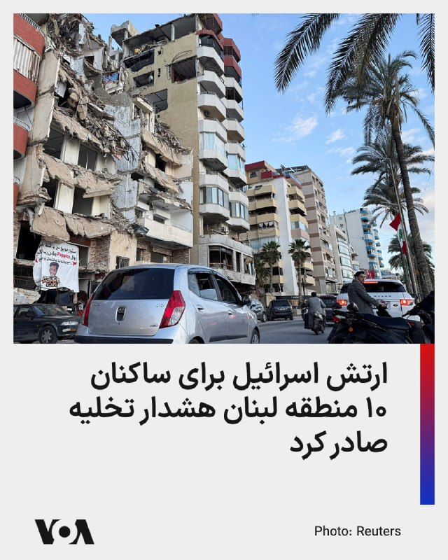

ارتش اسرائیل به ساکنان ۱۰ منطقه شامل شهر و روستا در جنوب لبنان هشدار داد که پیش از حملات هوایی علیه مواضع گروه حزب‌الله لبنان، این مناطق را تخلیه کنند.

ارتش اسرائیل صبح دوشنبه با انتشار بیانیه‌ای اسامی این مناطق را اعلام کرد و گفت که به ساکنان دستور داده شده است دست‌کم یک کیلومتر از محل سکونت خود فاصله بگیرند.

سرهنگ آویخای ادرعی، سخنگوی ارتش، هشدار داده است: «در پی نقض توافق آتش‌بس توسط سازمان تروریستی حزب‌الله، ارتش ناچار است با قدرت علیه آن اقدام کند و قصد آسیب رساندن به شما را ندارد.»

او افزود: «هر کسی که در نزدیکی عناصر حزب‌الله و تأسیسات و ابزارهای نظامی آن‌ها باشد، جان خود را در معرض خطر قرار می‌دهد.»

مارکو روبیو، وزیر خارجه آمریکا روز دوشنبه در جریان سفر به هند گفت: «اسرائیل همیشه حق دارد از خود دفاع کند. هر کشوری در جهان چنین حقی دارد. بنابراین اگر حزب‌الله قرار است به سوی آن‌ها موشک شلیک کند یا موشک شلیک می‌کند، اسرائیل کاملاً حق دارد به آن پاسخ دهد یا از وقوع آن جلوگیری کند.»
@FarsiVOA

## FarsiVOA — post 218597

  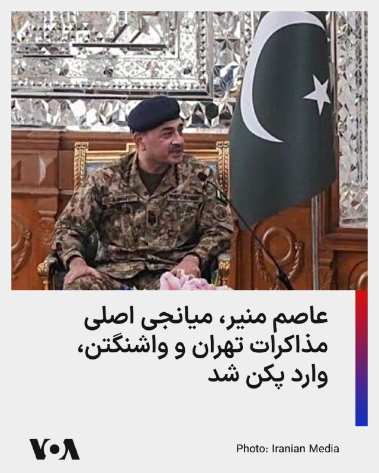

تلویزیون پاکستان گزارش داد که عاصم منیر، فرمانده ارتش پاکستان و میانجی اصلی مذاکرات جمهوری اسلامی و آمریکا، در جریان سفر رسمی شهباز شریف به چین، در پکن کنار نخست‌وزیر پاکستان حاضر شده و در گفت‌وگو با مقام‌های چینی شرکت کرده است.

شهباز شریف سفر رسمی چهارروزه خود به چین را روز شنبه از هانگژو آغاز کرده بود، اما تصاویر پخش‌شده از تلویزیون دولتی پاکستان نشان می‌دهد که عاصم منیر نیز در پکن در کنار او با رهبران چین دیدار کرده است.

بر اساس این گزارش، شریف در حضور عاصم منیر به مقام‌های چینی گفت پاکستان برای میانجی‌گری میان جمهوری اسلامی و آمریکا «نقشی صادقانه» ایفا کرده و از حمایت چین برای پیشبرد صلح قدردانی کرد.

عاصم منیر روزهای جمعه و شنبه در تهران بود و این سفر بخشی از تلاش‌های میانجی‌گرانه پاکستان برای پایان رسمی جنگ ایران عنوان شده است. حضور او در پکن، بلافاصله پس از رایزنی‌های تهران، نشان می‌دهد اسلام‌آباد تلاش دارد میانجی‌گری خود میان تهران و واشنگتن را با هماهنگی نزدیک‌تر با چین پیش ببرد.
@FarsiVOA

## FarsiVOA — post 218596

  

ارتش اسرائیل اعلام کرد هشدار مربوط به احتمال نفوذ پهپاد در منطقه عرب العرامشه در شمال اسرائیل پایان یافته و دیگر تهدید فوری شناسایی نمی‌شود.

به گزارش تایمز اسرائیل، آژیرها دقایقی پیش در این منطقه به صدا درآمده بود. ارتش اسرائیل می‌گوید یک «هدف هوایی مشکوک» شناسایی شد، اما بعداً تماس سامانه‌های رصد با آن از دست رفت؛ موضوعی که می‌تواند به خروج پهپاد از منطقه تحت پایش یا سقوط آن مربوط باشد.

براساس اعلام ارتش اسرائیل، این رویداد بدون گزارش زخمی پایان یافته است.
@FarsiVOA

## FarsiVOA — post 218595

🔺اکسیوس: ترامپ خواستار پیوستن کشورهای عرب به توافق ابراهیم پس از پایان جنگ شد

◾️اکسیوس گزارش داد دونالد ترامپ از رهبران چند کشور عربی خواسته است اگر توافقی برای پایان جنگ با جمهوری اسلامی حاصل شود، به روند توافق ابراهیم بپیوندند و روابط خود را با اسرائیل عادی کنند.

◾️بر اساس این گزارش، تماس ترامپ با رهبران عربستان، امارات، قطر، پاکستان، ترکیه، مصر، اردن و بحرین انجام شد و محور اصلی آن توافق در حال شکل‌گیری با جمهوری اسلامی بود.

◾️یک مقام آمریکایی به اکسیوس گفته است که رهبران حاضر در تماس روز شنبه اعلام کرده‌اند در صورت موفقیت یا شکست توافق، در کنار واشنگتن خواهند بود.

⬇️ بیشتر بخوانید:
https://ir.voanews.com/a/8153577.html

## FarsiVOA — post 218594

  

بلومبرگ گزارش داد یک خریدار کشتی‌های فرسوده گفته وزارت خزانه‌داری آمریکا اجازه داده چهار شناور تحریمی مرتبط با حمل محموله‌های ایران برای اوراق خریداری شوند.

بر اساس گزارش‌ها، شرکت جی‌ام‌اس مستقر در دبی، مجوز خرید چهار کشتی یوگی، تیمون، رانتانپلن و بیگلی را دریافت کرده است؛ شناورهایی که به شبکه کشتیرانی مرتبط با محمدحسین شمخانی نسبت داده شده‌اند. این شبکه از سوی آمریکا به انتقال نفت و کالاهای مرتبط با ایران متهم شده است.

این تصمیم در حالی گرفته شده که وزارت خزانه‌داری آمریکا اخیراً در چارچوب فشار حداکثری تازه، ۱۹ کشتی و بیش از ۵۰ فرد و شرکت مرتبط با تجارت نفت و پتروشیمی ایران را تحریم کرده بود.

مالکان ناشناس این کشتی‌ها می‌توانند از ارزش آهن‌قراضه آنها میلیون‌ها دلار دریافت کنند و واشنگتن می‌گوید خروج کنترل‌شده کشتی‌های فرسوده از «ناوگان سایه» می‌تواند ریسک‌های ایمنی و زیست‌محیطی را کاهش دهد.
@FarsiVOA

## FarsiVOA — post 218593

  

قیمت طلا روز دوشنبه همزمان با افت دلار و کاهش شدید بهای نفت افزایش یافت؛ نشانه‌ای از بازاری که هنوز میان امید به توافق آمریکا و جمهوری اسلامی و تردید درباره پایداری آن در نوسان است.

رویترز گزارش داد بهای هر اونس طلا بیش از یک درصد بالا رفت و به حدود ۴ هزار و ۵۵۹ دلار رسید. تضعیف دلار، خرید طلا را برای دارندگان ارزهای دیگر ارزان‌تر کرد و افت نفت نیز بخشی از نگرانی‌های تورمی را کاهش داد.

همزمان، نفت برنت حدود ۶ درصد سقوط کرد و به محدوده ۹۸ دلار رسید؛ نفت خام آمریکا نیز به حدود ۹۱ دلار کاهش یافت. علت اصلی افت نفت، امید بازار به پیشرفت در توافقی است که می‌تواند مسیر تنگه هرمز و صادرات انرژی خلیج فارس را تا حدی باز کند.

با این حال، رشد طلا نشان می‌دهد سرمایه‌گذاران هنوز پایان بحران را قطعی نمی‌دانند.
@FarsiVOA

## FarsiVOA — post 218592

🔺مقام ارشد آمریکا: ایران پشت‌پرده برای واگذاری اورانیوم غنی‌شده، تعهد داده است

◾️یک مقام ارشد دولت ترامپ اعلام کرد رژیم ایران «پشت‌پرده» تعهداتی در زمینه واگذاری اورانیوم غنی‌شده داده و جمهوری اسلامی بدون اجرای این تعهدات، دستاورد چندانی از مذاکرات نخواهد داشت.

◾️به گزارش نیویورک‌پست، این مقام آمریکایی که با خبرنگاران صحبت می‌کرد، درباره روند مذاکرات برای دستیابی به یک توافق احتمالی با تهران گفت: «۹۵ درصد کار انجام شده، اما در سیستم آن‌ها حتی تغییر واژه‌ها هم مستلزم چند روز بررسی و مشورت است.»

◾️این منبع ارشد دست‌کم دو بار برای خبرنگاران توضیح داد که توافق قریب‌الوقوع نیست و قرار نیست انتقال پول نقد شبیه انتقال پول نقد به ایران در سال ۲۰۱۶ در دوران باراک اوباما رخ دهد.

⬇️ بیشتر بخوانید:
https://ir.voanews.com/a/8153576.html

## FarsiVOA — post 218591

  

ارتش اسرائیل اعلام کرد نیروهای این کشور در جریان عملیاتی در جنوب، لؤی هشام محمود بصل، عضو سازمان تروریستی حماس را که در حمله به پایگاه زیکیم در جریان کشتار هفتم اکتبر نقش داشت، از پا درآوردند.

بر اساس اعلام ارتش اسرائیل، بصل به‌عنوان تک‌تیرانداز در گردان زیتون حماس فعالیت می‌کرد و در روزهای اخیر نیز برای اجرای حملات تروریستی علیه نیروهای اسرائیلی در منطقه برنامه‌ریزی می‌کرد.

ارتش اسرائیل گفته است این عملیات برای رفع یک تهدید فوری انجام شده و نیروهای این کشور در چارچوب توافق موجود در منطقه مستقر هستند و به مقابله با هرگونه تهدید فوری ادامه خواهند داد.
@FarsiVOA

## FarsiVOA — post 218590

  

بر اساس آمار شرکت مدیریت منابع آب ایران، ‌هم‌اکنون میزان پرشدگی پنج صد مهم کشور از جمله «سدهای لار، دوستی، پانزدهم خرداد، بارزو و ساوه» کمتر از ۱۰ درصد است.

خبرگزاری ایسنا با تحلیل این آمار، اعلام کرد که علیرغم افزایش موجودی مخازن سدهای غربی، استان‌های تهران، مرکزی، خراسان رضوی، قم، اصفهان، زنجان و همدان در وضعیت نامطلوبی قرار دارند.

بر این اساس تامین آب شرب در شهرهای تهران، کرج، مشهد، اراک، قم، اصفهان، یزد، زنجان و همدان، با محدودیت مواجه است.

پیشتر علیرضا شریعت، دبیرکل فدراسیون صنعت آب ایران، هشدار داده بود که در صورت عدم کاهش مصرف، با بحران مهاجرت اجباری ۱۵ میلیون نفر در فلات مرکزی ایران مواجه خواهیم شد.

فلات مرکزی ایران شامل هفت استان کرمان، فارس، اصفهان، یزد، مرکزی، قم و سمنان می‌شود.
@FarsiVOA

## DW_Farsi — post 125130

🔶 میلیون‌ها زائر مسلمان به رغم جنگ ایران راهی مکه شده‌اند

روز دوشنبه ۲۵ مه (۴ خرداد) مناسک حج برای بسیاری از مسلمانان سراسر جهان آغاز می‌شود.

جنگ ایران امنیت کشورهای حوزه خلیج فارس را به خطر افکنده و به همین دلیل پیش‌‌تر هشدارهایی در زمینه مراسم حج صادر شده بود. اما به رغم این تهدیدات، برخی مسلمانان جهان امسال نیز از سفر زیارتی به مکه چشم‌پوشی نکرده‌اند.

طبق اعلام مقامات عربستان سعودی، تا پایان هفته‌ای که گذشت بیش از یک‌ونیم میلیون نفر برای شرکت در حج وارد این شهر شده‌اند که این شمار نشان‌گر افزایش تعداد زائران بین‌المللی حج نسبت به سال گذشته است.

@dw_farsi

## DW_Farsi — post 125129

🔸 عقب‌نشینی اردوغان از تعطیلی یک دانشگاه لیبرال در استانبول

پس از اعتراض صدها دانشجو، رجب طیب اردوغان، رئیس جمهور ترکیه، دستور جنجالی خود درباره تعطیلی دانشگاه خصوصی "بیلگی" استانبول را لغو کرد. فرمان مربوط به این تصمیم روز یکشنبه ۲۴ مه (سوم خرداد) در روزنامه رسمی ترکیه منتشر شد.
این فرمان تصمیمی را لغو کرده است که اردوغان از روز جمعه گذشته اجرایی کرده بود؛ تصمیمی که بر اساس آن بایستی این دانشگاه معتبر با گرایش‌های لیبرال تعطیل می‌شد. رسانه‌های ترکیه از جمله روزنامه "ترکیه" درباره این تحول جدید گزارش داده‌اند.
رئیس جمهور ترکیه تصمیم اولیه خود را با "ناکافی" خواندن سطح آموزشی این مؤسسه توجیه کرده بود. تعطیلی موقت این دانشگاه تنها یک ماه پیش از برگزاری امتحانات نهایی برنامه‌ریزی‌شده برای ماه ژوئن صورت گرفته بود.

نزدیک به هزار دانشجو و شماری از استادان، روز یکشنبه در محوطه دانشگاه علیه لغو مجوز فعالیت آن دست به اعتراض زده بودند.

در جریان این اعتراضات، ده‌ها دانشجو ساختمان دانشگاه بیلگی را اشغال کردند، اما توسط مأموران پلیس از ساختمان بیرون برده شدند.

به گفته یکی از شرکت‌کنندگان در این حرکت اعتراضی، نیروهای پلیس دست و پای دانشجویان را گرفته و از ساختمان بیرون انداختند. در جریان این برخوردها، بینی یکی از دانشجویان نیز شکست.

در دانشگاه خصوصی بیلگی که در سال ۱۹۹۶ تأسیس شده است، بیش از ۲۰ هزار دانشجوی ترک و خارجی تحصیل می‌کنند. این مرکز آموزشی در برنامه تبادل دانشجوی "اراسموس" اتحادیه اروپا نیز مشارکت دارد.

📌 برای دسترسی کامل به گزارش به وبسایت دویچه‌وله فارسی مراجعه کنید.
@dw_farsi

## DW_Farsi — post 125128

  

🔸 رئیس جمهور لبنان: خروج نیروهای اسرائیلی غیرقابل مذاکره است

جوزف عون، رئیس جمهور لبنان، می‌گوید عقب‌نشینی اسرائیل از جنوب این کشور "یک خواسته غیرقابل مذاکره" است که مقامات لبنانی آن را در قالب گفت‌وگوها پیگیری خواهند کرد.
عون در بیانیه‌ای به مناسبت بزرگداشت عقب‌نشینی اسرائیل از اشغال جنوب لبنان در ۲۵ مه ۲۰۰۰ گفت: «امسال، سالگرد آزادسازی در حالی فرا می‌رسد که لبنان زیر بار یک واقعیت دردناک کمر خم کرده است.»
او افزود: «حملات اسرائیل متوقف نشده است و روستاهای عزیز جنوبی ما هنوز از اشغال مجدد رنج می‌برند.»
به گفته عون، "لبنان این واقعیت را نخواهد پذیرفت".
او تصریح کرد: «مسیر خروج کامل اسرائیل همچنان یک مطالبه ملی پایدار و بدون مصالحه خواهد بود که دولت لبنان برای دستیابی به آن از طریق گزینه مذاکره تلاش می‌کند.»
مقامات اسرائیلی گفته‌اند که نیروهای این کشور "تا زمان رفع تهدید حزب‌الله" در جنوب لبنان باقی خواهند ماند.
@dw_farsi

## DW_Farsi — post 125127

  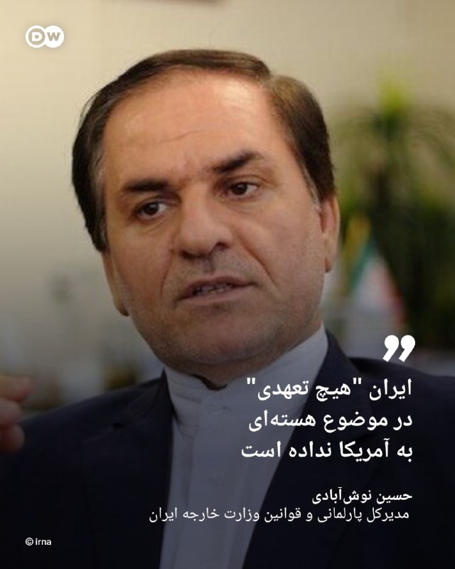

🔸 ایران می‌گوید "هیچ تعهدی" در موضوع هسته‌ای به آمریکا نداده است

حسین نوش‌آبادی، مدیرکل پارلمانی و قوانین وزارت خارجه ایران، روز دوشنبه ۴ خرداد (۲۵ مه) در گفت‌وگو با خبرگزاری ایسنا گفت ایران هیچ تعهدی در پیش‌نویس توافق‌ اولیه با آمریکا در موضوع هسته‌ای و اورانیوم با غنای بالا به طرف مقابل نداده است.

او همچنین آنچه "شایعه تعلیق ۲۰ ساله غنی‌سازی" نامید را کذب محض دانست.

نوش‌آبادی درباره مفاد پیش‌نویس پیشنهادی ایران افزود: «پایان جنگ در همه جبهه‌ها از جمله لبنان، آزاد شدن میلیاردها دلار از دارایی‌های مسدود شده ایران، لغو محاصره دریایی آمریکا و گشایش تنگه هرمز، خروج نیروهای آمریکایی از محیط پیرامونی جمهوری اسلامی و آزادی فروش نفت ایران در تفاهم احتمالی بین ایران و آمریکا در نظر گرفته شده است.»

به گفته مدیرکل پارلمانی وزارت خارجه ایران، بر اساس توافق اولیه، طرفین ۳۰ روز فرصت خواهند داشت تا درباره مسائل دیگر به توافق نهایی برسند که این مهلت تا ۶۰ روز قابل تمدید است.

نوش‌آبادی همچنین موضوع مدیریت تنگه هرمز را "یک موضوع ایرانی عمانی" دانست و گفت که جمهوری اسلامی ایران در حال مذاکره با طرف عمانی است.
@dw_farsi

## DW_Farsi — post 125126

🔸 اسرائیل زیر فشار حملات پهپادهای ارزان‌قیمت

ویدیویی منتشرشده در فضای مجازی به‌سختی می‌توانست نمادین‌تر از این باشد: یک پهپاد حامل مواد منفجره به یک سامانه گنبد آهنین اسرائیل اصابت می‌کند. سامانه دفاع هوایی مشهور و میلیارد دلاری اسرائیل هدف وسیله‌ای قرار می‌گیرد که بهای آن به زحمت از چند صد یورو فراتر می‌رود. این ویدیو تاکنون به‌طور قطعی تأیید نشده است، اما کارشناسان آن را واقعی می‌دانند.

ویدیوی یادشده حدود یک هفته پیش توسط شبه‌نظامیان حزب‌الله مورد حمایت ایران، که از جمله از سوی آلمان، آمریکا و چندین کشور عربی سنی‌مذهب به عنوان سازمانی تروریستی طبقه‌بندی شده، در شبکه‌های اجتماعی منتشر شد. این رخداد برای حزب‌الله یک پیروزی تبلیغاتی بزرگ به شمار می‌رود و ارتش اسرائیل بیش از هر زمان دیگری در سال‌های اخیر آسیب‌پذیر به نظر می‌رسد.

حزب‌الله لبنان از ماه مارس گذشته بیش از پیش از پهپادهای موسوم به "نمای اول‌شخص" (FPV) استفاده می‌کند؛ پهپادهایی که امکان مشاهده لحظه‌‌ای هدف را به هدایت‌کننده می‌دهند. در جریان این حملات چندین سرباز اسرائیلی کشته و تعداد بیشتری زخمی شده‌اند.

اما آنچه کارشناسان نظامی اسرائیلی را بیش از هر چیز نگران کرده، این است که شمار فزاینده‌ای از این پهپادها دیگر نه از طریق امواج رادیویی، بلکه از راه کابل‌های فیبر نوری هدایت می‌شوند. سیگنال‌های آنها از طریق کابل‌های باریکی به هدایت‌گر منتقل می‌شود که پهپاد هنگام حرکت آنها را از روی یک قرقره پشت سر خود باز می‌کند. نتیجه این‌که، هم ردیابی این پهپادها و هم مختل کردن ارتباطات آنها، موسوم به "جمینگ"، با ابزارهای کلاسیک جنگ الکترونیک تقریباً غیرممکن است.

در جنگ اوکراین، این پهپادهای فیبر نوری از سال ۲۰۲۴ در مقیاس وسیع از سوی کی‌یف و مسکو به کار گرفته شده‌اند. بسیاری از اقدامات برای مقابله با آنها نیز تاکنون بیشتر حالتی بداهه و موقتی داشته است.

📌 برای دسترسی کامل به گزارش به وبسایت دویچه‌وله فارسی مراجعه کنید.
@dw_farsi

## DW_Farsi — post 125125

  

🔸 چهار متهم پرونده اکباتان به اعدام محکوم شدند

ارگان خبری مجموعه فعالان حقوق بشر در ایران (هرانا) گزارش داد که شعبه ۱۵ دادگاه انقلاب تهران به ریاست ابوالقاسم صلواتی، چهار متهم پرونده اکباتان تهران و از بازداشت شدگان اعتراضات سراسری ۱۴۰۱، به نام‌های میلاد آرمون، نوید نجاران، مهدی ایمانی و محمدمهدی حسینی را به اتهام "محاربه" به اعدام محکوم کرده است.

صدور این حکم علیه این چهار جوان در حالی است که پیش‌تر احکام اعدام صادرشده از سوی دادگاه کیفری به اتهام مشارکت در قتل عمد، از سوی دیوان عالی کشور رد شده و پس از بررسی مجدد در شعبه بدوی به حبس و پرداخت دیه تغییر کرده بود.

آنگونه که هرانا نوشته، امیرمحمد خوش‌اقبال، علیرضا برمرز پورناک، علیرضا کفایی و حسین نعمتی دیگر متهمان این پرونده نیز هرکدام به پنج سال زندان از بابت اتهام اجتماع و تبانی، دوسال حبس از بابت تبلیغ علیه نظام، دو سال منع فعالیت در فضای مجازی و دو سال منع اسکان در تهران و البرز محکوم شده‌اند.
@dw_farsi

## DW_Farsi — post 125124

  

🔶 سومین نفتکش حامل گازمایع قطر از طریق تنگه هرمز در مسیر چین است

داده‌های ردیابی کشتی‌ها در روز جمعه ۲۲ مه (۱ خرداد) نشان داد که سومین نفتکش حامل گاز طبیعی مایع قطر در حال عبور از تنگه هرمز و حرکت به سمت چین است.

این در شرایطی است که یک تیم مذاکره‌کننده قطری برای کمک به دستیابی به توافقی برای پایان دادن به جنگ با ایران وارد تهران شده است.

ارسال محموله‌ها از طریق این آبراه مهم بین‌المللی همچنان نامنظم است و این سومین ترانزیت یک تانکر گاز مایع قطری تقریباً دو هفته پس از عبور اولین محموله از این تنگه تحت توافق ایران و پاکستان به شمار می‌رود.

طبق داده‌های کشتیرانی LSEG، این کشتی با نام السهله، با ظرفیت ۲۱۱ هزار و ۲۸۴ متر مکعب، منطقه رأس لفان در قطر را ترک کرده و انتظار می‌رود در روز شنبه ۱۴ ژوئن (۲۴ خرداد)‌ به ترمینال گاز مایع تیانجین چین برسد.

به گفته این منابع، ایران اجازه عبور این محموله را برای کمک به ایجاد اعتماد میان قطر و پاکستان که در حال میانجیگری در مذاکرات صلح هستند، صادر کرده است.
@dw_farsi

## DW_Farsi — post 125123

  

🔶 ایران می‌گوید علیرغم پیشرفت، توافق با آمریکا "قریب‌الوقوع" نیست

اسماعیل بقایی، سخنگوی وزارت امور خارجه ایران، روز دوشنبه ۴ خرداد (۲۵ مه) هشدار داد که با وجود پیشرفت تهران و واشنگتن در "بخش بزرگی از مسائل" در تبادلاتشان، توافق با ایالات متحده برای پایان دادن به جنگ "قریب‌الوقوع" نیست.

مارکو روبیو، وزیر امور خارجه ایالات متحده، پیش از این گفته بود که توافق می‌تواند "امروز" [دوشنبه چهارم خرداد] محقق شود.

بقایی تصریح کرد: «در بخش زیادی از موضوعات مورد گفت‌وگو، ما به یک جمع‌بندی رسیده‌ایم و این یک امر درستی است ولی این‌که بخواهیم بگوییم امضای توافق قریب الوقوع است، کسی نمی‌تواند چنین ادعایی بکند.»

سخنگوی وزارت امور خارجه ایران همچنین با تاکید بر اینکه تمرکز مذاکرات بر "خاتمه جنگ" است گفت: «در این مرحله درباره جزئیات موضوع هسته‌ای صحبتی نداریم.»

بقایی افزود: «تهدیدها، فشارها، کاریکاتور منتشر کردن بخشی از سیاست‌ورزی در آن طرف دنیاست. ما کار خود را در میدان عمل دنبال می‌کنیم.»
@dw_farsi

## DW_Farsi — post 125122

  

🔶 "مصادره اموال و اخراج هزاران شیعه پاکستانی" از امارات در جنگ ایران

خبرگزاری رویترز در گزارشی نوشت"هزاران شیعه" پاکستانی در طول جنگ ایران از امارات متحده عربی به پاکستان اخراج شده‌‌اند. به نوشته رویترز این امر باعث نگرانی جامعه شیعیان پاکستان شده و دیده‌بان حقوق بشر را بر آن داشته است تا در این مورد تحقیق کند.

رویترز اسناد مهاجرت، ویزا و جزئیات پرواز ۱۰۳ پاکستانی را که گفته بودند شیعه اخراج شده هستند، بررسی و با ۲۴ نفر از آنها مصاحبه کرده است. مصاحبه‌شوندگان گفته‌اند که پیش از سوار شدن به هواپیما حتی نتوانسته‌اند چمدان یا پس‌انداز خود را پس بگیرند.

بانک اطلاعاتی که توسط سازمان سیاسی شیعه پاکستانی "مجلس وحدت مسلمین" گردآوری شده و توسط رویترز مشاهده شده است، نشان می‌دهد ۷ هزار و ۵۰۰ شیعه پاکستانی از ۲۸ فوریه (۹ اسفند ۱۴۰۴)، همزمان با آغاز حمله آمریکا و اسرائیل به ایران، از این کشور عربی حاشیه خلیج فارس اخراج شده‌اند.
@dw_farsi

## DW_Farsi — post 125121

🔶 گزارش سیپری؛ ماموریت‌های صلح در تنگنای بودجه و نیروی انسانی

سال ۲۰۲۵ سال خوبی برای ماموریت‌های بین‌المللی صلح نبوده است. طبق گزارش جدید مؤسسه پژوهش‌های صلح استکهلم "سیپری" (SIPRI)، شمار این مأموریت‌ها اندکی کاهش یافته است. در حدود ۲۵ سال گذشته، هرگز شمار نیروهای بین‌المللی فعال در عرصه صلح تا این اندازه کم نبوده است.

تا پایان ماه دسامبر گذشته، مجموعاً نزدیک به ۷۹ هزار نفر در این مأموریت‌ها حضور داشتند؛ رقمی که شامل نیروهای نظامی، نیروهای پلیس و کارکنان غیرنظامی می‌شود. بر اساس این گزارش، تنها طی ده سال گذشته شمار آنها تقریباً به نصف کاهش یافته است.

کلودیا فایفر کروز، پژوهشگر مؤسسه سیپری، به کانال اول تلویزیون آلمان (ARD) گفته است که دلایل مختلفی برای این وضعیت وجود دارد.

به گزارش کانال اول تلویزیون آلمان، در شورای امنیت سازمان ملل، قدرت‌های دارای حق وتو بیش از پیش مانع یکدیگر می‌شوند و در سازمان‌های منطقه‌ای مانند اتحادیه آفریقا نیز مشکلات مشابهی وجود دارد.

افزون بر این، سازمان‌های بین‌المللی مانند سازمان ملل متحد نیز با کمبود بودجه روبه‌رو هستند؛ به‌گونه‌ای‌که در سال ۲۰۲۵ بیش از دو میلیارد دلار کسری بودجه داشته‌اند.

طبق همین گزارش، دیگر کشورهای بزرگ تأمین‌کننده بودجه این مأموریت‌ها، از جمله چین، نیز یا سهم خود را پرداخت نکرده‌اند یا با تأخیر پرداخت کرده‌اند. در نتیجه، تمامی ماموریت‌های سازمان ملل به‌ناچار فعالیت‌های خود را محدود و شمار کارکنانشان را کاهش داده‌اند.

📌 برای دسترسی کامل به گزارش به وبسایت دویچه‌وله فارسی مراجعه کنید.
@dw_farsi

## DW_Farsi — post 125120

  

🔶 محمدباقر قالیباف برای هفتمین بار رئیس مجلس شورای اسلامی شد

محمدباقر قالیباف در انتخابات هیئت رئیسه مجلس شورای اسلامی که صبح روز دوشنبه ۴ خرداد (۲۵ مه) برگزار شد، برای هفتمین سال متوالی به عنوان رئیس مجلس انتخاب شد.

قالیباف ۶۴ ساله، به عنوان سیاستمداری با نفوذ در ساختار سپاه پاسداران انقلاب اسلامی شناخته می‌شود. به ویژه پس از کشته شدن علی خامنه‌ای، علی لاریجانی و شمار دیگری از مقامات ارشد جمهوری اسلامی و تغییر ساختار قدرت، نام او به عنوان یکی از تصمیم‌گیران اصلی در پیشبرد سیاست‌های نظام و مذاکره با آمریکا مطرح شده است.

محمدباقر قالیباف بارها برای انتخابات ریاست جمهوری نامزد شد. او در سال ۱۳۸۴ نامزد شد اما از محمود احمدی‌نژاد شکست خورد. پس از آن به عنوان شهردار تهران منصوب شد و از سال ۱۳۸۴ تا ۱۳۹۶ این سمت را در اختیار داشت.

او در سال ۱۳۹۲ بار دیگر نامزد انتخابات ریاست جمهوری شد اما از حسن روحانی شکست خورد و در سال ۹۶ نیز پیش از برگزاری انتخابات به نفع ابراهیم رئیسی کناره‌گیری کرد.

نام قالیباف با فسادهای مالی خود و خانواده‌اش و نقش او در سرکوب جنبش‌های سیاسی و مدنی در ایران نیز گره خورده است.
@dw_farsi

## DW_Farsi — post 125119

  

🔶 لیندزی گراهام از ترامپ خواست در توافق با ایران به تعهداتش "پایبند" باشد

لیندزی گراهام، سناتور جمهوری‌خواه از ایالت کارولینای جنوبی، روز یکشنبه ۲۴ مه (۳ خرداد) از دونالد ترامپ، رئیس‌جمهور آمریکا، خواست تا در حالی که واشنگتن به تلاش برای نهایی کردن توافق با تهران بر سر جنگ ادامه می‌دهد، ثابت قدم بماند.

گراهام در پستی در شبکه اجتماعی ایکس نوشت: «اگر در واقع، در نتیجه این مذاکرات برای پایان دادن به درگیری با ایران، متحدان عرب و مسلمان ما در منطقه با پیوستن به پیمان ابراهیم موافقت کنند، این توافق‌نامه به یکی از مهم‌ترین توافق‌نامه‌ها در تاریخ خاورمیانه تبدیل خواهد شد.»

گراهام همچنین به اظهارات قبلی ترامپ در مورد پیوستن عربستان سعودی، قطر و پاکستان به پیمان ابراهیم اشاره کرد و پیشنهاد او را "فراتر از یک تغییر اساسی برای منطقه و جهان" خواند. او گفت: «این یک اقدام درخشان از سوی رئیس‌ جمهور ترامپ است.»

گراهام خطاب به ترامپ نیز نوشت: «رئیس جمهور ترامپ، برای رسیدن به یک توافق خوب با ایران، به مواضع خود پایبند باشید.»
@dw_farsi

## DW_Farsi — post 125118

  

📸عکس روز: فانوس‌های آرزو در جشن تولد بودا

همزمان با جشن تولد بودا، فانوس‌های رنگارنگ در معبد "جوگیه" در شهر سئول روشن شده‌اند. در این آیین سنتی، به هرکدام از فانوس‌ها کارتی همراه با آرزوهای پیروان بودا آویزان شده که نمادی از امید، آرامش و دعا برای آینده است.
جشن تولد بودا یکی از مهم‌ترین مناسبت‌های مذهبی در کره‌جنوبی به شمار می‌رود و هر سال هزاران نفر را به معابد تاریخی این کشور می‌کشاند.
@dw_farsi

## DW_Farsi — post 125117

  

🔶 تهدید ایران به شکستن محاصره دریایی تنگه هرمز و خروج از ان‌پی‌تی

محسن رضایی، مشاور نظامی مجتبی خامنه‌ای، روز یکشنبه سوم خرداد (۲۴ مه) گفت که مدیریت تنگه هرمز "حق قانونی" تهران برای تضمین امنیت ملی است. او مدعی شد: «مدیریت ایران بر تنگه هرمز به ۵۰ سال ناامنی در خلیج فارس پایان می‌دهد.»

رضایی، که تحت تحریم‌های ایالات متحده قرار دارد، همچنین گفت که ایران "دلایل محکمی" برای حفظ کنترل تنگه دارد و ادعا کرد که هدف تهران جلوگیری از تبدیل شدن خلیج فارس به مرکزی برای استقرار نظامی و بی‌ثباتی است.

اظهارات محسن رضایی روز یکشنبه توسط خبرگزاری مهر، نزدیک به سپاه پاسداران، منتشر شد.

در همین حال، ابراهیم ذوالفقاری، سخنگوی قرارگاه خاتم الانبیاء، هشدار داد که اگر تنگه هرمز مورد حمله قرار گیرد، نیروهای نظامی جمهوری اسلامی محاصره بنادر ایران توسط ایالات متحده را خواهند شکست.

ذوالفقاری همچنین تهدید به "خروج ایران از پیمان منع گسترش سلاح‌های هسته‌ای" کرد. او گفت: «اگر دشمن به تنگه هرمز حمله کند، ما محاصره دریایی را خواهیم شکست و ممکن است از پیمان منع گسترش سلاح‌های هسته‌ای (ان‌پی‌تی) خارج شویم.»
@dw_farsi

## DW_Farsi — post 125116

  

🔶 نعیم قاسم: خلع سلاح به معنای نابودی است و ما نمی‌توانیم آن را بپذیریم

نعیم قاسم، دبیرکل حزب‌الله، در یک سخنرانی به مناسبت "روز مقاومت و آزادسازی" که یادآور عقب‌نشینی نیروهای ارتش اسرائیل از اشغال جنوب لبنان در ۲۵ مه ۲۰۰۰ است، درخواست خلع سلاح این گروه را محکوم کرد.

او گفت: «چیزی به نام انحصار سلاح یا خلع سلاح حزب‌الله وجود ندارد.»

قاسم همچنین افزود، خلع سلاح حزب‌الله "توان دفاعی لبنان و توان مقاومت و مردم آن را به عنوان مقدمه‌ای برای نابودی" از بین می‌برد. او افزود: «خلع سلاح به معنای نابودی است و این چیزی است که ما نمی‌توانیم بپذیریم.»

نعیم قاسم همچنین ضمن برشمردن چندین حمله به سربازان ارتش اسرائیل، از پهپادهای انتحاری دید اول شخص (FPV) حزب‌الله که به گفته او باعث "گیج‌شدن" اسرائیل شده‌اند، تمجید کرد. او ادعا کرد که این حملات منجر به کشته شدن چندین افسر اسرائیلی شده است، در حالی که ارتش اسرائیل اعلام کرده است که آنها زخمی شده‌اند.

دبیرکل حزب‌الله همچنین ایالات متحده را محکوم کرد و گفت که این کشور نه میانجی است و نه بازیگری صادق، زیرا "اسرائیل را بر اساس منافع خود مدیریت می‌کند".
@dw_farsi

## DW_Farsi — post 125115

  

🔶 بالا نگه داشتن سطح هشدار ارتش اسرائیل همزمان با کاهش نیروهای ذخیره

در بحبوحه انتشار اخبار لحظه به لحظه در مورد "پیشرفت" مذاکرات بین ایالات متحده و ایران، افسران ارشد ارتش اسرائیل روز یکشنبه ۲۴ ماه (۳ خرداد) تأیید کردند که چندین شاخه از ارتش، تعداد سربازان ذخیره را در ستاد کل کاهش داده‌اند.

به گزارش "جروزالم پست" برخی از افسران پیامی دریافت کردند مبنی بر اینکه باید "نسبت به هرگونه درخواست برای بازگشت به خدمت هوشیار و گوش به زنگ باشند"، اما مجبور نیستند به ستاد بیایند.

شلومی بیندر، رئیس اداره اطلاعات ارتش اسرائیل، هدایت عملیات جمع‌آوری اطلاعات برای ایجاد تصویری روشن از تلاش‌های ایران برای بازسازی قابلیت‌های نظامی آسیب‌دیده‌اش را بر عهده دارد.

طبق این گزارش، افسران ارشد ارتش اسرائیل ادعا می‌کنند که بنا بر ارزیابی آنها، رده سیاسی اسرائیل از هسته مذاکرات ایالات متحده و ایران کنار گذاشته شده است.

در شرایط کنونی و با وجود سیگنال‌های متناقض طرفین، مشخص نیست که آیا واقعاً پیشرفتی در مذاکرات حاصل شده است یا اینکه هرکدام از طرفین صرفا در تلاش برای افزایش فشار بر طرف مقابل است.
@dw_farsi

## DW_Farsi — post 125114

  

🔶 کاهش قیمت نفت به دنبال چشم‌اندازی برای توافق آمریکا با ایران

امیدها برای دستیابی به یک توافق صلح بین ایالات متحده و ایران، قیمت نفت را به پایین‌ترین سطح خود در بیش از دو هفته گذشته رسانده است.

نفت خام برنت دریای شمال با ۴.۵۵ درصد کاهش به ۹۸.۸۳ دلار در هر بشکه رسید، در حالی که نفت خام وست تگزاس اینترمدیت (WTI) با ۴.۷۳ درصد کاهش به ۹۲.۰۳ دلار رسید. این نرخ پایین‌ترین سطح از ۷ مه (۱۷ اردیبهشت) تا کنون است. با این حال، چشم‌انداز توافق سریع پس از سیگنال‌های متناقض از سوی واشنگتن همچنان نامشخص است.

کارشناسان پیش‌بینی می‌کنند که بحران انرژی ناشی از جنگ ایران ادامه خواهد یافت.

یکی از موضوعات مورد اختلاف، همچنان حاکمیت بر تنگه هرمز است؛ آبراهی کلیدی که از طریق آن پیش از جنگ یک پنجم نفت و گاز مایع جهان منتقل می‌شد. رئیس شرکت ملی نفت ابوظبی هفته گذشته هشدار داد که حتی در صورت پایان فوری جنگ، ترافیک کشتیرانی در این تنگه حداقل تا سال ۲۰۲۷ به سطح عادی خود باز نخواهد گشت.
@dw_farsi

## DW_Farsi — post 125113

  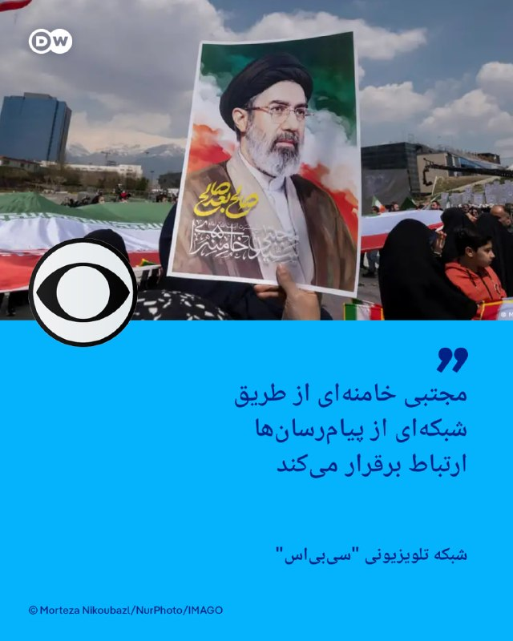

🔶 سی‌بی‌اس: مجتبی خامنه‌ای از طریق شبکه‌ای از پیام‌رسان‌ها ارتباط برقرار می‌کند

مقامات آمریکایی به نقل از نهادهای اطلاعاتی آمریکا به شبکه تلویزیونی "سی‌بی‌اس" گفتند که مجتبی خامنه‌ای، رهبر جمهوری اسلامی، در مکانی مخفی پنهان شده و از طریق شبکه‌ای پیچیده از پیام‌رسان‌ها ارتباط برقرار می‌کند.

این گزارش می‌گوید اقدامات احتیاطی که برای جلوگیری از ترور خامنه‌ای توسط اسرائیل در نظر گرفته شده، باعث تأخیر در مذاکرات آمریکا و ایران برای پایان دادن به جنگ می‌شود. گزارش می‌افزاید که حتی مقامات ارشد جمهوری اسلامی نیز نمی‌توانند مستقیماً با مجتبی خامنه‌ای تماس بگیرند.

یک مقام آمریکایی به این شبکه گفت: «به همین دلیل است که می‌بینید افرادی چیزهایی مانند "رهبر معظم انقلاب با چارچوب موافقت کرده است" یا "ما منتظر شنیدن نظرات در مورد نکات نهایی توافق هستیم"، می‌گویند. هر اطلاعاتی که او دریافت می‌کند، تاریخ‌دار است و پاسخ‌های او با تأخیر زیادی همراه است.»
@dw_farsi

## DW_Farsi — post 125112

🔶 جام ۱۹۸۲؛ زیکو، "جوجه‌ای" که به "پله سفید" شهرت یافت

🔺 گزارشی از شهرام احدی

در تاریخ جام جهانی فوتبال بازندگانی بوده‌اند که بخت با آنان یار نبوده و برخلاف آنچه که شاید سزاوار آن بوده باشند، از دور مسابقات حذف شده‌اند:

ناکامی مجارستان در برابر آلمان در فینال جام جهانی ۱۹۵۴، شکست آلمان‌ها در برابر لاجوردی‌های ایتالیا در نیمه‌نهایی ۱۹۷۰ مکزیک و ناکامی فرانسویان در سال‌های ۱۹۸۲ و ۱۹۸۶ در مقابل آلمان در مرحله نیمه‌نهایی، نمونه‌هایی از این دست هستند.

اما شاید ناکامی یک تیم تلخ‌تر و ناسزاوارتر از همه بوده باشد: خداحافظی غمگین رقصندگان برزیل از جام جهانی ۱۹۸۲.

زیکو و یارانش که در مرحله‌ی دوم، آرژانتین و ستاره‌اش مارادونا را ۳ بر یک به زانو درآورده بودند، در بازی بعدی‌شان تنها به تساوی در برابر ایتالیا نیاز داشتند. آنان در دقیقه ۶۸ به گل تساوی دست یافتند و به جای آنکه در پی حفظ نتیجه برآیند، به حملات و هنرنمایی‌های خود ادامه دادند.

گل پائولو روسی، مهاجم زهردار ایتالیا، در دقیقه ۷۵ اما رویای فوتبال‌دوستان را که شیفته زیبایی بازی برزیل شده بودند، نقش بر آب کرد.

📌 برای دسترسی کامل به گزارش به وبسایت دویچه‌وله فارسی مراجعه کنید.
@dw_farsi

## DW_Farsi — post 125111

  

🔶 قوه قضائیه عباس اکبری را به اتهام "لیدری مسلحانه" اعتراضات دی‌ماه اعدام کرد

خبرگزاری میزان، وابسته به قوه قضائیه جمهوری اسلامی، از اعدام عباس اکبری فیض‌آبادی در بامداد دوشنبه چهارم خرداد (۲۵ مه) به اتهام "لیدری مسلحانه و تیراندازی به سوی نیروهای حافظ امنیت" خبر داد.

در این گزارش ادعا شده که عباس اکبری "یکی از لیدر‌های مسلح" اعتراضات در شهرستان نائین اصفهان بوده و "نقش مهمی در حمله به فرمانداری شهرستان و مراکز تأمین امنیت و همچنین مراکز خدماتی" داشته است.

میزان مدعی شده است که عباس اکبری "بر اساس اسناد و تصاویر موجود در پرونده، به‌صورت مسلح در خیابان حضور یافته و اقدام به تیراندازی به سمت ماموران حافظ امنیت" کرده است.

این خبرگزاری همچنین ویدیویی منتسب به عباس اکبری با عنوان "تصاویر دوربین مدار بسته از تیر اندازی، حمله و تخریب اماکن" منتشر کرده است.

جزئیات بیشتری درباره این پرونده و روند رسیدگی به آن منتشر نشده، اما "کشف اسلحه از منزل متهم و اقرارهای او" علت "محرز شدن بزهکاری او" عنوان شده است.

از عباس اکبری هیچ عکسی منتشر نشده است.
@dw_farsi

## Persian_Trend_Official — post 14936

🇹🇷
🇸🇾
🇪🇺: برای اولین بار پس از سقوط اسد، ارتش سوریه در تمرینات نظامی خارج از کشور شرکت کرد.

آنها در «EFES-2026» ترکیه، همراه با نزدیک به ۵۰ کشور و اعضای ناتو شرکت کردند.

👩‍💻@PhantomDirective

🆔@persian_trend_official
پرشین ترند | متفاوت‌ترین کانال نظامی

## Persian_Trend_Official — post 14935

  

📸 حنظله اطلاعات ۶۹ افسر اسرائیلی که به کاروان صمود حمله کردند را افشا کرد

گروه هکری حنظله:

🔹نام‌ها و مشخصات کامل ۶۹ افسر نیروی دریایی اسرائیل که اخیراً به کاروان جهانی «صمود» حمله کردند، افشا شده و برای هر یک از این افراد مبلغ ۱۰۰ هزار دلار جایزه تعیین شده است.

👩‍💻@PhantomDirective

🆔@persian_trend_official
پرشین ترند | متفاوت‌ترین کانال نظامی

## Persian_Trend_Official — post 14934

🔴 فاکس‌نیوز: قالیباف و عراقچی برای رایزنی درباره پایان جنگ وارد دوحه شدند ▪️ فاکس‌نیوز گزارش داد محمدباقر قالیباف، رئیس مجلس ایران، و عباس عراقچی، وزیر خارجه ایران، امروز وارد دوحه شدند ▪️ این سفر در چارچوب تلاش‌های دیپلماتیک جاری برای پایان‌دادن به درگیری‌ها…

## Persian_Trend_Official — post 14933

🔴 فاکس‌نیوز: قالیباف و عراقچی برای رایزنی درباره پایان جنگ وارد دوحه شدند ▪️ فاکس‌نیوز گزارش داد محمدباقر قالیباف، رئیس مجلس ایران، و عباس عراقچی، وزیر خارجه ایران، امروز وارد دوحه شدند ▪️ این سفر در چارچوب تلاش‌های دیپلماتیک جاری برای پایان‌دادن به درگیری‌ها…

## Persian_Trend_Official — post 14932

🔴 یک مقام ایرانی به واشینگتن‌پست:

▪️ بازگشایی تنگه هرمز به‌صورت مرحله‌ای انجام خواهد شد
▪️ مرحله نخست شامل پاکسازی مین‌ها از تنگه، رفع محاصره آمریکا و آزادسازی ۱۲ میلیارد دلار از دارایی‌های بلوکه‌شده ایران است
▪️ یادداشت تفاهم شامل توافق هسته‌ای نیست و فقط تعهد به آغاز مذاکرات درباره این پرونده در آینده را در بر می‌گیرد

🫆:Tony

📌 @persian_trend_official
پرشین ترند | متفاوت‌ترین کانال نظامی

## Persian_Trend_Official — post 14931

🔴 فاکس‌نیوز: قالیباف و عراقچی برای رایزنی درباره پایان جنگ وارد دوحه شدند

▪️ فاکس‌نیوز گزارش داد محمدباقر قالیباف، رئیس مجلس ایران، و عباس عراقچی، وزیر خارجه ایران، امروز وارد دوحه شدند
▪️ این سفر در چارچوب تلاش‌های دیپلماتیک جاری برای پایان‌دادن به درگیری‌ها و پیشبرد مذاکرات انجام شده است
▪️ قطر یکی از اصلی‌ترین میانجی‌ها میان تهران و واشینگتن در مذاکرات اخیر محسوب می‌شود

🫆:Tony

📌 @persian_trend_official
پرشین ترند | متفاوت‌ترین کانال نظامی

## Persian_Trend_Official — post 14930

  <a href="telegram/content/Persian_Trend_Official_14930_1779713685.mp4" target="_blank">🎬 Download video</a>

♦️نگاهی به ۱۰ بهمن ۱۳۵۷ ...

جهت ثبت در تاریخ

🫆:Tony

📌 @persian_trend_official
پرشین ترند | متفاوت‌ترین کانال نظامی

## Persian_Trend_Official — post 14928

  <a href="telegram/content/Persian_Trend_Official_14928_1779713687.webm" target="_blank">🎬 Download video</a>

من به تمام دموکرات‌های احمق، جمهوری‌خواهان ظاهری و نادان‌هایی که هیچ چیزی درباره توافق احتمالی‌ای که با ایران در حال انجامش هستم نمی‌دانند می‌خندم؛ چیزهایی که حتی هنوز مذاکره هم نشده‌اند. افراد ضعیف و بی‌اثری مثل سناتور شکست‌خورده تام تیلیس (که به‌زودی از کار برکنار می‌شود!)، بیل کسیدی که تازه یک شکست سنگین در انتخابات مقدماتی خورده، و نماینده واقعاً افتضاح، توماس مَسی، یک آدم کثیف واقعی که پس از خیانت بزرگ به حزبش (و کشورش!) با اختلاف سنگین به یک میهن‌پرست بزرگ آمریکایی (که مورد حمایت «ترامپ» بود) باخت؛ و تقریباً تمام دموکرات‌ها، افرادی که کاملاً راهشان را گم کرده‌اند، مدام از سیاست‌های بد و نامزدهای حتی بدتر حمایت می‌کنند، اما دائماً از تک‌تک پیروزی‌های فوق‌العاده من انتقاد می‌کنند.

این افراد باید به خانه بروند و استراحت کنند؛ آن‌ها هیچ کاری جز ایجاد تفرقه و شکست انجام نمی‌دهند. به زبان ساده، آن‌ها بازنده‌اند!

توافق با ایران یا یک توافق بزرگ و معنادار خواهد بود، یا اصلاً توافقی در کار نخواهد بود. این توافق دقیقاً برعکس فاجعه برجام خواهد بود که توسط دولت شکست‌خورده اوباما مذاکره شد؛ توافقی که یک مسیر مستقیم و آشکار برای دستیابی ایران به سلاح هسته‌ای بود.

نه، من چنین توافق‌هایی انجام نمی‌دهم!

رئیس‌جمهور DJT

🫆:Tony

📌 @persian_trend_official
پرشین ترند | متفاوت‌ترین کانال نظامی

## Persian_Trend_Official — post 14927

  

📷 Photo

## Persian_Trend_Official — post 14926

🔴تسنیم به نقل از منابع ایرانی:

«ایران هیچ خوش‌بینی‌ای نسبت به آمریکا ندارد.

♦️هنوز هیچ تفاهم نهایی حاصل نشده و اختلافات بر سر برخی بندها همچنان پابرجاست.

♦️حتی اگر یک تفاهم اولیه هم حاصل شود، این موضوع نگاه ایران به آمریکا یا اعتماد تهران به پایبندی این دولت به تعهداتش را تغییر نخواهد داد.

♦️آمریکایی‌ها سابقه بسیار بدی در مذاکرات دارند و همین مسئله بدبینی را تقویت و تثبیت می‌کند.

♦️حتی در صورت دستیابی به تفاهم، ایران در تمام مراحل پس از اعلام آن، اقدامات آمریکا را زیر نظر خواهد داشت.

♦️اگر آمریکا به وعده‌های خود عمل نکند، ایران همچنان کارت‌های فشار و ابزارهای لازم برای مقابله را حفظ خواهد کرد.»

🫆:Tony

📌 @persian_trend_official
پرشین ترند | متفاوت‌ترین کانال نظامی

## Persian_Trend_Official — post 14925

  <a href="telegram/content/Persian_Trend_Official_14925_1779713688.mp4" target="_blank">🎬 Download video</a>

داکتر مرندی، تحلیلگر سیاسی: ظاهرا قرار بر این است قطری ها بخشی از پول را برای ما تامین و بعد از آمریکا دریافت کنند.

📌 @persian_trend_official
پرشین ترند | متفاوت‌ترین کانال نظامی

## Persian_Trend_Official — post 14924

  <a href="telegram/content/Persian_Trend_Official_14924_1779713690.mp4" target="_blank">🎬 Download video</a>

پروفسور خوش‌چشم، تحلیلگر مسائل راهبردی: علت منصرف‌شدن ترامپ از حملهٔ دوباره به ایران، ۲ عملیات پیش‌دستانهٔ منتسب به ایران بود نه درخواست عرب‌ها !!! 📌 @persian_trend_official پرشین ترند | متفاوت‌ترین کانال نظامی

## Persian_Trend_Official — post 14923

  <a href="telegram/content/Persian_Trend_Official_14923_1779713691.webm" target="_blank">🎬 Download video</a>

🔴 بازگشایی اینترنت بین الملل مصوب شد ♦️سیتنا خبر داد: ستاد راهبری و ساماندهی فضای مجازی صبح امروز دوشنبه (چهارم خردادماه) به ریاست دکتر عارف معاون اول رئیس جمهور تشکیل جلسه داد و بازگشت اینترنت به وضعیت قبل از دی ماه 1404 مصوب شد. ♦️این مصوبه برای رییس جمهور…

## Persian_Trend_Official — post 14922

  <a href="telegram/content/Persian_Trend_Official_14922_1779713692.webm" target="_blank">🎬 Download video</a>

مهر: حادثه در پالایشگاه ششم پارس جنوبی؛ ۳ نفر مصدوم شدند

سخنگو مجتمع گاز پارس جنوبی عسلویه:

صبح امروز در حین آوار برداری از تاسیسات آسیب دیده جنگ رمضان در پالایشگاه ششم گاز عسلویه، انفجار محدودی رخ داد.

بلافاصله نیروهای امدادی و آتش نشانی پالایشگاه وارد عمل شده و آتش را کنترل و خاموش کردند.

علت حادثه در دست بررسی است.

در این حادثه ۳ نفر از کارکنان شرکت پیمانکاری بازسازی پالایشگاه مصدوم و به بیمارستان منتقل شدند.

🫆:Tony

📌 @persian_trend_official
پرشین ترند | متفاوت‌ترین کانال نظامی

## Persian_Trend_Official — post 14921

پروفسور خوش‌چشم، تحلیلگر مسائل راهبردی: علت منصرف‌شدن ترامپ از حملهٔ دوباره به ایران، ۲ عملیات پیش‌دستانهٔ منتسب به ایران بود نه درخواست عرب‌ها !!!

📌 @persian_trend_official
پرشین ترند | متفاوت‌ترین کانال نظامی

## Persian_Trend_Official — post 14920

  <a href="telegram/content/Persian_Trend_Official_14920_1779713692.webm" target="_blank">🎬 Download video</a>

🔴 بازگشایی اینترنت بین الملل مصوب شد

♦️سیتنا خبر داد: ستاد راهبری و ساماندهی فضای مجازی صبح امروز دوشنبه (چهارم خردادماه) به ریاست دکتر عارف معاون اول رئیس جمهور تشکیل جلسه داد و بازگشت اینترنت به وضعیت قبل از دی ماه 1404 مصوب شد.

♦️این مصوبه برای رییس جمهور ارسال شد و در صورت تایید رئیس جمهور جهت اجرا برای وزارت ارتباطات ارسال خواهدشد.

🫆:Tony

📌 @persian_trend_official
پرشین ترند | متفاوت‌ترین کانال نظامی

## Persian_Trend_Official — post 14919

  

🔴محمدباقر قالیباف رئیس مجلس ماند

♦️قالیباف با رای نمایندگان مجلس برای یکسال دیگر رئیس‌مجلس باقی ماند.

## RadioFarda — post 157539

  <a href="https://t.me/radiofarda/157539" target="_blank">📎 Download file</a>

📻بشنوید: ساعت ۱۴ با رادیوفردا، چهارم خرداد ۱۴۰۵‌

@Radiofarda

## RadioFarda — post 157538

  

🔸دونالد ترامپ، رئیس‌جمهور آمریکا، روز دوشنبه چهارم خرداد در پیامی در شبکه اجتماعی تروث سوشال گفت توافق احتمالی با ایران یا «عالی و معنادار» خواهد بود یا اساساً توافقی در کار نخواهد بود.

🔸آقای ترامپ در این پیام، منتقدان خود در میان دموکرات‌ها و برخی جمهوری‌خواهان را به باد انتقاد گرفت و گفت آنان «هیچ چیز» دربارهٔ توافق احتمالی او با ایران نمی‌دانند و حتی دربارهٔ موضوعاتی اظهار نظر می‌کنند که به گفتهٔ او «هنوز مذاکره نشده‌اند».

🔸ترامپ تأکید کرد توافق مورد نظر او با ایران «دقیقاً نقطهٔ مقابل» توافق هسته‌ای برجام خواهد بود؛ توافقی که او بار دیگر آن را «فاجعه» خواند و دولت باراک اوباما را به گشودن «مسیر مستقیم و آشکار» ایران به سوی جنگ‌افزار هسته‌ای متهم کرد.

🔸او در پایان پیام خود نوشت: «من چنین توافق‌هایی نمی‌کنم.»

🔸ایران و ایالات متحده روز دوشنبه موضوع گشایش قریب‌الوقوع در تلاش‌ها جهت پایان دادن به جنگ را تأیید نکردند و وزیر خارجه ایالات متحده اعلام کرد که واشنگتن یا به یک توافق خوب دست خواهد یافت یا به «شیوه‌ای دیگر» با ایران برخورد خواهد کرد.

@RadioFarda

## RadioFarda — post 157537

  

🔸رسانه‌های ایران از تصویب مصوبه‌ای «جدید و مهم» دربارهٔ اتصال دوباره اینترنت کشور به اینترنت بین‌الملل در «ستاد ویژه ساماندهی فضای مجازی» خبر داده‌اند؛ مصوبه‌ای که هنوز برای اجرا نیازمند تأیید نهایی مسعود پزشکیان، رئیس‌جمهور ایران، است.

🔸خبرگزاری فارس روز دوشنبه چهارم خرداد گزارش داد چهارمین جلسه این ستاد به ریاست محمدرضا عارف، معاون اول رئیس‌جمهور، برگزار شد و در آن «مصوبات مهمی» دربارهٔ اتصال به اینترنت بین‌الملل به تصویب رسید.

🔸فارس به نقل از یک منبع نوشت که «برقراری اتصال اینترنت بین‌الملل» با ۹ رأی موافق و سه رأی مخالف تصویب شده و برای تأیید به دفتر رئیس‌جمهور ارسال شده است.

🔸خبرگزاری تسنیم نیز با انتشار گزارشی مشابه نوشت مصوبات این جلسه پس از تأیید نهایی رئیس‌جمهور، برای اجرا به وزارت ارتباطات و فناوری اطلاعات ابلاغ خواهد شد.

🔸در همین حال، سیتنا، رسانه تخصصی حوزه ارتباطات و فناوری اطلاعات، به نقل از «یک منبع آگاه» گزارش داد که در جلسه صبح دوشنبه «بازگشت اینترنت به وضعیت قبل از دی‌ماه ۱۴۰۴» مصوب شده و در صورت تأیید مسعود پزشکیان، جهت اجرا به وزارت ارتباطات ابلاغ خواهد شد.

@RadioFarda

## RadioFarda — post 157536

  

🔸رئیس مرکز روابط عمومی و اطلاع‌رسانی وزارت بهداشت روز دوشنبه چهارم خرداد مدعی شد که مجتبی خامنه‌ای در جریان حملات آمریکا و اسرائیل به «بیت رهبری» در نهم اسفند ۱۴۰۴ زیر بمباران تنها دچار چند «جراحت سطحی» شده بود.

🔸حسین کرمانپور سه ماه پس از این حمله به خبرگزاری ایلنا گفت: «استنباط ما این بود که کسی که زیر چنین بمبارانی باشد نباید بدن سالمی داشته باشد، اما به جز جراحت سطحی بر صورت، سر و پا‌ها که منجر به هیچ قطع عضو و ناراحتی خاصی نشده بود، اتفاق خاصی نیفتاده بود.»

🔸آقای کرمانپور در ادامه افزود که از دید او به عنوان یک پزشک جراحت‌های مجتبی خامنه‌ای مهم نبوده و تنها «یکی یا دو بخیه» که زده و او ساعت ۲ بامداد دهم اسفند مرخص شده است.

🔸این اظهارات در حالی مطرح می‌شود که پیش از گزارش‌هایی درباره جراحت‌های شدید به مجتبی خامنه‌ای منتشر شده بود.

🔸ازجمله نیوریوک تایمز سوم اردیبهشت از قول چهار مقام ایرانی گفته بود که مجتبی خامنه‌ای همچنان تحت درمان قرار دارد و در انتظار دریافت پروتز برای یکی از پاها و جراحی پلاستیک برای ترمیم آسیب‌های شدید صورت است.

@RadioFarda

## RadioFarda — post 157535

🔸اسماعیل بقائی در نشست خبری روز دوشنبه چهارم خرداد از لغو سفر عباس عراقچی، وزیر امور خارجه ایران به نشست شورای امنیت در آمریکا خبر داد.

🔸سخنگوی وزارت خارجه ایران در پاسخ به پرسش یک خبرنگار گفت که «با توجه به مجموع شرایط، این سفر انجام نخواهد شد. ضمن این که ما با یک مسئله مرتبط با روادید آمریکا هم مواجه شدیم.»

🔸جلسه شورای امنیت سازمان ملل قرار است روز سه‌شنبه این هفته در نیویورک برگزار شود.

🔸آمریکا پس از سرکوب خشونت‌بار اعتراضات دی ۱۴۰۴ شماری از مقامات ایران را تحریم کرد اما عباس عراقچی در این فهرست نبود.

🔸ایالات متحده سال گذشته نیز محدودیت‌های بی‌سابقه‌ای بر تردد، خرید و صدور ویزا برای هیئت جمهوری اسلامی در حاشیه هشتادمین نشست مجمع عمومی سازمان ملل در نیویورک اعمال کرد.

@RadioFarda

## RadioFarda — post 157534

  

🔸رسانه‌های دولتی پاکستان روز دوشنبه چهارم خرداد گزارش دادند که عاصم منیر، فرمانده ارتش پاکستان و یکی از چهره‌های اصلی میانجی‌گری میان ایران و آمریکا، همراه با شهباز شریف، نخست‌وزیر پاکستان، در پکن با مقام‌های چینی دیدار کرده است.

🔸عاصم منیر که روزهای جمعه و شنبه در تهران حضور داشت، همراه با محسن نقوی، وزیر کشور پاکستان، در تلاش‌های میانجی‌گرانه برای پایان رسمی جنگ ایران مشارکت دارد.

🔸چین نیز اعلام کرده است که با همکاری پاکستان برای «بازگرداندن هرچه سریع‌تر صلح و ثبات به خاورمیانه» تلاش خواهد کرد.

🔸شهباز شریف که از روز شنبه سفر چهارروزهٔ رسمی خود به چین را آغاز کرده، در دیدار با مقام‌های چینی گفت: «جهان در حال گذر از لحظه‌ای بحرانی است.» او همچنین از نقش پاکستان در میانجیگری میان تهران و واشینگتن دفاع کرد و گفت اسلام‌آباد «نقشی صادقانه» در این روند داشته است.

🔸به گزارش تلویزیون دولتی پاکستان، شهباز شریف در حضور عاصم منیر افزود: «اوضاع در مسیر درستی حرکت می‌کند» و از حمایت چین برای پیشبرد صلح قدردانی کرد.

@RadioFarda

## RadioFarda — post 157533

  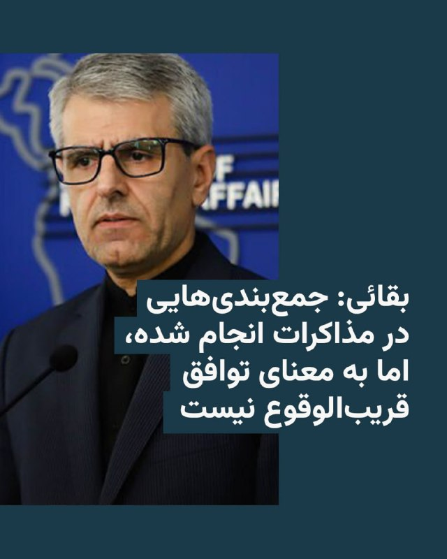

🔸اسماعیل بقائی، سخنگوی وزارت امور خارجه ایران در نشست خبری روز دوشنبه ۴ خرداد خود درباره روند مذاکرات با آمریکا گفت «این تحولات که در چند روز اخیر خبری شد، نتیجه چند هفته گفت‌وگو از طریق میانجی پاکستانی است.»

🔸او افزود که «برخی کشورهای دیگر نیز در این مدت نقش داشتند. بنابراین اینکه در زمینه بسیاری از موضوعات مورد گفت‌وگو ما به جمع‌بندی رسیده‌ایم، امر درستی است، اما اینکه بگوییم این به معنای امضای یک توافق قریب‌الوقوع است، کسی نمی‌تواند چنین ادعایی بکند.»

🔸اسماعیل بقائی اضافه کرد که «تمرکز مذاکرات بر خاتمه جنگ است و در این مرحله درباره جزئیات موضوع هسته‌ای صحبتی نداریم.»

🔸مارکو روبیو، وزیر خارجه آمریکا، روز دوشنبه گفت توافق برای پایان دادن به جنگ با ایران ممکن است حتی «امروز» حاصل شود، اما تأکید کرد واشینگتن عجله‌ای برای توافق بد ندارد.

🔸آقای روبیو افزود که ایالات متحده یا با ایران به توافقی خوب خواهد رسید یا «از راه دیگری» با این کشور برخورد خواهد کرد.

🔸روبیو به خبرنگاران گفت آمریکا پیش از بررسی «گزینه‌های دیگر»، به دیپلماسی هر فرصتی برای موفقیت خواهد داد.

@RadioFarda

## RadioFarda — post 157532

  

🔸محمدباقر قالیباف با رأی نمایندگان مجلس شورای اسلامی برای سومین سال در دوازدهمین دوره مجلس، بار دیگر رئیس مجلس شد.

🔸خبرگزاری‌های ایلنا و فارس گزارش دادند که انتخابات سومین اجلاسیه هیئت‌رئیسه دوازدهمین دوره مجلس صبح دوشنبه ۴ خرداد به صورت حضوری برگزار شد و قالیباف برای یک دورهٔ یک‌ساله دیگر بر کرسی ریاست مجلس باقی ماند.

🔸این هفتمین سال متوالی است که قالیباف ریاست مجلس شورای اسلامی را برعهده می‌گیرد.

🔸هیئت‌رئیسه مجلس شورای اسلامی ۱۲ عضو دارد: یک رئیس، دو نایب‌رئیس، سه ناظر و شش دبیر. اعضای هیئت‌رئیسه با رأی مستقیم نمایندگان برای دوره‌ای یک‌ساله انتخاب می‌شوند.

🔸رسانه‌های ایران همچنین گزارش داده‌اند که جلسه روز دوشنبه حضوری برگزار شده که بنابر این نخستین جلسۀ حضوری مجلس پس از بیش از ۸۰ روز بوده است. پس از آغاز جنگ اسرائیل و آمریکا با ایران، جلسات حضوری مجلس متوقف شده بود و در این مدت تنها یک جلسه مجازی برگزار شده بود.

@RadioFarda

## RadioFarda — post 157531

🔸مقامات کالیفرنیا در آمریکا در روزهای گذشته درباره انفجار یک مخزن معیوب حاوی مواد شیمیایی در لس‌آنجلس هشدار دادند.

🔸به گفته آن‌ها افزایش دمای این مخزن که می‌‌تواند منجر به انفجار آن یا نشت مواد شود، بخار سمی در هوا آزاد خواهد کرد.

🔸تاکنون حدود ۵۰ هزار از ساکنان محلی تخلیه شده‌اند.

🔸فرماندار کالیفرنیا، روز یکشنبه (سوم خرداد) گفت که از دونالد ترامپ، رئیس‌جمهور، درخواست کرده است تا برای پشتیبانی از عملیات، اعلامیه اضطراری فدرال صادر کند.

@RadioFarda

## RadioFarda — post 157530

  

🔸شبکه خبری سی‌بی‌اس در گزارشی بر اساس گفته‌های «مقام‌های «آگاه از موضوع» در دولت آمریکا گفت مجتبی خامنه‌ای، رهبر جمهوری اسلامی در مکانی نامعلوم پنهان شده و دسترسی محدودی به جهان خارج دارد و ارتباطاتش تنها از طریق شبکه پیچیده‌ای از نامه‌برها انجام می‌شود.

🔸این مقام‌ها بر اساس یافته‌های نهادهای اطلاعاتی آمریکا گفته‌اند مقام‌های حکومت ایران که مجوز مذاکره با دولت آمریکا را دارند، برای برقراری ارتباط در داخل ساختار حکومت خود با دشواری روبه‌رو بوده‌اند و همین موضوع یکی از دلایل اصلی تأخیر در روشن شدن جزئیات توافق احتمالی با ایران بوده است.

🔸دو مقام آمریکایی به سی‌بی‌اس گفتند وقتی آمریکا جزئیات پیشنهادی را ارسال می‌کند، دشواری دسترسی به مجتبی خامنه‌ای باعث می‌شود در دریافت پاسخ، تأخیری طولانی رخ دهد.

🔸مجتبی خامنه‌ای از زمان آغاز حملات آمریکا و اسرائیل به ایران، از انظار عمومی پنهان شده و با وجود اعلام نامش به عنوان رهبر سوم جمهوری اسلامی تاکنون از او صدا یا تصویری منتشر نشده است.

@RadioFarda

## RadioFarda — post 157529

  

🔸رسانه‌ها در ایران روز یک‌شنبه سوم خرداد خبر دادند که دادگاه انقلاب تهران برای چهار نفر از متهمان پرونده اکباتان حکم اعدام صادر کرده است.

🔸بر اساس گزارشی که به‌صورت یکسان در این رسانه‌ها منتشر شد، حکم جدید مربوط به «رسیدگی موازی» در دادگاه انقلاب تهران است و این دادگاه «با توجه به جمیع اوراق و محتویات پرونده، شکایت اولیای دم شهید، گزارش مرکز تشخیص هویت پلیس آگاهی تهران، نظریه پزشکی قانونی و اظهارات متهمان، متهمان ردیف اول تا چهارم پرونده را بابت اتهام افساد فی‌الارض به مجازات اعدام محکوم کرد.»

🔸در این گزارش‌ هم‌چنین آمده که «متهمان ردیف پنجم تا نهم نیز بابت اتهام اجتماع و تبانی برای ارتکاب جرم علیه امنیت داخلی کشور و اتهام فعالیت تبلیغی علیه نظام جمهوری اسلامی ایران به حبس از یک تا پنج سال و مجازات‌های تکمیلی محکوم شدند.»

🔸گفته شده که این حکم قابل فرجام خواهی و ارجاع به دیوان عالی کشور است.

@RadioFarda

## RadioFarda — post 157528

  

🔸وزیر خارجه ایالات متحده، روز دوشنبه چهارم خرداد گفت که واشینگتن در مذاکرات جاری خود با ایران، «هر فرصتی برای موفقیت» به دیپلماسی خواهد داد.

🔸مارکو روبیو که اکنون در هند به‌سر می‌برد در جمع خبرنگاران گفت که مذاکرات با ایران همچنان «در حال پیشرفت» است و خوش‌بینی محتاطانه‌ای نسبت به توافق احتمالی برای بازگشایی مسیرهای کلیدی کشتیرانی و از سرگیری مذاکرات هسته‌ای ابراز کرد.

🔸او که روز گذشته از احتمال توافق با ایران تا پایان روز یک‌شنبه خبر داده بود، گفت: «همه ما باید مطمئن باشیم که یا به یک توافق خوب خواهیم رسید، یا مجبور می‌شویم به شکل دیگری با این مسئله برخورد کنیم. ترجیح ما این است که یک توافق خوب داشته باشیم.»

🔸دونالد ترامپ، رئیس‌جمهور آمریکا نیز شامگاه یک‌شنبه در دومین پیام خود درباره روند مذاکرات با ایران اطمینان داد که توافق احتمالی با ایران «خوب و درست» خواهد بود اما هیچ کس درباره محتوای آن اطلاع ندارد.

@RadioFarda

## RadioFarda — post 157527

  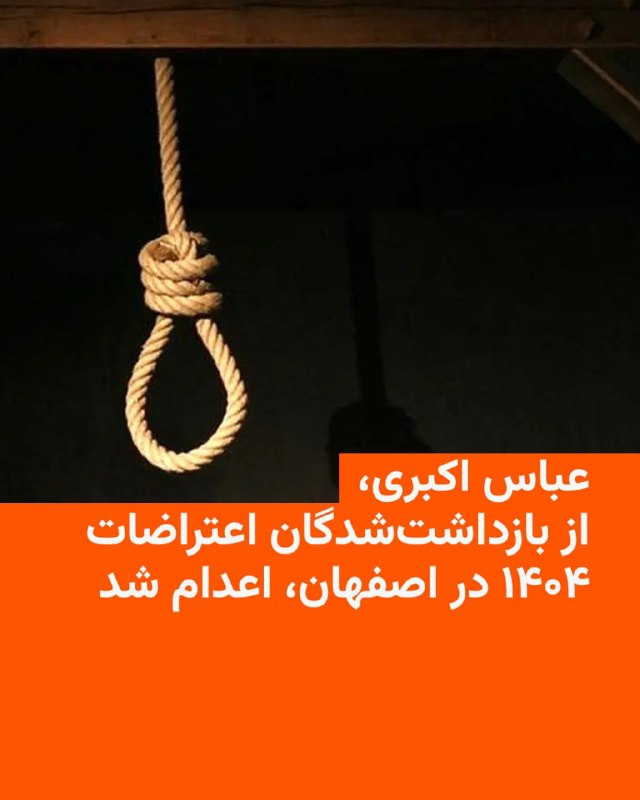

🔸خبرگزاری میزان، وابسته به قوه قضاییه، صبح روز دوشنبه چهارم خرداد از اعدام عباس اکبری، از بازداشت‌شدگان اعتراضات ۱۴۰۴ در اصفهان، خبر داد.

🔸در گزارش میزان این معترض با نام کامل «عباس اکبری فیض‌آبادی» و «یکی از لیدرهای مسلح» در اعتراضات شهرستان نائین معرفی و گفته شده که او «نقش مهمی در حمله به فرمانداری شهرستان و مراکز تأمین امنیت و همچنین مراکز خدماتی» داشته است.

🔸میزان اتهامات آقای اکبری را «محاربه، تخریب عمدی اموال عمومی به قصد مقابله با نظام و اخلال در نظم و امنیت جامعه، اجتماع و تبانی برای ارتکاب جرم علیه امنیت داخلی» اعلام کرده و مدعی شده که او با کلت کمری جنگی اقدام به تیراندازی در خیابان کرده است.

🔸ایران در ماه‌های اخیر با موج تازه‌ای از اعدام‌ها، بازداشت‌ها و صدور احکام سنگین روبه‌رو بوده است؛ موجی که به گفتهٔ نهادها و سازمان‌های حقوق بشری، در فضای جنگ، بحران امنیتی و اعتراضات، به‌عنوان ابزاری برای ایجاد ترس و کنترل جامعه عمل می‌کند.

@RadioFarda

## RadioFarda — post 157526

  <a href="https://t.me/radiofarda/157526" target="_blank">📎 Download file</a>

📻بشنوید: سرخط خبرها با رادیوفردا، چهارم خرداد ۱۴۰۵‌

@RadioFarda

## IranianMinds — post 20721

🔴یک مقام آمریکایی به واشنگتن‌پست:

ایران تا زمانی‌که از ذخایر هسته‌ای خود صرف‌نظر نکند، حتی یک دلار هم دریافت نخواهد کرد.

@IranianMinds

## IranianMinds — post 20720

🔴 خبرگزاری رویترز :

عباس عراقچی و محمدباقر قالیباف وارد قطر شدن.

@IranianMinds

## IranianMinds — post 20719

  

🔴مارک لوین :

در اینترنت مطالب زیادی درباره یک توافق احتمالی با جمهوری اسلامی وجود دارد. اما من هیچ چیزی درباره خود مردم ایران ندیدم و کسی در مورد مردم ایران حرف نمی زند..

@IranianMinds

## IranianMinds — post 20718

  

🔴 واشنگتن‌ پست:

آمریکا و ایران به یک چارچوب اولیه برای تمدید آتش‌بس به مدت ۶۰ روز رسیده‌اند تا مذاکرات برای پایان جنگ ادامه پیدا کند.

ایران قرار است طی ۳۰ روز تنگه هرمز را بازگشایی و مین‌های دریایی را پاکسازی کند

آمریکا هم محاصره دریایی بنادر ایران را لغو خواهد کرد

آزادسازی ۱۲ میلیارد دلار از دارایی‌های بلوکه‌شده ایران بخشی از توافق است

ایران پس از دریافت این پول، پاکسازی مین‌ها را آغاز می‌کند
تهران تعهد سطح بالایی درباره عدم دستیابی به سلاح هسته‌ای خواهد داد.

هنوز هیچ توافق نهایی امضا نشده است!

@IranianMinds

## IranianMinds — post 20717

  

🔴 پست ترامپ در تروث‌سوشال:

دموکرات‌ها سیاست‌های بد و نامزد‌های بدی دارند. غیر از این، آن‌ها عملکرد نسبتأ خوبی دارند!

@IranianMinds

## IranianMinds — post 20716

🔴 ترامپ :

من به همه دموکرات ها، رینوس ها و احمق هایی که هیچ چیز در مورد معامله احتمالی من با ایران نمی دانند می خندم.

توافق با ایران یا توافقی بزرگ و معنادار خواهد بود یا توافقی وجود نخواهد داشت.

این دقیقا برعکس فاجعه برجام خواهد بود که توسط دولت شکست خورده اوباما مذاکره شد، که راهی مستقیم و باز برای دستیابی به سلاح هسته ای برای ایران بود.

نه، من چنین معامله ای انجام نمی دهم!

@IranianMinds

## IranianMinds — post 20715

🔴 خبرگزاری تسنیم : دستور رفع محدودیت های اینترنت بین الملل تایید شده و فقط به تایید نهایی پزشکیان نیاز داره ، در صورت تایید اینترنت بین الملل تا هفته ی آینده به حالت قبل جنگ برمیگرده! @IranianMinds

## IranianMinds — post 20714

  

🔴 بن‌ گویر، وزیر امنیت ملی اسرائیل:

نتانیاهو باید مشت خود را روی میز ترامپ بکوبد و به او بگوید که ما به جنگ برمی‌گردیم!

@IranianMinds

## IranianMinds — post 20713

❌دیگه فریب بونوس سایت های متفرقه رو نخورید!

💖توی این سایت که مورد #تایید ماست، با عضویت 500 هزارتومان بگیر!

🌐 Winro.io

🌐 Winro.io

## IranianMinds — post 20712

  <a href="telegram/content/IranianMinds_20712_1779713700.webm" target="_blank">🎬 Download video</a>

💩 
⚠️ دیگه #فریب بونوس های الکی سایت های سودجو رو نخورید
❌

💲بیا توی سایت مورد تایید ما یعنی #وینرو و با عضویت 500 هزار تومان اعتبار بی قیدو شرط بگیر
👏

🤩با عضویت 
🤩 
🤩 
🤩 هزار تومان اعتبار رایگان بگیر!

⌛ پشتیبانی 24 ساعته

🌐 Winro.io

🌐 Winro.io
کانال بونوس های رایگانr4

📱 @winro_io

## IranianMinds — post 20711

🔴 کلاس های دانشگاه تهران هم‌ از ۹ خرداد حضوری شد.

@IranianMinds

## IranianMinds — post 20710

🔴 خبرگزاری تسنیم :

دستور رفع محدودیت های اینترنت بین الملل تایید شده و فقط به تایید نهایی پزشکیان نیاز داره ، در صورت تایید اینترنت بین الملل تا هفته ی آینده به حالت قبل جنگ برمیگرده!

@IranianMinds

## IranianMinds — post 20709

ترامپ چند روز‌ دیگه :

تا ظهور‌ امام زمان به ایران فرصت دادم ، امیدوارم‌ زودتر به یه نتیجه ای برسیم و اگرنه خیلی براشون بد میشه!

@IranianMinds

## IranianMinds — post 20708

🔴 مشاور وزیر ارتباطات :

شاید تا هفته آینده اینترنت بین الملل وصل شد.

@IranianMinds

## IranianMinds — post 20707

  

🔴 فاکس‌ نیوز :

ترامپ برای رسیدن به توافق نهایی ۷ روز‌ دیگر به جمهوری اسلامی زمان داد.

@IranianMinds

## IranianMinds — post 20706

🔴 اکونومیست:

عربستان از ترامپ خواسته هرگونه حمله جدید به ایران رو تا بعد از مراسم سالانه حج به تعویق بندازه.

ریاض نگرانه اگه درگیری دوباره آغاز و حریم هوایی منطقه بسته بشه، زائران در عربستان سعودی گیر بیفتن.

@IranianMinds

## IranianMinds — post 20705

  <a href="telegram/content/IranianMinds_20705_1779713701.mp4" target="_blank">🎬 Download video</a>

🔴 مارکو روبیو درباره ایران:

پیشنهاد بسیار محکمی روی میز وجود دارد.

این توافق شامل باز شدن تنگه‌ها و آغاز مذاکرات واقعی، جدی و زمان‌دار درباره مسائل هسته‌ای است.

این طرح حمایت زیادی در خلیج فارس و در سطح جهانی دارد ، همه کشورهایی که با آن‌ها صحبت کردیم، معتقدند این فقط یک پیشنهاد منطقی نیست، بلکه اقدامی درست برای جهان است

ترامپ عجله‌ای ندارد و توافق بد امضا نخواهد کرد ، ما قبل از بررسی گزینه‌های دیگر، به دیپلماسی هر فرصتی برای موفقیت می‌دهیم!

@IranianMinds

## IranianMinds — post 20704

  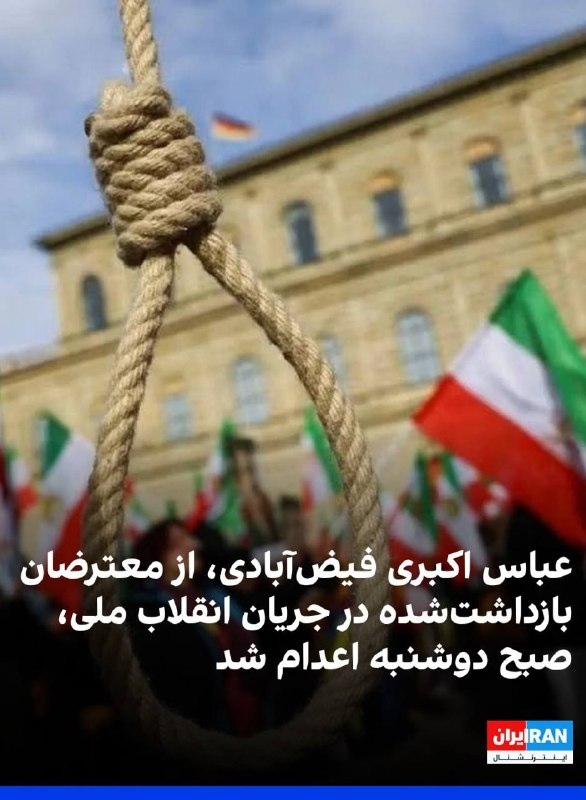

⚫️ جمهوری اسلامی یکی دیگه از هموطن هامونو هم امروز کشت. خبرگزاری قوه قضائیه جمهوری اسلامی اعلام کرد مجتبی کیان امروز صبح به دلیل ارسال پیام و دادن مختصات صنایع نظامی به شبکه های ماهواره ای معاند ( ایران اینترنشنال ) اعدام شد. @IranianMinds

## IranianMinds — post 20703

  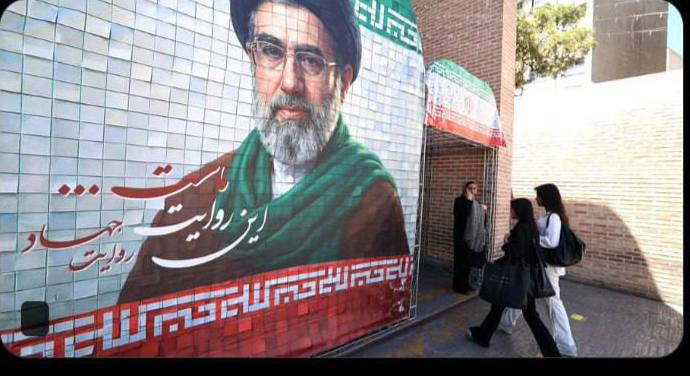

🔴 سی بی اس نیوز :

مجتبی خامنه ای ، رهبر‌ جمهوری اسلامی در مکانی نامعلوم پنهان شده و بر ارساس ارزیابی اطلاعاتی آمریکا دسترسی خیلی کمی به دنیای بیرون داره و‌ با افراد خیلی کمی هم در ارتباطه .

@IranianMinds

## IranianMinds — post 20702

🔴 نیویورک‌پست:

احتمال رسیدن به توافق بین آمریکا و ایران به طور فزاینده‌ای کاهش یافته. هر دو طرف در ابتدا موافقت کردن که برخی از خواسته‌های حداکثری رو کنار بذارن، اما 24 ساعت بعد پس از فشار شدید اسرائیلی‌ها و دیگر طرفداران اسرائیل نزدیک به ترامپ، او لحن خودش رو به طور چشمگیری تغییر داده و خواستار آن شده که ایرانی‌ها برای هرگونه رفع تحریم و دارایی‌های مسدود شده، کل ذخیره اورانیوم خود را کنار بذارن، در حالی که در ابتدا قرار بود که بخشی از دارایی‌ها به عنوان بخشی از تفاهمنامه آزاد بشه.

تفاهمنامه روز جمعه، تحت فشار شدید است و احتمال فرو پاشیدن آن زیاده، مگه اینکه یکی از طرفین عقب‌نشینی کنه.

@IranianMinds

## BBCPersian — post 282017

  

🔻خبرگزاری‌های رویترز و فرانسه به نقل از یک مقام آگاه، از سفر غیر‌منتظره محمد باقر قالیباف و عباس عراقچی، مذاکره‌کنندگان ارشد ایران، به دوحه خبر داده‌اند.

بر اساس این گزارش‌ها، رئیس مجلس و وزیر خارجه ایران برای گفت‌وگو با نخست‌وزیر قطر به دوحه سفر کرده‌اند.

رویترز نوشت که این گفت‌و‌گوها عمدتا درباره «تنگه هرمز و ذخایر اورانیوم غنی‌شده» ایران است.

رسانه‌های ایران گزارش داده بودند که عبدالناصر همتی، رئیس کل بانک مرکزی ایران، برای «بررسی آزادسازی اموال بلوکه‌شده و در راستای کمیسیون اقتصادی مذاکرات» به قطر سفر کرده است.

هیئتی از قطر هفته پیش به ایران سفر کرده بود.

یکی از خواسته‌های ایران در مذاکره با آمریکا آزاد شدن منابع مالی مسدودشده‌اش است.

📸Anadolu via Getty Images
https://bbc.in/4tYZR0B
@BBCPersian

## BBCPersian — post 282016

  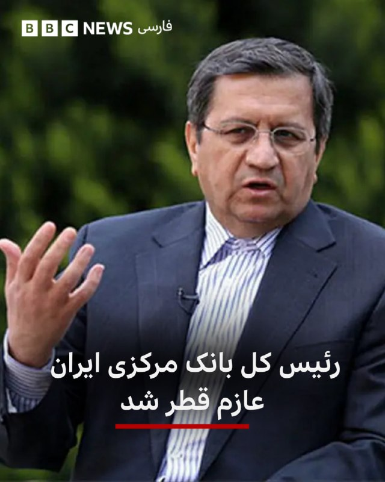

🔻عبدالناصر همتی، رئیس کل بانک مرکزی ایران، عازم قطر شد.

به گزارش رسانه‌های دولتی ایران، این سفر در پی گفت‌وگوهای اخیر هیئت قطری در تهران درباره دارایی‌های مسدودشده ایران انجام شده است.

یکی از خواسته‌های ایران در مذاکرات با آمریکا آزاد شدن منابع مالی مسدود شده‌اش در خارج از کشور، از جمله در قطر، بوده است.

در زمان ریاست جمهوری ابراهیم رئیسی، بخشی از دارایی‌های مسدود شده ایران از بانک‌های کره جنوبی به قطر منتقل شد تا همزمان با آزادی برخی از اتباع آمریکایی از زندان‌های ایران، با نظارت ایالات متحده صرف خرید کالاهای ضروری مورد درخواست ایران از جمله غدا و دارو شود.

با تبادل زندانیان، این پول به بانک‌های قطر منتقل شد، اما با حمله هفتم اکتبر حماس به اسرائیل و آغاز جنگ در غزه، انتقال پول به ایران انجام نشد.

علی خامنه‌ای، رهبر سابق جمهوری اسلامی در سفر امیر قطر به تهران در بهمن ۱۴۰۳، خواستار آزاد شدن این منابع مالی شده بود.

📸ASRIRAN
https://bbc.in/49V4TEj
@BBCPersian

## BBCPersian — post 282015

  

🔻آژانس پناهندگان فلسطینی سازمان ملل، اونروا، می‌گوید که بیش از ۱۲۵ هزار مورد عفونت پوستی ناشی از جوندگان و حشرات را در این منطقه محاصره‌شده شناسایی کرده است.

این نهاد در حسابش در شبکه اجتماعی ایکس نوشت: «تیم‌های بهداشت ما در حال سم‌پاشی و آفت‌کشی ایمن در مناطقی هستند که تعداد زیادی از آوارگان هنوز در سکونتگاه‌های موقت پرجمعیت زندگی می‌کنند.»

این آژانس می‌گوید: «کمبود شدید سوخت، آفت‌کش‌، چادر و دارو واکنش به این بحران را محدود می‌کند.»

به گفته اونروا، غزه نیاز به «ورود نامحدود لوازم بهداشتی و پزشکی» دارد.

براساس گزارش‌ها، با توجه به اینکه همچنان صدها هزار فلسطینی آواره در غزه هنوز در چادرها زندگی می‌کنند و هیچ نشانه‌ای از بازسازی این منطقه به چشم نمی‌خورد، تلاش برای تهیه آب تمیز و مقابله با حیوانات ناقل بیماری به طور فزاینده‌ای دشوار شده است.

📸Anadolu via Getty Images
https://bbc.in/4uFNNTh
@BBCPersian

## BBCPersian — post 282014

  

🔻شهباز شریف، نخست‌وزیر پاکستان، در دیدار با همتای چینی خود در پکن، ابراز خوشبینی کرده است که مذاکرات ایران و آمریکا «در مسیر درست در حال پیشرفت است.»

آقای شریف همراه با فیلد مارشال عاصم منیر، فرمانده کل ارتش و نیروهای مسلح پاکستان، به چین سفر کرده است که اخیرا با هدف میانجیگری و کمک به حصول توافق میان ایران و آمریکا به تهران رفته بود.

به گزارش خبرگزاری دولتی پاکستان، آقای شریف از شی جین پینگ، رئیس‌جمهور چین، برای حمایت‌ از تلاش‌های اسلام‌آباد برای ترویج صلح و برقراری آتش‌بس تشکر کرد.

آقای شریف در دیدار با لی چیانگ، نخست‌وزیر چین، گفت که «جهان در حال عبور از یک لحظه حساس در میانه بحران» در خلیج فارس است.

به گفته آقای شریف، «این بحران هم به اقتصادهای منطقه از جمله پاکستان، که واردکننده نفت و فرآورده‌های نفتی است، آسیب رسانده است و هم به جامعه جهانی.»

📸EPA/Shutterstock
https://bbc.in/42PXDpt
@BBCPersian

## BBCPersian — post 282013

🔻نیکزاد و حاجی‌بابایی نایب رئیس مجلس ماندند

علی نیکزاد، نماینده اردبیل و حمیدرضا حاجی بابایی، نماینده همدان بعنوان نواب رئیس انتخاب شدند.

به گزارش رسانه‌های ایران، آقای نیکزاد با ۱۴۳ رای و آقای حاجی‌بابایی با ۱۰۰ رای از ۲۸۰ نماینده حاضر در انتخابات نواب رئیس مجلس اول و دوم شدند.

عبدالرضا مصری با ۸۸ رای، حسینعلی حاجی دلگیانی با ۶۸ رای، رضا جباری با ۵۷ رای، علیرضا منادی سفیدان با ۵۲ رای و پیمان فلسفی با چهار رای، دیگر نامزدهای نیابت رئیس مجلس بودند.

پیش از این محمدباقر قالیباف با ۲۳۵ رأی از ۲۷۱ آرای مأخوذه، برای هفتمین سال متوالی به‌عنوان رئیس مجلس انتخاب شده بود.

به این ترتیب رئیس و دو نایب رئیس مجلس ابقا شدند.

این انتخابات حضوری و با رای مستقیم نمایندگان برای انتخاب ۱۲ عضو هیئت‌رئیسه شامل یک رئیس، دو نایب رئیس، شش دبیر و سه ناظر برگزار شد.

پیش از این، انتخابات با ورقه برگزار می‌شد اما رای‌گیری امسال با رای مستقیم نمایندگان به صندوق‌های الکترونیک رای‌گیری انجام شد.

https://bbc.in/4dvvoTc
@BBCPersian

## BBCPersian — post 282012

  

🔻سخنگوی وزارت خارجه ایران در واکنش به اظهارات مقام‌های آمریکایی که از پیشرفت در مذاکرات می‌گویند، گفت که در برخی موضوعات دو طرف به جمع‌بندی رسیده‌اند اما نمی‌توان گفت که توافق قریب‌الوقوع است.

اسماعیل بقایی مواضع ضد‌و‌نقیض مقام‌های آمریکا و سابقه حمله این کشور در میانه مذاکره را ازجمله دلایل این امر عنوان کرد.

این در حالی است که مارکو روبیو، وزیر خارجه آمریکا، گفته است که توافق میان تهران و واشنگتن «هنوز در حال پیشرفت است». دونالد ترامپ هم دیروز از نزدیک شدن به توافق گفته بود اما بعد تاکید کرد که عجله‌ای برای رسیدن به توافق ندارد.

📸GettyImages
@BBCPersian

## BBCPersian — post 282011

  <a href="telegram/content/BBCPersian_282011_1779713706.mp4" target="_blank">🎬 Download video</a>

🔻‌مارکو روبیو، وزیر خارجه آمریکا، گفته است که توافق میان تهران و واشنگتن «هنوز در حال پیشرفت است» و دونالد ترامپ، رئیس‌جمهور آمریکا، «عجله‌ای برای رسیدن به توافق ندارد.»

او پیش از ترک دهلی نو گفت که در حال حاضر «یک پیشنهاد کاملا محکم» برای رسیدن به توافق داریم که با باز شدن تنگه هرمز می‌توانیم وارد «یک مذاکره بسیار واقعی، مهم و با محدودیت زمانی در مورد مسائل هسته‌ای» بشویم.

به گفته وزیر خارجه آمریکا، دونالد ترامپ «قرار نیست توافق بدی انجام دهد، بنابراین بیایید ببینیم چه اتفاقی می‌افتد. ما قبل از بررسی گزینه‌های دیگر، هر فرصتی به دیپلماسی برای موفقیت می‌دهیم.»

او تاکید کرد که «یا توافق خوبی خواهیم داشت، یا باید به روش دیگری با این مسئله برخورد کنیم و ما ترجیح می‌دهیم توافق خوبی داشته باشیم.»

او در مورد اینکه چرا هنوز توافق اعلام نشده است گفت که این را باید از ایرانی‌ها پرسید و «ما منتظر شنیدن نظرات آنها هستیم و در سیستم آنها کمی طول می‌کشد تا آنها پاسخ دهند.»

https://bbc.in/4tYH5Xb
@BBCPersian

## BBCPersian — post 282010

  

🔻ایران می‌گوید که سفر وزیر خارجه به نیویورک برای شرکت در نشست شورای امنیت «منتفی» شده است.

اسماعیل بقایی، سخنگوی وزارت خارجه ایران، دلیل انجام نشدن سفر عباس عراقچی را «مشکل روادید» عنوان کرد.

آقای بقایی چهارشنبه هفته پیش درمورد حضور آقای عراقچی در این نشست گفته بود: «این سفر به نیویورک احتمال دارد انجام شود و البته ممکن هم هست انجام نشود، چون هنوز قطعی نیست. دلیلش هم این است که هم باید روادید صادر شود و هم ممکن است اولویت‌های دیگری داشته باشیم.»

چین به‌عنوان رئیس دوره‌ای شورای امنیت، سه‌شنبه ۲۶ مه یک بحث آزاد در سطح بالا با موضوع «حفظ اهداف و اصول منشور سازمان ملل و تقویت نظام بین‌المللی متمرکز بر سازمان ملل» برگزار خواهد کرد.

این جلسه به ریاست وانگ یی، عضو دفتر سیاسی کمیته مرکزی حزب کمونیست و وزیر امور خارجه چین، برگزار می‌شود.

چین این نشست را «فرصتی» برای همبستگی و اجماع کشورهای عضو توصیف کرد تا «تعهد راسخ خود را به حفظ اهداف و اصول منشور سازمان ملل متحد مجددا تصریح و نقش محوری این سازمان را در نظام بین‌المللی احیا کنند.»

📸Anadolu via Getty Images
https://bbc.in/42PLVv0
@BBCPersian

## BBCPersian — post 282003

🖋پاول آکسنوف
خبرنگار امور نظامی، بخش روسی بی‌بی‌سی

سرگئی مرنکوف، طراح ارشد هواپیماهای ترابری شرکت «هواپیماسازی غیرنظامی اورال»، اعلام کرد که کار روی ساخت هواپیمای جدید توربوپراپ «تی‌وی‌آراس-۴۴ لادوگا» در روسیه متوقف شده و این پروژه به وزارت دفاع واگذار شده است.

آقای مرنکوف در کنفرانسی درباره پشتیبانی هوانوردی مناطق قطبی، سیبری و خاور دور که سازمان هوانوردی روسیه برگزار کرده بود، گفت: «پروژه تی‌وی‌آراس-۴۴ لادوگا متوقف شده است. تصمیم گرفته شده این هواپیما و تمام زیرساخت‌های علمی و فنی آن در اختیار وزارت دفاع قرار گیرد تا بر پایه آن، یا نسخه ترابری مجهز به رمپ، یا نسخه ترابری با در جانبی، یا نسخه مسافربری ویژه نیازهای وزارت دفاع ساخته شود.»

او همچنین گفت که به دفتر طراحی این پروژه اجازه داده شده نخستین پرواز لادوگا را در سال ۲۰۲۶ انجام دهد.
ادامه مطلب⬇️

📸Getty/ elegram/favt_ru/ V.Lapkin/TASS/
https://bbc.in/4dGyZg1
@BBCPersian

## BBCPersian — post 281993

🖋سعید جعفری، روزنامه‌نگار

محمود احمدی‌نژاد سال‌ها به‌عنوان یکی از تندترین چهره‌های ضداسرائیلی جمهوری اسلامی شناخته می‌شد. اما حالا گزارش‌ها و روایت‌هایی منتشر شده که می‌گویند نام او در برخی سناریوهای مرتبط با آینده سیاسی ایران مطرح بوده است.

در این پست، نگاهی داریم به مواضع جنجالی احمدی‌نژاد، واکنش تحلیلگران اسرائیلی و آمریکایی، و این پرسش که چرا نام او دوباره در میانه بحث‌های مربوط به آینده ایران مطرح شده است.
ادامه مطلب⬇️

📸Getty/ Social media/ mahmoud ahmadinejad X/
https://bbc.in/4fGx9y5
@BBCPersian

## Dirty_Kids — post 390143

دسته جمعی به گا رفتیم مقصرم تو یخچاله.

@Dirty_Kids 👻

## Dirty_Kids — post 390142

‏ترامپ هم مثل منه، معلوم نیست چه گهی داره تو زندگیش می‌خوره‌.

@Dirty_Kids 👻

## Dirty_Kids — post 390141

  

مامان بزرگم وقتی داییم و زن داییم برای بار پنجم توی عروسیشون لب گرفتن:

@Dirty_Kids 👻

## Dirty_Kids — post 390138

نه بابا فشار چیه؛ توی توییتر یه نفر توییت زده «گل مورد علاقه شما چیه؟»

و حالا پسرا شروع کردن از دوس دخترشون عکس گذاشتن.

@Dirty_Kids 👻

## Dirty_Kids — post 390137

  

مسجد ابوذر در بلوار ابوذر ،اتوبان محلاتی؛
آموزش کار با اسلحه ،جمهوری اسلامی از چه خطری این روزها انقد وحشت کرده؟

@Dirty_Kids 👻

## Dirty_Kids — post 390136

  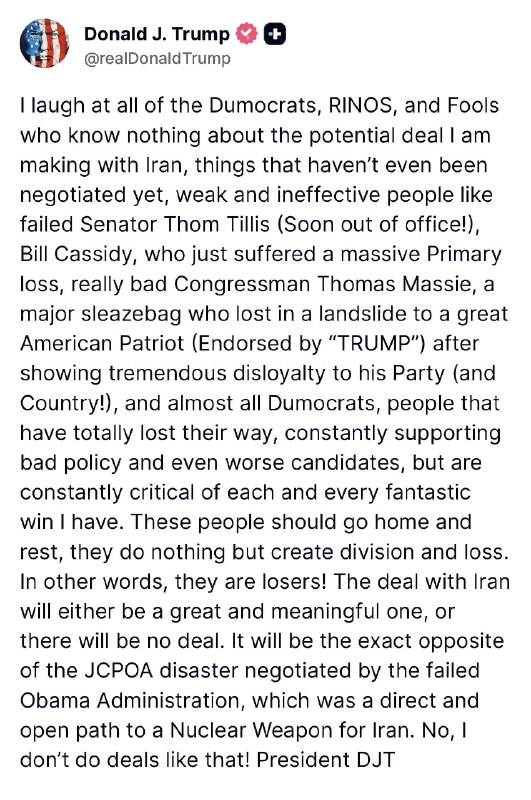

ترامپ: من می‌خندم به همه‌ی این دموکرات‌های مادرقحبه‌ی احمق.

راینوها [جمهوری‌خواهان اسمی] و نادان‌هایی که هیچ‌چی از توافق احتمالی من با رژیم هزارپدر روافض نمی‌دونن، چیزهایی که هنوز حتی مذاکره هم درباره‌شون نشده.

آدم‌های ضعیف و بی‌عرضه‌ای مثل سناتور شکست‌خورده‌ تام‌تیلیس (که به زودی از کار برکنار میشه)، بیل‌کسیدی که همین تازگی‌ها توی انتخابات مقدماتی یه شکست سنگین خورد، و نماینده‌ی واقعاً پدرقحبه‌ی کنگره توماس‌مسی یه آدم کثیف و کسکش تمام‌عیار که بعد از نشون دادن بی‌وفایی شدید به حزبش و کشور در یه شکست مفتضحانه و تاریخی بازی رو به یه میهن‌پرست بزرگ آمریکایی [با حمایت و تایید ترامپ] واگذار کرد.

و تقریباً همه‌ی دموکرات‌های قرمساق، آدم‌هایی که کلاً راهشون رو گم کردن، دائماً از سیاست‌های بد و نامزدهای حتی بدتر حمایت می‌کنن، اما در عین حال، مدام از تک‌تکِ بردهای فوق‌العاده من ایراد می‌گیرن.

این پدرخراب‌ها باید برن خونه‌شون و استراحت کنن، کارشون فقط تفرقه‌اندازی و باخته. به عبارت دیگه، اینا یه مشت بازنده‌‌ی مادرقحبه‌ان.

توافق با رژیم روافض یا یه توافق بزرگ و پرمعنی می‌شه، یا اصلاً توافقی در کار نخواهد بود.

این دقیقاً برعکس فاجعه‌ی برجام خواهد بود که توسط دولت شکست‌خورده‌ی اوبامای قحبه مذاکره شد. همون توافقی که یه مسیر مستقیم و باز برای رسیدن ایران به سلاح هسته‌ای بود.

خیر عزیزان، من از این‌جور توافق‌ها نمی‌کنم [اینقدر کسخل و‌مشنگ نیستم که به روافض کون بدم]

رئیس‌جمهور دی‌جی‌تی،

@Dirty_Kids 👻

## Dirty_Kids — post 390135

  <a href="telegram/content/Dirty_Kids_390135_1779713709.mp4" target="_blank">🎬 Download video</a>

از وقتی اینترنت قطع شده انلاین شاپا دست به هرکاری میزنن بتونن جنساشونو بفروشن

@Dirty_Kids 👻

## Dirty_Kids — post 390134

  <a href="telegram/content/Dirty_Kids_390134_1779713710.mp4" target="_blank">🎬 Download video</a>

طرفدارهایی که از پایان سریال The Boys شاکی هستن شروع کردن خودشون پایان بندی‌های مختلف رو با AI می‌سازن و باید بگم همین یک دقیقه‌ای که یکی از طرفدارها ساخته هم کیفیت VFXش و هم هیجانش از کل فصل ۵ بیشتر بود!

@Dirty_Kids 👻

## Dirty_Kids — post 390133

  <a href="telegram/content/Dirty_Kids_390133_1779713711.mp4" target="_blank">🎬 Download video</a>

امید دانا خود مواد مخدره، مصرف نمی‌کنه، خودش عین و سرچشمه مواد مخدره

@Dirty_Kids 👻

## Dirty_Kids — post 390132

  <a href="https://t.me/Dirty_Kids/390132" target="_blank">📎 Download file</a>

📱 اپلیکیشن اندروید بدون فیلتر ریتزوبت

➖➖➖➖➖

🔹 ثبت نام آسان 
✅
🔹 رابط کاربری بسیار راحت و سریع 
✅
🔹 درگاه پرداخت کارت به کارت 
✅
🔹 درگاه پرداخت دلاری سریع 
✅
🔹 بونوس ۱۰۰ درصدی اولین واریز 
✅
🔹 بونوس ۱۰۰ درصدی واریز یکشنبه ها 
✅

➖➖➖➖➖
🌐 https://RitzoBet.com

⚡️ @RitzoBet_ir

## Dirty_Kids — post 390131

  

⚠️ برای #شرطبندی های فوتبال از سایت معتبر و بین المللی استفاده کنید ✅

سایت #ریتزوبت ، چهار سال هستش داخل ایران فعالیت میکنه 
✅

لایسنس بین المللی داره ، روش های شارژ و برداشت متنوع داره و بونوس 100% ورزشی و کش بک های جذاب
💎

⏪ اپلیکیشن بدون فیلتر ریتزوبت 
📱
⏩
R4

✅ لینک بدون‌ فیلتر ریتزوبت
🤣

🆔 @RitzoBet_ir 
🇮🇷

## Dirty_Kids — post 390130

هر موقع شک کردی رب گوجه فرنگی کافیه برای ماکارونی ، دو قاشق دیگه رب بریز.

@Dirty_Kids 👻

## Dirty_Kids — post 390129

  <a href="telegram/content/Dirty_Kids_390129_1779713713.mp4" target="_blank">🎬 Download video</a>

پخش اذان مغرب مسلمانان از بلندگو در ميدان شلوغ دانداس تورنتو كانادا 🇨🇦

@Dirty_Kids 👻

## Dirty_Kids — post 390127

  

🌪وقتی اینترنت طوفانیه فقط کافیه بادبان ها رو بکشی

⚫️100 هزار تومان تخفیف خرید اول 
🎁

⚫️پایین ترین قیمت گیگی 180 هزار تومان
🌐 

⚫️پورسانت %10 دائمی برای هر معرفی
💼

با بادبان، میتونی یه اتصال سریع، پایدار و امن
همراه با پشتیبانی ۲۴ ساعته داشته باشی
🚀

🛒کد تخفیف: badban4k

بادبان راهتو باز می‌کنه
⛵️
R4

🛡@BadBan_VPN | کانال 

🤖@BadBan_VPNBot | ربات 

📞@BadBan_VPNSupport | پشتیبانی

## Dirty_Kids — post 390126

  

فارس: تو جلسهٔ ستاد ویژهٔ ساماندهی فضای مجازی

اتصال مجدد اینترنت بین‌الملل به رای گذاشته شد که با 9 رای موافق و 3 رای مخالف تصویب و به پزشکیان ارسال شد.

@Dirty_Kids 👻

## Dirty_Kids — post 390125

  <a href="telegram/content/Dirty_Kids_390125_1779713715.mp4" target="_blank">🎬 Download video</a>

بیوگرافی کوتاهی از عمو مانوک و مرگ مشکوکش:

@Dirty_Kids 👻

## Dirty_Kids — post 390124

  

خودت خایه نوشتن «خایه» رو نداشتی.

@Dirty_Kids 👻

## Dirty_Kids — post 390123

  <a href="telegram/content/Dirty_Kids_390123_1779713717.mp4" target="_blank">🎬 Download video</a>

دل یه ایران گرفته

@Dirty_Kids 👻

## Hranews — post 113152

  

امروز دوشنبه ۴ خرداد ۱۴۰۵، ستاد راهبری و ساماندهی فضای مجازی به ریاست محمدرضا عارف معاون اول رئیس‌جمهور، بازگشت #اینترنت به وضعیت پیش از دی‌ماه ۱۴۰۴ را تصویب کرد. این مصوبه به رئیس‌جمهور ارسال شده و در صورت تایید وی، جهت اجرا به وزارت ارتباطات ابلاغ خواهد شد./امتداد

↘️
@hranews_bot تماس ✉️ -  @Hranews  کانال هرانا 🆑

## Hranews — post 113151

با انگیزه تجاوز؛ گزارشی از قتل یک پسر ۱۱ ساله در مشهد

❗️
❗️
❗️
❗️
❗️– مردی ۲۳ ساله در مشهد که با انگیزه تجاوز اقدام به ربودن یک #کودک پسر ۱۱ ساله کرده بود، با وارد کردن ضربات سنگ به سرش، آن کودک را به #قتل رساند. متهم هم اکنون در بازداشت به سر می برد و تحقیقات در خصوص این پرونده ادامه دارد.

ادامه مطلب

↘️
@hranews_bot تماس ✉️ -  @Hranews  کانال هرانا 🆑

## Hranews — post 113150

وقوع حادثه در پالایشگاه ششم پارس جنوبی؛ ۶ کارگر مصدوم شدند

❗️
❗️
❗️
❗️
❗️– سخنگوی مجتمع گاز پارس جنوبی اعلام کرد که حین عملیات آواربرداری پالایشگاه ششم پارس جنوبی ۶ #کارگر در پی وقوع حادثه‌ای مصدوم شدند.

ادامه مطلب

↘️
@hranews_bot تماس ✉️ -  @Hranews  کانال هرانا 🆑

## Hranews — post 113149

  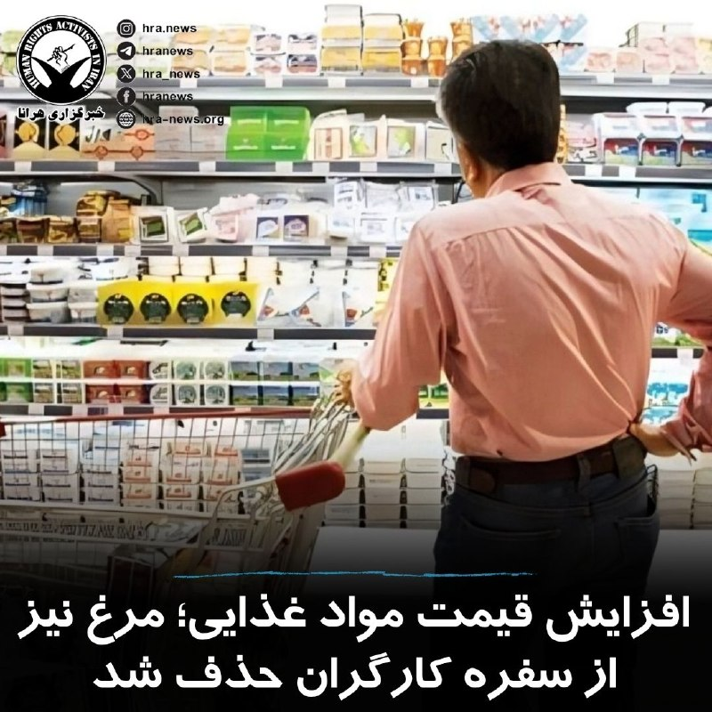

مجید رحمتی، عضو هیات مدیره کانون هماهنگی شوراهای اسلامی کار تهران، با اشاره به افزایش شدید قیمت مواد غذایی در ایران گفت که «مرغ هم از سفره ما کارگران حذف شده» و بسیاری از خانواده‌های کارگری دیگر توان خرید منظم منابع پروتئینی را ندارند. براساس گزارش منتشرشده، قیمت هر شانه تخم‌مرغ به حدود ۵۰۰ هزار تومان و قیمت مرغ در برخی موارد به کیلویی ۴۷۰ هزار تومان رسیده؛ در حالی که حداقل دستمزد ماهانه کارگران حدود ۲۳ تا ۲۴ میلیون تومان است. رحمتی می‌گوید بخش عمده درآمد #کارگران صرف اجاره مسکن و هزینه‌های اولیه زندگی می‌شود و حتی تامین خوراک ساده نیز برای بسیاری از خانوارها دشوار شده است.

این فعال کارگری همچنین گفت که سبد حداقلی معیشت خانوار کارگری که سال گذشته حدود ۴۵ میلیون تومان برآورد می‌شد، اکنون به حدود ۷۰ میلیون تومان رسیده است. به گفته او، کارگران امروز «برای بقا و زنده ماندن مبارزه می‌کنند» و سیاست‌های کنونی کنترل قیمت‌ها نیز دیگر کارایی گذشته را ندارند.

↘️
@hranews_bot تماس ✉️ -  @Hranews  کانال هرانا 🆑

## Hranews — post 113148

  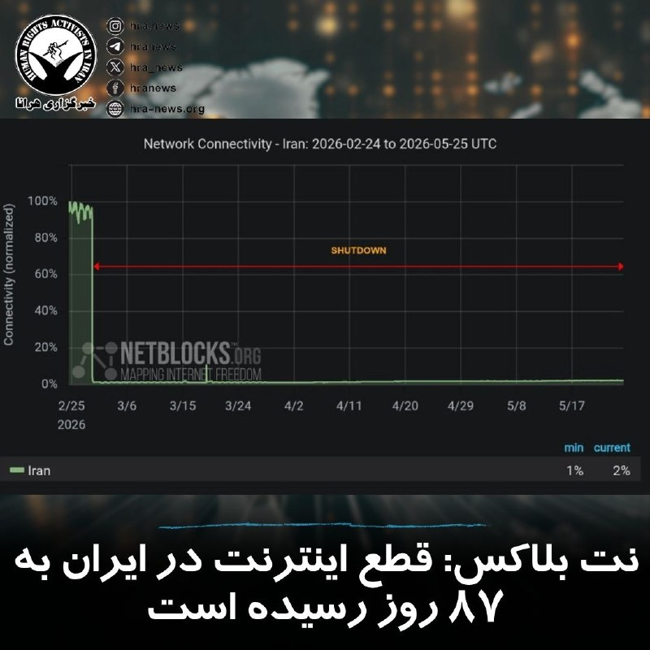

بر اساس آخرین داده‌های نت‌بلاکس، اکنون هشتادوهفتمین روز متوالی قطع اینترنت در ایران است؛ محدودیتی که بیش از ۲۰۶۴ ساعت ادامه داشته است. این نهاد ناظر بر وضعیت #اینترنت در جهان تاکید می‌کند این اقدام هرگونه شفافیت درباره اعدام‌ها را از میان برده و بر شرایط غیرانسانی و وضعیت بلاتکلیفی روزانه که منتقدان، مخالفان و گردشگران زندانی با آن روبه‌رو هستند، افزوده است.

↘️
@hranews_bot تماس ✉️ -  @Hranews  کانال هرانا 🆑

## Hranews — post 113147

  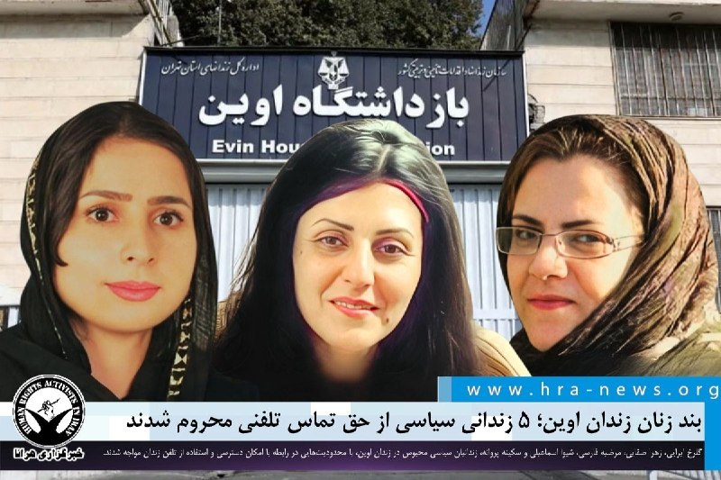

بند زنان زندان اوین؛ ۵ زندانی سیاسی از دسترسی به تماس تلفنی محروم شدند

❗️
❗️
❗️
❗️
❗️– گلرخ ایرایی، زهرا صفایی، مرضیه فارسی، شیوا اسماعیلی و سکینه پروانه، پنج زندانی سیاسی محبوس در زندان اوین، از روز گذشته به صورت تنبیهی از حق استفاده از تلفن زندان محروم شده‌اند. این زندانیان همچنین پیش از این نیز از حق ملاقات حضوری با خانواده و وکلای خود محروم بوده‌اند و این محدودیت همچنان ادامه دارد.

به گزارش خبرگزاری هرانا، ارگان خبری مجموعه فعالان حقوق بشر در ایران، پنج زندانی سیاسی زن محبوس در زندان اوین از حق استفاده از تلفن زندان محروم شدند.

براساس اطلاعات دریافتی هرانا، روز گذشته گلرخ ایرایی، زهرا صفایی، مرضیه فارسی، شیوا اسماعیلی و سکینه پروانه از امکان دسترسی و استفاده از تلفن زندان منع شده‌اند و این محرومیت همچنان ادامه دارد.
اقدام تنبیهی یادشده پس از آن اعمال شد که این زندانیان در اعتراض به اجرای احکام اعدام، در محوطه هواخوری زندان اقدام به سر دادن شعار کرده بودند.

ادامه مطلب

#گلرخ_ایرایی
#زهرا_صفایی
#مرضیه_فارسی
#شیوا_اسماعیلی
#سکینه_پروانه

↘️
@hranews_bot تماس ✉️ -  @Hranews  کانال هرانا 🆑

## Hranews — post 113146

اعتراضات ۱۴۰۴؛ عباس اکبری فیض‌آبادی اعدام شد

❗️
❗️
❗️
❗️
❗️– مرکز رسانه قوه قضاییه از اجرای حکم اعدام عباس اکبری فیض‌آبادی، از بازداشت‌شدگان اعتراضات ۱۴۰۴ که به اتهاماتی از جمله «محاربه» متهم شده بود خبر داد. این حکم بامداد امروز به اجرا درآمد. بر اساس داده‌های گردآوری‌شده توسط هرانا، همزمان با آغاز درگیری‌های نظامی، روند صدور و اجرای احکام #اعدام در پرونده‌های سیاسی و امنیتی افزایش یافته و تاکنون ۳۶ زندانی با این اتهامات در این بازه زمانی اعدام شده‌اند.

ادامه مطلب

#عباس_اکبری_فیض‌آبادی

↘️
@hranews_bot تماس ✉️ -  @Hranews  کانال هرانا 🆑

## Hranews — post 113145

  

جمعی از رانندگان استیجاری برای سومین روز متوالی در مقابل ساختمان نهاد ریاست جمهوری در تهران، #تجمع_اعتراضی برگزار کردند.

به گفته این رانندگان، ما از استان‌های مختلف در حالی برای اعتراض به تهران آمده‌ایم که از سال ۱۴۰۰ به دنبال اجرای قانون و تبدیل وضعیت هستیم اما هیچ نهادی پیگیر وضعیت ما نیست.

↘️
@hranews_bot تماس ✉️ -  @Hranews  کانال هرانا 🆑

## manototv — post 105828

  <a href="telegram/content/manototv_105828_1779713721.mp4" target="_blank">🎬 Download video</a>

تماسی از هلند:
«می‌گفت هر روز با برنامه‌های منوتو زندگی می‌کردیم…
و حالا نمی‌دانیم بعد از آن باید چه کنیم.»
او همچنین از جاویدنام سینا حق‌شناس یاد کرد؛ دوستی که خبر جان‌باختنش زندگی او را زیر و رو کرده بو

## manototv — post 105827

  <a href="telegram/content/manototv_105827_1779713722.mp4" target="_blank">🎬 Download video</a>

گفت‌وگو درباره اعتراضات خارج از کشور:
« چه رفتارهایی به همبستگی و رساندن پیام مردم ایران کمک می‌کند؟»

## manototv — post 105826

  <a href="telegram/content/manototv_105826_1779713725.mp4" target="_blank">🎬 Download video</a>

تماسی از اتریش:
«می‌گفت سختی‌ها خیلی‌ها را عوض کرد…
و از کیوان عباسی به‌خاطر حفظ همان نگاه و مسیر همیشگی‌اش قدردانی کرد.»

## alonews — post 122565

  <a href="telegram/content/alonews_122565_1779713726.webm" target="_blank">🎬 Download video</a>

👈عصر دوشنبه، صدای فعالیت پدافند در جزیره قشم  از سوی ساکنان محلی گزارش شده است.

🔴بر اساس این گزارش، هنوز ماهیت این صداها مشخص نیست و هنوز هیچ‌یک از نهادهای رسمی درباره علت وقوع این صداها اظهارنظر نکرده‌اند

✅ @AloNews خبر جنگ

## alonews — post 122564

  <a href="telegram/content/alonews_122564_1779713726.webm" target="_blank">🎬 Download video</a>

👈جروزالم پست: ترامپ از تأثیرگذاران راست‌گرا و چهره‌های رسانه‌ای مرتبط با اردوگاه MAGA برای توضیح کلیات توافق با تهران و جلوگیری از شورش سیاسی در پایه محافظه‌کار رئیس‌جمهور استفاده می‌کند.

✅ @AloNews خبر جنگ

## alonews — post 122563

  <a href="telegram/content/alonews_122563_1779713726.webm" target="_blank">🎬 Download video</a>

👈ترامپ : مذاکرات با جمهوری اسلامی ایران به خوبی در حال پیشرفت است!

🔴این فقط یک توافق بزرگ برای همه خواهد بود یا اصلاً توافقی نخواهد بود — بازگشت به جبهه نبرد و تیراندازی، اما بزرگ‌تر و قوی‌تر از هر زمان قبل — و هیچ‌کس آن را نمی‌خواهد!

🔴من اعلام کردم که پس از تمام کارهایی که ایالات متحده انجام داده تا سعی کند این پازل بسیار پیچیده را کنار هم بچیند، باید الزامی باشد که تمام این کشورها، حداقل، همزمان به توافق‌نامه‌های ابراهیم بپیوندند.

🔴ممکن است یکی یا دو کشور دلیل داشته باشند که این کار را نکنند و این پذیرفته خواهد شد، اما اکثریت باید آماده، مایل و قادر باشند که این تسویه حساب با ایران را به رویدادی بسیار تاریخی‌تر تبدیل کنند تا آن چیزی که در غیر این صورت خواهد بود.

🔴در صحبت با بسیاری از رهبران بزرگ ذکر شده در بالا، آن‌ها افتخار خواهند کرد، به محض اینکه سند ما امضا شود، که جمهوری اسلامی ایران به عنوان بخشی از توافق‌نامه‌های ابراهیم حضور داشته باشد. وای، این واقعاً چیزی خاص خواهد بود!

🔴من به صورت الزامی درخواست می‌کنم که تمام کشورها فوراً توافق‌نامه‌های ابراهیم را امضا کنند و اگر ایران توافق‌نامه خود را با من، به عنوان رئیس‌جمهور ایالات متحده آمریکا، امضا کند، افتخاری خواهد بود که آن‌ها نیز بخشی از این ائتلاف بی‌نظیر جهانی باشند.

✅ @AloNews خبر جنگ

## alonews — post 122562

  <a href="telegram/content/alonews_122562_1779713727.mp4" target="_blank">🎬 Download video</a>

👈 رئیس‌جمهور چین شی جین‌پینگ به نخست‌وزیر پاکستان شریف: از زمان برقراری روابط دیپلماتیک ۷۵ سال پیش، چین و پاکستان یکدیگر را درک کرده‌اند، به یکدیگر اعتماد کرده‌اند و از یکدیگر حمایت کرده‌اند و دوستی سنتی شکست‌ناپذیری را شکل داده‌اند.

🔴علی‌رغم تغییرات بین‌المللی، چین همواره روابط با پاکستان را در دیپلماسی همسایگی خود در اولویت قرار داده است.

✅ @AloNews خبر جنگ

## alonews — post 122561

  <a href="telegram/content/alonews_122561_1779713728.mp4" target="_blank">🎬 Download video</a>

👈 شی جین‌پینگ، رئیس‌جمهور چین: فیلد مارشال منیر، می‌دانم که شما تازه برای تلاش‌های مثبت در میانجی‌گری برای صلح از ایران بازگشته‌اید.

🔴ما نقش سازنده پاکستان را تقدیر می‌کنیم.

✅ @AloNews خبر جنگ

## alonews — post 122559

  <a href="telegram/content/alonews_122559_1779713729.webm" target="_blank">🎬 Download video</a>

👈ارتش دفاعی اسرائیل دو هشدار تخلیه برای ساختمان‌هایی در برج الشمالی، منطقه صور، جنوب لبنان صادر کرده است.

🔴 ارتش اسرائیل ادعا می‌کند که این ساختمان‌ها توسط حزب‌الله استفاده می‌شوند..

✅ @AloNews خبر جنگ

## alonews — post 122558

  <a href="telegram/content/alonews_122558_1779713729.webm" target="_blank">🎬 Download video</a>

👈خبرگزاری مهر: محمد باقر قالیباف با امیر قطر دیدار خواهد کرد!

✅ @AloNews خبر جنگ

## alonews — post 122557

  <a href="telegram/content/alonews_122557_1779713730.webm" target="_blank">🎬 Download video</a>

👈ترامپ به مجری فاکس‌نیوز: هرگز پول نقد به ایران نمی‌دهم

✅ @AloNews خبر جنگ

## alonews — post 122556

  <a href="telegram/content/alonews_122556_1779713730.webm" target="_blank">🎬 Download video</a>

👈جروزالم پست: رهبری چین ممکن است محاسبه کند که همکاری معنادار با واشنگتن در مورد ایران، انعطاف‌پذیری متقابل آمریکایی را در مورد هدف ملی اصلی پکن شایسته می‌داند.

✅ @AloNews خبر جنگ

## alonews — post 122555

  <a href="telegram/content/alonews_122555_1779713730.webm" target="_blank">🎬 Download video</a>

👈 «اتاق بازرگانی ایران و پاکستان، یک نهاد تجاری خصوصی دوجانبه که منافع تجاری ایران و پاکستان را نمایندگی می کند، امارات متحده عربی را متهم کرده است که فعالانه مانع ادغام ایران در کریدور اقتصادی چین-پاکستان از تبدیل شدن به یک کریدور اقتصادی پورتدارو پاکستان (CPEC) در دو کشور است دبی." - فارس نیوز.

✅ @AloNews خبر جنگ

## alonews — post 122554

  <a href="telegram/content/alonews_122554_1779713730.webm" target="_blank">🎬 Download video</a>

👈تسنیم خبر سفر قالیباف و عراقچی به قطر را تأیید کرد

✅ @AloNews خبر جنگ

## alonews — post 122553

  <a href="telegram/content/alonews_122553_1779713730.webm" target="_blank">🎬 Download video</a>

👈ارتش دفاعی اسرائیل هشدار تخلیه برای ساختمانی در اردوگاه پناهندگان فلسطینی رشدیه در نزدیکی شهر صور در جنوب لبنان صادر کرده است و ادعا می‌کند که این ساختمان توسط حزب‌الله استفاده می‌شود.

🔴 از ساکنان خواسته شده حداقل ۳۰۰ متر از این ساختمان فاصله بگیرند

✅ @AloNews خبر جنگ

## alonews — post 122552

  <a href="telegram/content/alonews_122552_1779713730.webm" target="_blank">🎬 Download video</a>

👈رئیس مجلس ایران، قالیباف، و وزیر امور خارجه عراقچی امروز زودتر به دوحه، قطر، رسیدند برای گفتگو درباره تلاش‌های دیپلماتیک جاری برای پایان دادن به درگیری، طبق گزارش فاکس نیوز 
✅ @AloNews خبر جنگ

## alonews — post 122551

  <a href="telegram/content/alonews_122551_1779713730.webm" target="_blank">🎬 Download video</a>

🔴مسجد ابوذر در بلوار ابوذر ،اتوبان محلاتی؛
آموزش کار با اسلحه.

🤔جمهوری اسلامی از چه خطری این روزها وحشت کرده ؟

✅@AloNews

## alonews — post 122550

  <a href="telegram/content/alonews_122550_1779713731.webm" target="_blank">🎬 Download video</a>

👈 همچنان حمله‌های ارتش اسرائیل به جنوب لبنان

✅ @AloNews خبر جنگ

## alonews — post 122549

  <a href="telegram/content/alonews_122549_1779713731.webm" target="_blank">🎬 Download video</a>

👈دو مقام اسرائیلی به رویترز: نتانیاهو به نزدیکان خود می‌گوید که هیچ تأثیری بر تصمیمات ترامپ ندارد

✅ @AloNews خبر جنگ

## alonews — post 122547

  <a href="telegram/content/alonews_122547_1779713731.mp4" target="_blank">🎬 Download video</a>

👈تخریب در قانا و نبطیه در جنوب لبنان پس از حملات اسرائیل

✅ @AloNews خبر جنگ

## alonews — post 122546

  <a href="telegram/content/alonews_122546_1779713732.webm" target="_blank">🎬 Download video</a>

👈نیروی دریایی سپاه: در شبانه‌روز گذشته ۳۲ کشتی اعم از نفتکش، کانتینربر و سایر کشتی‌های تجاری پس از کسب مجوز با هماهنگی و تامین امنیت نیروی دریایی سپاه از تنگهٔ هرمز عبور کردند

✅ @AloNews خبر جنگ

---
📅 بروزرسانی: 1405/03/04 03:15
---

## VahidOOnLine — post 242017

  <a href="telegram/content/VahidOOnLine_242017_1779666353.mp4" target="_blank">🎬 Download video</a>

♦️همزمان با افزایش تنش‌ها، حبیب‌الله سیاری، معاون هماهنگ‌کننده ارتش جمهوری اسلامی، روز یکشنبه، در پرسش خبرنگاران درباره روند مذاکرات و گزارش‌های منتشر شده پیرامون احتمال امضای یک توافق اولیه میان تهران و واشنگتن گفت: «من اصلا نمی‌دانم توافق چیست». این اظهارات در حالی مطرح شد که به گزارش کانال ۱۴ اسرائیل، نقطه اختلاف اصلی میان رژیم ایران و آمریکا در نهایی کردن توافق اولیه بر سر ۲۲ میلیارد دلاری است که مقام‌های جمهوری اسلامی خواهان دریافت فوری آن هستند. دونالد ترامپ نیز روز یکشنبه اعلام کرد اگر با ایران به توافق برسد، این توافق «خوب و درست» خواهد بود و شباهتی به توافق هسته‌ای دوره باراک اوباما نخواهد داشت.
‌🇸🇦 Indypersian

🤖 @VahidOOnLine

## VahidOOnLine — post 242016

  

مارکو روبیو، وزیر خارجه آمریکا، درخواست حزب‌الله لبنان، از گروه‌های نیابتی جمهوری اسلامی، برای سرنگونی دولت منتخب دموکراتیک لبنان را محکوم کرد و گفت: «تهدیدهای حزب‌الله مبنی بر خشونت و سرنگونی، اجازه موفقیت نخواهد داشت.»

او در بیانیه‌ای که در وب‌سایت وزارت خارجه آمریکا منتشر شد، گفت حزب‌الله درخواست‌های مکرر دولت مشروع لبنان برای توقف حملات و احترام به آتش‌بس را نادیده گرفته و به شلیک به مواضع اسرائیل و انتقال شبه‌نظامیان و سلاح به جنوب لبنان ادامه داده است.

روبیو این اقدامات را «کارزار عمدی برای بی‌ثبات کردن کشور و حفظ قدرت خود به قیمت آینده مردم لبنان» خواند و گفت حزب‌الله در تلاش است لبنان را به هرج‌ومرج و ویرانی بازگرداند.

او تاکید کرد ایالات متحده در کنار دولت مشروع لبنان برای بازگرداندن اقتدار خود و ساختن آینده‌ای بهتر برای مردم این کشور می‌ایستد و افزود: «دورانی که یک گروه تروریستی، کل یک ملت را گروگان گرفته بود، رو به پایان است.»

‌🏁 🇬🇧 IranintlTV

🤖 @VahidOOnLine

## VahidOOnLine — post 242015

♦️ وزارت دفاع عربستان سعودی روز شنبه با انتشار ویدیویی در اکس اعلام کرد نیروهای پدافند هوایی این کشور با آمادگی کامل فعالیت می‌کنند و سطح آمادگی امنیتی افزایش یافته است. این وزارتخانه اعلام کرد نیروهای پدافند هوایی با استفاده از سامانه‌های پیشرفته رصد و مقابله با تهدیدهای هوایی، امنیت و آرامش زائران حج را تامین می‌کنند. وزارت دفاع عربستان سعودی تاکید کرد این اقدامات در راستای تقویت امنیت و خدمت‌رسانی به زائران در مکه و مناطق مقدس انجام می‌شود.
‌🇸🇦 Indypersian

🤖 @VahidOOnLine

## VahidOOnLine — post 242014

  

♦️به گزارش کانال ۱۴ اسرائیل، نقطه اختلاف اصلی میان رژیم جمهوری اسلامی و آمریکا در نهایی کردن توافق اولیه بر سر ۲۲ میلیارد دلار است؛ مبلغی که مقام‌های جمهوری اسلامی خواهان دریافت فوری آن هستند، در حالی که دولت ترامپ اصرار دارد تهران ابتدا به تعهدات خود عمل کند.
این گزارش می افزاید به رژیم ایران توافقی رویایی» پیشنهاد شده که انتظار می‌رود آن را بپذیرند، اما جمهوری اسلامی در مراحل پایانی مذاکرات با رئیس‌جمهوری آمریکا در حال اتخاذ موضعی سخت‌گیرانه است.
‌🇸🇦 Indypersian

🤖 @VahidOOnLine

## VahidOOnLine — post 242013

  

شبکه خبری سی‌بی‌اس به نقل از مقام‌های آمریکایی آگاه گزارش داد اطلاعات ایالات متحده نشان می‌دهد مجتبی خامنه‌ای، رهبر جمهوری اسلامی، عملا در مکانی نامعلوم پنهان شده و دسترسی بسیار محدودی به دنیای خارج دارد.

بر اساس این گزارش، مقام‌های حکومت ایران تنها از طریق شبکه‌ای پیچیده از پیک‌ها با او ارتباط می‌گیرند و حتی مقام‌های ارشد نیز از محل دقیق او اطلاع ندارند یا راهی برای تماس مستقیم با او ندارند.

سی‌بی‌اس نوشت این اختلال ارتباطی یکی از دلایل کندی در اعلام جزئیات توافق احتمالی تهران و واشینگتن است؛ زیرا پس از ارسال پیشنهادهای آمریکا، دسترسی دشوار به خامنه‌ای می‌تواند پاسخ تهران را با تأخیر قابل‌توجه روبه‌رو کند.

سخنگوی کاخ سفید از اظهارنظر درباره محل اقامت خامنه‌ای یا شیوه ارتباطی مقام‌های جمهوری اسلامی خودداری کرد.

این شبکه همچنین به نقل از مقام‌های آمریکایی نوشت بسیاری از مقام‌های جمهوری اسلامی هفته‌ها را در پناهگاه‌های مستحکم می‌گذرانند و جز در موارد ضروری با یکدیگر گفت‌وگو نمی‌کنند.
‌🏁 🇬🇧 IranintlTV

🤖 @VahidOOnLine

## VahidOOnLine — post 242012

  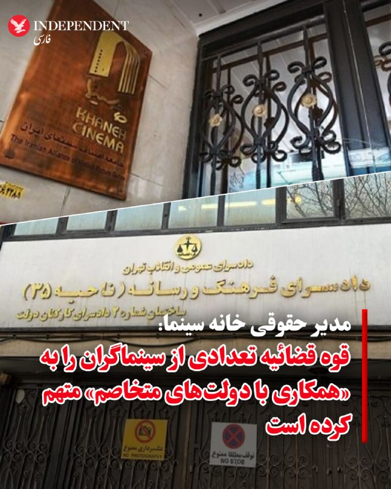

♦️مهدی کوهیان، مدیر حقوقی خانه سینما، با تایید احضار تعدادی از سینماگران از جمله سعید روستایی و هومن سیدی به دادسرای فرهنگ و رسانه، اعلام کرد که قوه قضائیه جمهوری اسلامی این کارگردانان سرشناس را به اتهام سنگین «همکاری با دولت‌های متخاصم» متهم کرده است. پیش از این، هومن سیدی، کارگردان و بازیگر همزمان با کشتار مردم ایران در اعتراضات دی‌ماه ۱۴۰۴، در واکنش به برگزاری جشنواره حکومتی فجر در اینستاگرام نوشته بود: «هیچ جشنواره‌ای، هیچ تندیس و هیچ دیده‌شدنی ارزش ایستادن روی سکوب و عبور از جان انسان را ندارد. دیده‌شدن، وقتی به قیمت ندیدن انسان تمام می‌شود، فقط یک معامله‌ ارزان است. سینما وقتی کنار انسان می‌ایستد معنا دارد؛ وقتی از روی او رد می‌شود، دیگر فقط یک تصویر بی ارزش است».
کوهیان با انتقاد از این اقدام دستگاه قضایی جمهوری اسلامی تصریح کرد که طرح چنین عناوین کیفری سنگینی علیه هنرمندانی که سال‌ها برای تولید فرهنگ ایرانی تلاش کرده‌اند، بدون مستندات روشن تنها به تعمیق شکاف‌های اجتماعی و آسیب به انسجام داخلی منجر می‌شود و ابلاغ مداوم آن در احضاریه‌ها، متاسفانه باعث «شکسته شدن تابوی این اتهام بزرگ» شده است. مدیر حقوقی خانه سینما در بخش دیگری از گفتگو با خبرگزاری ایسنا اعلام کرد که تعدادی از این سینماگران برخلاف درخواست صنف برای حفظ سکوت، خبر احضار خود را به رسانه‌ها درز داده‌اند؛ اقدامی که به گفته او «از منظر میهن‌پرستی و تدبیر جمعی به ضرر فضای کلی سینما و کشور بوده است».
‌🇸🇦 Indypersian

🤖 @VahidOOnLine

## VahidOOnLine — post 242011

  

♦️اسرائیل تایمز یکشنبه سوم خردادماه گزارش داد ایال زمیر، رئیس ستاد کل ارتش اسرائیل، اعلام کرد ارتش این کشور آماده بازگشت فوری به جنگ با جمهوری اسلامی و تشدید حملات علیه حزب‌الله است. او همچنین پس از ارزیابی وضعیت میدانی، طرح‌های ادامه نبرد علیه حزب‌الله در لبنان را تایید کرد.

زمیر در بازدید از فرماندهی منطقه شمال و مقر تیپ زرهی ۴۰۱ گفت ارتش اسرائیل مصمم است حملات علیه حزب‌الله را عمیق‌تر کند و به حمله به این گروه «در همه ابعاد» ادامه دهد.

او تاکید کرد امنیت ساکنان و حفظ جان نیروهای اسرائیلی «بالاتر از هر چیز» است و افزود ارتش اسرائیل آماده است فورا به درگیری‌های شدید بازگردد و حکومت «تروریستی» جمهوری اسلامی و توانمندی‌های آن را بیش از پیش تضعیف کند.

اظهارات رئیس ستاد کل ارتش اسرائیل در حالی مطرح می‌شود که آمریکا و جمهوری اسلامی در حال مذاکره برای دستیابی به توافقی احتمالی هستند؛ توافقی که گزارش شده ممکن است شامل بندی درباره توقف درگیری‌ها در لبنان باشد.

زمیر همچنین از عملکرد تیپ ۴۰۱ تمجید کرد و برای مئیر بیدرمن، فرمانده این تیپ که هفته گذشته در جنوب لبنان به‌شدت زخمی شد، آرزوی بهبودی سریع کرد.
‌🇸🇦 Indypersian

🤖 @VahidOOnLine

## VahidOOnLine — post 242010

  <a href="telegram/content/VahidOOnLine_242010_1779666357.mp4" target="_blank">🎬 Download video</a>

دادگاهی در بحرین، ۹ متهم را به اتهام همکاری با سپاه پاسداران به حبس ابد محکوم کرده است.
به گزارش رویترز، این افراد به اتهام «انجام اقدامات خصمانه و تروریستی علیه بحرین» و همکاری با سپاه پاسداران محکوم شده‌اند. دو متهم دیگر نیز به سه سال زندان محکوم شده‌اند.
براساس اعلام دادستانی، این افراد متهم به جمع‌آوری اطلاعات از اماکن حساس و تسهیل انتقال‌های مالی مرتبط بوده‌اند.
این پرونده پس از آن مطرح شد که وزارت کشور بحرین اعلام کرد در ماه مه ۴۱ نفر را در ارتباط با شبکه‌ای مرتبط با سپاه پاسداران بازداشت کرده است. مقامات بحرینی مدعی شده‌اند این شبکه با هدف اقدامات امنیتی علیه کشور فعالیت داشته است.
در همین حال، تنش‌ها میان ایران و کشورهای منطقه پس از درگیری‌های اخیر و حملات متقابل در خلیج فارس افزایش یافته است؛ هرچند تهران همواره این اتهامات را رد کرده و آنها را سیاسی می‌داند.
‌🏁 🇬🇧 ManotoTV

🤖 @VahidOOnLine

## VahidOOnLine — post 242009

  <a href="telegram/content/VahidOOnLine_242009_1779666358.mp4" target="_blank">🎬 Download video</a>

خبرگزاری رویترز به نقل از یک مقام دولت آمریکا گزارش داده است که جمهوری‌اسلامی در اصل با کنار گذاشتن ذخایر اورانیوم نزدیک به سطح تسلیحاتی خود موافقت کرده است.
به گفته این مقام ارشد در دولت ترامپ، واشنگتن معتقد است رهبر جمهوری اسلامی چارچوب کلی این توافق را تایید کرده است. با این حال هنوز از سوی تهران تأیید رسمی یا توضیحی درباره معنای دقیق «موافقت اصولی» ارائه نشده است.
این مقام آمریکایی همچنین در واکنش به گزارش‌هایی مبنی بر اینکه جمهوری‌اسلامی با کنار گذاشتن ذخایر اورانیوم غنی‌شده موافقت نکرده، گفته است: «موضوع این نیست که آیا، بلکه چگونه.»
در همین حال، منابع جمهوری‌اسلامی به رویترز گفته‌اند که در مراحل بعدی مذاکرات می‌توان «فرمول‌های عملی» برای حل این مسئله پیدا کرد؛ از جمله رقیق‌سازی اورانیوم تحت نظارت آژانس بین‌المللی انرژی اتمی.
بر اساس گزارش آژانس بین‌المللی انرژی اتمی، جمهوری‌اسلامی در حال حاضر ۴۴۰.۹ کیلوگرم اورانیوم با غنای ۶۰ درصد در اختیار دارد؛ سطحی که از نظر فنی تنها یک گام کوتاه تا سطح تسلیحاتی ۹۰ درصد فاصله دارد.
‌🏁 🇬🇧 ManotoTV

🤖 @VahidOOnLine

## VahidOOnLine — post 242008

  <a href="telegram/content/VahidOOnLine_242008_1779666358.mp4" target="_blank">🎬 Download video</a>

دونالد ترامپ جونیور، پسر رئیس‌جمهور‌ آمریکا در شبکه اکس، با بازنشر پستی مرتبط با مذاکرات آمریکا با جمهوری‌اسلامی نوشته است «این یک پیروزی بسیار بزرگ برای آمریکا است. ما باید حرف کسانی را نادیده بگیریم که فقط زمانی خوشحال می‌شوند که حمله زمینی به ایران انجام شود. پدر من وعده داده بود که جلوی دست‌یابی ایران به سلاح هسته‌ای را بگیرد و دقیقاً هم دارد همین کار را انجام می‌دهد»

دونالد ترامپ جونیور، فرزند ارشد رئیس‌جمهور آمریکا، ۲۱ می با بتینا اندرسون، اینفلوئنسر ۳۹ ساله اهل پالم بیچ فلوریدا، ازدواج کرد.
این زوج ابتدا یک مراسم قانونی و کاملا خصوصی را در وست پالم بیچ برگزار کردند و سپس جشن اصلی ازدواج در ۲۳ می، در یک جزیره خصوصی در باهاما و با حضور جمعی از اعضای خانواده و دوستان نزدیک برگزار شد.
این مراسم به‌صورت محدود و دور از رسانه‌ها انجام شد.
در همین حال، دونالد ترامپ، پدر داماد، اعلام کرد که به دلیل «مسائل دولتی و تعهدات مربوط به آمریکا» قادر به حضور در مراسم نبوده است. او گفته است که شرایط حساس سیاسی و تنش‌های جاری، از جمله وضعیت مرتبط با جمهوری‌اسلامی و تحولات منطقه‌ای، مانع حضورش در این مراسم شده است.
‌🏁 🇬🇧 ManotoTV

🤖 @VahidOOnLine

## VahidOOnLine — post 242007

  <a href="telegram/content/VahidOOnLine_242007_1779666360.mp4" target="_blank">🎬 Download video</a>

هشت تن از متهمان پرونده «شهرک اکباتان» توسط شعبه ۱۵ دادگاه انقلاب تهران به ریاست قاضی ابوالقاسم صلواتی به احکام سنگین قضایی محکوم شدند.
بر اساس این حکم، میلاد آرمون، نوید نجاران، مهدی ایمانی و سید محمدمهدی حسینی از بابت اتهام «محاربه» به اعدام محکوم شده‌اند.
همچنین امیرمحمد خوش‌اقبال، علیرضا برمرز پورناک، علیرضا کفایی و حسین نعمتی نیز هرکدام به ۵ سال حبس بابت اتهام اجتماع و تبانی، ۲ سال حبس بابت تبلیغ علیه نظام، ۲ سال منع فعالیت در فضای مجازی و همچنین ۲ سال منع اقامت در تهران و البرز محکوم شده‌اند.
شعبه ۱۳ دادگاه کیفری یک تهران چند روز پیش حکم قصاص ۶ متهم این پرونده را نقض کرد. بر اساس این رای، سه نفر به ۵ سال حبس و پرداخت دیه محکوم شدند و سه نفر دیگر نیز از اتهامات تبرئه شدند.
اما بخش امنیتی پرونده که در شعبه ۱۵ دادگاه انقلاب رسیدگی می‌شود، امروز احکام متفاوتی صادر کرد؛ به‌طوری که چهار متهم شامل میلاد آرمون، نوید نجاران، سیدمحمدمهدی حسینی و مهدی ایمانی به اعدام محکوم شدند و چهار متهم دیگر نیز مجموعاً به ۷ سال حبس محکوم شدند.
نکته جنجالی این پرونده اما نحوه ابلاغ احکام است؛ به گفته وکلای متهمان، رأی دادگاه بدون حضور وکلا و به‌صورت شفاهی به متهمان در زندان اعلام شده و تاکنون نسخه رسمی رای در اختیار آن‌ها قرار نگرفته است.
وکلای پرونده این روند را غیرقانونی و خلاف آیین دادرسی عنوان کرده و می‌گویند حتی از جزئیات دقیق اتهامات و شماره دادنامه نیز مطلع نشده‌اند؛ موضوعی که به گفته آن‌ها عملا امکان اعتراض به حکم را با ابهام جدی مواجه کرده است.
این پرونده که از دل اعتراضات ۱۴۰۱ و کشته شدن طلبه بسیجی آرمان علی‌وردی شکل گرفته، همچنان در دو مسیر جداگانه قضایی در حال رسیدگی است.
‌🏁 🇬🇧 ManotoTV

🤖 @VahidOOnLine

## VahidOOnLine — post 242006

  

مذاکره‌کنندگان ایرانی آزادسازی فوری ۱۲ میلیارد دلار از دارایی‌های مسدودشده ایران در قطر را پیش‌شرط پیشبرد مذاکرات با آمریکا اعلام کرده‌اند.

یک منبع مطلع با آگاهی مستقیم از روند گفت‌وگوها به ایران‌اینترنشنال گفت تهران اصرار دارد در مرحله اولیه یادداشت تفاهم، دسترسی واقعی و تضمین‌شده به این منابع فراهم شود و بدون آن، تفاهم دیپلماتیک مقدماتی پیش نخواهد رفت.

به گفته این منبع، این مبلغ تنها بخش فوری مورد درخواست ایران برای آغاز نقشه راه دیپلماتیک است و تهران خواهان آزادسازی کامل همه دارایی‌های مسدودشده خود در جهان در چارچوب توافق جامع نهایی است.

هم‌زمان، خبرگزاری تسنیم، وابسته به سپاه پاسداران، گزارش داد اختلافات تهران و واشینگتن بر سر یک یا دو بند یادداشت تفاهم احتمالی همچنان باقی است.

تسنیم نوشت ایران خواستار آزادسازی بخشی از دارایی‌های خود در گام نخست و تعیین سازوکاری برای آزادسازی باقی منابع در جریان مذاکرات شده است.

این رسانه افزود آمریکا تلاش کرده آزادسازی دارایی‌ها را به توافق نهایی هسته‌ای مشروط کند و مانع‌تراشی واشینگتن در این زمینه ادامه دارد که احتمال لغو توافق را همچنان زنده نگه داشته است.
http
‌🏁 🇬🇧 IranintlTV

🤖 @VahidOOnLine

## VahidOOnLine — post 242005

  <a href="telegram/content/VahidOOnLine_242005_1779666361.mp4" target="_blank">🎬 Download video</a>

ویدیوهای دریافت‌شده نشان می‌دهد جمعی از ایرانیان ساکن آتلانتا در آمریکا، روز یک‌شنبه سوم خرداد، در حمایت از مردم ایران و شاهزاده رضا پهلوی تجمع و راهپیمایی برگزار کردند. آن‌ها علیه اعدام‌های جمهوری اسلامی شعار سر دادند و از دولت آمریکا خواستند با این حکومت هیچ توافقی نکند.
‌🏁 🇬🇧 IranintlTV

🤖 @VahidOOnLine

## VahidOOnLine — post 242004

  <a href="telegram/content/VahidOOnLine_242004_1779666363.mp4" target="_blank">🎬 Download video</a>

♦️تصاویر منتشر شده در شبکه‌های اجتماعی که بسیار مورد توجه قرار گرفته است، تلاش نافرجام مردی را نشان می‌دهد که با پوشیدن لباس سفید و ایستادن در میان امواج متلاطم ساحل، سعی داشت معجزه شکافتن دریا توسط «حضرت موسی» را شبیه‌سازی کند. در ابتدای این ویدئو، جمعیتی که در ساحل نظاره‌گر این صحنه بودند با شور و هیجان زیاد و بالا بردن دست‌هایشان او را تشویق می‌کردند، اما این نمایش چندان طولی نکشید و به محض این‌که یک موج بسیار سهمگین به سمت او هجوم آورد، این مدعی پا به فرار گذاشت. انتشار این ویدئو واکنش‌های طنزآمیز و کنایه‌آمیز کاربران در شبکه‌های اجتماعی را به‌همراه داشت. بسیاری از کاربران با بازنشر این ویدئو به طنز نوشتند که «طبیعت و جاذبه زمین هیچ‌وقت با کسی شوخی ندارد».
‌🇸🇦 Indypersian

🤖 @VahidOOnLine

## VahidOOnLine — post 242003

  

♦️مارکو روبیو، وزیر امور خارجه ایالات متحده، روز یکشنبه، سوم خردادماه، با انتشار بیانیه‌ای رسمی در اکس، فراخوان حزب‌الله برای سرنگونی دولت لبنان را به شدت محکوم کرد و نوشت: «ایالات متحده با شدیدترین لحن، اقدام بی‌ملاحظه حزب‌الله در فراخوان برای سرنگونی دولت دموکراتیک و منتخب لبنان را محکوم می‌کند؛ این گروه با نادیده گرفتن درخواست‌های مکرر دولت قانونی لبنان برای توقف حملات و احترام به آتش‌بس، به شلیک به مواضع اسرائیل و انتقال شبه‌نظامیان و تسلیحات به جنوب لبنان ادامه داده که این یک کارزار عمدی برای بی‌ثبات کردن کشور است.» وزیر خارجه آمریکا با تاکید بر حمایت قاطع واشنگتن از بیروت افزود: «دولت لبنان با حمایت کامل ایالات متحده برای بازسازی و ایجاد آینده‌ای باثبات تلاش می‌کند، اما در مقابل، حزب‌الله در حال کشاندن کشور به سمت هرج‌ومرج و نابودی است؛ ما قاطعانه در کنار دولت قانونی لبنان ایستاده‌ایم و اجازه نخواهیم داد تهدیدهای خشونت‌آمیز حزب‌الله برای سرنگونی دولت به نتیجه برسد، چرا که دوران گروگان گرفته شدن یک ملت کامل توسط یک گروه تروریستی رو به پایان است.»
‌🇸🇦 Indypersian

🤖 @VahidOOnLine

## VahidOOnLine — post 242002

  

♦️ دونالد ترامپ، رئیس‌جمهوری آمریکا، هم‌زمان با مذاکرات فشرده دیپلماتیک میان واشنگتن و تهران، تصویری معنادار و هشدارآمیز از یک بمب نصب‌شده زیر بال یک جنگنده را در شبکه اجتماعی «تروث سوشال» منتشر کرد که روی آن عبارت «از توجه شما به این موضوع سپاسگزارم!» درج شده است. این پیام پس از آن منتشر شد که ترامپ با حمله به منتقدان و «بازنده» خواندن آن‌ها تاکید کرد برخلاف اوباما تن به یک «توافق بد» نخواهد داد و اگرچه چارچوب تفاهم با ایران بر سر ذخایر هسته‌ای و تنگه هرمز تا ۹۵ درصد پیش رفته، اما هنوز نهایی نشده است. این تصویر در واقع بازتاب‌دهنده همان موضع سرسختانه مقامات کاخ سفید و وزیر خارجه آمریکا، مارکو روبیو، در روز یکشنبه است که اعلام کردند واشنگتن برای امضای توافق عجله‌ای ندارد و در صورت عدم پایبندی تهران به اصول فنی مذاکرات و رویکرد «نه غبار، نه دلار»، گزینه‌های نظامی و ازسرگیری حملات سنگین علیه ایران کاملا روی میز باقی خواهد ماند.

#دونالد_ترامپ #ایران #آمریکا #مذاکرات #تنگه_هرمز #حمله_نظامی #ایندیپندنت_فارسی
‌🇸🇦 Indypersian

🤖 @VahidOOnLine

## VahidOOnLine — post 242001

  

♦️تسنیم، خبرگزاری وابسته به سپاه پاسداران، روز یکشنبه به نقل از «یک مقام مطلع» گزارش داد: «هیچگونه خوش‌بینی به آمریکا ندارد و رد و بدل پیامها از طریق میانجی پاکستانی نیز دائماً با در نظر گرفتن بدبینی به دولت آمریکا صورت می‌گیرد». تسنیم به نقل از این منبع در ادامه نوشت: «تا این لحظه تفاهم نهایی حاصل نشده و چالش در بعضی بندها ادامه دارد، اما حتی اگر تفاهم اولیه‌ای نیز صورت بگیرد، به معنای تغییر نگاه ایران به آمریکا و اطمینان از اجرای تعهدات این دولت نیست. آمریکایی‌ها سابقه بسیار بدی در مذاکرات دارند که بدبینی ها را تقویت و تثبیت می‌کند. پس حتی اگر تفاهمی نیز صورت بگیرد ایران در طول روند پس از اعلام تفاهم، اقدامات آمریکا را زیر نظر خواهد گرفت و در صورتی که آمریکا در آن مرحله نقض عهد کند، ایران اهرم‌های خود برای مواجهه با آن را حفظ خواهد کرد».
تسنیم پیش از این نیز از «کارشکنی‌های آمریکا» در بندهای تفاهم از جمله در آزادسازی اموال بلوکه شده ایران گزارش داده و نوشته بود: «همچنان امکان منتفی شدن تفاهم وجود دارد».
‌🇸🇦 Indypersian

🤖 @VahidOOnLine

## VahidOOnLine — post 242000

  

خبرگزاری فارس وابسته به سپاه پاسداران نوشت که دادگاه انقلاب تهران ۴ نفر از «متهمان اصلی» در پرونده شهرک اکباتان را به اتهام «افساد فی‌الارض»، به اعدام محکوم کرده است.
فارس نوشت متهمان ردیف پنجم تا نهم پرونده شهرک اکباتان به اتهام «اجتماع و تبانی برای ارتکاب جرم علیه امنیت داخلی کشور» و «فعالیت تبلیغی علیه نظام جمهوری اسلامی»، به حبس از یک تا پنج سال و مجازات‌های تکمیلی محکوم شده‌اند.
قوه قضاییه روز شنبه در اطلاعیه‌ای اعلام کرد رای صادره در پرونده شهرک اکباتان مربوط به دادگاه کیفری بوده و رسیدگی به اتهامات امنیتی مانند «محاربه» و «افساد فی‌الارض» همچنان در دادگاه انقلاب مفتوح است.
‌🏁 🇬🇧 IranintlTV

🤖 @VahidOOnLine

## VahidOOnLine — post 241999

  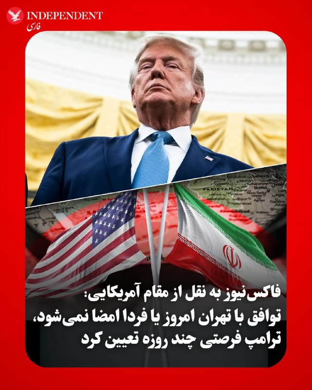

♦️یک مقام رسمی ایالات متحده در گفتگو با شبکه «فاکس‌نیوز» اعلام کرد که واشنگتن هنوز به توافق نهایی با تهران دست نیافته است و هیچ توافقی امروز یا فردا امضا نخواهد شد؛ این مقام مسئول با تاکید بر این‌که آمریکا تسلیم خواسته‌های طرف مقابل نخواهد شد، افزود که تمایل و تصمیم دونالد ترامپ، رئیس‌جمهوری آمریکا، این است که یک فرصت ۵ تا ۷ روزه دیگر به مذاکره‌کنندگان بدهد تا توافق را به مرحله نهایی برسانند. بر اساس این گزارش، یک توافق چارچوبی با ایران تا روز یکشنبه تا ۹۵ درصد پیشرفت داشته است و اگرچه دو طرف بر سر کلیات مربوط به ذخایر هسته‌ای تهران و بازگشایی تنگه هرمز به توافق رسیده‌اند، اما چانه‌زنی مذاکره‌کنندگان بر سر جزئیات و «ادبیات دقیق» متن این تفاهم‌نامه همچنان ادامه دارد.
براساس این گزارش، این مقام آمریکایی با تایید این‌که سیاست اصلی کاخ سفید در این توافق بر مبنای رویکرد «نه غبار، نه دلار» هدایت می‌شود، تصریح کرد که ایران در اصول با این چارچوب موافقت کرده است؛ او خاطرنشان کرد که این تفاهم، فرصتی را برای کاهش هزینه‌های شهروندان آمریکایی فراهم می‌آورد و در عین حال تضمین می‌کند که ایرانی‌ها به سلاح هسته‌ای دست پیدا نکنند. فاکس‌نیوز افزود که ترامپ روز یکشنبه به مذاکره‌کنندگان دستور داده است که برای امضای توافق عجله نکنند چرا که زمان به نفع واشنگتن است؛ با این حال، مقامات تاکید کرده‌اند که قطعا تن به یک «توافق بد» نخواهند داد و گزینه‌های جایگزین روی میز است، به طوری که در صورت عدم دستیابی به توافق نهایی، ایالات متحده می‌تواند حملات نظامی خود را علیه ایران از سر بگیرد.
‌🇸🇦 Indypersian

🤖 @VahidOOnLine

## VahidOOnLine — post 241998

  <a href="telegram/content/VahidOOnLine_241998_1779666366.mp4" target="_blank">🎬 Download video</a>

در بحبوحه گمانه‌زنی‌ها درباره سرنوشت مذاکرات آمریکا و جمهوری اسلامی، دونالد ترامپ در پستی جدید در تروث سوشال، بدون توضیحی اضافه، تصویری از یک بمب منتشر کرد که روی آن نوشته شده بود: «از توجه شما به این موضوع سپاسگزارم»؛ جمله‌ای که او معمولا در پایان مطالبش در این شبکه اجتماعی منتشر می‌کند.
‌🏁 🇬🇧 ManotoTV

🤖 @VahidOOnLine

## mwarmonitor — post 9660

📝 من هیچ‌وقت به این موضوعات ورود نکردم، اما لازم دونستم در مورد حواشی اخیر بین شاهین نجفی و علی کریمی بپردازم

🔰وقتی به ریشه این اختلافات مسخره و خانمان‌سوز نگاه می‌کنیم، متوجه می‌شویم که مشکل اصلی ما نداشتن هدف مشترک نیست، بلکه جابه‌جا شدن جایگاه «مبارزه» با «نمایش» است. در دنیایی که سیاستش اسیر لایک و فالوور اینستاگرام شده، یک حاشیه کوچک در کنسرت لندن یا تکل خشن جادوگر فوتبال روی پای رپر معترض، به سرعت تبدیل به یک جنگ جهانی مجازی می‌شود. چهره‌هایی که قرار بود موتور محرک یک دگرگونی بزرگ باشند، حالا چنان درگیر وزن‌کشی‌های شخصی و اثبات برتری فکری خود شده‌اند که فراموش کرده‌اند زمین بازی اصلی کجاست. جمهوری اسلامی عملاً نیازی به طراحی نقشه‌های پیچیده برای تفرقه‌افکنی ندارد؛ کافی است با یک کاسه پاپ‌کورن بنشیند و تماشا کند که چطور این پتانسیل عظیم، صرف فحاشی به یکدیگر و تحلیل زاویه نگاه فلان خواننده روی استیج می‌شود.
🔸مفهوم «رهبری واحد» نیز در این میان بیشتر به یک شوخی تلخ و کمدی سیاه شباهت دارد تا یک راهبرد نجات‌بخش. تا زمانی که مدل ذهنی جریان‌های مختلف بر پایه فرمول «همه با من» استوار باشد و نه «همه با هم»، هرگونه ائتلافی پیش از تولد محکوم به مرگ است. در این اتمسفر بیمار، تا کسی به عملکرد شاهزاده یا انحصارطلبی مشاوران و اطرافیان او کوچک‌ترین نقدی وارد می‌کند، لشکری از طرفداران متعصب و بادیگاردهای مجازیِ با چماق تکفیر و تهمت خیانت به او هجوم می‌برند. علی کریمی هم با همان روحیه سرکش و بدون پاس‌کاری‌های مصلحت‌آمیز، شوت را درست به قلب این تشکیلات می‌زند تا مرزبندی‌ها پررنگ‌تر و شکاف‌ها عمیق‌تر از همیشه شوند. این یعنی ما هنوز الفبای کار تشکیلاتی را بلد نیستیم و ترجیح می‌دهیم در جزیره‌های کوچک و مستقل خود، پادشاهی‌های خیالی بسازیم.
🔹بزرگ‌ترین تراژدی این است که مبارزه سیاسی عملاً به یک تجارت برندینگ شخصی تبدیل شده که در آن، حفظ منزلت و جایگاه فردی بر سرنوشت یک ملت ارجحیت دارد. ما یاد نگرفته‌ایم که می‌توان با کسی اختلاف نظر عمیق فرهنگی، عقیدتی یا هنری داشت، اما در یک سنگر مشترک علیه دشمنی واحد مبارزه کرد. برای ما ابتدا باید طهارت فکری، سبک زندگی و شجره‌نامه سیاسی طرف مقابل به تایید برسد تا بعد ببینیم آیا او صلاحیت دارد در کنار ما ایستادگی کند یا خیر. تا زمانی که متر و معیارِ سقوط یک رژیم، میزان سوزش استوری‌های کنایه‌آمیز، تعداد بادیگاردهای مجازی چهره‌ها و سهم‌خواهی از قدرتِ پیش‌فروش شده آینده باشد، این چرخ باطل به چرخیدن ادامه خواهد داد و ما خودمان، بزرگ‌ترین مانع پیروزی خودمان خواهیم بود.

@mwarmonitor

## pm_afshaa — post 91424

  <a href="telegram/content/pm_afshaa_91424_1779666366.webm" target="_blank">🎬 Download video</a>

🔴قلهکی، فعال رسانه‌ای اصولگرا:
دلیل اینکه تفاهم اسلام آباد هنوز امضا نشده اینه که نتانیاهو زنگ زده به ترامپ و پُرش کرده، آمريکا هم زده زیرش و گفته تا قبل اینکه 400 کیلو اورانیوم رو تحویل ندید، خبری از پول‌های بلوکه شده نیست!

💧 Rainbet.com the #1 Non-KYC Crypto Casino & Sportsbook @rainbetcom

😁 @Pm_Afshaa

## pm_afshaa — post 91423

  <a href="telegram/content/pm_afshaa_91423_1779666367.webm" target="_blank">🎬 Download video</a>

🔴بعد از اخبار توافق احتمالی ایران و آمریکا، نفت با قیمت 98 دلار باز شد.

💧 Rainbet.com the #1 Non-KYC Crypto Casino & Sportsbook @rainbetcom

😁 @Pm_Afshaa

## pm_afshaa — post 91421

  <a href="telegram/content/pm_afshaa_91421_1779666367.webm" target="_blank">🎬 Download video</a>

🔴توییتِ کمال، سخنگوی فارسی زبان ارتش اسرائیل: کس نخارد پشت من جز ناخن انگشت من.

💧 Rainbet.com the #1 Non-KYC Crypto Casino & Sportsbook @rainbetcom

😁 @Pm_Afshaa

## pm_afshaa — post 91420

  <a href="telegram/content/pm_afshaa_91420_1779666368.webm" target="_blank">🎬 Download video</a>

🔴نیویورک‌پست:

احتمال رسیدن به توافق بین آمریکا و ایران به طور فزاینده‌ای کاهش یافته. هر دو طرف در ابتدا موافقت کردن که برخی از خواسته‌های حداکثری رو کنار بذارن، اما 24 ساعت بعد پس از فشار شدید اسرائیلی‌ها و دیگر طرفداران اسرائیل نزدیک به ترامپ، او لحن خودش رو به طور چشمگیری تغییر داده و خواستار آن شده که ایرانی‌ها برای هرگونه رفع تحریم و دارایی‌های مسدود شده، کل ذخیره اورانیوم خود را کنار بذارن، در حالی که در ابتدا قرار بود که بخشی از دارایی‌ها به عنوان بخشی از تفاهمنامه آزاد بشه.

تفاهمنامه روز جمعه، تحت فشار شدید است و احتمال فرو پاشیدن آن زیاده، مگه اینکه یکی از طرفین عقب‌نشینی کنه.

💧 Rainbet.com the #1 Non-KYC Crypto Casino & Sportsbook @rainbetcom

😁 @Pm_Afshaa

## pm_afshaa — post 91419

  <a href="telegram/content/pm_afshaa_91419_1779666368.webm" target="_blank">🎬 Download video</a>

🔴مقام آمریکایی به سی‌ان‌ان:
آزادسازی منابع مالی ایران منوط به گشایش کامل هرمز و اجرای تعهدات هسته‌ای خود است!

💧 Rainbet.com the #1 Non-KYC Crypto Casino & Sportsbook @rainbetcom

😁 @Pm_Afshaa

## pm_afshaa — post 91418

  <a href="telegram/content/pm_afshaa_91418_1779666369.webm" target="_blank">🎬 Download video</a>

🔴پست جدید ترامپ در تروث سوشال:
روی بمب نوشت شده: از توجه شما به این موضوع سپاسگزارم.

💧 Rainbet.com the #1 Non-KYC Crypto Casino & Sportsbook @rainbetcom

😁 @Pm_Afshaa

## pm_afshaa — post 91417

  <a href="telegram/content/pm_afshaa_91417_1779666369.webm" target="_blank">🎬 Download video</a>

🔴اکسیوس:
ترامپ از رهبران منطقه خواست بعد از پایان جنگ ایران به پیمان‌های ابرهیم بپیوندن.

💧 Rainbet.com the #1 Non-KYC Crypto Casino & Sportsbook @rainbetcom

😁 @Pm_Afshaa

## DEJradio — post 4928

  

😎پیام تهدید آمیز ترامپ در تروث سوشیال، یک روز پس از پررنگ تر شدن احتمال توافق با جمهوری اسلامی!

"از شما بابت توجهتون به این موضوع متشکرم!

#ترامپ #مذاکرات
@DEJradio

## VahidOnline — post 75693

  

سی‌بی‌اس: مجتبی خامنه‌ای در مکانی نامعلوم با دسترسی کم به دنیای خارج پنهان شده است.

ترجمه ماشین:
اطلاعات نهادهای امنیتی آمریکا نشان می‌دهد که رهبر عالی ایران عملاً در مکانی نامعلوم پنهان شده، دسترسی محدودی به جهان خارج دارد و ارتباط با او تنها از طریق شبکه‌ای پیچیده از پیک‌ها امکان‌پذیر است؛ این را مقام‌های آمریکایی آگاه از موضوع گفته‌اند.

به گفته این منابع، مقام‌های ایرانی که مجوز همکاری با دولت ترامپ را دارند، برای برقراری ارتباط در داخل ساختار حکومتی خودشان با دشواری روبه‌رو بوده‌اند؛ مسئله‌ای که یکی از دلایل اصلی تأخیر در روشن شدن جزئیات توافق احتمالی با ایران و توافق‌های قبلی بوده است.

دو مقام آمریکایی گفتند وقتی آمریکا جزئیات پیشنهادی را ارسال می‌کند، دشواری دسترسی به رهبر عالی باعث می‌شود گاهی پیش از دریافت پاسخ از سوی آمریکا، تأخیری طولانی رخ دهد.

سخنگوی کاخ سفید از اظهارنظر درباره اطلاعات مربوط به محل حضور رهبر عالی یا روش‌های ارتباطی ایران خودداری کرد.

یک مقام ارشد دولت روز یکشنبه گفت رهبر عالی با چارچوب کلی پیش‌نویس توافق فعلی موافقت کرده و دونالد ترامپ، رئیس‌جمهوری آمریکا، در تروث‌سوشال نوشت که انتظار دارد ظرف چند روز آینده پاسخ نهایی اعلام شود.

مجتبی خامنه‌ای، رهبر عالی ایران، که در حملات آمریکا و اسرائیل در عملیات «خشم حماسی» زخمی شده بود، برای جلوگیری از حملاتی مشابه حملاتی که به کشته شدن پدرش، آیت‌الله علی خامنه‌ای، منجر شد، تدابیر بسیار شدیدی اتخاذ کرده است. علی خامنه‌ای از سال ۱۹۸۹ تا ۲۸ فوریه بر ایران حکومت می‌کرد. مجتبی خامنه‌ای از پیش از آغاز جنگ تاکنون به‌طور رسمی در انظار عمومی دیده یا شنیده نشده است.

یکی از مقام‌ها گفت اطلاعات به‌دست‌آمده توسط نهادهای اطلاعاتی آمریکا و اسرائیل از داخل حکومت ایران، امکان شناسایی و حذف بخش بزرگی از رهبری ارشد ایران در جریان جنگ را فراهم کرده است.

منابع گفتند در حال حاضر بیشتر رهبران ایران نور روز را نمی‌بینند، هفته‌ها در پناهگاه‌های به‌شدت مستحکم می‌مانند و جز در موارد کاملاً ضروری از صحبت با یکدیگر خودداری می‌کنند.

یکی از مقام‌ها گفت: «تماشای تلاش آن‌ها برای فهمیدن این‌که چطور با هم حرف بزنند، تقریباً مثل تماشای یک سیتکام است. آن‌ها کاملاً به ستوه آمده‌اند.»

شدیدترین تدابیر احتیاطی از سوی رهبر عالی اتخاذ شده است.

بر اساس طراحی این سازوکار، حتی مقام‌های عالی‌رتبه حکومت ایران هم نمی‌دانند او کجاست و هیچ راهی برای تماس مستقیم با او ندارند.

در عوض، پیام‌ها از طریق شبکه‌ای از پیک‌ها منتقل می‌شود که با هدف پنهان نگه داشتن محل حضور رهبر عالی ایجاد شده است.

یکی از مقام‌ها گفت: «به همین دلیل است که می‌بینید برخی می‌گویند: "رهبر عالی با چارچوب موافقت کرده" یا "منتظر پاسخ درباره نکات نهایی توافق هستیم." هر اطلاعاتی که به او می‌رسد، از پیش قدیمی شده و پاسخ‌های او با تأخیر زیادی همراه است.»

رهبر عالی در قالب کلیات با زیردستان خود ارتباط برقرار کرده و به آن‌ها جهت داده است که درباره چه موضوعاتی می‌توانند مذاکره کنند و چه موضوعاتی نباید مطرح شود.
cbsnews

📡 @VahidOnline

## VahidOnline — post 75691

یک مقام رسمی ایالات متحده در گفتگو با شبکه «فاکس‌نیوز» اعلام کرد که واشنگتن هنوز به توافق نهایی با تهران دست نیافته است و هیچ توافقی امروز یا فردا امضا نخواهد شد؛ این مقام مسئول با تاکید بر این‌که آمریکا تسلیم خواسته‌های طرف مقابل نخواهد شد، افزود که تمایل و تصمیم دونالد ترامپ، رئیس‌جمهوری آمریکا، این است که یک فرصت ۵ تا ۷ روزه دیگر به مذاکره‌کنندگان بدهد تا توافق را به مرحله نهایی برسانند.

بر اساس این گزارش، یک توافق چارچوبی با ایران تا روز یکشنبه تا ۹۵ درصد پیشرفت داشته است و اگرچه دو طرف بر سر کلیات مربوط به ذخایر هسته‌ای تهران و بازگشایی تنگه هرمز به توافق رسیده‌اند، اما چانه‌زنی مذاکره‌کنندگان بر سر جزئیات و «ادبیات دقیق» متن این تفاهم‌نامه همچنان ادامه دارد.
@VahidOOnLine
تسنیم، خبرگزاری وابسته به سپاه پاسداران، روز یکشنبه به نقل از «یک مقام مطلع» گزارش داد: «هیچگونه خوش‌بینی به آمریکا ندارد و رد و بدل پیامها از طریق میانجی پاکستانی نیز دائماً با در نظر گرفتن بدبینی به دولت آمریکا صورت می‌گیرد».

تسنیم به نقل از این منبع در ادامه نوشت: «تا این لحظه تفاهم نهایی حاصل نشده و چالش در بعضی بندها ادامه دارد، اما حتی اگر تفاهم اولیه‌ای نیز صورت بگیرد، به معنای تغییر نگاه ایران به آمریکا و اطمینان از اجرای تعهدات این دولت نیست. آمریکایی‌ها سابقه بسیار بدی در مذاکرات دارند که بدبینی ها را تقویت و تثبیت می‌کند. پس حتی اگر تفاهمی نیز صورت بگیرد ایران در طول روند پس از اعلام تفاهم، اقدامات آمریکا را زیر نظر خواهد گرفت و در صورتی که آمریکا در آن مرحله نقض عهد کند، ایران اهرم‌های خود برای مواجهه با آن را حفظ خواهد کرد».
تسنیم پیش از این نیز از «کارشکنی‌های آمریکا» در بندهای تفاهم از جمله در آزادسازی اموال بلوکه شده ایران گزارش داده و نوشته بود: «همچنان امکان منتفی شدن تفاهم وجود دارد».
@VahidOOnLine

📡 @VahidOnline

## VahidOnline — post 75690

  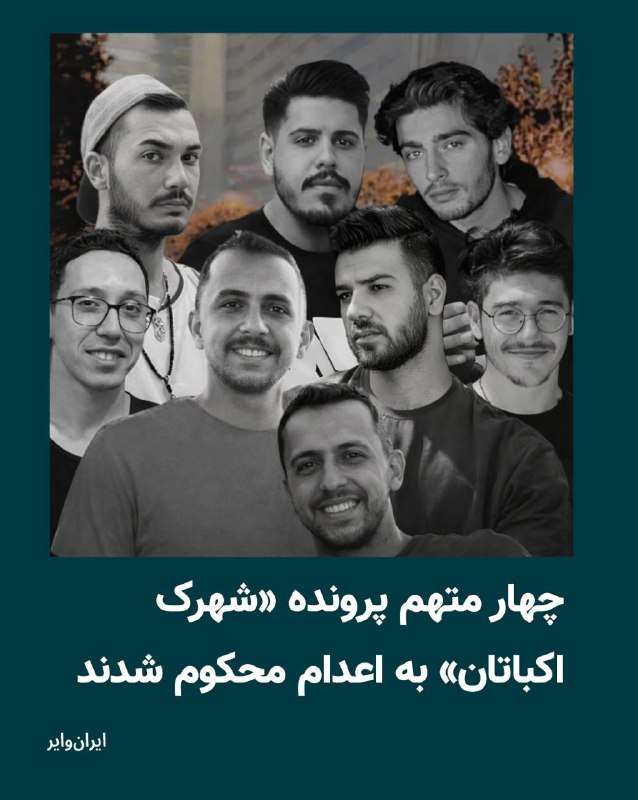

خبرگزاری حکومتی تسنیم، شامگاه یکشنبه سوم خرداد ماه، به نقل از دادگاه انقلاب تهران اعلام کرد، رای اولیه پرونده موسوم به «بچه‌های اکباتان» صادر شده و طی آن چهار نفر از «متهمان اصلی» به اتهام «افساد فی‌الارض» به اعدام محکوم شده‌اند.

به گزارش تسنیم،  اتهامات ۹ نفر از متهمان این پرونده که به دلیل کشته شدن «آرمان علی‌وردی» بسیجی حامی حکومت زندانی شده‌اند مواردی چون  «وارد کردن ضربات چاقو،اخلال در نظم عمومی، اخلال گسترده در امنیت کشور، اجتماع و تبانی برای ارتکاب جرم علیه امنیت داخلی کشور، توزیع کوکتل مولوتف، وارد کردن ضربات سنگ به آرمان علی وردی، ضرب و شتم آرمان علی‌وردی و فعالیت تبلیغی علیه نظام» عنوان شده است.

بر اساس این گزارش، دادگاه انقلاب تهران متهمان ردیف اول تا چهارم پرونده را به اتهام «افساد فی‌الارض» به اعدام محکوم کرد و متهمان ردیف پنجم تا نهم نیز به حبس از یک تا پنج سال و مجازات‌های تکمیلی محکوم شدند.
@VahidOOnLine

شعبه ۱۵ دادگاه انقلاب تهران به ریاست قاضی ابوالقاسم صلواتی چهار تن از متهمان پرونده «شهرک اکباتان» را به اتهام «افسادفی‌الارض» به اعدام محکوم کرد؛ این در حالی است که دادگاه کیفری پیش‌تر اعلام کرده بود انتساب قتل به متهمان به‌صورت قطعی ثابت نشده و امکان صدور حکم قصاص وجود ندارد.

خبرگزاری میزان، وابسته به قوه قضاییه جمهوری اسلامی، روز یکشنبه در گزارشی تلاش کرد صدور این حکم را توجیه کند.
بر اساس این گزارش، رسیدگی به پرونده در دو مرجع موازی انجام شده؛ دادگاه کیفری به اتهام قتل رسیدگی کرد و دادگاه انقلاب به اتهامات امنیتی از جمله افساد فی‌الارض.
میزان مدعی شد که پس از آن‌که کمیسیون پزشکی قانونی و اداره آگاهی هر دو اعلام کردند تعیین فرد وارد کننده ضربه مرگبار به آرمان علی‌وردی ممکن نیست، دادگاه کیفری سه تن از متهمان را از اتهام مشارکت در قتل تبرئه و سه تن دیگر را به پرداخت دیه و حبس محکوم کرد. اما در مسیر موازی، دادگاه انقلاب همان متهمان را به اتهام افساد فی‌الارض به اعدام محکوم کرد.

به گزارش خبرگزاری هرانا، میلاد آرمون، نوید نجاران، مهدی ایمانی و سید محمدمهدی حسینی چهار نفری هستند که حکم اعدام برای آن‌ها صادر شده است.
چهار متهم دیگر این پرونده یعنی امیرمحمد خوش‌اقبال، علیرضا برمرزپورناک، علیرضا کفایی و حسین نعمتی نیز هر کدام به پنج سال زندان، دو سال حبس به اتهام تبلیغ علیه نظام، دو سال منع فعالیت در فضای مجازی و دو سال منع اسکان در تهران و البرز محکوم شدند.
@VahidHeadline

📡 @VahidOnline

## kianmeli1 — post 87648

  <a href="telegram/content/kianmeli1_87648_1779666371.mp4" target="_blank">🎬 Download video</a>

🔴معاون هماهنگ کننده‌ی فرمانده‌ی ارتش

نمیدونم توافق چی هست، سر چی هست
https://t.me/kianmeli1

## kianmeli1 — post 87647

  <a href="telegram/content/kianmeli1_87647_1779666372.mp4" target="_blank">🎬 Download video</a>

🔴دونالد پتی، فضانورد آمریکایی، تصویری از شفق قطبی و طلوع زمین را از فضا منتشر کرد.

او در توضیح این تصویر نوشت: «تماشای شفق قطبی در طلوع زمین، هرگز تکراری نمی‌شود.»
https://t.me/kianmeli1

## kianmeli1 — post 87646

  <a href="telegram/content/kianmeli1_87646_1779666374.mp4" target="_blank">🎬 Download video</a>

🔴 نقدی:
اسرائیل و آمریکا ۲۱۰۰ پرتابه و ۳۰۰ موشک زمین‌به‌زمین به جزیرهٔ بوموسی شلیک کرد اما رزمندگان ما بدون هیچ ضعفی ایستادگی کردند
https://t.me/kianmeli1

## kianmeli1 — post 87645

  

🔴پست ترامپ
روی تصویر بمب نوشته: از توجه شما به این موضوع سپاسگزارم.

( اگر توجه کنید ترامپ مدام از موضع بمب صحبت میکند تا بتواند توافق مد نظرش را بگیرد )
https://t.me/kianmeli1

## IranIntlTV — post 338822

  

مارکو روبیو، وزیر خارجه آمریکا، درخواست حزب‌الله لبنان، از گروه‌های نیابتی جمهوری اسلامی، برای سرنگونی دولت منتخب دموکراتیک لبنان را محکوم کرد و گفت: «تهدیدهای حزب‌الله مبنی بر خشونت و سرنگونی، اجازه موفقیت نخواهد داشت.»

او در بیانیه‌ای که در وب‌سایت وزارت خارجه آمریکا منتشر شد، گفت حزب‌الله درخواست‌های مکرر دولت مشروع لبنان برای توقف حملات و احترام به آتش‌بس را نادیده گرفته و به شلیک به مواضع اسرائیل و انتقال شبه‌نظامیان و سلاح به جنوب لبنان ادامه داده است.

روبیو این اقدامات را «کارزار عمدی برای بی‌ثبات کردن کشور و حفظ قدرت خود به قیمت آینده مردم لبنان» خواند و گفت حزب‌الله در تلاش است لبنان را به هرج‌ومرج و ویرانی بازگرداند.

او تاکید کرد ایالات متحده در کنار دولت مشروع لبنان برای بازگرداندن اقتدار خود و ساختن آینده‌ای بهتر برای مردم این کشور می‌ایستد و افزود: «دورانی که یک گروه تروریستی، کل یک ملت را گروگان گرفته بود، رو به پایان است.»

https://iranintl.com/202605246199

## IranIntlTV — post 338821

  

شبکه خبری سی‌بی‌اس به نقل از مقام‌های آمریکایی آگاه گزارش داد اطلاعات ایالات متحده نشان می‌دهد مجتبی خامنه‌ای، رهبر جمهوری اسلامی، عملا در مکانی نامعلوم پنهان شده و دسترسی بسیار محدودی به دنیای خارج دارد.

بر اساس این گزارش، مقام‌های حکومت ایران تنها از طریق شبکه‌ای پیچیده از پیک‌ها با او ارتباط می‌گیرند و حتی مقام‌های ارشد نیز از محل دقیق او اطلاع ندارند یا راهی برای تماس مستقیم با او ندارند.

سی‌بی‌اس نوشت این اختلال ارتباطی یکی از دلایل کندی در اعلام جزئیات توافق احتمالی تهران و واشینگتن است؛ زیرا پس از ارسال پیشنهادهای آمریکا، دسترسی دشوار به خامنه‌ای می‌تواند پاسخ تهران را با تأخیر قابل‌توجه روبه‌رو کند.

سخنگوی کاخ سفید از اظهارنظر درباره محل اقامت خامنه‌ای یا شیوه ارتباطی مقام‌های جمهوری اسلامی خودداری کرد.

این شبکه همچنین به نقل از مقام‌های آمریکایی نوشت بسیاری از مقام‌های جمهوری اسلامی هفته‌ها را در پناهگاه‌های مستحکم می‌گذرانند و جز در موارد ضروری با یکدیگر گفت‌وگو نمی‌کنند.
https://iranintl.com/202605246291

## IranIntlTV — post 338820

  <a href="telegram/content/IranIntlTV_338820_1779666377.mp4" target="_blank">🎬 Download video</a>

دادگاه انقلاب تهران چهار نفر از متهمان اصلی پرونده شهرک اکباتان را به اتهام افساد فی‌الارض به اعدام محکوم کرد.

قاضی صلواتی با رد حکم پیشین دادگاه کیفری، بار دیگر احکام اعدام میلاد آرمون، نوید نجاران، مهدی ایمانی و محمدمهدی حسینی را صادر کرد.

گفت‌وگو با نازلی صدقی، حقوقدان
@iranintltv

## IranIntlTV — post 338819

  <a href="telegram/content/IranIntlTV_338819_1779666379.mp4" target="_blank">🎬 Download video</a>

همزمان با شدت گرفتن تورم در بازار خوراکی‌ها، وزیر کشاورزی اعلام کرد تمام محدودیت‌های واردات کالاهای اساسی لغو شده است.

یک عضو مجلس نیز گفت سیاست‌های ارزی دولت موجب افزایش شدید قیمت مواد غذایی شده و کالابرگ پرداختی پاسخگوی این گرانی‌ها نیست.

گفت‌وگو با علی دادپی، اقتصاددان
@iranintltv

## IranIntlTV — post 338818

  <a href="telegram/content/IranIntlTV_338818_1779666381.mp4" target="_blank">🎬 Download video</a>

مراد ویسی، تحلیل‌گر ارشد ایران‌اینترنشنال، گفت: «هنوز توافقی بین آمریکا و جمهوری اسلامی شکل نگرفته و نباید قضاوت زودهنگام کرد. حتی در صورت توافق، جمهوری اسلامی با بحران‌ها و شکست‌های متعدد روبه‌رو است که آن را در مسیر سقوط قرار می‌دهد. قطع اینترنت و افزایش بازداشت‌ها و اعدام‌ها نشانه‌ای از نگرانی جدی جمهوری اسلامی در مورد بقای خویش است.»
@iranintltv

## IranIntlTV — post 338817

  <a href="telegram/content/IranIntlTV_338817_1779666383.mp4" target="_blank">🎬 Download video</a>

مذاکره‌کنندگان ایرانی آزادسازی فوری ۱۲ میلیارد دلار از دارایی‌های مسدودشده ایران در قطر را پیش‌شرط پیشبرد مذاکرات با آمریکا اعلام کرده‌اند.

یک منبع مطلع به ایران‌اینترنشنال گفت تهران بدون دسترسی تضمین‌شده به این منابع، تفاهم مقدماتی را پیش نخواهد برد.

گفت‌وگو با رضا گوهرزاد، نویسنده و روزنامه‌نگار
@iranintltv

## IranIntlTV — post 338816

  <a href="telegram/content/IranIntlTV_338816_1779666384.mp4" target="_blank">🎬 Download video</a>

مراد ویسی، تحلیل‌گر ارشد ایران‌اینترنشنال، گفت: «در کنار قدرت میلیونی مردم به‌عنوان پایه اصلی انقلاب ملی شیر و خورشید، تثبیت رهبری شاهزاده رضا پهلوی دومین دستاورد بزرگ مردم ایران در خیزش دی ماه است. اهمیت این دو دستاورد این است که پس از ۴۸ سال به‌دست آمده‌اند و حفظ و تثبیت آنها باید مبنای هر اقدام جدیدی برای سرنگونی جمهوری اسلامی باشد.»
@iranintltv

## IranIntlTV — post 338815

  

مذاکره‌کنندگان ایرانی آزادسازی فوری ۱۲ میلیارد دلار از دارایی‌های مسدودشده ایران در قطر را پیش‌شرط پیشبرد مذاکرات با آمریکا اعلام کرده‌اند.

یک منبع مطلع با آگاهی مستقیم از روند گفت‌وگوها به ایران‌اینترنشنال گفت تهران اصرار دارد در مرحله اولیه یادداشت تفاهم، دسترسی واقعی و تضمین‌شده به این منابع فراهم شود و بدون آن، تفاهم دیپلماتیک مقدماتی پیش نخواهد رفت.

به گفته این منبع، این مبلغ تنها بخش فوری مورد درخواست ایران برای آغاز نقشه راه دیپلماتیک است و تهران خواهان آزادسازی کامل همه دارایی‌های مسدودشده خود در جهان در چارچوب توافق جامع نهایی است.

هم‌زمان، خبرگزاری تسنیم، وابسته به سپاه پاسداران، گزارش داد اختلافات تهران و واشینگتن بر سر یک یا دو بند یادداشت تفاهم احتمالی همچنان باقی است.

تسنیم نوشت ایران خواستار آزادسازی بخشی از دارایی‌های خود در گام نخست و تعیین سازوکاری برای آزادسازی باقی منابع در جریان مذاکرات شده است.

این رسانه افزود آمریکا تلاش کرده آزادسازی دارایی‌ها را به توافق نهایی هسته‌ای مشروط کند و مانع‌تراشی واشینگتن در این زمینه ادامه دارد که احتمال لغو توافق را همچنان زنده نگه داشته است.
http

## IranIntlTV — post 338814

  <a href="telegram/content/IranIntlTV_338814_1779666387.mp4" target="_blank">🎬 Download video</a>

ویدیوهای دریافت‌شده نشان می‌دهد جمعی از ایرانیان ساکن آتلانتا در آمریکا، روز یک‌شنبه سوم خرداد، در حمایت از مردم ایران و شاهزاده رضا پهلوی تجمع و راهپیمایی برگزار کردند. آن‌ها علیه اعدام‌های جمهوری اسلامی شعار سر دادند و از دولت آمریکا خواستند با این حکومت هیچ توافقی نکند.

## IranIntlTV — post 338813

  <a href="telegram/content/IranIntlTV_338813_1779666388.mp4" target="_blank">🎬 Download video</a>

مراد ویسی، تحلیل‌گر ارشد ایران‌اینترنشنال، گفت: «حتی اگر توافقی هم میان ترامپ و جمهوری اسلامی شکل بگیرد که هنوز معلوم نیست شکل بگیرد، مردم ایران از ابتدا تکیه اصلی‌شان به خودشان بوده و طی ۹ سال گذشته پیوسته قیام کرده‌اند. خیزش‌های مردمی بدون اتکا به کمک خارجی آغاز شد و مطالبه حمایت خارجی نیز پس از سرکوب و کشتار حکومت مطرح شد و بدون حمایت خارجی نیز قابل تداوم است.»
@iranintltv

## IranIntlTV — post 338812

  

🔻هدایت ممبینی، دبیرکل فدراسیون فوتبال ایران، در یک برنامه تلویزیونی گفت که آمریکا پس از اعلام فهرست نهایی تیم ملی، ویزاها را صادر می‌کند: «طبق پروتکل مسابقات، باید روز ۱۱ خرداد فهرست نهایی ۲۶ بازیکن تیم ملی اعلام شود.»

🔹او همچنین گفت که آمریکا برای تیم ملی ویزای مولتی صادر خواهد کرد.

🔹ممبینی درباره ابهامات مربوط به صدور ویزا و تغییر کمپ تیم ملی از آمریکا به مکزیک گفت: «چون کمپ ما در کشور مکزیک است، ویزای ما به‌صورت مولتی خواهد بود. این موضوع با کمیته برگزاری مسابقات و وزارت خارجه آمریکا در حال هماهنگی است.»

🔹او گفت: «این‌طور نیست که ابتدا ویزا صادر شود و سپس ما فهرست را بر اساس آن تغییر دهیم. آنها منتظرند فهرست اصلی ما ارائه شود و احتمالاً پس از آن ویزاها صادر خواهد شد.»

🔹دبیرکل فدراسیون درباره وضعیت بازی تدارکاتی با پورتوریکو، که قرار بود چند روز پیش از جام جهانی و در آمریکا برگزار شود، گفت: «بازی با پورتوریکو قطعی شده بود، اما قرارداد ما برای برگزاری در شهر توسان بود. چون دیگر به آنجا نمی‌رویم، در حال مکاتبه هستیم تا بازی را در تیخوانا برگزار کنیم. امیدواریم مشکلی پیش نیاید.»

@iranintltvsport

## IranIntlTV — post 338811

  

خبرگزاری فارس وابسته به سپاه پاسداران نوشت که دادگاه انقلاب تهران ۴ نفر از «متهمان اصلی» در پرونده شهرک اکباتان را به اتهام «افساد فی‌الارض»، به اعدام محکوم کرده است.
فارس نوشت متهمان ردیف پنجم تا نهم پرونده شهرک اکباتان به اتهام «اجتماع و تبانی برای ارتکاب جرم علیه امنیت داخلی کشور» و «فعالیت تبلیغی علیه نظام جمهوری اسلامی»، به حبس از یک تا پنج سال و مجازات‌های تکمیلی محکوم شده‌اند.
قوه قضاییه روز شنبه در اطلاعیه‌ای اعلام کرد رای صادره در پرونده شهرک اکباتان مربوط به دادگاه کیفری بوده و رسیدگی به اتهامات امنیتی مانند «محاربه» و «افساد فی‌الارض» همچنان در دادگاه انقلاب مفتوح است.
https://iranintl.com/202605244171

## IranIntlTV — post 338810

  <a href="telegram/content/IranIntlTV_338810_1779666391.mp4" target="_blank">🎬 Download video</a>

🔻مهدی تاج، رییس فدراسیون فوتبال، خبر داد کمپ تیم ملی فوتبال از آریزونای آمریکا به کمپی در شهر تیخوانا مکزیک منتقل شده است. به گفته او این تغییر، مشکل ویزای برخی اعضا و همراهان تیم ملی را برطرف می‌کند.

🔹گفتگو با امید معماریان، تحلیل‌گر سیاسی

@iranintltvsport

## IranIntlTV — post 338809

  

اکسیوس به نقل از دو مقام آمریکایی گزارش داد دونالد ترامپ شنبه در یک کنفرانس تلفنی با رهبران چند کشور عربی و دیگر کشورهای مسلمان گفت اگر توافقی برای پایان جنگ ایران حاصل شود، می‌خواهد این کشورها توافق‌های صلح با اسرائیل امضا کنند.

اکسیوس نوشت این اظهارات نشان‌دهنده گام بعدی بزرگی است که ترامپ پس از پایان جنگ در خاورمیانه دنبال می‌کند.

ترامپ در این تماس با رهبران عربستان سعودی، امارات متحده عربی، قطر، پاکستان، ترکیه، مصر، اردن و بحرین درباره توافق در حال شکل‌گیری با جمهوری اسلامی گفت‌وگو کرد.
https://iranintl.com/202605246245

## ManotoTV — post 105822

  <a href="telegram/content/ManotoTV_105822_1779666393.mp4" target="_blank">🎬 Download video</a>

دادگاهی در بحرین، ۹ متهم را به اتهام همکاری با سپاه پاسداران به حبس ابد محکوم کرده است.
به گزارش رویترز، این افراد به اتهام «انجام اقدامات خصمانه و تروریستی علیه بحرین» و همکاری با سپاه پاسداران محکوم شده‌اند. دو متهم دیگر نیز به سه سال زندان محکوم شده‌اند.
براساس اعلام دادستانی، این افراد متهم به جمع‌آوری اطلاعات از اماکن حساس و تسهیل انتقال‌های مالی مرتبط بوده‌اند.
این پرونده پس از آن مطرح شد که وزارت کشور بحرین اعلام کرد در ماه مه ۴۱ نفر را در ارتباط با شبکه‌ای مرتبط با سپاه پاسداران بازداشت کرده است. مقامات بحرینی مدعی شده‌اند این شبکه با هدف اقدامات امنیتی علیه کشور فعالیت داشته است.
در همین حال، تنش‌ها میان ایران و کشورهای منطقه پس از درگیری‌های اخیر و حملات متقابل در خلیج فارس افزایش یافته است؛ هرچند تهران همواره این اتهامات را رد کرده و آنها را سیاسی می‌داند.

## ManotoTV — post 105821

  <a href="telegram/content/ManotoTV_105821_1779666394.mp4" target="_blank">🎬 Download video</a>

خبرگزاری رویترز به نقل از یک مقام دولت آمریکا گزارش داده است که جمهوری‌اسلامی در اصل با کنار گذاشتن ذخایر اورانیوم نزدیک به سطح تسلیحاتی خود موافقت کرده است.
به گفته این مقام ارشد در دولت ترامپ، واشنگتن معتقد است رهبر جمهوری اسلامی چارچوب کلی این توافق را تایید کرده است. با این حال هنوز از سوی تهران تأیید رسمی یا توضیحی درباره معنای دقیق «موافقت اصولی» ارائه نشده است.
این مقام آمریکایی همچنین در واکنش به گزارش‌هایی مبنی بر اینکه جمهوری‌اسلامی با کنار گذاشتن ذخایر اورانیوم غنی‌شده موافقت نکرده، گفته است: «موضوع این نیست که آیا، بلکه چگونه.»
در همین حال، منابع جمهوری‌اسلامی به رویترز گفته‌اند که در مراحل بعدی مذاکرات می‌توان «فرمول‌های عملی» برای حل این مسئله پیدا کرد؛ از جمله رقیق‌سازی اورانیوم تحت نظارت آژانس بین‌المللی انرژی اتمی.
بر اساس گزارش آژانس بین‌المللی انرژی اتمی، جمهوری‌اسلامی در حال حاضر ۴۴۰.۹ کیلوگرم اورانیوم با غنای ۶۰ درصد در اختیار دارد؛ سطحی که از نظر فنی تنها یک گام کوتاه تا سطح تسلیحاتی ۹۰ درصد فاصله دارد.

## ManotoTV — post 105820

  <a href="telegram/content/ManotoTV_105820_1779666394.mp4" target="_blank">🎬 Download video</a>

دونالد ترامپ جونیور، پسر رئیس‌جمهور‌ آمریکا در شبکه اکس، با بازنشر پستی مرتبط با مذاکرات آمریکا با جمهوری‌اسلامی نوشته است «این یک پیروزی بسیار بزرگ برای آمریکا است. ما باید حرف کسانی را نادیده بگیریم که فقط زمانی خوشحال می‌شوند که حمله زمینی به ایران انجام شود. پدر من وعده داده بود که جلوی دست‌یابی ایران به سلاح هسته‌ای را بگیرد و دقیقاً هم دارد همین کار را انجام می‌دهد»

دونالد ترامپ جونیور، فرزند ارشد رئیس‌جمهور آمریکا، ۲۱ می با بتینا اندرسون، اینفلوئنسر ۳۹ ساله اهل پالم بیچ فلوریدا، ازدواج کرد.
این زوج ابتدا یک مراسم قانونی و کاملا خصوصی را در وست پالم بیچ برگزار کردند و سپس جشن اصلی ازدواج در ۲۳ می، در یک جزیره خصوصی در باهاما و با حضور جمعی از اعضای خانواده و دوستان نزدیک برگزار شد.
این مراسم به‌صورت محدود و دور از رسانه‌ها انجام شد.
در همین حال، دونالد ترامپ، پدر داماد، اعلام کرد که به دلیل «مسائل دولتی و تعهدات مربوط به آمریکا» قادر به حضور در مراسم نبوده است. او گفته است که شرایط حساس سیاسی و تنش‌های جاری، از جمله وضعیت مرتبط با جمهوری‌اسلامی و تحولات منطقه‌ای، مانع حضورش در این مراسم شده است.

## ManotoTV — post 105819

  <a href="telegram/content/ManotoTV_105819_1779666395.mp4" target="_blank">🎬 Download video</a>

هشت تن از متهمان پرونده «شهرک اکباتان» توسط شعبه ۱۵ دادگاه انقلاب تهران به ریاست قاضی ابوالقاسم صلواتی به احکام سنگین قضایی محکوم شدند.
بر اساس این حکم، میلاد آرمون، نوید نجاران، مهدی ایمانی و سید محمدمهدی حسینی از بابت اتهام «محاربه» به اعدام محکوم شده‌اند.
همچنین امیرمحمد خوش‌اقبال، علیرضا برمرز پورناک، علیرضا کفایی و حسین نعمتی نیز هرکدام به ۵ سال حبس بابت اتهام اجتماع و تبانی، ۲ سال حبس بابت تبلیغ علیه نظام، ۲ سال منع فعالیت در فضای مجازی و همچنین ۲ سال منع اقامت در تهران و البرز محکوم شده‌اند.
شعبه ۱۳ دادگاه کیفری یک تهران چند روز پیش حکم قصاص ۶ متهم این پرونده را نقض کرد. بر اساس این رای، سه نفر به ۵ سال حبس و پرداخت دیه محکوم شدند و سه نفر دیگر نیز از اتهامات تبرئه شدند.
اما بخش امنیتی پرونده که در شعبه ۱۵ دادگاه انقلاب رسیدگی می‌شود، امروز احکام متفاوتی صادر کرد؛ به‌طوری که چهار متهم شامل میلاد آرمون، نوید نجاران، سیدمحمدمهدی حسینی و مهدی ایمانی به اعدام محکوم شدند و چهار متهم دیگر نیز مجموعاً به ۷ سال حبس محکوم شدند.
نکته جنجالی این پرونده اما نحوه ابلاغ احکام است؛ به گفته وکلای متهمان، رأی دادگاه بدون حضور وکلا و به‌صورت شفاهی به متهمان در زندان اعلام شده و تاکنون نسخه رسمی رای در اختیار آن‌ها قرار نگرفته است.
وکلای پرونده این روند را غیرقانونی و خلاف آیین دادرسی عنوان کرده و می‌گویند حتی از جزئیات دقیق اتهامات و شماره دادنامه نیز مطلع نشده‌اند؛ موضوعی که به گفته آن‌ها عملا امکان اعتراض به حکم را با ابهام جدی مواجه کرده است.
این پرونده که از دل اعتراضات ۱۴۰۱ و کشته شدن طلبه بسیجی آرمان علی‌وردی شکل گرفته، همچنان در دو مسیر جداگانه قضایی در حال رسیدگی است.

## ManotoTV — post 105818

  <a href="telegram/content/ManotoTV_105818_1779666396.mp4" target="_blank">🎬 Download video</a>

در بحبوحه گمانه‌زنی‌ها درباره سرنوشت مذاکرات آمریکا و جمهوری اسلامی، دونالد ترامپ در پستی جدید در تروث سوشال، بدون توضیحی اضافه، تصویری از یک بمب منتشر کرد که روی آن نوشته شده بود: «از توجه شما به این موضوع سپاسگزارم»؛ جمله‌ای که او معمولا در پایان مطالبش در این شبکه اجتماعی منتشر می‌کند.

## ManotoTV — post 105817

  <a href="telegram/content/ManotoTV_105817_1779666397.mp4" target="_blank">🎬 Download video</a>

گفت‌وگو با کیوان عباسی بنیان‌گذار تلویزیون منوتو;
«می‌گفت باید فضا برای نقد کردن باز باشه…
و یاد بگیریم راحت و بدون ترس همدیگه رو نقد کنیم.»

## FarsiVOA — post 218577

⚡️اخراج گسترده افغان‌ها از ایران و پاکستان؛ هشدار سازمان ملل درباره بحران انسانی در افغانستان
@FarsiVOA

## FarsiVOA — post 218576

⚡️راه‌های خارج کردن ۴۰۰ کیلوگرم اورانیوم غنی‌شده با غنای بالا از ایران؛ گفت‌وگو با مسعود منیری
@FarsiVOA

## FarsiVOA — post 218575

  <a href="telegram/content/FarsiVOA_218575_1779666398.mp4" target="_blank">🎬 Download video</a>

⚡️تازه‌ترین نظرات قانون‌گذاران آمریکایی درباره توافق احتمالی واشنگتن با جمهوری اسلامی
@FarsiVOA

## FarsiVOA — post 218574

⚡️«طمع» جمهوری اسلامی و امکان بازگشت به «نقطه صفر» در مذاکرات؛ گفت‌وگو با حسن هاشمیان
FarsiVOA

## FarsiVOA — post 218573

⚡️پرزیدنت ترامپ می‌گوید آمریکا برای توافق با جمهوری اسلامی عجله‌ ندارد
@FarsiVOA

## FarsiVOA — post 218572

🔺سی‌بی‌اس به نقل از مقامات آمریکایی: بیشتر رهبران جمهوری اسلامی نور روز را نمی‌بینند؛ خامنه‌ای از طریق شبکه‌ای پیچیده از پیک‌‌ها تماس می‌گیرد

◾️شبکه سی‌بی‌اس به نقل از «مقامات آمریکایی آگاه» می‌گوید اطلاعات تشکیلات اطلاعاتی ایالات متحده نشان می‌دهد که رهبر جمهوری اسلامی عملاً در مکانی نامعلوم پنهان شده است و دسترسی بسیار محدودی به دنیای بیرون دارد و ارتباط با او تنها از طریق شبکه‌ای پیچیده از پیک‌ها و پیام‌رسان‌ها برقرار می‌شود.

⬇️ بیشتر بخوانید:
https://ir.voanews.com/a/8153368.html
@FarsiVOA

## FarsiVOA — post 218571

🔺وزیر خارجه آمریکا «درخواست‌های حزب‌الله» برای «سرنگونی دولت لبنان» را محکوم کرد

◾️مارکو روبیو، وزیر خارجه ایالات متحده، روز یکشنبه ۳ خرداد به «درخواست‌های خطرناک» حزب‌الله «برای سرنگون کردن» دولت لبنان واکنش نشان داد و گفت «حزب‌الله» با اقدامات خود تلاش می‌کند لبنان را بار دیگر به «هرج‌ومرج و ویرانی» بکشاند و ثبات دولت منتخب این کشور را تضعیف کند.

⬇️ بیشتر بخوانید:
https://ir.voanews.com/a/marco-rubio-says-hezbollah-trying-to-drag-lebanon-back-into-chaos/8153359.html
@FarsiVOA

## FarsiVOA — post 218570

🔺چهار ماه پس از دستگیری مادورو؛ نیروهای آمریکایی برای تمرین نظامی به پایتخت ونزوئلا بازگشتند

◾️تفنگداران دریایی آمریکا روز شنبه ۲ خرداد یک رزمایش گسترده «واکنش سریع» و تخلیه اضطراری را در سفارت ایالات متحده در کاراکاس، پایتخت ونزوئلا، برگزار کردند. این رزمایش تنها چهار ماه پس از عملیات خیره‌کننده آمریکا برای بازداشت نیکلاس مادورو در زمان رهبری‌اش بر ونزوئلا، انجام شد.

⬇️ بیشتر بخوانید:
https://ir.voanews.com/a/us-marines-drill-embassy-evacuation-in-venezuela/8153356.html
@FarsiVOA

## FarsiVOA — post 218569

🔺فعالان از صدور حکم اعدام برای روح‌الله کرکی خبر می‌دهند؛ اتهامات: از «همکاری با مجاهدین» تا «توهین به مقدسات»

◾️فعالان حقوق بشر می‌گویند روح‌الله کرکی، زندانی سیاسی در زندان شیبان اهواز، به اعدام محکوم شد.

⬇️ بیشتر بخوانید:
https://ir.voanews.com/a/8153360.html
@FarsiVOA

## FarsiVOA — post 218568

⚡️در حالی‌که جمهوری اسلامی سال‌ها بر «هویت اسلامی» و مقابله با نمادهای ایران باستان تأکید کرده، اسماعیل بقایی با انتشار تصویری از سنگ‌نگاره پیروزی پادشاه ساسانی شاپور بر امپراتوران روم، از «شکست مهاجمان متوهم» گفته است؛ اقدامی که منقدان آن را نشانه پناه بردن حکومت به ملی‌گرایی در میانه بحران می‌دانند
@FarsiVOA

## FarsiVOA — post 218567

🔺تغییر قانون اسکار فیلم بین‌المللی؛ پایان انحصار وزارت ارشاد

◾️با خبر تغییر قوانین آکادمی اسکار که در یکم ماه (۱۰ اردیبهشت ۱۴۰۵) اعلام شد، می‌شود گفت که یکی دیگر از اهرم‌های سانسور از چنگال جمهوری اسلامی به در آمد. سینمای مستقل ایران که از دوران خیزش «زن، زندگی، آزادی» به بعد، جریانی جدی‌تر از قبل شکل داده بود، تا همین جا هم طوری عمل کرده است که موفقیت جهانی‌اش همزمان با پذیرفته نشدن فیلم‌های دارای مجوز رسمی حکومت، توی گلوی کسانی که دهه‌ها خود را قیّم و متصدی «ارشاد» سینماگر و هنرمند می‌دانستند، گیر کرده بود.

⬇️ بیشتر بخوانید:
https://ir.voanews.com/a/8153358.html
@FarsiVOA

## Persian_Trend_Official — post 14901

  

شبتون بخیر 🔥❤️

📝 Nick
📌 @persian_trend_official
پرشین ترند | متفاوت‌ترین کانال نظامی

## Persian_Trend_Official — post 14900

  <a href="telegram/content/Persian_Trend_Official_14900_1779666400.mp4" target="_blank">🎬 Download video</a>

💢مهدی رحیمی

💢سپهبد نیروی زمینی شاهنشاهی ایران، آخرین رئیس شهربانی شاهنشاهی و آخرین فرماندار نظامی تهران بعد از ارتشبد غلامعلی اویسی بود.

وی از نخستین افرادی بود که پس از پیروزی انقلاب ۱۳۵۷ و در ۲۶ بهمن ۱۳۵۷ تیرباران شد. وی با حسین فاطمی وزیر امور خارجه دولت محمد مصدق و مؤسس روزنامه باختر باجناغ بوده است.

💢مهدی رحیمی در نیمه شب پنج شنبه ۲۶ بهمن ۱۳۵۷ بر روی پشت بام مدرسه رفاه واقع در خیابان ایران در تهران تیرباران شد و در بهشت زهرا (قطعه:۸۲ ردیف:۲۸ شماره:۴۰) به خاک سپرده شد(روحش شاد )

🫆:Tony

📌 @persian_trend_official
پرشین ترند | متفاوت‌ترین کانال نظامی

## Persian_Trend_Official — post 14899

🔴انفجار در مواضع حشد الشعبی عراق

💢 گزارش‌های اولیه از وقوع یک انفجار نامشخص در استان صلاح‌الدین عراق خبر می‌دهند مواضع تیپ ششم حشد
الشعبی در تکریت را هدف قرار داده است.

💢بر اساس اطلاعات اولیه، در این حادثه دست‌کم یک نیروی حشد الشعبی کشته و سه نفر دیگر زخمی شده‌اند.

🫆:Tony

📌 @persian_trend_official
پرشین ترند | متفاوت‌ترین کانال نظامی

## Persian_Trend_Official — post 14898

  <a href="telegram/content/Persian_Trend_Official_14898_1779666401.webm" target="_blank">🎬 Download video</a>

🔴سی‌بی‌اس

💢اطلاعات آمریکا گزارش می‌دهد که رهبر عالی جمهوری اسلامی در حال حاضر از یک مکان نامعلوم فعالیت می‌کند و ارتباطات بیرونی او محدود شده و عمدتاً از طریق شبکه‌ای از پیک‌ها (پیام‌رسان‌ها) با او ارتباط برقرار می‌شود.

♦️مقام‌های آمریکایی گفته‌اند این مشکلات ارتباطی در ساختار رهبری ایران باعث کند شدن واکنش‌ها به پیشنهادها و مذاکرات با دولت ترامپ شده است.

🫆:Tony

📌 @persian_trend_official
پرشین ترند | متفاوت‌ترین کانال نظامی

## Persian_Trend_Official — post 14897

  <a href="telegram/content/Persian_Trend_Official_14897_1779666402.webm" target="_blank">🎬 Download video</a>

🔴اواکس E3 ارتش امریکا بر فراز خلیج فارس در حال گشت زنی است.

🫆:Tony

📌 @persian_trend_official
پرشین ترند | متفاوت‌ترین کانال نظامی

## Persian_Trend_Official — post 14896

  <a href="telegram/content/Persian_Trend_Official_14896_1779666402.mp4" target="_blank">🎬 Download video</a>

🔴دکتر مصطفی خوش‌چشم، تحلیلگر مسائل راهبردی:

💢 همین روبیو، کوشنر و ویتکاف از طریق واسطه به ایران پیام داده‌اند که به توییت‌های ترامپ توجهی نکنید.

🫆:Tony

📌 @persian_trend_official
پرشین ترند | متفاوت‌ترین کانال نظامی

## Persian_Trend_Official — post 14895

https://youtube.com/live/vCQOD_eWyqM?feature=share

## Persian_Trend_Official — post 14894

  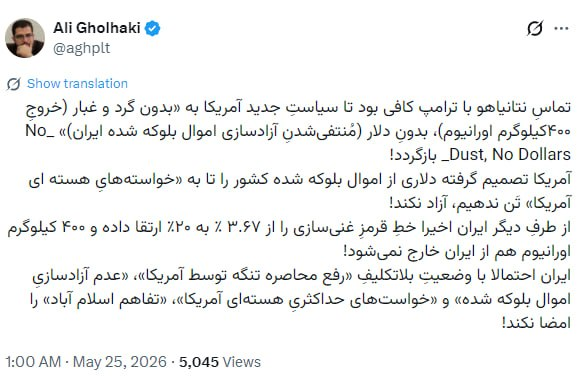

تماسِ نتانیاهو با ترامپ کافی بود تا سیاستِ جدید آمریکا به «بدون گرد و غبار (خروجِ ۴۰۰کیلوگرم‌ اورانیوم)، بدونِ دلار (مُنتفی‌شدنِ آزادسازی اموال بلوکه شده ایران)» _No Dust, No Dollars_ بازگردد!
آمریکا تصمیم گرفته دلاری از اموال بلوکه شده کشور را تا به «خواسته‌هایِ هسته ای آمریکا» تَن ندهیم، آزاد نکند!
از طرفِ دیگر ایران اخیرا خطِ قرمزِ غنی‌سازی را از ۳.۶۷ ٪ به ۲۰٪ ارتقا داده و ۴۰۰ کیلوگرم اورانیوم هم از ایران خارج نمی‌شود!
ایران احتمالا با وضعیتِ بلاتکلیفِ «رفع محاصره تنگه توسط آمریکا»، «عدم آزادسازیِ اموال بلوکه شده» و «خواست‌های حداکثریِ هسته‌ای آمریکا»، «تفاهم اسلام آباد» را امضا نکند!
علی قلهکی

پ.ن : عرض نکردم ؟!

## Persian_Trend_Official — post 14893

  <a href="https://t.me/persian_trend_official/14893" target="_blank">📎 Download file</a>

فایل صوتی لایو اول
نسخه کم حجم - 6.44 مگابایت

اتاق جنگ یکشنبه 3 خرداد | توافق ایران و آمریکا، خیلی دور خیلی نزدیک !

📝 Nick

📌 @persian_trend_official
پرشین ترند | متفاوت‌ترین کانال نظامی

## Persian_Trend_Official — post 14892

  

🔴ایالات متحده «به شدیدترین شکل ممکن» اظهارات حزب‌الله مبنی بر «دعوت بی‌ملاحظه برای سرنگونی دولت منتخب دموکراتیک لبنان» را محکوم کرد.

💢مارکو روبیو وزیر امور خارجه آمریکا

💢حزب‌الله درخواست‌های مکرر دولت قانونی لبنان برای توقف حملات و پایبندی به آتش‌بس را نادیده گرفته و در عوض همچنان به مواضع اسرائیل حمله می‌کند و نیروها و سلاح‌ها را به جنوب لبنان منتقل می‌نماید.

او گفت: «این یک کارزار عمدی برای بی‌ثبات کردن کشور و حفظ قدرت به بهای آینده مردم لبنان است.»

♦️روبیو افزود آمریکا قاطعانه در کنار دولت لبنان ایستاده تا اقتدار خود را بازسازی کند و تأکید کرد: «دورانی که یک گروه تروریستی بتواند یک کشور را در کنترل و گروگان خود نگه دارد رو به پایان است.»

🫆:Tony

📌 @persian_trend_official
پرشین ترند | متفاوت‌ترین کانال نظامی

## IranianMinds — post 20699

  

🔴 پست جدید ترامپ : از توجه شما به این موضوع سپاسگزارم! @IranianMinds

## IranianMinds — post 20698

  <a href="telegram/content/IranianMinds_20698_1779666406.mp4" target="_blank">🎬 Download video</a>

اسرائیل هم داره حزب الله رو‌ شخم میزنه

@IranianMinds

## IranianMinds — post 20697

🔴 فاکس‌ نیوز به نقل از یک مقام آمریکایی:

ما توافق بدی امضا نخواهیم کرد و اگر مذاکرات شکست بخورد، گزینه‌های لازم برای ازسرگیری فوری حملات نظامی را داریم.

@IranianMinds

## IranianMinds — post 20696

🔴 یک مقام آمریکایی به شبکه فاکس‌نیوز گفت:

ممکن است ترامپ به ایران یک هفته دیگر وقت بدهد تا بتوانند به یک توافق قابل قبول برسند.

@IranianMinds

## BBCPersian — post 281975

‌ وزرای خارجه امارات متحده عربی، اردن، ترکیه، مصر، اندونزی، پاکستان، عربستان سعودی و قطر رفتار ایتامار بن گویر،‌ وزیر امنیت ملی اسرائیل با فعالان بازداشت شده ناوگان کمک به غزه را «وحشتناک،‌ تحقیرآمیز و غیرقابل قبول» خواندند و آن را به شدت محکوم کردند. در…

## BBCPersian — post 281974

  

‌
وزرای خارجه امارات متحده عربی، اردن، ترکیه، مصر، اندونزی، پاکستان، عربستان سعودی و قطر رفتار ایتامار بن گویر،‌ وزیر امنیت ملی اسرائیل با فعالان بازداشت شده ناوگان کمک به غزه را «وحشتناک،‌ تحقیرآمیز و غیرقابل قبول» خواندند و آن را به شدت محکوم کردند.

در یک بیانیه مشترک که وزارت خارجه امارات متحده عربی روز یکشنبه سوم خرداد ماه منتشر کرد،‌ وزرای خارجه این کشورها تاکید کردند که « تحقیر عمدی بازداشت‌شدگان» بوسیله آقای بن گویر «تجاوزی ننگین به کرامت انسانی و نقض آشکار تعهدات اسرائیل تحت قوانین بین‌المللی، از جمله قوانین بشردوستانه بین‌المللی و قوانین بین‌المللی حقوق بشر است.»

وزرای این کشورها خواستار پاسخگویی مقامات اسرائیلی در قبال رفتار آقای بن‌ گویر شدند.

در این بیانیه هشدار داده شده که اقدامات «تحریک آمیز» آقای بن‌ گویر،‌ «نفرت و افراط‌‌گرایی را دامن می‌زند و مانع تلاش‌ها برای پیشبرد صلح عادلانه و پایدار بر اساس راه‌حل دو کشور می‌شود.»

این وزرا همچنین «اقدامات غیرقانونی و افراطی تحریک‌آمیز و خشونت‌بار توسط آقای بن گویر و دیگر مقامات اسرائیلی علیه فلسطینیان» را به شدت محکوم کردند.

📷Reuters
ادامه خبر
⬇️

## BBCPersian — post 281967

‌
درختان شاه‌بلوط اروپا روایت‌گر داستانی پنهانی‌اند که سرنوشت امپراطوری روم باستان و میراث به جای مانده از آن در جنگل‌های این قاره را به تصویر می‌کشند.

رومیان باستان ردپایی ماندگار بر سرزمین‌های تحت سلطه خود به جا گذاشته‌اند. جاده‌های مستقیم و طولانی که آنها ساختند، هنوز هم زیر آسفالت برخی بزرگراه‌های امروزی قابل رد‌گیری هستند. قنات‌ها، سیستم‌های فاضلاب‌، حمام‌های عمومی و زبان لاتین را در بخش عمده‌ای از اروپا، شمال آفریقا و خاورمیانه گسترش دادند. اما چیزی که شاید کمتر شناخته شده باشد، شیوه شگفت‌انگیزی است که رومی‌ها به واسطه آن جنگل‌های اروپا را متحول کردند.

به گفته پژوهشگران سوئیسی، رومی‌ها علاقه خاصی به درختان شاه بلوط شیرین داشتند و به همین دلیل آنها را در سراسر اروپا کاشتند و پرورش دادند. اما چیزی که آن‌ها به دنبالش بودند، نه میوه‌ لطیف این درختان بلکه در واقع چوب آن‌ها بود که به سرعت از نو می‌رویید و برای گسترش امپراتوری‌شان، ماده‌ اولیه‌ای ارزشمند به شمار می‌رفت.
📷Getty images

از لینک ⬇️ ادامه این مطلب را در سایت بی‌بی‌سی فارسی بخوانید.
https://bbc.in/4e0i0qe
@BBCPersian

## BBCPersian — post 281966

روبیو: حزب الله تلاش می‌کند لبنان را به هرج و مرج بکشاند

مارکو روبیو، وزیر خارجه آمریکا گفته است که حزب‌الله تلاش می‌کند لبنان را دوباره «به سمت هرج‌ومرج» بکشاند.

آقای روبیو «فراخوان غیرمسئولانه حزب‌الله برای سرنگونی دولت منتخب دموکراتیک لبنان» را محکوم کرد و گفت این گروه مسلحِ مورد حمایت ایران «به‌طور فعال در حال تلاش برای کشاندن لبنان به هرج‌ومرج و ویرانی است.»

نعیم قاسم، رهبر حزب الله پیش‌تر خلع سلاح این گروه را «غیرقابل قبول» و مقدمه‌ای برای «نابودی» خواند. او در سخنانی‌ که از تلویزیون پخش شد گفت: «خلع‌ سلاح یعنی برچیدن توانایی دفاعی لبنان و توانایی مقاومت و مردم، و هموار کردن راه برای نابودی.»

قرار است دور بعدی مذاکرات مستقیم لبنان و اسرائیل در کمتر از ۱۰ روز دیگر در واشنگتن برگزار شود. حزب‌الله با این مذاکرات مخالف است.

https://bbc.in/4f4RLQz
@BBCPersian

## BBCPersian — post 281965

  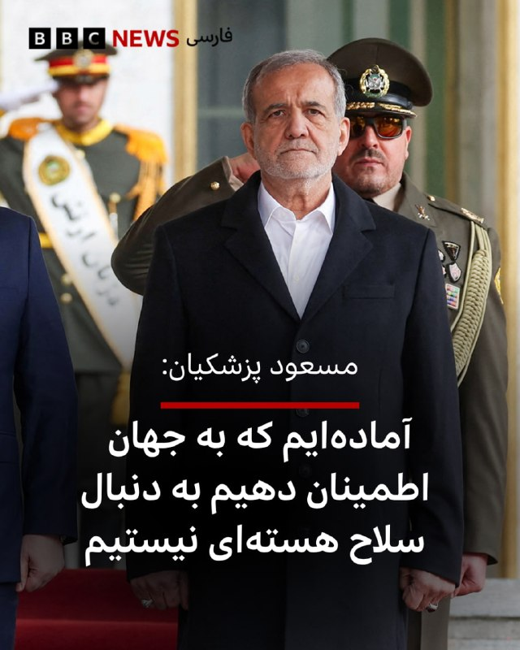

مسعود پزشکیان، رئیس‌جمهور ایران، همزمان با افزایش امیدواری به توافق میان تهران و واشنگتن و پایان درگیری در منطقه، گفت که ایران آماده است به جهان اطمینان دهد که به دنبال سلاح هسته‌ای نیست.

آقای پزشکیان این سخنان را روز یکشنبه در خلال دیدار از سازمان صدا و سیما عنوان کرد و گفت: «در دوران امام شهیدمان اعلام کردیم، اکنون نیز اعلام می‌کنیم که آمادگی داریم به جهان اطمینان دهیم که به دنبال سلاح هسته‌ای نیستیم، به دنبال ناآرامی در منطقه نیستیم، آنکه به دنبال ناآرام کردن منطقه است، رژیم اسرائیل است که نقشه «اسرائیل بزرگ» را دنبال می‌کند.»

اظهارات رئیس‌جمهور ایران می‌تواند پاسخی صریح به اصلی‌ترین درخواست دونالد ترامپ، همتای آمریکایی او باشد که بارها تاکید کرده است «ایران نباید به سلاح هسته‌ای دست یابد».

📷Iran’s Presidential website/Reuters

آخرین تحولات مربوط به ایران و جهان را از لینک ⬇️ در سایت بی‌بی‌سی فارسی دنبال کنید.
https://bbc.in/4f4RLQz
@BBCPersian

## BBCPersian — post 281964

  <a href="https://t.me/bbcpersian/281964" target="_blank">📎 Download file</a>

پادکست برنامه شصت دقیقه روز یکشنبه ۳ خرداد ۱۴۰۵ است
 
این نسخه رادیویی برنامه شصت دقیقه تلویزیون فارسی بی‌بی‌سی است که هرشب بعد از پخش، با حجم کم از اپلیکیشن‌های پادگیر و صفحه تلگرام بی‌بی‌سی فارسی در دسترس است.
 
با هشتگ BBCPersianRadio# با ما در ارتباط باشید

## Dirty_Kids — post 390117

  <a href="telegram/content/Dirty_Kids_390117_1779666409.webm" target="_blank">🎬 Download video</a>

☢️خفن ترین و‌ قدیمی ترین  انالیزور  ایران ینی دکتر بت 
👍 
🔴مسابقات جذاب جام جهانی به زودی شروع میشه بیا توی کانال دکتر بت و باهاش همراه شو و پول در بیار
💵 رایگان بهترین شرط هارو براتون میذاره حتی هزار تومن هم دریافت نمیکنه روزانه میتونی از پیش بینی فوتبال باهاش…

## Dirty_Kids — post 390116

  <a href="telegram/content/Dirty_Kids_390116_1779666410.webm" target="_blank">🎬 Download video</a>

☢️خفن ترین و‌ قدیمی ترین  انالیزور  ایران ینی دکتر بت 
👍

🔴مسابقات جذاب جام جهانی به زودی شروع میشه بیا توی کانال دکتر بت و باهاش همراه شو و پول در بیار
💵

رایگان بهترین شرط هارو براتون میذاره
حتی هزار تومن هم دریافت نمیکنه
روزانه میتونی از پیش بینی فوتبال باهاش پول در بیاری 👌
A3

🌟اگ اهل پیش بینی فوتبالی این کانال اصلا از دست ندین
👇

✅https://t.me/+4_ADqwB9e-QwYjlk

✅https://t.me/+4_ADqwB9e-QwYjlk

## Dirty_Kids — post 390115

  

#بخوابیم

@Dirty_Kids 👻

## Dirty_Kids — post 390114

  <a href="telegram/content/Dirty_Kids_390114_1779666411.mp4" target="_blank">🎬 Download video</a>

دیگه به تهه انبار رسیدن، این پرستو پیر پاتالا رو فرستادن

@Dirty_Kids 👻

## Dirty_Kids — post 390113

این تنگه هم شد مثل اینترنت، بار اول بستنش سخت بود، از این به بعد هر اتفاقی تو دنیا بیفته اول تنگه بسته میشه.
اروپا آمریکا کونتون پارس

@Dirty_Kids 👻

## Dirty_Kids — post 390112

  

توافق بشه یا نشه، کل دنیا باهاتون صلح بکنن یا نکنن، ما دست از سرتون برنمی‌داریم، چون هیچی به قبل ۱۸ دی برنمی‌گرده…

@Dirty_Kids 👻

## Dirty_Kids — post 390111

  

🔴 اولین تصویر منتشر شده از شخصی که دیشب اطراف کاخ سفید شروع به تیراندازی کرد و درنهایت کشته شد

این شخص 21 ساله به اسم "نصیر بِست" که مشکلات روانی داشت، معتقد بود "عیسی مسیحه".

@Dirty_Kids 👻

## Dirty_Kids — post 390110

  <a href="telegram/content/Dirty_Kids_390110_1779666413.mp4" target="_blank">🎬 Download video</a>

زنده‌یاد مانوک خدابخشیان: «این آقای ترامپ خیلی ایرانی‌ها رو دوست داره…
شما نگاه کن؛ میتونه رژیم رو بزنه و اگر بزنه بد میزنه…
این همه فرصت‌سوزی میکنه که یک راه‌حلی پیدا کنه که اینها رو جارو کنه. اینقدر سعی میکنه مانور بده تا بدون جنگ این رژیم را مچاله کنه، باید بهش آفرین گفت...»

@Dirty_Kids 👻

## Dirty_Kids — post 390109

  <a href="telegram/content/Dirty_Kids_390109_1779666415.mp4" target="_blank">🎬 Download video</a>

🔴 پیش‌بینی‌های کاملا دقیق و حرفه‌ای نوستراداموس زمانه؛ استاد خوش‌چشم تحلیلگر صدا و سیما.

+ فقط اینطوری کار می‌کنه که هر چی گفت، باید برعکسش کنی.

@Dirty_Kids 👻

## Dirty_Kids — post 390108

  <a href="telegram/content/Dirty_Kids_390108_1779666416.mp4" target="_blank">🎬 Download video</a>

از دیشب که بی‌بی شنیده که جمهوری اسلامی تو تفاهم‌نامه‌شون با ترامپ شرط کردن که به حزبل نباید حمله شه، هر پنج دقیقه یه بار داره لبنان رو می‌گاد.

@Dirty_Kids 👻

## Dirty_Kids — post 390107

  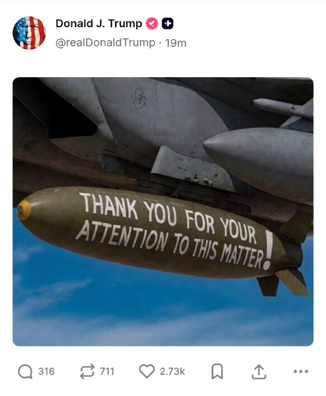

پست جدید ترامپ، تصویری از بمب اتم همراه این نوشته:

از شما بابت توجهتون به این موضوع ممنونم.

@Dirty_Kids 👻

## Dirty_Kids — post 390106

  <a href="telegram/content/Dirty_Kids_390106_1779666418.mp4" target="_blank">🎬 Download video</a>

ویدیوی وایرال شده از حمله‌ی وحوش جمهوری اسلامی در خارج از کشور به معترضان

@Dirty_Kids 👻

## Dirty_Kids — post 390105

‏گیریم ساعت خوابتم درست کردی
با بیدار شدنت تو ایران میخای چیکار کنی ؟

@Dirty_Kids 👻

## Dirty_Kids — post 390104

‏عجب وضعیت قمر در مقعدی شده.

@Dirty_Kids 👻

## Dirty_Kids — post 390103

  

ختنه کردن ترامپ و یادت رفت بنویسی.

@Dirty_Kids 👻

## manototv — post 105825

  <a href="telegram/content/manototv_105825_1779666421.mp4" target="_blank">🎬 Download video</a>

تو این دو سال از دست شماها چی کشیدیم...

## manototv — post 105823

  <a href="telegram/content/manototv_105823_1779666422.mp4" target="_blank">🎬 Download video</a>

قیمت جهانی نفت شامگاه یکشنبه و پس از انتشار نشانه‌هایی از توافق احتمالی برای پایان تنش میان آمریکا و جمهوری‌اسلامی، حدود ۵ دلار در هر بشکه کاهش یافت.
بهای نفت برنت، شاخص جهانی نفت، با افت حدود ۴.۶ درصدی به کمتر از ۱۰۰ دلار رسید و در حدود ۹۸ دلار معامله شد.
با این حال، تحلیلگران می‌گویند حتی در صورت دستیابی به توافق و بازگشایی تنگه هرمز، اختلال در بازار انرژی ممکن است ماه‌ها ادامه پیدا کند.
بر اساس گزارش‌ها، در هفته‌های اخیر عبور روزانه حدود ۱۴ میلیون بشکه نفت از منطقه مختل شده؛ موضوعی که باعث افزایش قیمت سوخت در جهان و آمریکا شده است. میانگین قیمت بنزین در آمریکا اکنون حدود ۱.۵ دلار بیشتر از پیش از آغاز جنگ است.
کارشناسان همچنین هشدار داده‌اند که پاکسازی تنگه هرمز، خروج نفتکش‌ها و بازگشت کامل تولید نفت ممکن است از چند هفته تا چند ماه زمان ببرد و بازسازی ذخایر انرژی حتی سال‌ها طول بکشد.

## manototv — post 105822

  <a href="telegram/content/manototv_105822_1779666422.mp4" target="_blank">🎬 Download video</a>

دادگاهی در بحرین، ۹ متهم را به اتهام همکاری با سپاه پاسداران به حبس ابد محکوم کرده است.
به گزارش رویترز، این افراد به اتهام «انجام اقدامات خصمانه و تروریستی علیه بحرین» و همکاری با سپاه پاسداران محکوم شده‌اند. دو متهم دیگر نیز به سه سال زندان محکوم شده‌اند.
براساس اعلام دادستانی، این افراد متهم به جمع‌آوری اطلاعات از اماکن حساس و تسهیل انتقال‌های مالی مرتبط بوده‌اند.
این پرونده پس از آن مطرح شد که وزارت کشور بحرین اعلام کرد در ماه مه ۴۱ نفر را در ارتباط با شبکه‌ای مرتبط با سپاه پاسداران بازداشت کرده است. مقامات بحرینی مدعی شده‌اند این شبکه با هدف اقدامات امنیتی علیه کشور فعالیت داشته است.
در همین حال، تنش‌ها میان ایران و کشورهای منطقه پس از درگیری‌های اخیر و حملات متقابل در خلیج فارس افزایش یافته است؛ هرچند تهران همواره این اتهامات را رد کرده و آنها را سیاسی می‌داند.

## manototv — post 105821

  <a href="telegram/content/manototv_105821_1779666423.mp4" target="_blank">🎬 Download video</a>

خبرگزاری رویترز به نقل از یک مقام دولت آمریکا گزارش داده است که جمهوری‌اسلامی در اصل با کنار گذاشتن ذخایر اورانیوم نزدیک به سطح تسلیحاتی خود موافقت کرده است.
به گفته این مقام ارشد در دولت ترامپ، واشنگتن معتقد است رهبر جمهوری اسلامی چارچوب کلی این توافق را تایید کرده است. با این حال هنوز از سوی تهران تأیید رسمی یا توضیحی درباره معنای دقیق «موافقت اصولی» ارائه نشده است.
این مقام آمریکایی همچنین در واکنش به گزارش‌هایی مبنی بر اینکه جمهوری‌اسلامی با کنار گذاشتن ذخایر اورانیوم غنی‌شده موافقت نکرده، گفته است: «موضوع این نیست که آیا، بلکه چگونه.»
در همین حال، منابع جمهوری‌اسلامی به رویترز گفته‌اند که در مراحل بعدی مذاکرات می‌توان «فرمول‌های عملی» برای حل این مسئله پیدا کرد؛ از جمله رقیق‌سازی اورانیوم تحت نظارت آژانس بین‌المللی انرژی اتمی.
بر اساس گزارش آژانس بین‌المللی انرژی اتمی، جمهوری‌اسلامی در حال حاضر ۴۴۰.۹ کیلوگرم اورانیوم با غنای ۶۰ درصد در اختیار دارد؛ سطحی که از نظر فنی تنها یک گام کوتاه تا سطح تسلیحاتی ۹۰ درصد فاصله دارد.

## manototv — post 105820

  <a href="telegram/content/manototv_105820_1779666423.mp4" target="_blank">🎬 Download video</a>

دونالد ترامپ جونیور، پسر رئیس‌جمهور‌ آمریکا در شبکه اکس، با بازنشر پستی مرتبط با مذاکرات آمریکا با جمهوری‌اسلامی نوشته است «این یک پیروزی بسیار بزرگ برای آمریکا است. ما باید حرف کسانی را نادیده بگیریم که فقط زمانی خوشحال می‌شوند که حمله زمینی به ایران انجام شود. پدر من وعده داده بود که جلوی دست‌یابی ایران به سلاح هسته‌ای را بگیرد و دقیقاً هم دارد همین کار را انجام می‌دهد»

دونالد ترامپ جونیور، فرزند ارشد رئیس‌جمهور آمریکا، ۲۱ می با بتینا اندرسون، اینفلوئنسر ۳۹ ساله اهل پالم بیچ فلوریدا، ازدواج کرد.
این زوج ابتدا یک مراسم قانونی و کاملا خصوصی را در وست پالم بیچ برگزار کردند و سپس جشن اصلی ازدواج در ۲۳ می، در یک جزیره خصوصی در باهاما و با حضور جمعی از اعضای خانواده و دوستان نزدیک برگزار شد.
این مراسم به‌صورت محدود و دور از رسانه‌ها انجام شد.
در همین حال، دونالد ترامپ، پدر داماد، اعلام کرد که به دلیل «مسائل دولتی و تعهدات مربوط به آمریکا» قادر به حضور در مراسم نبوده است. او گفته است که شرایط حساس سیاسی و تنش‌های جاری، از جمله وضعیت مرتبط با جمهوری‌اسلامی و تحولات منطقه‌ای، مانع حضورش در این مراسم شده است.

## manototv — post 105819

  <a href="telegram/content/manototv_105819_1779666425.mp4" target="_blank">🎬 Download video</a>

هشت تن از متهمان پرونده «شهرک اکباتان» توسط شعبه ۱۵ دادگاه انقلاب تهران به ریاست قاضی ابوالقاسم صلواتی به احکام سنگین قضایی محکوم شدند.
بر اساس این حکم، میلاد آرمون، نوید نجاران، مهدی ایمانی و سید محمدمهدی حسینی از بابت اتهام «محاربه» به اعدام محکوم شده‌اند.
همچنین امیرمحمد خوش‌اقبال، علیرضا برمرز پورناک، علیرضا کفایی و حسین نعمتی نیز هرکدام به ۵ سال حبس بابت اتهام اجتماع و تبانی، ۲ سال حبس بابت تبلیغ علیه نظام، ۲ سال منع فعالیت در فضای مجازی و همچنین ۲ سال منع اقامت در تهران و البرز محکوم شده‌اند.
شعبه ۱۳ دادگاه کیفری یک تهران چند روز پیش حکم قصاص ۶ متهم این پرونده را نقض کرد. بر اساس این رای، سه نفر به ۵ سال حبس و پرداخت دیه محکوم شدند و سه نفر دیگر نیز از اتهامات تبرئه شدند.
اما بخش امنیتی پرونده که در شعبه ۱۵ دادگاه انقلاب رسیدگی می‌شود، امروز احکام متفاوتی صادر کرد؛ به‌طوری که چهار متهم شامل میلاد آرمون، نوید نجاران، سیدمحمدمهدی حسینی و مهدی ایمانی به اعدام محکوم شدند و چهار متهم دیگر نیز مجموعاً به ۷ سال حبس محکوم شدند.
نکته جنجالی این پرونده اما نحوه ابلاغ احکام است؛ به گفته وکلای متهمان، رأی دادگاه بدون حضور وکلا و به‌صورت شفاهی به متهمان در زندان اعلام شده و تاکنون نسخه رسمی رای در اختیار آن‌ها قرار نگرفته است.
وکلای پرونده این روند را غیرقانونی و خلاف آیین دادرسی عنوان کرده و می‌گویند حتی از جزئیات دقیق اتهامات و شماره دادنامه نیز مطلع نشده‌اند؛ موضوعی که به گفته آن‌ها عملا امکان اعتراض به حکم را با ابهام جدی مواجه کرده است.
این پرونده که از دل اعتراضات ۱۴۰۱ و کشته شدن طلبه بسیجی آرمان علی‌وردی شکل گرفته، همچنان در دو مسیر جداگانه قضایی در حال رسیدگی است.

## manototv — post 105818

  <a href="telegram/content/manototv_105818_1779666425.mp4" target="_blank">🎬 Download video</a>

در بحبوحه گمانه‌زنی‌ها درباره سرنوشت مذاکرات آمریکا و جمهوری اسلامی، دونالد ترامپ در پستی جدید در تروث سوشال، بدون توضیحی اضافه، تصویری از یک بمب منتشر کرد که روی آن نوشته شده بود: «از توجه شما به این موضوع سپاسگزارم»؛ جمله‌ای که او معمولا در پایان مطالبش در این شبکه اجتماعی منتشر می‌کند.

## manototv — post 105817

  <a href="telegram/content/manototv_105817_1779666426.mp4" target="_blank">🎬 Download video</a>

گفت‌وگو با کیوان عباسی بنیان‌گذار تلویزیون منوتو;
«می‌گفت باید فضا برای نقد کردن باز باشه…
و یاد بگیریم راحت و بدون ترس همدیگه رو نقد کنیم.»

## alonews — post 122454

  <a href="telegram/content/alonews_122454_1779666428.webm" target="_blank">🎬 Download video</a>

👈هم اکنون هر بشکه نفت برنت 99$

✅ @AloNews خبر جنگ

## alonews — post 122453

  <a href="telegram/content/alonews_122453_1779666428.webm" target="_blank">🎬 Download video</a>

👈العربیه: قیمت نفت در آغاز هفته جاری در بحبوحه امیدها به توافق بین آمریکا و ایران، 3 درصد کاهش یافت.

✅ @AloNews خبر جنگ

## alonews — post 122452

  <a href="telegram/content/alonews_122452_1779666428.webm" target="_blank">🎬 Download video</a>

👈اکنون یک هواپیمای هواشناسی و کنترل هوایی (AWACS) بوئینگ E-3 سنتری نیروی هوایی ایالات متحده نیز بر فراز خلیج فارس در حال عملیات است.

✅ @AloNews خبر جنگ

## alonews — post 122451

  <a href="telegram/content/alonews_122451_1779666428.webm" target="_blank">🎬 Download video</a>

💢فوری/پرواز جنگنده‌های آمریکایی در مرز ایران 
🚨 @AkhbareFouri

## alonews — post 122450

  <a href="telegram/content/alonews_122450_1779666429.webm" target="_blank">🎬 Download video</a>

👈نیویورک تایمز به نقل از یک مقام آمریکایی: آمریکا و ایران به توافق اولیه برای بازگشایی تنگه هرمز دست یافته‌اند.

✅ @AloNews خبر جنگ

## alonews — post 122449

  <a href="telegram/content/alonews_122449_1779666429.webm" target="_blank">🎬 Download video</a>

👈نشریه آمریکایی پانچ بول نیوز:
کاخ سفید از قانونگذاران جمهوری‌خواه خواسته بود که آخر هفته جاری در حمایت از توافق با ایران توییت کنند.

🔴به گفته دستیار ارشد یک نماینده جمهوری‌خواه، برخی این کار را کردند، اما برخی دیگر «از این هراس دارند» که پس از پایان تعطیلات مجلس، مجبور شوند از این توافق دفاع کنند.

✅ @AloNews خبر جنگ

## alonews — post 122448

  <a href="telegram/content/alonews_122448_1779666429.webm" target="_blank">🎬 Download video</a>

👈نیویورک پست:
ترامپ نظر خود را تغییر داده و احتمال توافق اکنون به طور قابل توجهی کاهش یافته است؛ تماس ترامپ با نتانیاهو تأثیر بسیار زیادی داشته است

✅ @AloNews خبر جنگ

## alonews — post 122447

  <a href="telegram/content/alonews_122447_1779666429.mp4" target="_blank">🎬 Download video</a>

👈پیش‌بینی‌های کاملا دقیق و حرفه‌ای نوستراداموس زمانه؛ استاد خوش‌چشم تحلیلگر صدا و سیما.

🔴فقط اینطوری کار می‌کنه که هر چی گفت، باید برعکسش کنی.

✅ @AloNews خبر جنگ

## alonews — post 122446

  <a href="telegram/content/alonews_122446_1779666431.webm" target="_blank">🎬 Download video</a>

👈محسن رضایی : دست روی ماشه هستیم

✅ @AloNews خبر جنگ

## alonews — post 122445

  <a href="telegram/content/alonews_122445_1779666431.webm" target="_blank">🎬 Download video</a>

👈کانال۱۲عبری: نتانیاهو در تلاشه تا توافق رو بهم بزنه

✅ @AloNews خبر جنگ

## alonews — post 122444

  <a href="telegram/content/alonews_122444_1779666431.webm" target="_blank">🎬 Download video</a>

👈تسنیم به نقل از یک منبع مطلع: تا این لحظه تفاهم نهایی حاصل نشده است و چالش در بعضی بندها ادامه دارد

✅ @AloNews خبر جنگ

## alonews — post 122443

  <a href="telegram/content/alonews_122443_1779666431.webm" target="_blank">🎬 Download video</a>

👈 توییتِ سخنگوی فارسی زبان ارتش اسرائیل !

✅ @AloNews خبر جنگ

## alonews — post 122442

  <a href="telegram/content/alonews_122442_1779666431.webm" target="_blank">🎬 Download video</a>

👈همزمان با سفر رسمی نخست وزیر پاکستان به چین، دو کشور تفاهم نامه‌های همکاری به ارزش هفت میلیارد دلار امضا کردند

✅ @AloNews خبر جنگ

## alonews — post 122441

  <a href="telegram/content/alonews_122441_1779666432.webm" target="_blank">🎬 Download video</a>

👈وزارت خارجه قطر: وزیر خارجه قطر در تماسی با وزیر خارجه عربستان، درباره تلاشهای میانجیگرانه پاکستان گفتگو کرد.

✅ @AloNews خبر جنگ

## alonews — post 122440

  <a href="telegram/content/alonews_122440_1779666432.webm" target="_blank">🎬 Download video</a>

👈 فیلمی که پیامد حملات هوایی اسرائیل را در شهر دویر نشان می‌دهد که منجر به تلفات متعدد شد. 
✅ @AloNews خبر جنگ

## alonews — post 122439

  <a href="telegram/content/alonews_122439_1779666432.mp4" target="_blank">🎬 Download video</a>

👈 فیلمی که پیامد حملات هوایی اسرائیل را در شهر دویر نشان می‌دهد که منجر به تلفات متعدد شد.

✅ @AloNews خبر جنگ

## alonews — post 122438

  <a href="telegram/content/alonews_122438_1779666434.webm" target="_blank">🎬 Download video</a>

👈یک مقام آمریکایی به شبکه «فاکس‌نیوز» گفت دونالد ترامپ، رئیس‌جمهوری آمریکا ممکن است به ایران هفت روز مهلت دهد تا به یک توافق «قابل‌قبول» برسند

✅ @AloNews خبر جنگ

## alonews — post 122437

  <a href="telegram/content/alonews_122437_1779666434.webm" target="_blank">🎬 Download video</a>

👈نیویورک‌پست: احتمال رسیدن به توافق بین ایالات متحده و ایران به طور فزاینده‌ای کاهش یافته است

✅ @AloNews خبر جنگ

## alonews — post 122436

  <a href="telegram/content/alonews_122436_1779666434.webm" target="_blank">🎬 Download video</a>

👈بنیامین نتانیاهو، نخست‌وزیر اسرائیل، به طور خصوصی اذعان می‌کند که اسرائیل در حال حاضر توانایی محدودی برای تأثیرگذاری بر رئیس‌جمهور ترامپ دارد و فشار آوردن به رئیس‌جمهور آمریکا دشوار شده است، طبق گزارش کانال ۱۳ اسرائیل

✅ @AloNews خبر جنگ

## alonews — post 122435

  <a href="telegram/content/alonews_122435_1779666434.webm" target="_blank">🎬 Download video</a>

👈سردار نقدی: اسرائیل و آمریکا ۲۱۰۰ پرتابه و ۳۰۰ موشک زمین‌به‌زمین به جزیرهٔ بوموسی شلیک کرد اما رزمندگان ما بدون هیچ ضعفی ایستادگی کردند

✅ @AloNews خبر جنگ

---
📅 بروزرسانی: 1405/03/03 23:33
---

## VahidOOnLine — post 241993

♦️ده‌ها هزار نفر روز یکشنبه سوم خرداد ماه، در سی‌امین دوره «جشن خیابانی فرهنگ‌ها» در برلین شرکت کردند. رویدادی که با حضور حدود ۷۰ گروه در لباس‌های رنگارنگ در خیابان‌های پایتخت آلمان برگزار شد.
پلیس برلین آماری از شمار شرکت‌کنندگان ارائه نکرد، اما فضای این مراسم را «آرام، پرشور و کارناوالی» توصیف کرد. دمای هوا در زمان برگزاری این رویداد به ۲۸ درجه سانتی‌گراد رسید.
برگزارکنندگان اعلام کردند این جشنواره با هدف «ارسال پیامی درباره تنوع و گشودگی» برگزار می‌شود و حدود پنج هزار و ۸۰۰ شرکت‌کننده از ۶۷ گروه بین‌المللی، رقص، موسیقی و لباس‌های سنتی فرهنگ‌های مختلف جهان را به نمایش گذاشتند.
رژه خیابانی فرهنگ‌ها از سال ۱۹۹۶ به‌صورت سالانه در تعطیلات پنطیکاست برگزار می‌شود و به یکی از نمادهای چندفرهنگی بودن برلین تبدیل شده است. شرکت‌کنندگان در این مراسم تلاش می‌کنند از طریق رقص، موسیقی و هنر، ریشه‌های فرهنگی و تنوع قومی خود را به نمایش بگذارند.
‌🇸🇦 Indypersian

🤖 @VahidOOnLine

## VahidOOnLine — post 241992

  

♦️شبکه خبری فاکس‌ روز یکشنبه سوم خرداد ماه، به نقل مقام‌هایی آمریکایی گزارش کرد چارچوب توافق میان واشنگتن و تهران تا روز یکشنبه «۹۵ درصد» نهایی شده، اما مذاکره‌کنندگان همچنان بر سر برخی «عبارت‌بندی‌ها» درباره ذخایر هسته‌ای ایران و تنگه هرمز در حال چانه‌زنی هستند.

مقام آمریکایی به فاکس گفت: «ما عقب‌نشینی نخواهیم کرد. هنوز به توافق نرسیده‌ایم و امروز یا فردا توافقی امضا نخواهد شد.» او افزود تمایل دونالد ترامپ این است که «پنج تا هفت روز دیگر» برای نهایی شدن توافق فرصت بدهد.
این مقام تاکید کرد مذاکرات بر اساس سیاست «نه گرد و غبار، نه دلار» پیش می‌رود و ایران «در اصل» با چارچوب توافق موافقت کرده است.

فاکس در ادامه به نقل از این مقام نوشت: «بر سر ذخایر هسته‌ای و تنگه هرمز به توافق رسیده‌ایم، اما هنوز در حال مذاکره درباره متن و عبارت‌ها هستیم.»
این مقام افزود: «ما فرصت دستیابی به توافقی را داریم که هزینه‌ها را برای آمریکایی‌ها کاهش دهد و همزمان مانع دستیابی ایران به سلاح هسته‌ای شود.»
‌🇸🇦 Indypersian

🤖 @VahidOOnLine

## VahidOOnLine — post 241991

  

بدر البوسعیدی، وزیر خارجه عمان گفت‌وگوی خود با کاظم غریب‌آبادی، معاون وزیر خارجه جمهوری اسلامی را «خوب» توصیف کرد.

او یکشنبه در شبکه ایکس نوشت: «ما بر اهمیت تعامل دیپلماتیک در همه زمینه‌ها تاکید کردیم. عمان به حمایت از تلاش‌ها برای کاهش تنش، پیشبرد همزیستی مسالمت‌آمیز منطقه‌ای، امنیت و آزادی دریانوردی ادامه خواهد داد.»
‌🏁 🇬🇧 IranintlTV

🤖 @VahidOOnLine

## VahidOOnLine — post 241990

  

به گزارش کانال ۱۲ اسرائیل، مقام‌های ارشد اسرائیلی نگران‌اند توافق در حال شکل‌گیری میان آمریکا و ایران ممکن است آزادی عمل اسرائیل علیه حزب‌الله در لبنان را به‌شدت محدود کند.

در این گزارش آمده است توافق پیشنهادی شامل پایان کامل درگیری‌ها در لبنان همزمان با پایان جنگ آمریکا و جمهوری اسلامی خواهد بود؛ موضوعی که باعث شد بنیامین نتانیاهو در تماس تلفنی روز گذشته خود با دونالد ترامپ نگرانی‌هایش را مطرح کند.

بر اساس این گزارش، نتانیاهو بر حفظ آزادی عملیاتی اسرائیل در لبنان تمرکز کرده و یک مقام ارشد اسرائیلی بعدا اعلام کرده است ترامپ موافقت کرده اسرائیل «آزادی عمل خود را در برابر تهدیدها در همه جبهه‌ها، از جمله لبنان، حفظ کند.»
‌🏁 🇬🇧 IranintlTV

🤖 @VahidOOnLine

## VahidOOnLine — post 241989

  <a href="telegram/content/VahidOOnLine_241989_1779653002.mp4" target="_blank">🎬 Download video</a>

یک مقام ارشد در دولت ترامپ به شبکه ان بی سی گفته:
«توافق با ایران امروز امضا نخواهد شد، اما در مسیر دستیابی به توافق پیشرفت‌هایی حاصل شده است.»
این اظهارات پس از آن مطرح شد که ترامپ پیش‌تر گفته بود به نمایندگان خود دستور داده است که «برای رسیدن به توافق عجله نکنند».
پیش از آن نیز مارکو روبیو گفته بود که ممکن است «خبرهای خوبی» در راه باشد، هرچند تأکید کرد که هنوز «پیشرفت نهایی» در گفت‌وگوها با جمهوری‌اسلامی حاصل نشده است.
‌🏁 🇬🇧 ManotoTV

🤖 @VahidOOnLine

## VahidOOnLine — post 241988

  <a href="telegram/content/VahidOOnLine_241988_1779653002.mp4" target="_blank">🎬 Download video</a>

دونالد ترامپ، رئیس‌جمهور آمریکا در پلتفرم تروث سوشال خود نوشت:
«اگر با ایران به توافق برسم، توافقی خوب و درست خواهد بود؛ نه مثل توافقی که باراک اوباما انجام داد و به ایران مقادیر عظیمی پول نقد و مسیری آشکار و باز برای دستیابی به سلاح هسته‌ای داد.»
او افزود: «توافق ما دقیقاً برعکس آن است، اما هنوز کسی آن را ندیده یا از جزئیاتش خبر ندارد. حتی هنوز به‌طور کامل نهایی و مذاکره نشده است. بنابراین به حرف بازنده‌هایی که از چیزی انتقاد می‌کنند که هیچ اطلاعی درباره‌اش ندارند گوش ندهید. برخلاف کسانی که پیش از من بودند و باید سال‌ها پیش این مشکل را حل می‌کردند، من توافق بد انجام نمی‌دهم»
‌🏁 🇬🇧 ManotoTV

🤖 @VahidOOnLine

## VahidOOnLine — post 241987

  

♦️وزیران خارجه هشت کشور عربی و اسلامی روز یکشنبه با انتشار بیانیه‌ای رفتار ایتامار بن‌گویر، وزیر امنیت ملی  اسرائیل با فعالان بازداشت‌شده کاروان دریایی عازم غزه را «هولناک، توهین‌آمیز و غیرقابل‌قبول» توصیف و آن را به‌شدت محکوم کردند.
این واکنش پس از انتشار ویدیویی از سوی بن‌گویر مطرح شد که در آن او فعالانی را که روی زمین نگه داشته شده بودند، مورد تمسخر قرار می‌داد. برخی از بازداشت‌شدگان، که قصد داشتند کمک‌های بشردوستانه به غزه منتقل کنند، بعدا اعلام کردند در بازداشتگاه مورد ضرب‌وشتم قرار گرفته‌اند، ادعایی که سازمان زندان‌های اسرائیل آن را رد کرده است.
به گزارش خبرگزاری عربستان سعودی، وزیران خارجه کشورهای عربستان سعودی، مصر، اردن، قطر، امارات متحده عربی، ترکیه، اندونزی و پاکستان، آمده است: «تحقیر علنی و عامدانه بازداشت‌شدگان از سوی بن‌گویر، تعرضی شرم‌آور به کرامت انسانی و نقض آشکار تعهدات اسرائیل طبق قوانین بین‌المللی، از جمله حقوق بشردوستانه و حقوق بین‌الملل حقوق بشر است.»
‌🇸🇦 Indypersian

🤖 @VahidOOnLine

## VahidOOnLine — post 241986

  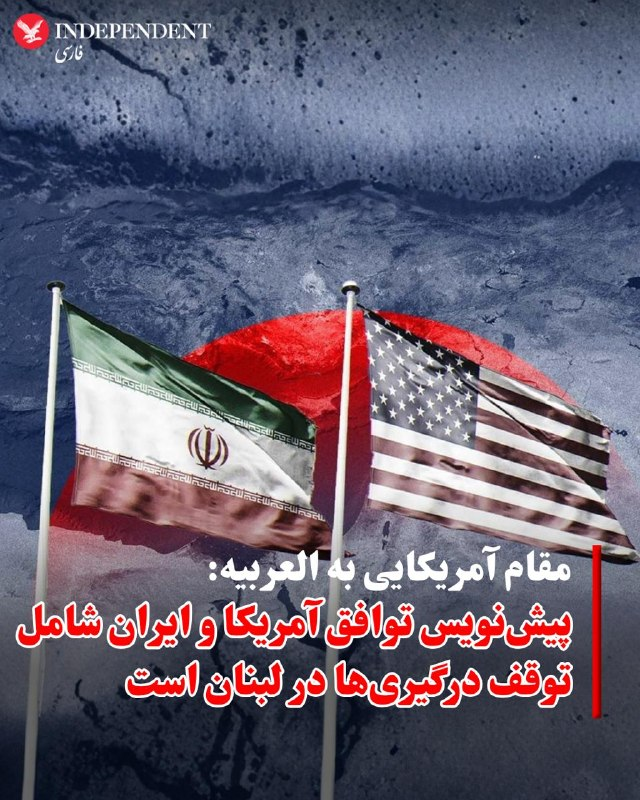

♦️یک منبع آمریکایی، شامگاه یکشنبه سوم خرداد ماه در گفتگو با شبکه خبری العربیه اعلام کرد پیش‌نویس توافق میان واشنگتن و تهران شامل بندهایی درباره آتش‌بس و پایان درگیری‌ها در لبنان است.

به گفته این منبع، توافق آمریکا و ایران همان بندهای مرتبط با آتش‌بس را که در ۱۵ مه مطرح شده بود، در بر می‌گیرد و بر «پایان جنگ منطقه‌ای» تمرکز دارد.

این منبع افزود پیش‌نویس توافق شامل تعهد به پایان دادن به خصومت‌ها در لبنان است، اما بندی درباره خلع سلاح حزب‌الله و جمع‌آوری سلاح‌های این گروه در لبنان در آن وجود ندارد.

این منبع همچنین گفت توافق احتمالی میان آمریکا و ایران شامل بازگشایی تنگه هرمز و کنار گذاشتن اورانیوم غنی‌شده از سوی تهران خواهد بود.
‌🇸🇦 Indypersian

🤖 @VahidOOnLine

## VahidOOnLine — post 241985

  

♦️دونالد ترامپ، رئیس‌جمهوری آمریکا، شامگاه یکشنبه سوم خرداد در شبکه اجتماعی تروث سوشال نوشت اگر با ایران به توافق برسد، این توافق «خوب و درست» خواهد بود و شباهتی به توافق هسته‌ای دوره باراک اوباما نخواهد داشت.
ترامپ در این پیام نوشت: «اگر با ایران توافقی انجام دهم، توافقی خوب و درست خواهد بود؛ نه مانند توافقی که اوباما انجام داد و پول نقد عظیمی به ایران داد و مسیری روشن و آشکار برای دستیابی به سلاح هسته‌ای در اختیارش گذاشت.»
او افزود: «توافق ما دقیقا برعکس آن است، اما هنوز کسی آن را ندیده و نمی‌داند چیست. این توافق حتی هنوز به‌طور کامل مذاکره هم نشده است.»
رئیس‌جمهوری آمریکا همچنین منتقدان مذاکرات با ایران را «بازنده» توصیف کرد و گفت: «به بازنده‌هایی گوش ندهید که درباره چیزی انتقاد می‌کنند که هیچ اطلاعی از آن ندارند.»
ترامپ در پایان نوشت: «برخلاف کسانی که پیش از من بودند و باید سال‌ها پیش این مشکل را حل می‌کردند، من توافق بد انجام نمی‌دهم.»
‌🇸🇦 Indypersian

🤖 @VahidOOnLine

## VahidOOnLine — post 241984

  

دونالد ترامپ در تروث‌سوشال نوشت اگر با جمهوری اسلامی توافقی انجام دهد، توافقی خوب و درست خواهد بود؛ نه مانند توافق اوباما که مبالغ هنگفتی پول نقد به تهران داد و مسیری آشکار برای دستیابی این کشور به سلاح هسته‌ای فراهم کرد.

او افزود توافق دولتش دقیقا برعکس آن است، اما هنوز کسی آن را ندیده و نمی‌داند شامل چه مواردی است و این توافق هنوز به‌طور کامل نهایی نشده است.

ترامپ گفت به کسانی که درباره موضوعی که اطلاعی از آن ندارند انتقاد می‌کنند گوش ندهید و تاکید کرد برخلاف دولت‌های پیشین، توافق بد انجام نخواهد داد.
‌🏁 🇬🇧 IranintlTV

🤖 @VahidOOnLine

## VahidOOnLine — post 241983

  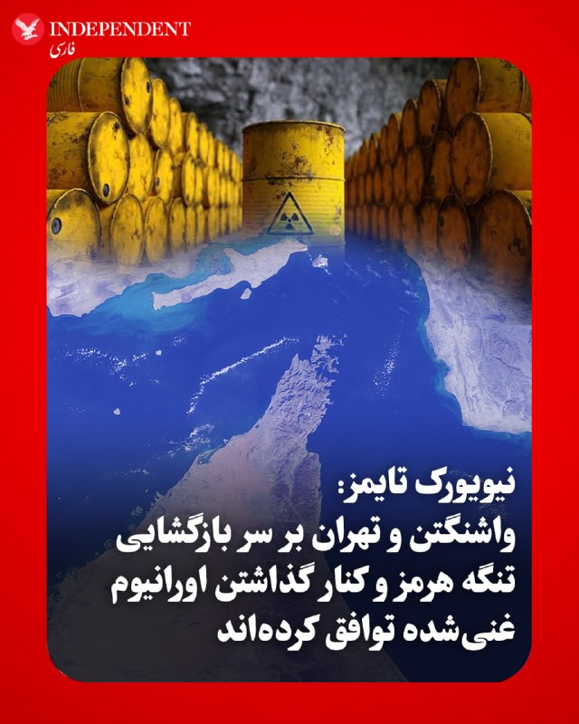

♦️روزنامه نیویورک تایمز عصر یکشنبه سوم خرداد ما به نقل از یک مقام ارشد آمریکایی گزارش کرد، ایالات متحده و ایران بر سر توافقی برای کاهش تنش‌ها و پایان دادن به جنگ در خاورمیانه به تفاهم رسیده‌اند. توافقی که شامل بازگشایی تنگه هرمز و تعهد ایران به کنار گذاشتن ذخایر اورانیوم با غنای بالا می‌شود.
این مقام آمریکایی به نیویورک تایمز گفت، هنوز هیچ توافقی امضا نشده و نهایی شدن آن نیازمند تایید نهایی دونالد ترامپ، رئیس‌جمهوری آمریکا و مجتبی خامنه‌ای، رهبر جمهوری اسلامی است و این روند ممکن است چند روز طول بکشد.
با اینهمه این مقام کاخ سفید گفته است، سازوکار کنار گذاشتن اورانیوم غنی‌شده همچنان در حال مذاکره است.
ترامپ روز شنبه اعلام کرده بود دو کشور «تا حد زیادی» بر سر یک تفاهم‌نامه مرتبط با «صلح» مذاکره کرده‌اند، اما روز یکشنبه گفت به مذاکره‌کنندگان آمریکایی دستور داده «برای رسیدن به توافق عجله نکنند.»
این مقام آمریکایی همچنین به نیویورک تایمز گفت در صورت نهایی شدن توافق، آمریکا می‌تواند محاصره بنادر ایران را که برای فشار به تهران و بازگشایی تنگه هرمز اعمال کرده بود، پایان دهد.
‌🇸🇦 Indypersian

🤖 @VahidOOnLine

## VahidOOnLine — post 241982

  

♦️دونالد ترامپ جوان، پسر رئیس‌جمهوری آمریکا، روز یکشنبه با بازنشر پیامی در شبکه اجتماعی اکس، توافق احتمالی با ایران را «یک پیروزی بزرگ برای آمریکا» توصیف کرد و نوشت مخالفان این توافق فقط به‌دنبال حمله زمینی به ایران هستند.
فرزند رئیس جمهوری امریکا که به تازگی جشن ازدواجش را برگزاری کرده است، نوشت: «این یک پیروزی بزرگ برای آمریکاست. باید کسانی را که تا زمانی که حمله زمینی به ایران انجام نشود، راضی نخواهند شد نادیده بگیریم. پدرم قول داده بود مانع دستیابی ایران به سلاح هسته‌ای شود و دقیقا همین کار را انجام می‌دهد.»
ترامپ جوان این اظهارات را در بازنشر پیامی مطرح کرد که در آن گفته شده بود توافقِ در حال شکل‌گیری با ایران، بسیار فراتر از برجام است و برخلاف توافق هسته‌ای دوره باراک اوباما، می‌تواند مانع دستیابی تهران به سلاح هسته‌ای شود.
دونالد ترامپ جوان و بتینا اندرسون در تعطیلات آخر هفته آمریکا با برگزاری مراسمی خصوصی در جزیره‌ای اختصاصی در باهاما با یکدیگر ازدواج کردند.
رئیس جمهوری آمریکا پیش‌تر اعلام کرده بود برای رهبری مذاکرات با ایران، در جشن عروسی فرزندش شرکت نخواهد کرد.
‌🇸🇦 Indypersian

🤖 @VahidOOnLine

## VahidOOnLine — post 241981

  <a href="telegram/content/VahidOOnLine_241981_1779653008.mp4" target="_blank">🎬 Download video</a>

تماسی با خانواده جاویدنام مهدی اسکندریان:
«روی صحبتم با طرفداران جمهوری اسلامیه…
با کشتن جاویدنام‌ها فقط آدم‌های بیشتری را علیه خودتان ساختید؛
و خانواده‌های دادخواه این درد را فراموش نخواهند کرد.»
‌🏁 🇬🇧 ManotoTV

🤖 @VahidOOnLine

## VahidOOnLine — post 241980

  

♦️دو ورزشکار زن ایرانی با کسب عنوان نایب‌قهرمانی در «هفتمین دوره رقابت‌های ترامپولین قهرمانی آسیا»، نخستین مدال رشته ورزشی ژیمناستیک زنان ایران را بر گردن آویختند.

به گزارش خبرگزاری مهر، «یلدا حسن‌شوکتی» و «شقایق چراغی» روز یکشنبه سوم خرداد ماه، در رشته هماهنگ دو نفره بزرگسالان موفق به کسب عنوان نایب‌قهرمانی آسیا شدند.

نخستین حضور زنان ژیمناستیک کار ایرانی در رقابت‌های جهانی به در المپیک ۱۹۶۴ توکیو باز می‌گردد. جمیله سروری عضو کاروان المپیک ایران در آن دوره، با فقط ۱۴ سال به عنوان جوان‌ترین ورزشکار کاروان ایران در تاریخ المپیک شناخته شد.
‌🇸🇦 Indypersian

🤖 @VahidOOnLine

## VahidOOnLine — post 241979

  <a href="telegram/content/VahidOOnLine_241979_1779653011.mp4" target="_blank">🎬 Download video</a>

♦️در پی حمله‌ای تروریستی به قطار حامل نیروهای نظامی پاکستان در شهر کویته پاکستان، دست‌کم ۲۴ نفر کشته و بیش از ۵۰ نفر زخمی شدند. مقام‌های پاکستانی اعلام کردند تعدادی از نیروهای ارتش در میان قربانیان هستند.
به گفته یک مقام محلی استان بلوچستان پاکستان، این قطار حامل نیروهای ارتش و اعضای خانواده‌های آن‌ها بود و از کویته به سمت پیشاور در حرکت بود که در منطقه «چمن پاتک» هدف خودرویی بمب‌گذاری‌شده قرار گرفت. در نتیجه این انفجار، یکی از واگن‌ها واژگون شد و خودروهای اطراف نیز آسیب دیدند.
گروه جدایی‌طلب «ارتش آزادی‌بخش بلوچستان» مسئولیت این حمله را بر عهده گرفته است. این گروه که آمریکا آن را سازمانی تروریستی می‌داند، در سال‌های اخیر حملات خود علیه نیروهای امنیتی و شرکت‌های خارجی فعال در بلوچستان را افزایش داده است.
شهباز شریف، نخست‌وزیر پاکستان، این حمله را «اقدامی تروریستی و بزدلانه» توصیف کرد و گفت چنین حملاتی اراده مردم پاکستان را تضعیف نخواهد کرد.
‌🇸🇦 Indypersian

🤖 @VahidOOnLine

## VahidOOnLine — post 241978

  <a href="telegram/content/VahidOOnLine_241978_1779653012.mp4" target="_blank">🎬 Download video</a>

کاخ سفید می‌گوید مذاکرات با جمهوری اسلامی به مرحله حساسی رسیده اما هنوز توافق نهایی نشده و ممکن است چند روز دیگر طول بکشد. بر اساس پیش‌نویس توافق، جمهوری اسلامی درباره محدودیت غنی‌سازی و کنار گذاشتن ذخایر اورانیوم مذاکره می‌کند و در مقابل احتمال کاهش تحریم‌ها وجود دارد. ترامپ تأکید کرده آمریکا برای توافق عجله ندارد و محاصره دریایی فعلاً ادامه خواهد داشت. همزمان اسرائیل نسبت به توافق احتمالی ابراز نگرانی کرده و خواستار حذف کامل برنامه غنی‌سازی جمهوری اسلامی شده است.
‌🏁 🇬🇧 ManotoTV

🤖 @VahidOOnLine

## VahidOOnLine — post 241977

  

وزارت آموزش‌وپرورش اخبار منتشرشده درباره مجازی شدن امتحانات نهایی را تکذیب و اعلام کرد تاکنون هیچ تصمیمی برای برگزاری مجازی امتحانات نهایی پایه‌های یازدهم و دوازدهم گرفته نشده است.

وزارت آموزش‌وپرورش اعلام کرد تا تیرماه برای فراهم شدن شرایط برگزاری امتحانات نهایی صبر می‌شود و در صورت فراهم شدن امکان برگزاری حضوری، آزمون‌های نهایی مطابق روال معمول به شکل حضوری برگزار خواهد شد.

در روزهای اخیر، دانش‌آموزان در چندین شهر به برگزاری حضوری امتحانات اعتراض کردند.
‌🏁 🇬🇧 IranintlTV

🤖 @VahidOOnLine

## VahidOOnLine — post 241976

  

♦️لیندزی گراهام، سناتور جمهوری‌خواه آمریکا، روز یکشنبه سوم خرداد ماه با انتشار متنی در شبکه اجتماعی اکس از دونالد ترامپ خواست در مذاکرات با ایران «بر مواضع خود پافشاری کند» و همزمان از متحدان واشنگتن در خاورمیانه خواست به «توافق‌های ابراهیم» بپیوندند.

گراهام نوشت: «رئیس‌جمهوری ترامپ، برای دستیابی به یک توافق خوب با ایران بر مواضع خود بایستید.» او افزود: «به همان اندازه مهم است که بر پیوستن عربستان سعودی و دیگر کشورها به توافق‌های ابراهیم به‌عنوان بخشی از این مذاکرات اصرار کنید.»

این سناتور آمریکایی در ادامه نوشت اگر در نتیجه مذاکرات برای پایان دادن به جنگ با ایران، متحدان آمریکا در منطقه به توافق‌های ابراهیم بپیوندند، این توافق «یکی از تاثیرگذارترین توافق‌ها در تاریخ خاورمیانه» خواهد بود.

گراهام افزود: «پیوستن عربستان سعودی، قطر و پاکستان به توافق‌های ابراهیم، تحولی فراتر از تصور برای منطقه و جهان خواهد بود.» او همچنین این اقدام را «حرکتی درخشان از سوی ترامپ» توصیف کرد.
‌🇸🇦 Indypersian

🤖 @VahidOOnLine

## VahidOOnLine — post 241975

  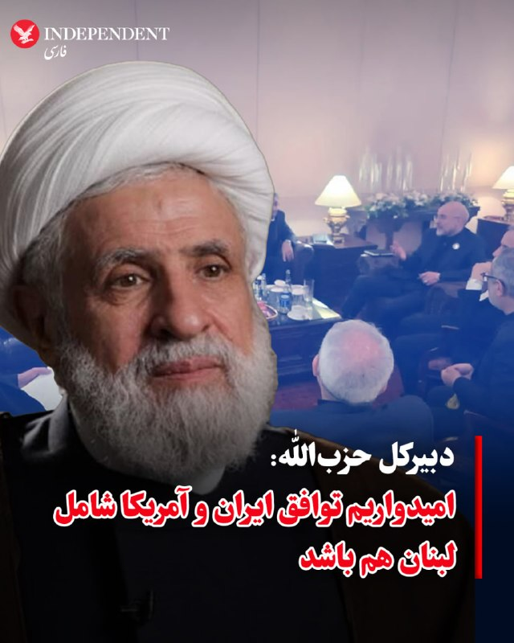

♦️نعیم قاسم، دبیرکل حزب‌الله لبنان، روز یکشنبه سوم خرداد ماه، ابراز امیدواری کرد میان جمهوری اسلامی ایران و ایالات متحده توافقی حاصل شود و لبنان نیز بخشی از مفاد آن باشد.
او در یک سخنرانی تلویزیونی گفت: «ان‌شاءالله این توافق نهایی خواهد شد و نشانه‌هایی از تکمیل آن وجود دارد و بر این اساس ما نیز جزو طرف‌های مشمول این توافق خواهیم بود، توافقی برای توقف کامل درگیری‌ها.»
این در حالیست که بنیامین نتانیاهو، نخست‌وزیر اسرائیل، پیشتر اعلام کرده بود، دونالد ترامپ بر حمایت آمریکا از حق اسرائیل برای دفاع از خود در برابر تهدیدها، از جمله حزب‌الله، تاکید کرده است.
‌🇸🇦 Indypersian

🤖 @VahidOOnLine

## VahidOOnLine — post 241974

  

ارتش اسرائیل اعلام کرد ایال زمیر، رییس ستاد کل ارتش این کشور، پس از ارزیابی وضعیت میدانی، طرح‌های ادامه عملیات علیه حزب‌الله در لبنان را تایید کرده است.

زمیر گفت ارتش اسرائیل تحولات منطقه را به‌دقت زیر نظر دارد و آماده است فورا به درگیری‌های شدید بازگردد و حکومت «تروریستی» ایران و توانمندی‌های آن را بیش از پیش تضعیف کند.

او افزود: «امروز طرح‌های ادامه نبرد در جبهه شمالی را تصویب کردم و مصمم هستیم ضربات به حزب‌الله را عمیق‌تر کنیم.»
‌🏁 🇬🇧 IranintlTV

🤖 @VahidOOnLine

## mwarmonitor — post 9658

  <a href="telegram/content/mwarmonitor_9658_1779653016.mp4" target="_blank">🎬 Download video</a>

📝 وقتی سرداران جیره خوار مایلند تخیلات خود را فراتر از مرزهای بالیوود ببرند، کمدی سیاهی خلق می‌شود که چشم واقعیت را کور می‌کند. در این افسانه‌های سفارشی، در حالی که پدرش، سنگین‌ترین سلاحی که لمس کرده همان تفنگِ تکیه‌گاهی خطبه‌های نماز جمعه است که مبادا تعادلش به هم بخورد، شازده‌پسرِ قندعسل، «آقا مجتبی»، در ۱۷ سالگی یک‌باره تبدیل به ترمیناتور خط مقدم می‌شود! نوجوانی که بزرگ‌ترین حماسه‌اش آمپول‌بازی با آقا سعید طوسی در کوچه‌های تحت حفاظت و امنِ پایتخت بود، در جفنگیات این کاسه لیسان، قطار فشنگ حمایل می‌کند و لشکرهای جنگ را مثل نقل و نبات نجات می‌دهد. این دست‌وپا زدن‌های مضحک برای تراشیدن کارنامه‌ای حماسی، بیش از آنکه ابهتی کاذب به همراه داشته باشد، یادآور این حقیقت تلخ و کنایه‌آمیز است که برای قهرمان جلوه دادنِ کسانی که فرسنگ‌ها دور از بوی باروت بزرگ شده‌اند، باید کلِ تاریخ را با وقاحت بازنویسی کرد.

@mwarmonitor

## mwarmonitor — post 9657

🔴وزیر خارجه ایالات متحده، می‌گوید که یک توافق با ایران از حمایت منطقه‌ای برخوردار شده است، اما تأکید می‌کند که دستیابی به یک توافق هسته‌ای «در ۷۲ ساعت و روی پشت یک دستمال کاغذی» ممکن نیست.

@mwarmonitor

## mwarmonitor — post 9656

  

🔴اگر من با ایران توافقی کنم، توافقی خوب و مناسب خواهد بود؛ نه مثل توافقی که اوباما انجام داد، که مقادیر انبوهی پول نقد و یک مسیر واضح و باز برای رسیدن به سلاح هسته‌ای در اختیار ایران قرار داد.
توافق ما دقیقاً برعکس آن است، اما هیچ‌کس هنوز آن را ندیده و نمی‌داند چیست. این توافق حتی هنوز به طور کامل مذاکره نشده است. بنابراین به بازنده‌هایی که از چیزی که هیچ اطلاعی درباره‌اش ندارند انتقاد می‌کنند، گوش ندهید. برخلاف کسانی که قبل از من بودند و باید این مشکل را سال‌ها پیش حل می‌کردند، من توافق بد امضا نمی‌کنم!

رئیس‌جمهور دونالد جی ترامپ (DJT)

@mwarmonitor

## mwarmonitor — post 9655

🔸علی هاشم خبرنگار الجزیره:

🔹کمتر از ۲۴ ساعت پس از شکل‌گیری فضای خوش‌بینی درباره احتمال یک تفاهم‌نامه میان ایران و آمریکا، نشانه‌های منفی در حال ظهور است.
🔹یک منبع ایرانی آگاه به من می‌گوید نشانه‌هایی از عقب‌نشینی آمریکا در دو موضوع محوری دیده می‌شود: سازوکار آزادسازی دارایی‌های مسدودشده ایران و دامنه آتش‌بس در لبنان.

🔹به گفته این منبع، تفاهم‌نامه شامل چارچوبی برای آتش‌بس در لبنان است، اما گزارش شده که اسرائیل با این ترتیبات احساس راحتی نمی‌کند و واشنگتن را تحت فشار قرار داده تا بندی اضافه شود که به اسرائیل اجازه دهد به بهانه پاسخ به «هرگونه تهدید»، عملیات نظامی در لبنان انجام دهد. ایران این فرمول‌بندی را رد کرده و بر ضرورت یک آتش‌بس پایدار و ماندگار اصرار دارد.

🔹تهران به همه میانجی‌ها، از جمله پاکستان، اطلاع داده است که تا زمانی که همه بندها به‌طور کامل مورد توافق قرار نگیرند و تضمین نشوند، تفاهم‌نامه را امضا نخواهد کرد. گفته می‌شود پاکستان پیشنهاد داده بخش‌های مورد توافق پیش برود و موارد اختلافی به بعد موکول شود، اما ایران این رویکرد را رد کرده و تأکید کرده است که بندهای مورد اختلاف اساسی و غیرقابل‌چشم‌پوشی هستند.

🔹در مجموع، تصویر کلی نشان می‌دهد که تهران هرچه بیشتر به این جمع‌بندی می‌رسد که واشنگتن در حال عقب‌نشینی از تفاهم‌های اولیه‌ای است که از طریق میانجی‌ها به دست آمده بود.

@mwarmonitor

## mwarmonitor — post 9654

🔴در حالی که مقام‌های آمریکایی خوش‌بین هستند که این توافق ظرف چند روز آینده امضا شود، در عین حال اذعان دارند که هنوز نهایی نشده و همچنان ممکن است فروبپاشد.
«ما در موقعیت بسیار خوبی هستیم، اما راه‌هایی وجود دارد که این توافق می‌تواند تضعیف شود.» — به نقل از Axios

@mwarmonitor

## mwarmonitor — post 9653

🔴سناتور لیندسی گراهام ؛ اگر در نتیجه این مذاکرات برای پایان دادن به درگیری ایران، متحدان عرب و مسلمان ما در منطقه موافقت کنند به «توافق‌های ابراهیم» بپیوندند، این توافق به یکی از مهم‌ترین و تأثیرگذارترین توافق‌ها در تاریخ خاورمیانه تبدیل خواهد شد.

🔸پیوستن عربستان سعودی، قطر و پاکستان به توافق‌های ابراهیم، دگرگونی عظیمی برای منطقه و جهان خواهد بود. این یک اقدام هوشمندانه از سوی رئیس‌جمهور ترامپ است.

🔸به عربستان سعودی و دیگر کشورها: اکنون زمان آن است که برای آینده یک خاورمیانه جدید جسور باشید. همان‌طور که رئیس‌جمهور ترامپ گفته است، انتظار می‌رود شما در واقع به توافق‌های ابراهیم بپیوندید و به‌طور مؤثر به مناقشه عربی–اسرائیلی پایان دهید. اگر از این مسیر که رئیس‌جمهور ترامپ پیشنهاد کرده است خودداری کنید، این موضوع پیامدهای جدی برای روابط آینده ما خواهد داشت و این پیشنهاد صلح را غیرقابل‌قبول خواهد کرد. همچنین در تاریخ به‌عنوان یک اشتباه محاسباتی بزرگ دیده خواهد شد.

🔸رئیس‌جمهور ترامپ: در رسیدن به یک توافق خوب با ایران قاطع بمان. به همان اندازه مهم، در اصرار بر پیوستن عربستان سعودی و دیگر کشورها به توافق‌های ابراهیم به‌عنوان بخشی از این مذاکرات نیز قاطع بمان.

🔹بار دیگر، این یک پیشنهاد بسیار هوشمندانه از سوی رئیس‌جمهور ترامپ است.

@mwarmonitor

## mwarmonitor — post 9652

🔴یک منبع ارشد ایرانی به رویترز گفته است که تهران با تحویل ذخیره اورانیوم بسیار غنی‌شده خود موافقت نکرده است و همچنین موضوع هسته‌ای ایران در توافق اولیه با آمریکا گنجانده نشده است. @mwarmonitor

## mwarmonitor — post 9651

🔴ایالات متحده و ایران به‌طور اصولی بر سر یک توافق به تفاهم رسیده‌اند که بر اساس آن تنگه هرمز دوباره بازگشایی شود و ایران متعهد شود اورانیوم بسیار غنی‌شده خود را دفع کند، یک مقام آمریکایی روز یکشنبه گفت. این مقام افزود که این توافق هنوز امضا نشده است. نیویورک…

## mwarmonitor — post 9650

🔴رئیس ستاد ارتش اسرائیل: ما آماده‌ایم فوراً به نبرد شدید بازگردیم تا رژیم «تروریستی» ایران را تضعیف کنیم.

@mwarmonitor

## mwarmonitor — post 9649

  <a href="telegram/content/mwarmonitor_9649_1779653020.mp4" target="_blank">🎬 Download video</a>

❌برای رفع تهدید فوری: ارتش اسرائیل یک تروریست از سازمان تروریستی حماس را که در یورش به پایگاه زیکیم در کشتار ۷ اکتبر شرکت داشت، به هلاکت رساند

🔸در طول آخر هفته (جمعه)، نیروهای ارتش اسرائیل تحت فرماندهی جنوب، تروریست لؤی هشام محمود بصل را که به‌عنوان تک‌تیرانداز در گردان زیتون وابسته به سازمان تروریستی حماس فعالیت می‌کرد و تهدیدی فوری علیه نیروهای ما محسوب می‌شد، به هلاکت رساندند.

🔹بر اساس بررسی‌های اطلاعاتی، مشخص شد که این تروریست در یورش به پایگاه زیکیم در کشتار خونین ۷ اکتبر مشارکت داشته و در دوره اخیر نیز برای اجرای طرح‌های تروریستی علیه نیروهای ارتش اسرائیل در منطقه فعالیت می‌کرده است.

🔸نیروهای ارتش اسرائیل تحت فرماندهی جنوب مطابق با توافق در منطقه مستقر هستند و به فعالیت خود برای رفع هرگونه تهدید فوری ادامه خواهند داد.

@mwarmonitor

## mwarmonitor — post 9648

🔰مارک لوین ؛ همان‌طور که بیشتر مردم می‌دانند، من طرفدار بسیار پر و پا قرص ریگان هستم. در سال‌های ۱۹۷۶ و ۱۹۸۰ برای او تبلیغ کردم و ۸ سال در دولت او خدمت کردم. اما یکی از بزرگ‌ترین اشتباهات، عفو ۲.۳ میلیون مهاجر غیرقانونی بود. علاوه بر آن، این عفو پیش از آن انجام شد که دموکرات‌ها وعده دهند بودجه امنیت مرزی تأمین خواهد شد. دموکرات‌ها به‌سادگی از اجرای بخش خود از توافق خودداری کردند. ریگان بعدها گفت که این یک اشتباه بوده است.

🔸زمان‌بندی اهمیت دارد. من با یک توافق مخالفم. ماه‌هاست این را می‌گویم. به کسانی که خواهان توافق بودند تبریک می‌گویم؛ به نظر می‌رسد امروز روز شماست. و اگر توافقی انجام شود، رژیم ایران دست‌کم فعلاً باقی خواهد ماند. باید دید در طول زمان این موضوع چگونه پیش می‌رود. من نسبت به این‌که هر توافقی بتواند دشمن را مهار کند یا اجرا شود بسیار بدبین هستم، به دلایل متعدد؛ به‌ویژه بعد از ترک سمت ریاست‌جمهوری توسط ترامپ، یا این‌که تروریست‌ها دست از تروریسم بردارند.

🔹با این حال، فرض می‌کنم اگر توافقی وجود داشته باشد، رژیم ایران باید ابتدا تعهدات خود را انجام دهد — یعنی به‌عنوان شرط مقدم بر هرگونه رفع تحریم. معتقدم اگر این‌طور نباشد، اشتباه بزرگی خواهد بود. از جمله اینکه اگر رژیم ایران قصد عمل به تعهداتش را ندارد، باید از همان ابتدا مشخص شود، نه بعداً. و باید همین حالا خودش را آشکار کند.

🔸همچنین آزاد کردن میلیاردها و میلیاردها دلار برای آن‌ها — که پیش از جنگ مسدود شده بود — پس از رسیدن به دستشان تقریباً غیرقابل کنترل خواهد بود و برای تقویت رژیم استفاده خواهد شد. من در این مورد هیچ شکی ندارم. این همان چیزی است که هستند. این طرز فکر آن‌هاست. آن‌ها به هیچ‌کس جز خودشان پاسخگو نیستند.

🔹هیچ کشور خاورمیانه‌ای نباید برای یک توافق، تحت فشار قرار گیرد تا امنیت ملی خود را کاهش دهد. آیا حزب‌الله واقعاً زنده می‌ماند و دوباره در لبنان قدرت می‌گیرد و آزاد خواهد بود که به شلیک موشک به اسرائیل ادامه دهد؟ آیا ما چنین چیزی را می‌پذیریم؟ این موضوع باید کاملاً روشن باشد. «حق موجودیت اسرائیل» نباید فقط یک شعار باشد.

🔸تا این لحظه من هیچ چیزی درباره موشک‌های بالستیک نمی‌بینم، در حالی که این‌ها خطرناک‌ترین سلاح متعارف در زرادخانه رژیم ایران هستند. مهم خواهد بود که ببینیم این موضوع چگونه رسیدگی می‌شود.

🔹اگر توافقی انجام شود، من روی مجموعه‌ای از مسائل به‌طور جدی تمرکز خواهم کرد. همه ما باید همین کار را بکنیم. عجیب خواهد بود اگر نکنیم. این فقط یک دشمن خارجی هزاران کیلومتر دورتر نیست. در ۴۷ سال گذشته هزاران آمریکایی را کشته یا معلول کرده است.

🔸رئیس‌جمهور بارها قوی‌ترین استدلال را برای ضرورت و فوریت اقدام نظامی مطرح کرده است. همچنین بسیار مفیدتر و منطقی‌تر خواهد بود اگر سناتورها و نمایندگان کنگره که خواهان توافق هستند، دقیقاً توضیح دهند که از نظر آن‌ها سازوکار یک توافق چگونه باید باشد.

ادامه دارد...

@mwarmonitor

## mwarmonitor — post 9647

🔴ایالات متحده و ایران به‌طور اصولی بر سر یک توافق به تفاهم رسیده‌اند که بر اساس آن تنگه هرمز دوباره بازگشایی شود و ایران متعهد شود اورانیوم بسیار غنی‌شده خود را دفع کند، یک مقام آمریکایی روز یکشنبه گفت. این مقام افزود که این توافق هنوز امضا نشده است. نیویورک تایمز

@mwarmonitor

## pm_afshaa — post 91416

  <a href="telegram/content/pm_afshaa_91416_1779653021.webm" target="_blank">🎬 Download video</a>

🔴محسن رضایی:
در صورت تعرض به تنگه هرمز و ورود به خلیج‌ فارس، محاصره دریایی رو خواهیم شکست و پاسخی سخت، دردناک و کم‌نظیر به آمریکا خواهیم داد؛ ممکنه از ان‌پی‌تی هم خارج بشیم.

💧 Rainbet.com the #1 Non-KYC Crypto Casino & Sportsbook @rainbetcom

😁 @Pm_Afshaa

## pm_afshaa — post 91415

  <a href="telegram/content/pm_afshaa_91415_1779653022.webm" target="_blank">🎬 Download video</a>

🔴خبرگزاری i24NEWS: مقامات آمریکایی میگن ایران تا زمانی که انتقال ذخایر اورانیوم غنی‌شده خود را آغاز نکنه، هیچ‌گونه تسهیلاتی در زمینه تحریم‌ها یا آزادسازی وجوه مسدود شده دریافت نخواهد کرد.

💧 Rainbet.com the #1 Non-KYC Crypto Casino & Sportsbook @rainbetcom

😁 @Pm_Afshaa

## pm_afshaa — post 91414

  <a href="telegram/content/pm_afshaa_91414_1779653023.webm" target="_blank">🎬 Download video</a>

🔴کانال 12 اسرائیل:
مقام‌های ارشد اسرائیلی نگران‌ هستن توافق در حال شکل‌گیری میان آمریکا و جمهوری اسلامی ممکنه آزادی عمل اسرائیل علیه حزب‌الله در لبنان رو به‌شدت محدود کنه.

💧 Rainbet.com the #1 Non-KYC Crypto Casino & Sportsbook @rainbetcom

😁 @Pm_Afshaa

## pm_afshaa — post 91413

  <a href="telegram/content/pm_afshaa_91413_1779653024.webm" target="_blank">🎬 Download video</a>

🔴سی‌ان‌ان: ایران هیچ پولی یا لغو تحریمی رو در این توافق دریافت نخواهد کرد.

💧 Rainbet.com the #1 Non-KYC Crypto Casino & Sportsbook @rainbetcom

😁 @Pm_Afshaa

## pm_afshaa — post 91412

  <a href="telegram/content/pm_afshaa_91412_1779653025.webm" target="_blank">🎬 Download video</a>

🔴ترامپ:
اگر با ایران معامله‌ای انجام دهم، معامله‌ای خوب و درست خواهد بود، نه مانند معامله‌ای که اوباما انجام داد و به ایران مقادیر زیادی پول نقد و مسیری واضح و باز به سمت سلاح هسته‌ای داد. معامله ما دقیقاً برعکس است، اما هنوز کسی آن را ندیده یا نمی‌داند چیست. حتی هنوز به طور کامل مذاکره هم نشده است.

پس به بازنده‌هایی که از چیزی که هیچ نمی‌دانند انتقاد می‌کنند، گوش ندهید. برخلاف کسانی که قبل از من بودند و باید این مشکل را سال‌ها پیش حل می‌کردند، من معامله‌های بد انجام نمی‌دهم!

💧 Rainbet.com the #1 Non-KYC Crypto Casino & Sportsbook @rainbetcom

😁 @Pm_Afshaa

## pm_afshaa — post 91411

  <a href="telegram/content/pm_afshaa_91411_1779653025.webm" target="_blank">🎬 Download video</a>

🔴باراک راوید، خبرنگار اکسیوس:
با اینکه آمریکا خوشبینه توافق چند روز دیگه امضا بشه، هنوز نهایی نشده و ممکنه از هم بپاشه.

یک مقام ارشد گفته: وضعیت خوبه، ولی راه‌هایی هست که می‌تونه توافق رو ضعیف کنه

💧 Rainbet.com the #1 Non-KYC Crypto Casino & Sportsbook @rainbetcom

😁 @Pm_Afshaa

## pm_afshaa — post 91410

🔴ترامپ:محاصره دریایی علیه ایران به صورت کامل ادامه دارد

💧 Rainbet.com the #1 Non-KYC Crypto Casino & Sportsbook @rainbetcom

😁 @Pm_Afshaa

## pm_afshaa — post 91409

🔴علی هاشم، خبرنگار الجزیره:کمتر از 24 ساعت پس از آنکه خوش‌بینی‌هایی درباره احتمال تفاهم ایران و آمریکا مطرح شد،نشانه‌های منفی از راه رسیده است و امضای توافق نامشخص است

💧 Rainbet.com the #1 Non-KYC Crypto Casino & Sportsbook @rainbetcom

😁 @Pm_Afshaa

## pm_afshaa — post 91408

رسانه‌های داخلی: آمریکا مانع آزادسازی پول‌های مسدود شدست، احتمال لغو توافق وجود دارد

💧 Rainbet.com the #1 Non-KYC Crypto Casino & Sportsbook @rainbetcom

😁 @Pm_Afshaa

## pm_afshaa — post 91407

  <a href="telegram/content/pm_afshaa_91407_1779653026.webm" target="_blank">🎬 Download video</a>

🔴الجزیره: یه منبع ایرانی به ما گفته؛ آمریکا داره از چند تا توافق قبلی خودش عقب می‌کشه، مخصوصاً سر آزاد کردن پول‌های بلوکه‌شده ایران و مدل آتش‌بس لبنان؛

تو متن تفاهم‌نامه، اسرائیل میخواد دستش باز بمونه که هر وقت گفت «تهدید حس کردیم» دوباره تو لبنان عملیات بزنه و بهشون حمله کنه، ولی ایران مخالفه و میگه آتش‌بس باید واقعی، کامل و دائمی باشه.

پاکستان پیشنهاد داده فعلاً بخش‌هایی که توافق شده امضا بشه و بقیه اختلافات بعداً حل شه، ولی ایران گفته نه؛ یا همه بندها کامل و تضمینی حل میشه یا کلاً امضایی در کار نیست.

💧 Rainbet.com the #1 Non-KYC Crypto Casino & Sportsbook @rainbetcom

😁 @Pm_Afshaa

## pm_afshaa — post 91406

  <a href="telegram/content/pm_afshaa_91406_1779653027.webm" target="_blank">🎬 Download video</a>

🔴سناتور لیندسی گراهام:
اگه این مذاکرات با ایران باعث بشه عربستان، قطر و پاکستان هم وارد توافق ابراهیم بشن، این میتونه یکی از بزرگ‌ترین و مهم‌ترین توافق‌های تاریخ خاورمیانه باشه؛ پیوستن این کشورها به توافق ابراهیم، کل منطقه و حتی دنیا رو متحول می‌کنه و این یه حرکت فوق‌العاده از طرف ترامپه.

💧 Rainbet.com the #1 Non-KYC Crypto Casino & Sportsbook @rainbetcom

😁 @Pm_Afshaa

## pm_afshaa — post 91405

  <a href="telegram/content/pm_afshaa_91405_1779653028.webm" target="_blank">🎬 Download video</a>

🔴یک مقام ارشد دولت آمریکا به فاکس‌نیوز:
شاهد انعطاف‌هایی از سمت تهران هستیم که قبلا ندیده بودیم.

💧 Rainbet.com the #1 Non-KYC Crypto Casino & Sportsbook @rainbetcom

😁 @Pm_Afshaa

## pm_afshaa — post 91404

  <a href="telegram/content/pm_afshaa_91404_1779653029.webm" target="_blank">🎬 Download video</a>

🔴روبیو، وزیر خارجه آمریکا:
این که ترامپ ممکنه با توافقی موافقت کنه که در نهایت موقعیت جمهوری اسلامی رو در برنامه هسته‌ای تقویت کنه، با توجه به مواضع و اقداماتی که تاکنون ازش دیدیم، کاملا مضحکه.

💧 Rainbet.com the #1 Non-KYC Crypto Casino & Sportsbook @rainbetcom

😁 @Pm_Afshaa

## pm_afshaa — post 91403

🔴رئیس ستاد کل ارتش اسرائیل:
ما آماده‌ایم که فوراً به نبرد با ایران بازگردیم

💧 Rainbet.com the #1 Non-KYC Crypto Casino & Sportsbook @rainbetcom

😁 @Pm_Afshaa

## pm_afshaa — post 91402

🔴نیویورک تایمز به نقل از یک مقام آمریکایی: مسائلی مانند ذخایر موشکی ایران و غنی سازی اورانیوم در مذاکرات بعدی مورد بحث قرار خواهد گرفت

💧 Rainbet.com the #1 Non-KYC Crypto Casino & Sportsbook @rainbetcom

😁 @Pm_Afshaa

## pm_afshaa — post 91401

  

پست اتاق جنگ اسرائیل:
ایران آزاد

💧 Rainbet.com the #1 Non-KYC Crypto Casino & Sportsbook @rainbetcom

😁 @Pm_Afshaa

## pm_afshaa — post 91400

  

ترامپ تو تروث سوشال صحبت‌های امروز مسعود پزشکیان که گفته بود «ما آماده‌ایم به جهان اطمینان دهیم که به دنبال سلاح هسته‌ای نیستیم. ما به دنبال بی‌ثباتی در منطقه نیستیم» رو پست کرده

💧 Rainbet.com the #1 Non-KYC Crypto Casino & Sportsbook @rainbetcom

😁 @Pm_Afshaa

## pm_afshaa — post 91398

🔴یک مقام آمریکایی به سی‌بی‌اس: ایران قبول کرده اورانیوم غنی شده‌ش رو به‌عنوان بخشی از توافق، دفن کنه

💧 Rainbet.com the #1 Non-KYC Crypto Casino & Sportsbook @rainbetcom

😁 @Pm_Afshaa

## iaghapour — post 2629

  

💠 Mega Center 💠

🪩📈 ابزار مورد نیاز شما در دنیای کریپتو و تریدینگ / احراز هویت پلتفرم های خارجی

از افتتاح حساب های ارزی بین المللی
تا پکیج مدارک لازم جهت احراز هویت صرافی ها و سایت های خارجی
صدور مستر کارت و ویزا کارت و خدمات
ارزی
سیم کارت های فیزیکی خارجی
خدمات وریفای تضمینی صرافی ها ، سایت های فریلنسری و گیمینگ
اکانت های اماده دیتاسنترها
آیپی رزیدنتال اختصاصی
اشتراک ویندسکرایب و ...

👨‍💻لینک دسترسی ها و ارتباط :
www.megacenterx.com      
www.megacenterx.com
www.megacenterx.com

https://t.me/megacenter0
https://t.me/megacenter0

@Megav_admin22
@Megav_admin22

در صورت بالا نیامدن سایت ، بدون وی پی ان امتحان نمایید ✅
سایت دارای اینماد و درگاه پرداخت اختصاصی و کریپتو ✅

## iaghapour — post 2628

  

⭕️ آپدیت جدید کلاینت اندروید GooseRelayVPN

🔹این مخزن، کلاینت اندروید GooseRelayVPN است که هسته GooseRelay را از طریق Go mobile اجرا می‌کند و رابط کاربری کامل برای مدیریت VPN، پروفایل‌ها، لاگ‌ها و تنظیمات ارائه می‌دهد.

🛠 پایداری و رفع کرش

‏🌐 رفع کامل لو رفتن آی‌پی (IPv6 Leak) با موتور جدید tun2socks gVisor FakeDNS.

‏🎛 پیاده‌سازی کامل Quick Settings Tile.

‏📊 نمایش کاملاً دقیق سرعت و حجم مصرفی.

‏🗂 اضافه شدن حالت Bypass به بخش Split-Tunneling.

‏❄️ رفع فریز شدن برنامه در پس‌زمینه.

‏📜 اصلاح پرش ناگهانی اسکرول لاگ‌ها و بازطراحی کارت وضعیت اتصال در صفحه Home

🔗 اطلاعات بیشتر در گیت‌هاب پروژه

🆔 @iAghapour

## DEJradio — post 4927

  <a href="telegram/content/DEJradio_4927_1779653033.mp4" target="_blank">🎬 Download video</a>

👑🎥 تجمع ایرانیان میهن دوست در شهر وین اتریش

#همبستگی #وین
@DEJradio

## DEJradio — post 4926

👑🎥 تجمع ایرانیان مقیم هانوفر آلمان در حمایت از انقلاب شیر و خورشید ایران.

#همبستگی #هانوفر
@DEJradio

## DEJradio — post 4925

  <a href="telegram/content/DEJradio_4925_1779653035.webm" target="_blank">🎬 Download video</a>

🔸
🚨 خبر ۲۱
یکشنبه ۳ خرداد ۱۴۰۵

#خبر۲۱

@DEJradio

## DEJradio — post 4924

  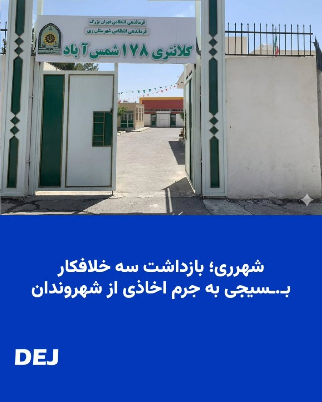

🔸
🔴 به گزارش منابع اختصاصی دژ سه خلافکار سابقه‌دار در شهرری که در جریان سرکوب اعتراضات و تجمعات شبانه با بـ.ـسیج همکاری می‌کردند به جرم اخاذی از مردم و شهروندان افغانی بازداشت شدند.
این سه نفر که توسط پرسنل کلانتری ۱۷۸ شمس‌آباد در یک دیگری بازداشت شدند، علاوه بر کارت بـ.ـسیج و انتظامی، بیسیم و اسلحه به همراه داشتند و در پوشش ایست بازرسی و گشت‌های محله محور از مردم باجگیری می‌کردند.

#اوباش_سرکوبگر
@DEJradio

## DEJradio — post 4923

  

🔸
⭕️ بنیامین نتانیاهو می‌گوید با دونالد ترامپ توافق دارند هر توافق نهایی با حکومت ایران باید تهدید هسته‌ای رژیم را به‌طور کامل برطرف کند؛ از جمله با برچیدن تأسیسات غنی‌سازی و خروج مواد غنی‌شده از ایران. او تاکید کرد سیاست مشترک آن‌ها این است که ایران نباید به سلاح هسته‌ای دست یابد.
به گفته یک مقام ارشد اسرائیلی، ترامپ، در تماس تلفنی با بنیامین نتانیاهو تلاش کرده او را مطمئن کند که توافق نهایی با ایران به‌طور کامل برنامه هسته‌ای تهران را برچیده خواهد کرد.

#اسرائیل #مذاکرات
@DEJradio

## DEJradio — post 4922

  <a href="telegram/content/DEJradio_4922_1779653038.webm" target="_blank">🎬 Download video</a>

👑
🔺 تظاهرات ایرانیان میهن‌دوست در برلین در حمایت از شاهزاده رضا پهلوی و انقلاب شیر و خورشید؛ یکشنبه سوم خرداد ۱۴۰۵

#برلین #همبستگی
@DEJradio

## VahidOnline — post 75689

  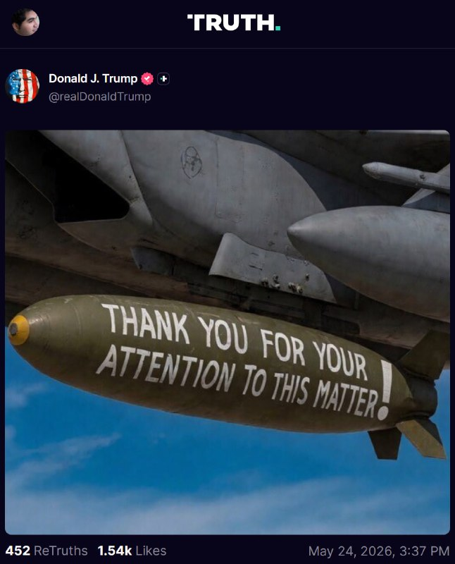

پست ترامپ
روی تصویر بمب نوشته: از توجه شما به این موضوع سپاسگزارم.
realDonaldTrump

📡 @VahidOnline

## VahidOnline — post 75688

  

مارکو روبیو، وزیر خارجه آمریکا، در گفت‌وگویی کوتاه با نیویورک تایمز گفت: «ما موضوع را به بعد موکول نمی‌کنیم. مذاکرات هسته‌ای مسائل بسیار فنی هستند. شما نمی‌توانید یک موضوع هسته‌ای را در ۷۲ ساعت و روی یک دستمال کاغذی حل کنید.»
او افزود: «در حال حاضر، هفت یا هشت کشور منطقه از این رویکرد حمایت می‌کنند و ما آماده‌ایم این مسیر را ادامه دهیم.»

این در حالی است که آقای روبیو ساعاتی پیش گفته بود که ممکن است تا شامگاه یک‌شنبه خبری دربارهٔ توافقی با ایران اعلام شود که می‌تواند به‌طور رسمی به جنگ خاورمیانه پایان دهد.
@VahidHeadline

📡 @VahidOnline

## VahidOnline — post 75687

ترامپ: اگر توافق کنم توافقی خوب خواهد بود

ترجمه ماشین:
اگر با ایران توافقی انجام بدهم، توافقی خوب و درست خواهد بود؛ نه مثل توافقی که اوباما انجام داد و مبالغ عظیمی پول نقد به ایران داد و مسیری روشن و باز به سوی سلاح هسته‌ای پیش پای ایران گذاشت.

توافق ما دقیقا برعکس آن است، اما هیچ‌کس آن را ندیده و نمی‌داند چیست.
حتی هنوز به‌طور کامل هم مذاکره و نهایی نشده است.
بنابراین به بازنده‌هایی که درباره چیزی انتقاد می‌کنند که هیچ اطلاعی از آن ندارند گوش نکنید.
برخلاف کسانی که پیش از من بودند و باید سال‌ها پیش این مشکل را حل می‌کردند، من توافق‌های بد انجام نمی‌دهم!

رئیس‌جمهور دی‌جی‌تی
realDonaldTrump

📡 @VahidOnline

## kianmeli1 — post 87644

🔴سی‌ان‌ان: انتظار نمی‌رود توافقی میان ایران و آمریکا امروز به امضا برسد

با وجود ادعای ترامپ مبنی بر «مذاکره‌یِ بخش اعظمِ توافق»، منابع ارشد در دولت آمریکا تأکید کردند امروز هیچ توافقی امضا نخواهد شد. اختلاف‌ها بر سر جزئیاتِ نحوه امحای اورانیوم و مدت‌زمانِ تعلیقِ غنی‌سازی همچنان پابرجاست.

طبق این گزارش، کاهشِ تحریم‌ها و آزادسازیِ دارایی‌های مسدودشده، مشروط به دو گامِ حیاتی است:

بازگشاییِ کاملِ تنگه هرمز و پایبندیِ ایران به محدودیت‌های جدیدِ هسته‌ای.
مبلغِ دقیقِ آزادسازیِ دارایی‌ها نیز هنوز تعیین نشده است. هرچند طرفین به پیشرفتِ صلح اشاره دارند، اما واشنگتن هشدار داده که در این روندِ پیچیده، تعجیل نخواهد کرد.
https://t.me/kianmeli1

## kianmeli1 — post 87643

  

🔴شبکه سی‌بی‌اس گزارش داده که دولت ترامپ معتقد است مجتبی خامنه‌ای با چارچوب کلی پیش‌نویس توافق میان ایران و آمریکا موافقت کرده است.
بر اساس این گزارش، ایران در اصل پذیرفته ذخایر اورانیوم با غنای بالای خود را کنار بگذارد و در مقابل، محاصره دریایی آمریکا لغو شود.
با این حال، پیش‌نویس توافق هنوز باید در ساختار رهبری ایران، از جمله شورای عالی امنیت ملی و فرماندهی سپاه پاسداران، بررسی و تأیید شود.
https://t.me/kianmeli1

## kianmeli1 — post 87642

  <a href="telegram/content/kianmeli1_87642_1779653041.mp4" target="_blank">🎬 Download video</a>

🔴 طبق گزارش فاکس نیوز، ترامپ می‌خواهد توافق پیشنهادی توسط مذاکره‌کنندگان او، از جمله استیو ویتکوف و جرد کوشنر، اجرا شود؛ اگر این شرایط برآورده نشوند، هیچ توافقی صورت نخواهد گرفت
https://t.me/kianmeli1

## kianmeli1 — post 87641

  <a href="telegram/content/kianmeli1_87641_1779653043.mp4" target="_blank">🎬 Download video</a>

🔴تهران و واشینگتن هنوز امضای توافق را اعلام نکرده‌اند. جزئیات توافق احتمالی هم هنوز به طور رسمی اعلام نشده است. گرچه گمانه‌زنی‌ها بر این بود که رسیدن به توافق امروز اعلام خواهد شد، اما کاخ سفید گفته است امضای توافق ممکن است چند روز دیگر انجام شود.
https://t.me/kianmeli1

## kianmeli1 — post 87640

  

🔴رسانه آکسیوس، روز یکشنبه سوم خرداد ماه، به نقل از یک مقام ارشد دولت دونالد ترامپ گزارش داد، «چند مورد جزئیات حل‌نشده» میان تهران و واشنگتن باقی‌مانده است و به همین دلیل توافق میان ایران و آمریکا احتمالا امروز امضا نخواهد شد.

این مقام آمریکایی به آکسیوس گفت هنوز بر سر برخی بخش‌های توافق «رفت‌وبرگشت» وجود دارد و اختلاف‌ها بیشتر بر سر عباراتی است که برای هر یک از دو طرف اهمیت دارد: «برخی کلمات برای ما مهم هستند و برخی کلمات برای آن‌ها.»

آکسیوس به نقل از این مقام ارشد کاخ سفید نوشت، ساختار تصمیم‌گیری در جمهوری اسلامی «سریع عمل نمی‌کند» و روند دریافت همه تاییدیه‌های لازم چند روز زمان خواهد برد.

به گفته این مقام، ارزیابی واشنگتن این است که «مجتبی خامنه‌ای»، رهبر جمهوری اسلامی، چارچوب کلی توافق را تایید کرده، اما اینکه این روند به توافق نهایی منجر شود، «همچنان یک سوال باز» است.
https://t.me/kianmeli1

## kianmeli1 — post 87639

  

🔴علی هاشم از الجزیره:کمتر از 24 ساعت پس از ظهور خوش‌بینی‌ها درباره احتمال امضای یک یادداشت تفاهم بین ایران و آمریکا، احساسات منفی در حال بروز است. یک منبع مطلع ایرانی به من می‌گوید نشانه‌هایی از عقب‌نشینی آمریکا در دو موضوع اصلی وجود دارد: مکانیزم آزادسازی دارایی‌های ایران و دامنه آتش‌بس در لبنان.
https://t.me/kianmeli1

## IranIntlTV — post 338808

  <a href="telegram/content/IranIntlTV_338808_1779653048.mp4" target="_blank">🎬 Download video</a>

نیویورک‌تایمز به نقل از یک مقام آمریکایی گزارش داد توافق میان تهران و واشینگتن هنوز امضا نشده و برای تایید نهایی رهبران دو کشور به چند روز زمان نیاز دارد.

بر اساس این گزارش، توافق احتمالی به برنامه موشکی جمهوری اسلامی و توقف کامل غنی‌سازی اورانیوم نمی‌پردازد.

گفت‌وگو با حسین علیزاده، تحلیل‌گر مسائل بین‌الملل
@iranintltv

## IranIntlTV — post 338807

  

بدر البوسعیدی، وزیر خارجه عمان گفت‌وگوی خود با کاظم غریب‌آبادی، معاون وزیر خارجه جمهوری اسلامی را «خوب» توصیف کرد.

او یکشنبه در شبکه ایکس نوشت: «ما بر اهمیت تعامل دیپلماتیک در همه زمینه‌ها تاکید کردیم. عمان به حمایت از تلاش‌ها برای کاهش تنش، پیشبرد همزیستی مسالمت‌آمیز منطقه‌ای، امنیت و آزادی دریانوردی ادامه خواهد داد.»
https://iranintl.com/202605241490

## IranIntlTV — post 338806

  <a href="https://t.me/IranintlTV/338806" target="_blank">📎 Download file</a>

🎧نسخه صوتی چشم‌انداز: بندهای پنهان توافق ترامپ و جمهوری اسلامی
@iranintlTV

## IranIntlTV — post 338805

  

به گزارش کانال ۱۲ اسرائیل، مقام‌های ارشد اسرائیلی نگران‌اند توافق در حال شکل‌گیری میان آمریکا و ایران ممکن است آزادی عمل اسرائیل علیه حزب‌الله در لبنان را به‌شدت محدود کند.

در این گزارش آمده است توافق پیشنهادی شامل پایان کامل درگیری‌ها در لبنان همزمان با پایان جنگ آمریکا و جمهوری اسلامی خواهد بود؛ موضوعی که باعث شد بنیامین نتانیاهو در تماس تلفنی روز گذشته خود با دونالد ترامپ نگرانی‌هایش را مطرح کند.

بر اساس این گزارش، نتانیاهو بر حفظ آزادی عملیاتی اسرائیل در لبنان تمرکز کرده و یک مقام ارشد اسرائیلی بعدا اعلام کرده است ترامپ موافقت کرده اسرائیل «آزادی عمل خود را در برابر تهدیدها در همه جبهه‌ها، از جمله لبنان، حفظ کند.»
https://iranintl.com/202605247829

## IranIntlTV — post 338804

  <a href="telegram/content/IranIntlTV_338804_1779653053.mp4" target="_blank">🎬 Download video</a>

محسن رضایی، مشاور مجتبی خامنه‌ای، تهدید کرد در صورت اقدام علیه تنگه هرمز و ورود به خلیج فارس، «پاسخ سخت» داده می‌شود و با شکستن محاصره دریایی اقدامات تقابلی آغاز خواهد شد. او یکی از گزینه‌های راهبردی جمهوری اسلامی در صورت تداوم این روند را احتمال خروج از پیمان منع گسترش سلاح‌های هسته‌ای عنوان کرد.

گفت‌وگو با عطا محامد، کارشناس روابط بین‌الملل
@iranintltv

## IranIntlTV — post 338803

  <a href="telegram/content/IranIntlTV_338803_1779653055.mp4" target="_blank">🎬 Download video</a>

نیویورک‌تایمز به نقل از یک مقام آمریکایی گزارش داد آمریکا و جمهوری اسلامی بر سر چارچوبی در حال تفاهم هستند که در آن تنگه هرمز بازگشایی می‌شود و تهران متعهد خواهد شد ذخایر اورانیوم با غنای بالای خود را «نابود» کند.

ارزیابی شهرام خلدی، پژوهش‌گر تاریخ خاورمیانه و روابط بین‌الملل
@iranintltv

## IranIntlTV — post 338802

  

دونالد ترامپ در تروث‌سوشال نوشت اگر با جمهوری اسلامی توافقی انجام دهد، توافقی خوب و درست خواهد بود؛ نه مانند توافق اوباما که مبالغ هنگفتی پول نقد به تهران داد و مسیری آشکار برای دستیابی این کشور به سلاح هسته‌ای فراهم کرد.

او افزود توافق دولتش دقیقا برعکس آن است، اما هنوز کسی آن را ندیده و نمی‌داند شامل چه مواردی است و این توافق هنوز به‌طور کامل نهایی نشده است.

ترامپ گفت به کسانی که درباره موضوعی که اطلاعی از آن ندارند انتقاد می‌کنند گوش ندهید و تاکید کرد برخلاف دولت‌های پیشین، توافق بد انجام نخواهد داد.
https://iranintl.com/202605243731

## IranIntlTV — post 338801

  <a href="https://t.me/IranintlTV/338801" target="_blank">📎 Download file</a>

🎧نسخه صوتی تیتراول با نیوشا صارمی: تهران و واشینگتن در آستانه تصمیم نهایی توافق؛ هشدار نتانیاهو:آزادی عمل داریم
@iranintlTV

## IranIntlTV — post 338800

بخش مهمی از تفاهم‌نامه تهران و واشینگتن مربوط به مسائل و امتیازهای اقتصادی است. آمریکا در ازای بازگشایی تنگه هرمز، محاصره بنادر ایران را به تدریج لغو خواهد کرد و معافیت‌های تحریمی برای فروش آزاد نفت ایران صادر می‌شود. اگرچه تهران خواستار آزادسازی فوری منابع مالی و رفع دائمی تحریم‌‌ها بود، اما آزادسازی دارایی‌های بلوکه‌شده و رفع کامل تحریم‌ها به توافق نهایی موکول شده است.

گفت‌وگو با سارا بازوبندی، کارشناس اقتصادی
@iranintltv

## IranIntlTV — post 338799

تهران و واشینگتن هنوز امضای توافق را اعلام نکرده‌اند. جزئیات توافق احتمالی هم هنوز به طور رسمی اعلام نشده است. گرچه گمانه‌زنی‌ها بر این بود که رسیدن به توافق امروز اعلام خواهد شد، اما کاخ سفید گفته است امضای توافق ممکن است چند روز دیگر انجام شود.

گفت‌وگو با نوید محبی، تحلیل‌گر سیاسی
@iranintltv

## IranIntlTV — post 338798

  <a href="telegram/content/IranIntlTV_338798_1779653059.mp4" target="_blank">🎬 Download video</a>

محسن رضایی، مشاور نظامی مجتبی خامنه‌ای، در یک سخنرانی در مصلای تهران، با اشاره به اینکه کاری خواهند کرد که «امنیت» کشور برای ۵۰ سال آینده تأمین شود، خطاب به مقام‌های آمریکایی گفت: «در صورت تعرض به تنگه هرمز و ورود به خلیج‌ فارس، محاصره دریایی را خواهیم شکست و پاسخی سخت، دردناک و کم‌نظیر به آمریکا خواهیم داد.»

او در ادامه، آمریکا را به خروج جمهوری اسلامی از معاهده «ان‌پی‌تی» تهدید کرد و گفت دست به خودکشی نزند.
@iranintltv

## IranIntlTV — post 338797

  

وزارت آموزش‌وپرورش اخبار منتشرشده درباره مجازی شدن امتحانات نهایی را تکذیب و اعلام کرد تاکنون هیچ تصمیمی برای برگزاری مجازی امتحانات نهایی پایه‌های یازدهم و دوازدهم گرفته نشده است.

وزارت آموزش‌وپرورش اعلام کرد تا تیرماه برای فراهم شدن شرایط برگزاری امتحانات نهایی صبر می‌شود و در صورت فراهم شدن امکان برگزاری حضوری، آزمون‌های نهایی مطابق روال معمول به شکل حضوری برگزار خواهد شد.

در روزهای اخیر، دانش‌آموزان در چندین شهر به برگزاری حضوری امتحانات اعتراض کردند.
https://iranintl.com/202605241771

## IranIntlTV — post 338795

  <a href="telegram/content/IranIntlTV_338795_1779653061.mp4" target="_blank">🎬 Download video</a>

سی‌بی‌اس نیوز گزارش داد واشینگتن بر این باور است که رهبر جمهوری اسلامی الگوی کلی پیش‌نویس توافق با آمریکا را تایید کرده است.

کاخ سفید اعلام کرد توافق هنوز نهایی نشده است و بنیامین نتانیاهو نیز گفت با دونالد ترامپ توافق کرده هرگونه توافق نهایی با ایران باید تهدید هسته‌ای را از میان بردارد.

گفت‌وگو با روح‌الله رحیم‌پور، تحلیل‌گر سیاسی، و اشکان صفایی و مرضیه حسینی، خبرنگاران ایران‌اینترنشنال
@iranintltv

## IranIntlTV — post 338794

  

ارتش اسرائیل اعلام کرد ایال زمیر، رییس ستاد کل ارتش این کشور، پس از ارزیابی وضعیت میدانی، طرح‌های ادامه عملیات علیه حزب‌الله در لبنان را تایید کرده است.

زمیر گفت ارتش اسرائیل تحولات منطقه را به‌دقت زیر نظر دارد و آماده است فورا به درگیری‌های شدید بازگردد و حکومت «تروریستی» ایران و توانمندی‌های آن را بیش از پیش تضعیف کند.

او افزود: «امروز طرح‌های ادامه نبرد در جبهه شمالی را تصویب کردم و مصمم هستیم ضربات به حزب‌الله را عمیق‌تر کنیم.»
https://iranintl.com/202605240944

## IranIntlTV — post 338793

  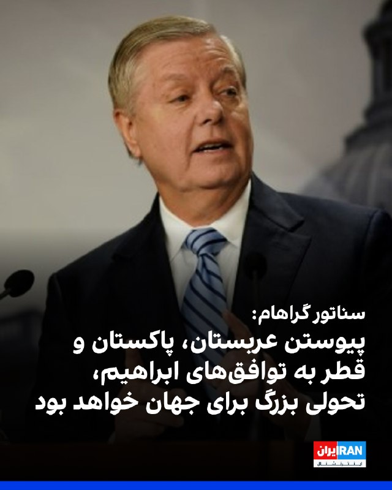

لیندزی گراهام، سناتور جمهوریخواه در پیامی در شبکه ایکس نوشت: «اگر در نتیجه مذاکرات برای پایان دادن به درگیری با ایران، متحدان عرب و مسلمان آمریکا در منطقه به توافق‌های ابراهیم بپیوندند، این توافق می‌تواند به یکی از مهم‌ترین تحولات تاریخ خاورمیانه تبدیل شود.»

او افزود پیوستن عربستان سعودی، قطر و پاکستان به توافق‌های ابراهیم تحولی بزرگ برای منطقه و جهان خواهد بود و این اقدام را حرکتی درخشان از سوی رییس جمهور ترامپ توصیف کرد.
https://iranintl.com/202605241273

## IranIntlTV — post 338792

  <a href="telegram/content/IranIntlTV_338792_1779653066.mp4" target="_blank">🎬 Download video</a>

هم‌زمان با مطرح شدن احتمال توافق میان تهران و واشینگتن، موج واکنش‌ها در اسرائیل افزایش یافته است. بنیامین نتانیاهو با اعلام نگرانی‌های خود به دونالد ترامپ، بر آزادی عمل اسرائیل در همه جبهه‌ها، به‌ویژه لبنان، تاکید کرده است.

گفت‌وگو با مئیر جاودانفر، تحلیل‌گر مسائل اسرائیل
@iranintltv

## IranIntlTV — post 338790

  <a href="telegram/content/IranIntlTV_338790_1779653068.mp4" target="_blank">🎬 Download video</a>

تیتر اول با نیوشا صارمی، یکشنبه ۳ خرداد
@iranintltv

## IranIntlTV — post 338789

  <a href="telegram/content/IranIntlTV_338789_1779653070.mp4" target="_blank">🎬 Download video</a>

هزاران نفر از ایرانیان ساکن ونکوور در محل آرت گالری این شهر تجمع کردند. شرکت‌کنندگان در این تجمع ضمن تاکید بر لزوم پایان دادن به خاموشی دیجیتال در ایران، از مقام‌های فیفا خواستند با همراهی با جمهوری اسلامی به عادی‌سازی جنایات این حکومت کمک نکنند.

گزارش مهسا مرتضوی، خبرنگار ایران‌اینترنشنال
@iranintltv

## IranIntlTV — post 338788

  

دونالد ترامپ جونیور، پسر ارشد رئیس‌جمهور آمریکا، در شبکه ایکس نوشت: این یک پیروزی بزرگ برای آمریکا است. ما باید کسانی را که هرگز راضی نمی‌شوند مگر با تهاجم زمینی به ایران، نادیده بگیریم. پدر من وعده داده بود که مانع دستیابی ایران به سلاح هسته‌ای شود و دقیقا در حال تحقق همین هدف است.
https://iranintl.com/202605247103

## IranIntlTV — post 338787

  <a href="telegram/content/IranIntlTV_338787_1779653073.mp4" target="_blank">🎬 Download video</a>

با انتشار جزئیات توافق احتمالی واشینگتن و تهران، تد کروز، سناتور جمهوری‌خواه، آن را فاجعه‌بار خواند و یک مقام ارشد اسرائیل چنین توافقی را بد دانست. یک چهره رسانه‌ای حامی ترامپ هم به او هشدار داد با این توافق به سرنوشتی بدتر از کارتر و اوباما دچار خواهد شد.

گزارشی از مجتبا پورمحسن
@iranintltv

## Shin_Persian — post 6212

Shin ✓ @hey_itsmyturn
Sun, 24 May 2026 19:26:45 UTC

If he strikes tonight, I'll follow him to the hell and back :))

فارسی

اگر او امشب حمله کند، من تا جهنم و برگشت دنبالش خواهم رفت :))

𝕏 · @shin_persian

## Shin_Persian — post 6211

  

Shin ✓ @hey_itsmyturn Sun, 24 May 2026 18:20:14 UTC President Trump @POTUS: "If I make a deal with Iran, it will be a good and proper one, not like the one made by Obama, which gave Iran massive amounts of CASH, and a clear and open path to a Nuclear Weapon.…

## Shin_Persian — post 6210

Shin ✓ @hey_itsmyturn
Sun, 24 May 2026 18:20:14 UTC

President Trump @POTUS:
"If I make a deal with Iran, it will be a good and proper one, not like the one made by Obama, which gave Iran massive amounts of CASH, and a clear and open path to a Nuclear Weapon. Our deal is the exact opposite, but nobody has seen it, or knows what it is. It isn’t even fully negotiated yet. So don’t listen to the losers, who are critical about something they know nothing about. Unlike those before me who should have solved this problem many years ago, I don’t make bad deals! President DJT"

فارسی

رئیس‌جمهور ترامپ @POTUS:

«اگر من با ایران بر سر توافقی مذاکره کنم، آن توافق خوب و مناسب خواهد بود، نه مانند توافقی که اوباما منعقد کرد، که مقادیر عظیمی پول نقد به ایران داد و مسیری شفاف و باز برای دستیابی به سلاح هسته‌ای فراهم کرد. توافق ما دقیقاً برعکس است، اما هیچ‌کس آن را ندیده و نمی‌داند چیست. هنوز حتی به طور کامل مذاکره نشده است. بنابراین به بازنده‌هایی که از چیزی که هیچ اطلاعی از آن ندارند انتقاد می‌کنند، گوش ندهید. برخلاف کسانی که پیش از من بودند و باید این مشکل را سال‌ها پیش حل می‌کردند، من توافق بد امضا نمی‌کنم! رئیس‌جمهور دی‌جی‌تی (دونالد جی. ترامپ)»

𝕏 · @shin_persian

## Shin_Persian — post 6209

Faytuks Network ✓ @FaytuksNetwork
Sun, 24 May 2026 17:14:53 UTC

IRGC-linked Tasnim News warns the Iran-US agreement may be cancelled due to US obstruction of some clauses.

فارسی

خبرگزاری تسنیم وابسته به سپاه پاسداران انقلاب اسلامی (IRGC) هشدار داد که توافق ایران و ایالات متحده ممکن است به دلیل کارشکنی آمریکا در برخی بندها لغو شود.

𝕏 · @shin_persian

## ManotoTV — post 105816

  <a href="telegram/content/ManotoTV_105816_1779653077.mp4" target="_blank">🎬 Download video</a>

گفت‌وگو با کیوان عباسی بنیان‌گذار تلویزیون منوتو;
«می‌گفت بعضی تصاویر آن‌قدر هولناک بود که باور نمی‌کردیم در ایران ضبط شده باشد…
و تأکید کرد جنایت‌های دی‌ماه نباید فراموش شوند.»

## ManotoTV — post 105815

  <a href="telegram/content/ManotoTV_105815_1779653079.mp4" target="_blank">🎬 Download video</a>

گفت‌وگو با کیوان عباسی بنیان‌گذار تلویزیون منوتو
«می‌گفت هیچ حسرتی ندارد…
و هرچه توانسته برای ساختن و ادامه دادن انجام داده است.»

## ManotoTV — post 105814

  <a href="telegram/content/ManotoTV_105814_1779653082.mp4" target="_blank">🎬 Download video</a>

یک مقام ارشد در دولت ترامپ به شبکه ان بی سی گفته:
«توافق با ایران امروز امضا نخواهد شد، اما در مسیر دستیابی به توافق پیشرفت‌هایی حاصل شده است.»
این اظهارات پس از آن مطرح شد که ترامپ پیش‌تر گفته بود به نمایندگان خود دستور داده است که «برای رسیدن به توافق عجله نکنند».
پیش از آن نیز مارکو روبیو گفته بود که ممکن است «خبرهای خوبی» در راه باشد، هرچند تأکید کرد که هنوز «پیشرفت نهایی» در گفت‌وگوها با جمهوری‌اسلامی حاصل نشده است.

## ManotoTV — post 105813

  <a href="telegram/content/ManotoTV_105813_1779653083.mp4" target="_blank">🎬 Download video</a>

دونالد ترامپ، رئیس‌جمهور آمریکا در پلتفرم تروث سوشال خود نوشت:
«اگر با ایران به توافق برسم، توافقی خوب و درست خواهد بود؛ نه مثل توافقی که باراک اوباما انجام داد و به ایران مقادیر عظیمی پول نقد و مسیری آشکار و باز برای دستیابی به سلاح هسته‌ای داد.»
او افزود: «توافق ما دقیقاً برعکس آن است، اما هنوز کسی آن را ندیده یا از جزئیاتش خبر ندارد. حتی هنوز به‌طور کامل نهایی و مذاکره نشده است. بنابراین به حرف بازنده‌هایی که از چیزی انتقاد می‌کنند که هیچ اطلاعی درباره‌اش ندارند گوش ندهید. برخلاف کسانی که پیش از من بودند و باید سال‌ها پیش این مشکل را حل می‌کردند، من توافق بد انجام نمی‌دهم»

## ManotoTV — post 105812

  <a href="telegram/content/ManotoTV_105812_1779653083.mp4" target="_blank">🎬 Download video</a>

تماسی با خانواده جاویدنام مهدی اسکندریان:
«روی صحبتم با طرفداران جمهوری اسلامیه…
با کشتن جاویدنام‌ها فقط آدم‌های بیشتری را علیه خودتان ساختید؛
و خانواده‌های دادخواه این درد را فراموش نخواهند کرد.»

## ManotoTV — post 105811

  <a href="telegram/content/ManotoTV_105811_1779653086.mp4" target="_blank">🎬 Download video</a>

کاخ سفید می‌گوید مذاکرات با جمهوری اسلامی به مرحله حساسی رسیده اما هنوز توافق نهایی نشده و ممکن است چند روز دیگر طول بکشد. بر اساس پیش‌نویس توافق، جمهوری اسلامی درباره محدودیت غنی‌سازی و کنار گذاشتن ذخایر اورانیوم مذاکره می‌کند و در مقابل احتمال کاهش تحریم‌ها وجود دارد. ترامپ تأکید کرده آمریکا برای توافق عجله ندارد و محاصره دریایی فعلاً ادامه خواهد داشت. همزمان اسرائیل نسبت به توافق احتمالی ابراز نگرانی کرده و خواستار حذف کامل برنامه غنی‌سازی جمهوری اسلامی شده است.

## ManotoTV — post 105810

  <a href="telegram/content/ManotoTV_105810_1779653087.mp4" target="_blank">🎬 Download video</a>

تماسی با خانواده جاویدنام مهدی اسکندریان:
«می‌گفت مهدی عاشق ایران بود…
و دختر کوچکش هنوز منتظر برگشتن پدرش به خانه است.»

## ManotoTV — post 105809

  <a href="telegram/content/ManotoTV_105809_1779653089.mp4" target="_blank">🎬 Download video</a>

وزیران خارجه ۱۹ کشور عربی و اسلامی در بیانیه‌ای مشترک، اقدام منطقه موسوم به «سومالی‌لند» در افتتاح «سفارت» در اورشلیم را به‌شدت محکوم کردند.

در این بیانیه که روز یکشنبه سوم خرداد منتشر شد، این اقدام «غیرقانونی و مردود» خوانده شده و آمده است که افتتاح این دفتر، نقض آشکار قوانین بین‌المللی و قطعنامه‌های مربوط به مشروعیت بین‌المللی است.

وزیران خارجه کویت، مصر، عربستان سعودی، قطر، اردن، ترکیه، پاکستان، اندونزی، جیبوتی، سومالی، فلسطین، عمان، سودان، یمن، لبنان، موریتانی، الجزایر، بنگلادش و مراکش تاکید کردند که اورشلیم شرقی «سرزمین فلسطینی اشغال‌شده از سال ۱۹۶۷» است و هر اقدامی برای تغییر وضعیت حقوقی و تاریخی آن «باطل و بی‌اثر» است.

این کشورها همچنین حمایت کامل خود را از وحدت، حاکمیت و تمامیت ارضی جمهوری فدرال سومالی اعلام کردند و هرگونه اقدام یک‌جانبه علیه وحدت سرزمینی سومالی را مردود دانستند.

## FarsiVOA — post 218566

  <a href="telegram/content/FarsiVOA_218566_1779653090.mp4" target="_blank">🎬 Download video</a>

⚡️شهرام همایون در عمق میدان می‌گوید من نمی‌فهمم چطورالآن خانم یاسمین پهلوی پُستی می‌گذارد که «ترامپ بزن، بزن» یا بگوید «مرگ بر سه فاسد»! چون در خانواده پهلوی این چیز‌ها نبود
@FarsiVOA

## FarsiVOA — post 218565

🔺محققان آمریکایی: هکرهای مرتبط با رژیم ایران، ایالات متحده، اسرائیل و امارات را هدف قرار داده‌اند

◾️شرکت امنیت سایبری «پالو آلتو نتورکس» در گزارش جدیدی اعلام کرد یک گروه جاسوسی سایبری مرتبط با رژیم ایران در جریان یک کمپین چند ماهه همزمان با تشدید تنش‌های منطقه‌ای اخیر، نهادهایی را در ایالات متحده، اسرائیل و امارات متحده عربی بود، هدف قرار داده است.

⬇️ بیشتر بخوانید:

https://ir.voanews.com/a/8153350.html

## FarsiVOA — post 218564

🔺حکم جدید قاضی صلواتی برای پرونده «شهرک اکباتان»: تخفیف لازم نیست، اعدامشان کنید

◾️ابوالقاسم صلواتی، قاضی بدنام قوه قضائیه جمهوری اسلامی، معروف به «قاضی مرگ»، حکم صادره توسط دادگاه کیفری، مبنی بر «نقض اعدام» متهمان پرونده «شهرک اکباتان» را رد، و برای چهار متهم این پرونده دوباره حکم اعدام صادر کرد.

⬇️ بیشتر بخوانید:

https://ir.voanews.com/a/8153336.html

## FarsiVOA — post 218563

🔺دونالد ترامپ: توافق بد نمی‌کنم

◾️دونالد ترامپ رئیس جمهوری آمریکا، اعلام کرد که اگر با [رژیم] ایران توافقی انجام دهد، توافقی خوب و مناسب خواهد بود، «نه مانند توافقی که اوباما انجام داد و به [رژیم] ایران مقادیر زیادی پول نقد و مسیری روشن و باز به سوی سلاح هسته‌ای داد.»

⬇️ بیشتر بخوانید:

https://ir.voanews.com/a/8153347.html

## FarsiVOA — post 218562

تشدید تنش‌ها در عراق؛ حملات تازه به اقلیم همزمان با بحران خلع سلاح گروه‌های مسلح

## FarsiVOA — post 218561

فقط ۱۸ روز تا آغاز جام جهانی باقی مانده اما تیم ملی جمهوری اسلامی همچنان درگیر بحران ویزا، تحریم، جابه‌جایی کمپ و مشکلات مالی است. از انتقال کمپ از آریزونا به مرز مکزیک گرفته تا گزارش‌هایی درباره صادر نشدن ویزای بعضی بازیکنان و آماده‌باش بازیکنان خط‌خورده برای جایگزینی احتمالی.

## FarsiVOA — post 218560

گزارش نرگس صبا از ذخیره اورانیوم با غنای بالای ایران در برنامه تفسیر خبر

## FarsiVOA — post 218559

در گفت‌وگو با علی دادپی، اقتصاددان ساکن تگزاس، به تنگنای اقتصادی جمهوری اسلامی در شرایط محاصره دریایی برای امضای توافق پایان جنگ پرداختیم و بررسی کردیم چرا زمان به سود آمریکا در حرکت است و جمهوری اسلامی، همانند تجربه برجام، توان استفاده مؤثر از این فرصت را ندارد.

## FarsiVOA — post 218558

خبرگزاری میزان، وابسته به قوه قضائیه جمهوری اسلامی، اعلام کرد مجتبی کیان، شهروند بازداشتی به اتهام ارسال اطلاعات مراکز تولید صنایع دفاعی به آمریکا و اسرائیل اعدام شده است

## FarsiVOA — post 218557

گزارش مایکل لیپین، خبرنگار صدای آمریکا، از کاخ سفید

## FarsiVOA — post 218556

دیدگاه های قانون گذران آمریکا و تفاهم نامه دولت ترامپ با جمهوری اسلامی

## FarsiVOA — post 218555

بررسی امنیت ملی، انگیزه ترور، و تحولات جاری خاورمیانه

## FarsiVOA — post 218554

🔺گزارش زنده مایکل لیپین، خبرنگار صدای آمریکا از نزدیک کاخ سفید

## FarsiVOA — post 218551

اسپیس‌ایکس تصاویری از دوربین‌های نصب‌شده روی استارشیپ و فضاپیمای وی۳ منتشر کرد.

اسپیس‌ایکس می‌گوید این دوربین‌های ارتقا یافته قادرند در تمام مراحل پرواز، ویدیوی 4K را از طریق استارلینک پخش کنند.

@FarsiVOA

## FarsiVOA — post 218550

بررسی شیوع بیماری ابولا در گفتگو با دکتر کیوان زندی متخصص ویروس شناسی

## FarsiVOA — post 218549

رونمایی از موشک قاره پیمای هایپرسونیک ترکیه در گفت‌وگو با ناصر باباخانی تحلیل‌گر سیاسی و مدرس در کالج نووا

## FarsiVOA — post 218548

تنگه هرمز ابزار چانه زنی جمهوری اسلامی در گفت‌وگو با صالح کامرانی کارشناس حقوق بین‌الملل

## FarsiVOA — post 218547

سرنوشت اروانیوم غنی شده در صورت امضای تفاهم نامه صلح بین امریکا و جمهوری اسلامی در گفتگو با احمد وخشیته پژوهشگر دانشگاه دوستی بین ملتها

## DW_Farsi — post 125108

  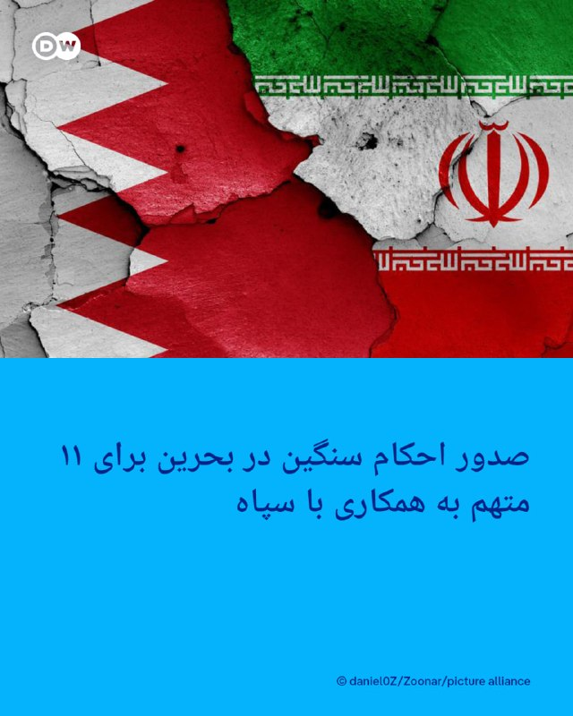

🔶 صدور احکام سنگین در بحرین برای ۱۱ متهم به همکاری با سپاه

خبرگزاری دولتی بحرین گزارش داد که دادگاهی در این کشور ۹ نفر را به اتهام همکاری به سپاه پاسداران به حبس ابد و دو نفر دیگر در همین پرونده را به سه سال زندان محکوم کرده است.

این خبرگزاری یکشنبه ۲۴ مه اعلام کرد، اتهام این افراد همکاری با سپاه و انجام اقداماتی است که دادگاه آن را رشته "عملیات خصمانه و تروریستی" علیه بحرین خوانده است.

بر اساس بیانیه‌ای که در این زمینه در بحرین منتشر شده، این متهمان در زمینه "جمع‌آوری اطلاعات از مراکز حساس و حیاتی و به علاوه، تسهیل انتقال مبالغ مالی مرتبط با این اقدامات" فعال بوده‌اند.
@dw_farsi

## DW_Farsi — post 125107

  

🔶 نتانیاهو: با ترامپ توافق کردیم اورانیوم غنی‌شده باید از ایران خارج شود

نخست‌وزیر اسرائيل در پستی تازه در شبکه اجتماعی ایکس با اشاره به این که شامگاه شنبه ۲۳ مه تلفنی با دونالد ترامپ، رئيس‌ جمهور آمریکا گفت‌وگو کرد نوشت، با او به توافق رسیده که هر گونه توافق نهایی با ایران باید خطر هسته‌ای این کشور را "ریشه‌کن" کند.

بنیامین نتانیاهو در این پیام که یکشنبه ۲۴ مه نوشته شده در این مورد توضیح داد: «این به معنای برچیدن سایت‌های غنی‌سازی هسته‌ای ایران و خارج کردن مواد هسته‌ای غنی‌شده از خاک این کشور است.»

نتانیاهو با ابراز قدردانی از همکاری آمریکا در حملات نظامی اخیر به جمهوری اسلامی نوشت: «سیاست من، همانند پرزیدنت ترامپ، بدون تغییر باقی می‌ماند: ایران به سلاح هسته‌ای دست نخواهد یافت.»

او همچنین بار دیگر بر حق اسرائیل برای دفاع از خود در برابر همه تهدیدها، از جمله تهدید لبنان، تأکید کرد.
@dw_farsi

## DW_Farsi — post 125106

  

🔶 ترامپ: محاصره دریایی ایران تا رسیدن به توافق نهایی پابرجاست

رئیس‌جمهور آمریکا در پیامی تازه مذاکرات جاری توافق‌محور میان ایران و کشورش را "سازنده" خواند و نوشت، اما محاصره دریایی بنادر ایران توسط نیروی دریایی آمریکا تا رسیدن به توافق نهایی به قوت خود باقی خواهد ماند.

دونالد ترامپ در تروث سوشال یادآور شد: «من به نمایندگانم ابلاغ کرده‌ام که برای رسیدن به توافق عجله نکنند، چرا که زمان به نفع ماست... هر دو طرف باید زمان بگذارند و کار را درست انجام دهند. هیچ اشتباهی نباید رخ دهد.»

او با تکرار این که هر توافقی با ایران بهتر از توافق موسوم به برجام در سال ۲۰۱۵ در دوران ریاست جمهوری باراک اوباما در آمریکاست مدعی شد: «رابطه ما با ایران در حال تبدیل شدن به رابطه‌ای بسیار حرفه‌ای‌تر و سازنده‌تر است. با این حال، آن‌ها باید درک کنند که نمی‌توانند سلاح یا بمب هسته‌ای تولید یا تهیه کنند.»

رئیس‌ جمهور آمریکا در ادامه از کشورهای خاورمیانه بابت "حمایت و همکاری" با ایالات متحده تشکر کرد و افزود که این همکاری‌ها با پیوستن آن‌ها به "پیمان‌های تاریخی ابراهیم" که همانا عادی‌سازی روابط با اسرائيل است تقویت خواهد شد.
@dw_farsi

## DW_Farsi — post 125105

  <a href="telegram/content/DW_Farsi_125105_1779653094.mp4" target="_blank">🎬 Download video</a>

🎥 ادعای مدیرعامل سروش‌پلاس؛ "هیچ نظارت پیشینی روی پیام‌ها و تماس‌های کاربران وجود ندارد"

امین شریفی، مدیرعامل سروش‌پلاس، مدعی شده پیام‌رسان‌های داخلی "نظارت پیشینی" بر پیام‌ها و تماس‌های کاربران ندارند؛ یعنی به گفته او، پیام‌ها پیش از ارسال یا دریافت، کنترل و سانسور نمی‌شوند.

با این حال کارشناسان امنیت دیجیتال می‌گویند این موضوع، احتمال نظارت نهادهای امنیتی پس از ارسال پیام‌ها را رد نمی‌کند.

شریفی در یک مصاحبه گفته دسترسی به اطلاعات کاربران فقط با حکم قضایی و در پرونده‌های مشخص انجام می‌شود.
اما کارشناسان امنیت سایبری هشدار می‌دهند پیام‌رسان‌های داخلی مانند "بله"، "روبیکا" و "سروش" از استانداردهای لازم برای حفاظت از حریم خصوصی برخوردار نیستند و امکان نظارت و سانسور در آن‌ها وجود دارد.
 
این نگرانی‌ها پس از آن شدت گرفت که جمهوری اسلامی در دوره محدودیت گسترده اینترنت، شهروندان را به استفاده از پیام‌رسان‌های داخلی تشویق کرد.
 
محققان امنیت دیجیتال نیز "بله" را ابزاری برای نظارت دولتی معرفی کرده‌اند که از پیام‌های کاربران در برابر شنود محافظت نمی‌کند.
@dw_farsi

## DW_Farsi — post 125104

  

🔶 رسانه‌های ایران: پهپاد اسرائیل را بر فراز هرمزگان منهدم کردیم

رسانه‌های ایران از رهگیری و انهدام یک فروند پهپاد اسرائيلی در آسمان هرمزگان خبر داده‌اند.

ویدئویی نیز روز یکشنبه سوم خرداد در رسانه‌ها از سوی خبرگزاری صداوسیما منتشر شده که در آن خبرنگار ظاهرا قطعات این پهپاد سرنگون‌شده را نشان می‌دهد.

خبرگزاری مهر با انتشار این خبر مدعی شد که نیروهای پدافند هوایی منطقه جنوب شرق، یک فروند پهپاد اربیتر اسرائيلی را "بر فراز آسمان هرمزگان متلاشی کردند".

در این خبر ادعا شده که این پهپاد "کاربری جاسوسی و شناسایی داشت و با شلیک پدافند ارتش سرنگون شد".

در توضیح خبر هم آمده است: «پهپاد اربیتر رادارگریز است و با سامانه ویژه‌ای هدف قرار گرفت که مشخصات آن را مسئولان منطقه عملیاتی پدافند جنوب شرق کشور، مستقر در بندرعباس اعلام نمی‌کنند.»

به ادعای این خبرگزاری مسئولان پدافند گفته‌اند که "با این سامانه، هیچ پهپاد رادارگریزی نمی‌تواند به آسمان منطقه ماموریت، از خلیج فارس و جزایر تا سراسر منطقه جنوب و جنوب شرق کشور نفوذ کند".
@dw_farsi

## DW_Farsi — post 125103

  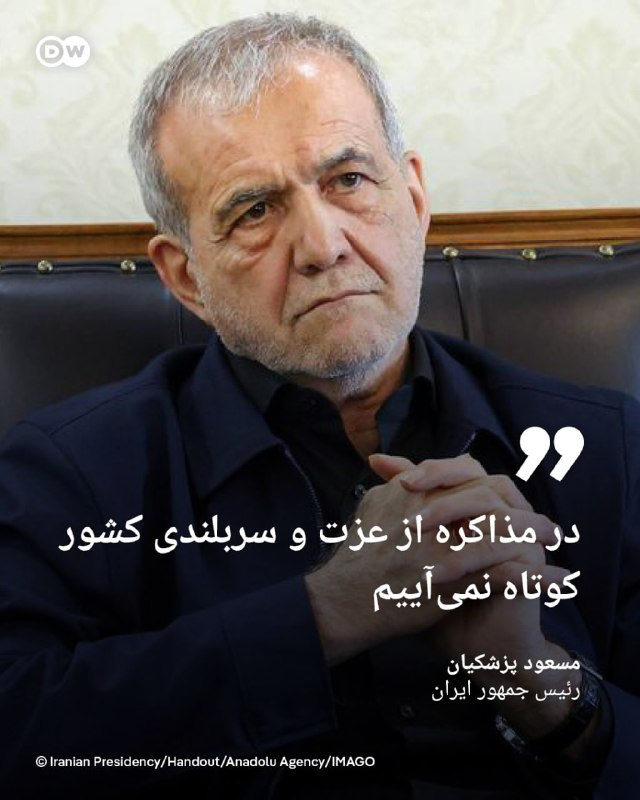

🔶 پزشکیان: در مذاکره از عزت و سربلندی کشور کوتاه نمی‌‌آییم

رئیس‌ جمهور ایران در گفت‌وگو با خبرنگار صداوسیما با اشاره به مذاکرات جاری با آمریکا برای پایان بخشیدن به جنگ گفت، مذاکره‌کنندگان ایران آماده‌اند به دنیا این اطمینان را بدهند که جمهوری اسلامی "به دنبال سلاح هسته‌ای نیست".

مسعود پزشکیان در این سخنان در روز یکشنبه سوم خرداد گفت: «قطعا ما و تیم مذاکره‌کننده به هیچ‌وجه از عزت و سربلندی کشور کوتاه نخواهیم آمد.»

او مدعی شد که جمهوری اسلامی به "دنبال ناآرامی در منطقه نیست" و این اسرائيل است که "ناآرام‌کننده منطقه است و به دنبال نقشه بزرگ اسرائيل است.»

دونالد ترامپ، رئیس‌ جمهور آمریکا نیز در همین روز ادعای پزشکیان در مورد این که جمهوری اسلامی پیگیر "رسیدن به سلاح هسته‌ای" و "بی‌ثبات کردن منطقه" نیست را در شبکه تروث سوشال خود بازنشر کرد.
@dw_farsi

## DW_Farsi — post 125102

  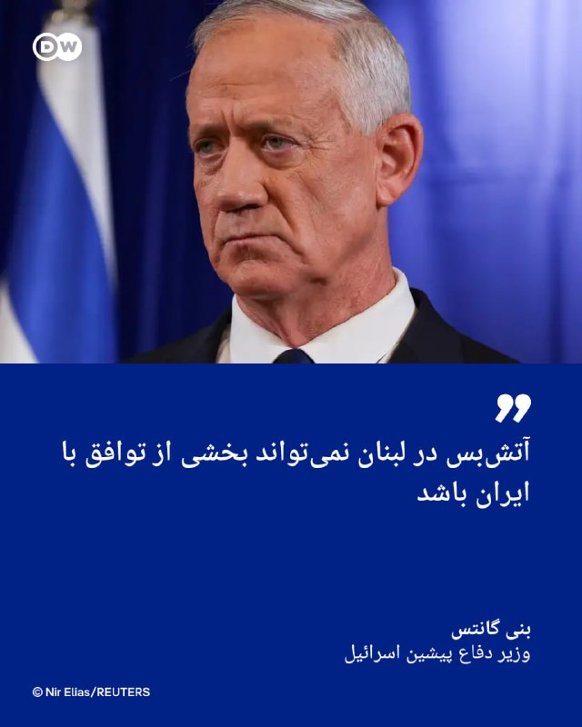

🔶 بنی گانتس: آتش‌بس در لبنان نمی‌تواند بخشی از توافق با ایران باشد

بنی گانتس، وزیر دفاع پیشین اسرائيل با توجه به افزایش احتمال رسیدن به یک توافق میان ایران و آمریکا اعلام کرد که آتش‌بس در لبنان "به‌ هیچ‌ وجه" نباید بخشی از این توافق باشد.

او در پیامی در شبکه ایکس نوشت: «غیر ممکن است که درست در زمانی که افکار عمومی لبنان تازه شروع کرده بفهمد حزب‌الله [لبنان] به آن‌ها آسیب می‌زند، اسرائیل اجازه دهد این گروه به محافظ لبنان تبدیل شود.»

گانتس با اشاره به این که روستاهای جنوب لبنان تنها چند صد متر با شهرک‌های متولا، شلومی و مارگالیوت کشورش فاصله دارند متذکر شد: «اسرائیل بدون توجه به هر عامل خارجی، وظیفه دارد از ساکنان خود محافظت کند.»

او پذیرش آتش‌بس در لبنان به‌عنوان بخشی از توافق احتمالی با ایران را "یک اشتباه استراتژیک" خواند که بابت آن اسرائيل باید سال‌ها هزینه پرداخت کند: «این دقیقا همان موردی است که اسرائیل باید به آمریکا بگوید: نه.»
@dw_farsi

## DW_Farsi — post 125101

  

🔶 تسنیم: تمدید ۶۰روزه آتش‌بس در متن توافق ایران و آمریکا وجود ندارد

خبرگزاری تسنیم در خبری در روز یکشنبه سوم خرداد با اشاره به خبری که پیش از این در پایگاه خبری آکسیوس منتشر شده بود اعلام کرد، در متن توافق میان ایران و آمریکا از تمدید ۶۰روزه آتش‌بس سخنی به میان نیامده است.

تسنیم وابسته به سپاه پاسداران نوشت: «بر اساس شنیده‌ها از متن تفاهم احتمالی، برخلاف گزارش یک رسانه آمریکایی که می‌گوید، طبق تفاهم‌نامه آتش‌بس میان ایران و آمریکا به مدت ۶۰ روز تمدید می‌شود، این عبارت در متن وجود ندارد.»

این خبرگزاری همچنین نوشت که در این متن "تعبیری که به کار گرفته شده است، اعلام پایان جنگ در همه جبهه‌ها، از جمله لبنان است".

تسنیم با تأکید بر این که متن توافق هنوز نهایی نشده ادامه داد، بر پایه این متن، در "بازه ۳۰ روزه موضوع تنگه هرمز و محاصره دریایی پیش برده می‌شود و زمان ۶۰ روزه‌ای برای مذاکرات در مسئله هسته‌ای در نظر گرفته شده است".
@dw_farsi

## DW_Farsi — post 125100

  <a href="telegram/content/DW_Farsi_125100_1779653099.mp4" target="_blank">🎬 Download video</a>

🎥 گامی تاریخی در پاکستان؛ استخدام نخستین زندانبانان تراجنسیتی
 
سوبیا خان با آغاز به کار به عنوان نخستین زندانبان تراجنسیتی در ایالت "خیبر پختونخوا" پاکستان، تاریخ‌ساز شد.
این یک نقطه عطف مهم است، به‌ویژه از این جهت که افراد تراجنسیتی در این ایالت محافظه‌کار با وجود حمایت‌های قانونی اغلب با تبعیض مواجه هستند یا طرد می‌شوند.
@dw_farsi

## Persian_Trend_Official — post 14891

  

🔴 ترامپ

🔻نوشته ی روی بمب

💢از توجه شما به این موضوع سپاسگزارم

🫆:Tony

📌 @persian_trend_official
پرشین ترند | متفاوت‌ترین کانال نظامی

## Persian_Trend_Official — post 14890

i24NEWS⭕️

آمریکا آزادسازی پول‌های ایران را به انتقال اورانیوم غنی‌شده گره زده است

▪️ مقام‌های آمریکایی می‌گویند ایران تا زمانی که انتقال ذخایر اورانیوم غنی‌شده را آغاز نکند، هیچ کاهش تحریمی یا دسترسی به دارایی‌های بلوکه‌شده دریافت نخواهد کرد
▪️ در مقابل، ایران اصرار دارد آزادسازی بخشی از منابع مالی باید جزو توافق اولیه باشد
▪️ این اختلاف اکنون یکی از اصلی‌ترین موانع توافق میان تهران و واشینگتن محسوب می‌شود

🫆:Tony

📌 @persian_trend_official
پرشین ترند | متفاوت‌ترین کانال نظامی

## Persian_Trend_Official — post 14889

https://youtube.com/live/vCQOD_eWyqM?feature=share

## Persian_Trend_Official — post 14888

https://youtube.com/live/vCQOD_eWyqM?feature=share

## Persian_Trend_Official — post 14887

  <a href="telegram/content/Persian_Trend_Official_14887_1779653102.mp4" target="_blank">🎬 Download video</a>

🔴صیغه کوتاه مدت روزانه و ماهانه در تجمعات خیابانی همچنان برقرار است...

🫆:Tony

📌 @persian_trend_official
پرشین ترند | متفاوت‌ترین کانال نظامی

## Persian_Trend_Official — post 14886

  

سردار نقدی: دشمن اگر خطایی کند، ضربهٔ جبران‌ناپذیری می‌خورد

♦️مشاور عالی فرماندهٔ کل سپاه: ما توانستیم یک بازدارندگی در مقابل دشمن بدست بیاوریم آن هم از این جهت که دشمن متوجه شد که نمی‌تواند مقابل ما به نتیجه مطلوب خود برسد.

♦️یک بعد دیگر بازدارندگی هم این بود که دشمن بداند که اگر بخواهد خطایی کند ضربهٔ جبران‌ناپذیری را خواهد خورد.

♦️امروز این بازدارندگی برای دشمن مشخص شده بگونه‌ای که ۲۸۲ نقطه نظامی آن‌ها منهدم و نیز صدها کشته به دست دشمن باقی مانده است به نحوی که بسیاری از آن‌ها را مخفی کرده‌اند.

♦️روزانه یک هواپیمای ۴۰ تخته بیمارستانی از امارات و یک ۱۰ تخته از کویت مجروحان دشمن را برای درمان به بیمارستان‌های آمریکایی در آلمان منتقل می‌کردند.

⚠️پ ن :تعداد کشته شدگان نظامی امریکا ۱۳ نفر است.
🫆:Tony

📌 @persian_trend_official
پرشین ترند | متفاوت‌ترین کانال نظامی

## Persian_Trend_Official — post 14884

ساعت 23 به وقت تهران لایو شروع میشه

## Persian_Trend_Official — post 14883

  

این رو مبنای شکست و پیروزی جمهوری اسلامی در نظر میگیریم

و هر توافقی رو با این متن مقایسه میکنیم
از توجه شما به این موضوع متشکرم
الیاس فرخ

## Persian_Trend_Official — post 14882

🔴 روبیو: توافق هسته‌ای با ایران را نمی‌توان «در ۷۲ ساعت روی یک تکه کاغذ» نهایی کرد

♦️مارکو روبیو، وزیر خارجه آمریکا، اعلام کرد توافق احتمالی با ایران از حمایت کشورهای منطقه برخوردار شده است، اما هشدار داد:

▪️ «توافق هسته‌ای را نمی‌شود ظرف ۷۲ ساعت و روی پشت یک دستمال کاغذی نهایی کرد»
▪️ او گفت مذاکرات پیچیده است و هنوز کار زیادی باقی مانده
▪️ روبیو همچنین از «پیشرفت قابل‌توجه اما نه نهایی» در گفت‌وگوها خبر داد
🫆:Tony

📌 @persian_trend_official
پرشین ترند | متفاوت‌ترین کانال نظامی

## Persian_Trend_Official — post 14881

  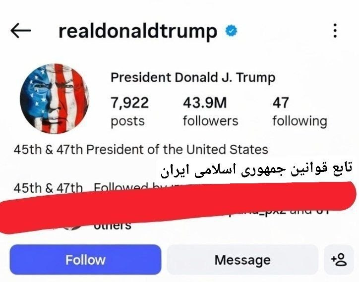

#طنز

بیو ترامپ چند روز دیگه:

📝 Nick

📌 @persian_trend_official
پرشین ترند | متفاوت‌ترین کانال نظامی

## Persian_Trend_Official — post 14879

  

🔴 ترامپ:

اگر با ایران توافقی انجام دهم، توافقی خوب و درست خواهد بود؛ نه مثل توافق اوباما که به ایران حجم عظیمی پول نقد داد و مسیر آشکار دستیابی به سلاح هسته‌ای را برایش باز کرد.
توافق ما دقیقاً برعکس آن است، اما هنوز کسی آن را ندیده و از جزئیاتش خبر ندارد. این توافق حتی هنوز کاملاً نهایی هم نشده است.
پس به حرف بازنده‌هایی که درباره چیزی که هیچ اطلاعی از آن ندارند انتقاد می‌کنند گوش ندهید.
برخلاف کسانی که قبل از من بودند و باید سال‌ها پیش این مسئله را حل می‌کردند، من توافق بد انجام نمی‌دهم.

🫆:Tony

📌 @persian_trend_official
پرشین ترند | متفاوت‌ترین کانال نظامی

## Persian_Trend_Official — post 14878

🔴العربی الجديد:

♦️انفجار انتحاری در قطاری در ایالت بلوچستان پاکستان؛ بیش از ۲۰ کشته و بیش از ۵۰ زخمی / انتخاب

🫆:Tony

📌 @persian_trend_official
پرشین ترند | متفاوت‌ترین کانال نظامی

## Persian_Trend_Official — post 14877

  <a href="telegram/content/Persian_Trend_Official_14877_1779653107.webm" target="_blank">🎬 Download video</a>

🔴 کانال ۱۳ اسرائیل: نفوذ نتانیاهو بر ترامپ به‌شدت کاهش یافته است

▪️ نتانیاهو در جلسات اخیر گفته توان اسرائیل برای تأثیرگذاری بر ترامپ اکنون بسیار محدود شده است
▪️ مقام‌های اسرائیلی معتقدند ترامپ به‌سمت توافق موقت با ایران حرکت می‌کند
▪️ اسرائیل فعلاً تلاش می‌کند فقط بر محتوای توافق اثر بگذارد؛ به‌ویژه درباره لبنان، شمال اسرائیل و خروج اورانیوم غنی‌شده از ایران

همزمان:

▪️ نتانیاهو امشب جلسه جدید کابینه امنیتی محدود برگزار کرده است
▪️ اسرائیلی‌ها می‌گویند جرد کوشنر و استیو ویتکاف نقش مهمی در منصرف‌کردن ترامپ از گزینه جنگ داشته‌اند
▪️ با وجود تماس‌های ادامه‌دار میان ترامپ و نتانیاهو، در تل‌آویو این باور در حال تقویت است که تغییر نظر ترامپ بعید شده است

🫆:Tony

📌 @persian_trend_official
پرشین ترند | متفاوت‌ترین کانال نظامی

## Persian_Trend_Official — post 14876

  

🔴 اختلال GPS همچنان ایران و کشورهای عربی خلیج فارس را درگیر کرده است

▪️ طی هفته گذشته سیگنال‌های GPS و ناوبری ماهواره‌ای در بخش‌هایی از ایران، عراق، کویت، امارات و مسیرهای کشتیرانی خلیج فارس با اختلال شدید مواجه شده‌اند
▪️ گزارش‌ها از افزایش جنگ الکترونیک و اختلال در ناوبری کشتی‌ها و پهپادها خبر می‌دهند
▪️ برخی کشتی‌ها در تنگه هرمز موقعیت‌های جعلی ثبت کرده‌اند و خطر برخورد دریایی افزایش یافته است

🫆:Tony

📌 @persian_trend_official
پرشین ترند | متفاوت‌ترین کانال نظامی

## Persian_Trend_Official — post 14875

  

🔴 نعیم قاسم خواستار حضور مردم در خیابان‌ها شد

«نعیم قاسم» دبیرکل حزب الله در اظهاراتی جنجالی از مردم خواست به خیابان‌ها بیایند و دولت لبنان را سرنگون کنند.

♦️این موضع‌گیری در شرایطی مطرح می‌شود که:

▪️ فشارها بر حزب‌الله در جریان مذاکرات منطقه‌ای و توافق احتمالی ایران و آمریکا افزایش یافته است
▪️ اختلافات داخلی لبنان بر سر نقش حزب‌الله و آینده درگیری با اسرائیل شدت گرفته
▪️ برخی گزارش‌ها حاکی از نگرانی حزب‌الله نسبت به محدودشدن آزادی عملش در توافق‌های در حال مذاکره است
🫆:Tony

📌 @persian_trend_official
پرشین ترند | متفاوت‌ترین کانال نظامی

## Persian_Trend_Official — post 14874

🔴 i24NEWS: نگرانی شدید اسرائیل از توافق در حال شکل‌گیری میان آمریکا و ایران

💢شبکه i24NEWS گزارش داد مقام‌های ارشد امنیتی اسرائیل به‌طور فزاینده‌ای نگران توافق احتمالی میان آمریکا و ایران هستند و آن را «بسیار بد» برای اسرائیل توصیف می‌کنند.

🔻بر اساس این گزارش:

▪️ مقام‌های اسرائیلی معتقدند توافق فعلی نه برنامه هسته‌ای ایران را به‌طور کامل مهار می‌کند و نه تهدید موشکی تهران را حل می‌کند
▪️ آن‌ها تأکید کرده‌اند جنگ فقط به‌دلیل مسئله هسته‌ای آغاز نشده بود، بلکه برنامه موشکی ایران نیز یکی از اهداف اصلی محسوب می‌شد
▪️ از نگاه تل‌آویو، تفاهم‌های فعلی هیچ راه‌حل واقعی برای این موضوع ارائه نمی‌دهد

🔻در خصوص لبنان نیز:

▪️ وضعیت «غیرقابل‌قبول» توصیف شده است
▪️ مقام‌های اسرائیلی هشدار داده‌اند اسرائیل نمی‌تواند در شرایطی ادامه دهد که آزادی عمل ارتش اسرائیل در لبنان محدود شود
▪️ نگرانی اصلی تل‌آویو، محدودشدن حملات پیش‌دستانه علیه حزب‌الله است
🫆:Tony

📌 @persian_trend_official
پرشین ترند | متفاوت‌ترین کانال نظامی

## Persian_Trend_Official — post 14873

🔴 کانال ۱۲ اسرائیل: دو مانع اصلی در توافق ایران و آمریکا باقی مانده است

♦️کانال ۱۲ اسرائیل مدعی شد هنوز دو نقطه اختلاف اصلی میان تهران و واشینگتن در مذاکرات باقی مانده است:

▪️ اسرائیل خواهان دریافت تضمین برای «آزادی عمل نظامی» علیه تهدیدات در لبنان است، اما ایران با این مسئله مخالفت می‌کند
▪️ تهران خواستار آزادسازی فوری دارایی‌های بلوکه‌شده خود است، اما آمریکا اصرار دارد این موضوع به توافق نهایی و اجرای کامل تعهدات گره بخورد

◼️این گزارش با روایت‌های قبلی درباره اختلافات مربوط به لبنان همخوانی دارد؛ جایی که اسرائیل تلاش می‌کند حق انجام حملات پیش‌دستانه علیه حزب‌الله را حفظ کند.

همزمان:
▪️ ایران ظاهراً تلاش می‌کند هرگونه توافق شامل توقف حملات علیه حزب‌الله و محدودشدن آزادی عمل اسرائیل در لبنان باشد.
در موضوع دارایی‌ها نیز:

▪️ ایران به‌دنبال دریافت فوری بخشی از منابع مالی بلوکه‌شده به‌عنوان «نشانه حسن نیت» است
▪️ واشینگتن نگران است آزادسازی فوری پول‌ها بدون پیشرفت واقعی در پرونده هسته‌ای، اهرم فشار آمریکا را از بین ببرد

🫆:Tony

📌 @persian_trend_official
پرشین ترند | متفاوت‌ترین کانال نظامی

## Persian_Trend_Official — post 14872

🔴علی هاشم خبرنگار الجزیره:

💢کمتر از ۲۴ ساعت پس از آنکه خوش‌بینی‌هایی درباره احتمال تفاهم ایران و آمریکا مطرح شد، نشانه‌های منفی از راه رسیده است.

▪️یک منبع آگاه ایرانی می‌گوید نشانه‌هایی از عقب‌نشینی آمریکا در دو موضوع اصلی دیده می‌شود: سازوکار آزادسازی دارایی‌های ایران و دامنه آتش‌بس در لبنان.

▪️به گفته این منبع، تفاهم شامل چارچوبی برای آتش‌بس در لبنان است، اما رژیم اسرائیل ظاهراً از این ترتیب ناراضی است و بر واشنگتن فشار می‌آورد که متنی را بگنجاند که به اسرائیل اجازه دهد با توجیه «پاسخ به هر تهدیدی»، عملیات نظامی در لبنان انجام دهد. ایران این سازوکار را رد می‌کند و بر آتش‌بسی پایدار و دائمی تأکید دارد.

▪️تهران به همه میانجی‌ها از جمله پاکستان اطلاع داده است که اگر همه بندهای تفاهم کاملاً مورد توافق و تضمین نشده باشد، آن را امضا نخواهد کرد.

▪️پاکستان پیشنهاد کرده که بندهای مورد توافق جلو برود و مسائل اختلافی به تعویق بیفتد، اما ایران این را ردو تأکید کرده است که بندهای مورد اختلاف، اساسی و غیرقابل مصالحه هستند.

💢تصویر کلی نشان می‌دهد که تهران به طور فزاینده‌ای بر این باور است که واشنگتن از تفاهم‌های قبلی که از طریق میانجی‌ها حاصل شده بود، عقب‌نشینی می‌کند./انتخاب

🫆:Tony

📌 @persian_trend_official
پرشین ترند | متفاوت‌ترین کانال نظامی

## Persian_Trend_Official — post 14871

  <a href="telegram/content/Persian_Trend_Official_14871_1779653109.webm" target="_blank">🎬 Download video</a>

🔴تسنیم

⭕️کارشکنی آمریکا در برخی بندهای تفاهم تا این لحظه ادامه دارد

💢 کسب اطلاع خبرنگار تسنیم حاکیست که علیرغم برخی گفتگوهای امروز، کارشکنی‌های آمریکا در برخی بندهای تفاهم از جمله موضوع آزادسازی اموال بلوکه شده ایران همچنان ادامه دارد و تا این لحظه این موضوعات حل نشده است.

💢 بر این اساس، در حال حاضر همچنان امکان منتفی شدن تفاهم وجود دارد و ایران تاکید کرده است که از خطوط قرمز خود برای احقاق حقوق مردم کوتاه نخواهد آمد.

🫆:Tony

📌 @persian_trend_official
پرشین ترند | متفاوت‌ترین کانال نظامی

## Persian_Trend_Official — post 14870

  <a href="telegram/content/Persian_Trend_Official_14870_1779653110.mp4" target="_blank">🎬 Download video</a>

⭕️ استاد خوش چشم، کارشناس صدا سیما: احتمال می‌دهم ظرف یک هفته آینده جنگ مجددا آغاز شود. +خب فعلا جنگ کنسل شد. 🗿 📝 Nick 📌 @persian_trend_official پرشین ترند | متفاوت‌ترین کانال نظامی

## RadioFarda — post 157525

  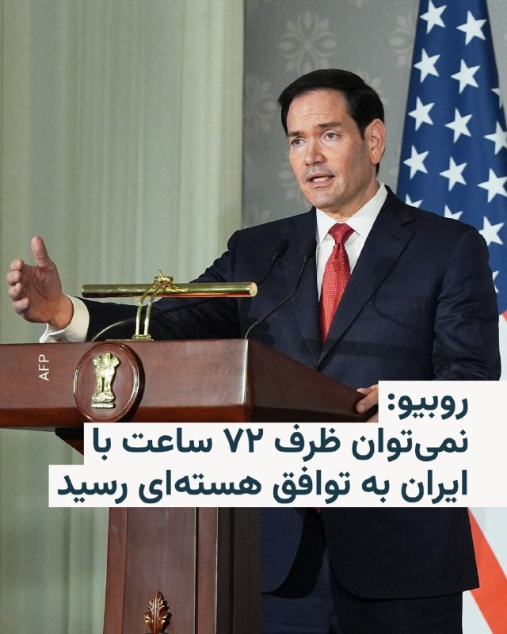

🔸مارکو روبیو، وزیر خارجه آمریکا، روز یکشنبه سوم خرداد به روزنامه نیویورک تایمز گفت که توافق با ایران حمایت منطقه‌ای را جلب کرده است، اما رسیدن به یک توافق هسته‌ای را نمی‌توان «طی ۷۲ ساعت» انجام داد.

🔸اظهارات او پس از آن مطرح شد که دونالد ترامپ، رئیس‌جمهور آمریکا، ساعتی پیش اعلام کرد به مذاکره‌کنندگان خود گفته برای دستیابی به توافق با ایران جهت پایان دادن به جنگ سه‌ماهه «عجله نکنند.»

🔸روبیو در گفت‌وگویی کوتاه با نیویورک تایمز گفت: «ما موضوع را به بعد موکول نمی‌کنیم. مذاکرات هسته‌ای مسائل بسیار فنی هستند. شما نمی‌توانید یک موضوع هسته‌ای را در ۷۲ ساعت و روی یک دستمال کاغذی حل کنید.»

🔸او افزود: «در حال حاضر، هفت یا هشت کشور منطقه از این رویکرد حمایت می‌کنند و ما آماده‌ایم این مسیر را ادامه دهیم.»

🔸این در حالی است که آقای روبیو ساعاتی پیش گفته بود که ممکن است تا شامگاه یک‌شنبه خبری دربارهٔ توافقی با ایران اعلام شود که می‌تواند به‌طور رسمی به جنگ خاورمیانه پایان دهد.

@RadioFarda

## RadioFarda — post 157524

پرویز قلیچ‌خانی؛ فوتبالیستی که به میدان سیاست رفت

🔸پرویز قلیچ‌خانی، کاپیتان پیشین تیم ملی فوتبال ایران، فعال سیاسی و مدیرمسئول مجله «آرش»، پس از یک دوره بیماری روز دوم خرداد در هشتاد سالگی در پاریس درگذشت.

🔸آقای قلیچ‌خانی که بود؟ چه جایگاهی در ورزش ایران داشت؟ و سرنوشت او در دنیای سیاست چگونه رقم خورد؟

🔸ستاره‌ای که «از فقر برآمد»
پرویز قلیچ‌خانی در ۱۳ آذر ۱۳۲۴ در محلهٔ صابون‌پزخانه نزدیک میدان شوش تهران در خانواده‌ای کم‌درآمد متولد شد و در همان نوجوانی وارد دنیای ورزش شد. کارشناسان ورزشی قلیچ‌خانی را به دلیل قابلیت‌ها و مهارت‌های برجسته اش در تکنیک‌های فوتبال، به عنوان یکی از بهترین بازیکنان تاریخ فوتبال ایران ستوده‌اند.

🔸مهدی اصلانی، نویسنده و زندانی سیاسی پیشین که آقای قلیچ‌خانی را از نزدیک می‌شناخت، به رادیوفردا می‌گوید که این چهره ورزشی، از فقر برآمد و به ستاره فوتبال تبدیل شد: «پرویز قلیچ‌خانی از سر سفره فقر برخاست، تهیدستی را نفس کشید و پس از آن‌که در ۱۸ سالگی، در المپیک توکیو، به ستاره اول فوتبال ایران بدل شد، غم سفره‌های خالی تا پایان عمر با او ماند.»

🔸قلیچ‌خانی تنها بازیکنی بود که با تیم ملی فوتبال ایران سه بار قهرمان جام ملت‌های آسیا شد. گلی که او نزدیک به شصت سال پیش، در ورزشگاه امجدیه تهران در جریان فینال یکی از دوره‌های این جام وارد دروازه تیم ملی اسرائیل کرد، برای خیلی‌ها ماندگارترین تصویر از قلیچ‌خانی است.

کامل این مطلب را در وب‌سایت رادیوفردا بخوانید.

@RadioFarda

## RadioFarda — post 157523

  <a href="https://t.me/radiofarda/157523" target="_blank">📎 Download file</a>

📻بشنوید: ایستگاه ۱۹ با رادیوفردا، سوم خرداد ۱۴۰۵

@RadioFarda

## RadioFarda — post 157522

  

🔸نخست‌وزیر اسرائیل روز یکشنبه گفت که او و دونالد ترامپ، رئیس‌جمهور آمریکا، بعد از یک تماس تلفنی در شامگاه شنبه توافق دارند که هرگونه توافق نهایی با ایران باید تهدید هسته‌ای ناشی از تهران را از بین ببرد.

🔸بنیامین نتانیاهو در پیامی در شبکه ایکس در توضیح بیشتر نوشت: «این یعنی برچیدن تأسیسات غنی‌سازی هسته‌ای ایران و خارج کردن مواد هسته‌ای غنی‌شده آن از خاک این کشور.»

🔸آژانس بین‌المللی انرژی اتمی گفته است ایران بیش از چهارصد کیلو اورانیوم غنی‌شده تا حد ۶۰ درصد دارد که به احتمال زیاد در تأسیسات زیرزمینی بمباران‌شده در جریان جنگ ۱۲ روزه مدفون است. ترامپ بارها گفته که ایران باید این مواد را به آمریکا تحویل دهد.

🔸نخست‌وزیر اسرائیل همچنین خبر داد که ترامپ همچنین بار دیگر بر حق اسرائیل برای دفاع از خود در برابر تهدیدها در تمامی جبهه‌ها، از جمله در لبنان، تأکید کرده است.

🔸رئیس‌جمهور آمریکا شامگاه شنبه اعلام کرد با سران کشورهای منطقه درباره مذاکرات با ایران تماس تلفنی داشته و افزود که به جداگانه با نخست‌وزیر اسرائیل گفت‌وگو کرده که «آن تماس نیز بسیار خوب پیش رفت».

@RadioFarda

## IranianMinds — post 20695

  

🔴 توئیت کمال پنحاسی، سخنگوی فارسی‌زبان ارتش اسرائیل:

کس نخارد پشت من، جز ناخن انگشت من.

@IranianMinds

## IranianMinds — post 20694

  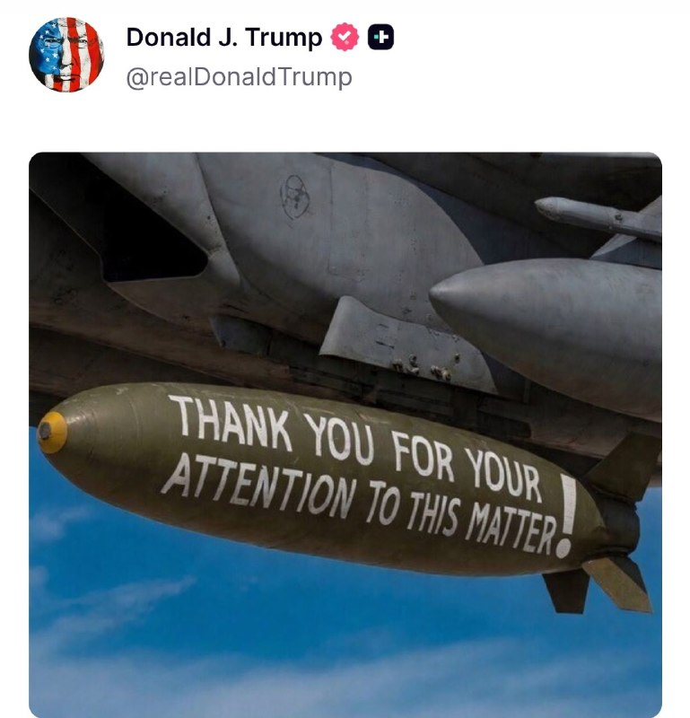

🔴 پست جدید ترامپ :

از توجه شما به این موضوع سپاسگزارم!

@IranianMinds

## IranianMinds — post 20693

  

این چیه دیگه 😂😂

@IranianMinds

## IranianMinds — post 20692

🔴 فاکس‌ نیوز به نقل از مقام‌های آمریکایی:

تهران به‌طور اولیه با چارچوب توافق موافقت کرده و ۹۵٪ آن تکمیل شده است و اکنون بر سر جزئیات و نحوه نگارش در حال مذاکره هستیم.

@IranianMinds

## IranianMinds — post 20691

🔴 مارکو روبیو:

دوران به گروگان گرفته شدن کشورها توسط گروه‌های تروریستی در حال نزدیک شدن به پایان است.

@IranianMinds

## IranianMinds — post 20690

  

🔴 ترامپ :

اگه با ایران معامله کنم، یه معامله درست و حسابی می‌کنم، نه مثل اون آشغالی که اوباما کرد و کلی پول نقد بهشون داد و راه رو برای ساخت سلاح هسته‌ای کاملاً باز گذاشت. معامله ما دقیقاً برعکسه، ولی هنوز هیچ‌کس ندیدنش و نمیدونه چیه. حتی هنوز کامل مذاکره هم نشده. پس به این بازنده‌ها گوش نکنید که دارن درباره چیزی نظر میدن که هیچی ازش بلد نیستن. برخلاف اونایی که قبل از من بودن و باید سال‌ها پیش این مشکل رو حل میکردن، من معامله بد نمی‌کنم!

@IranianMinds

## IranianMinds — post 20689

  <a href="telegram/content/IranianMinds_20689_1779653118.mp4" target="_blank">🎬 Download video</a>

فکر کنم بادیگاردش داشت میگفت: تموم کن این چرندیاتو دلقک😂

@IranianMinds

## IranianMinds — post 20688

  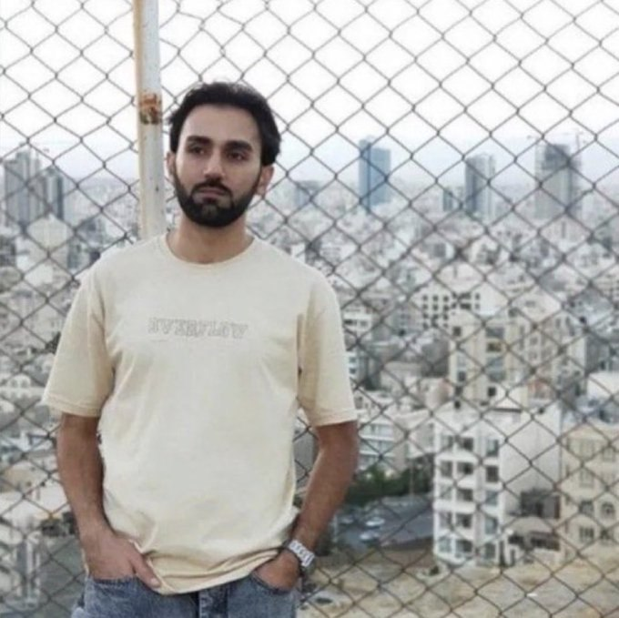

🔴 صدور حکم اعدام برای یک دبیر زیست‌شناسی
 
به گزارش منابع حقوق بشری وحید قاسمی دبیر زیست‌شناسی شاغل در دبیرستان «بهشتی» شهرستان فریمان در جریان پرونده‌ای مرتبط با اعتراضات دی۴۰۴ بازداشت و برای او حکم اعدام صادر شده است.

کانون حقوق بشر ایران اعلام کرده وحید قاسمی روز ۲۸ بهمن‌ماه ۱۴۰۴ توسط نیروهای اطلاعات فراجا در محل تدریس خود بازداشت و به زندان وکیل‌آباد مشهد منتقل شد.

بر اساس این گزارش اتهامات این آموزگار «تشویق به حضور در اعتراضات»، «فعالیت تبلیغی علیه نظام»، «توهین به رهبری» و «توهین به مقدسات» بوده است.

این آموزگار هم‌اکنون در زندان وکیل‌آباد مشهد محبوس است اما جزئیات دقیقی درباره روند رسیدگی به پرونده وی منتشر نشده است.

کانون حقوق بشر ایران نوشته مهناز حداد کاخکی، مادر وحید قاسمی و آموزگار ۵۳ ساله، نیز به علت پیگیری وضعیت فرزندش دستگیر و به زندان وکیل‌آباد مشهد منتقل شده است.

@IranianMinds

## IranianMinds — post 20687

  

🔴 العربیه :

توافق احتمالی ایران و آمریکا احتمالا به عنوان اعلامیه اسلام آباد منتشر میشود.

@IranianMinds

## IranianMinds — post 20686

  

🔴 سی بی اس نیوز :

به گفته یک مقام ارشد کاخ سفید، ایران در جریان مذاکرات با آمریکا، به‌صورت کلی با کنار گذاشتن اورانیوم غنی‌شده با درصد بالا موافقت کرده است.

هنوز توافق نهایی امضا نشده ، دولت ترامپ معتقد است رهبر ایران چارچوب کلی توافق را تأیید کرده

دو طرف همچنان درباره نحوه نابودی یا انتقال اورانیوم در حال مذاکره هستند

@IranianMinds

## IranianMinds — post 20685

🎁 استارت کن و کانفیگتو رایگان بگیر 
⭐ویژه کاربران پرمیوم تلگرام 
⭐️ اگه اکانت تلگرامت پرمیوم باشه به محض استارت ربات بدون هیچ امتیاز و زیر مجموعه دایی جون بهت کانفیگ هدیه میده 
✔️ همچنین با اوردن دوستای پرمیومت امتیاز بیشتری میگیری 
🎁 @Daeijoonbot | استارت…

## IranianMinds — post 20684

  

🎁 استارت کن و کانفیگتو رایگان بگیر

⭐ویژه کاربران پرمیوم تلگرام

⭐️ اگه اکانت تلگرامت پرمیوم باشه به محض استارت ربات بدون هیچ امتیاز و زیر مجموعه دایی جون بهت کانفیگ هدیه میده

✔️ همچنین با اوردن دوستای پرمیومت امتیاز بیشتری میگیری

🎁 @Daeijoonbot | استارت کن و کانفیگ رایگان بگیر 
🌟

## BBCPersian — post 281963

  <a href="telegram/content/BBCPersian_281963_1779653123.mp4" target="_blank">🎬 Download video</a>

آخرین خبرهای مهم روز یکشنبه ۳ خرداد ماه ۱۴۰۵ از تلویزیون بی‌بی‌سی فارسی

https://bbc.in/42XnQmy

https://bbc.in/3WtLd3k
@BBCPersian

## BBCPersian — post 281962

  

‏⭕️با گذشت ۱۸ هفته از بازداشت آرتین غضنفری، عکاس خبری نگرانی‌ها از وضعیت پرونده و سلامتی او افزایش یافته است.

‏یک منبع آگاه درباره او که ۱۲۶ روز بدون دسترسی به وکیل در بازداشت به‌سر می‌برد، به بی‌بی‌سی گفت: بازداشت موقت او چندبار تمدید شده و او امکان دسترسی به وکیل را «در مرحله دادسرا نیافته و کیفرخواست او به شعبه ۱۵ دادگاه انقلاب به ریاست قاضی ابوالقاسم صلواتی ارسال شده است.»

‏بازداشت طولانی، محدود کردن دسترسی بازداشتی به حقوق قانونی، بازداشت‌های متداوم بهائیان در ماه‌های اخیر، موجب ابراز نگرانی سازمان‌های حقوق‌بشری و فدراسیون بین‌المللی روزنامه‌نگاران و پارلمان اروپا از «پرونده‌سازی» علیه آرتین غضنفری و دیگر شهروندان بهائی در ایران شده است.

‏آرتین غضنفری، عکاس خبری، تهیه‌کننده پادکست «ماه سیزدهم» و شهروند بهائی پس از یورش ماموران به محل زندگی او در تهران در ۲۹ دی ۱۴۰۴ و تفتیش و ضبط بعضی وسایل شخصی و تجهیزات کاری بازداشت شد.

‏بیشتر:
instagram.com/p/DYuz4MKiLKn/
@bbcpersian

## BBCPersian — post 281961

  <a href="https://t.me/bbcpersian/281961" target="_blank">📎 Download file</a>

پادکست جام جهان‌نما، یکشنبه ۳ خرداد ۱۴۰۵
این برنامه رادیویی را می‌توانید هرشب ساعت ۲۰ به وقت ایران، روی موج متوسط ۷۰۲ کیلوهرتز و موج کوتاه ۹۴۶۵ کیلوهرتز بشنوید. تکرار برنامه را هم می‌توانید ساعت ۲۱:۳۰ روی موج متوسط ۷۰۲ کیلوهرتز و موج کوتاه ۵۳۹۵ کیلوهرتز گوش کنید
@bbcpersian

## BBCPersian — post 281960

  <a href="telegram/content/BBCPersian_281960_1779653127.mp4" target="_blank">🎬 Download video</a>

🔻گروهی از فعالان در اسپانیا امروز در بیلبائو در ایالت شمالی باسک، در محکومیت خشونت پلیس این کشور علیه چند نفر از سرنشینان ناوگان آزادی فلسطین که دیروز در فرودگاه این شهر صورت گرفت، تظاهرات کردند.

تظاهرکنندگان با شعارهای حمایتی از فلسطین، خواستار پاسخگویی مقام‌های اسپانیا و توقف برخورد خشن با کنشگران شدند.

این تجمع همچنین برای همبستگی با ناوگان آزادی فلسطین و در اعتراض به آنچه سرکوب فعالان خوانده می‌شود، برگزار شد. پلیس اسپانیا دیروز با چند فعال ناوگان آزادی فلسطین پس از بازگشت، در فرودگاه بیلبائو درگیر شد و تصاویر کتک زدن آنها واکنش‌های بسیاری را برانگیخت.

کشتی کمک‌رسانی فعالان ناوگان آزادی فلسطین در مسیر غزه در آب‌های بین‌المللی دریای مدیترانه نزدیک قبرس توسط نیروهای اسرائیلی توقیف و پس از انتقال به اسرائیل، در آنجا برای مدتی بازداشت شدند. بعضی از اعضای این گروه پس از اخراج گفتند که در زمان بازداشت در اسرائیل مورد شکنجه و آزار جسمی و جنسی قرار گرفته‌اند.

https://bbc.in/4e2Wh0I
🎥 Reuters
@BBCPersian

## BBCPersian — post 281959

🔻پلیس ترکیه روز یکشنبه (۲۴ مه/ ۳خرداد) با استفاده از اسپری فلفل، شکستن دروازه و عبور از موانع موقت، وارد دفتر مرکزی حزب جمهوری‌خواه خلق (سی‌اچ‌پی) شد.

پلیس سپس اوزگور اوزال، رهبر حزب جمهوری‌خواه خلق که روز پنجشنبه (۲۱ مه) با حکم دادگاه برکنار شده بود، را از ساختمان بیرون کرد.

هنگامی که هواداران حزب کپسول آتش‌نشانی را به سمت پلیس پرتاب کردند، ابری از دود در ورودی ساختمان دیده می‌شد. افرادی که ماسک زده بودند در فضای کم داخل ساختمان سرفه می‌کردند.

دادگاهی در ترکیه روز پنجشنبه اوزگور اوزل، رهبر حزب جمهوری‌خواه خلق را برکنار کرد و نتایج کنگره حزب جمهوری‌خواه خلق را که در سال ۲۰۲۳ در آن انتخاب شده بود، به دلیل تخلفات لغو کرد.

دادگاه، کمال قلیچدار اوغلو، رئیس سابق حزب جمهوری‌خواه خلق را که در انتخابات سراسری ۲۰۲۳ از رئیس‌جمهور طیب اردوغان شکست خورده بود، به جای اوزال بازگرداند.

اما طرفداران آقای اوزال ساختمان را ترک نکردند و حامیان کمال قلیچداراوغلو تلاش کردند وارد ساختمان حزب شوند که سرانجام پلیس وارد عمل شد و ساختمان را تحت کنترل خود درآورد.

bbc.in/42PlJAL
@BBCPersian

## Dirty_Kids — post 390102

وقتی کانفیگ جدید میگیرم، با ته‌مونده کانفیگ قبلی میرم اینستا که بار روانی کمتری داشته باشه! :|

@Dirty_Kids 👻

## Dirty_Kids — post 390101

  

ترامپ:

«اگه من با رژیم هزارپدر شیعه‌سانان رافضی توافق کنم، یه توافق خوب و درست‌وحسابی خواهد بود‌ نه مثه اون توافقی که اوبامای قرمساق کرد و کوهی از پول نقد داد به روافض و یه مسیر صاف و باز رو براشون گذاشت تا برسن به سلاح هسته‌ای.[کسشر نگو شیر سابق، هر توافقی با رژیم خدعه‌گر رافضی سرش گرده]

توافق ما دقیقاً برعکس اونه، اما هنوز هیچ‌کس ندیدتش و نمی‌دونه چیه. حتی هنوز مذاکراتش هم کاملاً تموم نشده.

پس به حرف این بازنده‌ها گوش ندید که دارن از چیزی انتقاد می‌کنن که اصلاً هیچی ازش نمی‌دونن.[خب خودت که می‌دونی بگو ببینیم چه کسشری توشه]

برخلاف اون قرمساق‌هایی که قبل از من بودن و باید این مشکل رو سال‌ها پیش حل می‌کردن، من توافق بد امضا نمی‌کنم. [دمت گرم، اینو راست می‌گی خدایی، تو این پنج‌سال و نیم ندیدم توافق کسشر امضا کنی]
رئیس‌جمهور، دی‌جی‌تی، سل سابق خاک‌سفید»

@Dirty_Kids 👻

## Dirty_Kids — post 390100

  <a href="telegram/content/Dirty_Kids_390100_1779653130.mp4" target="_blank">🎬 Download video</a>

خبرنگار: به توافق نزدیک شدیم؛ نظر شما چیه؟

سیاری، رئیس ستاد و معاون هماهنگ کننده ارتش: توافق؟ من اصلا نمی‌دونم توافق چیه.. توافق نَ‌مَ‌نَ‌دی

@Dirty_Kids 👻

## Dirty_Kids — post 390099

  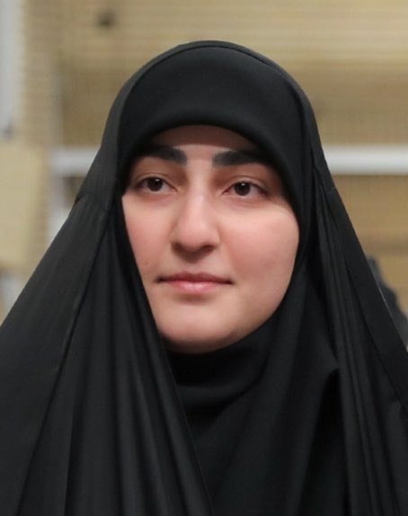

عموی عزیزم دونالد ترامپ
هم بابامو کشت هم خودش منتقم خون بابام شد

@Dirty_Kids 👻

## Dirty_Kids — post 390098

کاش حداقل روبیو که رفته هند، اونا رو متقاعد کنه موشک بزنن پاکستان.

@Dirty_Kids 👻

## Dirty_Kids — post 390096

  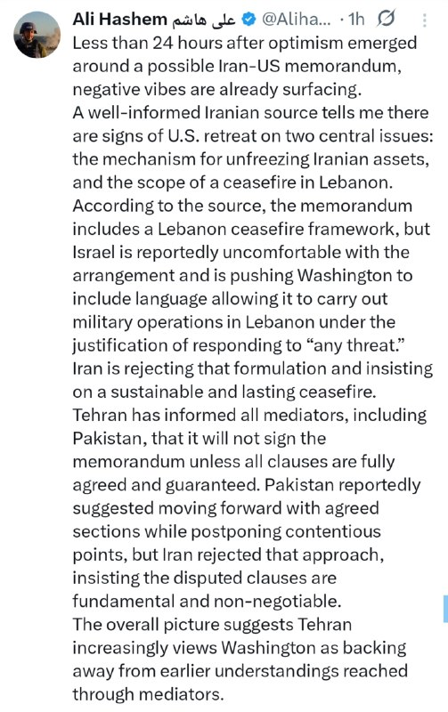

‏عزیزان، یه قرمساقی به اسم علی‌هاشم خبرنگار الجزیره که دیروز گفته بود کار تمومه و تفاهم‌نامه امروز امضا می‌شه نوشته که :

«کمتر از ۲۴ ساعت بعد از احتمال تفاهم روافض قحبه و آمریکا، نشونه‌های منفی از راه رسیدن.

منبع آگاه رافضی می‌گه نشونه‌هایی از عقب‌نشینی آمریکا در دو موضوع اصلی دیده می‌شه: سازوکار آزادسازی دارایی‌ها و دامنه آتش‌بس در لبنان.»

روافض به همه‌ی میانجی‌های قرمپف از جمله پاکستان قرمدنگ اطلاع داده که اگه همه‌ی بندهای تفاهم کاملاً مورد توافق و تضمین واقع نشن، تفاهم‌نامه رو امضا نخواهند کرد.

پاکستان قرمساق پیشنهاد کرده که حداقل فعلاً بندهای مورد توافق جلو بره و مسائل اختلافی به تعویق بیفته تا این قرمساق‌های کیری پاکستانی بتونن این وسط یه چیزی به‌نام‌خودشون ثبت کنن، اما روافض کیرشون رو‌ گذاشتن کف دستشون [احسنت بهشون] و گفتن کسشر نگید بابا این بندهای مورد اختلاف، اساسی و غیرقابل مصالحه هستند.

@Dirty_Kids 👻

## Dirty_Kids — post 390095

وقتی دم جام‌جهانی میخوای هم از فوتبالی‌ها ویو بگیری هم مبارزا رو بکشونی سمتت و هم میخوای جقی‌هارو راضی نگه‌داری:

@Dirty_Kids 👻

## Dirty_Kids — post 390094

ابرتورم اینجوریه که

خونه‌ت ۱۰ میلیارده
ماشینت ۳ میلیارد
یخچالت نیم میلیارد
ماشین لیاسشویی و ظرفشویی هرکدوم ۲۰۰-۳۰۰ میلیون
کامپیوترت ۱۰۰ میلیون
مبل خونه ۷۰ میلیون

ولی حقوقت ماهی ۳۰ میلیون!
و تو با این حقوق، حتی هزینه تعمیرات اون بالاییها رو هم نمیتونی بدی!

@Dirty_Kids 👻

## Dirty_Kids — post 390093

  <a href="telegram/content/Dirty_Kids_390093_1779653133.mp4" target="_blank">🎬 Download video</a>

قحبه‌ ما پول کانفیگ نداریم بدیم ریدم تو محتوایی که میسازی

@Dirty_Kids 👻

## Dirty_Kids — post 390092

  <a href="https://t.me/Dirty_Kids/390092" target="_blank">📎 Download file</a>

✅ اپلیکیشن اندروید سایت جهانی دربی بت

💰اولین سایت جهانی با امکان شارژ و برداشت ریالی(کارت به کارت)

🔗 برای ورود فیلترشکن روی کشور مناسب قرار دهید مانند فنلاند و المان و....

😀Telegram Channel
👇
https://t.me/+bcynkEgSW2dlYTc0

## Dirty_Kids — post 390091

  

😤دنبال یه سایت شرط بندی بین المللی بودی که به ایرانیا خدمات بده؟!
⛔

👍دربی بت همون انتخاب  100%

💎ویژگی های سایت جهانی Derby Bet:

⬅️امکان شارژ امن با کارت بانکی

⬅️واریز اول دوبل شارژ می شوید(بونوس۱۰۰٪)

⬅️پر اپشن ترین سایت فعال در ایران

⬅️تسویه حساب کمتر از 5 دقیقه

⬅️برگشت بخشی از باخت به صورت هفتگی

🚨کد هدیه ثبت نام:GG007

⚠️برای دانلود اپلکیشن کلیک کنید
👉

🔔کانال دربی بت :

🪙https://t.me/+bcynkEgSW2dlYTc0

## Dirty_Kids — post 390090

  <a href="telegram/content/Dirty_Kids_390090_1779653135.mp4" target="_blank">🎬 Download video</a>

ویدیو وایرال شده از چت‌های علی کریمی

+ اکانتش از اول دست وحید اسماعیلی (لیدر استادیوم) بوده چیز جدیدی نیست
از همون موقع که ایلان ماسک این قابلیت رو اضافه کرد فوتبالیای پیگیر میدونستن

یه عده معتقد تهدید شده یه عده میگن از اول پروژه بوده، یه عده میگن فازش اینه ساید عوض میکنه، یه عده هم طرفدار داره


@Dirty_Kids 👻

## Dirty_Kids — post 390089

  

جلال رشیدی کوچی، نماینده سابق مجلس:

فکر میکنم ظرف 48 الی 72 ساعت آینده، اینترنت به حالت قبل جنگ برمیگرده — دیگه بخواد خیلی طول بکشه تا آخر هفته اینترنت بین‌الملل وصل میشه.

@Dirty_Kids 👻

## Dirty_Kids — post 390088

  <a href="telegram/content/Dirty_Kids_390088_1779653139.mp4" target="_blank">🎬 Download video</a>

پشمای شهرام همایون ریخت از دست این صدای امریکا (صدای ج.ا) 😂😂😂

شهرام همایون رفته تو برنامه این زنک فهیمه وسط برنامه، طنز مهران مدیری رو پخش کردن که مسخرش میکرد

شهرام همایون شدید قاطی میکنه!

@Dirty_Kids 👻

## Dirty_Kids — post 390087

  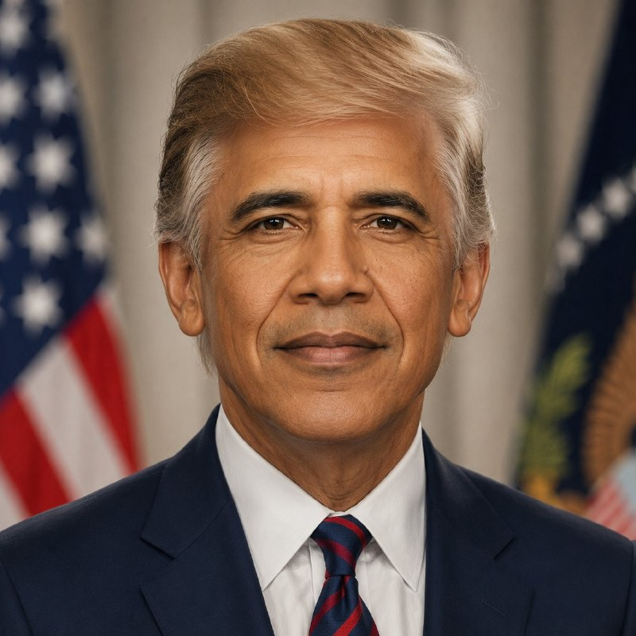

رییس جمهور آمریکا
جو باراک ترامپ

@Dirty_Kids 👻

## Dirty_Kids — post 390086

  

🌪وقتی اینترنت طوفانیه فقط کافیه بادبان ها رو بکشی

⚫️100 هزار تومان تخفیف خرید اول 
🎁

⚫️پایین ترین قیمت گیگی 180 هزار تومان
🌐 

⚫️پورسانت %10 دائمی برای هر معرفی
💼

با بادبان، میتونی یه اتصال سریع، پایدار و امن
همراه با پشتیبانی ۲۴ ساعته داشته باشی
🚀

🛒کد تخفیف: badban4k

بادبان راهتو باز می‌کنه
⛵️
G3

🛡@BadBan_VPN | کانال 

🤖@BadBan_VPNBot | ربات 

📞@BadBan_VPNSupport | پشتیبانی

## Dirty_Kids — post 390085

ترامپ واقعا عموعه تهش ارثمون رو بالا کشید

@Dirty_Kids 👻

## Dirty_Kids — post 390084

‏بنظرم ایران با چین معامله کرده، گفته آمریکا برای من تایوان برای تو

@Dirty_Kids 👻

## Hranews — post 113144

  

روح الله کرکی، زندانی سیاسی به اعدام محکوم شد

❗️
❗️
❗️
❗️
❗️ – روح الله کرکی، زندانی سیاسی محبوس در زندان شیبان اهواز به اعدام محکوم شد.

به گزارش خبرگزاری هرانا، ارگان خبری مجموعه فعالان حقوق بشر در ایران، روح الله کرکی به اعدام محکوم شد.

بر اساس اطلاعات دریافتی هرانا، روح الله کرکی به اعدام محکوم شده است. چندی پیش، کیفرخواست پرونده این شهروند از بابت اتهامات «انتشار و افشای اسناد محرمانه»، «همکاری با سازمان مجاهدین خلق»، «جاسوسی برای اسرائیل و تبادل اطلاعات نظامی و امنیتی»، «توهین به مقدسات و مقامات» و «اقدام علیه امنیت ملی» صادر و به دادگاه کیفری دو اهواز ارجاع شده بود.
#روح_الله_کرکی

ادامه مطلب

↘️
@hranews_bot تماس ✉️ -  @Hranews  کانال هرانا 🆑

## Hranews — post 113143

  

گزارشی از آخرین وضعیت مهسا زیدآبادی در زندان تربت حیدریه

❗️
❗️
❗️
❗️
❗️ – مهسا زیدآبادی، شهروند اهل سبزوار هفت روز است که توسط ماموران اداره اطلاعات بازداشت شده و هم‌اکنون به‌صورت بلاتکلیف در زندان تربت حیدریه نگهداری می‌شود.

به گزارش خبرگزاری هرانا، ارگان خبری مجموعه فعالان حقوق بشر در ایران، مهسا زیدآبادی کماکان در بازداشت به‌سر می برد.

بر اساس اطلاعات دریافتی هرانا، خانم زیدآبادی روز دوشنبه ۲۸ اردیبهشت ماه، به اداره اطلاعات سبزوار احضار و پس از مراجعه به این نهاد امنیتی بازداشت شد. وی پس از دستگیری به زندان تربت حیدریه منتقل شده است.
#مهسا_زیدآبادی

ادامه مطلب

↘️
@hranews_bot تماس ✉️ -  @Hranews  کانال هرانا 🆑

## Hranews — post 113142

گزارشی از تجمع اعتراضی بازنشستگان تامین اجتماعی در ۳ شهر

❗️
❗️
❗️
❗️
❗️ – روز جاری، گروهی از بازنشستگان تامین اجتماعی در شهرهای تهران، رشت و شوش تجمعات اعتراضی برگزار کردند.
#تجمع

ادامه مطلب

↘️
@hranews_bot تماس ✉️ -  @Hranews  کانال هرانا 🆑

## Hranews — post 113141

یک مرد به اتهام قتل همسرش در دادگاه کیفری تهران محاکمه شد

❗️
❗️
❗️
❗️
❗️ – مردی که متهم است همسرش را با خوراندن قرص برنج به قتل رسانده است، در دادگاه کیفری استان تهران محاکمه شد.

#زنکشی

ادامه مطلب

↘️
@hranews_bot تماس ✉️ -  @Hranews  کانال هرانا 🆑

## Hranews — post 113140

مرگ و مصدومیت ۴ کارگر در سایه فقدان ایمنی کار

❗️
❗️
❗️
❗️
❗️ – در سایه فقدان ایمنی محیط و شرایط نامناسب کار، امروز یکشنبه ۳ خردادماه، چهار #کارگر در شهرهای کاشان و پرند دچار حادثه شدند. در این حوادث سه کارگر مصدوم و یک تن دیگر جان خود را از دست داد.

ادامه مطلب

↘️
@hranews_bot تماس ✉️ -  @Hranews  کانال هرانا 🆑

## Hranews — post 113139

یک زن در بجنورد توسط پسرش به قتل رسید

❗️
❗️
❗️
❗️
❗️ – مردی در بجنورد مادر خود را با استفاده از سلاح سرد به قتل رساند. متهم پس از بازداشت و به مرجع قضایی معرفی شده است.

ادامه مطلب

↘️
@hranews_bot تماس ✉️ -  @Hranews  کانال هرانا 🆑

## Hranews — post 113138

تعدیل ۸ کارگر پتروشیمی ماهشهر پس از پیگیری مطالبات صنفی

❗️
❗️
❗️
❗️
❗️ – هشت تن از #کارگران پتروشیمی ماهشهر پس از پیگیری مطالبات صنفی، از جمله اعتراض به کسر مزایای مزدی، توسط کارفرما از کار اخراج شدند.

ادامه مطلب

↘️
@hranews_bot تماس ✉️ -  @Hranews  کانال هرانا 🆑

## Hranews — post 113137

  

پرونده “شهرک اکباتان” در دادگاه انقلاب؛ ۴ متهم به اعدام و ۴ تن به حبس محکوم شدند

❗️
❗️
❗️
❗️
❗️– میلاد آرمون، نوید نجاران، مهدی ایمانی و سید محمدمهدی حسینی متهمان پرونده موسوم به “شهرک اکباتان” و از بازداشت شدگان اعتراضات سراسری ۱۴۰۱، توسط دادگاه انقلاب تهران به اتهام «#محاربه» به #اعدام محکوم شدند. امیرمحمد خوش‌اقبال، علیرضا برمرز پورناک، علیرضا کفایی و حسین نعمتی دیگر متهمان این پرونده نیز هرکدام به هفت سال حبس و مجازات های تکمیلی محکوم شدند. بخش دیگر این پرونده در دادگاه کیفری رسیدگی و چندی پیش منجر به صدور حکم #حبس و دیه برای برخی از متهمان شد.

به گزارش خبرگزاری هرانا، ارگان خبری مجموعه فعالان حقوق بشر در ایران، هشت تن از متهمان پرونده اکباتان توسط دادگاه انقلاب محکوم شدند.

براساس حکمی که توسط شعبه ۱۵ دادگاه انقلاب تهران به ریاست قاضی ابوالقاسم صلواتی صادر شده، میلاد آرمون، نوید نجاران، مهدی ایمانی و سید محمدمهدی حسینی از بابت اتهام «محاربه» اعدام محکوم شدند. همچنین امیرمحمد خوش‌اقبال، علیرضا برمرز پورناک، علیرضا کفایی و حسین نعمتی دیگر متهمان این پرونده نیز هرکدام به پنج سال زندان از بابت اتهام اجتماع و تبانی، دوسال حبس از بابت تبلیغ علیه نظام، دو سال منع فعالیت در فضای مجازی و دو سال منع اسکان در تهران و البرز محکوم شدند.
یک منبع مطلع از پرونده این افراد در گفت‌وگو با هرانا اعلام کرد که حکم صادره در روز جاری، بدون حضور و اطلاع وکلای پرونده، به‌صورت شفاهی به متهمان ابلاغ شده است. به گفته این منبع، حکم تاکنون به وکلای پرونده ابلاغ نشده؛ موضوعی که عملاً امکان ثبت درخواست تجدیدنظرخواهی را از آنان سلب کرده است.

ادامه مطلب

#میلاد_آرمون، #نوید_نجاران، #مهدی_ایمانی، #سید_محمدمهدی_حسینی، #امیرمحمد_خوش‌اقبال، #علیرضا_برمرز_پورناک، #علیرضا_کفایی، #حسین_نعمتی #اکباتان

↘️
@hranews_bot تماس ✉️ -  @Hranews  کانال هرانا 🆑

## manototv — post 105816

  <a href="telegram/content/manototv_105816_1779653145.mp4" target="_blank">🎬 Download video</a>

گفت‌وگو با کیوان عباسی بنیان‌گذار تلویزیون منوتو;
«می‌گفت بعضی تصاویر آن‌قدر هولناک بود که باور نمی‌کردیم در ایران ضبط شده باشد…
و تأکید کرد جنایت‌های دی‌ماه نباید فراموش شوند.»

## manototv — post 105815

  <a href="telegram/content/manototv_105815_1779653148.mp4" target="_blank">🎬 Download video</a>

گفت‌وگو با کیوان عباسی بنیان‌گذار تلویزیون منوتو
«می‌گفت هیچ حسرتی ندارد…
و هرچه توانسته برای ساختن و ادامه دادن انجام داده است.»

## manototv — post 105814

  <a href="telegram/content/manototv_105814_1779653150.mp4" target="_blank">🎬 Download video</a>

یک مقام ارشد در دولت ترامپ به شبکه ان بی سی گفته:
«توافق با ایران امروز امضا نخواهد شد، اما در مسیر دستیابی به توافق پیشرفت‌هایی حاصل شده است.»
این اظهارات پس از آن مطرح شد که ترامپ پیش‌تر گفته بود به نمایندگان خود دستور داده است که «برای رسیدن به توافق عجله نکنند».
پیش از آن نیز مارکو روبیو گفته بود که ممکن است «خبرهای خوبی» در راه باشد، هرچند تأکید کرد که هنوز «پیشرفت نهایی» در گفت‌وگوها با جمهوری‌اسلامی حاصل نشده است.

## manototv — post 105813

  <a href="telegram/content/manototv_105813_1779653151.mp4" target="_blank">🎬 Download video</a>

دونالد ترامپ، رئیس‌جمهور آمریکا در پلتفرم تروث سوشال خود نوشت:
«اگر با ایران به توافق برسم، توافقی خوب و درست خواهد بود؛ نه مثل توافقی که باراک اوباما انجام داد و به ایران مقادیر عظیمی پول نقد و مسیری آشکار و باز برای دستیابی به سلاح هسته‌ای داد.»
او افزود: «توافق ما دقیقاً برعکس آن است، اما هنوز کسی آن را ندیده یا از جزئیاتش خبر ندارد. حتی هنوز به‌طور کامل نهایی و مذاکره نشده است. بنابراین به حرف بازنده‌هایی که از چیزی انتقاد می‌کنند که هیچ اطلاعی درباره‌اش ندارند گوش ندهید. برخلاف کسانی که پیش از من بودند و باید سال‌ها پیش این مشکل را حل می‌کردند، من توافق بد انجام نمی‌دهم»

## manototv — post 105812

  <a href="telegram/content/manototv_105812_1779653152.mp4" target="_blank">🎬 Download video</a>

تماسی با خانواده جاویدنام مهدی اسکندریان:
«روی صحبتم با طرفداران جمهوری اسلامیه…
با کشتن جاویدنام‌ها فقط آدم‌های بیشتری را علیه خودتان ساختید؛
و خانواده‌های دادخواه این درد را فراموش نخواهند کرد.»

## manototv — post 105811

  <a href="telegram/content/manototv_105811_1779653154.mp4" target="_blank">🎬 Download video</a>

کاخ سفید می‌گوید مذاکرات با جمهوری اسلامی به مرحله حساسی رسیده اما هنوز توافق نهایی نشده و ممکن است چند روز دیگر طول بکشد. بر اساس پیش‌نویس توافق، جمهوری اسلامی درباره محدودیت غنی‌سازی و کنار گذاشتن ذخایر اورانیوم مذاکره می‌کند و در مقابل احتمال کاهش تحریم‌ها وجود دارد. ترامپ تأکید کرده آمریکا برای توافق عجله ندارد و محاصره دریایی فعلاً ادامه خواهد داشت. همزمان اسرائیل نسبت به توافق احتمالی ابراز نگرانی کرده و خواستار حذف کامل برنامه غنی‌سازی جمهوری اسلامی شده است.

## manototv — post 105810

  <a href="telegram/content/manototv_105810_1779653155.mp4" target="_blank">🎬 Download video</a>

تماسی با خانواده جاویدنام مهدی اسکندریان:
«می‌گفت مهدی عاشق ایران بود…
و دختر کوچکش هنوز منتظر برگشتن پدرش به خانه است.»

## manototv — post 105809

  <a href="telegram/content/manototv_105809_1779653158.mp4" target="_blank">🎬 Download video</a>

وزیران خارجه ۱۹ کشور عربی و اسلامی در بیانیه‌ای مشترک، اقدام منطقه موسوم به «سومالی‌لند» در افتتاح «سفارت» در اورشلیم را به‌شدت محکوم کردند.

در این بیانیه که روز یکشنبه سوم خرداد منتشر شد، این اقدام «غیرقانونی و مردود» خوانده شده و آمده است که افتتاح این دفتر، نقض آشکار قوانین بین‌المللی و قطعنامه‌های مربوط به مشروعیت بین‌المللی است.

وزیران خارجه کویت، مصر، عربستان سعودی، قطر، اردن، ترکیه، پاکستان، اندونزی، جیبوتی، سومالی، فلسطین، عمان، سودان، یمن، لبنان، موریتانی، الجزایر، بنگلادش و مراکش تاکید کردند که اورشلیم شرقی «سرزمین فلسطینی اشغال‌شده از سال ۱۹۶۷» است و هر اقدامی برای تغییر وضعیت حقوقی و تاریخی آن «باطل و بی‌اثر» است.

این کشورها همچنین حمایت کامل خود را از وحدت، حاکمیت و تمامیت ارضی جمهوری فدرال سومالی اعلام کردند و هرگونه اقدام یک‌جانبه علیه وحدت سرزمینی سومالی را مردود دانستند.

## alonews — post 122433

  <a href="telegram/content/alonews_122433_1779653159.mp4" target="_blank">🎬 Download video</a>

🔴زنده یاد مانوک خدابخشیان:
خدمت دوستانی که پنیک کردن از مذاکرات

✅@AloNews

## alonews — post 122432

  <a href="telegram/content/alonews_122432_1779653161.webm" target="_blank">🎬 Download video</a>

👈سخنگوی کمیسیون امنیت ملی مجلس با تاکید بر اینکه اداره تنگه هرمز به وضعیت قبل از جنگ باز نخواهد گشت، تصریح کرد که این تنگه تحت مدیریت ایران است

✅ @AloNews خبر جنگ

## alonews — post 122431

  <a href="telegram/content/alonews_122431_1779653162.webm" target="_blank">🎬 Download video</a>

🔴فوووووری / پست جدید ترامپ!!!!!!!!!! 
✅ @AloNews خبر جنگ

## alonews — post 122429

  <a href="telegram/content/alonews_122429_1779653162.webm" target="_blank">🎬 Download video</a>

🔴فوووووری / پست جدید ترامپ!!!!!!!!!!

✅ @AloNews خبر جنگ

## alonews — post 122428

  <a href="telegram/content/alonews_122428_1779653162.webm" target="_blank">🎬 Download video</a>

👈توییتِ سخنگوی فارسی زبان ارتش اسرائیل و طعنه به ترامپ

✅ @AloNews خبر جنگ

## alonews — post 122427

  <a href="telegram/content/alonews_122427_1779653163.mp4" target="_blank">🎬 Download video</a>

🔴این ویدیوی کوتاه که توسط حکومت جمهوری اسلامی و برای ایجاد رعب و وحشت تولید و منتشر شده است، بخشی از روایت ۳ دقیقه و ۴۶ ثانیه‌ای بازجو خبرنگار،«محمد نگینی‌پور» است.

🔴این حجم از کانتینرهایی که گوینده ویدیو هم به زیاد بودن آن اذعان دارد حامل پیکر عزیزان کشته شده در اعتراضات اخیر و سندی واضح برای محاکمه عاملان و آمران این جنایت علیه بشریت است. صدا و سیما هر تولیدی که در رابطه با کشتار مردم دارد سندی روشن از قتل‌ عام شهروندان بی سلاح توسط حکومت است و باید ثبت و نگهداری و مستند شود.

🔴تاریخ انتشار این ویدیو در صفحه شخصی شبکه اجتماعی این بازجو خبرنگار ۲۴ دی ۱۴۰۴ است ولی ویدیو روز ۲۰ دی ضبط شده است.

🔴محمد نگینی‌پور، مستندساز است که پیشتر در رسانه‌های وابسته به سپاه پاسداران از جمله خبرگزاری های فارس، تسنیم و مهر و شبکه افق صداو سیمای حکومتی فعالیت داشته است.

✅@AloNews

## alonews — post 122426

  <a href="telegram/content/alonews_122426_1779653165.webm" target="_blank">🎬 Download video</a>

👈 واکنش دیوید ونس، پادکستر و تحلیلگر مشهور آمریکایی به خبر احتمال توافق ایران و آمریکا:

🔴ایران ۱ - ۰ آمریکا

✅ @AloNews خبر جنگ

## alonews — post 122425

  <a href="telegram/content/alonews_122425_1779653165.webm" target="_blank">🎬 Download video</a>

👈 یک مقام ارشد آمریکایی به شبکه فاکس نیوز گفت که هیچ توافقی «امروز یا فردا» امضا نخواهد شد و افزود که رئیس‌جمهور ترامپ تمایل دارد به فرآیند چند روز دیگر برای رسیدن به نتیجه نهایی بدهد.

🔴این مقام گفت که رویکرد دولت توسط سیاست «بدون گرد و غبار، بدون دلار» هدایت می‌شود، به این معنی که ایران بدون برآوردن کامل تعهدات خود، از تخفیف تحریم‌ها یا منافع مالی بهره‌مند نخواهد شد.

🔴تفاهماتی در مورد انبار اورانیوم غنی‌شده و بازگشایی تنگه هرمز حاصل شده است، در حالی که نگارش نهایی همچنان در حال مذاکره است.

🔴آمریکا آماده است تا در صورت شکست مذاکرات یا تولید آنچه آن را «توافق بد» می‌داند، حملات نظامی را از سر گیرد.

✅ @AloNews خبر جنگ

## alonews — post 122424

  <a href="telegram/content/alonews_122424_1779653166.webm" target="_blank">🎬 Download video</a>

👈آی ۲۴ نیوز: مقامات آمریکایی می‌گویند ایران تا زمانی که انتقال ذخایر اورانیوم غنی‌شده خود را آغاز نکند، هیچ‌گونه تسهیلاتی در زمینه تحریم‌ها یا آزادسازی وجوه مسدود شده دریافت نخواهد کرد.

🔴در عین حال، ایران بر این باور است که آزادسازی وجوه باید بخشی از هر توافق‌نامه چارچوبی باشد.

✅ @AloNews خبر جنگ

## alonews — post 122423

  <a href="telegram/content/alonews_122423_1779653166.webm" target="_blank">🎬 Download video</a>

🔴کشتی HMS Lyme Bay در حال بارگیری مهمات، تدارکات و پهپادهای دریایی شکار مین در جبل‌الطارق مشاهده شد، در حالی که در مسیر حرکت به سمت منطقه تنگه هرمز است.

✅@AloNews

## alonews — post 122422

  <a href="telegram/content/alonews_122422_1779653167.webm" target="_blank">🎬 Download video</a>

⚫
🏆 به دنیای هیجان‌انگیز فوتبال خوش اومدی!

⭐️اینجا قراره باهم لحظه‌به‌لحظه‌ی جام جهانی رو زندگی کنیم؛
از بازی‌های حساس و نتایج داغ گرفته تا حاشیه‌ها، کری‌خونی‌ها و اتفاقاتی که همه درباره‌ش حرف میزنن! 
🔥
🔥

✅ پوشش کامل مسابقات

💀 ترول تیم‌ها و بازیکن‌ها

🎥 ویدیوها و لحظه‌های فان فوتبالی

📊 آمار، ترکیب‌ها و اخبار فوری

🌍 حواشی جذاب از سراسر جام جهانی

📢اینجا فقط یک کانال خبری نیست؛
یک جمع فوتبالیه برای کسایی که فوتبال رو با هیجان، شوخی و احساس واقعی دنبال میکنن 
📛
💟

🆘
🔞 آماده باش چون قراره جام جهانی رو متفاوت تجربه کنیم!

⚡ @Vaarzesh_Plus

⚡ @Vaarzesh_Plus

## alonews — post 122421

  <a href="telegram/content/alonews_122421_1779653167.webm" target="_blank">🎬 Download video</a>

👈وزیر خارجه عمان: گفت‌و‌گو‌های خوبی با غریب‌آبادی داشتیم

🔴 همچنان به حمایت از تلاش‌ها برای کاهش تنش، پیشبرد همزیستی مسالمت‌آمیز منطقه‌ای، امنیت و آزادی کشتیرانی ادامه خواهیم داد

✅ @AloNews خبر جنگ

## alonews — post 122420

  <a href="telegram/content/alonews_122420_1779653168.webm" target="_blank">🎬 Download video</a>

👈ادعای بلومبرگ: با ادامه مذاکرات، ابرنفتکش حامل نفت خام عراق از خلیج فارس خارج شد

✅ @AloNews خبر جنگ

## alonews — post 122419

  <a href="telegram/content/alonews_122419_1779653168.webm" target="_blank">🎬 Download video</a>

👈دونالد ترامپ جونیور در اکس نوشت:
این یک پیروزی بزرگ برای آمریکاست. ما باید افرادی که فقط با حمله زمینی به ایران خوشحال می‌شوند را نادیده بگیریم.

🔴پدر من قول داده بود که جلوی دستیابی ایران به سلاح هسته‌ای را بگیرد و این دقیقاً همان چیزی است که او به آن دست می‌یابد!

✅ @AloNews خبر جنگ

## alonews — post 122418

  <a href="telegram/content/alonews_122418_1779653168.webm" target="_blank">🎬 Download video</a>

👈اکسیوس: ترامپ از چندین رهبر مسلمان و عرب خواست تا در صورت پایان یافتن جنگ ایران با یک توافق، به توافقنامه‌های ابراهیم با اسرائیل بپیوندند

✅ @AloNews خبر جنگ

## alonews — post 122417

  <a href="telegram/content/alonews_122417_1779653169.webm" target="_blank">🎬 Download video</a>

👈روبیو: ایالات متحده کاملاً از تلاش‌های دولت مشروع لبنان برای بازسازی، بهبود و ثبات حمایت می‌کند.

🔴اقدامات اخیر حزب‌الله یک کمپین عمدی برای بی‌ثبات کردن لبنان و حفظ نفوذ خود به قیمت جان مردم لبنان است.

🔴حزب‌الله در تلاش است لبنان را دوباره به هرج و مرج و ویرانی بکشاند.

🔴ایالات متحده قاطعانه در کنار دولت لبنان می‌ایستد تا اقتدار خود را بازیابد و آینده‌ای بهتر برای مردمش بسازد.

🔴دوران گروگان‌گیری کشورها توسط گروه‌های تروریستی به پایان خود نزدیک می‌شود.

✅ @AloNews خبر جنگ

## alonews — post 122416

  <a href="telegram/content/alonews_122416_1779653169.mp4" target="_blank">🎬 Download video</a>

🔴سوم خرداد، سالروزِ آزادی خرمشهر

🔴نقطه ای که میتونست جنگ تموم بشه و جان یک میلیون انسان حفظ بشه ولی با طمع، هزاران نفر کشتند و آواره و شیمیایی کردن.

✅@AloNews

## alonews — post 122415

  <a href="telegram/content/alonews_122415_1779653171.webm" target="_blank">🎬 Download video</a>

👈یک مقام ارشد دولت آمریکا به سی‌ان‌ان ادعا کرد که توافق بین آمریکا و ایران هنوز کامل نشده است، اگرچه گفته می‌شود مذاکرات تقریباً «۹۵ درصد پیشرفت» داشته و دو طرف هنوز بر سر بخش‌هایی از عبارت‌بندی و متن نهایی اختلاف دارند.

🔴این مقام ارشد دولتی گفت هدف بلندمدت آمریکا همچنان جلوگیری از دستیابی ایران به سلاح هسته‌ای است

✅ @AloNews خبر جنگ

## alonews — post 122414

  <a href="telegram/content/alonews_122414_1779653171.webm" target="_blank">🎬 Download video</a>

👈رسانه‌های داخلی: آمریکا مانع آزادسازی پول‌های مسدود شدست، احتمال لغو کلی توافق وجود داره!

✅ @AloNews خبر جنگ

## alonews — post 122413

  <a href="telegram/content/alonews_122413_1779653171.mp4" target="_blank">🎬 Download video</a>

👈معاون هماهنگ کننده‌ی فرمانده‌ی ارتش : نمیدونم توافق چی هست، سر چی هست

✅ @AloNews خبر جنگ

<!-- MSG END -->

<!-- NAV START -->

<a href="https://github.com/babi2323/aio-downloader/blob/main/telegram/content/archive_1.md" style="display:inline-block; padding:6px 12px; margin:0 4px; background-color:#2ea44f; color:white; text-decoration:none; border-radius:4px; font-weight:bold;">صفحه بعد</a>

<!-- NAV END -->
