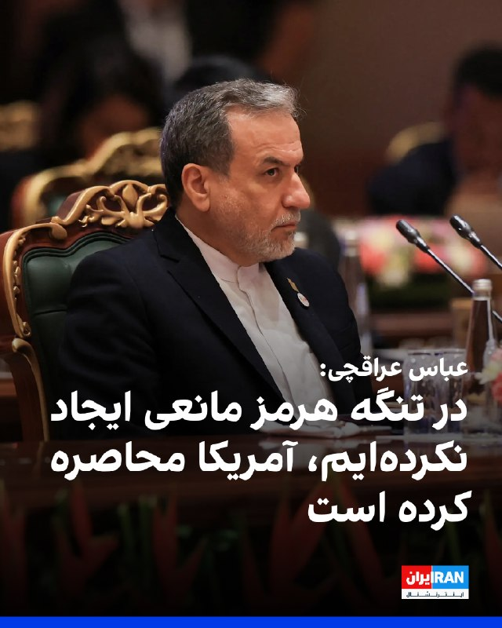
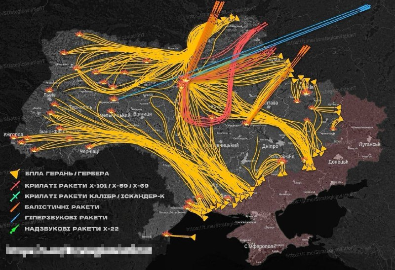
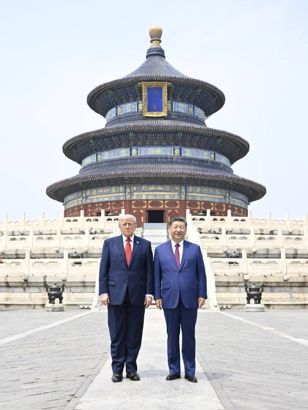

# خواننده تلگرام

<!-- TOP_NAV START -->

<a href="https://github.com/babi2323/aio-downloader/blob/main/telegram/content/archive_1.md" style="display:inline-block; padding:6px 12px; margin:0 4px; background-color:#2ea44f; color:white; text-decoration:none; border-radius:4px; font-weight:bold;">صفحه بعد</a>

<!-- TOP_NAV END -->

<!-- MSG START -->

---
📅 بروزرسانی: 1405/02/24 11:41
---

## VahidOOnLine — post 240068

  <a href="telegram/content/VahidOOnLine_240068_1778746318.mp4" target="_blank">🎬 Download video</a>

سازمان دریانوردی تجاری بریتانیا اعلام کرد یک کشتی در سواحل امارات و در نزدیکی تنگه هرمز دچار حادثه شده است.
بر اساس این گزارش، افرادی «غیرمجاز» کنترل این کشتی را در دست گرفته‌اند و شناور اکنون به‌سمت آب‌های سرزمینی ایران در حرکت است. این نهاد دریایی بریتانیا اعلام کرد کشتی در فاصله ۳۸ مایلی سواحل فجیره قرار داشته است.
‌🏁 🇬🇧 ManotoTV

🤖 @VahidOOnLine

## VahidOOnLine — post 240067

  <a href="telegram/content/VahidOOnLine_240067_1778746318.mp4" target="_blank">🎬 Download video</a>

⭕️عراقچی: تنگه هرمز برای همه کشتی‌های تجاری باز است اما باید با نیروی دریایی ما همکاری کنند

♦️عباس عراقچی، وزیر امور خارجه جمهوری اسلامی روز پنجشنبه ۲۴ اردیبهشت در حاشیه نشست وزرای خارجه کشورهای عضو بریکس گفت: «جمهوری اسلامی ایران هیچ مانعی در تنگه هرمز ایجاد نکرده و این گذرگاه دریایی همچنان برای کشتی‌های تجاری باز است.»

عراقچی حمله و محاصره دریایی آمریکا را عامل بروز مشکل در تنگه هرمز توصیف کرد و گفت: «تنگه هرمز برای همه کشتی‌های تجاری باز است و کشتی‌های تجاری باید برای عبور از تنگه با نیروهای دریایی جمهوری اسلامی ایران همکاری کنند.»

تنگه هرمز یکی از مهم‌ترین مسیرهای انتقال انرژی جهان به شمار می‌رود و تنش‌های اخیر میان آمریکا و اسرائیل با جمهوری اسلامی ایران، نگرانی‌ها درباره امنیت کشتیرانی و صادرات انرژی را افزایش داده است.
‌🇸🇦 Indypersian

🤖 @VahidOOnLine

## VahidOOnLine — post 240066

  

♦️سانائه تاکایچی، نخست‌ وزیر ژاپن پنجشنبه ۲۴ اردیبهشت با انتشار بیانیه‌ای اعلام کرد یک کشتی ژاپنی که در خلیج فارس متوقف شده بود، با موفقیت از تنگه هرمز عبور کرده و اکنون در مسیر بازگشت به ژاپن است.

به گفته تاکایچی، چهار خدمه ژاپنی در این کشتی حضور دارند.
تاکایچی با اشاره به عبور یک کشتی دیگر مرتبط با ژاپن در نهم اردیبهشت ماه، عبور اخیر را «تحولی مثبت» به‌ویژه از منظر حفاظت از شهروندان ژاپنی توصیف کرد.

نخست‌وزیر ژاپن یادآور شد، برای عبور این کشتی با مسعود پزشکیان «رایزنی مستقیم» داشته و وزیر خارجه و سفارت این کشور در تهران نیز هماهنگی‌های دیپلماتیک انجام داده‌اند.

به گفته او، با خروج این کشتی، تعداد کشتی‌های مرتبط با ژاپن که همچنان در خلیج فارس باقی مانده‌اند به ۳۹ عدد رسیده است و در یکی از آن‌ها سه خدمه ژاپنی حضور دارند.

تاکایچی در این پیام با یادآوری «فشار شدید» بر خدمه کشتی‌ها و نگرانی خانواده‌های آنان، از کارکنان دریایی و شرکت‌های کشتیرانی قدردانی کرد.

او تاکید کرد دولت ژاپن به تلاش‌های دیپلماتیک برای عبور هرچه سریع‌تر همه کشتی‌ها، از جمله کشتی‌های مرتبط با ژاپن، از تنگه هرمز ادامه خواهد داد.
‌🇸🇦 Indypersian

🤖 @VahidOOnLine

## VahidOOnLine — post 240065

  

عباس عراقچی، وزیر خارجه جمهوری اسلامی، گفت زمان آن رسیده است که «رفتار سلطه‌گرانه آمریکا به زباله‌دان تاریخ سپرده شود». او تاکید کرد هیچ‌گونه راه‌حل نظامی برای موضوعات مربوط به ایران وجود ندارد.

عراقچی گفت: «زمان آن رسیده که رفتار سلطه‌گرانه آمریکا را به زباله‌دان تاریخ بسپاریم.» او افزود: «هیچ‌گونه راه‌حل نظامی برای هر موضوعی که به ایران مربوط باشد، وجود ندارد. ما هرگز در برابر هیچ فشار یا تهدیدی سر خم نمی‌کنیم.»

وزیر خارجه جمهوری اسلامی همچنین اظهار داشت: «هرچند نیروهای مسلح ما آماده‌اند پاسخی کوبنده و ویرانگر به متجاوزان خارجی بدهند، اما مردم ما صلح‌طلب بوده و خواهان جنگ نیستند.»

او در ادامه از کشورهای عضو بریکس و دیگر اعضای جامعه بین‌المللی خواست آنچه را نقض حقوق بین‌الملل از سوی ایالات متحده و اسرائیل خواند، به‌صراحت محکوم کنند.
‌🏁 🇬🇧 IranintlTV

🤖 @VahidOOnLine

## VahidOOnLine — post 240064

  <a href="telegram/content/VahidOOnLine_240064_1778746321.mp4" target="_blank">🎬 Download video</a>

پلیس بریتانیا اعلام کرد دومین فرد در چارچوب تحقیقات ضدتروریسم درباره آتش‌سوزی در یک کنیسه در شرق لندن متهم شده است.
براساس اعلام پلیس، یک مرد ۳۱ ساله در ارتباط با این حمله بازداشت و تفهیم اتهام شده و تحقیقات درباره انگیزه و جزئیات حادثه ادامه دارد.
‌🏁 🇬🇧 ManotoTV

🤖 @VahidOOnLine

## VahidOOnLine — post 240063

  

طبق اطلاعات رسیده به ایران‌اینترنشنال، پرهام محرابی، نوجوان ۱۸ ساله اهل مشهد، شامگاه ۱۸ دی‌ماه ۱۴۰۴ در جریان اعتراضات بلوار هفت‌تیر، کنار پل هفت‌تیر ، در حالی‌که در کنار پدرش حضور داشت، با شلیک مستقیم ماموران سرکوبگر کشته شد. پدر او که لحظه اصابت گلوله را از نزدیک دیده بود، پیکر بی‌جان فرزندش را در آغوش گرفت و صدها متر حمل کرد تا به خودرویشان برسد و سپس او را به خانه منتقل کرد.

بر اساس اطلاعات رسیده به ایران‌اینترنشنال، پدر پرهام آن شب همراه فرزندش در محل اعتراضات حضور داشت و از فاصله‌ای نزدیک شاهد تیر خوردن او بود. او پس از اصابت گلوله، پیکر فرزندش را در آغوش گرفت و مسافتی طولانی حمل کرد تا به خودرو برسد و سپس مستقیما او را به خانه منتقل کرد. خانواده روز بعد برای دفن پیکر اقدام کردند اما به گفته منابع آگاه، ماموران امنیتی از پدر او تعهد کتبی گرفتند که اعلام کند فرزندش توسط «اغتشاشگران» کشته شده است و تهدید کردند در غیر این صورت اجازه دفن صادر نخواهد شد.

به گفته خانواده و اطرافیان، پرهام نوجوانی آرام، مهربان و محبوب بود و رابطه نزدیکی با پدر و مادرش داشت. خانواده‌اش می‌گویند.
‌🏁 🇬🇧 IranintlTV

🤖 @VahidOOnLine

## VahidOOnLine — post 240062

  

عباس عراقچی گفت جمهوری اسلامی هیچ مانعی در تنگه هرمز ایجاد نکرده و این آمریکا است که محاصره ایجاد کرده است.

او گفت: «ما هیچ مانعی در تنگه هرمز ایجاد نکرده‌ایم، این آمریکاست که محاصره ایجاد کرده است.»

عراقچی همچنین تاکید کرد: «تنگه هرمز برای تمامی کشتی‌های تجاری باز است، اما آنها باید با نیروهای دریایی ما همکاری کنند.»
‌🏁 🇬🇧 IranintlTV

🤖 @VahidOOnLine

## VahidOOnLine — post 240061

  

♦️عباس عراقچی، وزیر امور خارجه جمهوری اسلامی روز پنجشنبه ۲۴ اردیبهشت از «کشورهای عضو بریکس و همه اعضای مسئول جامعه بین‌المللی» خواست تا حمله آمریکا و اسرائیل به ایران را محکوم کنند.

عراقچی که برای شرکت در اجلاس وزاری امور خارجه بریکس به هند سفر کرده است، گفت جامعه جهانی باید «اقدامات عملی برای متوقف کردن جنگ» علیه جمهوری اسلامی را ایران را در دستور کار قرار دهد.

این سخنان در حالی بیان می‌شود که دونالد ترامپ، رئیس جمهوری ایالات متحده سه روز پیش گفته بود «آتش‌بس به دستگاه تنفس مصنوعی» وصل است و پیش از سفر به چین هشدار داده بود که جمهوری اسلامی ایران یا توافق با آمریکا را می‌پذیرد یا کاملا نابود خواهد شد.
‌🇸🇦 Indypersian

🤖 @VahidOOnLine

## VahidOOnLine — post 240060

  

♦️سازمان عملیات تجارت دریایی بریتانیا صبح پنجشنبه ۲۴ اردیبهشت گزارش کرد افراد «غیرمجاز» یک کشتی را در ۳۸ مایلی بندر فجیره تصرف کردند و در حال حاضر در حال انتقال آن به سوی آب‌های سرزمینی ایران هستند.
براساس این گزارش کشتی ربوده شده لنگر انداخته و متوقف بوده است.

هنوز مقام‌های جمهوری اسلامی و امارات متحده عربی واکنشی به این خبر نشان نداده‌اند.
‌🇸🇦 Indypersian

🤖 @VahidOOnLine

## VahidOOnLine — post 240059

  

مرکز عملیات تجارت دریایی بریتانیا اعلام کرد گزارشی از یک حادثه دریایی در فاصله ۳۸ مایل دریایی در شمال‌شرق فجیره، امارات متحده عربی، دریافت کرده است. این نهاد اعلام کرد این کشتی در حالی که در لنگرگاه قرار داشته، به دست افراد غیرمجاز تصرف شده و اکنون به سوی آب‌های سرزمینی ایران در حرکت است.
‌🏁 🇬🇧 IranintlTV

🤖 @VahidOOnLine

## VahidOOnLine — post 240058

  

وزارت دفاع اسرائیل اعلام کرد با یکی از شرکت‌های زیرمجموعه شرکت دفاعی البیت قراردادی برای توسعه «قابلیت برد افزوده» جنگنده اف-۳۵آی امضا کرده است. ارزش این قرارداد ۳۴ میلیون دلار اعلام شده است.

بر اساس اعلام این وزارتخانه، این قرارداد با شرکت سایکلون منعقد شده و شامل «توسعه و یکپارچه‌سازی مخازن سوخت خارجی» بر پایه طرحی است که پیش‌تر برای جنگنده اف-۱۶ طراحی شده بود.

وزارت دفاع اسرائیل اعلام کرد این قابلیت جدید قرار است برد عملیاتی هواپیما را افزایش دهد، وابستگی به سوخت‌گیری هوایی را کاهش دهد و انعطاف‌پذیری عملیاتی در ماموریت‌های برد بلند را تقویت کند.
‌🏁 🇬🇧 IranintlTV

🤖 @VahidOOnLine

## VahidOOnLine — post 240057

  <a href="telegram/content/VahidOOnLine_240057_1778746325.mp4" target="_blank">🎬 Download video</a>

همزمان با آغاز نشست وزیران خارجه کشورهای عضو بریکس در دهلی‌نو، عباس عراقچی، وزیر خارجه ایران، از اعضای این گروه و «همه کشورهای مسئول جامعه جهانی» خواست حملات آمریکا و اسرائیل علیه ایران را به‌صراحت محکوم کنند.
خبرگزاری رویترز گزارش داد جنگ ایران و اسرائیل بر نشست دو روزه بریکس در هند سایه انداخته و اختلاف‌ها میان اعضا، رسیدن به موضعی مشترک و صدور بیانیه نهایی را دشوار کرده است. ایران از هند، رئیس دوره‌ای بریکس، خواسته از این نشست برای ایجاد اجماع علیه واشینگتن و تل‌آویو استفاده کند
‌🏁 🇬🇧 ManotoTV

🤖 @VahidOOnLine

## VahidOOnLine — post 240056

  <a href="telegram/content/VahidOOnLine_240056_1778746325.mp4" target="_blank">🎬 Download video</a>

رسانه‌های وابسته به قوه قضاییه جمهوری اسلامی گزارش دادند با دستور مقام قضایی در استان همدان، اموال ۴۷ نفر که به «جاسوسی» و «همکاری با رژیم اسرائیل» متهم شده‌اند، توقیف شده است.
براساس این گزارش‌ها، این افراد در کشورهای مختلف از جمله بریتانیا، آلمان، آمریکا، ترکیه، عراق و سوئیس اقامت دارند و مقام‌های قضایی جمهوری اسلامی اعلام کرده‌اند پرونده آن‌ها در حال بررسی است. به گفته رسانه میزان، اموال توقیف‌شده قرار است برای «بازسازی اماکن آسیب‌دیده از جنگ» هزینه شود.
‌🏁 🇬🇧 ManotoTV

🤖 @VahidOOnLine

## VahidOOnLine — post 240055

  <a href="telegram/content/VahidOOnLine_240055_1778746326.mp4" target="_blank">🎬 Download video</a>

دونالد ترامپ، رئیس‌جمهوری آمریکا، در دیدار با شی جین‌پینگ در پکن، این نشست را «بسیار مهم» توصیف کرد و گفت توجه گسترده‌ای در آمریکا و جهان به این دیدار وجود دارد.
ترامپ با اشاره به اهمیت این مذاکرات گفت برخی این نشست را «بزرگ‌ترین دیدار تاریخ» می‌دانند و تاکید کرد مردم آمریکا تقریبا درباره موضوع دیگری صحبت نمی‌کنند. او همچنین حضور در کنار شی جین‌پینگ را «باعث افتخار» دانست و ابراز امیدواری کرد روابط میان آمریکا و چین «بهتر از هر زمان دیگری» شود.
‌🏁 🇬🇧 ManotoTV

🤖 @VahidOOnLine

## VahidOOnLine — post 240054

  <a href="telegram/content/VahidOOnLine_240054_1778746327.mp4" target="_blank">🎬 Download video</a>

دونالد ترامپ و شی جین‌پینگ، روسای جمهوری آمریکا و چین، در پکن دیدار کردند؛ دیداری که با مراسمی گسترده و تشریفات پرزرق‌وبرق همراه بود و صبح پنج‌شنبه با حضور هیات‌های بلندپایه دو کشور برگزار شد.
ترامپ در سخنان آغازین خود این دیدار را «باعث افتخار» توصیف کرد و گفت:
«رئیس‌جمهوری شی، بسیار سپاسگزارم. چنین استقبالی کمتر دیده‌ام. بیش از همه تحت تأثیر کودکان قرار گرفتم؛ شاد و فوق‌العاده بودند. ارتش چین قدرتمند بود، اما آن کودکان چیزهای زیادی را نمایندگی می‌کنند.»
‌🏁 🇬🇧 ManotoTV

🤖 @VahidOOnLine

## VahidOOnLine — post 240053

  <a href="telegram/content/VahidOOnLine_240053_1778746328.mp4" target="_blank">🎬 Download video</a>

دونالد ترامپ، رئیس‌جمهوری آمریکا، صبح پنج‌شنبه در جریان سفر خود به پکن همراه با شی جین‌پینگ، رئیس‌جمهوری چین، در مراسم رسمی استقبال و رژه نیروهای نظامی این کشور شرکت کرد.
این مراسم در مقابل ساختمان «تالار بزرگ خلق» برگزار شد و دو رهبر ضمن بازدید از یگان‌های نظامی، شاهد اجرای مراسم سان و رژه نیروهای ارتش چین بودند.
‌🏁 🇬🇧 ManotoTV

🤖 @VahidOOnLine

## VahidOOnLine — post 240052

  

♦️یونهاپ، خبرگزاری دولتی کره جنوبی، روز چهارشنبه ۲۴ اردیبهشت به نقل از یکی از مقام‌های امنیتی این کشور گزارش کرد که بررسی‌های سئول نشان می‌دهد که به احتمال بسیار زیاد جمهوری اسلامی ایران مسئول حمله به کشتی باری این کشور در تنگه هرمز بوده است.

سفارت جمهوری اسلامی در سئول هفته گذشته هرگونه حمله جمهوری اسلامی به کشتی باری کره جنوبی در تنگه هرمز را رد کرده بود.

 وزارت خارجه کره‌جنوبی روز یکشنبه اعلام کرده بود که کشتی باری متعلق به این کشور که  روز ۱۴ اردیبهشت در تنگه هرمز دچار حادثه شده بود،  هدف حمله «هواگردهای ناشناس» قرار گرفته است.
پارک ایل، سخنگوی وزارت خارجه کره‌جنوبی، در یک نشست خبری گفت دو هواگرد ناشناس بخش بیرونی مخزن تعادل سمت چپ در قسمت عقب کشتی «اچ‌ام‌ام نامو» را با فاصله حدود یک دقیقه هدف قرار دادند که در پی آن آتش و دود ایجاد شد.
‌🇸🇦 Indypersian

🤖 @VahidOOnLine

## VahidOOnLine — post 240051

  

حسین نوری همدانی، مرجع تقلید حامی حکومت، با صدور فتوایی پرداخت وجوهات شرعی مقلدان علی خامنه‌ای به مجتبی خامنه‌ای را مجاز اعلام کرد و او را «فقیهی جامع‌الشرایط» خواند.

او در این فتوا نوشت: «با توجه به اینکه وجوهات شرعی در نهایت در مسیر اعتلای حوزه‌های علمیه و اداره امور طلاب مصرف می‌گردد، و با عنایت به شناخت موجود نسبت به او به عنوان فقیهی جامع‌الشرایط، ان‌شاء‌الله پرداخت وجوهات شرعی مقلدین رهبر شهید به معظم‌له موجب برائت ذمه خواهد بود.»
‌🏁 🇬🇧 IranintlTV

🤖 @VahidOOnLine

## VahidOOnLine — post 240050

  

حسین نوری همدانی، مرجع تقلید حامی حکومت، با صدور فتوایی پرداخت وجوهات شرعی مقلدان علی خامنه‌ای به مجتبی خامنه‌ای را مجاز اعلام کرد و او را «فقیهی جامع‌الشرایط» خواند.

او در این فتوا نوشت: «با توجه به اینکه وجوهات شرعی در نهایت در مسیر اعتلای حوزه‌های علمیه و اداره امور طلاب مصرف می‌گردد، و با عنایت به شناخت موجود نسبت به او به عنوان فقیهی جامع‌الشرایط، ان‌شاء‌الله پرداخت وجوهات شرعی مقلدین رهبر شهید به معظم‌له موجب برائت ذمه خواهد بود.»
‌🏁 🇬🇧 IranintlTV

🤖 @VahidOOnLine

## VahidOOnLine — post 240049

  

رسانه‌های دولتی چین گزارش دادند دونالد ترامپ و شی جین‌پینگ در جریان گفت‌وگوهای خود در پکن درباره «وضعیت خاورمیانه» و جنگ اوکراین تبادل نظر کردند.

خبرگزاری دولتی شین‌هوا اعلام کرد دو رهبر درباره مسائل مهم بین‌المللی و منطقه‌ای، از جمله وضعیت خاورمیانه، دیدگاه‌های خود را مطرح کردند. موضوع جنگ اوکراین نیز در این گفت‌وگوها بررسی شد.

این دیدار در حالی برگزار شد که گمانه‌زنی‌هایی درباره تلاش احتمالی ترامپ برای جلب همکاری چین در موضوع جنگ آمریکا و اسرائیل علیه جمهوری اسلامی مطرح است.
‌🏁 🇬🇧 IranintlTV

🤖 @VahidOOnLine

## mwarmonitor — post 9062

  <a href="telegram/content/mwarmonitor_9062_1778746331.mp4" target="_blank">🎬 Download video</a>

🇨🇳🇺🇸دونالد ترامپ و شی جین‌پینگ در حال بازدید از «معبد آسمان» در پکن هستند.
🔸خبرنگار: آقای رئیس‌جمهور، گفتگوها چطور بود؟
🔹دونالد ترامپ: عالی بود. جای فوق‌العاده‌ایه. چین زیباست.
مترجم (به چینی): پرزیدنت ترامپ می‌گن که گفتگوها خیلی خوب بوده.
🔸خبرنگار: آقای رئیس‌جمهور، آیا درباره تایوان صحبتی کردید؟
(ترامپ و شی جین‌پینگ بدون پاسخ به سوال، در حال ژست گرفتن برای عکس هستند)
مقام چینی: متشکرم. ممنون. خیلی ممنون.
خبرنگار (دوباره): آقای رئیس‌جمهور، آیا در مورد تایوان صحبت کردید؟
مقام چینی: ممنون از مطبوعات. متشکرم. ممنون.

@mwarmonitor

## mwarmonitor — post 9061

⚽️خبر فوتبالی از نیویورک تایمز:

🎙شکیرا، مدونا و گروه BTS اجرای نخستین نمایش بین دو نیمه را در فینال جام جهانی فوتبال بر عهده خواهند داشت.

@mwarmonitor

## mwarmonitor — post 9060

🇺🇸🇨🇳مراسم رسمی استقبال از دونالد ترامپ با حضور شی جین‌پینگ در چین برگزار شد

💠در این مراسم، رئیس‌جمهور چین با برگزاری تشریفات کامل دیپلماتیک از رئیس‌جمهور آمریکا استقبال کرد؛ رویدادی که در چارچوب سفر رسمی ترامپ به پکن و با هدف بررسی روابط دوجانبه، همکاری‌های اقتصادی و تحولات راهبردی بین دو کشور انجام خواهد گرفت.

@mwarmonitor

## pm_afshaa — post 90712

🔴رویترز: آمریکا و چین توافق کردن هیچ کشوری نباید عوارض از تنگه هرمز بگیره

💧 Rainbet.com the #1 Non-KYC Crypto Casino & Sportsbook @rainbetcom

😁 @Pm_Afshaa

## pm_afshaa — post 90711

🔴روبیو: واشنگتن به پکن روشن کرد که هرگونه حمایت از ایران به روابط دوجانبه آسیب می رساند

💧 Rainbet.com the #1 Non-KYC Crypto Casino & Sportsbook @rainbetcom

😁 @Pm_Afshaa

## pm_afshaa — post 90710

  <a href="telegram/content/pm_afshaa_90710_1778746332.webm" target="_blank">🎬 Download video</a>

🔴روبیو، وزیر خارجه آمریکا:

چین کلی کشتی تو خلیج فارس داره که گیر افتادن و آخر هفته هم یه کشتی باری چینی آسیب دید، فکر نمیکنم ایران عمدی زده باشه، ولی خب به هر حال اتفاق افتاده و الان همین باعث شده کشتی‌های چینی نتونن راحت رفت‌وآمد کنن؛ این وضعیت داره حسابی منطقه رو بی‌ثبات میکنه، مخصوصاً آسیا که بخش زیادی از انرژی‌شون از همین مسیر رد میشه. به نفع خود چینه که این قضیه جمع بشه.

ما هم امیدواریم پکن بیشتر وارد ماجرا بشه و ایران رو قانع کنه از کارهایی که الان داره تو خلیج فارس انجام میده عقب‌نشینی کنه.

💧 Rainbet.com the #1 Non-KYC Crypto Casino & Sportsbook @rainbetcom

😁 @Pm_Afshaa

## DEJradio — post 4622

  <a href="telegram/content/DEJradio_4622_1778746333.mp4" target="_blank">🎬 Download video</a>

🚨
🔸 خبر ۲۱
چهارشنبه ۲۳ اردیبهشت ۱۴۰۵

#خبر۲۱
@DEJradio

## mamlekate — post 103524

📝 جی‌دی‌ ونس در مورد در مذاکرات با جمهوری اسلامی: فکر می‌کنم پیشرفت‌هایی حاصل شده است

جی‌دی ونس، معاون رئیس‌جمهوری آمریکا، روز چهارشنبه در گفت‌وگو با خبرنگاران گفت که در مذاکرات با جمهوری اسلامی پیشرفت‌هایی حاصل شده است.

@mamlekate

## mamlekate — post 103523

📝 دولت اسرائیل: نتانیاهو در جریان عملیات «غرش شیران» در سفری محرمانه با رئیس امارات دیدار کرد

دفتر نخست‌وزیر اسرائیل روز چهارشنبه ۲۳ اردیبهشت با انتشار پیامی در ایکس اعلام کرد: «بنیامین نتانیاهو، نخست‌وزیر اسرائیل، در بحبوحه عملیات شیر غران، مخفیانه از امارات متحده عربی بازدید کرد و در آن‌جا با شیخ محمد بن زاید، رئیس امارات، دیدار کرد.»

📝 امارات «گزارش‌ها درباره سفر نخست‌وزیر اسرائیل» را تکذیب کرد

وزارت امور خارجه امارات در بیانیه‌ای «گزارش‌های منتشرشده درباره سفر ادعایی بنیامین نتانیاهو، نخست‌وزیر اسرائیل، به امارات یا پذیرش هرگونه هیئت نظامی اسرائیلی در این کشور را» تکذیب کرد.

📝 نماینده آمریکا استقرار «گنبد آهنین» در امارات را تأیید کرد

@mamlekate

## VahidOnline — post 75455

  <a href="telegram/content/VahidOnline_75455_1778746335.mp4" target="_blank">🎬 Download video</a>

خبرگزاری مهر پرچم حزب‌الله را در ویدیوی مربوط به بدرقه فوتبالیست‌ها سانسور کرد.
FattahiFarzad
اعضای تیم فوتبال چهارشنبه‌شب ۲۳ اردیبهشت‌ماه در میدان انقلاب تهران برای حضور در جام جهانی ۲۰۲۶ بدرقه شدند؛ رقابت‌هایی که خرداد و تیر ۱۴۰۵ به میزبانی مشترک آمریکا، مکزیک و کانادا برگزار خواهد شد.
@VahidOOnLine

📡 @VahidOnline

## IranIntlTV — post 337129

  

🔻امیرمهدی علوی، سخنگوی فدراسیون فوتبال، درباره آخرین وضعیت صدور ویزا برای کاروان اعزامی ایران به جام‌جهانی گفت: «کارهای اداری ویزا را در امارات انجام دادیم و حالا منتظر پاسخ هستیم. با این حال، در صورت صادر نشدن ویزا برای برخی بازیکنان، اعضای کادر فنی گزینه‌های مختلفی دارند و بازیکنان جایگزین پیش‌بینی شده‌اند.»

🔹او همچنین به جلسه رییس فدراسیون فوتبال با مقامات فیفا اشاره کرد و گفت: «در ۴۸ ساعت آینده جلسه رییس فدراسیون با مقامات فیفا در ترکیه برگزار می‌شود و درباره ۱۰ مورد از خواسته‌های ما صحبت خواهیم کرد که نخستین مورد آن، بحث صدور ویزا است.»

🔹در فاصله کمتر از یک ماه تا آغاز جام‌جهانی، تیم ایران همچنان درگیر دریافت ویزای آمریکا است و این موضوع به بحرانی برای کادر فنی تبدیل شده است. احتمال دارد برای برخی اعضای کاروان ایران به دلیل سوابق فعالیت یا ارتباط با سپاه پاسداران، ویزا صادر نشود.
@iranintltvsport

## IranIntlTV — post 337128

  <a href="telegram/content/IranIntlTV_337128_1778746336.mp4" target="_blank">🎬 Download video</a>

وضعیت بحرانی دارو، به‌ویژه گرانی و کمبود داروهای خاص در ایران، تشدید شده است. ایلنا، خبرگزاری کار ایران، گزارش داد کمبود برخی داروهای سرطان و افزایش شدید قیمت آن‌ها، روند درمان بیماران مبتلا به سرطان را با مشکلات جدی روبه‌رو کرده است.

گفت‌وگو با بابک خطی، پزشک و متخصص کودکان
@iranintltv

## IranIntlTV — post 337127

  <a href="telegram/content/IranIntlTV_337127_1778746338.mp4" target="_blank">🎬 Download video</a>

شی جین‌پینگ، رهبر چین، پنج‌شنبه پس از نشست کلیدی خود با دونالد ترامپ، رییس‌جمهوری آمریکا، از «بازتعریف» روابط دوجانبه سخن گفت. او افزود دو طرف توافق کرده‌اند ایجاد یک رابطه سازنده و از نظر راهبردی باثبات، جهت‌گیری روابط دوجانبه را در سه سال آینده و فراتر از آن مشخص خواهد کرد. منابع رسمی دولت چین همچنین اعلام کردند شی و ترامپ «در مورد خا‌ورمیانه هم تبادل نظر کرده‌اند».

توماج طاهباز، خبرنگار ایران‌اینترنشنال، گزارش می‌دهد
@iranintltv

## IranIntlTV — post 337126

  

عباس عراقچی، وزیر خارجه جمهوری اسلامی، گفت زمان آن رسیده است که «رفتار سلطه‌گرانه آمریکا به زباله‌دان تاریخ سپرده شود». او تاکید کرد هیچ‌گونه راه‌حل نظامی برای موضوعات مربوط به ایران وجود ندارد.

عراقچی گفت: «زمان آن رسیده که رفتار سلطه‌گرانه آمریکا را به زباله‌دان تاریخ بسپاریم.» او افزود: «هیچ‌گونه راه‌حل نظامی برای هر موضوعی که به ایران مربوط باشد، وجود ندارد. ما هرگز در برابر هیچ فشار یا تهدیدی سر خم نمی‌کنیم.»

وزیر خارجه جمهوری اسلامی همچنین اظهار داشت: «هرچند نیروهای مسلح ما آماده‌اند پاسخی کوبنده و ویرانگر به متجاوزان خارجی بدهند، اما مردم ما صلح‌طلب بوده و خواهان جنگ نیستند.»

او در ادامه از کشورهای عضو بریکس و دیگر اعضای جامعه بین‌المللی خواست آنچه را نقض حقوق بین‌الملل از سوی ایالات متحده و اسرائیل خواند، به‌صراحت محکوم کنند.
https://iranintl.com/202605149950

## IranIntlTV — post 337125

  

طبق اطلاعات رسیده به ایران‌اینترنشنال، پرهام محرابی، نوجوان ۱۸ ساله اهل مشهد، شامگاه ۱۸ دی‌ماه ۱۴۰۴ در جریان اعتراضات بلوار هفت‌تیر، کنار پل هفت‌تیر ، در حالی‌که در کنار پدرش حضور داشت، با شلیک مستقیم ماموران سرکوبگر کشته شد. پدر او که لحظه اصابت گلوله را از نزدیک دیده بود، پیکر بی‌جان فرزندش را در آغوش گرفت و صدها متر حمل کرد تا به خودرویشان برسد و سپس او را به خانه منتقل کرد.

بر اساس اطلاعات رسیده به ایران‌اینترنشنال، پدر پرهام آن شب همراه فرزندش در محل اعتراضات حضور داشت و از فاصله‌ای نزدیک شاهد تیر خوردن او بود. او پس از اصابت گلوله، پیکر فرزندش را در آغوش گرفت و مسافتی طولانی حمل کرد تا به خودرو برسد و سپس مستقیما او را به خانه منتقل کرد. خانواده روز بعد برای دفن پیکر اقدام کردند اما به گفته منابع آگاه، ماموران امنیتی از پدر او تعهد کتبی گرفتند که اعلام کند فرزندش توسط «اغتشاشگران» کشته شده است و تهدید کردند در غیر این صورت اجازه دفن صادر نخواهد شد.

به گفته خانواده و اطرافیان، پرهام نوجوانی آرام، مهربان و محبوب بود و رابطه نزدیکی با پدر و مادرش داشت. خانواده‌اش می‌گویند.
https://iranintl.com/202605140

## IranIntlTV — post 337124

  

عباس عراقچی گفت جمهوری اسلامی هیچ مانعی در تنگه هرمز ایجاد نکرده و این آمریکا است که محاصره ایجاد کرده است.

او گفت: «ما هیچ مانعی در تنگه هرمز ایجاد نکرده‌ایم، این آمریکاست که محاصره ایجاد کرده است.»

عراقچی همچنین تاکید کرد: «تنگه هرمز برای تمامی کشتی‌های تجاری باز است، اما آنها باید با نیروهای دریایی ما همکاری کنند.»
https://iranintl.com/202605149350

## IranIntlTV — post 337123

  

مرکز عملیات تجارت دریایی بریتانیا اعلام کرد گزارشی از یک حادثه دریایی در فاصله ۳۸ مایل دریایی در شمال‌شرق فجیره، امارات متحده عربی، دریافت کرده است. این نهاد اعلام کرد این کشتی در حالی که در لنگرگاه قرار داشته، به دست افراد غیرمجاز تصرف شده و اکنون به سوی آب‌های سرزمینی ایران در حرکت است.
https://iranintl.com/202605141129

## IranIntlTV — post 337122

  

وزارت دفاع اسرائیل اعلام کرد با یکی از شرکت‌های زیرمجموعه شرکت دفاعی البیت قراردادی برای توسعه «قابلیت برد افزوده» جنگنده اف-۳۵آی امضا کرده است. ارزش این قرارداد ۳۴ میلیون دلار اعلام شده است.

بر اساس اعلام این وزارتخانه، این قرارداد با شرکت سایکلون منعقد شده و شامل «توسعه و یکپارچه‌سازی مخازن سوخت خارجی» بر پایه طرحی است که پیش‌تر برای جنگنده اف-۱۶ طراحی شده بود.

وزارت دفاع اسرائیل اعلام کرد این قابلیت جدید قرار است برد عملیاتی هواپیما را افزایش دهد، وابستگی به سوخت‌گیری هوایی را کاهش دهد و انعطاف‌پذیری عملیاتی در ماموریت‌های برد بلند را تقویت کند.
https://iranintl.com/202605141756

## IranIntlTV — post 337121

  

🔻معین، خواننده سرشناس موسیقی پاپ، با انتشار پستی در صفحه رسمی خود در اینستاگرام، اظهارات مهدی تاج، رییس فدراسیون فوتبال، درباره خواندن ترانه برای تیم ملی را تکذیب کرد.

🔹معین در این رابطه نوشت: «اخیرا خبرهایی درباره اجرای من برای تیم فوتبال در جام جهانی منتشر شده که صحت ندارد.»

🔹او همچنین با تاکید بر همبستگی با مردم اضافه کرد: «عشق من به مردم و سرزمینم همیشه واقعی بوده، اما صدای من زمانی معنا دارد که دل مردم آرام باشد و حال ایران خوب باشد.»

🔹این واکنش در حالی مطرح شد که در مراسم بدرقه تیم ملی در شامگاه چهارشنبه ۲۳ اردیبهشت، مهدی تاج تایید کرد که معین در حال آماده‌سازی قطعه‌ای برای تیم ملی است. او در این مراسم گفت: «ما دخالتی در ترانه معین نکرده‌ایم، اما در جریان آن هستیم.»
@iranintltvsport

## IranIntlTV — post 337120

  

حسین نوری همدانی، مرجع تقلید حامی حکومت، با صدور فتوایی پرداخت وجوهات شرعی مقلدان علی خامنه‌ای به مجتبی خامنه‌ای را مجاز اعلام کرد و او را «فقیهی جامع‌الشرایط» خواند.

او در این فتوا نوشت: «با توجه به اینکه وجوهات شرعی در نهایت در مسیر اعتلای حوزه‌های علمیه و اداره امور طلاب مصرف می‌گردد، و با عنایت به شناخت موجود نسبت به او به عنوان فقیهی جامع‌الشرایط، ان‌شاء‌الله پرداخت وجوهات شرعی مقلدین رهبر شهید به معظم‌له موجب برائت ذمه خواهد بود.»
https://iranintl.com/202605149707

## IranIntlTV — post 337118

  <a href="telegram/content/IranIntlTV_337118_1778746342.mp4" target="_blank">🎬 Download video</a>

وزارت خارجه امارات گزارش‌ها درباره سفر بنیامین نتانیاهو به این کشور را تکذیب کرد. چهارشنبه دفتر نخست‌وزیری اسرائیل اعلام کرده بود نتانیاهو در جریان عملیات «غرش شیران» به‌صورت محرمانه به امارات سفر کرده و با محمد بن زاید آل نهیان، رییس امارات، دیدار داشته است.

گفت‌وگو با منشه امیر، کارشناس امور خاورمیانه
@iranintltv

## IranIntlTV — post 337117

  <a href="telegram/content/IranIntlTV_337117_1778746344.mp4" target="_blank">🎬 Download video</a>

امید معماریان، تحلیل‌گر سیاسی، درباره دیدار دونالد ترامپ و شی جین‌پینگ گفت: «ممکن است چین برای کمک به حل مساله جنگ ایران، بخواهد در حوزه‌های دیگر از آمریکا امتیاز بگیرد.»
@iranintltv

## IranIntlTV — post 337116

  <a href="telegram/content/IranIntlTV_337116_1778746345.mp4" target="_blank">🎬 Download video</a>

جاویدنامان انقلاب ملی ایرانیان
«سینا کاظمی» جوان ۲۲ ساله، ۱۸ دی‌ماه در منطقه تهرانپارس تهران با شلیک مستقیم نیروهای سرکوب خامنه‌ای کشته شد. نامش در حافظه‌ این سرزمین می‌ماند و یادش چراغ راه آزادی‌خواهان است.
@iranintltv

## IranIntlTV — post 337115

  

رسانه‌های دولتی چین گزارش دادند دونالد ترامپ و شی جین‌پینگ در جریان گفت‌وگوهای خود در پکن درباره «وضعیت خاورمیانه» و جنگ اوکراین تبادل نظر کردند.

خبرگزاری دولتی شین‌هوا اعلام کرد دو رهبر درباره مسائل مهم بین‌المللی و منطقه‌ای، از جمله وضعیت خاورمیانه، دیدگاه‌های خود را مطرح کردند. موضوع جنگ اوکراین نیز در این گفت‌وگوها بررسی شد.

این دیدار در حالی برگزار شد که گمانه‌زنی‌هایی درباره تلاش احتمالی ترامپ برای جلب همکاری چین در موضوع جنگ آمریکا و اسرائیل علیه جمهوری اسلامی مطرح است.
https://iranintl.com/202605147700

## IranIntlTV — post 337114

  <a href="telegram/content/IranIntlTV_337114_1778746347.mp4" target="_blank">🎬 Download video</a>

یک شرکت بریتانیایی اعلام کرد با کمک هوش مصنوعی، برای ربات‌ها یک «مغز» طراحی کرده که به آن‌ها امکان می‌دهد مانند انسان حرکت کنند و وظایف صنعتی انجام دهند.

گزارش فرزیا ثابتی، خبرنگار ایران‌اینترنشنال
@iranintltv

## IranIntlTV — post 337113

  <a href="telegram/content/IranIntlTV_337113_1778746349.mp4" target="_blank">🎬 Download video</a>

وزارت ارتباطات جمهوری اسلامی اعلام کرد برنامه‌ریزی برای اجرای طرحی موسوم به «ساماندهی دستفروشان آنلاین» را آغاز کرده است. به گفته این وزارتخانه، در صورت فراهم شدن زیرساخت‌ها این طرح می‌تواند «موانع حضور کسب‌وکارهای خانگی در اقتصاد دیجیتال را کاهش دهد».

گفت‌وگو با مهدی صارمی‌فر، روزنامه‌نگار علم و تکنولوژی
@iranintltv

## IranIntlTV — post 337112

  

حسین شریعتمداری، نماینده رهبر جمهوری اسلامی در روزنامه کیهان، در یادداشتی با اشاره به جدایی بحرین از ایران، خواستار اقدام جمهوری اسلامی برای بازپس‌گیری فوری این کشور شد.

او نوشت: «آیا در این واقعیت که بحرین کماکان بخشی از سرزمین ایران است، کمترین تردیدی هست؟ اگر تردیدی نیست که نیست، چرا برای بازپس‌گیری آن اقدامی نمی‌شود؟»

شریعتمداری در ادامه افزود: «انتظار آن است و انتظاری شایسته و بایسته نیز هست که جمهوری اسلامی، سازوکار قانونی بازپس‌گیری بحرین را در دستور کار فوری خود قرار دهد.»

او همچنین نوشت: «چرا باید بخشی از سرزمین ایران اسلامی نه فقط در اختیار بیگانگان باشد، بلکه به پایگاه آمریکا و اسرائیل تبدیل شود؟»
https://iranintl.com/202605149606

## IranIntlTV — post 337111

  <a href="telegram/content/IranIntlTV_337111_1778746351.mp4" target="_blank">🎬 Download video</a>

شهرام خلدی، پژوهش‌گر تاریخ خاورمیانه و روابط بین‌الملل، گفت سفر ترامپ به پکن فرصت مناسبی است تا رییس‌جمهوری چین از بحران ایران به‌عنوان یک کارت برنده برای دستیابی به اهداف اقتصادی بزرگ‌تر و اعمال فشار بر ایالات متحده استفاده کند.
@iranintltv

## IranIntlTV — post 337110

  <a href="telegram/content/IranIntlTV_337110_1778746352.mp4" target="_blank">🎬 Download video</a>

میزان، رسانه قوه قضاییه جمهوری اسلامی، گزارش داد حکم اعدام محمد عباسی، شهروند ۵۵ ساله و از بازداشت‌شدگان اعتراضات دی‌ماه ۱۴۰۴، چهارشنبه به اتهام «محاربه» اجرا شد. بر اساس گزارش نهادهای حقوق بشری، اعترافات مربوط به اتهام «قتل یکی از سرهنگ‌های نیروی انتظامی» در اعتراضات ملارد، تحت شکنجه و با تهدید به تعرض به دختر او گرفته شده بود.

گفت‌وگو با پگاه بنی‌هاشمی، پژوهش‌گر ارشد حقوق
@iranintltv

## IranIntlTV — post 337109

  <a href="telegram/content/IranIntlTV_337109_1778746354.mp4" target="_blank">🎬 Download video</a>

دونالد ترامپ، رییس‌جمهوری ایالات متحده، با ابراز خرسندی از سفر به چین و ادای احترام به اقدامات شی جین‌پینگ گفت واشینگتن و پکن همواره چالش‌ها و اختلافات خود را در سریع‌ترین زمان و با حسن نیت حل کرده‌اند.
@iranintltv

## ManotoTV — post 105432

  <a href="telegram/content/ManotoTV_105432_1778746355.mp4" target="_blank">🎬 Download video</a>

سازمان دریانوردی تجاری بریتانیا اعلام کرد یک کشتی در سواحل امارات و در نزدیکی تنگه هرمز دچار حادثه شده است.
بر اساس این گزارش، افرادی «غیرمجاز» کنترل این کشتی را در دست گرفته‌اند و شناور اکنون به‌سمت آب‌های سرزمینی ایران در حرکت است. این نهاد دریایی بریتانیا اعلام کرد کشتی در فاصله ۳۸ مایلی سواحل فجیره قرار داشته است.

## ManotoTV — post 105431

  <a href="telegram/content/ManotoTV_105431_1778746355.mp4" target="_blank">🎬 Download video</a>

پلیس بریتانیا اعلام کرد دومین فرد در چارچوب تحقیقات ضدتروریسم درباره آتش‌سوزی در یک کنیسه در شرق لندن متهم شده است.
براساس اعلام پلیس، یک مرد ۳۱ ساله در ارتباط با این حمله بازداشت و تفهیم اتهام شده و تحقیقات درباره انگیزه و جزئیات حادثه ادامه دارد.

## ManotoTV — post 105430

  <a href="telegram/content/ManotoTV_105430_1778746356.mp4" target="_blank">🎬 Download video</a>

همزمان با آغاز نشست وزیران خارجه کشورهای عضو بریکس در دهلی‌نو، عباس عراقچی، وزیر خارجه ایران، از اعضای این گروه و «همه کشورهای مسئول جامعه جهانی» خواست حملات آمریکا و اسرائیل علیه ایران را به‌صراحت محکوم کنند.
خبرگزاری رویترز گزارش داد جنگ ایران و اسرائیل بر نشست دو روزه بریکس در هند سایه انداخته و اختلاف‌ها میان اعضا، رسیدن به موضعی مشترک و صدور بیانیه نهایی را دشوار کرده است. ایران از هند، رئیس دوره‌ای بریکس، خواسته از این نشست برای ایجاد اجماع علیه واشینگتن و تل‌آویو استفاده کند

## ManotoTV — post 105428

  <a href="telegram/content/ManotoTV_105428_1778746356.mp4" target="_blank">🎬 Download video</a>

رسانه‌های وابسته به قوه قضاییه جمهوری اسلامی گزارش دادند با دستور مقام قضایی در استان همدان، اموال ۴۷ نفر که به «جاسوسی» و «همکاری با رژیم اسرائیل» متهم شده‌اند، توقیف شده است.
براساس این گزارش‌ها، این افراد در کشورهای مختلف از جمله بریتانیا، آلمان، آمریکا، ترکیه، عراق و سوئیس اقامت دارند و مقام‌های قضایی جمهوری اسلامی اعلام کرده‌اند پرونده آن‌ها در حال بررسی است. به گفته رسانه میزان، اموال توقیف‌شده قرار است برای «بازسازی اماکن آسیب‌دیده از جنگ» هزینه شود.

## ManotoTV — post 105427

  <a href="telegram/content/ManotoTV_105427_1778746357.mp4" target="_blank">🎬 Download video</a>

دونالد ترامپ، رئیس‌جمهوری آمریکا، در دیدار با شی جین‌پینگ در پکن، این نشست را «بسیار مهم» توصیف کرد و گفت توجه گسترده‌ای در آمریکا و جهان به این دیدار وجود دارد.
ترامپ با اشاره به اهمیت این مذاکرات گفت برخی این نشست را «بزرگ‌ترین دیدار تاریخ» می‌دانند و تاکید کرد مردم آمریکا تقریبا درباره موضوع دیگری صحبت نمی‌کنند. او همچنین حضور در کنار شی جین‌پینگ را «باعث افتخار» دانست و ابراز امیدواری کرد روابط میان آمریکا و چین «بهتر از هر زمان دیگری» شود.

## ManotoTV — post 105426

  <a href="telegram/content/ManotoTV_105426_1778746358.mp4" target="_blank">🎬 Download video</a>

دونالد ترامپ و شی جین‌پینگ، روسای جمهوری آمریکا و چین، در پکن دیدار کردند؛ دیداری که با مراسمی گسترده و تشریفات پرزرق‌وبرق همراه بود و صبح پنج‌شنبه با حضور هیات‌های بلندپایه دو کشور برگزار شد.
ترامپ در سخنان آغازین خود این دیدار را «باعث افتخار» توصیف کرد و گفت:
«رئیس‌جمهوری شی، بسیار سپاسگزارم. چنین استقبالی کمتر دیده‌ام. بیش از همه تحت تأثیر کودکان قرار گرفتم؛ شاد و فوق‌العاده بودند. ارتش چین قدرتمند بود، اما آن کودکان چیزهای زیادی را نمایندگی می‌کنند.»

## ManotoTV — post 105425

  <a href="telegram/content/ManotoTV_105425_1778746359.mp4" target="_blank">🎬 Download video</a>

دونالد ترامپ، رئیس‌جمهوری آمریکا، صبح پنج‌شنبه در جریان سفر خود به پکن همراه با شی جین‌پینگ، رئیس‌جمهوری چین، در مراسم رسمی استقبال و رژه نیروهای نظامی این کشور شرکت کرد.
این مراسم در مقابل ساختمان «تالار بزرگ خلق» برگزار شد و دو رهبر ضمن بازدید از یگان‌های نظامی، شاهد اجرای مراسم سان و رژه نیروهای ارتش چین بودند.

## ManotoTV — post 105424

  <a href="telegram/content/ManotoTV_105424_1778746360.mp4" target="_blank">🎬 Download video</a>

‌
مهدی تاج، رئیس فدراسیون فوتبال ایران، درباره انتشار آهنگی از سوی معین، برای تیم فوتبال در جام‌جهانی گفت فدراسیون فوتبال در تولید این کار دخیل نبوده، اما «در جریان» این موضوع است.
تاج افزود: «هر کسی از ایران حمایت کند، مورد تایید ماست.»

## ManotoTV — post 105423

  <a href="telegram/content/ManotoTV_105423_1778746361.mp4" target="_blank">🎬 Download video</a>

تماسی از ایران:
«می‌گفت تفاوت سیستم آموزش مدارس ایران با خارج از کشور زمین تا آسمونه…
می‌گفت به‌جای رشد و یادگیری،
بچه‌ها درگیر ظواهر و حاشیه‌ها شدن
و انگیزه برای پیشرفت کم‌رنگ شده.»

## ManotoTV — post 105422

  <a href="telegram/content/ManotoTV_105422_1778746363.mp4" target="_blank">🎬 Download video</a>

مارکو روبیو، وزیر خارجه آمریکا، در گفت‌وگویی اختصاصی با شان هنیتی، خبرنگار و مجری فاکس‌نیوز در هواپیمای ریاست جمهوری آمریکا، از تلاش‌های فشرده واشینگتن برای وادار کردن چین به مقابله با اقدامات جمهوری اسلامی در خلیج فارس سخن گفت.

روبیو گفت: «کشتی‌های چینی در خلیج فارس گیر افتاده‌اند... آخر هفته یک محموله باری چین هدف قرار گرفت. مطمئنم ایران عمداً این کار را نکرده، اما این اتفاق افتاده و به همین دلیل کشتی‌های چینی آنجا گرفتار شده‌اند.»

او افزود: «این وضعیت منبع بزرگی از بی‌ثباتی است. بیش از هر نقطه دیگری در جهان، آسیا را تهدید به بی‌ثباتی می‌کند، چون به‌شدت به این تنگه برای تامین انرژی وابسته است.»

وزیر خارجه آمریکا همچنین گفت: «حل این مسئله به نفع چین است. امیدواریم بتوانیم آن‌ها را قانع کنیم نقش فعال‌تری برای وادار کردن ایران به عقب‌نشینی از اقداماتی که اکنون در خلیج فارس انجام می‌دهد و در پی انجام آن است، ایفا کنند.»

## ManotoTV — post 105421

  <a href="telegram/content/ManotoTV_105421_1778746364.mp4" target="_blank">🎬 Download video</a>

‌
خبرگزاری رویترز به نقل از منابع آگاه گزارش داد جنگنده‌های عربستان سعودی در جریان جنگ میان آمریکا، اسرائیل و جمهوری اسلامی، مواضع شبه‌نظامیان شیعه مورد حمایت تهران در عراق را هدف قرار داده‌اند.

بر اساس این گزارش، حملات تلافی‌جویانه‌ای نیز از خاک کویت به داخل عراق انجام شده است. منابع مطلع گفته‌اند این عملیات‌ها بخشی از پاسخ‌های نظامی گسترده‌تر کشورهای خلیج فارس به درگیری‌های منطقه‌ای بوده که تاکنون به‌طور علنی فاش نشده بود.

رویترز به نقل از مقام‌های امنیتی و نظامی عراق، یک مقام غربی و منابع آگاه گزارش داده حملات عربستان توسط جنگنده‌های نیروی هوایی این کشور علیه مواضع گروه‌های نزدیک به جمهوری اسلامی در نزدیکی مرز شمالی عربستان با عراق انجام شده است.

به گفته منابع، این حملات مواضعی را هدف قرار داده که از آن‌ها پهپادها و موشک‌هایی به سمت عربستان و دیگر کشورهای خلیج فارس شلیک می‌شد.

منابع عراقی همچنین گفتند حملاتی نیز از خاک کویت علیه مواضع شبه‌نظامیان در جنوب عراق انجام شده که در جریان آن چندین عضو گروه کتائب حزب‌الله کشته و یک مرکز ارتباطات و عملیات پهپادی این گروه نابود شده است.

## FarsiVOA — post 217703

🔺سئول: بعید است کسی جز حکومت ایران پشت حمله به کشتی کره جنوبی باشد

▪️یک مقام ارشد کره جنوبی اعلام کرد احتمال این‌که نهادی غیر از حکومت ایران مسئول حمله به یک کشتی باری کره‌جنوبی در نزدیکی تنگه هرمز بوده باشد، پایین است.

▪️این مقام ارشد روز پنج‌شنبه ۲۴ اردیبهشت به خبرنگاران گفت که کره‌جنوبی در حال بررسی اطلاعاتی است که آمریکا درباره حمله ۴ مه علیه کشتی «نامو» متعلق به شرکت کشتیرانی کره‌جنوبی اچ‌ام‌ام به اشتراک گذاشته است.

▪️در جریان این حمله کشتی دچار آتش‌سوزی شد و خسارتی به بخش پایینی بدنه کشتی وارد آمد.

▪️جمهوری اسلامی پیش‌تر مسئولیت این حمله را که شامل برخوردی شدید به بدنه کشتی بود، رد کرده است.

⬇️ بیشتر بخوانید:
https://ir.voanews.com/a/8149917.html

## FarsiVOA — post 217702

  

در اقدامی در سرکوب شهروندان منتقد و نقض حقوق مدنی ایرانیان، دستگاه قضایی جمهوری اسلامی از توقیف اموال ۴۷ شهروند در استان همدان با ادعای «خیانت به وطن» و «همکاری با دشمن» خبر داد.

دادگستری استان همدان، روز ۱۶ اردیبهشت، تعداد این شهروندان را ۴۰ نفر عنوان کرده بود و به نظر می‌رسد در همین مدت کوتاه، اموال هفت شهروند دیگر نیز توقیف شده است.

دستگاه قضایی جمهوری اسلامی اعلام کرد که ۴۱ نفر از این شهروندان هم‌اکنون ساکن خارج کشور هستند.

روز چهارشنبه ۲۳ اردیبهشت، نیز رئیس کل دادگستری هرمزگان از توقیف اموال ۲۴ نفر از ایرانیان خارج از کشور خبر داده بود. اقدامی که رئیس قوه قضائیه از آن دفاع کرده و مدعی است دستگاه قضایی مأمور شده تا اموال «همکاران و همراهان دشمن» را شناسایی، توقیف و مصادره کند.
@FarsiVOA

## FarsiVOA — post 217701

🔺جمهوری اسلامی محمد عباسی یکی دیگر از معترضان دی ماه را اعدام کرده است

▪️جمهوری اسلامی محمد عباسی، از بازدشت‌شدگان اعتراضات دی ماه ۱۴۰۴ را که به قتل یکی از عوامل حکومت در ملارد متهم شده بود، اعدام کرد.

▪️دستگاه قضایی مدعی است که شاهین دهقانی، از نیروهای انتظامی ۱۷ دی ماه ۱۴۰۴ و در شهرستان ملارد کشته شده، و این قتل را به محمد عباسی و دخترش منتسب می‌کند، اما تصاویر پخش شده در دادگاه دخالت محمد و فاطمه عباسی، را اثبات نمی‌کند.

▪️فاطمه عباسی، در همین پرونده به ۲۵ سال زندان محکوم شده است.

▪️جمهوری اسلامی از آغاز جنگ با آمریکا و اسرائیل، دستکم ۳۳ تن را به بهانه حضور در اعتراضات، عضویت در گروه‌های مخالف یا «همکاری با دشمن»، اعدام کرده است.

⬇️ بیشتر بخوانید:
https://ir.voanews.com/a/8149915.html

## FarsiVOA — post 217699

  

شی جین‌پینگ، رئیس‌جمهور چین، در جریان گفت‌وگو با دونالد ترامپ، رئیس‌جمهور آمریکا گفت که روابط اقتصادی بین دو کشور «ماهیتی دوجانبه، سودمند و برد-برد» دارد.

به گزارش خبرگزاری دولتی چین، شینهوا، شی پنجشنبه گفت: «دیروز، تیم‌های اقتصادی و تجاری ما نتایجی به‌طور کلی متوازن و مثبت تولید کردند. این خبر خوبی برای مردم دو کشور و جهان است.»

رئیس‌جمهور چین افزود که واقعیت‌ها بارها نشان داده‌اند در جنگ‌های تجاری هیچ برنده‌ای وجود ندارد و از هر دو طرف خواست تا به‌طور مشترک شتاب مثبتی را که با تلاش فراوان ایجاد کرده‌اند حفظ کنند.

او گفت: «در مواردی که اختلافات و اصطکاک‌ها وجود دارد، مشورت برابر تنها انتخاب درست است.»

همچنین بر اساس ویدیویی که از ابتدای مذاکرات منتشر شد، شی گفت: «همواره بر این باور بوده‌ام که منافع مشترک میان چین و ایالات متحده بر اختلافات ما می‌چربد؛ موفقیت هر کشور فرصتی برای کشور دیگر است و یک رابطه پایدار چین و آمریکا برای جهان یک موهبت است. همکاری به سود هر دو طرف است، در حالی که تقابل به هر دو طرف آسیب می‌زند.»
@FarsiVOA

## FarsiVOA — post 217698

  

🔺اوپک از افت تولید نفت ایران برای دومین ماه متوالی خبر داد

▪️سازمان کشورهای صادرکننده نفت، اوپک، از افت تولید نفت ایران برای دومین ماه متوالی خبر داد.

▪️تولید روزانه نفت ایران در ماه آوریل نسبت به ماه مارس حدود ۲۱۲ هزار بشکه و نسبت به ماه فوریه، قبل از جنگ، حدود ۳۸۷ هزار بشکه کاهش داشته است. ایران در ماه گذشته روزانه ۲ میلیون و ۸۵۴ هزار بشکه تولید نفت داشته است.

▪️با توجه به پر شدن مخازن ذخیره نفت ایران به خاطر محاصره دریایی آمریکا، انتظار می‌رود شتاب افت تولید نفت ایران در ماه جاری افزایش یابد.

▪️مصرف داخلی نفت خام ایران حدود ۱.۷ میلیون بشکه است و در صورت ناتوانی جمهوری اسلامی در صادرات نفت، تولید نفت خام به همین سطح کاهش خواهد یافت.

⬇️ بیشتر بخوانید:
https://ir.voanews.com/a/8149916.html

## FarsiVOA — post 217697

🔺ترامپ به شی: روابط آمریکا با چین «بهتر از همیشه» خواهد بود

▪️دونالد ترامپ، رئیس‌جمهور ایالات متحده، روز پنج‌شنبه ۲۴ اردیبهشت در پکن و پشت میز گفت‌وگو با همتای چینی خود، شی جین‌پینگ، اعلام کرد که روابط کشورش با چین «بهتر از همیشه» خواهد بود.

▪️ترامپ روز چهارشنبه برای سفری سه‌روزه وارد پایتخت چین شد. این نخستین سفر او به چین از سال ۲۰۱۷ تاکنون است.

▪️این سفر در ابتدا برای اواخر ماه مارس برنامه‌ریزی شده بود، اما به دلیل جنگ آمریکا و اسرائیل علیه جمهوری اسلامی به تعویق افتاد.

▪️هدف نشست شی و ترامپ دستیابی به توافق‌هایی درباره محصولات کشاورزی و هواپیماها، و همچنین حفظ آتش‌بس شکننده در جنگ تجاری میان دو اقتصاد بزرگ جهان است.

⬇️ بیشتر بخوانید:
https://ir.voanews.com/a/8149914.html

## FarsiVOA — post 217696

  <a href="telegram/content/FarsiVOA_217696_1778746366.mp4" target="_blank">🎬 Download video</a>

⚡️گزارش فرهاد فلاحی از چین؛ واشنگتن از پکن در ارتباط با جمهوری اسلامی چه می‌خواهد؟
@FarsiVOA

## FarsiVOA — post 217695

⚡️مردم درباره سفر پرزيدنت ترامپ به چین چه می‌گویند؟
@FarsiVOA

## FarsiVOA — post 217694

⚡️گفت‌وگو با مسعود کاظم‌زاده و ابراهیم روشندل درباره انتظارات از سفر رئيس جمهوری آمریکا به چین
@FarsiVOA

## FarsiVOA — post 217693

⚡️راهبرد چین در خلیج فارس؛ انرژی حرف اول را می‌زند
@FarsiVOA

## FarsiVOA — post 217692

  <a href="telegram/content/FarsiVOA_217692_1778746367.mp4" target="_blank">🎬 Download video</a>

⚡️چه توقعات اقتصادی می‌توان از سفر دونالد ترامپ به چین داشت؟ گفت‌وگو با نادر حبیبی
@FarsiVOA

## FarsiVOA — post 217691

  <a href="telegram/content/FarsiVOA_217691_1778746367.mp4" target="_blank">🎬 Download video</a>

⚡️گزارش خبرنگار اعزامی صدای آمریکا از سفر رئیس جمهوری آمریکا به چین
@FarsiVOA

## FarsiVOA — post 217690

  <a href="telegram/content/FarsiVOA_217690_1778746368.mp4" target="_blank">🎬 Download video</a>

⚡️سخنان آغازین دونالد ترامپ، رئیس جمهوری آمریکا در دیدار با رئیس جمهوری چین پس از مراسم استقبال رسمی
@FarsiVOA

## FarsiVOA — post 217689

⚡️آیا چین اراده و قدرت این را دارد که جمهوری اسلامی را وادار کند از ناامن‌سازی تنگه هرمز دست بر دارد؟
@FarsiVOA

## FarsiVOA — post 217688

⚡️چه انتظاری از سفر پرزیدنت ترامپ به چین می‌‌توان داشت؟ گفت‌وگو با شهیر شهیدثالث و شکریا برادوست
@FarsiVOA

## FarsiVOA — post 217687

  <a href="telegram/content/FarsiVOA_217687_1778746368.mp4" target="_blank">🎬 Download video</a>

⚡️ادامه خاموشی اینترنت و اعدام‌ها درایران؛ واکنش کاربران
@FarsiVOA

## FarsiVOA — post 217686

⚡️مراسم استقبال رسمی از دونالد ترامپ رئیس جمهوری آمریکا، در چین
@FarsiVOA

## FarsiVOA — post 217685

  

⚡️دونالد ترامپ، رئیس جمهوری آمریکا روز پنج‌شنبه به وقت پکن مورد استقبال رسمی شی جین‌پینگ، رئیس جمهوری چین قرار گرفت. آقای ترامپ در راس یک هئیت عالی‌رتبه سیاسی و اقتصادی وارد چین شده است. انتظار می‌رود که مسئله تنگه هرمز یکی از مسائل مورد گفت‌وگو در این سفر باشد.
@FarsiVOA

## FarsiVOA — post 217684

⚡️تحریم‌های مرتبط با جمهوری اسلامی علیه نهادهای چینی چه اثری دارد؟
@FarsiVOA

## FarsiVOA — post 217683

⚡️نویسندگان زندانی، تصویر ترسناک جهان امروز
@FarsiVOA

## DW_Farsi — post 124675

  

🔶 محمد عباسی، از بازداشت‌شدگان اعتراضات دی‌ماه، اعدام شد

به گزارش خبرگزاری میزان، وابسته قوه قضائیه جمهوری اسلامی، حکم اعدام محمد عباسی که از بازداشت‌شدگان اعتراضات دی ماه ۱۴۰۴ بود، به اجرا در آمد.
قوه قضائیه او را به "قتل" یک نظامی در جریان اعتراضات متهم کرده و از اعمال "قصاص" سخن گفته است. طبق اعلام این نهاد، اجرای حکم اعدام محمد عباسی با تایید نهایی دیوان عالی جمهوری اسلامی و به تقاضای اولیاء دم انجام شده است.

دیوان عالی همچنین حکم ۲۵ سال حبس فاطمه عباسی، دختر محمد عباسی را که در بند زنان زندان اوین در حبس به سر می‌برد، تایید کرد.

محمد عباسی اواخر دی ماه سال گذشته به اتهام "مشارکت در کشتن" یک مأمور حکومتی در ملارد بازداشت و از سوی دادگاه انقلاب به ریاست ابوالقاسم صلواتی به اعدام محکوم شده بود. این حکم هفتم اردیبهشت ماه سال جاری در شعبه ۳۹ دیوان عالی کشور تأیید شد.

هرانا، ارگان خبری مجموعه فعالان حقوق بشر ایران به نقل از یک منبع آگاه نزدیک به خانواده این زندانی سیاسی گزارش داد: «مسئولان زندان قزلحصار کرج از خانواده محمد عباسی خواستند که برای ملاقات با وی به زندان مراجعه کنند. اما پس از حضور خانواده در زندان، این امکان از نزدیکان او سلب شد. پس از خروج خانواده عباسی از زندان، آنها در تماسی تلفنی از اجرای حکم اعدام محمد عباسی مطلع شدند.»

به نوشته هرانا ابهامات و شبهات متعددی درباره روند رسیدگی و محتوای پرونده محمد عباسی و دخترش فاطمه وجود داشته، اما وکلای مستقل به دلیل محرومیت از دسترسی به پرونده امکان بررسی و پیگیری موثر آن را نداشته‌اند.

@dw_farsi

## DW_Farsi — post 124674

🔶 آغاز دیدار شی و ترامپ در سایه جنگ ایران

دیدار رسمی دونالد ترامپ، رئیس جمهور آمریکا و شی جین‌پینگ، همتای چینی او پنجشنبه ۱۴ مه (۲۴ اردیبهشت) آغاز شد. به گزارش رسانه‌های خبری شروع ملاقات و گفت‌وگوی رهبران ایالات متحده و چین دیدار با سخنان متقابل دوستانه همراه بود.

ترامپ پس از استقبال و تشریفات رسمی، رئیس جمهور چین را مورد ستایش قرار داد. شی نیز ابراز اطمینان کرد که نقاط مشترک پکن و واشنگتن بیشتر از موارد اختلاف بین دو کشور است. او تأکید کرد که موفقیت هر یک از دو کشور در عین حال فرصتی برای دیگری است.

چین و آمریکا که بزرگ‌ترین قدرت‌های اقتصادی جهان محسوب می‌شوند، در نزاعی تجاری به سر می‌برند.

ترامپ که در سال گذشته میلادی چین را به وضع تعرفه‌های تجاری سنگین تهدید کرده بود، در آغاز گفت‌وگوهای خود با شی در پکن از "آینده مشترک درخشان" دو کشور سخن گفت.

او همتای چینی را خود را "شخصیتی فوق‌العاده" خواند و خطاب به شی افزود: «گاهی خوششان نمی‌آید که من چنین چیزی بگویم، اما با وجود این، این نکته را بیان می‌کنم چون عین حقیقت است: دوستی با شما افتخار است.»

@dw_farsi

## DW_Farsi — post 124673

  

🔶 امارات متحده خبر سفر نتانیاهو به این کشور را تکذیب کرد

وزارت امور خارجه امارات متحده عربی اخبار و گزارش‌های مربوط به سفر بنیامین نتانیاهو به این کشور در حین جنگ آمریکا و اسرائیل با جمهوری اسلامی را تکذیب کرد.

در بیانیه این وزارتخانه در این رابطه منتشر شد، آماده است: «امارات متحده عربی گزارش‌های منتشرشده درباره سفر نخست‌وزير اسرائيل يا استقبال از يک هيات نظامی اسرائيلی را تکذيب می‌کند.»

این وزارتخانه تأکید کرده که روابط امارات و اسرائیل "علنی و بر پایه پیمان ابراهیم" است و از این رو تمامی سفرها و دیدارهای رسمی به شکل شفاف اعلام شده و انجام می‌گیرند".

دفتر بنیامین نتانیاهو چهارشنبه ۱۳ مه (۲۳ اردیبهشت) اعلام کرده بود، نخست وزیر اسرائیل در جریان جنگ ایران به‌طور محرمانه به امارات سفر کرده و با محمد بن زاید، رئیس امارات، دیدار داشته است. به گفته دفتر نتانیاهو این سفر به "یک دستاورد تاریخی" در روابط دو طرف منجر شده است.

پیش از آن وال استریت ژورنال در گزارشی نوشته بود دیوید بارنیا، رئیس موساد، نیز دست‌کم دو بار در ماه‌های مارس و آوریل به امارات سفر کرد تا درباره روند جنگ با ایران و هماهنگی‌های امنیتی با مقام‌های این کشور گفت‌وگو کند.

@dw_farsi

## DW_Farsi — post 124672

  

🔶 ابراز امیدواری روبیو به فشار بیشتر پکن بر تهران

مارکو روبیو اعلام کرد ایالات متحده به پشتیبانی بیشتر چین در راه یافتن راه‌حلی برای تنگه هرمز امیدوار است. وزیر خارجه آمریکا تصریح کرد: «ما امیدواریم چین را متقاعد کنیم که نقشی فعالانه‌تر برای متقاعد کردن ایران بازی کند تا تهران از آنچه در حال حاضر در خلیج فارس انجام می‌دهد و در تلاش برای انجام آن است، فاصله بگیرد.»

روبیو که دونالد ترامپ را در سفر به چین همراهی می‌کند، این اظهارات را در گفت‌وگو با شبکه فاکس نیوز که در هواپیمای "ایرفورس وان" انجام شد، ابراز کرد.

وزیر خارجه ایالات متحده در این گفت‌وگو تأکید کرد که رفع وضعیت کنونی حاکم در تنگه هرمز به دلایل مختلف به نفع چین است. با این حال از آنجایی که کشتی‌های چینی نیز در آب‌های خلیج فارس گرفتار شده‌اند. او افزود، اقتصاد چین بر محور صادرات فعالیت می‌کند و از فشارهای اقتصادی ناشی از بحران تنگه هرمز رنج می‌برد، زیرا کشورهای دیگر بر اثر این بحران کالاهای کمتری از چین خریداری می‌کنند.

اظهارات روبیو در تضاد با سخنان ترامپ قرار دارد. رئیس جمهور آمریکا در آغاز سفرش به پکن در پاسخ به این پرسش که آیا همتای چینی او، شی می‌تواند در جنگ ایران یاری‌دهنده باشد، گفت بود: «گمان می‌کنم، ما در مورد ایران به هیچ کمکی نیاز نداریم.»

@dw_farsi

## Persian_Trend_Official — post 14106

  

🔴 روسیه یکی از سنگین‌ترین حملات خود را علیه اوکراین انجام داد

💢گزارش‌ها حاکی است روسیه طی ۲۴ ساعت گذشته یکی از بزرگ‌ترین حملات هوایی خود از آغاز جنگ را علیه اوکراین انجام داده است.

💢بر اساس اطلاعات منتشرشده:

▪️ بیش از ۱۴۰۰ پهپاد در این حمله استفاده شده است
▪️ همچنین بیش از ۵۰ موشک به‌سمت اهداف مختلف شلیک شده‌اند
▪️ موج نخست حملات مناطق غربی اوکراین را هدف قرار داد
▪️ سپس حملات به سمت کی‌یف گسترش یافت

🫆:Tony

📌 @persian_trend_official
پرشین ترند | متفاوت‌ترین کانال نظامی

## Persian_Trend_Official — post 14105

  <a href="telegram/content/Persian_Trend_Official_14105_1778746371.mp4" target="_blank">🎬 Download video</a>

⭕️ اتوبوس تیم ملی فوتبال رو با شعار مرگ بر آمریکا بدرقه کردن تا بره آمریکا...

پ.ن: چی بگم والا...

📝 Nick

📌 @persian_trend_official
پرشین ترند | متفاوت‌ترین کانال نظامی

## Persian_Trend_Official — post 14104

  

🔴 گزارش‌ها از توقیف یک شناور در نزدیکی فجیره توسط ایران

💢برخی گزارش‌ها حاکی است یک فروند شناور در فاصله حدود ۳۸ مایل دریایی از بندر فجیره امارات توسط نیروهای ایرانی توقیف شده و در حال حرکت به‌سمت آب‌های سرزمینی ایران است.

🫆:Tony

📌 @persian_trend_official
پرشین ترند | متفاوت‌ترین کانال نظامی

## Persian_Trend_Official — post 14103

⭕️ وزیر آموزش‌ و پرورش:

امتحانات نهایی ۲ هفته بعد از عادی شدن شرایط و پایان جنگ برگزار خواهند شد. ضمن اینکه در استان‌ها تصمیم‌گیری دربارۀ نحوۀ برگزاری امتحانات برعهدۀ استانداران خواهد بود.

پ.ن: دانش آموزان عزیز دعا کنید ماجرا مثل صدام عراق نشه که امتحانات‌تون یه 11 سالی‌ طول خواهد کشید. 🗿😂

📝 Nick

📌 @persian_trend_official
پرشین ترند | متفاوت‌ترین کانال نظامی

## Persian_Trend_Official — post 14102

گزارش صداوسیما از احسان افرشته و روایت عجیب از جاسوسی ! 📌 @persian_trend_official پرشین ترند | متفاوت‌ترین کانال نظامی

## Persian_Trend_Official — post 14101

  <a href="telegram/content/Persian_Trend_Official_14101_1778746373.mp4" target="_blank">🎬 Download video</a>

گزارش صداوسیما از احسان افرشته و روایت عجیب از جاسوسی !

📌 @persian_trend_official
پرشین ترند | متفاوت‌ترین کانال نظامی

## Persian_Trend_Official — post 14099

⭕️ وضعیت از 57 تا امروز... 🗿

(نسخه کم حجم توی کامنت ها)
📝 Nick

📌 @persian_trend_official
پرشین ترند | متفاوت‌ترین کانال نظامی

## Persian_Trend_Official — post 14098

  <a href="telegram/content/Persian_Trend_Official_14098_1778746375.webm" target="_blank">🎬 Download video</a>

⭕️ وزیر انرژی و معادن کوبا اعلام کرد که کشور به طور کامل از دیزل و نفت کوره خالی شده و تولید برق به صورت کامل متوقف شده است، در حالی که ایالات متحده جزیره را محاصره کرده است.

بسیاری از محله‌ها در پایتخت کوبا در حال حاضر با خاموشی‌هایی مواجه هستند که ۲۰ تا ۲۲ ساعت در روز طول می‌کشد.

📝 Nick

📌 @persian_trend_official
پرشین ترند | متفاوت‌ترین کانال نظامی

## Persian_Trend_Official — post 14093

  <a href="telegram/content/Persian_Trend_Official_14093_1778746375.webm" target="_blank">🎬 Download video</a>

باز مانده از رزمایش ضد هلی برن «قائد شهید» سپاه حضرت محمد رسول اللّه (ص) تهران بزرگ !!!

درسته جنگ زمینی تخصص شماست، فقط متخصصین عزیز پوتین نداشتید ؟

📌 @persian_trend_official
پرشین ترند | متفاوت‌ترین کانال نظامی

## Persian_Trend_Official — post 14092

کانال رسمی پرشین ترند pinned a voice message

## Persian_Trend_Official — post 14091

هر شب خواب رفیقای شهیدمو می‌بینم ! 📌 @persian_trend_official پرشین ترند | متفاوت‌ترین کانال نظامی

## Persian_Trend_Official — post 14090

  <a href="telegram/content/Persian_Trend_Official_14090_1778746376.mp4" target="_blank">🎬 Download video</a>

هر شب خواب رفیقای شهیدمو می‌بینم !

📌 @persian_trend_official
پرشین ترند | متفاوت‌ترین کانال نظامی

## Persian_Trend_Official — post 14087

📍بولتن خبری ۲۴ ساعت اخیر پرشین ترند
🗓 ۲۴ اردیبهشت ۱۴۰۵

گرد آوری = آرشیو تحریریه پرشین ترند

◾️ نیویورک تایمز: ایران ۷۰ درصد از ذخایر موشکی خود را حفظ کرده و به ۳۰ سایت از ۳۳ سایت موشکی در تنگه هرمز دسترسی مجدد یافته است

◾️ رویترز: ایران رویکرد خود را از مسدودسازی هرمز به «کنترل دسترسی» تغییر داده؛ عراق و پاکستان به توافق جداگانه برای عبور نفتکش‌هایشان دست یافته‌اند

◾️خبرگزاری Wsj: عبور و مرور «خاموش» کشتی‌ها در تنگه هرمز ۶۰۰ درصد افزایش یافته

◾️ مجلس سنای آمریکا برای هفتمین بار قطعنامه پایان جنگ با ایران را رد کرد

◾️ پنتاگون: هزینه جنگ با ایران به ۲۹ میلیارد دلار رسید؛ تحلیلگران هشدار می‌دهند رقم نهایی به یک تریلیون دلار خواهد رسید

◾️ وزارت بهداشت ایران: تعداد مجروحان بستری جنگ به زیر ۴۰ نفر رسیده است

◾️سخنگوی وزارت خارجه ایران: آمریکا اهمیت فرصت مذاکره را درک نمی‌کند؛ ارزیابی دقیق‌تری از موضع آمریکا از طریق میانجیان پاکستانی دریافت خواهد شد

◾️سخنگوی کمیسیون امنیت ملی: غنی‌سازی ۹۰ درصدی یکی از گزینه‌های مطرح ایران است

◾️وزیر انرژی آمریکا: ایران به طرز نگران‌کننده‌ به غنی‌سازی درجه تسلیحاتی نزدیک شده و ممکن است چند هفته با آستانه ۹۰ درصد فاصله داشته باشد

◾️نروژ با سفر معاون وزیر خارجه به تهران، عمان و پاکستان در حال آزمودن نقش میانجیگری اروپایی است

◾️روسیه آمادگی خود را برای حمایت از تلاش‌های دیپلماتیک پاکستان در حل تنش خاورمیانه اعلام کرد

◾️ایتالیا اعلام کرد در صورت برقراری آتش‌بس پایدار، دو فروند مین‌روب به تنگه هرمز اعزام خواهد کرد

◾️ترامپ وارد پکن شد؛ ایران محور اصلی مذاکرات با شی جین‌پینگ عنوان شده است

◾️ترامپ: آمریکا برای پایان جنگ با ایران به کمک چین نیاز ندارد؛ «به هر شکل پیروز خواهیم شد»

◾️روبیو: واشنگتن امیدوار است پکن ایران را به عقب‌نشینی از رفتارهایش در منطقه متقاعد کند

◾️روبیو و وانگ یی توافق کردند هیچ کشوری حق دریافت عوارض حمل‌ونقل در تنگه هرمز را ندارد

◾️واشنگتن‌پست: گزارش محرمانه اطلاعاتی آمریکا نشان می‌دهد چین از جنگ ایران بهره راهبردی می‌برد؛ پکن در حین حملات ایران به کشورهای خلیج فارس تسلیحات فروخته است

◾️نیویورک تایمز: شرکت‌های چینی درباره فروش مخفیانه سلاح به ایران از طریق کشورهای ثالث مذاکره کرده‌اند

◾️گزارش‌ها حاکی است ایلان ماسک، تیم کوک، جنسن هوانگ و لری فینک در هیئت همراه ترامپ در سفر به پکن حضور دارند

◾️شهباز شریف از ۳ تا ۶ خرداد به پکن سفر می‌کند؛ میانجیگری میان ایران و آمریکا با مشارکت چین از دستور کار اصلی است

◾️وال استریت ژورنال: رئیس موساد دیوید بارنیا در جریان جنگ حداقل دو بار به‌صورت مخفیانه به امارات سفر کرده است

◾️دفتر نخست‌وزیری اسرائیل: نتانیاهو در میانه جنگ سفری محرمانه به امارات داشته؛ امارات این ادعا را تکذیب کرد

◾️داده‌های پروازی منتشرشده نشان می‌دهد دو هواپیمای شخصی در ۲۶ مارس از تل‌آویو به شهر العین امارات پرواز کرده‌اند

◾️وال استریت ژورنال: امارات فراتر از میانجیگری دیپلماتیک عمل کرده؛ حمله به جزیره لاوان و میزبانی سامانه‌های دفاع هوایی اسرائیل به این کشور نسبت داده شده است

◾️رویترز: جنگنده‌های عربستان سعودی اهداف شبه‌نظامیان وابسته به ایران را در نزدیکی مرز عراق بمباران کردند

◾️رویترز: کویت در دو نوبت حملات موشکی تلافی‌جویانه به مواضع شبه‌نظامیان در جنوب عراق انجام داده است

◾️عراقچی: کویت به‌صورت غیرقانونی به شناور ایرانی حمله و ۴ تبعه ایران را در خلیج فارس بازداشت کرده ؛ایران خواستار آزادی فوری آن‌هاست

◾️ احسان افرشته ۳۳ ساله بامداد چهارشنبه به اتهام همکاری با موساد اعدام شد؛ او پیش از بازگشت به ایران داوطلبانه خود را معرفی کرده بود

◾️ عضو کمیسیون بودجه مجلس: ۳۰ درصد از گرانی‌ها ناشی از جنگ و ۳۵ درصد ناشی از ناکارآمدی دستگاه‌هاست

◾️ شبکهNDTV تصاویر ماهواره‌ای منتشر کرد که حضور هواپیمای ترابری C-130H ایران در پایگاه هوایی نورخان پاکستان را تأیید می‌کند

◾️ وزیر دفاع پاکستان: ترکیه و قطر ممکن است به توافق دفاعی متقابل پاکستان و عربستان سعودی بپیوندند

◾️ رایمتال آلمان تولید انبوه پهپاد FV-014 با برد ۱۰۰ کیلومتر و استقامت ۷۰ دقیقه‌ای را آغاز کرد

◾️پنتاگون به‌طور غیرمنتظره اعزام تیپ رزمی زرهی «بلک‌جک» به لهستان را لغو کرد؛ برخی نیروها در مسیر بودند که دستور توقف صادر شد

◾️بلومبرگ: نزدیک به ۴۰ درصد از تأمین‌کنندگان سازندگان موشک دولتی چین در ۲۰۲۵ به درآمد رکوردی رسیدند

◾️ پوتین به تسلط کامل بر دونباس تا پاییز متمرکز شده و قصد دارد از آن برای درخواست قلمرو بیشتر در مذاکرات آتی بهره ببرد

◾️ ترکیه و ارمنستان آماده‌سازی‌های لازم برای راه‌اندازی تجارت مستقیم را تا ۱۱ مه ۲۰۲۶ تکمیل کردند

📌 @persian_trend_official
پرشین ترند | متفاوت‌ترین کانال نظامی

## Persian_Trend_Official — post 14086

  <a href="telegram/content/Persian_Trend_Official_14086_1778746378.mp4" target="_blank">🎬 Download video</a>

صبحتون بخیر ☕️

📝 Nick
📌 @persian_trend_official
پرشین ترند | متفاوت‌ترین کانال نظامی

## Persian_Trend_Official — post 14085

🔴 روبیو: امیدواریم چین ایران را به عقب‌نشینی از رفتارهایش متقاعد کند

💢مارکو روبیو، وزیر خارجه آمریکا، اعلام کرد واشینگتن امیدوار است چین نقش فعال‌تری برای متقاعد کردن ایران به عقب‌نشینی از رفتارهایش در منطقه ایفا کند.

▪️روبیو همچنین گفت:

▪️ آمریکا به‌دنبال مدیریت راهبردی روابط پیچیده خود با چین است
▪️ چین بزرگ‌ترین چالش ژئوپلیتیکی و سیاسی پیش‌روی آمریکا محسوب می‌شود
▪️ واشینگتن خواهان جلوگیری از تشدید تنش‌ها در منطقه است

🫆:Tony

📌 @persian_trend_official
پرشین ترند | متفاوت‌ترین کانال نظامی

## Persian_Trend_Official — post 14084

🔴 واشینگتن‌پست: چین از جنگ ایران سود راهبردی می‌برد

💢روزنامه «واشینگتن‌پست» به‌نقل از یک گزارش محرمانه اطلاعاتی آمریکا مدعی شد چین در حال کسب مزایای راهبردی از جنگ ایران است؛ در حالی که آمریکا منابع نظامی و اقتصادی خود را در این درگیری مصرف می‌کند.

▪️بر اساس این ارزیابی:

▪️ چین در جریان حملات ایران، به کشورهای خلیج فارس تسلیحات فروخته است
▪️ پکن به برخی کشورها برای مدیریت بحران انرژی پس از بسته‌شدن تنگه هرمز کمک کرده است
▪️ جنگ باعث کاهش ذخایر موشکی و سامانه‌های دفاعی آمریکا شده و نگرانی‌هایی درباره آمادگی واشینگتن برای درگیری احتمالی بر سر تایوان ایجاد کرده است
▪️ چین عملیات‌های نظامی آمریکا را زیر نظر دارد و از پیام‌های ضدجنگ برای نمایش آمریکا به‌عنوان عامل بی‌ثباتی استفاده می‌کند

💢تحلیلگران معتقدند ادامه این درگیری می‌تواند نفوذ جهانی چین را افزایش داده و جایگاه آمریکا نزد متحدانش را تضعیف کند.

🫆:Tony

📌 @persian_trend_official
پرشین ترند | متفاوت‌ترین کانال نظامی

## RadioFarda — post 157161

🔸انتشار تصاویری از رژه پادشاهی‌خواهان که لباس‌هایی با آرم ساواک به تن داشتند، در شهر رگنسبورگ آلمان با واکنش‌های زیادی همراه شده است.

🔸این افراد خود را «گروه مردمی ساواک» معرفی می‌کنند و خواهان «شناسایی عوامل جمهوری اسلامی و اپوزیسیون‌های جعلی و نفوذی» هستند.

🔸این اقدام با واکنش‌های زیادی در شبکه‌های اجتماعی همراه شده است. برخی کاربران آن را « سفید‌سازی» و «بازگشت به نمادهای سرکوب» و برخی خواستار «برخورد قانونی دولت آلمان» با این گونه اقدامات شده‌اند.

🔸برخی کاربران نیز این گونه اقدامات را مشابه عملکرد جمهوری اسلامی دانسته‌اند.

🔸ساواک، سازمان اطلاعات و امنیت کشور در ایران بود که طی چند دهه مسئولیت شناسایی، بازداشت، شکنجه و سرکوب مخالفان سیاسی حکومت پهلوی را بر عهد داشت.

@RadioFarda

## RadioFarda — post 157160

  

🔸 نخست‌وزیر ژاپن از عبور موفقیت‌آمیز یک نفتکش این کشور حامل نفت خام روز پنجشنبه ۲۴ اردیبهشت از تنگه هرمز عبور کرده و در راه ژاپن است.

🔸 سانائه تاکایچی با اعلام این خبر در شبکه ایکس نوشت پس از عبور یک کشتی متعلق به ژاپن در نهم اردیبهشت از تنگه هرمز، عبور کشتی دوم به‌عنوان یک تحول مثبت ارزیابی می‌شود.

🔸 میاتا توموهیده، مدیرعامل شرکت انیوس، بزرگ‌ترین گروه پالایشی ژاپن که این نفتکش هم زیرمجموعهٔ آن است، گفت این نفتکش با موفقیت از تنگه هرمز عبور کرده و انتظار می‌رود اواخر ماه مه یا اوایل ژوئن به ژاپن برسد.

🔸 بر اساس داده‌های شرکت «کلپر»، این کشتی حامل ۱.۲ میلیون بشکه نفت خام کویت و ۷۰۰ هزار بشکه نفت امارات است.

🔸 ژاپن پیش از آغاز جنگ حدود ۹۵ درصد نفت خود را از کشورهای حوزه خلیج فارس وارد می‌کرد.

🔸 وزارت خارجهٔ ژاپن اعلام کرده دولت این کشور برای عبور ایمن کشتی‌ها مستقیماً با حکومت ایران در تماس بوده است. به‌گفتهٔ این وزارتخانه، هنوز ۳۹ کشتی مرتبط با ژاپن در خلیج فارس باقی مانده‌اند.

@RadioFarda

## RadioFarda — post 157159

🔸 رئیس‌جمهور آمریکا با همتای چینی خود شی ژین‌پینگ صبح روز پنج‌شنبه ۲۳ اردیبهشت در پایتخت چین دیدار رسمی کرد.

🔸 دونالد ترامپ به‌عنوان نخستین رئیس‌جمهور ایالات متحده که در نزدیک به یک دهۀ اخیر به پکن سفر کرده، امیدوار است در این سفر به موفقیت‌های تجاری رسیده و «آتش‌بس شکنندۀ تجاری» میان دو ابرقدرت را، حفظ کند.

🔸 مدیران ارشد تجاری و فناوری که رئیس‌جمهور آمریکا را در این سفر همراهی می‌کنند، امیدوارند بتوانند برخی موانع تجاری میان دو کشور را برطرف کنند؛ از جمله مدیر عامل شرکت انویدیا که برای دریافت مجوز فروش تراشه‌های قدرتمند هوش مصنوعی خود موسوم به اچ ۲۰۰، دردسر زیادی کشیده است.

@RadioFarda

## RadioFarda — post 157158

  

🔸مارکو روبیو، وزیر خارجه آمریکا، می‌گوید به نفع چین است که حکومت ایران را برای باز کردن تنگه هرمز تحت فشار بگذارد.

🔸براساس گزارشی که فاکس‌نیوز از اظهارات روبیو در راه سفر به چین پخش کرد، او گفت: «ما این استدلال را با چینی‌ها مطرح کرده‌ایم و امیدوارم قانع‌کننده باشد. آن‌ها اواخر این هفته در سازمان ملل فرصت خواهند داشت دربارهٔ این موضوع اقدامی انجام دهند؛ زمانی که قطعنامه‌ای برای محکوم کردن اقدامات ایران در ارتباط با تنگه‌ها مطرح می‌شود.»

🔸روبیو گفت حکومت ایران در حال ایجاد ظرفیتی بوده که بتواند با «انبوهی از موشک‌ها و پهپادها» سامانه‌های دفاعی کشورهای منطقه را از کار بیندازد و هرگونه حملهٔ احتمالی به برنامه هسته‌ای خود را با تهدید به وارد کردن خسارت گسترده به کشورهای خلیج فارس پاسخ دهد.

🔸مارکو روبیو همچنین با اشاره به بحران تنگه هرمز، گفت این وضعیت بیش از هر کشور دیگری به زیان چین است و پکن باید ایران را برای عقب‌نشینی از اقداماتش تحت فشار بگذارد.

@RadioFarda

## RadioFarda — post 157156

  

🔸وزارت خارجه امارات متحده عربی در بیانیه‌ای ادعای دفتر بنیامین نتانیاهو، نخست‌وزیر اسرائیل، مبنی بر سفر او به امارات در جریان جنگ ایران را تکذیب کرد.

🔸دفتر نخست‌وزیر اسرائیل پیش‌تر اعلام کرده بود که نتانیاهو در جریان جنگ با ایران به امارات سفر کرده و با شیخ محمد بن زاید، رئیس این کشور و حاکم ابوظبی دیدار داشته است.

🔸در بیانیه وزارت خارجه امارات که چهارشنبه ۲۴ اردیبهشت منتشر شده، آمده که روابط این کشور با اسرائیل «علنی» است و «بر پایه توافقات غیرشفاف یا غیررسمی بنا نشده است.»

🔸در این بیانیه تأکید شده: «هرگونه ادعا درباره سفرهای اعلام‌نشده یا توافقات پنهانی، مگر آنکه به‌طور رسمی توسط مقام‌های ذی‌ربط امارات اعلام شود، کاملاً بی‌اساس است.»

🔸دفتر نتانیاهو گفته بود که این دیدار به یک «پیشرفت تاریخی» در روابط میان دو کشور منجر شده است.

🔸با این حال یک منبع آگاه از این دیدار به رویترز گفت که نتانیاهو و شیخ محمد، ششم فروردین در شهر العین، واحه‌ای در نزدیکی مرز عمان، «دیدار کرده‌اند و ملاقات آنها چندین ساعت به طول انجامیده است».

@RadioFarda

## RadioFarda — post 157155

  <a href="https://t.me/radiofarda/157155" target="_blank">📎 Download file</a>

📻بشنوید: سرخط خبرها با رادیوفردا، ۲۴ اردیبهشت ۱۴۰۵‌

@RadioFarda

## IranianMinds — post 20110

  

🔴 سازمان تجارت دریایی بریتانیا گزارش داد که یک حادثه در فاصله ۳۸ مایل دریایی شمال‌شرق فجیره در امارات رخ داده است.

گزارش‌ها حاکی است که یک کشتی لنگر گرفته توسط افراد غیرمجاز مورد بازدید قرار گرفته و اکنون به سمت آب‌های سرزمینی ایران در حرکت است.

@IranianMinds

## IranianMinds — post 20109

  

😤دنبال یه سایت شرط بندی بین المللی بودی که به ایرانیا خدمات بده؟!
⛔

👍دربی بت همون انتخاب  100%

💎ویژگی های سایت جهانی Derby Bet:

⬅️امکان شارژ امن با کارت بانکی

⬅️واریز اول دوبل شارژ می شوید(بونوس۱۰۰٪)

⬅️پر اپشن ترین سایت فعال در ایران

⬅️تسویه حساب کمتر از 5 دقیقه

⬅️برگشت بخشی از باخت به صورت هفتگی

🚨کد هدیه ثبت نام:GG007

⚠️برای دانلود اپلکیشن کلیک کنید
👉
re24

🔔کانال دربی بت :

🪙https://t.me/+aCbq7yy8QY80NzQ0

## IranianMinds — post 20107

  

ترامپ و رئیس جمهور‌ چین در معبد بهشت پکن

@IranianMinds

## IranianMinds — post 20105

  

🔴 مراد ویسی :

قصد دارم لیستی از قاتلان مردم ایران در دی ماه تهیه کنم و هر شب اسم هاشون رو‌ در لایو بخونم.

@IranianMinds

## IranianMinds — post 20104

🔴 الجزیره :

مذاکرات و صحبتای ترامپ و رئیس جمهور چین در تالار پکن پایان یافت

@IranianMinds

## IranianMinds — post 20103

  <a href="telegram/content/IranianMinds_20103_1778746382.mp4" target="_blank">🎬 Download video</a>

🔴 ترامپ به رئیس‌ جمهور چین:

افتخار دارم که در کنار شما هستم. افتخار دارم که دوست شما هستم و روابط بین چین و ایالات متحده بهتر از همیشه خواهد شد.

@IranianMinds

## IranianMinds — post 20102

  <a href="telegram/content/IranianMinds_20102_1778746383.mp4" target="_blank">🎬 Download video</a>

🔴 ترامپ به رئیس‌ جمهور چین:

شما یک رهبر بزرگ هستید. به همه می‌گویم که شما یک رهبر بزرگ هستید. گاهی مردم از گفتن این حرف توسط من خوششان نمی‌آید، اما با این حال می‌گویم چون حقیقت است.

من فقط حقیقت را می‌گویم.

@IranianMinds

## IranianMinds — post 20101

  <a href="telegram/content/IranianMinds_20101_1778746384.mp4" target="_blank">🎬 Download video</a>

🔴 رئیس ‌جمهور چین به ترامپ:

همیشه معتقد بودم که دو کشور ما منافع مشترک بیشتری نسبت به اختلافات داریم.

موفقیت یکی، فرصتی برای دیگری است و یک رابطه دوجانبه باثبات برای جهان مفید است.

چین و ایالات متحده هر دو از همکاری بهره می‌برند و از مواجهه ضرر می‌کنند. ما باید شریک باشیم، نه رقیب.

باید به یکدیگر کمک کنیم تا موفق شویم، با هم رونق پیدا کنیم و راه درست برای تعامل کشورهای بزرگ در عصر جدید را بیابیم.

@IranianMinds

## IranianMinds — post 20100

  <a href="telegram/content/IranianMinds_20100_1778746386.mp4" target="_blank">🎬 Download video</a>

🔴 رئیس ‌جمهور چین به ترامپ:

در حال حاضر، تحولی که در یک قرن گذشته دیده نشده در سراسر جهان شتاب گرفته و وضعیت بین‌المللی سیال و پرآشوب است.

جهان به یک چهارراه جدید رسیده است.

@IranianMinds

## IranianMinds — post 20099

  <a href="telegram/content/IranianMinds_20099_1778746387.mp4" target="_blank">🎬 Download video</a>

🔴 رئیس ‌جمهور چین به ترامپ:

آیا می‌توانیم، به نفع رفاه مردم هر دو کشور و آینده بشریت، آینده‌ای روشن‌تر برای روابط دوجانبه‌مان بسازیم؟

@IranianMinds

## IranianMinds — post 20098

  <a href="telegram/content/IranianMinds_20098_1778746389.mp4" target="_blank">🎬 Download video</a>

🔴 رئیس ‌جمهور چین به ترامپ:

تمام جهان در حال تماشای دیدار ماست

@IranianMindsi

## IranianMinds — post 20097

🔴 مارکو روبیو:

واشنگتن به پکن روشن کرد که هرگونه حمایت از ایران به روابط دوجانبه آسیب می رساند

@IranianMinds

## IranianMinds — post 20096

  <a href="telegram/content/IranianMinds_20096_1778746390.mp4" target="_blank">🎬 Download video</a>

🔴 لحظه ی دیدار ترامپ و رئیس جمهور‌ چین

@IranianMinds

## IranianMinds — post 20095

  

🔴 رویترز :

طبق گزارش وزارت خارجه، آمریکا و چین توافق کردند که هیچ کشوری نباید در تنگه هرمز عوارض حمل و نقل دریایی دریافت کند.

این موضوع پیش از نشست ترامپ و شی در پکن، توسط مارکو روبیو، وزیر خارجه آمریکا، و وانگ یی، وزیر خارجه چین، مورد بحث قرار گرفت!

@IranianMinds

## IranianMinds — post 20094

  <a href="telegram/content/IranianMinds_20094_1778746392.mp4" target="_blank">🎬 Download video</a>

بچه ها اسم این بازی عبور مرغ از خیابون  هست ویدئو نگاه کنید خیلی راحت 8 میلیون ازش سود گرفتیم😍

😤اگ توم دوس داری خیلی راحت از بازی های انلاین پول در بیاری حتما عضو کازینو شبانه شو
✅

توی کازینو شبانه بهت اموزش میدیم از بازی های انلاین پول دربیاری👌

کازینو شبانه راهی برای چند برابر کردن سرمایت 🤷‍♂

کسب درامد انلاین با یه ادم حرفه ای یاد بگیر و‌ پول دربیار 
💵
ae23
🎯همین حالا عضو شو و شروع کن👇
https://t.me/+OS-QBvyDO4M2ZGY0
https://t.me/+OS-QBvyDO4M2ZGY0

## BBCPersian — post 281018

  

عباس عراقچی، وزیر خارجه ایران برای شرکت در نشست وزیران امور خارجه بریکس به هند سفر کرده است. جنگ ایران و بحران سوخت مرتبط با آن، بر گفت‌وگوهای این نشست دو روزه سایه انداخته است.

هند میزبان این نشست نسبت به «نوسان قابل توجه» در وضعیت بین‌المللی هشدار داد و گفت درگیری‌ها باعث بی‌ثباتی اقتصادی و ناامنی انرژی شده‌اند.

سوبرامانیام جایشانکار، وزیر امور خارجه هند، در سخنرانی افتتاحیه خود گفت: «ما در زمانی با نوسان قابل توجه در روابط بین‌الملل گرد هم آمده‌ایم.»

آقای جایشانکار افزود: «درگیری‌های جاری، نااطمینانی‌های اقتصادی و چالش‌ها در تجارت، فناوری و اقلیم، در حال شکل دادن به چشم‌انداز جهانی هستند.»

او گفت: «انتظار فزاینده‌ای، به‌ویژه از سوی اقتصادهای نوظهور و کشورهای در حال توسعه، وجود دارد که بریکس نقش سازنده و تثبیت‌کننده‌ای ایفا کند.»

بریکس نام گروهی به رهبری برخی از کشورهایی است که اقتصادی نوظهور در جهان دارند. برزیل، روسیه، هند، چین و آفریقای جنوبی اعضای اصلی بریکس هستند. نام بریکس از حروف اول نام کشورهای عضو به زبان انگلیسی گرفته شده است.

📷EPA/Shutterstock
https://bbc.in/4fkRCIA
@BBCPersian

## BBCPersian — post 281009

‌
دختر کیم جونگ‌اون بیشتر از همیشه با لباس‌هایی از برندهای لوکس طراحان غربی در عکس‌ها ظاهر می‌شود، برندهایی که در کره شمالی به دلیل «ضدسوسیالیستی» بودن ممنوع‌اند.

اما لباس‌های کیم جو ئه، از لباس‌های چرمی و مدل موی «خروسی» گرفته تا حتی پیراهن با آستین توری، بیش از آنکه نشانه سرکشی نوجوانانه باشد، نشان می‌دهد او برای جانشینی مقام رهبر عالی کره شمالی آماده می‌شود.

او برای نخستین بار در ۹ سالگی، در نوامبر ۲۰۲۲، در حالی که کنار پدرش در برابر یک موشک بالستیک قاره‌پیمای عظیم قدم می‌زد، به شکل رسمی دیده شد. اما همان زمان هم با موهای بسته از پشت، شلوار مشکی و کاپشن سفید پفی، ظاهری حساب‌شده داشت.

از آن زمان، مدل موی او هرچه بیشتر آراسته و شیک شده و پوشش او نیز به‌تدریج ظریف‌تر، مجلل‌تر و پخته‌تر جلوه می‌کند.

اکنون گزارش‌ها حاکی است که برخی می‌خواهند از سبک شیک و آراسته جو آئه الگوبرداری کنند.

مطلب را از لینک ⬇️ در سایت بی‌بی‌سی فارسی بخوانید.
https://bbc.in/3Pfgjf9

📸GettyImages/ News1/ Reuters/ EPA/Shutterstock/ LightRocket via Getty Images/ AFP via Getty Images

@BBCPersian

## BBCPersian — post 281007

‌ یونهاپ،‌ خبرگزاری رسمی کره‌جنوبی، روز پنج‌شنبه به نقل از یک مقام ارشد در سئول گزارش داد احتمال این که طرفی غیر از ایران مسئول حمله به یک کشتی باری کره‌جنوبی در نزدیکی تنگه هرمز باشد، کم است. در این گزارش به نقل از یک مقام ارشد کره‌جنوبی آمده است که این…

## BBCPersian — post 281006

  

‌
یونهاپ،‌ خبرگزاری رسمی کره‌جنوبی، روز پنج‌شنبه به نقل از یک مقام ارشد در سئول گزارش داد احتمال این که طرفی غیر از ایران مسئول حمله به یک کشتی باری کره‌جنوبی در نزدیکی تنگه هرمز باشد، کم است.

در این گزارش به نقل از یک مقام ارشد کره‌جنوبی آمده است که این کشور در حال بررسی اطلاعاتی است که آمریکا درباره حمله چهارم مه (۱۴ اردیبهشت) به کشتی «نامو» متعلق به شرکت کشتیرانی «اچ‌ام‌ام» کره‌جنوبی در اختیارش گذاشته است. این حمله باعث آتش‌سوزی و آسیب به بخشی از بدنه کشتی شد.

این مقام ارشد وزارت خارجه کره‌جنوبی به خبرنگاران گفت:«وقتی تحقیقات را کامل کنیم و شواهد را ارائه دهیم، اطمینان دارم طرف ایرانی واکنشی مناسب نشان خواهد داد.»

وزارت خارجه کره‌جنوبی تاکنون اظهارات این مقام را تأیید نکرده است.

📷South Korean Foreign Ministry/Reuters
@BBCPersian
⬇️

## BBCPersian — post 281005

🔻یک کمیسیون تحقیق اسرائیلی: حماس در حملات هفت اکتبر از خشونت جنسی به عنوان «سلاح» استفاده کرد

یک کمیسیون مستقل اسرائیلی جزئیات تکان‌دهنده‌ای از خشونت جنسی «سیستماتیک و گسترده» توسط حماس و سایر گروه‌های مسلح فلسطینی در جریان حملات ۷ اکتبر ۲۰۲۳ و علیه گروگان‌ها منتشر کرده است.

گزارش ۳۰۰ صفحه‌ای این کمیسیون نتیجه‌گیری می‌کند که تجاوز و شکنجه جنسی «با هدف به حداکثر رساندن درد و رنج» انجام شده است.

در حالی که سازمان ملل متحد و دیگران گزارش‌هایی در مورد خشونت جنسی در جریان این حملات منتشر کرده‌اند گفته می‌شود که گزارش این کمیسیون مستقل جامع‌ترین گزارش است.

حماس در حمله هفتم اکتبر ۲۰۲۳، حدود ۱۲۰۰ نفر را کشت و ۲۵۱ نفر را گروگان گرفت.

این گزارش بر اساس ۴۳۰ مصاحبه فیلمبرداری شده با بازماندگان و شاهدان آن حمله، بیش از ۱۰ هزار عکس و فیلم گرفته شده توسط مهاجمان و سوابق و مدارک رسمی از محل‌های حمله تهیه شده است.

بیشتر بخوانید:

https://bbc.in/4divTP2
@BBCPersian

## BBCPersian — post 280997

‌‌
رسانه‌ها و محافل سیاسی تندرو در ایران، به شکل روزافزونی تنگه هرمز را نه‌تنها به عنوان یک گلوگاه انرژی، بلکه به عنوان مسیری استراتژیک برای ترافیک جهانی اینترنت معرفی می‌کنند.

آنها معتقدند اهرم فشار جدید ایران در زیر آب‌های تنگه و در قالب کابل‌های بین‌المللی انتقال داده پنهان شده است. این بحث در شرایطی مطرح می‌شود که پس از درگیری‌های نظامی اخیر در اطراف تنگه هرمز، تنش‌ها میان ایران، آمریکا و کشورهای خلیج فارس افزایش یافته است. بر اساس این دیدگاه، ایران می‌تواند بر کابل‌های زیردریایی عبوری از تنگه، نظارت امنیتی و مقرراتی اعمال کند یا حتی برای عبور آنها عوارض تعیین کند.

هرچند چنین اقدامی با موانع حقوقی و فنی بسیار زیادی روبه‌رو است، اما این بحث نشان‌دهنده تلاش جدی ایران برای گسترش ابزارهای بازدارندگی نامتقارن به حوزه حساس زیرساخت‌های دیجیتال و فراتر از نفتکش‌ها است.

آیا کابل‌های زیردریایی اینترنت به سلاح تازه ایران در خلیج فارس تبدیل می‌شود؟

از لینک ⬇️ این مطلب را در سایت بی‌بی‌سی فارسی بخوانید.
https://bbc.in/4dGOl58

📸GettyImages/ AFP via Getty Images/ FARS
@BBCPersian

## idfinfarsi — post 11578

  

🔵اورشلیم، شهر ادیان و پایتخت ابدی اسرائیل. در روز اورشلیم، ما اتحاد شهری را جشن می‌گیریم که گذشته‌ای کهن و آینده‌ای امیدوار را به هم پیوند می‌دهد. سال نو مبارک، برای اورشلیم و ساکنانش.

## Dirty_Kids — post 389422

جدی پیک می تر از این جنده های حجابی تو دانشگاه وجود نداره، یارو سال اول کارشناسی کامپیوتره بعد استیکر زده رو لپ تاپش LEAVE ME ALONE IM CODING، بیا برو کیرم تو کدت شد

@Dirty_Kids 👻

## Dirty_Kids — post 389421

  <a href="telegram/content/Dirty_Kids_389421_1778746396.mp4" target="_blank">🎬 Download video</a>

پلیس شریف دانمارک vs طرفداران تروریسم جهانی

@Dirty_Kids 👻

## Dirty_Kids — post 389420

  

مانوک خدابخشیان: "فعالیتی که برای براندازی پهلوی سوم وجود داره، برای براندازی رژیم وجود نداره. همه تلاش می‌کنند که این شاهزاده پهلوی به ایران برنگرده‌."
روحت شاد عمومانوک

@Dirty_Kids 👻

## Dirty_Kids — post 389416

  <a href="telegram/content/Dirty_Kids_389416_1778746398.mp4" target="_blank">🎬 Download video</a>

#تکمیلی
یه پسره حدود 2 میلیون دلار هزینه کرده تا آلیس رزنبلوم | Alice Rosenblum دختر 19 ساله آمریکایی که مدل اونلی‌فنزه رو از نزدیک ببینه؛

پسره تا رسید بهش گفت چاق‌تر از عکساتی و من روزی 3 بار باهات خودارضایی می‌کنم...

تهشم فقط به دختره دست داد که آلیس چندشش شد و گفت اگه میشه بندازینش بیرون چون داره من رو می‌ترسونه!

@Dirty_Kids 👻

## Dirty_Kids — post 389415

  <a href="telegram/content/Dirty_Kids_389415_1778746399.webm" target="_blank">🎬 Download video</a>

☢️خفن ترین و‌ قدیمی ترین  انالیزور  ایران ینی دکتر بت 
👍 
🔴هیچ سایت بتی دوست نداره شما کانال دکتر بت رو پیدا کنین چون خیلی سود میکنید🤷‍♂ رایگان بهترین شرط هارو براتون میذاره حتی هزار تومن هم دریافت نمیکنه روزانه میتونی از پیش بینی فوتبال باهاش پول در بیاری…

## Dirty_Kids — post 389414

  <a href="telegram/content/Dirty_Kids_389414_1778746399.webm" target="_blank">🎬 Download video</a>

☢️خفن ترین و‌ قدیمی ترین  انالیزور  ایران ینی دکتر بت 
👍

🔴هیچ سایت بتی دوست نداره شما کانال دکتر بت رو پیدا کنین چون خیلی سود میکنید🤷‍♂

رایگان بهترین شرط هارو براتون میذاره
حتی هزار تومن هم دریافت نمیکنه
روزانه میتونی از پیش بینی فوتبال باهاش پول در بیاری 👌
A23
اگ اهل پیش بینی فوتبالی این کانال اصلا از دست ندین👇

✅https://t.me/+4_ADqwB9e-QwYjlk

✅https://t.me/+4_ADqwB9e-QwYjlk

## Dirty_Kids — post 389413

  

#بخوابیم

@Dirty_Kids 👻

## Dirty_Kids — post 389412

  <a href="telegram/content/Dirty_Kids_389412_1778746400.mp4" target="_blank">🎬 Download video</a>

زینب موشک دوست🤣🤣🤣

@Dirty_Kids 👻

## Dirty_Kids — post 389411

  <a href="telegram/content/Dirty_Kids_389411_1778746401.mp4" target="_blank">🎬 Download video</a>

جنگ انیمیشن‌های لگویی وارد فاز جدیدی شد!

لگوی شاه عالیه فقط! 👏🤩

@Dirty_Kids 👻

## Dirty_Kids — post 389410

  

درسته مکرون جلوی چشم دنیا چک خورد،
ولی مدال طلای واکنش به لو رفتن چت عاشقانه،
میرسه به زن ایرانی‌ای که وسط پرواز از خوابِ شوهرش استفاده کرد، با انگشتش گوشی رو باز کرد،
با دیدن پیامای عاشقانه،
چنان قشقرقی بپاکرد که هواپیما فرود اضطراری کرد تو هند 😭✈️
بدون چمدون پیاده‌شون کردن🤣

@Dirty_Kids 👻

## Dirty_Kids — post 389409

  

ایرانی بودن یعنی traumatized شدن با هر چیز ساده.

@Dirty_Kids 👻

## Hranews — post 112939

کیفرخواست پرونده صادق زیباکلام و مدیرمسئول خبرگزاری آنا صادر شد

❗️
❗️
❗️
❗️
❗️– مرکز رسانه قوه قضاییه از صدور کیفرخواست علیه صادق زیباکلام و مدیرمسئول خبرگزاری آنا خبر داد. همچنین بر اساس تصمیم قضایی، آقای زیباکلام به مدت سه ماه از هرگونه فعالیت رسانه‌ای و تولید محتوا در شبکه‌های اجتماعی منع شده است.

#صادق_زیباکلام

ادامه مطلب

↘️
@hranews_bot تماس ✉️ - @Hranews کانال هرانا 🆑

## Hranews — post 112938

اموال ۴۸ شهروند در استان همدان مصادره شد

❗️
❗️
❗️
❗️
❗️– دارایی‌ها و اموال ۴۸ شهروند در استان همدان توقیف شد. دستگاه قضایی این افراد را متهم به «همکاری با دشمن» دانسته است. ۴۲ تن از این شهروندان ساکن کشور‌های خارجی و مابقی در ایران سکونت دارند.

ادامه مطلب

↘️
@hranews_bot تماس ✉️ - @Hranews کانال هرانا 🆑

## manototv — post 105432

  <a href="telegram/content/manototv_105432_1778746403.mp4" target="_blank">🎬 Download video</a>

سازمان دریانوردی تجاری بریتانیا اعلام کرد یک کشتی در سواحل امارات و در نزدیکی تنگه هرمز دچار حادثه شده است.
بر اساس این گزارش، افرادی «غیرمجاز» کنترل این کشتی را در دست گرفته‌اند و شناور اکنون به‌سمت آب‌های سرزمینی ایران در حرکت است. این نهاد دریایی بریتانیا اعلام کرد کشتی در فاصله ۳۸ مایلی سواحل فجیره قرار داشته است.

## manototv — post 105431

  <a href="telegram/content/manototv_105431_1778746403.mp4" target="_blank">🎬 Download video</a>

پلیس بریتانیا اعلام کرد دومین فرد در چارچوب تحقیقات ضدتروریسم درباره آتش‌سوزی در یک کنیسه در شرق لندن متهم شده است.
براساس اعلام پلیس، یک مرد ۳۱ ساله در ارتباط با این حمله بازداشت و تفهیم اتهام شده و تحقیقات درباره انگیزه و جزئیات حادثه ادامه دارد.

## manototv — post 105430

  <a href="telegram/content/manototv_105430_1778746404.mp4" target="_blank">🎬 Download video</a>

همزمان با آغاز نشست وزیران خارجه کشورهای عضو بریکس در دهلی‌نو، عباس عراقچی، وزیر خارجه ایران، از اعضای این گروه و «همه کشورهای مسئول جامعه جهانی» خواست حملات آمریکا و اسرائیل علیه ایران را به‌صراحت محکوم کنند.
خبرگزاری رویترز گزارش داد جنگ ایران و اسرائیل بر نشست دو روزه بریکس در هند سایه انداخته و اختلاف‌ها میان اعضا، رسیدن به موضعی مشترک و صدور بیانیه نهایی را دشوار کرده است. ایران از هند، رئیس دوره‌ای بریکس، خواسته از این نشست برای ایجاد اجماع علیه واشینگتن و تل‌آویو استفاده کند

## manototv — post 105428

  <a href="telegram/content/manototv_105428_1778746404.mp4" target="_blank">🎬 Download video</a>

رسانه‌های وابسته به قوه قضاییه جمهوری اسلامی گزارش دادند با دستور مقام قضایی در استان همدان، اموال ۴۷ نفر که به «جاسوسی» و «همکاری با رژیم اسرائیل» متهم شده‌اند، توقیف شده است.
براساس این گزارش‌ها، این افراد در کشورهای مختلف از جمله بریتانیا، آلمان، آمریکا، ترکیه، عراق و سوئیس اقامت دارند و مقام‌های قضایی جمهوری اسلامی اعلام کرده‌اند پرونده آن‌ها در حال بررسی است. به گفته رسانه میزان، اموال توقیف‌شده قرار است برای «بازسازی اماکن آسیب‌دیده از جنگ» هزینه شود.

## manototv — post 105427

  <a href="telegram/content/manototv_105427_1778746405.mp4" target="_blank">🎬 Download video</a>

دونالد ترامپ، رئیس‌جمهوری آمریکا، در دیدار با شی جین‌پینگ در پکن، این نشست را «بسیار مهم» توصیف کرد و گفت توجه گسترده‌ای در آمریکا و جهان به این دیدار وجود دارد.
ترامپ با اشاره به اهمیت این مذاکرات گفت برخی این نشست را «بزرگ‌ترین دیدار تاریخ» می‌دانند و تاکید کرد مردم آمریکا تقریبا درباره موضوع دیگری صحبت نمی‌کنند. او همچنین حضور در کنار شی جین‌پینگ را «باعث افتخار» دانست و ابراز امیدواری کرد روابط میان آمریکا و چین «بهتر از هر زمان دیگری» شود.

## manototv — post 105426

  <a href="telegram/content/manototv_105426_1778746406.mp4" target="_blank">🎬 Download video</a>

دونالد ترامپ و شی جین‌پینگ، روسای جمهوری آمریکا و چین، در پکن دیدار کردند؛ دیداری که با مراسمی گسترده و تشریفات پرزرق‌وبرق همراه بود و صبح پنج‌شنبه با حضور هیات‌های بلندپایه دو کشور برگزار شد.
ترامپ در سخنان آغازین خود این دیدار را «باعث افتخار» توصیف کرد و گفت:
«رئیس‌جمهوری شی، بسیار سپاسگزارم. چنین استقبالی کمتر دیده‌ام. بیش از همه تحت تأثیر کودکان قرار گرفتم؛ شاد و فوق‌العاده بودند. ارتش چین قدرتمند بود، اما آن کودکان چیزهای زیادی را نمایندگی می‌کنند.»

## manototv — post 105425

  <a href="telegram/content/manototv_105425_1778746407.mp4" target="_blank">🎬 Download video</a>

دونالد ترامپ، رئیس‌جمهوری آمریکا، صبح پنج‌شنبه در جریان سفر خود به پکن همراه با شی جین‌پینگ، رئیس‌جمهوری چین، در مراسم رسمی استقبال و رژه نیروهای نظامی این کشور شرکت کرد.
این مراسم در مقابل ساختمان «تالار بزرگ خلق» برگزار شد و دو رهبر ضمن بازدید از یگان‌های نظامی، شاهد اجرای مراسم سان و رژه نیروهای ارتش چین بودند.

## manototv — post 105424

  <a href="telegram/content/manototv_105424_1778746408.mp4" target="_blank">🎬 Download video</a>

‌
مهدی تاج، رئیس فدراسیون فوتبال ایران، درباره انتشار آهنگی از سوی معین، برای تیم فوتبال در جام‌جهانی گفت فدراسیون فوتبال در تولید این کار دخیل نبوده، اما «در جریان» این موضوع است.
تاج افزود: «هر کسی از ایران حمایت کند، مورد تایید ماست.»

## manototv — post 105423

  <a href="telegram/content/manototv_105423_1778746409.mp4" target="_blank">🎬 Download video</a>

تماسی از ایران:
«می‌گفت تفاوت سیستم آموزش مدارس ایران با خارج از کشور زمین تا آسمونه…
می‌گفت به‌جای رشد و یادگیری،
بچه‌ها درگیر ظواهر و حاشیه‌ها شدن
و انگیزه برای پیشرفت کم‌رنگ شده.»

## manototv — post 105422

  <a href="telegram/content/manototv_105422_1778746411.mp4" target="_blank">🎬 Download video</a>

مارکو روبیو، وزیر خارجه آمریکا، در گفت‌وگویی اختصاصی با شان هنیتی، خبرنگار و مجری فاکس‌نیوز در هواپیمای ریاست جمهوری آمریکا، از تلاش‌های فشرده واشینگتن برای وادار کردن چین به مقابله با اقدامات جمهوری اسلامی در خلیج فارس سخن گفت.

روبیو گفت: «کشتی‌های چینی در خلیج فارس گیر افتاده‌اند... آخر هفته یک محموله باری چین هدف قرار گرفت. مطمئنم ایران عمداً این کار را نکرده، اما این اتفاق افتاده و به همین دلیل کشتی‌های چینی آنجا گرفتار شده‌اند.»

او افزود: «این وضعیت منبع بزرگی از بی‌ثباتی است. بیش از هر نقطه دیگری در جهان، آسیا را تهدید به بی‌ثباتی می‌کند، چون به‌شدت به این تنگه برای تامین انرژی وابسته است.»

وزیر خارجه آمریکا همچنین گفت: «حل این مسئله به نفع چین است. امیدواریم بتوانیم آن‌ها را قانع کنیم نقش فعال‌تری برای وادار کردن ایران به عقب‌نشینی از اقداماتی که اکنون در خلیج فارس انجام می‌دهد و در پی انجام آن است، ایفا کنند.»

## manototv — post 105421

  <a href="telegram/content/manototv_105421_1778746412.mp4" target="_blank">🎬 Download video</a>

‌
خبرگزاری رویترز به نقل از منابع آگاه گزارش داد جنگنده‌های عربستان سعودی در جریان جنگ میان آمریکا، اسرائیل و جمهوری اسلامی، مواضع شبه‌نظامیان شیعه مورد حمایت تهران در عراق را هدف قرار داده‌اند.

بر اساس این گزارش، حملات تلافی‌جویانه‌ای نیز از خاک کویت به داخل عراق انجام شده است. منابع مطلع گفته‌اند این عملیات‌ها بخشی از پاسخ‌های نظامی گسترده‌تر کشورهای خلیج فارس به درگیری‌های منطقه‌ای بوده که تاکنون به‌طور علنی فاش نشده بود.

رویترز به نقل از مقام‌های امنیتی و نظامی عراق، یک مقام غربی و منابع آگاه گزارش داده حملات عربستان توسط جنگنده‌های نیروی هوایی این کشور علیه مواضع گروه‌های نزدیک به جمهوری اسلامی در نزدیکی مرز شمالی عربستان با عراق انجام شده است.

به گفته منابع، این حملات مواضعی را هدف قرار داده که از آن‌ها پهپادها و موشک‌هایی به سمت عربستان و دیگر کشورهای خلیج فارس شلیک می‌شد.

منابع عراقی همچنین گفتند حملاتی نیز از خاک کویت علیه مواضع شبه‌نظامیان در جنوب عراق انجام شده که در جریان آن چندین عضو گروه کتائب حزب‌الله کشته و یک مرکز ارتباطات و عملیات پهپادی این گروه نابود شده است.

## alonews — post 119872

  <a href="telegram/content/alonews_119872_1778746413.webm" target="_blank">🎬 Download video</a>

👈وزارت امور خارجه هند اعلام کرد که یک کشتی با پرچم هند در سواحل عمان دیروز مورد حمله قرار گرفت، این حادثه را «غیرقابل قبول» دانست و نگرانی خود را از هدف قرار گرفتن مداوم کشتی‌های تجاری و دریانوردان غیرنظامی ابراز کرد.

🔴 دهلی نو تأیید کرد که همه اعضای خدمه هندی حاضر در کشتی در امنیت هستند و از مقامات عمانی برای انجام عملیات نجات تشکر کرد.

✅ @AloNews خبر جنگ

## alonews — post 119871

  <a href="telegram/content/alonews_119871_1778746413.webm" target="_blank">🎬 Download video</a>

👈تسنیم: کیفرخواست زیباکلام و مدیرمسئول خبرگزاری آنا صادر شد ممنوعیت زیباکلام از انجام هرگونه فعالیت رسانه‌ای به مدت سه ماه صادر شده

✅ @AloNews خبر جنگ

## alonews — post 119870

👈جهت رزرو تبلیغات vpn در کانال #الونیوز به کانال زیر مراجعه کنید👇

📃https://t.me/ads_alonews

📃https://t.me/ads_alonews

## alonews — post 119868

  <a href="telegram/content/alonews_119868_1778746413.webm" target="_blank">🎬 Download video</a>

👈تورم تخم مرغی!

🔴با ۵۰۰ هزارتومان(هزینه هر شانه تخم مرغ در این ماه) در ماه های مختلف چند شانه تخم مرغ می‌توان خرید؟

✅ @AloNews خبر جنگ

## alonews — post 119867

  <a href="telegram/content/alonews_119867_1778746413.webm" target="_blank">🎬 Download video</a>

🔴فوری/سازمان تجارت دریایی بریتانیا اعلام کرد: قایق های تندرو سپاه یک کشتی را که خارج از تنگه هرمز لنگر انداخته بود را تهدید به هدف قرار دادن و سپس توقیف کردند و اکنون در حال بردن آن به سوی بنادر ایران هستند.

✅ @AloNews خبر جنگ

## alonews — post 119866

  <a href="telegram/content/alonews_119866_1778746413.webm" target="_blank">🎬 Download video</a>

👈خبرگزاری دولتی شینهوا: رهبران چین و آمریکا «درباره مسائل مهم بین‌المللی و منطقه‌ای از جمله وضعیت خاورمیانه تبادل نظر کردند.»

✅ @AloNews خبر جنگ

## alonews — post 119865

  <a href="telegram/content/alonews_119865_1778746413.webm" target="_blank">🎬 Download video</a>

👈سی‌ان‌ان: تایوان اظهارات شی جین پینگ درباره استقلال این جزیره را رد کرد

🔴تایوان پس از آنکه شی جین پینگ، رهبر چین، گفته است استقلال تایوان با صلح «آشتی ناپذیر» است، چین را «تنها منبع» ناامنی در منطقه دانست.

🔴میشل لی، سخنگوی کابینه، در پاسخ به خبرنگاری که درباره اظهارات شی جین پینگ درباره تایوان سوال پرسیده بود، گفت: «تهدید نظامی چین تنها منبع ناامنی در تنگه تایوان و منطقه وسیع‌تر هند-اقیانوس آرام است.» او همچنین گفت: «تقویت مداوم دفاع و بازدارندگی مشترک مؤثر، مهم‌ترین عوامل برای تضمین امنیت منطقه‌ای هستند.»

🔴رسانه‌های دولتی چین گزارش دادند که واکنش تند تایپه پس از آن صورت گرفت که شی جین‌پینگ به دونالد ترامپ، رئیس‌جمهور آمریکا، گفت تایوان «مهم‌ترین مسئله در روابط چین و آمریکا» است و در صورت عدم مدیریت صحیح می‌تواند «وضعیت بسیار خطرناکی» ایجاد کند.

✅ @AloNews خبر جنگ

## alonews — post 119864

  <a href="telegram/content/alonews_119864_1778746413.webm" target="_blank">🎬 Download video</a>

👈تایوان: واشنگتن حمایت آشکار و قاطع خود را از این جزیره تجدید کرد.

🔴تایوان اعلام کرد که ایالات متحده «حمایت آشکار و قاطع» خود را از این جزیره تجدید می‌کند.

✅ @AloNews خبر جنگ

## alonews — post 119863

  <a href="telegram/content/alonews_119863_1778746413.webm" target="_blank">🎬 Download video</a>

👈عدد جدید از خسارت قطعی ۷۴ روزه اینترنت ایران؛ ۳۰۰ تا ۷۰۰ هزار میلیارد تومان

✅ @AloNews خبر جنگ

## alonews — post 119862

  <a href="telegram/content/alonews_119862_1778746414.webm" target="_blank">🎬 Download video</a>

👈ارتش اسرائیل دستور تخلیه 8 شهرک و روستا در دره بقاع و جنوب لبنان را صادر کرد

✅ @AloNews خبر جنگ

## alonews — post 119861

  <a href="telegram/content/alonews_119861_1778746414.webm" target="_blank">🎬 Download video</a>

👈عملیات تجارت دریایی بریتانیا از وقوع حادثه‌ای در ۳۸ مایل دریایی شمال شرقی فجیره خبر داد

🔴برخی رسانه‌ها گزارش دادند، انفجارهایی در سواحل فجیره امارات در پی حمله پهپادی به یک کشتی رخ داده است

✅ @AloNews خبر جنگ

## alonews — post 119860

  <a href="telegram/content/alonews_119860_1778746414.webm" target="_blank">🎬 Download video</a>

👈ارتش آمریکا با استفاده از تاسیسات گارد ساحلی و تاسیسات نظارتی و لجستیکی کویت در جزیره بوبیان اقدام به استقرار سامانه‌های متحرک پرتاب موشک‌های هیمارس در جزیره بوبیان و تعرض به خاک جمهوری اسلامی ایران کرده بود.

🔴این عملیات تجاوزکارانه از خاک کویت در روز ۴ فروردین سال جاری انجام شده بود

✅ @AloNews خبر جنگ

## alonews — post 119859

  <a href="telegram/content/alonews_119859_1778746414.webm" target="_blank">🎬 Download video</a>

👈وزیر انرژی و معادن کوبا اعلام کرد که کشور به طور کامل از دیزل و نفت کوره خالی شده است و تولید برق به صورت کامل متوقف شده، در حالی که ایالات متحده جزیره را محاصره کرده است،

🔴بسیاری از محله‌ها در پایتخت کوبا در حال حاضر با خاموشی‌هایی مواجه هستند که 20 تا 22 ساعت در روز طول می‌کشد.

✅ @AloNews خبر جنگ

## alonews — post 119858

  <a href="telegram/content/alonews_119858_1778746414.webm" target="_blank">🎬 Download video</a>

👈وزارت دفاع اسرائیل و شرکت البیت قابلیتی را برای افزایش برد پرواز جنگنده ادیر (F35) ایجاد خواهند کرد. این قرارداد که ارزش آن ۱۰۰ میلیون تخمین زده می‌شود، شامل توسعه و تطبیق مخازن سوخت خارجی، بر اساس طرح موجود برای هواپیماهای F16، می‌شود.

🔴تصویر اف۱۶ اسرائیلی با مخازن سوخت تطبیقی کنار بدنه

✅ @AloNews خبر جنگ

## alonews — post 119857

  <a href="telegram/content/alonews_119857_1778746414.webm" target="_blank">🎬 Download video</a>

👈عراقچی در نشست وزرای امور خارجه کشورهای عضو بریکس گفت که همان‌گونه که همگی شاهد بوده‌اید، کشور من طی کمتر از یک سال، دو بار هدف تجاوزی وحشیانه و غیرقانونی از سوی ایالات متحده و اسرائیل قرار گرفته است. 
🔴حقیقت آن است که ایران، همانند بسیاری از کشورهای مستقل،…

## alonews — post 119856

  <a href="telegram/content/alonews_119856_1778746414.webm" target="_blank">🎬 Download video</a>

👈طبق گزارش رویترز، ایالات متحده و چین توافق کردند که هیچ کشوری نباید اجازه داشته باشد عوارض حمل و نقل در تنگه هرمز را دریافت کند.

🔴وزیر امور خارجه چین، وانگ یی، و وزیر امور خارجه ایالات متحده، مارکو روبیو، این موضوع را در تماس تلفنی آوریل مورد بحث قرار دادند.

✅ @AloNews خبر جنگ

## alonews — post 119855

  <a href="telegram/content/alonews_119855_1778746415.webm" target="_blank">🎬 Download video</a>

👈روبیو: چین باید برای مهار بحران ایران نقش فعال‌تری بگیرد

✅ @AloNews خبر جنگ

## alonews — post 119854

  <a href="telegram/content/alonews_119854_1778746415.mp4" target="_blank">🎬 Download video</a>

👈تحت تأثیر قرار گرفتن مارکو روبیو از سقف و چراغ‌های داخل تالار بزرگ محل دیدار ترامپ و شی

🔴حرکات او مورد توجه رسانه‌ها قرار گرفته است.

✅ @AloNews خبر جنگ

## alonews — post 119853

  <a href="telegram/content/alonews_119853_1778746416.mp4" target="_blank">🎬 Download video</a>

👈گزارش خبرنگار فاکس‌نیوز از ربات فروشنده در چین و درخواست خرید سوسیس از این ربات

✅ @AloNews خبر جنگ

## alonews — post 119852

  <a href="telegram/content/alonews_119852_1778746417.webm" target="_blank">🎬 Download video</a>

👈عراقچی در نشست وزرای امور خارجه کشورهای عضو بریکس گفت که همان‌گونه که همگی شاهد بوده‌اید، کشور من طی کمتر از یک سال، دو بار هدف تجاوزی وحشیانه و غیرقانونی از سوی ایالات متحده و اسرائیل قرار گرفته است.

🔴حقیقت آن است که ایران، همانند بسیاری از کشورهای مستقل، قربانی توسعه‌طلبی غیرقانونی و جنگ‌افروزی شده است. این‌ها پدیده‌هایی زشت هستند که هیچ جایگاهی در جهان امروز ندارند.

🔴همان‌طور که بارها تأکید کرده‌ام، هیچ‌گونه راه‌حل نظامی برای هر موضوعی که به ایران مربوط باشد وجود ندارد. ما ایرانیان هرگز در برابر هیچ فشار یا تهدیدی سر خم نمی‌کنیم، اما به زبان احترام پاسخ متقابل می‌دهیم.

🔴هرچند نیروهای مسلح قدرتمند ما آماده‌اند پاسخی کوبنده و ویرانگر به متجاوزان خارجی بدهند، اما مردم ما صلح‌طلب هستند و خواهان جنگ نیستند. در این وضعیت شرم‌آور، ما متجاوز نیستیم؛ بلکه طرفی هستیم که مورد ظلم و تجاوز قرار گرفته است.

✅ @AloNews خبر جنگ

<!-- MSG END -->

<!-- NAV START -->

<a href="https://github.com/babi2323/aio-downloader/blob/main/telegram/content/archive_1.md" style="display:inline-block; padding:6px 12px; margin:0 4px; background-color:#2ea44f; color:white; text-decoration:none; border-radius:4px; font-weight:bold;">صفحه بعد</a>

<!-- NAV END -->
