# خواننده تلگرام

<!-- TOP_NAV START -->

<a href="https://github.com/babi2323/aio-downloader/blob/main/telegram/content/archive_1.md" style="display:inline-block; padding:6px 12px; margin:0 4px; background-color:#2ea44f; color:white; text-decoration:none; border-radius:4px; font-weight:bold;">صفحه بعد</a>

<!-- TOP_NAV END -->

<!-- MSG START -->

---
📅 بروزرسانی: 1405/02/22 01:30
---

## VahidOOnLine — post 239592

  

♦️به گزارش خبرگزاری فرانسه، ایالات متحده در آستانه سفر دونالد ترامپ، رئیس جمهوری آمریکا به پکن، تحریم‌های جدیدی را علیه ۱۲ فرد و نهاد مرتبط با شبکه فروش و جابجایی نفت ایران به چین اعمال کرد. وزارت خزانه‌داری آمریکا روز دوشنبه در بیانیه‌ای اعلام کرد که این افراد و شرکت‌ها نقش کلیدی در تسهیل تجارت نفتی تهران ایفا کرده‌اند. واشنگتن تاکید کرد که سپاه پاسداران برای پنهان کردن نقش خود در معاملات نفتی و هدایت درآمدهای حاصل از آن به سمت رژیم ایران، به طور گسترده از شرکت‌های صوری در حوزه‌های قضایی با نظارت اقتصادی ضعیف استفاده می‌کند.
در فهرست جدید تحریم‌ها، نام چندین فرد مستقر در ایران و شرکت‌هایی در امارات متحده عربی و هنگ‌کنگ به چشم می‌خورد که متهم به همکاری با نیروی قدس سپاه پاسداران هستند. این اقدام که درست چند روز پیش از دیدارهای دیپلماتیک سطح بالای ترامپ در چین نهایی شده، نشان‌دهنده عزم واشنگتن برای مسدود کردن مسیرهای دور زدن تحریم‌ها و خشکاندن منابع مالی تهران در بازارهای شرق آسیا است. بر اساس این تحریم‌ها، کلیه دارایی‌های این نهادها در آمریکا مسدود و هرگونه مراوده مالی با آن‌ها با جریمه‌های سنگین مواجه خواهد شد.
‌🇸🇦 Indypersian

🤖 @VahidOOnLine

## VahidOOnLine — post 239591

  

شاهزاده رضا پهلوی در شبکه اجتماعی ایکس نوشت که جمهوری اسلامی ۴۷ سال است علیه آمریکا و متحدانش جنگ به راه انداخته، و تاکید کرد: «امروز این رژیم از همیشه ضعیف‌تر است و مردم ایران آماده‌اند تا آن را سرنگون کنند.»
او نوشت که اتخاذ سیاستی درست در این لحظه، می‌تواند قرن آینده را تغییر دهد.

‌🏁 🇬🇧 IranintlTV

🤖 @VahidOOnLine

## VahidOOnLine — post 239590

  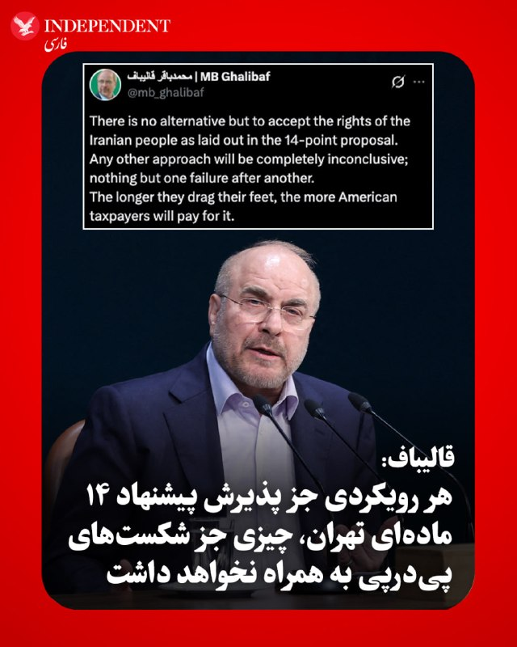

♦️محمدباقر قالیباف، رئیس مجلس شورای اسلامی، روز دوشنبه با انتشار پیامی در اکس، بر ضرورت پذیرش شروط تهران تاکید کرد و نوشت: «هیچ جایگزینی جز پذیرش حقوق ملت ایران، آن‌گونه که در پیشنهاد ۱۴ ماده‌ای آمده است، وجود ندارد.» او با هشدار نسبت به بی‌نتیجه بودن رویکردهای جایگزین مدعی شد که هر مسیر دیگری «کاملا بی‌سرانجام خواهد بود و چیزی جز شکست‌های پی‌درپی به همراه نخواهد داشت.» قالیباف همچنین خطاب به مقامات آمریکایی خاطرنشان کرد که «هرچه بیشتر در این امر تعلل کنند، مالیات‌دهندگان آمریکایی هزینه بیشتری برای آن پرداخت خواهند کرد.»
‌🇸🇦 Indypersian

🤖 @VahidOOnLine

## VahidOOnLine — post 239589

  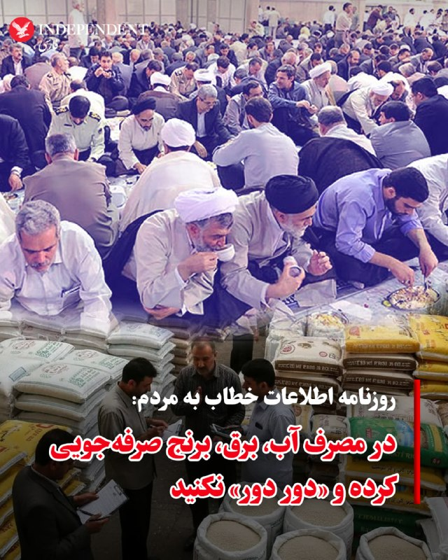

♦️روزنامه اطلاعات در یادداشتی با اشاره به ادامه جنگ، تحریم‌ها و محدودیت‌های دولت، از مردم خواست در مصرف منابعی مانند آب، برق، سوخت و مواد غذایی صرفه‌جویی کنند.
این روزنامه با انتقاد از برخی رفتارهای مصرفی نوشت در شرایطی که حمل‌ونقل عمومی در دسترس است، استفاده از خودروهای تک‌سرنشین یا «دور دور»های تفریحی ضرورتی ندارد و به افزایش مصرف سوخت دامن می‌زند.
اطلاعات همچنین به موضوع مصرف مواد غذایی پرداخت و تاکید کرد مصرف بیش از اندازه اقلامی مانند برنج و گندم، در کنار الگوهای تغذیه ناسالم، می‌تواند به بروز بیماری‌ها، کاهش طول عمر و افزایش هزینه‌های درمانی منجر شود.
‌🇸🇦 Indypersian

🤖 @VahidOOnLine

## VahidOOnLine — post 239588

  <a href="telegram/content/VahidOOnLine_239588_1778536840.mp4" target="_blank">🎬 Download video</a>

‌
محمدباقر قالیباف، رئیس مجلس شورای اسلامی، در پیامی به زبان انگلیسی در شبکه اکس نوشت «هیچ» جایگزینی جز پذیرش «طرح ۱۴ ماده‌ای» وجود ندارد.

قالیباف افزود:
«هر رویکرد دیگری کاملاً بی‌نتیجه خواهد بود و چیزی جز شکست‌های پی‌درپی به همراه نخواهد داشت. هرچه بیشتر وقت‌کشی کنند، هزینه بیشتری بر دوش مالیات‌دهندگان آمریکایی گذاشته خواهد شد.»
‌🏁 🇬🇧 ManotoTV

🤖 @VahidOOnLine

## VahidOOnLine — post 239587

  <a href="telegram/content/VahidOOnLine_239587_1778536841.mp4" target="_blank">🎬 Download video</a>

تماسی از چنارشاهیجان کازرون:
از جاویدنامان علیرضا نادری، عارف براتی، فرزانه ساسانی‌پور، بهبود حسن‌زاده، جبار پناهی و آنیسا هوشنگی گفت…
‌🏁 🇬🇧 ManotoTV

🤖 @VahidOOnLine

## VahidOOnLine — post 239586

  

♦️«سی‌بی‌اس» روز دوشنبه، ۲۱ اردیبهشت‌ماه، گزارش داد که پاکستان برخلاف نقش خود به عنوان میانجی دیپلماتیک میان تهران و واشنگتن، به طور مخفیانه اجازه داده است هواپیماهای نظامی ایران در پایگاه‌های هوایی این کشور مستقر شوند تا از حملات هوایی آمریکا در امان بمانند. بر اساس گزارش منابع آگاه در دولت ایالات متحده، تنها چند روز پس از اعلام آتش‌بس موقت توسط دونالد ترامپ، رئیس جمهوری آمریکا، در اوایل آوریل، چندین فروند هواپیما از جمله یک هواپیمای شناسایی و جاسوسی مدل «آر-۱۳۰» (RC-130) نیروی هوایی ایران در پایگاه هوایی «نورخان» پاکستان، واقع در نزدیکی شهر راولپندی، دیده شده‌اند. هم‌زمان گزارش‌هایی از اعزام هواپیماهای غیرنظامی ایران به افغانستان نیز منتشر شده است که به نظر می‌رسد بخشی از تلاش گسترده تهران برای حفاظت از دارایی‌های هوانوردی و نظامی باقی‌مانده خود در میانه درگیری‌های اخیر باشد.
همزمان، مقامات ارشد پاکستان این ادعاها را به شدت رد کرده‌اند. یک مقام عالی‌رتبه پاکستانی در گفتگو با «سی‌بی‌اس نیوز» تاکید کرد که پایگاه هوایی نورخان در قلب شهر واقع شده و استقرار ناوگان بزرگی از هواپیماهای خارجی در چنین مکانی غیرممکن است که از دید عموم پنهان بماند. با این حال، تحلیلگران آمریکایی بر این باورند که این جابه‌جایی‌های استراتژیک نشان‌دهنده تلاش رژیم ایران برای بهره‌گیری از روابط منطقه‌ای جهت کاهش آسیب‌پذیری ناوگان هوایی خود در برابر فشارهای نظامی و محاصره اعمال شده توسط واشنگتن است.
‌🇸🇦 Indypersian

🤖 @VahidOOnLine

## VahidOOnLine — post 239585

  

مجتبی ذوالنوری، عضو کمیسیون حقوقی مجلس، گفت: «لازم نیست در تنگه هرمز باشیم تا هر شناوری را که از آنجا رد می‌شود، بزنیم. از سمنان و مشهد و تهران می‌زنیم. چند شناور که آنجا غرق شود، خود تنگه بسته می‌شود. روی بحث مین‌ریزی کار کردیم و نجابت به خرج دادیم از این حق استفاده نکردیم.»
‌🏁 🇬🇧 IranintlTV

🤖 @VahidOOnLine

## VahidOOnLine — post 239584

  

وال استریت ژورنال به نقل از منابع مطلع گزارش داد که امارات متحده عربی حملات نظامی علیه جمهوری اسلامی انجام داده است؛ اقدامی که این کشور را در جایگاه یکی از طرف‌های فعال در جنگ قرار می‌دهد.

در این گزارش آمده است نیروهای نظامی این کشور به جنگنده‌های ساخت غرب و شبکه‌های نظارتی پیشرفته مجهز هستند و این حملات نشان می‌دهد امارات متحده عربی اکنون تمایل بیشتری دارد از این توانمندی‌ها برای حفاظت از قدرت اقتصادی و نفوذ رو‌به‌گسترش خود در سراسر خاورمیانه استفاده کند.

وال استریت ژورنال افزود که این حملات شامل حمله به یک پالایشگاه در جزیره لاوان ایران در خلیج فارس بوده که در اواسط فروردین انجام شده است؛ امارات به‌طور علنی انجام این حملات را تایید نکرده است.
در بخش دیگری از این گزارش آمده است که امارات متحده عربی اکنون تهران را تهدیدی مستقیم علیه ثبات و مدل اقتصادی خود می‌داند. همچنین براساس گمانه‌زنی‌ها، گفته می‌شود امارات متحده عربی با استفاده از جنگنده‌های میراژ فرانسوی و پهپادهای چینی متعلق به خود، در داخل ایران عملیات انجام داده است.
‌🏁 🇬🇧 IranintlTV

🤖 @VahidOOnLine

## VahidOOnLine — post 239583

  

♦️همزمان با افزایش تنش‌ها میان تهران و واشنگتن، مجتبی ذوالنور، عضو کمیسیون قضایی و حقوقی مجلس، در گفتگو با شبکه خبر با اشاره به ویژگی‌های جغرافیایی تنگه هرمز گفت عرض این تنگه در باریک‌ترین نقطه حدود ۴۵ کیلومتر است، اما همه این محدوده قابل کشتیرانی نیست. به گفته او، بخش‌هایی از مسیر به‌دلیل عمق کم و بستر صخره‌ای، به‌ویژه در نزدیکی سواحل عمان و جزیره سلامه، محدودیت عبور دارند و عملا مسیرهای کشتیرانی به نواحی مشخصی محدود می‌شود.
ذوالنور همچنین با اشاره به موقعیت راهبردی ایران در این منطقه افزود آب‌های سرزمینی ایران، که حدود ۱۲ مایل دریایی (نزدیک به ۲۲ کیلومتر) را شامل می‌شود، بخش مهمی از مسیر عبور کشتی‌ها را پوشش می‌دهد. او مدعی شد ایران توان هدف قرار دادن شناورها را حتی از فواصل دور دارد و تأکید کرد هر شناوری که بخواهد از تنگه هرمز عبور کند را می‌توانیم از سمنان، تهران و مشهد بزنیم.
او همچنین به موضوع توانمندی‌های مین‌ریزی در خلیج فارس اشاره کرد و گفت ایران تاکنون از این ظرفیت استفاده نکرده است.
‌🇸🇦 Indypersian

🤖 @VahidOOnLine

## VahidOOnLine — post 239582

  

♦️وزارت خزانه‌داری ایالات متحده، روز دوشنبه، ۲۱ اردیبهشت‌ماه، در بیانیه‌ای رسمی اعلام کرد که پاسخ اخیر تهران به پیشنهاد دیپلماتیک واشنگتن، نه‌تنها از نظر سیاسی غیرقابل‌قبول است، بلکه با استانداردهای لازم برای لغو تحریم‌های مالی و اقتصادی نیز همخوانی ندارد. این وزارتخانه تاکید کرد که رویکرد فعلی ایران مانع از هرگونه گشایش در مسیر مبادلات بین‌المللی و آزادسازی دارایی‌های بلوکه شده می‌شود و تا زمانی که تعهدات شفافی در حوزه برنامه هسته‌ای ارائه نشود، فشارها بر شبکه مالی این کشور ادامه خواهد یافت.
در همین راستا، اسکات بسنت، وزیر خزانه‌داری دولت دونالد ترامپ، در اکس با بازنشر این بیانیه، موضعی قاطعانه اتخاذ کرد. او با اشاره به اینکه پاسخ تهران نشان‌دهنده عدم تمایل این کشور به همکاری واقعی است، نوشت: «در حالی که دولت ترامپ با حسن نیت مسیری برای دیپلماسی باز کرد، تهران با پاسخی کاملا غیرقابل‌قبول به میز مذاکره بازگشته است.» بسنت تاکید کرد که وزارت خزانه‌داری، سیاست‌های مالی را به گونه‌ای تنظیم خواهد کرد که جمهوری اسلامی متوجه شود عدم پذیرش توافق، هزینه‌های اقتصادی سنگین و غیرقابل‌جبرانی برای نظام پولی و بانکی این کشور به همراه خواهد داشت. او نوشت: «زمان آن رسیده که تهران متوجه شود هزینه لجاجت، فروپاشی کامل اقتصادی است».
‌🇸🇦 Indypersian

🤖 @VahidOOnLine

## VahidOOnLine — post 239581

  <a href="telegram/content/VahidOOnLine_239581_1778536848.mp4" target="_blank">🎬 Download video</a>

وزارت خزانه‌داری آمریکا اعلام کرد ۱۲ فرد و نهاد را به‌دلیل نقش در فروش و انتقال نفت جمهوری اسلامی توسط سپاه پاسداران به چین تحریم کرده است.

در بیانیه دفتر کنترل دارایی‌های خارجی وزارت خزانه‌داری آمریکا آمده سپاه پاسداران برای پنهان کردن نقش خود در فروش نفت و انتقال درآمدها به جمهوری اسلامی، از شرکت‌های پوششی در کشورهای مختلف استفاده می‌کند.

اسکات بسنت، وزیر خزانه‌داری آمریکا، گفت: «در حالی که ارتش ایران تلاش می‌کند خود را بازسازی کند، عملیات “خشم اقتصادی” به محروم کردن جمهوری اسلامی از منابع مالی برنامه‌های تسلیحاتی، نیروهای نیابتی و جاه‌طلبی‌های هسته‌ای ادامه خواهد داد.»

وزارت خزانه‌داری آمریکا همچنین اعلام کرد جمهوری اسلامی به‌جای استفاده از درآمدهای نفتی برای حمایت از مردم ایران، این منابع را صرف توسعه تسلیحات، حمایت از گروه‌های نیابتی و تأمین مالی نیروهای امنیتی می‌کند.

در میان افراد تحریم‌شده، نام احمد محمدی‌زاده، رئیس قرارگاه نفتی شهید پورجعفری سپاه، صمد فتحی سلامی، مسئول مالی این قرارگاه، و محمدرضا اشرفی گهی، مسئول بازرگانی آن، دیده می‌شود.

همچنین چند شرکت مستقر در هنگ‌کنگ، دبی، عمان و شارجه به اتهام همکاری در انتقال نفت ایران و دور زدن تحریم‌ها هدف تحریم قرار گرفته‌اند.

وزارت خزانه‌داری آمریکا هشدار داد هر شرکت یا مؤسسه مالی خارجی که با شبکه‌های مرتبط با سپاه پاسداران همکاری کند، ممکن است هدف تحریم‌های ثانویه آمریکا قرار گیرد.
‌🏁 🇬🇧 ManotoTV

🤖 @VahidOOnLine

## VahidOOnLine — post 239580

  

سی‌بی‌اس نیوز به نقل از مقام‌های آمریکایی گزارش داد که پاکستان به‌طور غیررسمی اجازه داده است برخی هواپیماهای نظامی ایران در فرودگاه‌های این کشور مستقر شوند؛ اقدامی که احتمالا آن‌ها را از حملات هوایی آمریکا مصون می‌سازد.
براساس این گزارش، ایران همچنین برخی هواپیماهای غیرنظامی خود را به افغانستان منتقل کرده است، هرچند مشخص نیست که آیا در میان آن‌ها هواپیماهای نظامی نیز وجود دارد یا خیر.
‌🏁 🇬🇧 IranintlTV

🤖 @VahidOOnLine

## VahidOOnLine — post 239579

  <a href="telegram/content/VahidOOnLine_239579_1778536851.mp4" target="_blank">🎬 Download video</a>

دونالد ترامپ در کاخ سفید با تیم امنیتی و فرماندهان نظامی آمریکا درباره ادامه مسیر جنگ با جمهوری اسلامی جلسه برگزار می‌کند. او گفته در داخل حکومت ایران اختلاف وجود دارد؛ «میانه‌روها» دنبال توافق‌اند اما «دیوانه‌ها» می‌خواهند جنگ ادامه پیدا کند.
‌🏁 🇬🇧 IranintlTV

🤖 @VahidOOnLine

## VahidOOnLine — post 239577

  

ایالات متحده تحریم‌های جدیدی مرتبط با جمهوری اسلامی علیه سه فرد و ۹ نهاد، از جمله چهار نهاد مستقر در هنگ‌کنگ، ۴ نهاد در امارات متحده عربی و یک نهاد در عمان وضع کرد.

طبق این گزارش، محمدرضا اشرفی، صمد فتحی سلامی و احمد محمدی‌زاده به دلیل ارتباط با سپاه پاسداران تحریم شده‌اند.
‌🏁 🇬🇧 IranintlTV

🤖 @VahidOOnLine

## VahidOOnLine — post 239576

  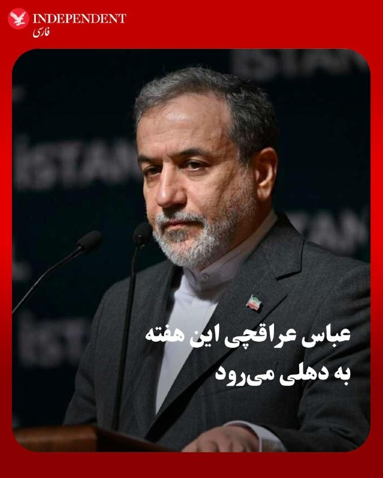

♦️یک منبع منطقه‌ای به شبکه تلویزیونی سی‌ان‌ان گفت که عباس عراقچی، وزیر امور خارجه جمهوری اسلامی قرار است این هفته برای شرکت در نشست وزرای خارجه بریکس، روزهای ۲۴ و ۲۵ اردیبهشت (۱۴ و ۱۵ مه) به دهلی‌نو سفر کند.

این منبع افزود: «این سفر در شرایطی انجام می‌شود که تحولات و تنش‌های اخیر در منطقه، به‌ویژه در غرب آسیا، به یکی از محورهای اصلی رایزنی‌های دیپلماتیک میان کشورهای عضو بریکس تبدیل شده است.»

نشست وزرای خارجه بریکس با میزبانی هند برگزار می‌شود و انتظار می‌رود وزیران خارجه کشورهای عضو درباره موضوعاتی از جمله تحولات منطقه‌ای، همکاری‌های اقتصادی، چندجانبه‌گرایی و امنیت بین‌المللی گفتگو کنند.
‌🇸🇦 Indypersian

🤖 @VahidOOnLine

## VahidOOnLine — post 239575

  <a href="telegram/content/VahidOOnLine_239575_1778536855.mp4" target="_blank">🎬 Download video</a>

نمایشگاه عکس «حکومت اعدام» پس از یک ماه برگزاری در شهرهای برلین، لاهه، آمستردام، بروکسل، پاریس و ژنو، روز گذشته در آخرین ایستگاه خود در شهر کلن آلمان به کار خود پایان داد.

این نمایشگاه با هدف جلب توجه افکار عمومی اروپا به نقض گسترده حقوق بشر و موج اعدام‌ها در ایران برگزار شد و تصاویری از قربانیان اعدام‌شده طی ۴۸ سال گذشته، در کنار زندانیانی که اکنون در خطر اجرای حکم اعدام قرار دارند، به نمایش گذاشت.

همزمان، پرفرمنس «حکومت اعدام» نیز در تمامی روزهای برگزاری اجرا شد؛ اجرایی نمادین درباره اعدام، سرکوب و کشتار معترضان و جوانان ایران در دهه‌های گذشته.

این پروژه تلاش داشت با استفاده از تصویر، هنر و روایت، توجه رسانه‌ها، افکار عمومی و سیاستمداران اروپایی را به ادامه روند اعدام‌ها در جمهوری اسلامی جلب کند.
‌🏁 🇬🇧 ManotoTV

🤖 @VahidOOnLine

## VahidOOnLine — post 239574

  <a href="telegram/content/VahidOOnLine_239574_1778536857.mp4" target="_blank">🎬 Download video</a>

⭕️ارکستر ملی عربستان سعودی در قلب تاریخی رم روی صحنه رفت

📌در این برنامه، ۳۲ نوازنده از ارکستر و گروه کُر ملی عربستان سعودی در کنار ۳۰ عضو ارکستر جوانان «فونتانه دی روما» به رهبری مارچلو روتا روی صحنه رفتند و آندره‌آ بوچلی به‌عنوان مهمان ویژه حضور داشت

♦️کمیسیون موسیقی عربستان سعودی روز جمعه تور جهانی «شگفتی‌های ارکستر سعودی» را در شهر رم روی صحنه برد. به گزارش عرب نیوز، این اجرای بزرگ در معبد ونوس و رم، واقع در پارک باستان‌شناسی کولوسئوم، برگزار شد و آندره‌آ بوچلی، خواننده مشهور ایتالیایی، نیز به‌عنوان مهمان ویژه حضور داشت. این کنسرت با هدف نمایش سنت‌های موسیقی عربستان سعودی و ایتالیا و تقویت تبادل فرهنگی میان دو کشور برگزار شد.
بیشتر بخوانید...

‌🇸🇦 Indypersian

🤖 @VahidOOnLine

## VahidOOnLine — post 239573

  

محمدباقر قالیباف، رییس مجلس در شبکه ایکس نوشت نیروهای مسلح جمهوری اسلامی آماده «پاسخگویی درس‌آموز» به هر حمله‌ای هستند؛ ما برای تمام گزینه‌ها آماده هستیم، «شگفت‌زده خواهند شد.»

او افزود: «استراتژی اشتباه و تصمیم‌های اشتباه، همیشه نتیجه اشتباه خواهد داشت، همه دنیا قبلا این را فهمیده‌اند.»
‌🏁 🇬🇧 IranintlTV

🤖 @VahidOOnLine

## VahidOOnLine — post 239572

  

♦️محمدباقر قالیباف، رئیس مجلس شورای اسلامی و رئیس هیات جمهوری اسلامی در مذاکرات با آمریکا، دوشنبه ۲۱ اردیبهشت‌ماه در شبکه اجتماعی اکس نوشت نیروهای مسلح جمهوری اسلامی آماده «پاسخگویی درس‌آموز» به هر تجاوزی هستند.

قالیباف نوشت: «استراتژی اشتباه و تصمیم‌های اشتباه همیشه نتیجه اشتباه خواهد داشت. همه دنیا قبلا این را فهمیده‌اند.»

او افزود: «ما برای تمام گزینه‌ها آماده هستیم؛ شگفت‌زده خواهند شد.»
‌🇸🇦 Indypersian

🤖 @VahidOOnLine

## mwarmonitor — post 8935

🔴تحلیل اختصاصی کانال: دیپلماسی در لبه پرتگاه؛ استراتژی «تأدیب» یا «تغییر رژیم»؟

📝گزارش اخیر «باراک راوید» از وضعیت کنونی روابط ایران و آمریکا، نشان‌دهنده عبور از مرحله «چانه‌زنی سخت» و ورود به فاز «رویارویی کنترل‌شده» است. در ادامه، ابعاد مختلف این بن‌بست سیاسی تحلیل می‌شود:

۱. کالبدشکافی استراتژی ترامپ: «نقشه ساده» برای معامله‌ای پیچیده
ترامپ در سخنان خود از مفهومی به نام «بهترین نقشه تاریخ» یاد می‌کند که در ظاهر ساده است (ایران نباید سلاح هسته‌ای داشته باشد)، اما در باطن بر پایه تخریب کامل اهرم‌های قدرت طرف مقابل بنا شده است.

تاکتیک گوش‌مالی (Adjustment): استفاده از عبارت «کمی آن‌ها را تنظیم خواهد کرد» نشان می‌دهد که ترامپ به دنبال جنگ کلاسیک و اشغال‌گرایانه نیست؛ بلکه به دنبال حملات جراحی‌گونه (Surgical Strikes) برای تحمیل اراده سیاسی است.

تشدید دوقطبی داخلی ایران: ادعای ترامپ مبنی بر تقسیم رهبری ایران به «میانه‎‌روها و دیوانگان»، یک جنگ روانی هدفمند برای ایجاد گسل در ساختار تصمیم‌گیری تهران در لحظات بحرانی است.

۲. بن‌بست هسته‌ای؛ خط قرمزهای متقاطع
شکاف اصلی در مذاکرات روز یکشنبه، بر سر «خروج ذخایر اورانیوم» بوده است.
موضع ایران: تهران با غیرقابل مذاکره خواندن غنی‌سازی، به دنبال حفظ «آستانه هسته‌ای» به عنوان تنها کارت بازی باقی‌مانده است.
موضع ترامپ: او معتقد است ایرانِ بدون توان نظامی (طبق ادعای او)، حق داشتنِ اهرم هسته‌ای را ندارد. تعبیر «آتش‌بس در کما»، سیگنال واضحی است که آمریکا دیگر «زمان» را به عنوان یک فاکتور دیپلماتیک به رسمیت نمی‌شناسد.

۳. گزینه‌های نظامی روی میز: از «پروژه آزادی» تا «تأسیسات زیربنایی»
در صورت شکست کامل دیپلماسی پس از سفر ترامپ به چین، سه سناریوی نظامی محتمل است:
محاصره دریایی و تنگه هرمز: ازسرگیری «پروژه آزادی» به معنای به چالش کشیدن حاکمیت دریایی ایران و قطع شریان‌های باقی‌مانده اقتصادی است.
تکمیل بانک اهداف: اشاره به ۲۵ درصد باقی‌مانده از اهداف شناسایی شده، نشان‌دهنده آمادگی پنتاگون برای هدف قرار دادن زیرساخت‌های حیاتی (انرژی و مخابرات) است.
سناریوی خطرناک اسرائیل: عملیات نیروهای ویژه برای تصرف ذخایر اورانیوم، اگرچه از نظر ترامپ «پرخطر» توصیف شده، اما وجود آن در لیست بررسی، نشان‌دهنده سطح بی‌سابقه تنش است.

۴. متغیر چین؛ میانجی‌گری یا چراغ سبز؟
سفر ترامپ به چین نقطه عطف این بحران است. ترامپ به دنبال آن است که با استفاده از نفوذ اقتصادی چین بر ایران، تهران را به پذیرش شروط خود وادار کند.

🔵 اگر شی‌جین‌پینگ نتواند ایران را به عقب‌نشینی متقاعد کند، ترامپ احتمالاً از این «شکستِ دیپلماتیک» به عنوان مجوزی برای اقدام نظامی استفاده خواهد کرد تا به افکار عمومی نشان دهد «تمامی راه‌های غیرنظامی» را طی کرده است.

📌 پارادوکس «تاج مآبانه»
لحن ترامپ (استفاده از استعاره‌های پزشکی و تجاری) نشان می‌دهد که او با بحران ایران مانند یک «دارایی ورشکسته» در تجارت املاک برخورد می‌کند. او معتقد است ایران در ضعیف‌ترین موضع تاریخی خود قرار دارد و به همین دلیل، تمایلی به دادن امتیاز کوچک هم ندارد.

🔴ما اکنون در وضعیت «انتظار فعال» هستیم. بازه زمانی بازگشت ترامپ از چین (آخر هفته میلادی)، بحرانی‌ترین زمان برای تعیین تکلیف صلح یا جنگ خواهد بود. ایران میان دو گزینه «پذیرش خلع سلاح غنی‌سازی» (که آن را تسلیم می‌نامد) و «تحمل موج جدید حملات نظامی»، با سخت‌ترین تصمیم دهه اخیر خود روبروست.

☑️ تأکید ترامپ بر کشته شدن ۴۲,۰۰۰ نفر در اعتراضات، نشان‌دهنده آن است که او قصد دارد هرگونه اقدام نظامی احتمالی را تحت پوشش «حمایت از مردم» و «مسائل حقوق بشری» مشروعیت‌بخشی کند.

@mwarmonitor

## mwarmonitor — post 8934

  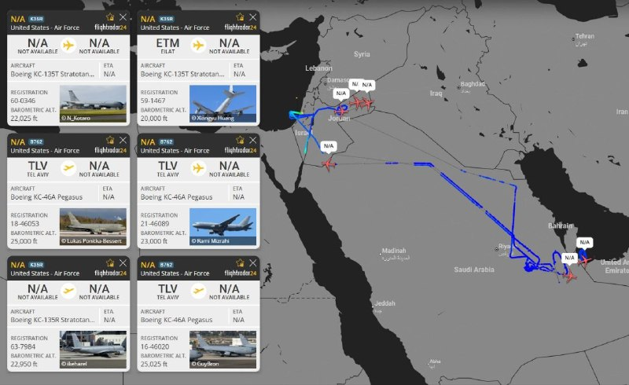

✈️📡 هواپیمای RC-135V Rivet Joint هواپیمای شناسایی و شنود الکترونیکی (جمع‌آوری اطلاعات سیگنالی و ارتباطی).(شماره 64-14848 از پایگاه سودا بی یونان) بر فراز عربستان سعودی مشاهده شد؛ در حال بازگشت از خلیج فارس. (تداخل شدید GPS در منطقه میان ریاض، امارات متحده…

## mwarmonitor — post 8933

  <a href="telegram/content/mwarmonitor_8933_1778536862.mp4" target="_blank">🎬 Download video</a>

📝 این انگل‌های وارداتی حشدالشعبی که معلوم نیست چطور فارسی‌نفهمیده برای خامنه‌ای زجه می‌زنند، در واقع آینه دقِ آن حرامزاده‌های ارتشی و بزدلانِ پادگان‌نشینی هستند که شرفشان را با جیره و مواجب معامله کرده‌اند. خاک بر سر آن نظامیانی که دیروز مدعی بودند یک گردان کشته دادند تا کسی به ناموس ایران نگاه چپ نکند، اما حالا مثل هرزه‌های ترسو در سوراخ‌های خود خزیده‌اند و فرشِ زیر پای وحوشِ بیگانه شده‌اند. شما نه پاسدار مرز، که نگهبان ذلت و تماشاگرِ حقارتِ ملت هستید؛ بی‌رگ‌هایی که در ازای یک لقمه نانِ آغشته به خون، عزت و خاک وطن را به این گله‌های وارداتی واگذار کردید.

@mwarmonitor

## mwarmonitor — post 8932

🇦🇪امارات متحده عربی به‌طور مخفیانه حملات نظامی علیه ایران انجام داده است، به گفته منابع - وال‌استریت ژورنال

🔸این حملات شامل حمله به یک پالایشگاه در جزیره لاوان ایران بوده است.

@mwarmonitor

## mwarmonitor — post 8931

🔴رئیس‌جمهور ترامپ تمایل دارد دستور ازسرگیری درگیری با ایران را صادر کند — کانال ۱۲ اسرائیل

@mwarmonitor

## mwarmonitor — post 8930

💠امروز، دفتر کنترل دارایی‌های خارجی وزارت خزانه‌داری آمریکا (OFAC)، ۱۲ فرد و نهاد را به دلیل نقش آن‌ها در تسهیل فروش و انتقال نفت ایران توسط سپاه پاسداران انقلاب اسلامی (IRGC) به جمهوری خلق چین تحریم کرد.

💠سپاه پاسداران برای پنهان‌سازی نقش خود در فروش نفت و انتقال درآمدها به حکومت ایران، به شرکت‌های پوششی در حوزه‌های اقتصادی سهل‌گیر متکی است. به‌جای آنکه این درآمدها صرف حمایت از مردم در مضیقه ایران شود، حکومت ایران آن را به سمت توسعه تسلیحات، حمایت از نیروهای نیابتی تروریستی، و تأمین مالی نیروهای امنیتی که آزادی‌های شهروندان را سرکوب می‌کنند هدایت می‌کند.

🔸اسکات بسنت وزیر خزانه‌داری آمریکا ؛

🔘در حالی که نیروهای نظامی ایران به‌شدت در تلاش برای بازسازی خود هستند، کارزار «خشم اقتصادی» همچنان به محروم کردن رژیم از منابع مالی مورد نیاز برای برنامه‌های تسلیحاتی، نیروهای نیابتی تروریستی و جاه‌طلبی‌های هسته‌ای ادامه خواهد داد.

🔘وزارت خزانه‌داری به تلاش خود برای قطع دسترسی رژیم ایران به شبکه‌های مالی که از آن‌ها برای انجام اقدامات تروریستی و بی‌ثبات کردن اقتصاد جهانی استفاده می‌کند، ادامه خواهد داد.

@mwarmonitor

## mwarmonitor — post 8929

⚠️افشاگری به نقل از CBSNews: 🔴منابعی به Jennifer Jacobs و JimLaPorta گفتند که در حالی که پاکستان خود را به‌عنوان کانال دیپلماتیک میان تهران و واشینگتن مطرح می‌کرد، به‌طور پنهانی به هواپیماهای نظامی ایران اجازه داد در خاک این کشور مستقر شوند؛ اقدامی که می‌توانست…

## mwarmonitor — post 8928

⚠️افشاگری به نقل از CBSNews:

🔴منابعی به Jennifer Jacobs و JimLaPorta گفتند که در حالی که پاکستان خود را به‌عنوان کانال دیپلماتیک میان تهران و واشینگتن مطرح می‌کرد، به‌طور پنهانی به هواپیماهای نظامی ایران اجازه داد در خاک این کشور مستقر شوند؛ اقدامی که می‌توانست آن‌ها را از حملات هوایی آمریکا مصون نگه دارد.

🔴چند روز پس از آنکه دونالد ترامپ در اوایل آوریل آتش‌بس را اعلام کرد، تهران چندین فروند هواپیما را به پایگاه هوایی نورخان متعلق به نیروی هوایی پاکستان منتقل کرد.

🔴در میان تجهیزات نظامی منتقل‌شده، یک فروند RC-130 نیروی هوایی ایران نیز وجود داشت؛ گونه‌ای شناسایی و جمع‌آوری اطلاعات از هواپیمای ترابری تاکتیکی C-130 هرکولس.

@mwarmonitor

## mwarmonitor — post 8927

🇺🇦یکی از نزدیک‌ترین متحدان ولودیمیر زلنسکی و رئیس سابق دفتر او، آندری یرماک، در پی یک تحقیق گسترده درباره فساد مالی، از سوی دادستانی ویژه مبارزه با فساد ابلاغیه «ظن ارتکاب جرم» دریافت کرده است.

🔸او متهم است که ۴۶۰ میلیون گریونا (بیش از ۱۰ میلیون دلار آمریکا) از منابع مالیِ به‌طور غیرقانونی به‌دست‌آمده را پول‌شویی کرده است. همچنین به تعدادی از افراد مظنون دیگر نیز ابلاغیه‌های مشابهی داده شده است.

🔹یرماک تاکنون از اظهار نظر درباره این اتهامات خودداری کرده است.

@mwarmonitor

## mwarmonitor — post 8926

  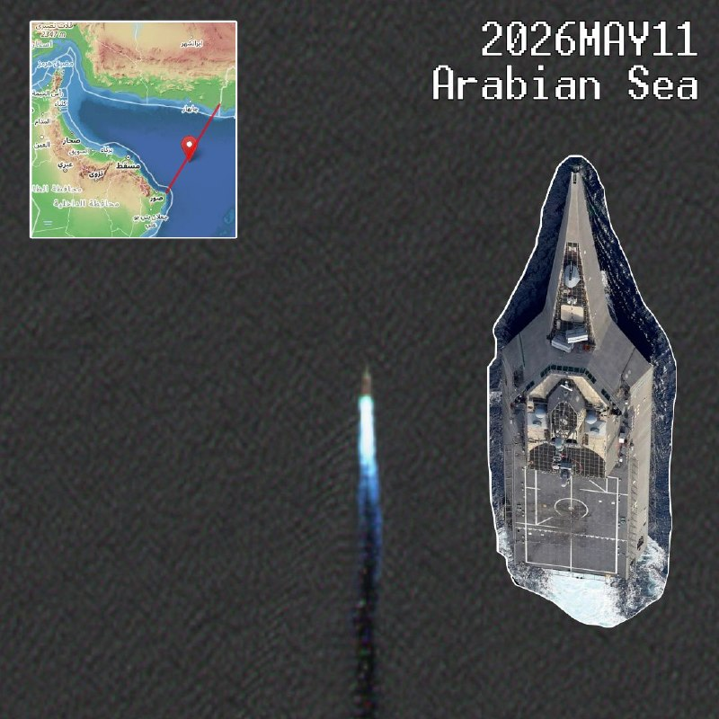

یک کشتی رزمی ساحلی کلاس Independence نیروی دریایی ایالات متحده 🇺🇸 امروز در مختصات زیر مشاهده شد:

23.4636, 60.5955 📍

🔸این شناور که به بسته‌های مقابله با مین (MCM) مجهز است، اکنون نقشی محوری در عملیات علیه ایران دارد و با انجام کشف و خنثی‌سازی مین‌ها از فاصله امن از تلاش‌های محاصره دریایی پشتیبانی می‌کند.

@mwarmonitor

## mwarmonitor — post 8925

🚨بر اساس یک نظرسنجی Reuters / Ipsos که روز دوشنبه تکمیل شد، دو نفر از هر سه آمریکایی معتقدند رئیس‌جمهور دونالد ترامپ به‌طور شفاف توضیح نداده است که چرا کشور وارد جنگ با ایران شده است.
🔸این نظرسنجی همچنین نشان می‌دهد با وجود این انتقادها، میزان محبوبیت ترامپ اندکی افزایش یافته و از پایین‌ترین سطح دوره ریاست‌جمهوری‌اش بالاتر رفته است.

🔹این نظرسنجی چهارروزه نگرانی‌های عمیق درباره جهش قیمت بنزین را آشکار کرد و همچنین نشان داد بسیاری از رأی‌دهندگان مشکلات خود را متوجه متحدان جمهوری‌خواه ترامپ می‌دانند؛ متحدانی که قرار است در انتخابات میان‌دوره‌ای کنگره در ماه نوامبر برای حفظ اکثریت‌های خود رقابت کنند.

@mwarmonitor

## mwarmonitor — post 8924

  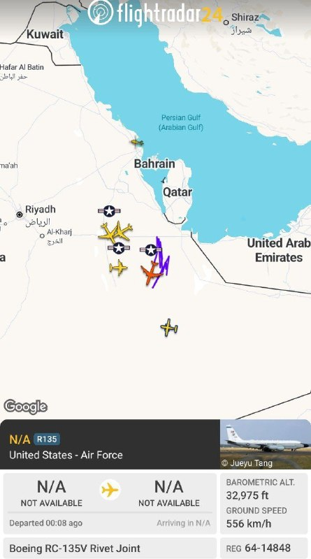

✈️📡 هواپیمای RC-135V Rivet Joint هواپیمای شناسایی و شنود الکترونیکی (جمع‌آوری اطلاعات سیگنالی و ارتباطی).(شماره 64-14848 از پایگاه سودا بی یونان) بر فراز عربستان سعودی مشاهده شد؛ در حال بازگشت از خلیج فارس.
(تداخل شدید GPS در منطقه میان ریاض، امارات متحده عربی و قطر)

@mwarmonitor

## mwarmonitor — post 8923

🇮🇱بنیامین نتانیاهو ؛ «تنها کسی که رئیس موساد را منصوب می‌کند، نخست‌وزیر است. طبق قانون، موساد و شین‌بت مستقیماً زیر نظر نخست‌وزیر هستند. نخست‌وزیر است که رؤسای آن‌ها را تعیین می‌کند؛ نه مشاور حقوقی، نه دیوان عالی، نه رسانه‌ها. 🔸سرتیپ رومن گافمن یک جنگجوی…

## mwarmonitor — post 8922

  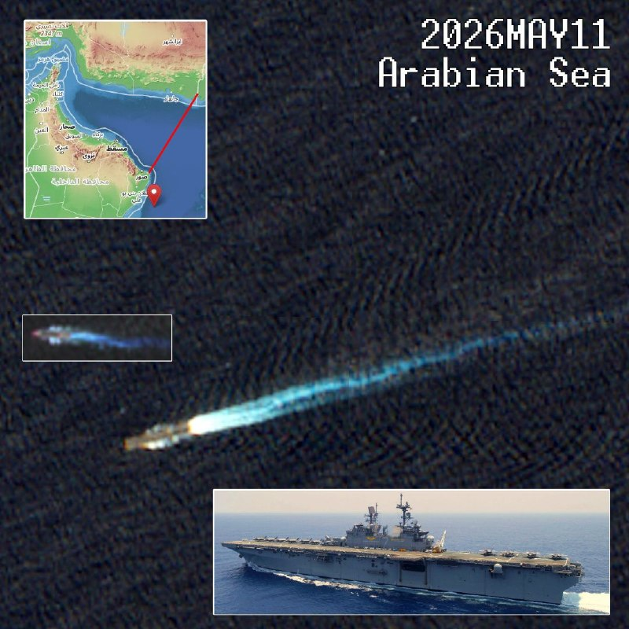

ناو USS TRIPOLI 🇺🇸 و یک ناوشکن امروز در دریای عرب دیده شدند

در مختصات: 21.3026, 59.9829

در فاصله ۶۶ کیلومتری از عمان 🇴🇲

@mwarmonitor

## pm_afshaa — post 90601

🔥رفقا هانا که همیشه تبلیغشو کردم فقط مخصوص یوزرای ما تخفیف گذاشته👇🏼 1 Gig = 280,000 T 2 Gig = 560,000 T 3 Gig = 800,000 T 5 Gig = 1,200,000 T 10 Gig = 2,200,000T 20 Gig = 4,000,000T 💎پرداخت ریال ، کارت به کارت 💵واریز با ارز دیجیتال ( ترون ) 📌قابلیت…

## pm_afshaa — post 90600

🔥رفقا هانا که همیشه تبلیغشو کردم فقط مخصوص یوزرای ما تخفیف گذاشته👇🏼

1 Gig = 280,000 T
2 Gig = 560,000 T
3 Gig = 800,000 T
5 Gig = 1,200,000 T
10 Gig = 2,200,000T
20 Gig = 4,000,000T

💎پرداخت ریال ، کارت به کارت

💵واریز با ارز دیجیتال ( ترون )

📌قابلیت مشاهده حجم مصرفی
📌نامحدود بودن تعداد کاربران
📌سرعت دانلود به شدت بالا

ایدی جهت خرید👇🏼👇🏼👇🏼👇🏼

@RealHoneyi

## pm_afshaa — post 90599

  <a href="telegram/content/pm_afshaa_90599_1778536869.webm" target="_blank">🎬 Download video</a>

🔴سی‌بی‌اس نیوز به نقل از مقامات آمریکایی: پاکستان علیرغم نقش میانجی، به هواپیماهای نظامی ایران اجازه داد در فرودگاه‌هایش پارک کنن و به طور بالقوه از آنها در برابر حملات هوایی آمریکا محافظت کنه! چند روز پس از اعلام آتش‌بس با ایران توسط ترامپ، ایران چندین فروند…

## pm_afshaa — post 90598

  <a href="telegram/content/pm_afshaa_90598_1778536870.webm" target="_blank">🎬 Download video</a>

🔴سی‌بی‌اس نیوز به نقل از مقامات آمریکایی:
پاکستان علیرغم نقش میانجی، به هواپیماهای نظامی ایران اجازه داد در فرودگاه‌هایش پارک کنن و به طور بالقوه از آنها در برابر حملات هوایی آمریکا محافظت کنه!

چند روز پس از اعلام آتش‌بس با ایران توسط ترامپ، ایران چندین فروند هواپیما رو به پایگاه هوایی «نور خان» نیروی هوایی پاکستان فرستاد. این پایگاه، یک تأسیسات نظامی راهبردی است که درست در حومه شهر راولپندی، شهر پادگانی پاکستان قرار داره. در میان تجهیزات نظامی ارسالی، یک فروند آر سی-۱۳۰ از نیروی هوایی ایران وجود داشت که نوعی هواپیمای شناسایی و گردآوری اطلاعات از فروند لاکهید سی-۱۳۰ هرکولس (هواپیمای ترابری تاکتیکی) محسوب میشه.

💧Rainbet.com the #1 Non-KYC Crypto Casino & Sportsbook @rainbetcom

😁 @Pm_Afshaa

## pm_afshaa — post 90597

  <a href="telegram/content/pm_afshaa_90597_1778536870.webm" target="_blank">🎬 Download video</a>

🔴اسکای‌نیوز:
60 تا از نماینده حزب کارگر خواستار کناره‌گیری کیر استارمر نخست وزیر بریتانیا شدن.

💧 Rainbet.com the #1 Non-KYC Crypto Casino & Sportsbook @rainbetcom

😁 @Pm_Afshaa

## pm_afshaa — post 90596

  <a href="telegram/content/pm_afshaa_90596_1778536871.webm" target="_blank">🎬 Download video</a>

🔴مدیرعامل آرامکو: جنگ ایران و بسته‌ موندن تنگه هرمز باعث شده که یک میلیارد بشکه نفت صادر نشه.

💧 Rainbet.com the #1 Non-KYC Crypto Casino & Sportsbook @rainbetcom

😁 @Pm_Afshaa

## pm_afshaa — post 90595

  <a href="telegram/content/pm_afshaa_90595_1778536872.webm" target="_blank">🎬 Download video</a>

🔴آمریکا تحریم‌های جدیدی علیه 3 فرد و 9 نهاد مرتبط با جمهوری اسلامی اعمال کرد؛ نهادهایی در هنگ‌کنگ، امارات و عمان.

طبق این گزارش، محمدرضا اشرفی، صمد فتحی سلامی و احمد محمدی‌زاده به دلیل ارتباط با سپاه پاسداران تحریم شدن.

💧Rainbet.com the #1 Non-KYC Crypto Casino & Sportsbook @rainbetcom

😁 @Pm_Afshaa

## pm_afshaa — post 90593

  <a href="telegram/content/pm_afshaa_90593_1778536873.webm" target="_blank">🎬 Download video</a>

🔴سازمان رادیو و تلویزیون اسرائیل:
در ساعات اخیر بحث و رایزنی‌هایی با آمریکا درباره ازسرگیری جنگ علیه ایران در حال انجامه.

💧 Rainbet.com the #1 Non-KYC Crypto Casino & Sportsbook @rainbetcom

😁 @Pm_Afshaa

## pm_afshaa — post 90592

  <a href="telegram/content/pm_afshaa_90592_1778536874.webm" target="_blank">🎬 Download video</a>

🔴تسنیم به نقل از منبع نزدیک به تیم مذاکرات: برخلاف اظهارات برخی رسانه‌های غربی، در متن پیشنهادی جمهوری اسلامی هیچ‌گونه پذیرش خروج مواد غنی‌شده هسته‌ای از کشور وجود نداره.

💧 Rainbet.com the #1 Non-KYC Crypto Casino & Sportsbook @rainbetcom

😁 @Pm_Afshaa

## pm_afshaa — post 90591

🔴وزیر دفاع بلژیک: به ابتکار فرانسه و انگلیس برای پاکسازی تنگه هرمز از مین‌های دریایی و بازگشت به دریانوردی آزاد خواهیم پیوست

💧 Rainbet.com the #1 Non-KYC Crypto Casino & Sportsbook @rainbetcom

😁 @Pm_Afshaa

## pm_afshaa — post 90588

🔴پنتاگون تأیید کرد که زیردریایی هسته‌ای آمریکا در مسیر خود به خاورمیانه ست

💧 Rainbet.com the #1 Non-KYC Crypto Casino & Sportsbook @rainbetcom

😁 @Pm_Afshaa

## pm_afshaa — post 90587

باز کصکشا افتادن دارن همه کانفینگارو میزنن

## pm_afshaa — post 90586

قالیباف:نیروهای مسلح ما آماده پاسخ به هر تجاوزی هستند. استراتژی نادرست و تصمیمات اشتباه همیشه به نتایج نادرست منجر می‌شوند. ما برای هر احتمالی آماده‌ایم - آنها شگفت‌زده خواهند شد

💧 Rainbet.com the #1 Non-KYC Crypto Casino & Sportsbook @rainbetcom

😁 @Pm_Afshaa

## pm_afshaa — post 90585

🔴کاخ سفید:ترامپ همه گزینه‌ها را روی میز گذاشته

💧 Rainbet.com the #1 Non-KYC Crypto Casino & Sportsbook @rainbetcom

😁 @Pm_Afshaa

## pm_afshaa — post 90584

🔴رسانه‌های اسرائیلی: گفتگوهایی با آمریکا درباره از سرگیری مبارزه با ایران در جریان است

💧 Rainbet.com the #1 Non-KYC Crypto Casino & Sportsbook @rainbetcom

😁 @Pm_Afshaa

## DEJradio — post 4574

  

👑
📱 شاهزاده رضا پهلوی در نخستین دقایق بامداد سه‌شنبه،در پیامی در شبکهٔ اکس اعلام کردند جمهوری اسلامی طی ۴۷سال گذشته علیه آمریکا و متحدانش جنگ به راه انداخته است. ایشان با اشاره به تضعیف بی‌سابقهٔ رژیم،تأکید کردند مردم ایران آماده‌اند جمهوری اسلامی را سرنگون کنند. شاهزاده رضا پهلوی همچنین نوشتند اتخاذ سیاستی درست در این مقطع حساس،می‌تواند قرن آینده را تغییر دهد. ایشان افزودند که قرار است روز سه‌شنبه در «نشست امنیتی پولیتیکو» دربارهٔ این موضوع گفت‌وگو کنند.

#شاهزاده_رضا_پهلوی
@DEJradio

## DEJradio — post 4573

  <a href="telegram/content/DEJradio_4573_1778536876.mp4" target="_blank">🎬 Download video</a>

🚨
🔸 خبر ۲۱
دوشنبه ۲۱ اردیبهشت ۱۴۰۵

#خبر۲۱
@DEJradio

## DEJradio — post 4572

  <a href="telegram/content/DEJradio_4572_1778536879.mp4" target="_blank">🎬 Download video</a>

🚨
🔸 برای این‌که حرکت اصلیت رو به‌دور از چشم و گوشِ حریف پیش ببری، باید بتونی نگاهش رو از میدان اصلی منحرف کنی؛
مثلاً با یک عملیات فریب ♟

البته عملیات فریب فقط وقتی کارسازه که زنجیره‌ی واکنش‌های حریف رو درست حساب کرده باشی 🧮

در قسمت ششم از «تمام‌رخ» رفتیم سراغ عملیات فریب؛ جایی که دیکوی اگر درست محاسبه نشه، تبدیل می‌شه به اشتباه محاسباتی

#تمام_رخ
@DEJradio

## DEJradio — post 4571

👑🎥 «یک ملت در گروگان»؛ اعتراض ایرانیان استکهلم علیه قطع اینترنت و موج اعدام‌ها

گزارش: بهنام روغنی

#شاهزاده_رضا_پهلوی #استکهلم
@DEJradio

## mamlekate — post 103504

📝 رویترز: نفتکش‌هایی از قطر، امارات متحده عربی و عراق از تنگه‌ هرمز عبور کردند

بررسی داده‌ها و گزارش‌های رسمی نشان می‌دهد عبور نفتکش‌ها و کشتی‌های حامل گاز طبیعی مایع از تنگه هرمز همچنان به‌صورت محدود، موردی و با هماهنگی‌های امنیتی انجام می‌شود. برخی کشتی‌ها با موافقت جمهوری اسلامی و خاموش کردن سیستم‌های رهگیری از این آبراه عبور کرده‌اند.

@mamlekate

## mamlekate — post 103502

الو کشتی نفتکش شرکت ملی نفتکش رو دیشب نزدیک جاسک زدن. کشتی کلاس S هست. اسم اولیه و قدیمی اش سنندج بود. بعد از تحریم ها بارها اسمش عوض شد. خدمه سالم هستن.

@mamlekate مملکته

## VahidOnline — post 75426

  

وزارت خزانه‌داری ایالات متحده، روز دوشنبه، ۲۱ اردیبهشت‌ماه، در بیانیه‌ای رسمی اعلام کرد که پاسخ اخیر تهران به پیشنهاد دیپلماتیک واشنگتن، نه‌تنها از نظر سیاسی غیرقابل‌قبول است، بلکه با استانداردهای لازم برای لغو تحریم‌های مالی و اقتصادی نیز همخوانی ندارد.

این وزارتخانه تاکید کرد که رویکرد فعلی ایران مانع از هرگونه گشایش در مسیر مبادلات بین‌المللی و آزادسازی دارایی‌های بلوکه شده می‌شود و تا زمانی که تعهدات شفافی در حوزه برنامه هسته‌ای ارائه نشود، فشارها بر شبکه مالی این کشور ادامه خواهد یافت.

در همین راستا، اسکات بسنت، وزیر خزانه‌داری دولت دونالد ترامپ، در اکس با بازنشر این بیانیه، موضعی قاطعانه اتخاذ کرد.
او با اشاره به اینکه پاسخ تهران نشان‌دهنده عدم تمایل این کشور به همکاری واقعی است، نوشت: «در حالی که دولت ترامپ با حسن نیت مسیری برای دیپلماسی باز کرد، تهران با پاسخی کاملا غیرقابل‌قبول به میز مذاکره بازگشته است.» بسنت تاکید کرد که وزارت خزانه‌داری، سیاست‌های مالی را به گونه‌ای تنظیم خواهد کرد که جمهوری اسلامی متوجه شود عدم پذیرش توافق، هزینه‌های اقتصادی سنگین و غیرقابل‌جبرانی برای نظام پولی و بانکی این کشور به همراه خواهد داشت. او نوشت: «زمان آن رسیده که تهران متوجه شود هزینه لجاجت، فروپاشی کامل اقتصادی است».
@VahidOOnLine

📡 @VahidOnline

## VahidOnline — post 75425

  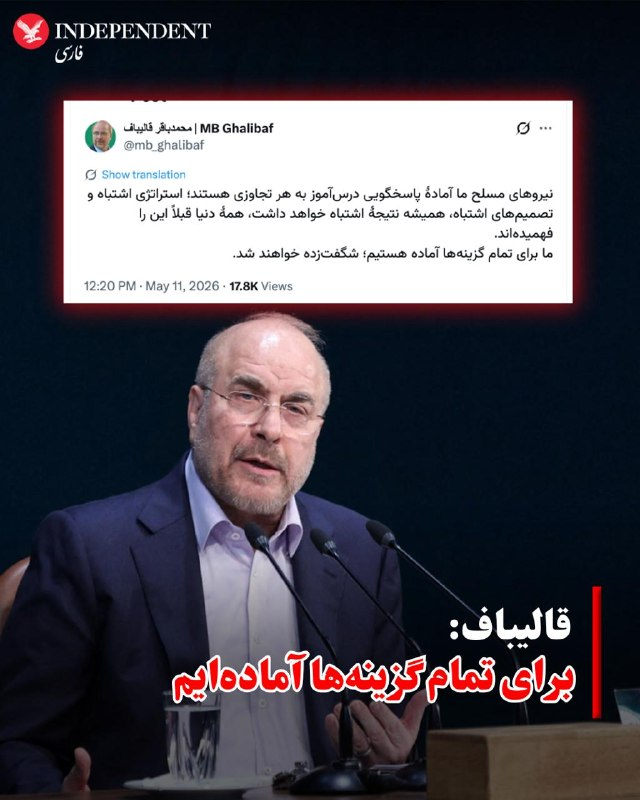

محمدباقر قالیباف، رئیس مجلس شورای اسلامی و رئیس هیات جمهوری اسلامی در مذاکرات با آمریکا، دوشنبه ۲۱ اردیبهشت‌ماه در شبکه اجتماعی اکس نوشت نیروهای مسلح جمهوری اسلامی آماده «پاسخگویی درس‌آموز» به هر تجاوزی هستند.
قالیباف نوشت: «استراتژی اشتباه و تصمیم‌های اشتباه همیشه نتیجه اشتباه خواهد داشت. همه دنیا قبلا این را فهمیده‌اند.»
او افزود: «ما برای تمام گزینه‌ها آماده هستیم؛ شگفت‌زده خواهند شد.»
@VahidOOnLine

📡 @VahidOnline

## VahidOnline — post 75424

  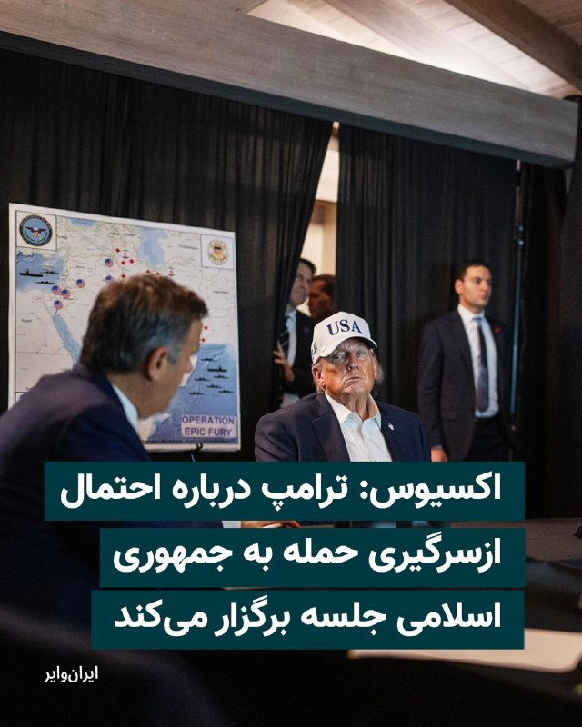

وب‌سایت اکسیوس گزارش داد دونالد ترامپ روز دوشنبه روز دوشنبه ۲۱ اردیبهشت ۱۴۰۵ با اعضای تیم امنیت ملی خود درباره ادامه جنگ با ایران و احتمال ازسرگیری اقدام نظامی علیه جمهوری اسلامی جلسه برگزار می‌کند.
بر اساس این گزارش، سه مقام آمریکایی گفته‌اند مذاکرات میان تهران و واشنگتن روز یکشنبه به بن‌بست رسیده و همین موضوع گزینه نظامی را دوباره روی میز قرار داده است.
اکسیوس به نقل از مقام‌های آمریکایی نوشت ترامپ همچنان خواهان توافق برای پایان جنگ است، اما رد بسیاری از خواسته‌های آمریکا از سوی ایران و خودداری تهران از دادن امتیاز جدی درباره برنامه هسته‌ای، احتمال اقدام نظامی را افزایش داده است.
@VahidHeadline

📡 @VahidOnline

## kianmeli1 — post 87354

  <a href="https://t.me/kianmeli1/87354" target="_blank">📎 Download file</a>

https://t.me/kianmeli1

## kianmeli1 — post 87353

  

🔴روسیه با شروع صادرات قطعات به ایران، بزرگترین کارخانه پهپاد جهان را گسترش می‌دهد.
https://t.me/kianmeli1

## kianmeli1 — post 87352

  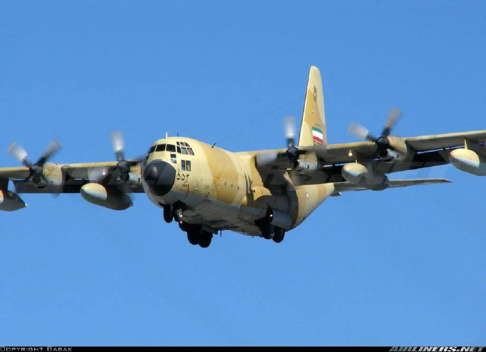

🔴طبق گزارش سی‌بی‌اس، به نقل از مقامات آمریکایی که نخواستند نامشان فاش شود، پاکستان، میانجی کلیدی در مذاکرات جاری به ایران اجازه داد تا هواپیماهای کلیدی خود را در پایگاه‌هایشان جابجا کند، احتمالاً برای جلوگیری از دست دادن آنها در حملات هوایی ایالات متحده. طبق این گزارش، هم پاکستان و هم افغانستان به آنها اجازه انجام این کار را دادند. ایران در روزهای اولیه جنگ، یکی از هواپیماهای ISR خود، یک RC-130 تبدیل‌شده به نام «صبا» و سایر هواپیماها، چه نظامی و چه غیرنظامی، را به پایگاه نیروی هوایی نورخان پاکستان فرستاد.
https://t.me/kianmeli1

## kianmeli1 — post 87351

  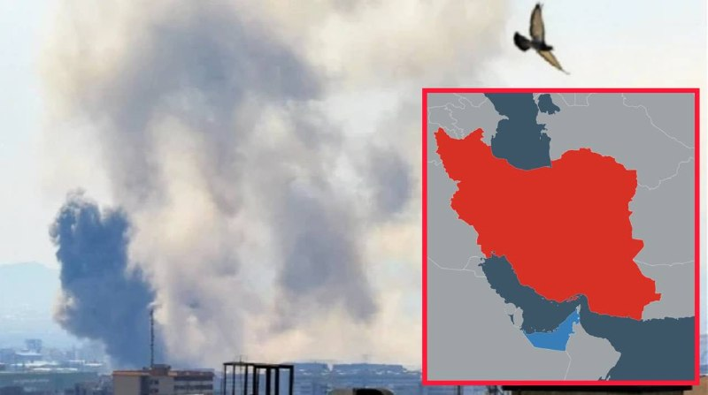

🔴به گزارش وال استریت ژورنال، به نقل از افراد آگاه، امارات متحده عربی در واقع حملاتی علیه ایران انجام داده است.

طبق این گزارش، این حملات شامل حملات به پالایشگاه ایران در جزیره لاوان بلافاصله پس از اعلام آتش‌بس اسمی نیز می‌شد.

علاوه بر این، طبق گزارش‌ها، ایالات متحده نه تنها از دخالت خود آگاه بوده، بلکه «بی‌سروصدا» از پیوستن امارات و احتمالاً سایر کشورهای خلیج فارس به اقدامات تهاجمی علیه ایران استقبال کرده است.

تا به امروز، امارات متحده عربی به طور نامتناسبی بیشتر از هر یک از همسایگان خلیج فارس خود، هدف موشک‌ها و پهپادهای ایرانی قرار گرفته است و همواره گفته است که حق خود را برای جلوگیری از حملات ایران به هر وسیله ممکن محفوظ می‌دارد.
https://t.me/kianmeli1

## kianmeli1 — post 87350

  <a href="telegram/content/kianmeli1_87350_1778536887.mp4" target="_blank">🎬 Download video</a>

🔴ذوالنور عضو کمیسیون قضایی و حقوقی مجلس: هر شناوری که بخواهد از تنگه هرمز عبور کند را می‌توانیم از سمنان ،تهران و مشهد بزنیم
https://t.me/kianmeli1

## kianmeli1 — post 87349

  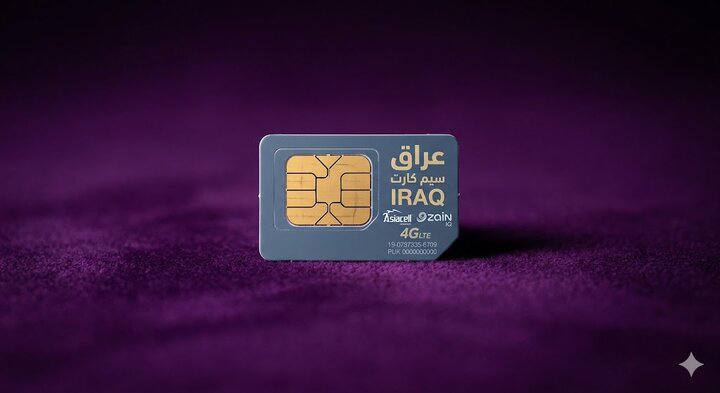

🔴رونق بازار سیم‌کارت‌های عراقی در شهرهای مرزی کشور / اینترنت جایگزین از مسیر غیررسمی به ایران رسید

گزارش‌های میدانی و پیام‌های دریافتی از مخاطبان نشان می‌دهد در برخی مناطق مرزی کشور، به‌ویژه در استان خوزستان و نواحی همجوار با مرز عراق، فروش سیم‌کارت‌های اپراتورهای عراقی از جمله زین و دیگر اپراتورهای فعال این کشور افزایش یافته است.

این سیم‌کارت‌ها از مسیرهای غیررسمی وارد کشور شده و با قیمت‌هایی به‌مراتب بالاتر از نرخ معمول، در اختیار متقاضیان قرار می‌گیرند.
آنچه این بازار را قابل توجه کرده، استقبال بخشی از مردم از این سیم‌کارت‌هاست؛ کاربرانی که برای دسترسی به اینترنت بین‌الملل و حفظ ارتباطات خود، به استفاده از خدمات اپراتورهای خارجی روی آورده‌اند.
https://t.me/kianmeli1

## kianmeli1 — post 87348

  

🔴 ترامپ به سمت صدور دستور از سرگیری جنگ با ایران متمایل است -N12
https://t.me/kianmeli1

## IranIntlTV — post 336712

  <a href="telegram/content/IranIntlTV_336712_1778536892.mp4" target="_blank">🎬 Download video</a>

مراد ویسی، تحلیل‌گر ارشد ایران‌اینترنشنال، گفت: «با رسیدن مذاکرات جمهوری اسلامی و آمریکا به بن‌بست، موقعیت اسرائیل که طرفدار ازسرگیری حملات نظامی است تقویت شده چون اسرائیل از ابتدا معتقد بود مذاکره و توافق با جمهوری اسلامی نتیجه‌ای ندارد. حالا که ترامپ پیشنهاد جمهوری اسلامی را غیرقابل قبول می‌داند، دست اسرائیل برای ترغیب واشینگتن به بازگشت به گزینه نظامی بازتر شده است.»
@iranintltv

## IranIntlTV — post 336711

  

شاهزاده رضا پهلوی در شبکه اجتماعی ایکس نوشت که جمهوری اسلامی ۴۷ سال است علیه آمریکا و متحدانش جنگ به راه انداخته، و تاکید کرد: «امروز این رژیم از همیشه ضعیف‌تر است و مردم ایران آماده‌اند تا آن را سرنگون کنند.»
او نوشت که اتخاذ سیاستی درست در این لحظه، می‌تواند قرن آینده را تغییر دهد.

https://iranintl.com/202605117455

## IranIntlTV — post 336710

  <a href="telegram/content/IranIntlTV_336710_1778536895.mp4" target="_blank">🎬 Download video</a>

مراد ویسی، تحلیل‌گر ارشد ایران‌اینترنشنال، گفت: «در حالی که عربستان با ظرفیت تولید ۱۲ میلیون بشکه نفت در روز و صادرات هفت میلیون بشکه در روز حتی در شرایط جنگی، در اوج قدرت نفتی است، در جمهوری اسلامی ایران تولید و صادرات نفت به شدت افت کرده و تامین بنزین داخلی هم به وضعیت بحرانی رسیده است. ایران و عربستان دو کشوری که روزی غول‌های نفتی منطقه بودند، حالا دو سرنوشت نفتی متفاوت یافته‌اند.»
@iranintltv

## IranIntlTV — post 336709

  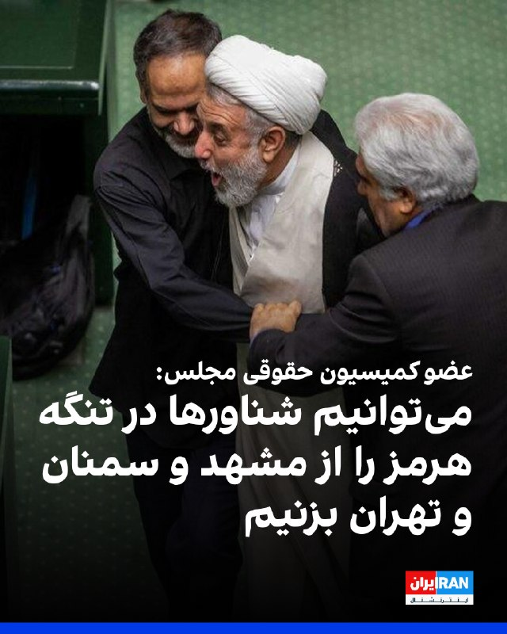

مجتبی ذوالنوری، عضو کمیسیون حقوقی مجلس، گفت: «لازم نیست در تنگه هرمز باشیم تا هر شناوری را که از آنجا رد می‌شود، بزنیم. از سمنان و مشهد و تهران می‌زنیم. چند شناور که آنجا غرق شود، خود تنگه بسته می‌شود. روی بحث مین‌ریزی کار کردیم و نجابت به خرج دادیم از این حق استفاده نکردیم.»
https://iranintl.com/202605116088

## IranIntlTV — post 336708

  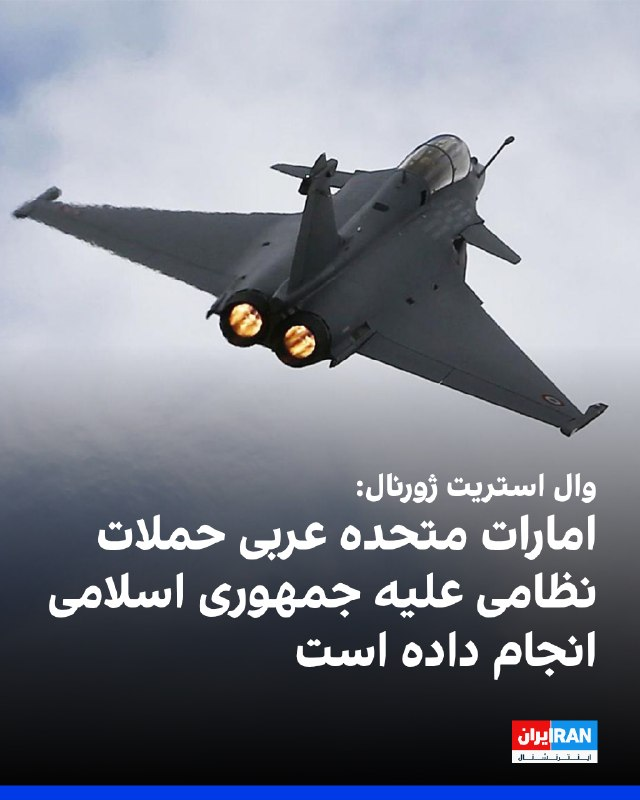

وال استریت ژورنال به نقل از منابع مطلع گزارش داد که امارات متحده عربی حملات نظامی علیه جمهوری اسلامی انجام داده است؛ اقدامی که این کشور را در جایگاه یکی از طرف‌های فعال در جنگ قرار می‌دهد.

در این گزارش آمده است نیروهای نظامی این کشور به جنگنده‌های ساخت غرب و شبکه‌های نظارتی پیشرفته مجهز هستند و این حملات نشان می‌دهد امارات متحده عربی اکنون تمایل بیشتری دارد از این توانمندی‌ها برای حفاظت از قدرت اقتصادی و نفوذ رو‌به‌گسترش خود در سراسر خاورمیانه استفاده کند.

وال استریت ژورنال افزود که این حملات شامل حمله به یک پالایشگاه در جزیره لاوان ایران در خلیج فارس بوده که در اواسط فروردین انجام شده است؛ امارات به‌طور علنی انجام این حملات را تایید نکرده است.
در بخش دیگری از این گزارش آمده است که امارات متحده عربی اکنون تهران را تهدیدی مستقیم علیه ثبات و مدل اقتصادی خود می‌داند. همچنین براساس گمانه‌زنی‌ها، گفته می‌شود امارات متحده عربی با استفاده از جنگنده‌های میراژ فرانسوی و پهپادهای چینی متعلق به خود، در داخل ایران عملیات انجام داده است.
https://iranintl.com/202605110620

## IranIntlTV — post 336707

  <a href="telegram/content/IranIntlTV_336707_1778536899.mp4" target="_blank">🎬 Download video</a>

دونالد ترامپ گفت که آتش‌بس مانند بیماری در وضعیت احتضار با دستگاه زنده است و شانس زنده ماندن آن را «تنها یک درصد» خواند. همزمان گمانه‌زنی‌ها درباره ادامه رویکرد ترامپ برای حل مساله ایران از طریق دیپلماسی یا حمله نظامی ادامه دارد.

گفت‌وگو با جیسون برادسکی، مدیر سیاست‌گذاری اتحاد علیه ایران هسته‌ای
@iranintltv

## IranIntlTV — post 336706

  <a href="telegram/content/IranIntlTV_336706_1778536902.mp4" target="_blank">🎬 Download video</a>

مصطفی دانشگر، تحلیل‌گر سیاسی، گفت: «تلاش تهران برای امتیاز ندادن به واشینگتن در مساله هسته‌ای، بیش از آن‌که بر پشتوانه‌ای مشخص استوار باشد، ناشی از توهم و اشتباه محاسباتی است.»
@iranintltv

## IranIntlTV — post 336705

  <a href="telegram/content/IranIntlTV_336705_1778536905.mp4" target="_blank">🎬 Download video</a>

ائتلاف منطقه‌ای علیه تهران در حال شکل‌گیری است. تام کاتن، سناتور جمهوری‌خواه، گفت کشورهای عربی دیگر از آمریکا برای صلح کمک نمی‌خواهند، بلکه به‌دنبال همکاری نظامی علیه جمهوری اسلامی هستند.

گفت‌وگو با شایان سمیعی، کارشناس امنیت ملی
@iranintltv

## IranIntlTV — post 336704

  

سی‌بی‌اس نیوز به نقل از مقام‌های آمریکایی گزارش داد که پاکستان به‌طور غیررسمی اجازه داده است برخی هواپیماهای نظامی ایران در فرودگاه‌های این کشور مستقر شوند؛ اقدامی که احتمالا آن‌ها را از حملات هوایی آمریکا مصون می‌سازد.
براساس این گزارش، ایران همچنین برخی هواپیماهای غیرنظامی خود را به افغانستان منتقل کرده است، هرچند مشخص نیست که آیا در میان آن‌ها هواپیماهای نظامی نیز وجود دارد یا خیر.
https://iranintl.com/202605113219

## IranIntlTV — post 336703

  <a href="telegram/content/IranIntlTV_336703_1778536909.mp4" target="_blank">🎬 Download video</a>

دونالد ترامپ در کاخ سفید با تیم امنیتی و فرماندهان نظامی آمریکا درباره ادامه مسیر جنگ با جمهوری اسلامی جلسه برگزار می‌کند. او گفته در داخل حکومت ایران اختلاف وجود دارد؛ «میانه‌روها» دنبال توافق‌اند اما «دیوانه‌ها» می‌خواهند جنگ ادامه پیدا کند.
@iranintltv

## IranIntlTV — post 336702

  <a href="https://t.me/IranintlTV/336702" target="_blank">📎 Download file</a>

🎧نسخه صوتی ۲۴ با فرداد فرحزاد: جلسه ترامپ و فرماندهان ارتش در کاخ سفید در مورد ایران
@iranintlTV

## IranIntlTV — post 336701

  <a href="telegram/content/IranIntlTV_336701_1778536912.mp4" target="_blank">🎬 Download video</a>

وخیم‌ترین اوضاع اقتصاد ایران بعد از قحطی جنگ جهانی

چشم‌انداز با مهدی مهدوی‌آزاد

تماشای نسخه کامل این برنامه در یوتیوب:
https://youtu.be/r1t36aJQtRA
@iranintltv

## IranIntlTV — post 336700

  <a href="https://t.me/IranintlTV/336700" target="_blank">📎 Download file</a>

🎧نسخه صوتی چشم‌انداز: وخیم‌ترین اوضاع اقتصاد ایران بعد از قحطی جنگ جهانی
@iranintlTV

## IranIntlTV — post 336699

  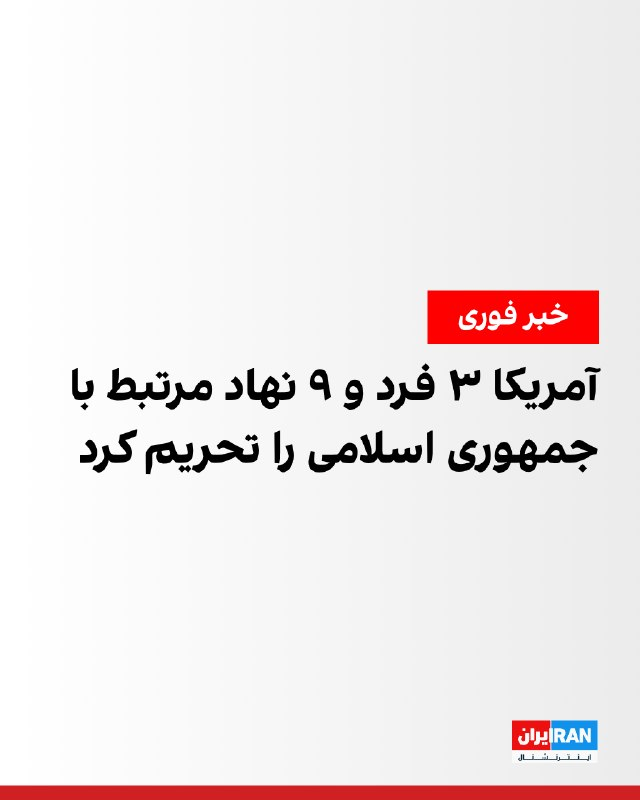

ایالات متحده تحریم‌های جدیدی مرتبط با جمهوری اسلامی علیه سه فرد و ۹ نهاد، از جمله چهار نهاد مستقر در هنگ‌کنگ، ۴ نهاد در امارات متحده عربی و یک نهاد در عمان وضع کرد.

طبق این گزارش، محمدرضا اشرفی، صمد فتحی سلامی و احمد محمدی‌زاده به دلیل ارتباط با سپاه پاسداران تحریم شده‌اند.
https://iranintl.com/202605111289

## IranIntlTV — post 336698

  <a href="https://t.me/IranintlTV/336698" target="_blank">📎 Download file</a>

🎧نسخه صوتی تیتراول با نیوشا صارمی: ترامپ: احتمال باقی ماندن آتش‌بس یک درصد است، پیشنهاد تهران احمقانه بود
@iranintlTV

## IranIntlTV — post 336697

  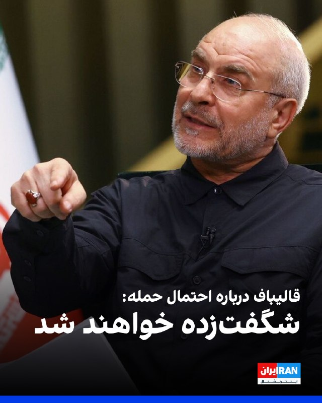

محمدباقر قالیباف، رییس مجلس در شبکه ایکس نوشت نیروهای مسلح جمهوری اسلامی آماده «پاسخگویی درس‌آموز» به هر حمله‌ای هستند؛ ما برای تمام گزینه‌ها آماده هستیم، «شگفت‌زده خواهند شد.»

او افزود: «استراتژی اشتباه و تصمیم‌های اشتباه، همیشه نتیجه اشتباه خواهد داشت، همه دنیا قبلا این را فهمیده‌اند.»
https://iranintl.com/202605113220

## IranIntlTV — post 336696

  <a href="telegram/content/IranIntlTV_336696_1778536917.mp4" target="_blank">🎬 Download video</a>

۲۴ با فرداد فرحزاد
@iranintltv

## IranIntlTV — post 336695

  <a href="telegram/content/IranIntlTV_336695_1778536919.mp4" target="_blank">🎬 Download video</a>

۲۴ با فرداد فرحزاد
@iranintltv

## IranIntlTV — post 336694

  <a href="telegram/content/IranIntlTV_336694_1778536920.mp4" target="_blank">🎬 Download video</a>

شهیر شهیدثالث، روزنامه‌نگار و تحلیل‌گر سیاسی، درباره طرح پیشنهادی تهران برای توافق با واشینگتن گفت: «چه دونالد ترامپ در کاخ سفید باشد و چه فردی دیگر، مساله اصلی درخواست جمهوری اسلامی برای به‌رسمیت شناختن حاکمیتش بر تنگه هرمز است.» او تاکید کرد: «هیچ رییس‌جمهوری در آمریکا زیر بار چنین درخواستی نخواهد رفت.»
@iranintltv

## IranIntlTV — post 336693

  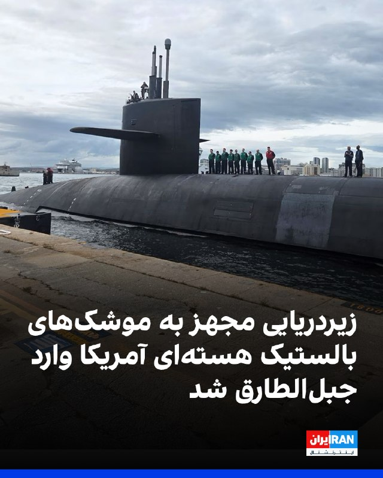

یک روز پس از آن که دونالد ترامپ با پاسخ جمهوری اسلامی به پیشنهاد واشینگتن مخالفت کرد، ارتش آمریکا اعلام کرد که یک زیردریایی از کلاس اوهایو که مجهز به موشک‌های بالستیک هسته‌ای است، یک‌شنبه وارد جبل‌الطارق شد.

ناوگان ششم نیروی دریایی ایالات متحده در بیانیه‌ای نوشت: «زیردریایی‌های موشک بالستیک کلاس اوهایو، سکوهای پرتاب غیرقابل شناسایی برای موشک‌های بالستیک پرتاب‌شونده از زیردریایی هستند و برای ایالات متحده امن‌ترین و پایدارترین بخش از سه‌گانه هسته‌ای را فراهم می‌کنند.»

جبل‌الطارق، قلمرو بریتانیا و مشرف به تنگه‌ای است که دریای مدیترانه را به اقیانوس اطلس متصل می‌کند.

پنتاگون نام این زیردریایی را که یکی از محرمانه‌ترین سلاح‌های ارتش آمریکا است فاش نکرد.

به طور کلی، محل استقرار زیردریایی‌های هسته‌ای آمریکا به شدت طبقه‌بندی‌شده و محرمانه است.

ترامپ دوشنبه به خبرنگاران گفت که آتش‌بس آمریکا با ایران در وضعیت بحرانی قرار دارد و آن را «به‌طرز باورنکردنی ضعیف» توصیف کرد.

https://iranintl.com/202605111968

## Shin_Persian — post 5961

↩️ Quoted tweet: Shin ✓ @hey_itsmyturn Sun, 10 May 2026 21:01:49 UTC Another night with jet activity over Baghdad #Iraq 🇮🇶 ↩️ توییت نقل‌قول شده — برای پاسخ، پست زیر را ببینید. فارسی شبی دیگر با فعالیت جنگنده‌ها بر فراز بغداد #Iraq 🇮🇶 𝕏 · @shin_persian

## Shin_Persian — post 5960

↩️ Quoted tweet:
Shin ✓ @hey_itsmyturn
Sun, 10 May 2026 21:01:49 UTC

Another night with jet activity over Baghdad #Iraq 🇮🇶

↩️ توییت نقل‌قول شده — برای پاسخ، پست زیر را ببینید.

فارسی

شبی دیگر با فعالیت جنگنده‌ها بر فراز بغداد #Iraq 🇮🇶

𝕏 · @shin_persian

## Shin_Persian — post 5959

Shin ✓ @hey_itsmyturn
Mon, 11 May 2026 19:30:59 UTC

Treasury's Economic Fury campaign targets 12 individuals and entities facilitating IRGC oil sales to China through front companies in Hong Kong, Dubai, and other jurisdictions, disrupting tens of millions in oil revenue.

𝐈𝐧𝐝𝐢𝐯𝐢𝐝𝐮𝐚𝐥𝐬:
- 𝐀𝐡𝐦𝐚𝐝 𝐌𝐨𝐡𝐚𝐦𝐦𝐚𝐝𝐢 𝐙𝐚𝐝𝐞𝐡 (Iran): Chief of IRGC Shahid Purja'fari Oil Headquarters, coordinates debt resolution with sanctioned entities through Golden Globe cover company
- 𝐒𝐚𝐦𝐚𝐝 𝐅𝐚𝐭𝐡𝐢 𝐒𝐚𝐥𝐚𝐦𝐢 (Iran): Finance chief of IRGC Shahid Purja'fari Oil Headquarters, manages foreign currency operations overseas
- 𝐌𝐨𝐡𝐚𝐦𝐦𝐚𝐝𝐫𝐞𝐳𝐚 𝐀𝐬𝐡𝐫𝐚𝐟𝐢 𝐆𝐡𝐞𝐡𝐢 (Iran): Commercial chief of IRGC oil headquarters, handled communications with Haokun Energy regarding debts

𝐄𝐧𝐭𝐢𝐭𝐢𝐞𝐬:
- 𝐇𝐨𝐧𝐠 𝐊𝐨𝐧𝐠 𝐁𝐥𝐮𝐞 𝐎𝐜𝐞𝐚𝐧 𝐋𝐢𝐦𝐢𝐭𝐞𝐝 (Hong Kong): Cover company arranging IRGC oil sales and shipments worth tens of millions, used sanctioned tankers GAGAN, CANGJIE, and HASNA
- 𝐇𝐨𝐧𝐠 𝐊𝐨𝐧𝐠 𝐒𝐚𝐧𝐦𝐮 𝐋𝐢𝐦𝐢𝐭𝐞𝐝 (Hong Kong): Cover company performing similar role to Golden Globe in facilitating Iranian oil sales
- 𝐎𝐜𝐞𝐚𝐧 𝐀𝐥𝐥𝐢𝐚𝐧𝐳 𝐒𝐡𝐢𝐩𝐩𝐢𝐧𝐠 𝐋𝐋𝐂 (Dubai): Facilitated IRGC oil shipments on five sanctioned shadow fleet tankers in 2025
- 𝐀𝐭𝐢𝐜 𝐄𝐧𝐞𝐫𝐠𝐲 𝐅𝐙𝐄 (Sharjah): Worked with IRGC to facilitate oil shipments on sanctioned vessels
- 𝐙𝐞𝐮𝐬 𝐋𝐨𝐠𝐢𝐬𝐭𝐢𝐜𝐬 𝐆𝐫𝐨𝐮𝐩 (Oman): Arranged vessels for Iranian oil cargoes including shipments on CANGJIE
- 𝐉𝐢𝐚𝐧𝐝𝐢 𝐇𝐊 𝐋𝐢𝐦𝐢𝐭𝐞𝐝 (Hong Kong): Entered deal to purchase tens of millions in Iranian oil from IRGC in mid-2025
- 𝐌𝐚𝐱 𝐇𝐨𝐧𝐨𝐫 𝐈𝐧𝐭𝐞𝐫𝐧𝐚𝐭𝐢𝐨𝐧𝐚𝐥 𝐓𝐫𝐚𝐝𝐞 𝐂𝐨., 𝐋𝐢𝐦𝐢𝐭𝐞𝐝 (Hong Kong): Purchased millions of barrels of Iranian oil carried on sanctioned SCALER and SKIPPER
- 𝐁𝐥𝐚𝐧𝐜𝐚 𝐆𝐨𝐨𝐝𝐬 𝐖𝐡𝐨𝐥𝐞𝐬𝐚𝐥𝐞𝐫 𝐋𝐋𝐂 (Dubai): Arranged 2025 oil deal with IRGC via Golden Globe
- 𝐔𝐧𝐢𝐯𝐞𝐫𝐬𝐚𝐥 𝐅𝐨𝐫𝐭𝐮𝐧𝐞 𝐓𝐫𝐚𝐝𝐢𝐧𝐠 𝐋𝐋𝐂 (Dubai): Contracted with Golden Globe for oil carried by sanctioned XD LEO, also serves as NIOC front company

𝐊𝐞𝐲 𝐕𝐞𝐬𝐬𝐞𝐥𝐬 𝐑𝐞𝐟𝐞𝐫𝐞𝐧𝐜𝐞𝐝:
- 𝐆𝐀𝐆𝐀𝐍 (IMO 9256468)
- 𝐂𝐀𝐍𝐆𝐉𝐈𝐄 (IMO 9299680)
- 𝐇𝐀𝐒𝐍𝐀 (IMO 9212917)
- 𝐇𝐀𝐍𝐒𝐎𝐍 (IMO 9237412)
- 𝐎𝐓𝐋𝐀 (IMO 9299719)
- 𝐒𝐂𝐀𝐋𝐄𝐑 (IMO 9254915)
- 𝐁𝐄𝐋𝐋𝐀 𝟏 (IMO 9230880)
- 𝐀𝐍𝐃𝐑𝐎𝐌𝐄𝐃𝐀 𝐕 (IMO 9197832)
- 𝐒𝐊𝐈𝐏𝐏𝐄𝐑 (IMO 9304667)
- 𝐗𝐃 𝐋𝐄𝐎 (IMO 9312872)

Action builds on July 2025 designation of Golden Globe Demir Celik Petrol, expanding pressure on IRGC oil revenue networks. Treasury warns of potential secondary sanctions on Chinese "teapot" refineries and foreign financial institutions facilitating Iranian commerce.

ترجمه فارسی در بخش نظرات

𝕏 · @shin_persian

## ManotoTV — post 105326

  <a href="telegram/content/ManotoTV_105326_1778536924.mp4" target="_blank">🎬 Download video</a>

روزنامه وال‌استریت ژورنال به نقل از منابع آگاه گزارش داد امارات متحده عربی به‌طور مخفیانه حملاتی نظامی علیه جمهوری اسلامی انجام داده و به یکی از طرف‌های مستقیم جنگ تبدیل شده است.

بر اساس این گزارش، یکی از این حملات در ماه آوریل پالایشگاه نفتی لاوان در خلیج فارس را هدف قرار داده؛ حمله‌ای که همزمان با اعلام آتش‌بس از سوی دونالد ترامپ رخ داده و باعث آتش‌سوزی گسترده و از کار افتادن بخش بزرگی از ظرفیت پالایشگاه برای چند ماه شده است.

به نوشته وال‌استریت ژورنال، جمهوری اسلامی در آن زمان اعلام کرده بود پالایشگاه در «حمله دشمن» هدف قرار گرفته و در واکنش، موجی از حملات موشکی و پهپادی علیه امارات و کویت انجام داده است.

این گزارش می‌گوید آمریکا از حمله امارات ناراضی نبوده و به‌طور غیرعلنی از مشارکت کشورهای خلیج فارس در جنگ علیه جمهوری اسلامی استقبال کرده است.

وزارت خارجه امارات از اظهار نظر مستقیم درباره این حملات خودداری کرده، اما به بیانیه‌های پیشین خود درباره «حق پاسخ، از جمله پاسخ نظامی، به اقدامات خصمانه» اشاره کرده است.

وال‌استریت ژورنال همچنین گزارش داد جمهوری اسلامی بیش از ۲۸۰۰ موشک و پهپاد به سمت امارات شلیک کرده؛ حملاتی که به بخش‌های هوایی، گردشگری و بازار املاک این کشور آسیب زده است.

در این گزارش آمده امارات پس از آغاز جنگ، همکاری نظامی خود با آمریکا را حفظ کرده و همزمان اقداماتی علیه منافع مالی جمهوری اسلامی، از جمله محدودیت برای شهروندان ایرانی و تعطیلی مراکز مرتبط با تهران در دبی، انجام داده است.

## ManotoTV — post 105325

  <a href="telegram/content/ManotoTV_105325_1778536925.mp4" target="_blank">🎬 Download video</a>

‌
محمدباقر قالیباف، رئیس مجلس شورای اسلامی، در پیامی به زبان انگلیسی در شبکه اکس نوشت «هیچ» جایگزینی جز پذیرش «طرح ۱۴ ماده‌ای» وجود ندارد.

قالیباف افزود:
«هر رویکرد دیگری کاملاً بی‌نتیجه خواهد بود و چیزی جز شکست‌های پی‌درپی به همراه نخواهد داشت. هرچه بیشتر وقت‌کشی کنند، هزینه بیشتری بر دوش مالیات‌دهندگان آمریکایی گذاشته خواهد شد.»

## ManotoTV — post 105324

  <a href="telegram/content/ManotoTV_105324_1778536926.mp4" target="_blank">🎬 Download video</a>

تماسی از چنارشاهیجان کازرون:
از جاویدنامان علیرضا نادری، عارف براتی، فرزانه ساسانی‌پور، بهبود حسن‌زاده، جبار پناهی و آنیسا هوشنگی گفت…

## ManotoTV — post 105323

  <a href="telegram/content/ManotoTV_105323_1778536928.mp4" target="_blank">🎬 Download video</a>

وزارت خزانه‌داری آمریکا اعلام کرد ۱۲ فرد و نهاد را به‌دلیل نقش در فروش و انتقال نفت جمهوری اسلامی توسط سپاه پاسداران به چین تحریم کرده است.

در بیانیه دفتر کنترل دارایی‌های خارجی وزارت خزانه‌داری آمریکا آمده سپاه پاسداران برای پنهان کردن نقش خود در فروش نفت و انتقال درآمدها به جمهوری اسلامی، از شرکت‌های پوششی در کشورهای مختلف استفاده می‌کند.

اسکات بسنت، وزیر خزانه‌داری آمریکا، گفت: «در حالی که ارتش ایران تلاش می‌کند خود را بازسازی کند، عملیات “خشم اقتصادی” به محروم کردن جمهوری اسلامی از منابع مالی برنامه‌های تسلیحاتی، نیروهای نیابتی و جاه‌طلبی‌های هسته‌ای ادامه خواهد داد.»

وزارت خزانه‌داری آمریکا همچنین اعلام کرد جمهوری اسلامی به‌جای استفاده از درآمدهای نفتی برای حمایت از مردم ایران، این منابع را صرف توسعه تسلیحات، حمایت از گروه‌های نیابتی و تأمین مالی نیروهای امنیتی می‌کند.

در میان افراد تحریم‌شده، نام احمد محمدی‌زاده، رئیس قرارگاه نفتی شهید پورجعفری سپاه، صمد فتحی سلامی، مسئول مالی این قرارگاه، و محمدرضا اشرفی گهی، مسئول بازرگانی آن، دیده می‌شود.

همچنین چند شرکت مستقر در هنگ‌کنگ، دبی، عمان و شارجه به اتهام همکاری در انتقال نفت ایران و دور زدن تحریم‌ها هدف تحریم قرار گرفته‌اند.

وزارت خزانه‌داری آمریکا هشدار داد هر شرکت یا مؤسسه مالی خارجی که با شبکه‌های مرتبط با سپاه پاسداران همکاری کند، ممکن است هدف تحریم‌های ثانویه آمریکا قرار گیرد.

## ManotoTV — post 105322

  <a href="telegram/content/ManotoTV_105322_1778536930.mp4" target="_blank">🎬 Download video</a>

تماسی از رشت:
«از رضا سمیع‌پور گفت…
۵۱ ساله، مردی نجیب و حامی حیوانات که جلوی خانه‌اش از پشت هدف گلوله قرار گرفت.
و از آیدین دولت‌خواه…
جوان ۲۲ ساله‌ای که با چهار گلوله کشته شد.

## ManotoTV — post 105321

  <a href="telegram/content/ManotoTV_105321_1778536932.mp4" target="_blank">🎬 Download video</a>

نمایشگاه عکس «حکومت اعدام» پس از یک ماه برگزاری در شهرهای برلین، لاهه، آمستردام، بروکسل، پاریس و ژنو، روز گذشته در آخرین ایستگاه خود در شهر کلن آلمان به کار خود پایان داد.

این نمایشگاه با هدف جلب توجه افکار عمومی اروپا به نقض گسترده حقوق بشر و موج اعدام‌ها در ایران برگزار شد و تصاویری از قربانیان اعدام‌شده طی ۴۸ سال گذشته، در کنار زندانیانی که اکنون در خطر اجرای حکم اعدام قرار دارند، به نمایش گذاشت.

همزمان، پرفرمنس «حکومت اعدام» نیز در تمامی روزهای برگزاری اجرا شد؛ اجرایی نمادین درباره اعدام، سرکوب و کشتار معترضان و جوانان ایران در دهه‌های گذشته.

این پروژه تلاش داشت با استفاده از تصویر، هنر و روایت، توجه رسانه‌ها، افکار عمومی و سیاستمداران اروپایی را به ادامه روند اعدام‌ها در جمهوری اسلامی جلب کند.

## ManotoTV — post 105320

  <a href="telegram/content/ManotoTV_105320_1778536934.mp4" target="_blank">🎬 Download video</a>

مونترال|کبک کانادا؛
رالی خودرو و گردهمایی ایرانیان

## ManotoTV — post 105319

  <a href="telegram/content/ManotoTV_105319_1778536937.mp4" target="_blank">🎬 Download video</a>

‌
وب‌سایت اکسیوس به نقل از سه مقام آمریکایی گزارش داد دونالد ترامپ امروز با اعضای تیم امنیت ملی خود درباره گام‌های بعدی در جنگ با جمهوری اسلامی دیدار خواهد کرد.

بر اساس این گزارش، ازسرگیری احتمالی اقدام نظامی علیه جمهوری اسلامی از جمله گزینه‌هایی است که در این نشست بررسی می‌شود.

ترامپ پیش‌تر گفته بود قرار است با «ژنرال‌های ارشد» خود دیدار کند.

به گزارش اکسیوس، جی‌دی ونس، معاون رئیس‌جمهوری آمریکا، استیو ویتکاف، فرستاده ویژه کاخ سفید، مارکو روبیو، وزیر خارجه، و پیت هگست، وزیر دفاع آمریکا نیز در این نشست حضور خواهند داشت.

## FarsiVOA — post 217487

  <a href="telegram/content/FarsiVOA_217487_1778536938.mp4" target="_blank">🎬 Download video</a>

⚡️بحران برق در ایران و نگرانی‌ها درباره آینده صادرات انرژی به افغانستان
@FarsiVOA

## FarsiVOA — post 217486

⚡️پوشش ویژه | پرزیدنت ترامپ میزبان قهرمانان ملی فوتبال آمریکایی
@FarsiVOA

## FarsiVOA — post 217485

⚡️دونالد ترامپ: پاسخ حکومت ایران به پیشنهاد صلح ایالات متحده را «پیشنهادی احمقانه» است
@FarsiVOA

## FarsiVOA — post 217484

🔺وزارت خزانه‌داری آمریکا به بانک‌ها دستور داد شبکه‌های مشکوک پول‌شویی مرتبط با رژیم ایران را شناسایی و گزارش کنند

▪️وزارت خزانه‌داری آمریکا روز دوشنبه ۲۱ اردیبهشت از بانک‌ها و دیگر مؤسسات مالی این کشور خواست شبکه‌های احتمالی پولشویی مرتبط با جمهوری اسلامی ایران را که از منابع مالی خود برای قاچاق نفت تحریم‌شده از طریق شرکت‌های پوششی و شبکه‌های رمزارزی استفاده می‌کنند، شناسایی کرده و گزارش کنند.

⬇️ بیشتر بخوانید:
https://ir.voanews.com/a/treasury-banking-monitoring-money-laundering-iran/8148885.html
@FarsiVOA

## FarsiVOA — post 217483

🔺آمریکا شبکه بین‌المللی فروش نفت سپاه پاسداران را هدف تحریم‌های تازه قرار داد

▪️وزارت خزانه‌داری ایالات متحده روز دوشنبه ۲۱ اردیبهشت از اعمال تحریم‌های جدید علیه ۱۲ فرد و شرکت مرتبط با شبکه فروش نفت سپاه پاسداران انقلاب اسلامی خبر داد؛ اقدامی که بخشی از کارزار «خشم اقتصادی» دولت رئیس جمهوری آمریکا، دونالد ترامپ علیه رژیم ایران توصیف شده است.

⬇️ بیشتر بخوانید:
https://ir.voanews.com/a/ofac-sanctions-twelve-iranian-individuals-and-entities-oil/8148883.html
@FarsiVOA

## FarsiVOA — post 217482

  

⚡️دونالد ترامپ، رئیس جمهوری آمریکا، دوشنبه عصر در یک سخنرانی در کاخ سفید با اشاره به قیمت‌های انرژی گفت: «ما مجبور شدیم سفری به کشور زیبای ایران داشته باشیم. نمی‌خواستیم اجازه دهیم آنها به سلاح هسته‌ای دست پیدا کنند. و تصمیم درستی گرفتیم و حالا اوضاع‌مان خیلی خوب است. به‌محض اینکه آن ماجرا تمام شود، قیمت‌ها به‌شدت کاهش پیدا خواهد کرد و ما آن را سر و سامان می‌دهیم.»

@FarsiVOA

## FarsiVOA — post 217481

⚡️دونالد ترامپ، رئیس جمهوری آمریکا، روز دوشنبه ۲۱ اردیبهشت، طی مراسمی در کاخ سفید، درباره مذاکرات جاری با رژیم ایران گفت که رهبران جمهوری اسلامی افرادی غیرشرافتمند و دیوانگانی هستند که مدام نظرشان را تغییر می‌دهند. صدای آمریکا بخشی از این مراسم را به طور زنده و با ترجمه همزمان پژواک کیومرثی پخش کرد.
@FarsiVOA

## FarsiVOA — post 217480

  <a href="telegram/content/FarsiVOA_217480_1778536940.mp4" target="_blank">🎬 Download video</a>

⚡️سینا قنبرپور در برنامه تفسیر خبر: از زنان ایران بیاموزیم که چگونه یک حکومت خودکامه را به عقب برانیم
@FarsiVOA

## FarsiVOA — post 217479

🔺سی‌ان‌ان: رژیم ایران شبکه‌های خرابکاری را برای اقدامات یهودستیزانه در اروپا اجیر می‌کند

▪️شبکه «سی‌ان‌ان» در یک تحقیق مفصل گزارش داده است که رژیم ایران و گروه‌های نیابتی وابسته به آن در حال گسترش شبکه‌های اطلاعاتی و خرابکاری خود در اروپا هستند. آنها از طریق شبکه‌های اجتماعی افراد مختلفی مثل مجرمان، جوانان، و نیروهای اجیرشده را برای جمع‌آوری اطلاعات و انجام عملیات علیه یهودستیزانه جذب می‌کنند.

⬇️ بیشتر بخوانید:
https://ir.voanews.com/a/cnn-report-iran-antisemitism-terrorism-britain/8148804.html
@FarsiVOA

## FarsiVOA — post 217478

⚡️در گفت‌وگو با حسن هاشمیان از صدای آمریکا به سفر پنهانی اسماعیل قاآنی به بغداد پرداختیم؛ سفری که به‌گفته آقای هاشمیان با «ورود و دیدار قاچاقی» فرمانده نیروی قدس انجام شده و هدفش مهار دولت جدید عراق و دور کردن علی الزیدی از واشنگتن در میانه کشمکش فزاینده جمهوری اسلامی و آمریکا است.
@FarsiVOA

## FarsiVOA — post 217477

  <a href="telegram/content/FarsiVOA_217477_1778536941.mp4" target="_blank">🎬 Download video</a>

⚡️نازیلا گلستان در برنامه تفسیر خبر: آزادی زندانیان سیاسی باید به یک مطالبه ملی تبدیل شود
@FarsiVOA

## FarsiVOA — post 217476

⚡️در برنامه تفسیر خبر امروز، مهدی آقازمانی با کارشناسان مهمان، درباره چالش موجود در مذاکرات بین آمریکا و باقی‌مانده جمهوری اسلامی در سایه تشدید فشار داخلی بر مردم ایران از سوی حکومت و تلاش برای سرعت بخشی به اعدام معترضان، گفتگو می‌کند
@FarsiVOA

## FarsiVOA — post 217475

  <a href="telegram/content/FarsiVOA_217475_1778536942.mp4" target="_blank">🎬 Download video</a>

⚡️آلان توفیقی: اپوزسیون ایران به جای همگرایی به واگرایی رسیده است
@FarsiVOA

## FarsiVOA — post 217472

پنتاگون اعلام کرد سربازان لشکر ۲۵ پیاده‌نظام در پایگاه فورت ماگسایسای در فیلیپین، تمرین انتقال تجهیزات سنگین با بالگرد را برگزار کردند.

به گفته وزارت جنگ آمریکا، هدف از این تمرین افزایش سرعت و دقت در پشتیبانی از عملیات نظامی در میدان نبرد است.

@FarsiVOA

## FarsiVOA — post 217471

⚡️علی جوانمردی: چالش مذاکره و گزینه‌های پیش رو
@FarsiVOA

## FarsiVOA — post 217470

🔺تداوم مانع‌تراشی‌های جمهوری اسلامی بر سر راه تشکیل دولت جدید عراق

▪️بنا بر گزارش‌ها تلاش‌های جمهوری اسلامی برای جلوگیری از تشکیل دولت جدید در عراق تحت هدایت علی الزیدی شدت یافته است.

⬇️ بیشتر بخوانید:
https://ir.voanews.com/a/iraq-iran-proxy-war-hormuz/8148775.html
@FarsiVOA

## FarsiVOA — post 217469

  <a href="telegram/content/FarsiVOA_217469_1778536943.mp4" target="_blank">🎬 Download video</a>

سخنگوی صنعت آب ایران، با بیان اینکه ۱۱ استان کشور همچنان بیش از ۱۰ درصد کاهش بارش دارند، گفت: تهران در صدر این استان‌ها قرار دارد و اکنون وارد ششمین سال متوالی کم‌آبی شده است.

عیسی بزرگ‌زاده گفت: وضعیت بارش کشور در محدوده نرمال قرار دارد، اما این نرمال بودن به معنای حل مشکل کم‌آبی در برخی استان‌ها نیست.

به تازگی خبرگزاری ایلنا در گزارشی نوشته بود که علیرغم افزایش موجودی مخازن سدهایی مانند کارون و کرخه، موجودی آب سدهای استان‌های تهران، اصفهان، خراسان رضوی، قم، زنجان و مرکزی در وضعیت نامطلوبی قرار دارند، و تأمین آب شرب از جمله در تهران، کرج، مشهد، اراک، قم، اصفهان، یزد با محدودیت مواجه است.

گزارش کامل را در وب‌سایت صدای آمریکا بخوانید.

@FarsiVOA

## FarsiVOA — post 217468

چنبره سپاه بر مذاکرات و پایان دیپلماسی؛ سناریوی جنگ روی میز

## DW_Farsi — post 124578

  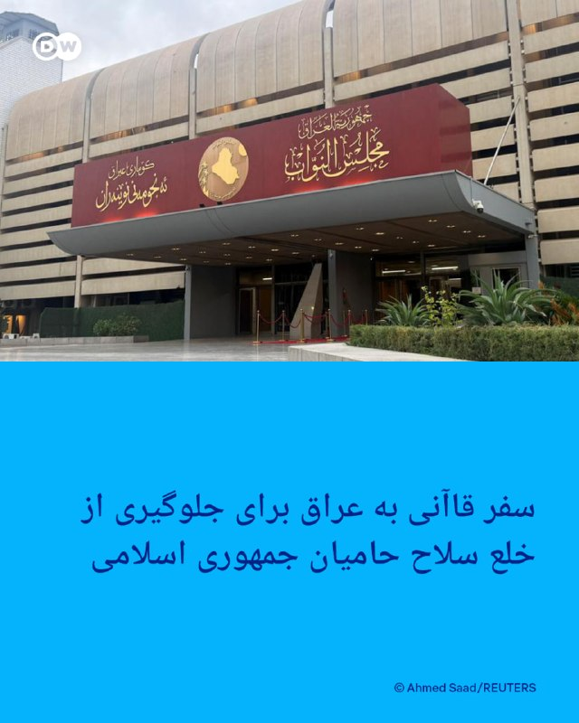

🔶 سفر قاآنی به عراق برای جلوگیری از خلع‌ سلاح حامیان جمهوری اسلامی

رسانه‌های عربی به نقل از منابع عراقی گزارش داده‌اند که تلاش‌هایی برای به تعویق انداختن نشست پارلمان عراق، که قرار است به رای‌گیری درباره ترکیب کابینه علی الزیدی اختصاص یابد، در جریان است.

بر اساس این گزارش‌ها، در درون "چارچوب هماهنگی" بر سر توزیع پست‌های وزارتی اختلاف‌های جدی وجود دارد و همین موضوع برگزاری نشست پارلمان را با تاخیر روبه‌رو کرده است.

هم‌زمان، روزنامه الشرق الاوسط به نقل از دو مقام عراقی گزارش داد که اختلاف بر سر نقش گروه‌های مسلح نزدیک به ایران، روند تشکیل دولت جدید عراق را با مانع روبه‌رو کرده است.

به گفته این منابع، تهران با تلاش‌ها برای محدود کردن حضور این گروه‌ها در ساختار دولت آینده مخالفت کرده و از جریان‌های همسو خواسته است از حمایت هر کابینه‌ای که به تضعیف جایگاه این نیروها منجر شود، خودداری کنند.

این گزارش‌ها هم‌زمان با خبرهایی درباره سفر اسماعیل قاآنی، فرمانده نیروی قدس سپاه پاسداران انقلاب اسلامی، به بغداد منتشر شده‌اند.
@dw_farsi

## DW_Farsi — post 124577

  

🔶 وزیر نفت ایران: اقداماتی در واکنش به محاصره دریایی آمریکا انجام داده‌ایم

محسن پاک‌نژاد، وزیر نفت جمهوری اسلامی، روز دوشنبه ۱۱ مه (۲۱ اردیبهشت) در گفت‌وگو با تلویزیون دولتی ایران گفت بخش نفت این کشور از زمان آغاز محاصره دریایی آمریکا علیه بنادر ایران با برخی مشکلات روبه‌رو شده، اما وزارت نفت اقدام‌های مقابله‌ای انجام داده است.

او بدون اشاره به جزئیات این اقدام‌ها گفت این روند همچنان ادامه دارد. پاک‌نژاد در عین حال اظهار داشت: «در طول ۴۰ روز جنگ، تولید ما کاهش پیدا نکرد و روند صادرات مطلوب بود.»

او افزود: «طبیعتا در روزهای پس از محاصره آمریکا با چالش‌هایی روبه‌رو شده‌ایم، اما اقدام‌هایی انجام شده و این روند ادامه دارد». وزیر نفت جمهوری اسلامی در ادامه گفت: «دشمن دچار توهم است.»

در همین حال، خبرگزاری رویترز گزارش داد که پاک‌نژاد در اظهارات خود جزئیاتی درباره این تدابیر ارائه نکرده است.

پیش‌تر نیز برخی مقام‌های آمریکایی گفته بودند جمهوری اسلامی در حال سازگار شدن با محاصره از راه‌های مختلف است.
@dw_farsi

## DW_Farsi — post 124576

  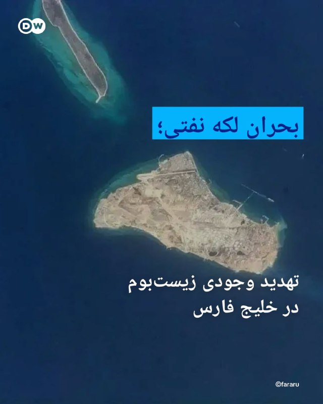

🔶 بحران لکه نفتی؛ تهدید وجودی زیست‌بوم خلیج فارس در جنگ

🔻 گزارشی از الینا فرهادی

در میانه جنگ فرسایشی و پرهزینه‌ای که طی هفته‌های اخیر خلیج فارس را به یکی از پرتنش‌ترین نقاط جهان بدل کرده، اکنون تهدیدی خاموش اما بالقوه ویرانگر، آرام‌آرام از دل آب‌های جنوب ایران سر برآورده است.

لکه‌های نفتی گسترده‌ای که تصاویر ماهواره‌ای، آن‌ها را در اطراف جزیره خارک، قشم، لاوان و بخش‌هایی از تنگه هرمز ثبت کرده‌اند، نگرانی‌ها درباره وقوع یک بحران زیست‌محیطی کم‌سابقه در قلب شاهراه انرژی جهان را افزایش داده‌اند.

اعظم بهرامی، پژوهشگر محیط زیست در تحلیل این وضعیت بحرانی در گفت‌و‌گو با دویچه وله فارسی معتقد است نخستین گام، ترسیم دقیق نقشه کانون‌های آلودگی است که در حال حاضر اکوسیستم منطقه را محاصره کرده‌اند.

منصور سهرابی، اگرواکولوژیست نیز به دویچه وله فارسی می‌گوید: «نفت با ایجاد لایه‌ای نفوذناپذیر بر سطح دریا، تبادل حیاتی اکسیژن میان هوا و آب را مختل می‌کند که این وضعیت به‌ویژه برای تخم‌ها، لاروها و موجودات ریز که در لایه‌های سطحی زندگی می‌کنند، کشنده است.»
@dw_farsi

## DW_Farsi — post 124575

  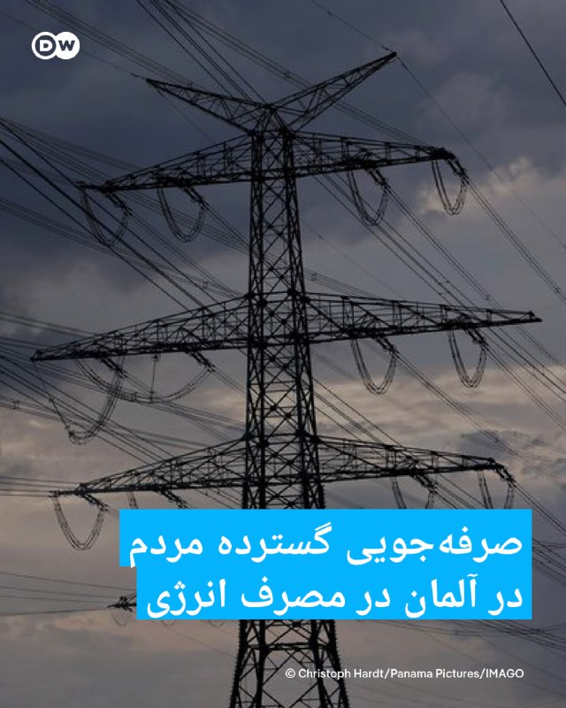

🔶 صرفه‌جویی گسترده مردم در آلمان در مصرف انرژی

طبق گزارش‌ها، بسیاری از شهروندان در آلمان به دلیل افزایش بهای انرژی در پی جنگ ایران، مصرف برق و انرژی خود را کاهش داده‌اند. خودرو نیز برای شمار زیادی از شهروندان این کشور کمتر از گذشته مورد استفاده قرار می‌گیرد.

بر اساس یک نظرسنجی که به سفارش وبسایت مقایسه قیمت "وریووکس" انجام شده، حدود دوسوم شرکت‌کنندگان، برابر با ۶۷ درصد، گفته‌اند که به دلیل افزایش هزینه‌ها، مصرف انرژی خود را آگاهانه محدود می‌کنند.

بر پایه این نظرسنجی نماینده، ۵۵ درصد از پاسخ‌دهندگان هزینه‌های گرمایش خود را کاهش می‌دهند و ۵۲ درصد بیشتر به مصرف برق خود توجه می‌کنند.

۵۶ درصد نیز گفته‌اند از روشن ماندن دستگاه‌های الکترونیکی در حالت آماده‌به‌کار پرهیز می‌کنند.

در حوزه رفت‌وآمد نیز تغییراتی دیده می‌شود. ۴۸ درصد گفته‌اند به دلیل گرانی سوخت، بیشتر اوقات از خودرو استفاده نمی‌کنند. ۲۹ درصد بیشتر از دوچرخه استفاده می‌کنند و ۲۴ درصد نیز بیشتر سوار اتوبوس و قطار می‌شوند.

در عین حال، بیش از یک‌چهارم پاسخ‌دهندگان گفته‌اند که در مصرف انرژی صرفه‌جویی نمی‌کنند.
@dw_farsi

## DW_Farsi — post 124574

  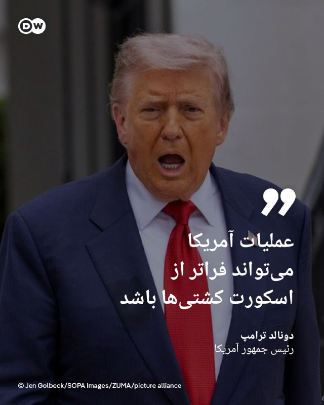

🔶 ترامپ: عملیات آمریکا می‌تواند فراتر از اسکورت کشتی‌ها باشد

دونالد ترامپ، رئیس جمهور آمریکا، روز دوشنبه ۱۱ مه (۲۱ اردیبهشت) در گفت‌وگو با شبکه فاکس‌نیوز گفت در حال بررسی ازسرگیری پروژه "آزادی" است و افزود که در صورت ازسرگیری، این عملیات از همراهی و اسکورت کشتی‌ها در تنگه هرمز فراتر خواهد رفت.

ترامپ گفت هنوز تصمیم نهایی خود را در این باره نگرفته است.

او روز دوشنبه در دفتر بیضی کاخ سفید گفت آتش‌بس میان آمریکا و جمهوری اسلامی "در وضعیت احتضار" قرار دارد، زیرا او "آن مزخرفی را که برای ما فرستادند" خوانده است. منظور او شروط پیشنهادی جمهوری اسلامی بود.

ترامپ افزود: «آن‌ها فکر می‌کنند من از این موضوع خسته می‌شوم یا حوصله‌ام سر می‌رود یا تحت فشار قرار می‌گیرم، اما هیچ فشاری در کار نیست، اصلا هیچ فشاری وجود ندارد. ما به یک پیروزی کامل خواهیم رسید.»

او در ادامه گفت مردم ایران "می‌خواهند به خیابان‌ها بیایند."

ترامپ افزود: «آن‌ها سلاح ندارند. آنها اسلحه ندارند. ما فکر می‌کردیم کردها به آن‌ها سلاح خواهند داد اما کردها ما را ناامید کردند. کردها فقط می‌گیرند و می‌گیرند. من خیلی از کردها ناامید شده‌ام.»
@dw_farsi

## Persian_Trend_Official — post 13949

  

🔹محمد باقر قالیباف

💢هیچ راهی جز پذیرش حقوق ملت ایران، آن‌گونه که در طرح ۱۴ بندی آمده، وجود ندارد.

💢هر مسیر دیگری کاملاً بی‌نتیجه خواهد بود و چیزی جز شکست‌های پیاپی به همراه نخواهد داشت.

💢هرچه بیشتر وقت‌کشی کنند، هزینه بیشتری هم از جیب مالیات‌دهندگان آمریکایی پرداخت خواهد شد.

🫆:Tony

📌 @persian_trend_official
پرشین ترند | متفاوت‌ترین کانال نظامی

## Persian_Trend_Official — post 13948

  

🔴 وال‌استریت ژورنال: امارات حملات مخفیانه‌ای علیه ایران انجام داده است

💢وال‌استریت ژورنال به نقل از منابع مدعی شد امارات متحده عربی به‌صورت مخفیانه چند حمله نظامی علیه ایران انجام داده که از جمله آن‌ها حمله به یک پالایشگاه نفت در جزیره لاوان در اوایل آوریل بوده است؛ تقریباً هم‌زمان با زمانی که ترامپ از آتش‌بس صحبت کرده بود.

💢طبق این گزارش، این حمله باعث آتش‌سوزی گسترده شده و پالایشگاه را برای چند ماه از مدار خارج کرده است.

💢در ادامه ادعا شده ایران نیز در پاسخ، حملات موشکی و پهپادی علیه امارات و کویت انجام داده است.

🫆:Tony

📌 @persian_trend_official
پرشین ترند | متفاوت‌ترین کانال نظامی

## Persian_Trend_Official — post 13947

  

🔴 ادعای سی‌بی‌اس درباره پرواز هواپیماهای ایرانی به پاکستان برای حفاظت در برابر حملات

به گزارش سی‌بی‌اس به نقل از مقامات آمریکایی، چند روز پس از اعلام آتش‌بس میان ایران و آمریکا در اوایل آوریل، چند فروند هواپیمای ایرانی به پایگاه هوایی «نور خان» نیروی هوایی پاکستان در نزدیکی راولپندی اعزام شده‌اند.

بر اساس این ادعا:

این پایگاه یک مرکز نظامی مهم در حومه اسلام‌آباد/راولپندی محسوب می‌شود.

در میان هواپیماهای اعزامی، یک فروند C-130 هرکولس نیروی هوایی ایران نیز دیده شده است

📌 این گزارش هنوز به‌طور مستقل تأیید نشده و جزئیات رسمی از سوی ایران یا پاکستان منتشر نشده است.

🫆:Tony

📌 @persian_trend_official
پرشین ترند | متفاوت‌ترین کانال نظامی

## Persian_Trend_Official — post 13946

  <a href="telegram/content/Persian_Trend_Official_13946_1778536951.mp4" target="_blank">🎬 Download video</a>

🔹 آتش سوزی در پالایشگاه اوکلاهامای آمریکا

💢منابع خبری از وقوع آتش‌سوزی در پالایشگاه شرکت اچ‌اف سینکلر در تولسا، در اوکلاهمای آمریکا خبر دادند.

💢در جریان این حادثه دود سیاه عظیمی از این تأسیسات  نفتی به آسمان برخاست.

💢مقامات هنوز علت این آتش سوزی یا اینکه آیا کسی آسیب دیده است یا خیر را اعلام نکرده‌اند.

🫆:Tony

📌 @persian_trend_official
پرشین ترند | متفاوت‌ترین کانال نظامی

## Persian_Trend_Official — post 13945

🔴 ۶۰ نماینده حزب کارگر خواستار کناره‌گیری استارمر شدند

شبکه «اسکای‌نیوز» گزارش داد تاکنون ۶۰ نماینده حزب کارگر بریتانیا خواستار کناره‌گیری «کی یر استارمر» نخست‌وزیر این کشور شده‌اند.

🫆:Tony

📌 @persian_trend_official
پرشین ترند | متفاوت‌ترین کانال نظامی

## Persian_Trend_Official — post 13944

  <a href="telegram/content/Persian_Trend_Official_13944_1778536953.webm" target="_blank">🎬 Download video</a>

💢وزیر دفاع بلژیک

💢به فرانسه و انگلیس برای پاکسازی تنگه هرمز از مین‌های دریایی و بازگشت به دریانوردی آزاد خواهیم پیوست.

🫆:Tony

📌 @persian_trend_official
پرشین ترند | متفاوت‌ترین کانال نظامی

## Persian_Trend_Official — post 13943

🔴وزارت خزانه داری آمریکا اطلاع داده که تحریم های جدیدی علیه افراد مرتبط با جمهوری اسلامی اعمال کرده است

🫆:Tony

📌 @persian_trend_official
پرشین ترند | متفاوت‌ترین کانال نظامی

## Persian_Trend_Official — post 13942

  <a href="telegram/content/Persian_Trend_Official_13942_1778536954.webm" target="_blank">🎬 Download video</a>

🔴سی‌ان‌ان: جزئیات بخشی از جدیدترین پیشنهاد ایران که ترامپ آن را رد کرد را منتشر نمود

💢 دریافت غرامت بابت خسارات جنگی

💢 به رسمیت شناختن حاکمیت ایران بر تنگه هرمز

💢 پایان دزدی دریایی آمریکا علیه کشتی‌های ایرانی

💢 آزادسازی دارایی‌های مسدود شده ایران

🫆:Tony

📌 @persian_trend_official
پرشین ترند | متفاوت‌ترین کانال نظامی

## Persian_Trend_Official — post 13941

https://youtube.com/live/rsDox1i9jQs?feature=share

## Persian_Trend_Official — post 13940

  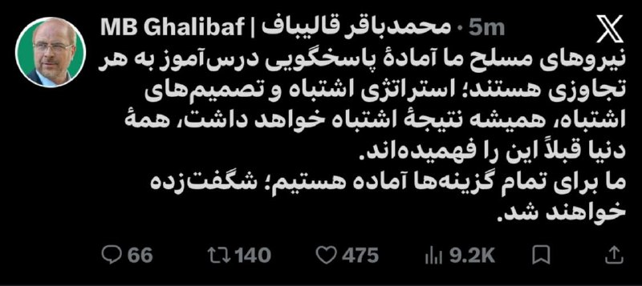

🔴محمد باقر قالیباف

‏💢نیروهای مسلح ما آمادهٔ پاسخگویی درس‌آموز به هر تجاوزی هستند؛ استراتژی اشتباه و تصمیم‌های اشتباه، همیشه نتیجهٔ اشتباه خواهد داشت، همهٔ دنیا قبلاً این را فهمیده‌اند.
‏ما برای تمام گزینه‌ها آماده هستیم؛ شگفت‌زده خواهند شد.

🫆:Tony

📌 @persian_trend_official
پرشین ترند | متفاوت‌ترین کانال نظامی

## Persian_Trend_Official — post 13936

  <a href="telegram/content/Persian_Trend_Official_13936_1778536955.webm" target="_blank">🎬 Download video</a>

سیگنال هسته‌ای آمریکا در میانه تنش‌ها؟🇺🇸

⭕️طبق تصاویر موجود و اخبار اعلام شده زیردریایی هسته ای USS Alaska (SSBN 732) از کلاس اوهایو که حامل موشک های بالستیک اتمی ترایدنت می باشد، از تنگه جبل الطارق عبور کرده و وارد دریای مدیترانه شده است.

⭕️نقش زیر دریایی های SSBN بازدارندگی استراتژیک هسته‌ای است این زیر دریایی ها توانایی شلیک موشک های بالستیک هسته ای ترایدنت 2 را دارند و ستون فقرات نیروی بازدارنده هسته‌ای دریایی آمریکا محسوب می‌شوند.

⭕️برای تنها سومین بار در ۲۵ سال گذشته، یک زیردریایی اتمی حامل تسلیحات هسته ای ایالات متحده در جبل‌الطارق حضور دارد. این حضور به احتمال زیاد در چارچوب مأموریت بازدارندگی گسترده Extended Deterrence /فرماندهی استراتژیک ایالات متحده (STRATCOM) انجام شده است

⭕️این مأموریت‌ها برای اطمینان به متحدان (مانند اسرائیل، کشورهای خلیج فارس و اروپا) است که آمریکا آماده حمایت با تمام قابلیت‌ها (از جمله هسته‌ای) است.

📝 Nick

📌 @persian_trend_official
پرشین ترند | متفاوت‌ترین کانال نظامی

## Persian_Trend_Official — post 13935

⭕️ رئیس هوانوردی غیرنظامی اسرائیل هشدار داد که فرودگاه بین‌المللی تل‌آویو در ساعات اخیر عملاً به پایگاه نظامی آمریکا تبدیل شده است.

📝 Nick

📌 @persian_trend_official
پرشین ترند | متفاوت‌ترین کانال نظامی

## RadioFarda — post 157068

آمریکا تحریم‌های جدیدی را علیه شبکه مالی حامی ایران اعمال کرد

🔸وزارت خزانه‌داری آمریکا در ادامه کارزار «خشم اقتصادی» علیه تهران، از اعمال تحریم‌های جدیدی علیه شبکه‌های مالی حامی جمهوری اسلامی خبر داد.

🔸بر اساس بیانیه‌ای که در وب‌سایت رسمی این وزارتخانه منتشر شد، واشینگتن ۳ فرد و ۹ نهاد را به فهرست تحریم‌های خود اضافه کرده است.

🔸نکته قابل توجه در این فهرست، حضور ۴ شرکت مستقر در هنگ‌کنگ است که به گفته مقامات آمریکایی، «نقشی کلیدی در تسهیل جابه‌جایی پول و دور زدن تحریم‌های نفتی ایران در بازارهای آسیایی» ایفا می‌کردند.

🔸بر اساس بیانیۀ وزارت خزانه‌داری ایالات متحده، این افراد و شرکت‌ها، انتقال نفت ایران به چین را تسهیل می‌کرده‌اند.

🔸مقامات وزارت خزانه‌داری آمریکا پیشتر تأکید کرده بودند که ردیابی دارایی‌های سپاه پاسداران در بانک‌های بین‌المللی با همکاری متحدان منطقه‌ای با سرعت بیشتری ادامه خواهد یافت.

🔸به گزارش رویترز، تحلیلگران معتقدند هدف قرار دادن شرکت‌های مستقر در هنگ‌کنگ، پیامی صریح به شبکه‌های واسطه در شرق آسیاست که همچنان به همکاری مالی با تهران ادامه می‌دهند. این تحریم‌ها در شرایطی اعمال می‌شود که بن‌بست دیپلماتیک میان واشینگتن و تهران بر سر بازگشایی تنگه هرمز و برنامه هسته‌ای همچنان پابرجاست.

@RadioFarda

## RadioFarda — post 157067

  

تشکیل جلسه امنیتی در کاخ سفید برای تصمیم‌گیری درباره جنگ ایران

🔸در پی سخنان دونالد ترامپ درباره پیشنهادات تازه ایران، وب‌سایت خبری اکسیوس روز دوشنبه به نقل از سه منبع خبر داد که قرار است برای تصمیم‌گیری درباره گام‌های پیشِ رو در مورد ایران در کاخ سفید جلسه امنیتی تشکیل شود.

🔸به نوشته اکسیوس، بررسی امکان بازگشت به حمله نظامی از جمله این گام‌های احتمالی است.

🔸بر اساس این گزارش، علاوه بر رئیس جمهور آمریکا، جی‌دی ونس، معاون او، استیو ویتکاف، نماینده ویژه ترامپ، مارکو روبیو، وزیر خارجه، و پیت هگست، وزیر دفاع، نیز در این جلسه حضور خواهند داشت.

🔸اکسیوس از دن کین، رئیس ستاد مشترک ارتش آمریکا، و جان رتکلیف، رئیس سی‌آی‌ای، به عنوان دو شرکت‌کننده دیگر در این جلسه امنیتی نام برده است.

🔸این جلسه پس از آن برگزار می‌شود که ترامپ در دفتر کار خود در گفت‌وگو با خبرنگاران پیشنهادات تازه حکومت ایران را «احمقانه» و «آشغال» نامید و چنین نظر داد که آتش‌بس فعلی به‌زور زنده نگه داشته شده است.

@RadioFarda

## RadioFarda — post 157066

  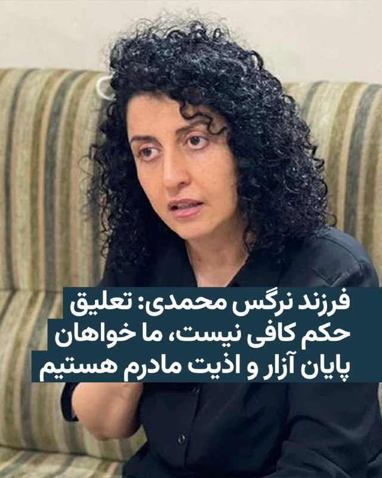

🔸در پی انتشار خبر انتقال نرگس محمدی به بیمارستانی در تهران در پی وخامت هر چه بیشتر حالش، علی رحمانی، پسر او، در پیامی در شبکه ایکس تأکید کرد که خانواده خانم محمدی خواهان «پایان دائمی آزار و اذیت‌های قضایی» هستند.

🔸علی رحمانی، پسر نرگس محمدی و مدیر بنیاد نرگس، هشدار داده است: «پس از سال‌ها حبس، سلول انفرادی و بی‌توجهی سیستماتیک پزشکی، زندگی او در بخش مراقبت‌های ویژه (CCU) همچنان به مویی بند است.»

🔸او در ادامه تأکید کرده است: «ما نمی‌خواهیم او تنها برای چند روز از زندان خارج شود؛ ما خواستار پایان دائمی این آزار و اذیت‌های قضایی هستیم. مادر من به آزادی بی‌قید و شرط و مراقبت‌های تخصصی و طولانی‌مدت نیاز دارد.»

🔸مصطفی نیلی، وکیل دادگستری، روز ۲۰ اردیبهشت خبر داد که محمدی برای طی کردن مراحل درمان به بیمارستانی در تهران منتقل شده است.

🔸او در شبکه ایکس نوشت: «امروز خانم نرگس محمدی با صدور دستور توقف حکم برای انجام درمان از بیمارستان زنجان خارج و با آمبولانس به بیمارستان پارس تهران منتقل و بستری شدند.»

@RadioFarda

## IranianMinds — post 19978

🔴 کی‌ر استارمر، نخست وزیر بریتانیا : می‌دونم مردم و حتی کشور ازم ناراضی شدن

ولی قصد ندارم استفعا بدم و می‌خوام ثابت کنم که منتقدها اشتباه میکنن

@IranianMinds

## IranianMinds — post 19977

  

🔴 قالیباف:

نیروهای مسلح ما آماده‌اند تا پاسخ شایسته‌ای به هرگونه تجاوز بدهند؛ استراتژی اشتباه و تصمیمات نادرست همیشه به نتایج اشتباه منجر می‌شوند — کل جهان قبلاً این را فهمیده است.

ما برای همه گزینه‌ها آماده‌ایم؛ آن‌ها غافلگیر خواهند شد.

@IranianMinds

## IranianMinds — post 19976

🔴وال‌استریت‌ژورنال:

حمله ماه پیش به جزیره لاوان ایران، کار امارات بوده است.

@IranianMinds

## IranianMinds — post 19975

🔴کانال ۱۲ اسرائیل:

رئیس جمهور ترامپ تمایل دارد دستور از سرگیری درگیری با ایران را صادر کند.

@IranianMinds

## IranianMinds — post 19974

  

درود قهرمان.

@IranianMinds

## IranianMinds — post 19973

  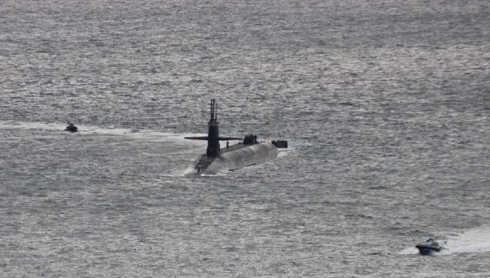

🔴 ارتش آمریکا :

زیردریایی هسته‌ای اوهایو ایالات متحده مجهز به موشک‌ های بالستیک در مسیر خاورمیانه وارد جبل‌الطارق شد

@IranianMinds

## IranianMinds — post 19972

  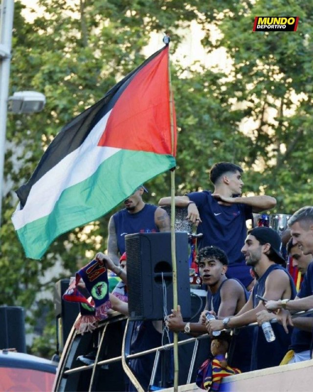

لامین یامال بازیکن چپول بارسلونا که تو‌ جشن قهرمانی بارسا پرچم فلسطینو گرفته دستش

@IranianMinds

## BBCPersian — post 280793

  

🔻به گزارش نشریه آمریکایی وال استريت ژورنال، امارات متحده عربی به‌طور مخفيانه حملات نظامی عليه ايران انجام داده است؛ موضوعی که به گفته منابع آگاه به این نشریه، می تواند امارات را به يکی از طرف‌های فعال مخاصمه با ایران مطرح کند.

منابع آگاه به وال استریت ژورنال گفته‌اند حملاتی که امارات تاکنون به‌صورت علنی تاييد نکرده، شامل حمله به يک پالايشگاه در جزيره لاوان در خليج فارس بوده است.

در اوايل آوريل گذشته و هم‌زمان با اعلام آتش‌بس از سوی دونالد ترامپ چند حمله هوایی به تاسیسات نفتی ایران در جزایر این کشور و اصطلاحا مناطق فلات قاره شرکت ملی نفت ایران صورت گرفت که باعث آتش‌سوزی گسترده و خروج بخش بزرگی از ظرفيت پالايشگاه لاوان از مدار برای چندين ماه شد.

ايران در آن زمان اعلام کرده بود اين پالايشگاه در يک «حمله دشمن» هدف قرار گرفته و در پاسخ، موجی از حملات موشکی و پهپادی عليه امارات و کويت انجام داده است.

📸AFP via Getty Images
https://bbc.in/4tyiBDX
@BBCPersian

## BBCPersian — post 280792

🔻رئیس سازمان انرژی اتمی: غنی‌سازی قابل مذاکره نیست

محمد اسلامی، رئیس سازمان انرژی اتمی ایران در نشست کمیسیون امنیت ملی مجلس با اشاره به این که «فناوری هسته‌ای در دستور کار مذاکرات قرار ندارد» گفت که برنامه غنی‌سازی ایران «قابل مذاکره نیست.»

آقای اسلامی گفت که «تمهیدات لازم» برای حفاظت از مراکز و دارایی‌های هسته‌ای ایران انجام شده است.

دونالد ترامپ عصر امروز درباره ذخیره اورانیوم غنی‌شده ایران گفته بود: «ایران به من گفت که می‌خواهد گردوغبار هسته‌ای را به ما بدهند. اما باید خودتان آن را خارج کنید.»

https://bbc.in/4nlrNud
@BBCPersian

## BBCPersian — post 280791

🔻نماینده ایران در سازمان بین‌المللی دریانوردی: اقدام آمریکا علیه دو نفتکش حامل خدمه ایرانی غیرقانونی است

نماینده جمهوری اسلامی ایران در سازمان بین‌المللی دریانوردی (آیمو) در نامه‌ای به دبیرکل این سازمان، اقدام علیه دو نفتکش حامل خدمه ایرانی را «غیرقانونی و غیرانسانی» خواند و واشنگتن را «مسئول جان و سلامت دریانوردان» گرفتار در این وضعیت دانست.

به گفته علی موسوی، این دو نفتکش در جریان عملیات محاصره دریایی آمریکا و به دلیل آن چه که «حمل محموله مرتبط با ایران» خوانده شده، توقیف شده‌اند.

در این نامه آمده است که حدود ۶۰ نفر از خدمه دو نفتکش «ام‌تی تیفانی» و «ام‌تی ماجستیک» پس از توقیف، به یدک‌کش منتقل شده‌اند و در شرایطی «نامناسب و ناامن» نگهداری می‌شوند.

در این نامه گفته شده است که که این افراد تاکنون بیش از«۱۲۰۰ مایل دریایی» جابه‌جا شده‌اند و با کمبود غذا و آب روبه‌رو هستند.

آقای موسوی همچنین گفته است که این شناور اجازه حرکت به سمت مالزی را نداشته و تحت فشار نیروهای آمریکایی به سمت سنگاپور هدایت شده، اما هنوز مجوز پیاده شدن خدمه در این بندر صادر نشده است.

نماینده ایران در آیمو با محکوم کردن رفتار آمریکا، این اقدامات را «غیرقانونی، غیرانسانی و مغایر با اصول بنیادین ایمنی جان انسان‌ها در دریا» توصیف کرد و هشدار داد که ادامه این وضعیت می‌تواند پیامدهای انسانی فاجعه‌باری به همراه داشته باشد.

او از دبیرکل آیمو و کشورهای عضو خواست برای ارسال فوری غذا، آب و کمک‌های پزشکی و همچنین فراهم کردن شرایط امن برای انتقال و تعیین تکلیف خدمه اقدام کنند.

https://bbc.in/49pCSo6
@BBCPersian

## BBCPersian — post 280790

  <a href="telegram/content/BBCPersian_280790_1778536962.mp4" target="_blank">🎬 Download video</a>

🔻آخرین خبرهای مهم روز دوشنبه ۲۱ اردیبهشت ۱۴۰۵

@BBCPersian

## BBCPersian — post 280789

🔻لیتوانی اعزام نیروی نظامی برای کمک به آمریکا در تنگه هرمز را بررسی می‌کند

لیتوانی اعزام نیروی نظامی برای کمک به ایالات متحده در تنگه هرمز را بررسی می‌کند.

شورای دفاع دولتی لیتوانی که ریاست آن با رئیس‌جمهور است، امروز طرحی در این زمینه به پارلمان فرستاد.

این طرح می گوید که به دنبال آن است که لیتوانی بتواند تا ۴۰ سرباز و نیروی نظامی برای کمک به ایالات متحده در تنگه هرمز اعزام کند.

https://bbc.in/4d4DBxt
@BBCPersian

## BBCPersian — post 280788

🔻وزیر ارتباطات: در تلاش هستیم تا اینترنت در اسرع وقت برقرار شود

وزیر ارتباطات و فناوری اطلاعات با اشاره به قطع اینترنت گفته است که این وزارتخانه به نمایندگی از مردم به صورت شبانه روزی در حال پیگری است تا «دسترسی با کیفیت به اینترنت بین‌الملل برای کاربران در اسرع وقت برقرار شود.»

ستار هاشمی گفت که یکی از مطالبات به حق مردم و کسب و کارها از حاکمیت «دسترسی با کیفیت به اینترنت است.»

به گفته وزیر ارتباطات محدودیت دسترسی به اینترنت بین‌المللی به دلیل شرایط جنگی و بر اساس صلاح‌دید مراجع مربوطه بوده است.

او همچنین با ابراز امیدواری به این که این وضعیت هر چه سریع‌تر بهبود پیدا کند، افزود در این مورد جلسات مکرری در حوزه‌های مختلف برگزار شده است.

از زمان شروع جنگ در نهم اسفند ماه سال گذشته دسترسی به اینترنت در ایران قطع شده است.

https://bbc.in/4ubn7K2
@BBCPersian

## BBCPersian — post 280787

🔻قالیباف: برای تمام گزینه‌ها آماده هستیم

محمدباقر قالیباف، رئیس مجلس ایران گفته است که نیروهای مسلح ایران آماده «پاسخگویی» به «تجاوز» طرف مقابل هستند.

او در پیامی در شبکه ایکس با اشاره ضمنی به آتش‌بس میان ایران و آمریکا نوشت: «استراتژی اشتباه و تصمیم‌های اشتباه، همیشه نتیجهٔ اشتباه خواهد داشت... ما برای تمام گزینه‌ها آماده هستیم؛ شگفت‌زده خواهند شد.»

ساعتی پیش دونالد ترامپ، رئیس جمهور آمریکا یک بار دیگر از پاسخ ایران به پیشنهاد آمریکا به‌شدت انتقاد کرد و هشدار داد که آتش‌بس در وضعیت بسیار شکننده‌ای قرار دارد.

https://bbc.in/435QelK
@BBCPersian

## BBCPersian — post 280786

🔻آرامکو: بازگشت بازار انرژی به تعادل حتی در صورت بازگشایی تنگه هرمز، تا سال ۲۰۲۷ طول می‌کشد

رئیس شرکت ملی نفت عربستان، آرامکو، روز دوشنبه به سرمایه‌گذاران گفت جنگ خاورمیانه بزرگ‌ترین شوک انرژی تاریخ جهان را رقم زده و حتی اگر محاصره تنگه هرمز به‌زودی برداشته شود، روند بازگشت بازار احتمالاً تا سال ۲۰۲۷ ادامه خواهد داشت.

امین ناصر گفت: «شوک عرضه انرژی که از سه‌ماهه اول آغاز شد، بزرگ‌ترین شوکی است که جهان تاکنون تجربه کرده است.»

او افزود: «اگر تنگه هرمز امروز باز شود، باز هم ماه‌ها زمان لازم است تا بازار به تعادل برسد و اگر بازگشایی آن چند هفته دیگر هم به تأخیر بیفتد، عادی شدن شرایط تا سال ۲۰۲۷ طول خواهد کشید.»

https://bbc.in/4f9PPGk
@BBCPersian

## Dirty_Kids — post 389287

  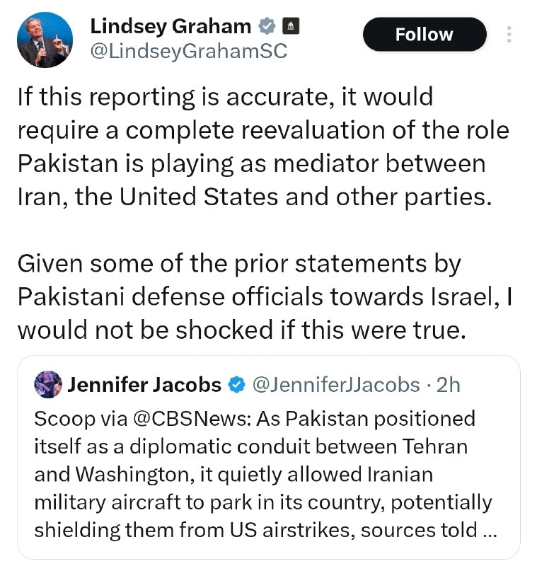

ظاهراً عمو «لینسی گراهام»، این رفیق گرمابه و گلستان ترامپ شیر خدا قراره دهن کشور نیوخایه‌مال پاکستان رو در این مقطع بگاد

طبق توئیت خبرنگار بلومبرگ، در دوران آتش‌بس روافض هزارپدر چند فروند از هواپیماهای نظامی‌شون رو از جمله یک فروند RC-130 که مدلی پیشرفته از هواپیمای هرکولس C-130 برای عملیات‌های شناسایی و جمع‌آوری اطلاعاته رو به پایگاه هوایی نورخان پاکستان قرمساق فرستاده و اونجا پارک کرده [ظاهراً تعدادی رو هم به افغانستان فرستاده]

عمو «لینسی گراهام» در توئیتی نظرش در خصوص این کسکلک‌بازی پاکستانی‌ها رو این‌طور بیان کرده:

«اگه این گزارش‌ها صحت داشته باشه، نقش پاکستان قرمدنگ به عنوان میانجی‌گر بین شیعه‌سانان رافضی، آمریکا و سایر طرف‌ها باید به طور کامل مورد بازنگری قرار بگیره. [این کسکشای نیوخایه‌مال هم از توبره دارن می‌خورن هم از آخور]

با توجه به مواضع تندی که برخی مقامات دفاعی قرمساق پاکستانی علیه اسرائیل اتخاذ کرده بودن، اگه این خبر واقعیت داشته باشه [دهنشون گاییده‌ست] و خیلی شوکه نمی‌شم [از این بی‌شرفای جاکش‌پدر].»

@Dirty_Kids 👻

## Dirty_Kids — post 389286

  <a href="telegram/content/Dirty_Kids_389286_1778536965.mp4" target="_blank">🎬 Download video</a>

🔴تو قسمت جدید سریال "ايفوريا | Euphoria" سیدنی سویینی حسابی به فوت فتیش‌ها حال داده و علاوه بر نمایش پاهاش، اونارو شخصا لیس زده!

+ تو این سریالِ فاخر، بانو سویینی به علت مسائل مالی، اکانت اونلی فنز زده و داره از این طریق، امرار معاش میکنه.

@Dirty_Kids 👻

## Dirty_Kids — post 389283

  <a href="telegram/content/Dirty_Kids_389283_1778536968.mp4" target="_blank">🎬 Download video</a>

لامین یامال بازیکن بی اخلاق و خانم‌باز بارسا توی جشن قهرمانی بارسلونا پرچم فلسطین را برافراشته.

+ این در جریان ۱ ماه دیگه باید بره امریکا لای کلی ایرانی؟

@Dirty_Kids 👻

## Dirty_Kids — post 389282

  <a href="telegram/content/Dirty_Kids_389282_1778536970.webm" target="_blank">🎬 Download video</a>

🎶 کانفیگ من کجایی

@Dirty_Kids 👻

## Dirty_Kids — post 389281

‏صدا سیما از آپارات شکایت کرده و 3.5 همت براش حکم بریده
بعد یجوری تیم مدیریتی آپارات توقع دارن مردم پشتشون باشن انگار تا الان درصدی پشت مردم بودن
کون لقتون خودتون داخل خودتون کون خودتون رو پاره کنید

پ‌ن: درصدی دلتون نسوزه
طرف مالک صبا ایده‌س جدای آپارات کلی پلتفرم رانتی دیگه از جمله فیلیمو داره که سالها 10 ها برابر این هزینه رو از هر کدومش دراورده
بعد جالبه کسی که خودش صادر کننده حکم اولیه انحصار پلتفرم توی فعالیت های مجازیه از انحصار صدا و سیما میناله
هنوز سایت فیلم و سریال های متفاوتی که با شکایت فیلیمو به فاک رفتن چون رایگان بودن از یاد کسی نرفته
جالبی ماجرا چیه؟
خود فعالیت فیلیمو غیرقانونیه از نظر جهانی و دقیقا همون فیلم سریال خارجی رو از تورنت به رایگان میگیرن انکد میکنن و با اشتراک میدن دست ملت
چرا؟ چون مردم صلاحیت استفاده از بیت تورنت رو ندارن و شورای فیلترینگ از همون اول اکثر ترکر ها رو فیلتر کرده برای مردم عادی!!!!
درصدی این افراد دم از وای آزادی بیان و انحصار بازار بزنن باید کیرتو در بیاری شلاقی بذاری دهنشون!

@Dirty_Kids 👻

## Dirty_Kids — post 389280

اگه اینترنت غزه ۷۲ روز قطع می‌شد گرتا تونبرگ به نشانه‌ی اعتراض ۷۲ متر کابل اینترنت رو می‌کرد تو کونش.

@Dirty_Kids 👻

## Dirty_Kids — post 389279

  <a href="telegram/content/Dirty_Kids_389279_1778536970.mp4" target="_blank">🎬 Download video</a>

وقتی آبرو نداری، نگران از دست دادنش نیستی و حد و مرزی برات وجود نداره در دروغ و تظاهر و فرومایگی و رنگ عوض کردن و جنایت و .... !! شرم بر کسانی که هنوز امید به اصلاح و بهبود از این نکبت دارند !!

@Dirty_Kids 👻

## Dirty_Kids — post 389278

اعدام رتبه اول کنکور، یه تحقیری توش هست که در کلام نمیگنجه.

این تحقیر یک ملته. تحقیر علمیه. تحقیر انسانه.

نابودی یک تمدن اینه.

@Dirty_Kids 👻

## Dirty_Kids — post 389277

  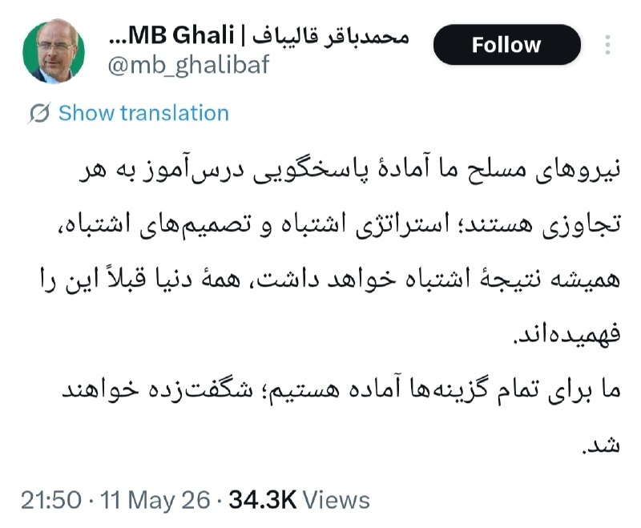

قالیباف در جواب به ترامپ

@Dirty_Kids 👻

## Dirty_Kids — post 389276

  <a href="telegram/content/Dirty_Kids_389276_1778536973.webm" target="_blank">🎬 Download video</a>

🔴خبرگزاری آکسیوس | Axios :
ترامپ در حال بررسی گزینه‌های نظامی علیه ایران از جمله ازسرگیری بمبارون یا عملیات تو تنگه هرمز هستش.

@Dirty_Kids 👻

## Hranews — post 112891

گزارشی از قطع بیمه کارگران شهرداری ارومیه

❗️
❗️
❗️
❗️
❗️– شماری از #کارگران شهرداری ارومیه از قطع بیمه درمانی خود خبر دادند. اداره تامین اجتماعی ارومیه به دلیل بدهی‌های مالی شهرداری به تامین اجتماعی، از تمدید اعتبار درمان این کارگرانی که نیازمند خدمات هستند، خودداری کرده است.

ادامه مطلب

↘️
@hranews_bot تماس ✉️ - @Hranews کانال هرانا 🆑

## Hranews — post 112890

ایرانشهر؛ ۴ شهروند در پی تیراندازی بی‌ضابطه نیروهای امنیتی کشته شدند

❗️
❗️
❗️
❗️
❗️– روز گذشته در پی #تیراندازی_بی‌ضابطه نیروهای اداره اطلاعات ایرانشهر به سمت یک خودرو، چهار سرنشین آن جان خود را از دست دادند.

ادامه مطلب

↘️
@hranews_bot تماس ✉️ - @Hranews کانال هرانا 🆑

## Hranews — post 112889

مرگ و مصدومیت ۳ کارگر از جمله یک آتش‌نشان در سایه فقدان ایمنی کار

❗️
❗️
❗️
❗️
❗️– در سایه فقدان ایمنی محیط و شرایط نامناسب کار، سه #کارگر از جمله یک آتش‌نشان در شهرهای مشهد و ملایر، حین انجام کار دچار حادثه شدند. طی این حوادث دو کارگر مصدوم و یک تن دیگر جان خود را از دست داد.

ادامه مطلب

↘️
@hranews_bot تماس ✉️ - @Hranews کانال هرانا 🆑

## Hranews — post 112888

صدور حکم اعدام برای یک متهم در تهران/ رهایی یک زندانی از چوبه‌دار

❗️
❗️
❗️
❗️
❗️– یک متهم به قتل در تهران توسط شعبه ۱۰ دادگاه کیفری این استان به #اعدام محکوم شد. از سوی دیگر، یک زندانی در تهران که پیشتر بابت اتهام قتل به مجازات مرگ محکوم شده بود، با گذشت اولیای دم از چوبه‌دار رهایی یافت.

ادامه مطلب

↘️
@hranews_bot تماس ✉️ - @Hranews کانال هرانا 🆑

## manototv — post 105326

  <a href="telegram/content/manototv_105326_1778536974.mp4" target="_blank">🎬 Download video</a>

روزنامه وال‌استریت ژورنال به نقل از منابع آگاه گزارش داد امارات متحده عربی به‌طور مخفیانه حملاتی نظامی علیه جمهوری اسلامی انجام داده و به یکی از طرف‌های مستقیم جنگ تبدیل شده است.

بر اساس این گزارش، یکی از این حملات در ماه آوریل پالایشگاه نفتی لاوان در خلیج فارس را هدف قرار داده؛ حمله‌ای که همزمان با اعلام آتش‌بس از سوی دونالد ترامپ رخ داده و باعث آتش‌سوزی گسترده و از کار افتادن بخش بزرگی از ظرفیت پالایشگاه برای چند ماه شده است.

به نوشته وال‌استریت ژورنال، جمهوری اسلامی در آن زمان اعلام کرده بود پالایشگاه در «حمله دشمن» هدف قرار گرفته و در واکنش، موجی از حملات موشکی و پهپادی علیه امارات و کویت انجام داده است.

این گزارش می‌گوید آمریکا از حمله امارات ناراضی نبوده و به‌طور غیرعلنی از مشارکت کشورهای خلیج فارس در جنگ علیه جمهوری اسلامی استقبال کرده است.

وزارت خارجه امارات از اظهار نظر مستقیم درباره این حملات خودداری کرده، اما به بیانیه‌های پیشین خود درباره «حق پاسخ، از جمله پاسخ نظامی، به اقدامات خصمانه» اشاره کرده است.

وال‌استریت ژورنال همچنین گزارش داد جمهوری اسلامی بیش از ۲۸۰۰ موشک و پهپاد به سمت امارات شلیک کرده؛ حملاتی که به بخش‌های هوایی، گردشگری و بازار املاک این کشور آسیب زده است.

در این گزارش آمده امارات پس از آغاز جنگ، همکاری نظامی خود با آمریکا را حفظ کرده و همزمان اقداماتی علیه منافع مالی جمهوری اسلامی، از جمله محدودیت برای شهروندان ایرانی و تعطیلی مراکز مرتبط با تهران در دبی، انجام داده است.

## manototv — post 105325

  <a href="telegram/content/manototv_105325_1778536975.mp4" target="_blank">🎬 Download video</a>

‌
محمدباقر قالیباف، رئیس مجلس شورای اسلامی، در پیامی به زبان انگلیسی در شبکه اکس نوشت «هیچ» جایگزینی جز پذیرش «طرح ۱۴ ماده‌ای» وجود ندارد.

قالیباف افزود:
«هر رویکرد دیگری کاملاً بی‌نتیجه خواهد بود و چیزی جز شکست‌های پی‌درپی به همراه نخواهد داشت. هرچه بیشتر وقت‌کشی کنند، هزینه بیشتری بر دوش مالیات‌دهندگان آمریکایی گذاشته خواهد شد.»

## manototv — post 105324

  <a href="telegram/content/manototv_105324_1778536976.mp4" target="_blank">🎬 Download video</a>

تماسی از چنارشاهیجان کازرون:
از جاویدنامان علیرضا نادری، عارف براتی، فرزانه ساسانی‌پور، بهبود حسن‌زاده، جبار پناهی و آنیسا هوشنگی گفت…

## manototv — post 105323

  <a href="telegram/content/manototv_105323_1778536979.mp4" target="_blank">🎬 Download video</a>

وزارت خزانه‌داری آمریکا اعلام کرد ۱۲ فرد و نهاد را به‌دلیل نقش در فروش و انتقال نفت جمهوری اسلامی توسط سپاه پاسداران به چین تحریم کرده است.

در بیانیه دفتر کنترل دارایی‌های خارجی وزارت خزانه‌داری آمریکا آمده سپاه پاسداران برای پنهان کردن نقش خود در فروش نفت و انتقال درآمدها به جمهوری اسلامی، از شرکت‌های پوششی در کشورهای مختلف استفاده می‌کند.

اسکات بسنت، وزیر خزانه‌داری آمریکا، گفت: «در حالی که ارتش ایران تلاش می‌کند خود را بازسازی کند، عملیات “خشم اقتصادی” به محروم کردن جمهوری اسلامی از منابع مالی برنامه‌های تسلیحاتی، نیروهای نیابتی و جاه‌طلبی‌های هسته‌ای ادامه خواهد داد.»

وزارت خزانه‌داری آمریکا همچنین اعلام کرد جمهوری اسلامی به‌جای استفاده از درآمدهای نفتی برای حمایت از مردم ایران، این منابع را صرف توسعه تسلیحات، حمایت از گروه‌های نیابتی و تأمین مالی نیروهای امنیتی می‌کند.

در میان افراد تحریم‌شده، نام احمد محمدی‌زاده، رئیس قرارگاه نفتی شهید پورجعفری سپاه، صمد فتحی سلامی، مسئول مالی این قرارگاه، و محمدرضا اشرفی گهی، مسئول بازرگانی آن، دیده می‌شود.

همچنین چند شرکت مستقر در هنگ‌کنگ، دبی، عمان و شارجه به اتهام همکاری در انتقال نفت ایران و دور زدن تحریم‌ها هدف تحریم قرار گرفته‌اند.

وزارت خزانه‌داری آمریکا هشدار داد هر شرکت یا مؤسسه مالی خارجی که با شبکه‌های مرتبط با سپاه پاسداران همکاری کند، ممکن است هدف تحریم‌های ثانویه آمریکا قرار گیرد.

## manototv — post 105322

  <a href="telegram/content/manototv_105322_1778536980.mp4" target="_blank">🎬 Download video</a>

تماسی از رشت:
«از رضا سمیع‌پور گفت…
۵۱ ساله، مردی نجیب و حامی حیوانات که جلوی خانه‌اش از پشت هدف گلوله قرار گرفت.
و از آیدین دولت‌خواه…
جوان ۲۲ ساله‌ای که با چهار گلوله کشته شد.

## manototv — post 105321

  <a href="telegram/content/manototv_105321_1778536983.mp4" target="_blank">🎬 Download video</a>

نمایشگاه عکس «حکومت اعدام» پس از یک ماه برگزاری در شهرهای برلین، لاهه، آمستردام، بروکسل، پاریس و ژنو، روز گذشته در آخرین ایستگاه خود در شهر کلن آلمان به کار خود پایان داد.

این نمایشگاه با هدف جلب توجه افکار عمومی اروپا به نقض گسترده حقوق بشر و موج اعدام‌ها در ایران برگزار شد و تصاویری از قربانیان اعدام‌شده طی ۴۸ سال گذشته، در کنار زندانیانی که اکنون در خطر اجرای حکم اعدام قرار دارند، به نمایش گذاشت.

همزمان، پرفرمنس «حکومت اعدام» نیز در تمامی روزهای برگزاری اجرا شد؛ اجرایی نمادین درباره اعدام، سرکوب و کشتار معترضان و جوانان ایران در دهه‌های گذشته.

این پروژه تلاش داشت با استفاده از تصویر، هنر و روایت، توجه رسانه‌ها، افکار عمومی و سیاستمداران اروپایی را به ادامه روند اعدام‌ها در جمهوری اسلامی جلب کند.

## manototv — post 105320

  <a href="telegram/content/manototv_105320_1778536985.mp4" target="_blank">🎬 Download video</a>

مونترال|کبک کانادا؛
رالی خودرو و گردهمایی ایرانیان

## manototv — post 105319

  <a href="telegram/content/manototv_105319_1778536988.mp4" target="_blank">🎬 Download video</a>

‌
وب‌سایت اکسیوس به نقل از سه مقام آمریکایی گزارش داد دونالد ترامپ امروز با اعضای تیم امنیت ملی خود درباره گام‌های بعدی در جنگ با جمهوری اسلامی دیدار خواهد کرد.

بر اساس این گزارش، ازسرگیری احتمالی اقدام نظامی علیه جمهوری اسلامی از جمله گزینه‌هایی است که در این نشست بررسی می‌شود.

ترامپ پیش‌تر گفته بود قرار است با «ژنرال‌های ارشد» خود دیدار کند.

به گزارش اکسیوس، جی‌دی ونس، معاون رئیس‌جمهوری آمریکا، استیو ویتکاف، فرستاده ویژه کاخ سفید، مارکو روبیو، وزیر خارجه، و پیت هگست، وزیر دفاع آمریکا نیز در این نشست حضور خواهند داشت.

## alonews — post 119400

  <a href="telegram/content/alonews_119400_1778536988.webm" target="_blank">🎬 Download video</a>

👈کیر استارمر: استعفا نمیدم

✅ @AloNews خبر جنگ

## alonews — post 119399

  <a href="telegram/content/alonews_119399_1778536989.webm" target="_blank">🎬 Download video</a>

👈وال استریت ژورنال:
در پی حمله امارات به لاوان ایران پس از اعلام آتش بس ترامپ و تهران، ایران با حملات موشکی و پهپادی به امارات و کویت پاسخ داد.

🔴ایالات متحده از این حملات امارات ناراحت نشده و به‌طور خصوصی از مشارکت امارات و دیگر کشورهای حوزه خلیج فارس که مایل به پیوستن به نبرد هستند، استقبال کرده است.

✅ @AloNews خبر جنگ

## alonews — post 119398

  <a href="telegram/content/alonews_119398_1778536989.webm" target="_blank">🎬 Download video</a>

👈شیخ منصور، معاون رئیس امارات: ایرانی ها در حد امارات متحده عربی نیستند و بهتر است اراده ما را محک نزنند زیرا ما خود آتش هستیم

🔴آنها باید جزایر ما را پس دهند

✅ @AloNews خبر جنگ

## alonews — post 119397

  <a href="telegram/content/alonews_119397_1778536989.mp4" target="_blank">🎬 Download video</a>

👈یک روحانی در صداوسیما:
امام علی شوهر زنی را کشت اما چون مهربان بود با زن بیوه دوست شد با او به خونه‌‌اش رفت، بعد شام هم با بچه‌های زن بیوه بازی کرد هم با خود زن بیوه

🔴پ.ن: سوال اینجاست که این روحانی چطور از تمام جزئیات هم خبر دارد؟ مشخص است فقط دروغ میگوید

✅ @AloNews خبر جنگ

## alonews — post 119396

  <a href="telegram/content/alonews_119396_1778536992.webm" target="_blank">🎬 Download video</a>

👈دبیرکل سازمان ملل: جنگ باید تموم بشه

✅ @AloNews خبر جنگ

## alonews — post 119394

  <a href="telegram/content/alonews_119394_1778536992.mp4" target="_blank">🎬 Download video</a>

تهران در روزهای آتش بس

البته تهران پُرو

[@AloTweet]

## alonews — post 119392

  <a href="telegram/content/alonews_119392_1778536995.webm" target="_blank">🎬 Download video</a>

👈قالیباف: 
راه دیگری جز پذیرش حقوق مردم ایران که در پیشنهاد ۱۴ بندی آمده است، وجود ندارد.

🔴هر رویکرد دیگری کاملاً بی‌نتیجه و شکست‌ پشت شکست خواهد بود.

🔴هرچه بیشتر تعلل کنند، مالیات‌دهندگان آمریکایی هزینه بیشتری از جیب خود خواهند پرداخت.

✅ @AloNews خبر جنگ

## alonews — post 119391

  <a href="telegram/content/alonews_119391_1778536995.webm" target="_blank">🎬 Download video</a>

👈سایت خبری اسرائیلی والا به نقل از منابع: واشنگتن یک هفته پیشدر آستانه تصمیم گیری برای از سرگیری حملات به ایران بود

🔴افراد نزدیک به ترامپ هفته گذشته در آخرین لحظه او را متقاعد کردند که تصمیم به بازگشت به جنگ را متوقف کند.

🔴اسرائیل ارزیابی می‌کند که سید مجتبی خامنه‌ای همچنان مانع هرگونه پیشرفتی در مذاکرات می‌شود.

✅ @AloNews خبر جنگ

## alonews — post 119390

  <a href="telegram/content/alonews_119390_1778536996.webm" target="_blank">🎬 Download video</a>

🔴فوووووووووووری/ ایران به شورای امنیت سازمان ملل اطلاع داده است که در صورت اعزام زیردریایی هسته‌ای آمریکا به خاورمیانه، سطح غنی سازی ۱۰ تن اورانیوم باقی مانده را به ۶۰ درصد خواهد رساند!

✅ @AloNews خبر جنگ

## alonews — post 119389

  <a href="telegram/content/alonews_119389_1778536996.webm" target="_blank">🎬 Download video</a>

👈2 مقام ارشد آمریکایی به فاکس نیوز:
ترامپ به از سرگیری جنگ با ایران متمایل شده است.

✅ @AloNews خبر جنگ

## alonews — post 119388

  <a href="telegram/content/alonews_119388_1778536996.webm" target="_blank">🎬 Download video</a>

👈 آخرین قیمت نفت ۱۰۴.۲۴ دلار

✅ @AloNews خبر جنگ

## alonews — post 119387

  <a href="telegram/content/alonews_119387_1778536997.webm" target="_blank">🎬 Download video</a>

👈مدیرعامل آرامکو: اگر تنگهٔ هرمز همین امروز هم باز شود، بازگشت تعادل به بازار نفت ماه‌ها زمان خواهد برد

🔴اما اگر بازگشایی تنگه چند هفتهٔ دیگر به تعویق بیفتد، عادی‌سازی شرایط تا سال ۲۰۲۷ طول خواهد کشید.

✅ @AloNews خبر جنگ

## alonews — post 119386

  <a href="telegram/content/alonews_119386_1778536997.webm" target="_blank">🎬 Download video</a>

👈وال استریت ژورنال، با استناد به منابع:
امارات متحده عربی حملات نظامی علیه ایران انجام داده است، از جمله حمله به یک پالایشگاه در جزیره لاوان ایران

✅ @AloNews خبر جنگ

## alonews — post 119385

  <a href="telegram/content/alonews_119385_1778536997.webm" target="_blank">🎬 Download video</a>

👈فرماندهی عملیات مشترک عراق تأیید کرد که نیروهایش در ماه مارس با «واحدهای ناشناس بدون مجوز» که توسط هواپیما پشتیبانی می‌شدند در بیابان کربلا درگیر شدند، در حالی که تأکید کرد در حال حاضر هیچ نیروی غیرمجاز یا پایگاهی در خاک عراق وجود ندارد.

✅ @AloNews خبر جنگ

## alonews — post 119384

  <a href="telegram/content/alonews_119384_1778536998.webm" target="_blank">🎬 Download video</a>

👈کانال ۱۲ اسرائیل: رئیس‌جمهور ترامپ تمایل دارد دستور ازسرگیری درگیری با ایران را صادر کند

✅ @AloNews خبر جنگ

## alonews — post 119383

  <a href="telegram/content/alonews_119383_1778536998.webm" target="_blank">🎬 Download video</a>

👈کارکنان یک بیمارستان در هلند پس از اشتباهات رویه‌ای مرتبط با یک بیمار مبتلا به هانتاویروس، ایزوله شده‌اند، به گفته خبرگزاری AFP

✅ @AloNews خبر جنگ

## alonews — post 119382

  <a href="telegram/content/alonews_119382_1778536998.mp4" target="_blank">🎬 Download video</a>

👈ذوالنور عضو کمیسیون قضایی و حقوقی مجلس: هر شناوری که بخواهد از تنگه هرمز عبور کند را می‌توانیم از سمنان ،تهران و مشهد بزنیم

✅ @AloNews خبر جنگ

## alonews — post 119381

  <a href="telegram/content/alonews_119381_1778537002.webm" target="_blank">🎬 Download video</a>

👈کالاس: اروپا آماده انتقال تجربه مذاکرات هسته‌ای با ایران است

✅ @AloNews خبر جنگ

## alonews — post 119377

  <a href="telegram/content/alonews_119377_1778537002.mp4" target="_blank">🎬 Download video</a>

👈فیلمی از زیردریایی موشک بالستیک کلاس اوهایو USS Alaska (SSBN-732) که دیروز به جبل الطارق رسید.

✅ @AloNews خبر جنگ

---
📅 بروزرسانی: 1405/02/21 21:37
---

## VahidOOnLine — post 239565

  

یک منبع نزدیک به تیم مذاکرات به خبرگزاری تسنیم، رسانه وابسته به سپاه پاسداران گفت: «برخلاف اظهارات برخی رسانه‌های غربی، در متن پیشنهادی جمهوری اسلامی هیچ‌گونه پذیرش خروج مواد غنی‌شده هسته‌ای از کشور وجود ندارد.»

این منبع گفت آمریکا در طرح خود نوشته بود پول‌های بلوکه‌شده ایران را آزاد خواهد کرد اما جمهوری اسلامی تاکید کرده این پول‌ها باید در مدت معینی آزاد شود.
‌🏁 🇬🇧 IranintlTV

🤖 @VahidOOnLine

## VahidOOnLine — post 239564

  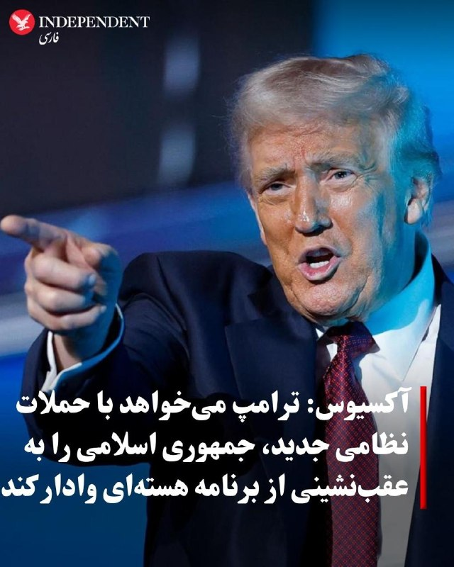

♦️نشریه آمریکایی آکسیوس شامگاه دوشنبه ۲۱ اردیبهشت به وقت تهران با انتشار گزارشی درباره دیدار ساعات آینده ترامپ با مسئولان امنیت ملی این کشور در همین روز نوشت با توجه به ناامید رئیس جمهوری آمریکا از پیشرفت در مذاکرات با جمهوری اسلامی، او مایل است با حملات نظامی، حکومت ایران را به امتیازدهی در برنامه هسته‌ای مجبور کند.

آکسیوس به نقل از دو مقام نظامی آمریکایی گزارش کرد که بعید است ترامپ دستور از سرگیری حملات نظامی به ایران را پیش از سفر به چین صادر کند. رئیس جمهوری آمریکا روزهای ۲۳ تا ۲۵ اردیبهشت به چین سفر خواهد کرد.
‌🇸🇦 Indypersian

🤖 @VahidOOnLine

## VahidOOnLine — post 239563

♦️دونالد ترامپ، رئیس‌جمهوری آمریکا، دوشنبه ۲۱ اردیبهشت‌ماه در کاخ سفید و در حاشیه نشستی درباره مقررات حوزه سلامت، در پاسخ به پرسش خبرنگاران درباره ایران گفت آتش‌بس «به‌طرز باورنکردنی ضعیف» است و اکنون در ضعیف‌ترین وضعیت خود قرار دارد.

ترامپ با اشاره به پاسخ اخیر تهران به پیشنهاد آمریکا گفت: «پس از خواندن این متن بی‌ارزش که ایران فرستاده بود حتی خواندنش را تمام نکردم و گفتم آیا قرار است وقتم را برای این تلف کنم؟»

رئیس‌جمهوری آمریکا افزود آتش‌بس اکنون «به دستگاه تنفس وصل است» و وضعیت آن بسیار شکننده شده است.
‌🇸🇦 Indypersian

🤖 @VahidOOnLine

## VahidOOnLine — post 239562

  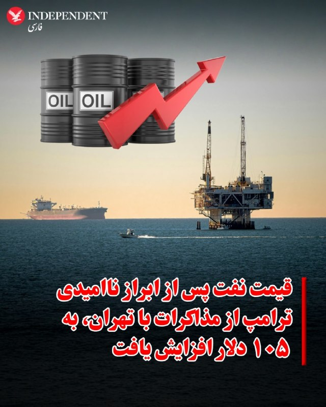

⭕️ قیمت نفت پس از ابراز ناامیدی ترامپ از مذاکرات با تهران، به ۱۰۵ دلار افزایش یافت

♦️قیمت نفت شامگاه دوشنبه ۲۱ اردیبهشت (صبح به وقت آمریکا) و همزمان با آغاز به کار بازارها در آمریکا، به‌شدت افزایش یافت.
در پی ابراز ناامیدی دونالد ترامپ به نتیجه‌بخش بودن مذاکرات پایان جنگ با ایران، قیمت هر بشکه نفت خام برنت دریای شمال با نزدیک به ۴ درصد افزایش، به ۱۰۵ دلار هم رسید اما در دقایق بعد در کانال ۱۰۴ دلار و ۷۰ سنت تثبیت شد.
همزمان قیمت هر بشکه نفت خام وست تگزاس اینتر مدیت هم با بیش از سه دلار افزایش، به بهای بیش از ۹۸ دلار دادوستد شد.
‌🇸🇦 Indypersian

🤖 @VahidOOnLine

## VahidOOnLine — post 239561

  

اکسیوس به نقل از سه منبع آمریکایی گزارش داد که دونالد ترامپ روز دوشنبه با تیم امنیت ملی خود دیدار می‌کند تا درباره مسیر پیش رو در جنگ با جمهوری اسلامی، از جمله احتمال ازسرگیری اقدام نظامی، گفت‌وگو کند؛ این اقدام پس از بن‌بست مذاکرات با تهران در یکشنبه اعلام شده است.

براساس این گزارش، مقام‌های آمریکایی می‌گویند ترامپ خواستار رسیدن به توافقی برای پایان دادن به جنگ است، اما رد بسیاری از درخواست‌های او توسط جمهوری اسلامی و امتناع تهران از ارائه امتیازات قابل‌توجه در برنامه هسته‌ای، گزینه نظامی را دوباره روی میز قرار داده است.
‌🏁 🇬🇧 IranintlTV

🤖 @VahidOOnLine

## VahidOOnLine — post 239560

  <a href="telegram/content/VahidOOnLine_239560_1778522862.mp4" target="_blank">🎬 Download video</a>

‌
دونالد ترامپ، رئیس‌جمهوری آمریکا گفت:
« آن‌ها باور نمی‌کردند که ما تا این حد جلو برویم. چقدر آدم‌های احمقی هستند. فکر می‌کردند من خسته می‌شوم یا تحت فشار قرار می‌گیرم، اما هیچ فشاری وجود ندارد. ما به یک پیروزی کامل خواهیم رسید.»

ترامپ در بخش دیگری افزود جمهوری اسلامی ابتدا با خارج کردن همه اورانیوم غنی‌شده از ایران موافقت کرده بود، اما بعد موضع خود را تغییر داد.

ترامپ گفت: «دو روز پیش موافقت کرده بودند. گفتند شما باید آن را خارج کنید.»

او افزود قرار بوده آمریکا در روند انتقال این مواد مشارکت کند، اما تهران بعداً نظرش را عوض کرده و این موضوع را در متن پیشنهادی خود نیاورده است.

رئیس‌جمهوری آمریکا همچنین گفت واشینگتن چهار روز منتظر دریافت سندی بوده که «باید در ده دقیقه آماده می‌شد.»

ترامپ افزود: «موضوع خیلی ساده بود؛ ما آن مواد را دریافت می‌کنیم و آن‌ها هم برای مدت طولانی تضمین می‌دهند که سلاح هسته‌ای نداشته باشند.»

او در پایان گفت: «آن‌ها با ما موافقت می‌کنند و بعد حرفشان را پس می‌گیرند.»
‌🏁 🇬🇧 ManotoTV

🤖 @VahidOOnLine

## VahidOOnLine — post 239559

  <a href="telegram/content/VahidOOnLine_239559_1778522863.mp4" target="_blank">🎬 Download video</a>

⭕️ ترامپ:
کردها ما را ناامید کردند و به‌جای انتقال سلاح به مردم ایران، آن‌ها را برای خودشان نگه داشتند

♦️دونالد ترامپ، رئیس جمهوری ایالات متحده در اظهاراتی گفت: «مردم در [ایران] می‌خواهند به خیابان‌ها بروند. آن‌ها هیچ سلاحی ندارند، هیچ تفنگی ندارند.»
او ادامه داد: «فکر می‌کردیم کردها قرار است سلاح بدهند، اما آن‌ها ما را ناامید کردند. کردها فقط می‌گیرند، می‌گیرند، می‌گیرند. در کنگره هم درباره آن‌ها شهرت خوبی دارند و می‌گویند خیلی سخت می‌جنگند، اما نه، وقتی می‌جنگند که پول بگیرند.»
ترامپ گفت: «من از کردها خیلی ناامید شدم، اما ما برخی سلاح‌ها را با مهمات فرستادیم که قرار بود تحویل داده شود، اما آن‌ها آن را نگه داشتند. من گفتم آن‌ها آن را نگه می‌دارند، اما چه می‌دانم؟»
‌🇸🇦 Indypersian

🤖 @VahidOOnLine

## VahidOOnLine — post 239558

  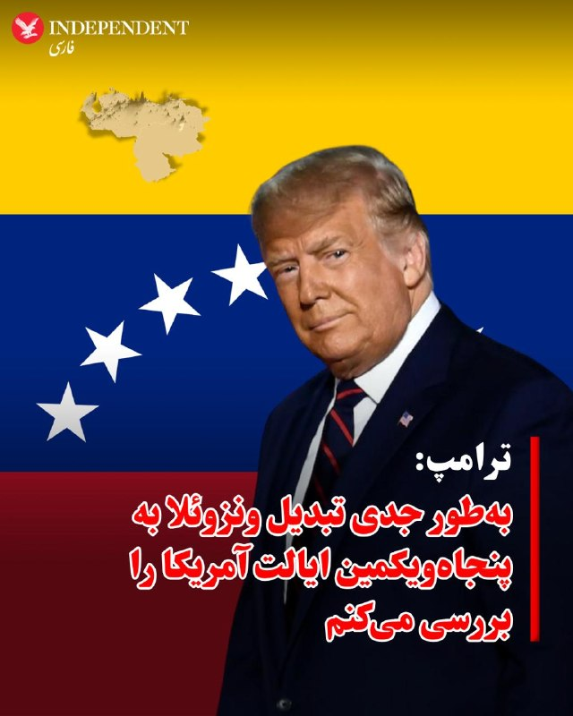

♦️دونالد ترامپ، رئیس‌جمهوری آمریکا، در گفتگو با فاکس‌نیوز گفت به‌طور جدی در حال بررسی تبدیل ونزوئلا به پنجاه‌و‌یکمین ایالت آمریکا است.

ترامپ با اشاره به ذخایر نفتی ونزوئلا گفت این کشور منابع عظیم انرژی دارد و افزود: «ونزوئلا عاشق ترامپ است.» او پیش‌تر نیز درباره گسترش قلمرو آمریکا و احتمال الحاق کانادا و گرینلند اظهارات مشابهی مطرح کرده بود.

رئیس‌جمهوری آمریکا همچنین به بازداشت نیکلاس مادورو درسوم ژانویه و انتقال او به آمریکا برای مواجهه با اتهام‌های مرتبط با مواد مخدر و سلاح اشاره کرد. بر اساس قوانین آمریکا، تبدیل ونزوئلا به ایالت جدید نیازمند برگزاری همه‌پرسی در این کشور و تایید کنگره آمریکا خواهد بود.
‌🇸🇦 Indypersian

🤖 @VahidOOnLine

## VahidOOnLine — post 239557

  <a href="telegram/content/VahidOOnLine_239557_1778522865.mp4" target="_blank">🎬 Download video</a>

‌
دونالد ترامپ، رئیس‌جمهوری آمریکا، با انتقاد شدید از پاسخ جمهوری اسلامی به پیشنهادهای واشینگتن، وضعیت آتش‌بس را «بسیار ضعیف» توصیف کرد.

ترامپ گفت: «بعد از خواندن آن آشغال، باید بگویم این آتش‌بس الان یکی از ضعیف‌ترین‌هاست.»

او افزود حتی متن پاسخ جمهوری اسلامی را کامل نخوانده و گفته است: «وقتم را برای خواندنش تلف نمی‌کنم.»

رئیس‌جمهوری آمریکا همچنین گفت: «می‌توانم بگویم این آتش‌بس الان روی دستگاه حفظ حیات است.»

او همچنین گفت در جمهوری اسلامی «میانه‌روها» و «دیوانه‌ها» وجود دارند و مدعی شد «میانه‌روها به‌شدت خواهان توافق هستند»، اما «تندروها می‌خواهند تا آخر بجنگند.»

او همچنین با انتقاد از کردها گفت واشینگتن انتظار داشت آن‌ها سلاح را به دست معترضان در ایران برسانند، اما «کردها ما را ناامید کردند.»

ترامپ افزود: «ما اسلحه و مهمات فرستادیم، اما آن‌ها آن را برای خودشان نگه داشتند.»
‌🏁 🇬🇧 ManotoTV

🤖 @VahidOOnLine

## VahidOOnLine — post 239556

  <a href="telegram/content/VahidOOnLine_239556_1778522867.mp4" target="_blank">🎬 Download video</a>

تماس‌هایی از ایران:
«با همه سختی‌ها و جیب‌های خالی…
اما دل‌های بزرگ.
نمی‌ذارن یه هموطن برای نجات عزیزش تنها بمونه.
این شرافت مردمه ایران.»
‌🏁 🇬🇧 ManotoTV

🤖 @VahidOOnLine

## VahidOOnLine — post 239555

  <a href="telegram/content/VahidOOnLine_239555_1778522869.mp4" target="_blank">🎬 Download video</a>

تماسی از ایران:
«می‌گفت تجمع‌ها دیگه جمعیت نداره…
با کباب و بازی هم مردم رو نمی‌تونن بیارن.
می‌گفت مردم زیر فشار گرونی موندن،
اما دیگه فریب نمی‌خورن.»
‌🏁 🇬🇧 ManotoTV

🤖 @VahidOOnLine

## VahidOOnLine — post 239554

  <a href="telegram/content/VahidOOnLine_239554_1778522871.mp4" target="_blank">🎬 Download video</a>

دونالد ترامپ، رئیس‌جمهوری آمریکا، پیشنهاد جمهوری اسلامی را غیرقابل قبول خواند و تهران به او گفته بود اورانیوم غنی‌شده باید توسط آمریکا از محل خارج شود، زیرا سایت هسته‌ای «آن‌قدر نابود شده» که تنها «یک یا دو کشور در جهان» توان خارج کردن مواد از آن را دارند.

ترامپ گفت: «آن‌ها گفتند فقط آمریکا و چین توانایی خارج کردنش را دارند.»

رئیس‌جمهوری آمریکا همچنین گفت جمهوری اسلامی پس از این حملات، با یک «پیشنهاد احمقانه» برای مذاکره بازگشته است؛ پیشنهادی که به گفته او «هیچ‌کس آن را قبول نمی‌کند.»

ترامپ در ادامه بار دیگر جمهوری اسلامی را به کشتن «۴۲ هزار معترض غیرمسلح» متهم کرد و گفت تهران «شروع به تیراندازی به معترضان کرد.»
‌🏁 🇬🇧 ManotoTV

🤖 @VahidOOnLine

## VahidOOnLine — post 239553

  

الحدث به نقل از منابع عراقی گزارش داد که اسماعیل قاآنی، فرمانده نیروی قدس سپاه، به عراق سفر کرده و از برخی گروه‌های مسلح خواسته از برقراری روابط با آمریکا خودداری کنند.

بر اساس این گزارش، او همچنین خط قرمزی را برای دولت عراق در مورد تحویل سلاح گروه‌های مسلح تعیین کرده است.
‌🏁 🇬🇧 IranintlTV

🤖 @VahidOOnLine

## VahidOOnLine — post 239552

♦️دونالد ترامپ، رئیس جمهوری آمریکا روز دوشنبه ۲۱ اردیبهشت رهبران جمهوری اسلامی را آدم‌های «بی‌شرفی» خواند که نظرشان عوض شده است.
ترامپ با انتقاد دوباره از تاخیر جمهوری اسلامی در ارسال پاسخ به آخرین طرح پیشنهادی آمریکا برای پایان جنگ گفت: «با این آدم‌ها توافق می‌کنید و بعد سندی برایتان می‌فرستند که رسیدنش ۵ روز طول می‌کشد در حالی که باید ۲۰ دقیقه‌ای می‌رسید.»
‌🇸🇦 Indypersian

🤖 @VahidOOnLine

## VahidOOnLine — post 239551

  

دونالد ترامپ از وجود اختلاف در داخل جمهوری اسلامی بر سر توافق با آمریکا سخن گفت و افزود گروهی از مقام‌های «میانه‌رو» خواهان توافق هستند اما «دیوانه‌ها» می‌خواهند جنگ ادامه پیدا کند.
او هشدار داد در صورت وقوع درگیری، «این یک جنگ خیلی سریع خواهد بود».

ترامپ گفت جمهوری اسلامی ابتدا با انتقال اورانیوم غنی‌شده از ایران موافقت کرده بود اما بعدا موضع خود را تغییر داد و این موضوع در سند ارسالی تهران به واشینگتن گنجانده نشد.

او افزود مقام‌های جمهوری اسلامی به آمریکا گفته بودند: «شما مجبورید آن را تحویل بگیرید.»

او در بخشی از صحبت‌های خود اضافه کرد واشینگتن قرار بود همراه با طرف ایرانی در روند انتقال مشارکت کند اما تهران بعدا نظرش را عوض کرد.

رییس‌جمهوری آمریکا گفت سند پیشنهادی جمهوری اسلامی پس از چهار روز تاخیر به واشینگتن ارسال شد؛ در حالی که به گفته او تهیه آن «فقط ۱۰ دقیقه» زمان نیاز داشت.

ترامپ افزود: «آنها تضمین دادند که برای مدت بسیار طولانی سلاح هسته‌ای نخواهند داشت، اما نمی‌توانند به نتیجه برسند.»
‌🏁 🇬🇧 IranintlTV

🤖 @VahidOOnLine

## VahidOOnLine — post 239550

♦️دونالد ترامپ، رئیس جمهوری آمریکا روز دوشنبه ۲۱ اردیبهشت، در پاسخ به پرسش خبرنگاران درباره آنچه او تغییر رژیم در ایران خوانده بود گفت: «در ایران میانه‌رو و دیوانه‌ها را دارید. دیوانه‌ها می‌خواهند تا آخر بجنگند.»

رئیس جمهوری آمریکا گفت جنگ خیلی کوتاهی در پیش خواهد بود. ترامپ تاکید کرد که میانه‌روها در جمهوری اسلامی از دیوانه‌ها می‌ترسند.

دونالد ترامپ از پایان هفته سوم جنگ می‌گوید با توجه به کشته شدن دو صف اول رهبران جمهوری اسلامی، تغییر رژیم در ایران پیشاپیش روی داده است.
‌🇸🇦 Indypersian

🤖 @VahidOOnLine

## VahidOOnLine — post 239549

♦️دونالد ترامپ، رئیس جمهوری آمریکا روز دوشنبه ۲۱ اردیبهشت گفت پاسخ تهران به طرح پیشنهادی صلح آمریکا احمقانه بوده است و او از ادامه جنگ و فشار بر ایران خسته نمی‌شود.

ترامپ در یک برنامه عمومی در کاخ سفید و در پاسخ به پرسش‌های خبرنگاران درباره طولانی شدن مسدودیت تنگه هرمز گفت: «احمق‌ها
نمی‌خواستند قبول کنند. فکر می‌کردند من خسته می‌شوم یا حوصله‌ام سر می‌رود یا تحت فشار قرار می‌گیرم اما هیچ فشاری وجود ندارد. ما به یک پیروزی کامل خواهیم رسید.»
‌🇸🇦 Indypersian

🤖 @VahidOOnLine

## VahidOOnLine — post 239548

  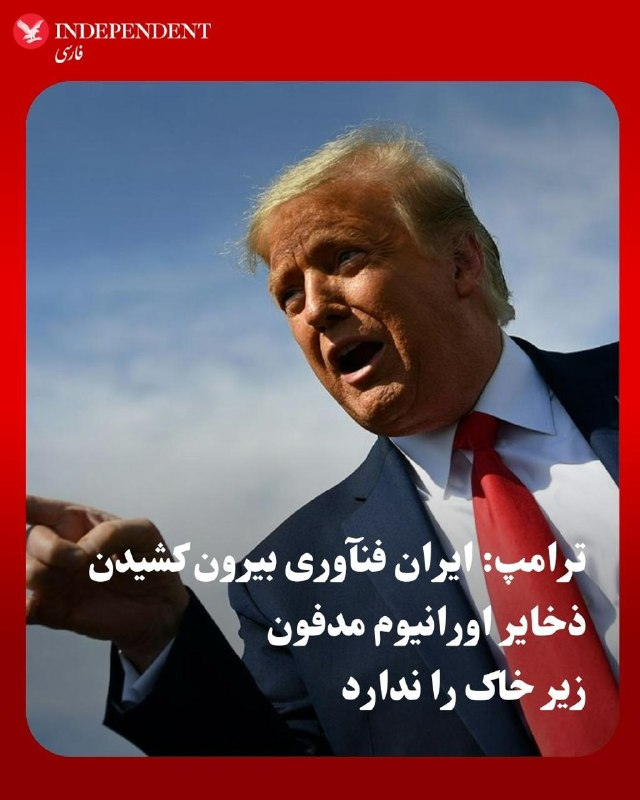

♦️دونالد ترامپ، رئیس جمهوری ایالات متحده یک روز پس از مخالفت با پاسخ پیشنهادی جمهوری اسلامی به طرح آمریکا برای پایان جنگ، به فاکس نیوز گفت که ایران فنآوری لازم برای بیرون کشیدن ذخایر اورانیوم غنی‌شده مدفون زیر خاک را ندارد.

ترامپ در این گفتگو تاکید کرد که اورانیوم غنی شده ایران آنچنان در اعماق خاک تاسیسات هسته‌ای دفن شده که آمریکا باید آن را خارج کند.

براساس آخرین گزارش‌های آژانس بین‌المللی انرژی اتمی، ایران دست‌کم ۴۶۰ کیلوگرم اورانیوم با غنای ۶۰ درصد دارد که گمان می‌رود در تاسیسات هسته‌ای اصفهان مدفون شده‌اند. این تاسیسات در جنگ ۱۲ روزه و جنگ اخیر اسرائیل و آمریکا بارها بمباران شدند.
‌🇸🇦 Indypersian

🤖 @VahidOOnLine

## VahidOOnLine — post 239547

  

دونالد ترامپ در گفت‌وگو با سی‌بی‌اس نیوز درباره پاسخ اخیر تهران به پیشنهاد صلح آمریکا گفت که جمهوری اسلامی در برنامه هسته‌ای خود امتیازاتی داده اما «کافی نبوده» و هنوز «پیشنهاد آن‌ها بسیار ضعیف و غیرقابل قبول» است.
‌🏁 🇬🇧 IranintlTV

🤖 @VahidOOnLine

## VahidOOnLine — post 239546

♦️اسماعیل بقایی، سخنگوی وزارت امور خارجه جمهوری اسلامی در نشست خبری گفت ایران هم‌زمان با حفظ آمادگی در همه حوزه‌ها، از دیپلماسی نیز برای پیشبرد منافع ملی استفاده می‌کند و این مسیر را بر اساس تشخیص خود و منافع ملت دنبال خواهد کرد.
او گفت: «ما هر وقت لازم باشد می‌جنگیم و هر وقت تشخیص دهیم از سلاح دیپلماسی استفاده می‌کنیم تا منافع ملت ایران را تحقق بخشیم. رضایت دیگران برای ما مهم نیست.»
بقایی با اشاره به قواعد حاکم بر مذاکرات و روندهای دیپلماتیک گفت هر روند دیپلماتیک چارچوب‌های مشخص خود را دارد و طرف‌های درگیر باید بر اساس منافع ملی خود تصمیم‌گیری کنند.
او افزود جمهوری اسلامی در پیگیری حقوق و منافع خود جدی است و در عین حال با حسن‌نیت و به‌صورت معقول در روندهای دیپلماتیک شرکت می‌کند، اما این موضوع به معنای انتظار برای اثبات جدیت از سوی طرف مقابل است.
سخنگوی وزارت امور خارجه در ادامه با انتقاد از عملکرد آمریکا گفت این کشور در هر روند دیپلماتیکی که در دو دهه اخیر حضور داشته، دچار بدعهدی شده است؛ از جمله خروج از برجام در سال ۲۰۱۸ و همچنین «حمله به میز دیپلماسی» در یک سال اخیر.
‌🇸🇦 Indypersian

🤖 @VahidOOnLine

## mwarmonitor — post 8921

  <a href="telegram/content/mwarmonitor_8921_1778522875.mp4" target="_blank">🎬 Download video</a>

🔸ولایتی خطاب به ترامپ: ما شما را در «میدان» شکست دادیم

🔹 ترامپ می‌گوید «ایران دیگر نخواهد خندید» و از آتش‌بسی با «درخشش عظیم» دم می‌زند. اما ترامپ، درحالی ایران را با ایهام، تهدید اتمی میکند که گویا دروغ‌های پنتاگون درباره کتمان آمار تلفات سنگین سربازان امریکایی را باور کرده است

📝جناب «فسیل‌الدوله» که حتی اختیار دریچه‌های خروجی بدنت را نداری و مثل یک تکه گوشتِ پوسیده روی دست محافظان جابه‌جا می‌شوی، حالا با همان دهانِ بویِ کُفن گرفته‌اش از «شکست دادن ترامپ» و «نظم جهانی» نطق می‌کند. این انگلِ هزارپایِ سیاست که دهه‌هاست مثل زالو به رگ‌های این مملکت چسبیده، در حالی که در ایزی‌لایفش دست‌وپای استراتژیک می‌زند، به دیگران الفبای دیپلماسی یاد می‌دهد. واقعاً وقاحت می‌خواهد که آدم با قامتی که از فرطِ پوسیدگی شبیه علامت سوال شده و بویِ تعفنی که از فرسودگی‌اش بلند است، هنوز سودایِ خط‌ونشان کشیدن داشته باشد؛ تو اگر خیلی هنر داری، فعلاً در نبرد با جاذبه زمین شکست نخور و سعی کن قبل از نطقِ بعدی، زیرساخت‌های بدنت را جمع‌وجور کنی تا بویِ گندِ حضورت دنیا را برندارد، ای لاشه متعفنِ نشسته بر سریرِ توهم!

@mwarmonitor

## mwarmonitor — post 8920

🇮🇱بنیامین نتانیاهو ؛ «تنها کسی که رئیس موساد را منصوب می‌کند، نخست‌وزیر است. طبق قانون، موساد و شین‌بت مستقیماً زیر نظر نخست‌وزیر هستند. نخست‌وزیر است که رؤسای آن‌ها را تعیین می‌کند؛ نه مشاور حقوقی، نه دیوان عالی، نه رسانه‌ها.

🔸سرتیپ رومن گافمن یک جنگجوی قهرمان است. او روحیه‌ای شجاع دارد و یکی از تحسین‌شده‌ترین فرماندهان عملیاتی در ارتش اسرائیل است. در طول جنگ کنونی، رومن رهبری فوق‌العاده‌ای از خود نشان داد و خارج از چارچوب‌های معمول فکر کرد.

🔹در ۷ اکتبر، رومن از خانه‌اش در اشدود به سمت نوار غزه شتافت. در تقاطع «شعار هانگب»، او با تروریست‌های حماس درگیر شد، با آن‌ها مبارزه کرد، تعدادی را از پا درآورد و خودش به شدت مجروح شد. اما او بهبود یافت. او شجاعت، ابتکار عمل، قاطعیت و زیرکی دارد. اما بالاتر از همه، او دارای تفکر مستقل و مسئولیت‌پذیریِ والایی نسبت به امنیت اسرائیل است.

🔹چنین افرادی باید در رأس موساد باشند و به همین دلیل من او را انتخاب کردم. پس چرا سعی می‌کنند او را رد صلاحیت کنند؟ چون او عضو گروه و محفل آن‌ها نیست؟ چون رومن از اتحاد جماهیر شوروی مهاجرت کرده است؟ به خاطر ملاحظات سیاسی؟ به خاطر اینکه او دبیر نظامی من است؟
رومن توسط من، یعنی نخست‌وزیر، انتخاب شده تا رئیس بعدی موساد باشد و او این سازمان را از موفقیتی به موفقیت دیگر هدایت خواهد کرد.»

@mwarmonitor

## mwarmonitor — post 8919

## mwarmonitor — post 8918

🔴ترامپ در حال بررسی اقدام نظامی علیه ایران؛ آتش‌بس در وضعیت «کمای کامل»

📝نوشته: باراک راوید AXIOS

🔰رئیس‌جمهور ترامپ قرار است روز دوشنبه با تیم امنیت ملی خود دیدار کند تا درباره مسیر پیش‌رو در جنگ با ایران، از جمله احتمال ازسرگیری اقدامات نظامی، گفتگو کند. این دیدار پس از آن صورت می‌گیرد که سه مقام آمریکایی اعلام کردند مذاکرات با ایران در روز یکشنبه به بن‌بست رسیده است.

چرا این موضوع اهمیت دارد؟
مقامات آمریکایی می‌گویند ترامپ خواهان توافقی برای پایان دادن به جنگ است، اما رد بسیاری از خواسته‌های او توسط ایران و امتناع تهران از دادن امتیازات معنادار در برنامه هسته‌ای، گزینه نظامی را دوباره روی میز قرار داده است. ترامپ در روزهای اخیر چندین بار به طور علنی تهدید کرده است که در صورت شکست دیپلماسی، تأسیسات زیربنایی در ایران را بمباران خواهد کرد.
جزئیات خبر
ایالات متحده ۱۰ روز منتظر پاسخ ایران به پیش‌نویس پیشنهادی خود برای پایان دادن به جنگ بود. کاخ سفید خوش‌بین بود که مواضع ایران نشان‌دهنده پیشرفت بیشتر به سمت یک توافق باشد.
اما پاسخی که روز یکشنبه از سوی ایران رسید، مثبت نبود. تلویزیون دولتی ایران گزارش داد که تهران پیشنهاد آمریکا را رد کرده و اعلام کرده است که این پیشنهاد «به معنای تسلیم شدن ایران در برابر خواسته‌های زیاده‌خواهانه ترامپ است.»
ترامپ روز یکشنبه پاسخ ایران را رد کرد. او به اکسیوس گفت: «من آن را دوست ندارم. نامناسب است.»
پشت صحنه
به گفته مقامات آمریکایی، انتظار می‌رود «جی‌دی ونس» معاون رئیس‌جمهور، «استیو ویتکاف» فرستاده کاخ سفید، «مارکو روبیو» وزیر امور خارجه، «پیت هگزت» وزیر دفاع، ژنرال «دن کین» رئیس ستاد مشترک ارتش، «جان رتکلیف» مدیر سی‌آی‌اِی (CIA) و دیگر مقامات ارشد در نشست روز دوشنبه درباره ایران شرکت کنند.
آنچه ترامپ می‌گوید
ترامپ روز دوشنبه پیش از جلسه، در دفتر بیضی شکل به خبرنگاران گفت: «من برنامه‌ای دارم. ایران نمی‌تواند سلاح هسته‌ای داشته باشد.» او افزود: «آتش‌بس با ایران در وضعیت کمای کامل (Life Support) قرار دارد.»
ترامپ گفت که ایران پیش‌تر با تحویل ذخایر اورانیوم غنی‌شده خود به آمریکا موافقت کرده بود، اما به نظر می‌رسد رهبران ایران تغییر موضع داده‌اند، زیرا در پاسخ روز یکشنبه آن‌ها هیچ اشاره‌ای به این موضوع نشده بود. ترامپ همچنین مدعی شد که رهبری ایران بین «میانه‎‌روها و دیوانگان» تقسیم شده است.
وضعیت فعلی
دو مقام آمریکایی گفتند که ترامپ به سمت انجام نوعی اقدام نظامی علیه ایران تمایل دارد تا فشار بر رژیم را افزایش داده و آن‌ها را مجبور به دادن امتیاز در برنامه هسته‌ای کند.
یک مقام آمریکایی گفت: «او کمی آن‌ها را گوش‌مالی خواهد داد (تنظیم خواهد کرد).»
مقام دوم گفت: «فکر می‌کنم همه ما می‌دانیم این وضعیت به کجا ختم می‌شود.»
مواردی که باید زیر نظر داشت
یکی از گزینه‌هایی که ترامپ در حال بررسی آن است، ازسرگیری «پروژه آزادی» است؛ عملیات آمریکا برای هدایت کشتی‌ها از طریق تنگه هرمز که هفته گذشته به حالت تعلیق درآمده بود.
گزینه دیگر، ازسرگیری کارزار بمباران و حمله به ۲۵ درصد باقی‌مانده از اهدافی است که ارتش آمریکا شناسایی کرده اما هنوز به آن‌ها حمله نکرده است.
دولت اسرائیل از ترامپ می‌خواهد دستور عملیات نیروهای ویژه را برای تصرف ذخایر اورانیوم غنی‌شده ایران صادر کند. مقامات اسرائیلی می‌گویند ترامپ در مورد صدور دستور چنین عملیاتی تردید دارد زیرا بسیار پرخطر است.

📌تصویر کلی
یکی از ملاحظات ترامپ برای گام‌های بعدی در جنگ، سفر این هفته او به چین است. انتظار می‌رود رئیس‌جمهور روز چهارشنبه (آمریکا را) ترک کند و جمعه بازگردد. دو مقام آمریکایی گفتند بعید است ترامپ پیش از بازگشت از چین، دستور اقدام نظامی علیه ایران را صادر کند.
مقامات آمریکایی می‌گویند انتظار می‌رود ترامپ در مورد جنگ ایران با «شی جین‌پینگ»، رئیس‌جمهور چین گفتگو کند. چین تاکنون از ایران خواسته است تا با آمریکا برای پایان دادن به جنگ و محدود کردن برنامه هسته‌ای خود به توافق برسد، اما تا این لحظه موفقیتی حاصل نشده است.

@mwarmonitor

## mwarmonitor — post 8917

🔴پنتاگون اعلام کرد یک زیردریایی هسته‌ایِ نیروی دریایی آمریکا در جبل‌الطارق مستقر شده است؛ اقدامی که به‌ندرت درباره محل حضور یکی از محرمانه‌ترین تسلیحات آمریکا به‌صورت علنی اعلام می‌شود. این خبر یک روز پس از آن منتشر شد که رئیس‌جمهور ترامپ به‌طور قاطع آخرین پیشنهاد صلح ایران را رد کرد. وال‌استریت ژورنال

@mwarmonitor

## mwarmonitor — post 8916

  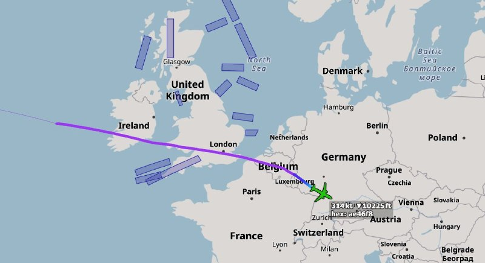

✈️نیروی دریایی آمریکا (US Navy)

✈️۱ فروند هواپیمای Boeing E-6B Mercury
شناسه: AE2927 – 162784 (THAW 64)

✈️یک فروند E-6B Mercury، که به‌عنوان پست فرماندهی هوابرد و رله ارتباطی عمل می‌کند، از پایگاه نیروی هوایی تینکر (Tinker Air Force Base) اوکلاهاما پرواز کرده و در حال حرکت به سمت اشتوتگارت، آلمان است.

@mwarmonitor

## mwarmonitor — post 8915

بعد از خوندن اون تیکه آشغالی که برامون فرستادن... حتی تمومش هم نکردم. گفتم وقتم رو برای خوندنش تلف نمی‌کنم.

## mwarmonitor — post 8914

🔸 مشاور رهبر ایران: ترامپ نباید تصور کند که می‌تواند با سوءاستفاده از آرامش امروز ما، به چین سفر کند و خود را پیروز جلوه دهد. الجزیره

@mwarmonitor

## mwarmonitor — post 8913

  <a href="telegram/content/mwarmonitor_8913_1778522877.mp4" target="_blank">🎬 Download video</a>

🔸خبرنگار: آقای رئیس‌جمهور، آیا هنوز فکر می‌کنید راه حل دیپلماتیک با ایران امکان‌پذیر است یا فقط گزینه‌های نظامی دارید؟
🔹دونالد ترامپ: نه، فکر می‌کنم خیلی امکان‌پذیر است. ببینید، من چهار یا پنج بار با آن‌ها سر و کار داشته‌ام. آن‌ها نظرشان را عوض می‌کنند. آن‌ها افراد بسیار بی شرافت (ناشریفی) هستند، یعنی رهبران‌شان.
فراموش نکنید که این سطح سوم است. سطح اول خداست، آن‌ها غیرمنطقی بودند. سطح دوم منطقی‌تر است. در سطح سوم هیچ‌کس نمی‌خواهد رئیس‌جمهور شود، می‌دانید؟
آن‌ها می‌گویند «چه کسی می‌خواهد رئیس‌جمهور شود؟» و هیچ‌کس دستش را بالا نمی‌برد. اما ما... آن‌ها فقط نظرشان را عوض می‌کنند. من بارها در تجارت با این موضوع روبرو شده‌ام، می‌دانید، تغییر عقیده.
این آدم‌ها، شما با آن‌ها توافق می‌کنید و بعد روز بعد سندی برای شما می‌فرستند که ۵ روز طول می‌کشد تا به دستتان برسد، در حالی که باید در عرض ۲۰ دقیقه می‌رسید. می‌دانید، سند خیلی ساده‌ای است.
آن‌ها هرگز سلاح هسته‌ای نخواهند داشت.

@mwarmonitor

## mwarmonitor — post 8912

  <a href="telegram/content/mwarmonitor_8912_1778522879.mp4" target="_blank">🎬 Download video</a>

سطح شدت اعتراضات... می‌دونید، مردم دارن تماشا می‌کنن، اونا می‌خوان بیان توی خیابون‌ها، اونا هیچ سلاحی ندارن، اونا هیچ تفنگی ندارن. ما فکر می‌کردیم کردها قراره بهمون سلاح بدن، اما کردها ناامیدمون کردن. کردها فقط می‌گیرن، می‌گیرن، می‌گیرن. اونا شهرت خیلی خوبی در کنگره دارن. کنگره می‌گه: «اوه، اونا خیلی سخت می‌جنگن!» نه، اونا وقتی پول می‌گیرن، سخت می‌جنگن. بنابراین من از کردها خیلی ناامید شدم، اما به اونا داده شد... من گفتم این کار جواب نمی‌ده. به هر حال، فقط باید بگم که با کاری که اونا کردن مخالف بودم. اونا دادنش، من گفتم اونا هرگز به اونجا نمی‌رسن. و حق با من بود. من دوست دارم حق با من باشه، در این مورد متأسفانه، اما ما تعدادی تفنگ با مهمات فرستادیم و قرار بود تحویل داده بشن، اما اونا پیش خودشون نگه داشتن. من گفتم اونا پیش خودشون نگه می‌دارن، اما خب، من چی می‌دونم؟ من فقط یه مدت کوتاهه که دارم این کارو انجام می‌دم!»

@mwarmonitor

## mwarmonitor — post 8911

  <a href="telegram/content/mwarmonitor_8911_1778522881.mp4" target="_blank">🎬 Download video</a>

🚨 ترامپ: آتش‌بس با ایران در وضعیت «حیاتِ بسیار بحرانی» قرار دارد / در آستانه فروپاشی است. @mwarmonitor

## mwarmonitor — post 8910

🚨ترامپ: کردها ما را ناامید کردند؛ با سلاح‌هایی که برایشان فرستادیم هیچ کاری انجام ندادند.

@mwarmonitor

## mwarmonitor — post 8909

🚨 ترامپ: آتش‌بس با ایران در وضعیت «حیاتِ بسیار بحرانی» قرار دارد / در آستانه فروپاشی است.

@mwarmonitor

## mwarmonitor — post 8908

ایشون خیلی طولانی صحبت نخواهند کرد چون یک گروه بزرگ از ژنرال‌ها منتظر من هستن و این هم موضوع خیلی مهمیه، می‌دونید، (موضوعی) مربوط به کشور کاملاً دوست‌داشتنیِ ایرون (ایران)؛ اینجوری تلفظش می‌کنن.» @mwarmonitor

## mwarmonitor — post 8907

  <a href="telegram/content/mwarmonitor_8907_1778522883.mp4" target="_blank">🎬 Download video</a>

ایشون خیلی طولانی صحبت نخواهند کرد چون یک گروه بزرگ از ژنرال‌ها منتظر من هستن و این هم موضوع خیلی مهمیه، می‌دونید، (موضوعی) مربوط به کشور کاملاً دوست‌داشتنیِ ایرون (ایران)؛ اینجوری تلفظش می‌کنن.»

@mwarmonitor

## mwarmonitor — post 8906

  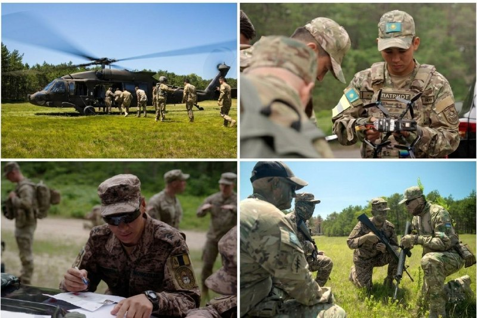

🇺🇸به مناسبت برگزاری سی‌امین دوره، فرماندهی مرکزی آمریکا (CENTCOM) قرار است ماه آینده رزمایش «همکاری منطقه‌ای ۲۰۲۶» را با مشارکت کشورهای آسیای مرکزی و جنوب آسیا برگزار کند.

🔹در این رزمایش، نیروهای نظامی از نزدیک به ۱۲ کشور در ایالات متحده آموزش خواهند دید تا مهارت‌های عملیاتی خود را تقویت کنند، آمادگی رزمی را افزایش دهند و همکاری امنیتی منطقه‌ای را ارتقا دهند.

@mwarmonitor

## mwarmonitor — post 8905

🔴غنی‌سازی اورانیوم ایران و توسعه فناوری هسته‌ای، در هر توافقی با آمریکا غیرقابل مذاکره است؛ این را رئیس سازمان انرژی اتمی ایران به نقل از صدا و سیمای جمهوری اسلامی ایران (IRIB) اعلام کرده است.

@mwarmonitor

## mwarmonitor — post 8904

🔴دو ماه از زمانی که تنگه هرمز عملاً برای ترافیک کانتینری تجاری بسته شده می‌گذرد. داده‌های Kpler نشان می‌دهد:

🔵۵۳ کشتی از ۱۰ شرکت بزرگ حمل‌ونقل جهان در داخل خلیج فارس گرفتار شده‌اند. ۷۹٪ آن‌ها هنوز همان‌جا هستند.

🟢فقط ۹ کشتی توانسته‌اند از منطقه خارج شوند. دو مورد از آن‌ها برای عبور موفق به تلاش دوم نیاز داشتند (هر دو متعلق به COSCO؛ تنها شرکت با موفقیت در خروج). دو کشتی MSC توسط مقامات ایرانی توقیف شدند. یک کشتی نیز بر اثر برخورد با آوار آسیب دید.

🔘جزئیات شرکت‌ها تصویر واقعی را نشان می‌دهد: ◾ CMA CGM: ۱۵ کشتی وارد شده، ۱۳ کشتی هنوز داخل (۸۷٪ گرفتار) ◾ MSC: ۱۴ کشتی وارد شده، ۲ کشتی توقیف شده، ۸ کشتی هنوز داخل ◾ Maersk: ۶ کشتی وارد شده، ۵ کشتی هنوز داخل ◾ COSCO: ۵ کشتی وارد شده، ۲ کشتی با تلاش دوم خارج شده‌اند (تنها موفقیت در خروج) ◾ Wan Hai، Evergreen، Yang Ming، ONE، HMM: هیچ خروجی ثبت نکرده‌اند

🔸این فقط یک اختلال تجاری نیست. این وضعیت به معنای خارج شدن ده‌ها هزار TEU (واحد کانتینر استاندارد) از چرخه فعال حمل‌ونقل است؛ کانتینرهایی که درآمدی ایجاد نمی‌کنند، خدمه را درگیر کرده‌اند و صاحبان کالا را مجبور به بازطراحی کامل زنجیره تأمین کرده‌اند. آنچه Kpler در حال رصد آن است: ترمینال‌هایی که اکنون تجارت خلیج فارس را جذب کرده‌اند و اینکه تا چه مدت می‌توانند این حجم را مدیریت کنند.

🔹۴۲ کشتی باقی‌مانده در داخل، یکی از بزرگ‌ترین تمرکزهای ناخواسته ناوگان در تاریخ مدرن کشتیرانی را تشکیل می‌دهند.

@mwarmonitor

## mwarmonitor — post 8903

🔘تا زمانی که تنگه هرمز ناآرام باقی بماند، نیروی دریایی آمریکا هر بار که یک ناوشکن را از این آبراه عبور می‌دهد با میلیون‌ها دلار هزینه اضافی روبه‌رو می‌شود و چنین عبورهایی به‌تنهایی بعید است بتوانند باعث بازگشایی آن شوند. Bloomberg

@mwarmonitor

## mwarmonitor — post 8902

🔵شبکه CBS به نقل از ترامپ: می‌خواهم مالیات فدرال ۱۸ سنتی روی بنزین را برای مدتی به حالت تعلیق درآورم. @mwarmonitor

## pm_afshaa — post 90583

🔴حمله پهپادی جمهوری اسلامی به کردستان عراق

💧 Rainbet.com the #1 Non-KYC Crypto Casino & Sportsbook @rainbetcom

😁 @Pm_Afshaa

## pm_afshaa — post 90582

  <a href="telegram/content/pm_afshaa_90582_1778522885.webm" target="_blank">🎬 Download video</a>

🔴خبرگزاری Associated Press به نقل از دیپلمات‌های منطقه‌ای:

ترامپ از اصرار ایران بر دریافت غرامت جنگی عصبانی شده و گویا ایران در پیشنهادهای خود خواستار «غرامت جنگ» بوده.

بر اساس این گزارش‌ها، ترامپ نسبت به استفاده از واژه «غرامت» حساسیت داشته، چون در عرف سیاسی و تاریخی، پرداخت غرامت معمولاً با پذیرش شکست یا مسئولیت در جنگ همراه دانسته میشه.

💧 Rainbet.com the #1 Non-KYC Crypto Casino & Sportsbook @rainbetcom

😁 @Pm_Afshaa

## pm_afshaa — post 90581

🔴آکسیوس: اسرائیل می‌خواهد ترامپ دستور یک عملیات نیروهای ویژه را برای تصاحب ذخیرۀ اورانیوم ایران صادر کند. ترامپ در صدور دستور چنین عملیاتی تردید دارد زیرا بسیار پرریسک است

💧 Rainbet.com the #1 Non-KYC Crypto Casino & Sportsbook @rainbetcom

😁 @Pm_Afshaa

## pm_afshaa — post 90580

  <a href="telegram/content/pm_afshaa_90580_1778522885.webm" target="_blank">🎬 Download video</a>

🔴الحدث: اسماعیل قاآنی، فرمانده نیروی قدس سپاه، به عراق سفر کرده و از برخی گروه‌های مسلح خواسته از برقراری روابط با آمریکا خودداری کنن.

💧 Rainbet.com the #1 Non-KYC Crypto Casino & Sportsbook @rainbetcom

😁 @Pm_Afshaa

## pm_afshaa — post 90579

  <a href="telegram/content/pm_afshaa_90579_1778522886.webm" target="_blank">🎬 Download video</a>

فیلترشکن v2rayپرسرعت ‼️
                                                    

✅ مناسب برای تمام اینترنت‌ها (همراه اول ایرانسل رایتل اینترنت خانگی و ..)

✅ قابل استفاده برای تمام سیستم عامل ها 

😎 ضمانت بازگشت وجه در صورت عدم اتصال

✅ پشتیبانی ۲۴ ساعته تا آخرین مدت اعتبار اشتراک   
  

😎 اشتراک 10 گیگ 😎

✅ فقط و فقط 1/500/000 ✅

👩‍💻 آیدی ثبت سفارش✨پشتیبانی #خریدوفروش : 👇
@SuportSevenStarsVpn

لینک ورود به کانال اصلی:
            
 https://t.me/sevenstars_VPN

## pm_afshaa — post 90578

  <a href="telegram/content/pm_afshaa_90578_1778522886.webm" target="_blank">🎬 Download video</a>

🔴آکسیوس: ترامپ روز دوشنبه (امشب) با تیم امنیت ملی مسئول ایران دیدار خواهد کرد و با این تیم درباره راه‌های پیشروی در جنگ با ایران بحث خواهد کرد.

دو گزینه‌ مورد بررسی قرار میگیره:

از سرگیری عملیات «پروژه آزادی» در تنگه هرمز و یا از سرگیری حملات به 25 درصد از اهداف شناسایی شده که هنوز مورد حمله قرار نگرفتن.

مقامات آمریکایی فکر نمی‌کنن ترامپ قبل از بازگشت از چین دستور اقدام نظامی علیه ایران رو صادر کنه.

💧 Rainbet.com the #1 Non-KYC Crypto Casino & Sportsbook @rainbetcom

😁 @Pm_Afshaa

## pm_afshaa — post 90577

🔴آکسیوس به نقل از مقامات آمریکایی:
احتمالا جی‌دی ونس، ویتکاف، روبیو، هگست، رئیس ستاد مشترک ارتش، رئیس سیا، و دیگر مقامات ارشد در جلسه امروز در مورد ایران برای احتمال از سرگیری جنگ شرکت کنن.

💧 Rainbet.com the #1 Non-KYC Crypto Casino & Sportsbook @rainbetcom

😁 @Pm_Afshaa

## pm_afshaa — post 90576

  <a href="telegram/content/pm_afshaa_90576_1778522887.webm" target="_blank">🎬 Download video</a>

🔴ترامپ: پاسخ و پیشنهاد اخیر جمهوری اسلامی به آمریکا «ضعیف، احمقانه و غیرقابل‌قبول» بوده و امتیازاتی که تهران درباره برنامه هسته‌ای داده کافی نیست.

ایران ابتدا با انتقال اورانیوم غنی‌شده موافقت کرده بود اما بعدا موضعش رو تغییر داد، در داخل جمهوری اسلامی بر سر توافق اختلاف وجود داره؛ «میانه‌روها» دنبال توافق‌ان اما «دیوانه‌ها» میخوان جنگ ادامه پیدا کنه.

💧 Rainbet.com the #1 Non-KYC Crypto Casino & Sportsbook @rainbetcom

😁 @Pm_Afshaa

## pm_afshaa — post 90575

ترامپ میگه آتش‌بس تقریبا 1 درصد احتمال داره زنده بمونه! احتمالا بعد سفر ترامپ به چین باید منتظر حمله و جنگ باشیم.

## pm_afshaa — post 90573

🔴ترامپ: آتش‌بس بسیار شکننده‌اس و داره می‌میره، بهش اکسیژن وصل کردیم تا زنده بمونه، اما یک درصد ممکنه زنده بمونه! 
💧 Rainbet.com the #1 Non-KYC Crypto Casino & Sportsbook @rainbetcom 
😁 @Pm_Afshaa

## pm_afshaa — post 90572

  <a href="telegram/content/pm_afshaa_90572_1778522887.webm" target="_blank">🎬 Download video</a>

🔴ترامپ: من این هفته قراره رو در رو با رئیس‌جمهور چین درباره ایران حرف بزنم.

ایران کشور خیلی قشنگیه، ولی یه سری آدم‌ها اون رو اداره میکنن که شاید اصلاً نباید اونجا باشن.

💧 Rainbet.com the #1 Non-KYC Crypto Casino & Sportsbook @rainbetcom

😁 @Pm_Afshaa

## pm_afshaa — post 90571

  <a href="telegram/content/pm_afshaa_90571_1778522888.webm" target="_blank">🎬 Download video</a>

🔴ترامپ: هیچ‌کس فکر نمیکرد عربستان، قطر، امارات، کویت و بحرین هدف قرار بگیرن.

این یک اشتباه استراتژیک بزرگ بود و آنها موشک‌ها رو هدر دادن. ما سامانه‌های پاتریوت داریم که هر بار آنها رو سرنگون کردن.

💧 Rainbet.com the #1 Non-KYC Crypto Casino & Sportsbook @rainbetcom

😁 @Pm_Afshaa

## pm_afshaa — post 90570

  <a href="telegram/content/pm_afshaa_90570_1778522888.webm" target="_blank">🎬 Download video</a>

🔴ترامپ: در ایران، افراد میانه‌رو و دیوانه‌ها وجود دارن. میانه‌روها محترم‌تر هستن و دیوانه‌ها میخوان تا آخر بجنگن؛ در کشور ما هم دیوانه‌هایی وجود دارن.

💧 Rainbet.com the #1 Non-KYC Crypto Casino & Sportsbook @rainbetcom

😁 @Pm_Afshaa

## pm_afshaa — post 90569

  <a href="telegram/content/pm_afshaa_90569_1778522889.webm" target="_blank">🎬 Download video</a>

🔴دونالد ترامپ: اگه توافقی حاصل نشه، ما ایران رو به گونه‌ای هدف قرار خواهیم داد که قبلاً مثلش رو ندیدن.

ایران اگه به سلاح هسته‌ای دست پیدا کنه یک ساعت بعد از اون استفاده میکنه.

💧Rainbet.com the #1 Non-KYC Crypto Casino & Sportsbook @rainbetcom

😁 @Pm_Afshaa

## pm_afshaa — post 90568

🔴ترامپ: آتش‌بس بسیار شکننده‌اس و داره می‌میره، بهش اکسیژن وصل کردیم تا زنده بمونه، اما یک درصد ممکنه زنده بمونه!

💧 Rainbet.com the #1 Non-KYC Crypto Casino & Sportsbook @rainbetcom

😁 @Pm_Afshaa

## pm_afshaa — post 90567

  <a href="telegram/content/pm_afshaa_90567_1778522890.webm" target="_blank">🎬 Download video</a>

🔴ترامپ: پیشنهاد ایران واقعا آشغال بود، من حتی تا آخرش نخوندم!

💧 Rainbet.com the #1 Non-KYC Crypto Casino & Sportsbook @rainbetcom

😁 @Pm_Afshaa

## pm_afshaa — post 90566

  <a href="telegram/content/pm_afshaa_90566_1778522890.webm" target="_blank">🎬 Download video</a>

🔴ترامپ: ما چند روز منتظر موندیم تا پاسخ ایران رو دریافت کنیم درحالی که میتونستن در 10 دقیقه آماده کنن.

💧 Rainbet.com the #1 Non-KYC Crypto Casino & Sportsbook @rainbetcom

😁 @Pm_Afshaa

## pm_afshaa — post 90565

  <a href="telegram/content/pm_afshaa_90565_1778522891.webm" target="_blank">🎬 Download video</a>

🔴ترامپ: واسه مردم ایران اسلحه فرستادم ولی کُردها اونارو دزدیدن و منو مأیوس کردن. مردم ایران عالی مبارزه کردن ولی تفنگ نداشتن.

💧 Rainbet.com the #1 Non-KYC Crypto Casino & Sportsbook @rainbetcom

😁 @Pm_Afshaa

## pm_afshaa — post 90564

  <a href="telegram/content/pm_afshaa_90564_1778522891.webm" target="_blank">🎬 Download video</a>

🔴ترامپ:
ایران به من گفت: «تو گرد و غبار هسته‌ای رو خواهی گرفت، اما باید خودت برداریش. تنها تو و چین هستید که میتونید بردارینش، چون تأسیسات کاملاً نابود شدن..

💧 Rainbet.com the #1 Non-KYC Crypto Casino & Sportsbook @rainbetcom

😁 @Pm_Afshaa

## pm_afshaa — post 90563

  <a href="telegram/content/pm_afshaa_90563_1778522892.webm" target="_blank">🎬 Download video</a>

🔴ترامپ: در این زمان آتش‌بس احتمالا در ایران مقداری خودشون رو بازسازی کردن که مهم نیست، ما تو یک روز از بین میبریشمون.

💧 Rainbet.com the #1 Non-KYC Crypto Casino & Sportsbook @rainbetcom

😁 @Pm_Afshaa

## DEJradio — post 4570

  <a href="telegram/content/DEJradio_4570_1778522892.webm" target="_blank">🎬 Download video</a>

🚨
⭕️
اکسیوس گزارش داد دونالد ترامپ در پی "آتش‌بسی که در آستانۀ فروپاشی قرار دارد"، در حال بررسی اقدام نظامی علیه جمهوری اسلامی است.
بر اساس این گزارش، ترامپ تا ساعاتی دیگر با اعضای تیم امنیت ملی آمریکا که مسئول پرونده ایران هستند دیدار خواهد کرد تا درباره مسیر ادامه جنگ با جمهوری اسلامی گفت‌وگو کند.

#ترامپ #جنگ
@DEJradio

## DEJradio — post 4569

  <a href="telegram/content/DEJradio_4569_1778522893.webm" target="_blank">🎬 Download video</a>

🔺📢 چگونه جمهوری اسلامی در دل یک سناریوی «جنگ سرد» قرار گرفت؟

*پژمان گلچین، پژوهشگر فلسفه

#جمهوری_اسلامی #جنگ_سرد
@DEJradio

## DEJradio — post 4568

  <a href="telegram/content/DEJradio_4568_1778522893.mp4" target="_blank">🎬 Download video</a>

🚨
⭕️ خسارت سنگین به کشتی کره‌جنوبی که توسط جمهوری اسلامی هدف قرار گرفت

منابع عربی تصاویری از کشتی باری «HMM NAMU» متعلق به کره جنوبی منتشر کردند که نشان می‌دهد بعد از اصابت پرتابه به آن با خسارت سنگین روبرو شده است. این کشتی در نزدیکی سواحل امارات توسط جمهوری اسلامی هدف حمله قرار گرفته است اما مقامات تهران هرگونه دست داشتن در این حمله را رد کردند.

بیش از ۴۰ کشور قرار است روز دوشنبه ۲۱ اردیبهشت برای بحث در مورد مشارکت‌های نظامی در یک ماموریت به رهبری اروپا برای اسکورت کشتی‌های تجاری از تنگه هرمز پس از برقراری آتش‌بس پایدار، دیدار کنند.
عملیات دفاعی دریایی پیشنهادی که به رهبری بریتانیا و فرانسه است، انتظار می‌رود شامل عملیات پاکسازی مین، اسکورت‌های دریایی و پلیس هوایی با هدف حفاظت و اطمینان‌بخشی به کشتی‌رانی تجاری در منطقه باشد.

#کره_جنوبی #آتشبس
@DEJradio

## DEJradio — post 4567

  <a href="telegram/content/DEJradio_4567_1778522895.webm" target="_blank">🎬 Download video</a>

🔺🎥 نمایشگاه سالیانه خودروهای کلاسیک و لوکس در برلین که همه‌ساله به مدت ۲ روز در خیابان «کودام» برگزار می‌شود، زیر تاثیر جنگ خاورمیانه قرار گرفت.

رانندگان ماشین‌های قدیمی به دلیل افزایش بهای بنزین بعد از جنگ ۴۰ روزه ایران، کمتر گشت‌زنی می‌کردند و ایرانی‌های بازدیدکننده از نمایشگاه می‌گفتند با توجه به شرایط ایران حس و حالی برای خوش بودن نیست و دور از وطن با این جور نمایشگاه‌ها وقت تلف می‌کنیم.

#خودروهای_کلاسیک #جنگ۴۰روزه
@DEJradio

## DEJradio — post 4565

  <a href="telegram/content/DEJradio_4565_1778522896.mp4" target="_blank">🎬 Download video</a>

🔺📢 “گرانی وحشتناک شده، موز کیلو ۶۰۰ هزار تومان!

یک شهروند با ارسال ویدیویی از بهای انواع میوه‌ها در بازار، نوشت: «من دبیر زبان هستم و محل کارم در منطقه یک تهران است. جایی که زندگی می‌کنم منطقه ۲۲ است. اما هیچ تفاوت قیمتی وجود ندارد.
تمام هفته و حتی پنجشنبه‌ها را کار می‌کنم و حقوق دریافتی‌ام می‌شود: چیزی حدود ۳۶ میلیون. کرایه خانه‌ام، ۲۰ میلیون است و می‌مانم با ۱۶ میلیون. تازه اگر هیچ خرج اضافه‌ای پا ندهد. این هم خریدی که می‌خواستم از دستفروش سر راه داشته باشم اما ترجیح دادم چیزی نخرم. نه زردآلوی نوبر و نه نخود سبز.»

#تورم #تهران
@DEJradio

## DEJradio — post 4564

  <a href="telegram/content/DEJradio_4564_1778522897.mp4" target="_blank">🎬 Download video</a>

👑🎥 شماری از ایرانیان در شهر لیون فرانسه روز یکشنبه ۲۰ اردیبهشت ۱۴۰۵ در پاسخ به فراخوان شاهزاده رضا پهلوی راهپیمایی برگزار کردند.

#شاهزاده_رضا_پهلوی #فرانسه
@DEJradio

## DEJradio — post 4563

  <a href="telegram/content/DEJradio_4563_1778522900.mp4" target="_blank">🎬 Download video</a>

🔺🎥 یکی از شهروندان با ارسال ویدیویی نوشت، وضعیت بانک سپه افتضاح است. براساس مشاهدات او در یک شعبه "در بانک سپه پرنده پر نمی‌زند، حتی پشت باجه‌ها هم کارمندهای کمی هستند. یک مرد جوان به دنبال وام آمده است، اما بانک می‌گوید فعلا بانک هیچ‌نوع وامی به افراد نمی‌دهد. یکی از باجه‌داران می‌گوید، حتی بانک به خودمان هم دیگر وام نمی‌دهد."

#بانک_سپه #وام
@DEJradio

## VahidOnline — post 75420

پیام‌های دریافتی حدود ساعت ۱۹:۳۰ به همراه تصاویر بالا:

▪️وحید الان برام پیغام اومده که من جان فدا هستم و ثبت نام کردم ولی خودم در جریان نیستم 😂

▪️آقا یه اتفاق جالب افتاده. ظاهرا بعد از هک شدن دیتابیس جانفدا دوستان یه فکر بکر به سرشون زده.
من هیچ وقت در این کمپین ثبت نام نکردم ولی پیام زیر رو برام فرستادن. فکر کنم خودشون به صورت پیش فرض همه رو تو این کمپین عضو کردند، حالا هرکی جرات داره انصراف بده… البته نمیدونم انصراف داره یا نه.

▪️امروز این پیام برای من اومده در شرایطی که من اصلا ثبت‌نام نکردم.
حتی برای پدر خانمم که فوت شده هم اومده.

▪️امروز عصر واسه من این پیام اومده
در صورتی که من حتی تا حالا سایتشو هم باز نکردم
حالا یا خودشون دارن روی شماره هایی که از یک سایتی یا صنفی داشتن ثبت نام میکنن، یا اینکه یک ادم [...] واسه من فرم پر کرده یا اینکه مسیج الکی فرستادن

📡 @VahidOnline

## VahidOnline — post 75408

  <a href="telegram/content/VahidOnline_75408_1778522901.mp4" target="_blank">🎬 Download video</a>

دونالد ترامپ، رئیس جمهوری آمریکا روز دوشنبه ۲۱ اردیبهشت گفت پاسخ تهران به طرح پیشنهادی صلح آمریکا احمقانه بوده است و او از ادامه جنگ و فشار بر ایران خسته نمی‌شود.
ترامپ در یک برنامه عمومی در کاخ سفید و در پاسخ به پرسش‌های خبرنگاران درباره طولانی شدن مسدودیت تنگه هرمز گفت: «احمق‌ها نمی‌خواستند قبول کنند. فکر می‌کردند من خسته می‌شوم یا حوصله‌ام سر می‌رود یا تحت فشار قرار می‌گیرم اما هیچ فشاری وجود ندارد. ما به یک پیروزی کامل خواهیم رسید.»
@VahidOOnLine
دونالد ترامپ، رئیس جمهوری آمریکا روز دوشنبه ۲۱ اردیبهشت، در پاسخ به پرسش خبرنگاران درباره آنچه او تغییر رژیم در ایران خوانده بود گفت: «در ایران میانه‌رو و دیوانه‌ها را دارید. دیوانه‌ها می‌خواهند تا آخر بجنگند.»
رئیس جمهوری آمریکا گفت جنگ خیلی کوتاهی در پیش خواهد بود. ترامپ تاکید کرد که میانه‌روها در جمهوری اسلامی از دیوانه‌ها می‌ترسند.
دونالد ترامپ از پایان هفته سوم جنگ می‌گوید با توجه به کشته شدن دو صف اول رهبران جمهوری اسلامی، تغییر رژیم در ایران پیشاپیش روی داده است.
@VahidOOnLine
دونالد ترامپ، رئیس‌جمهوری آمریکا، اعلام کرد که در حال بررسی دوباره «پروژه آزادی» در تنگه هرمز است، اما هنوز تصمیم نهایی درباره اجرای آن نگرفته است. او گفت هدایت کشتی‌ها توسط آمریکا در تنگه هرمز تنها بخش کوچکی از یک عملیات نظامی بزرگ‌تر خواهد بود.
ترامپ همچنین درباره مذاکرات با جمهوری اسلامی گفت: «حکومت تسلیم خواهد شد.»
او روز یکشنبه نیز اعلام کرده بود از پاسخ تهران به پیشنهاد آمریکا رضایت ندارد و آن را «کاملا غیرقابل قبول» توصیف کرده بود. همزمان صداوسیمای جمهوری اسلامی اعلام کرد پیشنهاد آمریکا رد شده، زیرا به گفته این رسانه، به معنی «تسلیم کامل رژیم ایران» بوده است.
@VahidOOnLine
دونالد ترامپ، رئیس‌جمهوری آمریکا، به فاکس‌نیوز گفت واشینگتن در حال بررسی ازسرگیری عملیاتی برای بازگشایی تنگه هرمز است.
او افزود واشینگتن فشار بر جمهوری اسلامی را تا زمان دستیابی به توافق ادامه خواهد داد.
ترامپ همچنین گفت هنوز تصمیم نهایی درباره ازسرگیری «پروژه آزادی» را نگرفته است.
@VahidOOnLine
دونالد ترامپ، رئیس‌جمهوری آمریکا، دوشنبه ۲۱ اردیبهشت‌ماه در گفتگو با سی‌بی‌اس نیوز درباره پاسخ اخیر تهران به پیشنهاد صلح آمریکا گفت جمهوری اسلامی در برنامه هسته‌ای خود امتیازاتی داده، اما این امتیازها «کافی نبوده» و پیشنهاد تهران همچنان «بسیار ضعیف و غیرقابل قبول» است.
@VahidOOnLine
دونالد ترامپ در واکنش به اظهارات بنیامین نتانیاهو که گفته بود «هیچ‌کس پیش‌بینی کامل و دقیقی» درباره تنگه هرمز نداشت، گفت: «من داشتم. من می‌دانستم آن‌ها تنگه هرمز را بسته‌اند. این تنها سلاحی است که دارند.»
ترامپ افزود آمریکا می‌توانست در چارچوب «پروژه آزادی» این گذرگاه را باز کند و گفت این عملیات می‌تواند از سر گرفته شود و در آن صورت «بسیار شدیدتر» خواهد بود.
@VahidOOnLine
دونالد ترامپ، رئیس جمهوری ایالات متحده یک روز پس از مخالفت با پاسخ پیشنهادی جمهوری اسلامی به طرح آمریکا برای پایان جنگ، به فاکس نیوز گفت که ایران فنآوری لازم برای بیرون کشیدن ذخایر اورانیوم غنی‌شده مدفون زیر خاک را ندارد.
ترامپ در این گفتگو تاکید کرد که اورانیوم غنی شده ایران آنچنان در اعماق خاک تاسیسات هسته‌ای دفن شده که آمریکا باید آن را خارج کند.
براساس آخرین گزارش‌های آژانس بین‌المللی انرژی اتمی، ایران دست‌کم ۴۶۰ کیلوگرم اورانیوم با غنای ۶۰ درصد دارد که گمان می‌رود در تاسیسات هسته‌ای اصفهان مدفون شده‌اند. این تاسیسات در جنگ ۱۲ روزه و جنگ اخیر اسرائیل و آمریکا بارها بمباران شدند.
@VahidOOnLine
دونالد ترامپ، رئیس جمهوری ایالات متحده در اظهاراتی گفت: «مردم در [ایران] می‌خواهند به خیابان‌ها بروند. آن‌ها هیچ سلاحی ندارند، هیچ تفنگی ندارند.»
او ادامه داد: «فکر می‌کردیم کردها قرار است سلاح بدهند، اما آن‌ها ما را ناامید کردند. کردها فقط می‌گیرند، می‌گیرند، می‌گیرند. در کنگره هم درباره آن‌ها شهرت خوبی دارند و می‌گویند خیلی سخت می‌جنگند، اما نه، وقتی می‌جنگند که پول بگیرند.»
ترامپ گفت: «من از کردها خیلی ناامید شدم، اما ما برخی سلاح‌ها را با مهمات فرستادیم که قرار بود تحویل داده شود، اما آن‌ها آن را نگه داشتند. من گفتم آن‌ها آن را نگه می‌دارند، اما چه می‌دانم؟»
@VahidOOnLine

📡 @VahidOnline

## VahidOnline — post 75406

AmirKh1982

📡 @VahidOnline

## VahidOnline — post 75405

قطع اینترنت نه تنها ربطی به تأمین امنیت زیرساخت‌ها ندارد، که «اقدام علیه امنیت ملی» است.
در ۷۲ روز گذشته میلیون‌ها گوشی، کامپیوتر و سرور ایرانی از صدها پچ امنیتی حیاتی محروم ماندند و در معرض انواع نفوذ و هک قرار گرفته‌اند.
در این #رشتو بخشی از این آپدیتها را مرور می‌کنم: @hamedbd_channel

hamedbd

📡 @VahidOnline

## VahidOnline — post 75404

  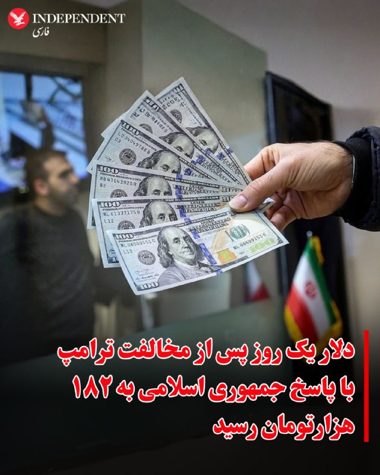

قیمت دلار روز دوشنبه ۲۱ اردیبهشت‌ماه در بازار آزاد تهران به ۱۸۲ هزار تومان افزایش یافت.

این جهش قیمت کم‌تر از یک روز پس از مخالفت شدید دونالد ترامپ، رئیس جمهوری آمریکا با پاسخ جمهوری اسلامی به طرح پیشنهادی آمریکا برای پایان جنگ روی می‌دهد.
علاوه بر پاسخ منفی ترامپ، بنیامین نتانیاهو هم اعلام کرد که کار اسرائیل با ایران هنوز تمام نشده و ذخایر اورانیوم باید از خاک ایران خارج شود. این اظهار نظرها احتمال برخورد نظامی دوباره را تشدید کرده است.

قیمت هر سکه طلا هم روز دوشنبه در بازار آزاد تهران به ۲۰۰ میلیون تومان رسید.
@VahidOOnLine

📡 @VahidOnline

## VahidOnline — post 75402

😋
💩
«محسن محمدی عراقی» معروف به «محسن اراکی»، عضو مجلس خبرگان رهبری، انتخاب «سید مجتبی خامنه‌ای» به عنوان رهبر سوم جمهوری اسلامی را «کاری الهی» توصیف کرد و مدعی شد در روند این انتخاب «دست هدایت امام زمان» را دیده است.
@VahidHeadline
«ابوالفضل ظهره‌وند»، عضو کمیسیون امنیت ملی مجلس جمهوری اسلامی، مدعی شد حکومت ایران به ظرفیت‌ها و سلاح‌هایی دست پیدا کرده که «بمب اتم» در مقایسه با آن‌ها «ترقه» محسوب می‌شود.
@VahidHeadline

📡 @VahidOnline

## VahidOnline — post 75400

نخست‌وزیر بریتانیا تاکید کرد که از جنگ ایران حمایت نمی‌کند و افزود که شهروندان این کشور نگران افزایش قیمت بنزین و تاثیرات اقتصادی آن هستند.
کی‌یر استارمر تاکید کرد کشورهای دیگر می خواستند بریتانیا را جنگ ایران بکشانند اما او هرگز این کار را نخواهد کرد.
@VahidOOnLine
دولت بریتانیا روز دوشنبه، ۲۱ اردیبهشت، ۱۲ فرد حقیقی و حقوقی مرتبط با حکومت ایران را تحریم کرد.
به گزارش خبرگزاری رویترز، این افراد به «مشارکت در اعمال خصمانه» علیه بریتانیا و چند کشور دیگر متهم شده‌اند.
در بیانیه رسمی دولت بریتانیا، از جمله این اعمال خصمانه به «طراحی حمله و ارائه خدمات مالی به گروه‌هایی که در پی بی‌ثبات کردن بریتانیا و دیگر کشورها هستند» اشاره شده است.
@VahidHeadline

📡 @VahidOnline

## kianmeli1 — post 87347

🔴 آکسیوس : ترامپ در حال بررسی دو گزینه‌ست
یا از سرگیری «پروژه آزادی» که هفته گذشته به حالت تعلیق دراومد
یا از سرگیری بمبارون و حمله به ۲۵٪ از اهدافی که آمریکا شناسایی کرده اما هنوز به اونا حمله نکرده - و امشب با ژنرال‌ها جلسه داره!
https://t.me/kianmeli1

## kianmeli1 — post 87346

  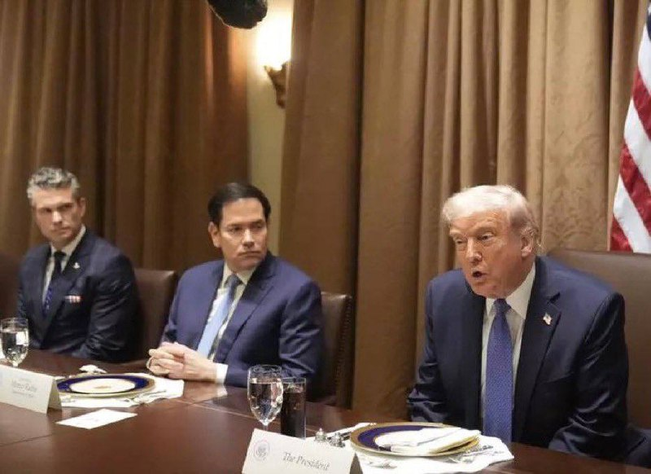

🔴به گزارش اکسیوس، به نقل از مقامات ارشد آمریکایی، دونالد ترامپ، رئیس جمهور آمریکا، امروز با تیم امنیت ملی خود دیدار کرد تا در مورد چگونگی پیشبرد مذاکرات با ایران گفتگو کند. طبق این گزارش، مذاکرات همچنین شامل احتمال از سرگیری عملیات جنگی علیه ایران بود، چیزی که قبلاً گزارش شده بود. مقامات کلیدی، از جمله اما نه محدود به آنها، جی دی ونس، معاون رئیس جمهور ایالات متحده، استیو ویتکاف، فرستاده ویژه کاخ سفید در خاورمیانه، مارکو روبیو، وزیر امور خارجه ایالات متحده، پیت هگست، وزیر دفاع ایالات متحده، ژنرال دن کین، رئیس ستاد مشترک ارتش و جان راتکلیف، مدیر سیا، انتظار می‌رود در این جلسه شرکت کنند.
https://t.me/kianmeli1

## kianmeli1 — post 87345

🔴وزیر قطع ارتباطات:

در تلاش برای برقراری اینترنت بین‌الملل در اسرع وقت هستیم
https://t.me/kianmeli1

## kianmeli1 — post 87344

  <a href="telegram/content/kianmeli1_87344_1778522903.mp4" target="_blank">🎬 Download video</a>

🔴ترامپ
هیچ‌کس انتظار نداشت که عربستان، قطر و امارات مورد حمله قرار گیرند. این یک اشتباه بزرگ از سوی ایران بود.
https://t.me/kianmeli1

## IranIntlTV — post 336689

  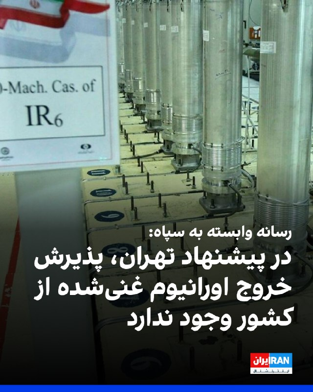

یک منبع نزدیک به تیم مذاکرات به خبرگزاری تسنیم، رسانه وابسته به سپاه پاسداران گفت: «برخلاف اظهارات برخی رسانه‌های غربی، در متن پیشنهادی جمهوری اسلامی هیچ‌گونه پذیرش خروج مواد غنی‌شده هسته‌ای از کشور وجود ندارد.»

این منبع گفت آمریکا در طرح خود نوشته بود پول‌های بلوکه‌شده ایران را آزاد خواهد کرد اما جمهوری اسلامی تاکید کرده این پول‌ها باید در مدت معینی آزاد شود.
https://iranintl.com/202605111974

## IranIntlTV — post 336688

  <a href="telegram/content/IranIntlTV_336688_1778522905.mp4" target="_blank">🎬 Download video</a>

مهدی مهدوی‌آزاد در برنامه چشم‌انداز گفت: «ایران با بحرانی اقتصادی روبه‌رو است که فقط به تورم محدود نمی‌شود، بلکه به روند نابودی رویاها و انگیزه‌های نسل جوان کشور گره خورده است.»
@iranintltv

## IranIntlTV — post 336687

  <a href="https://t.me/IranintlTV/336687" target="_blank">📎 Download file</a>

🎧نسخه صوتی دومینو: جمهوری اسلامی در برزخ صلح و جنگ
@iranintlTV

## IranIntlTV — post 336686

  <a href="telegram/content/IranIntlTV_336686_1778522907.mp4" target="_blank">🎬 Download video</a>

دونالد ترامپ گفت: «ایرانی‌ها دو روز پیش به ما گفتند باید مواد غنی‌شده را تحویل بگیرید، اما بعد نظرشان عوض شد، چون در سندی که برای ما فرستادند این موضوع ذکر نشده بود.»

او افزود: «آنها ابتدا با ما توافق کردند، ولی بعد حرفشان را پس گرفتند. ایران نباید به سلاح هسته‌ای برسد، اما در نامه‌ای که برای ما فرستادند این مساله را نپذیرفتند.»
@iranintltv

## IranIntlTV — post 336685

  <a href="telegram/content/IranIntlTV_336685_1778522909.mp4" target="_blank">🎬 Download video</a>

دونالد ترامپ بار دیگر از وجود اختلاف درون جمهوری اسلامی بر سر توافق با آمریکا سخن گفت و افزود گروهی از مقام‌های «میانه‌رو» خواهان توافق هستند اما «دیوانه‌ها» می‌خواهند جنگ ادامه پیدا کند.

او هشدار داد در صورت وقوع درگیری، «این یک جنگ خیلی سریع خواهد بود».

گفت‌وگو با جمشید برزگر، روزنامه‌نگار و تحلیل‌گر سیاسی
@iranintltv

## IranIntlTV — post 336684

  <a href="telegram/content/IranIntlTV_336684_1778522911.mp4" target="_blank">🎬 Download video</a>

دونالد ترامپ گفت: «مردم می‌خواهند اعتراض کنند، اما سلاحی ندارند. ما تصور می‌کردیم می‌توانیم از طریق کردها به آنها کمک کنیم و سلاح برسانیم، اما کردها ما را ناامید کردند.» او افزود: «بارها کمک گرفتند و کنگره می‌گفت کردها خیلی سخت می‌جنگند و برای حمایت از آنها تلاش زیادی شد، اما من از ابتدا هم فکر می‌کردم این سیاست جواب نمی‌دهد.»
@iranintltv

## IranIntlTV — post 336683

  <a href="https://t.me/IranintlTV/336683" target="_blank">📎 Download file</a>

🎧نسخه صوتی اخبار شبانگاهی | دوشنبه ۲۱ اردیبهشت
@iranintlTV

## IranIntlTV — post 336682

  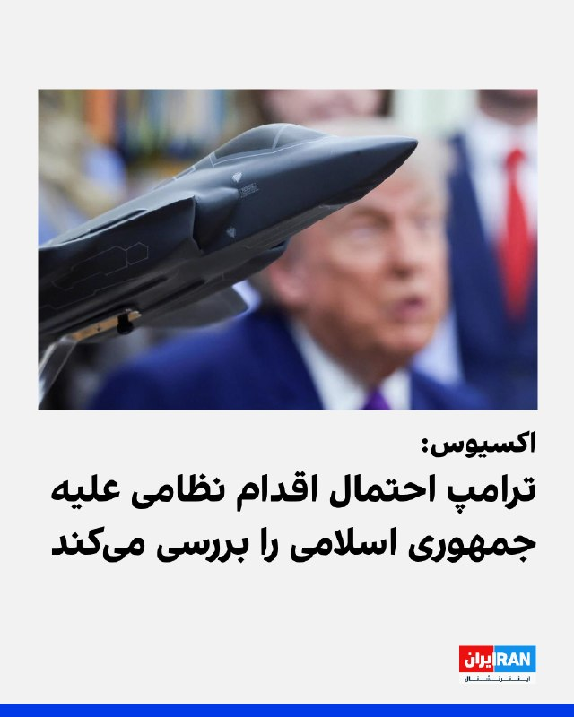

اکسیوس به نقل از سه منبع آمریکایی گزارش داد که دونالد ترامپ روز دوشنبه با تیم امنیت ملی خود دیدار می‌کند تا درباره مسیر پیش رو در جنگ با جمهوری اسلامی، از جمله احتمال ازسرگیری اقدام نظامی، گفت‌وگو کند؛ این اقدام پس از بن‌بست مذاکرات با تهران در یکشنبه اعلام شده است.

براساس این گزارش، مقام‌های آمریکایی می‌گویند ترامپ خواستار رسیدن به توافقی برای پایان دادن به جنگ است، اما رد بسیاری از درخواست‌های او توسط جمهوری اسلامی و امتناع تهران از ارائه امتیازات قابل‌توجه در برنامه هسته‌ای، گزینه نظامی را دوباره روی میز قرار داده است.
https://iranintl.com/202605113448

## IranIntlTV — post 336681

  

دارو در ایران دیگر فقط گران نشده؛ دارد ناپدید می‌شود.
قیمت بعضی داروها تا ۴۰۰ درصد افزایش یافته، حدود ۲۰۰ قلم داروی حیاتی کمیاب شده و بسیاری از بیماران، میان غذا و درمان، مجبور به انتخاب شده‌اند.

بیماران سرطان، ام‌اس، دیالیز، هموفیلی و حتی بیماران اعصاب و روان، زیر فشار کمبود و گرانی دارو مانده‌اند.

آیا شما یا اطرافیانتان با بحران دارو روبه‌رو شده‌اید؟
آیا شده نسخه دست‌تان باشد، اما توان خرید دارو را نداشته باشید؟
آیا دارویی که مصرف می‌کنید، کمیاب یا سهمیه‌ای شده است؟

از تجربه و واقعیت زندگی‌تان برای ما بگویید.

«برنامه» صدای شماست.
اگر در ایران به اینترنت دسترسی دارید، بیایید روی خط و روایت خودتان را ثبت کنید.
ما شما را، بدون نوبت، مستقیم از ایران روی آنتن می‌آوریم.
تاریخ با صدای شما نوشته می‌شود.

برای شرکت در «برنامه با کامبیز حسینی» همین حالا در واتس‌اپ پیام بدهید:

۰۰۴۴۷۵۲۲۱۱۰۱۱۰
۰۰۴۴۷۵۴۴۱۱۰۱۱۰
۰۰۴۴۷۵۱۱۱۰۲۵۵۳

«یک ایران صدای شما را می‌شنود»
@iranintltv

## IranIntlTV — post 336679

  

الحدث به نقل از منابع عراقی گزارش داد که اسماعیل قاآنی، فرمانده نیروی قدس سپاه، به عراق سفر کرده و از برخی گروه‌های مسلح خواسته از برقراری روابط با آمریکا خودداری کنند.

بر اساس این گزارش، او همچنین خط قرمزی را برای دولت عراق در مورد تحویل سلاح گروه‌های مسلح تعیین کرده است.
https://iranintl.com/202605118884

## IranIntlTV — post 336678

  <a href="telegram/content/IranIntlTV_336678_1778522915.mp4" target="_blank">🎬 Download video</a>

تیتر اول با نیوشا صارمی، دوشنبه ۲۱ اردیبهشت
@iranintltv

## IranIntlTV — post 336677

  

دونالد ترامپ از وجود اختلاف در داخل جمهوری اسلامی بر سر توافق با آمریکا سخن گفت و افزود گروهی از مقام‌های «میانه‌رو» خواهان توافق هستند اما «دیوانه‌ها» می‌خواهند جنگ ادامه پیدا کند.
او هشدار داد در صورت وقوع درگیری، «این یک جنگ خیلی سریع خواهد بود».

ترامپ گفت جمهوری اسلامی ابتدا با انتقال اورانیوم غنی‌شده از ایران موافقت کرده بود اما بعدا موضع خود را تغییر داد و این موضوع در سند ارسالی تهران به واشینگتن گنجانده نشد.

او افزود مقام‌های جمهوری اسلامی به آمریکا گفته بودند: «شما مجبورید آن را تحویل بگیرید.»

او در بخشی از صحبت‌های خود اضافه کرد واشینگتن قرار بود همراه با طرف ایرانی در روند انتقال مشارکت کند اما تهران بعدا نظرش را عوض کرد.

رییس‌جمهوری آمریکا گفت سند پیشنهادی جمهوری اسلامی پس از چهار روز تاخیر به واشینگتن ارسال شد؛ در حالی که به گفته او تهیه آن «فقط ۱۰ دقیقه» زمان نیاز داشت.

ترامپ افزود: «آنها تضمین دادند که برای مدت بسیار طولانی سلاح هسته‌ای نخواهند داشت، اما نمی‌توانند به نتیجه برسند.»
https://iranintl.com/202605119981

## IranIntlTV — post 336676

  <a href="telegram/content/IranIntlTV_336676_1778522916.mp4" target="_blank">🎬 Download video</a>

ساعاتی پس از نارضایتی کامل رییس‌جمهور آمریکا از پاسخ تهران به پیشنهاد واشینگتن برای توافق، سخنگوی وزارت خارجه گفت جمهوری اسلامی فعلا درباره برنامه هسته‌ای‌اش مذاکره نمی‌کند. همزمان نخست‌وزیر اسرائیل تدارک برگزاری یک نشست امنیتی را دیده است.

گزارشی از مجتبا پورمحسن
@iranintltv

## IranIntlTV — post 336674

  <a href="telegram/content/IranIntlTV_336674_1778522918.mp4" target="_blank">🎬 Download video</a>

دونالد ترامپ با «آشغال» خواندن پیشنهاد توافق تهران گفت آتش‌بس به‌شدت شکننده است. او در ادامه گفت: «آتش‌بس در اغما قرار دارد، به آن اکسیژن وصل کرده‌اند و تنها یک درصد شانس بقا دارد.»
@iranintltv

## IranIntlTV — post 336673

  <a href="telegram/content/IranIntlTV_336673_1778522919.mp4" target="_blank">🎬 Download video</a>

دونالد ترامپ، رییس‌جمهوری آمریکا، درباره مقامات جمهوری اسلامی گفت: «آن‌ها فکر می‌کنند من خسته خواهم شد، اما هیچ فشاری روی من نیست.» او همچنین پیشنهاد توافق جمهوری اسلامی را «احمقانه» توصیف کرد.
@iranintltv

## IranIntlTV — post 336672

  

دونالد ترامپ در گفت‌وگو با سی‌بی‌اس نیوز درباره پاسخ اخیر تهران به پیشنهاد صلح آمریکا گفت که جمهوری اسلامی در برنامه هسته‌ای خود امتیازاتی داده اما «کافی نبوده» و هنوز «پیشنهاد آن‌ها بسیار ضعیف و غیرقابل قبول» است.
https://iranintl.com/202605110573

## IranIntlTV — post 336671

  <a href="https://t.me/IranintlTV/336671" target="_blank">📎 Download file</a>

🎧نسخه صوتی اخبار نیمروزی | دوشنبه ۲۱ اردیبهشت
@iranintlTV

## IranIntlTV — post 336670

  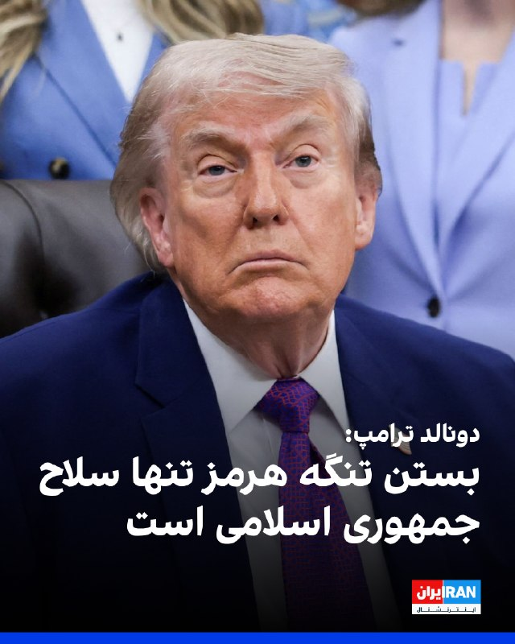

دونالد ترامپ در واکنش به اظهارات بنیامین نتانیاهو که گفته بود «هیچ‌کس پیش‌بینی کامل و دقیقی» درباره تنگه هرمز نداشت، گفت: «من داشتم. من می‌دانستم آن‌ها تنگه هرمز را بسته‌اند. این تنها سلاحی است که دارند.»
ترامپ افزود آمریکا می‌توانست در چارچوب «پروژه آزادی» این گذرگاه را باز کند و گفت این عملیات می‌تواند از سر گرفته شود و در آن صورت «بسیار شدیدتر» خواهد بود.
https://iranintl.com/202605119757

## IranIntlTV — post 336669

🔻کسب‌وکارها یکی پس از دیگری سقوط می‌کنند

همزمان با تداوم قطعی اینترنت، فشارهای اقتصادی و پیامدهای جنگ، بسیاری از کسب‌وکارها در شهرهای مختلف با کاهش فروش، تعدیل نیرو و حتی خطر تعطیلی مواجه شده‌اند. صاحبان کسب‌وکارها در پیام‌هایی به ایران‌اینترنشنال، وضعیت کنونی را یکی از دشوارترین دوره‌های سال‌های اخیر توصیف کردند.

یک مدرس کاشت ناخن و مانیکور از توقف کسب‌وکار خود از اسفندماه سال گذشته تاکنون خبر داد.

به گفته این شهروند، گرچه مردمی که از تامین نیازهای اولیه خود درمانده شده‌اند، کمتر به خدمات زیبایی می‌پردازند، اما عوامل دیگری نیز در این رکود موثر است؛ از جمله قطعی اینترنت که موجب شده تا او کسب درآمد از طریق فروش پکیج‌های آموزشی را از دست بدهد.

او همچنین توضیح داد از همان زمان تاکنون آنتن دستگاه کارتخوانش قطع شده است و در پاسخ به پیگیری‌هایش گفته‌اند سیگنال دستگاه کارتخوان «مشاغل غیرضروری» به دلایل «امنیتی» تا اطلاع ثانوی قطع خواهد بود.

بحران در صنایع پتروشیمی و بنادر

افزون بر این، پیام‌های رسیده به ایران‌اینترنشنال حاکی از موج گسترده بیکاری و ورشکستگی در کسب‌وکارهای صنعتی و خدماتی وابسته به صنایع سنگین است.

بسیاری از فعالان این حوزه‌ها که تعدیل، اخراج یا بیکار شده‌اند، گفتند همچون دیگر صنف‌هایی که با مشکل اقتصادی مواجه شده‌اند، به مشاغلی نظیر رانندگی در اسنپ یا کارهایی روی آورده‌اند که امنیت شغلی پایین‌تری دارند.

یک شهروند شاغل در حوزه صنعت گفت: «هر کیلو پروفیل پیش از جنگ تا حدود قیمت ۷۰ هزارتومان خریدوفروش می‌شد، اما اکنون قیمت آن به ۱۵۵ هزار تومان رسیده است. به دلیل همین افزایش قیمت مدت سه‌ ماه است که بیکاریم و توان پرداخت هزینه مواد اولیه را نداریم.»

قیمت پروفیل، به‌عنوان ماده اولیه ساخت‌وساز در صنایع طی یک‌سال گذشته افزایش قیمتی ۱۲۰ تا ۱۶۰ درصدی را تجربه کرده است.

مخاطب دیگری که فعال در صنف کابینت‌سازی است، نیز گفت قیمت هر ورق ام‌دی‎‌اف از ۳ میلیون تومان در سال ۱۴۰۴ به ۱۵ تا ۱۷ میلیون تومان در سال جدید رسیده است.

این شهروند با اشاره به رشد ۴۰۰ تا ۴۷۰ درصدی قیمت مواد اولیه، گفت در چنین شرایطی دیگر امکان ادامه کار و پرداخت اجاره محل کسب وجود ندارد.

پیش از این نیز شهروندان از بحران بیکاری در مشاغل مرتبط با پتروشیمی و نبود ورق آهن و مواد پتروشیمی در شهرهایی از جمله اصفهان خبر داده بودند که باعث تعطیلی بسیاری از کارگاه‌های صنعتی شده است.

علاوه بر صنایع، گزارش‌هایی نیز از موج توقف کسب و کارها و تعدیل نیرو در بنادر به دست ایران‌اینترنشنال رسیده است.

یکی از کارکنان بندر رجایی گفت بسیاری از کارگران این منطقه اقتصادی تعدیل شده‌اند و آنها که همچنان سر کار مانده‌اند، حقوق‌هایشان به‌صورت مرتب پرداخت نمی‌شود و بندر بسیار خلوت شده است.

بندر رجایی یکی از مهم‌ترین بنادر تجاری ایران است که اردیبهشت سال ۱۴۰۴ با آنچه انفجار یکی از کانتینرهای حامل مواد شیمیایی خطرناک، از جمله سدیم پرکلرات اعلام شد، دچار آتش‌سوزی شد و به مرگ ده‌ها نفر انجامید.

بسیاری از شرکت‌های پیمانکاری وابسته به این بندر پس از انفجار و تا پیش از جنگ نیز با مشکلات اقتصادی بسیاری دست به گریبان بوده‌اند.

شهروند دیگری از سربندر در پیامی مشابه نوشت تمامی شرکت‌های بندر نیروهای خود را تعدیل کرده‌اند و حقوق افرادی که کماکان بر سر کار مانده‌اند هم به درستی پرداخت نمی‌شود.

پایگاه خبری رویداد ۲۴ نیز ۱۷ اردیبهشت در گزارشی درباره وضعیت مجموعه فولاد مبارکه پس از حملات آمریکا و اسرائیل نوشت که با وجود اطمینان‌دهی اولیه به کارکنان مبنی بر پرداخت بدون مشکل حقوق،دستمزد نیروها به حداقل دستمزد مصوب اداره کار تقلیل یافته است و بسیاری از نیروهای متخصص به رانندگی در تاکسی‌های اینترنتی روی آورده‌اند.

رستوران‌ها تحت تاثیر گرانی

صنف رستوران و غذاخوری‌ها نیز از جمله کسب و کارهایی هستند که با افزایش قیمت مواد اولیه و فشارهای اقتصادی آسیب زیادی دیده‌اند.

یکی از مخاطبان ایران‌اینترنشنال که صاحب یک رستوران فست‌فود در لاهیجان است، نوشت: «مواد اولیه ساندویچی که اکنون به مبلغ ۱۰۰ هزارتومان فروخته می‌شود، چند روز بعد ۱۱۰ هزار تومان خریداری می‌شود. پس ناچار به افزایش قیمت روزانه هستیم که هم موجب نارضایتی مشتری است و هم خود از این مساله آسیب دیده‌ایم.»

رستوران‌دار دیگری از کیش نیز گفت اول ناچار شد بیش از ۱۰ نفر از نیروهایش را تعدیل کند و حالا چاره‌ای جز تعطیلی برایش نمانده است.
هم‌زمان، برخی مخاطبان از افزایش قیمت فست‌فود خبر دادند.

بر اساس این گزارش‌ها، قیمت یک ساندویچ به‌طور متوسط به ۵۰۰ هزار تومان و یک پیتزا به یک میلیون و ۲۰۰ هزار تومان رسیده است.

🔗 وب‌سایت ایران اینترنشنال

@iranintltv

## IranIntlTV — post 336668

  <a href="telegram/content/IranIntlTV_336668_1778522923.mp4" target="_blank">🎬 Download video</a>

سرخط خبرهای دوشنبه ۲۱ اردیبهشت
@iranintltv

## Shin_Persian — post 5958

  <a href="telegram/content/Shin_Persian_5958_1778522924.mp4" target="_blank">🎬 Download video</a>

Rapid Response 47 ✓ @RapidResponse47
Mon, 11 May 2026 15:48:50 UTC

.@POTUS on the ceasefire in Iran: "After reading that piece of garbage they sent us... It's on life support."

فارسی

.@POTUS در مورد آتش‌بس در ایران: «بعد از خواندن آن زباله‌ای که برای ما فرستادند... با دستگاه زنده مانده است.»

𝕏 · @shin_persian

## Shin_Persian — post 5957

📦 mhrv-rs v1.9.22 released

• **Fix: skip H2 for tunnel_request (single ops)

Files (Android APKs, Windows, macOS, Linux, OpenWRT) on the files channel:

👉 v1.9.22 — all files with SHA-256

Channel:
https://t.me/mhrv_rs
or: https://t.me/+R1OyoHX2boA1ZDgx

#v1922

## Shin_Persian — post 5956

  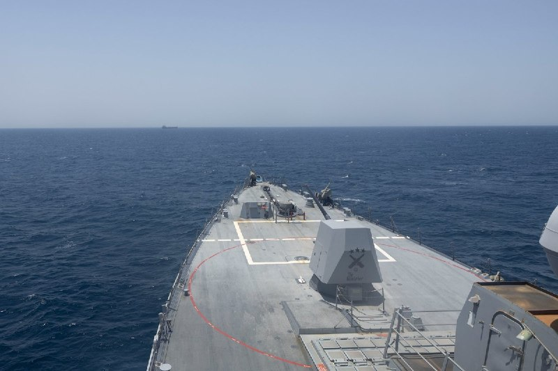

U.S. Central Command ✓ @CENTCOM
Mon, 11 May 2026 13:22:29 UTC

USS Delbert D. Black (DDG 119) monitors regional waters as it transits the Arabian Sea during enforcement of the U.S. blockade against Iran. CENTCOM forces have redirected 62 commercial ships and disabled 4 to ensure compliance.

فارسی

کشتی یو‌اس‌اس دلبرت دی. بلک (DDG 119) هنگام عبور از دریای عرب در جریان اجرای محاصره ایالات متحده علیه ایران، آب‌های منطقه را زیر نظر دارد. نیروهای سنتکام (فرماندهی مرکزی ایالات متحده) برای اطمینان از انطباق، مسیر ۶۲ کشتی تجاری را تغییر داده و ۴ کشتی را از کار انداخته‌اند.

𝕏 · @shin_persian

## ManotoTV — post 105318

  <a href="telegram/content/ManotoTV_105318_1778522926.mp4" target="_blank">🎬 Download video</a>

‌
دونالد ترامپ، رئیس‌جمهوری آمریکا گفت:
« آن‌ها باور نمی‌کردند که ما تا این حد جلو برویم. چقدر آدم‌های احمقی هستند. فکر می‌کردند من خسته می‌شوم یا تحت فشار قرار می‌گیرم، اما هیچ فشاری وجود ندارد. ما به یک پیروزی کامل خواهیم رسید.»

ترامپ در بخش دیگری افزود جمهوری اسلامی ابتدا با خارج کردن همه اورانیوم غنی‌شده از ایران موافقت کرده بود، اما بعد موضع خود را تغییر داد.

ترامپ گفت: «دو روز پیش موافقت کرده بودند. گفتند شما باید آن را خارج کنید.»

او افزود قرار بوده آمریکا در روند انتقال این مواد مشارکت کند، اما تهران بعداً نظرش را عوض کرده و این موضوع را در متن پیشنهادی خود نیاورده است.

رئیس‌جمهوری آمریکا همچنین گفت واشینگتن چهار روز منتظر دریافت سندی بوده که «باید در ده دقیقه آماده می‌شد.»

ترامپ افزود: «موضوع خیلی ساده بود؛ ما آن مواد را دریافت می‌کنیم و آن‌ها هم برای مدت طولانی تضمین می‌دهند که سلاح هسته‌ای نداشته باشند.»

او در پایان گفت: «آن‌ها با ما موافقت می‌کنند و بعد حرفشان را پس می‌گیرند.»

## ManotoTV — post 105317

  <a href="telegram/content/ManotoTV_105317_1778522927.mp4" target="_blank">🎬 Download video</a>

‌
دونالد ترامپ، رئیس‌جمهوری آمریکا، با انتقاد شدید از پاسخ جمهوری اسلامی به پیشنهادهای واشینگتن، وضعیت آتش‌بس را «بسیار ضعیف» توصیف کرد.

ترامپ گفت: «بعد از خواندن آن آشغال، باید بگویم این آتش‌بس الان یکی از ضعیف‌ترین‌هاست.»

او افزود حتی متن پاسخ جمهوری اسلامی را کامل نخوانده و گفته است: «وقتم را برای خواندنش تلف نمی‌کنم.»

رئیس‌جمهوری آمریکا همچنین گفت: «می‌توانم بگویم این آتش‌بس الان روی دستگاه حفظ حیات است.»

او همچنین گفت در جمهوری اسلامی «میانه‌روها» و «دیوانه‌ها» وجود دارند و مدعی شد «میانه‌روها به‌شدت خواهان توافق هستند»، اما «تندروها می‌خواهند تا آخر بجنگند.»

او همچنین با انتقاد از کردها گفت واشینگتن انتظار داشت آن‌ها سلاح را به دست معترضان در ایران برسانند، اما «کردها ما را ناامید کردند.»

ترامپ افزود: «ما اسلحه و مهمات فرستادیم، اما آن‌ها آن را برای خودشان نگه داشتند.»

## ManotoTV — post 105316

  <a href="telegram/content/ManotoTV_105316_1778522929.mp4" target="_blank">🎬 Download video</a>

تماس‌هایی از ایران:
«با همه سختی‌ها و جیب‌های خالی…
اما دل‌های بزرگ.
نمی‌ذارن یه هموطن برای نجات عزیزش تنها بمونه.
این شرافت مردمه ایران.»

## ManotoTV — post 105315

  <a href="telegram/content/ManotoTV_105315_1778522931.mp4" target="_blank">🎬 Download video</a>

تماسی از ایران:
«می‌گفت تجمع‌ها دیگه جمعیت نداره…
با کباب و بازی هم مردم رو نمی‌تونن بیارن.
می‌گفت مردم زیر فشار گرونی موندن،
اما دیگه فریب نمی‌خورن.»

## ManotoTV — post 105314

  <a href="telegram/content/ManotoTV_105314_1778522932.mp4" target="_blank">🎬 Download video</a>

دونالد ترامپ، رئیس‌جمهوری آمریکا، پیشنهاد جمهوری اسلامی را غیرقابل قبول خواند و تهران به او گفته بود اورانیوم غنی‌شده باید توسط آمریکا از محل خارج شود، زیرا سایت هسته‌ای «آن‌قدر نابود شده» که تنها «یک یا دو کشور در جهان» توان خارج کردن مواد از آن را دارند.

ترامپ گفت: «آن‌ها گفتند فقط آمریکا و چین توانایی خارج کردنش را دارند.»

رئیس‌جمهوری آمریکا همچنین گفت جمهوری اسلامی پس از این حملات، با یک «پیشنهاد احمقانه» برای مذاکره بازگشته است؛ پیشنهادی که به گفته او «هیچ‌کس آن را قبول نمی‌کند.»

ترامپ در ادامه بار دیگر جمهوری اسلامی را به کشتن «۴۲ هزار معترض غیرمسلح» متهم کرد و گفت تهران «شروع به تیراندازی به معترضان کرد.»

## ManotoTV — post 105313

  <a href="telegram/content/ManotoTV_105313_1778522934.mp4" target="_blank">🎬 Download video</a>

‌
دونالد ترامپ، رئیس‌جمهوری آمریکا، در جریان یک رویداد مربوط به سلامت مادران در کاخ سفید، با اشاره به تحولات مربوط به جمهوری اسلامی گفت گروهی از ژنرال‌های آمریکایی منتظر دیدار با او هستند.

ترامپ خطاب به سخنرانان این نشست گفت: «زیاد طولانی صحبت نکنید، چون یک گروه بزرگ از ژنرال‌ها منتظر من هستند.»

او سپس با اشاره به ایران افزود: «و آن موضوع هم مهم است، می‌دانید، مربوط می‌شود به کشور کاملاً دوست‌داشتنی ایران.»

ترامپ همچنین با لحنی کنایه‌آمیز گفت: «آن‌ها این‌طور تلفظش می‌کنند.»

## ManotoTV — post 105312

  <a href="telegram/content/ManotoTV_105312_1778522935.mp4" target="_blank">🎬 Download video</a>

راهپیمایی ایرانیان ونکوور

## ManotoTV — post 105311

  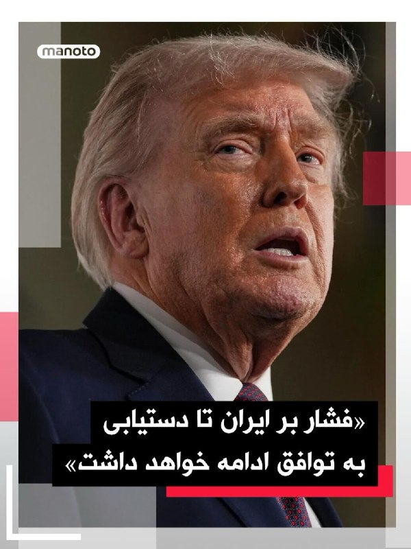

دونالد ترامپ، رئیس‌جمهوری آمریکا، به فاکس‌نیوز گفت واشینگتن در حال بررسی ازسرگیری عملیاتی برای بازگشایی تنگه هرمز است.

او افزود واشینگتن فشار بر جمهوری اسلامی را تا زمان دستیابی به توافق ادامه خواهد داد.

ترامپ همچنین گفت هنوز تصمیم نهایی درباره ازسرگیری «پروژه آزادی» را نگرفته است.

## ManotoTV — post 105310

  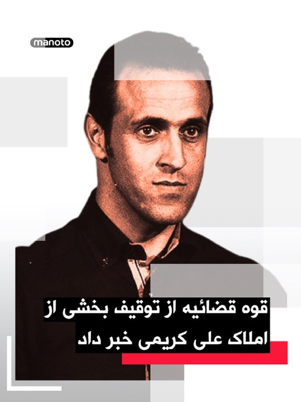

قوه قضائیه جمهوری اسلامی از توقیف بخشی از املاک علی کریمی خبر داد.

بر اساس اعلام قوه قضائیه، ۲ واحد تجاری و ۴ واحد مسکونی متعلق به علی کریمی در استان البرز شناسایی و توقیف شده‌اند.

در این گزارش ادعا شده این املاک پس از «استعلام از سازمان ثبت اسناد و املاک» و با «اقدامات حقوقی و اطلاعاتی» شناسایی شده‌اند.

## ManotoTV — post 105309

  

کول آلن، متهم به تلاش برای ترور دونالد ترامپ در مراسم شام خبرنگاران کاخ سفید، در دادگاه اتهامات علیه خود را رد کرد.
او متهم است ۲۵ آوریل با عبور از ایست بازرسی امنیتی، به سمت یکی از مأموران سرویس مخفی آمریکا شلیک کرده باشد.

در زمان حادثه، ترامپ، ملانیا ترامپ و شماری از مقام‌های ارشد دولت آمریکا در محل حضور داشتند و پس از شنیده شدن صدای تیراندازی از سالن خارج شدند.

دادستان‌ها می‌گویند هنگام بازداشت، چند چاقو و یک اسلحه کمری نیز همراه آلن بوده است. او در صورت محکومیت با احتمال حبس ابد روبه‌رو خواهد شد.

## ManotoTV — post 105308

  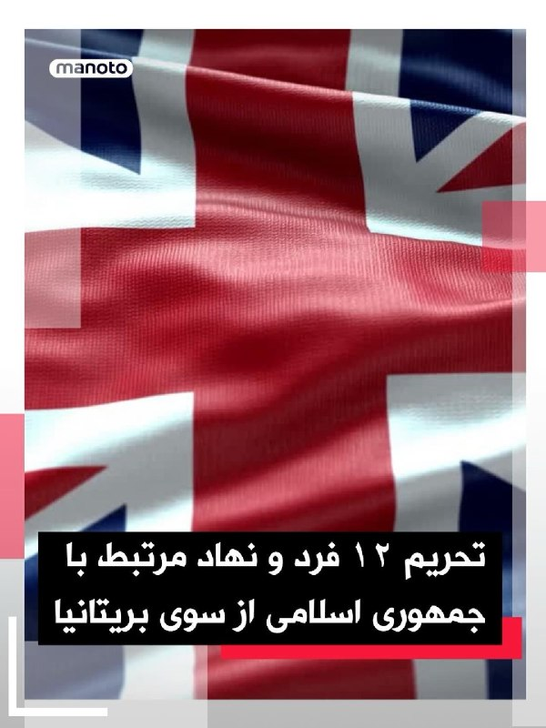

دولت بریتانیا روز دوشنبه ۱۲ فرد و نهاد مرتبط با جمهوری اسلامی را تحریم کرد و آن‌ها را به مشارکت در «فعالیت‌های خصمانه» متهم کرد.

دولت بریتانیا اعلام کرد این افراد و نهادها در طراحی حملات و ارائه خدمات مالی به گروه‌هایی نقش داشته‌اند که به‌دنبال بی‌ثبات‌سازی بریتانیا و کشورهای دیگر هستند.

در میان افراد تحریم‌شده، اعضا و مرتبطان شبکه جنایی «زیندشتی» و همچنین چند صرافی و فعال مالی دیده می‌شوند.

## ManotoTV — post 105307

  <a href="telegram/content/ManotoTV_105307_1778522940.mp4" target="_blank">🎬 Download video</a>

همخوانی سرود ای ایران در گردهمایی ایرانیان سیدنی

## ManotoTV — post 105306

  <a href="telegram/content/ManotoTV_105306_1778522941.mp4" target="_blank">🎬 Download video</a>

چین سرانجام تایید کرد: دونالد ترامپ این هفته به دعوت شی جین‌پینگ به پکن سفر می‌کند.

وزارت خارجه چین اعلام کرد ترامپ در این سفر با رئیس‌جمهوری چین دیدار خواهد کرد. این سفر قرار بود اوایل آوریل انجام شود اما تاکنون پکن آن را رسماً تایید نکرده بود.

این دیدار در حالی انجام می‌شود که روابط واشنگتن و پکن بر سر جنگ ایران و تهدید امنیت انرژی چین پس از اختلال در تردد نفتکش‌ها از تنگه هرمز، پرتنش شده است.

چند روز پیش از این سفر نیز وزارت خزانه‌داری آمریکا شرکت‌هایی مستقر در چین را به اتهام کمک به تلاش‌های نظامی جمهوری اسلامی تحریم کرد.

## ManotoTV — post 105305

  <a href="telegram/content/ManotoTV_105305_1778522942.mp4" target="_blank">🎬 Download video</a>

گردهمایی ایرانیان گلاسگو

## ManotoTV — post 105303

  <a href="telegram/content/ManotoTV_105303_1778522943.mp4" target="_blank">🎬 Download video</a>

امانوئل ماکرون، رئیس‌جمهور فرانسه، روز دوشنبه ۲۱ اردیبهشت، در جریان نشست «آفریقا فوروارد» در نایروبی، هنگام یک پنل فرهنگی سخنان خود را متوقف کرد و از حاضران خواست سکوت کنند.

در ویدئوهای منتشرشده از این نشست، ماکرون با لحنی معترض گفت با این میزان سر و صدا «صحبت کردن درباره فرهنگ» و گوش دادن به سخنان افراد حاضر روی صحنه ممکن نیست. او این وضعیت را «بی‌احترامی کامل» خواند و از کسانی که قصد گفت‌وگوهای جانبی دارند خواست سالن را ترک کنند.

نشست «آفریقا فوروارد» روزهای ۲۱ و ۲۲ اردیبهشت در پایتخت کنیا برگزار می‌شود و فرانسه و کنیا به طور مشترک میزبان آن هستند. این نشست با حضور ماکرون و هیات‌هایی از بیش از ۳۰ کشور آفریقایی برگزار شده و محور آن جذب سرمایه‌گذاری و بازنگری در نگاه جهانی به ریسک اقتصادی در آفریقا است.

## ManotoTV — post 105302

  <a href="telegram/content/ManotoTV_105302_1778522944.mp4" target="_blank">🎬 Download video</a>

گردهمایی ایرانیان بروکسل

## ManotoTV — post 105301

  <a href="telegram/content/ManotoTV_105301_1778522946.mp4" target="_blank">🎬 Download video</a>

داده‌های کشتیرانی شرکت‌های «کپلر» و «ال‌اس‌ای‌جی» نشان می‌دهد سه نفتکش حامل نفت خام، هفته گذشته و روز یکشنبه، با خاموش کردن ردیاب‌های خود از تنگه هرمز عبور کردند؛ اقدامی که برای کاهش خطر حملات احتمالی جمهوری اسلامی انجام شده است.

بر اساس این داده‌ها، دو ابرنفتکش «آگیوس فانوریوس ۱» و «کیارا ام» روز یکشنبه از این تنگه عبور کردند. هرکدام از این نفتکش‌ها حدود دو میلیون بشکه نفت خام عراق حمل می‌کردند.

این روند نشان می‌دهد با افزایش تنش‌ها در منطقه، شرکت‌های کشتیرانی برای حفظ صادرات نفت خاورمیانه، به روش‌هایی مانند خاموش کردن سیستم‌های ردیابی روی آورده‌اند.

## FarsiVOA — post 217460

بررسی جزئیات یک گزارش افشاگرانه درباره اقامت و فعالیت‌های فرزند قالیباف در استرالیا در گفت‌و‌گو با کیانوش رزاقی، حقوقدان و وکیل دادگستری

## FarsiVOA — post 217459

گفت‌و‌گو با رسول نفیسی، جامعه شناس و تحلیلگر سیاسی، درباره رد پاسخ جمهوری اسلامی از سوی پرزیدنت ترامپ

## FarsiVOA — post 217458

🔺پرزیدنت ترامپ: آتش‌بس با رژیم ایران به‌شدت شکننده است؛ با گروهی «دیوانه» سروکار داریم

▪️پرزیدنت ترامپ بار دیگر تاکید کرد که آتش‌بس کنونی با رژیم ایران به‌شدت شکننده است و شانس بقای آن بسیار اندک است. او همچنین تاکید کرد که رژیم ایران هرگز نخواهد توانست به سلاح هسته‌ای دست پیدا کند و آمریکا به یک پیروزی کامل خواهد رسید.

⬇️ بیشتر بخوانید:

https://ir.voanews.com/a/president-trump-lunatics-in-iran-want-to-fight/8148851.html/?nocach=1

## FarsiVOA — post 217457

🔺ابتلای یک شهروند آمریکایی به ویروس هانتا و بروز علائم خفیف بیماری در یک فرد دیگر

◾️وزارت بهداشت و خدمات انسانی آمریکا اعلام کرده است که یکی از ۱۷ مسافر آمریکایی کشتی تفریحی آلوده به ویروس هانتا که در راه بازگشت به کشور هستند، به گونه‌ای خفیف به این ویروس مبتلا شده است. یک مسافر دیگر هم دچار علائم خفیف این بیماری است.

⬇️ بیشتر بخوانید:

https://ir.voanews.com/a/cruise-ship-hantavirus-america/8148787.html?withmediaplayer=1

## FarsiVOA — post 217456

🔺پرزیدنت ترامپ تعلیق موقت مالیات غیرمستقیم سوخت در آمریکا را بررسی می‌کند

▪️دونالد ترامپ، رئیس جمهوری آمریکا، روز دوشنبه به شبکه خبری «سی‌بی‌اس» گفت که قصد دارد مالیات فدرال بر سوخت وسایل نقلیه، یعنی بنزین و گازوئیل، را مدتی تعلیق کند، و پس از کاهش قیمت سوخت آن را به‌ تدریج بازگرداند.

⬇️ بیشتر بخوانید:

https://ir.voanews.com/a/president-trump-cbs-interview-gas-tax-suspended/8148837.html/?nocach=1

## FarsiVOA — post 217455

در گفت‌وگو با رضا تقی‌زاده، تحلیلگر روابط بین‌الملل، به واکنش تند پرزیدنت ترامپ به پاسخ جمهوری اسلامی و مسکوت ماندن اختلاف‌های حل‌نشده در سایه تنش‌های دریایی پرداختیم و پرسیدیم آیا وضعیت آتش‌بس قابل دوام است و یا نشانه‌های عبور به مرحله‌ای خطرناک‌تر دیده می‌شود؟

## FarsiVOA — post 217454

در گفت‌وگو با مهرداد درویش‌پور، استاد دانشگاه و جامعه‌شناس، به اعدام عرفان شکورزاده دانشجوی نخبه رشته هوافضای دانشگاه علم و صنعت پرداختیم و بررسی کردیم که چرا جمهوری اسلامی در اوج بحران‌های داخلی، سرکوب و اعدام را به ابزاری برای مهار نارضایتی اجتماعی تبدیل کرده است.

## FarsiVOA — post 217451

سنتکام اعلام کرد سی‌امین دوره رزمایش «همکاری منطقه‌ای ۲۰۲۶» ماه آینده در آمریکا برگزار می‌شود.

نیروهای نظامی نزدیک به ۱۲ کشور از آسیای مرکزی و جنوبی در این رزمایش برای تقویت مهارت‌های عملیاتی، افزایش آمادگی رزمی و گسترش همکاری‌های امنیتی شرکت می‌کنند.

@FarsiVOA

## FarsiVOA — post 217450

تلاش برای آگاه کردن جهان از بیماری پارکینسون

## FarsiVOA — post 217449

  <a href="telegram/content/FarsiVOA_217449_1778522946.mp4" target="_blank">🎬 Download video</a>

ارتش اسرائیل اعلام کرد نیروهای لشکر ۹۱ «یک گروه شلیک» را که بعد از حمله موشکی به نیروهای اسرائیل در حال انتقال کامیون حامل پرتابگر موشک بود شناسایی کردند.

نیروی هوایی ارتش اسرائیل با هدایت نیروهای زمینی، «تروریست‌ها را هدف قرار داده و پرتابگر موشک» را منهدم کردند.

ارتش اسرائیل همچنین بر ادامه اقدامات به منظور برطرف کردن تهدیدها علیه شهروندان اسرائیل تاکید کرد.

## FarsiVOA — post 217448

🔺تحریم‌های بریتانیا علیه ۱۲ فرد و نهاد مرتبط با جمهوری اسلامی

▪️دولت بریتانیا روز دوشنبه ۲۱ اردیبهشت ۱۲ فرد و نهاد مرتبط با رژیم ایران را به فهرست تحریمی خود اضافه و آنها را به مشارکت در «فعالیت خصمانه» از جمله طراحی حملات و «ارائه خدمات مالی به گروه‌ها» برای بی‌ثبات‌سازی بریتانیا و سایر کشورها متهم کرد.

⬇️ بیشتر بخوانید:

https://ir.voanews.com/a/iran-islamic-republic-sanctions-britain/8148823.html/?nocach=1

## FarsiVOA — post 217447

  <a href="telegram/content/FarsiVOA_217447_1778522948.mp4" target="_blank">🎬 Download video</a>

سعید پیوندی، جامعه‌شناس آموزشی در میدان: روشنفکرانِ خواستار «بازگشت» در به گل نشستن پروژه نوسازی که فرخ‌رو پارسا نماد آن بود نقش داشتند و در نهایت شاهد پیروزی انقلاب اسلامی شدیم

## FarsiVOA — post 217446

  <a href="telegram/content/FarsiVOA_217446_1778522949.mp4" target="_blank">🎬 Download video</a>

ارتش اسرائیل اعلام کرد نیروهای لشکر ۱۴۶ روز یکشنبه زیرساخت‌ها و یک انبار تسلیحاتی متعلق به حزب‌الله لبنان را منهدم کرد. در این حملات نیروهای حزب‌الله نیز کشته شدند.

ارتش اسرائیل همچنین دو نیروی حزب‌الله را در جنوب لبنان، در یک «ساختمان که برای پیشبرد طرحی تروریستی علیه نیروهای ارتش اسرائیل استفاده می‌شد» شناسایی و حذف کرد.

ارتش اسرائیل از حملات حزب‌الله در ساعات اخیر با راکت و پهپاد انفجاری به نیروهایش در جنوب لبنان خبر داد که تلفات جانی نداشت و موجب خسارت دیدن تجهیزات ارتش شد.

## FarsiVOA — post 217445

🔺آمادگی اسرائیل برای اقدام نظامی علیه جمهوری اسلامی؛ تمرکز بر ضربه به حزب‌الله و حماس با حذف بیش از ۲۲۰ تروریست

▪️بنا بر اطلاعاتی که در اختیار بخش فارسی صدای آمریکا قرار گرفته، اسرائیل در حالی‌که آمادگی کامل خود را برای هرگونه پاسخ به حملات احتمالی جمهوری اسلامی حفظ کرده، تمرکز عملیاتی خود را بر ادامه ضربه‌زدن به گروه‌های نیابتی جمهوری اسلامی، به‌ویژه حزب‌الله لبنان و حماس، ادامه خواهد داد.

⬇️ بیشتر بخوانید:

https://ir.voanews.com/a/8148806.html/?nocach=1

## FarsiVOA — post 217444

  <a href="telegram/content/FarsiVOA_217444_1778522951.mp4" target="_blank">🎬 Download video</a>

گلایه یک شهروند از گرانی روزافزون روغن و مواد خوراکی؛ «سپاه ما را به خواری و ذلت انداخته.»

در سایه بی‌ثباتی اقتصادی و فشارهای مداوم، زندگی روزمره بسیاری از مردم به میدان مبارزه‌ای خاموش برای تأمین حداقل‌ها تبدیل شده است.

## FarsiVOA — post 217443

در حالی که جام جهانی فوتبال ۲۰۲۶ از چند هفته دیگر در سه کشور آمریکا، مکزیک، و کانادا آغاز می‌شود، جمهوری اسلامی همچنان در تلاش است تا از فیفا تضمین‌های ویژه دریافت کند؛ از درخواست ورود بدون انگشت‌نگاری تا نگرانی درباره بازیکنان و مقام‌هایی که سابقه حضور در سپاه پاسداران دارند.

## FarsiVOA — post 217442

تورج اتابکی، پژوهشگر تاریخ اجتماعی ایران می‌گوید در انقلاب ۵۷، حتی اهل قلم و منورالفکرها دنبال خمینی افتادند به این دلیل که فرصت مشق سیاسی به آنها داده نشده بود تا ببینند اهل عمامه گزینه‌ای برای حل مشکلات ایران نیستند

## FarsiVOA — post 217441

  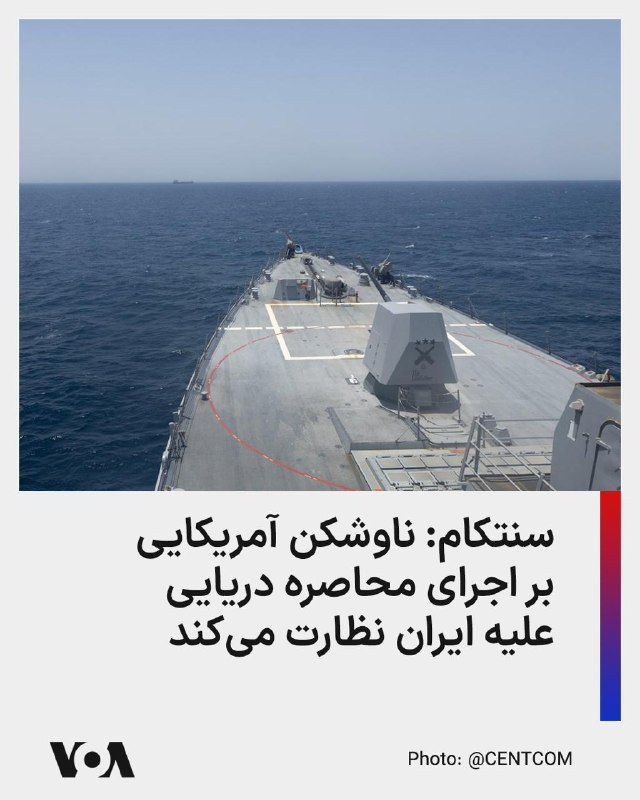

فرماندهی مرکزی ایالات متحده، سنتکام، اعلام کرد ناوشکن «یو‌اس‌اس دلبرت دی. بلک» در حال عبور از دریای عرب بر اجرای محاصره دریایی علیه جمهوری اسلامی ایران نظارت می‌کند.

سنتکام همچنین گفت نیروهای آمریکایی تاکنون مسیر ۶۲ کشتی تجاری را تغییر داده و چهار شناور را برای اطمینان از اجرای این اقدامات از کار انداخته‌اند.

این گزارش در حالی منتشر می‌شود که تنش‌ها میان واشنگتن و تهران ادامه دارد.

@FarsiVOA

## DW_Farsi — post 124573

  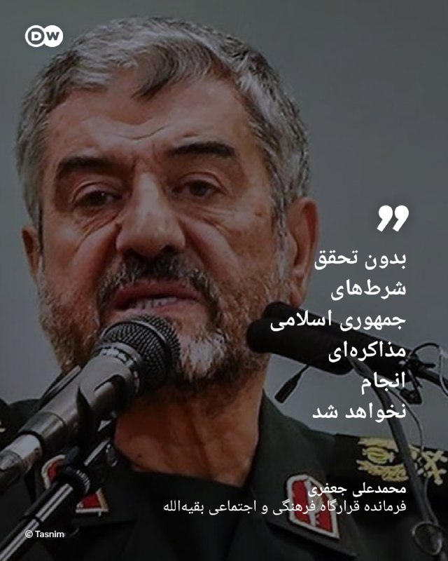

🔶 فرمانده پیشین سپاه: بدون تحقق شرط‌های جمهوری اسلامی مذاکره‌ای انجام نخواهد شد

بنا بر گزارش رسانه‌های داخلی در ایران، محمدعلی جعفری، فرمانده قرارگاه فرهنگی و اجتماعی بقیه‌الله و فرمانده پیشین سپاه ، اظهار داشت تا زمانی که پنج شرط اصلی مورد نظر جمهوری اسلامی محقق نشود، مذاکره‌ای با آمریکا انجام نخواهد شد.

او موضع جمهوری اسلامی را مشروط به پایان کامل جنگ، لغو تحریم‌ها، آزادسازی دارایی‌های مسدودشده، جبران خسارت‌های ناشی از جنگ و به رسمیت شناخته شدن حاکمیت ایران بر تنگه هرمز دانست.

جعفری همچنین با حمله لفظی به دولت آمریکا، مدعی شد واشنگتن پس از ناکامی در جنگ، اکنون می‌خواهد از مسیر مذاکره به هدف‌های خود برسد.

او در بخش دیگری از سخنانش مدعی شد که این مواضع از حمایت عمومی در داخل ایران برخوردار است و آن را "مطالبه مردم" توصیف کرد.

اظهارات جعفری در حالی مطرح می‌شود که مقام‌های جمهوری اسلامی و رسانه‌های نزدیک به حکومت در روزهای اخیر بارها بر تعیین پیش‌شرط برای هرگونه مذاکره احتمالی با آمریکا تاکید کرده‌اند. ترامپ پیشنهاد‌های جدید ایران را غیرقابل خوانده است.
@dw_farsi

## DW_Farsi — post 124572

  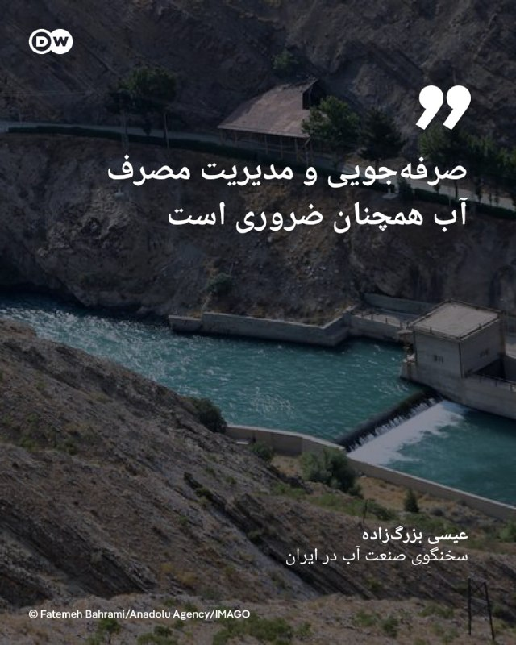

🔶 سخنگوی صنعت آب: صرفه‌جویی و مدیریت مصرف آب همچنان ضروری است

بر اساس گزارش رسانه‌های داخلی در ایران، عیسی بزرگ‌زاده، سخنگوی صنعت آب در ایران گفته است که برخلاف برخی روایت‌ها، کشور "مطلقا" وارد دوره ترسالی نشده و وضعیت کنونی بارش‌ها همچنان در محدوده عادی قرار دارد.

سخنگوی صنعت آب ایران افزود این میزان تنها حدود دو درصد بالاتر از متوسط بلندمدت کشور است.

او در عین حال گفت توزیع بارش در ایران بسیار نامتوازن است. به گفته او، در حالی که در استان‌هایی مانند بوشهر، هرمزگان، ایلام و کرمان بارش بیشتری ثبت شده، استان‌هایی مانند تهران، قم، یزد، مرکزی و اصفهان همچنان با کاهش بارندگی روبه‌رو هستند.

بزرگ‌زاده گفت در حال حاضر ۱۱ استان ایران هنوز شرایط بارشی کمتر از حد نرمال دارند و تهران در صدر این مناطق قرار دارد.

او همچنین از افزایش ۶۸ درصدی ورودی آب به مخازن سدها در مقایسه با مدت مشابه سال گذشته خبر داد و گفت میزان پرشدگی متوسط سدهای کشور اکنون حدود ۶۵ درصد است.
@dw_farsi

## DW_Farsi — post 124571

🔶 پزشک یا متهم امنیتی؛ مرز میان درمان و سرکوب کجاست

🔻گزارشی از آتفه چهارمحالیان

امنیت پزشکان و اعضای کادر درمان ایران در شرایط اعتراضات مردمی، در ماه‌های اخیر به یکی از موضوعات مهم مورد تاکید نهادهای حقوق بشری و جامعه پزشکی تبدیل شده است؛ موضوعی که هم‌زمان با گزارش‌هایی درباره فشار امنیتی بر مراکز درمانی و برخورد با پزشکان و پرستارانی مطرح می‌شود که به "مجروحان اعتراضات" خدمات درمانی ارائه داده‌اند.

در یکی از آخرین موارد، شش روز پس از بازداشت مجدد دکتر موهبت غفوری، متخصص کودکان و از بازداشت‌شدگان اعتراضات دی‌ماه ۱۴۰۴، همچنان اطلاعی از محل نگهداری و وضعیت سلامت او منتشر نشده است.

بر اساس اظهارات حقوقدانان، تداوم بی‌خبری درباره محل نگهداری و وضعیت افراد بازداشت‌شده، از مصادیق "ناپدیدسازی قهری" است.
@dw_farsi

## DW_Farsi — post 124570

  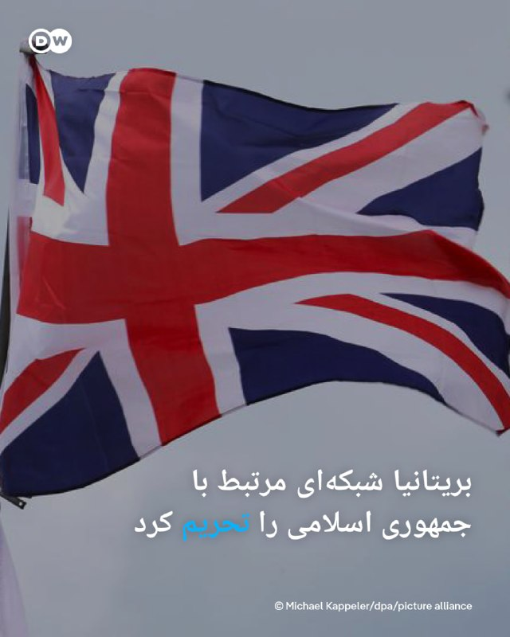

🔶 بریتانیا شبکه‌ای مرتبط با جمهوری اسلامی را تحریم کرد

بریتانیا روز دوشنبه ۱۱ مه (۲۱ اردیبهشت) ۱۲ فرد و نهاد مرتبط با جمهوری اسلامی را تحریم کرد و آنها را به مشارکت در فعالیت‌های خصمانه، از جمله طرح‌ریزی حملات و ارائه خدمات مالی به گروه‌هایی که در پی بی‌ثبات کردن بریتانیا و کشورهای دیگر هستند، متهم کرد.

افرادی که هدف این تحریم‌ها قرار گرفته‌اند، شامل اعضا و افراد نزدیک به آنچه دولت بریتانیا آن را "شبکه تبهکار زیندشتی" توصیف کرده، و همچنین چند صرافی و گرداننده خدمات مالی هستند.

دولت بریتانیا اعلام کرد این شبکه در فعالیت‌های خصمانه مورد حمایت جمهوری اسلامی نقش داشته است؛ فعالیت‌هایی که از جمله شامل تهدید، برنامه‌ریزی یا اجرای حملات علیه افراد و دارایی‌ها در بریتانیا و دیگر کشورها می‌شود.

جمهوری اسلامی بارها دخالت در حملات یا طرح‌های سوءقصد در بریتانیا و دیگر کشورها را رد کرده است.

بر اساس متن این اطلاعیه، برخی از افراد به دلیل مشارکت مستقیم در اقدامات خصمانه تحریم شده‌اند، در حالی که برخی دیگر به ارائه خدمات مالی یا حمایت‌های مادی دیگر برای تسهیل چنین فعالیت‌هایی متهم شده‌اند.
@dw_farsi

## DW_Farsi — post 124569

🎥 برگزاری نمایشگاه عکس "حکومت اعدام" در شهر کلن

نمایشگاه عکس "حکومت اعدام" روز یکشنبه ۱۰ مه در شهر کلن آلمان برگزار شد. هدف از برگزاری این نمایشگاه، بیدارسازی افکار عمومی اروپا نسبت به نقض گسترده حقوق بشر و موج اعدام‌ها در ایران بود.
@dw_farsi

## DW_Farsi — post 124568

  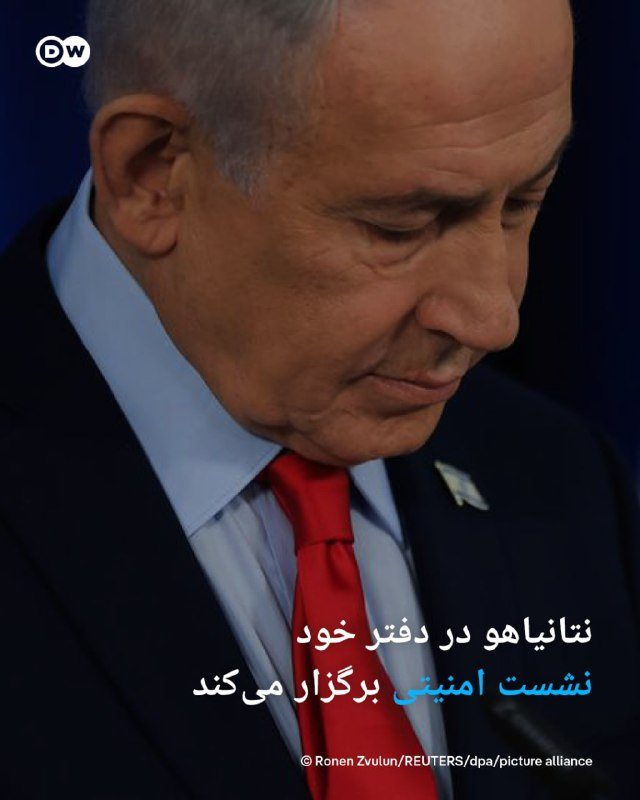

🔶 نتانیاهو در دفتر خود نشست امنیتی برگزار می‌کند

بر اساس گزارش تایمز اسرائیل، بنیامین نتانیاهو، نخست وزیر اسرائیل، هم‌اکنون در دفتر خود در اورشلیم (بیت‌المقدس) یک نشست امنیتی برگزار می‌کند.

این نشست پس از آن برگزار می‌شود که دونالد ترامپ، رئیس جمهور آمریکا، پاسخ جمهوری اسلامی به پیشنهاد آتش‌بس او را رد کرد.

این نشست همچنین پیش از گفت‌وگوهای مستقیم اسرائیل و لبنان انجام می‌شود که قرار است اواخر این هفته در واشنگتن برگزار شود.
@dw_farsi

## DW_Farsi — post 124566

🔶 ازسرگیری مذاکرات صلح اوکراین با سفر هیات آمریکایی به مسکو

کرملین اعلام کرده است که استیو ویتکاف، مذاکره‌کننده آمریکایی، و جرد کوشنر، داماد دونالد ترامپ، رئیس جمهور آمریکا، "به‌زودی" برای ادامه مذاکرات درباره پایان جنگ اوکراین وارد مسکو خواهند شد؛ نشانه‌ای تازه از تلاش‌های دولت ترامپ برای پیشبرد روندی که کاخ سفید آن را مقدمه‌ای برای پایان دادن به طولانی‌ترین و خونبارترین جنگ اروپا پس از جنگ جهانی دوم معرفی می‌کند.

یوری اوشاکوف، مشاور کرملین و نماینده روسیه در مذاکرات، روز دوشنبه ۱۱ مه (۲۱ اردیبهشت) در گفت‌وگو با تلویزیون دولتی روسیه، بدون اشاره به تاریخ دقیق سفر هیات آمریکایی، گفت آتش‌بس سه‌روزه اخیر میان روسیه و اوکراین نتیجه تماس‌های تلفنی "نه چندان آسان" میان مسکو و واشنگتن بوده است.
@dw_farsi

## DW_Farsi — post 124565

  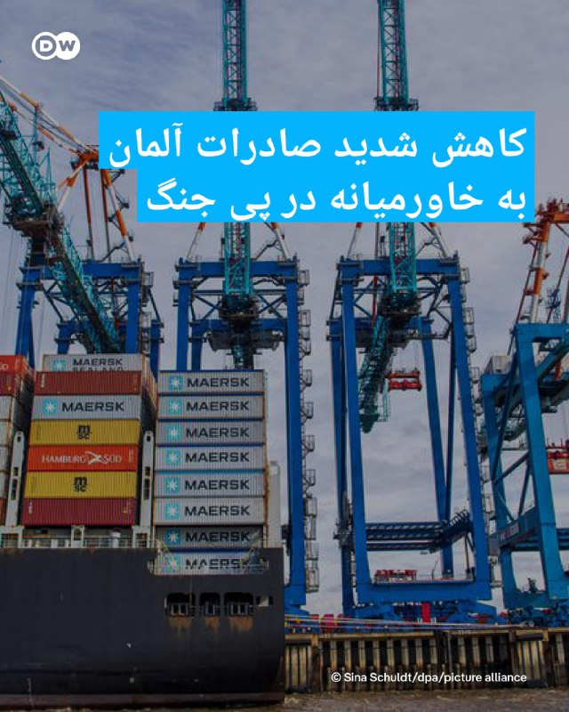

🔶 کاهش شدید صادرات آلمان به خاورمیانه در پی جنگ

بر اساس ارزیابی خبرگزاری رویترز بر پایه نخستین داده‌های اداره فدرال آمار آلمان، در پی جنگ در خاورمیانه، صادرات به ایران در ماه مارس در مقایسه با ماه مشابه سال گذشته، ۶۷ درصد کاهش یافت و به کمتر از ۲۵ میلیون یورو رسید.

صادرات به کشورهای همسایه ایران در منطقه خلیج فارس نیز به شدت کاهش یافت.

صادرات به قطر با افتی نزدیک به ۶۰ درصد به حدود ۵۴ میلیون یورو رسید و صادرات به عراق با ۵۵ درصد کاهش به ۵۸ میلیون یورو رسید.

صادرات به کویت نیز با ۵۸ درصد کاهش به حدود ۴۴ میلیون یورو سقوط کرد و صادرات به عربستان سعودی با بیش از ۱۳ درصد کاهش به ۶۴۳ میلیون یورو رسید.

حجم تجارت با امارات متحده عربی نیز بیش از ۳۸ درصد کاهش یافت و به ۵۸۲ میلیون یورو رسید.

در عین حال صادرات به عمان ۱۷ درصد کاهش یافت و به کمتر از ۴۵ میلیون یورو و حجم صادرات به بحرین نیز با ۶۴ درصد افت به ۱۴.۲ میلیون یورو رسید.

طبق آمار منتشر شده، صادرات آلمان به این هشت کشور یادشده در ماه مارس به کمتر از ۱.۵ میلیارد یورو رسیده است. این رقم ۷۵۷ میلیون یورو کمتر از مدت مشابه در سال گذشته بوده است.
@dw_farsi

## DW_Farsi — post 124564

🔶 استفاده روسیه از عوامل جرایم سازمان‌یافته برای خرابکاری

وزارت کشور آلمان در پاسخی که هنوز منتشر نشده و در پاسخ به یک پرسش پارلمانی حزب سبزها تهیه شده، نوشته است: «همکاری نهادهای روسی با عوامل جرایم سازمان‌یافته، به‌ویژه برای فعالیت‌های اخلال‌گرانه‌ای مانند عملیات خرابکارانه یا قتل، گزینه‌ای مناسب به شمار می‌رود». مجله اشپیگل نوشته است که به این پاسخ پیشاپیش دسترسی داشته است.

به گفته دولت آلمان، جرایم سازمان‌یافته روسی-اوراسیایی که باندهایی از کشورهای اتحاد جماهیر شوروی سابق را در بر می‌گیرد، به سختی می‌تواند از کنترل کرملین خارج شوند.
@dw_farsi

## DW_Farsi — post 124563

🎥 اولترا ماراتن ۶۰۰ کیلومتری ۹۶ ساعته بدون خواب

آردا ساعتچی، اینفلوئنسر و دونده اولترا ماراتن، حدود ۵۰۰ کیلومتر بی‌وقفه از دره مرگ در کالیفرنیای جنوبی تا اسکله سانتا مونیکا در لس‌آنجلس دوید و آن را به صورت زنده برای دو میلیون بیننده پخش کرد. او در نهایت نتوانست به زمان هدف خود یعنی ۹۶ ساعت برسد.
@dw_farsi

## DW_Farsi — post 124562

🔶 دیدار حساس ترامپ و شی در سایه جنگ ایران

چین امروز دوشنبه ۱۱ مه (۲۱ اردیبهشت) رسما تایید کرد که دونالد ترامپ، رئیس جمهور آمریکا، از ۱۳ تا ۱۵ مه به پکن سفر خواهد کرد؛ سفری که نخستین دیدار یک رئیس جمهور آمریکا از چین از سال ۲۰۱۷ بدین‌سو به شمار می‌رود و در فضایی آکنده از تنش‌های ژئوپولیتیک، جنگ ایران، اختلاف‌های تجاری و رقابت راهبردی دو قدرت بزرگ جهان انجام می‌شود.

سخنگوی وزارت خارجه چین اعلام کرد: «به دعوت رئیس جمهور شی جین‌پینگ، رئیس جمهور ایالات متحده آمریکا، دونالد جی. ترامپ، از ۱۳ تا ۱۵ مه سفری رسمی به چین خواهد داشت.»
@dw_farsi

## DW_Farsi — post 124561

  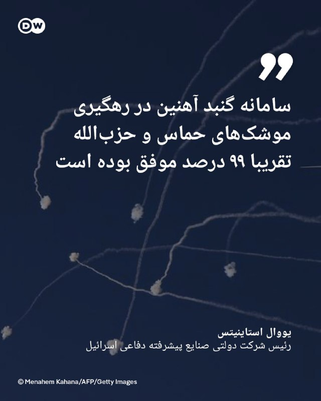

🔶 "سامانه گنبد آهنین در رهگیری موشک‌های حماس و حزب‌الله تقریبا ۹۹ درصد موفق بوده است"

یووال استاینیتس، رئیس شرکت رافائل که شرکت دولتی صنایع پیشرفته دفاعی اسرئیل است،  در کنفرانسی که از سوی "مرکز اورشلیم (بیت‌المقدس) برای امنیت و امور خارجی" برگزار شد، گفت از زمان حمله گروه تروریستی حماس به اسرائیل در اکتبر ۲۰۲۳، حماس در غزه و گروه تروریستی حزب‌الله در لبنان در مجموع حدود ۴۰ هزار موشک به سوی اسرائیل شلیک کرده‌اند.

او خبر داد: «گنبد آهنین بیشتر آن‌ها را با نرخ موفقیتی رهگیری کرد که ۱۰۰ درصد نبود، اما به ۱۰۰ درصد نزدیک بود. این رقم حدود ۹۸ درصد، حتی ۹۹ درصد است. بنابراین کامل نیست، اما تقریبا همین‌طور است.»

استاینیتس همچنین اشاره کرد که جمهوری اسلامی از سال ۲۰۲۴ در دو دور درگیری، حدود ۱۵۰۰ موشک بالستیک به سوی اسرائیل شلیک کرده و "فقط چند ده" موشک رهگیری نشده‌اند.
او همچنین تاکید کرد که کمبودی در موشک‌های رهگیر وجود نداشته است.
@dw_farsi

## DW_Farsi — post 124560

🔶 دیده‌بان حقوق بشر: جام جهانی ۲۰۲۶ فاجعه حقوق بشری خواهد بود

سازمان "دیده‌بان حقوق بشر" نسبت به "فاجعه احتمالی حقوق بشری" در جام جهانی فوتبال ۲۰۲۶ هشدار داد. این رقابت‌ها قرار است به طور مشترک در آمریکا، مکزیک و کانادا برگزار شود.

مینکی وردن، مدیر بخش ابتکارات جهانی دیده‌بان حقوق بشر در گفت‌وگو با شبکه آلمانی "ان‌تی‌وی" گفت که جام جهانی باید نشانه‌ای از فاصله گرفتن از گذشته و مبتنی بر اصول حقوق بشر باشد، اما "این مسابقات شاید همچنان بزرگ‌ترین باشد، اما از نظر حقوق بشر بهترین نخواهد بود".
@dw_farsi

## DW_Farsi — post 124559

  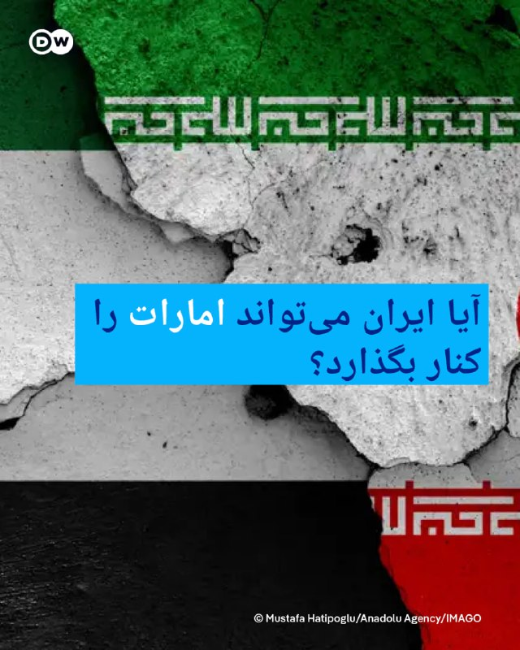

🔶 آیا ایران می‌تواند امارات را کنار بگذارد؟

جنگ اخیر فقط تنش سیاسی میان تهران و ابوظبی را تشدید نکرد، بلکه یکی از مهم‌ترین نقاط ضعف اقتصاد ایران، یعنی وابستگی عظیم این کشور به امارات در زمینه تجارت، تامین ارز و شبکه‌های دور زدن تحریم را آشکار کرد.

اگر جنگ آمریکا و اسرائیل علیه ایران پایان یابد اما تحریم‌ها باقی بماند، جمهوری اسلامی با یک معادله دشوار روبه‌رو خواهد شد.

اقتصاد ایران در سال‌های گذشته به شکلی فزاینده بر چند شریک محدود متمرکز شده و در این میان، امارات فقط یک شریک تجاری نبوده، بلکه به هاب واسطه‌ای واردات، بازار درهم و بخشی از سازوکار مالی اقتصاد تحریمی ایران بدل شده است.

همین وابستگی باعث شده هر بحرانی در رابطه تهران و ابوظبی، مستقیما بر تجارت خارجی، تامین ارز، فروش نفت و حتی ساختارهای رانتی و غیرشفاف درون اقتصاد ایران اثر بگذارد.
@dw_farsi

## DW_Farsi — post 124558

  

🔶 سفر وزیر امور خارجه ترکیه به قطر برای گفت‌وگو در باره جنگ ایران

به گزارش خبرگزاری رویترز به نقل از یک منبع دیپلماتیک در آنکارا، هاکان فیدان، وزیر خارجه ترکیه، قرار است روز سه‌شنبه، ۱۲ مه (۲۲ اردیبهشت) برای گفت‌وگو درباره جنگ ایران، پیامدهای آن برای منطقه خلیج فارس و وضعیت تنگه هرمز به قطر سفر کند.

طبق این گزارش، ترکیه که عضو ناتو و همسایه ایران است، از زمان آغاز درگیری‌ها در تماس نزدیک با آمریکا، ایران و همچنین پاکستان به‌عنوان میانجی بوده است.

هاکان فیدان که آخرین بار در ماه مارس به دوحه سفر کرده بود، در آخر هفته نیز دو تماس تلفنی جداگانه با عباس عراقچی، وزیر خارجه ایران، داشته است.

به گفته منبع مورد استناد رویترز، فیدان در سفر خود حمایت ترکیه از متحدش قطر را در برابر حملات ایران مورد تأکید قرار خواهد داد.

@dw_farsi

## DW_Farsi — post 124557

  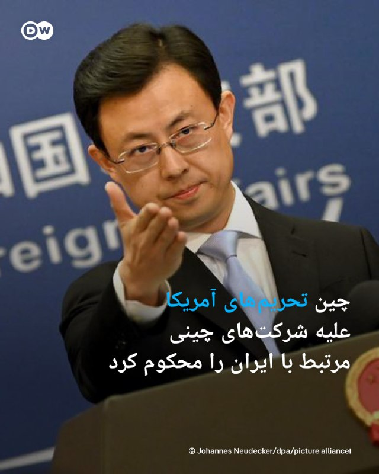

🔶 چین تحریم‌های آمریکا علیه شرکت‌های چینی مرتبط با ایران را محکوم کرد

چین به‌شدت با تحریم‌های آمریکا علیه سه شرکت مستقر در چین که به گفته واشنگتن در عملیات نظامی ایران نقش داشته‌اند، مخالفت کرده و این تحریم‌ها را "غیرقانونی" و "یک‌جانبه" خواند.

گوئو جیاکون، سخنگوی وزارت خارجه چین، روز دوشنبه ۱۱ مه (۲۱ اردیبهشت) در یک نشست خبری گفت: «ما همواره از شرکت‌های چینی خواسته‌ایم فعالیت‌های خود را مطابق قوانین و مقررات انجام دهند و قاطعانه از حقوق و منافع مشروع شرکت‌های چینی دفاع خواهیم کرد.»

او همچنین افزود: «فوری‌ترین اولویت این است که با هر وسیله‌ای از بازگشت درگیری‌ها جلوگیری شود، نه این‌که از جنگ به‌عنوان ابزاری برای بدنام کردن و تخریب دیگر کشورها استفاده شود.»

@dw_farsi

## DW_Farsi — post 124556

  

🔶 نخست‌وزیر لبنان: از صلح با اسرائیل تنها پس از تحقق خواسته‌هایمان حمایت می‌کنیم

نواف سلام، نخست‌وزیر لبنان، در گفت‌وگو با شبکه سعودی "العربیه" در پاسخ به این پرسش که آیا مذاکرات با اسرائیل برای آتش‌بس است یا توافق صلح، گفت: «ما از صلح حمایت می‌کنیم، اما این صلح شرایطی دارد. این موضوعی است که در مرحله‌ بعدی به آن خواهیم رسید.»

او تأکید کرد که لبنان در حال حاضر در گفت‌وگوهای مقدماتی با اسرائیل در واشنگتن حضور دارد تا زمینه برای مذاکرات جدی‌تر فراهم شود.

به گفته نواف سلام، خواسته‌های بیروت شامل این موارد می‌شود: برقراری آتش‌بس، خروج کامل اسرائیل از خاک لبنان و آزادی زندانیان لبنانی که در جریان درگیری‌ها بازداشت و در زندان‌های اسرائیل نگهداری می‌شوند.

او افزود: «پس از اجرای خواست‌های لبنان، ما آماده گفت‌وگو درباره شرایط صلح در چارچوبی گسترده‌تر و عربی هستیم، زیرا این موضوع بر کشورهای عربی نیز تأثیر می‌گذارد.»

@dw_farsi

## DW_Farsi — post 124555

  

🔶 بقایی: اولویت برای جمهوری اسلامی خاتمه جنگ در همه جبهه‌ها است

سخنگوی وزارت امور خارجه جمهوری اسلامی ایران تایید کرده است که در پاسخ این کشور به پیشنهادات دولت ترامپ برای حل مناقشه میان دو کشور، بستن پرونده اتمی موضوعیت نداشته است.

اسماعیل بقایی روز دوشنبه، ۲۱ اردیبهشت، در کنفرانس خبری هفتگی با خبرنگاران گفت: «ما قبلا هم گفته بودیم که در این مرحله تمرکز ما بر چیزی است که فوریت دارد و آن خاتمه جنگ در همه جبهه‌ها به شمول لبنان و تأمین ایمنی و امنیت دریانوردی در خلیج فارس و تنگه هرمز و همزمان توقف اقدامات خلاف قانون و راهزنی دریایی آمریکا علیه کشتی‌های تجاری است.»

بقایی این موضع را "بسیار مسئولانه و معقول" خواند که در وضعیت کنونی "اولویت‌ها را ببینیم و برای حل و فصل آن‌ها متمرکز شویم، تا اینکه درباره موضوعاتی صحبت کنیم که سابقا حداقل دو بار منجر به جنگ شده است".

ترامپ این پاسخ را "کاملا غیرقابل قبول" خوانده است.

سخنگوی وزارت خارجه در واکنش به ناخشنودی دونالد ترامپ از پاسخ تهران گفت: «برای ما رضایت دیگران مهم نیست.»

@dw_farsi

## Persian_Trend_Official — post 13934

  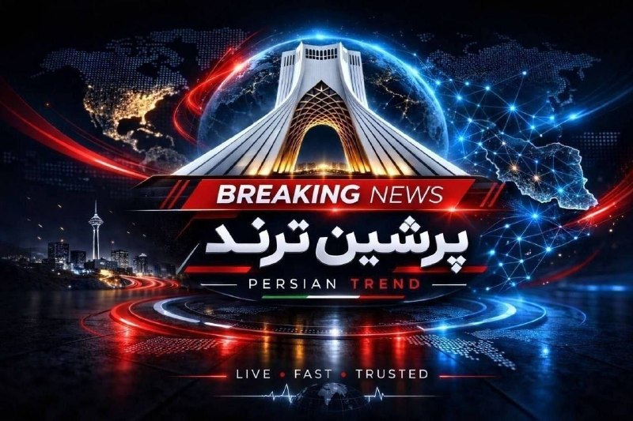

حزب‌الله مرکز فرماندهی اسرائیل در البیاضه را بمباران کرد....

🔹حزب‌الله لبنان اعلام کرد یک مرکز فرماندهی تازه‌تأسیس ارتش رژیم صهیونیستی را در شهرک البیاضه در جنوب لبنان هدف حمله راکتی قرار داده است.

☆Phantom☆

📌 @persian_trend_official
پرشین ترند | متفاوت‌ترین کانال نظامی

## Persian_Trend_Official — post 13933

  <a href="https://t.me/persian_trend_official/13933" target="_blank">📎 Download file</a>

فایل صوتی لایو اول
نسخه کم حجم - 5.99 مگابایت

اتاق جنگ دوشنبه 21 اردیبهشت | زمزمه های شروع جنگ ایران و آمریکا

📝 Nick

📌 @persian_trend_official
پرشین ترند | متفاوت‌ترین کانال نظامی

## Persian_Trend_Official — post 13932

  <a href="telegram/content/Persian_Trend_Official_13932_1778522960.webm" target="_blank">🎬 Download video</a>

🔴 تسنیم: ایران با خروج مواد غنی‌شده از کشور موافقت نکرده است

💢خبرگزاری تسنیم به‌نقل از یک منبع نزدیک به تیم مذاکره‌کننده اعلام کرد، برخلاف ادعای برخی رسانه‌های غربی، پاسخ ایران شامل پذیرش خروج مواد هسته‌ای غنی‌شده از کشور نیست.

💢این منبع افزود:

▪️ طرح پیشنهادی ایران دارای جدول زمانی مشخص برای آزادسازی دارایی‌های بلوکه‌شده تهران است

▪️ در حالی که پیشنهاد آمریکا به آزادسازی این دارایی‌ها اشاره کرده، ایران تأکید داشته این منابع باید در بازه زمانی مشخصی آزاد شوند

▪️ موضوع خروج ذخایر غنی‌شده از خاک ایران مورد پذیرش تهران قرار نگرفته است

💢این گزارش در شرایطی منتشر می‌شود که رایزنی‌ها درباره توافق احتمالی میان تهران و واشنگتن ادامه دارد.

🫆:Tony

📌 @persian_trend_official
پرشین ترند | متفاوت‌ترین کانال نظامی

## Persian_Trend_Official — post 13931

کانال رسمی پرشین ترند pinned «https://youtube.com/live/rsDox1i9jQs?feature=share»

## Persian_Trend_Official — post 13930

https://youtube.com/live/rsDox1i9jQs?feature=share

## Persian_Trend_Official — post 13929

  <a href="telegram/content/Persian_Trend_Official_13929_1778522961.mp4" target="_blank">🎬 Download video</a>

🔴ترامپ: آتش‌بس تو وضعیت حیاتیه

💢 این وضعیت به طرز باورنکردنی ضعیفه. بعد از خوندن اون مزخرفات "پیشنهاد ایران" حتی وقت نکردم کاملش رو بخونم

💢 این پیشنهاد خیلی ضعیفه و عملاً امید زیادی به ادامه آتش‌بس وجود نداره

🫆:Tony

📌 @persian_trend_official
پرشین ترند | متفاوت‌ترین کانال نظامی

## Persian_Trend_Official — post 13928

  <a href="telegram/content/Persian_Trend_Official_13928_1778522963.mp4" target="_blank">🎬 Download video</a>

🔴 ترامپ: ما ۴ روز برای سندی از ایران منتظر ماندیم که تنظیم آن بیش از ۱۰ دقیقه زمان نمی‌برد

🔹آن‌ها ۲ روز پیش با خارج‌کردن اورانیوم‌ها موافقت کردند اما بعداً نظرشان تغییر کرد، چون آن را در پیام ارسالی به ما نیاوردند.

🫆:Tony

📌 @persian_trend_official
پرشین ترند | متفاوت‌ترین کانال نظامی

## Persian_Trend_Official — post 13927

  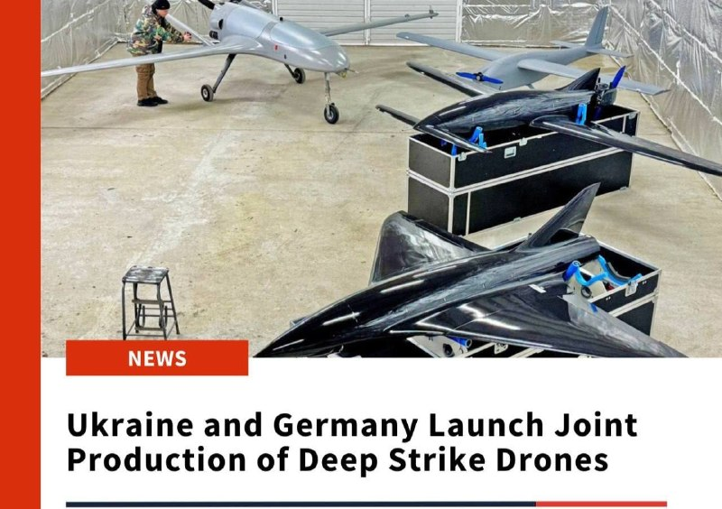

🔴 اوکراین و آلمان تولید مشترک پهپادهای دوربرد را آغاز می‌کنند

💢اوکراین و آلمان از آغاز همکاری مشترک برای تولید پهپادهای تهاجمی دوربرد خبر دادند.

بر اساس گزارش‌ها:

▪️ برد این پهپادها تا حدود ۱۵۰۰ کیلومتر خواهد بود

▪️ هدف از این همکاری، افزایش توان حملات عمقی و دوربرد عنوان شده است

▪️ این پروژه بخشی از گسترش همکاری‌های نظامی و صنعتی میان برلین و کی‌یف محسوب می‌شود

🫆:Tony

📌 @persian_trend_official
پرشین ترند | متفاوت‌ترین کانال نظامی

## Persian_Trend_Official — post 13926

🔴ترامپ: گروه بزرگی از ژنرال‌ها منتظرند تا در مورد ایران با من ملاقات کنند 🔹ما در حال حاضر نمی‌دانیم چگونه می‌توانیم ایران را برای ادامه حذف بقایای هسته‌ای متقاعد کنیم و این موضوع را به مذاکرات بیشتر موکول خواهیم کرد. ▪️اگر توافقی حاصل نشود، ما ایران را به…

## Persian_Trend_Official — post 13925

🔴ترامپ: گروه بزرگی از ژنرال‌ها منتظرند تا در مورد ایران با من ملاقات کنند

🔹ما در حال حاضر نمی‌دانیم چگونه می‌توانیم ایران را برای ادامه حذف بقایای هسته‌ای متقاعد کنیم و این موضوع را به مذاکرات بیشتر موکول خواهیم کرد.

▪️اگر توافقی حاصل نشود، ما ایران را به گونه‌ای هدف قرار خواهیم داد که قبلاً ندیده‌اند

🫆:Tony

📌 @persian_trend_official
پرشین ترند | متفاوت‌ترین کانال نظامی

## Persian_Trend_Official — post 13924

  

🔹اسرائیل به فارسی

💢جمهوری اسلامی ورشکسته شده و قادر به پرداخت حقوق به مزدوران داخلی خود نیست...

🫆:Tony

📌 @persian_trend_official
پرشین ترند | متفاوت‌ترین کانال نظامی

## Persian_Trend_Official — post 13923

  <a href="telegram/content/Persian_Trend_Official_13923_1778522966.webm" target="_blank">🎬 Download video</a>

🔴 ترامپ: ایران از آمریکا خواسته «گرد و غبار هسته‌ای» را جمع‌آوری کند

💢دونالد ترامپ مدعی شد مذاکره‌کنندگان ایرانی به او گفته‌اند آمریکا باید مواد رادیواکتیو باقی‌مانده در تأسیسات هسته‌ای تخریب‌شده ایران را خارج کند، زیرا تهران فناوری لازم برای استخراج و پاکسازی آن را در اختیار ندارد.

ترامپ در توصیف این مواد از عبارت «گرد و غبار هسته‌ای» استفاده کرده است.

📌 این ادعا تاکنون از سوی منابع رسمی ایران تأیید نشده است.

🫆:Tony

📌 @persian_trend_official
پرشین ترند | متفاوت‌ترین کانال نظامی

## Persian_Trend_Official — post 13922

🔴 ترامپ: احتمال ازسرگیری «پروژه آزادی» با ابعادی گسترده‌تر

💢دونالد ترامپ اعلام کرد در حال بررسی ازسرگیری «پروژه آزادی» است، اما این بار نه فقط برای اسکورت کشتی‌ها در تنگه هرمز، بلکه در قالبی گسترده‌تر.

💢او همچنین مدعی شد:
«رهبران تندروی ایران در نهایت تسلیم خواهند شد.»

«با ایران تعامل خواهیم کرد تا زمانی که به توافق برسیم.»

📌 این اظهارات در حالی مطرح می‌شود که فضای مذاکرات و تنش‌های منطقه‌ای همچنان ناپایدار و مبهم باقی مانده است.

🫆:Tony

📌 @persian_trend_official
پرشین ترند | متفاوت‌ترین کانال نظامی

## Persian_Trend_Official — post 13921

  

🔴 ارتقای یک تیپ نظامی در آمریکا

💢گزارش‌ها حاکی از آن است که تیپ رزمی سیار ۱۱۶ از گارد ملی ارتش ویرجینیا در آمریکا، به عنوان نخستین یگان، به پهپادها و سامانه‌های جنگ الکترونیک مجهز شده است.

📌 این اقدام در راستای مدرن‌سازی نیروهای زمینی و افزایش توان شناسایی، رصد و جنگ الکترونیک انجام شده است؛ روندی که ارتش آمریکا در سال‌های اخیر به‌طور گسترده دنبال می‌کند.

🫆:Tony

📌 @persian_trend_official
پرشین ترند | متفاوت‌ترین کانال نظامی

## Persian_Trend_Official — post 13920

لینک داخلی برای افراد داخل ایران: https://dl.persiantrend.com/Mostanad/RezaShah.mp4

## Persian_Trend_Official — post 13919

مستند رضاشاه، پدر ایران نوین 🔥

## Persian_Trend_Official — post 13918

  

⭕️فارس: نفتکش قطری در تنگه هرمز متوقف شد.

نفتکش قطری «محمزم» حامل محموله‌ گاز مایع، وارد منطقهٔ تحت کنترل ایران شد و پس از دور زدن متوقف شد.

سیگنال‌های این نفتکش که مقصد خود را پاکستان اعلام کرده است، نشان می‌دهد که اجازهٔ عبور از تنگه هرمز را از ایران دریافت نکرده است.

📝 Nick

📌 @persian_trend_official
پرشین ترند | متفاوت‌ترین کانال نظامی

## Persian_Trend_Official — post 13917

⭕️ خبرگزاری فرانسه به نقل از یک مقام سازمان ملل: ده‌ها میلیون نفر به دلیل کودهای شیمیایی که در تنگه هرمز گیر افتاده‌اند، در معرض گرسنگی قرار دارند.

پ.ن: نظرتون چیه یه تکونی به خودتون بدید؟

📝 Nick

📌 @persian_trend_official
پرشین ترند | متفاوت‌ترین کانال نظامی

## Persian_Trend_Official — post 13916

  <a href="telegram/content/Persian_Trend_Official_13916_1778522967.webm" target="_blank">🎬 Download video</a>

⭕️ اولین آلوده به ویروس هانتا در فرانسه ثبت شد.

📝 Nick

📌 @persian_trend_official
پرشین ترند | متفاوت‌ترین کانال نظامی

## Persian_Trend_Official — post 13915

  <a href="telegram/content/Persian_Trend_Official_13915_1778522968.webm" target="_blank">🎬 Download video</a>

🔥 یکی از نکات جالب فهرست ثروتمندترین افراد جهان این است که ایلان ماسک، نفر اول این فهرست، به‌تنهایی ثروتی بیش از مجموع دارایی نفرات دوم و سوم دارد. 🗿

📝 Nick

📌 @persian_trend_official
پرشین ترند | متفاوت‌ترین کانال نظامی

## RadioFarda — post 157065

  <a href="https://t.me/radiofarda/157065" target="_blank">📎 Download file</a>

📻بشنوید: ایستگاه ۱۹ با رادیوفردا، ۲۱ اردیبهشت ۱۴۰۵

@RadioFarda

## RadioFarda — post 157064

🔸رئیس جمهور آمریکا روز دوشنبه در سخنان خود درباره ایران و مخالفان حکومت در داخل کشور به گروه‌های کرد هم حمله کرد و به طور غیرمستقیم آنها را مسئول عدم کامیابی معترضان در ایران معرفی کرد. 🔸به گفته او، مردم ایران «می‌خواستند به خیابان‌ها بریزند، ولی اسلحه نداشتند،…

## RadioFarda — post 157063

  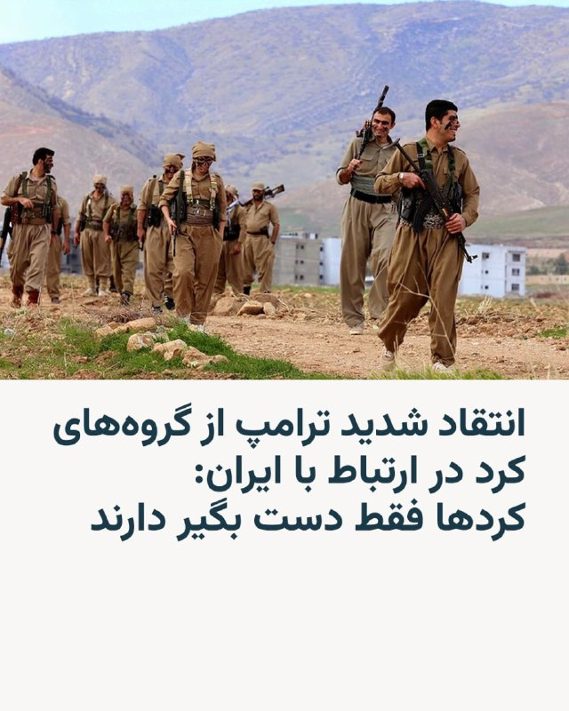

🔸رئیس جمهور آمریکا روز دوشنبه در سخنان خود درباره ایران و مخالفان حکومت در داخل کشور به گروه‌های کرد هم حمله کرد و به طور غیرمستقیم آنها را مسئول عدم کامیابی معترضان در ایران معرفی کرد.

🔸به گفته او، مردم ایران «می‌خواستند به خیابان‌ها بریزند، ولی اسلحه نداشتند، ما فکر می‌کردیم کردها به آنها اسلحه خواهند رساند، اما کردها ما را نومید کردند، کردها فقط دست بگیر دارند.»

🔸ترامپ گفت که آمریکا «مقداری اسلحه با مهمات» برای آنها فرستاده است تا به مردم برسانند، اما کردها از این کار سر باز زده و سلاح‌ها را «نگه داشتند».

🔸این نکته‌ای است که او پیشتر نیز در روز اول ماه مه در کاخ سفید در گفت‌وگوهایش با خبرنگاران به آن اشاره کرده بود، که «مقدار کمی» اسلحه فرستاده شده، اما کردها اسلحه‌ها را «تحویل ندادند».

@RadioFarda

## RadioFarda — post 157062

  <a href="telegram/content/RadioFarda_157062_1778522969.mp4" target="_blank">🎬 Download video</a>

🔸دونالد ترامپ، رئیس جمهور امریکا، روز دوشنبه در کاخ سفید پیشنهادات تازه حکومت ایران به عنوان مقدمه پایان جنگ را «احمقانه» خواند.

🔸او یک روز پیشتر گفته بود که طرح تازه ایران برایش «کاملا غیر قابل قبول» است. ترامپ روز دوشنبه در جایی از سخنانش حتی طرح تازه ایران را «آشغال» خواند و گفت که آن را کامل هم نخوانده است.

🔸ترامپ روز دوشنبه تأکید کرد که مقام‌های جمهوری اسلامی در نامه تازه خود اشاره نکرده‌اند که به دنبال تسلیحات هسته‌ای نخواهند رفت.

🔸او همچنین در پاسخ به منتقدانی که می‌گویند او سردرگم است و برنامه‌ای برای برخورد با ایران ندارد، تأکید کرد که برنامه‌ای مشخص دارد و آن این است که ایران نباید به سلاح هسته‌ای دست پیدا کند.

🔸ترامپ که در دفتر کار خود در کاخ سفید سخن می‌گفت از حکومت ایران انتقاد کرد که موافقت می‌کنند و بعد حرف‌شان را عوض می‌کنند. او در ادامه هشدار داد که آتش‌بس میان دو کشور ایران و‌ آمریکا به زور زنده نگه داشته شده است.

@Radiofarda

## RadioFarda — post 157061

🔸حسین افشین، معاون علمی و فناوری مسعود پزشکیان، روز دوشنبه در مصاحبه‌ای به طور تلویحی وجود دلایل امنیتی برای قطعی کامل اینترنت در ایران را رد کرد.

🔸او در این مصاحبه می‌گوید که «حتی در شرایط جنگی هم بستن اینترنت راهکار درستی نیست، چرا که دیدیم وقتی اینترنت کامل بسته بود هم ترورها ادامه داشت».

🔸مقام‌های جمهوری اسلامی در پی آغاز حملات مشترک آمریکا و اسرائیل به ایران دسترسی مردم به اینترنت در کشور را به طور کامل قطع کردند؛ محدودیتی که پس از بیش از دو ماه هم‌چنان ادامه دارد.

🔸نت‌بلاکس که میزان دسترسی به اینترنت در سراسر جهان را رصد می‌کند روز دوشنبه یادآوری کرد که ۷۳ روز از قطعی اینترنت در ایران می‌گذرد بدون آن که چشم‌اندازی از بازگشت آن برای مردم وجود داشته باشد.

@RadioFarda

## RadioFarda — post 157060

  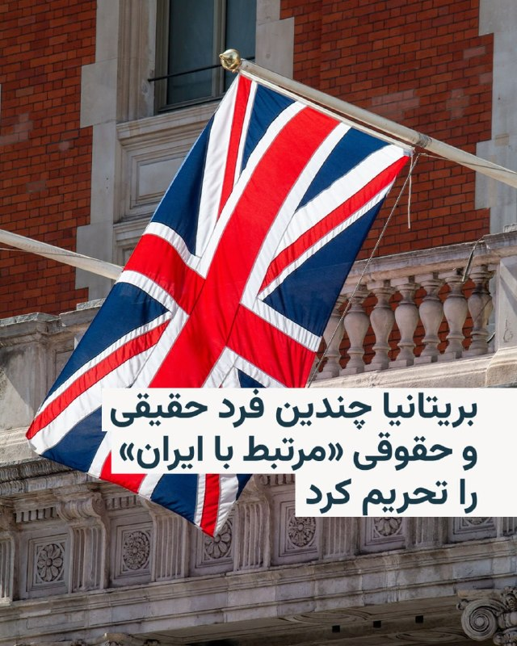

🔸دولت بریتانیا روز دوشنبه، ۲۱ اردیبهشت، ۱۲ فرد حقیقی و حقوقی مرتبط با حکومت ایران را تحریم کرد.

🔸به گزارش خبرگزاری رویترز، این افراد به «مشارکت در اعمال خصمانه» علیه بریتانیا و چند کشور دیگر متهم شده‌اند.

🔸در بیانیه رسمی دولت بریتانیا، از جمله این اعمال خصمانه به «طراحی حمله و ارائه خدمات مالی به گروه‌هایی که در پی بی‌ثبات کردن بریتانیا و دیگر کشورها هستند» اشاره شده است.

🔸این اقدام تحریمی تازه از طرف دولت بریتانیا شامل مسدود کردن اموال و حساب‌های این افراد و منع سفر آنها به این کشور است.

🔸در ماه‌های گذشته گمانه‌زنی‌هایی درباره احتمال پشتیبانی تهران از حمله‌های یهودستیزانه در بریتانیا مطرح شده است.

🔸همزمان یک گروه اسلام‌گرای مشکوک به ارتباط با ایران، موسوم به «حرکه اصحاب الیمین الاسلامیه»، به معنای «جنبش اسلامی یاران دست راست»، مسئولیت این حملات و حملاتی مشابه در چند کشور اروپایی را بر عهده گرفته است.

@RadioFarda

## RadioFarda — post 157059

  

🔸سخنگوی صنعت آب ایران می‌گوید ۳۵ میلیون نفر از جمعیت کشور با مشکل کم‌آبی مواجه‌ هستند.

🔸عیسی بزرگ‌زاده، روز دوشنبه ۲۱ اردیبهشت در یک نشست خبری با اشاره به وضعیت ذخایر آب در ایران،‌ گفت: در حال حاضر حدود ۳۵ میلیون نفر از جمعیت کشور با مشکل کم‌آبی مواجه هستند و به همین دلیل همچنان برای عبور از این شرایط، نیازمند صرفه‌جویی در مصرف آب هستیم.

🔸بزرگ‌زاده با اشاره به تفاوت‌های منطقه‌ای در بارش‌ها گفت: توزیع بارش در کشور بسیار نامتوازن است و با وجود آنکه در استان‌هایی مانند بوشهر، هرمزگان، ایلام و کرمان بارش‌های بسیار خوبی ثبت شده، اما در استان‌هایی مانند تهران، قم، یزد، مرکزی و اصفهان با بارش بسیار کم مواجه بوده‌ایم.

🔸او با بیان اینکه در حال حاضر ۱۱ استان کشور همچنان شرایط بارشی زیر نرمال دارند تاکید کرد که «به هیچ‌وجه نمی‌توان گفت کشور وارد دوره ترسالی شده است.»

🔸در دهه‌های اخیر خشکسالی مداوم، برداشت بی‌رویه از آب‌های زیرزمینی و سوء‌مدیریت سبب شده است که بسیاری از شهرهای بزرگ ایران با بحران کم آبی روبرو شوند.

@RadioFarda

## RadioFarda — post 157058

  <a href="https://t.me/radiofarda/157058" target="_blank">📎 Download file</a>

📻بشنوید: ساعت ۱۴ با رادیوفردا، ۲۱ اردیبهشت ۱۴۰۵‌

@Radiofarda

## IranianMinds — post 19971

🔴آکسیوس : ترامپ در حال بررسی دو گزینه‌ست

- یا از سرگیری «پروژه آزادی» که هفته گذشته به حالت تعلیق دراومد

- یا از سرگیری بمبارون و حمله به ۲۵٪ از اهدافی که آمریکا شناسایی کرده اما هنوز به اونا حمله نکرده - و امشب با ژنرال‌ها جلسه داره!

@IranianMinds

## IranianMinds — post 19970

  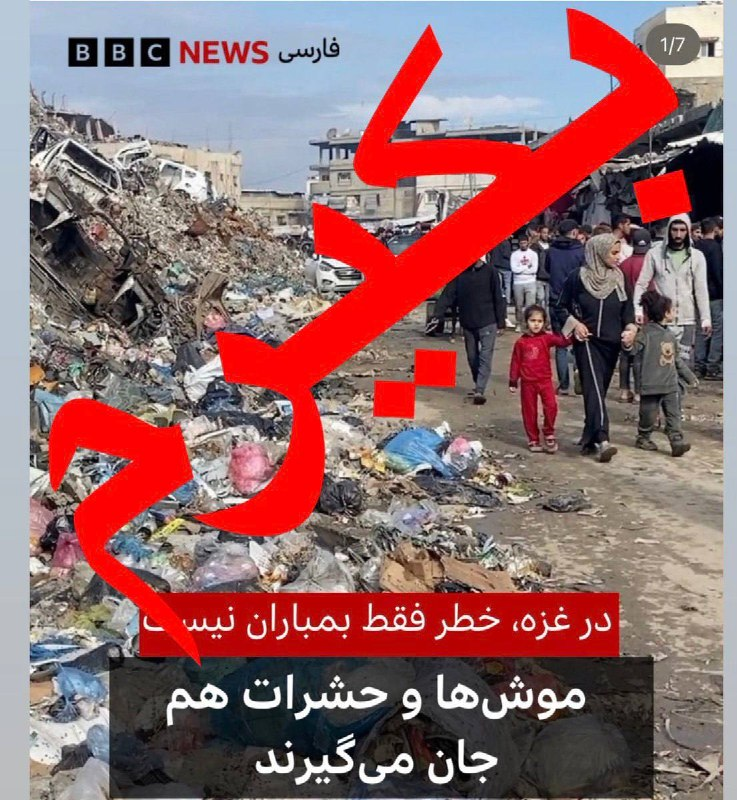

بی بی سی آخوندی حرومزاده رو ببینید

یه بار نشد بیاد از مردم ایران حمایت کنه و از جنایات جمهوری اسلامی بگه بعد برا غزه داره میمیره

@IranianMinds

## IranianMinds — post 19969

  

💙 خان وی‌پی‌ان

⚡️ سرعت بالا

🛡 پینگ و پایداری عالی

🔐 مناسب تلگرام، اینستا، یوتیوب، گیم و استریم

💸 قیمت اقتصادی با پلن‌های متنوع

🎁 تست ۵۰ مگ فقط ۷۵ تومن

🛎 کانال:

https://t.me/+qNjExGEJztE2OGI0

🤖 ربات خرید:
@Xan_vpn_bot

## IranianMinds — post 19967

  <a href="telegram/content/IranianMinds_19967_1778522974.mp4" target="_blank">🎬 Download video</a>

🔴 ترامپ درباره ایران:

رهبران ایران آدم‌های بسیار بی‌ناموس و غیرمورد اعتماد هستند.

@IranianMinds

## IranianMinds — post 19966

🔴 وای نت :

بنیامین نتانیاهو‌ به ترامپ پیشنهاد داده که برای فشار بیشتر بر روی جمهوری اسلامی برای قبول کردم پیشنهادات حملات خودشون به ایران رو از سر بگیرن

@IranianMinds

## IranianMinds — post 19965

🔴 ترامپ : پیشنهاد ایران واقعا زباله بود یکمشو‌ خوندم و دیگه حتی ادامه هم‌ ندادم. @IranianMinds

## IranianMinds — post 19964

🔴 ترامپ درباره هانتاویروس:

این یکی خیلی سخت‌تر منتقل می‌شود و مدت‌هاست وجود داشته است.

امیدوارم مشکلی پیش نیاید.

@IranianMinds

## IranianMinds — post 19963

🔴 ترامپ :

کردها سلاح هارو فقط گرفتن و گرفتن و گرفتن ولی به هیچ معترضی یا کسی تحویل ندادن !

@IranianMinds

## IranianMinds — post 19962

  <a href="telegram/content/IranianMinds_19962_1778522976.mp4" target="_blank">🎬 Download video</a>

🔴 ترامپ درباره ایران:

من با اونا سر و کار دارم. بهشون می‌میگم: شماها دیوانه‌اید. دیوانه‌اید. کاملا احمق هستید 😂

@IranianMinds

## IranianMinds — post 19961

🔴 ترامپ :

پیشنهاد ایران واقعا زباله بود یکمشو‌ خوندم و دیگه حتی ادامه هم‌ ندادم.

@IranianMinds

## IranianMinds — post 19960

  <a href="telegram/content/IranianMinds_19960_1778522978.mp4" target="_blank">🎬 Download video</a>

🔴 ترامپ درباره ایران:

در ایران هم آدم‌های میانه‌رو و دیوانه وجود دارند.

میانه‌روها بیشتر مورد احترام‌اند. دیوانه‌ها می‌خواهند تا آخر بجنگند.

ما هم در کشور خودمان دیوانه داریم.

@IranianMinds

## IranianMinds — post 19959

🔴 ترامپ : بعد این پیشنهاد مزخرفی که ایران دیروز برای ما فرستاد آتش بس به شدت شکننده است @IranianMinds

## IranianMinds — post 19958

🔴 ترامپ:

از کردها خیلی ناامیدم، کسانی که به آن‌ها سلاح دادیم تا آن را به داخل ایران تحویل دهند، اما آن را برای خودشان نگه داشتند.

@IranianMinds

## IranianMinds — post 19957

🔴 ترامپ :

بعد این پیشنهاد مزخرفی که ایران دیروز برای ما فرستاد آتش بس به شدت شکننده است

@IranianMinds

## IranianMinds — post 19956

🔴 ترامپ :

ایرانیا اول میان به ما میگن ما موافقیم و همه چیزو میدیم ولی بعد یهو تمام حرفاشونو عوض میکنن و کنار میکشن دوباره

@IranianMinds

## IranianMinds — post 19955

🔴 ترامپ:

ایران احتمالا در این زمان کوتاه خودشو کمی بازسازی کرده، ولی ما این را تقریبا در یک روز نابود خواهیم کرد، نمی‌توانیم اجازه دهیم ایران به سلاح هسته‌ای دست پیدا کند.

@IranianMinds

## IranianMinds — post 19954

🔴 ترامپ:

ایرانی‌ها یک پیشنهاد احمقانه داده‌اند که نمی‌توانیم آن را بپذیریم.

@IranianMinds

## IranianMinds — post 19953

🔴 ترامپ:

طرح من برای محاصره ایران یک طرح نظامی نابغه بود، درست مانند طرح ونزوئلا

@IranianMinds

## IranianMinds — post 19952

  <a href="telegram/content/IranianMinds_19952_1778522980.mp4" target="_blank">🎬 Download video</a>

🔴 ترامپ درباره ایران:

خیلی‌ها می‌گویند: آیا او برنامه‌ای دارد؟

البته که برنامه دارم. بهترین برنامه‌ای که تا به حال بوده را دارم!

@IranianMinds

## IranianMinds — post 19951

🔴 ترامپ به فاکس نیوز:

فعلا نمی‌دانیم چطور می‌توانیم وارد ایران شویم تا گرد هسته‌ای را جمع‌آوری کنیم و این موضوع را برای مذاکرات بیشتر باقی می‌گذاریم.

@IranianMinds

## BBCPersian — post 280785

دونالد ترامپ، رئیس‌جمهور آمریکا یک بار دیگر ذخایر اورانیوم غنی‌شده ایران را «غبار هسته‌ای» خواند و گفت که ایران به آمریکا گفته است که فقط چین و آمریکا توانایی بیرون آوردن آن از زیر آوار تاسیسات بمباران شده را دارند.

آقای ترامپ گفت که ایران دو روز پیش موافقت کرد با همکاری آمریکا ذخایر اورانیوم غنی‌‌شده را از زیر زمین بیرون بیاورد ولی بعد نظرش عوض شد.

او همچنین گفت که وضعیت آتش‌بس بسیار شکننده است.
@BBCPersian

## BBCPersian — post 280784

  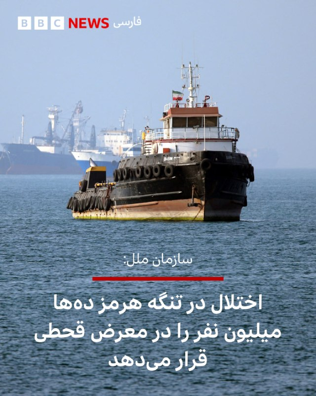

🔻رئیس یک گروه ویژه سازمان ملل که با هدف جلوگیری از بروز بحران انسانی قریب‌الوقوع تشکیل شده، هشدار داده است که اگر عبور کودهای شیمیایی از تنگه هرمز به‌زودی از سر گرفته نشود، ده‌ها میلیون نفر ممکن است با گرسنگی و قحطی روبه‌رو شوند.

خورخه موریرا دا سیلوا، مدیر اجرایی دفتر خدمات پروژه سازمان ملل متحد و رئیس این گروه ویژه، به خبرگزاری فرانسه گفت: «ما فقط چند هفته فرصت داریم تا از چیزی که به احتمال زیاد به یک بحران انسانی گسترده تبدیل خواهد شد، جلوگیری کنیم.»

او افزود: «ممکن است شاهد بحرانی باشیم که ۴۵ میلیون نفر دیگر را دچار گرسنگی و قحطی کند.»

📷 AFP via Getty Images
https://bbc.in/48Xu2Om
@BBCPersian

## BBCPersian — post 280783

  <a href="https://t.me/bbcpersian/280783" target="_blank">📎 Download file</a>

📡 پادکست برنامه جام جهان‌نما سه‌شنبه ۲۱ اردیبهشت ۱۴۰۵

در برنامه رادیویی جام‌جهان‌نمای امروز می‌شنوید؛

اتهام فریبکاری علیه جمهوری اسلامی از سوی آمریکا؛ ترامپ پاسخ ایران به توافق پیشنهادی آمریکا را ناپذیرفتنی خواند. همزمان وزارت خارجه ایران مطالبات این کشور را معقول خواند. آیا جنگ دوباره آغاز می‌شود؟

در ایران عرفان شکورزاده به اتهام جاسوسی برای اسرائیل و آمریکا اعدام شد. فعالان حقوق بشر می‌گویند این دانشجوی ۲۹ ساله رشته هوافضای دانشگاه علم‌وصنعت پس از ماه‌ها حبس در سلول انفرادی و اعترافات اجباری اعدام شد.

و در «گپ روز» امشب می‌شنوید:
دستیار سرمربی تیم ملی فوتبال ایران استعفا داد. براساس برخی گزارش‌ها آنتونیو گالیاردی به دلیل عدم دریافت حقوق از همکاری با تیم ملی ایران انصراف داد. تنها ۳۴ روز تا جام جهانی در تیم ملی چه می‌گذرد؟

این برنامه رادیویی را می‌توانید هر شب ساعت ۲۰ به وقت ایران، روی موج متوسط ۷۰۲ کیلوهرتز و موج کوتاه ۹۴۶۵ کیلوهرتز بشنوید.

تکرار برنامه را هم می‌توانید ساعت ۲۱:۳۰ روی موج متوسط ۷۰۲ کیلوهرتز و موج کوتاه ۵۳۹۵ کیلوهرتز گوش کنید.

@BBCSHOMA
@BBCPersian

## BBCPersian — post 280782

🔻بریتانیا تحریم‌های تازه‌ای برای ۱۲ ایرانی و نهادهای مرتبط با حکومت صادر کرد

بریتانیا تحریم‌های جدیدی برای افراد و نهادها مرتبط با حکومت ایران صادر کرد.

این افراد متهم هستند که از جانب حکومت ایران برای طراحی حملاتی در خاک بریتانیا فعالیت کرده‌اند.

وزارت خارجه بریتانیا در به‌روزرسانی فهرست رسمی تحریم‌ها، برای ۹ نفر به اتهام «فعالیت‌های خصمانه» در بریتانیا و دیگر کشورها، ممنوعیت سفر به بریتانیا و توقیف دارایی‌ها وضع کرد.

سه تحریم دیگر نیز برای نهادهایی از جمله «شبکه زیندشتی» اعمال شد که سال گذشته در لیست تحریم اتحادیه اروپا قرار گرفتند و گفته می‌شود با وزارت اطلاعات ایران ارتباط دارد.

به گفته اتحادیه اروپا «شبکه زیندشتی» برای حکومت ایران «اقدامات متعددی در سرکوب فرامرزی» از جمله ربایش و ترور منتقدان انجام داده است.

https://bbc.in/4nnv6AP
@BBCPersian

## BBCPersian — post 280781

🔻دبیر شورای‌ عالی انقلاب‌ فرهنگی ایران خواستار انتقال «مراکز نظامی و انتظامی» از مجاورت محل‌های مسکونی شد.

عبدالحسین خسروپناه در جلسه شورای اداری شهرستان تهران گفت: «مراکز نظامی و انتظامی که اهداف دشمن هستند باید با رعایت اصول پدافند غیرعامل از مجاورت مراکز آموزشی، مانند مدارس نخبگان و مناطق مسکونی، منتقل شوند.»

او توضیح نداد که منظورش دقیقا چه مراکزی است ودر کدام مناطق مسکونی هستند.

در جریان جنگ اخیر، گزارش‌های زیادی از آسیب به آپارتمان‌های مسکونی و بیمارستان‌ها و مراکز درمانی منتشر شد که در حملات به مراکز نظامی بر اثر موج انفجار آسیب دیدند یا تخریب شدند.

در همین حال رئیس شورای شهر تهران هم گفت که محل انبار نفت شهران باید تغییر کند، زیرا که در مجاورت منازل مسکونی قرار دارد که این از نظر ایمنی و زیست محیطی مناسب نیست.

مهدی چمران گفت که این شورا از دوره سوم پیگیر جابه‌جایی انبار نفت شهران بوده اما هنوز این اتفاق نیفتاده است.

به گفته رئیس شورای شهر تهران، موقعیت جغرافیایی این انبار نفت مناسب نیست و در طول جنگ پس از هدف قرار گرفتن و آتش‌سوزی، بنزین در خیابان‌ها جاری شد و باعث شد خودروهای اطراف دچار آتش‌سوزی شوند.

به‌دلیل دود غلیط آتش‌سوزی، مقامات بهداشتی ایران در آن زمان به شهروندان هشدار دادند که فقط در موارد ضروری از خانه خارج شوند.

https://bbc.in/4uBhww5
@BBCPersian

## BBCPersian — post 280780

  <a href="telegram/content/BBCPersian_280780_1778522982.mp4" target="_blank">🎬 Download video</a>

🔻‌مسابقه حمل تختخواب، یک سنت عجیب و سالانه است که به‌طور ویژه در یکی از حومه‌‌های شهر پیلیاندالا، در نزدیکی کلمبو در سریلانکا برگزار می‌شود. 

هر سال ده‌‌ها نفر از منطقه دلتارا در این رویداد شرکت می‌کنند و تخت‌های چوبی ۳۵ کیلویی را در مسیری ۸ کیلومتری حمل می‌کنند. این مسابقه بخشی از جشن‌‌های سال نو سینهالی و تامیلی است که مردم برای بازی‌ها و آیین‌های سنتی گرد هم می‌آیند.

برگزارکنندگان می‌گویند این مسابقه که از سال ۱۹۹۰ برگزار می‌شود به تاریخ نجاری در این روستا بازمی‌گردد. در گذشته، بسیاری از اهالی محلی تخت‌های دست‌ساز خود را به نقاط مختلف کشور حمل می‌کردند تا برای تامین مخارج زندگی بفروشند.

@‌‌BBCPersian

## BBCPersian — post 280779

  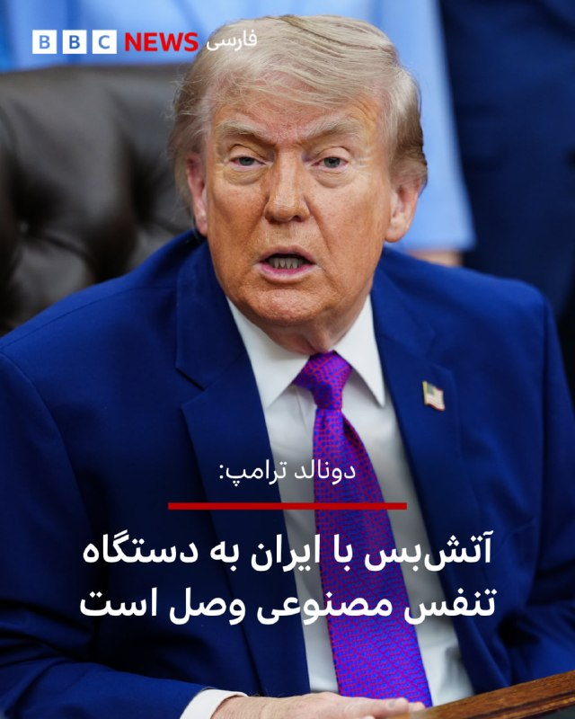

🔻دونالد ترامپ امروز یک بار دیگر از پاسخ ایران به پیشنهاد آمریکا انتقاد کرد.

رئیس‌جمهور آمریکا که دیروز پاسخ ایران را «کاملا غیرقابل قبول» خوانده بود امروز آن را «احمقانه» توصیف کرد و گفت در متن ایران اشاره‌ای به چشم‌پوشی از سلاح هسته‌ای نشده است.

آقای ترامپ یک بار دیگر ذخایر اورانیوم غنی‌شده ایران را «غبار هسته‌ای» خواند و گفت که ایران به آمریکا گفته است که فقط چین و آمریکا توانایی بیرون آوردن آن از زیر آوار تاسیسات بمباران شده را دارند.

آقای ترامپ گفت که ایران دو روز پیش موافقت کرد با همکاری آمریکا ذخایر اورانیوم غنی‌‌شده را از زیر زمین بیرون بیاورد ولی بعد نظرش عوض شد.

او همچنین گفت که وضعیت آتش‌بس بسیار شکننده است:

«آتش‌بس به‌طرز باورنکردنی ضعیف است... عملاً به دستگاه‌ تنفس مصنوعی وصل است؛ مثل وقتی که دکتر وارد اتاق می‌شود و می‌گوید عزیز شما تقریباً فقط یک درصد شانس زنده ماندن دارد.».

📷 Bloomberg via Getty Images
https://bbc.in/4wnNrC2
@BBCPersian

## BBCPersian — post 280778

🔻رئیس دانشگاه آزاد: ۲۰ هزار عضو هیئت علمی در انتظار دریافت اینترنت هستند

رئیس دانشگاه آزاد اسلامی می‌گوید حدود «۲۰ هزار» عضو هیئت علمی این دانشگاه در انتظار دسترسی به اینترنت هستند.

به گفته بیژن رنجبر، «۲۵۰ واحد دانشگاهی» مجوزهای مربوط به آی‌پی‌ها را گرفته‌اند و زیرساخت‌های لازم برای اتصال به اینترنت برای استادان و دانشجویان فراهم شده است:

«استادان و دانشجویان می‌توانند با حضور در واحدهای دانشگاهی از طریق همان واحد به اینترنت متصل شوند.»

از زمان آغاز جنگ، اینترنت بین‌المللی در ایران قطع و دسترسی بسیار محدود بوده است و بسیاری از کاربران و دانشجویان و کسب‌وکارها از این وضعیت انتقاد کرده‌اند.

از این رو، طرح «اینترنت پرو» راه‌اندازی شده است تا کسب‌وکارها یا دانشگاهیان با پرداخت مبلغی بیشتر با دسترسی محدود به اینترنت بین‌المللی وصل شوند.

این موضوع واکنش‌‌های فراوانی داشته است و منتقدان آن را قدمی دیگر در طبقاتی کردن اینترنت و تبعیض ارتباطی دانسته‌اند.
https://bbc.in/4uLtMdQ
@BBCPersian

## BBCPersian — post 280771

🖋جیوان نروان
بی‌بی‌سی، لندن

کسب‌وکارهای فعال در لندن می‌گویند قیمت زعفران به دلیل جنگ ایران به شدت افزایش یافته است. زعفران یکی از گران‌ترین ادویه‌های جهان است و حدود ۹۰ درصد از ذخیره جهانی آن در ایران تولید می‌شود.

در پی بسته شدن تنگه هرمز، عرضه زعفران کاهش یافته و این محدودیت شامل برخی اقلام اساسی دیگر مانند نخود و زرشک نیز شده است؛ موادی که در بسیاری از غذاهای ایرانی و خاورمیانه‌ای کاربرد گسترده‌ای دارند.

دیلمان محمود، صاحب رستوران ایرانی صدف در غرب لندن، به بی‌بی‌سی عربی گفت با وجود فشارهای اقتصادی تلاش کرده قیمت‌ها را برای مشتریان ثابت نگه دارد. در همین حال، معین طیاری، تامین‌کننده زعفران، می‌گوید برای خرید عمده این ادویه با مشکل روبه‌رو شده است.

آقای محمود گفت: «هر غذایی که در آشپزخانه همراه برنج سرو می‌شود، روی آن یک لایه زعفران دارد.»

آلبوم را ورق بزنید و ادامه مطلب را از لینک زیر در وبسایت بی‌بی‌سی فارسی بخوانید.

📸GettyImages/ Reuters/ Anadolu via Getty Images/ Bloomberg via Getty Images/ NurPhoto via Getty Images
https://bbc.in/4eFVzYg
@BBCPersian

## BBCPersian — post 280770

  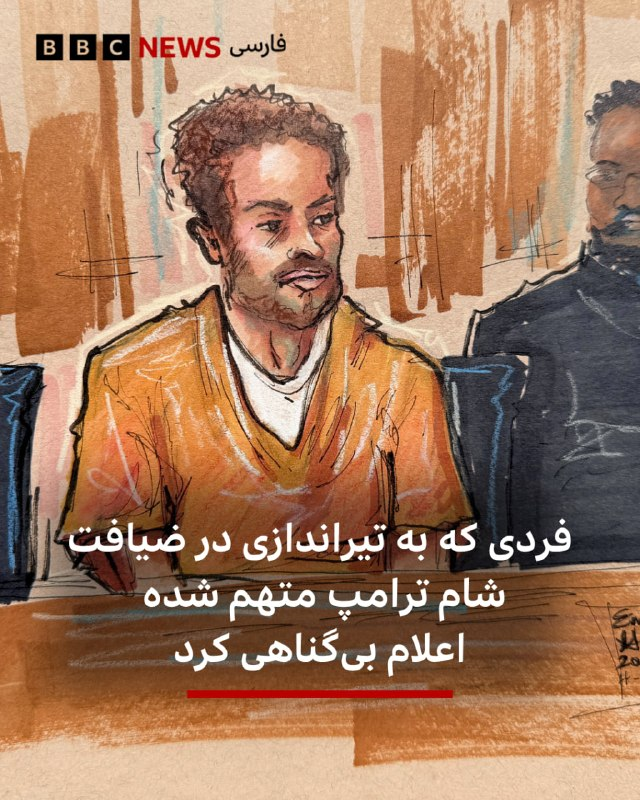

🔻مردی که به تیراندازی در هتل محل ضیافت خبرنگاران کاخ سفید در واشنگتن متهم شده است، اتهامات را رد کرد و در دادگاه اعلام بی‌گناهی کرد. این اتفاق دو هفته پیش رخ داد و ماموران سرویس مخفی آمریکا به‌سرعت دونالد ترامپ و همسرش و مقا‌های ارشد دولت را به محل امن بردند.

کول توماس آلن، ۳۱ ساله، به جرایم فدرال مرتبط با سلاح گرم و تلاش برای ترور دونالد ترامپ، رئیس‌جمهوری آمریکا، متهم شده است.

به گزارش شبکه سی‌بی‌اس، شریک خبری بی‌بی‌سی در آمریکا، آقای آلن روز دوشنبه با لباس نارنجی زندان و در حالی که دست‌ها و پاهایش زنجیر شده بود، در دادگاه حاضر شد.

کول توماس آلن در رشته مهندسی مکانیک در مؤسسه فناوری کالیفرنیا، یک دانشگاه بسیار معتبر، تحصیل کرده است.

دادستان‌ها می‌گویند او تلاش کرد از یک ایست بازرسی عبور کند و در مراسم در هتل هیلتون واشنگتن به یک مأمور سرویس مخفی آمریکا شلیک کرده است. جلیقه ضدگلوله‌اش جان این مامور را نجات داد.

ادامه خبر را از لینک زیر در وبسایت بی‌بی‌سی فارسی بخوانید.
📷 Reuters
https://bbc.in/4djpGT5
@BBCPersian

## BBCPersian — post 280769

🔻کی‌یر استارمر، نخست‌وزیر بریتانیا، گفت که اشتباهات را می‌پذیرد و آماده است که ثابت کند کسانی که در رهبری او تردید دارند اشتباه می‌کنند. درحالی‌که فشارهای برای استعفای نخست‌وزیر به اوج رسیده است او گفت که برای چالش‌های بی‌سابقه‌ای که بریتانیا با آنها مواجه…

## BBCPersian — post 280768

  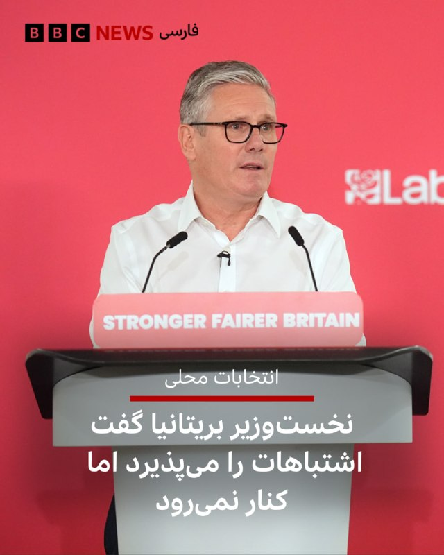

🔻کی‌یر استارمر، نخست‌وزیر بریتانیا، گفت که اشتباهات را می‌پذیرد و آماده است که ثابت کند کسانی که در رهبری او تردید دارند اشتباه می‌کنند. درحالی‌که فشارهای برای استعفای نخست‌وزیر به اوج رسیده است او گفت که برای چالش‌های بی‌سابقه‌ای که بریتانیا با آنها مواجه است او بهترین گزینه است.

او گفت: «البته، مانند هر دولتی ما هم اشتباهاتی داشته‌ایم. اما تصمیم‌های بزرگ سیاسی را درست گرفتیم. منظورم این است که اگر به توصیه سایر احزاب گوش داده بودیم، الان گرفتار بن‌بست ایران بودیم.»

گمانه‌زنی‌ها درباره آینده سیاسی نخست‌وزیر بریتانیا از زمان انتخابات محلی پنجشنبه (۷ مه) شدت گرفته است؛ انتخاباتی که حزب کارگر، به رهبری کی‌یر استارمر، نزدیک به ۱۵۰۰ کرسی شوراهای محلی در انگلستان را از دست داد، در اسکاتلند هم عقب‌تر نشست، در ولز نیز پس از ۲۷ سال در صدر، به رتبه سوم سقوط کرد.

این شکست سنگین انتخاباتی باعث شد تعدادی از نمایندگان حزب کارگر خواستار کناره‌گیری یا تعیین زمانی برای آن شوند.

ادامه خبر را از لینک بایو در وبسایت بی‌بی‌سی فارسی بخوانید.

📷 Reuters
https://bbc.in/4nnIkOe
@BBCPersian

## BBCPersian — post 280767

🔻در حالی که قطعی اینترنت و خاموشی دیجیتال در ایران بنا بر گزارش نت‌بلاکس وارد هفتاد و سومین روز خود شده، حسین افشین، معاون علمی رئيس‌جمهور می‌گوید نظر دولت «بازگشت اینترنت به وضعیت عادی» است.

به گفته آقای افشین، قطعی اینترنت همچنین موجب ضربه به حوزه علمی کشور می‌شود و موجب کاهش رتبه علمی ایران خواهد شد.

او در مورد قطع اینترنت در شرایط جنگی هم می‌گوید: «نظر من این است که در شرایط جنگی هم بستن اینترنت نمی‌تواند راهکار باشد همچنان که ادامه ترورها در دوران قطعی کامل اینترنت نشان داد.»

کارشناسان اقتصادی هم نسبت به خسارت مستقیم و غیرمستقیم قطع اینترنت بر کسب و کارها هشدار داده‌اند.

مقام‌های جمهوری اسلامی ایران از ۹ اسفند (۲۸ فوریه) و همزمان با حملات اسرائیل و آمریکا، دسترسی به اینترنت بین‌الملل را قطع کردند. تماس‌ تلفنی با خارج از ایران هم با اختلال جدی رو‌به‌رو است.

وزارت ارتباطات ایران پیش از این اعلام کرده که عادی‌سازی وضعیت اینترنت در صلاحیت نهادهای امنیتی است.

https://bbc.in/4dBL8nu
@BBCPersian

## BBCPersian — post 280766

🔻رئيس اقامتگاه‌های بومگردی: قطع اینترنت به‌شدت بر خدمات گردشگری تاثیر گذاشته است

رئیس جامعه اقامتگاه‌های بومگردی ایران گفت که «چهار هزار اقامتگاه بومگردی» در روستاها، مناطق مرزی و دورافتاده ایران با خطر تعطیلی کامل روبرو هستند.

یاور عبیری با اشاره به حذف سفر از سبد خانوار گفت که صنعت گردشگری در آستانه نابودی است.

او گفت این اقامتگاه‌های بومگردی در دوران جنگ رایگان در اختیار مردم قرار گرفت اما در حال حاضر دولت،‌ بانک‌ها ونهادهای مسئول حمایتی نمی‌کنند.

به گفته آقای عبیری محدودیت و قطع اینترنت به‌شدت خدمات گردشگری در اقامتگاه‌های بومگردی را تحت تاثیر قرار داده است.

https://bbc.in/48PrMbR
@BBCPersian

## idfinfarsi — post 11564

  <a href="telegram/content/idfinfarsi_11564_1778522986.mp4" target="_blank">🎬 Download video</a>

مستندسازی: نیروهای لشکر ۹۱ یک گروه شلیک را که پس از اجرای حمله موشکی به سوی نیروهای ما در حال انتقال یک پرتابگر موشکی بر روی کامیون بود، به هلاکت رساندند

تیپ آتش لشکر ۹۱ یک گروه شلیک را شناسایی کرد که پس از شلیک راکت به سوی نیروهای ارتش اسرائیل در جنوب لبنان، در حال انتقال یک پرتابگر موشکی بر روی یک کامیون بود.

پس از شناسایی، نیروی هوایی با هدایت نیروهای زمینی، تروریست ها را هدف قرار داده و پرتابگر موشکی را منهدم کرد. این حادثه بدون تلفات برای نیروهای ما به پایان رسید.

ارتش اسرائیل به اقدام برای رفع تهدیدها علیه نیروهای خود و شهروندان این کشور ادامه خواهد داد.

## idfinfarsi — post 11563

  <a href="telegram/content/idfinfarsi_11563_1778522988.mp4" target="_blank">🎬 Download video</a>

نیروهای لشکر ۱۴۶ یک انبار تسلیحاتی را هدف قرار داده و نیروهای حزب‌الله را که تهدیدی برای نیروهای ما بودند، به‌ هلاکت ‌رساندند

ارتش اسرائیل به اقدام برای رفع تهدیدها علیه شهروندان این کشور و نیروهای ارتش در جنوب لبنان ادامه می‌دهد.

نیروهای لشکر ۱۴۶ دیروز (یکشنبه) دو تروریست وابسته به سازمان تروریستی حزب‌الله را که وارد ساختمانی در نزدیکی نیروهای ما در جنوب لبنان شده بودند، شناسایی کردند. از داخل این ساختمان، این تروریست ها برای پیشبرد طرحی تروریستی علیه نیروهای ارتش اسرائیل که در منطقه فعالیت می‌کنند، اقدام می‌کردند.

بلافاصله پس از شناسایی، نیروی هوایی با هدایت نیروهای لشکر، این تروریست ها را که در ساختمان فعالیت داشتند، هدف قرار داده و به هلاکت رساند.

همچنین زیرساخت‌ها و یک انبار تسلیحاتی که مورد استفاده سازمان تروریستی حزب‌الله بود، هدف قرار گرفت و تروریست های دیگری که تهدیدی برای نیروهای ما بودند نیز به هلاکت رسیدند.

علاوه بر این، در ساعات اخیر سازمان تروریستی حزب‌الله چندین راکت و پهپاد انفجاری به سوی نیروهای ارتش اسرائیل در جنوب لبنان شلیک کرد.
در جریان این رویدادها، دو پهپاد انفجاری به تجهیزات مهندسی بدون سرنشین اصابت کردند. هیچ‌گونه تلفات جانی برای نیروهای ما گزارش نشده است، اما به تجهیزات خسارت وارد شده است.

ارتش اسرائیل به اقدام برای رفع تهدیدها علیه نیروهای خود و شهروندان این کشور ادامه خواهد داد.

## Dirty_Kids — post 389275

  <a href="telegram/content/Dirty_Kids_389275_1778522990.mp4" target="_blank">🎬 Download video</a>

“من همون حسی رو دارم که ۵۰ سال پیش داشتم. شاید به خاطر غذاییه که میخورم! شاید فست‌فود برا آدم خوبه و غذاهای دیگه بده! آدم‌هایی رو می‌شناسم که خیلی مراقب غذا و وزنشون بودن، میرفتن رستوران کرفس میخوردن و آخرش تو سن جوونی مردن!!”

@Dirty_Kids 👻

## Dirty_Kids — post 389274

  <a href="telegram/content/Dirty_Kids_389274_1778522991.mp4" target="_blank">🎬 Download video</a>

در مورد کردها:
“کردها فقط دست بگیر دارن!! تو کنگره اعتبار خیلی خوبی دارن. کنگره میگه کردها سخت می‌جنگن. نه…فقط وقتی بهشون پول بدن، سخت می‌جنگن.
من واقعا از کُردها ناامید شدم!!”

@Dirty_Kids 👻

## Dirty_Kids — post 389273

  <a href="telegram/content/Dirty_Kids_389273_1778522992.mp4" target="_blank">🎬 Download video</a>

“اون اشغالی که ایران برا ما فرستاد رو حتی کامل نخوندم! گفتم وقتمو تلف نکنم!! آتش بس الان رو لایف ساپورته! لایف ساپورت چیز خوبی نیس، مگه نه، دکتر آز؟ مث وقتیه که دکتر میاد تو اتاق میگه عزیز شما فقط ۱ درصد شانس زنده موندن داره!”

@Dirty_Kids 👻

## Dirty_Kids — post 389272

فکر میکردم تو این سن قراره شکفته بشم،
شکافته شدم

@Dirty_Kids 👻

## Dirty_Kids — post 389271

پسرا بعد از اینکه مختو میزنن رابطه رو می سپرن به دست حضرت ابولفضل که اونم دست نداره.

@Dirty_Kids 👻

## Dirty_Kids — post 389270

  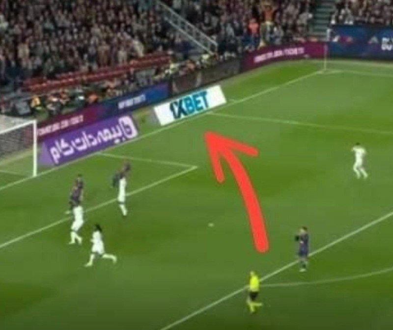

صدا سیما اومده الکلاسیکو که کلا تبلیغی نداشته تبلیغاشو گذاشته
حالا چی تبلیغ کرده؟سایت بت
انقد بی پول شدید؟

@Dirty_Kids 👻

## Dirty_Kids — post 389269

بچه ها اسم این بازی عبور مرغ از خیابون  هست ویدئو نگاه کنید خیلی راحت 8 میلیون ازش سود گرفتیم😍 
😤اگ توم دوس داری خیلی راحت از بازی های انلاین پول در بیاری حتما عضو کازینو شبانه شو
✅ توی کازینو شبانه بهت اموزش میدیم از بازی های انلاین پول دربیاری👌 کانال کازینو…

## Dirty_Kids — post 389268

  <a href="telegram/content/Dirty_Kids_389268_1778522993.mp4" target="_blank">🎬 Download video</a>

بچه ها اسم این بازی عبور مرغ از خیابون  هست ویدئو نگاه کنید خیلی راحت 8 میلیون ازش سود گرفتیم😍

😤اگ توم دوس داری خیلی راحت از بازی های انلاین پول در بیاری حتما عضو کازینو شبانه شو
✅

توی کازینو شبانه بهت اموزش میدیم از بازی های انلاین پول دربیاری👌

کانال کازینو شبانه راهی برای چند برابر کردن سرمایت 🤷‍♂

کسب درامد انلاین با یه ادم حرفه ای یاد بگیر و‌ پول دربیار 
💵
G21
🎯همین حالا عضو شو و شروع کن👇N
https://t.me/+6ckCmywafrxiYzk0
https://t.me/+6ckCmywafrxiYzk0

## Dirty_Kids — post 389267

  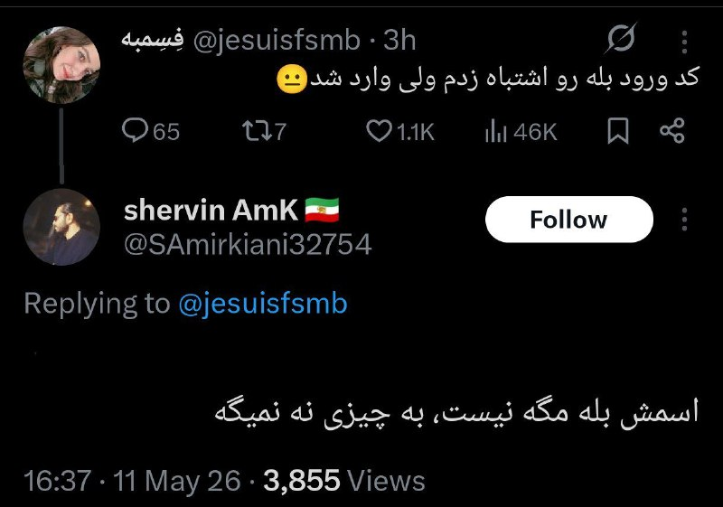

پیام‌رسان داخلی عالیه، حتما نصب کنین

@Dirty_Kids 👻

## Dirty_Kids — post 389266

نتانیاهو: "در ایران، خیابان‌ها را به نام من نامگذاری می‌کنند. می‌دانید؟ خب، البته بعد از رئیس‌جمهور ترامپ هم، چون او رهبری مبارزه را بر عهده دارد. اما آن‌ها این را دارند؛ من فارسی صحبت نمی‌کنم، اما مرا «بی بی جون» صدا می‌کنند: بی بی عزیز." @Dirty_Kids 👻

## Dirty_Kids — post 389265

  <a href="telegram/content/Dirty_Kids_389265_1778522995.mp4" target="_blank">🎬 Download video</a>

این ویدئوی لگویی واقعاً عالی درست شده
قشنگ میرینه به پروپاگاندای جمهوری اسلامی

@Dirty_Kids 👻

## Dirty_Kids — post 389264

روزنامه اطلاعات:

دولت به خاطر تحریم ها و محاصره دریایی به محدودیت خورده و از مردم میخوایم که در مصرف اب و برق و سوخت و غذا و نان و برنج و هرچیزی که فکرمیکنید صرفه جویی کنید.

@Dirty_Kids 👻

## Dirty_Kids — post 389263

  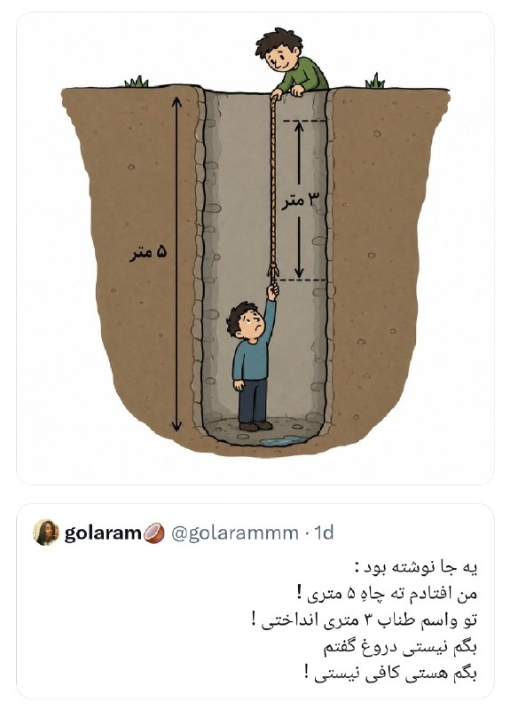

انقد کسشرای ناشتا نگید، میان با رسم شکل میرینن بهتون خب

@Dirty_Kids 👻

## Dirty_Kids — post 389262

یذره کراتینم ریخت رو کابینت کابینتو لیس زدم، اقتصاد مقاومتی

@Dirty_Kids 👻

## Dirty_Kids — post 389261

  

جفت کنین؛ عکسی از متن تورات، کتاب اشعیا، باب ۱۴، آیه ۱۸ تا ۲۱

دقیقا داره زندگی خامنه ای رو شرح میده :|

@Dirty_Kids 👻

## Dirty_Kids — post 389260

  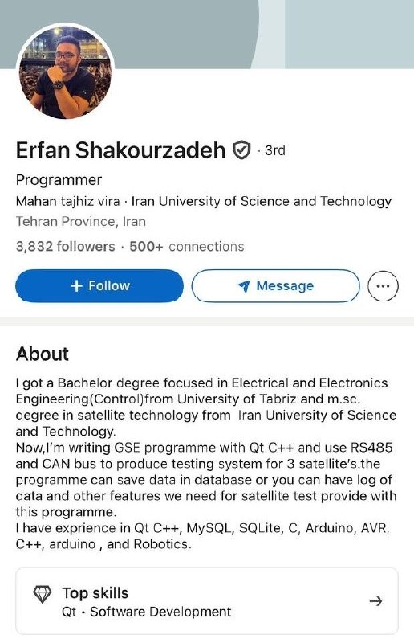

خبرگزاری «میزان» وابسته به قوه قضاییه جمهوری اسلامی از اعدام «عرفان شکورزاده» با اتهام «همکاری با سازمان اطلاعات مرکزی آمریکا (سیا) و موساد» خبر داد. عرفان شکورزاده متولد ۱۳۷۶ و دانش‌آموخته مهندسی برق دانشگاه تبریز بود که در مقطع کارشناسی ارشد در دانشگاه…

## Dirty_Kids — post 389259

‏قبل از شروع جنگ و قطعی اینترنت درخواست فیبرنوری دادم و حالا اومدن نصب و فعالش کردن؛ با تشکر از شاتل بابت سرویس خوبشون؛
درواقع قبل از نصب اینترنت نداشتم
ولی الان با سرعت خیلی بیشتری اینترنت ندارم.

@Dirty_Kids 👻

## Hranews — post 112887

  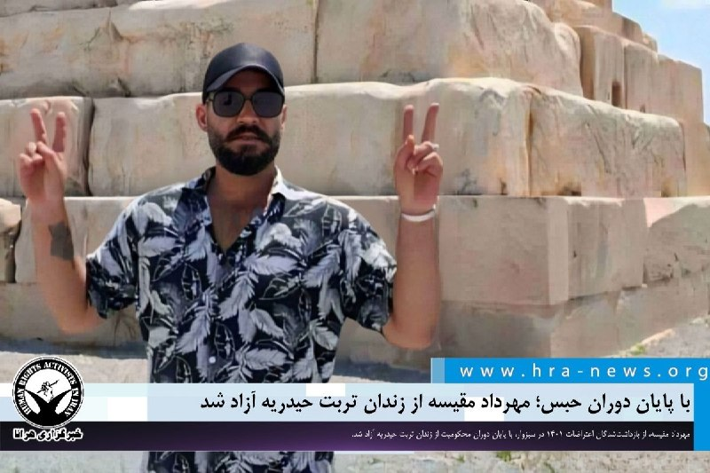

با پایان دوران حبس؛ مهرداد مقیسه از زندان تربت حیدریه آزاد شد

❗️
❗️
❗️
❗️
❗️– مهرداد مقیسه، از بازداشت‌شدگان اعتراضات ۱۴۰۱ در سبزوار، با پایان دوران محکومیت از زندان تربت حیدریه آزاد شد.

به گزارش خبرگزاری هرانا، ارگان خبری مجموعه فعالان حقوق بشر در ایران، امروز دوشنبه ۲۱ اردیبهشت ماه، مهرداد مقیسه آزاد شد.

آزادی آقای مقیسه پس از اتمام دوران حبس وی صورت گرفته است. بنا بر اطلاعات رسیده، در جریان جنگ و همزمان با انتقال زندانیان زندان سبزوار، او نیز به زندان تربت حیدریه منتقل شده بود.

#مهرداد_مقیسه

ادامه مطلب

↘️
@hranews_bot تماس ✉️ - @Hranews کانال هرانا 🆑

## Hranews — post 112885

ایمان معماریان با تودیع وثیقه آزاد شد
 

❗️
❗️
❗️
❗️
❗️ – #ایمان_معماریان، دامپزشک و فعال حوزه محیط زیست که در تهران بازداشت شده بود، روز جاری با تودیع وثیقه آزاد شد.
 
ادامه مطلب

#ایمان_معماریان

↘️
@hranews_bot تماس ✉️ -  @Hranews  کانال هرانا 🆑

## Hranews — post 112884

  

سخنگوی صنعت آب کشور، اعلام کرد که ۳۵ میلیون نفر در ایران با مشکل #کم‌آبی مواجه هستند و ۱۱ استان همچنان شرایط بارشی زیر نرمال دارند. وی با اشاره به نامتوازن بودن بارش‌ها گفت که با وجود بارندگی مناسب در استان‌هایی مانند بوشهر، هرمزگان و ایلام، استان‌هایی از جمله تهران، قم، یزد، مرکزی و اصفهان همچنان با کاهش شدید بارش روبه‌رو هستند و تهران در صدر مناطق بحرانی قرار دارد.

عیسی بزرگ‌زاده، با تاکید بر اینکه مدیریت منابع آبی باید «کاملا محلی» باشد، گفت افزایش بارش یا سرریز سدها در برخی مناطق تاثیری در تامین آب استان‌های دچار تنش آبی ندارد. او با اشاره به ادامه بحران آب در بخش‌هایی از کشور، بر ضرورت مدیریت مصرف و اصلاح الگوی مصرف آب تاکید کرد.

↘️
@hranews_bot تماس ✉️ -  @Hranews  کانال هرانا 🆑

## Hranews — post 112883

  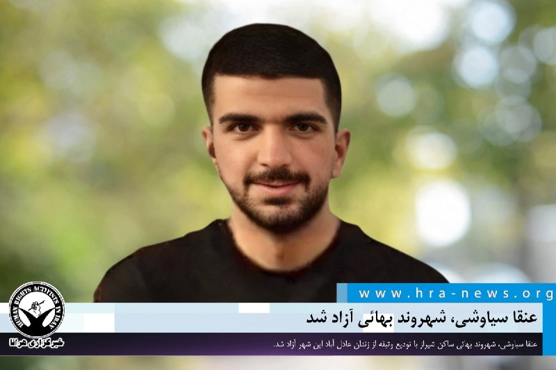

عنقا سیاوشی، شهروند بهائی آزاد شد
 

❗️
❗️
❗️
❗️
❗️ – امروز دوشنبه ۲۱ اردیبهشت ماه، عنقا سیاوشی، شهروند #بهائی ساکن شیراز با تودیع وثیقه از زندان عادل آباد این شهر آزاد شد.
 
به گزارش خبرگزاری هرانا، ارگان خبری مجموعه فعالان حقوق بشر در ایران، عنقا سیاوشی، شهروند بهائی آزاد شد.
 
بر اساس اطلاعات دریافتی هرانا، آزادی عنقا سیاوشی امروز دوشنبه ۲۱ اردیبهشت ماه با تودیع وثیقه و از زندان عادل آباد شیراز صورت گرفته است.
 
ادامه مطلب
 
#عنقا_سیاوشی
 
↘️
@hranews_bot تماس ✉️ -  @Hranews  کانال هرانا 🆑

## Hranews — post 112882

  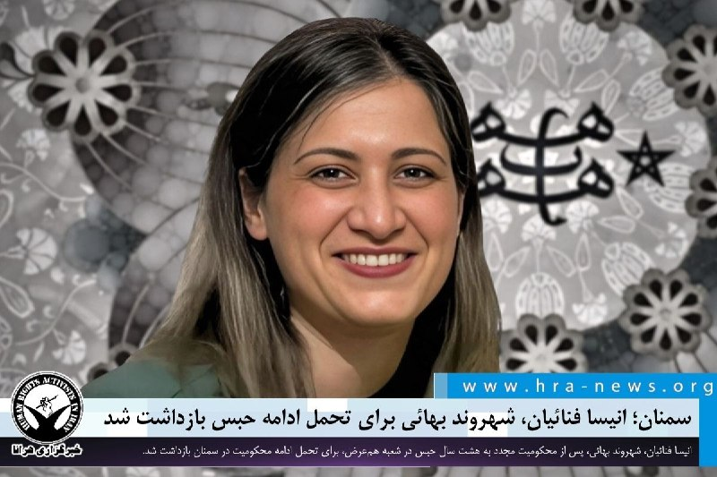

سمنان؛ انیسا فنائیان، شهروند بهائی برای تحمل ادامه حبس بازداشت شد
 

❗️
❗️
❗️
❗️
❗️ – انیسا فنائیان، شهروند بهائی، برای اجرای ادامه محکومیت خود در سمنان بازداشت شد. او پیش‌تر پس از پذیرش درخواست اعاده دادرسی و ارجاع پرونده به شعبه هم‌عرض، بار دیگر به هشت سال حبس محکوم شده بود.
 
به گزارش خبرگزاری هرانا، ارگان خبری مجموعه فعالان حقوق بشر در ایران، انیسا فنائیان، شهروند بهائی برای تحمل حبس بازداشت شد.
 
براساس اطلاعات دریافتی هرانا، خانم فنائیان بعد از ظهر امروز دوشنبه ۲۱ اردیبهشت‌ماه، در منزل شخصی خود در سمنان توسط نیروهای امنیتی بازداشت شده است. ماموران در زمان بازداشت، حکم جلب وی جهت اجرای ادامه دوران محکومیت را به همراه داشتند.
 
ادامه مطلب
 
#انیسا_فنائیان

↘️
@hranews_bot تماس ✉️ -  @Hranews  کانال هرانا 🆑

## Hranews — post 112881

  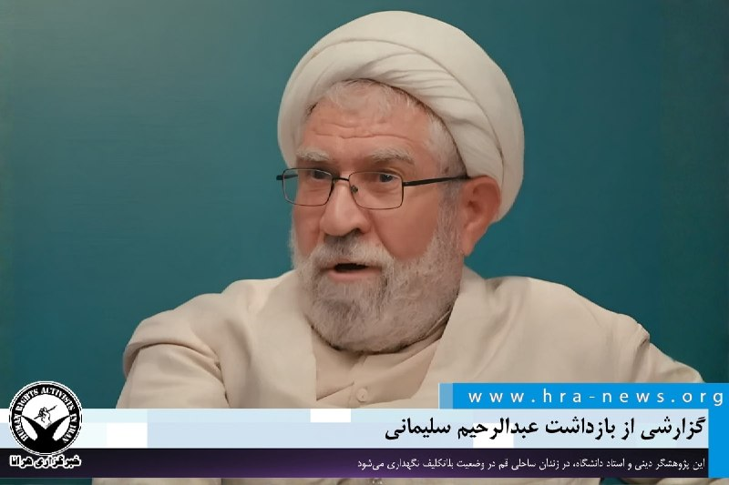

گزارشی از بازداشت و تداوم بلاتکلیفی عبدالرحیم سلیمانی در زندان قم
 

❗️
❗️
❗️
❗️
❗️ – عبدالرحیم سلیمانی، پژوهشگر دینی و استاد دانشگاه، ابتدای فروردین‌ماه سال جاری بازداشت شده و همچنان در زندان ساحلی قم در وضعیت بلاتکلیف نگهداری می‌شود.
 
به گزارش خبرگزاری هرانا، ارگان خبری مجموعه فعالان حقوق بشر در ایران، عبدالرحیم سلیمانی، در نخستین روز امسال توسط نیروهای امنیتی در شهرستان ساوه بازداشت شد.
 
یک منبع مطلع به هرانا گفت: ماموران امنیتی ابتدا به محل سکونت عبدالرحیم سلیمانی و همسرش در ساوه مراجعه کرده و پس از تخریب در و پنجره و اطمینان از نبودن کسی در محل، آنجا را ترک کردند. وی ساعاتی بعد در منزل مادر همسرش در روستای بالقلوی ساوه بازداشت شد.
 
به گفته وی، بازداشت عبدالرحیم سلیمانی بدون ارائه حکم قضایی و همراه با رفتار خشونت‌آمیز، توهین و ضرب‌وشتم صورت گرفت. با وجود برگزاری جلسات دادگاه، وضعیت پرونده او همچنان نامشخص است.
 
ادامه مطلب
 
#عبدالرحیم_سلیمانی
 
↘️
@hranews_bot تماس ✉️ -  @Hranews  کانال هرانا 🆑

## Hranews — post 112880

تداوم بازداشت پیشوا آقاپور در ارومیه
 

❗️
❗️
❗️
❗️
❗️ – با گذشت ۶۸ روز از دستگیری پیشوا آقاپور، شهروند اهل بوکان، او همچنان در بازداشت به سر می‌برد. وی اخیرا از زندان ارومیه به یکی از بازداشتگاه‌های امنیتی در این شهر منتقل شده است.
 
ادامه مطلب
 
#پیشوا_آقاپور
 
↘️
@hranews_bot تماس ✉️ -  @Hranews  کانال هرانا 🆑

## Hranews — post 112879

یک شهروند توسط نیروهای امنیتی در نیکشهر بازداشت شد
 

❗️
❗️
❗️
❗️
❗️ – روز جمعه ۱۸ اردیبهشت ماه، شهیم بهرامی، شهروند اهل نیکشهر توسط ماموران اداره اطلاعات در این شهرستان بازداشت و به یکی از بازداشتگاه‌های این نهاد امنیتی در زاهدان منتقل شد.
 
ادامه مطلب

#شهیم_بهرامی

↘️
@hranews_bot تماس ✉️ -  @Hranews  کانال هرانا 🆑

## manototv — post 105318

  <a href="telegram/content/manototv_105318_1778523000.mp4" target="_blank">🎬 Download video</a>

‌
دونالد ترامپ، رئیس‌جمهوری آمریکا گفت:
« آن‌ها باور نمی‌کردند که ما تا این حد جلو برویم. چقدر آدم‌های احمقی هستند. فکر می‌کردند من خسته می‌شوم یا تحت فشار قرار می‌گیرم، اما هیچ فشاری وجود ندارد. ما به یک پیروزی کامل خواهیم رسید.»

ترامپ در بخش دیگری افزود جمهوری اسلامی ابتدا با خارج کردن همه اورانیوم غنی‌شده از ایران موافقت کرده بود، اما بعد موضع خود را تغییر داد.

ترامپ گفت: «دو روز پیش موافقت کرده بودند. گفتند شما باید آن را خارج کنید.»

او افزود قرار بوده آمریکا در روند انتقال این مواد مشارکت کند، اما تهران بعداً نظرش را عوض کرده و این موضوع را در متن پیشنهادی خود نیاورده است.

رئیس‌جمهوری آمریکا همچنین گفت واشینگتن چهار روز منتظر دریافت سندی بوده که «باید در ده دقیقه آماده می‌شد.»

ترامپ افزود: «موضوع خیلی ساده بود؛ ما آن مواد را دریافت می‌کنیم و آن‌ها هم برای مدت طولانی تضمین می‌دهند که سلاح هسته‌ای نداشته باشند.»

او در پایان گفت: «آن‌ها با ما موافقت می‌کنند و بعد حرفشان را پس می‌گیرند.»

## manototv — post 105317

  <a href="telegram/content/manototv_105317_1778523002.mp4" target="_blank">🎬 Download video</a>

‌
دونالد ترامپ، رئیس‌جمهوری آمریکا، با انتقاد شدید از پاسخ جمهوری اسلامی به پیشنهادهای واشینگتن، وضعیت آتش‌بس را «بسیار ضعیف» توصیف کرد.

ترامپ گفت: «بعد از خواندن آن آشغال، باید بگویم این آتش‌بس الان یکی از ضعیف‌ترین‌هاست.»

او افزود حتی متن پاسخ جمهوری اسلامی را کامل نخوانده و گفته است: «وقتم را برای خواندنش تلف نمی‌کنم.»

رئیس‌جمهوری آمریکا همچنین گفت: «می‌توانم بگویم این آتش‌بس الان روی دستگاه حفظ حیات است.»

او همچنین گفت در جمهوری اسلامی «میانه‌روها» و «دیوانه‌ها» وجود دارند و مدعی شد «میانه‌روها به‌شدت خواهان توافق هستند»، اما «تندروها می‌خواهند تا آخر بجنگند.»

او همچنین با انتقاد از کردها گفت واشینگتن انتظار داشت آن‌ها سلاح را به دست معترضان در ایران برسانند، اما «کردها ما را ناامید کردند.»

ترامپ افزود: «ما اسلحه و مهمات فرستادیم، اما آن‌ها آن را برای خودشان نگه داشتند.»

## manototv — post 105316

  <a href="telegram/content/manototv_105316_1778523004.mp4" target="_blank">🎬 Download video</a>

تماس‌هایی از ایران:
«با همه سختی‌ها و جیب‌های خالی…
اما دل‌های بزرگ.
نمی‌ذارن یه هموطن برای نجات عزیزش تنها بمونه.
این شرافت مردمه ایران.»

## manototv — post 105315

  <a href="telegram/content/manototv_105315_1778523006.mp4" target="_blank">🎬 Download video</a>

تماسی از ایران:
«می‌گفت تجمع‌ها دیگه جمعیت نداره…
با کباب و بازی هم مردم رو نمی‌تونن بیارن.
می‌گفت مردم زیر فشار گرونی موندن،
اما دیگه فریب نمی‌خورن.»

## manototv — post 105314

  <a href="telegram/content/manototv_105314_1778523008.mp4" target="_blank">🎬 Download video</a>

دونالد ترامپ، رئیس‌جمهوری آمریکا، پیشنهاد جمهوری اسلامی را غیرقابل قبول خواند و تهران به او گفته بود اورانیوم غنی‌شده باید توسط آمریکا از محل خارج شود، زیرا سایت هسته‌ای «آن‌قدر نابود شده» که تنها «یک یا دو کشور در جهان» توان خارج کردن مواد از آن را دارند.

ترامپ گفت: «آن‌ها گفتند فقط آمریکا و چین توانایی خارج کردنش را دارند.»

رئیس‌جمهوری آمریکا همچنین گفت جمهوری اسلامی پس از این حملات، با یک «پیشنهاد احمقانه» برای مذاکره بازگشته است؛ پیشنهادی که به گفته او «هیچ‌کس آن را قبول نمی‌کند.»

ترامپ در ادامه بار دیگر جمهوری اسلامی را به کشتن «۴۲ هزار معترض غیرمسلح» متهم کرد و گفت تهران «شروع به تیراندازی به معترضان کرد.»

## manototv — post 105313

  <a href="telegram/content/manototv_105313_1778523009.mp4" target="_blank">🎬 Download video</a>

‌
دونالد ترامپ، رئیس‌جمهوری آمریکا، در جریان یک رویداد مربوط به سلامت مادران در کاخ سفید، با اشاره به تحولات مربوط به جمهوری اسلامی گفت گروهی از ژنرال‌های آمریکایی منتظر دیدار با او هستند.

ترامپ خطاب به سخنرانان این نشست گفت: «زیاد طولانی صحبت نکنید، چون یک گروه بزرگ از ژنرال‌ها منتظر من هستند.»

او سپس با اشاره به ایران افزود: «و آن موضوع هم مهم است، می‌دانید، مربوط می‌شود به کشور کاملاً دوست‌داشتنی ایران.»

ترامپ همچنین با لحنی کنایه‌آمیز گفت: «آن‌ها این‌طور تلفظش می‌کنند.»

## manototv — post 105312

  <a href="telegram/content/manototv_105312_1778523010.mp4" target="_blank">🎬 Download video</a>

راهپیمایی ایرانیان ونکوور

## manototv — post 105311

  

دونالد ترامپ، رئیس‌جمهوری آمریکا، به فاکس‌نیوز گفت واشینگتن در حال بررسی ازسرگیری عملیاتی برای بازگشایی تنگه هرمز است.

او افزود واشینگتن فشار بر جمهوری اسلامی را تا زمان دستیابی به توافق ادامه خواهد داد.

ترامپ همچنین گفت هنوز تصمیم نهایی درباره ازسرگیری «پروژه آزادی» را نگرفته است.

## manototv — post 105310

  

قوه قضائیه جمهوری اسلامی از توقیف بخشی از املاک علی کریمی خبر داد.

بر اساس اعلام قوه قضائیه، ۲ واحد تجاری و ۴ واحد مسکونی متعلق به علی کریمی در استان البرز شناسایی و توقیف شده‌اند.

در این گزارش ادعا شده این املاک پس از «استعلام از سازمان ثبت اسناد و املاک» و با «اقدامات حقوقی و اطلاعاتی» شناسایی شده‌اند.

## manototv — post 105309

  

کول آلن، متهم به تلاش برای ترور دونالد ترامپ در مراسم شام خبرنگاران کاخ سفید، در دادگاه اتهامات علیه خود را رد کرد.
او متهم است ۲۵ آوریل با عبور از ایست بازرسی امنیتی، به سمت یکی از مأموران سرویس مخفی آمریکا شلیک کرده باشد.

در زمان حادثه، ترامپ، ملانیا ترامپ و شماری از مقام‌های ارشد دولت آمریکا در محل حضور داشتند و پس از شنیده شدن صدای تیراندازی از سالن خارج شدند.

دادستان‌ها می‌گویند هنگام بازداشت، چند چاقو و یک اسلحه کمری نیز همراه آلن بوده است. او در صورت محکومیت با احتمال حبس ابد روبه‌رو خواهد شد.

## manototv — post 105308

  

دولت بریتانیا روز دوشنبه ۱۲ فرد و نهاد مرتبط با جمهوری اسلامی را تحریم کرد و آن‌ها را به مشارکت در «فعالیت‌های خصمانه» متهم کرد.

دولت بریتانیا اعلام کرد این افراد و نهادها در طراحی حملات و ارائه خدمات مالی به گروه‌هایی نقش داشته‌اند که به‌دنبال بی‌ثبات‌سازی بریتانیا و کشورهای دیگر هستند.

در میان افراد تحریم‌شده، اعضا و مرتبطان شبکه جنایی «زیندشتی» و همچنین چند صرافی و فعال مالی دیده می‌شوند.

## manototv — post 105307

  <a href="telegram/content/manototv_105307_1778523014.mp4" target="_blank">🎬 Download video</a>

همخوانی سرود ای ایران در گردهمایی ایرانیان سیدنی

## manototv — post 105306

  <a href="telegram/content/manototv_105306_1778523016.mp4" target="_blank">🎬 Download video</a>

چین سرانجام تایید کرد: دونالد ترامپ این هفته به دعوت شی جین‌پینگ به پکن سفر می‌کند.

وزارت خارجه چین اعلام کرد ترامپ در این سفر با رئیس‌جمهوری چین دیدار خواهد کرد. این سفر قرار بود اوایل آوریل انجام شود اما تاکنون پکن آن را رسماً تایید نکرده بود.

این دیدار در حالی انجام می‌شود که روابط واشنگتن و پکن بر سر جنگ ایران و تهدید امنیت انرژی چین پس از اختلال در تردد نفتکش‌ها از تنگه هرمز، پرتنش شده است.

چند روز پیش از این سفر نیز وزارت خزانه‌داری آمریکا شرکت‌هایی مستقر در چین را به اتهام کمک به تلاش‌های نظامی جمهوری اسلامی تحریم کرد.

## manototv — post 105305

  <a href="telegram/content/manototv_105305_1778523016.mp4" target="_blank">🎬 Download video</a>

گردهمایی ایرانیان گلاسگو

## manototv — post 105303

  <a href="telegram/content/manototv_105303_1778523018.mp4" target="_blank">🎬 Download video</a>

امانوئل ماکرون، رئیس‌جمهور فرانسه، روز دوشنبه ۲۱ اردیبهشت، در جریان نشست «آفریقا فوروارد» در نایروبی، هنگام یک پنل فرهنگی سخنان خود را متوقف کرد و از حاضران خواست سکوت کنند.

در ویدئوهای منتشرشده از این نشست، ماکرون با لحنی معترض گفت با این میزان سر و صدا «صحبت کردن درباره فرهنگ» و گوش دادن به سخنان افراد حاضر روی صحنه ممکن نیست. او این وضعیت را «بی‌احترامی کامل» خواند و از کسانی که قصد گفت‌وگوهای جانبی دارند خواست سالن را ترک کنند.

نشست «آفریقا فوروارد» روزهای ۲۱ و ۲۲ اردیبهشت در پایتخت کنیا برگزار می‌شود و فرانسه و کنیا به طور مشترک میزبان آن هستند. این نشست با حضور ماکرون و هیات‌هایی از بیش از ۳۰ کشور آفریقایی برگزار شده و محور آن جذب سرمایه‌گذاری و بازنگری در نگاه جهانی به ریسک اقتصادی در آفریقا است.

## manototv — post 105302

  <a href="telegram/content/manototv_105302_1778523019.mp4" target="_blank">🎬 Download video</a>

گردهمایی ایرانیان بروکسل

## manototv — post 105301

  <a href="telegram/content/manototv_105301_1778523021.mp4" target="_blank">🎬 Download video</a>

داده‌های کشتیرانی شرکت‌های «کپلر» و «ال‌اس‌ای‌جی» نشان می‌دهد سه نفتکش حامل نفت خام، هفته گذشته و روز یکشنبه، با خاموش کردن ردیاب‌های خود از تنگه هرمز عبور کردند؛ اقدامی که برای کاهش خطر حملات احتمالی جمهوری اسلامی انجام شده است.

بر اساس این داده‌ها، دو ابرنفتکش «آگیوس فانوریوس ۱» و «کیارا ام» روز یکشنبه از این تنگه عبور کردند. هرکدام از این نفتکش‌ها حدود دو میلیون بشکه نفت خام عراق حمل می‌کردند.

این روند نشان می‌دهد با افزایش تنش‌ها در منطقه، شرکت‌های کشتیرانی برای حفظ صادرات نفت خاورمیانه، به روش‌هایی مانند خاموش کردن سیستم‌های ردیابی روی آورده‌اند.

## alonews — post 119354

  <a href="telegram/content/alonews_119354_1778523021.webm" target="_blank">🎬 Download video</a>

👈رئیس سازمان برنامه و بودجه: در مورد قیمت بنزین هیچ گونه تصمیمی گرفته نشد

✅ @AloNews خبر جنگ

## alonews — post 119353

  <a href="telegram/content/alonews_119353_1778523021.webm" target="_blank">🎬 Download video</a>

👈 ششمین ناوگان ایالات متحده، تحت نظارت نیروهای دریایی ایالات متحده در اروپا و آفریقا و مسئول اصلی فعالیت‌های نیروی دریایی ایالات متحده در اطراف دریای مدیترانه، رسیدن یک زیردریایی موشک بالستیک کلاس اوهایو را برای بازدید از بندر در جبل‌الطارق در تاریخ ۱۰ مه تأیید کرده است

✅ @AloNews خبر جنگ

## alonews — post 119352

  <a href="telegram/content/alonews_119352_1778523022.webm" target="_blank">🎬 Download video</a>

👈 تحریم ۱۲ فرد و نهاد ادعایی مرتبط با ایران توسط انگلیس

✅ @AloNews خبر جنگ

## alonews — post 119351

  <a href="telegram/content/alonews_119351_1778523022.webm" target="_blank">🎬 Download video</a>

👈ده‌ها تانکر سوخت‌رسانی آمریکا هنوز در فرودگاه بن گوریون اسرائیل مستقر هستند. 
✅ @AloNews خبر جنگ

## alonews — post 119350

  <a href="telegram/content/alonews_119350_1778523022.webm" target="_blank">🎬 Download video</a>

👈همراهان ترامپ در سفرش به چین:

🔴رئیس شرکت بلک راک

🔴رئیس شرکت گلدمن

🔴 رئیس شرکت مسترکارت

🔴 رئیس شرکت سیسکو

🔴 رئیس شرکت متا

🔴 رئیس شرکت ویزا

🔴رئیس شرکت اپل

🔴 رئیس شرکت تسلا (ایلان ماسک)

✅ @AloNews خبر جنگ

## alonews — post 119349

  <a href="telegram/content/alonews_119349_1778523022.webm" target="_blank">🎬 Download video</a>

👈یک منبع ایرانی به الجزیره گفت: ایران آماده است اورانیوم با غنای بالا را تا سطوح ۳.۷ درصد و ۲۰ درصد رقیق کند. 
✅ @AloNews خبر جنگ

## alonews — post 119348

  <a href="telegram/content/alonews_119348_1778523022.webm" target="_blank">🎬 Download video</a>

👈یک منبع ایرانی به الجزیره گفت: ایران آماده است اورانیوم با غنای بالا را تا سطوح ۳.۷ درصد و ۲۰ درصد رقیق کند.

✅ @AloNews خبر جنگ

## alonews — post 119347

  <a href="telegram/content/alonews_119347_1778523023.webm" target="_blank">🎬 Download video</a>

👈 ترامپ درباره ویروس هانتا گفت: این ویروس بسیار سخت‌تر منتقل می‌شود و مدت‌هاست که وجود دارد. مدت‌هاست که وجود دارد. مردم با آن بسیار آشنا هستند. امیدوارم مشکلی نباشد.

✅ @AloNews خبر جنگ

## alonews — post 119346

  <a href="telegram/content/alonews_119346_1778523023.webm" target="_blank">🎬 Download video</a>

👈آکسیوس : مقامات آمریکایی می‌گویند انتظار می‌رود ترامپ جنگ با ایران را با شی جین‌پینگ، رئیس‌جمهور چین، در میان بگذارد

✅ @AloNews خبر جنگ

## alonews — post 119345

  <a href="telegram/content/alonews_119345_1778523023.webm" target="_blank">🎬 Download video</a>

👈تماس تلفنی عباس عراچقی وزیر امور خارجه با همتای سنگاپوری

✅ @AloNews خبر جنگ

## alonews — post 119344

  <a href="telegram/content/alonews_119344_1778523023.webm" target="_blank">🎬 Download video</a>

👈رئیس‌جمهور موقت ونزوئلا: ونزوئلا هرگز تبدیل شدن به پنجاه‌ویکمین ایالت آمریکا را مدنظر نداشته است.

🔴اگر چیزی باشد که همه ما مردم ونزوئلا در آن مشترک باشیم، عشق به روند استقلال‌مان و عشق به قهرمانان استقلال است

🔴 ترامپ ساعاتی پیش در سخنانی مدعی شده بود که ایالات متحده به طور جدی الحاق ونزوئلا به عنوان ایالت ۵۱ آمریکا را در دست بررسی دارد

✅ @AloNews خبر جنگ

## alonews — post 119343

  <a href="telegram/content/alonews_119343_1778523023.webm" target="_blank">🎬 Download video</a>

👈حزب‌الله دیروز فیلمی از حمله یک پهپاد FPV به تانک مرکاوا اسرائیل در بیاده، جنوب لبنان منتشر کرد

✅ @AloNews خبر جنگ

## alonews — post 119342

  <a href="telegram/content/alonews_119342_1778523024.webm" target="_blank">🎬 Download video</a>

👈ادعای آکسیوس: اسرائیل می‌خواهد ترامپ دستور یک عملیات نیروهای ویژه را برای تصاحب ذخیرۀ اورانیوم ایران صادر کند. ترامپ در صدور دستور چنین عملیاتی تردید دارد زیرا بسیار پرریسک است.

✅ @AloNews خبر جنگ

## alonews — post 119341

  <a href="telegram/content/alonews_119341_1778523024.webm" target="_blank">🎬 Download video</a>

👈ادعای آکسیوس: مقامات آمریکایی می‌گویند انتظار می‌رود ونس، ویتکاف، روبیو، هگست، رئیس ستاد مشترک ارتش، رئیس سیا، و دیگر مقامات ارشد در جلسۀ روز دوشنبه در مورد ایران شرکت کنند.

✅ @AloNews خبر جنگ

## alonews — post 119340

  <a href="telegram/content/alonews_119340_1778523024.webm" target="_blank">🎬 Download video</a>

👈آکسیوس : ترامپ در حال بررسی دو گزینه‌ست

🔴 یا از سرگیری «پروژه آزادی» که هفته گذشته به حالت تعلیق دراومد

🔴 یا از سرگیری بمبارون و حمله به ۲۵٪ از اهدافی که آمریکا شناسایی کرده اما هنوز به اونا حمله نکرده - و امشب با ژنرال‌ها جلسه داره!

✅ @AloNews خبر جنگ

## alonews — post 119339

  <a href="telegram/content/alonews_119339_1778523024.webm" target="_blank">🎬 Download video</a>

👈آکسیوس به نقل از مقامات: ترامپ امروز با تیم امنیت ملی خود برای بحث در مورد جنگ ایران، از جمله احتمال اقدام نظامی مجدد، جلسه دارد. 
🔴ترامپ به سمت نوعی اقدام نظامی علیه ایران متمایل است تا فشار را افزایش دهد و در مورد برنامه هسته‌ای این کشور امتیاز بگیرد 
✅…

## alonews — post 119338

  <a href="telegram/content/alonews_119338_1778523024.webm" target="_blank">🎬 Download video</a>

👈آکسیوس به نقل از مقامات: ترامپ امروز با تیم امنیت ملی خود برای بحث در مورد جنگ ایران، از جمله احتمال اقدام نظامی مجدد، جلسه دارد.

🔴ترامپ به سمت نوعی اقدام نظامی علیه ایران متمایل است تا فشار را افزایش دهد و در مورد برنامه هسته‌ای این کشور امتیاز بگیرد

✅ @AloNews خبر جنگ

## alonews — post 119337

  <a href="telegram/content/alonews_119337_1778523025.webm" target="_blank">🎬 Download video</a>

👈تسنیم به نقل از یک منبع نزدیک به تیم مذاکرات: برخلاف ادعای برخی رسانه‌های غربی، در متن ایران چیزی به عنوان پذیرش خروج مواد غنی شده هسته‌ای از کشور، وجود ندارد 
✅ @AloNews خبر جنگ

## alonews — post 119336

  <a href="telegram/content/alonews_119336_1778523025.webm" target="_blank">🎬 Download video</a>

👈وزیر قطع ارتباطات: در تلاش برای برقراری اینترنت بین‌الملل در اسرع وقت هستیم.

✅ @AloNews خبر جنگ

## alonews — post 119335

  <a href="telegram/content/alonews_119335_1778523025.webm" target="_blank">🎬 Download video</a>

👈گزارش آسوشیتدپرس از دیپلمات‌های منطقه‌ای: یکی از مسائلی که ترامپ را ناامید کرده، درخواست غرامت جنگی ایران است. این مقامات گفتند که به طور سنتی غرامت توسط طرف شکست خورده پرداخت می‌شود و ترامپ در مورد عبارت «غرامت» در پیشنهادهای ایران محتاط است - زیرا موافقت با آن می‌تواند به عنوان پذیرش شکست تعبیر شود.

✅ @AloNews خبر جنگ

<!-- MSG END -->

<!-- NAV START -->

<a href="https://github.com/babi2323/aio-downloader/blob/main/telegram/content/archive_1.md" style="display:inline-block; padding:6px 12px; margin:0 4px; background-color:#2ea44f; color:white; text-decoration:none; border-radius:4px; font-weight:bold;">صفحه بعد</a>

<!-- NAV END -->
