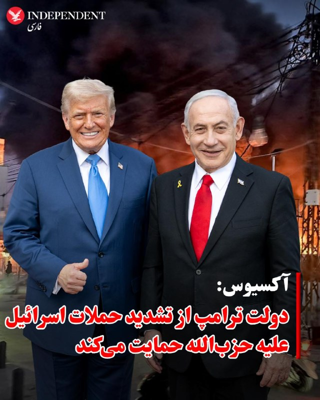
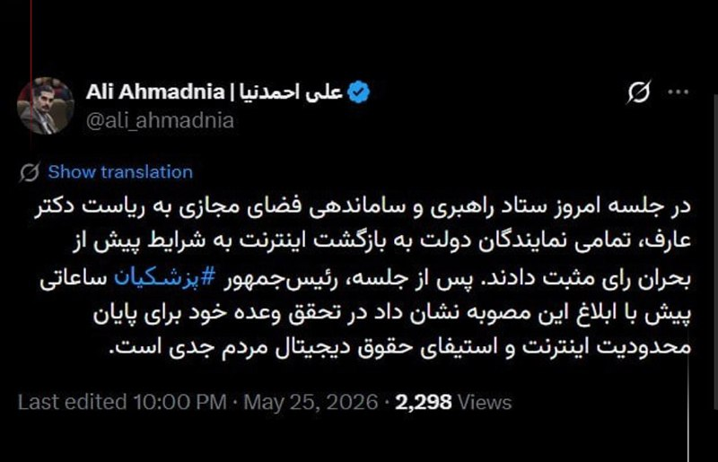
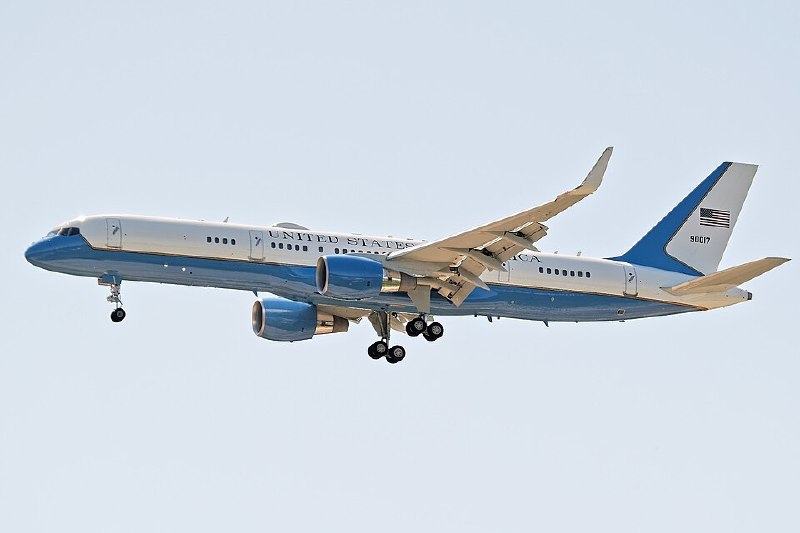
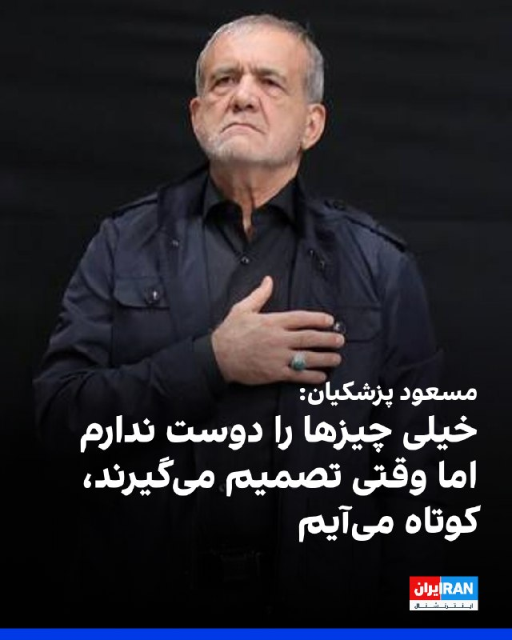
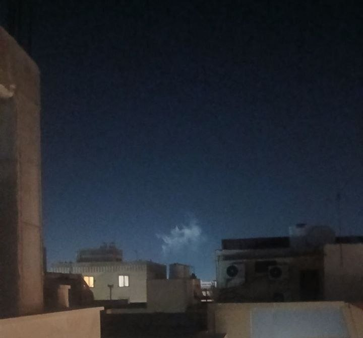
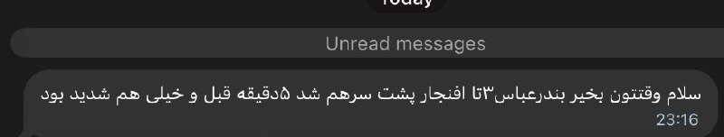
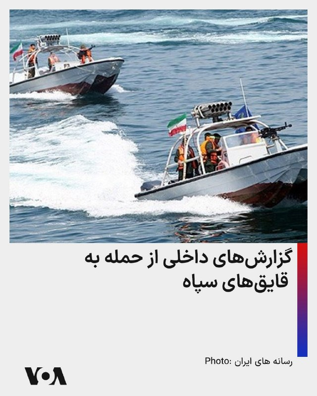
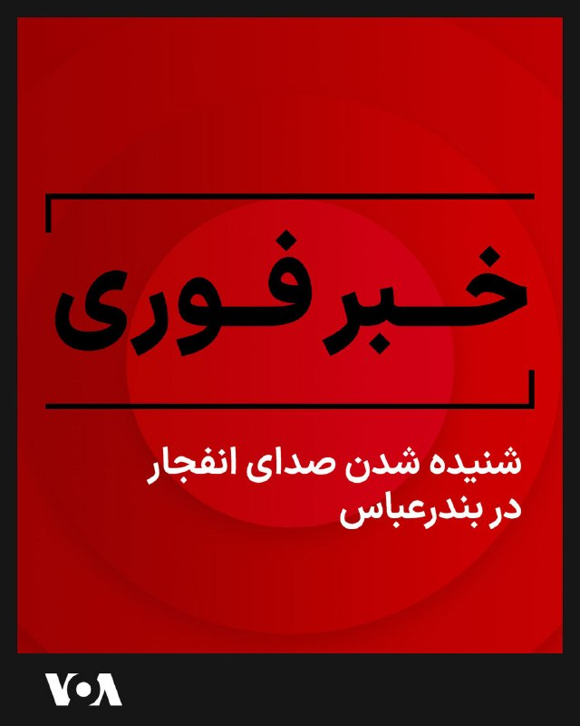
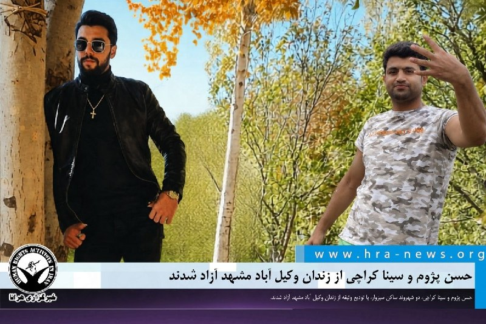

# خواننده تلگرام

<!-- TOP_NAV START -->

<a href="https://github.com/babi2323/aio-downloader/blob/main/telegram/content/archive_1.md" style="display:inline-block; padding:6px 12px; margin:0 4px; background-color:#2ea44f; color:white; text-decoration:none; border-radius:4px; font-weight:bold;">صفحه بعد</a>

<!-- TOP_NAV END -->

<!-- MSG START -->

---
📅 بروزرسانی: 1405/03/05 01:54
---

## VahidOOnLine — post 242192

  

ترامپ در تروث‌سوشال نوشت: «اورانیوم غنی‌شده (غبار هسته‌ای!) یا فورا به آمریکا تحویل داده خواهد شد تا در ایالات‌متحده نابود شود، یا ترجیحا با همکاری و هماهنگی با جمهوری اسلامی ایران، در همان محل یا در مکانی قابل قبول دیگر نابود خواهد شد.»
ترامپ گفت در صورت نابودی اورانیوم غنی‌شده در مکانی غیر از آمریکا، «کمیسیون انرژی اتمی»، یا نهاد معادل آن، به عنوان شاهد بر این فرایند نظارت خواهد داشت.
‌🏁 🇬🇧 IranintlTV

🤖 @VahidOOnLine

## VahidOOnLine — post 242191

  

♦️دونالد ترامپ، رئیس‌جمهوری ایالات متحده، با انتشار پیامی در شبکه اجتماعی «تروث سوشال»نوشت: «اورانیوم غنی‌شده (گرد‌وغبار هسته‌ای) یا باید فورا به ایالات متحده تحویل داده شود تا به آمریکا منتقل و نابود گردد، یا اینکه ترجیحا در بستر همکاری و هماهنگی با جمهوری اسلامی، در همان محل یا در مکان قابل‌قبول دیگری، در حضور و با نظارت کمیسیون انرژی اتمی یا نهاد معادل آن نابود شود.»
‌🇸🇦 Indypersian

🤖 @VahidOOnLine

## VahidOOnLine — post 242190

  

♦️خبرگزاری دانشجو بامداد سه‌شنبه، پنجم خردادماه، گزارش داد که در حمله دوشنبه‌شب آمریکا و اسرائیل به جنوب جزیره لارک، عباس اسلامی، قدرت زرنگاری و عبدالرضا گلزاری، نیروهای سپاه پاسداران کشته شدند. براساس این گزارش «تعداد دقیق کشته‌شدگان هنوز مشخص نشده است».
‌🇸🇦 Indypersian

🤖 @VahidOOnLine

## VahidOOnLine — post 242189

  

♦️صابرین‌نیوز، کانال تلگرامی مشترک سپاه قدس و حشدالشعبی عراق، بامداد سه‌شنبه، پنجم خردادماه، از کشته‌شدن دو نیروی سپاه پاسداران در حمله جنگنده‌های دشمن به دو قایق در خلیج فارس خبر داد. همزمان، گزارش‌های رسیده از شنیده‌شدن صدای انفجارها در اصفهان و بابلسر خبر می‌دهد. پیش از این، تابناک بامداد سه‌شنبه، پنجم خردادماه، گزارش داد: «باند پروازی فرودگاه بندرعباس مورد اصابت موشک قرار گرفت».
‌🇸🇦 Indypersian

🤖 @VahidOOnLine

## VahidOOnLine — post 242188

  

♦️تابناک بامداد سه‌شنبه، پنجم خردادماه، گزارش داد: «باند پروازی فرودگاه بندرعباس مورد اصابت موشک قرار گرفت». پیش از این فارس، خبرگزاری وابسته به سپاه پاسداران از شنیده‌شدن چند انفجار در بندرعباس و حوالی سیریک و جاسک خبر داده بود.
‌🇸🇦 Indypersian

🤖 @VahidOOnLine

## VahidOOnLine — post 242187

  

♦️تسنیم، خبرگزاری وابسته به سپاه، بامداد سه‌شنبه، پنجم خردادماه، درباره آخرین وضعیت مذاکرات هیات ایرانی به نقل از «یک منبع آگاه» گزارش داد: «موضوع آزادسازی دارایی بلوکه شده ایران در حال پیگیری است». براساس این گزارش، سفر محمدباقر قالیباف، رئیس مجلس شورای اسلامی، به قطر با همراهی عباس عراقچی، وزیر خارجه جمهوری اسلامی و رئیس کل بانک مرکزی، در جهت آزادسازی بخشی از پولهای بلوکه شده در مرحله اول اجرایی شدن یادداشت تفاهم احتمالی با واشنگتن است. تسنیم نوشت که چون جمهوری اسلامی به آمریکایی‌ها بی‌اعتماد است و می‌خواهد نتایج قطعی را حاصل و انتفاع ایجاد کند، اصرار دارد در این فرایند حتما بخشی از پول‌های مسدود شده آزاد شود. این «منبع مطلع» به تسنیم گفت که در این سفر «پیشرفت‌هایی حاصل شده و گام‌های رو به جلو برداشته شده است».
‌🇸🇦 Indypersian

🤖 @VahidOOnLine

## VahidOOnLine — post 242186

  

♦️درحالی‌که از کشته‌شدن علی خامنه‌ای در حمله مشترک آمریکا و اسرائیل، ۸۸ روز می‌گذرد، فارس، خبرگزاری وابسته به سپاه دوشنبه‌شب، چهارم خردادماه، به نقل از رئیس شورای هماهنگی تبلیغات اسلامی تهران گزارش داد: «هنوز زمان مشخصی برای تشییع رهبر شهید انقلاب تعیین نشده و مردم به شایعات توجه نکنند». رهبر دوم جمهوری اسلامی روز ۹ اسفند ۱۴۰۴ در تهران کشته شد.
‌🇸🇦 Indypersian

🤖 @VahidOOnLine

## VahidOOnLine — post 242185

  

♦️ فارس، خبرگزاری وابسته به سپاه، بامداد سه‌شنبه، پنجم خردادماه، از شنیده شدن چند انفجار در بندر عباس و حوالی سیریک و جاسک خبر داد و نوشت: «هنوز محل دقیق و منشا این صداها مشخص نیست».
‌🇸🇦 Indypersian

🤖 @VahidOOnLine

## VahidOOnLine — post 242184

  

♦️همزمان با هشتادوهفتمین روز قطع اینترنت جهانی در ایران، خبرگزاری ایرنا دوشنبه‌شب گزارش داد که با توجه به تایید مصوبه بازگشت اینترنت به وضعیت قبل از دی‌ماه ۱۴۰۴ و ابلاغ آن به وزارت ارتباطات، «انتظار می‌رود این دستور فردا (سه‌شنبه، پنجم خردادماه) اجرایی شود و اینترنت بین‌الملل به‌زودی دسترسی مردم قرار بگیرد». براساس این گزارش، پیش از این، احسان چیت‌ساز، معاون سیاست گذاری و برنامه‌ریزی توسعه فاوا و اقتصاد دیجیتال وزارت ارتباطات با انتشار مطلبی در اکس از ابلاغ مصوبه بازگشایی اینترنت توسط پزشکیان خبر داد.
‌🇸🇦 Indypersian

🤖 @VahidOOnLine

## VahidOOnLine — post 242183

  

محمد محمدی گلپایگانی، رییس دفتر علی خامنه‌ای، در ویدیویی با اشاره به رهبر کشته‌شده جمهوری اسلامی گفت او مخالف تجمل‌گرایی بود و زندگی بسیار ساده‌ای داشت، به‌گونه‌ای که وسایل شخصی‌اش به اندازه بار یک وانت یا حتی کمتر بود.

گلپایگانی افزود علی خامنه‌ای هدایایی را که از داخل و خارج کشور برایش ارسال می‌شد، به کمیته امداد و نهادهای دیگر می‌داد تا صرف کمک به فقرا شود و بهره شخصی او از این هدایا بسیار ناچیز بود.
‌🏁 🇬🇧 IranintlTV

🤖 @VahidOOnLine

## VahidOOnLine — post 242182

♦️ابراهیم عزیزی، رئیس کمیسیون امنیت ملی مجلس، دوشنبه‌شب، در برنامه «گفتگوی ویژه خبری» صداوسیما اعلام کرد که پهپادهای دشمن همچنان در مرزهای ایران در حال گشت زنی هستند. او گفت: «در طول روز گذشته و امروز، شاهد حضور پهپادهای دشمن بودیم که دیروز برخورد قاطعی صورت گرفت».
‌🇸🇦 Indypersian

🤖 @VahidOOnLine

## VahidOOnLine — post 242181

  

♦️تسنیم، خبرگزاری وابسته به سپاه، بامداد سه‌شنبه، پنجم خردادماه از «شنیده‌شدن ۳ انفجار مهیب» در بندر عباس خبر داد. براساس این گزارش، معاون استاندار اعلام کرد منشا صدای انفجار در حال بررسی است.
‌🇸🇦 Indypersian

🤖 @VahidOOnLine

## VahidOOnLine — post 242180

  

رسانه‌های ایران شامگاه دوشنبه از شنیده‌شدن صداهای انفجار در بندرعباس و همزمان در خلیج فارس حوالی سیریک و جاسک خبر دادند.

معاون استاندار هرمزگان اعلام کرد منشا صدای انفجار در حال بررسی است.
‌🏁 🇬🇧 IranintlTV

🤖 @VahidOOnLine

## VahidOOnLine — post 242179

  

♦️ابراهیم عزیزی، رئیس کمیسیون امنیت ملی و سیاست خارجی مجلس شورای اسلامی، در برنامه «گفتگوی ویژه خبری» صداوسیما با ابراز بدبینی شدید نسبت به آینده مذاکرات با واشنگتن، دستیابی به یک توافق همه‌جانبه را دور از ذهن دانست و گفت: «ما در این شرایطی که داریم، بعید می‌دانیم که آمریکایی‌ها خلاصه وارد یک توافقی بشوند که این خواسته‌های جمهوری اسلامی را بپذیرند.» او با اشاره به روند طولانی‌مدت گفتگوها و پاسخ به پرسش مجری درباره میزان فاصله تا رسیدن به نتیجه نهایی صراحتا تأکید کرد: «من پذیرش پنج بند اول خواسته‌های ایران را بسیار بعید می‌دانم؛ بنابراین از نظر من، ما در حال حاضر در شرایطی قرار داریم که از دستیابی به هرگونه توافقی بسیار دور هستیم.»
‌🇸🇦 Indypersian

🤖 @VahidOOnLine

## VahidOOnLine — post 242178

  

♦️«یک منبع نظامی» در گفتگو با تسنیم، خبرگزاری وابسته به سپاه، روز دوشنبه مدعی شد که بررسی‌های فنی نیروهای مسلح نشان می‌دهد اسرائیل طی چند هفته گذشته، چندین حمله پهپادی را در قالب عملیات «پرچم دروغین» علیه امارات متحده عربی انجام داده است. این منبع ضمن اشاره به اینکه اقدامات انجام شده با هدف «تحریک» مقامات اماراتی صورت گرفته، گفت: «اسرائیل نشان داده است که صرفا منافع خود را در نظر دارد؛ به نوعی که هم در ارتباط با برخی از کشورهای حاشیه خلیج فارس آن‌ها را به ورطه‌ای خطرناک می‌کشاند و هم همزمان عملیات‌هایی را علیه آن‌ها انجام می‌دهد.»
‌🇸🇦 Indypersian

🤖 @VahidOOnLine

## VahidOOnLine — post 242177

  <a href="telegram/content/VahidOOnLine_242177_1779747855.mp4" target="_blank">🎬 Download video</a>

محمد مرندی، کارشناس حکومتی و عضو هیات مذاکره‌کنندگان جمهوری اسلامی در مذاکرات جاری، در تلویزیون گفت قطر پذیرفته بخشی از دارایی‌های بلوکه‌شده حکومت را پیشاپیش تامین و بعد، از آمریکا دریافت کند. او دلیل این اقدام را درک قدرت جمهوری اسلامی و نتایج ایستادگی آن عنوان کرد.
‌🏁 🇬🇧 IranintlTV

🤖 @VahidOOnLine

## VahidOOnLine — post 242176

  

♦️ رسانه آکسیوس، شامگاه دوشنبه چهارم خرداد ماه، به نقل از یک مقام ارشد آمریکایی گزارش داد دولت دونالد ترامپ از تشدید اقدام‌های نظامی اسرائیل در واکنش به «نقض آتش‌بس» از سوی حزب‌الله، حمایت خواهد کرد.
این مقام آمریکایی با اعلام آنکه «حزب‌الله درخواست‌های مکرر برای توقف شلیک به اسرائیل، از جمله یک اولتیماتوم اخیر، را نادیده گرفته است»، به آکسیوس گفت اسرائیل هرگز مجبور نخواهد شد «منفعلانه حملات علیه نیروها و غیرنظامیان خود را تحمل کند» او تاکید کرد: «این دولت بایدن نیست.»
به گفته این مقام، حزب‌الله از ۲۸ فروردین تاکنون بیش از هزار پهپاد و بیش از ۷۰۰ راکت شلیک کرده تا مذاکرات جاری میان لبنان و اسرائیل را مختل کند.
‌🇸🇦 Indypersian

🤖 @VahidOOnLine

## VahidOOnLine — post 242175

  

ابراهیم عزیزی، رییس کمیسیون امنیت ملی مجلس، گفت آمریکا از اوایل هفته دوم جنگ از طریق عاصم منیر، فرمانده ارتش پاکستان، درخواست آتش‌بس و مذاکره داده است.
او افزود تا زمانی که پنج اقدام «اعتمادساز» از سوی آمریکا انجام نشود، چیزی به نام تفاهم و مذاکره معنا ندارد.
به گفته عزیزی، این پنج اقدام شامل «خاتمه جنگ در همه جبهه‌ها به‌ویژه لبنان، برداشته‌شدن محاصره دریایی آمریکا، تردد کشتی‌های غیرنظامی از تنگه هرمز با ترتیبات مورد نظر ایران، تعلیق ۳۰ یا ۶۰ روزه تحریم‌های نفتی و آزادسازی پول‌های بلوکه‌شده است.»
‌🏁 🇬🇧 IranintlTV

🤖 @VahidOOnLine

## VahidOOnLine — post 242172

  

♦️یک منبع آگاه از گفتگوهای هیئت بلندپایه ایرانی با مقام‌های حاضر در دوحه، شامگاه دوشنبه چهارم خرداد ماه به خبرگزاری الجزیره گفت میانجی‌گری قطر به تفاهمی میان تهران و واشنگتن درباره دارایی‌های مسدود شده ایران منجر شده است.
این منبع افزود دستیابی به توافق در این موضوع که برای تهران اهمیت بالایی داشته، احتمال اعلام توافق میان آمریکا و ایران در روز سه‌شنبه را افزایش داده است.
‌🇸🇦 Indypersian

🤖 @VahidOOnLine

## VahidOOnLine — post 242171

  

♦️خبرگزاری رویترز به نقل از روزنامه ژاپنی نیکی گزارش داد، جمهوری اسلامی ایران ۳۰ روز پس از دستیابی به توافق با آمریکا، تنگه هرمز را بازگشایی خواهد کرد.
بر اساس این گزارش، ایران در بازه ۳۰ روزه پس از توافق، روند پاکسازی مین‌ها از تنگه هرمز را آغاز می‌کند.
نیکی به نقل از یک منبع آگاه نوشت پس از اجرای توافق، کشتی‌های همه کشورها همانند دوره پیش از تعطیلی عملی تنگه، امکان عبور آزادانه و امن از هرمز را خواهند داشت.
این گزارش می‌افزاید آتش‌بسی که آمریکا و ایران در فرودین ماه گذشته بر سر آن توافق کرده‌اند، برای ۶۰ روز دیگر تمدید خواهد شد.
‌🇸🇦 Indypersian

🤖 @VahidOOnLine

## mwarmonitor — post 9723

«چرا این مهم است: به نظر می‌رسد در اینجا نوعی نرمش در موضع آمریکا درباره روش‌های از بین بردن ذخایر اورانیوم غنی‌شده وجود دارد و نوعی نزدیک شدن به موضع ایران دیده می‌شود.» باراک راوید @mwarmonitor

## mwarmonitor — post 9722

🚨 ترامپ در شبکه اجتماعی Truth Social: «اورانیوم غنی‌شده (گرد هسته‌ای!) یا باید فوراً به ایالات متحده تحویل داده شود تا به کشور منتقل و نابود گردد، یا ترجیحاً با هماهنگی و همکاری جمهوری اسلامی ایران، همان‌جا در محل یا در مکانی دیگر که قابل قبول باشد، نابود…

## mwarmonitor — post 9721

🚨«درگیری‌هایی میان نیروی دریایی ایران و نیروهای آمریکایی رخ داده که در نتیجه آن تعدادی کشته شده‌اند، که عبارتند از: پاسدار عباس اسلامی پاسدار قدرت زرنگاری پاسدار عبدالرضا گلزاری پاسدار حسین ستوده» @mwarmonitor

## mwarmonitor — post 9720

🚨 ترامپ در شبکه اجتماعی Truth Social:

«اورانیوم غنی‌شده (گرد هسته‌ای!) یا باید فوراً به ایالات متحده تحویل داده شود تا به کشور منتقل و نابود گردد، یا ترجیحاً با هماهنگی و همکاری جمهوری اسلامی ایران، همان‌جا در محل یا در مکانی دیگر که قابل قبول باشد، نابود شود؛ به‌طوری که کمیسیون انرژی اتمی یا نهاد معادل آن، شاهد این فرایند و رویداد باشد.

از توجه شما به این موضوع سپاسگزارم!»

@mwarmonitor

## mwarmonitor — post 9719

🚨«درگیری‌هایی میان نیروی دریایی ایران و نیروهای آمریکایی رخ داده که در نتیجه آن تعدادی کشته شده‌اند، که عبارتند از:

پاسدار عباس اسلامی
پاسدار قدرت زرنگاری
پاسدار عبدالرضا گلزاری
پاسدار حسین ستوده»

@mwarmonitor

## mwarmonitor — post 9718

🔴 جزیره لارک در جنوب ایران هدف قرار گرفت

## mwarmonitor — post 9717

🚨🚨🚨

## mwarmonitor — post 9716

خبر فوری

## mwarmonitor — post 9715

🔴ایران به واشنگتن هشدار داده است که هرگونه حمله اسرائیل به بیروت یا حومه جنوبی آن، می‌تواند تلاش‌های جاری برای پایان دادن به جنگ را به‌طور جدی به خطر بیندازد و حتی کل روند دیپلماتیک را کاملاً مختل کند — الجزیره. @mwarmonitor

## mwarmonitor — post 9714

🔴بنیامین نتانیاهو می‌گوید اسرائیل «در حال جنگ با حزب‌الله است» و تأکید کرد که اسرائیل فشار نظامی را کاهش نخواهد داد و او به نیروها دستور داده است «پدال را حتی محکم‌تر فشار دهند». 📌نتانیاهو گفت حزب‌الله در حال شلیک پهپادها، از جمله پهپادهای فیبر نوری است،…

## mwarmonitor — post 9713

💥صدای انفجارهایی در خلیج فارس در نزدیکی مقابلِ سیریک و جاسک شنیده شد.

## mwarmonitor — post 9712

🔴سفر محمدباقر قالیباف و عباس عراقچی به دوحه ممکن است نشانه‌ای از حرکت واشنگتن به سمت «میانه‌ی پل» باشد. نقش میانجی‌گرانه قطر اکنون در حال تکمیل تلاش‌های پاکستان است و اگر گره‌های باقی‌مانده برطرف شود، احتمال اعلام یک توافق می‌تواند بسیار بالا برود. الجزیره…

## mwarmonitor — post 9710

🔴منابع به الجزیره گفته‌اند که میانجی‌گری قطر با موفقیت به ایالات متحده و ایران کمک کرده است تا درباره دارایی‌های مسدودشده به یک توافق دست پیدا کنند.

@mwarmonitor

## mwarmonitor — post 9709

  

📝 همان ثانیه اول شروع جنگ، مثل موش‌های غافلگیرشده پریدید روی سیم و در کسری از ثانیه کل اینترنت کشور را قطع کردید؛ اما حالا یک ماه است که این انگل‌زاده‌های کت‌شلواری و دایناسورهای عهد بوق، اندر خم وصل کردن مجدد آن مانده‌اند. خنده‌دار اینجاست که رسانه‌ها با…

## mwarmonitor — post 9708

  

✈️ساعت ۱۹:۳۳ به وقت محلی— SAM 535 — یک فروند C-32A به شماره 98-0002 از پایگاه KADW (اندروز) به مقصد ETAR (رامشتاین) برخاسته و در مسیر به نقطه KOK در حال حرکت است؛ با London Control روی فرکانس 132.840 ارتباط دارد.

📌احتمالا ویتکاف و کوشنر در این پرواز هستند در مسیر اسرائیل

@mwarmonitor

## mwarmonitor — post 9707

📊 بر اساس یک نظرسنجی که توسط کانال ۱۳ اسرائیل انجام شده است:

📈۵۸٪ معتقدند توافق منعقدشده با ایران ـ طبق آنچه منتشر شده ـ به «اسرائیل» آسیب می‌زند.
📈۵۱٪ با این توافق مخالف‌اند.
📉۳۹٪ بر این باورند که وضعیت امنیتی «اسرائیل» به‌دلیل جنگ تغییری نکرده
📉 ۳۴٪ می‌گویند بدتر شده است.
📈۴۹٪ نیز از ادامه جنگ در جبهه شمالی حمایت می‌کنند.

@mwarmonitor

## mwarmonitor — post 9706

✈️ساعت ۱۹:۲۲ به وقت گرینویچ— HENRY 30 — یک فروند بمب‌افکن B-52H به‌صورت تکی از فرفورد (Fairford) به پرواز درآمده و با Brize روی فرکانس 231.950 در ارتباط است.

@mwarmonitor

## mwarmonitor — post 9705

✈️ساعت ۱۹:۲۰ به وقت گرینویچ— CORE 45 — یک فروند بمب‌افکن استراتژیک B-1B به‌صورت تکی در حال پرواز از پایگاه فرفورد و با پایگاه Brize روی فرکانس 231.950 ارتباط برقرار می‌کند.

@mwarmonitor

## pm_afshaa — post 91506

  <a href="telegram/content/pm_afshaa_91506_1779747859.webm" target="_blank">🎬 Download video</a>

🔴پست جدید ترامپ: اورانیوم غنی‌شده (غبار هسته‌ای) یا فوراً به آمریکا تحویل داده خواهد شد تا به خاک آمریکا برده شده و منهدم شود، یا ترجیحاً با هماهنگی و همکاری جمهوری اسلامی ایران، در همان مکان منهدم شود. یا در مکانی دیگر که مورد قبول باشه، با نظارت کمیسیون…

## pm_afshaa — post 91505

  <a href="telegram/content/pm_afshaa_91505_1779747859.webm" target="_blank">🎬 Download video</a>

🔴طبق تصاویر ماهواره‌ای 2 آتش سوزی در جزیره خارک ایران مشاهده شده اما رسانه‌های داخلی تا الان تکذیب کردن.

💧 Rainbet.com the #1 Non-KYC Crypto Casino & Sportsbook @rainbetcom

😁 @Pm_Afshaa

## pm_afshaa — post 91504

  <a href="telegram/content/pm_afshaa_91504_1779747859.webm" target="_blank">🎬 Download video</a>

🔴پست جدید ترامپ: اورانیوم غنی‌شده (غبار هسته‌ای) یا فوراً به آمریکا تحویل داده خواهد شد تا به خاک آمریکا برده شده و منهدم شود، یا ترجیحاً با هماهنگی و همکاری جمهوری اسلامی ایران، در همان مکان منهدم شود. یا در مکانی دیگر که مورد قبول باشه، با نظارت کمیسیون…

## pm_afshaa — post 91503

  <a href="telegram/content/pm_afshaa_91503_1779747860.webm" target="_blank">🎬 Download video</a>

🔴میدل ایست: دو قایق تندرو نیروی دریایی سپاه در خلیج فارس هدف جنگنده‌های آمریکایی قرار گرفتن و 4 سرباز کشته شدن. 
💧 Rainbet.com the #1 Non-KYC Crypto Casino & Sportsbook @rainbetcom 
😁 @Pm_Afshaa

## pm_afshaa — post 91502

  <a href="telegram/content/pm_afshaa_91502_1779747860.webm" target="_blank">🎬 Download video</a>

🔴پست جدید ترامپ: اورانیوم غنی‌شده (غبار هسته‌ای) یا فوراً به آمریکا تحویل داده خواهد شد تا به خاک آمریکا برده شده و منهدم شود، یا ترجیحاً با هماهنگی و همکاری جمهوری اسلامی ایران، در همان مکان منهدم شود. یا در مکانی دیگر که مورد قبول باشه، با نظارت کمیسیون انرژی اتمی یا نهاد معادل آن بر این فرآیند و رویداد

این توافق مثل برجام نیست که راه بمب اتم باز بمونه، این‌بار قضیه کاملاً برعکسه.

💧 Rainbet.com the #1 Non-KYC Crypto Casino & Sportsbook @rainbetcom

😁 @Pm_Afshaa

## pm_afshaa — post 91501

خیلی وقته خبر جنگ نبوده کانالا جوگیر شدن یکم

## pm_afshaa — post 91500

  <a href="telegram/content/pm_afshaa_91500_1779747861.webm" target="_blank">🎬 Download video</a>

🔴خبرگزاری مهر: منشا صدای انفجار شرق بندرعباس بوده.

اوضاع شهر، کاملا تحت کنترله و جای هیچگونه نگرانی برای مردم بندرعباس نیست. به شایعات منتشر شده در فضای مجازی توجه نکنید؛ هنوز منابع رسمی در این خصوص اظهار نظری نکردن.

💧 Rainbet.com the #1 Non-KYC Crypto Casino & Sportsbook @rainbetcom

😁 @Pm_Afshaa

## pm_afshaa — post 91499

  <a href="telegram/content/pm_afshaa_91499_1779747861.webm" target="_blank">🎬 Download video</a>

🔴تو اصفهان هم گزارش پرواز پهباد داده شده.

💧 Rainbet.com the #1 Non-KYC Crypto Casino & Sportsbook @rainbetcom

😁 @Pm_Afshaa

## pm_afshaa — post 91498

  <a href="telegram/content/pm_afshaa_91498_1779747862.webm" target="_blank">🎬 Download video</a>

🔴فارس: در خلیج فارس حوالی سیریک و جاسک هم صداهای انفجار شنیده شده.

💧 Rainbet.com the #1 Non-KYC Crypto Casino & Sportsbook @rainbetcom

😁 @Pm_Afshaa

## pm_afshaa — post 91497

  <a href="telegram/content/pm_afshaa_91497_1779747862.webm" target="_blank">🎬 Download video</a>

🔴این وسط تسنیم گفته:
در سفر قالیباف و عراقچی به قطر، پیشرفت‌هایی حاصل شده و گام‌های رو به جلو برداشته شده.

💧 Rainbet.com the #1 Non-KYC Crypto Casino & Sportsbook @rainbetcom

😁 @Pm_Afshaa

## pm_afshaa — post 91496

یه شب خبر از توافقه یه شب جنگ

## pm_afshaa — post 91495

🔴میدل ایست: دو قایق تندرو نیروی دریایی سپاه در خلیج فارس هدف جنگنده‌های آمریکایی قرار گرفتن و 4 سرباز کشته شدن.

💧 Rainbet.com the #1 Non-KYC Crypto Casino & Sportsbook @rainbetcom

😁 @Pm_Afshaa

## pm_afshaa — post 91494

  <a href="telegram/content/pm_afshaa_91494_1779747863.webm" target="_blank">🎬 Download video</a>

🔴معاون استاندار هرمزگان: منشا صدای انفجار در حال بررسی است.

💧 Rainbet.com the #1 Non-KYC Crypto Casino & Sportsbook @rainbetcom

😁 @Pm_Afshaa

## pm_afshaa — post 91493

  <a href="telegram/content/pm_afshaa_91493_1779747863.webm" target="_blank">🎬 Download video</a>

🔴بندرعباس صدای 4 انفجار شنیده شده. 
💧 Rainbet.com the #1 Non-KYC Crypto Casino & Sportsbook @rainbetcom 
😁 @Pm_Afshaa

## pm_afshaa — post 91492

  <a href="telegram/content/pm_afshaa_91492_1779747864.webm" target="_blank">🎬 Download video</a>

🔴الجزیره: احتمالا توافق بین آمریکا و جمهوری اسلامی سه‌شنبه اعلام میشه.

💧 Rainbet.com the #1 Non-KYC Crypto Casino & Sportsbook @rainbetcom

😁 @Pm_Afshaa

## pm_afshaa — post 91491

  <a href="telegram/content/pm_afshaa_91491_1779747864.webm" target="_blank">🎬 Download video</a>

🔴بندرعباس صدای 4 انفجار شنیده شده. 
💧 Rainbet.com the #1 Non-KYC Crypto Casino & Sportsbook @rainbetcom 
😁 @Pm_Afshaa

## pm_afshaa — post 91490

  <a href="telegram/content/pm_afshaa_91490_1779747865.webm" target="_blank">🎬 Download video</a>

🔴بندرعباس صدای 4 انفجار شنیده شده. 
💧 Rainbet.com the #1 Non-KYC Crypto Casino & Sportsbook @rainbetcom 
😁 @Pm_Afshaa

## pm_afshaa — post 91489

  <a href="telegram/content/pm_afshaa_91489_1779747865.webm" target="_blank">🎬 Download video</a>

🔴رئیس کمیسیون امنیت ملی: بعید میدونم آمریکا با ایران توافق کنه و 5 بند ایران رو بپذیره؛ توافق ایران و آمریکا خیلی دور است.

💧 Rainbet.com the #1 Non-KYC Crypto Casino & Sportsbook @rainbetcom

😁 @Pm_Afshaa

## pm_afshaa — post 91488

  <a href="telegram/content/pm_afshaa_91488_1779747866.webm" target="_blank">🎬 Download video</a>

🔴بندرعباس صدای 4 انفجار شنیده شده.

💧 Rainbet.com the #1 Non-KYC Crypto Casino & Sportsbook @rainbetcom

😁 @Pm_Afshaa

## pm_afshaa — post 91487

  <a href="telegram/content/pm_afshaa_91487_1779747866.webm" target="_blank">🎬 Download video</a>

🔴تسنیم به نقل از منبع نظامی:
اسرائیل هفته های پیش حمله پهبادی به امارات کرده بندازه گردن ایران.

💧 Rainbet.com the #1 Non-KYC Crypto Casino & Sportsbook @rainbetcom

😁 @Pm_Afshaa

## DEJradio — post 4961

  <a href="telegram/content/DEJradio_4961_1779747867.webm" target="_blank">🎬 Download video</a>

🚨
⭕️ بنیامین نتانیاهو، نخست‌وزیر اسرائیل، شامگاه دوشنبه با انتشار ویدئویی اعلام کرد جنگ جاری اسرائیل با حزب‌الله متوقف نخواهد شد و حملات خود علیه این گروه تروریستی و نیابتی رژیم ایران در لبنان را تشدید خواهد کرد. پیش از این گفته بود که یکی از مفاد توافق احتمالی…

## DEJradio — post 4960

  <a href="telegram/content/DEJradio_4960_1779747867.mp4" target="_blank">🎬 Download video</a>

🔺🎥 مارکو روبیو، وزیر خارجه ایالات متحده، بامداد چهارم خرداد ضمن اعلاک اینکه مذاکرات «همچنان پیش می‌رود»، گفت که در مورد «توانایی ایران برای باز کردن» تنگه هرمز و «ورود به مذاکراتی واقعی، مهم و محدود از نظر زمانی درباره مسائل هسته‌ای»، پیشنهادی «نسبتا محکم» روی میز است.

#مارکو_روبیو #مذاکرات
@DEJradio

## DEJradio — post 4959

  <a href="telegram/content/DEJradio_4959_1779747869.mp4" target="_blank">🎬 Download video</a>

⭕️ اهمیت حیاتی موبایل امن
#توصیه
@DEJradio

## DEJradio — post 4958

  <a href="telegram/content/DEJradio_4958_1779747870.mp4" target="_blank">🎬 Download video</a>

🕐
🔴 چشم اسفندیار یا پاشنه آشیل، همون نقطه‌ضعف پنهانیه که حتی قدرتمندترین حریف‌ها رو هم می‌تونه با کمترین هزینه از پا دربیاره 🏹

جمهوری اسلامی هم در طول سال‌ها پاشنه‌آشیل‌های زیادی داشته؛ از حجاب اجباری تا نیروهای نیابتی‌ای که قرار بود نقطه‌قوت رژیم باشن، اما به‌مرور تبدیل شدن به حفره‌های امنیتی و سیاسی ⚠️
البته گفتن از پاشنه‌آشیل‌های قدیمی و کشف‌شده خیلی آسون‌تر از پیدا کردن نقطه‌ضعف‌های امروز رژیمه.
به نظر شما امروز پاشنه‌آشیل آخوندها کجاست؟😉

#تمام_رخ
@DEJradio

## DEJradio — post 4957

  <a href="telegram/content/DEJradio_4957_1779747872.mp4" target="_blank">🎬 Download video</a>

🚨
⭕️ بنیامین نتانیاهو، نخست‌وزیر اسرائیل، شامگاه دوشنبه با انتشار ویدئویی اعلام کرد جنگ جاری اسرائیل با حزب‌الله متوقف نخواهد شد و حملات خود علیه این گروه تروریستی و نیابتی رژیم ایران در لبنان را تشدید خواهد کرد.
پیش از این گفته بود که یکی از مفاد توافق احتمالی ترامپ با رژیم ایران اتمام جنگ در تمام جبهه ها از جمله لبنان خواهد بود.

#مذاکرات #اسرائیل #لبنان
@DEJradio

## DEJradio — post 4956

  <a href="telegram/content/DEJradio_4956_1779747873.mp4" target="_blank">🎬 Download video</a>

📢
🔺 اعتراض یک شهروند به گرانی و کمبود بنزین: هرچی کار می‌کنیم پول بنزین میدیم.

#بنزین #صدای_شما
@DEJradio

## DEJradio — post 4955

  <a href="telegram/content/DEJradio_4955_1779747875.mp4" target="_blank">🎬 Download video</a>

⭕️ خبر ۲۱
دوشنبه ۴ خرداد ۱۴۰۵

#خبر۲۱

@DEJradio

## DEJradio — post 4954

🛑
⭕️ منابع غربی ادعا می‌کنند حکومت ایران «پشت‌پرده» تعهداتی در زمینه واگذاری اورانیوم غنی‌شده داده است. روزنامه «نیویورک‌پست»، به نقل از یک مقام آمریکایی گزارش داد «۹۵ درصد کار انجام شده»، در مقابل اما خبرگزاری رویترز به نقل از یک منبع دیگر گزارش داد جمهوری‌اسلامی با کنار گذاشتن ذخایر اورانیوم غنی‌شده موافقت نکرده است.
منابع داخلی نزدیک به سـ.ـپاه پاسداران نیز ادعا کرده‌اند که مجتبی خامنه‌ای با واگذاری اورانیوم‌های غنی شده مخالفت کرده اما چه کسانی درون حکومت برای انتقال اورانیوم‌ها به خارج از ایران به ترامپ قول همکاری داده‌اند؟ در شرایطی که سپاه پاسداران تعیین می‌کند چه کسانی طرف مذاکره با آمریکا باشند آیا کسانی که به آمریکا قول همکاری داده‌اند چراغ سبز سپاه را داشته‌اند؟

#اورانیوم
@DEJradio

## DEJradio — post 4953

  <a href="telegram/content/DEJradio_4953_1779747877.webm" target="_blank">🎬 Download video</a>

🎥
🔺 در برلین روز یکشنبه سوم خرداد ۱۴۰۵ شماری از اوباش حامی نظام که با افراطی‌های حامی‌ فلسطین همدست شده بودند و برای ایرانیان میهن‌دوست مزاحمت درست کردند، مورد نوازش قرار گرفتند و سپس بازداشت شدند.

#مزدوران #برلین
@DEJradio

## mamlekate — post 103583

📝 سلام بندرعباس امشب چهارم خرداد ساعت ۲۳:۴۰ صدای سه تا انفجار شدید پست سر هم اومد. خیلی نزدیک بود. انگاری از پایگاه شکاری بود.

@mamlekate

## VahidOnline — post 75716

خبرگزاری دانشجو گزارش داد که در ["حمله سحرگاه شب گذشته ۴ خرداد"] در جنوب جزیره لارکآمریکا و اسرائیل به جنوب جزیره لارک، عباس اسلامی، قدرت زرنگاری و عبدالرضا گلزاری، نیروهای سپاه پاسداران کشته شدند.
براساس این گزارش «تعداد دقیق کشته‌شدگان هنوز مشخص نشده است».
@VahidOOnLine
گویا این واقعه مربوط به اولین ساعت‌های دوشنبه است. یعنی حدود ۲۴ ساعت قبل
ولی به نظر می‌رسه اون دسته از منابع جمهوری اسلامی که این خبر رو پخش کردند عمدا طوری گمراه‌کننده نوشتند که مربوط به صداهای شنیده شده الان به نظر بیاد.

ولی این توییت مربوط به ساعت ۷ شب دوشنبه است که درباره همین خبر به نظر می‌رسه:
دیشب یه قایق سپاه در حال مین ریزی در تنگه هرمز مورد اصابت یک جنگده که از خاک امارات بلند شده بود قرار میگیره و چهار نفر از نیروهای سپاه کشته میشن
YourAnon_Zeus
حالا درسته یا نه نمی‌دونم ولی خبر مربوط به الان نیست. من هم ساعت سه چهار صبح دوشنبه پیام‌هایی داشتم از شنیده شدن صدا در قشم و بندرعباس
📡 @VahidOnline

## VahidOnline — post 75715

  

پست ترامپ، ترجمه ماشین:
غبار هسته‌ای، یعنی اورانیوم غنی‌شده، یا باید فوراً به ایالات متحده تحویل داده شود تا به کشورمان منتقل و نابود شود، یا ترجیحاً، در همکاری و هماهنگی با جمهوری اسلامی ایران، در همان محل یا در مکان قابل قبول دیگری نابود شود؛ در حالی که کمیسیون انرژی اتمی، یا نهاد معادل آن، شاهد این روند و رویداد باشد.

از توجه شما به این موضوع سپاسگزارم!

رئیس‌جمهور دی‌جی‌تی
realDonaldTrump

📡 @VahidOnline

## VahidOnline — post 75714

#بندرعباس
پیام‌های دریافتی درباره صدای شنیده شدن صدای انفجار:

بندرعباس سه بار صدای شدید اومد الان

صدای بمب میاد.
بندرعباس ساعت ۲۳:۴۰

همین الان ساعت ۲۳:۴۰ صدای سه تا انفجار شدید توو بندرعباس اومد. نزدیک پایگاه شکاری یا همون فرودگاه بود به نظرم

سلام وحید جان
بندر عباس صدای آزاد سازی پول های بلوکه شده میاد

بندرعباس ۲۳:۴۰ سه تا انفجار شدید

حاجی۲۳/۴۰ سه تا انفجار شدید شرق بندرعباس
دقیقا صدای انفجار ۴۰روز جنگ بود

سلام همین الان بندرعباس صدای دوتا انفجار اومد

بندرعباس حدود ۲۳:۴۰ دقیقه سمت فرودگاه صدای سه انفجار اومد.

درود وحید جان
بندر عباس ۱۱:۴۲ سه تا صدای زدن اومد

بندرعباس، ساعت 11.40

صدای شدید انفجار و لرزش

سه تا صدای انفجار پشت هم شنیدیم بندرعباس

بندرعباس 11:40 شب 4 خرداد صدای انفجار

بندرعباس ۵ بار صدای انفجار
ما سمت پایگاه هوایی هستیم نسبتا شدید بود

پدافند سمت فرودگاه بندرعباس فعال شده ساعت ۲۳:۴۵

آپدیت:
رسانه‌های ایران شامگاه دوشنبه از شنیده‌شدن صداهای انفجار در بندرعباس و همزمان در خلیج فارس حوالی سیریک و جاسک خبر دادند.
معاون استاندار هرمزگان اعلام کرد منشا صدای انفجار در حال بررسی است.
@VahidOOnLine

📡 @VahidOnline

## VahidOnline — post 75713

  <a href="telegram/content/VahidOnline_75713_1779747878.mp4" target="_blank">🎬 Download video</a>

بنیامین نتانیاهو، نخست وزیر اسرائیل، روز دوشنبه خبر داد که دستور حملات تازه به جنوب لبنان در تلاش برای «خرد کردن» گروه حزب‌الله را صادر کرده است.
ساعتی بعد خبرگزاری‌ها از چند حمله شدید اسرائیل به این منطقه خبر دادند.

نتانیاهو در ویدئویی که در شبکه تلگرام منتشر شد خبر داد که خواستار «سرعت بیشتر دادن» به حملات ارتش اسرائیل شده است.
او همچنین حزب‌الله را متهم کرد که با پهپاد نیروهای اسرائیلی را هدف گرفته است.

صدور دستور حمله بیشتر به لبنان، همزمان است با خواسته دو وزیر افراطی در کابینه اسرائیل که در همین روز خواستار تشدید حملات به جنوب لبنان و همین طور پایتخت، بیروت، شده بودند.

حمله اسرائیل به این منطقه در حالی رخ می‌دهد که در سوی دیگر تهران و واشینگتن از جمله درباره پایان جنگ در لبنان مذاکره می‌کنند.
حکومت ایران در هر دور از مذاکرات اخیر خود با آمریکا، پایان جنگ در لبنان را نیز خواستار شده است.
حملات متقابل اسرائیل و حزب‌الله در حالی رخ می‌دهد که دو طرف بیش از یک ماه است که به طور اسمی در آتش‌بس به سر می‌برند.
@VahidHeadline

📡 @VahidOnline

## VahidOnline — post 75712

  

الجزیره به نقل از یک منبع آگاه گزارش داد میانجی‌گری قطر به دستیابی به تفاهمی میان آمریکا و جمهوری اسلامی درباره دارایی‌های مسدودشده ایران منجر شده است.

این منبع افزود با توجه به اهمیت بالای این موضوع برای ایران، احتمال زیادی وجود دارد توافق میان آمریکا و جمهوری اسلامی فردا اعلام شود.
@VahidOOnLine

📡 @VahidOnline

## kianmeli1 — post 87668

🔴 ۴ عضو سپاه پاسداران در خلیج فارس پس از آنکه بنا به گزارش‌ها دو قایق تندرو توسط «هواپیماهای جنگی امریکا» مورد اصابت قرار گرفتند، کشته شدند.
https://t.me/kianmeli1

## kianmeli1 — post 87667

🔴امشب-دو قایق تندرو نیروی دریایی سپاه پاسداران در خلیج فارس توسط جنگنده‌های آمریکایی هدف قرار گرفتند و چهار نیرو سپاه کشته شده‌اند
https://t.me/kianmeli1

## kianmeli1 — post 87666

  

🔴پایین صفحه نوشته شده فروش فیلترشکن جعلیه و کلاهبرداری

خود تلگرام تبلیغ میکنه و مراقب باشید نخرید
https://t.me/kianmeli1

## kianmeli1 — post 87665

🔴ادعای تابناک: باند پروازی فرودگاه بندرعباس مورد اصابت موشک قرار گرفت.
https://t.me/kianmeli1

## kianmeli1 — post 87664

🔴صداهای انفجاری که در بندر عباس شنیده شده به احتمال زیاد مربوط به خنثی سازی مهمات عمل نکرده جنگ اخیر است.
https://t.me/kianmeli1

## kianmeli1 — post 87663

  <a href="telegram/content/kianmeli1_87663_1779747879.mp4" target="_blank">🎬 Download video</a>

🔴پزشکیان: این خانم‌هایی که قبلا می‌گفتند بگیرید همین الان تصاویرشان هستند که پرچم ایران و تصویر آقا را برداشتند و می‌گویند حاضرم جان بدهم و در مقابل دشمن بایستم در صورتی که یه روزی می‌گفتند این‌ها را بگیرید و جریمه کنید!

-در برخی مساجد اگر خانمی با مانتو برود، خانم‌های چادری وی را از مسجد بیرون می‌کنند
https://t.me/kianmeli1

## IranIntlTV — post 338996

  

ترامپ در تروث‌سوشال نوشت: «اورانیوم غنی‌شده (غبار هسته‌ای!) یا فورا به آمریکا تحویل داده خواهد شد تا در ایالات‌متحده نابود شود، یا ترجیحا با همکاری و هماهنگی با جمهوری اسلامی ایران، در همان محل یا در مکانی قابل قبول دیگر نابود خواهد شد.»
ترامپ گفت در صورت نابودی اورانیوم غنی‌شده در مکانی غیر از آمریکا، «کمیسیون انرژی اتمی»، یا نهاد معادل آن، به عنوان شاهد بر این فرایند نظارت خواهد داشت.
https://iranintl.com/202605259577

## IranIntlTV — post 338995

  <a href="telegram/content/IranIntlTV_338995_1779747881.mp4" target="_blank">🎬 Download video</a>

مراد ویسی، تحلیل‌گر ارشد ایران‌اینترنشنال، گفت: «بسیاری از اختیارات پزشکیان گرفته شده او عملا نقش تعیین‌کننده‌ای در تصمیم‌گیری‌ها ندارد. پزشکیان عملا به تدارکاتچی سپاه تبدیل شده و حتی در جایگاه‌هایی مثل شورای عالی امنیت ملی هم بیشتر به ماشین امضای تصمیمات سپاه مثل جنایت دی‌ماه تبدیل شده است.»
@iranintltv

## IranIntlTV — post 338994

  <a href="telegram/content/IranIntlTV_338994_1779747882.mp4" target="_blank">🎬 Download video</a>

با ادامه انتقاد برخی گروه‌های درون حکومت ایران به شیوه مذاکرات، بعضی نمایندگان مجلس می‌گویند نباید هیچ تعهدی پذیرفته شود که به تضعیف قدرت بازدارندگی منجر گردد.
@iranintltv

## IranIntlTV — post 338993

  <a href="telegram/content/IranIntlTV_338993_1779747884.mp4" target="_blank">🎬 Download video</a>

مراد ویسی، تحلیل‌گر ارشد ایران‌اینترنشنال، گفت: «خروج قالیباف از مخفیگاه و سفرش به قطر و علنی شدن حضور علی عبداللهی، فرمانده قرارگاه خاتم الانبیا، پس از چند ماه می‌تواند نشانه امان‌نامه غیر رسمی و موقت ترامپ به فرماندهان سپاه برای رسیدن به یک توافق احتمالی باشد. اگر توافق نشود این امان‌نامه می تواند توسط نیروی هوایی اسراییل باطل شود.»
@iranintltv

## IranIntlTV — post 338992

  <a href="telegram/content/IranIntlTV_338992_1779747885.mp4" target="_blank">🎬 Download video</a>

در ادامه رایزنی‌ها بر سر توافق احتمالی میان تهران و واشینگتن، هیات جمهوری اسلامی به ریاست محمدباقر قالیباف، رییس مجلس و عباس عراقچی، وزیر امور خارجه جمهوری اسلامی، وارد دوحه شد.
@iranintltv

## IranIntlTV — post 338991

  <a href="telegram/content/IranIntlTV_338991_1779747887.mp4" target="_blank">🎬 Download video</a>

مراد ویسی، تحلیل‌گر ارشد ایران‌اینترنشنال، گفت: «علنی شدن رقم ۱۲ میلیارد دلاری پول‌های توقیف‌شده در قطر، بار دیگر این واقعیت را نشان داد که در مبادلات بانکی، فروش غیر رسمی نفت و دور زدن تحریم‌ها بخش زیادی از درآمدهای ملی حیف‌ومیل می‌شود و به‌دلیل پنهانی بودن معاملات، امکان سوءاستفاده و بالا کشیدن درآمدهای نفتی توسط فرماندهان سپاه و باندهای آنها وجود دارد.»
@iranintltv

## IranIntlTV — post 338990

  

محمد محمدی گلپایگانی، رییس دفتر علی خامنه‌ای، در ویدیویی با اشاره به رهبر کشته‌شده جمهوری اسلامی گفت او مخالف تجمل‌گرایی بود و زندگی بسیار ساده‌ای داشت، به‌گونه‌ای که وسایل شخصی‌اش به اندازه بار یک وانت یا حتی کمتر بود.

گلپایگانی افزود علی خامنه‌ای هدایایی را که از داخل و خارج کشور برایش ارسال می‌شد، به کمیته امداد و نهادهای دیگر می‌داد تا صرف کمک به فقرا شود و بهره شخصی او از این هدایا بسیار ناچیز بود.
https://iranintl.com/202605252326

## IranIntlTV — post 338989

  

رسانه‌های ایران شامگاه دوشنبه از شنیده‌شدن صداهای انفجار در بندرعباس و همزمان در خلیج فارس حوالی سیریک و جاسک خبر دادند.

معاون استاندار هرمزگان اعلام کرد منشا صدای انفجار در حال بررسی است.
https://iranintl.com/202605254215

## IranIntlTV — post 338988

  

🔻نیویورک تایمز گزارش داده که فیفا از سوی یک گروه غیرانتفاعی در آمریکا به دلیل ممنوعیت پرچم شیر و خورشید در جام جهانی ۲۰۲۶، تهدید به اقدام حقوقی و قضایی شده است؛ این نهاد غیرانتفاعی خواستار آن شده که برگزارکننده جام جهانی ممنوعیت نمایش پرچم پیش از انقلاب اسلامی را لغو کند.

🔹«مؤسسه صداهای آزادی» نامه‌ای حاوی نگرانی‌های خود را از طریق شاهرخ مختارزاده، مشاور حقوقی‌اش، برای فیفا ارسال کرده است.

🔹مختارزاده به نشریه اتلتیک گفته است که بسته به پاسخ یا عدم پاسخ فیفا، «تصمیم برای آغاز روند رسمی دادرسی در دادگاه عالی ایالت کالیفرنیا یا دادگاه‌های فدرال در کالیفرنیا اتخاذ خواهد شد.»

🔹مشاور حقوقی این گروه گفت که سه روز پس از ارسال نامه به فیفا، هنوز هیچ پاسخی دریافت نکرده‌اند: «در صورت هرگونه تلاش فیفا برای حذف پرچم شیر و خورشید، در حال آماده‌سازی برای آغاز اقدامات حقوقی مقتضی هستیم.»

🔹هفته گذشته، اتلتیک به نقل از منابعی، گزارش داد که راهنمای رسمی فیفا برای ورزشگاه‌ها در جام جهانی، ممنوعیت این پرچم خواهد بود.

🔹جزییات بیشتر را در سایت بخوانید.

@iranintltvsport

## IranIntlTV — post 338987

  <a href="telegram/content/IranIntlTV_338987_1779747890.mp4" target="_blank">🎬 Download video</a>

محمد مرندی، کارشناس حکومتی و عضو هیات مذاکره‌کنندگان جمهوری اسلامی در مذاکرات اسلام‌آباد، در تلویزیون گفت قطر پذیرفته بخشی از دارایی‌های بلوکه‌شده حکومت را پیشاپیش تامین و بعد، از آمریکا دریافت کند. او دلیل این اقدام را درک قدرت جمهوری اسلامی و نتایج ایستادگی آن عنوان کرد.

## IranIntlTV — post 338986

  <a href="telegram/content/IranIntlTV_338986_1779747891.mp4" target="_blank">🎬 Download video</a>

رویترز به نقل از دو مقام اسرائیلی گزارش داد بنیامین نتانیاهو نسبت به تفاهم‌نامه در حال مذاکره میان تهران و واشینگتن ابراز نگرانی کرده است. براساس این گزارش، او گفته اسرائیل نفوذ چندانی بر تصمیم‌های دونالد ترامپ درباره ایران ندارد.

گفت‌وگو با مئیر جاودانفر، تحلیل‌گر مسائل اسرائیل
@iranintltv

## IranIntlTV — post 338985

  <a href="https://t.me/IranintlTV/338985" target="_blank">📎 Download file</a>

🎧نسخه صوتی ۲۴ با فرداد فرحزاد: انتقادها از توافق احتمالی ایران و آمریکا؛ ترامپ: مخالفان چیزی نمی‌دانند
@iranintlTV

## IranIntlTV — post 338984

  

ابراهیم عزیزی، رییس کمیسیون امنیت ملی مجلس، گفت آمریکا از اوایل هفته دوم جنگ از طریق عاصم منیر، فرمانده ارتش پاکستان، درخواست آتش‌بس و مذاکره داده است.
او افزود تا زمانی که پنج اقدام «اعتمادساز» از سوی آمریکا انجام نشود، چیزی به نام تفاهم و مذاکره معنا ندارد.
به گفته عزیزی، این پنج اقدام شامل «خاتمه جنگ در همه جبهه‌ها به‌ویژه لبنان، برداشته‌شدن محاصره دریایی آمریکا، تردد کشتی‌های غیرنظامی از تنگه هرمز با ترتیبات مورد نظر ایران، تعلیق ۳۰ یا ۶۰ روزه تحریم‌های نفتی و آزادسازی پول‌های بلوکه‌شده است.»
https://iranintl.com/202605256772

## IranIntlTV — post 338983

  

ابراهیم عزیزی، رییس کمیسیون امنیت ملی مجلس، گفت آمریکا از اوایل هفته دوم جنگ از طریق عاصم منیر، فرمانده ارتش پاکستان، درخواست آتش‌بس و مذاکره داده است.
او افزود تا زمانی که پنج اقدام «اعتمادساز» از سوی آمریکا انجام نشود، چیزی به نام تفاهم و مذاکره معنا ندارد.
به گفته عزیزی، این پنج اقدام شامل «خاتمه جنگ در همه جبهه‌ها به‌ویژه لبنان، برداشته‌شدن محاصره دریایی آمریکا، تردد کشتی‌های غیرنظامی از تنگه هرمز با ترتیبات مورد نظر ایران، تعلیق ۳۰ یا ۶۰ روزه تحریم‌های نفتی و آزادسازی پول‌های بلوکه‌شده است.»
https://iranintl.com/202605256772

## IranIntlTV — post 338982

  

ابراهیم عزیزی، رییس کمیسیون امنیت ملی مجلس، گفت آمریکا از اوایل هفته دوم جنگ از طریق عاصم منیر، فرمانده ارتش پاکستان، درخواست آتش‌بس و مذاکره داده است.
او افزود تا زمانی که پنج اقدام «اعتمادساز» از سوی آمریکا انجام نشود، چیزی به نام تفاهم و مذاکره معنا ندارد.
به گفته عزیزی، این پنج اقدام شامل «خاتمه جنگ در همه جبهه‌ها به‌ویژه لبنان، برداشته‌شدن محاصره دریایی آمریکا، تردد کشتی‌های غیرنظامی از تنگه هرمز با ترتیبات مورد نظر ایران، تعلیق ۳۰ یا ۶۰ روزه تحریم‌های نفتی و آزادسازی پول‌های بلوکه‌شده است.»
https://iranintl.com/202605256772

## IranIntlTV — post 338981

  <a href="telegram/content/IranIntlTV_338981_1779747895.mp4" target="_blank">🎬 Download video</a>

علی صدرزاده، تحلیل‌گر مسائل خاورمیانه، گفت: «دلیل تاکید دونالد ترامپ بر پیوستن کشورهای عربی به پیمان ابراهیم این است که می‌خواهد این پیام را منتقل کند که آن‌ها نباید انتظار داشته باشند آمریکا از آن‌ها دفاع کند.» او افزود از نظر ترامپ، کشورهای عربی بهتر است با اسرائیل همکاری کنند تا از امکانات و توان دفاعی آن بهره‌مند شوند.
@iranintltv

## IranIntlTV — post 338980

  

مسعود پزشکیان گفت: «وقتی تصمیمی گرفته می‌شود، باید یک‌صدا از سیستم بیرون بیاید. من خیلی چیزها را دوست ندارم، اما وقتی تصمیم گرفته می‌شود، کوتاه می‌آیم.»

او افزود: «اگر بتوانم معیشت و زندگی مردم را تامین کنم، آمریکا و اسرائیل نمی‌توانند در داخل کشور توطئه کنند.»
https://iranintl.com/202605258505

## IranIntlTV — post 338979

  <a href="https://t.me/IranintlTV/338979" target="_blank">📎 Download file</a>

🎧نسخه صوتی چشم‌انداز: تحرکات قالیباف در قطر، دور از چشم و گوش مجتبی و سپاه!
@iranintlTV

## IranIntlTV — post 338978

  <a href="telegram/content/IranIntlTV_338978_1779747897.mp4" target="_blank">🎬 Download video</a>

تحرکات قالیباف در قطر، دور از چشم و گوش مجتبی و سپاه!

چشم‌انداز با مهدی مهدوی‌آزاد

تماشای نسخه کامل در یوتیوب:
https://youtu.be/WCt7x569huw
@iranintltv

## IranIntlTV — post 338977

  

الجزیره به نقل از یک منبع آگاه از گفت‌وگوهای میان هیات عالی‌رتبه ایرانی و مقام‌های قطری در دوحه گزارش داد میانجی‌گری قطر به دستیابی به تفاهمی میان آمریکا و جمهوری اسلامی درباره دارایی‌های مسدودشده تهران منجر شده است.
این منبع افزود با توجه به اهمیت بالای این موضوع برای ایران، احتمال زیادی وجود دارد توافق میان آمریکا و جمهوری اسلامی فردا اعلام شود.

https://iranintl.com/202605257486

## Shin_Persian — post 6232

  

Shin ✓ @hey_itsmyturn Mon, 25 May 2026 21:50:47 UTC President Trump @POTUS: "The Enriched Uranium (Nuclear Dust!) will either be immediately turned over to the United States to be brought home and destroyed or, preferably, in conjunction and coordination…

## Shin_Persian — post 6231

Shin ✓ @hey_itsmyturn
Mon, 25 May 2026 21:50:47 UTC

President Trump @POTUS:
"The Enriched Uranium (Nuclear Dust!) will either be immediately turned over to the United States to be brought home and destroyed or, preferably, in conjunction and coordination with the Islamic Republic of Iran, destroyed in place or, at another acceptable location, with the Atomic Energy Commission, or its equivalent, being witness to this process and event. Thank you for your attention to this matter! President DJT"

فارسی

رئیس‌جمهور ترامپ @POTUS:

«اورانیوم غنی‌سازی شده (گرد و غبار هسته‌ای!) یا باید فوراً به ایالات متحده تحویل داده شود تا به میهن بازگردانده و نابود شود یا ترجیحاً، با همکاری و هماهنگی با جمهوری اسلامی ایران، در محل یا در مکان قابل قبول دیگری، با حضور کمیسیون انرژی اتمی یا معادل آن به عنوان شاهد این فرآیند و رویداد، نابود گردد. از توجه شما به این موضوع سپاسگزارم! رئیس‌جمهور دی‌جی‌تی»

𝕏 · @shin_persian

## Shin_Persian — post 6230

Shin ✓ @hey_itsmyturn
Mon, 25 May 2026 21:47:08 UTC

AA activity over Khorzuq Borkhar, Isfahan Province, #Iran

فارسی

فعالیت پدافند هوایی (AA) بر فراز خورزوق برخوار، استان اصفهان، #Iran

𝕏 · @shin_persian

## Shin_Persian — post 6228

Shin ✓ @hey_itsmyturn
Mon, 25 May 2026 21:42:17 UTC

And regarding the reports on death of 4 regime forces in Larak island due to strike(s): SNN (Daneshju) reported it, claims it happened on Monday (4th of Khordad), AsrIran cites Daneshju and reports it as well.
Hormozgan Province, #Iran

فارسی

و در رابطه با گزارش‌ها مبنی بر کشته شدن ۴ تن از نیروهای رژیم در جزیره لارک بر اثر حمله (یا حملات): خبرگزاری دانشجو (SNN) این خبر را گزارش کرده و مدعی شده است که این حادثه در روز دوشنبه (۴ خرداد) رخ داده است؛ عصر ایران نیز با استناد به خبرگزاری دانشجو این خبر را گزارش کرده است.
استان هرمزگان، #Iran_

𝕏 · @shin_persian

## Shin_Persian — post 6227

Shin ✓ @hey_itsmyturn
Mon, 25 May 2026 21:37:03 UTC

No explosions in Babolsar.
No explosions in Isfahan.
No explosions in Qom.
Yes explosions &amp; AA activity in Bandar Abbas.
No official statements, Yet.

فارسی

هیچ انفجاری در بابلسر رخ نداده است.
هیچ انفجاری در اصفهان رخ نداده است.
هیچ انفجاری در قم رخ نداده است.
بله، انفجارها و فعالیت پدافند هوایی در بندرعباس گزارش شده است.
هنوز هیچ بیانیه رسمی صادر نشده است.

𝕏 · @shin_persian

## Shin_Persian — post 6226

  

↩️ Quoted tweet: Shin ✓ @hey_itsmyturn Mon, 25 May 2026 21:12:23 UTC No, Tabnak News did not report anything about "Bandar Abbas airport being hit". But yes, the sound was heard from east of the city. #Hormogzan Province, #Iran ↩️ توییت نقل‌قول شده — برای…

## Shin_Persian — post 6225

↩️ Quoted tweet:
Shin ✓ @hey_itsmyturn
Mon, 25 May 2026 21:12:23 UTC

No, Tabnak News did not report anything about "Bandar Abbas airport being hit".
But yes, the sound was heard from east of the city.
#Hormogzan Province, #Iran

↩️ توییت نقل‌قول شده — برای پاسخ، پست زیر را ببینید.

فارسی

خیر، خبرگزاری تابناک هیچ خبری مبنی بر «هدف قرار گرفتن فرودگاه بندرعباس» منتشر نکرده است.
اما بله، صدا از شرق شهر شنیده شده است.
#Hormogzan Province, #Iran

𝕏 · @shin_persian

## Shin_Persian — post 6224

Shin ✓ @hey_itsmyturn
Mon, 25 May 2026 21:12:23 UTC

No, Tabnak News did not report anything about "Bandar Abbas airport being hit".
But yes, the sound was heard from east of the city.
#Hormogzan Province, #Iran

فارسی

خیر، خبرگزارى تابناک هیچ خبری مبنی بر «مورد اصابت قرار گرفتن فرودگاه بندرعباس» گزارش نکرده است.
اما بله، صدا در شرق شهر شنیده شده است.
#Hormogzan Province, #Iran

𝕏 · @shin_persian

## Shin_Persian — post 6223

  

Shin ✓ @hey_itsmyturn
Mon, 25 May 2026 21:10:26 UTC

Source of this image is not know, it has no results in reverse image searches, and it's claimed to be from Bandar Abbas, Hormozgan Province, #Iran
(Can't confirm)

فارسی

منبع این تصویر مشخص نیست، در جستجوی معکوس تصاویر هیچ نتیجه‌ای ندارد و ادعا شده است که مربوط به بندرعباس در استان هرمزگان، #Iran است.
(قابل تأیید نیست)

𝕏 · @shin_persian

## Shin_Persian — post 6222

  

Shin ✓ @hey_itsmyturn
Mon, 25 May 2026 20:32:58 UTC

State-owned Mehr News and IRGC's Fars News confirm the explosions in Bandar Abbas, Fars adds "At the same time, several blasts were heard from Sirik and Jask as well"
Hormozgan Province, #Iran

فارسی

خبرگزاری دولتی مهر و خبرگزاری فارس متعلق به سپاه پاسداران انقلاب اسلامی (سپاه)، وقوع انفجارها در بندرعباس را تأیید کردند. فارس افزود: «همزمان، چندین صدای انفجار از سیریک و جاسک نیز شنیده شده است.»
استان هرمزگان، #Iran_

𝕏 · @shin_persian

## Shin_Persian — post 6221

Shin ✓ @hey_itsmyturn
Mon, 25 May 2026 20:24:16 UTC

2024Z
AA activity over Bandar Abbas right now.
Hormozgan Province, #Iran

فارسی

۲۰۲۴ زولو (۲۳:۵۴ به وقت تهران)
فعالیت پدافند هوایی (AA) در حال حاضر برفراز بندرعباس.
استان هرمزگان، #Iran

𝕏 · @shin_persian

## Shin_Persian — post 6220

  

Shin ✓ @hey_itsmyturn
Mon, 25 May 2026 20:17:30 UTC

2012Z
3 huge blasts in Bandar Abbas, Hormozgan Province, #Iran

فارسی

۲۰۱۲ زولو (۲۳:۴۲ به وقت تهران)
۳ انفجار مهیب در بندرعباس، استان هرمزگان، #Iran

𝕏 · @shin_persian

## Shin_Persian — post 6219

📦 mhrv-rs v1.9.35 released

• Improve large-download resilience and slow exit-node behavior (PR #1346)

Files (Android APKs, Windows, macOS, Linux, OpenWRT) on the files channel:

👉 v1.9.35 — all files with SHA-256

Channel:
https://t.me/mhrv_rs
or: https://t.me/+R1OyoHX2boA1ZDgx

#v1935

## FarsiVOA — post 218657

🔺دونالد ترامپ: اورانیوم غنی‌شده جمهوری اسلامی یا در آمریکا، یا ایران و یا در مکان دیگری نابود خواهد شد

▪️دونالد ترامپ، رئیس‌جمهوری آمریکا، روز دوشنبه ۴ خرداد گفت اورانیوم غنی‌شده جمهوری‌ اسلامی یا تحویل آمریکا داده می‌شود و یا در ایران و یا «مکان قابل قبول دیگری» نابود خواهد شد.

⬇️ بیشتر بخوانید:
https://ir.voanews.com/a/8153748.html
@FarsiVOA

## FarsiVOA — post 218656

  <a href="telegram/content/FarsiVOA_218656_1779747901.mp4" target="_blank">🎬 Download video</a>

⚡️واکنش کاربران شبکه‌های اجتماعی به توافق احتمالی آمریکا با جمهوری اسلامی
@FarsiVOA

## FarsiVOA — post 218655

  

رسانه حکومتی تابناک در ایران در خبری مدعی شد که دو قایق تندرو سپاه پاسداران هدف حمله هوایی قرار گرفتند.
این رسانه نام چهار نفر را نیز به عنوان کشته‌ها منتشر کرد.
در همین حال یک خبرنگار شبکه الجزیره نیز به نقل از منابع جمهوری اسلامی از هدف قرار گرفتن قایق‌های سپاه خبر داد.
او افزود نیروهای سپاهی قبل از اینکه هدف قرار بگیرند، به یک شناور حمله کرده بودند.
ساعاتی قبل از این نیز گزارش‌های مختلفی در شبکه‌های اجتماعی از شنیده شدن صدای چندین انفجار در بندرعباس و سیریک و جاسک منتشر شد.
ستاد فرماندهی مرکزی آمریکا، سنتکام، تا این لحظه واکنشی به این گزارش‌ها شده نشان نداده است.
برخی رسانه‌های داخلی مدعی شده‌اند که قایق‌های سپاه در نزدیکی جزیره لارک هدف قرار گرفتند.
@FarsiVOA

## FarsiVOA — post 218654

⚡️روز دوشنبه ۴ خرداد جی دی ونس، معاون رئیس جمهوری آمریکا، به همراه پرزیدنت ترامپ و شماری از مقامات بلندپایه آمریکا در مراسم «روز یادبود» در آرامستان ملی آرلینگتون در نزدیکی واشنگتن شرکت کرد. این مراسم به طور زنده و با ترجمه همزمان پژواک کیومرثی از صدای آمریکا پخش شد.
@FarsiVOA

## FarsiVOA — post 218653

⚡️روز دوشنبه ۴ خرداد پیت هگست، وزیر جنگ آمریکا، به همراه پرزیدنت ترامپ و شماری از مقامات بلندپایه آمریکا در مراسم «روز یادبود» در آرامستان ملی آرلینگتون در نزدیکی واشنگتن شرکت کرد. این مراسم به طور زنده و با ترجمه همزمان پژواک کیومرثی از صدای آمریکا پخش شد.
@FarsiVOA

## FarsiVOA — post 218652

  <a href="telegram/content/FarsiVOA_218652_1779747902.mp4" target="_blank">🎬 Download video</a>

⚡️آیا فرانسه می‌خواهد اروپا را از وابستگی به چین نجات دهد؟
@FarsiVOA

## FarsiVOA — post 218651

⚡️هزاران نفر در رژه روز یادبود در واشنگتن، پایتخت آمریکا، شرکت کردند.
روز یادبود کشته‌شدگان نیروهای مسلح آمریکا در ایالات متحده برای گرامی‌داشت نظامیان کشته‌شده این کشور برگزار می‌شود.
@FarsiVOA

## FarsiVOA — post 218650

  

⚡️گزارش‌های شبکه‌های اجتماعی از شنیده شدن صدای چند انفجار شدید در اواخر روز دوشنبه در بندرعباس حکایت دارد.
@FarsiVOA

## FarsiVOA — post 218649

  <a href="telegram/content/FarsiVOA_218649_1779747903.mp4" target="_blank">🎬 Download video</a>

⚡️مهرداد درویش پور در برنامه تفسیر خبر: عقربه زمان به ضرر «جناح آخر الزمانی» خواهد چرخید
@FarsiVOA

## FarsiVOA — post 218648

  <a href="telegram/content/FarsiVOA_218648_1779747904.mp4" target="_blank">🎬 Download video</a>

⚡️امین قضایی در برنامه تفسیر خبر: جمهوری اسلامی صرفا برای مذاکره، مذاکره می‌کند
@FarsiVOA

## FarsiVOA — post 218647

  <a href="telegram/content/FarsiVOA_218647_1779747905.mp4" target="_blank">🎬 Download video</a>

⚡️گزارش نرگس صبا از جدال قدرت بین قالیباف و جلیلی - برنامه تفسیر خبر
@FarsiVOA

## FarsiVOA — post 218646

  <a href="telegram/content/FarsiVOA_218646_1779747905.mp4" target="_blank">🎬 Download video</a>

⚡️رضا طالبی: سعید جلیلی به حاشیه رانده شده است
@FarsiVOA

## FarsiVOA — post 218645

  <a href="telegram/content/FarsiVOA_218645_1779747906.mp4" target="_blank">🎬 Download video</a>

⚡️ترامپ: به جمهوری اسلامی که حامی نخست تروریسم در جهان است اجازه دستیابی به سلاح اتمی را نمی‌دهم
@FarsiVOA

## FarsiVOA — post 218644

⚡️دونالد ترامپ، رئیس جمهوری ایالات متحده، در مراسم «روز یادبود» تاکید کرد واشنگتن اجازه نخواهد داد «بزرگ‌ترین حامی دولتی تروریسم در جهان» به سلاح هسته‌ای دست پیدا کند. صدای آمریکا این مراسم را به طور زنده و با ترجمه همزمان پژواک کیومرثی پخش کرد.
@FarsiVOA

## FarsiVOA — post 218643

🔺وزارت خارجه آمریکا: «حزب‌الله» مسئول اصلی بحران کنونی در لبنان است

▪️وزارت خارجه ایالات متحده می‌گوید که گروه شبه‌نظامی «حزب‌الله» با ادامه حملات علیه اسرائیل و نقض آتش‌بس، مسئول اصلی بحران جاری در لبنان است، و عملا تلاش می‌کند مسیر صلح، بازسازی، و تثبیت حاکمیت دولت لبنان را نابود کند.

⬇️ بیشتر بخوانید:
https://ir.voanews.com/a/state-department-says-hezbollah-entirely-responsible-for-current-crisis-in-lebanon/8153718.html
@FarsiVOA

## FarsiVOA — post 218642

⚡️در برنامه تفسیر خبر امروز، مهدی آقازمانی با کارشناسان مهمان، درباره تنش‌های درون حکومت ایران برای رسیدن به تفاهم با آمریکا، موضع و رویکرد ایالات متحده به مذاکره و روش دیپلماسی در قبال جمهوری اسلامی و تازه‌ترین گفته‌های سخنگوی وزارت خارجه جمهوری اسلامی گفتگو می‌کند
@FarsiVOA

## FarsiVOA — post 218641

نت‌بلاکس، نهاد ناظر بر اختلالات اینترنتی، اعلام کرد محدودیت گسترده اینترنت در ایران وارد هشتادوهفتمین روز پیاپی شده و بیش از دو هزار و ۶۴ ساعت ادامه یافته است.

به گفته این نهاد، وضعیت کنونی شفافیت درباره اعدام‌ها را از میان برده و بلاتکلیفی روزانه زندانیان، مخالفان، منتقدان و بازداشت‌شدگان را تشدید کرده است.

این هشدار در شرایطی مطرح می‌شود که عفو بین‌الملل در گزارشی به تاریخ ۳۱ اردیبهشت ۱۴۰۵ اعلام کرد از زمان آغاز حملات آمریکا و اسرائیل به ایران در ۲۸ فوریه، مقام‌های جمهوری اسلامی دست‌کم ۳۶ نفر را پس از محکومیت در پرونده‌های سیاسی و در پی «محاکمه‌های به‌شدت ناعادلانه» اعدام کرده‌اند.

گزارش کامل را در وب‌سایت صدای آمریکا بخوانید.

@FarsiVOA

## FarsiVOA — post 218640

ژنرال دن کین، رئیس ستاد مشترک نیروهای مسلح آمریکا در مراسم «روز یادبود» گفت سربازان، ملوانان و تفنگداران جوان ما به میدان‌های نبرد رفتند تا برای حفظ استقلال ما بجنگند و مسیر این ملت بزرگی که امروز می‌شناسیم را هموار کنند.

## FarsiVOA — post 218639

دونالد ترامپ، رئیس جمهوری ایالات متحده، در مراسم «روز یادبود» گفت در دو جنگ اخیر، آمریکا ۱۳ نیروی نظامی خود را در جریان عملیات علیه جمهوری اسلامی از دست داده است، اما تاکید کرد واشنگتن اجازه نخواهد داد «بزرگ‌ترین حامی دولتی تروریسم در جهان» به سلاح هسته‌ای دست پیدا کند.

## DW_Farsi — post 125145

  

🔶 ترامپ: اورانیوم غنی‌شده باید بلافاصله به ایالات متحده تحویل داده شود

دونالد ترامپ، رئیس جمهور آمریکا بامداد سه‌شنبه ۲۶ مه (۵ خرداد) با انتشار پستی در شبکه اجتماعی تروث سوشال، بار دیگر بر خواست واشنگتن مبنی بر تحویل اورانیوم با غنای بالای ایران تاکید کرد.

او نوشت: «اورانیوم غنی‌شده (غبار هسته‌ای!) یا فورا به آمریکا تحویل داده می‌شود تا به کشورمان منتقل و نابود شود یا ترجیحا در همکاری و هماهنگی با جمهوری اسلامی ایران، در همان محل یا در مکانی دیگر که مورد قبول باشد، با نظارت کمیسیون انرژی اتمی یا نهاد معادل آن بر این فرآیند و رویداد، نابود شود.»

این در حالی است که پیش از این مقامات ایرانی اعلام کرده بودند، "تهران هیچ تعهدی در پیش‌نویس توافق‌ اولیه با آمریکا در موضوع هسته‌ای و اورانیوم با غنای بالا به طرف مقابل نداده است."

با این حال رویترز به نقل از یک مقام آگاه نوشته بود، محور اصلی مذاکرات محمدباقر قالیباف، مذاکره‌کننده ارشد ایران و عباس عراقچی، وزیر خارجه این کشور، در سفر به قطر موضوع تنگه هرمز و ذخایر اورانیوم بسیار غنی‌شده ایران خواهد بود.
@dw_farsi

## DW_Farsi — post 125144

  

🔴 انفجار در بندرعباس؛ "حمله به لارک و کشته شدن چند عضو سپاه"

خبرگزاری‌های داخلی ایران گزارش دادند، در ساعات پایانی روز دوشنبه ۴ خرداد (۲۵ مه) صدای سه انفجار در شرق بندرعباس شنیده شده است. همزمان در حوالی سیریک و جاسک نیز صداهای مشابه شنیده شده است.

معاون استاندار هرمزگان اعلام کرد، منشا صدای انفجار در حال بررسی است.

خبرگزاری فارس وابسته به سپاه پاسداران نیز در خبری نوشت، "سحرگاه روز سه‌شنبه ۵ خرداد نیروهای مسلح ایران یک فروند پهپاد متخاصم را در محدوده خلیج فارس منهدم کرده‌اند."

برخی منابع داخلی نیز از حمله به فرودگاه بندرعباس خبر می‌دهند. تا کنون هیچ مقام رسمی توضیحی در این رابطه ارائه نکرده است.

خبرگزاری دانشجو به نقل از منابع محلی نوشت، جنگنده‌های آمریکایی چند شناور ایرانی را در جنوب جزیره لارک هدف قرار داده‌اند. آنگونه که این خبرگزاری نوشته چند عضو سپاه بر اثر این حمله کشته شده‌اند که هویت سه تن از آنها تایید شده است.

📌تصویر از آرشیو
@dw_farsi

## DW_Farsi — post 125143

🔶 پزشکیان دستور بازگشایی اینترنت بین‌المللی را ابلاغ کرد

رسانه‌های ایران اعلام کردند مسعود پزشکیان، رئیس‌جمهور ایران مصوبه بازگشایی اینترنت بین‌الملل به وضعیت پیش از دی‌ماه ۱۴۰۴ را برای اجرا به وزارت ارتباطات ابلاغ کرده است.

پیش از این رسانه‌های داخلی خبر داده بودند که مصوبه بازگشایی اینترنت در جلسه روز دوشنبه چهارم خرداد ستاد ویژه ساماندهی و راهبری فضای مجازی به ریاست محمدرضا عارف، معاون‌‌اول پزشکیان به تصویب رسید.

قطعی اینترنت بین‌الملل در ایران که پیش‌تر در جریان اعتراضات دی‌ماه ۱۴۰۴ رخ داده بود، در ماه‌های بعد و در پی حملات آمریکا و اسرائیل به ایران پی گرفته شد و تا کنون نیز ادامه دارد.

به نوشته روزنامه شرق، ستار هاشمی، وزیر ارتباطات و فناوری اطلاعات، بازگشایی اینترنت بین‌الملل را نشانه‌ای از "بازگشت ثبات و اعتماد ملی" تلقی و از آن تجلیل کرده است.

به گفته او، این تصمیم بعد از جلسات فشرده ستاد ویژه ساماندهی و راهبری فضای مجازی کشور و با دستور مستقیم رئیس‌جمهور وارد مرحله اجرا شده است.

هاشمی با اشاره به حیاتی بودن اینترنت و پیامدهای اختلال آن بر زندگی مردم و پایداری خدمات تأکید کرد: «بر اساس گزارش‌های رسمی، محدودیت‌های اینترنتی در ماه‌های اخیر خسارات درخور توجهی به اقتصاد دیجیتال، کسب‌وکارهای آنلاین و چرخه خدمات کشور وارد کرد و استمرار این وضعیت می‌توانست علاوه بر آسیب‌های اقتصادی، زمینه‌ساز تضعیف سرمایه‌گذاری، مهاجرت نیرو‌های انسانی نخبه و گسترش الگوهای ارتباطی خارج از چارچوب حکمرانی رسمی کشور شود‌.»

او همچنین با اشاره به اهداف برنامه هفتم توسعه در حوزه ارتباطات گفت: «دستیابی به سهم ۱۰‌درصدی اقتصاد دیجیتال از تولید ناخالص داخلی تا پایان سال ۱۴۰۷، بدون ایجاد فضای باثبات ارتباطی، توسعه زیرساخت‌های دیجیتال و حفاظت از عدالت ارتباطی ممکن نخواهد بود.»

@dw_farsi

## DW_Farsi — post 125142

🔶 رییس جمهور مکزیک با اقامت تیم فوتبال ایران در این کشور موافقت کرد

به گفته کلودیا شینباوم، رئیس‌جمهور مکزیک، دولت او موافقت کرده که تیم ملی فوتبال ایران در طول رقابت‌های جام جهانی ۲۰۲۶ در مکزیک اقامت داشته باشد. به گفته او، آمریکا تمایلی به میزبانی این تیم نداشته است.

به گزارش خبرگزاری رویترز، او گفت که فدراسیون بین‌المللی فوتبال (فیفا) پس از آن که آمریکا اعلام کرد، نمی‌خواهد تیم ایران در طول مسابقات در خاک این کشور مستقر باشد، به دولت او مراجعه کرد.

شینباوم در یک نشست خبری در روز دوشنبه چهارم خرداد گفت: «هیچ دلیلی نمی‌بینیم که امکان اقامت در مکزیک را از آن‌ها دریغ کنیم.»

رویترز می‌نویسد، تا کنون کاخ سفید و وزارت خارجه آمریکا به درخواست‌ها برای اظهار نظر در این‌باره پاسخی نداده‌اند.

پیش از این در روز شنبه دوم خرداد مهدی تاج، رئیس فدراسیون فوتبال ایران گفته بود که محل استقرار تیم ملی در جریان این رقابت‌ها از ایالت آریزونای آمریکا به شهر مرزی تیخوانا در مکزیک منتقل خواهد شد.

حضور تیم ملی ایران در این رقابت‌ها که از ۲۱ خرداد تا ۲۸ تیر (۱۱ ژوئن تا ۱۹ ژوئیه) برگزار می‌شود، پس از حملات آمریکا و اسرائیل به ایران در اواخر فوریه، با ابهام مواجه شده بود.

@dw_farsi

## Persian_Trend_Official — post 15021

  

🔴به نظر می‌رسد دو آتش‌سوزی در جزیره خارگ ایران رخ داده است. ⭕️جزیره خارگ بندری برای صادرات تا ۹۰٪ از محصولات نفتی ایران فراهم می‌کند 🫆:Tony 📌 @persian_trend_official پرشین ترند | متفاوت‌ترین کانال نظامی

## Persian_Trend_Official — post 15020

https://youtube.com/live/81sH1UrOPAM?feature=share

## Persian_Trend_Official — post 15019

  

🇮🇱‏۶۱ سال پیش، الی کوهن قهرمان افسانه‌ای  مردم اسرائیل در سوریه اعدام شد.

اطلاعاتی که وی از طریق نفوذ در حکومت سوریه به دست آورد، نقش حیاتی در پیروزی اسرائیل در جنگ شش روزه داشت.

👩‍💻@PhantomDirective

🆔@persian_trend_official
پرشین ترند | متفاوت‌ترین کانال نظامی

## Persian_Trend_Official — post 15018

  <a href="telegram/content/Persian_Trend_Official_15018_1779747908.webm" target="_blank">🎬 Download video</a>

🔴به نظر می‌رسد دو آتش‌سوزی در جزیره خارگ ایران رخ داده است.

⭕️جزیره خارگ بندری برای صادرات تا ۹۰٪ از محصولات نفتی ایران فراهم می‌کند

🫆:Tony

📌 @persian_trend_official
پرشین ترند | متفاوت‌ترین کانال نظامی

## Persian_Trend_Official — post 15017

  

⭕️ترامپ:

«اورانیوم غنی‌شده (غبار هسته‌ای!) فوراً به ایالات متحده تحویل داده خواهد شد تا به کشور بازگردانده شده و نابود شود، یا بهتر از آن، با همکاری و هماهنگی با جمهوری اسلامی ایران، در همان محل یا در مکانی قابل قبول دیگر نابود گردد؛ آن هم با حضور و نظارت کمیسیون انرژی اتمی یا نهادی معادل آن به‌عنوان شاهد این فرآیند و رویداد.

از توجه شما به این موضوع سپاسگزارم!»

🫆:Tony

📌 @persian_trend_official
پرشین ترند | متفاوت‌ترین کانال نظامی

## Persian_Trend_Official — post 15016

  <a href="telegram/content/Persian_Trend_Official_15016_1779747909.webm" target="_blank">🎬 Download video</a>

شبکه خبر: منبع صدای انفجار در بندرعباس هنوز مشخص نیست

## Persian_Trend_Official — post 15015

  <a href="telegram/content/Persian_Trend_Official_15015_1779747909.webm" target="_blank">🎬 Download video</a>

علی هاشم، خبرنگار الجزیره: یک منبع ایرانی به من گفت که صدای تیراندازی شدیدی که در نزدیکی بندرعباس شنیده شد، پس از آن رخ داد که سپاه پاسداران یک کشتی را در دریا هدف قرار داد و پس از آن جنگنده‌های آمریکایی به قایق‌های نیروی دریایی سپاه در خلیج فارس حمله کردند.

به گفته این منبع، چندین پرسنل نیروی دریایی سپاه در این حمله کشته شدند.

این منبع گفت: «وضعیت هنوز در حال وخیم شدن است.»

## Persian_Trend_Official — post 15014

  <a href="telegram/content/Persian_Trend_Official_15014_1779747910.webm" target="_blank">🎬 Download video</a>

هم اکنون؛ پرواز هواپیمای سوخت‌رسان آمریکایی بر فراز منطقه.

## Persian_Trend_Official — post 15013

  <a href="telegram/content/Persian_Trend_Official_15013_1779747910.webm" target="_blank">🎬 Download video</a>

صدای انفجار از کرمانشاه و اصفهان

## Persian_Trend_Official — post 15010

  <a href="telegram/content/Persian_Trend_Official_15010_1779747910.mp4" target="_blank">🎬 Download video</a>

پدافند در قم
تاکنون ده ها موشک پرتاب شده

## Persian_Trend_Official — post 15008

  <a href="telegram/content/Persian_Trend_Official_15008_1779747911.webm" target="_blank">🎬 Download video</a>

🔹 آماده باش سراسری به یگان های آفندی سپاه و ارتش‼️

## Persian_Trend_Official — post 15007

  

دود بلند شده از فرودگاه بندرعباس

## Persian_Trend_Official — post 15006

(غیر رسمی)دو قایق تندرو نیروی دریایی سپاه توسط جنگنده‌های آمریکایی در خلیج فارس هدف قرار گرفتند و چهار نیرو کشته شدند. این خبر تایید یا تکذیب نمی‌شود . 👩‍💻@PhantomDirective 🆔@persian_trend_official پرشین ترند | متفاوت‌ترین کانال نظامی

## Persian_Trend_Official — post 15005

  <a href="telegram/content/Persian_Trend_Official_15005_1779747912.webm" target="_blank">🎬 Download video</a>

🔹صدای انفجار در بابلسر

👩‍💻@PhantomDirective

🆔@persian_trend_official
پرشین ترند | متفاوت‌ترین کانال نظامی

## Persian_Trend_Official — post 15004

  <a href="telegram/content/Persian_Trend_Official_15004_1779747913.webm" target="_blank">🎬 Download video</a>

(غیر رسمی)دو قایق تندرو نیروی دریایی سپاه توسط جنگنده‌های آمریکایی در خلیج فارس هدف قرار گرفتند و چهار نیرو کشته شدند.
این خبر تایید یا تکذیب نمی‌شود .

👩‍💻@PhantomDirective

🆔@persian_trend_official
پرشین ترند | متفاوت‌ترین کانال نظامی

## Persian_Trend_Official — post 15003

  <a href="telegram/content/Persian_Trend_Official_15003_1779747913.mp4" target="_blank">🎬 Download video</a>

فعالیت پدافند بندر عباس

👩‍💻@PhantomDirective

🆔@persian_trend_official
پرشین ترند | متفاوت‌ترین کانال نظامی

## Persian_Trend_Official — post 15002

  <a href="telegram/content/Persian_Trend_Official_15002_1779747914.webm" target="_blank">🎬 Download video</a>

خبر عجیب خبرگزاری تابناک

👩‍💻@PhantomDirective

🆔@persian_trend_official
پرشین ترند | متفاوت‌ترین کانال نظامی

## Persian_Trend_Official — post 15001

  <a href="telegram/content/Persian_Trend_Official_15001_1779747914.mp4" target="_blank">🎬 Download video</a>

خبرنگار الجزیره: ایران به آمریکا هشدار داده است که هرگونه حمله اسرائیل به بیروت یا حومه‌های جنوبی آن می‌تواند مذاکرات جاری برای پایان دادن به جنگ را به طور جدی به خطر بیندازد!

## Persian_Trend_Official — post 15000

  

خبرنگار الجزیره:
ایران به آمریکا هشدار داده است
که هرگونه حمله اسرائیل به بیروت
یا حومه‌های جنوبی آن می‌تواند
مذاکرات جاری برای پایان دادن
به جنگ را به طور جدی
به خطر بیندازد!

## RadioFarda — post 157552

  <a href="https://t.me/radiofarda/157552" target="_blank">📎 Download file</a>

📻بشنوید: سرخط خبرها با رادیوفردا، چهارم خرداد ۱۴۰۵‌

@RadioFarda

## RadioFarda — post 157551

🔸بنیامین نتانیاهو، نخست وزیر اسرائیل، روز دوشنبه خبر داد که دستور حملات تازه به جنوب لبنان در تلاش برای «خرد کردن» گروه حزب‌الله را صادر کرده است.

🔸ساعتی بعد خبرگزاری‌ها از چند حمله شدید اسرائیل به این منطقه خبر دادند.

🔸نتانیاهو در ویدئویی که در شبکه تلگرام منتشر شد خبر داد که خواستار «سرعت بیشتر دادن» به حملات ارتش اسرائیل شده است.

🔸او همچنین حزب‌الله را متهم کرد که با پهپاد نیروهای اسرائیلی را هدف گرفته است.

🔸صدور دستور حمله بیشتر به لبنان همزمان است با خواسته دو وزیر افراطی در کابینه اسرائیل که در همین روز خواستار تشدید حملات به جنوب لبنان و همین طور پایتخت، بیروت، شده بودند.

🔸حمله اسرائیل به این منطقه در حالی رخ می‌دهد که در سوی دیگر تهران و واشینگتن از جمله درباره پایان جنگ در لبنان مذاکره می‌کنند.

🔸حکومت ایران در هر دور از مذاکرات اخیر خود با آمریکا، پایان جنگ در لبنان را نیز خواستار شده است.

🔸حملات متقابل اسرائیل و حزب‌الله در حالی رخ می‌دهد که دو طرف بیش از یک ماه است که به طور اسمی در آتش‌بس به سر می‌برند.

@RadioFarda

## IranianMinds — post 20771

  

🔴پست جدید ترامپ:

اورانیوم غنی شده( همان گرد و غبار هسته‌ای) یا باید فورأ به ایالات متحده تحویل داده شود تا به امریکا منتقل شود و نابود گردد، یا ترجیحأ با همکاری و هماهنگی جمهوری اسلامی ایران در همان محل یا در یک مکان مورد قبول دیگر نابود گردد در حالیکه کمیسیون انرژی اتمی یا نهاد معادل آن، شاهد و ناظر این روند باشد.
پرزیدنت DJT

@IranianMinds

## IranianMinds — post 20770

  

🔴فعالیت سوخت‌رسان‌ها، الان

@IranianMinds

## IranianMinds — post 20769

یه جا زده فوری ترور ‌‌‌هدفمند در بابل

ی جا زده فوری تست بمب اتم در اصفهان

یکی زده قایق های تندرو سپاهو‌ زدن ۴ نفرم کشته شدن

یکی زده بمب اتم زدن رو تهران

فازتون چیه نمیفهمم

## IranianMinds — post 20768

🔴 خبرگزاری مهر :

شایعات فضای مجازی رو‌ باور نکنید منشا انفجار در بندرعباس هنوز مشخص نیست.

@IranianMinds

## IranianMinds — post 20766

دوباره صدا اومد بندرعباس؟

## IranianMinds — post 20765

🔴 حمید رسایی نماینده حرومی مجلس : اینکه بخوان اینترنت بین الملل رو وصل کنن کاملا غیرقانونیه و‌ پزشکیان اصلا نمیتونه همچین کاریو انجام بده و تواناییش رو نداره ، و اینکار فقط برای حواس پرتیه @IranianMinds

## IranianMinds — post 20764

🔴 تابناک : باند فرودگاه هدف حمله ی موشکی قرار گرفته. @IranianMinds

## IranianMinds — post 20763

ولی زود خوشحال نشید بخواد جنگ شه با خبر کتلت شدن سپاهیا بیدار میشید فقط یا بازم‌ مثل دفعه ی قبله یا خودشون ی گوهی خوردن

## IranianMinds — post 20762

🔴 خبرگزاری تابناک : باند فرودگاه بندرعباس هدف حمله قرار گرفت. @IranianMinds

## IranianMinds — post 20761

🔴 خبرگزاری تابناک :

باند فرودگاه بندرعباس هدف حمله قرار گرفت.

@IranianMinds

## IranianMinds — post 20760

🔴 ارتش اسرائیل :

از امروز عملیات «تیر آتش» رو برای نابودی کامل حزب الله در لبنان آغاز میکنیم!

@IranianMinds

## IranianMinds — post 20759

  

🔴 الجزیره :

احتمالا توافق ایران و آمریکا فردا اعلام بشه.

@IranianMinds

## IranianMinds — post 20758

🔴 بنیامین نتانیاهو :

دستور دارم حملات به لبنان برای نابودی حزب الله تشدید و قوی تر شود.

@IranianMinds

## IranianMinds — post 20757

چقد اتفاقی شبی که قرار بود فرداش نتا وصل شه صدای انفجار اومد

الان فردا میان میگن شرایط جنگیه‌ رفع محدودیت اینترنت فعلا کنسل

## IranianMinds — post 20756

🔴 ارتش اسرائیل :

داریم حزب الله رو پاره میکنیم امشب.

@IranianMinds

## IranianMinds — post 20755

🔴 در حال حاضر یک هواپیمای سوخت‌رسان KC-46A Pegasus متعلق به نیروی هوایی آمریکا بر فراز خلیج عمان در حال پرواز است.

@IranianMinds

## IranianMinds — post 20754

🔴 ایسنا :

دستور بازگشایی اینترنت احتمالا از فردا اجرا میشود.

@IranianMinds

## IranianMinds — post 20753

این صداهایی که میگن از بندرعباس میاد بعید بدونم خبری باشه چون اگر یادتون باشه ثانیه اولی که تهران رو زدن ۱۰۰ تا عکس و فیلم اومد
بندرعباسم شهر کوچیکیه اگر زده باشن باید کلی عکس و فیلم میومد
لابد فقط خنثی سازی بوده یا فعالیت پدافند

## IranianMinds — post 20752

🔴 احتمالاً ترامپ در ازای این تفاهم‌نامه موقت ۶۰ روزه به نتانیاهو آزادی عمل بیشتری در جبهه لبنان داده است زیرا اسرائیل در حال گسترش قابل توجه عملیات نظامی خود در لبنان است/کانال 12 اسرائیل

@IranianMinds

## IranianMinds — post 20751

آمریکای جهان‌خوار به ما که رسید شد گیاهخوار @IranianMinds

## BBCPersian — post 282041

⚡️گزارش‌ها از شنیده شدن صدای انفجارهایی در بندرعباس و حاشیه خلیج فارس

چند نفر از مخاطبان کانال خبری وحید آنلاین که از بندرعباس پیغام فرستاده‌اند از شنیدن صدای دو انفجار و فعال شدن پدافندهای ضدهوایی در حدود ساعت ۱۱:۴۰ دوشنبه شب به وقت محلی خبر داده‌اند.

خبرگزاری فارس هم با اشاره به چنین گزارش‌هایی نوشته «هنوز محل دقیق و منشأ این صداها مشخص نیست».

به گزارش فارس گزارش‌های مشابهی هم از حوالی «سیریک و جاسک» در حاشیه خلیج فارس مخابره شده است.

https://bbc.in/4tYLaei
@BBCPersian

## BBCPersian — post 282040

  

ارتش اسرائیل می‌گوید ساعتی پس از آنکه بنیامین نتانیاهو، نخست‌وزیر اسرائیل اعلام کرد اسرائیل در حال جنگ با حزب‌الله است، موجی از حملات هوایی را در سراسر لبنان آغاز کرده است.

از جمله مناطقی که هدف این حملات قرار گرفته است «مواضع حزب‌الله در دره بقاع در شرق لبنان» اعلام شده است.

آقای نتانیاهو روز دوشنبه اعلام کرد که به ارتش دستور داده حملات خود در لبنان را تشدید کند تا حزب‌الله را «در هم بکوبد.»

او این گروه را به هدف قرار دادن نیروهای اسرائیلی با حملات پهپادی متهم کرد.

نخست‌وزیر اسرائیل گفت ارتش این کشور «ضربات سنگینی» به حزب‌الله وارد خواهد کرد.

او افزود که اسرائیل «در حال جنگ» با این گروه است و در هفته‌های اخیر ۶۰۰ عضو حزب‌الله را کشته است.

آقای نتانیاهو گفت: «دامنه حملات خود علیه حزب‌الله را افزایش خواهیم داد و متوقف نخواهیم شد.»

حزب‌الله در چند هفته گذشته به حملات پهپادی خود به مواضع ارتش اسرائیل ادامه داده است.

📷Reuters
https://bbc.in/4tYLaei
@BBCPersian

## BBCPersian — post 282039

الجزیره به نقل از یک منبع آگاه می‌گوید که میانجی‌گری قطر«به تفاهم با آمریکا درباره دارایی‌های مالی مسدودشده ایران منجر شد»

بر اساس این گزارش مذاکرات میان هیئت عالی‌رتبه ایرانی و مقامات در دوحه اعلام کرد که میانجی‌گری قطر به حصول یک تفاهم با آمریکا درباره دارایی‌های مالی مسدود شده ایران منجر شده است.

به گفته این منبع «این توافق که از اهمیت بالایی برای ایران برخوردار بوده، زمینه‌ساز پیشرفت قابل توجهی در مذاکرات شده است و احتمال زیادی وجود دارد که توافقی میان آمریکا و ایران فردا اعلام شود.»

محمدباقر قالیباف، رئیس مجلس ایران همراه با عباس عاقچی وزیر خارجه و عبدالناصر همتی، رئیس کل بانک مرکزی برای مذاکره با مقام های قطری، به دوحه رفته‌اند.

تلویزیون الجزیره به نقل از یک دیپلمات منطقه‌ای که نامی از او نبرده گزارش داد که «تمرکز سفر گروه ایرانی به دوحه بر مسائل مربوط به تنگه هرمز و اورانیوم غنی شده با خلوص بالا است.»

خبرگزاری ایرنا گفته است که هدف اصلی این سفر «سنجش اراده» آمریکا درباره مسائل مالی و آزاد کردن دارایی های مسدود شده ایران است.

همزمان محمد مرندی که رسانه‌های ایران از او به عنوان یک فرد نزدیک به گروه مذاکره کننده جمهوری اسلامی ایران یاد می کنند به تلویزیون ایران گفته است که قطر قرار است دارایی‌های مسدود شده ایران را که در حدود شش میلیارد دلار است به ایران بدهد و سپس معادل این مبلغ را از آمریکا بگیرید.

https://bbc.in/4f2VsGk
@BBCPersian

## BBCPersian — post 282038

  <a href="telegram/content/BBCPersian_282038_1779747918.mp4" target="_blank">🎬 Download video</a>

آخرین خبرهای مهم روز دوشنبه ۴ خرداد ماه ۱۴۰۵ از تلویزیون بی‌بی‌سی فارسی

https://bbc.in/42XnQmy
https://bbc.in/3WtLd3k
@BBCPersian

## BBCPersian — post 282037

  <a href="https://t.me/bbcpersian/282037" target="_blank">📎 Download file</a>

پادکست برنامه شصت دقیقه روز دوشنبه ۴ خرداد ۱۴۰۵
این نسخه رادیویی برنامه شصت دقیقه تلویزیون فارسی بی‌بی‌سی است که هرشب بعد از پخش، با حجم کم از اپلیکیشن‌هایپادگیر و صفحه تلگرام بی‌بی‌سی فارسی در دسترس است.
با هشتگ BBCPersianRadio# با ما در ارتباط باشید

## BBCPersian — post 282036

  

‌
مصوبه وصل اینترنت ایران به وضعیت قبل از دی‌ ۱۴۰۴، از سوی مسعود پزشکیان، رئیس‌جمهور به وزارت ارتباطات «ابلاغ» شد.

خبرگزاری ایسنا گزارش کرده است که احسان چیت‌ساز، معاون وزیر ارتباطات، دریافت این ابلاغیه را تایید کرده و گفته است: «این اقدام گامی در جهت بازگرداندن حق مردم و ستون اعتماد عمومی» است.

بر اساس این گزارش در جلسه ستاد ویژه ساماندهی فضای مجازی به ریاست محمدرضا عارف، معاون اول رئیس‌جمهور، «مصوبات مهمی درباره وضعیت اینترنت کشور تصویب شد.»

خبرگزاری فارس گزارش داده بود که در این جلسه «طرح اتصال دوباره اینترنت بین‌‌الملل با ۹ رای موافق تصویب و برای تایید نهایی به دفتر مسعود پزشکیان ارسال شد.»

رفع فیلترینگ از وعده‌های انتخاباتی دولت پزشکیان بود که محقق نشد و از شروع جنگ اخیر اینترنت به روی شهروندان در ایران جز برای کسانی که «اینترنت پرو»، سیم‌کارت «سفید»، یا دسترسی به استارلینک داشته‌اند مسدود بوده است.

نت‌بلاکس که بر وضعیت اینترنت در جهان نظارت می‌کند دوشنبه گزارش دادکه قطع متوالی اینترنت در ایران وارد هشتاد و هفتمین روز شده است.

📷پایگاه اطلاع‌رسانی دولت/ پاد
https://bbc.in/4f2VsGk
@BBCPersian

## Dirty_Kids — post 390202

  <a href="telegram/content/Dirty_Kids_390202_1779747920.mp4" target="_blank">🎬 Download video</a>

🔴 فیلمی که به تازگی از اعتراضات دی ماه منتشر شده، یه پسر جوون به عنوان تک تیرانداز به مردم شلیک میکنه و مامانش کنارش داره آمار میده که کیو بزنه!

@Dirty_Kids 👻

## Dirty_Kids — post 390201

حیف شد شهید تنگسیری نیست. اگه الان بود، حسابی خط و نشون میکشید و دوباره بگا میرفت

@Dirty_Kids 👻

## Dirty_Kids — post 390200

‏تا این لحظه ۴ سپاهی کشته شدن.
خوبه ولی کافی نیست. بجنبین که خیلی عقبیم بخدا.

@Dirty_Kids 👻

## Dirty_Kids — post 390199

  

خبرنگار الجزیره نوشت ابتدا سپاه پاسداران به یک کشتی در خلیج فارس حمله کرده و سپس جنگنده‌های آمریکایی قایق‌های نیروی دریایی سپاه را هدف حمله قرار دادند و چند نفرشان را کشتند.

@Dirty_Kids 👻

## Dirty_Kids — post 390198

🔴 منابع عبری :
عراقچی و قالیباف در دوحه در امنیت نخواهند بود.*

@Dirty_Kids 👻

## Dirty_Kids — post 390197

  

پست جدید ترامپ شیر خدا در خصوص سرنوشت اورانیوم رژیم روافض قحبه‌زاده:

اورانیوم غنی‌شده (گرد و غبار هسته‌ای) یا باید فوراً به ایالات متحده تحویل داده بشه تا در آمریکا نابود شه،

یا اینکه ترجیحاً و در همکاری و هماهنگی با رژیم قحبه‌زاده‌ی رافضی در همون محل یا یک جای قابل‌قبول دیگه نابود شه؛

اون هم در حالی که سازمان انرژی اتمی یا معادل اون شاهد این فرآیند و رویداد نابودیش باشه.

از توجهتون به این موضوع ممنونم.
پرزیدنت DJT

@Dirty_Kids 👻

## Dirty_Kids — post 390196

🔴 صداوسیما تایید کرد شامگاه گذشته چند شناور در جنوب جزیره لارک هدف حمله جنگنده‌های آمریکا و اسرائیل قرار گرفته‌اند.

بر اساس این گزارش، منابع محلی از کشته‌شدن چند نفر در این حمله خبر داده‌اند، اما شمار دقیق تلفات، هویت کشته‌شدگان و نوع شناورهای هدف قرارگرفته هنوز به‌طور رسمی اعلام نشده است. جزیره لارک که در نزدیکی تنگه هرمز قرار دارد، طی هفته‌های اخیر به یکی از حساس‌ترین نقاط تنش و درگیری در خلیج فارس تبدیل شده و حمله شب گذشته، سطح تنش نظامی در منطقه را وارد مرحله تازه‌ای کرده است.

@Dirty_Kids 👻

## Dirty_Kids — post 390195

  <a href="telegram/content/Dirty_Kids_390195_1779747922.mp4" target="_blank">🎬 Download video</a>

هم‌اکنون آسمان اربیل عراق

@Dirty_Kids 👻

## Dirty_Kids — post 390194

شنوندگان عزیز توجه فرمایید.
شنوندگان عزیز توجه فرمایید.

تنگه‌ی هرمز، تنگه‌ی خون

آزاد شد.

[فاکس نیوز و سی‌ان‌ان]

@Dirty_Kids 👻

## Dirty_Kids — post 390193

گروهک تروریستی «الجیش الکانفیگ‌فروش» مسئولیت حمله به بندرعباس رو گردن گرفت.

@Dirty_Kids 👻

## Dirty_Kids — post 390192

غیررسمی:
جنگنده‌های آمریکا به دو قایق تندروی سپاه حمله کردن که باعث کشته شدن 4 نفر شد.

@Dirty_Kids 👻

## Dirty_Kids — post 390191

  

زیرنویس صداوسیما و تایید صدای انفجار در بندرعباس

@Dirty_Kids 👻

## Dirty_Kids — post 390190

  <a href="telegram/content/Dirty_Kids_390190_1779747923.mp4" target="_blank">🎬 Download video</a>

هم‌اکنون بندرعباس

@Dirty_Kids 👻

## Dirty_Kids — post 390189

تا الان شک داشتم جنگ شده یا نه که یادم اومد امروز عراقچی برای مذاکرات رفته بود قطر.

قدرت مذاکره :))

@Dirty_Kids 👻

## Dirty_Kids — post 390188

  <a href="telegram/content/Dirty_Kids_390188_1779747923.mp4" target="_blank">🎬 Download video</a>

مهر: اوضاع شهر، کاملاً تحت کنترل است

@Dirty_Kids 👻

## Dirty_Kids — post 390187

🔻بابلسر صدای انفجار

🔻اصفهان صدای انفجار

@Dirty_Kids 👻

## Dirty_Kids — post 390186

ظاهرا حملات آمریکایی به قایق های سپاه کشته و زخمی زیادی دارد/

@Dirty_Kids 👻

## Dirty_Kids — post 390185

🔴 خبرگزاری فارس :
دقایقی پیش مردم تو بندرعباس و حوالی خلیج فارس صدای چند انفجار شنیدن؛ هنوز محل دقیق و منشأ این صداها مشخص نیست.

@Dirty_Kids 👻

## Dirty_Kids — post 390183

  <a href="telegram/content/Dirty_Kids_390183_1779747924.mp4" target="_blank">🎬 Download video</a>

حالا که دارن وصل میکنن اگه برنامه‌ای برای مصرف کانفیگ گروناتون ندارید میتونید از این چالش جدیدا ببینید

کانفیگ‌ بزنیم به کص‌گاو کونمون نسوزه

اعتباریم نیست خوب فکر کنید

@Dirty_Kids 👻

## Hranews — post 113165

گزارشی از تجمع اعتراضی رانندگان استیجاری در تهران

❗️
❗️
❗️
❗️
❗️– امروز دوشنبه ۴ خردادماه، جمعی از رانندگان استیجاری از استان‌های مختلف برای سومین روز متوالی در مقابل ساختمان نهاد ریاست جمهوری در تهران، #تجمع_اعتراضی برگزار کردند.

ادامه مطلب

↘️
@hranews_bot تماس ✉️ - @Hranews کانال هرانا 🆑

## Hranews — post 113164

رضایت اولیای دم؛ ۴ زندانی از اعدام رهایی یافتند

❗️
❗️
❗️
❗️
❗️– چهار زندانی در رشت، همدان، تایباد و استان آذربایجان غربی که پیشتر بابت اتهام قتل در پرونده‌های مجزا به #اعدام محکوم شده بودند، با اعلام رضایت اولیای دم از مجازات مرگ رهایی یافتند.

ادامه مطلب

↘️
@hranews_bot تماس ✉️ - @Hranews کانال هرانا 🆑

## Hranews — post 113163

  

حسن پژوم و سینا کراچی از زندان وکیل آباد مشهد آزاد شدند

❗️
❗️
❗️
❗️
❗️– حسن پژوم و سینا کراچی، دو شهروند ساکن سبزوار، در تاریخ ۲۳ اردیبهشت ماه با تودیع وثیقه از زندان وکیل آباد مشهد آزاد شدند. این دو شهروند در آذرماه سال گذشته در سبزوار بازداشت شده بودند.

به گزارش خبرگزاری هرانا، ارگان خبری مجموعه فعالان حقوق بشر در ایران، حسن پژوم و سینا کراچی آزاد شدند.

بر اساس اطلاعات دریافتی هرانا، آزادی آقایان پژوم و کراچی در تاریخ ۲۳ اردیبهشت ماه، با تودیع وثیقه از زندان وکیل آباد مشهد صورت گرفته است.

ادامه مطلب

#حسن_پژوم #سینا_کراچی

↘️
@hranews_bot تماس ✉️ - @Hranews کانال هرانا 🆑

## Hranews — post 113162

فقدان ایمنی کار؛ مرگ و مصدومیت ۳ کارگر در یزد و پاکدشت

❗️
❗️
❗️
❗️
❗️– در سایه فقدان ایمنی محیط و شرایط نامناسب کار، روز جاری، دو کارگر در پاکدشت در پی حادثه آتش‌سوزی مصدوم شدند. از سوی دیگر، روز یکشنبه ۳ خردادماه، یک #کارگر در یزد، حین انجام کار بر اثر برق‌گرفتگی جان خود را از دست داد.

ادامه مطلب

↘️
@hranews_bot تماس ✉️ - @Hranews کانال هرانا 🆑

## Hranews — post 113161

سه شهروند در مهاباد بازداشت شدند

❗️
❗️
❗️
❗️
❗️– منصور عباسی، احد خیری و واحد خیری شهروندان اهل مهاباد، امروز دوشنبه ۴ خردادماه، توسط نیروهای امنیتی بازداشت و به مکان نامعلومی منتقل شدند.

ادامه مطلب

#منصور_عباسی #احد_خیری #واحد_خیری

↘️
@hranews_bot تماس ✉️ - @Hranews کانال هرانا 🆑

## alonews — post 122698

  

داش فرامرز کف قیمت ایران وصلت می‌کنه حاجی 🤙

فی ۱ گیگ = ۱۵۰ت
فی ۲ گیگ = ۳۰۰ت
فی ۳ گیگ = ۴۵۰ت
🧡فی ۵ گیگ = ۷۵۰ت🧡
فی ۱۰ گیگ = قابلتونو نداره ۱٫۵۰۰

ایکی‌ثانیه تو جیباته جون داداش👇
@VPNFaraMarzBot @VPNFaraMarzBot
@VPNFaraMarzBot @VPNFaraMarzBot

## alonews — post 122697

  <a href="telegram/content/alonews_122697_1779747925.webm" target="_blank">🎬 Download video</a>

👈پدافند هوایی ایران سه پهپاد آمریکایی را در آسمان بندرعباس سرنگون کرد، از جمله یک پهپاد ام‌ویو-۹ای "ریپر".

✅ @AloNews خبر جنگ

## alonews — post 122696

  <a href="telegram/content/alonews_122696_1779747925.webm" target="_blank">🎬 Download video</a>

👈ترامپ هم اکنون: اورانیوم غنی‌شده (گرد هسته‌ای!) یا بلافاصله به ایالات متحده تحویل داده می‌شود تا به کشور بازگردانده شده و نابود شود یا ترجیحاً، با همکاری و هماهنگی جمهوری اسلامی ایران، در محل یا در مکان دیگری که مورد قبول باشد، با حضور کمیسیون انرژی اتمی…

## alonews — post 122694

  <a href="telegram/content/alonews_122694_1779747926.webm" target="_blank">🎬 Download video</a>

👈در شرایطی که همه فکر میکنیم به فنا رفتیم امروز در ایران، تمام ظرفیت فروش لکسوس LX600 با قیمت 110 میلیارد تومن توی کمتر از 10 دقیقه به پایان رسید.

✅ @AloNews خبر جنگ

## alonews — post 122693

  <a href="telegram/content/alonews_122693_1779747926.webm" target="_blank">🎬 Download video</a>

👈بلوبانک قطع شد

✅ @AloNews خبر جنگ

## alonews — post 122692

  <a href="telegram/content/alonews_122692_1779747926.webm" target="_blank">🎬 Download video</a>

👈رسانه نزدیک به محور مقاومت: ایران احتمالا با انتقال اورانیوم به خارج مخالفت کرده است

✅ @AloNews خبر جنگ

## alonews — post 122691

  <a href="telegram/content/alonews_122691_1779747926.webm" target="_blank">🎬 Download video</a>

👈ترامپ هم اکنون:
اورانیوم غنی‌شده (گرد هسته‌ای!) یا بلافاصله به ایالات متحده تحویل داده می‌شود تا به کشور بازگردانده شده و نابود شود یا ترجیحاً، با همکاری و هماهنگی جمهوری اسلامی ایران، در محل یا در مکان دیگری که مورد قبول باشد، با حضور کمیسیون انرژی اتمی یا معادل آن، این فرآیند و رویداد انجام و نابود گردد

✅ @AloNews خبر جنگ

## alonews — post 122690

  <a href="telegram/content/alonews_122690_1779747926.webm" target="_blank">🎬 Download video</a>

👈وضعیت فعلی 
✅ @AloNews خبر جنگ

## alonews — post 122689

  <a href="telegram/content/alonews_122689_1779747926.webm" target="_blank">🎬 Download video</a>

👈جنگنده‌های آمریکایی یا مشترک آمریکا و اسرائیل دو قایق تندرو نیروی دریایی سپاه پاسداران را در نزدیکی جزیره لارک در تنگه هرمز هدف قرار دادند که منجر به کشته شدن حداقل ۴ پرسنل ایرانی شد.

🔴این حمله تقریباً ۴۸ ساعت قبل از افشای گزارش رخ داده است.

🔴رسانه‌های ایرانی تحت فشار بودند تا از انتشار این خبر خودداری کنند تا مبادا مذاکرات جاری آتش‌بس مختل شود.

✅ @AloNews خبر جنگ

## alonews — post 122688

  <a href="telegram/content/alonews_122688_1779747926.webm" target="_blank">🎬 Download video</a>

🔴فووووووووووری/گزارش‌های اولیه از پرتاب موشک‌های ضد کشتی توسط نیروی دریایی سپاه پاسداران به سمت ناوهای جنگی آمریکایی در خلیج عمان

✅ @AloNews خبر جنگ

## alonews — post 122687

  <a href="telegram/content/alonews_122687_1779747927.webm" target="_blank">🎬 Download video</a>

👈نام سه تن از کشته شدگان نیروی دریایی سپاه

🔴عباس اسلامی

🔴قدرت زرنگاری

🔴عبدالرضا گلزاری

تاکنون باقی تلفات اعلام نشده

✅ @AloNews خبر جنگ

## alonews — post 122686

گروهک تروریستی «الجیش الکانفیگ‌» مسئولیت حمله به بندرعباس رو گردن گرفت. [@AloTweet]

## alonews — post 122685

  <a href="telegram/content/alonews_122685_1779747927.webm" target="_blank">🎬 Download video</a>

👈کانال ۱۴اسرائیل: چهار نیروی سپاه در حملات آمریکا به قایق‌ها کشته شدن

✅ @AloNews خبر جنگ

## alonews — post 122684

  <a href="telegram/content/alonews_122684_1779747927.webm" target="_blank">🎬 Download video</a>

👈طبق برخی گزارشات دو قایق تندرو سپاه هدف حمله جنگنده آمریکایی قرار گرفتن 
✅ @AloNews خبر جنگ

## alonews — post 122683

  <a href="telegram/content/alonews_122683_1779747927.webm" target="_blank">🎬 Download video</a>

👈هم اکنون پرواز دو فروند هواپیما سوخترسان آمریکایی در آسمان خلیج فارس

✅ @AloNews خبر جنگ

## alonews — post 122682

  <a href="telegram/content/alonews_122682_1779747927.webm" target="_blank">🎬 Download video</a>

🔴فوووووووووووووووووووووووووووری

## alonews — post 122681

🔴فوووووووووووووووووووووووووووری

## alonews — post 122680

  <a href="telegram/content/alonews_122680_1779747927.webm" target="_blank">🎬 Download video</a>

💢فوری/پرواز جنگنده‌های آمریکایی در مرز ایران 
🚨 @AkhbareFouri

## alonews — post 122679

  <a href="telegram/content/alonews_122679_1779747928.webm" target="_blank">🎬 Download video</a>

👈طبق برخی گزارشات دو قایق تندرو سپاه هدف حمله جنگنده آمریکایی قرار گرفتن

✅ @AloNews خبر جنگ

<!-- MSG END -->

<!-- NAV START -->

<a href="https://github.com/babi2323/aio-downloader/blob/main/telegram/content/archive_1.md" style="display:inline-block; padding:6px 12px; margin:0 4px; background-color:#2ea44f; color:white; text-decoration:none; border-radius:4px; font-weight:bold;">صفحه بعد</a>

<!-- NAV END -->
